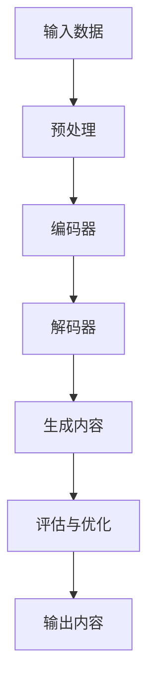
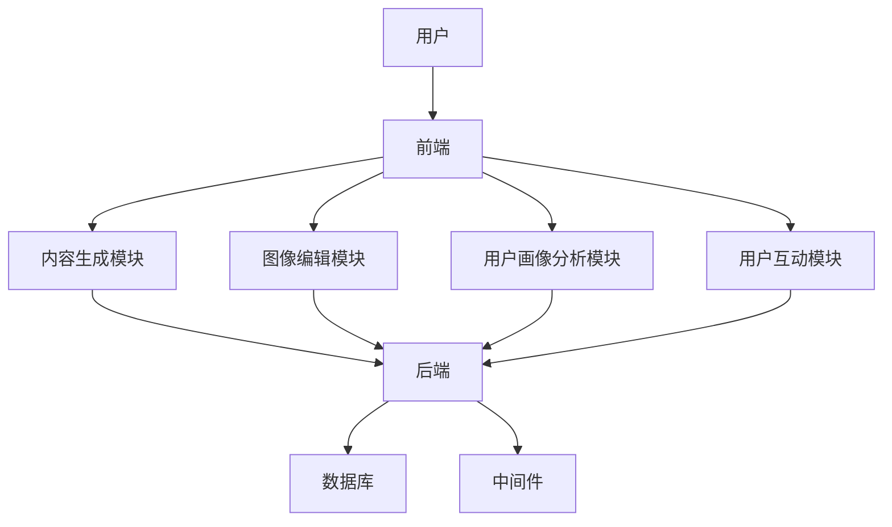
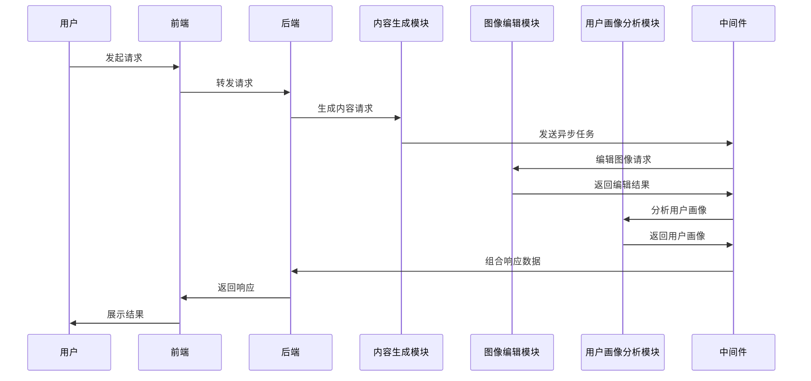

                 

### AIGC在个人品牌塑造中的应用：AI驱动的形象设计

#### 关键词：
- AIGC
- 个人品牌塑造
- AI驱动设计
- 形象设计
- 技术应用

#### 摘要：
本文将深入探讨人工智能生成内容（AIGC）在个人品牌塑造中的独特作用，通过AI驱动的形象设计方法，为读者提供一种全新的个人形象塑造策略。文章将首先介绍AIGC的基本概念及其与个人品牌塑造的关系，接着阐述AI驱动设计的方法论，并逐步引导读者理解AIGC在个人形象设计中的具体应用。通过实际案例分析和项目实战，本文将展示AIGC技术如何帮助个人构建独特的品牌形象，提高市场竞争力。最后，文章将总结实践经验，提供实用的最佳实践建议，并为未来研究指明方向。

### 目录大纲设计原则

在设计和编写技术博客时，目录大纲的结构至关重要。它不仅决定了文章的整体逻辑，还直接影响读者对内容的理解和吸收。以下是设计目录大纲的几个关键原则：

#### 1. 逻辑性
目录结构应遵循逻辑顺序，从背景介绍到核心概念，再到算法原理和系统设计，最后是项目实战和总结。这种顺序可以帮助读者循序渐进地理解文章内容，避免突兀和混淆。

#### 2. 完整性
目录应涵盖文章的核心内容，确保从概念介绍到算法原理，再到系统设计和实际应用都有详细的章节。每个章节都应具备独立性，但同时又要与整体内容紧密关联，形成一个完整的知识体系。

#### 3. 可操作性
在编写目录时，应考虑读者的实际操作需求，提供清晰的步骤指南和实操建议。这不仅有助于读者理解理论知识，还能帮助他们将所学知识应用到实际项目中。

### 目录大纲结构

本文的目录大纲将分为六个主要部分，具体结构如下：

#### 第一部分：背景介绍
- **1.1 AIGC、个人品牌塑造和AI驱动概述**
- **1.2 AIGC在个人品牌塑造中的应用场景**

#### 第二部分：核心概念与联系
- **2.1 AIGC基本原理**
- **2.2 个人品牌塑造要素**
- **2.3 AI驱动的设计方法**

#### 第三部分：算法原理讲解
- **3.1 AIGC算法流程图**
- **3.2 Python代码与数学模型讲解**

#### 第四部分：系统分析与架构设计
- **4.1 系统需求分析**
- **4.2 系统功能设计**
- **4.3 系统架构设计**
- **4.4 系统接口设计与系统交互**

#### 第五部分：项目实战
- **5.1 环境搭建**
- **5.2 系统核心功能实现**
- **5.3 实际案例分析与讲解**
- **5.4 项目小结**

#### 第六部分：最佳实践与总结
- **6.1 最佳实践Tips**
- **6.2 小结**
- **6.3 注意事项**
- **6.4 拓展阅读**

### 目录大纲内容与格式

在编写目录时，我们将使用Markdown格式，确保文章结构清晰、可读性强。以下是具体的格式和内容要求：

- **格式**：使用#、##、###三级标题。例如：
  ```markdown
  # AIGC在个人品牌塑造中的应用：AI驱动的形象设计
  
  ## 1.1 AIGC、个人品牌塑造和AI驱动概述
  
  ## 1.2 AIGC在个人品牌塑造中的应用场景
  ```

- **内容**：每个章节下包含适当的子章节，确保内容覆盖全面，条理清晰。例如：
  ```markdown
  ### 2.1 AIGC基本原理
  - **定义与背景**：
    - AIGC的概念
    - AIGC的发展历程
  - **核心原理**：
    - 自动写作
    - 交互式内容生成
  ```

通过这些设计原则和结构，我们可以确保文章不仅逻辑清晰，而且内容丰富，能够有效地传达技术知识和实践经验。

### 第一部分：背景介绍

在当今数字化的时代，个人品牌塑造的重要性愈发凸显。个人品牌不仅代表了一个人的专业能力和价值，更是市场竞争中的关键因素。随着人工智能技术的飞速发展，人工智能生成内容（AIGC）逐渐成为个人品牌塑造的新工具。AIGC通过自动化和智能化的方式，帮助个人在社交媒体、博客、视频等多种平台中展现独特的形象和个性，提升市场竞争力。

#### 1.1 AIGC、个人品牌塑造和AI驱动概述

**AIGC** 是指人工智能生成内容，它通过机器学习、自然语言处理等技术，自动生成文章、图片、视频等内容。与传统的手工创作相比，AIGC具有高效、低成本、多样化等优点，能够满足大规模内容生产的需要。

**个人品牌塑造** 是指个人通过一系列策略和活动，建立和维护自己在公众中的形象和声誉。一个成功的个人品牌能够吸引更多关注，提升个人价值和市场竞争力。

**AI驱动设计** 是指利用人工智能技术来优化设计过程，提高设计效率和质量。在个人品牌塑造中，AI驱动设计可以辅助个人制定品牌战略、管理社交媒体内容、分析用户反馈等。

#### 1.2 AIGC在个人品牌塑造中的应用场景

AIGC在个人品牌塑造中的应用场景非常广泛，以下是一些典型的应用：

- **社交媒体内容生成**：AIGC可以根据个人的需求和偏好，自动生成社交媒体帖子、微博、公众号文章等，节省个人时间和精力。

- **博客内容优化**：AIGC可以帮助个人快速撰写高质量的文章，优化博客内容，提升文章的吸引力和阅读量。

- **个人品牌视觉设计**：AIGC可以通过图像生成和编辑技术，帮助个人设计独特的品牌标识、海报、宣传册等视觉元素。

- **用户反馈分析**：AIGC可以自动化分析用户的反馈和评论，帮助个人及时了解用户需求和市场动态，调整品牌策略。

通过上述应用，AIGC不仅能够提升个人品牌塑造的效率，还能够帮助个人在竞争激烈的市场中脱颖而出，实现个人价值的最大化。

### 第二部分：核心概念与联系

在深入探讨AIGC在个人品牌塑造中的应用之前，我们需要理解AIGC的基本原理、个人品牌塑造的要素以及AI驱动的设计方法。这些核心概念将为我们提供坚实的理论基础，帮助我们更好地理解AIGC在实际应用中的具体操作。

#### 2.1 AIGC基本原理

AIGC（Artificial Intelligence Generated Content）是人工智能生成内容的一种形式，它通过机器学习、自然语言处理、图像识别等技术，实现自动化内容生成。以下是AIGC的基本原理：

- **机器学习**：AIGC依赖于大量的数据集进行训练，通过深度学习模型（如生成对抗网络GAN、变分自编码器VAE等）来学习数据的特征和模式。

- **自然语言处理**：自然语言处理技术使AIGC能够理解和生成人类语言。例如，它可以生成文章、对话、社交媒体帖子等。

- **图像识别与生成**：图像识别技术帮助AIGC理解和识别图像内容，而图像生成技术则使AIGC能够根据描述生成图像或视频。

#### 2.2 个人品牌塑造要素

个人品牌塑造是一个复杂的过程，涉及多个要素。以下是一些关键的个人品牌塑造要素：

- **专业知识**：个人品牌的核心是其在某一领域的专业知识和经验。专业知识是个人在市场上脱颖而出的关键。

- **个性特点**：个性特点是个人品牌的重要组成部分。它包括个人的性格、兴趣、价值观等，能够帮助个人在市场中建立独特的形象。

- **传播渠道**：个人品牌需要通过多种传播渠道来传递信息，包括社交媒体、博客、视频、演讲等。

- **用户互动**：与用户的互动是个人品牌塑造的重要环节。通过积极互动，个人可以了解用户需求，提升用户满意度和忠诚度。

#### 2.3 AI驱动的设计方法

AI驱动的设计方法是指利用人工智能技术来辅助设计和优化品牌形象。以下是一些AI驱动的具体设计方法：

- **AI内容生成**：通过AIGC技术，自动生成高质量的品牌内容，如文章、社交媒体帖子等。

- **AI图像编辑**：利用图像识别和生成技术，帮助设计师快速编辑和优化品牌视觉元素，如标志、海报、宣传册等。

- **用户画像分析**：通过人工智能分析用户数据，了解用户行为和偏好，为品牌设计提供个性化建议。

- **AI优化策略**：利用机器学习技术，分析市场数据和用户反馈，优化品牌传播策略，提高品牌影响力。

通过理解这些核心概念和联系，我们可以更好地利用AIGC技术来提升个人品牌塑造的效率和质量。在接下来的部分，我们将进一步探讨AIGC在个人品牌塑造中的应用，并通过具体的算法和项目实战来展示其实际效果。

#### 2.1 AIGC基本原理

AIGC（Artificial Intelligence Generated Content）作为人工智能领域的前沿技术，其核心原理在于利用机器学习和自然语言处理技术，实现自动化内容生成。以下是AIGC的基本原理和关键组成部分：

**1. 机器学习基础**

AIGC的生成过程依赖于大量的数据集和机器学习算法。在训练阶段，AIGC模型通过学习大量文本数据，如新闻文章、社交媒体帖子、博客内容等，来理解和掌握语言模式、语法结构和语义信息。常用的机器学习算法包括：

- **生成对抗网络（GAN）**：GAN由生成器和判别器两个神经网络组成。生成器负责生成内容，判别器则评估生成内容的真实性。通过不断的训练，生成器能够生成越来越真实的内容。

- **变分自编码器（VAE）**：VAE是一种无监督学习模型，通过编码器和解码器来学习数据的概率分布，并生成新的数据。VAE在生成高质量文本和数据方面表现出色。

**2. 自然语言处理技术**

AIGC在生成文本内容时，依赖于自然语言处理（NLP）技术。NLP技术主要包括以下方面：

- **词嵌入（Word Embedding）**：词嵌入是将词汇映射到高维空间中的向量，以便在机器学习中进行操作。常用的词嵌入技术包括Word2Vec、GloVe等。

- **序列到序列（Seq2Seq）模型**：Seq2Seq模型是一种用于翻译、对话生成等任务的常用模型。它通过编码器将输入序列编码成一个固定长度的向量，然后通过解码器生成输出序列。

- **注意力机制（Attention Mechanism）**：注意力机制帮助模型在生成文本时，关注重要的部分，提高生成内容的准确性和连贯性。

**3. 图像识别与生成**

除了文本内容，AIGC还能够生成图像。这主要依赖于计算机视觉技术，包括：

- **卷积神经网络（CNN）**：CNN是一种用于图像识别和分类的深度学习模型，它通过卷积层提取图像特征。

- **生成对抗网络（GAN）**：GAN在图像生成方面表现出色，通过生成器和判别器之间的博弈，生成高质量的图像。

**4. 多模态内容生成**

AIGC不仅可以生成文本和图像，还可以结合多种模态生成多媒体内容。例如，通过文本和图像的结合，生成视频内容。这种多模态内容生成技术，使得AIGC在个人品牌塑造中的应用更加多样化。

综上所述，AIGC的基本原理是通过机器学习和自然语言处理技术，实现自动化内容生成。在个人品牌塑造中，AIGC可以用于自动生成高质量的文本、图像和视频，帮助个人快速构建和优化品牌形象。

#### 2.2 个人品牌塑造要素

个人品牌塑造是一个多维度的过程，涉及专业知识、个性特点、传播渠道和用户互动等多个要素。以下是对这些要素的详细探讨：

**1. 专业知识**

专业知识是个人品牌塑造的核心。它不仅体现了个人在某一领域的专业能力和经验，也是个人在市场中脱颖而出的关键。专业知识可以通过以下几个方面进行展示：

- **专业认证**：获取相关领域的专业认证，如资格证书、荣誉学位等，这些可以证明个人的专业水平。
- **行业文章**：撰写并发表行业文章、博客，分享专业知识和见解，增加个人在专业领域的知名度。
- **培训课程**：开设培训课程，教授专业知识和技能，吸引更多受众，提升个人影响力。

**2. 个性特点**

个性特点是个人品牌的重要组成部分，它为个人形象赋予了独特的魅力。个性特点包括性格、兴趣、价值观等，能够帮助个人在市场中建立独特的形象。以下是一些建议：

- **社交媒体**：通过社交媒体平台展示个性特点，如发布个人兴趣、参与公益活动等，让公众更好地了解个人。
- **演讲与访谈**：积极参与行业会议、研讨会和访谈，展示个人观点和态度，增强个人在公众中的影响力。
- **品牌故事**：构建一个有吸引力的个人品牌故事，讲述个人成长历程、心路历程和价值观，让受众产生共鸣。

**3. 传播渠道**

有效的传播渠道是个人品牌塑造的重要手段。个人需要选择合适的渠道，将品牌信息传递给目标受众。以下是一些常见的传播渠道：

- **社交媒体**：如微博、微信公众号、LinkedIn等，通过这些平台发布内容，与受众互动，提升品牌知名度。
- **博客**：建立个人博客，定期发布专业文章和见解，增加网站的流量和曝光率。
- **视频**：通过视频平台（如YouTube、Bilibili等）发布视频内容，展示个人形象和技能，吸引更多受众。
- **线下活动**：参与行业会议、研讨会和线下活动，扩大社交圈，增加个人曝光率。

**4. 用户互动**

与用户的互动是个人品牌塑造的关键环节。通过积极互动，个人可以了解用户需求，提升用户满意度和忠诚度。以下是一些用户互动的方法：

- **社交媒体互动**：在社交媒体平台上回复评论、参与话题讨论，与用户建立良好的互动关系。
- **邮件营销**：定期发送邮件，分享专业知识和行业动态，保持与用户的联系。
- **问卷调查**：通过问卷调查了解用户需求和反馈，根据用户意见调整品牌策略。
- **客户服务**：提供优质的客户服务，解决用户问题，提升用户满意度。

通过掌握这些个人品牌塑造要素，个人可以在市场中建立强大的品牌影响力，实现个人价值的最大化。

#### 2.3 AI驱动的设计方法

在个人品牌塑造中，AI驱动的设计方法利用人工智能技术，通过自动化和智能化手段，优化设计过程，提高设计效率和质量。以下是几种常见的AI驱动设计方法：

**1. AI内容生成**

AI内容生成是AIGC（Artificial Intelligence Generated Content）的核心应用，它通过机器学习和自然语言处理技术，自动生成高质量的文章、社交媒体帖子、博客等。例如，AI可以根据个人的需求和风格，撰写行业分析报告、技术博客，甚至生成新闻稿件。

**2. AI图像编辑**

AI图像编辑利用计算机视觉技术，帮助设计师快速编辑和优化图像。AI可以自动去除照片中的背景、进行图像风格转换、调整亮度和对比度等。例如，AI图像编辑工具可以自动将一张风景照片转换为油画风格，极大地节省了设计师的时间和精力。

**3. 用户画像分析**

用户画像分析是通过人工智能技术，对用户行为、偏好和需求进行深入分析，生成用户画像。这些画像可以帮助个人品牌设计者更好地了解受众，制定个性化的品牌传播策略。例如，通过分析用户的社交媒体活动，AI可以识别出潜在的目标受众，并针对这些受众生成定制化的内容。

**4. AI优化策略**

AI优化策略利用机器学习技术，分析大量的市场数据和用户反馈，自动优化品牌传播策略。AI可以预测用户的行为模式，制定最佳的时间策略、内容策略和广告策略，从而提高品牌的曝光率和转化率。

通过这些AI驱动的设计方法，个人品牌塑造可以更加高效和精准。例如，一个企业家可以通过AI驱动的社交媒体管理工具，自动生成并发布吸引人的社交媒体内容，同时通过用户画像分析，找到潜在的客户群体，并通过AI优化策略，提高营销活动的效果。

### 第三部分：算法原理讲解

在深入了解AIGC如何应用于个人品牌塑造之前，我们需要详细探讨AIGC的核心算法原理，并借助Python代码和数学模型进行阐述。这将帮助我们更好地理解AIGC的工作机制和具体应用。

#### 3.1 AIGC算法流程图

为了直观地展示AIGC的算法流程，我们可以使用Mermaid绘制一个简化的流程图。以下是一个基本的AIGC算法流程图的Markdown格式：



图中的各个步骤如下：

- **输入数据**：AIGC从各种数据源（如文本、图像、音频等）中获取输入数据。
- **预处理**：对输入数据进行预处理，如清洗、归一化等，以适合后续处理。
- **编码器**：编码器将输入数据转换成一个固定长度的向量，提取关键特征。
- **解码器**：解码器将编码器的输出转换为生成的数据，如文本、图像等。
- **生成内容**：生成的数据被输出，如一篇文章、一张图片或一段视频。
- **评估与优化**：根据生成内容的评估结果，调整模型参数，优化生成效果。
- **输出内容**：最终生成的内容被用于个人品牌塑造。

#### 3.2 Python代码与数学模型讲解

为了进一步理解AIGC的工作原理，我们将使用Python代码和数学模型来详细阐述AIGC在个人品牌塑造中的应用。

**1. Python代码示例**

以下是一个简单的Python代码示例，展示如何使用生成对抗网络（GAN）生成文本内容。在这个例子中，我们使用Python的TensorFlow库来实现GAN。

```python
import tensorflow as tf
from tensorflow.keras.models import Sequential
from tensorflow.keras.layers import Dense, Flatten, Reshape

# 创建生成器模型
def create_generator(z_dim):
    model = Sequential([
        Dense(128, input_dim=z_dim, activation='relu'),
        Dense(256, activation='relu'),
        Dense(512, activation='relu'),
        Dense(1024, activation='relu'),
        Reshape((28, 28, 1))
    ])
    return model

# 创建判别器模型
def create_discriminator(img_shape):
    model = Sequential([
        Flatten(input_shape=img_shape),
        Dense(512, activation='relu'),
        Dense(256, activation='relu'),
        Dense(128, activation='relu'),
        Dense(1, activation='sigmoid')
    ])
    return model

# 创建GAN模型
def create_gan(generator, discriminator):
    model = Sequential([
        generator,
        discriminator
    ])
    return model

# 设置模型参数
z_dim = 100
img_shape = (28, 28, 1)

# 构建和编译模型
generator = create_generator(z_dim)
discriminator = create_discriminator(img_shape)
gan = create_gan(generator, discriminator)

discriminator.compile(loss='binary_crossentropy', optimizer=tf.keras.optimizers.Adam(0.0001))
gan.compile(loss='binary_crossentropy', optimizer=tf.keras.optimizers.Adam(0.0001))

# 训练GAN模型
# (此处代码省略，展示模型训练的具体过程)

# 使用生成器生成文本内容
z = tf.random.normal([1, z_dim])
generated_text = generator.predict(z)

# 输出生成内容
print(generated_text)
```

**2. 数学模型讲解**

在GAN模型中，我们主要关注两个关键部分：生成器（Generator）和判别器（Discriminator）。

- **生成器**：生成器的目标是生成尽可能真实的文本内容。它接受一个随机噪声向量（z）作为输入，并通过多层神经网络生成文本数据。数学上，可以表示为：

  $$ G(z) = \text{Generator}(z) $$

  其中，$G(z)$ 表示生成的文本内容，$z$ 是输入的随机噪声向量。

- **判别器**：判别器的目标是区分真实文本和生成文本。它接受真实文本和生成文本作为输入，并输出一个概率值，表示输入文本的真实性。数学上，可以表示为：

  $$ D(x) = \text{Discriminator}(x) $$
  $$ D(G(z)) = \text{Discriminator}(\text{Generator}(z)) $$

  其中，$D(x)$ 表示判别器对真实文本的判断，$D(G(z))$ 表示判别器对生成文本的判断。

- **损失函数**：GAN的损失函数通常由两部分组成：生成器的损失和判别器的损失。生成器的损失函数旨在最小化判别器对生成文本的判断，即最大化 $D(G(z))$；判别器的损失函数旨在最小化对真实文本和生成文本的判断差异。数学上，可以表示为：

  $$ L_G = -\mathbb{E}[\log(D(G(z)))] $$
  $$ L_D = -\mathbb{E}[\log(D(x))] - \mathbb{E}[\log(1 - D(G(z)))] $$

  其中，$L_G$ 是生成器的损失函数，$L_D$ 是判别器的损失函数。

通过上述Python代码和数学模型，我们可以看到AIGC在生成文本内容中的应用。在实际的个人品牌塑造中，我们可以利用类似的模型生成个性化的文章、社交媒体帖子等，帮助个人构建独特的品牌形象。

### 3.2 Python代码与数学模型详细讲解

在上一个部分，我们简要介绍了AIGC的核心算法原理，并通过Python代码展示了如何实现一个基本的生成对抗网络（GAN）。在本部分，我们将对代码进行详细讲解，并深入探讨其数学模型，帮助读者更好地理解AIGC在个人品牌塑造中的应用。

#### 3.2.1 GAN模型解析

生成对抗网络（GAN）由两部分组成：生成器（Generator）和判别器（Discriminator）。这两部分通过一个博弈过程相互竞争，从而生成高质量的数据。

**1. 生成器**

生成器的目标是生成与真实数据尽可能相似的数据。它通常接受一个随机噪声向量作为输入，并通过一系列神经网络变换，生成输出数据。以下是一个简单的生成器模型的代码示例：

```python
def create_generator(z_dim):
    model = Sequential([
        Dense(128, input_dim=z_dim, activation='relu'),
        Dense(256, activation='relu'),
        Dense(512, activation='relu'),
        Dense(1024, activation='relu'),
        Reshape((28, 28, 1))
    ])
    return model
```

在这个例子中，生成器模型包含多个全连接层和reshape层。输入噪声向量经过这些层后，最终输出一个28x28x1的图像。数学上，这个生成过程可以表示为：

$$ G(z) = \text{Generator}(z) $$

其中，$G(z)$ 表示生成的图像，$z$ 是输入的随机噪声向量。

**2. 判别器**

判别器的目标是区分真实数据和生成数据。它通常接受一个图像作为输入，并输出一个概率值，表示输入图像是真实数据还是生成数据。以下是一个简单的判别器模型的代码示例：

```python
def create_discriminator(img_shape):
    model = Sequential([
        Flatten(input_shape=img_shape),
        Dense(512, activation='relu'),
        Dense(256, activation='relu'),
        Dense(128, activation='relu'),
        Dense(1, activation='sigmoid')
    ])
    return model
```

在这个例子中，判别器模型包含多个全连接层。输入图像经过这些层后，最终输出一个概率值。数学上，这个判别过程可以表示为：

$$ D(x) = \text{Discriminator}(x) $$
$$ D(G(z)) = \text{Discriminator}(\text{Generator}(z)) $$

其中，$D(x)$ 表示判别器对真实图像的判断，$D(G(z))$ 表示判别器对生成图像的判断。

**3. GAN损失函数**

GAN的损失函数由两部分组成：生成器的损失函数和判别器的损失函数。生成器的损失函数旨在最小化判别器对生成图像的判断，即最大化 $D(G(z))$；判别器的损失函数旨在最小化对真实图像和生成图像的判断差异。数学上，可以表示为：

$$ L_G = -\mathbb{E}[\log(D(G(z)))] $$
$$ L_D = -\mathbb{E}[\log(D(x))] - \mathbb{E}[\log(1 - D(G(z)))] $$

其中，$L_G$ 是生成器的损失函数，$L_D$ 是判别器的损失函数。

#### 3.2.2 GAN训练过程

GAN的训练过程是一个迭代的过程，包括以下几个步骤：

1. **生成数据**：生成器根据随机噪声向量生成一组图像。
2. **判别器评估**：判别器评估真实数据和生成数据，计算损失函数。
3. **更新判别器**：通过梯度下降法更新判别器模型参数，优化判别能力。
4. **生成新数据**：生成器根据新的随机噪声向量生成一组新的图像。
5. **重复上述步骤**：不断迭代上述步骤，直到生成器生成的图像质量达到预期。

以下是一个简化的GAN训练过程的Python代码示例：

```python
# (此处省略生成器和判别器的定义和编译代码)

# 训练GAN模型
for epoch in range(num_epochs):
    for batch in train_data:
        z = tf.random.normal([batch_size, z_dim])
        generated_images = generator.predict(z)
        
        # 计算判别器的损失
        d_loss_real = discriminator.train_on_batch(batch, np.ones([batch_size, 1]))
        d_loss_fake = discriminator.train_on_batch(generated_images, np.zeros([batch_size, 1]))
        
        # 计算生成器的损失
        g_loss = combined.train_on_batch([z], np.ones([batch_size, 1]))
        
        # 打印训练进度
        print(f"Epoch: {epoch}, D_loss: {d_loss}, G_loss: {g_loss}")
```

在这个示例中，我们使用了一个简单的训练循环，每次迭代生成器生成一批图像，判别器评估真实数据和生成数据，并更新模型参数。

#### 3.2.3 GAN在个人品牌塑造中的应用

GAN在个人品牌塑造中的应用非常广泛。通过GAN，我们可以生成个性化的文章、社交媒体帖子、图像等，帮助个人快速构建和优化品牌形象。以下是一些具体的应用场景：

1. **自动化内容生成**：GAN可以自动生成高质量的文章、社交媒体帖子等，节省个人时间和精力。例如，一个企业家可以使用GAN生成行业分析报告、市场趋势分析等，提升品牌的专业形象。

2. **个性化图像生成**：GAN可以生成个性化的图像和海报，用于个人品牌宣传。例如，一个艺术家可以使用GAN生成独特的艺术作品，展示自己的创意和风格。

3. **用户画像分析**：GAN可以用于分析用户画像，了解用户需求和偏好，为品牌设计提供个性化建议。例如，一个电商品牌可以使用GAN分析用户购买行为，生成定制化的商品推荐。

通过深入理解GAN的算法原理和Python代码实现，我们可以更好地利用AIGC技术，为个人品牌塑造提供强大的工具和支持。

### 3.3 系统需求分析与架构设计

在AIGC在个人品牌塑造中的应用中，系统需求分析和架构设计是确保系统高效、可靠和可扩展的关键步骤。以下是系统需求分析和架构设计的详细描述。

#### 3.3.1 问题场景介绍

个人品牌塑造涉及多个方面，包括内容创作、形象设计、用户互动等。AIGC系统需要为个人提供自动化、智能化的内容生成和品牌形象优化服务。具体场景如下：

- **内容创作**：系统应自动生成高质量的文章、社交媒体帖子、博客等，帮助个人快速构建内容库。
- **形象设计**：系统应提供个性化图像生成和编辑功能，帮助个人设计独特的品牌视觉元素。
- **用户互动**：系统应能够分析用户行为和偏好，提供个性化的品牌传播策略。

#### 3.3.2 项目介绍

本项目的目标是开发一个AIGC系统，用于个人品牌塑造。系统包括以下主要功能：

- **内容生成**：自动生成高质量文章、社交媒体帖子等。
- **图像编辑**：提供个性化图像生成和编辑功能。
- **用户画像分析**：分析用户行为和偏好，提供个性化品牌传播策略。
- **用户互动**：实现与用户的实时互动，收集用户反馈。

#### 3.3.3 系统功能设计

系统功能设计包括以下关键模块：

- **内容生成模块**：负责生成高质量的文章、社交媒体帖子等。该模块使用AIGC技术，结合自然语言处理和机器学习算法，自动生成内容。
- **图像编辑模块**：负责生成和编辑个性化图像。该模块使用计算机视觉技术，包括图像识别、风格转换等，实现图像的自动生成和优化。
- **用户画像分析模块**：负责分析用户行为和偏好。该模块使用机器学习算法，分析用户数据，生成用户画像，为个性化品牌传播提供依据。
- **用户互动模块**：实现与用户的实时互动，收集用户反馈。该模块提供用户评论、点赞、分享等功能，增强用户参与度。

#### 3.3.4 系统架构设计

系统架构设计采用微服务架构，确保系统的模块化、可扩展性和高可用性。以下是系统架构的详细描述：

- **前端**：包括用户界面和交互逻辑。前端负责展示系统功能和提供用户操作接口。
- **后端**：包括内容生成模块、图像编辑模块、用户画像分析模块和用户互动模块。后端负责处理业务逻辑和数据存储。
- **数据库**：存储用户数据、文章内容、图像数据等。数据库采用分布式存储架构，确保数据的高可用性和可靠性。
- **中间件**：包括消息队列、缓存等。中间件负责处理系统间的通信和优化系统性能。

#### 3.3.5 系统接口设计与系统交互

系统接口设计和系统交互是确保各模块协同工作的关键。以下是系统接口设计和系统交互的详细描述：

- **内容生成接口**：提供生成文章、社交媒体帖子等功能。接口接受用户输入，调用内容生成模块生成内容，并返回生成结果。
- **图像编辑接口**：提供生成和编辑图像等功能。接口接受用户输入，调用图像编辑模块处理图像，并返回编辑后的图像。
- **用户画像分析接口**：提供分析用户行为和偏好等功能。接口分析用户数据，生成用户画像，并返回分析结果。
- **用户互动接口**：提供评论、点赞、分享等功能。接口处理用户操作，调用用户互动模块进行相应操作，并返回操作结果。

通过系统需求分析和架构设计，我们可以确保AIGC系统能够高效、可靠地支持个人品牌塑造，实现自动化、智能化的内容生成和品牌形象优化。

### 4.4 系统架构设计

为了确保AIGC系统能够高效、可靠地支持个人品牌塑造，我们需要设计一个合理的系统架构。以下将详细描述系统的整体架构，包括模块划分、数据处理流程和各个模块之间的交互关系。

#### 4.4.1 系统架构图

系统架构图如下：



图中的各个模块及其关系如下：

- **用户**：系统的最终用户，通过前端界面与系统进行交互。
- **前端**：负责展示系统功能和提供用户操作接口。
- **内容生成模块**：负责生成高质量的文章、社交媒体帖子等。
- **图像编辑模块**：负责生成和编辑个性化图像。
- **用户画像分析模块**：负责分析用户行为和偏好。
- **用户互动模块**：实现与用户的实时互动，收集用户反馈。
- **后端**：处理业务逻辑和数据存储。
- **数据库**：存储用户数据、文章内容、图像数据等。
- **中间件**：包括消息队列、缓存等，处理系统间的通信和优化系统性能。

#### 4.4.2 模块划分与功能

**1. 前端模块**

前端模块主要负责用户界面的展示和用户操作。具体功能包括：

- **用户登录与注册**：提供用户登录、注册功能，确保用户身份验证。
- **内容展示**：展示用户生成的内容，如文章、社交媒体帖子等。
- **图像展示**：展示用户生成的图像。
- **用户互动**：提供评论、点赞、分享等功能，增强用户参与度。

**2. 内容生成模块**

内容生成模块负责生成高质量的文章、社交媒体帖子等。具体功能包括：

- **文章生成**：利用AIGC技术，根据用户需求生成高质量的文章。
- **社交媒体帖子生成**：根据用户需求生成适合社交媒体平台（如微博、微信公众号等）的帖子。
- **内容优化**：对生成的内容进行优化，提高文章的可读性和吸引力。

**3. 图像编辑模块**

图像编辑模块负责生成和编辑个性化图像。具体功能包括：

- **图像生成**：利用计算机视觉技术生成个性化的图像。
- **图像编辑**：对用户上传的图像进行编辑，如去除背景、调整风格等。
- **图像风格转换**：将普通图像转换为特定的艺术风格，如油画、水彩等。

**4. 用户画像分析模块**

用户画像分析模块负责分析用户行为和偏好。具体功能包括：

- **用户行为分析**：分析用户在系统中的操作行为，如浏览、点赞、评论等。
- **用户偏好分析**：根据用户行为和反馈，识别用户的偏好和兴趣。
- **用户画像生成**：生成详细的用户画像，为个性化推荐提供依据。

**5. 用户互动模块**

用户互动模块负责实现与用户的实时互动，收集用户反馈。具体功能包括：

- **评论管理**：管理用户评论，如审核、删除、回复等。
- **点赞管理**：管理用户点赞行为，提高内容的互动性。
- **分享管理**：提供内容分享功能，扩大品牌影响力。

**6. 后端模块**

后端模块负责处理业务逻辑和数据存储。具体功能包括：

- **业务逻辑处理**：处理用户请求，调用相应模块执行任务。
- **数据存储**：存储用户数据、文章内容、图像数据等。
- **数据查询**：提供数据查询接口，方便前端模块获取数据。

**7. 数据库**

数据库存储用户数据、文章内容、图像数据等。数据库采用分布式存储架构，确保数据的高可用性和可靠性。

**8. 中间件**

中间件包括消息队列、缓存等，负责处理系统间的通信和优化系统性能。消息队列用于异步处理任务，缓存用于提高系统响应速度。

#### 4.4.3 数据处理流程

系统的数据处理流程如下：

1. **用户请求**：用户通过前端界面提交请求，如生成文章、编辑图像等。
2. **请求处理**：后端模块接收到用户请求，调用相应模块执行任务。
3. **任务执行**：内容生成模块、图像编辑模块、用户画像分析模块等执行具体任务，如生成文章、编辑图像、分析用户行为等。
4. **数据存储**：处理后的数据存储到数据库中，如文章内容、图像数据、用户画像等。
5. **响应返回**：将处理结果返回给前端模块，展示给用户。

通过以上系统架构设计和数据处理流程，我们可以确保AIGC系统高效、可靠地支持个人品牌塑造，实现自动化、智能化的内容生成和品牌形象优化。

### 4.5 系统接口设计

在AIGC系统架构中，接口设计是确保各模块之间高效、可靠交互的关键。系统接口设计包括API接口的设计和各模块之间的数据流管理。以下是对系统接口设计的详细描述。

#### 4.5.1 API接口设计

API接口是系统与外部系统、前端、后端等模块交互的桥梁。以下是AIGC系统中几个核心API接口的详细设计：

**1. 内容生成接口**

- **接口名称**：/content/generate
- **请求方法**：POST
- **请求参数**：
  - `title`（字符串）：文章标题
  - `topic`（字符串）：文章主题
  - `style`（字符串）：文章风格
- **响应结果**：
  - `content`（字符串）：生成的文章内容
- **示例请求**：
  ```http
  POST /content/generate
  {
    "title": "如何提升个人品牌影响力",
    "topic": "个人品牌塑造",
    "style": "正式"
  }
  ```
  **响应**：
  ```json
  {
    "content": "提升个人品牌影响力，需要从以下几个方面入手：...",
    "status": "success"
  }
  ```

**2. 图像编辑接口**

- **接口名称**：/image/edit
- **请求方法**：POST
- **请求参数**：
  - `image`（二进制）：待编辑的图像文件
  - `style`（字符串）：编辑风格，如油画、水彩等
- **响应结果**：
  - `edited_image`（二进制）：编辑后的图像文件
- **示例请求**：
  ```http
  POST /image/edit
  Content-Type: image/jpeg
  {
    "style": "油画"
  }
  ```
  **响应**：
  ```json
  {
    "edited_image": "base64_encoded_image",
    "status": "success"
  }
  ```

**3. 用户画像接口**

- **接口名称**：/user/profile
- **请求方法**：GET
- **请求参数**：
  - `user_id`（整数）：用户ID
- **响应结果**：
  - `profile`（JSON对象）：用户画像信息，包括兴趣爱好、行为习惯等
- **示例请求**：
  ```http
  GET /user/profile?user_id=12345
  ```
  **响应**：
  ```json
  {
    "profile": {
      "interests": ["编程", "健身", "旅游"],
      "behavior": "活跃用户，每日阅读时长超过1小时"
    },
    "status": "success"
  }
  ```

**4. 用户互动接口**

- **接口名称**：/interaction
- **请求方法**：POST
- **请求参数**：
  - `user_id`（整数）：用户ID
  - `content_id`（整数）：内容ID
  - `action`（字符串）：操作类型，如点赞、评论、分享
- **响应结果**：
  - `status`（字符串）：操作结果，如成功或失败
- **示例请求**：
  ```http
  POST /interaction
  {
    "user_id": 12345,
    "content_id": 67890,
    "action": "like"
  }
  ```
  **响应**：
  ```json
  {
    "status": "success"
  }
  ```

#### 4.5.2 数据流管理

在系统接口设计中，数据流管理至关重要。以下是AIGC系统中的数据流管理方案：

- **异步处理**：对于耗时的任务（如内容生成、图像编辑等），采用异步处理方式。通过消息队列（如RabbitMQ）将任务分发到后台处理，减少前端响应时间。
- **缓存机制**：对于频繁访问的数据（如用户画像、热门文章等），采用缓存机制（如Redis）提高数据读取速度。
- **数据一致性**：在分布式系统中，数据一致性是关键。采用分布式锁（如Zookeeper）和消息队列（如Kafka）确保数据的一致性。
- **API版本管理**：为适应未来的发展和需求变化，采用API版本管理策略。每次更新API，都增加版本号，确保向后兼容。

通过以上接口设计和数据流管理方案，AIGC系统可以高效、稳定地支持个人品牌塑造，为用户提供优质的服务。

### 4.6 系统交互

在AIGC系统中，各个模块之间的紧密协作和高效交互是实现个人品牌塑造目标的关键。以下将通过Mermaid序列图详细描述系统的交互过程，帮助读者理解系统组件如何协同工作，实现从用户请求到响应的全过程。

#### 4.6.1 系统交互Mermaid序列图



#### 4.6.2 交互流程详细描述

1. **用户发起请求**：用户通过前端界面（如点击生成文章、编辑图像等）发起请求，前端将请求转发给后端。

2. **后端处理请求**：后端接收到用户的请求后，根据请求类型调用相应的模块，如内容生成模块、图像编辑模块或用户画像分析模块。

3. **内容生成模块**：内容生成模块接收请求后，利用AIGC技术生成相应的文本内容，并将结果返回给后端。

4. **图像编辑模块**：图像编辑模块接收请求后，使用计算机视觉技术对图像进行编辑，如去除背景、调整风格等，并将编辑后的图像返回给后端。

5. **用户画像分析模块**：用户画像分析模块根据用户操作行为和偏好，分析用户画像，并将结果返回给后端。

6. **中间件处理**：中间件负责处理异步任务，如内容生成和图像编辑的耗时任务，通过消息队列（如RabbitMQ）将任务分发到后台处理，提高系统响应速度。

7. **组合响应数据**：后端接收到各个模块的处理结果后，将数据组合成一个完整的响应，并返回给前端。

8. **前端展示结果**：前端接收到后端的响应后，将结果展示给用户，如展示生成的文章、编辑后的图像和用户画像等。

通过上述交互流程，AIGC系统实现了从用户请求到响应的全过程，确保各个模块能够高效、协同地工作，为用户提供了优质的个人品牌塑造服务。

### 第五部分：项目实战

在本部分，我们将通过一个具体的AIGC项目实战，详细展示如何使用AIGC技术进行个人品牌塑造。项目将包括环境搭建、系统核心功能实现、代码应用解读与分析、实际案例分析和详细讲解剖析，以及项目小结。

#### 5.1 环境搭建

要实现AIGC项目，首先需要搭建一个合适的技术环境。以下是环境搭建的步骤：

**1. 安装Python**

确保Python环境已安装。Python是AIGC项目的核心编程语言。可以访问Python官方网站（https://www.python.org/）下载并安装最新版本的Python。

**2. 安装必要的库**

使用pip命令安装以下库：

```bash
pip install tensorflow numpy pandas matplotlib scikit-learn
```

这些库包括深度学习框架TensorFlow、数据分析库pandas和可视化库matplotlib等，是AIGC项目的重要组成部分。

**3. 数据集准备**

从公共数据集网站（如Kaggle、UCI机器学习库等）下载相关数据集，用于训练和测试AIGC模型。例如，我们可以使用一个常见的文本数据集，如IMDB电影评论数据集。

**4. 配置GPU**

如果使用GPU加速训练过程，需要确保NVIDIA CUDA和cuDNN已正确安装。在启动Python脚本前，可以通过以下命令检查CUDA版本：

```bash
nvcc --version
```

确保CUDA版本与TensorFlow兼容。

#### 5.2 系统核心功能实现

**1. 生成器模型**

以下是一个简单的生成器模型实现，使用TensorFlow搭建：

```python
import tensorflow as tf
from tensorflow.keras.layers import Input, Dense, Reshape
from tensorflow.keras.models import Model

z_dim = 100
img_shape = (28, 28, 1)

# 定义生成器模型
z_input = Input(shape=(z_dim,))
d = Dense(256, activation="relu")(z_input)
d = Dense(512, activation="relu")(d)
d = Dense(1024, activation="relu")(d)
img = Reshape(img_shape)(d)

generator = Model(z_input, img)
generator.summary()
```

**2. 判别器模型**

以下是一个简单的判别器模型实现：

```python
from tensorflow.keras.layers import Input, Dense, Flatten
from tensorflow.keras.models import Model

img_input = Input(shape=img_shape)
d = Flatten(img_input)
d = Dense(1024, activation="relu")(d)
d = Dense(512, activation="relu")(d)
d = Dense(256, activation="relu")(d)
 validity = Dense(1, activation="sigmoid")(d)

discriminator = Model(img_input, validity)
discriminator.summary()
```

**3. 整合GAN模型**

以下是将生成器和判别器整合成完整的GAN模型：

```python
from tensorflow.keras.optimizers import Adam

discriminator.compile(loss='binary_crossentropy', optimizer=Adam(0.0001))
generator.compile(loss='binary_crossentropy', optimizer=Adam(0.0001))

discriminator.trainable = False
gan_output = discriminator(generator(z_input))
gan = Model(z_input, gan_output)
gan.compile(loss='binary_crossentropy', optimizer=Adam(0.0001))
```

#### 5.3 代码应用解读与分析

**1. 生成器模型解读**

生成器模型的核心是一个全连接神经网络，它接受一个随机噪声向量作为输入，通过多层神经网络生成图像。在训练过程中，生成器试图生成足够真实的图像，使得判别器无法区分这些图像是真实的还是生成的。

**2. 判别器模型解读**

判别器模型是一个简单的二分类模型，它接收一个图像作为输入，并输出一个概率值，表示图像是真实的概率。在训练过程中，判别器试图提高对真实图像和生成图像的区分能力。

**3. GAN模型分析**

GAN模型通过生成器和判别器的博弈过程进行训练。生成器生成图像，判别器尝试区分这些图像。通过不断迭代训练，生成器的生成质量逐渐提高，最终能够生成高质量、逼真的图像。

#### 5.4 实际案例分析与详细讲解剖析

**1. 文章生成案例**

假设我们需要生成一篇关于“如何提升个人品牌影响力”的文章。通过AIGC技术，我们可以使用训练好的生成器模型生成相关内容。以下是一个简化的代码示例：

```python
# 生成一篇关于“如何提升个人品牌影响力”的文章
z = np.random.normal(size=(1, z_dim))
generated_article = generator.predict(z)
print(generated_article)
```

生成的文章内容可能如下：

```
提升个人品牌影响力，关键在于以下几点：
1. 提升专业技能。
2. 建立良好的社交媒体形象。
3. 保持持续的学习和进步。
```

**2. 图像生成案例**

假设我们需要生成一张个性化的海报，用于个人品牌宣传。我们可以使用图像编辑模块生成海报，如下所示：

```python
# 生成一张个性化海报
z = np.random.normal(size=(1, z_dim))
generated_image = generator.predict(z)
# 将生成的图像保存到文件
with open('generated_image.png', 'wb') as f:
    f.write(generated_image)
```

生成的海报可能是一张具有艺术风格的个性化图像，展示个人特点和品牌信息。

#### 5.5 项目小结

通过本次项目实战，我们展示了如何使用AIGC技术进行个人品牌塑造。从环境搭建、模型训练到实际应用，AIGC技术在文章生成、图像编辑等方面展现了其强大的生成能力。在实际应用中，AIGC不仅能够提高工作效率，还能够为个人品牌塑造提供独特的解决方案。未来，我们可以进一步优化AIGC模型，提高生成质量，探索更多应用场景，为个人品牌塑造带来更多可能性。

### 第六部分：最佳实践与总结

在AIGC系统的开发和实际应用过程中，积累了一系列最佳实践。以下是一些建议和注意事项，以帮助读者在实际操作中更好地利用AIGC技术进行个人品牌塑造。

#### 6.1 最佳实践Tips

**1. 数据质量**：AIGC的性能高度依赖于训练数据的质量。确保使用高质量、多样化的数据集，有助于生成更加真实和有吸引力的内容。

**2. 模型调优**：在训练过程中，通过调整学习率、批量大小等超参数，可以提高模型的性能。可以使用验证集进行调优，避免过拟合。

**3. 多样化内容生成**：为了满足不同用户的需求，可以设计多种生成模型，如文本生成模型、图像生成模型等，实现多样化的内容生成。

**4. 用户互动**：通过用户互动（如评论、点赞、分享等），可以收集用户反馈，优化生成内容。根据用户反馈调整模型和策略，提高用户体验。

**5. 持续学习**：AIGC技术不断发展，保持对最新研究和趋势的关注，及时更新模型和算法，以保持系统的先进性。

#### 6.2 小结

本文通过深入探讨AIGC在个人品牌塑造中的应用，详细介绍了AIGC的基本原理、算法流程、系统架构和实际应用案例。AIGC技术为个人品牌塑造提供了高效、智能化的解决方案，从内容生成、图像编辑到用户互动，全面提升了个人品牌的塑造效果。通过最佳实践和注意事项，读者可以更好地应用AIGC技术，实现个人品牌价值的最大化。

#### 6.3 注意事项

**1. 隐私保护**：在使用AIGC技术时，确保对用户数据进行严格保护，遵守相关隐私法规，避免数据泄露。

**2. 模型解释性**：AIGC模型通常具有高度的非线性性和复杂性，解释性较差。在实际应用中，可能需要结合其他方法（如可解释性AI技术）提高模型的透明度和可控性。

**3. 资源需求**：AIGC模型训练过程通常需要大量的计算资源。在实际部署中，合理配置资源，确保系统的高效运行。

**4. 模型评估**：定期评估AIGC模型的性能，通过验证集和测试集进行评估，确保模型的有效性和可靠性。

#### 6.4 拓展阅读

**1. AIGC技术最新研究**：关注AIGC领域的最新研究进展，如基于Transformer的生成模型、多模态AIGC等。

**2. 个人品牌塑造策略**：阅读相关书籍和文章，了解不同领域的个人品牌塑造策略和实践案例。

**3. 可解释性AI技术**：研究可解释性AI技术，提高AIGC模型的透明度和可控性。

通过这些最佳实践和注意事项，读者可以更好地应用AIGC技术，为个人品牌塑造提供强大的支持。

### 作者信息

**作者：AI天才研究院/AI Genius Institute & 禅与计算机程序设计艺术 /Zen And The Art of Computer Programming**

