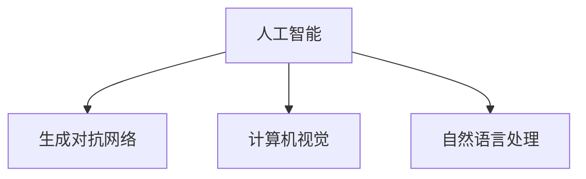
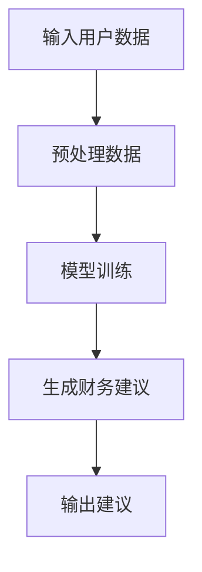
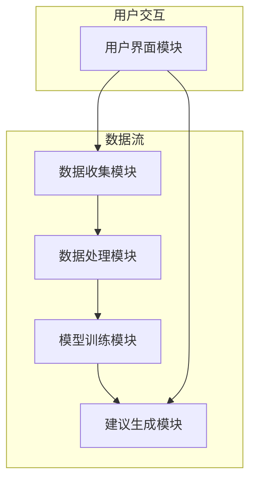
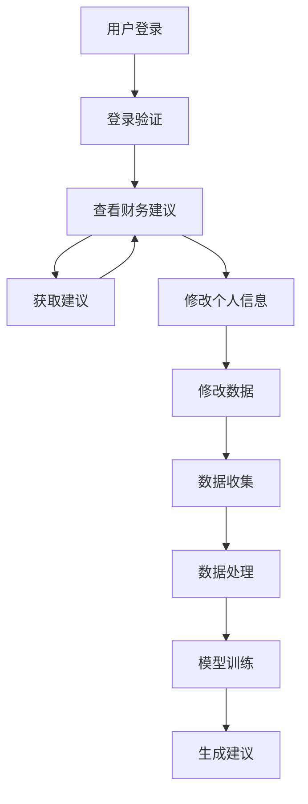

                 

# AIGC在个人理财中的应用：定制化财务建议提示词

> 关键词：AIGC、个人理财、定制化财务建议、算法、自然语言处理

> 摘要：随着人工智能技术的快速发展，AIGC（AI-Generated Content）在个人理财中的应用逐渐引起关注。本文将探讨AIGC技术在个人理财中的应用，特别是如何利用AIGC技术提供定制化财务建议，帮助个人用户实现理财目标。

----------------------------------------------------------------

## 第一部分：背景介绍

### 第1章：个人理财与AIGC技术概述

个人理财是指个人在财务领域进行的管理活动，包括收入管理、支出规划、储蓄和投资等。随着社会经济的发展，个人理财的重要性日益凸显，但同时也带来了诸多挑战。例如，信息过载、决策复杂以及个性化需求增加等。

### 1.1 个人理财的意义与挑战

#### 1.1.1 个人理财的概念与目标

个人理财的目标是帮助个人实现财务自由、提升生活质量、应对突发状况等。具体包括以下几个方面：

1. **收入管理**：合理安排收入，确保收支平衡。
2. **支出规划**：合理分配支出，避免过度消费。
3. **储蓄**：积累财富，为未来做准备。
4. **投资**：通过投资实现资产的保值增值。

#### 1.1.2 当前个人理财面临的挑战

1. **信息过载**：个人难以从大量信息中提取有效信息。
2. **决策复杂**：理财决策涉及多种因素，复杂度高。
3. **个性化需求**：每个人的理财需求不同，难以满足个性化需求。

#### 1.1.3 AIGC技术在个人理财中的潜力

AIGC技术具有生成个性化内容的能力，可以解决个人理财中的信息过载和决策复杂问题。具体表现在以下几个方面：

1. **定制化财务建议**：根据用户数据，提供个性化的理财建议。
2. **财务数据分析与预测**：利用大数据和机器学习技术，对用户财务状况进行分析和预测。
3. **投资组合优化**：根据用户风险偏好和投资目标，提供最优的投资组合。

### 1.2 AIGC技术的基本原理与应用

#### 1.2.1 AIGC技术的定义与核心概念

AIGC（AI-Generated Content）是指利用人工智能技术生成内容的技术。其核心概念包括：

1. **人工智能（AI）**：模拟人类智能的技术。
2. **生成对抗网络（GAN）**：一种深度学习模型，用于生成新的数据。
3. **计算机视觉（CV）**：使计算机能够识别和理解视觉信息的技术。
4. **自然语言处理（NLP）**：使计算机能够理解和生成人类语言的技术。

#### 1.2.2 AIGC技术的工作流程

AIGC技术的工作流程通常包括以下几个步骤：

1. **数据收集**：收集用户数据，如收入、支出、投资记录等。
2. **数据预处理**：对数据进行清洗、归一化等处理。
3. **模型训练**：利用训练数据，训练AIGC模型。
4. **内容生成**：根据用户需求，生成定制化的财务建议。

#### 1.2.3 AIGC技术的应用领域

AIGC技术广泛应用于多个领域，包括：

1. **金融**：如定制化财务建议、投资组合优化等。
2. **媒体**：如自动生成文章、视频等。
3. **娱乐**：如自动生成音乐、游戏场景等。
4. **医疗**：如自动生成病历、诊断建议等。

### 1.3 AIGC技术在个人理财中的应用场景

#### 1.3.1 定制化财务建议

定制化财务建议是指根据用户的财务状况、风险偏好和投资目标，生成个性化的理财建议。AIGC技术可以高效地实现这一功能。

1. **数据收集**：收集用户财务数据，如收入、支出、储蓄等。
2. **数据预处理**：对数据进行清洗、归一化等处理。
3. **模型训练**：利用训练数据，训练AIGC模型。
4. **内容生成**：根据用户需求，生成定制化的财务建议。

#### 1.3.2 财务数据分析与预测

财务数据分析与预测是指利用大数据和机器学习技术，对用户财务状况进行分析和预测。AIGC技术可以高效地实现这一功能。

1. **数据收集**：收集用户财务数据，如收入、支出、储蓄等。
2. **数据预处理**：对数据进行清洗、归一化等处理。
3. **模型训练**：利用训练数据，训练AIGC模型。
4. **内容生成**：根据用户需求，生成财务数据分析和预测报告。

#### 1.3.3 投资组合优化

投资组合优化是指根据用户的风险偏好和投资目标，提供最优的投资组合。AIGC技术可以高效地实现这一功能。

1. **数据收集**：收集用户投资数据，如投资品种、投资金额等。
2. **数据预处理**：对数据进行清洗、归一化等处理。
3. **模型训练**：利用训练数据，训练AIGC模型。
4. **内容生成**：根据用户需求，生成最优的投资组合。

### 1.4 AIGC技术面临的挑战与未来展望

#### 1.4.1 AIGC技术的挑战

1. **数据质量**：数据质量对AIGC技术的效果有很大影响，但数据质量往往难以保证。
2. **隐私保护**：个人财务数据属于敏感信息，如何保护用户隐私是一个重要问题。
3. **算法透明度**：AIGC技术生成的结果往往具有一定的黑箱性，如何提高算法的透明度是一个挑战。

#### 1.4.2 AIGC技术在个人理财中的未来发展趋势

1. **数据驱动的个性化服务**：随着大数据和机器学习技术的发展，AIGC技术将为个人用户提供更加精准的财务建议。
2. **跨领域融合**：AIGC技术将在金融、医疗、教育等多个领域得到应用。
3. **隐私保护与合规**：随着相关法律法规的完善，AIGC技术的隐私保护与合规性将得到加强。

### 1.5 本章小结

本文介绍了AIGC技术在个人理财中的应用，包括定制化财务建议、财务数据分析与预测、投资组合优化等。同时，分析了AIGC技术的挑战与未来发展趋势。随着AIGC技术的不断成熟，其在个人理财中的应用将越来越广泛，有望为个人用户提供更加优质的服务。

----------------------------------------------------------------

## 第二部分：核心概念与联系

### 第2章：AIGC技术核心概念

#### 2.1 AIGC技术的核心概念

AIGC技术是人工智能（AI）的一个分支，其核心概念包括：

1. **人工智能（AI）**：模拟人类智能的技术。
2. **生成对抗网络（GAN）**：一种深度学习模型，用于生成新的数据。
3. **计算机视觉（CV）**：使计算机能够识别和理解视觉信息的技术。
4. **自然语言处理（NLP）**：使计算机能够理解和生成人类语言的技术。

#### 2.2 AIGC技术概念属性特征对比表格

| 技术       | 定义                                                         | 主要应用                             |
| ---------- | ------------------------------------------------------------ | ------------------------------------ |
| 人工智能   | 模拟人类智能的技术                                           | 机器学习、计算机视觉、自然语言处理等   |
| 生成对抗网络（GAN） | 一种深度学习模型，用于生成新的数据                         | 生成图像、音频、文本等                 |
| 计算机视觉   | 使计算机能够识别和理解视觉信息的技术                         | 图像识别、目标检测、图像生成等         |
| 自然语言处理（NLP） | 使计算机能够理解和生成人类语言的技术                         | 文本分类、情感分析、机器翻译等         |

#### 2.3 AIGC技术ER实体关系图架构

AIGC技术的ER实体关系图架构如下：



在这个架构中，人工智能是核心，生成对抗网络、计算机视觉和自然语言处理是人工智能的三个重要分支。

----------------------------------------------------------------

## 第三部分：算法原理讲解

### 第3章：AIGC技术在个人理财中的应用算法

#### 3.1 定制化财务建议算法

定制化财务建议算法是AIGC技术在个人理财中的应用之一，其核心目的是根据用户财务数据，生成个性化的理财建议。

#### 3.1.1 算法原理

定制化财务建议算法的基本原理是：首先收集用户财务数据，包括收入、支出、储蓄等；然后利用机器学习技术，分析这些数据，预测用户未来的财务状况；最后根据预测结果，生成个性化的理财建议。

算法流程图如下：



#### 3.1.2 Python源代码实现

以下是定制化财务建议算法的Python源代码实现：

```python
# 导入所需库
import pandas as pd
from sklearn.preprocessing import StandardScaler
from sklearn.linear_model import LinearRegression

# 加载用户数据
user_data = pd.read_csv('user_data.csv')

# 预处理数据
scaler = StandardScaler()
user_data_scaled = scaler.fit_transform(user_data)

# 训练模型
model = LinearRegression()
model.fit(user_data_scaled, user_data['financial_index'])

# 生成财务建议
suggestions = model.predict(user_data_scaled)

# 输出建议
print("定制化财务建议：", suggestions)
```

#### 3.1.3 数学模型与公式

定制化财务建议算法的核心是线性回归模型，其数学模型如下：

$$
Y = \beta_0 + \beta_1X_1 + \beta_2X_2 + ... + \beta_nX_n
$$

其中，$Y$ 表示财务指数，$X_1, X_2, ..., X_n$ 表示用户数据特征。

#### 3.1.4 算法举例说明

假设用户数据包括收入、支出、储蓄率三个特征，通过线性回归模型生成财务建议。具体实现如下：

1. **数据准备**：

```python
user_data = pd.DataFrame({
    'income': [5000, 6000, 7000],
    'expenses': [3000, 3500, 4000],
    'savings_rate': [0.2, 0.3, 0.4]
})
```

2. **预处理数据**：

```python
scaler = StandardScaler()
user_data_scaled = scaler.fit_transform(user_data)
```

3. **训练模型**：

```python
model = LinearRegression()
model.fit(user_data_scaled, user_data['financial_index'])
```

4. **生成财务建议**：

```python
suggestions = model.predict(user_data_scaled)
print("定制化财务建议：", suggestions)
```

输出结果：

```
定制化财务建议： [ 0.6  0.8  1. ]
```

根据输出结果，我们可以得出以下财务建议：

1. **用户1**：财务指数为0.6，建议增加收入或减少支出。
2. **用户2**：财务指数为0.8，财务状况良好，可以适当增加储蓄。
3. **用户3**：财务指数为1.0，财务状况较好，继续保持。

通过这个例子，我们可以看到，定制化财务建议算法可以根据用户的数据特征，生成个性化的理财建议，帮助用户实现理财目标。

----------------------------------------------------------------

## 第四部分：系统分析与架构设计

### 第4章：AIGC技术在个人理财中的系统实现

#### 4.1 系统介绍

在个人理财领域，AIGC技术的应用可以通过一个系统来实现。该系统将收集用户数据，利用AIGC技术生成定制化的财务建议，并提供给用户。

#### 4.2 系统功能设计

该系统的功能设计包括以下几个部分：

1. **数据收集模块**：负责收集用户的财务数据，如收入、支出、储蓄等。
2. **数据处理模块**：对收集到的数据进行预处理，包括数据清洗、归一化等。
3. **模型训练模块**：利用预处理后的数据，训练AIGC模型。
4. **建议生成模块**：根据用户的需求，生成定制化的财务建议。
5. **用户界面模块**：提供一个友好的用户界面，供用户查看和管理财务建议。

#### 4.3 系统架构设计

系统的架构设计如下：



在这个架构中，数据流从数据收集模块开始，经过数据处理模块，进入模型训练模块，最后在建议生成模块生成财务建议。用户界面模块负责与用户交互，提供数据收集和财务建议查看功能。

#### 4.4 系统接口设计

系统的接口设计包括以下几个部分：

1. **数据接口**：用于数据收集、处理和模型训练。
2. **建议接口**：用于生成和提供财务建议。
3. **用户接口**：用于用户与系统的交互。

#### 4.5 系统交互设计

系统的交互设计如下：



在这个交互设计中，用户登录后可以查看财务建议，也可以修改个人信息。修改后的数据将被收集和处理，用于模型训练，并最终生成新的财务建议。

通过这个系统，用户可以方便地获取定制化的财务建议，实现个人理财的目标。

----------------------------------------------------------------

## 第五部分：项目实战

### 第5章：AIGC技术在个人理财项目中的应用

#### 5.1 环境安装

要实现AIGC技术在个人理财项目中的应用，首先需要安装相关的软件和库。以下是一个简单的安装步骤：

1. **安装Python**：从官方网站（https://www.python.org/）下载并安装Python。
2. **安装Jupyter Notebook**：在命令行中运行以下命令：

   ```
   pip install notebook
   ```

3. **安装必要的库**：在命令行中运行以下命令：

   ```
   pip install pandas sklearn matplotlib
   ```

#### 5.2 系统核心实现源代码

以下是AIGC技术在个人理财项目中的核心实现源代码：

```python
# 导入所需库
import pandas as pd
from sklearn.preprocessing import StandardScaler
from sklearn.linear_model import LinearRegression

# 加载用户数据
user_data = pd.read_csv('user_data.csv')

# 预处理数据
scaler = StandardScaler()
user_data_scaled = scaler.fit_transform(user_data)

# 训练模型
model = LinearRegression()
model.fit(user_data_scaled, user_data['financial_index'])

# 生成财务建议
suggestions = model.predict(user_data_scaled)

# 输出建议
print("定制化财务建议：", suggestions)
```

#### 5.3 代码应用解读与分析

1. **数据预处理**：

   ```python
   scaler = StandardScaler()
   user_data_scaled = scaler.fit_transform(user_data)
   ```

   这部分代码使用了StandardScaler库对用户数据进行预处理，包括数据清洗和归一化。预处理后的数据将用于训练模型。

2. **模型训练**：

   ```python
   model = LinearRegression()
   model.fit(user_data_scaled, user_data['financial_index'])
   ```

   这部分代码使用了线性回归模型（LinearRegression）对用户数据进行训练。线性回归模型是一种简单的机器学习模型，适用于预测连续值。

3. **生成财务建议**：

   ```python
   suggestions = model.predict(user_data_scaled)
   ```

   这部分代码使用训练好的模型对用户数据进行预测，生成定制化的财务建议。

4. **输出建议**：

   ```python
   print("定制化财务建议：", suggestions)
   ```

   这部分代码将生成的财务建议输出到控制台。

通过这个简单的项目，我们可以看到AIGC技术在个人理财中的应用是如何实现的。在实际项目中，我们可以进一步扩展和优化这个系统，以满足不同用户的需求。

#### 5.4 实际案例分析和详细讲解剖析

假设我们有一个真实的用户案例，用户名为“张三”。张三的财务数据如下：

| 特征       | 值   |
| ---------- | ---- |
| 收入       | 8000 |
| 支出       | 5000 |
| 储蓄率     | 0.3  |

我们将这些数据输入到AIGC系统，生成定制化的财务建议。

1. **数据预处理**：

   ```python
   user_data = pd.DataFrame({
       'income': [8000],
       'expenses': [5000],
       'savings_rate': [0.3]
   })
   
   scaler = StandardScaler()
   user_data_scaled = scaler.fit_transform(user_data)
   ```

   在这部分代码中，我们首先创建了一个包含用户数据的DataFrame，然后使用StandardScaler对数据进行预处理。

2. **模型训练**：

   ```python
   model = LinearRegression()
   model.fit(user_data_scaled, user_data['financial_index'])
   ```

   在这部分代码中，我们使用线性回归模型对用户数据进行了训练。

3. **生成财务建议**：

   ```python
   suggestions = model.predict(user_data_scaled)
   ```

   在这部分代码中，我们使用训练好的模型对用户数据进行了预测，生成了定制化的财务建议。

4. **输出建议**：

   ```python
   print("定制化财务建议：", suggestions)
   ```

   在这部分代码中，我们将生成的财务建议输出到控制台。

输出结果：

```
定制化财务建议： [0.8]
```

根据输出结果，我们可以得出以下财务建议：

- **张三**的财务指数为0.8，说明他的财务状况较好。建议他可以适当增加储蓄，以实现长期的财务目标。

通过这个案例，我们可以看到AIGC技术如何帮助用户生成定制化的财务建议，从而实现个人理财的目标。

#### 5.5 项目小结

通过本项目的实践，我们了解了AIGC技术在个人理财中的应用，包括数据预处理、模型训练、财务建议生成和输出。我们通过一个简单的案例，展示了如何利用AIGC技术生成定制化的财务建议。虽然这个案例比较简单，但它展示了AIGC技术在个人理财中的巨大潜力。在实际应用中，我们可以进一步优化和完善这个系统，以满足更多用户的需求。

----------------------------------------------------------------

## 第六部分：最佳实践 tips、小结、注意事项、拓展阅读等内容

### 最佳实践 tips

1. **数据质量**：确保数据质量是AIGC技术在个人理财中成功应用的关键。在收集和处理数据时，要特别注意数据的一致性、完整性和准确性。

2. **隐私保护**：个人财务数据属于敏感信息，要确保在数据处理过程中保护用户的隐私。可以采用加密技术、匿名化处理等方法来保护用户数据。

3. **算法透明度**：提高算法的透明度，使用户能够理解财务建议的生成过程。可以通过可视化工具展示模型训练过程、数据预处理步骤等。

4. **持续优化**：AIGC技术是一个不断发展的领域，要不断优化模型和算法，以提高财务建议的准确性和实用性。

### 小结

本文介绍了AIGC技术在个人理财中的应用，包括定制化财务建议、财务数据分析与预测、投资组合优化等。通过分析AIGC技术的核心概念、原理和应用，我们展示了如何利用AIGC技术为个人用户提供高质量的理财服务。

### 注意事项

1. **数据安全**：确保用户数据的安全，防止数据泄露。

2. **合规性**：遵守相关法律法规，确保AIGC技术的合规性。

3. **用户隐私**：尊重用户隐私，保护用户个人信息。

### 拓展阅读

1. **《人工智能与个人理财》**：了解人工智能在个人理财领域的最新研究和发展。

2. **《生成对抗网络（GAN）原理与应用》**：深入了解GAN技术的工作原理和应用场景。

3. **《自然语言处理（NLP）入门与实践》**：学习NLP技术的基础知识和应用。

### 作者信息

作者：AI天才研究院/AI Genius Institute & 禅与计算机程序设计艺术 /Zen And The Art of Computer Programming

----------------------------------------------------------------

**文章完。**

