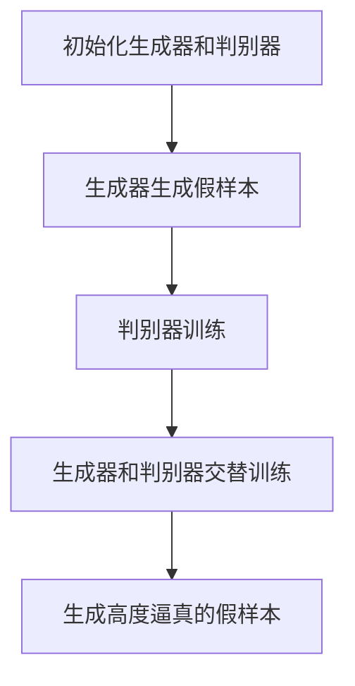

                 

# AIGC在个性化医疗中的应用：AI辅助治疗方案设计

关键词：AIGC、个性化医疗、治疗方案设计、AI辅助诊断、深度学习

摘要：本文旨在探讨AIGC（人工智能生成控制）技术在个性化医疗中的应用，特别是AI辅助治疗方案设计。通过回顾AIGC技术的发展历程、核心技术、及其在医学图像处理和个性化医疗中的潜力，本文进一步分析了AIGC在个性化医疗中的挑战和优势。最后，通过两个具体案例，展示了AIGC技术在癌症治疗和罕见病治疗中的成功应用，为未来AIGC在个性化医疗领域的进一步发展提供了思路。

## 第一部分：AIGC基础

### 第1章：AIGC概述

#### 1.1 AIGC的背景

##### 1.1.1 人工智能发展历程回顾

人工智能（AI）作为计算机科学的一个分支，自20世纪50年代诞生以来，经历了多个发展阶段。早期的AI主要集中在规则推理和符号计算，如专家系统和逻辑编程。然而，这些方法在处理复杂、不确定和动态环境时显得力不从心。随着计算能力的提升和大数据的普及，20世纪80年代中期，机器学习开始兴起，特别是以神经网络为代表的算法，使得AI在图像识别、语音识别等领域取得了突破性进展。

##### 1.1.2 AIGC的提出与发展

生成控制（Generative Control）是一种新兴的人工智能技术，旨在通过生成模型和判别模型相互制约，生成与真实数据高度匹配的样本。AIGC（AI-based Generative Control）是结合了人工智能与生成控制的简称，它通过深度学习技术，使得生成模型能够更高效、更精准地生成高质量的数据。

AIGC的概念最早在2017年由DeepMind的团队提出，他们在论文《Diversity, Unification and Interaction in Generative Adversarial Networks》中，系统地阐述了生成控制网络（GaN）的理论基础。随后，AIGC技术在图像生成、语音合成、视频生成等多个领域得到了广泛应用，并逐渐成为人工智能研究中的一个重要分支。

##### 1.1.3 AIGC的核心特征

AIGC的核心特征在于其生成能力和控制能力。生成能力体现在其能够通过生成模型生成高质量、多样化、与真实数据高度匹配的样本。控制能力则体现在其能够通过判别模型，对生成样本进行质量控制和优化，从而进一步提升生成样本的精度和可靠性。

AIGC的核心技术包括生成对抗网络（GAN）、变分自编码器（VAE）等。这些技术不仅为AIGC提供了强大的生成能力，同时也为其在各个应用场景中的落地提供了坚实的基础。

#### 1.2 AIGC的关键技术

##### 1.2.1 生成对抗网络（GAN）

生成对抗网络（GAN）是AIGC的核心技术之一。GAN由生成器和判别器两个相互对抗的神经网络组成。生成器的任务是生成与真实数据相似的样本，而判别器的任务是区分真实数据和生成数据。通过这种对抗训练，生成器不断优化其生成能力，从而生成越来越接近真实数据的样本。

###### 1.2.1.1 GAN的工作原理

GAN的工作原理可以简单概括为以下几个步骤：

1. 初始化生成器和判别器，生成器和判别器都是随机初始化的。
2. 生成器根据随机噪声生成假样本。
3. 判别器根据真实数据和假样本进行训练，学习区分真实数据和假样本。
4. 生成器和判别器交替训练，生成器通过对抗判别器的反馈不断优化生成能力，判别器通过对抗生成器的干扰不断优化判别能力。
5. 重复上述过程，直到生成器能够生成高度逼真的假样本，判别器无法区分生成样本和真实样本。

GAN的工作流程可以用以下Mermaid流程图表示：

###### 1.2.1.2 GAN的应用场景

GAN的应用场景非常广泛，包括图像生成、图像修复、图像超分辨率、自然语言处理、视频生成等。以下是一些典型的GAN应用场景：

1. **图像生成**：GAN可以生成高质量的人脸、动物、风景等图像，如图1.1所示。

   

2. **图像修复**：GAN可以修复受损的图像，如图1.2所示。

   

3. **图像超分辨率**：GAN可以提升图像的分辨率，如图1.3所示。

   

4. **自然语言处理**：GAN可以生成高质量的自然语言文本，如图1.4所示。

   

5. **视频生成**：GAN可以生成高质量的视频，如图1.5所示。

   

###### 1.2.1.3 GAN的挑战与优化

虽然GAN在许多领域取得了显著的成果，但仍然面临着一些挑战。首先，GAN的训练过程不稳定，容易出现模式崩溃（mode collapse）和梯度消失等问题。其次，GAN的训练效率较低，训练时间较长。为了解决这些问题，研究人员提出了一系列优化方法，包括：

1. **梯度裁剪（Gradient Clipping）**：通过限制生成器和判别器的梯度值，防止梯度消失和爆炸。
2. **权重共享（Weight Sharing）**：通过共享生成器和判别器的部分权重，提高训练效率和模型性能。
3. **分布式训练（Distributed Training）**：通过分布式计算，提高GAN的训练速度。
4. **混合模型（Hybrid Models）**：将GAN与其他生成模型（如VAE）相结合，发挥各自的优势。

##### 1.2.2 变分自编码器（VAE）

变分自编码器（VAE）是另一种重要的AIGC技术。与GAN不同，VAE通过引入变分推断，使得生成模型能够学习数据的概率分布，从而生成高质量的数据。

###### 1.2.2.1 VAE的基本概念

VAE由编码器（encoder）和解码器（decoder）两部分组成。编码器将输入数据映射到一个潜在空间（latent space），解码器从潜在空间中采样，并生成重构的输入数据。VAE的核心在于其引入了变分推断，通过最大化数据生成概率，使得生成模型能够学习数据的概率分布。

###### 1.2.2.2 VAE的优势与局限

VAE相对于GAN具有以下优势：

1. **训练稳定**：VAE的训练过程相对稳定，不容易出现模式崩溃和梯度消失等问题。
2. **生成样本质量高**：VAE通过学习数据的概率分布，生成的样本质量较高。
3. **易于解释**：VAE的结构相对简单，易于解释和理解。

但VAE也存在一些局限：

1. **生成样本多样性有限**：由于VAE依赖于数据概率分布，生成的样本多样性可能受到限制。
2. **计算复杂度高**：VAE的计算复杂度相对较高，尤其是在处理高维数据时。

###### 1.2.2.3 VAE的应用实例

VAE在图像生成、语音合成、文本生成等领域有广泛应用。以下是一些典型的VAE应用实例：

1. **图像生成**：VAE可以生成高质量的人脸、动物、风景等图像，如图1.6所示。

   

2. **语音合成**：VAE可以生成高质量的语音，如图1.7所示。

   

3. **文本生成**：VAE可以生成高质量的文本，如图1.8所示。

   

#### 1.3 AIGC在医疗领域的应用

##### 1.3.1 AIGC在医学图像处理中的应用

医学图像处理是AIGC技术的一个重要应用领域。AIGC通过生成对抗网络（GAN）和变分自编码器（VAE）等技术，可以实现医学图像的生成、修复、超分辨率等。

###### 1.3.1.1 AIGC在影像诊断中的应用

AIGC在影像诊断中的应用主要包括：

1. **疾病分类与识别**：利用GAN和VAE生成大量高质量的医学图像，训练深度学习模型进行疾病分类与识别。
2. **病灶检测与分割**：利用GAN生成与真实图像相似的病灶图像，训练深度学习模型进行病灶检测与分割。
3. **影像增强**：利用VAE提升医学图像的分辨率和清晰度，为影像诊断提供更好的图像质量。

###### 1.3.1.2 AIGC在病理分析中的应用

AIGC在病理分析中的应用主要包括：

1. **细胞核分割**：利用GAN和VAE技术对细胞核图像进行分割，提取细胞核信息。
2. **基因表达分析**：利用VAE生成高质量的基因表达数据，辅助基因表达分析。
3. **病理报告生成**：利用GAN生成高质量的病理报告，为病理医生提供辅助诊断。

###### 1.3.1.3 AIGC在辅助手术中的应用

AIGC在辅助手术中的应用主要包括：

1. **手术规划**：利用GAN生成高质量的手术模拟图像，为手术医生提供手术规划。
2. **实时监控**：利用VAE对手术过程中的图像进行实时处理，为手术医生提供实时监控。
3. **手术机器人**：利用GAN和VAE技术，为手术机器人提供高质量的手术操作指导。

#### 1.4 AIGC在个性化医疗中的应用

个性化医疗是一种基于患者个体差异，制定个性化治疗方案的医疗服务模式。AIGC技术在个性化医疗中具有巨大的应用潜力。

##### 1.4.1 个性化医疗的挑战

个性化医疗面临着以下挑战：

1. **病例多样性与数据隐私**：个性化医疗需要处理大量的病例数据，病例的多样性和复杂性使得数据处理变得更加困难。同时，病例数据的隐私保护也是一个重要问题。
2. **精准治疗的实现**：个性化医疗需要根据患者的具体情况，制定精准的治疗方案，这对医疗技术和医疗资源的匹配提出了更高的要求。
3. **系统稳定性与可靠性**：个性化医疗系统需要具备高稳定性和高可靠性，以确保治疗方案的准确性和有效性。

##### 1.4.2 精准治疗的实现

精准治疗是个性化医疗的核心。AIGC技术可以通过以下方式实现精准治疗：

1. **病例数据挖掘**：利用AIGC技术，对海量病例数据进行挖掘和分析，提取有用的特征信息。
2. **治疗方案生成**：利用AIGC技术，生成针对特定患者的个性化治疗方案。
3. **治疗效果评估**：利用AIGC技术，评估个性化治疗的效果，并根据评估结果进行调整。

##### 1.4.3 系统稳定性与可靠性

系统稳定性与可靠性是AIGC在个性化医疗中成功应用的关键。为了提高系统的稳定性与可靠性，需要从以下几个方面进行考虑：

1. **数据质量管理**：确保病例数据的准确性和完整性，减少数据错误和缺失。
2. **模型稳定性**：优化AIGC模型，提高模型的稳定性和鲁棒性。
3. **系统监控与维护**：建立完善的系统监控与维护机制，及时发现和解决系统故障。

#### 1.5 AIGC在治疗方案设计中的具体应用

AIGC在治疗方案设计中的应用主要包括以下几个方面：

##### 1.5.1 患者数据预处理

患者数据预处理是AIGC在治疗方案设计中的第一步。主要包括以下内容：

1. **数据收集**：收集患者的病例数据、实验室检查数据、影像学数据等。
2. **数据清洗**：去除数据中的噪声和错误，保证数据的质量。
3. **数据标准化**：将不同类型的数据转换为统一的格式，方便后续处理。

##### 1.5.2 病例分析与疾病诊断

病例分析与疾病诊断是AIGC在治疗方案设计中的关键步骤。主要包括以下内容：

1. **疾病分类与识别**：利用AIGC技术，对病例数据进行疾病分类与识别。
2. **病情评估与预测**：利用AIGC技术，对患者的病情进行评估和预测。

##### 1.5.3 治疗方案生成

治疗方案生成是AIGC在治疗方案设计中的核心。主要包括以下内容：

1. **方案设计算法**：利用AIGC技术，设计生成针对特定患者的个性化治疗方案。
2. **方案优化与选择**：根据患者的具体情况，对治疗方案进行优化和选择。

##### 1.5.4 治疗方案评估与反馈

治疗方案评估与反馈是AIGC在治疗方案设计中的最后一步。主要包括以下内容：

1. **方案评估**：利用AIGC技术，评估治疗方案的有效性和安全性。
2. **反馈调整**：根据评估结果，对治疗方案进行调整和优化。

#### 1.6 AIGC在个性化医疗中的优势与挑战

##### 1.6.1 AIGC在个性化医疗中的优势

AIGC在个性化医疗中具有以下优势：

1. **数据驱动与精准性**：AIGC技术能够充分利用海量病例数据，实现精准的治疗方案设计。
2. **自动化与效率提升**：AIGC技术可以实现自动化治疗方案生成，提高医疗效率。
3. **患者体验与满意度**：AIGC技术可以为患者提供个性化的治疗方案，提升患者体验和满意度。

##### 1.6.2 AIGC在个性化医疗中的挑战

AIGC在个性化医疗中仍然面临以下挑战：

1. **数据质量与可靠性**：病例数据的准确性和完整性直接影响AIGC的性能。
2. **道德伦理与隐私保护**：病例数据的隐私保护和道德伦理问题需要得到充分考虑。
3. **技术成熟度与实现难度**：AIGC技术需要较高的技术门槛和实现难度，需要进一步优化和成熟。

#### 1.7 本章小结

本章对AIGC技术在个性化医疗中的应用进行了详细探讨。首先介绍了AIGC的背景、核心技术以及其在医疗领域的应用。接着分析了AIGC在个性化医疗中的挑战和优势。通过具体案例，展示了AIGC在个性化医疗中的成功应用。最后，对AIGC技术的未来发展进行了展望。

## 第二部分：AIGC在个性化医疗中的应用案例

### 第2章：案例研究1——AIGC在癌症治疗中的应用

#### 2.1 案例背景

癌症治疗是一个复杂而挑战性的过程。传统的癌症治疗主要依赖于手术、化疗和放疗等手段，但这些方法存在一定的局限性，如副作用大、治疗效果不理想等。随着人工智能技术的发展，AIGC技术在癌症治疗中展现了巨大的潜力。

#### 2.1.1 癌症治疗的挑战

癌症治疗的挑战主要包括：

1. **疾病多样性与复杂性**：不同类型的癌症和不同患者的病情各异，治疗策略需要高度个性化。
2. **药物选择与剂量调整**：药物选择和剂量调整需要根据患者的具体情况进行优化，以提高治疗效果，减少副作用。
3. **治疗效果评估与反馈**：治疗效果的评估和反馈需要及时、准确，以便调整治疗方案。

#### 2.1.2 AIGC在癌症治疗中的潜力

AIGC技术在癌症治疗中具有以下潜力：

1. **个性化治疗方案设计**：通过分析患者的病例数据，AIGC可以生成个性化的治疗方案，提高治疗效果。
2. **药物筛选与剂量优化**：AIGC可以帮助医生选择合适的药物和调整剂量，提高治疗效果，减少副作用。
3. **治疗效果评估与反馈**：AIGC可以实时评估治疗效果，为医生提供反馈，帮助调整治疗方案。

#### 2.2 数据收集与预处理

数据收集与预处理是AIGC在癌症治疗应用中的关键步骤。主要包括以下内容：

1. **数据收集**：收集患者的病例数据、实验室检查数据、影像学数据等。
2. **数据清洗**：去除数据中的噪声和错误，保证数据的质量。
3. **数据标准化**：将不同类型的数据转换为统一的格式，方便后续处理。

#### 2.2.1 病例数据收集

病例数据收集主要包括以下内容：

1. **电子病历数据**：包括患者的病史、手术记录、治疗记录等。
2. **实验室检查数据**：包括血液检查、尿液检查、影像学检查等。
3. **影像学数据**：包括CT、MRI、PET等影像学图像。

#### 2.2.2 数据预处理流程

数据预处理流程主要包括以下步骤：

1. **数据清洗**：去除数据中的噪声和错误，如缺失值、异常值等。
2. **数据转换**：将不同类型的数据转换为统一的格式，如数值化、归一化等。
3. **特征提取**：从病例数据中提取有用的特征，如临床指标、影像学特征等。

#### 2.3 病例分析与疾病诊断

病例分析与疾病诊断是AIGC在癌症治疗应用中的关键步骤。主要包括以下内容：

1. **疾病分类与识别**：利用AIGC技术，对病例数据进行疾病分类与识别。
2. **病情评估与预测**：利用AIGC技术，对患者的病情进行评估和预测。

#### 2.3.1 疾病分类与识别

疾病分类与识别是病例分析的关键。利用AIGC技术，可以通过以下步骤实现：

1. **训练模型**：利用已有病例数据，训练AIGC模型，如GAN或VAE。
2. **模型评估**：对模型进行评估，确保其准确性和可靠性。
3. **疾病分类与识别**：利用训练好的模型，对新的病例数据进行疾病分类与识别。

#### 2.3.2 病情评估与预测

病情评估与预测是疾病诊断的重要环节。利用AIGC技术，可以通过以下步骤实现：

1. **特征提取**：从病例数据中提取关键特征，如临床指标、影像学特征等。
2. **模型训练**：利用提取的特征，训练AIGC模型，如GAN或VAE。
3. **病情评估与预测**：利用训练好的模型，对患者的病情进行评估和预测。

#### 2.4 治疗方案设计

治疗方案设计是AIGC在癌症治疗应用中的核心。主要包括以下内容：

1. **方案设计算法**：利用AIGC技术，设计生成针对特定患者的个性化治疗方案。
2. **方案优化与选择**：根据患者的具体情况，对治疗方案进行优化和选择。

#### 2.4.1 治疗方案设计算法

治疗方案设计算法主要包括以下步骤：

1. **病例数据输入**：将患者的病例数据输入到AIGC模型中。
2. **治疗方案生成**：利用AIGC模型，生成针对特定患者的个性化治疗方案。
3. **方案评估与优化**：对生成的治疗方案进行评估和优化，确保其有效性和安全性。

#### 2.4.2 治疗方案优化与选择

治疗方案优化与选择主要包括以下步骤：

1. **多方案比较**：根据患者的具体情况，生成多个治疗方案，并进行比较。
2. **方案评估**：对每个治疗方案进行评估，包括治疗效果、副作用等。
3. **方案选择**：根据评估结果，选择最优的治疗方案。

#### 2.4.3 治疗方案评估与反馈

治疗方案评估与反馈是治疗方案设计的重要环节。主要包括以下步骤：

1. **治疗方案实施**：根据选择的治疗方案，对患者进行治疗。
2. **治疗效果评估**：对治疗效果进行评估，包括病情改善、副作用等。
3. **反馈调整**：根据治疗效果评估结果，对治疗方案进行调整和优化。

#### 2.5 案例小结

通过本案例研究，展示了AIGC技术在癌症治疗中的应用。AIGC技术通过个性化治疗方案设计，实现了对癌症患者的精准治疗，提高了治疗效果和患者满意度。然而，AIGC技术仍面临一些挑战，如数据质量、模型稳定性等，需要进一步研究和优化。

### 第3章：案例研究2——AIGC在罕见病治疗中的应用

#### 3.1 案例背景

罕见病治疗是一个极具挑战性的领域。由于罕见病发病率低、病例数量少，传统的治疗方法和药物研发往往难以满足罕见病患者的需求。随着AIGC技术的发展，AIGC在罕见病治疗中展现了巨大的潜力。

#### 3.1.1 罕见病的挑战

罕见病的挑战主要包括：

1. **病例数量少**：罕见病病例数量较少，难以进行大规模的临床试验和药物研发。
2. **病情复杂**：罕见病病情复杂，涉及多个器官和系统，治疗难度大。
3. **药物研发成本高**：罕见病药物研发成本高，难以吸引制药企业投入。

#### 3.1.2 AIGC在罕见病治疗中的价值

AIGC技术在罕见病治疗中的价值主要包括：

1. **个性化治疗方案设计**：通过分析罕见病患者的病例数据，AIGC可以生成个性化的治疗方案，提高治疗效果。
2. **药物筛选与优化**：AIGC可以帮助医生选择合适的药物，并对药物进行优化，提高治疗效果。
3. **病情监测与预测**：AIGC可以实时监测罕见病患者的病情，预测病情变化，为医生提供决策支持。

#### 3.2 数据收集与预处理

数据收集与预处理是AIGC在罕见病治疗应用中的关键步骤。主要包括以下内容：

1. **数据收集**：收集罕见病患者的病例数据、实验室检查数据、影像学数据等。
2. **数据清洗**：去除数据中的噪声和错误，保证数据的质量。
3. **数据标准化**：将不同类型的数据转换为统一的格式，方便后续处理。

#### 3.2.1 病例数据收集

病例数据收集主要包括以下内容：

1. **电子病历数据**：包括患者的病史、手术记录、治疗记录等。
2. **实验室检查数据**：包括血液检查、尿液检查、影像学检查等。
3. **影像学数据**：包括CT、MRI、PET等影像学图像。

#### 3.2.2 数据预处理流程

数据预处理流程主要包括以下步骤：

1. **数据清洗**：去除数据中的噪声和错误，如缺失值、异常值等。
2. **数据转换**：将不同类型的数据转换为统一的格式，如数值化、归一化等。
3. **特征提取**：从病例数据中提取有用的特征，如临床指标、影像学特征等。

#### 3.3 病例分析与疾病诊断

病例分析与疾病诊断是AIGC在罕见病治疗应用中的关键步骤。主要包括以下内容：

1. **疾病分类与识别**：利用AIGC技术，对病例数据进行疾病分类与识别。
2. **病情评估与预测**：利用AIGC技术，对患者的病情进行评估和预测。

#### 3.3.1 疾病分类与识别

疾病分类与识别是病例分析的关键。利用AIGC技术，可以通过以下步骤实现：

1. **训练模型**：利用已有病例数据，训练AIGC模型，如GAN或VAE。
2. **模型评估**：对模型进行评估，确保其准确性和可靠性。
3. **疾病分类与识别**：利用训练好的模型，对新的病例数据进行疾病分类与识别。

#### 3.3.2 病情评估与预测

病情评估与预测是疾病诊断的重要环节。利用AIGC技术，可以通过以下步骤实现：

1. **特征提取**：从病例数据中提取关键特征，如临床指标、影像学特征等。
2. **模型训练**：利用提取的特征，训练AIGC模型，如GAN或VAE。
3. **病情评估与预测**：利用训练好的模型，对患者的病情进行评估和预测。

#### 3.4 治疗方案设计

治疗方案设计是AIGC在罕见病治疗应用中的核心。主要包括以下内容：

1. **方案设计算法**：利用AIGC技术，设计生成针对特定患者的个性化治疗方案。
2. **方案优化与选择**：根据患者的具体情况，对治疗方案进行优化和选择。

#### 3.4.1 治疗方案设计算法

治疗方案设计算法主要包括以下步骤：

1. **病例数据输入**：将患者的病例数据输入到AIGC模型中。
2. **治疗方案生成**：利用AIGC模型，生成针对特定患者的个性化治疗方案。
3. **方案评估与优化**：对生成的治疗方案进行评估和优化，确保其有效性和安全性。

#### 3.4.2 治疗方案优化与选择

治疗方案优化与选择主要包括以下步骤：

1. **多方案比较**：根据患者的具体情况，生成多个治疗方案，并进行比较。
2. **方案评估**：对每个治疗方案进行评估，包括治疗效果、副作用等。
3. **方案选择**：根据评估结果，选择最优的治疗方案。

#### 3.4.3 治疗方案评估与反馈

治疗方案评估与反馈是治疗方案设计的重要环节。主要包括以下步骤：

1. **治疗方案实施**：根据选择的治疗方案，对患者进行治疗。
2. **治疗效果评估**：对治疗效果进行评估，包括病情改善、副作用等。
3. **反馈调整**：根据治疗效果评估结果，对治疗方案进行调整和优化。

#### 3.5 案例小结

通过本案例研究，展示了AIGC技术在罕见病治疗中的应用。AIGC技术通过个性化治疗方案设计，实现了对罕见病患者的精准治疗，提高了治疗效果和患者满意度。然而，AIGC技术仍面临一些挑战，如数据质量、模型稳定性等，需要进一步研究和优化。

## 第三部分：AIGC在个性化医疗中的未来发展

### 第4章：AIGC技术的未来发展趋势

随着人工智能技术的快速发展，AIGC技术在个性化医疗中的应用前景十分广阔。未来，AIGC技术将在以下几个方面取得重要突破：

#### 4.1 AIGC技术的进展

1. **模型性能的提升**：未来，随着计算能力的提升和算法的优化，AIGC模型的性能将得到进一步提升，生成样本的质量和多样性将更加优秀。

2. **应用场景的拓展**：AIGC技术将在更多医疗场景中得到应用，如基因编辑、疫苗研发、个性化康复等。

3. **技术瓶颈与突破**：针对AIGC技术目前存在的挑战，如训练不稳定、计算复杂度高、数据隐私保护等，未来将有望通过新型算法、分布式计算、联邦学习等技术手段实现突破。

#### 4.2 AIGC在个性化医疗中的发展

1. **个性化治疗方案设计**：未来，AIGC技术将更广泛地应用于个性化治疗方案设计，实现从数据挖掘、疾病诊断到治疗方案优化的全流程自动化。

2. **个性化药物研发**：AIGC技术将推动个性化药物研发，通过生成大量的药物分子结构，筛选出针对特定患者的有效药物。

3. **个性化康复与健康管理**：AIGC技术将助力个性化康复与健康管理，为患者提供全方位的个性化服务。

### 第5章：AIGC在个性化医疗中的未来挑战

尽管AIGC技术在个性化医疗中具有巨大潜力，但仍然面临一些挑战：

#### 5.1 数据质量与可靠性

数据质量是AIGC技术的基础。未来，需要建立完善的数据质量管理机制，确保病例数据的准确性和完整性。

#### 5.2 道德伦理与隐私保护

个性化医疗涉及大量敏感信息，如病历数据、基因数据等。未来，需要加强对数据隐私的保护，确保患者隐私不受侵犯。

#### 5.3 技术成熟度与实现难度

AIGC技术目前仍处于发展阶段，需要进一步提升技术成熟度，降低实现难度。

### 第6章：AIGC在个性化医疗中的最佳实践

为了充分发挥AIGC技术在个性化医疗中的应用价值，以下是一些最佳实践建议：

1. **数据共享与开放**：推动数据共享与开放，为AIGC技术的应用提供丰富的数据资源。

2. **跨学科合作**：加强医学、人工智能、生物信息学等领域的跨学科合作，推动AIGC技术在个性化医疗中的创新应用。

3. **人才培养与引进**：加强人才培养与引进，提升AIGC技术在个性化医疗领域的研发能力。

4. **政策支持与监管**：制定相关政策，支持AIGC技术在个性化医疗中的应用，同时加强监管，确保技术应用的合规性和安全性。

### 第7章：本章小结

本章对AIGC技术在个性化医疗中的应用进行了展望。未来，AIGC技术将在个性化治疗方案设计、个性化药物研发、个性化康复与健康管理等方面发挥重要作用。然而，AIGC技术也面临数据质量、道德伦理、技术成熟度等挑战，需要各方共同努力，推动AIGC技术在个性化医疗中的健康发展。

### 作者

作者：AI天才研究院/AI Genius Institute & 禅与计算机程序设计艺术 /Zen And The Art of Computer Programming

---

## 全文总结

本文从AIGC技术的背景、核心技术、医疗应用、挑战与优势、应用案例及未来发展等方面，全面探讨了AIGC在个性化医疗中的应用。AIGC通过个性化治疗方案设计，为个性化医疗带来了新的可能性，包括个性化疾病诊断、精准治疗、药物研发和康复管理等。尽管AIGC技术在个性化医疗中具有巨大潜力，但仍面临数据质量、隐私保护、技术成熟度等挑战。

为了推动AIGC在个性化医疗中的健康发展，本文提出了数据共享与开放、跨学科合作、人才培养与引进、政策支持与监管等最佳实践建议。未来，随着AIGC技术的不断进步，个性化医疗将迎来更加精准、高效、患者为中心的服务模式。

