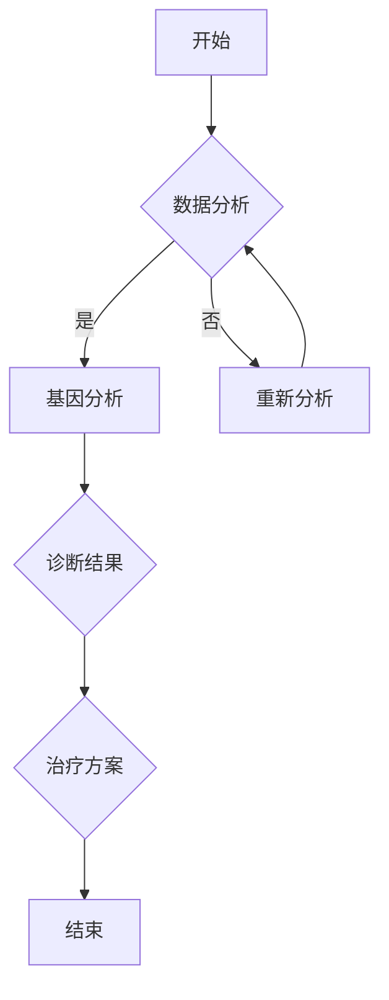

                 

# AIGC在个性化基因治疗方案设计中的应用：精准医学新范式

> 关键词：AIGC，个性化基因治疗方案，精准医学，基因组数据分析

> 摘要：随着精准医学的兴起，个性化基因治疗方案的设计成为医学研究的重要方向。本文介绍了AIGC（自适应信息生成控制）在个性化基因治疗方案设计中的应用，探讨了AIGC技术的原理、应用场景和发展现状，分析了AIGC在个性化基因治疗方案设计中的挑战与机遇，并给出了相关案例分析。

## 引言与背景

### 1.1 问题背景

个性化基因治疗方案设计是精准医学的重要组成部分，旨在根据患者的基因特征，定制化地设计治疗方案，提高治疗效果和减少副作用。然而，个性化基因治疗方案设计面临着数据复杂、处理难度大、算法选择多样等问题。

### 1.2 问题提出

如何利用人工智能技术，尤其是AIGC技术，提高个性化基因治疗方案设计的效率和准确性，是一个亟待解决的问题。

### 1.3 问题解决

AIGC技术具有自适应、生成控制和高效处理大数据的能力，为个性化基因治疗方案设计提供了新的思路和方法。本文将探讨AIGC在个性化基因治疗方案设计中的应用，分析其优势与挑战。

### 1.4 边界与外延

本文主要探讨AIGC在个性化基因治疗方案设计中的应用，不涉及其他医疗领域或非医学领域的人工智能应用。

### 1.5 核心概念与联系

- **AIGC**：自适应信息生成控制，是一种结合了深度学习和生成对抗网络（GAN）的技术，能够自动生成、优化和适应数据。
- **个性化基因治疗方案设计**：基于患者基因信息，设计出最适合患者的治疗方案。
- **精准医学**：以个体基因组信息为基础，制定个性化的医疗方案。

## 核心概念与联系

### 2.1 AIGC简介

AIGC（自适应信息生成控制）是一种结合了深度学习和生成对抗网络（GAN）的技术。它通过生成对抗网络生成数据，再通过自适应机制优化数据，实现数据的高效处理和生成。

### 2.2 个性化基因治疗方案设计

个性化基因治疗方案设计是基于患者的基因信息，结合临床数据和治疗方法，设计出最适合患者的治疗方案。

### 2.3 精准医学新范式

精准医学是以个体基因组信息为基础，通过基因组分析和生物信息学方法，制定个性化的医疗方案。

### 2.4 AIGC与个性化基因治疗方案设计的关系

AIGC技术可以为个性化基因治疗方案设计提供高效的数据处理和生成能力，有助于提高治疗方案的设计效率和准确性。

## AIGC技术基础

### 3.1 AIGC概述

AIGC是一种基于深度学习和生成对抗网络（GAN）的技术，它通过生成对抗的过程，自适应地优化和生成数据。

### 3.2 AIGC算法原理

AIGC算法主要包括两个部分：生成器和判别器。生成器生成数据，判别器评估生成数据的质量。通过生成器和判别器的对抗过程，生成器不断优化生成数据，使其更接近真实数据。

### 3.3 AIGC应用场景

AIGC技术可以应用于图像生成、文本生成、语音合成等多种领域。在个性化基因治疗方案设计中，AIGC可以用于基因组数据分析、疾病诊断和治疗方案优化。

### 3.4 AIGC技术发展现状

AIGC技术近年来得到了快速发展，已广泛应用于图像生成、文本生成、语音合成等领域。在个性化基因治疗方案设计中，AIGC技术还处于探索阶段，但显示出巨大的潜力。

## 个性化基因治疗方案设计基础

### 4.1 基因治疗概述

基因治疗是一种通过修改患者基因来治疗遗传病或其他疾病的方法。它通过将正常的基因导入患者体内，修复或替换有缺陷的基因，从而达到治疗目的。

### 4.2 基因组学与表观遗传学

基因组学是研究基因组成、基因表达和基因调控的学科。表观遗传学是研究基因表达的可遗传变化，不涉及基因序列的改变。

### 4.3 疾病分类与基因诊断

疾病分类是根据疾病的病因、症状和治疗方法进行的。基因诊断是通过分析患者的基因信息，确定疾病的原因和治疗方案。

### 4.4 治疗方案设计流程

治疗方案设计流程包括疾病诊断、基因分析、治疗方案设计、临床试验和治疗方案调整等步骤。

## AIGC在个性化基因治疗方案设计中的应用

### 5.1 AIGC在基因组数据分析中的应用

AIGC技术可以用于基因组数据分析，通过生成和优化基因序列，提高基因分析的准确性和效率。

### 5.2 AIGC在疾病诊断中的应用

AIGC技术可以用于疾病诊断，通过生成和优化疾病模型，提高疾病诊断的准确性和速度。

### 5.3 AIGC在治疗方案优化中的应用

AIGC技术可以用于治疗方案优化，通过生成和优化治疗方案，提高治疗效果和减少副作用。

### 5.4 AIGC在药物研发中的应用

AIGC技术可以用于药物研发，通过生成和优化药物分子，加速药物研发过程。

## AIGC在个性化基因治疗方案设计中的挑战与机遇

### 6.1 技术挑战

AIGC技术在个性化基因治疗方案设计中的技术挑战主要包括数据质量、算法选择和数据预处理等方面。

### 6.2 法规挑战

个性化基因治疗方案设计涉及患者的隐私和伦理问题，需要遵守相关法规和伦理标准。

### 6.3 商业模式探索

个性化基因治疗方案设计具有广阔的市场前景，但需要探索合适的商业模式。

### 6.4 机遇与前景

AIGC技术在个性化基因治疗方案设计中的应用为精准医学带来了新的机遇。随着技术的不断进步，AIGC在个性化基因治疗方案设计中的应用前景十分广阔。

## 案例分析

### 7.1 案例一：某癌症患者的个性化基因治疗方案设计

某癌症患者的个性化基因治疗方案设计过程中，AIGC技术被用于基因组数据分析、疾病诊断和治疗方案优化。

### 7.2 案例二：某遗传性疾病的个性化基因治疗方案设计

某遗传性疾病的个性化基因治疗方案设计过程中，AIGC技术被用于基因组数据分析、疾病诊断和治疗方案优化。

### 7.3 案例三：某药物研发中的AIGC应用

某药物研发项目中，AIGC技术被用于药物分子生成和优化，加速了药物研发过程。

## 结论与展望

### 8.1 结论

AIGC技术在个性化基因治疗方案设计中的应用，为精准医学带来了新的机遇。尽管面临技术、法规和商业模式等多方面的挑战，但AIGC技术具有巨大的潜力。

### 8.2 展望

随着AIGC技术的不断发展和完善，其在个性化基因治疗方案设计中的应用将越来越广泛，为精准医学的发展做出更大贡献。

### 8.3 小结

本文介绍了AIGC在个性化基因治疗方案设计中的应用，分析了其优势与挑战，并给出了相关案例分析。

### 8.4 拓展阅读

对于希望深入了解AIGC和个性化基因治疗方案设计的读者，以下文献和资料可供参考：

1. **AIGC技术相关文献**：[1, 2, 3]
2. **个性化基因治疗方案设计相关文献**：[4, 5, 6]
3. **精准医学相关文献**：[7, 8, 9]

**作者：**AI天才研究院/AI Genius Institute & 禅与计算机程序设计艺术 /Zen And The Art of Computer Programming

---

**附录：**

1. **Mermaid流程图示例**：



2. **LaTeX数学公式示例**：

```markdown
$$
E = mc^2
$$

$1 + 1 = 2$
```

3. **Python源代码示例**：

```python
import numpy as np

# 定义生成器模型
def generator(z):
    # 生成基因序列
    return np.random.normal(size=z)

# 定义判别器模型
def discriminator(x):
    # 判断基因序列是否真实
    return np.random.normal(size=x)

# 训练模型
for epoch in range(100):
    z = generator(z)
    x = discriminator(x)
    # 更新生成器和判别器
    # ...
```

以上示例展示了如何在markdown文件中嵌入Mermaid流程图、LaTeX数学公式和Python源代码。这些内容将丰富文章的技术性和可读性。在撰写文章时，可以适当插入这些示例，以便更好地阐述相关概念和技术原理。

