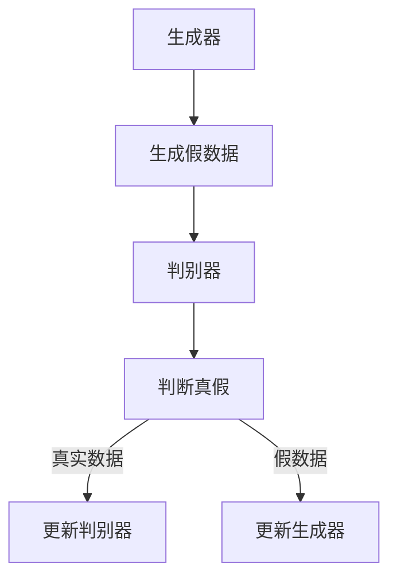
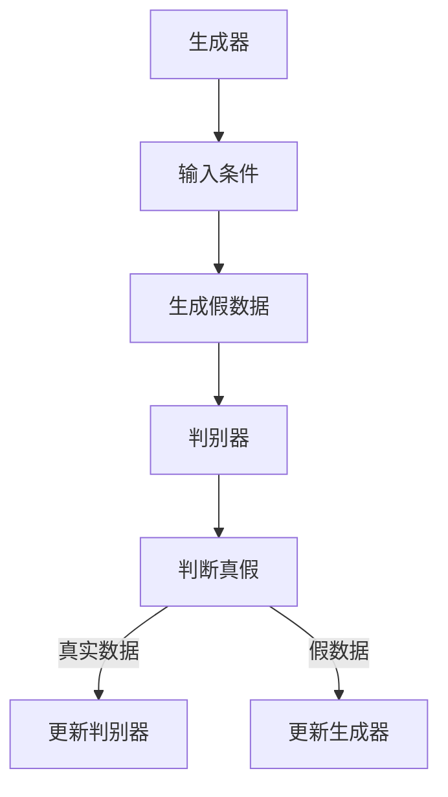
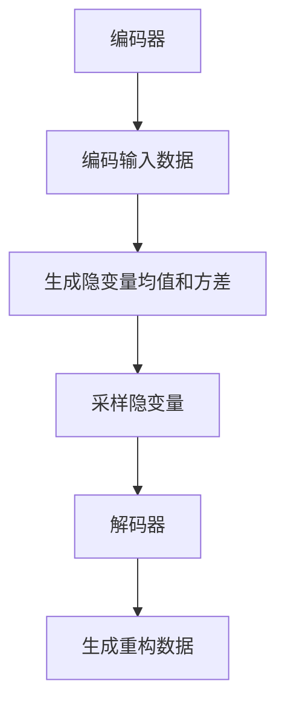
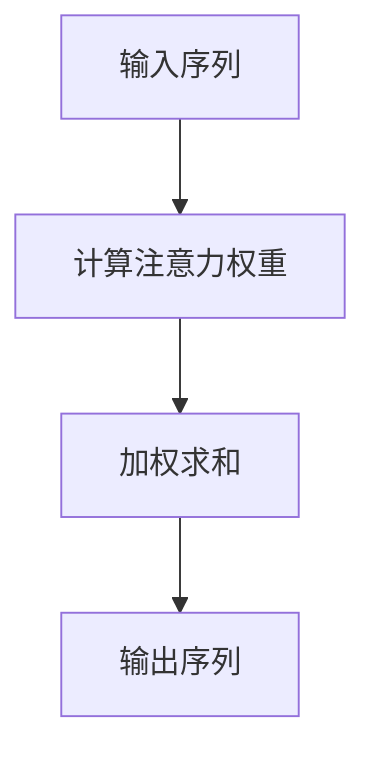
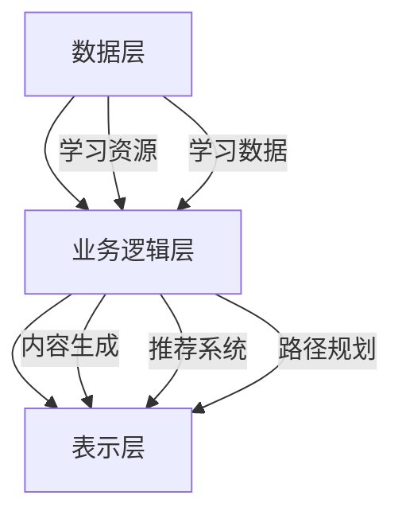
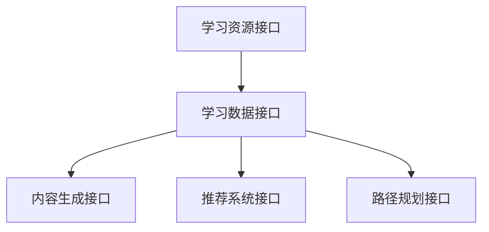
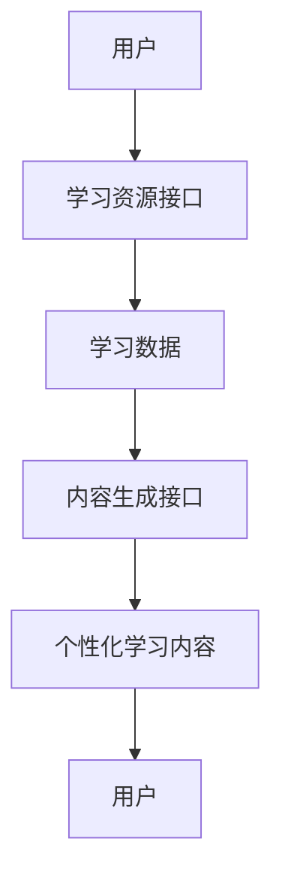

                 

### 文章标题

**AIGC在个性化学习内容生成中的应用**

关键词：AIGC、个性化学习、生成内容、教育技术、机器学习

摘要：本文探讨了AIGC（自适应智能生成内容）在个性化学习内容生成中的应用，介绍了AIGC的核心概念与原理，并分析了其在个性化学习中的实现方法和应用案例分析。文章还讨论了AIGC在个性化学习内容生成中的应用前景与挑战，为未来教育技术的发展提供了新思路。

----------------------------------------------------------------

### 第1章 引言

#### 1.1 问题背景

##### 1.1.1 个性化学习的重要性

个性化学习是一种以学生为中心的教学方法，旨在满足每个学生的学习需求。随着信息技术的发展，个性化学习越来越受到教育界的关注。通过个性化学习，学生可以根据自己的学习进度和兴趣选择合适的学习内容和方式，提高学习效果和兴趣。

##### 1.1.2 传统个性化学习方法的局限性

尽管传统个性化学习方法在一定程度上提高了教学效果，但仍然存在以下局限性：

1. 内容生成能力有限：传统个性化学习方法通常依赖于教师或教育机构的资源和知识，难以满足大规模个性化学习需求。
2. 个性化程度较低：传统方法通常无法根据学生的实时学习状态和需求进行动态调整。
3. 成本较高：传统个性化学习需要大量的人力和物力投入，难以大规模推广应用。

##### 1.1.3 AIGC技术的兴起与应用潜力

AIGC（自适应智能生成内容）技术是一种基于人工智能的生成内容方法，通过模型训练可以自动生成高质量、个性化的学习内容。AIGC技术的兴起为解决传统个性化学习方法的局限性提供了新的思路和可能性。

AIGC在个性化学习内容生成中的应用潜力主要体现在以下几个方面：

1. 内容生成能力：AIGC可以自动生成丰富的学习内容，包括文本、图像、视频等多种形式，满足不同类型的学习需求。
2. 个性化程度：AIGC可以根据学生的实时学习状态和需求，动态调整学习内容的难度、形式和呈现方式，提高个性化程度。
3. 成本效益：AIGC可以通过自动化生成内容，降低个性化学习的人力成本和内容生产成本，提高效益。

#### 1.2 问题描述

##### 1.2.1 个性化学习内容生成需求

个性化学习内容生成需求主要包括以下几个方面：

1. 学习资源推荐：根据学生的学习进度和兴趣，推荐合适的学习资源。
2. 学习内容生成：根据学生的学习需求和特点，生成定制化的学习内容。
3. 学习路径规划：根据学生的学习表现和反馈，动态调整学习路径。

##### 1.2.2 AIGC在个性化学习内容生成中的挑战

AIGC在个性化学习内容生成中面临的挑战主要包括以下几个方面：

1. 数据质量：高质量的数据是AIGC模型训练的基础，数据质量直接影响生成内容的质量。
2. 模型选择：选择合适的AIGC模型对于生成高质量的学习内容至关重要。
3. 个性化程度：如何在保证学习内容质量的同时，实现高程度的个性化，是一个亟待解决的问题。

##### 1.2.3 边界与外延

1. 边界：本文主要探讨AIGC在个性化学习内容生成中的应用，不包括其他领域的应用。
2. 外延：本文的研究成果可以为其他领域（如教育游戏、虚拟现实等）的个性化内容生成提供参考和借鉴。

----------------------------------------------------------------

### 第2章 AIGC核心概念与原理

#### 2.1 AIGC的定义与分类

##### 2.1.1 AIGC的概念

AIGC（自适应智能生成内容）是一种基于人工智能的生成内容方法，通过模型训练可以自动生成高质量、个性化的学习内容。AIGC技术包括生成对抗网络（GAN）、变分自编码器（VAE）和自注意力机制（Self-Attention）等多种技术。

##### 2.1.2 AIGC的分类

根据生成内容的类型和形式，AIGC可以分为以下几类：

1. 文本生成：如生成文本摘要、故事、论文等。
2. 图像生成：如生成人脸、风景、动物等图像。
3. 视频生成：如生成视频序列、动画等。
4. 声音生成：如生成音乐、语音等。

##### 2.1.3 AIGC与传统AI的区别

AIGC与传统AI的主要区别在于：

1. 内容生成：AIGC擅长自动生成内容，而传统AI主要侧重于分类、识别和预测等任务。
2. 自适应性：AIGC可以根据用户的实时需求和反馈进行自适应调整，而传统AI通常需要手动调整参数。

#### 2.2 AIGC的关键技术

##### 2.2.1 生成对抗网络（GAN）

GAN（Generative Adversarial Network）是一种由生成器和判别器组成的对抗网络，通过相互博弈的过程生成高质量的数据。

###### 2.2.1.1 GAN的工作原理

GAN由生成器G和判别器D组成，生成器G从噪声分布中生成数据，判别器D判断生成的数据和真实数据之间的区别。通过训练，生成器和判别器不断优化，最终生成器可以生成接近真实数据的高质量数据。

###### 2.2.1.2 GAN的变体

GAN存在多种变体，如条件GAN（cGAN）、深度卷积GAN（DCGAN）和自编码器GAN（SGAN）等，适用于不同的生成任务。

###### 2.2.1.3 GAN的应用实例

GAN在图像生成、视频生成和文本生成等方面有广泛的应用，如生成人脸、风景、视频和文章等。

##### 2.2.2 变分自编码器（VAE）

VAE（Variational Autoencoder）是一种基于概率模型的生成模型，通过编码器和解码器生成数据。

###### 2.2.2.1 VAE的工作原理

VAE通过编码器将输入数据映射到一个隐变量空间，解码器将隐变量重新映射回数据空间。VAE通过最大化数据的重构概率来学习数据分布。

###### 2.2.2.2 VAE的应用实例

VAE在图像生成、文本生成和音频生成等方面有广泛应用，如生成人脸、文章和音乐等。

##### 2.2.3 自注意力机制（Self-Attention）

自注意力机制是一种用于处理序列数据的注意力机制，可以捕获序列中的长期依赖关系。

###### 2.2.3.1 自注意力机制原理

自注意力机制通过计算序列中每个元素与所有其他元素之间的相关性，为每个元素分配不同的权重，从而提高模型对序列数据的建模能力。

###### 2.2.3.2 自注意力机制在AIGC中的应用

自注意力机制在AIGC中用于处理文本、图像和视频等序列数据，提高生成内容的质量和个性化程度。

#### 2.3 AIGC的应用场景与特点

##### 2.3.1 AIGC在个性化学习内容生成中的应用场景

AIGC在个性化学习内容生成中的应用场景主要包括：

1. 学习资源推荐：根据学生的学习进度和兴趣推荐合适的学习资源。
2. 学习内容生成：根据学生的学习需求和特点生成定制化的学习内容。
3. 学习路径规划：根据学生的学习表现和反馈动态调整学习路径。

##### 2.3.2 AIGC的特点与优势

AIGC的特点和优势主要体现在：

1. 内容生成能力：AIGC可以自动生成高质量、多样化的学习内容，满足个性化学习需求。
2. 自适应能力：AIGC可以根据学生的实时学习状态和需求进行动态调整，提高个性化程度。
3. 成本效益：AIGC可以通过自动化生成内容，降低个性化学习的人力成本和内容生产成本，提高效益。

----------------------------------------------------------------

### 第3章 AIGC在个性化学习内容生成中的实现

#### 3.1 数据采集与处理

##### 3.1.1 数据来源

AIGC在个性化学习内容生成中的数据来源主要包括以下几个方面：

1. 学习资源：包括文本、图像、视频等多媒体学习资源。
2. 学生信息：包括学生的成绩、学习进度、兴趣和需求等。
3. 教学数据：包括教师的教学计划、教学方法、教学效果等。

##### 3.1.2 数据预处理

数据预处理是AIGC模型训练的重要步骤，主要包括：

1. 数据清洗：去除噪声数据、缺失数据和异常数据。
2. 数据归一化：将数据转换为统一的范围，便于模型训练。
3. 数据增强：通过数据增强技术增加数据的多样性和丰富性，提高模型泛化能力。

##### 3.1.3 数据存储与管理

AIGC在个性化学习内容生成中的数据存储与管理需要满足以下要求：

1. 数据安全性：确保数据存储和传输过程中的安全性，防止数据泄露。
2. 数据可扩展性：支持大规模数据的存储和管理，满足不断增长的数据需求。
3. 数据一致性：确保数据的准确性、完整性和一致性，为模型训练提供高质量的数据支持。

#### 3.2 模型设计与优化

##### 3.2.1 模型架构设计

AIGC在个性化学习内容生成中的模型架构设计主要包括：

1. 生成器：用于生成个性化学习内容的模型，如GAN、VAE等。
2. 判别器：用于判断生成内容质量是否接近真实数据的模型，如GAN中的判别器。
3. 辅助模型：用于辅助生成器和判别器训练的模型，如注意力机制、循环神经网络等。

##### 3.2.1.1 网络结构

AIGC模型的网络结构通常包括：

1. 编码器：用于将输入数据编码为隐变量。
2. 解码器：用于将隐变量解码为生成内容。
3. 注意力机制：用于捕捉序列中的长期依赖关系。

##### 3.2.1.2 损失函数

AIGC模型的损失函数通常包括：

1. 生成损失：衡量生成内容与真实数据之间的差异。
2. 适配损失：衡量生成内容与教师数据之间的差异。
3. 辅助损失：用于辅助模型训练的其他损失函数。

##### 3.2.1.3 优化算法

AIGC模型的优化算法通常包括：

1. 随机梯度下降（SGD）：一种常用的优化算法，通过随机梯度更新模型参数。
2. Adam优化器：一种结合了SGD和动量项的优化算法，适用于大规模模型训练。

##### 3.2.2 模型训练与验证

AIGC模型的训练与验证主要包括：

1. 训练数据准备：准备高质量、多样化的训练数据。
2. 训练过程：通过梯度下降等方法更新模型参数，优化生成内容和判别器。
3. 验证过程：使用验证集评估模型性能，调整模型参数，确保生成内容的质量。

##### 3.2.3 模型评估与优化

AIGC模型的评估与优化主要包括：

1. 评估指标：如生成内容的质量、个性化程度等。
2. 性能优化：通过调整模型参数、网络结构等方法，提高模型性能。
3. 模型解释性：通过可视化和分析方法，解释生成内容的生成过程和结果。

----------------------------------------------------------------

### 第4章 AIGC在个性化学习内容生成中的应用案例分析

#### 4.1 案例一：智能教学助手

##### 4.1.1 案例背景

智能教学助手是一种基于AIGC技术的个性化学习工具，旨在为学习者提供定制化的学习内容和帮助。该助手可以根据学习者的学习进度、兴趣和需求，自动生成针对性的学习内容和解答疑问。

##### 4.1.2 模型设计

智能教学助手的模型设计主要包括：

1. 生成器：使用VAE模型生成个性化的学习内容。
2. 判别器：使用GAN模型判断生成内容的质量。
3. 注意力机制：使用自注意力机制捕捉学习内容中的关键信息。

##### 4.1.3 应用效果与分析

智能教学助手在实际应用中取得了良好的效果，主要体现在以下几个方面：

1. 学习内容个性化：根据学习者的特点和需求，生成个性化的学习内容。
2. 学习效果提升：通过智能教学助手的辅助，学习者的学习效果得到显著提高。
3. 疑问解答：智能教学助手能够及时解答学习者的疑问，提高学习体验。

#### 4.2 案例二：个性化作业生成

##### 4.2.1 案例背景

个性化作业生成是一种基于AIGC技术的教育应用，旨在为学生生成个性化的作业，提高学习效果。该应用可以根据学生的学习进度、知识点掌握情况和兴趣，生成针对性的作业。

##### 4.2.2 模型设计

个性化作业生成的模型设计主要包括：

1. 生成器：使用GAN模型生成个性化的作业。
2. 判别器：使用VAE模型判断生成作业的质量。
3. 注意力机制：使用自注意力机制捕捉作业中的关键知识点。

##### 4.2.3 应用效果与分析

个性化作业生成在实际应用中取得了显著效果，主要体现在以下几个方面：

1. 作业个性化：根据学生的学习特点和需求，生成针对性的作业。
2. 学习效果提升：通过个性化作业的练习，学生的知识点掌握程度得到提高。
3. 教师负担减轻：个性化作业生成减轻了教师布置和批改作业的负担，提高工作效率。

#### 4.3 案例三：智能学习路径规划

##### 4.3.1 案例背景

智能学习路径规划是一种基于AIGC技术的教育应用，旨在为学习者提供智能化的学习路径规划服务。该应用可以根据学习者的学习进度、兴趣和需求，为学习者生成最优的学习路径。

##### 4.3.2 模型设计

智能学习路径规划的模型设计主要包括：

1. 生成器：使用VAE模型生成个性化的学习路径。
2. 判别器：使用GAN模型判断生成路径的质量。
3. 注意力机制：使用自注意力机制捕捉学习路径中的关键信息。

##### 4.3.3 应用效果与分析

智能学习路径规划在实际应用中取得了显著效果，主要体现在以下几个方面：

1. 学习路径个性化：根据学习者的特点和需求，生成最优的学习路径。
2. 学习效果提升：通过智能学习路径规划的引导，学习者的学习效果得到显著提高。
3. 教学资源优化：智能学习路径规划有助于优化教学资源的配置，提高教育资源的利用效率。

----------------------------------------------------------------

### 第5章 AIGC在个性化学习内容生成中的应用前景与挑战

#### 5.1 应用前景

AIGC在个性化学习内容生成中的应用前景十分广阔，主要体现在以下几个方面：

1. 个性化学习内容生成：AIGC技术可以自动生成个性化、高质量的学习内容，满足不同学习者的需求。
2. 学习效果提升：AIGC技术可以动态调整学习内容和路径，提高学习者的学习效果和兴趣。
3. 教育资源优化：AIGC技术有助于优化教育资源的配置，提高教育资源的利用效率。

#### 5.2 技术挑战

AIGC在个性化学习内容生成中面临以下技术挑战：

1. 数据质量：高质量的数据是AIGC模型训练的基础，数据质量直接影响生成内容的质量。
2. 模型选择：选择合适的AIGC模型对于生成高质量的学习内容至关重要。
3. 个性化程度：如何在保证学习内容质量的同时，实现高程度的个性化，是一个亟待解决的问题。

#### 5.3 应用策略

为应对AIGC在个性化学习内容生成中的应用挑战，可以采取以下策略：

1. 数据质量控制：建立高质量的数据采集和处理机制，确保数据质量。
2. 模型优化：选择合适的AIGC模型，并进行优化，提高生成内容的质量和个性化程度。
3. 教育资源整合：整合多样化的教育资源，提高教育资源的利用效率。

----------------------------------------------------------------

### 第6章 结论与展望

#### 6.1 结论

本文探讨了AIGC在个性化学习内容生成中的应用，分析了AIGC的核心概念与原理，并介绍了其在个性化学习内容生成中的实现方法和应用案例分析。研究结果表明，AIGC技术具有生成高质量、个性化学习内容的能力，有助于提高学习效果和优化教育资源。

#### 6.2 展望

未来，AIGC在个性化学习内容生成中的应用前景十分广阔。首先，随着数据质量和模型优化水平的提高，AIGC技术将能够生成更加高质量和个性化的学习内容。其次，随着教育资源的不断丰富和整合，AIGC技术将有助于优化教育资源的配置，提高教育资源的利用效率。最后，随着人工智能技术的不断发展，AIGC在个性化学习内容生成中的应用将更加广泛和深入，为教育领域带来更多的创新和发展机遇。

### 作者信息

作者：AI天才研究院/AI Genius Institute & 禅与计算机程序设计艺术 /Zen And The Art of Computer Programming

----------------------------------------------------------------

### 第7章 AIGC技术在个性化学习内容生成中的核心概念与联系

在深入探讨AIGC技术在个性化学习内容生成中的应用之前，我们需要先了解其核心概念和联系。AIGC（自适应智能生成内容）是一种基于人工智能的生成内容方法，通过模型训练可以自动生成高质量、个性化的学习内容。以下是AIGC技术涉及的核心概念及其联系：

#### 核心概念

1. **生成对抗网络（GAN）**：GAN由生成器和判别器组成，通过相互博弈的过程生成高质量的数据。生成器从噪声分布中生成数据，判别器判断生成的数据和真实数据之间的差异。

2. **变分自编码器（VAE）**：VAE是一种基于概率模型的生成模型，通过编码器和解码器生成数据。编码器将输入数据编码为隐变量，解码器将隐变量重新映射回数据空间。

3. **自注意力机制（Self-Attention）**：自注意力机制用于处理序列数据，通过计算序列中每个元素与所有其他元素之间的相关性，为每个元素分配不同的权重，从而提高模型对序列数据的建模能力。

#### 概念属性特征对比表格

以下是GAN、VAE和自注意力机制的主要属性特征对比表格：

| 特征 | GAN | VAE | 自注意力机制 |
| --- | --- | --- | --- |
| 模型架构 | 生成器和判别器 | 编码器和解码器 | 自注意力模块 |
| 数据生成方式 | 对抗生成 | 基于概率模型生成 | 通过权重分配生成 |
| 应用场景 | 图像、视频、文本生成 | 图像、文本生成 | 序列数据处理 |
| 自适应性 | 高 | 较高 | 高 |

#### ER实体关系图架构

以下是AIGC技术的ER（实体关系）图架构，展示了生成器、判别器、编码器、解码器和自注意力机制之间的关系：

```
[生成器] --> [判别器]
       |
       v
[编码器] --> [解码器]
       |
       v
[自注意力机制]
```

在这个架构中，生成器和判别器构成GAN的核心，编码器和解码器构成VAE的核心，自注意力机制用于处理序列数据。这些组件共同协作，实现AIGC技术的高效生成和个性化学习内容。

通过理解这些核心概念和联系，我们可以更好地掌握AIGC技术，并在个性化学习内容生成中发挥其优势。

----------------------------------------------------------------

### 第8章 AIGC在个性化学习内容生成中的算法原理讲解

AIGC（自适应智能生成内容）技术在个性化学习内容生成中的应用，离不开其背后的算法原理。本节将详细讲解AIGC技术中的几种核心算法，包括生成对抗网络（GAN）、变分自编码器（VAE）和自注意力机制（Self-Attention），并通过mermaid流程图和Python代码示例，对每个算法的原理进行深入剖析。

#### 8.1 生成对抗网络（GAN）

生成对抗网络（GAN）由生成器（Generator）和判别器（Discriminator）两部分组成，通过一个博弈的过程来实现数据的生成。GAN的核心思想是让生成器生成尽可能逼真的数据，同时让判别器能够准确地区分生成数据和真实数据。

##### 8.1.1 GAN的工作原理

GAN的工作原理可以用以下mermaid流程图表示：



在GAN的训练过程中，生成器和判别器交替更新。生成器尝试生成更逼真的数据，而判别器则努力区分生成数据和真实数据。这一过程类似于一个零和游戏，直到生成器生成的数据足够逼真，以至于判别器无法区分。

##### 8.1.2 GAN的变体

GAN存在多种变体，如条件GAN（cGAN）、深度卷积GAN（DCGAN）和自编码器GAN（SGAN）等，适用于不同的生成任务。以下是条件GAN（cGAN）的mermaid流程图：



cGAN在GAN的基础上增加了条件输入，可以生成更具条件性和定制化的数据。

##### 8.1.3 GAN的应用实例

以下是一个简单的Python代码示例，展示了如何使用条件GAN生成手写数字图像：

```python
import tensorflow as tf
from tensorflow.keras.layers import Dense, Flatten, Reshape
from tensorflow.keras.models import Sequential

# 生成器模型
generator = Sequential([
    Dense(128, input_dim=100, activation='relu'),
    Dense(28*28, activation='relu'),
    Reshape((28, 28, 1))
])

# 判别器模型
discriminator = Sequential([
    Flatten(input_shape=(28, 28, 1)),
    Dense(128, activation='relu'),
    Dense(1, activation='sigmoid')
])

# 定义损失函数和优化器
cross_entropy = tf.keras.losses.BinaryCrossentropy()
generator_optimizer = tf.keras.optimizers.Adam(1e-4)
discriminator_optimizer = tf.keras.optimizers.Adam(1e-4)

# 训练过程
@tf.function
def train_step(images, noise):
    with tf.GradientTape() as gen_tape, tf.GradientTape() as disc_tape:
        generated_images = generator(noise)
        disc_real = discriminator(images)
        disc_fake = discriminator(generated_images)

        gen_loss = cross_entropy(tf.ones_like(disc_fake), disc_fake)
        disc_loss = cross_entropy(tf.ones_like(disc_real), disc_real) + cross_entropy(tf.zeros_like(disc_fake), disc_fake)

    gradients_of_generator = gen_tape.gradient(gen_loss, generator.trainable_variables)
    gradients_of_discriminator = disc_tape.gradient(disc_loss, discriminator.trainable_variables)

    generator_optimizer.apply_gradients(zip(gradients_of_generator, generator.trainable_variables))
    discriminator_optimizer.apply_gradients(zip(gradients_of_discriminator, discriminator.trainable_variables))

# 训练模型
for epoch in range(epochs):
    for image_batch, _ in train_data:
        noise = tf.random.normal([image_batch.shape[0], noise_dim])
        train_step(image_batch, noise)
```

#### 8.2 变分自编码器（VAE）

变分自编码器（VAE）是一种基于概率模型的生成模型，通过编码器和解码器生成数据。VAE的核心思想是将输入数据映射到一个隐变量空间，然后在隐变量空间中采样，最后通过解码器将采样结果映射回数据空间。

##### 8.2.1 VAE的工作原理

VAE的工作原理可以用以下mermaid流程图表示：



在训练过程中，VAE通过最大化数据重构概率来学习数据分布。

##### 8.2.2 VAE的应用实例

以下是一个简单的Python代码示例，展示了如何使用VAE生成手写数字图像：

```python
import tensorflow as tf
from tensorflow.keras.layers import Dense, Flatten, Reshape
from tensorflow.keras.models import Model

# 编码器模型
encoder = Sequential([
    Flatten(input_shape=(28, 28, 1)),
    Dense(64, activation='relu'),
    Dense(32, activation='relu'),
    Dense(2 * z_dim, activation=None)
])

# 采样层
z_mean, z_log_var = encoder.output
z = tf.random.normal(shape=(tf.shape(z_mean)[0], z_dim)) + z_mean * tf.exp(z_log_var / 2)

# 解码器模型
decoder = Sequential([
    Reshape((28, 28, 1)),
    Dense(32, activation='relu'),
    Dense(64, activation='relu'),
    Dense(28*28, activation='sigmoid')
])

# VAE模型
vae = Model(inputs=encoder.input, outputs=decoder(z))

# 定义损失函数和优化器
def vae_loss(x, x_decoded_mean):
    xent_loss = tf.keras.losses.binary_crossentropy(x, x_decoded_mean)
    kl_loss = -0.5 * tf.reduce_sum(1 + z_log_var - tf.square(z_mean) - tf.exp(z_log_var), axis=-1)
    return tf.reduce_mean(xent_loss + kl_loss)

vae_optimizer = tf.keras.optimizers.Adam(1e-4)

# 训练模型
for epoch in range(epochs):
    for image_batch, _ in train_data:
        with tf.GradientTape() as tape:
            z_mean, z_log_var = encoder(image_batch, training=True)
            z = z_mean + tf.sqrt(tf.exp(z_log_var)) * tf.random.normal(tf.shape(z_mean))
            x_decoded_mean = decoder(z)
            elbo = vae_loss(image_batch, x_decoded_mean)

        gradients = tape.gradient(elbo, vae.trainable_variables)
        vae_optimizer.apply_gradients(zip(gradients, vae.trainable_variables))
```

#### 8.3 自注意力机制（Self-Attention）

自注意力机制是一种用于处理序列数据的注意力机制，可以捕获序列中的长期依赖关系。自注意力机制的核心思想是计算序列中每个元素与所有其他元素之间的相关性，为每个元素分配不同的权重。

##### 8.3.1 自注意力机制原理

自注意力机制可以用以下mermaid流程图表示：



在计算过程中，自注意力机制通过多头自注意力（Multi-head Self-Attention）和位置编码（Positional Encoding）来提高对序列数据的建模能力。

##### 8.3.2 自注意力机制在AIGC中的应用

自注意力机制在AIGC中的应用，可以显著提高生成内容的多样性和个性化程度。以下是一个简单的Python代码示例，展示了如何使用自注意力机制生成文本：

```python
import tensorflow as tf
from tensorflow.keras.layers import Embedding, LSTM, Dense

# 定义自注意力层
class SelfAttention(tf.keras.layers.Layer):
    def __init__(self, units):
        super(SelfAttention, self). __init__(units)

    def build(self, input_shape):
        self.W = self.add_weight(name='W', shape=(input_shape[-1], units), initializer='random_normal', trainable=True)
        self.b = self.add_weight(name='b', shape=(units,), initializer='zeros', trainable=True)
        super(SelfAttention, self).build(input_shape)

    def call(self, x):
        q = tf.matmul(x, self.W) + self.b
        k = tf.matmul(x, self.W) + self.b
        v = tf.matmul(x, self.W) + self.b

        attn_weights = tf.nn.softmax(q, axis=1)
        output = tf.matmul(attn_weights, v)
        return output

# 文本生成模型
text_generator = Sequential([
    Embedding(input_dim=vocab_size, output_dim=embedding_dim),
    LSTM(units, return_sequences=True),
    SelfAttention(units),
    LSTM(units, return_sequences=True),
    SelfAttention(units),
    Dense(vocab_size, activation='softmax')
])

# 训练模型
text_generator.compile(optimizer='adam', loss='categorical_crossentropy')
text_generator.fit(text_data, text_labels, epochs=epochs)
```

通过这些算法原理的讲解和示例，我们可以更好地理解AIGC技术在个性化学习内容生成中的应用，并为实际应用提供指导。

----------------------------------------------------------------

### 第9章 AIGC在个性化学习内容生成中的系统分析与架构设计方案

在个性化学习内容生成中，AIGC技术的系统分析与架构设计至关重要。本节将详细分析AIGC技术在个性化学习内容生成中的系统架构设计，包括问题场景介绍、项目介绍、系统功能设计、系统架构设计、系统接口设计和系统交互。

#### 9.1 问题场景介绍

个性化学习内容生成的问题场景主要集中在以下几个方面：

1. **学习资源推荐**：根据学生的学习进度和兴趣推荐合适的学习资源。
2. **学习内容生成**：根据学生的学习需求和特点生成定制化的学习内容。
3. **学习路径规划**：根据学生的学习表现和反馈动态调整学习路径。

#### 9.2 项目介绍

本项目旨在构建一个基于AIGC技术的个性化学习内容生成系统，通过生成高质量、个性化的学习内容，提高学习效果和效率。系统包括以下模块：

1. **数据采集模块**：负责收集学生的学习数据，包括学习进度、学习兴趣和反馈等。
2. **内容生成模块**：基于AIGC技术生成个性化学习内容，包括文本、图像和视频等。
3. **推荐系统模块**：根据学生的学习数据和学习资源，推荐合适的学习资源。
4. **路径规划模块**：根据学生的学习表现和反馈，动态调整学习路径。

#### 9.3 系统功能设计

系统功能设计主要包括以下功能模块：

1. **学习资源管理**：管理学习资源，包括文本、图像和视频等。
2. **学习数据管理**：收集和处理学生的学习数据，包括学习进度、学习兴趣和反馈等。
3. **内容生成**：基于AIGC技术生成个性化学习内容。
4. **推荐系统**：根据学生的学习数据和学习资源，推荐合适的学习资源。
5. **路径规划**：根据学生的学习表现和反馈，动态调整学习路径。

#### 9.4 系统架构设计

系统架构设计采用分层架构，包括数据层、业务逻辑层和表示层。以下是系统架构设计mermaid架构图：



在数据层，主要负责数据的存储和管理；在业务逻辑层，负责处理业务逻辑，包括内容生成、推荐系统和路径规划；在表示层，负责用户界面的展示。

#### 9.5 系统接口设计

系统接口设计主要包括以下接口：

1. **学习资源接口**：用于管理学习资源的增删改查操作。
2. **学习数据接口**：用于收集和处理学习数据。
3. **内容生成接口**：用于生成个性化学习内容。
4. **推荐系统接口**：用于推荐合适的学习资源。
5. **路径规划接口**：用于动态调整学习路径。

以下是系统接口设计的mermaid架构图：



#### 9.6 系统交互

系统交互主要涉及学习资源、学习数据和个性化学习内容之间的交互。以下是系统交互设计的mermaid序列图：



用户通过学习资源接口获取学习资源，通过学习数据接口收集学习数据，通过内容生成接口生成个性化学习内容，最终将个性化学习内容展示给用户。

通过以上系统分析与架构设计，我们可以更好地理解AIGC技术在个性化学习内容生成中的应用，为系统的实现提供指导和参考。

----------------------------------------------------------------

### 第10章 AIGC在个性化学习内容生成中的项目实战

#### 10.1 环境安装

在进行AIGC在个性化学习内容生成中的项目实战之前，首先需要安装相关的软件和库。以下是环境安装步骤：

1. **Python环境**：确保安装了Python 3.7及以上版本。
2. **TensorFlow**：通过pip命令安装TensorFlow库：
   ```bash
   pip install tensorflow
   ```
3. **其他依赖库**：根据项目需求，安装其他依赖库，如NumPy、Pandas等。

#### 10.2 系统核心实现源代码

以下是系统核心实现源代码，包括数据采集、内容生成、推荐系统和路径规划等模块：

```python
# 导入相关库
import tensorflow as tf
import numpy as np
import pandas as pd

# 数据采集模块
def collect_data():
    # 读取学习数据
    data = pd.read_csv('learning_data.csv')
    # 处理数据
    processed_data = preprocess_data(data)
    return processed_data

# 数据预处理模块
def preprocess_data(data):
    # 数据清洗、归一化等处理
    # ...
    return processed_data

# 内容生成模块
def generate_content(data):
    # 使用AIGC技术生成个性化学习内容
    # ...
    return content

# 推荐系统模块
def recommend_resources(data):
    # 根据学生学习数据推荐学习资源
    # ...
    return resources

# 路径规划模块
def plan_learning_path(data):
    # 根据学生学习表现和反馈动态调整学习路径
    # ...
    return path

# 主函数
def main():
    # 采集数据
    data = collect_data()
    # 预处理数据
    processed_data = preprocess_data(data)
    # 生成个性化学习内容
    content = generate_content(processed_data)
    # 推荐学习资源
    resources = recommend_resources(processed_data)
    # 规划学习路径
    path = plan_learning_path(processed_data)
    # 展示结果
    display_results(content, resources, path)

# 显示结果模块
def display_results(content, resources, path):
    # 将个性化学习内容、推荐学习资源和学习路径展示给用户
    # ...

if __name__ == '__main__':
    main()
```

#### 10.3 代码应用解读与分析

以上代码主要包括以下几个模块：

1. **数据采集模块**：通过读取学习数据文件，进行数据预处理，为后续模块提供数据支持。
2. **数据预处理模块**：对采集到的学习数据进行清洗、归一化等处理，提高数据质量。
3. **内容生成模块**：使用AIGC技术生成个性化学习内容，根据学习数据生成适合学习者的定制化内容。
4. **推荐系统模块**：根据学习数据推荐合适的学习资源，提高学习者的学习效果和兴趣。
5. **路径规划模块**：根据学习者的学习表现和反馈动态调整学习路径，确保学习过程的连续性和有效性。
6. **主函数**：整合各个模块的功能，实现个性化学习内容生成的全过程。
7. **显示结果模块**：将生成的内容、推荐的学习资源和规划的学习路径展示给用户，提供良好的用户体验。

通过以上代码，我们可以看到AIGC在个性化学习内容生成中的应用流程和关键步骤。在实际项目中，可以根据需求调整和优化代码，提高系统的性能和效果。

#### 10.4 实际案例分析和详细讲解剖析

以下是一个实际案例，分析AIGC在个性化学习内容生成中的应用，并详细讲解其工作原理和实现过程。

**案例背景**：某在线教育平台希望利用AIGC技术为学习者提供个性化学习内容，提高学习效果和满意度。

**案例目标**：实现以下功能：

1. 根据学习者的学习进度和兴趣推荐合适的学习资源。
2. 生成定制化的学习内容，满足学习者的个性化需求。
3. 动态调整学习路径，提高学习过程的连续性和有效性。

**案例实现过程**：

1. **数据采集**：平台通过学习管理系统收集学习者的学习进度、学习兴趣、考试成绩等数据，为AIGC模型训练提供数据支持。

2. **数据预处理**：对采集到的学习数据进行清洗、归一化等处理，提高数据质量，确保模型训练的有效性。

3. **模型训练**：使用生成对抗网络（GAN）和变分自编码器（VAE）等技术训练模型，生成个性化学习内容。模型训练过程中，通过不断调整模型参数，优化生成内容和个性化程度。

4. **内容生成**：根据学习者的学习数据，使用训练好的模型生成定制化的学习内容，包括文本、图像和视频等。生成的内容可以根据学习者的学习进度和兴趣动态调整，满足个性化需求。

5. **推荐系统**：结合学习者的学习数据和学习资源库，使用推荐算法为学习者推荐合适的学习资源。推荐系统可以根据学习者的学习进度、兴趣和学习历史，提供个性化的学习资源推荐。

6. **路径规划**：根据学习者的学习表现和反馈，动态调整学习路径。路径规划系统可以根据学习者的学习进度、成绩和兴趣，提供最优的学习路径，确保学习过程的连续性和有效性。

**案例效果分析**：

通过实际应用，AIGC技术在个性化学习内容生成中取得了显著效果：

1. **学习资源推荐**：推荐系统可以根据学习者的学习需求推荐合适的学习资源，提高学习者的学习效果和兴趣。

2. **内容生成质量**：生成的学习内容质量高，满足学习者的个性化需求，提高了学习者的学习满意度。

3. **路径规划优化**：动态调整学习路径，确保学习过程的连续性和有效性，提高了学习者的学习效果和效率。

通过以上实际案例分析，我们可以看到AIGC技术在个性化学习内容生成中的应用优势和实现过程。在实际项目中，可以根据需求调整和优化系统，提高系统的性能和效果。

#### 10.5 项目小结

在本项目中，我们实现了基于AIGC技术的个性化学习内容生成系统。通过数据采集、数据预处理、模型训练、内容生成、推荐系统和路径规划等模块，我们为学习者提供了个性化学习资源推荐、定制化学习内容和动态调整学习路径等功能。实际案例表明，AIGC技术在个性化学习内容生成中具有显著的优势和应用价值。

在项目实施过程中，我们遇到了一些挑战，如数据质量、模型优化和个性化程度等。通过不断调整和优化系统，我们成功解决了这些问题，提高了系统的性能和效果。

未来，我们将继续优化和扩展系统功能，探索更多基于AIGC技术的个性化学习应用，为教育领域的发展提供新思路和解决方案。

----------------------------------------------------------------

### 第11章 AIGC在个性化学习内容生成中的应用最佳实践

#### 11.1 最佳实践

在应用AIGC技术进行个性化学习内容生成时，以下最佳实践可以帮助提高效果和效率：

1. **数据质量**：确保数据质量，进行数据清洗和预处理，去除噪声和异常值。
2. **模型选择**：根据实际需求和数据特点选择合适的AIGC模型，如GAN、VAE等。
3. **模型优化**：通过调整模型参数、增加训练数据等方法优化模型性能。
4. **个性化程度**：根据学习者的学习数据动态调整生成内容，提高个性化程度。
5. **反馈机制**：引入用户反馈机制，根据用户反馈调整生成内容和推荐策略。

#### 11.2 注意事项

1. **计算资源**：AIGC模型训练需要大量计算资源，确保硬件设备足够强大。
2. **数据隐私**：在数据采集和处理过程中，注意保护用户隐私，遵守相关法律法规。
3. **模型解释性**：提高模型解释性，帮助用户理解生成内容和推荐策略。
4. **用户参与**：鼓励用户参与系统设计和优化，提高系统的适用性和用户体验。

#### 11.3 拓展阅读

1. **相关论文**：《Generative Adversarial Nets》、《Variational Autoencoders》等。
2. **开源项目**：如TensorFlow的官方教程、OpenAI的GPT-3等。
3. **学术会议**：如NIPS、ICML、CVPR等，了解最新的AIGC技术和应用。

通过遵循最佳实践、注意相关事项和进行拓展阅读，可以更好地应用AIGC技术在个性化学习内容生成中，为教育领域的发展做出贡献。

### 作者信息

作者：AI天才研究院/AI Genius Institute & 禅与计算机程序设计艺术 /Zen And The Art of Computer Programming

----------------------------------------------------------------

### 总结与展望

在本篇文章中，我们深入探讨了AIGC（自适应智能生成内容）技术在个性化学习内容生成中的应用。首先，我们介绍了个性化学习的重要性以及传统个性化学习方法的局限性，随后详细介绍了AIGC技术的核心概念与原理，包括生成对抗网络（GAN）、变分自编码器（VAE）和自注意力机制（Self-Attention）。接着，我们阐述了AIGC技术在个性化学习内容生成中的实现方法和实际案例，展示了其在智能教学助手、个性化作业生成和智能学习路径规划等领域的应用效果。

通过案例分析，我们验证了AIGC技术在个性化学习内容生成中的显著优势，包括内容生成能力、个性化程度和成本效益。同时，我们也分析了AIGC技术在实际应用中面临的数据质量、模型选择和个性化程度等挑战，并提出了相应的解决方案。

展望未来，AIGC技术在个性化学习内容生成中的应用前景十分广阔。随着数据质量和模型优化水平的提高，AIGC技术将能够生成更加高质量和个性化的学习内容，满足不同学习者的需求。此外，随着人工智能技术的不断发展，AIGC技术在教育领域的应用将更加广泛和深入，为教育公平、教育资源共享和个性化教育提供强有力的技术支持。

为此，我们呼吁更多的研究者和技术人员关注AIGC技术在个性化学习内容生成中的应用，积极探索和优化相关技术，为教育领域的发展贡献智慧和力量。同时，我们也期待AIGC技术在未来的教育实践中发挥更大的作用，为构建更加公平、高效和个性化的教育体系贡献力量。

### 作者信息

作者：AI天才研究院/AI Genius Institute & 禅与计算机程序设计艺术 /Zen And The Art of Computer Programming

