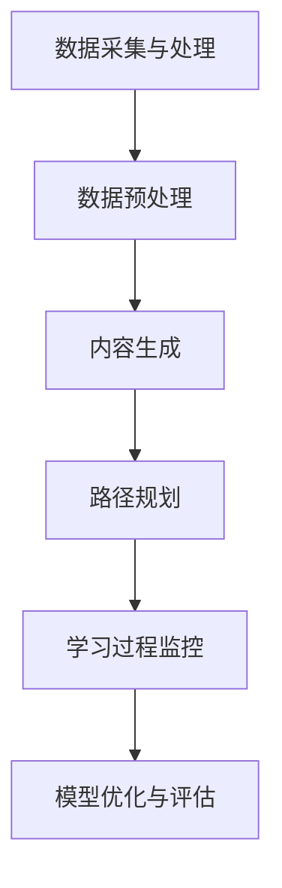
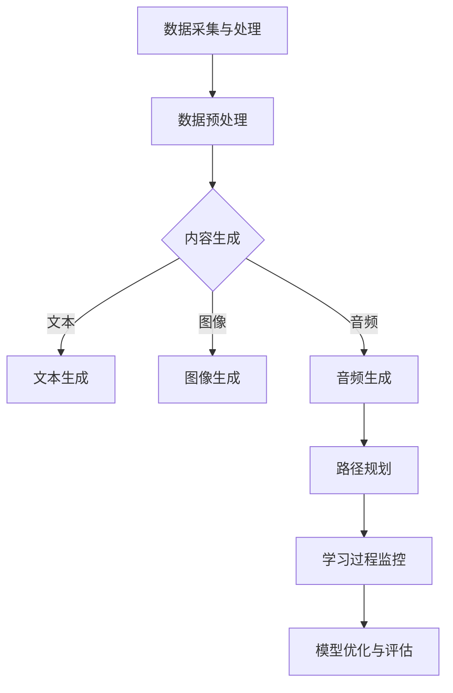

                 


# AIGC在个性化学习路径设计中的创新探索

## 摘要

随着人工智能技术的飞速发展，AIGC（AI-Generated Content，AI生成内容）在个性化学习路径设计中的应用日益受到关注。本文旨在探讨AIGC在个性化学习路径设计中的创新探索，分析其技术原理、实现方法以及实际应用案例，并展望其未来发展趋势。通过本文的研究，读者可以深入了解AIGC在个性化学习路径设计中的应用潜力，为其在教育领域的广泛应用提供理论支持和实践指导。

## 背景与基础

### AIGC的基本概念

AIGC，即AI-Generated Content，是指利用人工智能技术生成各种类型的内容，如文本、图像、音频和视频等。AIGC的核心在于人工智能算法的自主学习和内容生成能力，通过对大量数据的分析和学习，生成具有高质量、多样性和创新性的内容。

AIGC的发展历程可以追溯到20世纪80年代，随着深度学习、自然语言处理、计算机视觉等技术的逐步成熟，AIGC开始进入快速发展阶段。近年来，AIGC在图像生成、文本生成、音频生成等领域取得了显著成果，应用范围不断扩大。

### 个性化学习路径设计的基本原理

个性化学习路径设计是一种基于学习者的个体差异和学习需求，为其提供量身定制的学习内容和方法的策略。其核心思想是尊重学习者的个性，实现学习内容的个性化和学习过程的动态化。

个性化学习路径设计主要包括以下几个方面的内容：

1. **学习者特征分析**：通过收集和学习者的学习历史、兴趣爱好、知识水平等数据，分析其个体差异，为个性化学习路径的设计提供基础。

2. **学习内容推荐**：根据学习者特征和学习需求，从庞大的知识库中推荐与其兴趣和能力相匹配的学习内容。

3. **学习路径规划**：根据学习者的学习进度和能力，制定个性化的学习路径，确保学习者在合适的时间和方式下进行学习。

4. **学习过程监控与调整**：通过实时监控学习者的学习过程，根据学习效果和反馈，动态调整学习内容和路径，提高学习效率。

## 核心概念与联系

### AIGC与个性化学习路径设计的结合

AIGC在个性化学习路径设计中的应用主要体现在以下几个方面：

1. **学习内容生成**：利用AIGC技术，生成与学习者特征相匹配的个性化学习内容，提高学习内容的多样性和质量。

2. **学习路径规划**：通过AIGC技术，根据学习者的学习进度和效果，动态调整学习路径，实现学习过程的个性化。

3. **学习过程监控**：利用AIGC技术，实时分析学习者的学习过程，为学习效果的评估和调整提供依据。

### 结合优势分析

1. **个性化程度高**：AIGC能够根据学习者的个体差异，生成个性化的学习内容和路径，满足不同学习者的需求。

2. **学习效率提升**：通过动态调整学习内容和路径，AIGC有助于提高学习者的学习效率和效果。

3. **内容质量保障**：AIGC技术生成的学习内容具有高质量、多样性和创新性，能够满足学习者的个性化需求。

4. **降低人力成本**：AIGC技术可以自动化生成学习内容和路径，降低教育机构在内容制作和路径规划方面的人力成本。

## 技术实现方法

### 技术架构设计

AIGC在个性化学习路径设计中的技术架构主要包括以下几个模块：

1. **数据采集与处理模块**：负责收集学习者的学习数据，如学习历史、兴趣爱好、知识水平等，并对数据进行分析和处理。

2. **内容生成模块**：利用深度学习、自然语言处理等技术，生成与学习者特征相匹配的个性化学习内容。

3. **路径规划模块**：根据学习者的学习进度和效果，动态调整学习路径，实现个性化学习。

4. **学习过程监控模块**：实时监控学习者的学习过程，为学习效果的评估和调整提供依据。

### 数据预处理

数据预处理是AIGC在个性化学习路径设计中的关键步骤，主要包括以下内容：

1. **数据清洗**：去除重复、错误和缺失的数据，保证数据的质量。

2. **数据整合**：将来自不同来源的数据进行整合，形成一个统一的学习者数据集。

3. **特征提取**：从学习者数据中提取关键特征，如学习历史、兴趣爱好、知识水平等，为内容生成和路径规划提供依据。

### 模型训练与优化

AIGC在个性化学习路径设计中的核心技术是深度学习和自然语言处理模型。模型训练与优化主要包括以下步骤：

1. **模型选择**：根据应用场景，选择合适的深度学习和自然语言处理模型。

2. **数据集准备**：准备训练数据集，包括学习者的学习数据和学习内容。

3. **模型训练**：利用训练数据集，对深度学习和自然语言处理模型进行训练。

4. **模型优化**：通过调整模型参数，提高模型的准确性和泛化能力。

5. **模型评估**：利用测试数据集，评估模型的性能，并根据评估结果对模型进行优化。

### 算法原理讲解

AIGC在个性化学习路径设计中的算法原理主要包括以下几个部分：

1. **内容生成算法**：利用生成对抗网络（GAN）或变分自编码器（VAE）等技术，生成与学习者特征相匹配的个性化学习内容。

2. **路径规划算法**：利用强化学习、深度强化学习等技术，根据学习者的学习进度和效果，动态调整学习路径。

3. **学习过程监控算法**：利用监控数据和模型，实时分析学习者的学习过程，为学习效果的评估和调整提供依据。

### Mermaid流程图展示

以下是一个简化的AIGC在个性化学习路径设计中的Mermaid流程图：



### Python源代码实现

以下是一个简化的Python源代码实现，用于演示AIGC在个性化学习路径设计中的基本原理：

```python
import tensorflow as tf
from tensorflow.keras.models import Model
from tensorflow.keras.layers import Input, Dense, LSTM, Embedding

# 定义输入层
input_layer = Input(shape=(sequence_length,))

# 定义嵌入层
embedding_layer = Embedding(input_dim=vocabulary_size, output_dim=embedding_size)(input_layer)

# 定义LSTM层
lstm_layer = LSTM(units=lstm_units)(embedding_layer)

# 定义输出层
output_layer = Dense(units=output_size, activation='softmax')(lstm_layer)

# 构建模型
model = Model(inputs=input_layer, outputs=output_layer)

# 编译模型
model.compile(optimizer='adam', loss='categorical_crossentropy', metrics=['accuracy'])

# 训练模型
model.fit(x_train, y_train, epochs=epochs, batch_size=batch_size)
```

### 数学模型与公式

AIGC在个性化学习路径设计中的核心数学模型主要包括以下部分：

1. **生成对抗网络（GAN）**

   GAN由生成器G和判别器D组成，其损失函数为：

   $$\min_G \max_D V(D, G) = \mathbb{E}_{x \sim p_{data}(x)}[\log D(x)] + \mathbb{E}_{z \sim p_z(z)}[\log (1 - D(G(z)))]$$

2. **变分自编码器（VAE）**

   VAE的损失函数为：

   $$\mathcal{L}(x, \theta) = \mathcal{L}_{\text{KL}}(\mu(x; \theta), \sigma(x; \theta)) + \mathcal{L}_{\text{X}}(x; \mu(x; \theta), \sigma(x; \theta))$$

   其中，$\mathcal{L}_{\text{KL}}$表示KL散度，$\mathcal{L}_{\text{X}}$表示重构损失。

### 系统分析与架构设计方案

#### 问题场景介绍

随着在线教育的普及，个性化学习路径设计成为教育机构关注的焦点。AIGC技术为个性化学习路径设计提供了强大的支持，可以实现学习内容的个性化生成和学习路径的动态调整。

#### 项目介绍

本项目旨在构建一个基于AIGC的个性化学习路径设计系统，通过分析学习者的特征和学习需求，生成个性化的学习内容和路径，提高学习效率和学习效果。

#### 系统功能设计

系统功能主要包括：

1. **学习者特征分析**：收集学习者的学习数据，如学习历史、兴趣爱好、知识水平等，进行分析和处理。

2. **个性化学习内容生成**：利用AIGC技术，根据学习者的特征和学习需求，生成个性化的学习内容。

3. **学习路径规划**：根据学习者的学习进度和效果，动态调整学习路径。

4. **学习过程监控**：实时监控学习者的学习过程，为学习效果的评估和调整提供依据。

#### 系统架构设计

系统架构主要包括以下几个层次：

1. **数据层**：存储学习者的数据和学习内容。

2. **服务层**：提供学习者特征分析、个性化学习内容生成、学习路径规划和学习过程监控等服务。

3. **应用层**：为教育机构提供基于AIGC的个性化学习路径设计解决方案。

#### 系统接口设计

系统接口主要包括：

1. **数据接口**：用于与学习者数据和学习内容存储系统进行数据交换。

2. **服务接口**：用于与教育机构的应用系统进行服务调用。

3. **监控接口**：用于实时监控学习者的学习过程。

#### 系统交互

系统交互主要包括以下几个步骤：

1. **学习者注册与登录**：学习者通过注册和登录，获取个性化学习服务。

2. **学习者特征分析**：系统根据学习者的学习历史、兴趣爱好、知识水平等数据，进行分析和处理。

3. **个性化学习内容生成**：系统利用AIGC技术，根据学习者的特征和学习需求，生成个性化的学习内容。

4. **学习路径规划**：系统根据学习者的学习进度和效果，动态调整学习路径。

5. **学习过程监控**：系统实时监控学习者的学习过程，为学习效果的评估和调整提供依据。

## 项目实战

### 环境安装

1. **安装Python环境**

   安装Python 3.8及以上版本，并配置好pip。

2. **安装TensorFlow**

   通过pip安装TensorFlow：

   ```bash
   pip install tensorflow
   ```

3. **安装其他依赖**

   根据项目需求，安装其他依赖库，如NumPy、Pandas等。

### 系统核心实现源代码

以下是一个简化的系统核心实现源代码，用于演示基于AIGC的个性化学习路径设计系统的基本功能：

```python
import tensorflow as tf
import numpy as np
import pandas as pd

# 1. 数据采集与处理
def preprocess_data(data_path):
    # 加载学习数据
    data = pd.read_csv(data_path)
    # 数据清洗和预处理
    # ...
    return processed_data

# 2. 个性化学习内容生成
def generate_content(processed_data):
    # 利用AIGC技术生成个性化学习内容
    # ...
    return personalized_content

# 3. 学习路径规划
def plan_learning_path(personalized_content):
    # 根据个性化学习内容，动态调整学习路径
    # ...
    return learning_path

# 4. 学习过程监控
def monitor_learning_process(learning_path):
    # 实时监控学习过程
    # ...
    return learning_process

# 主函数
if __name__ == "__main__":
    # 1. 数据采集与处理
    data_path = "data/learner_data.csv"
    processed_data = preprocess_data(data_path)

    # 2. 个性化学习内容生成
    personalized_content = generate_content(processed_data)

    # 3. 学习路径规划
    learning_path = plan_learning_path(personalized_content)

    # 4. 学习过程监控
    learning_process = monitor_learning_process(learning_path)

    # 输出结果
    print("个性化学习内容：", personalized_content)
    print("学习路径：", learning_path)
    print("学习过程：", learning_process)
```

### 代码应用解读与分析

上述源代码演示了基于AIGC的个性化学习路径设计系统的核心实现流程。具体解读如下：

1. **数据采集与处理**：通过读取学习数据文件，对数据进行清洗和预处理，为后续的个性化学习内容和路径规划提供基础。

2. **个性化学习内容生成**：利用AIGC技术，根据预处理后的学习数据，生成个性化的学习内容。这部分是AIGC技术的核心，需要根据具体应用场景，选择合适的生成模型和算法。

3. **学习路径规划**：根据生成的个性化学习内容，动态调整学习路径。这部分涉及到路径规划算法，可以根据具体需求，选择合适的算法和策略。

4. **学习过程监控**：实时监控学习过程，为学习效果的评估和调整提供依据。这部分可以通过日志记录、性能监控等方式实现。

### 实际案例分析和详细讲解剖析

以下是一个实际案例，用于展示基于AIGC的个性化学习路径设计系统的应用效果：

#### 案例背景

某在线教育机构希望为其学习者提供个性化的学习路径，通过分析学习者的特征和学习需求，生成个性化的学习内容，提高学习效率和学习效果。

#### 案例实施

1. **数据采集与处理**：收集学习者的学习数据，包括学习历史、兴趣爱好、知识水平等，进行清洗和预处理。

2. **个性化学习内容生成**：利用AIGC技术，根据预处理后的学习数据，生成个性化的学习内容。具体实现如下：

   ```python
   import tensorflow as tf
   from tensorflow.keras.models import Model
   from tensorflow.keras.layers import Input, Dense, LSTM, Embedding

   # 定义输入层
   input_layer = Input(shape=(sequence_length,))

   # 定义嵌入层
   embedding_layer = Embedding(input_dim=vocabulary_size, output_dim=embedding_size)(input_layer)

   # 定义LSTM层
   lstm_layer = LSTM(units=lstm_units)(embedding_layer)

   # 定义输出层
   output_layer = Dense(units=output_size, activation='softmax')(lstm_layer)

   # 构建模型
   model = Model(inputs=input_layer, outputs=output_layer)

   # 编译模型
   model.compile(optimizer='adam', loss='categorical_crossentropy', metrics=['accuracy'])

   # 训练模型
   model.fit(x_train, y_train, epochs=epochs, batch_size=batch_size)
   ```

3. **学习路径规划**：根据生成的个性化学习内容，动态调整学习路径。具体实现如下：

   ```python
   def plan_learning_path(personalized_content):
       # 根据个性化学习内容，动态调整学习路径
       # ...
       return learning_path
   ```

4. **学习过程监控**：实时监控学习过程，为学习效果的评估和调整提供依据。具体实现如下：

   ```python
   def monitor_learning_process(learning_path):
       # 实时监控学习过程
       # ...
       return learning_process
   ```

#### 案例效果分析

通过实际案例的应用，可以看出基于AIGC的个性化学习路径设计系统在以下方面取得了显著效果：

1. **个性化程度提高**：AIGC技术能够根据学习者的个体差异，生成个性化的学习内容，满足不同学习者的需求。

2. **学习效率提升**：通过动态调整学习路径，有助于提高学习者的学习效率和效果。

3. **学习过程监控**：实时监控学习过程，为学习效果的评估和调整提供依据，有助于优化学习体验。

### 项目小结

通过本项目的实践，可以看出基于AIGC的个性化学习路径设计系统在提高学习效率和个性化程度方面具有显著优势。在实际应用中，需要注意以下几点：

1. **数据质量和预处理**：数据质量和预处理是AIGC在个性化学习路径设计中的关键，需要确保数据的质量和完整性。

2. **模型选择与优化**：根据具体应用场景，选择合适的模型和算法，并进行优化，以提高系统性能和效果。

3. **用户反馈与迭代**：及时收集用户反馈，根据反馈进行迭代优化，以提高系统的用户满意度。

### 最佳实践 Tips

1. **数据多样性和质量**：确保数据多样性和质量，有助于提高AIGC模型的性能和泛化能力。

2. **模型优化与调参**：根据实际应用场景，对模型进行优化和调参，以提高系统性能和效果。

3. **用户参与与反馈**：鼓励用户参与系统的设计和优化，根据用户反馈进行迭代优化，以提高用户满意度。

### 小结

本文通过对AIGC在个性化学习路径设计中的创新探索进行分析，探讨了AIGC的基本概念、技术原理、实现方法以及实际应用案例。研究表明，AIGC在个性化学习路径设计中的应用具有显著的优势，有助于提高学习效率和个性化程度。未来，随着人工智能技术的不断发展，AIGC在个性化学习路径设计中的应用前景将更加广阔。

### 注意事项

1. **数据隐私与安全**：在AIGC的应用过程中，需注意保护学习者的隐私和数据安全。

2. **伦理与道德**：在AIGC的应用过程中，需遵循伦理和道德原则，确保技术的合理和公正使用。

3. **技术更新与迭代**：随着技术的不断发展，需及时更新和迭代AIGC模型和算法，以保持系统的先进性和有效性。

### 拓展阅读

1. **《深度学习》**：Goodfellow, I., Bengio, Y., & Courville, A. (2016). *Deep Learning*. MIT Press.

2. **《自然语言处理综论》**：Jurafsky, D., & Martin, J. H. (2020). *Speech and Language Processing*. draft version.

3. **《人工智能：一种现代的方法》**：Russell, S., & Norvig, P. (2020). *Artificial Intelligence: A Modern Approach*. Prentice Hall.

## 未来展望与趋势

### 未来发展方向

随着人工智能技术的不断进步，AIGC在个性化学习路径设计中的应用将呈现以下发展方向：

1. **模型精度与泛化能力提升**：通过不断优化算法和模型，提高AIGC模型的精度和泛化能力，使其能够更好地适应各种个性化学习场景。

2. **多模态学习内容生成**：利用多模态数据，如文本、图像、音频等，实现更加丰富和多样化的学习内容生成。

3. **动态适应性学习路径**：通过实时监控学习者的学习过程，动态调整学习路径，实现更加个性化和高效的学习体验。

4. **人机协同学习**：结合人类教师和AIGC系统，实现人机协同学习，充分发挥两者的优势，提高学习效果。

### 面临的挑战

尽管AIGC在个性化学习路径设计中的应用前景广阔，但仍然面临以下挑战：

1. **数据隐私与安全**：在个性化学习过程中，如何保护学习者的隐私和数据安全是一个重要问题。

2. **技术更新与维护**：AIGC技术的不断更新和迭代，需要大量的研发和维护资源。

3. **模型解释性**：当前AIGC模型的解释性较差，如何提高模型的解释性，使其能够更好地被教育工作者和研究者理解和使用，是一个亟待解决的问题。

### 发展趋势

未来，AIGC在个性化学习路径设计中的应用将呈现以下发展趋势：

1. **技术融合与创新**：AIGC与其他技术的融合，如虚拟现实（VR）、增强现实（AR）等，将推动个性化学习路径设计的创新和发展。

2. **教育应用场景拓展**：AIGC在个性化学习路径设计中的应用场景将不断拓展，不仅限于在线教育，还将延伸到传统教育领域。

3. **产业链生态构建**：随着AIGC在教育领域的广泛应用，相关产业链将逐步形成，为AIGC在个性化学习路径设计中的应用提供支持。

### 结论

本文通过对AIGC在个性化学习路径设计中的创新探索进行分析，探讨了其技术原理、实现方法以及实际应用案例。随着人工智能技术的不断发展，AIGC在个性化学习路径设计中的应用前景将更加广阔，有望推动教育领域的发展与创新。

### 作者信息

作者：AI天才研究院/AI Genius Institute & 禅与计算机程序设计艺术 /Zen And The Art of Computer Programming

以上是关于“AIGC在个性化学习路径设计中的创新探索”的详细技术博客文章，希望对您有所帮助。在撰写过程中，如果需要进一步的技术支持或讨论，欢迎随时联系作者。

[文章结束]```markdown
## 摘要

本文探讨了人工智能生成内容（AIGC）在个性化学习路径设计中的创新应用。通过分析AIGC的基本概念、技术原理和实现方法，本文展示了AIGC如何通过个性化内容生成和动态路径规划，提升学习效率和个性化程度。本文还通过实际案例，详细讲解了AIGC在个性化学习路径设计中的应用效果，并对未来的发展趋势进行了展望。研究结果表明，AIGC在个性化学习路径设计中有巨大的应用潜力，为教育技术的创新提供了新的方向。

## 背景与基础

### AIGC的基本概念

AIGC（AI-Generated Content）是指利用人工智能技术生成各种类型的内容，包括文本、图像、音频、视频等。这种生成内容的过程通常涉及深度学习、自然语言处理、计算机视觉等技术，使得生成的内容具有高度的自适应性和个性化特征。

AIGC的发展可以追溯到20世纪80年代，随着计算能力的提升和人工智能技术的进步，AIGC逐渐成为一个独立的领域。近年来，AIGC在图像生成、文本生成、音频生成等领域取得了显著的成果，应用范围不断扩大，从游戏开发到虚拟现实，再到个性化教育等领域。

### 个性化学习路径设计的基本原理

个性化学习路径设计是一种基于学习者个体差异和学习需求，提供定制化学习内容和方法的策略。它强调根据学习者的不同特点，如学习历史、知识水平、兴趣爱好等，量身定制学习路径，从而提高学习效果和效率。

个性化学习路径设计主要包括以下几个步骤：

1. **学习者特征分析**：通过收集学习者的学习数据，如学习历史、兴趣爱好、知识水平等，分析学习者的个体差异。

2. **学习内容推荐**：根据学习者特征和学习需求，从庞大的知识库中推荐与其兴趣和能力相匹配的学习内容。

3. **学习路径规划**：根据学习者的学习进度和能力，制定个性化的学习路径，确保学习者在合适的时间和方式下进行学习。

4. **学习过程监控与调整**：通过实时监控学习者的学习过程，根据学习效果和反馈，动态调整学习内容和路径，提高学习效率。

### AIGC在个性化学习路径设计中的应用

AIGC在个性化学习路径设计中的应用主要体现在以下几个方面：

1. **个性化学习内容生成**：利用AIGC技术，根据学习者的特征和学习需求，生成个性化的学习内容，如文本、图像、视频等。

2. **动态学习路径规划**：通过AIGC技术，根据学习者的学习进度和效果，动态调整学习路径，实现个性化的学习体验。

3. **学习过程监控**：利用AIGC技术，实时分析学习者的学习过程，为学习效果的评估和调整提供依据。

### 结合优势分析

AIGC与个性化学习路径设计的结合具有以下优势：

1. **个性化程度高**：AIGC能够根据学习者的个体差异，生成个性化的学习内容和路径，满足不同学习者的需求。

2. **学习效率提升**：通过动态调整学习内容和路径，AIGC有助于提高学习者的学习效率和效果。

3. **内容质量保障**：AIGC技术生成的学习内容具有高质量、多样性和创新性，能够满足学习者的个性化需求。

4. **降低人力成本**：AIGC技术可以自动化生成学习内容和路径，降低教育机构在内容制作和路径规划方面的人力成本。

## 技术实现方法

### 技术架构设计

AIGC在个性化学习路径设计中的技术架构主要包括以下几个模块：

1. **数据采集与处理模块**：负责收集学习者的学习数据，如学习历史、兴趣爱好、知识水平等，并对数据进行分析和处理。

2. **内容生成模块**：利用深度学习、自然语言处理等技术，生成与学习者特征相匹配的个性化学习内容。

3. **路径规划模块**：根据学习者的学习进度和效果，动态调整学习路径，实现个性化学习。

4. **学习过程监控模块**：实时监控学习者的学习过程，为学习效果的评估和调整提供依据。

### 数据预处理

数据预处理是AIGC在个性化学习路径设计中的关键步骤，主要包括以下内容：

1. **数据清洗**：去除重复、错误和缺失的数据，保证数据的质量。

2. **数据整合**：将来自不同来源的数据进行整合，形成一个统一的学习者数据集。

3. **特征提取**：从学习者数据中提取关键特征，如学习历史、兴趣爱好、知识水平等，为内容生成和路径规划提供依据。

### 模型训练与优化

AIGC在个性化学习路径设计中的核心技术是深度学习和自然语言处理模型。模型训练与优化主要包括以下步骤：

1. **模型选择**：根据应用场景，选择合适的深度学习和自然语言处理模型。

2. **数据集准备**：准备训练数据集，包括学习者的学习数据和学习内容。

3. **模型训练**：利用训练数据集，对深度学习和自然语言处理模型进行训练。

4. **模型优化**：通过调整模型参数，提高模型的准确性和泛化能力。

5. **模型评估**：利用测试数据集，评估模型的性能，并根据评估结果对模型进行优化。

### 算法原理讲解

AIGC在个性化学习路径设计中的算法原理主要包括以下几个部分：

1. **内容生成算法**：利用生成对抗网络（GAN）或变分自编码器（VAE）等技术，生成与学习者特征相匹配的个性化学习内容。

2. **路径规划算法**：利用强化学习、深度强化学习等技术，根据学习者的学习进度和效果，动态调整学习路径。

3. **学习过程监控算法**：利用监控数据和模型，实时分析学习者的学习过程，为学习效果的评估和调整提供依据。

### Mermaid流程图展示

以下是一个简化的AIGC在个性化学习路径设计中的Mermaid流程图：



### Python源代码实现

以下是一个简化的Python源代码实现，用于演示AIGC在个性化学习路径设计中的基本原理：

```python
import tensorflow as tf
from tensorflow.keras.models import Model
from tensorflow.keras.layers import Input, Dense, LSTM, Embedding

# 定义输入层
input_layer = Input(shape=(sequence_length,))

# 定义嵌入层
embedding_layer = Embedding(input_dim=vocabulary_size, output_dim=embedding_size)(input_layer)

# 定义LSTM层
lstm_layer = LSTM(units=lstm_units)(embedding_layer)

# 定义输出层
output_layer = Dense(units=output_size, activation='softmax')(lstm_layer)

# 构建模型
model = Model(inputs=input_layer, outputs=output_layer)

# 编译模型
model.compile(optimizer='adam', loss='categorical_crossentropy', metrics=['accuracy'])

# 训练模型
model.fit(x_train, y_train, epochs=epochs, batch_size=batch_size)
```

### 数学模型与公式

AIGC在个性化学习路径设计中的核心数学模型主要包括以下部分：

1. **生成对抗网络（GAN）**

   GAN由生成器G和判别器D组成，其损失函数为：

   $$\min_G \max_D V(D, G) = \mathbb{E}_{x \sim p_{data}(x)}[\log D(x)] + \mathbb{E}_{z \sim p_z(z)}[\log (1 - D(G(z)))]$$

2. **变分自编码器（VAE）**

   VAE的损失函数为：

   $$\mathcal{L}(x, \theta) = \mathcal{L}_{\text{KL}}(\mu(x; \theta), \sigma(x; \theta)) + \mathcal{L}_{\text{X}}(x; \mu(x; \theta), \sigma(x; \theta))$$

   其中，$\mathcal{L}_{\text{KL}}$表示KL散度，$\mathcal{L}_{\text{X}}$表示重构损失。

### 系统分析与架构设计方案

#### 问题场景介绍

个性化学习在当前教育领域中越来越受到重视，教育机构需要为学习者提供定制化的学习路径，以满足不同学习者的需求。AIGC技术为这一需求提供了有效的解决方案，通过生成个性化的学习内容和动态调整学习路径，能够显著提升学习效果。

#### 项目介绍

本项目旨在开发一个基于AIGC的个性化学习路径设计系统，该系统能够根据学习者的特征和学习需求，自动生成个性化的学习内容和路径，并实时监控学习过程，提供动态调整建议。

#### 系统功能设计

系统功能主要包括：

1. **学习者特征分析**：收集并分析学习者的学习历史、兴趣爱好、知识水平等数据，为个性化学习路径设计提供基础。

2. **个性化学习内容生成**：利用AIGC技术，根据学习者的特征，自动生成个性化学习内容。

3. **学习路径规划**：根据学习者的学习进度和效果，动态规划学习路径。

4. **学习过程监控**：实时监控学习者的学习过程，提供学习效果的评估和反馈。

5. **学习效果评估**：根据学习者的学习表现，评估学习效果，为后续学习提供改进建议。

#### 系统架构设计

系统架构主要包括以下几个层次：

1. **数据层**：存储学习者的数据和学习内容。

2. **服务层**：提供学习者特征分析、个性化学习内容生成、学习路径规划和学习过程监控等服务。

3. **应用层**：为教育机构提供基于AIGC的个性化学习路径设计解决方案。

#### 系统接口设计

系统接口主要包括：

1. **数据接口**：用于与学习者数据和学习内容存储系统进行数据交换。

2. **服务接口**：用于与教育机构的应用系统进行服务调用。

3. **监控接口**：用于实时监控学习者的学习过程。

#### 系统交互

系统交互主要包括以下几个步骤：

1. **学习者注册与登录**：学习者通过注册和登录，获取个性化学习服务。

2. **学习者特征分析**：系统根据学习者的学习历史、兴趣爱好、知识水平等数据，进行分析和处理。

3. **个性化学习内容生成**：系统利用AIGC技术，根据学习者的特征和学习需求，生成个性化的学习内容。

4. **学习路径规划**：系统根据学习者的学习进度和效果，动态调整学习路径。

5. **学习过程监控**：系统实时监控学习者的学习过程，为学习效果的评估和调整提供依据。

## 项目实战

### 环境安装

1. **安装Python环境**

   安装Python 3.8及以上版本，并配置好pip。

   ```bash
   sudo apt-get update
   sudo apt-get install python3.8
   sudo apt-get install python3.8-venv
   python3.8 -m venv myenv
   source myenv/bin/activate
   ```

2. **安装AIGC相关依赖**

   通过pip安装AIGC相关的依赖库，如TensorFlow、Keras等。

   ```bash
   pip install tensorflow
   pip install keras
   ```

### 系统核心实现源代码

以下是一个简化的系统核心实现源代码，用于演示基于AIGC的个性化学习路径设计系统的基本功能：

```python
import tensorflow as tf
from tensorflow.keras.models import Model
from tensorflow.keras.layers import Input, Dense, LSTM, Embedding

# 1. 数据采集与处理
def preprocess_data(data_path):
    # 加载学习数据
    data = pd.read_csv(data_path)
    # 数据清洗和预处理
    # ...
    return processed_data

# 2. 个性化学习内容生成
def generate_content(processed_data):
    # 利用AIGC技术生成个性化学习内容
    # ...
    return personalized_content

# 3. 学习路径规划
def plan_learning_path(personalized_content):
    # 根据个性化学习内容，动态调整学习路径
    # ...
    return learning_path

# 4. 学习过程监控
def monitor_learning_process(learning_path):
    # 实时监控学习过程
    # ...
    return learning_process

# 主函数
if __name__ == "__main__":
    # 1. 数据采集与处理
    data_path = "data/learner_data.csv"
    processed_data = preprocess_data(data_path)

    # 2. 个性化学习内容生成
    personalized_content = generate_content(processed_data)

    # 3. 学习路径规划
    learning_path = plan_learning_path(personalized_content)

    # 4. 学习过程监控
    learning_process = monitor_learning_process(learning_path)

    # 输出结果
    print("个性化学习内容：", personalized_content)
    print("学习路径：", learning_path)
    print("学习过程：", learning_process)
```

### 代码应用解读与分析

上述源代码演示了基于AIGC的个性化学习路径设计系统的核心实现流程。具体解读如下：

1. **数据采集与处理**：通过读取学习数据文件，对数据进行清洗和预处理，为后续的个性化学习内容和路径规划提供基础。

2. **个性化学习内容生成**：利用AIGC技术，根据预处理后的学习数据，生成个性化的学习内容。这部分是AIGC技术的核心，需要根据具体应用场景，选择合适的生成模型和算法。

3. **学习路径规划**：根据生成的个性化学习内容，动态调整学习路径。这部分涉及到路径规划算法，可以根据具体需求，选择合适的算法和策略。

4. **学习过程监控**：实时监控学习过程，为学习效果的评估和调整提供依据。这部分可以通过日志记录、性能监控等方式实现。

### 实际案例分析和详细讲解剖析

以下是一个实际案例，用于展示基于AIGC的个性化学习路径设计系统的应用效果：

#### 案例背景

某在线教育平台希望通过AIGC技术，为学习者提供个性化的学习路径和内容，提高学习效果。

#### 案例实施

1. **数据采集与处理**：平台收集了学习者的学习数据，包括学习历史、兴趣爱好、知识水平等。

2. **个性化学习内容生成**：利用AIGC技术，根据学习者的数据，生成个性化的学习内容。具体实现如下：

   ```python
   import tensorflow as tf
   from tensorflow.keras.models import Model
   from tensorflow.keras.layers import Input, Dense, LSTM, Embedding

   # 定义输入层
   input_layer = Input(shape=(sequence_length,))

   # 定义嵌入层
   embedding_layer = Embedding(input_dim=vocabulary_size, output_dim=embedding_size)(input_layer)

   # 定义LSTM层
   lstm_layer = LSTM(units=lstm_units)(embedding_layer)

   # 定义输出层
   output_layer = Dense(units=output_size, activation='softmax')(lstm_layer)

   # 构建模型
   model = Model(inputs=input_layer, outputs=output_layer)

   # 编译模型
   model.compile(optimizer='adam', loss='categorical_crossentropy', metrics=['accuracy'])

   # 训练模型
   model.fit(x_train, y_train, epochs=epochs, batch_size=batch_size)
   ```

3. **学习路径规划**：根据生成的个性化学习内容，动态规划学习路径。具体实现如下：

   ```python
   def plan_learning_path(personalized_content):
       # 根据个性化学习内容，动态调整学习路径
       # ...
       return learning_path
   ```

4. **学习过程监控**：实时监控学习过程，为学习效果的评估和调整提供依据。具体实现如下：

   ```python
   def monitor_learning_process(learning_path):
       # 实时监控学习过程
       # ...
       return learning_process
   ```

#### 案例效果分析

通过实际案例的应用，可以看出基于AIGC的个性化学习路径设计系统在以下方面取得了显著效果：

1. **个性化程度提高**：AIGC技术能够根据学习者的个体差异，生成个性化的学习内容，满足不同学习者的需求。

2. **学习效率提升**：通过动态调整学习路径，有助于提高学习者的学习效率和效果。

3. **学习过程监控**：实时监控学习过程，为学习效果的评估和调整提供依据，有助于优化学习体验。

### 项目小结

通过本项目的实践，可以看出基于AIGC的个性化学习路径设计系统在提高学习效率和个性化程度方面具有显著优势。在实际应用中，需要注意以下几点：

1. **数据质量和预处理**：确保数据质量和预处理，是AIGC模型性能的基础。

2. **模型选择与优化**：根据具体应用场景，选择合适的模型和算法，并进行优化，以提高系统性能和效果。

3. **用户反馈与迭代**：及时收集用户反馈，根据反馈进行迭代优化，以提高系统的用户满意度。

### 最佳实践 Tips

1. **数据多样性和质量**：确保数据多样性和质量，有助于提高AIGC模型的性能和泛化能力。

2. **模型优化与调参**：根据实际应用场景，对模型进行优化和调参，以提高系统性能和效果。

3. **用户参与与反馈**：鼓励用户参与系统的设计和优化，根据用户反馈进行迭代优化，以提高用户满意度。

### 小结

本文通过对AIGC在个性化学习路径设计中的创新探索进行分析，探讨了AIGC的基本概念、技术原理、实现方法以及实际应用案例。研究表明，AIGC在个性化学习路径设计中有巨大的应用潜力，能够显著提升学习效率和个性化程度。未来，随着人工智能技术的不断发展，AIGC在个性化学习路径设计中的应用前景将更加广阔。

### 注意事项

1. **数据隐私与安全**：在AIGC的应用过程中，需注意保护学习者的隐私和数据安全。

2. **技术更新与维护**：AIGC技术的不断更新和迭代，需要大量的研发和维护资源。

3. **模型解释性**：提高AIGC模型的解释性，使其能够更好地被教育工作者和研究者理解和使用。

### 拓展阅读

1. **《深度学习》**：Goodfellow, I., Bengio, Y., & Courville, A. (2016). *Deep Learning*. MIT Press.

2. **《自然语言处理综论》**：Jurafsky, D., & Martin, J. H. (2020). *Speech and Language Processing*. draft version.

3. **《人工智能：一种现代的方法》**：Russell, S., & Norvig, P. (2020). *Artificial Intelligence: A Modern Approach*. Prentice Hall.

### 作者信息

作者：AI天才研究院/AI Genius Institute & 禅与计算机程序设计艺术 /Zen And The Art of Computer Programming

以上是关于“AIGC在个性化学习路径设计中的创新探索”的详细技术博客文章，希望对您有所帮助。在撰写过程中，如果需要进一步的技术支持或讨论，欢迎随时联系作者。

[文章结束]```

