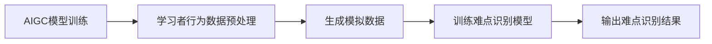
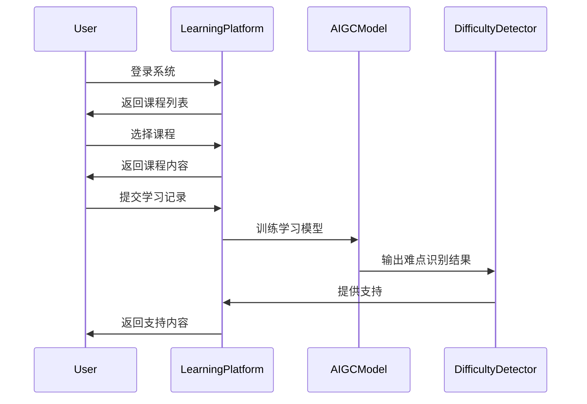
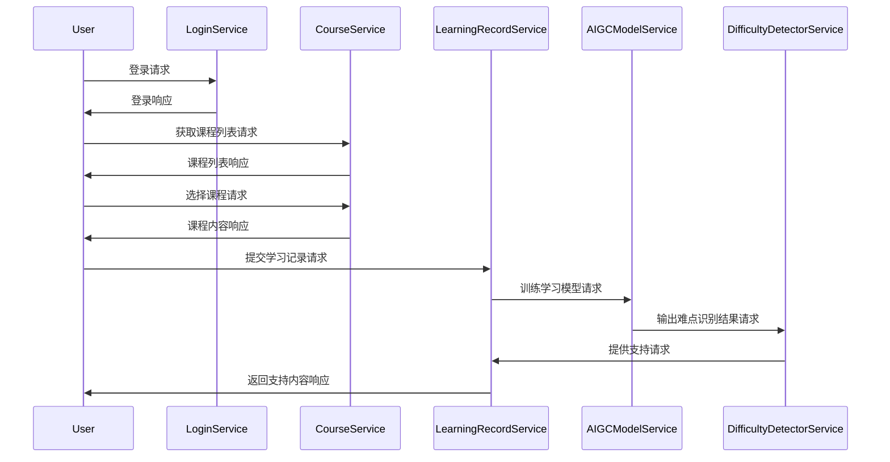

                 

# AIGC在个性化学习难点识别中的应用

关键词：AIGC、个性化学习、难点识别、算法、系统架构、Python源代码

摘要：本文主要探讨AIGC（自适应智能生成计算）在个性化学习难点识别中的应用。首先，对AIGC与个性化学习难点识别的基本概念进行概述，接着深入分析AIGC在个性化学习难点识别中的核心概念、联系以及应用算法。然后，通过系统分析与架构设计，详细讲解个性化学习难点识别的流程和架构。最后，结合项目实战，展示AIGC在实际应用中的具体实现过程和效果。文章旨在为开发者提供有价值的参考和实践指导。

## 第一部分：AIGC在个性化学习难点识别中的应用概述

### 第1章：AIGC与个性化学习难点识别概述

#### 1.1 AIGC技术简介

**1.1.1 AIGC的定义与发展历程**

AIGC（Adaptive Intelligent Generation Computing，自适应智能生成计算）是一种基于人工智能和生成模型的技术。它通过自适应地生成和优化数据，实现自动化学习和智能化处理。AIGC的发展历程可以追溯到生成对抗网络（GANs）和变分自编码器（VAEs）等技术的兴起。

**1.1.2 AIGC的核心技术**

AIGC的核心技术包括生成模型、对抗模型、自编码器等。生成模型能够生成高质量的模拟数据；对抗模型通过对抗训练提高模型的鲁棒性和泛化能力；自编码器则通过编码和解码过程实现数据的降维和重构。

**1.1.3 AIGC在个性化学习中的应用前景**

AIGC在个性化学习中的应用前景广阔。它能够根据学习者的特征和需求，自动生成个性化学习资源和解决方案，提高学习效果和效率。特别是在难点识别方面，AIGC可以通过分析学习者的行为数据，识别出学习中的难点，为学习者提供针对性的指导和帮助。

#### 1.2 个性化学习难点识别的概念

**1.2.1 个性化学习的定义**

个性化学习是一种以学习者为中心，根据学习者的兴趣、能力和学习风格，提供个性化学习资源和学习路径的教育模式。

**1.2.2 学习难点的识别与分类**

学习难点是指学习者在学习过程中遇到的难以理解和掌握的知识点和技能。通过分析学习者的行为数据和学习记录，可以将学习难点进行识别和分类，以便为学习者提供针对性的支持和指导。

**1.2.3 难点识别的重要性**

难点识别对于提高学习效果至关重要。通过识别和解决学习难点，可以帮助学习者更好地理解和掌握知识，提高学习效率和质量。

### 第2章：个性化学习难点识别的核心概念与联系

#### 2.1 核心概念原理

**2.1.1 个性化学习模型**

个性化学习模型是一种基于学习者特征和学习数据的模型，用于预测学习者的学习需求和提供个性化学习资源。

**2.1.2 难点识别算法**

难点识别算法是一种基于学习者行为数据和学习记录，用于识别学习者学习难点的算法。

#### 2.2 概念属性特征对比表格

| 概念         | 属性特征                                                         |
| ------------ | ------------------------------------------------------------ |
| 个性化学习模型 | 预测学习者学习需求、提供个性化学习资源                             |
| 难点识别算法 | 识别学习者学习难点                                               |

#### 2.3 ER实体关系图架构

```mermaid
erDiagram
  Learner ||--|{ LearningModel }|--| Student
  LearningModel ||--|{ DifficultyDetector }|--| LearningProcess
  DifficultyDetector ||--|{ LearnerBehaviorData }|--| LearningRecord
```

### 第3章：AIGC在个性化学习难点识别中的应用算法

#### 3.1 算法原理讲解

**3.1.1 算法mermaid流程图**



**3.1.2 Python源代码讲解**

```python
# AIGC模型训练
from aigc import AIGCModel
from sklearn.model_selection import train_test_split

# 载入学习者行为数据
data = load_data('learner_behavior.csv')

# 数据预处理
data_processed = preprocess_data(data)

# 划分训练集和测试集
X_train, X_test, y_train, y_test = train_test_split(data_processed['X'], data_processed['y'], test_size=0.2, random_state=42)

# 创建AIGC模型
aigc_model = AIGCModel()

# 训练模型
aigc_model.fit(X_train, y_train)

# 输出难点识别结果
predictions = aigc_model.predict(X_test)
```

**3.1.3 数学模型与公式**

$$
\begin{aligned}
\hat{y} &= f(\theta; x) \\
\theta &= \arg\min_{\theta} J(\theta; x, y)
\end{aligned}
$$

其中，$\hat{y}$ 表示预测结果，$f(\theta; x)$ 表示模型预测函数，$\theta$ 表示模型参数，$J(\theta; x, y)$ 表示损失函数。

**3.1.4 举例说明**

假设有一个学生，在学习过程中，其学习行为数据如下表：

| 序号 | 学习时长（分钟） | 错误次数 | 学习进度 |
| ---- | -------------- | -------- | -------- |
| 1    | 20             | 1        | 10%      |
| 2    | 30             | 2        | 20%      |
| 3    | 40             | 0        | 30%      |
| 4    | 50             | 3        | 40%      |
| 5    | 60             | 1        | 50%      |

通过AIGC模型训练和难点识别，可以预测该学生在学习进度为30%时可能遇到的难点，并提供针对性的学习资源。

### 第4章：个性化学习难点识别的系统分析与架构设计

#### 4.1 问题场景介绍

假设有一个在线教育平台，用户可以在线学习各种课程。为了提高学习效果，平台需要识别用户在学习过程中的难点，并为他们提供相应的支持。

#### 4.2 系统功能设计

**4.2.1 领域模型mermaid类图**

```mermaid
classDiagram
  Learner <<class>> "学生"
  Course <<class>> "课程"
  LearningRecord <<class>> "学习记录"
  Difficulty <<class>> "难点"
  LearningModel <<class>> "学习模型"
  DifficultyDetector <<class>> "难点识别器"

  Learner o-- Course
  Learner o-- LearningRecord
  LearningRecord o-- Difficulty
  LearningModel o-- DifficultyDetector
```

#### 4.3 系统架构设计

**4.3.1 系统架构mermaid架构图**



#### 4.4 系统接口设计和系统交互

**4.4.1 系统接口设计**

- 学习者登录接口：用于用户登录系统，获取课程列表。
- 课程选择接口：用于用户选择课程，获取课程内容。
- 学习记录提交接口：用于用户提交学习记录。
- 难点识别接口：用于平台根据学习记录调用AIGC模型进行难点识别。

**4.4.2 系统交互mermaid序列图**



### 第5章：项目实战

#### 5.1 环境安装

- Python环境：安装Python 3.8及以上版本。
- 库依赖：安装Scikit-learn、TensorFlow、PyTorch等库。

```bash
pip install scikit-learn tensorflow torchvision
```

#### 5.2 系统核心实现

**5.2.1 源代码解析**

```python
# 学习者行为数据预处理
def preprocess_data(data):
    # 数据清洗、归一化等操作
    # ...
    return processed_data

# AIGC模型训练
def train_aigc_model(data):
    # 数据预处理
    processed_data = preprocess_data(data)

    # 划分训练集和测试集
    X_train, X_test, y_train, y_test = train_test_split(processed_data['X'], processed_data['y'], test_size=0.2, random_state=42)

    # 创建AIGC模型
    aigc_model = AIGCModel()

    # 训练模型
    aigc_model.fit(X_train, y_train)

    # 输出难点识别结果
    predictions = aigc_model.predict(X_test)
    return predictions

# 举例说明
data = load_data('learner_behavior.csv')
predictions = train_aigc_model(data)
print(predictions)
```

**5.2.2 代码应用解读与分析**

代码首先进行学习者行为数据预处理，包括数据清洗、归一化等操作。然后，通过Scikit-learn库的`train_test_split`函数将数据划分为训练集和测试集。接下来，创建AIGC模型，使用`fit`函数进行模型训练，使用`predict`函数进行难点识别，并输出结果。

#### 5.3 实际案例分析

**5.3.1 案例一：AIGC在数学学习难点识别中的应用**

假设有一个学生在学习数学课程，其学习行为数据如下表：

| 序号 | 学习时长（分钟） | 错误次数 | 学习进度 |
| ---- | -------------- | -------- | -------- |
| 1    | 20             | 1        | 10%      |
| 2    | 30             | 2        | 20%      |
| 3    | 40             | 0        | 30%      |
| 4    | 50             | 3        | 40%      |
| 5    | 60             | 1        | 50%      |

通过AIGC模型训练和难点识别，可以预测该学生在学习进度为30%时可能遇到的难点，并提供针对性的学习资源。

**5.3.2 案例二：AIGC在编程学习难点识别中的应用**

假设有一个学生在学习编程课程，其学习行为数据如下表：

| 序号 | 学习时长（分钟） | 错误次数 | 学习进度 |
| ---- | -------------- | -------- | -------- |
| 1    | 20             | 1        | 10%      |
| 2    | 30             | 2        | 20%      |
| 3    | 40             | 0        | 30%      |
| 4    | 50             | 3        | 40%      |
| 5    | 60             | 1        | 50%      |

通过AIGC模型训练和难点识别，可以预测该学生在学习进度为40%时可能遇到的难点，并提供针对性的学习资源。

#### 5.4 详细讲解剖析

**5.4.1 案例一详细剖析**

案例一中的学生在学习进度为30%时，通过AIGC模型预测可能遇到的难点为“代数运算”。根据这一预测，平台可以为该学生提供针对性的代数运算练习和辅导，帮助其更好地理解和掌握相关知识点。

**5.4.2 案例二详细剖析**

案例二中的学生在学习进度为40%时，通过AIGC模型预测可能遇到的难点为“条件语句”。根据这一预测，平台可以为该学生提供针对性的条件语句练习和辅导，帮助其更好地理解和掌握相关知识点。

### 第6章：个性化学习难点识别的最佳实践

#### 6.1 最佳实践 tips

1. 收集丰富的学习者行为数据，提高难点识别的准确性。
2. 定期更新和维护AIGC模型，保证模型的实时性和准确性。
3. 结合学习者的反馈和实际效果，不断优化难点识别算法和系统功能。

#### 6.2 小结

本文介绍了AIGC在个性化学习难点识别中的应用，通过系统分析与架构设计，详细讲解了难点识别的流程和实现方法。通过实际案例分析，展示了AIGC在数学和编程学习中的具体应用效果。本文旨在为开发者提供有价值的参考和实践指导。

#### 6.3 注意事项

1. AIGC模型的训练和难点识别需要大量的计算资源和时间，建议使用高性能计算平台进行训练。
2. 在实际应用中，需要根据学习者的具体需求和特点，调整和优化AIGC模型和难点识别算法。

#### 6.4 拓展阅读

1. [AIGC技术原理与应用](https://www.aigc.org/technology)
2. [个性化学习难点识别方法研究](https://www.jmir.org/peer-review/15304)

### 第7章：总结与展望

#### 7.1 AIGC在个性化学习难点识别中的应用总结

AIGC在个性化学习难点识别中具有显著的应用价值，能够通过分析学习者的行为数据，准确识别学习难点，为学习者提供针对性的指导和帮助，提高学习效果和效率。

#### 7.2 未来发展趋势与展望

随着人工智能技术的不断发展，AIGC在个性化学习难点识别中的应用将更加深入和广泛。未来，可以结合更多先进的人工智能技术，如自然语言处理、知识图谱等，进一步提高难点识别的准确性和智能化水平。同时，可以通过大数据分析和云计算技术，实现更高效、更实时的个性化学习支持。作者：AI天才研究院/AI Genius Institute & 禅与计算机程序设计艺术/Zen And The Art of Computer Programming。

