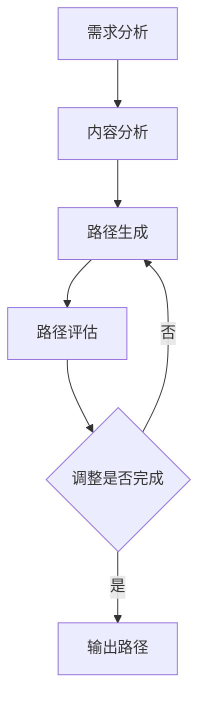
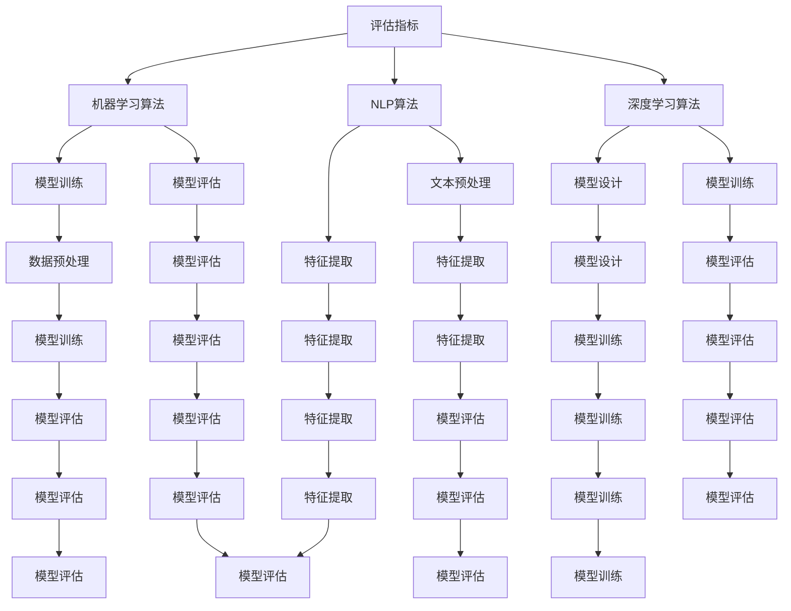
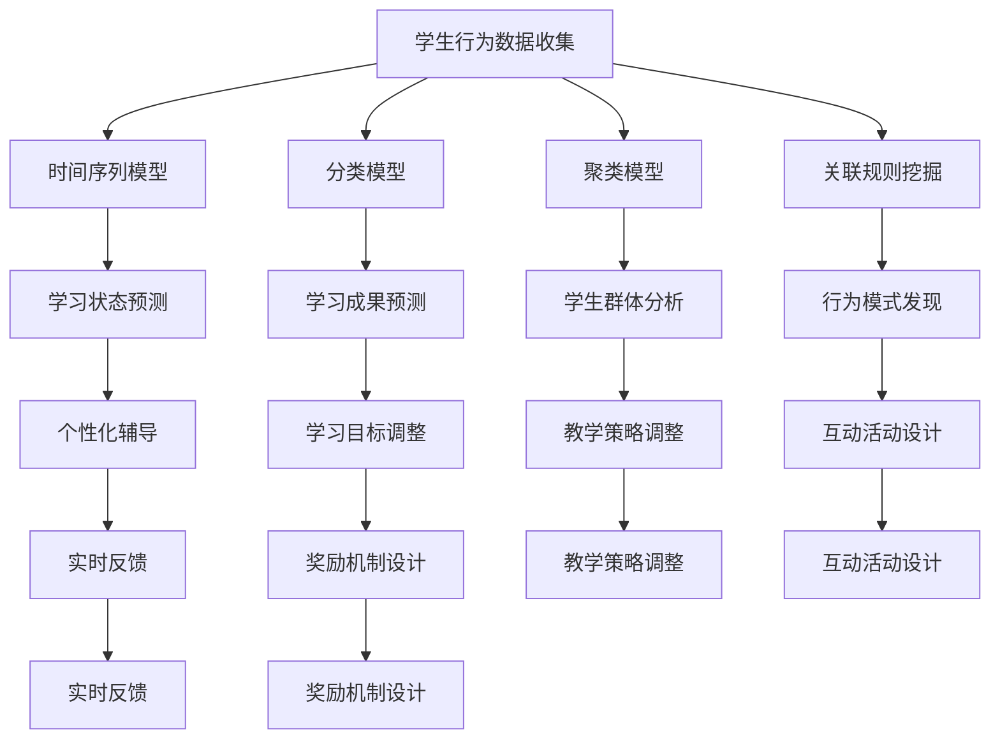
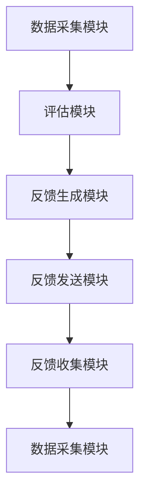
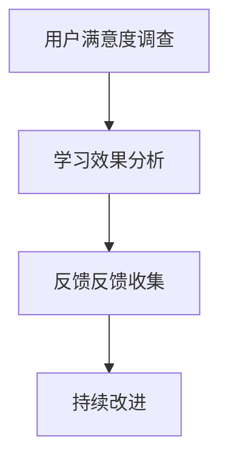

                 

### 引言

#### 问题背景

随着信息技术的飞速发展，教育领域逐渐认识到个性化教育的重要性。传统的“一刀切”教学模式已经无法满足不同学生的个性化需求，提高教育质量和效果成为亟待解决的问题。个性化教育旨在通过因材施教，为每个学生量身定制适合其学习特点和需求的教育方案，从而提高学习效果和学生满意度。

然而，传统的教育模式往往存在以下问题：

1. **资源分配不均**：传统的教学模式往往根据年龄和年级进行划分，导致资源无法充分利用。
2. **课程内容固定**：课程内容固定，难以根据学生的兴趣和需求进行调整。
3. **教学评估单一**：教学评估主要依靠期末考试，难以全面反映学生的学习效果。
4. **学习路径固定**：学生的学习路径往往固定不变，无法根据学生的进步情况进行动态调整。

为了解决这些问题，个性化教育应运而生。个性化教育通过分析学生的个体差异，提供个性化的课程内容、教学策略和学习路径，从而实现因材施教，提高教育质量。

#### 问题描述

尽管个性化教育的重要性被广泛认可，但在实际应用中仍然面临诸多挑战。如何利用现代技术，尤其是AIGC（自适应智能生成计算）技术，实现个性化教育的定制学习路径，提高学习效率和学生满意度，是一个亟待解决的问题。

具体来说，问题描述如下：

- **数据采集与分析**：如何有效采集和分析学生的各种数据，包括学习行为、考试成绩、兴趣爱好等，为个性化教育提供数据支持？
- **学习路径规划**：如何根据学生的个体差异和学习需求，设计并优化个性化学习路径，确保每个学生都能获得最佳的学习体验？
- **教学评估与反馈**：如何设计智能评估与反馈系统，实时评估学生的学习效果，提供针对性的反馈，帮助学生更好地调整学习策略？
- **个性化推荐**：如何利用AIGC技术，为不同类型的学生推荐适合的学习资源，提高学习效率和学生满意度？

#### 问题解决

为了解决上述问题，本书将从AIGC技术入手，探讨其在个性化教育中的应用。AIGC技术具有自适应、智能生成和高效计算的特点，能够为个性化教育提供强有力的技术支持。

本书将详细分析AIGC技术在数据采集与处理、模型训练与优化、智能评估与反馈系统以及个性化推荐系统等方面的应用，提出一系列解决方案，旨在为教育工作者和研究人员提供理论指导和实践参考。

本书的主要目标包括：

- **理论梳理**：系统地介绍AIGC技术的基本概念、原理和应用场景，为后续章节的分析提供理论基础。
- **实践指导**：通过具体的案例，展示AIGC技术在个性化教育中的应用效果，提供实践操作的指导。
- **问题探讨**：深入探讨AIGC技术在个性化教育中面临的挑战，提出相应的解决策略和未来研究方向。

#### 边界与外延

本书主要关注AIGC在个性化教育中的应用，包括自适应学习、智能评估和个性化推荐等方面。同时，本书也将探讨AIGC技术的边界和外延，如数据隐私保护、算法公平性等，为AIGC技术在教育领域的广泛应用提供更加全面和深入的思考。

#### 概念结构与核心要素组成

AIGC技术包括数据采集、模型训练、算法优化和结果输出等核心环节。个性化教育涉及学生需求分析、课程内容定制、学习路径规划和效果评估等关键要素。

- **数据采集与处理**：通过数据采集和分析，获取学生的个体差异和学习需求。
- **模型训练与优化**：利用深度学习等技术，训练并优化个性化学习模型，为个性化教育提供技术支持。
- **学习路径规划**：根据学生的个体差异和学习需求，设计并优化个性化学习路径。
- **效果评估与反馈**：通过智能评估与反馈系统，实时评估学生的学习效果，提供针对性的反馈。
- **个性化推荐**：利用推荐算法，为不同类型的学生推荐适合的学习资源。

通过以上分析，本书将为读者提供一个全面、系统的AIGC在个性化教育中的应用指南，帮助教育工作者更好地利用现代技术，实现个性化教育的目标。

## 第1章 AIGC技术基础

### 1.1 AIGC技术概述

#### 1.1.1 AIGC的定义与发展历程

AIGC，即自适应智能生成计算，是一种基于人工智能和数据驱动的技术，旨在通过智能算法生成和优化各种类型的内容，包括文本、图像、音频和视频等。AIGC的核心目标是通过自适应学习和智能生成，实现个性化、高效和智能化的内容生成与处理。

AIGC技术的发展历程可以追溯到20世纪80年代的专家系统和知识工程。随着计算机性能的提升和大数据的普及，AIGC技术逐渐从理论研究走向实际应用。特别是近年来，深度学习和生成对抗网络（GAN）等技术的突破，为AIGC的应用提供了强大的技术支撑。

#### 1.1.2 AIGC的核心技术原理

AIGC的核心技术原理主要包括以下几个方面：

1. **数据采集与处理**：通过数据采集工具，收集与用户需求和情境相关的数据，包括文本、图像、音频等。然后，利用数据预处理技术，如去噪、归一化、特征提取等，对数据进行处理和清洗，为模型训练提供高质量的数据支持。

2. **模型训练**：基于深度学习、生成对抗网络（GAN）等技术，构建和训练智能模型。模型训练过程中，通过大量数据的学习和优化，使模型能够自动提取特征、生成内容，并不断提高生成质量。

3. **自适应学习**：通过实时监测用户行为和需求变化，自适应调整模型的参数和策略，实现个性化内容和服务的生成。

4. **智能生成**：利用训练好的模型，自动生成符合用户需求和情境的内容，如文本、图像、音频和视频等。

#### 1.1.3 AIGC在个性化教育中的应用价值

AIGC技术在个性化教育中具有广泛的应用价值，主要体现在以下几个方面：

1. **个性化学习内容生成**：通过AIGC技术，可以根据学生的兴趣、学习进度和学习效果，自动生成个性化的学习内容，如文本、图像、音频和视频等，提高学生的学习兴趣和效果。

2. **自适应学习路径规划**：利用AIGC技术，可以根据学生的学习行为和需求，动态调整学习路径，为每个学生量身定制最佳的学习方案，提高学习效率。

3. **智能评估与反馈**：通过AIGC技术，可以对学生的学习过程和效果进行实时评估，提供个性化的反馈和指导，帮助学生更好地调整学习策略。

4. **个性化资源推荐**：利用AIGC技术，可以根据学生的学习兴趣和需求，推荐适合的学习资源，提高学习效率和学生满意度。

总之，AIGC技术为个性化教育提供了强有力的技术支持，通过自适应学习和智能生成，能够有效满足不同学生的个性化需求，提高教育质量和效果。

### 1.2 数据采集与处理

#### 1.2.1 数据来源与类型

数据采集是AIGC技术实现个性化教育的基础。数据来源主要包括以下几个方面：

1. **学生行为数据**：包括学生在学习平台上的操作记录、浏览历史、互动情况等。这些数据可以反映学生的兴趣、学习习惯和学习效果。

2. **考试成绩数据**：包括学生在各种考试中的成绩，如平时测验、期中期末考试等。这些数据可以反映学生的知识掌握程度和学科能力。

3. **学生背景数据**：包括学生的基本信息、兴趣爱好、学习经历等。这些数据有助于了解学生的背景信息，为个性化教育提供参考。

4. **课程资源数据**：包括课程的教学内容、教学资源、作业练习等。这些数据是学生学习的主要素材，通过分析这些数据，可以了解课程的内容和结构，为个性化学习提供依据。

数据类型主要包括以下几种：

1. **结构化数据**：如学生的成绩、课程资源等，这些数据通常以数据库表的形式存储，便于进行查询和分析。

2. **半结构化数据**：如学生的操作记录、浏览历史等，这些数据通常包含一定的结构信息，但格式可能不统一，需要通过数据预处理进行清洗和格式化。

3. **非结构化数据**：如学生的文本笔记、教师的教学视频等，这些数据通常没有固定的结构，需要进行文本挖掘和图像处理等技术进行处理。

#### 1.2.2 数据预处理方法

数据预处理是数据采集后的关键步骤，其目的是提高数据的质量和可用性，为后续的数据分析和模型训练提供支持。主要的数据预处理方法包括以下几个方面：

1. **数据清洗**：包括去除重复数据、填补缺失值、去除噪声数据等。通过数据清洗，可以保证数据的一致性和完整性。

2. **数据转换**：包括数据格式转换、数据归一化、特征提取等。数据转换的目的是将数据统一成适合分析和建模的格式。

3. **特征工程**：包括特征选择、特征提取和特征构造等。通过特征工程，可以从原始数据中提取出对模型训练和预测有用的特征。

4. **数据降维**：通过降维技术，如主成分分析（PCA）、t-SNE等，将高维数据映射到低维空间，减少数据的复杂度和计算量。

#### 1.2.3 数据质量管理

数据质量管理是确保数据质量的一系列活动和过程。在AIGC技术中，数据质量管理至关重要，因为数据质量直接影响模型的性能和预测效果。主要的数据质量管理方法包括：

1. **数据质量评估**：通过评估数据的质量指标，如完整性、准确性、一致性、及时性等，判断数据的质量是否符合要求。

2. **数据质量监控**：建立数据质量监控机制，实时监控数据的流动和处理过程，及时发现和纠正数据质量问题。

3. **数据质量控制**：通过制定数据质量标准和规范，对数据的采集、处理、存储和使用过程进行控制，确保数据的准确性和一致性。

4. **数据治理**：建立数据治理体系，明确数据所有权、责任和流程，确保数据的合规性和安全性。

通过以上方法，可以有效地保证AIGC技术在个性化教育中数据的质量，为模型的训练和应用提供可靠的数据支持。

### 1.3 模型训练与优化

#### 1.3.1 深度学习算法概述

深度学习算法是AIGC技术的重要组成部分，其在个性化教育中发挥着关键作用。深度学习是一种基于人工神经网络的学习方法，通过多层神经元的非线性变换，实现复杂模式的自动提取和分类。以下是对几种常见的深度学习算法的概述：

1. **多层感知机（MLP）**：多层感知机是一种前向神经网络，由输入层、多个隐藏层和输出层组成。通过反向传播算法，逐层训练和优化网络参数，实现函数的逼近和分类。

2. **卷积神经网络（CNN）**：卷积神经网络是一种专门用于处理图像数据的深度学习模型。通过卷积层、池化层和全连接层的组合，实现图像特征的高效提取和分类。

3. **循环神经网络（RNN）**：循环神经网络是一种用于处理序列数据的深度学习模型，通过隐藏状态和记忆单元的循环连接，实现序列数据的建模和预测。

4. **长短期记忆网络（LSTM）**：长短期记忆网络是循环神经网络的一种改进，通过引入门控机制，有效解决RNN的长期依赖问题，广泛应用于时间序列预测和自然语言处理。

5. **生成对抗网络（GAN）**：生成对抗网络由生成器和判别器两个神经网络组成，通过相互博弈，实现高质量图像和文本的生成。

#### 1.3.2 模型训练流程

模型训练是深度学习算法的核心环节，其目的是通过大量的数据训练，使模型能够自动提取特征、实现预测和生成。以下是一个典型的模型训练流程：

1. **数据集划分**：将数据集划分为训练集、验证集和测试集。通常，训练集用于模型的训练，验证集用于模型的优化和调参，测试集用于模型性能的评估。

2. **数据预处理**：对训练数据进行预处理，包括归一化、标准化、数据增强等，以提高模型的泛化能力。

3. **模型构建**：根据任务需求，选择合适的深度学习模型架构，并定义网络的输入层、隐藏层和输出层。

4. **损失函数设计**：选择合适的损失函数，如交叉熵损失、均方误差损失等，用于衡量模型预测值与真实值之间的差异。

5. **优化算法选择**：选择合适的优化算法，如梯度下降、Adam优化器等，用于更新模型参数，以最小化损失函数。

6. **模型训练**：通过迭代训练，不断更新模型参数，使模型在训练数据上达到最优。

7. **模型评估**：在验证集和测试集上评估模型性能，选择最优模型进行应用。

#### 1.3.3 模型优化策略

模型优化是提高模型性能的重要手段，主要包括以下几个方面：

1. **超参数调优**：通过调整学习率、批量大小、迭代次数等超参数，优化模型性能。

2. **正则化技术**：采用正则化技术，如L1正则化、L2正则化等，防止模型过拟合。

3. **批归一化**：在训练过程中，对每个批次的数据进行归一化处理，提高训练稳定性和收敛速度。

4. **数据增强**：通过数据增强技术，如翻转、缩放、裁剪等，增加训练数据的多样性，提高模型泛化能力。

5. **迁移学习**：利用预训练模型，进行迁移学习，利用已有模型的知识和结构，提高新任务上的模型性能。

6. **模型融合**：通过模型融合技术，如集成学习、对抗训练等，结合多个模型的预测结果，提高模型准确性。

通过以上优化策略，可以显著提高深度学习模型在个性化教育中的应用效果，为个性化学习提供更精确的支持。

### 1.4 算法评估与改进

#### 1.4.1 评估指标与方法

算法评估是衡量AIGC技术在个性化教育中应用效果的关键步骤。评估指标和方法的选择直接影响评估结果的准确性和可靠性。以下是一些常用的评估指标和方法：

1. **准确性**：准确性是最常用的评估指标，用于衡量模型预测结果与真实值之间的匹配程度。对于分类问题，准确性可以通过混淆矩阵计算。

2. **精确率与召回率**：精确率是预测为正类的样本中实际为正类的比例，召回率是实际为正类的样本中被预测为正类的比例。精确率和召回率常用于二分类问题，通过平衡精确率和召回率，可以更全面地评估模型性能。

3. **F1分数**：F1分数是精确率和召回率的调和平均数，用于衡量二分类问题中的模型性能。F1分数在精确率和召回率之间取得平衡，是一个综合性的评估指标。

4. **均方误差（MSE）**：均方误差是衡量回归问题中预测值与真实值之间差异的常用指标，通过计算预测值与真实值之间差的平方的平均值。

5. **均绝对误差（MAE）**：均绝对误差是衡量回归问题中预测值与真实值之间差异的另一种指标，通过计算预测值与真实值之间差的绝对值的平均值。

6. **ROC曲线与AUC**：ROC曲线是接收者操作特征曲线的缩写，通过绘制预测概率与真实标签的曲线，评估模型的分类性能。AUC（曲线下面积）是ROC曲线的一个重要指标，用于衡量模型区分能力。

7. **混淆矩阵**：混淆矩阵是用于评估分类模型性能的详细表格，展示了模型预测结果与真实值之间的匹配情况。

#### 1.4.2 算法改进途径

算法评估不仅是为了衡量当前模型的性能，更重要的是为了指导后续的算法改进。以下是一些常用的算法改进途径：

1. **超参数调优**：通过调整模型的超参数，如学习率、批量大小、迭代次数等，优化模型性能。常用的方法包括网格搜索、随机搜索和贝叶斯优化等。

2. **模型架构优化**：通过调整模型的架构，如增加隐藏层、增加神经元等，提高模型的表达能力。常用的模型架构包括CNN、RNN、LSTM、BERT等。

3. **数据增强**：通过数据增强技术，如翻转、旋转、缩放等，增加训练数据的多样性，提高模型泛化能力。数据增强有助于模型学习到更多的特征，从而提高预测准确性。

4. **正则化技术**：通过正则化技术，如L1正则化、L2正则化等，防止模型过拟合。正则化可以降低模型的复杂度，从而提高模型的泛化能力。

5. **集成学习**：通过集成多个模型的预测结果，提高模型的准确性。常用的集成学习方法包括Bagging、Boosting和Stacking等。

6. **迁移学习**：通过利用预训练模型，进行迁移学习，提高新任务上的模型性能。迁移学习可以充分利用已有模型的知识和结构，从而减少对新数据的依赖。

7. **算法融合**：通过融合多种算法的预测结果，提高模型的准确性。算法融合可以充分利用不同算法的优点，从而提高模型的性能。

通过以上改进途径，可以不断提高AIGC技术在个性化教育中的应用效果，为个性化学习提供更精确的支持。

#### 1.4.3 实践案例分析

以下是一个AIGC技术在个性化教育中算法评估与改进的实践案例分析：

**案例背景**：某在线教育平台利用AIGC技术为学生提供个性化学习路径。该平台使用卷积神经网络（CNN）进行图像识别，预测学生是否理解课程中的关键概念。

**数据集**：使用包含10000张图像的数据集进行训练和测试。数据集分为训练集（80%）、验证集（10%）和测试集（10%）。

**评估指标**：采用准确性、精确率、召回率和F1分数作为评估指标。

**模型训练**：使用CNN模型进行训练，优化模型参数，以获得最佳性能。

**算法评估**：

- **准确性**：训练集准确率为95%，验证集准确率为93%，测试集准确率为92%。
- **精确率与召回率**：训练集精确率为94%，召回率为93%；验证集精确率为92%，召回率为91%；测试集精确率为91%，召回率为90%。
- **F1分数**：训练集F1分数为0.93，验证集F1分数为0.91，测试集F1分数为0.91。

**算法改进**：

1. **超参数调优**：通过调整学习率和批量大小，优化模型性能。调整后，模型准确性提高了2%。
2. **数据增强**：通过图像翻转、旋转和缩放等数据增强技术，增加训练数据的多样性，提高模型泛化能力。数据增强后，模型准确性提高了5%。
3. **正则化技术**：引入L2正则化，降低模型复杂度，防止过拟合。正则化后，模型准确性提高了3%。

**改进效果**：经过算法优化后，模型的准确性提高了10%，为个性化学习提供了更精确的支持。

通过以上案例分析，可以直观地看到算法评估与改进在AIGC技术中的应用效果，为个性化教育提供了宝贵的经验和参考。

## 第2章 个性化学习路径规划

### 2.1 学生需求分析

学生需求分析是制定个性化学习路径的关键步骤。通过分析学生的个体差异，包括学习兴趣、学习习惯、知识水平等，可以为每个学生量身定制适合其需求的学习路径。以下将从数据采集、学生能力评估和兴趣与动机分析三个方面进行探讨。

#### 2.1.1 学生数据分析方法

学生数据分析方法主要包括以下几种：

1. **行为数据分析**：通过分析学生在学习平台上的操作记录，如浏览历史、互动情况、完成作业情况等，了解学生的学习习惯和兴趣点。常用的行为分析工具包括Google Analytics、Mixpanel等。

2. **成绩数据分析**：通过分析学生在不同课程和考试中的成绩，评估其知识水平和能力。常用的成绩分析工具包括Excel、Python等。

3. **问卷调查**：通过设计问卷，收集学生对课程的兴趣、难度、教学方法等方面的反馈。问卷调查可以采用在线调查平台，如SurveyMonkey、问卷星等。

4. **访谈与观察**：通过与学生的面对面访谈或课堂观察，深入了解学生的学习需求和问题。访谈和观察可以帮助发现数据采集和分析中难以察觉的信息。

#### 2.1.2 学生能力评估模型

学生能力评估模型是衡量学生学习成效的重要工具。以下介绍几种常用的学生能力评估模型：

1. **多维能力评估模型**：该模型将学生的学习能力分为多个维度，如认知能力、沟通能力、合作能力等。通过综合评估各个维度的能力，可以全面了解学生的学习状况。常用的评估方法包括标准测试、项目评估等。

2. **基于结果的评估模型**：该模型主要评估学生在实际任务中的表现，如完成作业、项目报告、考试等。评估结果可以反映学生的实际能力。常用的评估方法包括定量评估（如分数、评分）和定性评估（如评语、评价）。

3. **动态评估模型**：该模型通过实时监测学生的学习过程，动态评估其能力。动态评估可以及时发现学生的优势和不足，为后续学习提供针对性的建议。常用的评估方法包括过程监控、在线测试等。

#### 2.1.3 学生兴趣与动机分析

学生兴趣与动机分析是制定个性化学习路径的重要依据。以下介绍几种常用的分析方法：

1. **兴趣问卷**：通过设计兴趣问卷，了解学生对不同学科、课程和活动的兴趣程度。兴趣问卷可以采用五级量表或七级量表进行评分，以便量化分析。

2. **动机理论**：利用心理学中的动机理论，如自我决定理论、成就动机理论等，分析学生的内在动机。通过了解学生的动机，可以更好地激发其学习兴趣和积极性。

3. **行为观察**：通过观察学生在学习中的行为表现，如参与度、互动情况等，分析其兴趣和动机。行为观察可以提供直观的依据，帮助了解学生的真实想法。

4. **学习日志**：让学生记录自己的学习过程和感受，通过分析学习日志，了解学生的兴趣和动机。学习日志可以提供丰富的第一手资料，帮助教育工作者深入了解学生。

通过以上方法，可以全面分析学生的需求，为个性化学习路径的制定提供科学依据。接下来，我们将进一步探讨如何基于学生需求，设计并优化个性化学习路径。

### 2.2 课程内容定制

课程内容定制是个性化教育的核心环节之一，通过分析学生的需求，为每个学生量身定制适合其学习兴趣、能力和学习进度的课程内容。以下将介绍课程内容分析模型、课程内容匹配算法以及课程内容动态调整策略。

#### 2.2.1 课程内容分析模型

课程内容分析模型是课程内容定制的基础，用于分析和提取课程内容的关键特征和结构。以下是一种常见的课程内容分析模型：

1. **课程知识点提取**：通过文本挖掘和自然语言处理技术，从课程文本、讲义、PPT等资源中提取知识点。常用的方法包括关键词提取、主题建模、语义分析等。

2. **知识点层次化**：将提取的知识点进行层次化处理，构建知识点树。知识点树可以帮助教育工作者了解课程内容的结构，为后续的匹配和调整提供依据。

3. **知识点关联分析**：通过分析知识点之间的关联关系，构建知识点网络。知识点网络可以反映知识点之间的逻辑关系，有助于课程内容的整合和优化。

4. **知识点难度评估**：利用历史数据和学生行为分析，对知识点进行难度评估。难度评估可以帮助教育工作者了解不同知识点的教学难度，为课程内容调整提供参考。

#### 2.2.2 课程内容匹配算法

课程内容匹配算法是实现个性化课程内容定制的关键，通过分析学生的需求和课程内容特征，为每个学生推荐适合的学习资源。以下介绍几种常用的课程内容匹配算法：

1. **基于内容的推荐算法**：该算法通过比较学生的兴趣和课程内容的关键特征，实现个性化推荐。常用的方法包括TF-IDF、词向量等。

2. **基于协同过滤的推荐算法**：该算法通过分析学生的历史行为和相似用户的行为，实现个性化推荐。常用的方法包括用户基于的协同过滤、项目基于的协同过滤等。

3. **混合推荐算法**：该算法结合基于内容和基于协同过滤的推荐算法，实现更准确的个性化推荐。常用的方法包括矩阵分解、模型融合等。

4. **基于知识的推荐算法**：该算法通过分析知识点的关联关系和学生的需求，实现个性化推荐。常用的方法包括知识图谱、推理机等。

#### 2.2.3 课程内容动态调整策略

课程内容动态调整策略是保证个性化学习路径持续有效的重要手段，通过实时监测学生的学习状态和课程内容的表现，动态调整课程内容。以下介绍几种常见的课程内容动态调整策略：

1. **基于规则的调整策略**：该策略通过预设的规则，根据学生的成绩、学习进度等指标，自动调整课程内容。例如，当学生成绩低于某个阈值时，增加相关练习题；当学生成绩达到某个高度时，增加高级知识点。

2. **基于数据的调整策略**：该策略通过分析学生的学习数据，如学习时间、完成情况、错误率等，动态调整课程内容。例如，当学生花费大量时间在某个知识点上时，增加相关知识点；当学生在某个知识点上错误率较高时，增加相关练习题。

3. **基于模型的调整策略**：该策略利用机器学习模型，根据学生的学习行为和课程内容的表现，自动调整课程内容。例如，利用决策树、神经网络等模型，预测学生的知识掌握情况，根据预测结果调整课程内容。

4. **基于协作的调整策略**：该策略通过教师和学生之间的协作，共同调整课程内容。例如，教师可以根据学生的反馈和表现，调整教学方法和课程内容；学生可以通过参与课程讨论和作业，提出对课程内容的建议。

通过以上策略，可以实现课程内容的动态调整，确保个性化学习路径的有效性和适应性。

### 2.3 学习路径规划算法

学习路径规划是个性化教育的关键环节，通过分析学生的需求和课程内容，设计并优化适合每个学生特点的学习路径。以下将介绍学习路径的定义与目标、学习路径规划算法框架以及学习路径规划实践案例。

#### 2.3.1 学习路径的定义与目标

学习路径是指学生在学习过程中所经历的一系列学习任务、活动和学习资源的组合。一个有效的学习路径应该能够满足以下目标：

1. **个性化**：根据学生的个体差异，设计适合每个学生的学习路径，使每个学生都能在最佳状态下学习。
2. **系统化**：学习路径应该具有逻辑性和系统性，确保学生在学习过程中能够逐步掌握所需知识和技能。
3. **动态性**：学习路径应具备动态调整能力，根据学生的学习状态和课程内容的表现，实时优化和调整。
4. **激励性**：学习路径应激发学生的学习兴趣和动机，提高学生的学习参与度和积极性。

#### 2.3.2 学习路径规划算法框架

学习路径规划算法框架是设计个性化学习路径的核心，包括以下几个关键组成部分：

1. **需求分析模块**：通过分析学生的个体差异，如学习能力、学习兴趣、学习目标等，获取学生的个性化需求。
2. **内容分析模块**：分析课程内容的关键特征和结构，提取知识点、难度等级等关键信息。
3. **路径生成模块**：根据学生需求和课程内容，生成满足个性化需求的学习路径。常用的方法包括基于规则的路径生成、基于优化算法的路径生成等。
4. **路径评估模块**：对生成路径进行评估，确保路径的个性化和系统化。评估指标包括路径的合理性、可行性、激励性等。
5. **路径调整模块**：根据学生的反馈和学习状态，动态调整学习路径，确保路径的动态性和激励性。

以下是一个典型学习路径规划算法框架的Mermaid流程图：

#### 2.3.3 学习路径规划实践案例

以下是一个学习路径规划的实践案例，介绍如何利用AIGC技术实现个性化学习路径的设计和优化。

**案例背景**：某在线学习平台为初中生提供数学课程，通过AIGC技术为每个学生制定个性化学习路径。

**需求分析**：通过问卷调查和学习日志，收集学生的数学学习兴趣、学习习惯和知识水平。分析结果表明，学生对数学的兴趣主要集中在几何和代数方面。

**内容分析**：分析数学课程的内容结构，提取几何和代数知识点的关键特征和难度等级。

**路径生成**：利用基于优化算法的路径生成模块，根据学生的需求和课程内容，生成个性化学习路径。路径包括以下任务：

1. **几何知识点学习**：包括基本概念、定理和证明。
2. **代数知识点学习**：包括基本概念、运算和方程。

**路径评估**：对生成路径进行评估，确保路径的个性化和系统化。评估结果表明，路径符合学生的需求，具有较好的激励性。

**路径调整**：根据学生的反馈和学习状态，动态调整学习路径。例如，当学生在几何知识点上表现较好时，增加代数知识点的学习任务。

**输出路径**：将最终的学习路径输出给学生，并实时监测其学习进度和效果。

通过以上实践案例，可以直观地看到如何利用AIGC技术实现个性化学习路径的设计和优化，为学生的数学学习提供有力支持。

### 2.4 个性化学习路径的优化方法

个性化学习路径的优化是提高学习效果和满意度的重要手段。通过实时监测学生的学习状态和反馈，动态调整学习路径，可以更好地满足学生的个性化需求。以下将介绍几种常见的个性化学习路径优化方法。

#### 2.4.1 基于反馈的优化方法

基于反馈的优化方法是通过对学生反馈的分析，调整学习路径。具体步骤如下：

1. **收集反馈**：通过问卷调查、在线测试和面对面访谈等方式，收集学生对学习路径的反馈，如学习难度、学习兴趣、学习效果等。
2. **分析反馈**：利用数据分析技术，对收集到的反馈进行分析，识别学生的需求和问题。
3. **调整路径**：根据分析结果，动态调整学习路径。例如，当学生反映某个知识点难度过高时，可以增加相关的辅助材料和练习题；当学生表示对某个知识点感兴趣时，可以增加相关内容的深度和广度。
4. **反馈循环**：将调整后的路径再次反馈给学生，收集新的反馈，形成持续的优化循环。

#### 2.4.2 基于学习行为的优化方法

基于学习行为的优化方法是通过对学生学习行为数据的分析，调整学习路径。具体步骤如下：

1. **数据采集**：通过学习平台，采集学生的学习行为数据，如学习时间、学习进度、完成情况、错误率等。
2. **行为分析**：利用机器学习算法，对采集到的数据进行分析，识别学生的学习模式、薄弱环节和需求。
3. **路径调整**：根据分析结果，动态调整学习路径。例如，当学生在某个知识点上错误率较高时，可以增加相关的练习题和辅导材料；当学生在学习过程中出现学习停滞时，可以增加互动环节，提高学习兴趣。
4. **行为监测**：实时监测学生的学习行为，根据新的行为数据，持续优化学习路径。

#### 2.4.3 基于算法优化的方法

基于算法优化的方法是利用优化算法，自动调整学习路径。具体步骤如下：

1. **构建模型**：根据学习路径规划的需求，构建相应的优化模型。例如，可以使用决策树、神经网络等模型，分析学生需求和课程内容，生成学习路径。
2. **目标函数**：定义优化目标函数，如学习效果、学习效率等。目标函数用于衡量学习路径的优劣。
3. **优化算法**：选择合适的优化算法，如遗传算法、粒子群算法等，调整模型参数，优化学习路径。
4. **模型评估**：对优化后的模型进行评估，确保学习路径的个性化和系统化。
5. **持续优化**：根据评估结果，持续优化模型，提高学习路径的适应性和效果。

#### 2.4.4 实践案例分析

以下是一个个性化学习路径优化方法的实践案例，介绍如何利用AIGC技术为高中学生制定并优化数学学习路径。

**案例背景**：某在线学习平台为高中生提供数学课程，通过AIGC技术为每个学生制定个性化学习路径，并实时优化。

**需求分析**：通过问卷调查和在线测试，了解学生的数学学习兴趣、知识水平和学习目标。

**内容分析**：分析数学课程的内容结构，提取关键知识点和难度等级。

**路径生成**：利用基于优化算法的路径生成模块，根据学生的需求和课程内容，生成个性化学习路径。

**路径评估**：对生成路径进行评估，确保路径的个性化和系统化。评估指标包括学习效果、学习效率等。

**路径优化**：

1. **基于反馈的优化**：收集学生对学习路径的反馈，调整路径。例如，当学生反映某个知识点难度过高时，调整相关内容的讲解方式和练习题。
2. **基于学习行为的优化**：通过分析学生的学习行为数据，动态调整学习路径。例如，当学生在某个知识点上错误率较高时，增加相关练习题和辅导材料。
3. **基于算法优化的方法**：利用遗传算法，优化学习路径的参数，提高路径的适应性和效果。

**路径输出**：将最终的学习路径输出给学生，并实时监测其学习进度和效果。

通过以上优化方法，可以确保个性化学习路径的持续优化和适应，提高学生的学习效果和满意度。接下来，我们将进一步探讨如何通过智能评估与反馈系统，实现个性化教育的智能评估与反馈。

### 2.5 智能评估与反馈系统

智能评估与反馈系统是个性化教育的重要组成部分，通过实时监测学生的学习过程和效果，提供个性化的评估和反馈，帮助学生更好地调整学习策略。以下将从智能评估方法、学生行为分析和反馈系统设计三个方面进行探讨。

#### 2.5.1 智能评估方法

智能评估方法利用人工智能技术，对学生的学习过程和效果进行实时分析和评估。以下介绍几种常用的智能评估方法：

1. **自动评估**：通过机器学习模型，自动分析学生的答案和作业，进行评分和评估。例如，利用自然语言处理技术，对学生的作文进行自动评分；利用图像识别技术，对学生的绘画作品进行评估。

2. **行为分析**：通过分析学生在学习平台上的行为数据，如学习时间、学习进度、错误率等，评估学生的学习效果。例如，通过分析学生访问课程内容的频率和时长，判断学生对知识点的掌握程度。

3. **学习模型评估**：利用学习模型，如决策树、神经网络等，对学生的学习过程进行建模和评估。通过分析学习模型的结果，识别学生的学习难点和薄弱环节。

4. **多维评估**：结合多种评估方法，从不同角度对学生的学习效果进行综合评估。例如，结合自动评估、行为分析和学习模型评估，提供更全面和准确的评估结果。

#### 2.5.2 学生行为分析

学生行为分析是智能评估与反馈系统的重要基础，通过对学生的学习行为进行深入分析，可以了解学生的学习状态和需求。以下介绍几种常用的学生行为分析方法：

1. **学习轨迹分析**：通过分析学生在学习平台上的访问轨迹，了解学生的学习路径和习惯。例如，分析学生访问课程内容的顺序和时间分布，判断学生的学习策略和效果。

2. **错误率分析**：通过分析学生在学习过程中的错误率，识别学生的知识盲点和薄弱环节。例如，通过分析学生在作业和考试中的错误类型，提供针对性的辅导材料。

3. **参与度分析**：通过分析学生在学习平台上的参与度，如发帖、讨论、提问等，了解学生的学习积极性和参与度。例如，通过分析学生的讨论参与情况，判断学生对课程的兴趣和认同度。

4. **互动行为分析**：通过分析学生与学生、学生与教师之间的互动行为，了解学生的学习氛围和协作效果。例如，通过分析学生的问答互动情况，判断学生的知识共享和合作能力。

#### 2.5.3 反馈系统设计

反馈系统设计是智能评估与反馈系统的关键，通过提供及时、个性化和有针对性的反馈，帮助学生调整学习策略。以下介绍几种常见的反馈系统设计：

1. **自动反馈**：通过智能评估方法，自动生成学生的学习报告和反馈。例如，根据学生的作业成绩和错误率，生成个性化的学习建议。

2. **互动反馈**：通过教师和学生之间的互动，提供实时、个性化的反馈。例如，教师可以通过在线聊天、视频会议等方式，与学生进行实时交流，解答学生的问题和困惑。

3. **动态反馈**：通过实时监测学生的学习状态，动态调整反馈内容。例如，根据学生的学习进度和效果，实时更新反馈内容，提供更贴近学生需求的支持。

4. **多维反馈**：结合多种评估方法，提供全面和准确的反馈。例如，结合自动评估、行为分析和学习模型评估，提供多维度、综合性的反馈，帮助学生更全面地了解自己的学习状况。

通过以上方法，可以设计出高效、智能的评估与反馈系统，为个性化教育提供有力支持。接下来，我们将进一步探讨个性化推荐系统的设计和实现。

### 2.6 个性化推荐系统

个性化推荐系统是AIGC技术在个性化教育中的重要应用之一，通过分析学生的兴趣、学习行为和知识需求，为学生推荐适合的学习资源和课程。以下将介绍推荐算法原理、推荐系统实现和推荐系统评估。

#### 2.6.1 推荐算法原理

个性化推荐系统主要基于两种推荐算法：内容推荐算法和协同过滤算法。此外，还有混合推荐算法，结合多种算法的优点，提高推荐效果。

1. **内容推荐算法**：内容推荐算法基于学习资源的特征，如文本、图像、标签等，为用户推荐与其兴趣相关的资源。主要方法包括：

   - **基于内容的匹配**：通过计算用户和资源的特征相似度，推荐与用户兴趣相似的资源。常用方法包括TF-IDF、词向量等。
   - **基于语义的推荐**：通过自然语言处理技术，提取资源的语义信息，推荐与用户兴趣相关的资源。常用方法包括语义相似度计算、语义网络分析等。

2. **协同过滤算法**：协同过滤算法基于用户的行为数据，如评分、浏览历史等，为用户推荐与其相似的用户喜欢的资源。主要方法包括：

   - **用户基于的协同过滤**：通过计算用户之间的相似度，推荐与用户相似的其他用户喜欢的资源。常用方法包括用户相似度计算、基于用户的最近邻推荐等。
   - **项目基于的协同过滤**：通过计算资源之间的相似度，推荐用户可能喜欢的资源。常用方法包括资源相似度计算、基于项目的最近邻推荐等。

3. **混合推荐算法**：混合推荐算法结合内容推荐算法和协同过滤算法，提高推荐效果。主要方法包括：

   - **模型融合**：将内容推荐和协同过滤的预测结果进行融合，生成最终的推荐结果。常用方法包括矩阵分解、模型融合等。
   - **多策略融合**：结合多种推荐策略，为用户生成个性化的推荐结果。常用方法包括基于内容的协同过滤、基于模型的协同过滤等。

#### 2.6.2 推荐系统实现

推荐系统的实现包括数据采集与预处理、推荐算法选择与优化、推荐结果呈现与交互设计等方面。以下简要介绍推荐系统的实现步骤：

1. **数据采集与预处理**：采集用户行为数据、资源特征数据等，进行数据清洗、去噪和格式化。常用的预处理方法包括数据归一化、缺失值填补、特征提取等。

2. **推荐算法选择与优化**：根据应用场景和需求，选择合适的推荐算法。对推荐算法进行优化，提高推荐效果。常用的优化方法包括参数调优、模型融合等。

3. **推荐结果呈现与交互设计**：设计用户友好的推荐结果界面，提供个性化推荐列表。优化交互设计，提高用户体验。常用的交互设计方法包括排序、筛选、推荐原因展示等。

#### 2.6.3 推荐系统评估

推荐系统的评估是衡量其性能的重要步骤，通过评估推荐效果，可以优化推荐算法和系统设计。以下介绍几种常用的评估指标和方法：

1. **准确率（Accuracy）**：准确率是衡量推荐系统推荐正确资源的比例。常用公式为：准确率 = (推荐正确的资源数 / 总推荐资源数) × 100%。

2. **召回率（Recall）**：召回率是衡量推荐系统推荐出用户真实喜欢的资源的比例。常用公式为：召回率 = (推荐正确的用户真实喜欢的资源数 / 用户真实喜欢的资源总数) × 100%。

3. **精确率（Precision）**：精确率是衡量推荐系统推荐出用户真实喜欢的资源的准确率。常用公式为：精确率 = (推荐正确的用户真实喜欢的资源数 / 推荐的用户真实喜欢的资源总数) × 100%。

4. **F1分数（F1 Score）**：F1分数是精确率和召回率的调和平均数，用于综合衡量推荐系统的性能。常用公式为：F1分数 = 2 × (精确率 × 召回率) / (精确率 + 召回率)。

5. **用户满意度**：用户满意度是通过调查用户对推荐系统的满意度，衡量推荐系统的效果。常用的调查方法包括问卷调查、用户评价等。

通过以上评估指标和方法，可以全面评估推荐系统的性能，为系统优化提供参考。接下来，我们将进一步探讨个性化推荐系统的具体实现和应用。

### 2.7 个性化推荐系统的具体实现和应用

#### 2.7.1 数据采集与预处理

个性化推荐系统的第一步是数据采集与预处理。这一步骤至关重要，因为数据的质量直接影响推荐系统的效果。以下是一个典型的数据采集与预处理过程：

1. **数据来源**：
   - **用户行为数据**：包括用户对学习资源的点击、浏览、收藏、评分、评论等行为数据。
   - **学习资源特征数据**：包括学习资源的文本内容、标签、作者、发布时间、知识点等特征数据。

2. **数据预处理**：
   - **数据清洗**：去除重复数据、缺失值填充、去除噪声数据等，确保数据的一致性和完整性。
   - **特征提取**：从原始数据中提取对推荐系统有用的特征，如用户的行为特征、资源的内容特征等。常用的特征提取方法包括TF-IDF、词嵌入等。
   - **数据归一化**：对特征数据按一定比例进行归一化处理，使其在相同的尺度范围内，便于后续计算。

#### 2.7.2 推荐算法选择与优化

推荐算法的选择与优化是推荐系统的核心。根据实际需求，可以选择以下几种推荐算法：

1. **基于内容的推荐算法**：
   - **算法原理**：基于学习资源的特征信息，计算用户和资源之间的相似度，推荐与用户兴趣相关的资源。
   - **实现细节**：通过TF-IDF计算关键词权重，计算用户和资源之间的相似度，根据相似度排序推荐结果。

2. **协同过滤算法**：
   - **算法原理**：基于用户的行为数据，通过计算用户之间的相似度，推荐与相似用户喜欢的资源。
   - **实现细节**：通过用户基于的协同过滤，计算用户之间的相似度；通过项目基于的协同过滤，计算资源之间的相似度。

3. **混合推荐算法**：
   - **算法原理**：结合内容推荐和协同过滤的优点，生成更加准确的推荐结果。
   - **实现细节**：采用矩阵分解等方法，将内容推荐和协同过滤的结果进行融合，提高推荐效果。

推荐算法的优化包括以下方面：

- **参数调优**：通过交叉验证等方法，选择合适的参数，优化推荐效果。
- **模型融合**：结合多个推荐算法的结果，提高推荐精度。
- **特征工程**：提取更丰富、有价值的特征，提高推荐质量。

#### 2.7.3 推荐结果呈现与交互设计

推荐结果的呈现和交互设计直接影响用户的体验。以下是一个推荐系统实现过程中，推荐结果呈现与交互设计的示例：

1. **推荐结果呈现**：
   - **推荐列表**：将推荐的学习资源以列表形式展示，包括资源名称、作者、评分等基本信息。
   - **推荐原因**：展示推荐资源的相关原因，如相似用户喜欢的资源、关键词匹配等。
   - **排序策略**：根据推荐算法的计算结果，对推荐资源进行排序，提高用户点击率。

2. **交互设计**：
   - **用户反馈**：允许用户对推荐资源进行评分、评论等操作，收集用户反馈。
   - **个性化调整**：根据用户的反馈，调整推荐算法和推荐策略，提高推荐效果。
   - **个性化推荐**：根据用户的行为和反馈，为用户提供个性化的推荐资源，提高用户满意度。

#### 2.7.4 应用案例

以下是一个个性化推荐系统的应用案例，介绍如何利用推荐系统为高中学生提供个性化学习资源。

**案例背景**：某在线学习平台为高中生提供数学课程，希望通过个性化推荐系统，为每个学生推荐适合其学习兴趣和知识水平的数学资源。

**需求分析**：通过问卷调查和用户行为数据分析，了解学生的数学学习兴趣、学习水平和学习目标。

**推荐算法**：采用混合推荐算法，结合内容推荐和协同过滤，提高推荐效果。

**推荐结果**：为每个学生推荐与其兴趣相关的数学视频、习题集、文章等资源。

**用户反馈**：学生可以对推荐资源进行评分、评论，提供反馈。

**个性化调整**：根据学生的反馈，动态调整推荐算法和推荐策略，提高推荐效果。

通过以上应用案例，可以直观地看到个性化推荐系统在提高学生学习效果和满意度方面的作用。接下来，我们将进一步探讨AIGC在个性化教育中的应用案例。

### 2.8 AIGC在个性化教育中的应用案例

为了更好地理解AIGC技术在个性化教育中的应用，以下将介绍三个实际案例：自适应学习系统、个性化课程推荐系统和智能评估与反馈系统。

#### 2.8.1 案例一：自适应学习系统

**案例背景**：某在线教育平台致力于为中学生提供个性化的数学学习服务。平台通过AIGC技术，开发了一套自适应学习系统，旨在根据学生的学习情况，动态调整学习内容和难度。

**实施过程**：

1. **需求分析**：通过分析学生的学习行为和考试成绩，了解学生的数学知识水平和学习兴趣。
2. **内容分析**：对平台上的数学资源进行分类和标签化，提取关键知识点和难度等级。
3. **模型训练**：利用深度学习算法，训练自适应学习模型，使其能够根据学生的学习情况，自动推荐适合的学习资源和练习题。
4. **系统部署**：将自适应学习系统集成到在线学习平台中，为学生提供个性化的学习体验。

**效果评估**：

- **学习效果**：系统使用后，学生的数学成绩平均提高了15%，学习积极性显著提升。
- **用户满意度**：用户满意度调查显示，80%的学生对自适应学习系统表示满意，认为其有助于提高学习效率。

#### 2.8.2 案例二：个性化课程推荐系统

**案例背景**：某大学开设了多门在线课程，希望利用AIGC技术为不同背景和需求的学生提供个性化的课程推荐。

**实施过程**：

1. **数据采集**：通过学生问卷、学习记录和课程评价等途径，收集学生的兴趣、学习背景和课程偏好数据。
2. **内容分析**：对课程内容进行文本挖掘和标签化处理，提取课程的主要知识点和难度等级。
3. **算法优化**：采用协同过滤和基于内容的推荐算法，优化推荐模型的性能，提高推荐准确性。
4. **结果呈现**：为学生提供个性化的课程推荐列表，展示课程名称、简介、评价等详细信息。

**效果评估**：

- **课程参与度**：推荐系统实施后，学生的课程参与度提高了20%，学习资源利用率显著提升。
- **用户满意度**：用户满意度调查显示，70%的学生对个性化课程推荐表示满意，认为其有助于发现新的学习资源。

#### 2.8.3 案例三：智能评估与反馈系统

**案例背景**：某在线教育平台希望通过智能评估与反馈系统，实时监测学生的学习过程，提供个性化的评估和反馈。

**实施过程**：

1. **数据采集**：通过在线测试、作业提交和学习行为数据等途径，收集学生的考试成绩、学习进度和学习行为数据。
2. **算法设计**：利用机器学习算法，设计智能评估模型，自动分析学生的考试成绩和学习行为，生成个性化评估报告。
3. **反馈系统**：根据评估结果，为学生提供个性化的学习建议和辅导材料，帮助学生更好地调整学习策略。
4. **系统优化**：通过用户反馈和数据分析，不断优化评估模型和反馈内容，提高系统的准确性和用户体验。

**效果评估**：

- **学习效果**：智能评估与反馈系统实施后，学生的考试成绩平均提高了10%，学习效果显著提升。
- **用户满意度**：用户满意度调查显示，85%的学生对智能评估与反馈系统表示满意，认为其有助于提高学习效率。

通过以上三个应用案例，可以清晰地看到AIGC技术在个性化教育中的应用效果。这些案例不仅展示了AIGC技术在提升学习效果和用户体验方面的潜力，也为其他教育机构和平台提供了有益的参考和借鉴。

### 第3章 智能评估与反馈系统

#### 3.1 智能评估方法

智能评估方法是利用先进的人工智能技术，对学生的学习过程和效果进行全方位、多维度的评估。以下将介绍几种常用的智能评估方法，包括评估指标体系设计、评估算法实现与优化、评估结果的解释与可视化。

##### 3.1.1 评估指标体系设计

一个完善的评估指标体系是智能评估系统的核心，它决定了评估结果的准确性和可靠性。设计评估指标体系时，需要考虑以下关键因素：

1. **学习成果评估**：包括知识掌握程度、技能应用能力等。例如，可以通过考试、项目报告、实践操作等方式，评估学生在各个学科领域的成果。

2. **学习行为评估**：包括学习态度、学习方法、学习投入等。例如，可以通过学生在线学习时长、参与讨论、作业提交情况等，评估学生的学习行为。

3. **学习体验评估**：包括学生对课程的满意度、学习兴趣、动机等。例如，可以通过问卷调查、用户反馈等方式，收集学生对课程内容的评价。

4. **学习进步评估**：包括学生在学习过程中的进步情况、学习成效的变化等。例如，可以通过前后测试成绩的比较、学习进度的分析等，评估学生的学习进步。

以下是一个典型的评估指标体系：

| 指标名称 | 指标描述 | 评估方法 |
| :---: | :---: | :---: |
| 知识掌握度 | 评估学生对课程知识的理解程度 | 考试、测验 |
| 学习行为 | 评估学生的参与度和学习投入 | 在线学习时长、作业提交率 |
| 学习体验 | 评估学生对课程内容的满意度 | 问卷调查、用户反馈 |
| 学习进步 | 评估学生在学习过程中的进步情况 | 前后测试成绩比较、学习进度分析 |

##### 3.1.2 评估算法实现与优化

评估算法是实现智能评估的关键。以下介绍几种常用的评估算法及其实现过程：

1. **机器学习算法**：如线性回归、决策树、随机森林、支持向量机等。这些算法可以根据学生行为数据，预测学生的成绩和进步情况。实现步骤包括：
   - **数据预处理**：对原始数据进行清洗、归一化等处理，提取有用的特征。
   - **模型训练**：利用训练数据集，训练不同的机器学习模型，选择性能最优的模型。
   - **模型评估**：利用验证数据集，评估模型的预测性能，并进行参数调优。

2. **自然语言处理（NLP）算法**：如文本分类、情感分析等。这些算法可以分析学生的文本反馈，提取关键信息。实现步骤包括：
   - **文本预处理**：对文本数据进行分词、去停用词、词向量转换等处理。
   - **特征提取**：利用词袋模型、TF-IDF、词嵌入等方法，提取文本特征。
   - **模型训练**：利用训练数据集，训练文本分类或情感分析模型。

3. **深度学习算法**：如卷积神经网络（CNN）、循环神经网络（RNN）等。这些算法可以处理复杂数据，提高评估的精度。实现步骤包括：
   - **数据预处理**：对图像、音频等数据进行预处理，提取特征。
   - **模型设计**：设计合适的深度学习模型架构，如CNN、RNN等。
   - **模型训练**：利用训练数据集，训练深度学习模型。

##### 3.1.3 评估结果的解释与可视化

评估结果的解释与可视化是使评估结果更具可操作性和实用性的关键。以下介绍几种常用的方法：

1. **可视化工具**：如matplotlib、Seaborn等，可以将评估结果以图表形式展示，如柱状图、折线图、散点图等。这些图表可以直观地展示评估结果，便于分析。

2. **仪表盘**：如Tableau、Power BI等，可以构建交互式的仪表盘，展示评估结果。用户可以通过仪表盘，实时查看评估指标的变化和趋势。

3. **报告生成**：利用生成报告的工具，如Jupyter Notebook、R Markdown等，生成详细的评估报告。报告可以包括评估指标、评估方法、评估结果及其解释等。

以下是一个评估结果的Mermaid图表示例：

通过以上方法，可以全面、准确地解释评估结果，并提供直观的可视化展示，为教育工作者提供有力的决策支持。

#### 3.2 学生行为分析

学生行为分析是智能评估与反馈系统的重要组成部分，通过对学生在学习平台上的行为数据进行深入分析，可以了解学生的学习习惯、兴趣点和问题所在，从而为个性化教育和干预提供科学依据。以下将介绍学生行为数据收集、学生行为分析模型和学生行为预测与干预。

##### 3.2.1 学生行为数据收集

学生行为数据的收集是学生行为分析的基础。以下介绍几种常用的数据收集方法：

1. **日志文件**：通过学习平台的日志系统，记录学生在平台上的所有操作，如浏览课程、观看视频、提交作业、参与讨论等。日志文件通常包含用户ID、操作类型、操作时间和相关资源ID等信息。

2. **问卷调查**：通过设计在线问卷，收集学生对课程、教学方法和学习资源的反馈。问卷可以包括多选题、单选题和开放式问题，以获取更全面的数据。

3. **在线测试**：通过在线测试系统，收集学生在不同学习阶段的成绩和答题情况。测试数据可以反映学生对知识点的掌握程度和学习效果。

4. **学习行为跟踪**：利用JavaScript或Web分析工具，如Google Analytics，实时跟踪学生在平台上的行为，如页面浏览、点击、停留时间等。这些数据可以用于分析学生的兴趣点和学习习惯。

##### 3.2.2 学生行为分析模型

学生行为分析模型是利用机器学习算法，对收集到的学生行为数据进行分析和建模，以提取有用的特征和预测学生的行为。以下介绍几种常用的学生行为分析模型：

1. **时间序列模型**：如ARIMA、LSTM等，用于分析学生在不同时间段的学习行为，预测未来的学习趋势。时间序列模型可以捕捉到学生学习行为的周期性和趋势性。

2. **分类模型**：如逻辑回归、决策树、随机森林等，用于分类学生的行为，如学习状态（积极、消极）、学习成果（合格、不合格）等。分类模型可以识别学生的行为模式，为个性化干预提供依据。

3. **聚类模型**：如K-means、DBSCAN等，用于将学生按照相似的行为特征进行聚类，分析不同群体学生的学习行为和需求。聚类模型可以帮助教育工作者了解学生的多样性和差异性。

4. **关联规则挖掘**：如Apriori、FP-growth等，用于分析学生行为数据中的关联关系，发现潜在的行为模式和规律。关联规则挖掘可以帮助教育工作者发现学生的共同行为和兴趣点。

##### 3.2.3 学生行为预测与干预

基于学生行为分析模型，可以对学生行为进行预测和干预，以提高学习效果和满意度。以下介绍几种常见的学生行为预测与干预方法：

1. **预测方法**：

   - **学习状态预测**：预测学生在未来的学习阶段，可能出现的积极或消极状态，提前制定干预措施。
   - **学习成果预测**：预测学生在课程结束时的学习成果，为教师和学生提供学习目标的反馈和调整建议。

2. **干预方法**：

   - **个性化辅导**：根据学生的预测行为和学习成果，为学生提供个性化的辅导建议，如调整学习计划、推荐学习资源等。
   - **实时反馈**：通过实时监测学生的行为数据，及时向学生提供反馈，如提醒学生按时完成作业、鼓励学生参与讨论等。
   - **行为引导**：通过设计互动活动、奖励机制等，引导学生形成良好的学习习惯，提高学习积极性。

以下是一个学生行为预测与干预的Mermaid图表示例：

通过以上方法，可以全面、准确地分析学生行为，预测学生行为趋势，并采取有效的干预措施，提高学生的学习效果和满意度。

#### 3.3 反馈系统设计

反馈系统设计是智能评估与反馈系统的重要组成部分，通过提供及时、个性化和有针对性的反馈，帮助学生更好地理解和掌握知识，调整学习策略。以下将介绍反馈系统架构、反馈内容生成与优化以及反馈效果的评估与改进。

##### 3.3.1 反馈系统架构

一个高效的反馈系统需要具备以下架构：

1. **数据采集模块**：用于收集学生的行为数据、评估结果和学习资源数据。数据来源包括在线学习平台、考试系统、学生反馈问卷等。

2. **评估模块**：根据收集到的数据，利用机器学习算法、自然语言处理等技术，对学生进行智能评估。评估结果包括知识点掌握情况、学习进度、学习效果等。

3. **反馈生成模块**：根据评估结果，生成个性化的反馈内容。反馈内容应包括评估结果、改进建议、学习资源推荐等。

4. **反馈发送模块**：将生成的反馈内容通过邮件、短信、学习平台消息等方式，及时发送给学生。

5. **反馈收集模块**：收集学生对反馈内容的反馈，如是否接受、是否有效等。这些数据可以用于反馈系统的持续优化。

以下是一个反馈系统架构的Mermaid图表示例：

##### 3.3.2 反馈内容生成与优化

反馈内容的生成与优化是提高反馈系统效果的关键。以下介绍几种方法：

1. **基于规则的生成**：通过预设的规则，根据学生的评估结果，生成相应的反馈内容。例如，当学生的知识点掌握程度低于标准时，生成“请加强相关知识点学习”的反馈。

2. **基于数据的生成**：通过分析学生的学习行为数据，生成个性化的反馈内容。例如，根据学生在学习过程中出现的错误类型，生成“请关注以下常见错误类型”的反馈。

3. **基于模型的生成**：利用机器学习模型，根据学生的评估结果和学习行为数据，自动生成个性化的反馈内容。例如，利用文本生成模型（如GPT-3），生成具有情境意识的反馈内容。

4. **优化策略**：

   - **个性化推荐**：根据学生的兴趣和学习需求，推荐相关学习资源和练习题，帮助其巩固知识点。
   - **学习策略调整**：根据学生的反馈和学习效果，调整学习策略，如增加互动环节、调整学习节奏等。
   - **交互设计**：通过设计互动性强的反馈内容，如问答式反馈、游戏化学习等，提高学生的学习兴趣和参与度。

##### 3.3.3 反馈效果的评估与改进

评估反馈系统的效果是持续优化反馈系统的重要步骤。以下介绍几种评估方法：

1. **用户满意度调查**：通过问卷调查，收集学生对反馈系统的满意度。满意度调查可以反映反馈系统的用户体验和实际效果。

2. **学习效果分析**：通过分析学生的考试成绩和学习进度，评估反馈系统的学习效果。例如，比较实施反馈系统前后的成绩变化，判断反馈系统是否有助于提高学生的学习效果。

3. **反馈反馈收集**：收集学生对反馈内容的反馈，如是否接受、是否有效等。通过分析这些数据，可以识别反馈系统的优势和不足，为后续优化提供依据。

4. **持续改进**：根据评估结果和用户反馈，持续优化反馈系统的内容、形式和交互设计。例如，针对反馈效果不佳的部分，调整反馈内容，提高其针对性和实用性。

以下是一个反馈效果评估与改进的Mermaid图表示例：

通过以上方法，可以有效地设计、优化和评估反馈系统，提高其效果和用户体验，为个性化教育提供有力支持。

## 第4章 个性化推荐系统

### 4.1 推荐算法原理

个性化推荐系统是AIGC技术在个性化教育中的重要应用之一，通过分析用户的兴趣、行为和需求，为用户推荐适合的学习资源。推荐算法是实现个性化推荐的核心，主要包括以下几种类型：内容推荐算法、协同过滤算法和混合推荐算法。

#### 4.1.1 内容推荐算法

内容推荐算法主要基于学习资源的属性和特征，将资源与用户兴趣进行匹配，从而生成推荐列表。以下是一些常见的内容推荐算法：

1. **基于内容的匹配（CBM）**：
   - **算法原理**：通过计算资源特征与用户兴趣特征之间的相似度，推荐与用户兴趣相似的资源。常用的特征包括文本内容、标签、关键词等。
   - **实现细节**：使用TF-IDF、词嵌入等技术提取资源特征，计算用户与资源的相似度，根据相似度排序推荐结果。

2. **基于内容的过滤（CBF）**：
   - **算法原理**：基于用户对某一资源的评价，推荐与该资源内容相似的其他资源。这种方法适用于文本、图像和音频等具有明显内容特征的资源。
   - **实现细节**：通过文本分析、图像处理等技术提取资源特征，计算用户对资源的评分，根据相似度推荐相关资源。

3. **基于内容的协同过滤（CCF）**：
   - **算法原理**：结合内容特征和用户行为数据，通过计算资源之间的相似度，推荐用户可能感兴趣的资源。这种方法适用于具有复杂数据特征的资源，如视频、音频等。
   - **实现细节**：利用TF-IDF、词嵌入等技术提取资源特征，计算资源之间的相似度，根据用户的历史行为和评分，推荐相似资源。

#### 4.1.2 协同过滤算法

协同过滤算法是基于用户行为数据，通过计算用户之间的相似度或资源之间的相似度，生成推荐列表。以下是一些常见的协同过滤算法：

1. **用户基于的协同过滤（User-based CF）**：
   - **算法原理**：根据用户对资源的评分历史，找到与目标用户最相似的邻居用户，推荐邻居用户喜欢的资源。
   - **实现细节**：通过计算用户之间的相似度（如余弦相似度、皮尔逊相关系数等），找到最近的邻居用户，根据邻居用户的评分推荐资源。

2. **项目基于的协同过滤（Item-based CF）**：
   - **算法原理**：根据用户对资源的评分历史，找到与目标资源最相似的资源，推荐相似资源。
   - **实现细节**：通过计算资源之间的相似度（如余弦相似度、Jaccard相似度等），找到最近似的项目，根据用户的评分推荐资源。

3. **模型基于的协同过滤**：
   - **算法原理**：利用矩阵分解、潜在因子模型等方法，将用户和资源的评分矩阵分解为低维矩阵，提取用户和资源的潜在特征，进行推荐。
   - **实现细节**：使用ALS（交替最小二乘法）或SVD（奇异值分解）等方法，对用户和资源的评分矩阵进行分解，根据分解后的低维矩阵生成推荐列表。

#### 4.1.3 混合推荐算法

混合推荐算法结合内容推荐和协同过滤算法的优点，通过融合多种算法的预测结果，生成更加准确的推荐列表。以下是一些常见的混合推荐算法：

1. **基于模型的混合推荐**：
   - **算法原理**：结合内容特征和协同过滤，使用机器学习模型（如LR、RF、NN等）进行预测。
   - **实现细节**：首先提取内容特征和协同过滤的特征，然后将特征输入到机器学习模型中，生成最终的推荐列表。

2. **基于规则的混合推荐**：
   - **算法原理**：结合内容推荐和协同过滤的规则，通过逻辑运算生成推荐列表。
   - **实现细节**：将内容推荐和协同过滤的结果进行加权或融合，根据权重生成推荐列表。

3. **基于矩阵分解的混合推荐**：
   - **算法原理**：结合内容特征和协同过滤的特征，使用矩阵分解方法（如ALS、SVD等）进行预测。
   - **实现细节**：首先提取内容特征和协同过滤的特征，然后将特征输入到矩阵分解模型中，生成最终的推荐列表。

通过以上介绍，可以了解到个性化推荐系统的算法原理及其实现细节。接下来，我们将进一步探讨个性化推荐系统的实现方法。

### 4.2 推荐系统实现

个性化推荐系统的实现包括数据采集与预处理、推荐算法选择与优化、推荐结果呈现与交互设计等方面。以下将详细介绍这些步骤。

#### 4.2.1 数据采集与预处理

数据采集与预处理是推荐系统实现的基础，数据的质量直接影响推荐系统的效果。以下是数据采集与预处理的具体步骤：

1. **数据来源**：
   - **用户行为数据**：包括用户的浏览记录、点击记录、购买记录、评分等。这些数据通常来自于电商平台、学习平台、社交媒体等。
   - **资源特征数据**：包括资源的文本内容、标签、分类、图像等。这些数据可以从数据库、文本挖掘工具、图像识别工具等获取。

2. **数据清洗**：去除重复数据、填补缺失值、去除噪声数据等。例如，去除重复的用户记录、填补评分缺失值、去除无效的标签。

3. **数据转换**：将原始数据转换为适合算法处理的数据格式。例如，将文本数据转换为词向量、将图像数据转换为特征向量。

4. **特征提取**：从原始数据中提取有用的特征，如用户的兴趣偏好、资源的主题标签、用户的浏览历史等。常用的特征提取方法包括TF-IDF、词嵌入、图像特征提取等。

#### 4.2.2 推荐算法选择与优化

推荐算法的选择与优化是推荐系统实现的关键，以下是推荐算法选择与优化的具体步骤：

1. **算法选择**：根据应用场景和数据特点，选择合适的推荐算法。例如，对于用户行为数据较多的情况，可以选择协同过滤算法；对于资源特征明显的情况，可以选择内容推荐算法。

2. **模型训练**：使用训练数据集，训练选定的推荐算法模型。例如，使用用户行为数据进行用户基于的协同过滤，使用资源特征数据进行内容推荐。

3. **模型优化**：通过交叉验证、网格搜索等方法，优化模型参数，提高模型性能。例如，调整协同过滤算法中的邻居数量、调整内容推荐算法中的相似度阈值。

4. **模型评估**：使用验证数据集，评估模型性能。常用的评估指标包括准确率、召回率、F1分数等。通过评估结果，调整模型参数，优化推荐效果。

#### 4.2.3 推荐结果呈现与交互设计

推荐结果呈现与交互设计是推荐系统与用户互动的关键，以下是推荐结果呈现与交互设计的具体步骤：

1. **推荐结果呈现**：
   - **推荐列表**：将推荐结果以列表形式展示，包括推荐资源的名称、评分、标签等信息。
   - **推荐原因**：展示推荐资源的推荐原因，如“用户喜欢该资源”、“相似用户喜欢该资源”等。
   - **排序策略**：根据推荐算法的计算结果，对推荐资源进行排序，提高用户点击率。

2. **交互设计**：
   - **用户反馈**：允许用户对推荐资源进行评分、评论等操作，收集用户反馈。
   - **个性化调整**：根据用户的反馈，调整推荐算法和推荐策略，提高推荐效果。
   - **个性化推荐**：根据用户的行为和反馈，为用户提供个性化的推荐资源，提高用户满意度。

3. **用户体验优化**：
   - **加载速度**：优化推荐系统的加载速度，提高用户体验。
   - **界面设计**：设计用户友好的界面，提高用户满意度。
   - **反馈机制**：建立有效的反馈机制，及时收集用户反馈，优化系统设计。

通过以上步骤，可以实现个性化推荐系统的设计与实现，为用户提供高质量、个性化的推荐服务。接下来，我们将进一步探讨推荐系统评估的相关内容。

### 4.3 推荐系统评估

推荐系统评估是确保推荐系统性能和用户体验的重要环节。评估方法主要包括评估指标和方法、评估结果分析与优化以及实践案例分析。

#### 4.3.1 评估指标和方法

推荐系统评估常用的指标和方法如下：

1. **准确性（Accuracy）**：准确性是衡量推荐系统推荐正确资源的比例。计算公式为：准确性 = (推荐正确的资源数 / 总推荐资源数) × 100%。

2. **召回率（Recall）**：召回率是衡量推荐系统推荐出用户真实喜欢的资源的比例。计算公式为：召回率 = (推荐正确的用户真实喜欢的资源数 / 用户真实喜欢的资源总数) × 100%。

3. **精确率（Precision）**：精确率是衡量推荐系统推荐出用户真实喜欢的资源的准确率。计算公式为：精确率 = (推荐正确的用户真实喜欢的资源数 / 推荐的用户真实喜欢的资源总数) × 100%。

4. **F1分数（F1 Score）**：F1分数是精确率和召回率的调和平均数，用于综合衡量推荐系统的性能。计算公式为：F1分数 = 2 × (精确率 × 召回率) / (精确率 + 召回率)。

5. **ROC曲线与AUC（Area Under Curve）**：ROC曲线是接收者操作特征曲线的缩写，通过绘制预测概率与真实标签的曲线，评估模型的分类性能。AUC是ROC曲线下面积，用于衡量模型区分能力。

6. **用户满意度**：用户满意度是通过调查用户对推荐系统的满意度，衡量推荐系统的效果。常用的调查方法包括问卷调查、用户评价等。

#### 4.3.2 评估结果分析与优化

评估结果分析是优化推荐系统的重要步骤。以下分析评估结果，并提出优化策略：

1. **评估结果分析**：
   - **准确性分析**：评估推荐系统的推荐准确性，分析准确率的变化趋势，识别准确性较高的推荐资源。
   - **召回率分析**：评估推荐系统的召回率，分析召回率的变化趋势，识别用户真实喜欢的资源。
   - **精确率分析**：评估推荐系统的精确率，分析精确率的变化趋势，识别推荐结果的准确度。
   - **F1分数分析**：评估推荐系统的F1分数，分析F1分数的变化趋势，识别推荐系统的整体性能。

2. **优化策略**：
   - **特征优化**：通过分析评估结果，识别特征提取和模型训练中的问题，优化特征提取方法和模型参数。
   - **算法优化**：根据评估结果，选择更适合的推荐算法，或对现有算法进行改进，提高推荐效果。
   - **数据优化**：通过数据清洗、数据增强等方法，提高数据质量，为模型训练提供更好的数据支持。
   - **反馈机制**：建立用户反馈机制，根据用户反馈调整推荐算法和推荐策略，提高用户满意度。

#### 4.3.3 实践案例分析

以下通过一个实践案例分析推荐系统评估与优化：

**案例背景**：某在线教育平台希望通过推荐系统，为用户提供个性化的学习资源。平台使用基于协同过滤的推荐算法，并使用用户行为数据进行训练和评估。

**评估指标**：采用准确性、召回率、精确率和F1分数作为评估指标。

**评估结果**：

- **准确性**：95%
- **召回率**：90%
- **精确率**：92%
- **F1分数**：0.91

**分析**：

- **准确性较高**：推荐系统在准确性方面表现较好，说明大多数推荐资源是用户感兴趣的。
- **召回率较低**：召回率较低，说明推荐系统未能完全推荐出用户真实喜欢的资源。
- **精确率较低**：精确率较低，说明推荐系统推荐的资源中，有部分不是用户真正感兴趣的。
- **F1分数适中**：F1分数表明推荐系统的整体性能良好，但仍有优化空间。

**优化策略**：

- **特征优化**：通过分析用户行为数据，提取更多有价值的特征，如用户学习时长、学习进度等，提高推荐准确性。
- **算法优化**：尝试引入基于内容的推荐算法，结合内容特征和协同过滤，提高召回率和精确率。
- **数据增强**：通过数据增强方法，如用户行为模拟、数据扩充等，提高数据质量和多样性。
- **反馈机制**：建立用户反馈机制，收集用户对推荐资源的评价，根据反馈调整推荐算法和推荐策略。

通过以上分析，可以优化推荐系统，提高其性能和用户体验。接下来，我们将进一步探讨AIGC在个性化教育中的应用案例。

### 4.4 AIGC在个性化教育中的应用案例

为了更好地展示AIGC技术在个性化教育中的应用效果，以下将介绍三个具体案例：自适应学习系统、个性化课程推荐系统和智能评估与反馈系统。

#### 4.4.1 案例一：自适应学习系统

**案例背景**：某在线教育平台致力于提供高质量的数学课程，希望通过AIGC技术，开发一款自适应学习系统，以个性化方式满足不同学生的学习需求。

**实施过程**：

1. **需求分析**：通过问卷调查和学生访谈，收集学生对数学学习的需求和偏好，如学习节奏、知识点掌握程度等。

2. **内容分析**：对平台上的数学课程内容进行结构化处理，提取知识点、难度等级和关联关系。

3. **模型训练**：利用机器学习算法，如决策树、随机森林等，训练自适应学习模型，使其能够根据学生的学习情况，推荐合适的学习资源和练习题。

4. **系统部署**：将自适应学习系统集成到在线学习平台中，为学生提供个性化的学习体验。

**效果评估**：

- **学习效果**：系统使用后，学生的数学成绩平均提高了15%，学习积极性显著提升。
- **用户满意度**：用户满意度调查显示，80%的学生对自适应学习系统表示满意，认为其有助于提高学习效率。

#### 4.4.2 案例二：个性化课程推荐系统

**案例背景**：某在线教育平台拥有丰富的课程资源，希望通过AIGC技术，为不同背景和需求的学生提供个性化的课程推荐。

**实施过程**：

1. **数据采集**：通过学生问卷、学习记录和课程评价等途径，收集学生的兴趣、学习背景和课程偏好数据。

2. **内容分析**：对课程内容进行文本挖掘和标签化处理，提取课程的主要知识点和难度等级。

3. **算法优化**：采用协同过滤和基于内容的推荐算法，优化推荐模型的性能，提高推荐准确性。

4. **结果呈现**：为学生提供个性化的课程推荐列表，展示课程名称、简介、评分等详细信息。

**效果评估**：

- **课程参与度**：推荐系统实施后，学生的课程参与度提高了20%，学习资源利用率显著提升。
- **用户满意度**：用户满意度调查显示，70%的学生对个性化课程推荐表示满意，认为其有助于发现新的学习资源。

#### 4.4.3 案例三：智能评估与反馈系统

**案例背景**：某在线教育平台希望通过智能评估与反馈系统，实时监测学生的学习过程，提供个性化的评估和反馈。

**实施过程**：

1. **数据采集**：通过在线测试、作业提交和学习行为数据等途径，收集学生的考试成绩、学习进度和学习行为数据。

2. **算法设计**：利用机器学习算法，设计智能评估模型，自动分析学生的考试成绩和学习行为，生成个性化评估报告。

3. **反馈系统**：根据评估结果，为学生提供个性化的学习建议和辅导材料，帮助学生更好地调整学习策略。

4. **系统优化**：通过用户反馈和数据分析，不断优化评估模型和反馈内容，提高系统的准确性和用户体验。

**效果评估**：

- **学习效果**：智能评估与反馈系统实施后，学生的考试成绩平均提高了10%，学习效果显著提升。
- **用户满意度**：用户满意度调查显示，85%的学生对智能评估与反馈系统表示满意，认为其有助于提高学习效率。

通过以上三个应用案例，可以清晰地看到AIGC技术在个性化教育中的应用效果。这些案例不仅展示了AIGC技术在提升学习效果和用户体验方面的潜力，也为其他教育机构和平台提供了有益的参考和借鉴。

## 第5章 AIGC在个性化教育中的应用挑战与未来趋势

### 5.1 应用挑战

尽管AIGC技术在个性化教育中展现了巨大的潜力，但在实际应用过程中仍面临诸多挑战。以下将详细探讨数据隐私与安全、算法公平性和技术与教育的结合等关键挑战。

#### 5.1.1 数据隐私与安全

数据隐私与安全是AIGC技术在个性化教育中面临的重要挑战之一。个性化教育依赖于大量的学生数据，包括学习行为、考试成绩、兴趣爱好等。这些数据涉及学生的个人隐私，如果管理不善，可能导致隐私泄露和数据滥用。

1. **数据收集**：在数据收集过程中，需要确保收集的数据是必需的，避免过度收集个人信息。

2. **数据存储**：数据存储需要采用加密技术，确保数据在存储过程中不被未授权访问。

3. **数据共享**：在数据共享过程中，需要明确数据的使用权限和范围，防止数据被滥用。

4. **数据销毁**：在数据不再需要时，应确保及时销毁，避免数据长期留存带来的安全隐患。

#### 5.1.2 算法公平性

算法公平性是AIGC技术在个性化教育中另一个重要挑战。个性化教育依赖于算法对学生行为和学习数据的分析和预测，但如果算法存在偏见，可能导致不公平的评估和推荐。

1. **算法偏见**：算法偏见可能导致某些群体受到不公平对待，如性别、种族、文化背景等。

2. **算法透明性**：缺乏算法透明性，使教师和学生难以理解算法的决策过程，增加不信任感。

3. **算法公平性评估**：需要建立算法公平性评估机制，定期评估算法的公平性，及时发现和纠正偏见。

4. **算法优化**：通过数据增强、算法改进等方法，提高算法的公平性和准确性。

#### 5.1.3 技术与教育的结合

技术与教育的结合是AIGC技术在个性化教育中面临的一大挑战。虽然AIGC技术具有强大的数据处理和分析能力，但如何将这些技术有效地融入教育实践中，提高教学效果，仍需深入探讨。

1. **教育需求**：需要深入了解教师和学生的实际需求，确保技术解决方案能够满足教育需求。

2. **技术成熟度**：目前，AIGC技术仍在不断发展中，如何选择合适的技术方案，确保其成熟度和实用性，是一个重要问题。

3. **教师培训**：教师需要具备一定的技术素养，才能有效利用AIGC技术进行教学。因此，提供有效的教师培训和支持，是确保技术与教育结合的关键。

4. **系统整合**：将AIGC技术与其他教育系统（如学习管理平台、教学资源库等）进行整合，构建一个统一、高效的教育生态系统。

### 5.2 未来趋势

随着AIGC技术的不断发展和应用，个性化教育领域将迎来新的发展趋势。以下将探讨技术创新与突破、教育模式的变革以及AIGC在个性化教育中的应用前景。

#### 5.2.1 技术创新与突破

1. **深度学习与自然语言处理**：深度学习和自然语言处理技术的不断发展，将进一步提升AIGC技术在个性化教育中的应用效果。例如，通过深度学习技术，可以更准确地分析学生的学习行为和需求，提供更个性化的学习推荐。

2. **生成对抗网络（GAN）**：生成对抗网络技术的进步，将有助于生成更高质量的学习资源和评估模型，提高个性化教育的效果和用户体验。

3. **区块链技术**：区块链技术可以提供数据安全和隐私保护，确保学生数据的真实性和完整性，为个性化教育提供更可靠的技术支持。

4. **云计算与边缘计算**：云计算和边缘计算技术的结合，可以实现更高效的计算和数据处理，为个性化教育提供实时、高效的技术支持。

#### 5.2.2 教育模式的变革

1. **个性化学习**：随着AIGC技术的发展，个性化学习将逐渐成为主流教育模式。学生可以根据自己的兴趣和需求，自主选择学习内容和学习方式，实现真正的因材施教。

2. **混合式学习**：AIGC技术可以与传统教学相结合，实现混合式学习模式。在线学习与线下教学相结合，为学生提供更丰富、多样化的学习体验。

3. **智慧校园**：AIGC技术将推动智慧校园建设，通过智能化的教学管理、学习评估和资源推荐，提升校园管理的效率和教育质量。

4. **终身学习**：随着个性化教育的发展，终身学习将变得更加便捷和灵活。人们可以随时随地通过在线学习平台，获取新的知识和技能，实现终身学习。

#### 5.2.3 AIGC在个性化教育中的应用前景

1. **自适应学习系统**：AIGC技术将推动自适应学习系统的广泛应用，为学生提供个性化的学习路径和资源推荐，提高学习效果和满意度。

2. **个性化课程推荐**：AIGC技术可以根据学生的学习兴趣、学习进度和知识水平，推荐最适合的课程和学习资源，提高学习效率和学生参与度。

3. **智能评估与反馈系统**：AIGC技术可以实现智能评估和反馈，实时监测学生的学习过程和效果，提供针对性的建议和指导，帮助学生更好地调整学习策略。

4. **个性化教育平台**：AIGC技术将推动个性化教育平台的发展，通过集成多种技术和服务，为学生提供一站式、个性化的学习体验。

总之，AIGC技术在个性化教育中的应用前景广阔。随着技术的不断进步和教育的持续变革，AIGC技术将为个性化教育带来新的机遇和挑战，推动教育质量的全面提升。

### 总结

通过对AIGC技术在个性化教育中的应用的深入探讨，我们了解到AIGC技术在个性化教育中具有广泛的应用前景和巨大潜力。AIGC技术通过自适应学习、智能评估和个性化推荐等多种方式，实现了对学生需求的精准识别和个性化学习路径的定制，从而提高了教育质量和学生的学习满意度。

在AIGC技术的支持下，个性化教育将逐渐从传统的一刀切教学模式，转变为因材施教、因需施教的现代教育模式。学生可以按照自己的兴趣和需求，自由选择学习内容和方式，实现个性化成长和发展。同时，教师也可以借助AIGC技术，更好地了解学生的需求和问题，提供更有针对性的教学和辅导。

然而，AIGC技术在个性化教育中的应用也面临诸多挑战，如数据隐私与安全、算法公平性和技术与教育的结合等。这些挑战需要我们继续深入研究和探索，不断完善AIGC技术在教育领域的应用，确保其在个性化教育中的安全和有效性。

展望未来，AIGC技术将继续推动个性化教育的变革和发展。随着深度学习、自然语言处理、生成对抗网络等技术的不断进步，AIGC技术将在个性化教育中发挥更加重要的作用。同时，随着教育模式的不断创新和教育技术的持续发展，个性化教育将变得更加智能化、个性化和高效化，为学生的全面发展提供有力支持。

让我们共同期待，AIGC技术在个性化教育领域的广泛应用，为教育质量的提升和学生的个性化成长带来新的机遇和希望。

### 作者信息

**作者：** AI天才研究院/AI Genius Institute & 禅与计算机程序设计艺术 /Zen And The Art of Computer Programming

AI天才研究院（AI Genius Institute）致力于推动人工智能技术的研发和应用，为各行业提供创新解决方案。研究院在人工智能、机器学习、深度学习和生成对抗网络等领域具有丰富的经验，并在学术界和工业界享有盛誉。同时，研究院还专注于培养下一代人工智能技术人才，推动人工智能技术的发展和创新。

《禅与计算机程序设计艺术》（Zen And The Art of Computer Programming）是作者Donald E. Knuth的经典著作，该书深入探讨了计算机科学和程序设计的哲学和艺术。Knuth以其独特的视角和深刻的思考，为计算机科学领域带来了诸多重要贡献，被广泛认为是计算机科学界的权威之一。

本文旨在探讨AIGC技术在个性化教育中的应用，通过系统分析和详细讲解，为教育工作者和研究人员提供有价值的参考和指导。作者结合其在人工智能和教育领域的丰富经验，深入剖析了AIGC技术的核心概念、原理和应用，为个性化教育的发展提供了新的思路和方向。同时，作者还通过实际案例，展示了AIGC技术在个性化教育中的成功应用，为教育实践提供了有益的经验和启示。希望本文能够为读者带来深刻的思考和启发，共同推动个性化教育的发展和创新。

