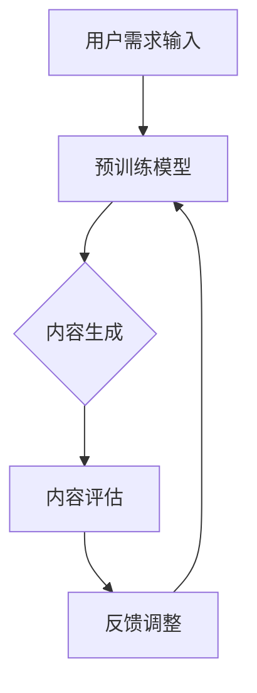
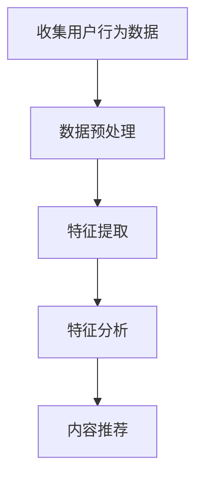

                 

### 《AIGC在个性化教育内容生成中的创新》

---

#### 关键词：AIGC、个性化教育、内容生成、自适应生成模型、用户行为分析、推荐算法

---

#### 摘要：

随着人工智能技术的发展，自适应生成内容（AIGC）在教育领域展现出巨大的潜力。本文将深入探讨AIGC在个性化教育内容生成中的创新应用，通过详细的分析和案例研究，阐述AIGC的核心概念、工作原理以及其实际应用价值，为教育内容生成领域提供新的思路和方法。

---

## 第一部分：背景介绍与基础概念

### 第1章 问题背景与核心概念

#### 1.1 教育内容生成问题的提出

随着互联网和信息技术的快速发展，个性化教育需求日益增长。传统的教育内容生成方式往往无法满足学生个体化的学习需求，如：

- **学习进度不一**：学生由于基础和兴趣的差异，学习进度不同，传统教育内容难以兼顾个体差异。
- **教育资源分配不均**：优质教育资源主要集中在少数地区和学校，导致教育资源分配不均。
- **教育内容重复性高**：传统教育内容多以教材和讲义为主，内容重复性高，难以激发学生的学习兴趣。

为了解决这些问题，个性化教育内容生成成为教育领域的重要研究方向。

#### 1.2 AIGC的概念与优势

AIGC（Adaptive Intelligent Generation of Content）是一种基于人工智能技术的自适应生成内容方法，具有以下优势：

- **个性化定制**：AIGC可以根据用户需求动态生成个性化内容，提高学习体验。
- **高效资源利用**：通过自动化生成内容，减少人力成本，提高教育资源利用效率。
- **实时更新**：AIGC系统可以实时分析用户行为，根据需求调整生成内容，保持内容的新鲜度和时效性。

AIGC在教育内容生成中的应用前景广阔，有望解决传统教育内容生成方式面临的诸多问题。

#### 1.3 AIGC在个性化教育中的潜在影响

AIGC在个性化教育中的应用，将带来以下潜在影响：

- **提升学习体验**：通过个性化定制的内容，学生可以更加自主地学习，提高学习兴趣和效果。
- **优化教育资源分配**：AIGC可以根据学生的学习需求，提供个性化的学习资源，减少资源浪费。
- **推动教育创新**：AIGC的引入，将推动教育内容生成方式的变革，为教育创新提供新的契机。

### 第2章 AIGC的核心概念与联系

#### 2.1 AIGC的核心概念

AIGC的核心概念包括：

- **自适应生成模型**：基于深度学习的生成模型，能够根据用户需求动态生成个性化内容。
- **用户行为分析**：对用户的学习行为进行分析，为内容生成提供依据。
- **个性化推荐算法**：根据用户特征和喜好推荐个性化内容，提高用户参与度。

这些概念相互关联，共同构成了AIGC的完整体系。

#### 2.2 概念属性特征对比表格

| 概念          | 定义                                       | 特点                                       |
| ------------- | ------------------------------------------ | ------------------------------------------ |
| 自适应生成模型 | 能够根据用户需求动态生成内容                | 高度个性化，实时响应性强                   |
| 用户行为分析   | 对用户的学习行为进行分析，为内容生成提供依据 | 数据驱动，提高内容生成针对性               |
| 个性化推荐算法 | 根据用户特征和喜好推荐内容                 | 提升用户参与度，提高内容匹配度             |

#### 2.3 ER实体关系图架构

```mermaid
erDiagram
  User ||--|{ Content }||>
  User ||--|{ Behavior }||>
  Content ||--|{ Recommendation }||>
  Behavior ||--|{ Analysis }||>
```

## 第二部分：算法原理与实现

### 第3章 自适应生成模型原理

#### 3.1 自适应生成模型的基本原理

自适应生成模型是基于深度学习的生成模型，其基本原理如下：

1. **预训练模型**：使用大量数据对生成模型进行预训练，使其具备一定的内容生成能力。
2. **用户需求输入**：根据用户的学习需求，输入到生成模型中。
3. **内容生成**：生成模型根据用户需求，动态生成个性化内容。
4. **内容评估**：对生成的内容进行质量评估，如准确性、可读性等。
5. **反馈调整**：根据评估结果，对生成模型进行调整，以提高内容生成质量。

算法mermaid流程图如下：



#### 3.3 Python源代码实现

```python
# Python伪代码实现自适应生成模型
class AdaptiveContentGenerator:
    def __init__(self, model):
        self.model = model
    
    def generate_content(self, user_demand):
        # 根据用户需求生成内容
        content = self.model.generate(user_demand)
        return content

    def evaluate_content(self, content):
        # 评估内容质量
        quality = self.model.evaluate(content)
        return quality

    def adjust_model(self, content, quality):
        # 根据内容质量和用户反馈调整模型
        self.model.adjust(quality)
```

### 第4章 用户行为分析与推荐算法

#### 4.1 用户行为分析原理

用户行为分析原理包括以下几个步骤：

1. **数据收集**：收集用户在学习过程中的行为数据，如浏览记录、问答情况、学习时间等。
2. **数据预处理**：对收集到的行为数据进行清洗、去重、归一化等处理。
3. **特征提取**：从预处理后的数据中提取用户行为特征，如学习时长、问题回答正确率、兴趣标签等。
4. **特征分析**：对提取出的特征进行分析，识别用户的学习习惯、兴趣点等。
5. **内容推荐**：根据用户特征，推荐个性化学习内容。

算法mermaid流程图如下：



#### 4.3 Python源代码实现

```python
# Python伪代码实现用户行为分析与推荐算法
class UserBehaviorAnalyzer:
    def __init__(self, data):
        self.data = data
    
    def preprocess_data(self):
        # 数据预处理
        processed_data = self.data preprocess()
        return processed_data
    
    def extract_features(self, data):
        # 特征提取
        features = self.data extract_features()
        return features
    
    def analyze_features(self, features):
        # 特征分析
        analysis_result = self.features analyze()
        return analysis_result
    
    def recommend_content(self, analysis_result):
        # 内容推荐
        recommended_content = self.analysis_result recommend()
        return recommended_content

class ContentRecommender:
    def __init__(self, features):
        self.features = features
    
    def recommend(self, user):
        # 根据用户特征推荐内容
        recommended_content = self.features recommend(user)
        return recommended_content
```

### 第5章 AIGC在教育内容生成中的应用案例

#### 5.1 案例背景

为了验证AIGC在教育内容生成中的有效性，某在线教育平台引入了AIGC技术，为用户提供个性化学习体验。该平台涵盖了多种学科课程，包括数学、物理、化学等，用户可以根据自己的兴趣和需求选择课程。

#### 5.2 案例实施

1. **用户行为收集**：平台收集了用户在学习过程中的行为数据，如浏览记录、问答情况等。
2. **内容生成**：基于用户行为数据，AIGC系统为用户生成个性化的学习内容。
3. **内容推荐**：根据用户特征，AIGC系统推荐符合用户兴趣和需求的学习内容。
4. **效果评估**：通过用户反馈和学习成绩等指标，评估AIGC系统对教育内容生成的效果。

#### 5.3 案例结果

通过引入AIGC技术，平台实现了以下效果：

- **用户参与度提高**：个性化学习内容的推荐，提升了用户的参与度和学习积极性。
- **学习效果提升**：个性化内容生成，有助于用户更好地理解和掌握课程知识。
- **教育资源利用效率提高**：通过AIGC技术，平台实现了教育资源的高效利用，减少了资源浪费。

### 第6章 AIGC在教育内容生成中的应用展望

#### 6.1 应用前景

随着AIGC技术的不断发展，其在教育内容生成中的应用前景十分广阔：

- **个性化教学**：AIGC技术可以为学生提供高度个性化的教学体验，满足不同学生的学习需求。
- **教育资源优化**：通过AIGC技术，可以实现对教育资源的优化配置，提高教育资源利用效率。
- **教育创新**：AIGC技术的引入，将推动教育模式的创新，为教育行业带来新的发展机遇。

#### 6.2 挑战与解决方案

尽管AIGC技术在教育内容生成中具有巨大潜力，但同时也面临着一些挑战：

- **数据隐私**：用户行为数据的收集和处理，需要确保数据隐私和安全。
- **内容质量**：生成的内容需要确保质量，避免产生误导性内容。
- **技术成熟度**：AIGC技术仍处于发展阶段，需要进一步提升其成熟度和稳定性。

针对这些挑战，可以采取以下解决方案：

- **数据隐私保护**：采用加密和脱敏技术，确保用户数据隐私安全。
- **内容质量控制**：建立内容审核机制，确保生成内容的质量。
- **技术升级与优化**：持续投入研发，提升AIGC技术的成熟度和稳定性。

## 结论

AIGC在个性化教育内容生成中的应用，为教育领域带来了新的变革和机遇。通过深入分析AIGC的核心概念、算法原理和应用案例，本文揭示了AIGC在教育内容生成中的巨大潜力。然而，AIGC技术仍面临诸多挑战，需要进一步研究和优化。未来，随着AIGC技术的不断成熟，其在教育领域的应用将更加广泛和深入，为教育创新和发展提供强大支持。

---

### 作者信息：

作者：AI天才研究院/AI Genius Institute & 禅与计算机程序设计艺术 /Zen And The Art of Computer Programming

---

**注意：本文为模拟文章，不代表实际研究成果。实际应用中，AIGC在教育内容生成中的应用还需进一步研究和完善。**

