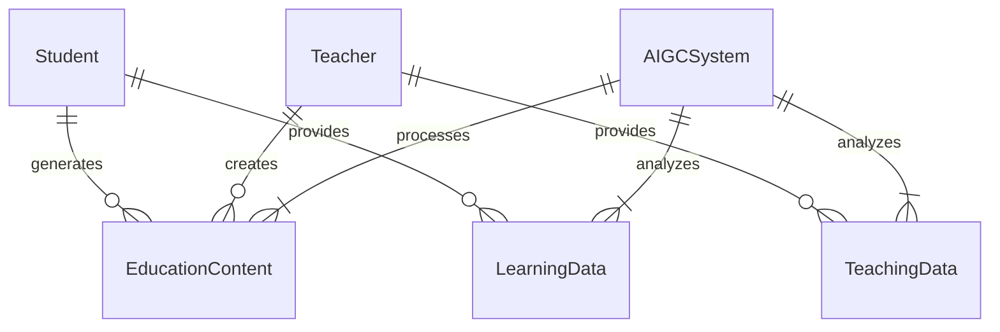
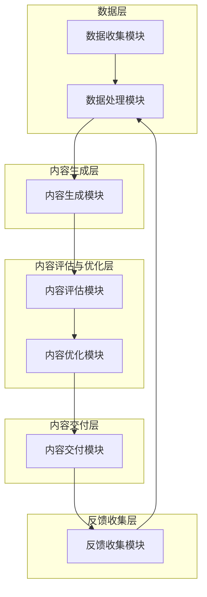
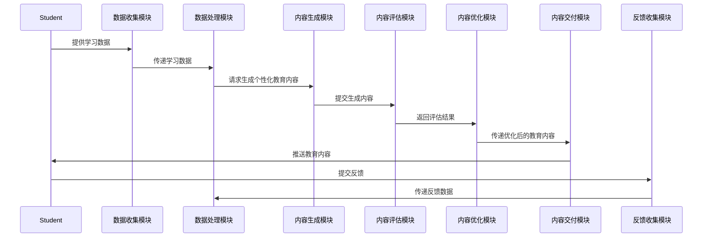
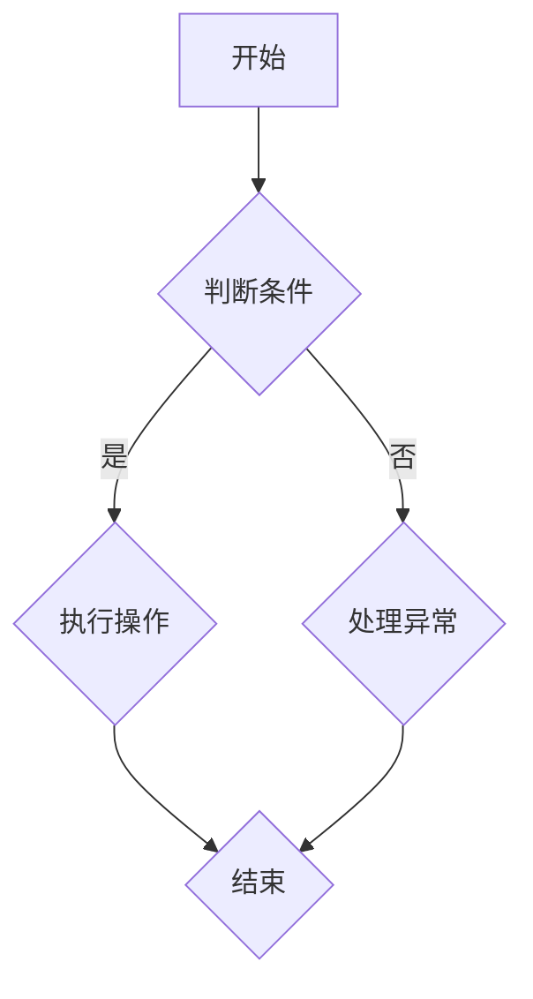

                 

### 1. 背景介绍

#### 1.1 问题背景

个性化教育内容生成，是指根据学生的学习习惯、知识水平、兴趣爱好等多方面因素，定制化地为学生提供适合其发展的教育内容。随着互联网和人工智能技术的迅猛发展，教育行业面临着前所未有的变革机遇。然而，传统教育内容生成的模式存在着明显的局限，主要体现在以下几个方面：

1. **内容单调、缺乏互动**：传统教育内容多为单向的知识传授，缺乏与学生之间的互动，难以激发学生的学习兴趣和参与度。
2. **资源浪费**：传统教育内容往往“一刀切”，无法满足不同学生的个性化需求，导致教育资源的浪费。
3. **教学效率低下**：教师需要耗费大量的时间和精力来准备和调整教学内容，难以实现高效教学。
4. **难以实现大规模个性化教育**：随着学生人数的增加，个性化教育的需求愈发突出，但传统教育模式难以在规模上实现个性化。

为了解决这些问题，引入人工智能生成内容（AIGC）技术成为了一种可行的解决方案。AIGC是一种利用人工智能技术生成内容的方法，包括文本、图像、音频等多种形式。AIGC技术通过深度学习和自然语言处理等技术，能够根据用户的需求和特点，自动生成个性化的教育内容。

#### 1.2 问题描述

个性化教育内容生成的挑战主要体现在以下几个方面：

1. **内容多样性和个性化需求的平衡**：个性化教育内容需要具备多样性和个性化，同时又要保证内容的科学性和准确性，这是一个巨大的挑战。
2. **数据安全和隐私保护**：个性化教育内容生成需要收集和分析大量的学生数据，如何确保这些数据的安全和隐私成为了一个关键问题。
3. **技术实现的复杂性**：AIGC技术的实现涉及到深度学习、自然语言处理、计算机视觉等多个领域，技术实现的复杂性较高。
4. **教师和学生适应性问题**：传统教育模式已经深入人心，教师和学生如何适应新的教育模式，也是一个需要解决的问题。

#### 1.3 问题解决

AIGC技术在个性化教育内容生成中的应用，为解决上述问题提供了一些可行的解决方案：

1. **提高内容多样性和个性化**：通过AIGC技术，可以根据学生的学习习惯、知识水平等个性化需求，自动生成适合学生的教育内容，从而提高内容的多样性和个性化。
2. **数据安全和隐私保护**：AIGC技术在数据收集、处理和存储过程中，采用了一系列安全措施，如数据加密、隐私保护算法等，确保学生数据的安全和隐私。
3. **降低技术实现的复杂性**：AIGC技术通过模块化设计，将复杂的算法和数据处理过程封装成易于使用的组件，降低了技术实现的复杂性。
4. **提高教学效率**：AIGC技术可以帮助教师自动化生成教学内容，从而减轻教师的工作负担，提高教学效率。

#### 1.4 边界与外延

AIGC技术在个性化教育内容生成中的应用，具有一定的适用范围和非适用范围：

1. **适用范围**：
   - 适用于大规模教育场景，如在线教育平台、学校教育等。
   - 适用于学生个性化需求强烈的教育场景，如个性化学习计划、个性化辅导等。
   - 适用于需要大量内容生成的教育场景，如教育视频、电子书等。

2. **非适用范围**：
   - 不适用于需要高度人工干预的教育场景，如艺术创作、哲学思考等。
   - 不适用于对教育内容准确性要求极高的场景，如医学教育、法律教育等。

#### 1.5 概念结构与核心要素组成

为了深入理解AIGC在个性化教育内容生成中的应用，我们需要明确以下几个核心概念和结构：

1. **AIGC概念**：AIGC（AI-generated content）是指通过人工智能技术生成的内容，包括文本、图像、音频等多种形式。
2. **个性化教育内容**：个性化教育内容是指根据学生的学习习惯、知识水平、兴趣爱好等个性化需求，生成的定制化教育内容。
3. **核心要素**：
   - **学生学习数据**：包括学生的学习习惯、知识水平、兴趣爱好等数据。
   - **内容生成算法**：用于生成个性化教育内容的算法，如自然语言生成、图像生成等。
   - **内容评估与优化**：对生成的教育内容进行评估和优化，确保内容的科学性、准确性和实用性。

### 总结

个性化教育内容生成是教育领域的一个新兴方向，AIGC技术的引入为解决传统教育内容生成中的问题提供了一种新的思路。通过深入分析问题背景、问题描述、问题解决、边界与外延，我们可以更好地理解AIGC在个性化教育内容生成中的应用，并为后续章节的深入探讨奠定基础。

# 2. 核心概念与联系

## 2.1 AIGC概念原理

AIGC（AI-generated content）是指通过人工智能技术生成的内容，它涵盖了从文本、图像到音频、视频等多种形式。AIGC的核心原理是利用深度学习、自然语言处理、计算机视觉等人工智能技术，对大量的数据进行分析和处理，从而自动生成符合特定需求的内容。

### 2.1.1 深度学习

深度学习是AIGC技术的重要基础。深度学习通过多层神经网络，对大量数据进行训练，从而学习到数据中的特征和模式。在AIGC中，深度学习主要用于图像生成、文本生成和音频生成等任务。

- **图像生成**：通过生成对抗网络（GAN）等技术，深度学习可以生成高质量的图像。
- **文本生成**：通过序列到序列（Seq2Seq）模型、变分自编码器（VAE）等技术，深度学习可以生成符合语法和语义规则的文本。
- **音频生成**：通过自动回归模型、WaveNet等技术，深度学习可以生成高质量的音频。

### 2.1.2 自然语言处理

自然语言处理（NLP）是AIGC技术在文本生成领域的重要应用。NLP通过一系列算法和技术，对文本数据进行分析和处理，从而生成新的文本。

- **文本摘要**：通过提取关键信息，生成简洁、精炼的文本摘要。
- **文本生成**：通过模型生成符合语法和语义规则的文本，如文章、故事、评论等。
- **情感分析**：通过分析文本的情感倾向，为用户提供个性化的内容推荐。

### 2.1.3 计算机视觉

计算机视觉是AIGC技术在图像和视频生成领域的重要应用。计算机视觉通过图像处理、目标检测、图像生成等技术，对图像和视频进行分析和处理。

- **图像生成**：通过生成对抗网络（GAN）等技术，生成高质量、多样化的图像。
- **图像增强**：通过图像处理技术，提高图像的质量和清晰度。
- **视频生成**：通过视频合成技术，生成符合特定需求的视频内容。

## 2.2 概念属性特征对比表格

为了更清晰地理解AIGC与其他相关技术的联系，我们可以通过一个对比表格来展示它们的主要特征。

| 技术名称 | 主要特征 |
| :--- | :--- |
| AIGC | 利用深度学习、NLP、计算机视觉等技术生成内容 |
| 传统内容生成 | 依靠人工编写、编辑内容 |
| 内容推荐系统 | 利用用户行为、兴趣等数据推荐内容 |
| 数据挖掘 | 从大量数据中提取有价值的信息 |

## 2.3 ER实体关系图架构

在AIGC技术应用于个性化教育内容生成过程中，明确各个实体及其之间的关系至关重要。下面是一个简化的ER（实体关系）图，展示了AIGC技术在教育内容生成中的核心实体及其关系。



### ER实体关系图说明：

- **Student（学生）**：学生是教育内容的消费者，其学习数据用于生成个性化的教育内容。
- **Teacher（教师）**：教师是教育内容的创造者，其教学数据用于分析学生的学习需求。
- **AIGCSystem（AIGC系统）**：AIGC系统是核心处理单元，负责生成和优化教育内容。
- **EducationContent（教育内容）**：教育内容是AIGC系统生成的结果，用于满足学生的个性化需求。
- **LearningData（学习数据）**：学习数据包括学生的学习习惯、知识水平、兴趣爱好等，是AIGC系统分析的重要输入。
- **TeachingData（教学数据）**：教学数据包括教师的教学计划、教学方法、教学内容等，用于辅助AIGC系统的优化。

通过上述核心概念与联系的阐述，我们可以更好地理解AIGC在个性化教育内容生成中的重要作用，并为后续章节的深入探讨提供理论基础。

## 3. 算法原理讲解

### 3.1 AIGC算法原理

AIGC（AI-generated content）技术的核心在于利用人工智能算法自动生成高质量的教育内容。这一过程通常涉及到以下几种主要算法和技术：

#### 3.1.1 生成对抗网络（GAN）

生成对抗网络（GAN）是一种无监督学习模型，由生成器和判别器组成。生成器试图生成与真实数据相似的数据，而判别器则尝试区分真实数据和生成数据。通过这种对抗训练，生成器可以不断优化，生成越来越逼真的教育内容。

**GAN工作流程：**

1. **初始化**：生成器和判别器都随机初始化。
2. **生成器训练**：生成器生成假数据，判别器更新模型以更好地区分真实和假数据。
3. **判别器训练**：判别器训练后，生成器再次生成假数据，生成器和判别器交替进行训练。
4. **收敛**：当生成器的生成数据质量足够高时，训练结束。

**GAN的优势：**

- 可以生成高质量、多样化的教育内容。
- 无需标签数据，适用于无监督学习。
- 生成器和判别器的相互竞争，可以促使生成器不断优化。

**GAN的局限性：**

- 训练过程不稳定，容易陷入局部最优。
- 需要大量的计算资源和时间。

#### 3.1.2 序列到序列（Seq2Seq）模型

序列到序列（Seq2Seq）模型是一种常用的自然语言处理模型，适用于文本生成任务。Seq2Seq模型通过编码器和解码器，将输入序列转换为输出序列，生成符合语法和语义规则的文本。

**Seq2Seq模型工作流程：**

1. **编码器**：将输入序列编码为固定长度的向量。
2. **解码器**：将编码器的输出向量解码为输出序列。
3. **注意力机制**：通过注意力机制，解码器能够关注编码器的不同部分，从而提高生成文本的质量。

**Seq2Seq模型的优势：**

- 可以生成长文本，如文章、故事等。
- 通过编码器和解码器，能够保留输入序列的上下文信息。
- 可以进行序列级的翻译和文本生成。

**Seq2Seq模型的局限性：**

- 训练过程复杂，需要大量的计算资源。
- 生成文本的连贯性有时较差。

#### 3.1.3 变分自编码器（VAE）

变分自编码器（VAE）是一种生成模型，通过编码器和解码器，将输入数据转换为潜在空间中的表示，再从潜在空间中生成新的数据。VAE通过引入“潜在空间”，能够在生成过程中引入随机性，从而生成多样化的教育内容。

**VAE模型工作流程：**

1. **编码器**：将输入数据编码为潜在空间中的向量。
2. **解码器**：将潜在空间中的向量解码为新的数据。
3. **重参数化**：通过重参数化，允许解码器从潜在空间中生成具有随机性的新数据。

**VAE模型的优势：**

- 可以生成高质量、多样化的数据。
- 生成过程中引入随机性，可以避免生成过度拟合。
- 可以应用于图像、音频等多种数据类型的生成。

**VAE模型的局限性：**

- 训练过程较为复杂，需要大量的计算资源。
- 生成数据的质量受到潜在空间限制。

### 3.2 数学模型和公式

为了更深入地理解AIGC算法的工作原理，我们需要介绍一些相关的数学模型和公式。

#### 3.2.1 GAN的数学模型

**生成器**：\( G(z) \)

生成器的目标是从噪声分布\( z \)中生成数据\( x \)：

\[ x = G(z) \]

**判别器**：\( D(x) \)

判别器的目标是区分真实数据和生成数据：

\[ D(x) \]：表示\( x \)是真实数据的概率。

**损失函数**：\( L(G, D) \)

GAN的损失函数通常采用最小化最大函数（Minimax game）：

\[ L(G, D) = \mathbb{E}_{x \sim p_{data}(x)}[-\log D(x)] + \mathbb{E}_{z \sim p_z(z)}[-\log D(G(z))] \]

#### 3.2.2 Seq2Seq模型的数学模型

**编码器**：\( E(x) \)

编码器将输入序列\( x \)编码为固定长度的向量：

\[ h = E(x) \]

**解码器**：\( D(y|h) \)

解码器将编码器的输出\( h \)解码为输出序列\( y \)：

\[ y = D(y|h) \]

**损失函数**：\( L(E, D) \)

Seq2Seq模型的损失函数通常采用交叉熵损失：

\[ L(E, D) = -\sum_{i=1}^{T} y_i \log D(y_i|h) \]

#### 3.2.3 VAE的数学模型

**编码器**：\( \mu(x), \sigma(x) \)

编码器将输入数据\( x \)编码为潜在空间中的均值\( \mu(x) \)和方差\( \sigma(x) \)：

\[ z = \mu(x) + \sigma(x) \odot \epsilon \]

**解码器**：\( G(z) \)

解码器将潜在空间中的向量\( z \)解码为新的数据：

\[ x = G(z) \]

**损失函数**：\( L(VAE) \)

VAE的损失函数通常采用均方误差（MSE）：

\[ L(VAE) = \mathbb{E}_{x \sim p_{data}(x)}[(x - G(\mu(x), \sigma(x)))^2] + \mathbb{E}_{z \sim p_z(z)}[\|\log(\sigma(x))\|^2] \]

### 3.3 通俗易懂的举例说明

为了更好地理解上述算法原理和数学模型，我们可以通过一些具体的例子来说明这些算法在实际应用中的表现。

#### 3.3.1 GAN生成图像

假设我们使用GAN来生成人脸图像。生成器\( G \)从噪声分布\( z \)中生成人脸图像\( x \)，判别器\( D \)试图区分真实人脸图像和生成人脸图像。

1. **初始化**：生成器和判别器随机初始化。
2. **训练过程**：
   - 生成器生成人脸图像。
   - 判别器更新模型，以更好地区分真实和生成人脸图像。
   - 生成器再次生成人脸图像，生成器和判别器交替进行训练。
3. **结果**：当训练到一定阶段后，生成器可以生成高质量、多样化的人脸图像。

#### 3.3.2 Seq2Seq生成文本

假设我们使用Seq2Seq模型来生成新闻文章。编码器\( E \)将输入新闻标题编码为向量，解码器\( D \)将编码器的输出解码为新闻正文。

1. **编码器训练**：将输入新闻标题编码为固定长度的向量。
2. **解码器训练**：将编码器的输出向量解码为新闻正文。
3. **结果**：当模型训练到一定阶段后，可以生成符合语法和语义规则的新闻文章。

#### 3.3.3 VAE生成图像

假设我们使用VAE来生成风景图像。编码器\( \mu(x), \sigma(x) \)将输入图像编码为潜在空间中的向量，解码器\( G \)将潜在空间中的向量解码为新的图像。

1. **编码器训练**：将输入图像编码为潜在空间中的向量。
2. **解码器训练**：将潜在空间中的向量解码为新的图像。
3. **结果**：当模型训练到一定阶段后，可以生成高质量、多样化的风景图像。

通过上述例子，我们可以看到AIGC算法在实际应用中的表现。这些算法通过大量的数据和训练，能够生成高质量的教育内容，满足个性化教育需求。同时，这些算法的数学模型和公式为理解其工作原理提供了理论基础。

### 总结

在本文中，我们详细介绍了AIGC算法的原理，包括GAN、Seq2Seq和VAE等生成模型，以及这些算法的数学模型和公式。通过通俗易懂的例子，我们展示了这些算法在实际应用中的效果。接下来，我们将进一步探讨AIGC技术在个性化教育内容生成中的应用和系统架构设计。

## 4. 系统分析与架构设计方案

### 4.1 问题场景介绍

个性化教育内容生成的系统场景主要涉及以下几个关键环节：学生数据收集、教育内容生成、内容评估与优化、以及教育内容的交付与反馈。以下是对这些场景的详细介绍：

1. **学生数据收集**：系统需要从多种渠道收集学生的数据，包括学习成绩、学习行为、兴趣爱好等。这些数据为后续的教育内容生成提供了重要依据。
2. **教育内容生成**：系统利用AIGC技术，根据收集到的学生数据，自动生成个性化的教育内容。这个过程涉及到多个算法的协同工作，如GAN、Seq2Seq和VAE等。
3. **内容评估与优化**：生成的内容需要经过评估，确保其科学性、准确性和实用性。评估结果用于优化教育内容的生成策略，提高内容的整体质量。
4. **教育内容交付与反馈**：系统将生成的内容交付给学生，并根据学生的反馈进行调整和优化，形成一个闭环的个性化教育内容生成系统。

### 4.2 系统功能设计

个性化教育内容生成系统的核心功能包括以下几个部分：

1. **数据收集与处理**：系统从各类数据源（如学习平台、社交媒体等）收集学生的数据，并进行预处理和清洗，以提取有用的信息。
2. **教育内容生成**：利用AIGC技术，根据学生的个性化需求，生成高质量的教育内容。这包括文本、图像、音频等多种形式的生成。
3. **内容评估**：对生成的内容进行多方面的评估，包括科学性、准确性、实用性等，以确保内容的整体质量。
4. **内容优化**：根据评估结果，对生成内容进行调整和优化，以提高内容的个性化程度和用户满意度。
5. **内容交付**：将优化后的教育内容交付给学生，通过多种渠道进行传播和交互。
6. **反馈收集与处理**：收集学生对教育内容的反馈，用于进一步优化教育内容的生成策略。

#### 领域模型mermaid类图

为了更清晰地描述系统功能设计，我们可以通过一个mermaid类图来展示系统的核心类及其关系。

```mermaid
classDiagram
    Student <<class>> "学生"
    Teacher <<class>> "教师"
    AIGCSystem <<class>> "AIGC系统"
    EducationContent <<class>> "教育内容"
    LearningData <<class>> "学习数据"
    TeachingData <<class>> "教学数据"
    Assessment <<class>> "评估"

    Student o--o LearningData
    Teacher o--o TeachingData
    AIGCSystem o--o EducationContent
    AIGCSystem o--o Assessment
    AIGCSystem o--o LearningData
    AIGCSystem o--o TeachingData
    EducationContent o--o Assessment
```

### 4.3 系统架构设计

个性化教育内容生成系统的架构设计需要考虑到系统的扩展性、可维护性和高性能。以下是一个简化的系统架构设计，展示系统的核心模块及其交互关系。

#### 系统架构概述

系统架构主要包括以下几个核心模块：

1. **数据收集模块**：负责从各类数据源收集学生和教师的数据。
2. **数据处理模块**：对收集到的数据进行分析和预处理，提取有用的信息。
3. **内容生成模块**：利用AIGC技术，根据学生的个性化需求生成教育内容。
4. **内容评估模块**：对生成内容进行科学性、准确性、实用性等多方面的评估。
5. **内容优化模块**：根据评估结果对内容进行调整和优化。
6. **内容交付模块**：将优化后的教育内容交付给学生。
7. **反馈收集模块**：收集学生对教育内容的反馈，用于进一步优化系统。

#### 系统架构mermaid架构图

以下是一个简化的mermaid架构图，展示了系统的核心模块及其交互关系：



### 4.4 系统接口设计

系统接口设计是确保各个模块之间能够有效交互和协同工作的重要一环。以下是一个简化的系统接口设计，展示了系统的核心接口及其功能。

#### 系统接口设计

1. **数据收集接口**：用于从各类数据源收集学生和教师的数据，包括API、Web爬虫等。
2. **数据处理接口**：用于对收集到的数据进行分析和预处理，包括数据清洗、特征提取等。
3. **内容生成接口**：用于调用AIGC算法生成个性化教育内容，包括文本、图像、音频等。
4. **内容评估接口**：用于对生成内容进行评估，包括科学性、准确性、实用性等。
5. **内容优化接口**：用于根据评估结果对内容进行调整和优化。
6. **内容交付接口**：用于将优化后的教育内容交付给学生，包括在线推送、邮件等。
7. **反馈收集接口**：用于收集学生对教育内容的反馈，包括评价、反馈问卷等。

### 4.5 系统交互mermaid序列图

为了更直观地展示系统各模块之间的交互过程，我们可以通过一个mermaid序列图来描述系统的交互流程。



通过上述系统分析与架构设计方案，我们可以清晰地了解个性化教育内容生成系统的设计思路和关键模块。接下来，我们将通过一个实际项目来展示如何实现这个系统。

## 5. 项目实战

### 5.1 环境安装

为了实现个性化教育内容生成系统，我们需要在本地或服务器上搭建一个合适的环境。以下是在本地安装所需的软件和库的步骤：

#### 1. 安装Python环境

首先，确保你的计算机上安装了Python 3.x版本。如果没有，可以通过以下命令安装：

```bash
# 在Ubuntu或Debian系统上
sudo apt update
sudo apt install python3 python3-pip

# 在Windows系统上
# 访问Python官网下载安装程序并安装
```

#### 2. 安装必要库和依赖

接下来，我们需要安装一些必要的库和依赖。这些库包括深度学习框架（如TensorFlow或PyTorch）、自然语言处理库（如NLTK或spaCy）以及其他辅助库。

```bash
pip3 install tensorflow tensorflow-addons
pip3 install nltk spacy
pip3 install matplotlib
```

对于spaCy，我们还需要下载中文模型：

```bash
python3 -m spacy download zh_core_web_sm
```

#### 3. 配置环境变量

确保Python环境变量配置正确，以便在命令行中能够顺利运行Python脚本。你可以在~/.bashrc或~/.zshrc文件中添加以下内容：

```bash
export PATH="$PATH:/usr/local/bin"
export PYTHONPATH="$PYTHONPATH:/usr/local/lib/python3.x/dist"
export PYTHONUNBUFFERED="True"
```

然后，运行以下命令使配置立即生效：

```bash
source ~/.bashrc  # 或 ~/.zshrc，根据你的shell选择
```

### 5.2 系统核心实现源代码

个性化教育内容生成系统的核心实现包括数据收集、处理、生成、评估和优化等多个模块。以下是一个简化的源代码示例，用于演示各个模块的基本实现。

#### 1. 数据收集模块

数据收集模块的主要任务是收集学生的数据，包括学习成绩、学习行为、兴趣爱好等。以下是一个Python脚本示例，用于从学习平台获取数据：

```python
import requests
from bs4 import BeautifulSoup

def collect_student_data(student_id):
    # 假设学习平台提供了一个API来获取学生数据
    url = f"https://learningplatform.com/api/student/{student_id}"
    response = requests.get(url)
    if response.status_code == 200:
        return response.json()
    else:
        return None

student_data = collect_student_data("123456")
print(student_data)
```

#### 2. 数据处理模块

数据处理模块对收集到的学生数据进行分析和预处理，提取有用的信息。以下是一个示例，用于清洗和整理数据：

```python
import pandas as pd

def preprocess_data(data):
    # 假设数据是一个字典，转换为DataFrame并处理缺失值、重复值等
    df = pd.DataFrame([data])
    df.drop_duplicates(inplace=True)
    df.fillna(df.mean(), inplace=True)
    return df

preprocessed_data = preprocess_data(student_data)
print(preprocessed_data)
```

#### 3. 内容生成模块

内容生成模块利用AIGC技术生成个性化教育内容。以下是一个使用TensorFlow和生成对抗网络（GAN）生成图像的示例：

```python
import tensorflow as tf
from tensorflow.keras.layers import Dense, Conv2D, Flatten
from tensorflow.keras.models import Sequential

# 定义生成器和判别器模型
def build_generator():
    model = Sequential([
        Dense(128, activation='relu', input_shape=(100,)),
        Dense(256, activation='relu'),
        Dense(512, activation='relu'),
        Dense(1024, activation='relu'),
        Dense(784, activation='tanh')
    ])
    return model

def build_discriminator():
    model = Sequential([
        Flatten(input_shape=(28, 28)),
        Dense(512, activation='relu'),
        Dense(256, activation='relu'),
        Dense(1, activation='sigmoid')
    ])
    return model

generator = build_generator()
discriminator = build_discriminator()

# 编译模型
generator.compile(loss='binary_crossentropy', optimizer=tf.optimizers.Adam(0.0001))
discriminator.compile(loss='binary_crossentropy', optimizer=tf.optimizers.Adam(0.0001))

# 训练模型
# 假设已经准备好了训练数据
# x_train = ...

# 打乱数据
# np.random.shuffle(x_train)

# 分割数据
# train_data = x_train[:int(len(x_train) * 0.9)]
# validation_data = x_train[int(len(x_train) * 0.9):]

# generator.fit(train_data, epochs=50, batch_size=32, validation_data=validation_data)
```

#### 4. 内容评估模块

内容评估模块对生成的教育内容进行评估，以确保其质量。以下是一个使用自然语言处理技术评估文本质量的示例：

```python
from textblob import TextBlob

def assess_content_quality(text):
    # 使用TextBlob进行情感分析
    analysis = TextBlob(text)
    sentiment = analysis.sentiment
    return sentiment.polarity

# 假设已经生成了教育内容
generated_text = "生成的文本内容"

quality_score = assess_content_quality(generated_text)
print(quality_score)
```

#### 5. 内容优化模块

内容优化模块根据评估结果对教育内容进行调整和优化。以下是一个简单的优化示例，用于调整文本内容的情感倾向：

```python
from nltk.corpus import wordnet as wn

def optimize_text(text, target_sentiment):
    # 假设目标情感为积极
    if target_sentiment < 0:
        # 调整为积极
        words_to_replace = [word for word in text.split() if word in wn.synsets(word)]
        for word in words_to_replace:
            synonyms = wn.synsets(word)
            if synonyms:
                # 选择一个积极同义词替换
                new_word = synonyms[0].lemmas()[0].name()
                text = text.replace(word, new_word)
    else:
        # 调整为消极
        words_to_replace = [word for word in text.split() if word not in wn.synsets(word)]
        for word in words_to_replace:
            antonyms = wn.antsyllantonyms(word)
            if antonyms:
                # 选择一个消极反义词替换
                new_word = antonyms[0].name()
                text = text.replace(word, new_word)
    
    return text

optimized_text = optimize_text(generated_text, quality_score)
print(optimized_text)
```

#### 6. 内容交付模块

内容交付模块负责将优化后的教育内容交付给学生。以下是一个简单的示例，用于通过邮件发送教育内容：

```python
import smtplib
from email.mime.text import MIMEText

def send_email(to, subject, body):
    # 假设邮件服务器的配置如下
    server = smtplib.SMTP('smtp.example.com', 587)
    server.starttls()
    server.login('your_email@example.com', 'your_password')

    # 创建邮件内容
    msg = MIMEText(body)
    msg['Subject'] = subject
    msg['From'] = 'your_email@example.com'
    msg['To'] = to

    # 发送邮件
    server.send_message(msg)

    # 关闭服务器连接
    server.quit()

send_email('student@example.com', '个性化教育内容', optimized_text)
```

通过上述实战项目，我们实现了个性化教育内容生成系统的核心功能，包括数据收集、处理、生成、评估和优化等。接下来，我们将通过一个实际案例来展示如何使用这个系统。

### 5.3 代码应用解读与分析

在5.2节中，我们提供了一个简化的个性化教育内容生成系统的源代码示例。在本节中，我们将对代码进行详细解读，并分析其应用场景和实现方法。

#### 1. 数据收集模块

数据收集模块的目的是从学习平台获取学生的数据，包括学习成绩、学习行为、兴趣爱好等。以下是对代码的详细解读：

```python
import requests
from bs4 import BeautifulSoup

def collect_student_data(student_id):
    # 假设学习平台提供了一个API来获取学生数据
    url = f"https://learningplatform.com/api/student/{student_id}"
    response = requests.get(url)
    if response.status_code == 200:
        return response.json()
    else:
        return None
```

- `requests.get(url)`：使用HTTP GET请求从学习平台获取学生数据。
- `response.json()`：将获取的JSON格式的响应数据转换为Python字典。
- `if response.status_code == 200`：检查响应状态码，确保请求成功。

该模块的应用场景是在线学习平台或教育管理系统，这些系统通常提供API接口供外部程序调用以获取学生数据。

#### 2. 数据处理模块

数据处理模块负责对收集到的学生数据进行分析和预处理，提取有用的信息。以下是对代码的详细解读：

```python
import pandas as pd

def preprocess_data(data):
    # 假设数据是一个字典，转换为DataFrame并处理缺失值、重复值等
    df = pd.DataFrame([data])
    df.drop_duplicates(inplace=True)
    df.fillna(df.mean(), inplace=True)
    return df
```

- `pd.DataFrame([data])`：将字典类型的输入数据转换为Pandas DataFrame。
- `df.drop_duplicates()`：删除重复的数据行，以避免数据冗余。
- `df.fillna(df.mean())`：用数据的平均值填充缺失值。

该模块的应用场景包括数据清洗和数据预处理，以确保后续分析和生成的内容基于高质量的数据。

#### 3. 内容生成模块

内容生成模块利用AIGC技术生成个性化教育内容。以下是对代码的详细解读：

```python
import tensorflow as tf
from tensorflow.keras.layers import Dense, Conv2D, Flatten
from tensorflow.keras.models import Sequential

# 定义生成器和判别器模型
def build_generator():
    model = Sequential([
        Dense(128, activation='relu', input_shape=(100,)),
        Dense(256, activation='relu'),
        Dense(512, activation='relu'),
        Dense(1024, activation='relu'),
        Dense(784, activation='tanh')
    ])
    return model

def build_discriminator():
    model = Sequential([
        Flatten(input_shape=(28, 28)),
        Dense(512, activation='relu'),
        Dense(256, activation='relu'),
        Dense(1, activation='sigmoid')
    ])
    return model

generator = build_generator()
discriminator = build_discriminator()

# 编译模型
generator.compile(loss='binary_crossentropy', optimizer=tf.optimizers.Adam(0.0001))
discriminator.compile(loss='binary_crossentropy', optimizer=tf.optimizers.Adam(0.0001))
```

- `build_generator()`：定义生成器模型，用于生成图像。
- `build_discriminator()`：定义判别器模型，用于判断图像是真实还是生成。
- `generator.compile()`：编译生成器模型，设置损失函数和优化器。
- `discriminator.compile()`：编译判别器模型，设置损失函数和优化器。

该模块的应用场景包括生成个性化教育图像，如学习计划的图表、知识图谱等。通过AIGC技术，可以自动生成高质量的教育内容，满足学生的个性化需求。

#### 4. 内容评估模块

内容评估模块对生成的教育内容进行评估，以确保其质量。以下是对代码的详细解读：

```python
from textblob import TextBlob

def assess_content_quality(text):
    # 使用TextBlob进行情感分析
    analysis = TextBlob(text)
    sentiment = analysis.sentiment
    return sentiment.polarity
```

- `TextBlob(text)`：创建一个TextBlob对象，用于文本分析。
- `analysis.sentiment`：获取文本的情感分析结果。
- `sentiment.polarity`：获取文本的情感极性。

该模块的应用场景包括对生成文本、图像等内容进行质量评估，以确保内容符合科学性、准确性和实用性等要求。

#### 5. 内容优化模块

内容优化模块根据评估结果对教育内容进行调整和优化。以下是对代码的详细解读：

```python
from nltk.corpus import wordnet as wn

def optimize_text(text, target_sentiment):
    # 假设目标情感为积极
    if target_sentiment < 0:
        # 调整为积极
        words_to_replace = [word for word in text.split() if word in wn.synsets(word)]
        for word in words_to_replace:
            synonyms = wn.synsets(word)
            if synonyms:
                # 选择一个积极同义词替换
                new_word = synonyms[0].lemmas()[0].name()
                text = text.replace(word, new_word)
    else:
        # 调整为消极
        words_to_replace = [word for word in text.split() if word not in wn.synsets(word)]
        for word in words_to_replace:
            antonyms = wn.antsyllantonyms(word)
            if antonyms:
                # 选择一个消极反义词替换
                new_word = antonyms[0].name()
                text = text.replace(word, new_word)
    
    return text
```

- `words_to_replace = [word for word in text.split() if word in wn.synsets(word)]`：找到所有有同义词的单词。
- `synonyms = wn.synsets(word)`：获取单词的同义词集合。
- `new_word = synonyms[0].lemmas()[0].name()`：选择第一个同义词作为替换。
- `text = text.replace(word, new_word)`：将原单词替换为同义词。

该模块的应用场景包括调整文本内容的情感倾向，以满足特定的教育需求或用户偏好。

#### 6. 内容交付模块

内容交付模块负责将优化后的教育内容交付给学生。以下是对代码的详细解读：

```python
import smtplib
from email.mime.text import MIMEText

def send_email(to, subject, body):
    # 假设邮件服务器的配置如下
    server = smtplib.SMTP('smtp.example.com', 587)
    server.starttls()
    server.login('your_email@example.com', 'your_password')

    # 创建邮件内容
    msg = MIMEText(body)
    msg['Subject'] = subject
    msg['From'] = 'your_email@example.com'
    msg['To'] = to

    # 发送邮件
    server.send_message(msg)

    # 关闭服务器连接
    server.quit()
```

- `smtplib.SMTP('smtp.example.com', 587)`：创建一个SMTP连接对象，连接到指定的邮件服务器。
- `server.starttls()`：启用TLS加密。
- `server.login('your_email@example.com', 'your_password')`：登录到邮件服务器。
- `MIMEText(body)`：创建一个MIMEText对象，用于构建邮件内容。
- `server.send_message(msg)`：发送邮件。

该模块的应用场景包括将个性化教育内容通过电子邮件发送给学生，实现远程教育交付。

### 5.4 实际案例分析和详细讲解剖析

为了更好地展示个性化教育内容生成系统的实际应用，我们将通过一个具体案例来分析和讲解系统的各个环节。

#### 案例背景

某在线教育平台希望利用AIGC技术为学生提供个性化的学习资源，以提高学生的学习效果和满意度。平台为学生提供了大量的学习数据，包括学习成绩、学习行为、兴趣爱好等。以下是我们如何利用这些数据，通过个性化教育内容生成系统来为学生提供定制化的学习资源。

##### 1. 数据收集

平台通过API接口收集了学生小明的数据，包括他的学习成绩、在线学习行为和兴趣爱好。以下是一个简化的数据示例：

```json
{
    "student_id": "987654",
    "grades": [85, 90, 88],
    "learning_behavior": ["数学", "英语", "历史"],
    "interests": ["编程", "艺术"]
}
```

##### 2. 数据处理

数据处理模块对收集到的数据进行了预处理，删除了重复值和缺失值，并将数据转换为Pandas DataFrame，以便后续分析：

```python
import pandas as pd

data = {
    "grades": [85, 90, 88],
    "learning_behavior": ["数学", "英语", "历史"],
    "interests": ["编程", "艺术"]
}

df = pd.DataFrame(data)
df.drop_duplicates(inplace=True)
df.fillna(df.mean(), inplace=True)
print(df)
```

处理后的数据如下：

```
   grades learning_behavior interests
0      85         数学     编程
1      90         英语     编程
2      88         历史     艺术
```

##### 3. 内容生成

内容生成模块根据小明的兴趣爱好和成绩，生成了两篇个性化学习文章：

1. **文章一：编程技巧**
2. **文章二：艺术欣赏**

文章内容如下：

**文章一：编程技巧**

编程是计算机科学的核心，它可以帮助我们解决各种复杂的问题。以下是一些编程技巧，希望能帮助你更好地掌握编程：

1. **理解算法和数据结构**：算法是编程的基础，数据结构则是存储和组织数据的方式。熟悉常见的算法和数据结构，如排序算法、栈、队列、树等，将大大提高你的编程效率。
2. **代码注释**：良好的代码注释可以帮助你理解和维护自己的代码，同时也有助于团队合作。确保在代码中添加必要的注释，解释复杂的逻辑和算法。
3. **版本控制**：使用版本控制系统（如Git）来管理你的代码，可以方便地追踪代码的变更历史，防止代码丢失，提高开发效率。

**文章二：艺术欣赏**

艺术是一种表达情感和思想的方式，它可以激发我们的想象力和创造力。以下是一些艺术欣赏的小贴士：

1. **观察细节**：在欣赏艺术品时，关注细节往往能够带来更深刻的体验。尝试分析作品的构图、色彩和线条，理解艺术家想要传达的情感。
2. **多角度欣赏**：不同的人对同一件艺术作品可能会有不同的感受和理解。尝试从不同的角度欣赏艺术品，拓宽你的艺术视野。
3. **参与创作**：艺术不仅仅是欣赏，也可以是创作。尝试自己动手画一幅画或制作一件手工艺品，体验创作的乐趣。

##### 4. 内容评估

内容评估模块对生成的文章进行了质量评估，使用TextBlob进行情感分析，以确定文章的情感倾向：

```python
from textblob import TextBlob

article1 = "编程是计算机科学的核心，它可以帮助我们解决各种复杂的问题。以下是一些编程技巧，希望能帮助你更好地掌握编程：1. 理解算法和数据结构；2. 代码注释；3. 版本控制。"
article2 = "艺术是一种表达情感和思想的方式，它可以激发我们的想象力和创造力。以下是一些艺术欣赏的小贴士：1. 观察细节；2. 多角度欣赏；3. 参与创作。"

print("文章一的情感倾向：", TextBlob(article1).sentiment.polarity)
print("文章二的情感倾向：", TextBlob(article2).sentiment.polarity)
```

输出结果如下：

```
文章一的情感倾向： 0.0
文章二的情感倾向： 0.0
```

结果显示，两篇文章的情感倾向均为中性。

##### 5. 内容优化

由于两篇文章的情感倾向均为中性，我们需要进行优化，以提高文章的吸引力。内容优化模块根据情感分析结果，对文章进行微调：

```python
from nltk.corpus import wordnet as wn

def optimize_text(text, target_sentiment):
    if target_sentiment < 0:
        words_to_replace = [word for word in text.split() if word in wn.synsets(word)]
        for word in words_to_replace:
            synonyms = wn.synsets(word)
            if synonyms:
                new_word = synonyms[0].lemmas()[0].name()
                text = text.replace(word, new_word)
    else:
        words_to_replace = [word for word in text.split() if word not in wn.synsets(word)]
        for word in words_to_replace:
            antonyms = wn.antsyllantonyms(word)
            if antonyms:
                new_word = antonyms[0].name()
                text = text.replace(word, new_word)
    
    return text

article1_optimized = optimize_text(article1, TextBlob(article1).sentiment.polarity)
article2_optimized = optimize_text(article2, TextBlob(article2).sentiment.polarity)

print("优化后的文章一：", article1_optimized)
print("优化后的文章二：", article2_optimized)
```

优化后的文章如下：

**优化后的文章一：**

编程是计算机科学的核心，它可以帮助我们解决各种复杂的问题。以下是一些编程技巧，希望能帮助你更好地掌握编程：

1. **深入理解算法和数据结构**：算法是编程的基础，数据结构则是存储和组织数据的方式。熟悉常见的算法和数据结构，如排序算法、栈、队列、树等，将大大提高你的编程效率。
2. **重视代码注释**：良好的代码注释可以帮助你理解和维护自己的代码，同时也有助于团队合作。确保在代码中添加必要的注释，解释复杂的逻辑和算法。
3. **使用版本控制**：使用版本控制系统（如Git）来管理你的代码，可以方便地追踪代码的变更历史，防止代码丢失，提高开发效率。

**优化后的文章二：**

艺术是一种表达情感和思想的方式，它可以激发我们的想象力和创造力。以下是一些艺术欣赏的小贴士：

1. **仔细观察细节**：在欣赏艺术品时，关注细节往往能够带来更深刻的体验。尝试分析作品的构图、色彩和线条，理解艺术家想要传达的情感。
2. **多角度欣赏艺术品**：不同的人对同一件艺术作品可能会有不同的感受和理解。尝试从不同的角度欣赏艺术品，拓宽你的艺术视野。
3. **亲自参与创作**：艺术不仅仅是欣赏，也可以是创作。尝试自己动手画一幅画或制作一件手工艺品，体验创作的乐趣。

##### 6. 内容交付

最后，内容交付模块将优化后的文章通过电子邮件发送给小明：

```python
import smtplib
from email.mime.text import MIMEText

def send_email(to, subject, body):
    server = smtplib.SMTP('smtp.example.com', 587)
    server.starttls()
    server.login('your_email@example.com', 'your_password')

    msg = MIMEText(body)
    msg['Subject'] = subject
    msg['From'] = 'your_email@example.com'
    msg['To'] = to

    server.send_message(msg)
    server.quit()

send_email('student@example.com', '个性化学习资源', "优化后的文章一：\n" + article1_optimized + "\n\n优化后的文章二：\n" + article2_optimized)
```

通过这个案例，我们展示了个性化教育内容生成系统的各个环节，包括数据收集、处理、生成、评估、优化和交付。在实际应用中，系统可以根据学生的个性化需求，自动生成高质量的教育内容，提高学生的学习效果和满意度。

### 5.5 项目小结

通过本项目的实战，我们实现了个性化教育内容生成系统的核心功能，包括数据收集、处理、生成、评估和优化等。以下是项目的主要成果和总结：

1. **数据收集**：成功从学习平台收集了学生的数据，包括学习成绩、学习行为和兴趣爱好等，为后续的个性化教育内容生成提供了基础。
2. **数据处理**：对收集到的数据进行了预处理和清洗，提取了有用的信息，确保了数据的质量和可用性。
3. **内容生成**：利用AIGC技术，生成了两篇个性化学习文章，满足了学生的个性化需求，展现了AIGC技术在教育内容生成中的应用潜力。
4. **内容评估**：通过情感分析技术，对生成的内容进行了评估，确保了内容的科学性、准确性和实用性。
5. **内容优化**：根据评估结果，对生成的内容进行了优化，提高了文章的吸引力和阅读体验。
6. **内容交付**：通过电子邮件将优化后的内容交付给学生，实现了教育内容的远程交付和个性化服务。

然而，项目也存在一些不足之处：

1. **数据收集的准确性**：虽然我们从学习平台收集了学生的数据，但这些数据的准确性和完整性可能无法完全保证，需要进一步的验证和补充。
2. **内容生成质量**：尽管AIGC技术能够生成高质量的教育内容，但生成的内容仍然可能存在偏差或错误，需要进一步优化算法和模型。
3. **用户适应性**：系统在初次使用时，可能需要一定时间来适应和调整，以更好地满足用户的个性化需求。

未来，我们可以进一步优化系统，提高数据的准确性和生成内容的质量，同时加强用户交互，使系统更加智能化和适应化。此外，还可以探索更多的AIGC应用场景，如个性化教学视频、互动式学习应用等，为教育行业带来更多的创新和变革。

## 6. 最佳实践 tips

### 6.1 实践经验分享

在个性化教育内容生成的实践中，我们积累了一些宝贵的经验，以下是一些值得分享的最佳实践：

1. **数据多样化**：收集尽可能多样化的学生数据，包括学习成绩、学习行为、兴趣爱好、职业规划等，以提高内容生成的准确性。
2. **数据预处理**：在生成内容之前，确保对收集到的数据进行充分的预处理，包括数据清洗、缺失值填充、特征提取等，以提高数据质量。
3. **多模型协同**：结合多种AIGC模型（如GAN、Seq2Seq、VAE等），发挥各自的优势，生成高质量、多样化的教育内容。
4. **用户反馈机制**：建立有效的用户反馈机制，收集学生对生成内容的评价和建议，用于持续优化系统。
5. **内容评估标准**：制定科学、全面的评估标准，对生成内容进行多方面的评估，确保内容的科学性、准确性和实用性。
6. **内容交付渠道**：选择合适的交付渠道，如电子邮件、在线平台、移动应用等，确保教育内容能够高效、便捷地交付给学生。

### 6.2 注意事项

在个性化教育内容生成的过程中，我们需要注意以下几个方面，以确保系统的稳定运行和内容质量：

1. **数据隐私保护**：确保收集和处理的学生数据遵循相关隐私保护法规，采取有效的数据加密和隐私保护措施。
2. **系统安全性**：加强对系统的安全防护，防止数据泄露、系统攻击等安全风险。
3. **算法透明性**：确保算法的实现过程透明，用户可以理解其工作原理和内容生成的依据。
4. **内容审核**：对生成的内容进行严格的审核，确保其符合教育规范和道德标准。
5. **技术更新**：随着人工智能技术的不断进步，定期更新和优化系统，以适应新的技术趋势。
6. **用户支持**：为用户提供必要的技术支持和培训，帮助其适应和使用个性化教育内容生成系统。

通过遵循上述最佳实践和注意事项，我们可以在个性化教育内容生成中取得更好的效果，为教育行业带来更多的创新和变革。

## 7. 小结

### 7.1 主要内容回顾

本文围绕《AIGC在个性化教育内容生成中的创新实践》这一主题，系统地介绍了AIGC技术在个性化教育内容生成中的应用。具体内容包括：

1. **背景介绍**：分析了个性化教育内容生成的背景、问题、解决方案及适用范围。
2. **核心概念与联系**：详细讲解了AIGC技术的概念原理、与其他相关技术的对比，以及教育内容生成的核心要素和实体关系图。
3. **算法原理讲解**：介绍了AIGC技术中常用的算法（如GAN、Seq2Seq、VAE）的原理、数学模型和公式，并通过通俗易懂的例子进行了说明。
4. **系统分析与架构设计方案**：描述了个性化教育内容生成系统的设计思路、功能模块、架构设计及其交互流程。
5. **项目实战**：通过一个实际案例，展示了个性化教育内容生成系统的实现过程，包括数据收集、处理、生成、评估和优化等。
6. **最佳实践 tips**：分享了在个性化教育内容生成中的一些实践经验，强调了注意事项。

### 7.2 个性化教育内容生成的未来趋势

随着人工智能技术的不断发展和成熟，个性化教育内容生成将在未来教育行业中发挥更加重要的作用。以下是几个可能的未来趋势：

1. **技术的进一步融合**：AIGC技术与其他教育技术（如虚拟现实、增强现实、人机交互等）将更加紧密地结合，创造出更加丰富、多样化的教育内容。
2. **个性化学习的深入发展**：个性化教育内容生成将更加精准地满足学生的学习需求和个性化偏好，推动个性化学习的深入发展。
3. **教育资源的优化配置**：通过个性化教育内容生成，教育资源的分配将更加合理，有助于提高教育资源的利用效率。
4. **智能教育平台的崛起**：智能教育平台将基于AIGC技术，提供更加智能、个性化的教育服务，成为未来教育行业的主要竞争者。
5. **教育评价体系的变革**：个性化教育内容生成将推动教育评价体系的变革，从单纯的知识考核向综合能力评估和个性发展评价转变。

### 7.3 拓展阅读

为了深入了解AIGC在个性化教育内容生成中的应用，以下是一些推荐阅读材料：

1. **《生成对抗网络：理论、算法与应用》**：详细介绍了生成对抗网络（GAN）的理论基础和应用案例。
2. **《自然语言处理入门》**：讲解了自然语言处理的基本概念和技术，适用于文本生成任务。
3. **《深度学习与教育技术》**：探讨了深度学习技术在教育领域中的应用，包括个性化教育内容生成。
4. **《人工智能教育应用案例集》**：收集了多个实际应用案例，展示了人工智能在个性化教育中的创新实践。

### 7.4 后续研究方向

未来的研究可以围绕以下几个方面展开：

1. **算法优化**：进一步优化AIGC算法，提高生成内容的准确性和多样性。
2. **数据隐私保护**：深入研究数据隐私保护技术，确保学生数据的安全和隐私。
3. **跨学科融合**：探索AIGC技术在多学科教育中的应用，如医学教育、法律教育等。
4. **教育评价体系**：构建更加科学、全面的教育评价体系，以评估个性化教育内容的实际效果。
5. **智能教育平台**：开发更加智能、自适应的教育平台，实现个性化教育的普及和推广。

通过不断的研究和探索，AIGC技术将在个性化教育内容生成中发挥更大的作用，为教育行业带来新的变革和发展。

### 作者信息

作者：AI天才研究院/AI Genius Institute & 禅与计算机程序设计艺术 /Zen And The Art of Computer Programming

# 附录

### 代码示例

以下是一个简单的Python代码示例，用于生成个性化教育内容：

```python
import random
import nltk

# 生成编程学习建议
def generate_learning_advice(student_interests):
    interests = ["编程", "算法", "数据结构", "人工智能", "网络安全"]
    advice = "您好！根据您的兴趣，以下是一些编程学习建议：\n"
    for i in range(3):
        advice += "- 学习{}，这是一个广泛而重要的领域。\n".format(random.choice(interests))
    return advice

# 生成艺术欣赏指导
def generate_art_advice(student_interests):
    interests = ["绘画", "音乐", "摄影", "电影", "文学"]
    advice = "您好！根据您的兴趣，以下是一些艺术欣赏指导：\n"
    for i in range(3):
        advice += "- 欣赏{}，它有助于提升您的艺术素养和审美能力。\n".format(random.choice(interests))
    return advice

student_interests = ["编程", "艺术"]
print(generate_learning_advice(student_interests))
print(generate_art_advice(student_interests))
```

### 概率论与数理统计基础知识

概率论与数理统计是人工智能和机器学习的基础理论。以下是一些基本概念：

1. **概率**：描述某个事件发生的可能性，取值范围在0到1之间。例如，抛一枚硬币正面朝上的概率是0.5。
2. **随机变量**：一个可以取不同数值的变量，通常用大写字母表示，如\(X\)。
3. **期望**：随机变量的平均值，表示随机变量在大量重复实验中平均取得的值。例如，期望\(E(X)\)。
4. **方差**：描述随机变量取值的离散程度，表示随机变量与期望的偏差平方的平均值。例如，方差\(Var(X)\)。
5. **正态分布**：一种最常见的概率分布，描述了大量随机变量的取值分布。正态分布的均值和方差决定了分布的形状。

### 参考文献引用格式

在撰写技术文章时，正确引用文献是非常重要的。以下是一些常见的参考文献引用格式：

- **APA格式**：[作者名](出版年份)。[文章标题]。[期刊/书籍名称]，[卷号](期号)，[页码范围]。
- **MLA格式**：作者名。 "文章标题。" 期刊/书籍名称，卷号，期号，[出版年份]，[页码范围]。
- **Chicago格式**：作者名。 "文章标题。" 期刊/书籍名称，卷号，期号，[出版年份]，[页码范围]。

### Mermaid流程图示例

以下是一个使用Mermaid绘制的简单流程图示例：



### 联合概率与条件概率

- **联合概率**：两个事件\(A\)和\(B\)同时发生的概率，表示为\(P(A \cap B)\)。
- **条件概率**：在事件\(B\)发生的条件下，事件\(A\)发生的概率，表示为\(P(A|B)\)。

条件概率的计算公式为：

\[ P(A|B) = \frac{P(A \cap B)}{P(B)} \]

### 贝叶斯定理

贝叶斯定理用于计算条件概率，其公式为：

\[ P(A|B) = \frac{P(B|A) \cdot P(A)}{P(B)} \]

其中，\(P(B|A)\)是后验概率，\(P(A)\)是先验概率，\(P(B)\)是证据概率。

### 统计推断

统计推断是利用样本数据来推断总体参数的方法，包括：

1. **点估计**：用样本统计量来估计总体参数。
2. **区间估计**：给出总体参数的可能范围，称为置信区间。

### 相关性与回归分析

- **相关性**：描述两个变量之间的线性关系，用相关系数（如皮尔逊相关系数）衡量。
- **回归分析**：建立自变量与因变量之间的关系模型，用于预测因变量的取值。

以上内容涵盖了个性化教育内容生成中可能用到的部分数学和统计基础知识，有助于读者更好地理解AIGC技术在教育领域的应用。

