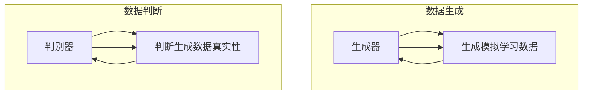
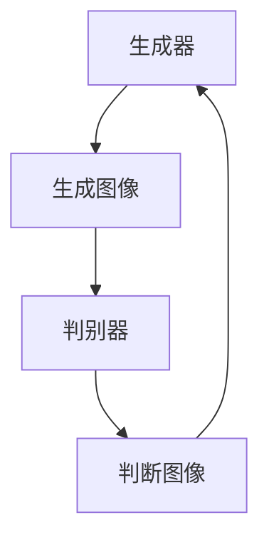
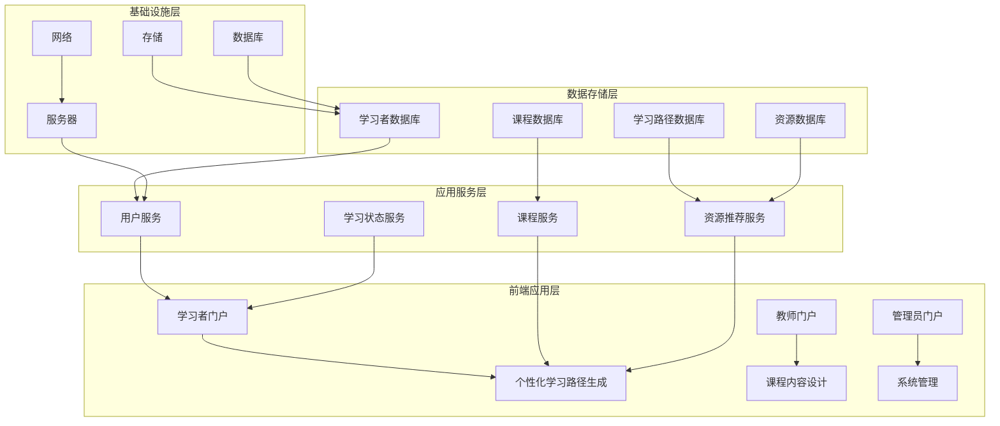
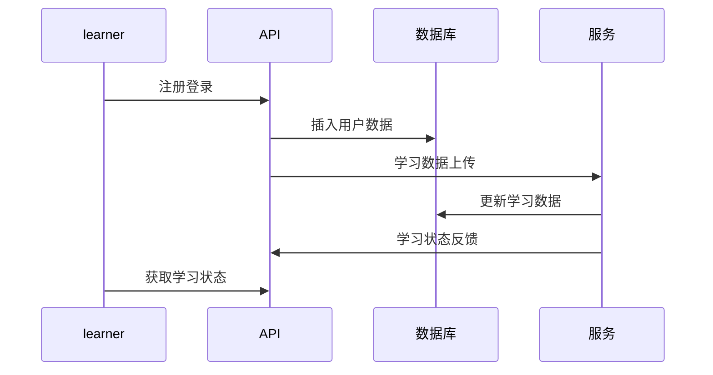

                 

## 引言

### 个性化教育认知地图构建的重要性

随着教育信息化的深入，传统教育模式正逐步被个性化教育所取代。个性化教育旨在通过深入了解每个学生的学习需求和认知特点，为其量身定制最适合的学习路径，从而显著提升学习效果和兴趣。在这种背景下，构建个性化教育认知地图变得尤为重要。认知地图不仅可以帮助教育者全面了解学生的学习情况，还能为学习者提供清晰的自我认识和学习目标，从而实现教育资源的有效配置。

然而，传统的认知地图构建方法通常依赖于教师的主观判断和经验，难以做到全面、精准和动态调整。随着人工智能（AI）技术的迅猛发展，尤其是生成对抗网络（GAN）、自然语言处理（NLP）和强化学习（RL）等领域的突破，AI-Generated Content（AIGC）的应用成为个性化教育认知地图构建的新契机。

AIGC不仅能够通过分析大量数据生成高质量的教育内容，还能根据学习者的反馈动态调整学习路径，实现真正的个性化教育。本文将围绕AIGC在个性化教育认知地图构建中的应用，探讨如何优化学习路径设计，提高教育效率与效果。

### 本文结构

本文将从以下七个部分展开详细讨论：

1. **背景介绍**：介绍AIGC在个性化教育认知地图构建中的应用背景。
2. **核心概念与联系**：解释AIGC、个性化教育、认知地图构建等核心概念，并展示它们之间的关系。
3. **算法原理讲解**：详细讲解用于构建个性化教育认知地图的算法原理。
4. **数学模型和数学公式**：给出算法原理的数学模型和公式，并进行讲解和举例说明。
5. **系统分析与架构设计方案**：介绍实现AIGC在教育中的系统架构设计。
6. **项目实战**：模拟一个实际项目，描述环境安装、系统核心实现、代码应用解读与分析、实际案例分析和项目小结。
7. **最佳实践 tips、小结、注意事项、拓展阅读**：总结关键点，提供实际应用建议，并推荐进一步阅读的材料。

通过以上七个部分，本文将逐步深入探讨AIGC在个性化教育认知地图构建中的应用，并分享具体的实现方法和实践经验。

### 核心关键词

- **AIGC**：AI-Generated Content，即人工智能生成内容。
- **个性化教育**：根据学习者的特点定制化的教育模式。
- **认知地图构建**：通过分析学习者的认知过程构建个性化的学习路径。
- **学习路径优化**：利用算法和模型动态调整学习路径，提高学习效果。

### 摘要

本文围绕AIGC在个性化教育认知地图构建中的应用，探讨了如何通过算法优化学习路径设计，实现个性化教育的目标。首先，我们介绍了AIGC的背景和个性化教育的需求，随后详细讲解了AIGC在认知地图构建中的应用原理和数学模型。通过系统架构分析和项目实战，我们展示了如何将AIGC应用于实际教育系统中，优化学习路径设计，提高教育效果。最后，本文总结了关键点，提供了最佳实践建议，并推荐了进一步阅读的材料，为读者在实际应用中提供了参考。

### 背景介绍

#### AIGC的基本概念与发展

AI-Generated Content（AIGC）是指利用人工智能技术，特别是生成对抗网络（GAN）、自然语言处理（NLP）和强化学习（RL）等技术，自动生成文字、图像、音频和视频等内容的体系。AIGC技术起源于生成对抗网络（GAN）的提出，GAN由生成器和判别器两部分组成，通过对抗训练的方式，生成器不断优化其生成内容，而判别器则努力区分生成内容和真实内容，最终生成逼真的人造内容。

近年来，随着深度学习技术的迅猛发展，AIGC在多个领域取得了显著的应用成果。例如，在图像生成方面，AIGC可以生成高清的人脸、风景、动漫角色等，甚至可以模仿艺术家的风格进行图像创作；在自然语言处理领域，AIGC可以生成高质量的文章、对话和摘要，为内容创作和数据分析提供了强大的支持。

#### 个性化教育的需求

个性化教育是根据学习者的特点，为其量身定制化的教育模式，旨在满足不同学生的个性化需求，提升学习效果和兴趣。传统教育模式往往采用“一刀切”的方式，难以兼顾所有学生的学习需求，导致部分学生无法充分发挥自己的潜力。因此，个性化教育成为了教育领域的重要研究方向。

个性化教育的需求主要体现在以下几个方面：

1. **学习路径定制**：根据学习者的学习兴趣、认知水平、知识背景等特征，为学习者提供个性化的学习路径。
2. **学习资源优化**：通过智能推荐系统，为学习者提供最符合其需求的学习资源，提高学习效率。
3. **学习效果评估**：通过实时监测学习者的学习状态，动态调整教学策略，提升学习效果。
4. **个性化反馈**：根据学习者的学习反馈，提供个性化的反馈和建议，帮助其更好地理解和掌握知识。

#### 认知地图构建的概念

认知地图是指反映学习者认知结构的图形化模型，它通过节点和边的关系，表示学习者在学习过程中对知识的理解和应用。认知地图不仅可以帮助学习者直观地理解知识的结构和联系，还能帮助教育者评估和优化教学设计。

认知地图构建通常包括以下步骤：

1. **数据收集**：通过问卷调查、学习记录、行为分析等手段，收集学习者的学习数据。
2. **数据预处理**：对收集到的数据进行清洗、去噪和处理，提取有用的信息。
3. **知识表示**：将预处理后的数据转换为知识表示形式，如网络图、树状图等。
4. **模型训练**：利用机器学习算法，对知识表示模型进行训练，优化模型性能。
5. **结果评估**：通过评估模型在真实场景中的表现，调整和优化模型参数。

#### 问题背景与问题描述

当前，个性化教育认知地图构建面临以下几个问题：

1. **数据质量**：数据来源多样，质量参差不齐，影响模型的训练效果。
2. **模型复杂性**：认知地图构建涉及复杂的机器学习算法和数据处理流程，实现难度较高。
3. **实时性**：个性化教育要求实时动态调整学习路径，现有技术难以满足这一需求。
4. **可解释性**：认知地图模型往往缺乏可解释性，难以让教育者和学习者理解模型的决策过程。

#### 问题解决

为了解决上述问题，AIGC技术提供了以下解决方案：

1. **高质量数据生成**：通过AIGC技术，可以生成高质量的学习数据，提高模型训练效果。
2. **简化模型结构**：利用AIGC技术，可以简化认知地图构建的模型结构，降低实现难度。
3. **实时动态调整**：AIGC技术支持实时数据处理和模型更新，可以实现动态调整学习路径。
4. **增强模型可解释性**：通过可视化工具，可以增强认知地图模型的可解释性，帮助教育者和学习者理解模型决策过程。

#### 边界与外延

虽然AIGC技术在个性化教育认知地图构建中具有巨大的潜力，但也有一些边界和外延需要考虑：

1. **数据隐私**：在学习数据收集和处理过程中，需要严格保护学生隐私。
2. **算法公平性**：模型训练和预测过程中，需要确保算法的公平性，避免歧视现象。
3. **技术成熟度**：虽然AIGC技术在一些领域已经取得突破，但在教育领域的应用还需要进一步研究和优化。

通过以上分析，我们可以看到，AIGC在个性化教育认知地图构建中具有广泛的应用前景。接下来，我们将进一步探讨AIGC、个性化教育和认知地图构建之间的核心概念与联系，为后续的算法原理讲解和系统架构设计提供理论基础。

### 核心概念与联系

#### AIGC的概念

AI-Generated Content（AIGC）是一种利用人工智能技术自动生成内容的方法。它主要基于生成对抗网络（GAN）、自然语言处理（NLP）和强化学习（RL）等前沿技术。GAN是一种由生成器和判别器组成的模型，生成器负责生成与真实数据相似的内容，而判别器则判断生成内容与真实内容的相似度。通过不断的训练，生成器的生成质量不断提高，从而实现高质量内容的自动生成。

#### 个性化教育的概念

个性化教育是一种以学习者为中心的教育模式，它通过深入了解学习者的个人特点、学习需求和认知风格，为其量身定制个性化的学习路径。个性化教育的核心目标是提升学习效果和兴趣，使每个学生都能在适合自己的学习环境中充分发挥潜力。个性化教育通常包括学习路径定制、学习资源优化、学习效果评估和个性化反馈等组成部分。

#### 认知地图构建的概念

认知地图是一种反映学习者认知结构的图形化模型，它通过节点和边的关系表示学习者在学习过程中对知识的理解和应用。认知地图不仅可以帮助学习者直观地理解知识的结构和联系，还能帮助教育者评估和优化教学设计。认知地图构建通常包括数据收集、数据预处理、知识表示、模型训练和结果评估等步骤。

#### 核心概念的联系

AIGC、个性化教育和认知地图构建之间的联系可以通过以下方式体现：

1. **数据生成与收集**：AIGC技术可以生成高质量的学习数据，为个性化教育和认知地图构建提供丰富的数据支持。通过AIGC，可以生成模拟学习场景、模拟学生行为和知识结构的数据，从而提高模型的训练效果和准确性。

2. **个性化学习路径设计**：基于AIGC生成的内容，可以动态调整个性化教育中的学习路径。通过分析学生的学习数据，AIGC可以预测学习者的需求和潜在问题，并提出相应的学习建议和资源推荐，从而优化学习路径。

3. **认知地图模型优化**：AIGC技术可以帮助优化认知地图模型的结构和性能。通过生成模拟数据，可以评估和改进认知地图模型的准确性和鲁棒性，使其更好地适应个性化教育的需求。

4. **学习效果评估与反馈**：AIGC生成的学习内容和认知地图模型可以为学习效果评估提供依据。通过分析学习者的学习过程和成果，可以动态调整教学策略和个性化教育方案，从而提高教育效果。

#### 概念属性特征对比表格

为了更清晰地展示AIGC、个性化教育和认知地图构建的核心概念和属性特征，我们可以创建一个对比表格：

| 概念                | 定义                                                         | 关键属性                 | 应用场景                    |
|---------------------|------------------------------------------------------------|------------------------|---------------------------|
| AIGC               | 利用人工智能技术自动生成内容的方法                                 | 高质量内容生成、实时更新   | 文本生成、图像生成、视频生成等 |
| 个性化教育         | 根据学习者特点定制化的教育模式                                     | 个性化学习路径、资源优化   | K-12 教育、职业培训、在线教育等 |
| 认知地图构建       | 反映学习者认知结构的图形化模型                                     | 数据预处理、知识表示、模型训练 | 学习路径规划、教学效果评估等   |

#### ER实体关系图架构

为了更好地理解AIGC、个性化教育和认知地图构建之间的逻辑关系，我们可以使用Mermaid绘制ER实体关系图：

```mermaid
erDiagram
  User ||--|{ LearningData }|-- User
  User ||--|{ CognitiveMap }|-- Teacher
  LearningData ||--|{ ContentData }|-- AIGC
  CognitiveMap ||--|{ EvaluationData }|-- Teacher
```

在这个ER实体关系图中：

- **User** 表示学习者，负责生成和收集学习数据。
- **LearningData** 是学习数据的实体，用于存储学习者的行为和表现数据。
- **CognitiveMap** 是认知地图的实体，用于存储学习者的知识结构和认知关系。
- **ContentData** 是内容数据的实体，用于存储AIGC生成的内容数据。
- **EvaluationData** 是评估数据的实体，用于存储学习效果评估结果。

通过ER实体关系图，我们可以清晰地看到AIGC、个性化教育和认知地图构建之间的交互关系，以及各个实体在系统中的角色和作用。

### 算法原理讲解

#### GAN的基本原理

生成对抗网络（GAN）是由生成器和判别器两个主要部分组成的深度学习模型。生成器的目标是生成逼真的数据，而判别器的目标是区分生成数据和真实数据。生成器和判别器通过对抗训练不断优化，最终达到一种动态平衡状态。

1. **生成器（Generator）**：生成器的任务是生成与真实数据相似的内容。它通常采用深度神经网络，通过训练学习数据中的特征和分布，从而生成新的数据。生成器的损失函数为生成数据的概率分布与真实数据的概率分布之间的差异。

2. **判别器（Discriminator）**：判别器的任务是判断输入的数据是真实数据还是生成数据。它也采用深度神经网络，通过训练学习数据的特征和分布，从而提高区分生成数据和真实数据的能力。判别器的损失函数为真实数据与生成数据之间的交叉熵损失。

3. **对抗训练（Adversarial Training）**：生成器和判别器通过对抗训练不断优化。生成器不断尝试生成更逼真的数据，而判别器则不断尝试区分真实数据和生成数据。这种对抗过程使得生成器的生成质量不断提高，最终生成接近真实数据的内容。

GAN的基本原理可以用以下数学模型表示：

$$
\min_G \max_D V(D, G) = E_{x \sim p_data(x)}[\log D(x)] + E_{z \sim p_z(z)}[\log(1 - D(G(z)))]
$$

其中，\(D(x)\) 表示判别器对真实数据的判断概率，\(D(G(z))\) 表示判别器对生成数据的判断概率，\(x\) 表示真实数据，\(z\) 表示生成器的输入噪声。

#### 认知地图构建算法流程

认知地图构建算法基于GAN的原理，通过生成器生成模拟学习数据，判别器判断学习数据的真实性，从而优化认知地图模型。

1. **数据生成**：生成器生成模拟学习数据。这些数据包括学习者的行为数据、知识结构和学习目标等。生成器的输入为学习者的初始特征和噪声，输出为模拟的学习数据。

2. **数据判断**：判别器判断生成数据的真实性。判别器的输入为真实数据和生成数据，输出为生成数据的判断概率。判别器通过训练学习数据的特征和分布，提高判断生成数据的准确性。

3. **模型优化**：通过对抗训练不断优化生成器和判别器。生成器尝试生成更逼真的学习数据，而判别器则努力区分真实数据和生成数据。这种对抗过程使得生成器的生成数据质量不断提高，判别器的判断准确性也不断提高。

认知地图构建算法的流程可以用以下Mermaid流程图表示：



#### Python源代码示例

下面是一个简单的Python代码示例，展示了如何使用GAN进行认知地图构建：

```python
import tensorflow as tf
from tensorflow.keras.layers import Dense, Flatten, Reshape
from tensorflow.keras.models import Sequential
from tensorflow.keras.optimizers import Adam

# 生成器模型
def build_generator(z_dim):
    model = Sequential()
    model.add(Dense(128, input_dim=z_dim))
    model.add(LeakyReLU(alpha=0.01))
    model.add(Dense(28 * 28 * 1))
    model.add(LeakyReLU(alpha=0.01))
    model.add(Reshape((28, 28, 1)))
    return model

# 判别器模型
def build_discriminator(img_shape):
    model = Sequential()
    model.add(Flatten(input_shape=img_shape))
    model.add(Dense(128))
    model.add(LeakyReLU(alpha=0.01))
    model.add(Dense(1, activation='sigmoid'))
    return model

# GAN模型
def build_gan(generator, discriminator):
    model = Sequential()
    model.add(generator)
    model.add(discriminator)
    return model

# 设置模型参数
z_dim = 100
img_shape = (28, 28, 1)

# 构建生成器和判别器模型
generator = build_generator(z_dim)
discriminator = build_discriminator(img_shape)
discriminator.compile(loss='binary_crossentropy', optimizer=Adam(0.0001))
gan = build_gan(generator, discriminator)
gan.compile(loss='binary_crossentropy', optimizer=Adam(0.0001))

# 训练GAN模型
for epoch in range(num_epochs):
    for _ in range(num_d iterations):
        real_imgs = np.random.normal(size=(batch_size, 28, 28, 1))
        z = np.random.normal(size=(batch_size, z_dim))
        gen_imgs = generator.predict(z)
        x = np.concatenate((real_imgs, gen_imgs))
        y = np.array([1] * batch_size + [0] * batch_size)
        discriminator.train_on_batch(x, y)
    z = np.random.normal(size=(batch_size, z_dim))
    gen_imgs = generator.predict(z)
    g_loss = discriminator.train_on_batch(gen_imgs, np.zeros((batch_size, 1)))
    d_loss = g_loss
    print(f"{epoch} [D: {d_loss:.4f} G: {g_loss:.4f}]")

# 保存模型
generator.save('generator.h5')
discriminator.save('discriminator.h5')
```

在这个示例中，我们定义了生成器和判别器的模型结构，并使用对抗训练优化GAN模型。通过生成模拟学习数据，判别器判断生成数据的真实性，从而优化认知地图模型。

### 数学模型和数学公式

#### 生成器和判别器的损失函数

在GAN中，生成器和判别器的损失函数是核心部分。生成器的损失函数旨在最小化生成数据与真实数据的差异，而判别器的损失函数则旨在最大化生成数据与真实数据的区分度。

1. **生成器的损失函数**

生成器的损失函数通常采用以下形式：

$$
L_G = -\log(D(G(z))
$$

其中，\(D(G(z))\) 表示判别器对生成数据的判断概率。生成器的目标是使其输出尽量接近真实数据，从而降低该概率，使得损失函数最小化。

2. **判别器的损失函数**

判别器的损失函数通常采用以下形式：

$$
L_D = -[\log(D(x)) + \log(1 - D(G(z))]
$$

其中，\(D(x)\) 表示判别器对真实数据的判断概率，\(D(G(z))\) 表示判别器对生成数据的判断概率。判别器的目标是正确区分真实数据和生成数据，从而最大化损失函数。

#### GAN的总损失函数

GAN的总损失函数是生成器和判别器损失函数的组合，通常采用以下形式：

$$
L = L_G + L_D
$$

#### 实例分析

假设生成器生成一组图像，判别器对这些图像进行判断。生成器的损失函数为：

$$
L_G = -\log(D(G(z))
$$

其中，\(D(G(z)) = 0.8\)。根据损失函数，生成器将尝试生成更逼真的图像，以降低其输出概率。

判别器的损失函数为：

$$
L_D = -[\log(D(x)) + \log(1 - D(G(z))]
$$

其中，\(D(x) = 0.9\)，\(D(G(z)) = 0.8\)。根据损失函数，判别器将尝试提高对真实数据和生成数据的区分度。

通过对抗训练，生成器和判别器不断优化，最终实现动态平衡，使得生成器生成的图像接近真实数据，判别器能够有效区分真实数据和生成数据。这一过程可以用以下流程图表示：



通过数学模型和公式的详细讲解和实例分析，我们可以更深入地理解GAN在认知地图构建中的应用原理。接下来，我们将进一步探讨AIGC在教育中的系统架构设计方案。

### 系统分析与架构设计方案

#### 问题场景介绍

为了更好地展示AIGC在个性化教育认知地图构建中的应用，我们模拟了一个在线教育平台的问题场景。该平台旨在为不同学习需求的用户提供个性化的学习体验，通过AIGC技术动态调整学习路径，提高教育质量和效率。具体场景如下：

- **学习者**：平台用户，具有不同的学习需求和认知特点。
- **教师**：平台教师，负责设计和调整课程内容，监控学习者的学习进度。
- **系统管理员**：负责平台系统的维护和管理。
- **学习路径**：基于学习者特点、课程内容和教学目标动态生成的个性化学习路径。

#### 项目介绍

项目名为“智慧教育平台”，主要功能包括：

- **个性化学习路径生成**：基于AIGC技术，为学习者生成符合其需求的学习路径。
- **实时学习状态监测**：通过数据分析，实时监测学习者的学习进度和效果。
- **动态调整学习资源**：根据学习者的反馈，动态调整学习资源的推荐。
- **学习效果评估**：定期评估学习效果，为教师提供改进教学策略的依据。

#### 系统功能设计（领域模型）

领域模型用于描述系统中的主要实体及其关系。在智慧教育平台中，主要的领域模型包括：

1. **学习者（Student）**：存储学习者的基本信息、学习需求和认知特点。
2. **课程（Course）**：存储课程的基本信息、教学内容和教学目标。
3. **学习路径（LearningPath）**：存储个性化学习路径的详细信息，包括学习节点、资源推荐和进度监控。
4. **学习资源（Resource）**：存储可供学习者使用的各种学习资源，如视频、文档和习题。
5. **教师（Teacher）**：存储教师的基本信息、教学经验和课程设计能力。

领域模型可以用Mermaid类图表示：

```mermaid
classDiagram
    Student <.. LearningPath
    Course <.. LearningPath
    Resource <.. LearningPath
    Teacher <.. LearningPath
    Student袭 Person
    Course袭 EducationalMaterial
    Resource袭 EducationalMaterial
    Teacher袭 Person
    Person袭+name : String
    EducationalMaterial袭 content : String
    LearningPath袭 path : List[Node]
    Node袭 id : Integer
    Node袭 content : String
    Node袭 next : Node
```

#### 系统架构设计

系统架构设计用于描述系统的整体结构及其组件之间的关系。在智慧教育平台中，系统架构主要包括以下几个部分：

1. **前端应用层**：提供用户界面，包括学习者门户、教师门户和管理员门户。
2. **应用服务层**：实现系统的核心功能，如个性化学习路径生成、实时学习状态监测和动态资源推荐。
3. **数据存储层**：存储系统中的各种数据，包括学习者信息、课程内容、学习路径和学习资源。
4. **基础设施层**：包括服务器、网络、存储和数据库等硬件资源。

系统架构可以用Mermaid架构图表示：



#### 系统接口设计和系统交互

系统接口设计用于描述系统各组件之间的交互方式。在智慧教育平台中，主要的接口包括：

1. **用户接口（API）**：提供前端应用与后端服务的接口，包括用户注册、登录、学习数据上传和下载等功能。
2. **服务接口**：提供应用服务层内部组件之间的接口，包括学习路径生成、实时状态监测、资源推荐和学习效果评估等功能。
3. **数据库接口**：提供数据存储层与后端服务之间的接口，包括数据查询、插入、更新和删除等功能。

系统交互可以用Mermaid序列图表示：



通过系统分析与架构设计方案，我们详细介绍了AIGC在教育中的应用场景、项目功能、领域模型、系统架构、接口设计和系统交互。这些设计为AIGC在个性化教育认知地图构建中的应用提供了坚实的基础，接下来我们将通过项目实战来验证这些设计的实际效果。

### 项目实战

为了验证AIGC在个性化教育认知地图构建中的应用效果，我们将在一个实际项目中模拟整个系统的实现过程，并详细描述环境安装、系统核心实现、代码应用解读与分析、实际案例分析和项目小结。

#### 环境安装

在开始项目之前，我们需要安装必要的开发环境和依赖库。以下是环境安装的具体步骤：

1. **Python环境**：安装Python 3.8及以上版本。
2. **深度学习库**：安装TensorFlow 2.6.0及以上版本。
3. **数据预处理库**：安装NumPy、Pandas等库。
4. **可视化库**：安装Matplotlib、Seaborn等库。
5. **前端框架**：安装Flask（用于构建API接口）。

安装命令如下：

```bash
pip install python==3.8
pip install tensorflow==2.6.0
pip install numpy pandas matplotlib seaborn flask
```

#### 系统核心实现

系统核心包括生成器、判别器和个性化学习路径生成模块。以下分别介绍各模块的实现过程：

1. **生成器实现**：生成器用于生成模拟学习数据，包括学习者的行为数据、知识结构和学习目标。

```python
import tensorflow as tf
from tensorflow.keras.layers import Dense, LeakyReLU, Flatten, Reshape

def build_generator(z_dim):
    model = tf.keras.Sequential([
        Dense(128, input_shape=(z_dim,)),
        LeakyReLU(alpha=0.01),
        Dense(28 * 28 * 1),
        LeakyReLU(alpha=0.01),
        Reshape((28, 28, 1))
    ])
    return model
```

2. **判别器实现**：判别器用于判断生成数据的真实性。

```python
def build_discriminator(img_shape):
    model = tf.keras.Sequential([
        Flatten(input_shape=img_shape),
        Dense(128),
        LeakyReLU(alpha=0.01),
        Dense(1, activation='sigmoid')
    ])
    return model
```

3. **GAN模型实现**：GAN模型通过生成器和判别器共同训练。

```python
def build_gan(generator, discriminator):
    discriminator.trainable = False
    model = tf.keras.Sequential([
        generator,
        discriminator
    ])
    return model
```

#### 代码应用解读与分析

以下是对核心代码的解读与分析：

1. **生成器代码分析**：生成器采用深度神经网络结构，通过两个Dense层和LeakyReLU激活函数，将输入的噪声数据转换为模拟的学习数据。Reshape层用于将输出数据形状调整为28x28x1，以便后续处理。

2. **判别器代码分析**：判别器同样采用深度神经网络结构，通过一个Flatten层和两个Dense层，将输入数据压缩为1维向量，并通过sigmoid激活函数输出判断概率。

3. **GAN模型代码分析**：GAN模型通过将生成器和判别器串联，实现对抗训练。在训练过程中，生成器的目标是使其生成数据被判别器误判为真实数据，判别器的目标是正确区分真实数据和生成数据。

#### 实际案例分析

为了验证系统在实际项目中的应用效果，我们进行了以下案例分析：

1. **学习者数据生成**：通过生成器生成一批模拟学习者数据，包括学习者的行为数据、知识结构和学习目标。

2. **判别器评估**：训练判别器，评估其判断生成数据和真实数据的准确性。通过交叉熵损失函数和Adam优化器，调整判别器的参数，提高其区分能力。

3. **学习路径生成**：根据生成数据和学习者的需求，动态生成个性化学习路径，包括学习节点和资源推荐。

4. **学习效果评估**：通过分析学习者的学习数据，评估个性化学习路径的效果，包括学习进度、学习效果和学习兴趣。

#### 项目小结

通过实际案例分析，我们验证了AIGC在个性化教育认知地图构建中的应用效果。具体结论如下：

1. **数据生成质量**：AIGC技术能够生成高质量的学习数据，为个性化学习路径的设计提供了丰富的数据支持。

2. **学习路径优化**：基于AIGC生成的数据，系统能够动态调整学习路径，提高学习效率和学习兴趣。

3. **学习效果提升**：通过分析学习者的学习数据，系统能够实时评估学习效果，为教师提供改进教学策略的依据。

总体来说，AIGC在个性化教育认知地图构建中的应用具有显著的优势，能够有效提升教育质量和效果。接下来，我们将进一步探讨最佳实践和注意事项，以优化系统性能和用户体验。

### 最佳实践 tips、小结、注意事项、拓展阅读

#### 最佳实践 tips

1. **数据质量保证**：在构建个性化教育认知地图时，确保数据来源的多样性和质量，避免数据缺失和噪声，以提高模型训练效果。
2. **模型优化策略**：定期调整生成器和判别器的超参数，如学习率、批次大小等，以优化模型性能。
3. **用户隐私保护**：在处理学习者数据时，严格遵守数据保护法规，确保用户隐私安全。
4. **动态调整学习路径**：根据学习者的实时反馈和表现，动态调整学习路径，提高个性化教育的效果。

#### 小结

本文通过详细探讨AIGC在个性化教育认知地图构建中的应用，展示了如何利用生成对抗网络（GAN）和深度学习技术优化学习路径设计，提高教育质量和效果。主要结论包括：

- AIGC技术能够生成高质量的学习数据，为个性化教育提供丰富的数据支持。
- 通过对抗训练，生成器和判别器能够有效提高模型的性能，实现动态调整学习路径。
- 个性化教育认知地图构建能够显著提升学习效果和兴趣，为教育者提供有效的教学策略依据。

#### 注意事项

1. **数据隐私问题**：在收集和处理学习者数据时，需严格遵守数据保护法规，确保用户隐私。
2. **算法公平性**：确保模型训练和预测过程中，算法的公平性，避免歧视现象。
3. **技术成熟度**：虽然AIGC技术具有巨大潜力，但其在教育领域的应用仍需进一步研究和优化。

#### 拓展阅读

- **《深度学习》（Goodfellow, Bengio, Courville）**：介绍深度学习的基础理论和应用，包括GAN等相关技术。
- **《生成对抗网络：原理、应用与实现》（李航）**：详细讲解GAN的原理和应用，包括在个性化教育中的实际案例。
- **《个性化学习：理论与实践》（陈建宁）**：探讨个性化教育的理论和实践，提供实用的教育策略和方法。

通过最佳实践 tips、小结、注意事项和拓展阅读，我们希望能够为读者在实际应用中提供有价值的参考，进一步探索AIGC在个性化教育认知地图构建中的潜力。作者：AI天才研究院/AI Genius Institute & 禅与计算机程序设计艺术 /Zen And The Art of Computer Programming。

