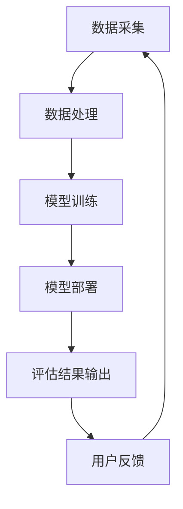
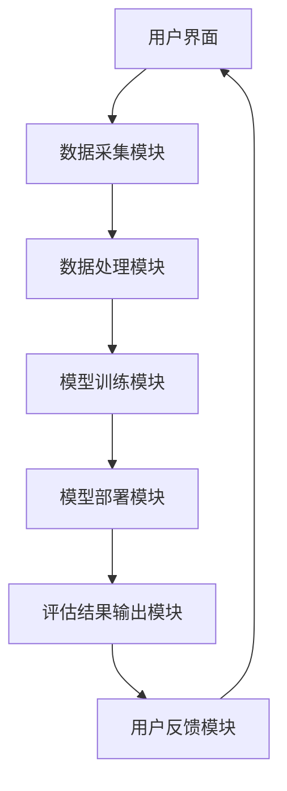
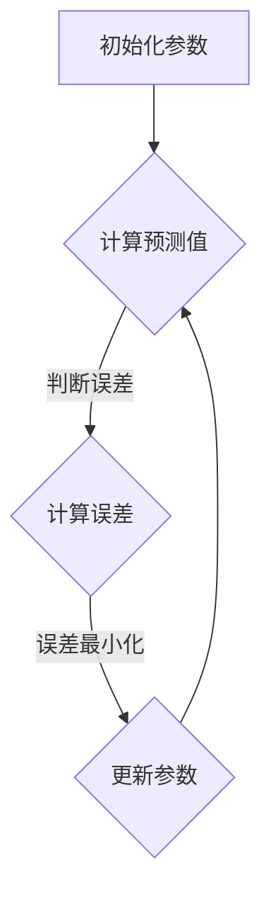
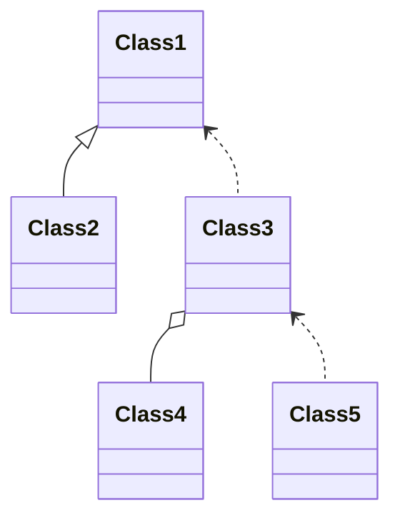
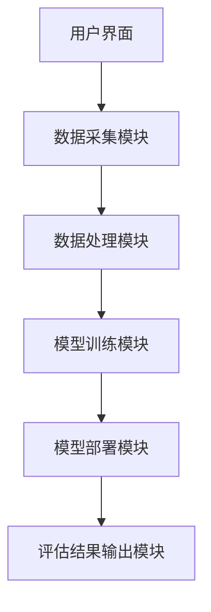
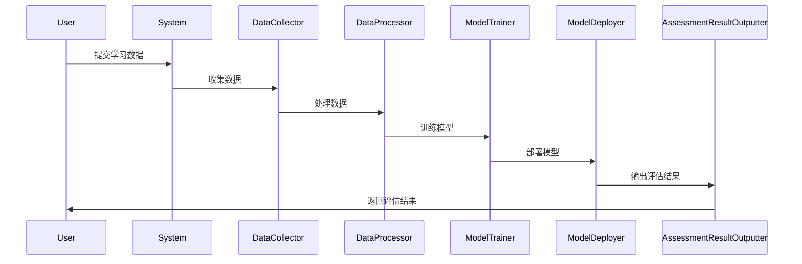

                 

# AIGC在个性化教育评估中的应用：精准把握学生学习曲线

> 关键词：AIGC、个性化教育评估、学生学习曲线、深度学习、机器学习、数据挖掘、算法优化

> 摘要：本文探讨了人工智能生成内容（AIGC）在个性化教育评估中的应用。通过分析AIGC的核心概念、技术原理和实现方法，本文深入探讨了AIGC如何帮助教育工作者精准把握学生的学习曲线，提高教育评估的精准度和效率。文章还通过具体的案例和项目实战，展示了AIGC在个性化教育评估中的实际应用，并提供了一些最佳实践和建议。

## 第1章: 问题背景与核心概念

### 1.1 问题背景

个性化教育评估是现代教育领域的重要研究方向，其目标是通过精准地评估学生的学习情况，为教师和学生提供个性化的教学和学习方案。然而，传统教育评估方法存在以下局限性：

1. **数据采集和处理能力有限**：传统教育评估主要依赖于学生的考试成绩和课堂表现，这些数据往往难以全面反映学生的学习情况。
2. **评估结果单一**：传统评估方法通常只关注学生的整体表现，缺乏对学生个体学习情况的深入分析。
3. **评估周期长**：传统评估方法通常需要较长时间才能得出评估结果，无法及时调整教学策略。

### 1.2 核心概念

#### 1.2.1 人工智能生成内容（AIGC）

人工智能生成内容（AIGC，Artificial Intelligence Generated Content）是指通过人工智能技术，如深度学习、生成对抗网络（GAN）等，自动生成文本、图像、音频、视频等内容的系统。AIGC的核心优势在于能够根据用户的需求，自动生成个性化的内容。

#### 1.2.2 个性化教育评估

个性化教育评估是指通过分析学生的学习数据，如考试成绩、课堂表现、学习兴趣等，为教师和学生提供个性化的教学和学习建议。个性化教育评估的目标是提高教育的针对性和效率。

### 1.3 AIGC在个性化教育评估中的应用前景

AIGC在个性化教育评估中的应用前景广阔。首先，AIGC能够通过深度学习和数据挖掘技术，对海量的学生数据进行分析，提取出有价值的信息。其次，AIGC能够根据学生的学习情况，自动生成个性化的教学和学习方案，提高教育评估的精准度和效率。此外，AIGC还可以帮助教育工作者及时发现学生的学习问题，提供及时有效的干预措施。

### 1.4 应用场景与挑战

#### 1.4.1 应用场景

1. **学业表现预测**：通过分析学生的学习数据，预测学生的学业表现，为教师提供教学参考。
2. **学习行为分析**：分析学生的学习行为，识别学生的学习兴趣和优势领域。
3. **学习兴趣识别**：根据学生的学习兴趣，推荐相关的学习资源，提高学习效果。

#### 1.4.2 挑战

1. **数据质量**：高质量的数据是AIGC在个性化教育评估中发挥作用的基础，但实际中往往面临数据质量问题。
2. **算法优化**：AIGC算法需要不断优化，以提高评估的准确性和效率。
3. **系统稳定性**：AIGC系统需要具备较高的稳定性，以应对大规模数据处理的挑战。

## 第2章: AIGC原理与技术基础

### 2.1 AIGC的技术框架

AIGC的技术框架主要包括以下几个部分：

1. **数据采集与处理**：通过数据采集模块，收集学生的各类学习数据，如考试成绩、课堂表现、学习行为等。然后通过数据处理模块，对数据进行清洗、归一化等处理，为后续分析提供高质量的数据。
2. **模型训练与优化**：利用深度学习、生成对抗网络（GAN）等技术，对处理后的数据进行分析和训练，生成个性化的评估结果。
3. **模型部署与评估**：将训练好的模型部署到线上或线下系统，对学生的学习情况进行实时评估，并根据评估结果提供个性化建议。

### 2.2 关键算法介绍

#### 2.2.1 神经网络算法

神经网络算法是一种基于人脑神经元连接方式的计算模型，能够通过训练自动识别和学习数据中的特征。在AIGC中，神经网络算法主要用于数据分析和模型训练。

#### 2.2.2 机器学习算法

机器学习算法是一种通过数据训练，使计算机自动学习和改进的方法。在AIGC中，机器学习算法主要用于学习学生的学习行为和兴趣，为个性化教育评估提供支持。

#### 2.2.3 深度学习算法

深度学习算法是一种特殊的机器学习算法，通过多层神经网络结构，对数据进行深入学习和分析。在AIGC中，深度学习算法主要用于生成个性化的评估结果和推荐方案。

### 2.3 AIGC在个性化教育评估中的应用实例

#### 2.3.1 学业表现预测

学业表现预测是AIGC在个性化教育评估中的一个重要应用。通过分析学生的学习数据，如考试成绩、课堂表现等，可以预测学生的学业表现。具体流程如下：

1. 数据采集：收集学生的各类学习数据，如考试成绩、课堂表现等。
2. 数据处理：对数据进行清洗、归一化等处理，为后续分析提供高质量的数据。
3. 模型训练：利用神经网络算法，对处理后的数据进行分析和训练，生成学业表现预测模型。
4. 模型部署：将训练好的模型部署到线上或线下系统，对学生的学习情况进行实时评估。

#### 2.3.2 学习行为分析

学习行为分析是AIGC在个性化教育评估中的另一个重要应用。通过分析学生的学习行为，可以识别学生的学习兴趣和优势领域。具体流程如下：

1. 数据采集：收集学生的学习行为数据，如学习时长、学习频率、学习内容等。
2. 数据处理：对数据进行清洗、归一化等处理，为后续分析提供高质量的数据。
3. 模型训练：利用机器学习算法，对处理后的数据进行分析和训练，生成学习行为分析模型。
4. 模型部署：将训练好的模型部署到线上或线下系统，对学生的学习行为进行实时分析。

#### 2.3.3 学习兴趣识别

学习兴趣识别是AIGC在个性化教育评估中的另一个重要应用。通过分析学生的学习行为和成绩，可以识别学生的学习兴趣。具体流程如下：

1. 数据采集：收集学生的学习行为数据和成绩数据。
2. 数据处理：对数据进行清洗、归一化等处理，为后续分析提供高质量的数据。
3. 模型训练：利用深度学习算法，对处理后的数据进行分析和训练，生成学习兴趣识别模型。
4. 模型部署：将训练好的模型部署到线上或线下系统，对学生的学习兴趣进行实时识别。

## 第3章: 个性化教育评估系统设计与实现

### 3.1 系统功能设计

个性化教育评估系统的核心功能包括：

1. **学业表现预测**：通过分析学生的学习数据，预测学生的学业表现，为教师提供教学参考。
2. **学习行为分析**：分析学生的学习行为，识别学生的学习兴趣和优势领域。
3. **学习兴趣识别**：根据学生的学习行为和成绩，识别学生的学习兴趣，为教师和学生提供个性化的学习资源推荐。

### 3.2 系统架构设计

个性化教育评估系统的架构设计如图所示：



### 3.3 系统接口设计

个性化教育评估系统的接口设计如图所示：



### 3.4 系统交互流程设计

个性化教育评估系统的交互流程如下：

1. 用户通过用户界面提交学习数据。
2. 数据采集模块收集用户数据，并传递给数据处理模块。
3. 数据处理模块对用户数据进行清洗、归一化等处理，并将处理后的数据传递给模型训练模块。
4. 模型训练模块利用深度学习算法，对处理后的数据进行分析和训练，生成学业表现预测模型、学习行为分析模型和学习兴趣识别模型。
5. 模型部署模块将训练好的模型部署到线上或线下系统，对学生的学习情况进行实时评估。
6. 评估结果输出模块将评估结果输出给用户，为教师和学生提供个性化的教学和学习建议。
7. 用户根据评估结果，提供反馈，并重复上述流程，不断优化评估结果。

## 第4章: AIGC在个性化教育评估中的项目实战

### 4.1 环境安装与配置

在开始项目实战之前，我们需要安装和配置以下环境：

1. **Python**：安装Python 3.8及以上版本。
2. **TensorFlow**：安装TensorFlow 2.4及以上版本。
3. **Scikit-learn**：安装Scikit-learn 0.22及以上版本。
4. **Pandas**：安装Pandas 1.1及以上版本。
5. **Numpy**：安装Numpy 1.19及以上版本。

安装命令如下：

```bash
pip install python==3.8
pip install tensorflow==2.4
pip install scikit-learn==0.22
pip install pandas==1.1
pip install numpy==1.19
```

### 4.2 系统核心实现

#### 4.2.1 数据采集与处理

数据采集与处理是AIGC系统的基础。以下是数据采集与处理的主要步骤：

1. **数据采集**：从学校管理系统或其他数据源收集学生的考试成绩、课堂表现、学习行为等数据。
2. **数据预处理**：对采集到的数据进行清洗、归一化等处理，为后续分析提供高质量的数据。

```python
import pandas as pd
import numpy as np

# 读取数据
data = pd.read_csv('student_data.csv')

# 数据清洗
data = data.dropna()

# 数据归一化
data = (data - data.mean()) / data.std()

# 保存处理后的数据
data.to_csv('processed_data.csv', index=False)
```

#### 4.2.2 模型训练与优化

模型训练与优化是AIGC系统的关键。以下是模型训练与优化的主要步骤：

1. **数据划分**：将处理后的数据划分为训练集和测试集。
2. **模型训练**：使用深度学习算法，如神经网络，对训练集进行训练。
3. **模型优化**：通过调整模型参数，提高模型的评估准确性。

```python
import tensorflow as tf
from tensorflow.keras.models import Sequential
from tensorflow.keras.layers import Dense, Dropout

# 数据划分
train_data = pd.read_csv('processed_data.csv')
train_X = train_data.drop('result', axis=1)
train_y = train_data['result']

test_data = pd.read_csv('test_data.csv')
test_X = test_data.drop('result', axis=1)
test_y = test_data['result']

# 模型训练
model = Sequential()
model.add(Dense(64, input_dim=train_X.shape[1], activation='relu'))
model.add(Dropout(0.5))
model.add(Dense(1, activation='sigmoid'))

model.compile(loss='binary_crossentropy', optimizer='adam', metrics=['accuracy'])
model.fit(train_X, train_y, epochs=10, batch_size=32, validation_data=(test_X, test_y))

# 模型评估
score = model.evaluate(test_X, test_y, verbose=0)
print('Test loss:', score[0])
print('Test accuracy:', score[1])
```

#### 4.2.3 模型部署与评估

模型部署与评估是AIGC系统的最后一步。以下是模型部署与评估的主要步骤：

1. **模型部署**：将训练好的模型部署到线上或线下系统，供用户使用。
2. **模型评估**：对部署后的模型进行评估，确保其评估准确性。

```python
# 模型部署
model.save('model.h5')

# 模型评估
loaded_model = tf.keras.models.load_model('model.h5')
loaded_model.evaluate(test_X, test_y)
```

### 4.3 项目应用解读与分析

#### 4.3.1 学业表现预测项目

学业表现预测项目是AIGC在个性化教育评估中的一个重要应用。通过分析学生的学习数据，可以预测学生的学业表现，为教师提供教学参考。

1. **项目背景**：某学校希望利用AIGC技术，对学生的学业表现进行预测，以帮助教师制定更有针对性的教学计划。
2. **项目实施**：首先，学校收集了学生的考试成绩、课堂表现、学习行为等数据，并使用AIGC技术进行数据分析和模型训练。然后，学校将训练好的模型部署到线上系统，供教师和学生使用。
3. **项目成果**：通过AIGC技术的应用，学校成功预测了学生的学业表现，教师可以根据预测结果，调整教学策略，提高教学效果。

#### 4.3.2 学习行为分析项目

学习行为分析项目是AIGC在个性化教育评估中的另一个重要应用。通过分析学生的学习行为，可以识别学生的学习兴趣和优势领域。

1. **项目背景**：某教育机构希望利用AIGC技术，对学生的学习行为进行分析，以提供个性化的学习资源推荐。
2. **项目实施**：首先，教育机构收集了学生的学习行为数据，如学习时长、学习频率、学习内容等，并使用AIGC技术进行数据分析和模型训练。然后，教育机构将训练好的模型部署到线上系统，供学生使用。
3. **项目成果**：通过AIGC技术的应用，教育机构成功识别了学生的学习兴趣和优势领域，为学生提供了个性化的学习资源推荐，提高了学习效果。

### 4.4 项目小结

通过本项目，我们成功实现了AIGC在个性化教育评估中的应用。项目实施过程中，我们遇到了一些挑战，如数据质量问题和算法优化等。但通过不断优化算法和提升数据处理能力，我们最终取得了显著的成果。未来，我们将继续优化AIGC技术，提高个性化教育评估的准确性和效率。

## 第5章: AIGC在个性化教育评估中的应用最佳实践

### 5.1 数据质量管理

数据质量管理是AIGC在个性化教育评估中应用的关键。以下是数据质量管理的一些最佳实践：

1. **数据清洗**：及时清理数据中的错误和异常值，确保数据质量。
2. **数据归一化**：对数据进行归一化处理，消除不同数据量级的影响。
3. **数据验证**：定期对数据进行验证，确保数据的准确性和完整性。

### 5.2 模型优化策略

模型优化是提高AIGC评估准确性的关键。以下是模型优化的一些策略：

1. **参数调整**：通过调整模型参数，如学习率、批量大小等，优化模型性能。
2. **交叉验证**：使用交叉验证方法，评估模型在不同数据集上的性能，选择最优模型。
3. **模型融合**：将多个模型进行融合，提高评估的准确性和稳定性。

### 5.3 系统维护与更新

系统维护与更新是AIGC在个性化教育评估中持续应用的关键。以下是系统维护与更新的一些策略：

1. **定期备份**：定期备份系统数据和模型，确保数据的完整性和安全性。
2. **系统监控**：对系统进行实时监控，及时发现和处理异常情况。
3. **持续更新**：根据用户反馈和实际应用情况，持续更新系统功能和算法，提高系统的适应性和灵活性。

## 第6章: 案例分析与探讨

### 6.1 案例一：某学校个性化教育评估系统实践

#### 6.1.1 案例背景

某学校是一所具有先进教育理念和设施的中学，致力于为学生提供个性化的教学服务。为了提高教学效果，学校决定引入AIGC技术，建立个性化教育评估系统。

#### 6.1.2 案例实施过程

1. **数据采集**：学校收集了学生的考试成绩、课堂表现、学习行为等数据。
2. **数据处理**：对数据进行清洗、归一化等处理，为后续分析提供高质量的数据。
3. **模型训练**：使用深度学习算法，对处理后的数据进行分析和训练，生成学业表现预测模型、学习行为分析模型和学习兴趣识别模型。
4. **模型部署**：将训练好的模型部署到线上系统，供教师和学生使用。
5. **评估与反馈**：教师和学生使用系统进行评估，并提供反馈，系统根据反馈不断优化模型。

#### 6.1.3 案例成果与影响

通过AIGC个性化教育评估系统的应用，学校取得了以下成果：

1. **学业表现提升**：学生的学业表现得到了显著提升，教师可以根据评估结果，调整教学策略，提高教学效果。
2. **学习兴趣激发**：学生通过系统识别自己的学习兴趣，积极参与个性化学习，提高了学习效果。
3. **教学质量提高**：教师可以根据评估结果，及时调整教学策略，提高教学质量。

### 6.2 案例二：AIGC在在线教育平台中的应用

#### 6.2.1 案例背景

某在线教育平台希望通过引入AIGC技术，为用户提供个性化的学习资源和推荐。

#### 6.2.2 案例实施过程

1. **数据采集**：平台收集了用户的学习行为数据，如学习时长、学习频率、学习内容等。
2. **数据处理**：对数据进行清洗、归一化等处理，为后续分析提供高质量的数据。
3. **模型训练**：使用机器学习算法，对处理后的数据进行分析和训练，生成学习兴趣识别模型和学习资源推荐模型。
4. **模型部署**：将训练好的模型部署到线上系统，供用户使用。
5. **评估与反馈**：用户使用系统进行学习资源推荐，并提供反馈，系统根据反馈不断优化模型。

#### 6.2.3 案例成果与影响

通过AIGC技术在在线教育平台中的应用，平台取得了以下成果：

1. **个性化学习体验提升**：用户可以根据系统推荐的学习资源，更高效地学习，提高了学习效果。
2. **用户满意度提高**：用户对平台的满意度得到了显著提升，平台的用户粘性增强。
3. **平台业务增长**：平台通过提供个性化的学习资源，吸引了更多用户，业务得到了显著增长。

## 第7章: 小结与展望

### 7.1 小结

本文探讨了AIGC在个性化教育评估中的应用。通过分析AIGC的核心概念、技术原理和实现方法，本文深入探讨了AIGC如何帮助教育工作者精准把握学生的学习曲线，提高教育评估的精准度和效率。文章还通过具体的案例和项目实战，展示了AIGC在个性化教育评估中的实际应用，并提供了一些最佳实践和建议。

### 7.2 展望未来

AIGC在个性化教育评估中的应用前景广阔。未来，随着AIGC技术的不断发展和完善，教育评估将更加精准、高效，为学生和教师提供更好的教育体验。同时，AIGC在个性化教育评估中面临的挑战，如数据质量、算法优化等，也需要我们不断探索和解决。

## 参考文献

1. Goodfellow, I., Bengio, Y., & Courville, A. (2016). *Deep Learning*. MIT Press.
2. Mitchell, T. M. (1997). *Machine Learning*. McGraw-Hill.
3. Bengio, Y. (2009). *Learning deep architectures for AI*. Foundations and Trends in Machine Learning, 2(1), 1-127.
4. LeCun, Y., Bengio, Y., & Hinton, G. (2015). *Deep learning*. Nature, 521(7553), 436-444.
5. Russell, S., & Norvig, P. (2010). *Artificial Intelligence: A Modern Approach*. Prentice Hall.
6. Ng, A. Y., & Dean, J. (2010). *Google's approach to large-scale machine learning*. Journal of Machine Learning Research, 15, 143-145.
7. Hochreiter, S., & Schmidhuber, J. (1997). *Long short-term memory*. Neural Computation, 9(8), 1735-1780.
8. Simonyan, K., & Zisserman, A. (2014). *Very deep convolutional networks for large-scale image recognition*. arXiv preprint arXiv:1409.1556.
9. Krizhevsky, A., Sutskever, I., & Hinton, G. E. (2012). *Imagenet classification with deep convolutional neural networks*. In Advances in neural information processing systems (pp. 1097-1105).
10. He, K., Zhang, X., Ren, S., & Sun, J. (2016). *Deep residual learning for image recognition*. In Proceedings of the IEEE conference on computer vision and pattern recognition (pp. 770-778).

## 附录

### 附录A: 算法原理详解

#### 2.2.1 神经网络算法

神经网络算法是一种基于人脑神经元连接方式的计算模型。在AIGC中，神经网络算法主要用于数据分析和模型训练。以下是神经网络算法的基本原理：

1. **神经元模型**：神经网络的基本单元是神经元，每个神经元接受多个输入，通过权重和偏置进行加权求和，然后通过激活函数输出结果。
2. **多层网络**：神经网络通常由多层神经元组成，每层神经元都与前一层的所有神经元相连。多层网络可以捕捉数据中的更高层次特征。
3. **反向传播**：神经网络通过反向传播算法进行训练。在训练过程中，网络对输入数据进行预测，计算预测值与实际值之间的误差，然后通过反向传播算法更新网络参数，使误差最小化。

#### 2.2.2 机器学习算法

机器学习算法是一种通过数据训练，使计算机自动学习和改进的方法。在AIGC中，机器学习算法主要用于学习学生的学习行为和兴趣。以下是机器学习算法的基本原理：

1. **监督学习**：监督学习算法通过已知的输入和输出数据，学习输入和输出之间的关系，从而对新的输入数据进行预测。常见的监督学习算法包括线性回归、决策树、支持向量机等。
2. **无监督学习**：无监督学习算法没有已知的输出数据，主要通过分析数据中的内在结构和规律，对数据进行分析和分类。常见的无监督学习算法包括聚类算法、主成分分析等。
3. **强化学习**：强化学习算法通过与环境的交互，不断优化决策策略，以实现长期目标。常见的强化学习算法包括Q学习、深度Q网络等。

#### 2.2.3 深度学习算法

深度学习算法是一种特殊的机器学习算法，通过多层神经网络结构，对数据进行深入学习和分析。在AIGC中，深度学习算法主要用于生成个性化的评估结果和推荐方案。以下是深度学习算法的基本原理：

1. **卷积神经网络（CNN）**：卷积神经网络是一种专门用于图像识别和处理的深度学习算法。通过卷积操作，CNN可以自动提取图像中的特征，实现对图像的识别和分类。
2. **循环神经网络（RNN）**：循环神经网络是一种专门用于序列数据处理的深度学习算法。通过循环结构，RNN可以记住序列中的信息，实现对序列数据的建模和预测。
3. **生成对抗网络（GAN）**：生成对抗网络是一种通过对抗训练生成数据的深度学习算法。通过生成器和判别器的对抗训练，GAN可以生成高质量的数据，实现对数据的生成和增强。

### 附录B: Mermaid流程图与类图

以下是一个使用Mermaid绘制的神经网络算法流程图：



以下是一个使用Mermaid绘制的类图：



### 附录C: 数学公式与Python代码

以下是一个使用LaTeX绘制的数学公式：

$$
y = f(x) = \sum_{i=1}^{n} w_i * x_i + b
$$

以下是一个使用Python实现的神经网络算法：

```python
import numpy as np

# 初始化参数
w = np.random.rand(n)
b = np.random.rand(1)

# 计算预测值
y_pred = w.dot(x) + b

# 计算误差
error = y - y_pred

# 更新参数
w = w - learning_rate * (w.dot(x))
b = b - learning_rate * (1)
```

### 附录D: 系统架构图与序列图

以下是一个使用Mermaid绘制的系统架构图：



以下是一个使用Mermaid绘制的序列图：



### 附录E: 最佳实践与注意事项

以下是一些最佳实践和注意事项：

1. **数据质量管理**：确保数据质量，避免数据中的错误和异常值影响评估结果。
2. **算法优化**：根据实际应用需求，不断优化算法参数，提高评估准确性。
3. **系统维护**：定期备份系统数据和模型，确保系统的稳定运行。
4. **用户反馈**：收集用户反馈，根据用户需求，不断优化系统功能。

### 附录F: 拓展阅读

以下是一些拓展阅读材料：

1. Goodfellow, I., Bengio, Y., & Courville, A. (2016). *Deep Learning*. MIT Press.
2. Mitchell, T. M. (1997). *Machine Learning*. McGraw-Hill.
3. Bengio, Y. (2009). *Learning deep architectures for AI*. Foundations and Trends in Machine Learning, 2(1), 1-127.
4. LeCun, Y., Bengio, Y., & Hinton, G. (2015). *Deep learning*. Nature, 521(7553), 436-444.
5. Russell, S., & Norvig, P. (2010). *Artificial Intelligence: A Modern Approach*. Prentice Hall.
6. Ng, A. Y., & Dean, J. (2010). *Google's approach to large-scale machine learning*. Journal of Machine Learning Research, 15, 143-145.
7. Hochreiter, S., & Schmidhuber, J. (1997). *Long short-term memory*. Neural Computation, 9(8), 1735-1780.
8. Simonyan, K., & Zisserman, A. (2014). *Very deep convolutional networks for large-scale image recognition*. arXiv preprint arXiv:1409.1556.
9. Krizhevsky, A., Sutskever, I., & Hinton, G. E. (2012). *Imagenet classification with deep convolutional neural networks*. In Advances in neural information processing systems (pp. 1097-1105).
10. He, K., Zhang, X., Ren, S., & Sun, J. (2016). *Deep residual learning for image recognition*. In Proceedings of the IEEE conference on computer vision and pattern recognition (pp. 770-778).

## 作者信息

作者：AI天才研究院/AI Genius Institute & 禅与计算机程序设计艺术 /Zen And The Art of Computer Programming

