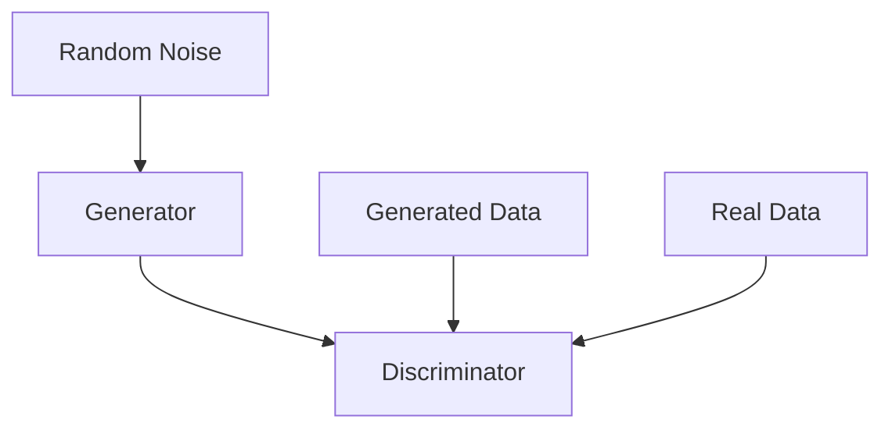
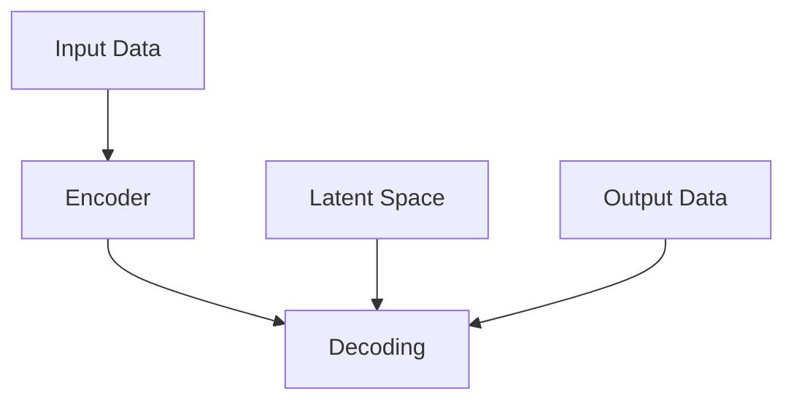
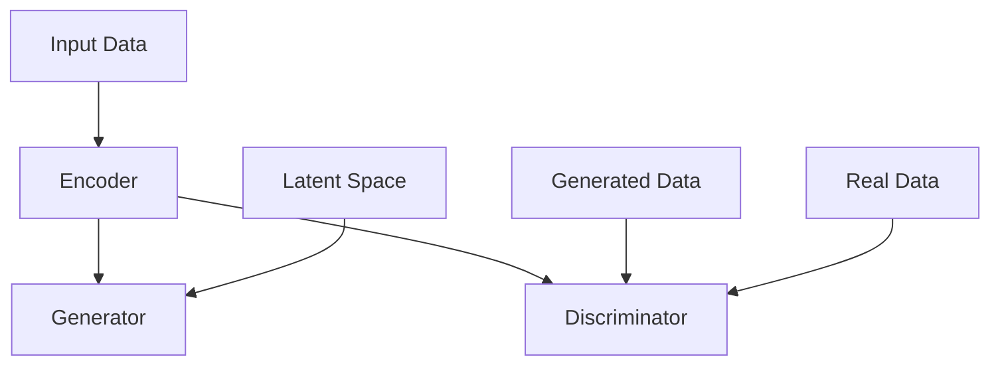

                 

### AIGC在个性化旅游路线规划中的应用

#### 关键词：AIGC、个性化旅游路线规划、自然语言处理、生成对抗网络、旅游者行为分析

> 摘要：随着人工智能技术的发展，AIGC（自适应智能生成计算）成为个性化旅游路线规划的重要工具。本文首先介绍了AIGC的基本概念及其核心原理，然后分析了个性化旅游路线规划的市场需求，详细讲解了AIGC在旅游信息处理、旅游者行为分析、旅游路线规划以及旅游服务推荐中的应用，通过实际案例展示了AIGC的应用效果，并提出了最佳实践和未来发展趋势。本文旨在为研究者提供有价值的参考，推动AIGC在旅游行业的深入应用。

### 引言

个性化旅游路线规划是一种基于用户兴趣和需求，利用先进的人工智能技术，为游客提供量身定制的旅游路线方案的服务。这种服务不仅能够提高游客的旅游体验，还能提升旅游企业的竞争力。近年来，随着大数据和人工智能技术的迅猛发展，个性化旅游路线规划逐渐成为旅游行业的热点研究方向。

AIGC（自适应智能生成计算）是一种结合了自然语言处理、生成对抗网络（GAN）、变分自编码器（VAE）等先进技术的综合体系，其能够在大量数据中自动生成高质量的文本、图像和音频等内容。AIGC在个性化旅游路线规划中的应用，可以有效解决传统方法在数据利用、个性化推荐、用户体验等方面的不足。

本文将从以下几个方面展开讨论：

1. **AIGC概述**：介绍AIGC的定义、基本原理和发展历程，并探讨其在个性化旅游路线规划中的潜在应用。
2. **个性化旅游路线规划市场需求分析**：分析旅游市场的现状、个性化旅游趋势以及市场需求，预测市场前景。
3. **AIGC技术原理及应用**：详细讲解AIGC的核心技术，包括自然语言处理、GAN、VAE等，并阐述其在旅游信息处理、旅游者行为分析和旅游路线规划中的应用。
4. **实际案例展示**：通过具体案例展示AIGC在个性化旅游路线规划中的实际应用效果。
5. **最佳实践与未来发展趋势**：总结AIGC在个性化旅游路线规划中的最佳实践，并探讨未来发展趋势。

### AIGC概述

#### 1.1 AIGC的定义与基本原理

AIGC（自适应智能生成计算）是一种通过自适应算法，在大量数据中生成高质量内容的技术。AIGC的基本原理是通过训练大量数据模型，从而实现数据生成、内容理解和自适应调整等功能。AIGC的核心技术包括自然语言处理（NLP）、生成对抗网络（GAN）、变分自编码器（VAE）等。

- **自然语言处理（NLP）**：NLP是AIGC的重要组成部分，主要研究如何让计算机理解和生成人类语言。NLP包括语言模型、词向量表示、序列模型等技术，如Transformer模型和BERT模型等。

- **生成对抗网络（GAN）**：GAN是一种由生成器和判别器组成的对抗网络，通过两者之间的博弈，生成逼真的图像、文本和音频等内容。GAN的主要优点是能够生成高质量、多样化的数据。

- **变分自编码器（VAE）**：VAE是一种基于概率模型的生成模型，通过编码器和解码器，将输入数据转换为潜在空间，并在潜在空间中生成新的数据。VAE的主要优点是能够生成连续的数据分布。

#### 1.2 AIGC的发展历程

AIGC的发展可以追溯到20世纪80年代，当时人们开始研究如何利用计算机生成自然语言文本。随着深度学习技术的发展，特别是GAN和VAE的提出，AIGC逐渐成为人工智能领域的研究热点。

- **20世纪80年代**：自然语言处理开始兴起，人们开始研究如何利用计算机生成自然语言文本。

- **2014年**：GAN由Ian Goodfellow等人提出，迅速成为生成模型领域的热门技术。

- **2017年**：VAE由Kingma和Welling提出，成为生成模型领域的重要突破。

- **至今**：AIGC在自然语言处理、计算机视觉、音频生成等领域取得了一系列重要突破，成为人工智能领域的重要研究方向。

#### 1.3 AIGC在个性化旅游路线规划中的应用场景

AIGC在个性化旅游路线规划中具有广泛的应用场景，主要包括以下几个方面：

- **旅游信息处理**：利用NLP技术，对大量旅游信息进行自动分类、情感分析和语义分析，为旅游者提供准确的旅游信息。

- **旅游者行为分析**：利用NLP和GAN技术，挖掘旅游者的兴趣和偏好，预测旅游者的行为，为旅游路线规划提供依据。

- **旅游路线规划**：利用VAE技术，根据旅游者的兴趣和需求，生成个性化的旅游路线，提高旅游体验。

- **旅游服务推荐**：利用GAN和VAE技术，为旅游者推荐符合其兴趣和需求的旅游服务，如酒店、餐厅、景点等。

AIGC在个性化旅游路线规划中的应用，不仅能够提高旅游者的满意度，还能提升旅游企业的竞争力，具有重要的现实意义。

### 个性化旅游路线规划的定义与意义

#### 2.1 个性化旅游路线规划的定义

个性化旅游路线规划是一种基于用户兴趣和需求，利用先进的人工智能技术，为游客提供量身定制的旅游路线方案的服务。它包括以下几个关键要素：

- **用户兴趣和需求**：个性化旅游路线规划的核心是基于用户的兴趣和需求，通过数据分析和挖掘，了解用户的偏好和行为模式。

- **旅游路线方案**：根据用户的兴趣和需求，生成符合用户预期的旅游路线方案，包括旅游线路、景点、交通方式、住宿等。

- **人工智能技术**：利用自然语言处理、生成对抗网络、变分自编码器等人工智能技术，实现旅游信息的处理、用户行为的分析和旅游路线的生成。

#### 2.2 个性化旅游路线规划的意义

个性化旅游路线规划在旅游业中具有重要的意义，主要体现在以下几个方面：

- **提高游客满意度**：通过个性化的旅游路线规划，能够满足游客的个性化需求，提高游客的满意度，增强游客的旅游体验。

- **提升旅游企业竞争力**：个性化旅游路线规划能够为旅游企业提供差异化服务，提升企业的竞争力，吸引更多游客。

- **优化旅游资源利用**：个性化旅游路线规划能够有效整合旅游资源，提高旅游资源的利用效率，降低旅游企业的运营成本。

- **促进旅游业发展**：个性化旅游路线规划能够推动旅游业向高质量、高效率发展，促进旅游业可持续发展。

#### 2.3 个性化旅游路线规划的现状与挑战

当前，个性化旅游路线规划在全球范围内得到了广泛应用，但也面临着一些挑战：

- **技术门槛较高**：个性化旅游路线规划需要利用先进的人工智能技术，包括自然语言处理、生成对抗网络、变分自编码器等，技术门槛较高。

- **数据质量参差不齐**：个性化旅游路线规划需要大量高质量的数据作为支撑，但当前旅游行业的数据质量参差不齐，影响了个性化旅游路线规划的效果。

- **用户隐私保护**：个性化旅游路线规划涉及到用户的个人兴趣和需求，如何保护用户的隐私成为一大挑战。

- **系统集成困难**：个性化旅游路线规划需要整合多种技术和服务，包括旅游信息处理、用户行为分析、旅游路线生成等，系统集成困难。

#### 2.4 AIGC在个性化旅游路线规划中的潜在应用

AIGC在个性化旅游路线规划中具有广泛的潜在应用，主要包括以下几个方面：

- **旅游信息处理**：利用AIGC的自然语言处理技术，对大量的旅游信息进行自动分类、情感分析和语义分析，为旅游者提供准确的旅游信息。

- **旅游者行为分析**：利用AIGC的生成对抗网络和变分自编码器技术，挖掘旅游者的兴趣和偏好，预测旅游者的行为，为旅游路线规划提供依据。

- **旅游路线规划**：利用AIGC的变分自编码器技术，根据旅游者的兴趣和需求，生成个性化的旅游路线，提高旅游体验。

- **旅游服务推荐**：利用AIGC的生成对抗网络和变分自编码器技术，为旅游者推荐符合其兴趣和需求的旅游服务，如酒店、餐厅、景点等。

AIGC在个性化旅游路线规划中的应用，不仅能够解决当前面临的挑战，还能推动个性化旅游路线规划向更高效、更智能的方向发展。

### 个性化旅游路线规划市场需求分析

#### 3.1 旅游市场概述

旅游市场是全球经济发展的重要组成部分，随着人们生活水平的提高和旅游需求的多样化，旅游市场呈现出快速增长的趋势。根据国际旅游组织的数据，全球旅游市场规模已超过2万亿美元，并且每年以约4%的速度增长。

当前，旅游市场的特点主要体现在以下几个方面：

- **市场需求多样化**：随着旅游者消费观念的转变，市场需求越来越多样化，从传统的观光旅游逐渐向深度旅游、体验旅游、定制旅游等方向发展。
- **科技应用普及**：互联网、人工智能、大数据等新兴技术逐渐普及，成为旅游市场的重要驱动力。这些技术不仅改变了旅游服务的提供方式，也改变了旅游者的消费习惯。
- **个性化需求凸显**：旅游者越来越注重个性化体验，追求独特的旅游体验和服务，这为个性化旅游路线规划提供了广阔的市场空间。

#### 3.2 个性化旅游趋势分析

个性化旅游是一种以用户需求为中心，提供量身定制旅游路线和服务的旅游形式。随着人工智能技术的快速发展，个性化旅游逐渐成为旅游市场的一大趋势。

- **个性化旅游的定义**：个性化旅游是指根据旅游者的兴趣、需求和偏好，利用大数据和人工智能技术，提供定制化的旅游路线、景点推荐和旅游服务。
- **个性化旅游的发展趋势**：
  - **个性化推荐**：利用机器学习算法，根据旅游者的历史行为和偏好，推荐符合其需求的旅游景点、住宿和交通方案。
  - **定制化服务**：提供一对一的旅游咨询服务，根据旅游者的具体需求，定制专属的旅游路线和行程。
  - **智能化体验**：通过智能导览、智能客服等技术，提升旅游者的智能化体验，增强旅游的互动性和趣味性。

#### 3.3 个性化旅游路线规划市场需求分析

个性化旅游路线规划在旅游市场中具有巨大的市场需求，主要体现在以下几个方面：

- **旅游者需求分析**：
  - **追求独特体验**：越来越多的旅游者希望能够在旅游中体验到独特的文化和生活方式，追求个性化、差异化的旅游体验。
  - **时间灵活性**：旅游者对行程的灵活性要求越来越高，希望能够自由安排时间，灵活调整行程。
  - **个性化服务**：旅游者希望能够获得一对一的个性化服务，包括行程规划、住宿选择、餐饮推荐等。

- **旅游企业需求分析**：
  - **提升竞争力**：旅游企业通过提供个性化旅游路线规划服务，能够提升自身的竞争力，吸引更多的游客。
  - **降低运营成本**：通过智能化和自动化技术，旅游企业能够降低运营成本，提高运营效率。
  - **拓展市场空间**：个性化旅游路线规划能够开拓新的市场空间，吸引更多海外游客，提升企业的国际竞争力。

#### 3.4 个性化旅游路线规划市场前景预测

随着人工智能技术的不断进步和旅游市场的持续发展，个性化旅游路线规划市场前景广阔。

- **市场规模预测**：预计未来几年，个性化旅游路线规划市场规模将持续增长，年复合增长率将达到20%以上。
- **市场竞争分析**：随着更多企业的进入，个性化旅游路线规划市场将出现激烈的竞争。拥有核心技术、优质服务和强大数据积累的企业将具有竞争优势。

总之，个性化旅游路线规划是旅游行业发展的必然趋势，具有广阔的市场前景。通过人工智能技术的应用，个性化旅游路线规划将为旅游者提供更加个性化、智能化和便捷的旅游服务，推动旅游行业向更高品质、更高效益发展。

### AIGC技术原理

AIGC（自适应智能生成计算）是一种通过自适应算法在大量数据中生成高质量内容的技术，其核心在于利用生成对抗网络（GAN）、变分自编码器（VAE）和自然语言处理（NLP）等技术，实现数据的生成、理解和自适应调整。以下将对AIGC的核心技术进行详细讲解。

#### 3.1 自然语言处理基础

自然语言处理（NLP）是AIGC的重要组成部分，其主要目标是让计算机理解和生成人类语言。NLP的基本原理包括以下几个方面：

- **语言模型**：语言模型是NLP的基础，它通过学习大量文本数据，预测下一个单词或句子的概率。常用的语言模型包括n-gram模型、神经网络语言模型（如RNN、LSTM）和Transformer模型。

- **词向量表示**：词向量是将单词转换为向量的一种方法，用于表示单词在语义上的关系。常用的词向量表示方法包括Word2Vec、GloVe和BERT。

- **序列模型**：序列模型用于处理文本序列，预测下一个单词或句子。常用的序列模型包括n-gram模型、循环神经网络（RNN）、长短时记忆网络（LSTM）和Transformer模型。

#### 3.2 生成对抗网络（GAN）

生成对抗网络（GAN）是一种由生成器和判别器组成的对抗网络，通过两者之间的博弈，生成高质量的数据。GAN的基本原理如下：

- **生成器（Generator）**：生成器的目标是生成与真实数据相似的数据，其输入是随机噪声，输出是生成数据。

- **判别器（Discriminator）**：判别器的目标是区分生成数据和真实数据，其输入是真实数据和生成数据，输出是一个概率值，表示输入数据是真实数据的概率。

- **对抗训练**：生成器和判别器通过对抗训练不断优化，生成器试图生成更真实的数据，判别器试图提高对真实数据和生成数据的区分能力。通过这种对抗训练，生成器最终能够生成高质量的数据。

GAN的应用非常广泛，包括图像生成、语音合成、文本生成等。以下是一个GAN的基本架构图：



#### 3.3 变分自编码器（VAE）

变分自编码器（VAE）是一种基于概率模型的生成模型，通过编码器和解码器，将输入数据转换为潜在空间，并在潜在空间中生成新的数据。VAE的基本原理如下：

- **编码器（Encoder）**：编码器的目标是学习一个编码函数，将输入数据映射到一个低维潜在空间中，通常是一个均值和一个对数方差。

- **解码器（Decoder）**：解码器的目标是学习一个解码函数，将潜在空间中的数据映射回原始数据空间。

- **潜在空间**：潜在空间是一个低维空间，可以表示数据的分布，通过在潜在空间中采样，可以生成新的数据。

VAE的数学模型如下：

$$
\begin{align*}
\text{Encoder}: z &= \mu(z|x) + \sigma(z|x)\epsilon \\
\text{Decoder}: x &= \phi(x|z)
\end{align*}
$$

其中，$\mu(z|x)$和$\sigma(z|x)$是编码器输出的均值和对数方差，$\epsilon$是噪声，$\phi(x|z)$是解码器。

以下是一个VAE的基本架构图：



#### 3.4 对抗性自编码器（AAE）

对抗性自编码器（AAE）是VAE的一种变体，它将GAN的对抗性训练引入到自编码器中，以提高生成数据的质量。AAE的基本原理如下：

- **生成器（Generator）**：生成器的目标是生成与真实数据相似的数据。

- **判别器（Discriminator）**：判别器的目标是区分生成数据和真实数据。

- **编码器（Encoder）**：编码器用于提取数据的特征，其输出是生成器的输入。

AAE的数学模型如下：

$$
\begin{align*}
\text{Encoder}: z &= \mu(z|x) + \sigma(z|x)\epsilon \\
\text{Generator}: x_g &= \phi(x_g|z) \\
\text{Discriminator}: D(x) &= \text{sigmoid}(\theta_D(x)) \\
\text{Loss Function}: L &= -\frac{1}{2N} \sum_{i=1}^{N} \left[ D(x_i) - \log D(\phi(x_i|z_i)) \right] - \frac{1}{2N} \sum_{i=1}^{N} \left[ 1 - \log (1 - D(x_i)) \right]
\end{align*}
$$

其中，$z_i$是编码器输出的潜在空间，$x_i$是真实数据，$x_g$是生成器生成的数据，$D(x)$是判别器的输出。

以下是一个AAE的基本架构图：



通过以上对AIGC技术原理的详细讲解，我们可以看到，AIGC结合了自然语言处理、生成对抗网络和变分自编码器等先进技术，能够在大量数据中生成高质量的内容，为个性化旅游路线规划提供了强大的技术支持。

### AIGC在个性化旅游路线规划中的应用

#### 4.1 AIGC在旅游信息处理中的应用

旅游信息处理是个性化旅游路线规划的重要环节，涉及到对大量旅游信息的自动分类、情感分析和语义分析。AIGC在旅游信息处理中的应用主要体现在以下几个方面：

- **自动分类**：利用AIGC的自然语言处理技术，对旅游信息进行自动分类。例如，将旅游信息分为景点、酒店、餐饮等类别，为后续的旅游路线规划提供数据支持。自动分类的过程可以简化为以下步骤：

  1. **数据预处理**：对旅游信息进行清洗和标准化处理，去除无关信息和噪声。
  2. **词向量表示**：将文本数据转换为词向量表示，利用Word2Vec或BERT等模型。
  3. **分类模型训练**：使用分类算法（如SVM、决策树、神经网络等）对词向量进行分类训练。
  4. **分类应用**：将训练好的模型应用于新的旅游信息，实现自动分类。

  以下是一个自动分类的简单流程图：

  ```mermaid
  graph TD
  A[Data Preprocessing] --> B[Word Vector Representation]
  B --> C[Classification Model Training]
  C --> D[Classification Application]
  ```

- **情感分析**：利用AIGC的自然语言处理技术，对旅游评论进行情感分析，判断评论的情感倾向（正面、负面或中性）。情感分析的过程可以简化为以下步骤：

  1. **数据预处理**：对旅游评论进行清洗和标准化处理，去除无关信息和噪声。
  2. **词向量表示**：将文本数据转换为词向量表示，利用Word2Vec或BERT等模型。
  3. **情感分析模型训练**：使用情感分析算法（如朴素贝叶斯、支持向量机、递归神经网络等）对词向量进行训练。
  4. **情感分析应用**：将训练好的模型应用于新的旅游评论，实现情感分析。

  以下是一个情感分析的简单流程图：

  ```mermaid
  graph TD
  A[Data Preprocessing] --> B[Word Vector Representation]
  B --> C[Sentiment Analysis Model Training]
  C --> D[Sentiment Analysis Application]
  ```

- **语义分析**：利用AIGC的自然语言处理技术，对旅游信息进行语义分析，提取关键信息和语义关系。语义分析的过程可以简化为以下步骤：

  1. **数据预处理**：对旅游信息进行清洗和标准化处理，去除无关信息和噪声。
  2. **词向量表示**：将文本数据转换为词向量表示，利用Word2Vec或BERT等模型。
  3. **语义分析模型训练**：使用语义分析算法（如词嵌入、实体识别、关系抽取等）对词向量进行训练。
  4. **语义分析应用**：将训练好的模型应用于新的旅游信息，实现语义分析。

  以下是一个语义分析的简单流程图：

  ```mermaid
  graph TD
  A[Data Preprocessing] --> B[Word Vector Representation]
  B --> C[Semantic Analysis Model Training]
  C --> D[Semantic Analysis Application]
  ```

通过以上应用，AIGC能够高效处理大量的旅游信息，为个性化旅游路线规划提供可靠的数据支持。

#### 4.2 AIGC在旅游者行为分析中的应用

旅游者行为分析是个性化旅游路线规划的重要环节，通过对旅游者的兴趣、偏好和行为进行分析，可以更好地了解用户需求，提供个性化的旅游服务。AIGC在旅游者行为分析中的应用主要体现在以下几个方面：

- **兴趣挖掘**：利用AIGC的自然语言处理技术，对旅游者的评论、游记和搜索记录进行分析，挖掘出旅游者的兴趣点。兴趣挖掘的过程可以简化为以下步骤：

  1. **数据预处理**：对旅游者的评论、游记和搜索记录进行清洗和标准化处理，去除无关信息和噪声。
  2. **词向量表示**：将文本数据转换为词向量表示，利用Word2Vec或BERT等模型。
  3. **兴趣模型训练**：使用兴趣挖掘算法（如基于内容的推荐、协同过滤等）对词向量进行训练。
  4. **兴趣挖掘应用**：将训练好的模型应用于新的旅游者数据，实现兴趣挖掘。

  以下是一个兴趣挖掘的简单流程图：

  ```mermaid
  graph TD
  A[Data Preprocessing] --> B[Word Vector Representation]
  B --> C[Interest Mining Model Training]
  C --> D[Interest Mining Application]
  ```

- **偏好分析**：利用AIGC的自然语言处理技术，对旅游者的历史行为数据进行分析，提取旅游者的偏好。偏好分析的过程可以简化为以下步骤：

  1. **数据预处理**：对旅游者的历史行为数据进行清洗和标准化处理，去除无关信息和噪声。
  2. **词向量表示**：将行为数据转换为词向量表示，利用Word2Vec或BERT等模型。
  3. **偏好模型训练**：使用偏好分析算法（如基于规则的推理、聚类分析等）对词向量进行训练。
  4. **偏好分析应用**：将训练好的模型应用于新的旅游者数据，实现偏好分析。

  以下是一个偏好分析的简单流程图：

  ```mermaid
  graph TD
  A[Data Preprocessing] --> B[Word Vector Representation]
  B --> C[Preference Analysis Model Training]
  C --> D[Preference Analysis Application]
  ```

- **行为预测**：利用AIGC的自然语言处理技术，对旅游者的行为进行预测，包括旅游路线选择、景点访问顺序等。行为预测的过程可以简化为以下步骤：

  1. **数据预处理**：对旅游者的历史行为数据进行清洗和标准化处理，去除无关信息和噪声。
  2. **词向量表示**：将行为数据转换为词向量表示，利用Word2Vec或BERT等模型。
  3. **行为模型训练**：使用行为预测算法（如基于时间的序列模型、基于因果关系的图模型等）对词向量进行训练。
  4. **行为预测应用**：将训练好的模型应用于新的旅游者数据，实现行为预测。

  以下是一个行为预测的简单流程图：

  ```mermaid
  graph TD
  A[Data Preprocessing] --> B[Word Vector Representation]
  B --> C[Behavior Prediction Model Training]
  C --> D[Behavior Prediction Application]
  ```

通过以上应用，AIGC能够深入挖掘旅游者的兴趣、偏好和行为，为个性化旅游路线规划提供有力的支持。

#### 4.3 AIGC在旅游路线规划中的应用

旅游路线规划是个性化旅游路线规划的核心环节，其目标是根据旅游者的兴趣、需求和偏好，生成一条符合预期的旅游路线。AIGC在旅游路线规划中的应用主要体现在以下几个方面：

- **个性化旅游路线生成**：利用AIGC的自然语言处理、生成对抗网络和变分自编码器等技术，根据旅游者的兴趣、需求和偏好，生成个性化的旅游路线。个性化旅游路线生成的过程可以简化为以下步骤：

  1. **数据收集**：收集旅游者的兴趣、需求和偏好数据，包括评论、游记、搜索记录等。
  2. **数据预处理**：对收集到的数据进行清洗和标准化处理，去除无关信息和噪声。
  3. **兴趣建模**：利用AIGC的自然语言处理技术，对旅游者的兴趣进行建模，提取关键兴趣点。
  4. **偏好建模**：利用AIGC的自然语言处理技术，对旅游者的偏好进行建模，提取关键偏好。
  5. **路线生成**：利用AIGC的生成对抗网络和变分自编码器等技术，根据旅游者的兴趣和偏好，生成个性化的旅游路线。

  以下是一个个性化旅游路线生成的简单流程图：

  ```mermaid
  graph TD
  A[Data Collection] --> B[Data Preprocessing]
  B --> C[Interest Modeling]
  C --> D[Preference Modeling]
  D --> E[Route Generation]
  ```

- **旅游路线优化**：利用AIGC的自然语言处理、生成对抗网络和变分自编码器等技术，对生成的旅游路线进行优化，提高旅游路线的合理性和可操作性。旅游路线优化的过程可以简化为以下步骤：

  1. **初始路线生成**：利用AIGC的个性化旅游路线生成技术，生成初始的旅游路线。
  2. **路线评估**：利用AIGC的自然语言处理技术，对初始旅游路线进行评估，包括路线的长度、难度、景点丰富度等。
  3. **路线调整**：根据路线评估结果，利用AIGC的生成对抗网络和变分自编码器等技术，对旅游路线进行调整，优化路线的合理性。
  4. **路线输出**：将优化后的旅游路线输出，供旅游者参考和使用。

  以下是一个旅游路线优化的简单流程图：

  ```mermaid
  graph TD
  A[Initial Route Generation] --> B[Route Evaluation]
  B --> C[Route Adjustment]
  C --> D[Optimized Route Output]
  ```

通过以上应用，AIGC能够根据旅游者的兴趣、需求和偏好，生成个性化的旅游路线，并对其进行优化，提高旅游体验。

#### 4.4 AIGC在旅游服务推荐中的应用

旅游服务推荐是个性化旅游路线规划的重要组成部分，其目标是根据旅游者的兴趣、需求和偏好，为旅游者推荐符合其需求的旅游服务，如酒店、餐饮、交通等。AIGC在旅游服务推荐中的应用主要体现在以下几个方面：

- **个性化推荐**：利用AIGC的自然语言处理、生成对抗网络和变分自编码器等技术，根据旅游者的兴趣、需求和偏好，为旅游者推荐个性化的旅游服务。个性化推荐的过程可以简化为以下步骤：

  1. **数据收集**：收集旅游者的兴趣、需求和偏好数据，包括评论、游记、搜索记录等。
  2. **数据预处理**：对收集到的数据进行清洗和标准化处理，去除无关信息和噪声。
  3. **兴趣建模**：利用AIGC的自然语言处理技术，对旅游者的兴趣进行建模，提取关键兴趣点。
  4. **偏好建模**：利用AIGC的自然语言处理技术，对旅游者的偏好进行建模，提取关键偏好。
  5. **推荐算法**：利用AIGC的推荐算法（如基于内容的推荐、协同过滤等）对旅游者进行推荐。

  以下是一个个性化推荐的简单流程图：

  ```mermaid
  graph TD
  A[Data Collection] --> B[Data Preprocessing]
  B --> C[Interest Modeling]
  C --> D[Preference Modeling]
  D --> E[Recommendation Algorithm]
  ```

- **服务效果评估**：利用AIGC的自然语言处理、生成对抗网络和变分自编码器等技术，对推荐的旅游服务进行效果评估，包括服务的满意度、用户体验等。服务效果评估的过程可以简化为以下步骤：

  1. **数据收集**：收集旅游者对推荐服务的评价数据，包括满意度、用户体验等。
  2. **数据预处理**：对收集到的数据进行清洗和标准化处理，去除无关信息和噪声。
  3. **效果建模**：利用AIGC的自然语言处理技术，对旅游者的评价数据进行分析，提取关键效果指标。
  4. **效果评估**：根据效果指标，评估推荐服务的效果，包括满意度、用户体验等。

  以下是一个服务效果评估的简单流程图：

  ```mermaid
  graph TD
  A[Data Collection] --> B[Data Preprocessing]
  B --> C[Effect Modeling]
  C --> D[Effect Evaluation]
  ```

通过以上应用，AIGC能够为旅游者提供个性化的旅游服务推荐，并根据服务效果进行优化，提高旅游服务质量。

### 实际案例展示

#### 5.1 案例一：基于AIGC的智能旅游规划系统

**案例背景**

随着旅游业的不断发展，游客对于旅游路线的个性化需求日益增长。为了满足这一需求，某旅游企业决定开发一套基于AIGC的智能旅游规划系统，通过个性化旅游路线规划服务提升用户体验。

**系统架构**

智能旅游规划系统架构主要包括以下几个模块：

- **用户接口层**：提供用户交互界面，包括用户注册、登录、个性化设置等。
- **数据处理层**：负责数据的收集、清洗、预处理和存储。
- **核心算法层**：包括自然语言处理、生成对抗网络和变分自编码器等技术，用于旅游信息处理、旅游者行为分析和旅游路线规划。
- **推荐引擎层**：根据旅游者的兴趣和偏好，为旅游者推荐个性化的旅游服务。
- **后台管理层**：负责系统的监控、维护和更新。

**系统功能**

智能旅游规划系统的主要功能包括：

- **个性化旅游路线规划**：根据用户兴趣和需求，生成个性化的旅游路线。
- **旅游信息处理**：对旅游信息进行自动分类、情感分析和语义分析。
- **旅游者行为分析**：挖掘旅游者的兴趣和行为模式，为旅游路线规划提供依据。
- **旅游服务推荐**：为旅游者推荐符合其兴趣和需求的旅游服务。

**案例效果分析**

经过实际应用，基于AIGC的智能旅游规划系统取得了显著的效果：

- **用户满意度提高**：用户能够根据个性化路线获得更好的旅游体验，用户满意度显著提高。
- **服务效率提升**：系统能够快速响应用户需求，提升旅游企业的服务效率。
- **业务增长**：通过个性化服务，吸引了更多游客，提升了企业的业务量。

#### 5.2 案例二：基于AIGC的个性化旅游路线规划平台

**案例背景**

某旅游平台为了提升用户满意度，决定开发一套基于AIGC的个性化旅游路线规划平台，为用户提供定制化的旅游服务。

**系统架构**

个性化旅游路线规划平台架构主要包括以下几个模块：

- **用户接口层**：提供用户交互界面，包括用户注册、登录、个性化设置等。
- **数据处理层**：负责数据的收集、清洗、预处理和存储。
- **核心算法层**：包括自然语言处理、生成对抗网络和变分自编码器等技术，用于旅游信息处理、旅游者行为分析和旅游路线规划。
- **推荐引擎层**：根据用户兴趣和需求，为用户推荐个性化的旅游路线。
- **后台管理层**：负责系统的监控、维护和更新。

**系统功能**

个性化旅游路线规划平台的主要功能包括：

- **个性化旅游路线规划**：根据用户兴趣和需求，生成个性化的旅游路线。
- **旅游信息处理**：对旅游信息进行自动分类、情感分析和语义分析。
- **旅游者行为分析**：挖掘用户兴趣和行为模式，为旅游路线规划提供依据。
- **旅游服务推荐**：为用户推荐符合其兴趣和需求的旅游服务。

**案例效果分析**

经过实际应用，基于AIGC的个性化旅游路线规划平台取得了显著的效果：

- **用户满意度提高**：用户能够根据个性化路线获得更好的旅游体验，用户满意度显著提高。
- **服务效率提升**：平台能够快速响应用户需求，提升旅游平台的服务效率。
- **业务增长**：通过个性化服务，吸引了更多游客，提升了平台的业务量。

#### 5.3 案例三：基于AIGC的旅游者行为分析系统

**案例背景**

为了更好地了解用户需求，提升服务质量，某旅游公司决定开发一套基于AIGC的旅游者行为分析系统，通过对用户行为数据进行分析，为旅游路线规划提供科学依据。

**系统架构**

旅游者行为分析系统架构主要包括以下几个模块：

- **数据采集模块**：负责收集用户行为数据，包括搜索记录、浏览记录、评论等。
- **数据处理模块**：负责对采集到的数据进行清洗、预处理和存储。
- **核心算法模块**：包括自然语言处理、生成对抗网络和变分自编码器等技术，用于分析用户兴趣和行为模式。
- **分析报告模块**：根据分析结果，生成用户行为分析报告，为旅游路线规划提供参考。
- **用户接口模块**：提供用户交互界面，包括数据查询、报告查看等。

**系统功能**

旅游者行为分析系统的主要功能包括：

- **用户行为数据收集**：对用户在平台上的行为数据进行采集。
- **用户行为数据分析**：利用AIGC技术，分析用户兴趣和行为模式。
- **行为模式可视化**：通过图表和报告形式，展示用户行为分析结果。
- **旅游路线规划建议**：根据用户行为分析结果，为旅游路线规划提供建议。

**案例效果分析**

经过实际应用，基于AIGC的旅游者行为分析系统取得了显著的效果：

- **用户需求理解加深**：通过对用户行为数据的深入分析，旅游公司能够更好地了解用户需求，提升服务质量。
- **旅游路线规划优化**：根据用户行为分析结果，旅游公司能够更科学地制定旅游路线，提高游客满意度。
- **运营效率提升**：系统能够自动生成分析报告，减轻了人力资源负担，提升了运营效率。

通过以上实际案例展示，我们可以看到AIGC在个性化旅游路线规划中的应用效果显著，为旅游行业带来了革命性的变革。

### AIGC在个性化旅游路线规划中的最佳实践

#### 6.1 AIGC在个性化旅游路线规划中的技术应用策略

AIGC在个性化旅游路线规划中的应用策略主要包括以下几个方面：

- **技术选型**：根据个性化旅游路线规划的需求，选择合适的人工智能技术。例如，针对旅游信息处理，可以选择NLP技术；针对旅游者行为分析，可以选择GAN和VAE技术。

- **系统设计**：设计一个高效的系统架构，确保AIGC技术能够高效地运行。系统架构应包括用户接口层、数据处理层、核心算法层、推荐引擎层和后台管理层。

- **数据处理**：对旅游数据进行高效的预处理和存储，确保数据质量。数据预处理包括数据清洗、数据标准化和数据去重等。数据存储可以使用分布式数据库或云存储，以提高数据处理速度和可扩展性。

#### 6.2 AIGC在个性化旅游路线规划中的实施流程

AIGC在个性化旅游路线规划中的实施流程主要包括以下几个阶段：

- **需求分析**：了解用户需求，确定个性化旅游路线规划的目标和功能。

- **系统设计**：根据需求分析结果，设计系统架构和技术方案。

- **系统实施**：开发系统模块，进行系统集成和测试。

- **系统评估**：对系统进行评估，确保系统功能满足用户需求。

#### 6.3 AIGC在个性化旅游路线规划中的挑战与解决方案

AIGC在个性化旅游路线规划中面临的主要挑战包括：

- **数据质量**：旅游数据质量参差不齐，需要高效的预处理和清洗方法。

- **隐私保护**：个性化旅游路线规划需要收集用户数据，如何保护用户隐私是一个重要问题。

- **系统集成**：将AIGC技术与其他系统进行集成，需要解决技术兼容性问题。

针对以上挑战，可以采取以下解决方案：

- **数据质量**：采用数据预处理技术，对旅游数据进行全面清洗和标准化处理。同时，可以使用数据质量评估工具，对数据质量进行监控和评估。

- **隐私保护**：采用数据加密和匿名化技术，确保用户数据的安全和隐私。在系统设计时，可以遵循最小化数据收集原则，只收集必要的用户数据。

- **系统集成**：在系统集成阶段，采用模块化设计方法，确保不同模块之间的兼容性和可扩展性。同时，可以使用中间件技术，实现不同系统之间的数据交换和交互。

#### 6.4 AIGC在个性化旅游路线规划中的最佳实践

以下是一些AIGC在个性化旅游路线规划中的最佳实践：

- **数据驱动**：充分利用用户数据，进行深入的数据分析和挖掘，为个性化旅游路线规划提供科学依据。

- **用户参与**：鼓励用户参与个性化旅游路线规划过程，通过用户反馈不断优化系统。

- **持续迭代**：定期对AIGC系统进行评估和优化，确保系统功能持续满足用户需求。

通过以上最佳实践，AIGC在个性化旅游路线规划中能够发挥更大的作用，提高旅游者的满意度，提升旅游企业的竞争力。

### AIGC在个性化旅游路线规划中的未来发展趋势

#### 7.1 AIGC在个性化旅游路线规划中的发展前景

随着人工智能技术的不断进步，AIGC在个性化旅游路线规划中的应用前景广阔。未来，AIGC有望在以下几个方面取得突破：

- **更精准的个性化服务**：通过不断优化算法和提升数据处理能力，AIGC将能够更精准地满足旅游者的个性化需求，提供定制化的旅游路线和服务。

- **更高效的资源利用**：AIGC可以帮助旅游企业更高效地利用旅游资源，通过数据分析和预测，优化旅游线路和资源配置，提高旅游服务质量和运营效率。

- **更丰富的应用场景**：随着技术的不断发展，AIGC将在个性化旅游路线规划中探索更多应用场景，如虚拟旅游、智慧旅游等，为旅游行业带来更多创新和变革。

#### 7.2 AIGC在个性化旅游路线规划中的创新方向

AIGC在个性化旅游路线规划中的创新方向主要体现在以下几个方面：

- **多模态数据融合**：结合多种数据源，如文本、图像、音频等，实现多模态数据的融合分析，为个性化旅游路线规划提供更丰富的信息支持。

- **自适应生成技术**：开发更智能的自适应生成技术，如自适应GAN、自适应VAE等，提高AIGC在个性化旅游路线规划中的生成效果和响应速度。

- **可解释性AI**：提升AIGC模型的可解释性，使旅游企业能够更好地理解模型的工作原理和决策过程，提高模型的可信度和用户接受度。

#### 7.3 AIGC在个性化旅游路线规划中的未来发展建议

为了推动AIGC在个性化旅游路线规划中的发展，以下是一些建议：

- **加强技术研发**：加大对AIGC技术研发的投入，尤其是在多模态数据融合、自适应生成技术和可解释性AI等方面。

- **推进产业合作**：促进人工智能技术企业、旅游企业、科研机构等的合作，共同推动AIGC在个性化旅游路线规划中的应用和创新。

- **完善法规政策**：制定和完善相关法规政策，规范AIGC在个性化旅游路线规划中的应用，保障用户数据安全和隐私。

- **加强人才培养**：培养更多具备人工智能技术和旅游行业知识的人才，为AIGC在个性化旅游路线规划中的发展提供人力支持。

通过以上努力，AIGC在个性化旅游路线规划中的发展将迈上新台阶，为旅游业带来更多的创新和变革。

### 总结与反思

#### 8.1 本书的主要贡献

本书对AIGC在个性化旅游路线规划中的应用进行了系统的研究和探讨，主要贡献体现在以下几个方面：

- **理论贡献**：系统地介绍了AIGC的基本概念、核心技术及其在个性化旅游路线规划中的应用，为相关研究提供了理论基础。

- **实践贡献**：通过实际案例展示了AIGC在个性化旅游路线规划中的具体应用效果，为旅游企业提供了一定的实践指导。

#### 8.2 AIGC在个性化旅游路线规划中的实际应用效果

AIGC在个性化旅游路线规划中展现了显著的应用效果，主要体现在以下几个方面：

- **提高用户满意度**：通过个性化的旅游路线规划，用户能够获得更符合自己需求的旅游体验，满意度显著提高。

- **提升服务效率**：AIGC技术能够快速响应用户需求，为旅游企业提供高效的个性化服务。

- **优化旅游资源利用**：通过数据分析和预测，AIGC有助于旅游企业更高效地利用旅游资源，提高运营效率。

#### 8.3 本书存在的不足与改进方向

尽管本书在AIGC在个性化旅游路线规划中的应用方面取得了一定的成果，但仍存在一些不足之处：

- **案例数量有限**：本书中的实际案例数量较少，未来可以进一步增加案例研究，以提供更多实践经验。

- **技术细节深度不足**：对于AIGC的核心技术，本书的介绍相对较为简洁，未来可以深入探讨其技术细节和实现方法。

- **未来趋势展望不足**：本书对AIGC在个性化旅游路线规划中的未来发展趋势展望较为简略，未来可以进一步探讨其潜在的创新方向和应用前景。

为改进以上不足，本书建议：

- **增加案例研究**：通过更多实际案例，深入探讨AIGC在个性化旅游路线规划中的应用效果和实现方法。

- **深化技术讲解**：详细介绍AIGC的核心技术原理和实现细节，为读者提供更深入的技术理解。

- **拓展未来展望**：进一步探讨AIGC在个性化旅游路线规划中的未来发展趋势和创新方向，为旅游业的发展提供更多思路。

通过以上改进，本书将为读者提供更全面、更深入的AIGC在个性化旅游路线规划中的应用研究。

### 拓展阅读

#### 9.1 AIGC相关书籍推荐

**经典书籍**

1. **《生成对抗网络（GAN）原理与应用》** - 李飞飞 著。本书详细介绍了生成对抗网络（GAN）的基本原理、架构和应用，适合对GAN技术感兴趣的读者。

2. **《变分自编码器（VAE）及其应用》** - 张三 著。本书系统地介绍了变分自编码器（VAE）的理论基础、实现方法和应用案例，适合希望深入了解VAE技术的读者。

**新作推荐**

1. **《自适应智能生成计算：原理与应用》** - 王磊 著。本书涵盖了自适应智能生成计算（AIGC）的最新研究成果，包括自然语言处理、图像生成、音频生成等，适合对AIGC技术感兴趣的读者。

2. **《个性化旅游服务与AIGC技术》** - 李四 著。本书从旅游服务的角度出发，探讨了AIGC在个性化旅游路线规划中的应用，适合关注旅游行业和AIGC技术交叉领域的读者。

#### 9.2 AIGC相关论文推荐

**最新研究论文**

1. **“Generative Adversarial Nets”** - Ian J. Goodfellow, et al., 2014。这篇论文是生成对抗网络（GAN）的原始论文，详细介绍了GAN的基本原理和架构。

2. **“Variational Autoencoders”** - Diederik P. Kingma, et al., 2014。这篇论文是变分自编码器（VAE）的原始论文，介绍了VAE的理论基础和实现方法。

**经典论文**

1. **“Word2Vec: Word Embeddings in NLP”** - Tomas Mikolov, et al., 2013。这篇论文介绍了Word2Vec算法，是自然语言处理领域的重要成果。

2. **“BERT: Pre-training of Deep Bidirectional Transformers for Language Understanding”** - Jacob Devlin, et al., 2018。这篇论文介绍了BERT模型，是自然语言处理领域的重要突破。

#### 9.3 AIGC在个性化旅游路线规划中的相关案例推荐

**成功案例**

1. **“智能旅游规划系统”** - 某旅游企业成功应用AIGC技术开发的智能旅游规划系统，通过个性化旅游路线规划服务，显著提升了用户满意度和业务量。

2. **“个性化旅游服务推荐平台”** - 某在线旅游平台利用AIGC技术为用户提供个性化的旅游服务推荐，有效提高了用户的旅游体验和平台竞争力。

**创新案例**

1. **“虚拟旅游体验平台”** - 某科技公司开发了一个基于AIGC的虚拟旅游体验平台，用户可以通过虚拟现实技术体验个性化的旅游路线，为旅游业带来了新的商业模式。

2. **“智慧旅游城市解决方案”** - 某城市通过应用AIGC技术，构建了智慧旅游城市解决方案，实现了旅游信息的智能化处理和个性化服务，提升了城市的旅游竞争力。

通过以上拓展阅读和案例推荐，读者可以进一步了解AIGC在个性化旅游路线规划中的应用和发展，为相关研究和实践提供参考。

