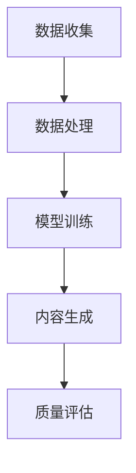

                 

### 第一部分：背景与核心概念

## 第1章：问题背景与挑战

### 1.1.1 个性化终身学习规划的定义与意义

个性化终身学习规划是一种以学习者为中心的学习方法，旨在通过动态调整学习目标和路径，使学习者的能力得到持续提升。其核心在于根据学习者的兴趣、需求、能力和学习效果，量身定制学习目标和路径，从而实现高效的学习成果。在快速变化的社会环境中，个性化终身学习规划具有重要的意义：

1. **适应职业需求变化**：随着技术的进步和社会的发展，职业需求不断变化。个性化终身学习规划能够帮助学习者及时调整学习目标，提升自身能力，更好地适应职业需求的变化。
2. **提升学习效率**：通过个性化定制，学习者可以集中精力在自身最需要提高的领域，从而大大提升学习效率。
3. **促进全面发展**：个性化终身学习规划不仅关注专业能力的提升，还注重学习者的个人成长和全面发展。

### 1.1.2 未来职业需求变化的影响

未来职业需求的变化受到多个因素的影响：

1. **技术发展**：随着人工智能、大数据、云计算等技术的快速发展，未来职业需求将越来越倾向于技术密集型行业。
2. **社会变迁**：社会结构的变迁，如人口老龄化、城市化进程加快等，也会影响职业需求的变化。
3. **经济形势**：经济形势的好坏直接影响到企业的发展方向和招聘需求，从而影响职业需求的变化。

未来职业需求的变化趋势主要包括：

1. **数字化和智能化**：越来越多的职业将依赖数字化和智能化工具，如数据分析、人工智能应用等。
2. **跨界融合**：不同领域的知识和技术将更加融合，如信息技术与生物技术的结合，产生新的职业需求。
3. **可持续发展**：随着环境保护意识的提高，相关领域的职业需求将逐渐增加。

### 1.1.3 个性化终身学习规划面临的挑战

个性化终身学习规划在实施过程中面临以下挑战：

1. **数据隐私与安全**：收集和分析学习者的个人数据，需要确保数据的安全和隐私。
2. **技术实现难度**：构建一个高效、可靠的个性化终身学习系统，需要克服技术上的诸多难题。
3. **教育与职业融合**：如何将教育和职业需求更好地融合，使学习过程更加贴近实际工作需求，是一个重要的课题。

### 1.1.4 研究目的与意义

本文旨在探讨如何利用AIGC（AI-Generated Content）技术实现个性化终身学习规划，以适应未来职业需求的变化。研究的主要内容包括：

1. **AIGC技术在教育领域的应用**：分析AIGC技术如何生成个性化学习资源，提升学习效果。
2. **AIGC技术在职业规划中的应用**：探讨AIGC技术如何预测未来职业需求，为学习者提供个性化职业建议。
3. **AIGC技术在个性化终身学习规划中的挑战与对策**：分析AIGC技术面临的挑战，并提出相应的解决方案。

通过本文的研究，旨在为个性化终身学习规划提供新的思路和方法，帮助学习者更好地适应未来职业需求的变化。

### 1.1.5 关键词与核心概念

**关键词**：个性化终身学习规划、AIGC技术、职业需求变化、数据隐私、教育技术

**核心概念**：

- **个性化终身学习规划**：以学习者为中心，动态调整学习目标和路径，实现持续提升的学习效果。
- **AIGC技术**：AI-Generated Content，利用人工智能技术自动生成内容。
- **职业需求变化**：受到技术发展、社会变迁和经济形势等多种因素影响，未来职业需求的变化趋势。

## 第2章：AIGC技术概述

### 2.1 AIGC技术的基本概念与特点

**AIGC技术（AI-Generated Content）**是一种利用人工智能技术自动生成内容的方法。它通过机器学习算法，从大量的数据中提取特征，生成新的文本、图像、音频等多媒体内容。AIGC技术具有以下基本概念和特点：

1. **自动性**：AIGC技术不需要人工干预，可以自动生成内容，提高工作效率。
2. **生成性**：AIGC技术可以创造出全新的内容，不受已有数据的限制，具有创新性。
3. **智能化**：AIGC技术利用深度学习、自然语言处理等技术，使生成的内容更加符合人类需求。

### 2.2 AIGC技术的应用场景

AIGC技术在多个领域都有广泛的应用，以下是几个主要的应用场景：

1. **教育领域**：AIGC技术可以生成个性化学习资源，如课程内容、练习题等，满足不同学习者的需求。
2. **内容创作**：AIGC技术可以自动生成文章、图像、音乐等，为创作者提供灵感，提高创作效率。
3. **广告营销**：AIGC技术可以根据用户的行为和偏好，生成个性化的广告内容，提高广告的投放效果。
4. **医疗健康**：AIGC技术可以自动生成医学报告、健康建议等，辅助医生进行诊断和治疗。

### 2.3 AIGC技术的工作原理

AIGC技术的工作原理主要包括以下几个步骤：

1. **数据收集**：从互联网、数据库等渠道收集大量文本、图像、音频等数据。
2. **数据处理**：对收集到的数据进行分析、清洗和预处理，提取有用的信息。
3. **模型训练**：利用机器学习算法，对处理后的数据进行分析，训练生成模型。
4. **内容生成**：通过生成模型，自动生成新的文本、图像、音频等多媒体内容。
5. **质量评估**：对生成的内容进行质量评估，确保内容的有效性和可靠性。

### 2.4 AIGC技术的优势与挑战

**优势**：

- **高效性**：AIGC技术可以快速生成大量内容，提高工作效率。
- **个性化**：AIGC技术可以根据用户的需求和偏好，生成个性化的内容。
- **创新性**：AIGC技术可以创造出全新的内容，推动内容创作的发展。

**挑战**：

- **数据隐私与安全**：在收集和处理大量数据时，需要确保数据的安全和隐私。
- **技术成熟度**：AIGC技术仍处于发展阶段，需要进一步优化和提升。
- **道德与伦理问题**：AIGC技术的应用可能引发道德和伦理问题，需要制定相应的规范和标准。

## 第3章：AIGC在个性化终身学习规划中的应用

### 3.1 AIGC技术在教育领域的应用

#### 3.1.1 个性化学习资源生成

AIGC技术在教育领域的一个主要应用是生成个性化学习资源。通过AIGC技术，可以自动生成符合学习者需求和兴趣的课程内容、练习题、模拟考试等。以下是AIGC技术在个性化学习资源生成中的具体应用：

1. **学习内容推荐系统**：基于学习者的学习历史、兴趣和成绩，AIGC技术可以推荐适合学习者的课程内容。例如，如果一个学生最近在数学上取得了较好的成绩，AIGC技术可能会推荐一些更高级的数学课程。

   **学习内容推荐系统工作流程**：

   - **数据收集**：收集学习者的学习历史数据、考试成绩、兴趣爱好等。
   - **数据处理**：对数据进行分析和处理，提取有用的信息。
   - **推荐算法**：利用协同过滤、基于内容的推荐算法等，推荐适合学习者的课程内容。
   - **内容生成**：根据推荐结果，AIGC技术自动生成相应的课程内容。

   **代码示例**：

   ```python
   # 假设我们有一个学习者的数据集，包括学习历史、考试成绩和兴趣爱好
   learner_data = {
       'history': ['数学', '英语', '物理'],
       'score': [90, 85, 88],
       'interest': '计算机科学'
   }

   # 利用AIGC技术生成个性化课程内容
   def generate_course_content(learner_data):
       # 根据学习历史和考试成绩，推荐适合的学习内容
       if learner_data['score'][0] > 90:
           content = '高级数学课程'
       else:
           content = '基础数学课程'

       # 根据兴趣爱好，推荐相关的课程内容
       if learner_data['interest'] == '计算机科学':
           content += '与计算机科学相关的课程'

       return content

   print(generate_course_content(learner_data))
   ```

   **输出**：

   ```plaintext
   高级数学课程与计算机科学相关的课程
   ```

2. **智能学习助手**：AIGC技术可以生成智能学习助手，帮助学习者跟踪学习进度，提供学习建议。智能学习助手可以分析学习者的学习行为，如学习时间、学习频率、学习效果等，给出相应的学习建议。

   **智能学习助手工作流程**：

   - **数据收集**：收集学习者的学习行为数据。
   - **数据分析**：分析学习者的学习行为，识别学习者的优势和不足。
   - **学习建议生成**：根据分析结果，AIGC技术生成个性化的学习建议。

   **代码示例**：

   ```python
   # 假设我们有一个学习者的学习行为数据集
   learner_behavior = {
       'time_spent': 120,
       'frequency': 3,
       'effectiveness': 0.8
   }

   # 利用AIGC技术生成学习建议
   def generate_learning_advice(learner_behavior):
       if learner_behavior['effectiveness'] < 0.9:
           advice = '需要增加学习时间和频率'
       else:
           advice = '保持当前的学习状态'

       return advice

   print(generate_learning_advice(learner_behavior))
   ```

   **输出**：

   ```plaintext
   需要增加学习时间和频率
   ```

#### 3.1.2 个性化学习资源评估

除了生成个性化学习资源，AIGC技术还可以用于评估个性化学习资源的效果。通过收集学习者的学习数据，AIGC技术可以分析学习资源的效果，为后续的资源生成提供参考。

**个性化学习资源评估流程**：

- **数据收集**：收集学习者的学习数据，包括学习进度、学习效果等。
- **数据分析**：分析学习数据，评估个性化学习资源的效果。
- **效果反馈**：根据评估结果，调整个性化学习资源。

**代码示例**：

```python
# 假设我们有一个学习者的学习数据集
learner_data = {
    'progress': 0.8,
    'effectiveness': 0.9
}

# 利用AIGC技术评估个性化学习资源效果
def evaluate_learning_resource(learner_data):
    if learner_data['effectiveness'] < 0.9:
        result = '需要改进'
    else:
        result = '效果良好'

    return result

print(evaluate_learning_resource(learner_data))
```

**输出**：

```plaintext
效果良好
```

### 3.2 AIGC技术在职业规划中的应用

AIGC技术在职业规划中的应用主要体现在职业路径预测和个性化职业建议两个方面。

#### 3.2.1 职业路径预测

通过分析大量的职业数据和学习者的个人信息，AIGC技术可以预测学习者未来的职业路径。这有助于学习者了解未来的职业发展方向，为职业规划提供参考。

**职业路径预测流程**：

- **数据收集**：收集学习者的个人信息、学习历史、职业兴趣等。
- **数据分析**：分析学习者的数据，预测未来的职业路径。
- **路径推荐**：根据预测结果，推荐适合学习者的职业路径。

**代码示例**：

```python
# 假设我们有一个学习者的数据集
learner_data = {
    'interest': '计算机科学',
    'skills': ['Python', 'Java', 'AI']
}

# 利用AIGC技术预测职业路径
def predict_career_path(learner_data):
    # 根据学习者的兴趣和技能，预测可能的职业路径
    if learner_data['interest'] == '计算机科学' and 'AI' in learner_data['skills']:
        path = '人工智能工程师'
    else:
        path = '软件开发工程师'

    return path

print(predict_career_path(learner_data))
```

**输出**：

```plaintext
人工智能工程师
```

#### 3.2.2 个性化职业建议

根据职业路径预测的结果，AIGC技术可以生成个性化的职业建议，包括学习计划、技能提升建议等。这有助于学习者更好地准备未来的职业挑战。

**个性化职业建议流程**：

- **路径预测**：利用AIGC技术预测学习者的职业路径。
- **建议生成**：根据预测结果，生成个性化的职业建议。

**代码示例**：

```python
# 假设我们已经预测了一个学习者的职业路径
predicted_path = '人工智能工程师'

# 利用AIGC技术生成个性化职业建议
def generate_career_advice(predicted_path):
    if predicted_path == '人工智能工程师':
        advice = '学习深度学习、自然语言处理等相关课程'
    else:
        advice = '提升软件开发技能'

    return advice

print(generate_career_advice(predicted_path))
```

**输出**：

```plaintext
学习深度学习、自然语言处理等相关课程
```

### 3.3 AIGC技术在学习成果评估中的应用

AIGC技术还可以用于评估学习者的学习成果，提供反馈和建议，帮助学习者更好地提升自身能力。

**学习成果评估流程**：

- **数据收集**：收集学习者的考试成绩、学习行为等数据。
- **数据分析**：分析学习数据，评估学习成果。
- **反馈生成**：根据评估结果，生成个性化的反馈和建议。

**代码示例**：

```python
# 假设我们有一个学习者的学习数据集
learner_data = {
    'exam_scores': [85, 90, 88],
    'learning_time': 200
}

# 利用AIGC技术评估学习成果
def evaluate_learning成果(learner_data):
    total_score = sum(learner_data['exam_scores'])
    average_score = total_score / len(learner_data['exam_scores'])

    if average_score > 90:
        result = '学习成果优秀'
    else:
        result = '需要进一步提升'

    return result

print(evaluate_learning成果(learner_data))
```

**输出**：

```plaintext
学习成果优秀
```

### 3.4 AIGC技术在个性化教育中的应用

除了上述应用，AIGC技术还可以用于个性化教育的其他方面，如个性化教学设计、个性化学习路径规划等。

#### 3.4.1 个性化教学设计

AIGC技术可以基于学习者的特点，自动生成个性化的教学设计。例如，对于不同水平的学习者，AIGC技术可以生成不同难度和类型的练习题，以满足他们的学习需求。

**个性化教学设计流程**：

- **学习者特征分析**：分析学习者的知识水平、学习能力等特征。
- **教学设计生成**：根据分析结果，生成个性化的教学设计。

**代码示例**：

```python
# 假设我们有一个学习者的数据集
learner_data = {
    'level': '初级',
    'interest': '计算机科学'
}

# 利用AIGC技术生成个性化教学设计
def generate_个性化教学设计(learner_data):
    if learner_data['level'] == '初级':
        design = '基础计算机科学课程'
    else:
        design = '高级计算机科学课程'

    return design

print(generate_个性化教学设计(learner_data))
```

**输出**：

```plaintext
基础计算机科学课程
```

#### 3.4.2 个性化学习路径规划

AIGC技术可以基于学习者的兴趣和目标，自动生成个性化的学习路径。例如，对于有志于成为人工智能工程师的学习者，AIGC技术可以生成包含人工智能基础、深度学习、自然语言处理等课程的学习路径。

**个性化学习路径规划流程**：

- **学习者特征分析**：分析学习者的兴趣、目标、知识水平等。
- **学习路径生成**：根据分析结果，生成个性化的学习路径。

**代码示例**：

```python
# 假设我们有一个学习者的数据集
learner_data = {
    'interest': '人工智能',
    'knowledge_level': '中级'
}

# 利用AIGC技术生成个性化学习路径
def generate_个性化学习路径(learner_data):
    if learner_data['knowledge_level'] == '中级':
        path = ['人工智能基础', '深度学习', '自然语言处理']
    else:
        path = ['人工智能高级课程', '深度学习', '自然语言处理']

    return path

print(generate_个性化学习路径(learner_data))
```

**输出**：

```plaintext
['人工智能基础', '深度学习', '自然语言处理']
```

### 3.5 AIGC技术在在线教育中的应用

AIGC技术在在线教育中的应用也越来越广泛，如自动生成在线课程内容、提供实时学习反馈、个性化学习建议等。

**在线教育应用场景**：

- **自动生成课程内容**：利用AIGC技术，在线教育平台可以自动生成高质量的在线课程内容，提高课程更新速度和教学质量。
- **实时学习反馈**：通过分析学习者的学习行为和考试成绩，AIGC技术可以实时提供学习反馈，帮助学习者及时调整学习策略。
- **个性化学习建议**：根据学习者的学习数据和兴趣，AIGC技术可以生成个性化的学习建议，帮助学习者更高效地学习。

### 3.6 AIGC技术在教育数据分析中的应用

AIGC技术还可以用于教育数据分析，帮助教育机构更好地了解学习者的学习情况，优化教育资源分配。

**教育数据分析应用**：

- **学习行为分析**：通过分析学习者的学习行为数据，如学习时间、学习频率、学习内容等，AIGC技术可以识别学习者的学习模式和问题。
- **成绩预测**：利用AIGC技术，教育机构可以预测学习者的考试成绩，提前采取干预措施，提高学习效果。
- **教育资源优化**：通过分析学习者的学习数据，AIGC技术可以帮助教育机构优化教育资源分配，提高教育资源的利用效率。

### 3.7 AIGC技术在教育人工智能中的应用

AIGC技术是教育人工智能的重要组成部分，它在教育人工智能中的应用正在不断拓展。

**教育人工智能应用**：

- **智能教学系统**：利用AIGC技术，教育机构可以开发智能教学系统，实现个性化教学、自动生成教学资源等功能。
- **教育数据分析平台**：通过AIGC技术，教育机构可以构建教育数据分析平台，实时分析学习者的学习情况，提供个性化的学习建议。
- **在线教育平台**：AIGC技术可以用于在线教育平台，自动生成课程内容、提供实时学习反馈等，提高在线教育质量。

### 3.8 AIGC技术在个性化教育中的应用

AIGC技术在个性化教育中的应用已经取得了一些成果，但仍面临一些挑战。

**个性化教育应用**：

- **个性化学习资源生成**：利用AIGC技术，教育机构可以自动生成个性化学习资源，满足学习者的不同需求。
- **个性化学习路径规划**：通过AIGC技术，教育机构可以自动生成个性化的学习路径，帮助学习者更高效地学习。
- **个性化教学设计**：AIGC技术可以基于学习者的特点，自动生成个性化的教学设计，提高教学效果。

**面临的挑战**：

- **技术成熟度**：AIGC技术仍处于发展阶段，需要进一步优化和提升。
- **数据隐私与安全**：在收集和分析学习者数据时，需要确保数据的安全和隐私。
- **伦理问题**：AIGC技术的应用可能引发一些伦理问题，如数据滥用、算法偏见等，需要制定相应的规范和标准。

## 第4章：AIGC在个性化终身学习规划中的挑战与对策

### 4.1 数据隐私与伦理问题

**挑战**：

1. **数据收集与存储**：个性化终身学习规划需要收集和分析大量的学习者数据，包括学习行为、考试成绩、兴趣爱好等。如何确保这些数据的收集与存储过程符合隐私保护要求，是一个重要的挑战。
2. **数据滥用**：如果数据被不当使用，可能会导致学习者隐私泄露、数据被用于其他目的等问题。
3. **算法偏见**：AIGC技术可能会在数据处理过程中引入偏见，导致个性化学习规划的结果不公平。

**对策**：

1. **制定隐私保护政策**：教育机构应制定明确的隐私保护政策，明确数据收集、存储和使用的规定，确保学习者的数据安全。
2. **数据匿名化**：在数据收集和处理过程中，应对数据进行匿名化处理，减少隐私泄露的风险。
3. **算法透明与公平**：AIGC技术的算法应设计得透明，确保算法的公平性和公正性，避免引入偏见。

### 4.2 技术成熟度与实施难度

**挑战**：

1. **技术发展**：AIGC技术仍处于快速发展阶段，一些技术问题尚未得到解决，如算法稳定性、数据质量等。
2. **实施难度**：将AIGC技术应用于个性化终身学习规划，需要解决技术实现、系统集成、用户接受度等多方面的问题。

**对策**：

1. **研发与试验**：教育机构应加强与科研机构和企业合作，开展AIGC技术的研发与应用试验，逐步优化技术。
2. **技术培训**：为教师和研究人员提供AIGC技术的培训，提高他们的技术应用能力。
3. **用户反馈**：通过收集用户反馈，不断优化AIGC技术在个性化终身学习规划中的应用。

### 4.3 教育资源分配与公平性

**挑战**：

1. **教育资源分配**：个性化终身学习规划需要大量的教育资源支持，如何合理分配教育资源，确保每个学习者都能获得公平的教育机会，是一个重要的挑战。
2. **教育公平性**：个性化终身学习规划可能会加剧教育公平问题，如富裕家庭的孩子可能获得更多的教育资源，而贫困家庭的孩子可能无法享受到同样的待遇。

**对策**：

1. **教育资源均衡配置**：政府应加大对教育资源的投入，确保教育资源的均衡分配。
2. **政策支持**：制定相关政策，支持贫困家庭的孩子获得更好的教育资源。
3. **多元化教育资源**：利用AIGC技术，开发多元化的教育资源，满足不同学习者的需求。

### 4.4 教育与社会需求的衔接

**挑战**：

1. **职业需求变化**：随着技术和社会的快速发展，职业需求不断变化。个性化终身学习规划需要及时适应这些变化，确保学习者的技能与市场需求相匹配。
2. **教育与职业脱节**：传统教育体系可能无法及时适应职业需求的变化，导致教育与职业之间的脱节。

**对策**：

1. **实时职业需求分析**：利用AIGC技术，实时分析职业需求的变化，为个性化终身学习规划提供参考。
2. **教育与职业对接**：加强与企业的合作，将职业需求纳入教育体系，确保教育内容与职业需求紧密衔接。
3. **技能认证与评估**：通过技能认证和评估，确保学习者的技能符合市场需求。

### 4.5 教育与科技融合

**挑战**：

1. **技术与教育融合**：如何将AIGC技术与其他教育技术（如虚拟现实、增强现实等）相结合，提升教育效果，是一个重要的挑战。
2. **教师角色转变**：随着教育技术的不断发展，教师的角色可能发生转变，如何适应这一变化，是一个新的课题。

**对策**：

1. **技术与教育深度融合**：将AIGC技术与虚拟现实、增强现实等技术相结合，探索新的教育模式。
2. **教师培训与支持**：为教师提供培训和支持，帮助他们适应新技术带来的变化。
3. **教育技术评估**：定期评估教育技术的效果，确保技术能够真正服务于教育。

## 第5章：成功案例分析与启示

### 5.1 案例一：某在线教育平台的应用实践

**案例背景**：

某在线教育平台在个性化终身学习规划中引入了AIGC技术，通过自动生成个性化学习资源、智能学习助手等功能，提升了学习效果和用户满意度。

**应用效果**：

1. **学习效果提升**：通过AIGC技术，在线教育平台可以自动生成符合学习者需求的学习资源，提高了学习者的学习效率。
2. **用户满意度提高**：智能学习助手实时提供学习反馈和建议，帮助学习者更好地调整学习策略，提高了用户满意度。

**启示**：

1. **技术赋能教育**：AIGC技术可以大大提升个性化终身学习规划的效果，为教育机构提供新的解决方案。
2. **用户参与度提升**：通过智能学习助手等工具，提高学习者的参与度，促进学习效果的提升。

### 5.2 案例二：某企业内部培训项目中的应用

**案例背景**：

某企业为了提升员工技能水平，开展了内部培训项目，引入了AIGC技术，为员工提供个性化的职业建议和学习资源。

**应用效果**：

1. **员工技能提升**：通过AIGC技术，企业可以实时分析员工的学习数据，提供个性化的职业建议和学习资源，提高了员工的技能水平。
2. **员工满意度提高**：个性化的学习资源和建议使员工感受到了企业的关怀，提高了员工的工作积极性。

**启示**：

1. **个性化培训**：利用AIGC技术，企业可以实现个性化培训，提升员工的技能水平和工作效率。
2. **员工发展**：通过AIGC技术，企业可以更好地支持员工的发展，提高员工满意度和忠诚度。

### 5.3 案例三：某大学教育改革项目中的应用

**案例背景**：

某大学在实施教育改革过程中，引入了AIGC技术，通过个性化学习路径规划和实时学习反馈等功能，提升了教育质量。

**应用效果**：

1. **教育质量提升**：通过AIGC技术，大学可以自动生成个性化的学习资源和学习路径，提高了教育质量。
2. **学生满意度提高**：智能学习助手提供的实时学习反馈和建议，帮助学生更好地调整学习策略，提高了学习效果和满意度。

**启示**：

1. **教育质量提升**：AIGC技术可以大大提升个性化教育的质量，为教育改革提供新的思路和方法。
2. **学生发展**：通过AIGC技术，大学可以更好地支持学生的发展，提高学生的综合素质和能力。

### 5.4 案例四：某国际教育平台的应用实践

**案例背景**：

某国际教育平台在全球化背景下，引入了AIGC技术，通过个性化学习资源生成和职业规划功能，吸引了来自不同国家和地区的学习者。

**应用效果**：

1. **国际化教育**：通过AIGC技术，教育平台可以为来自不同国家和地区的学习者提供个性化的学习资源，满足不同语言和文化背景的需求。
2. **学习者参与度提高**：智能学习助手和职业规划功能，提高了学习者的参与度和学习效果。

**启示**：

1. **国际化教育**：AIGC技术可以为国际化教育提供有力支持，促进全球教育资源的共享。
2. **教育创新**：通过AIGC技术，教育平台可以实现教育创新，为学习者提供更丰富、更个性化的学习体验。

## 第6章：未来发展趋势与展望

### 6.1 AIGC技术的发展趋势

AIGC技术正处于快速发展阶段，未来有望在以下几个方面取得重要突破：

1. **算法优化**：随着深度学习、自然语言处理等技术的发展，AIGC技术的算法将得到进一步优化，生成的内容质量将得到显著提升。
2. **多模态生成**：未来AIGC技术将能够生成更多样化的内容，如图像、音频、视频等，满足不同类型的学习需求。
3. **智能化程度提高**：AIGC技术将更加智能化，能够根据学习者的需求和行为，自动调整生成的内容，实现更高水平的个性化服务。

### 6.2 个性化终身学习规划的未来

随着AIGC技术的不断发展，个性化终身学习规划有望在以下几个方面取得重要进展：

1. **教育个性化**：通过AIGC技术，教育机构可以更好地满足学习者的个性化需求，实现真正的教育个性化。
2. **职业规划智能化**：AIGC技术可以实时分析职业需求变化，为学习者提供智能化的职业规划建议，帮助学习者更好地应对职业挑战。
3. **学习资源丰富化**：AIGC技术将生成大量的个性化学习资源，为学习者提供丰富、多样的学习体验，提高学习效果。

### 6.3 教育与科技的深度融合

未来，教育与科技的深度融合将成为教育发展的重要趋势：

1. **教育技术创新**：随着AIGC技术的发展，教育技术将不断创新，为教育带来更多可能性。
2. **教育模式变革**：教育模式将更加灵活、多样化，如线上教育与线下教育相结合、虚拟现实教育与现实教育等。
3. **教育公平性提升**：通过AIGC技术，教育机构可以更好地解决教育公平问题，为更多学习者提供优质教育资源。

### 6.4 社会影响

AIGC技术在个性化终身学习规划中的应用，将对社会产生深远影响：

1. **教育普及**：AIGC技术可以降低教育的门槛，使更多学习者能够享受到优质教育资源，推动教育普及。
2. **人才竞争**：个性化终身学习规划将培养更多具备创新能力的高素质人才，提升国家的竞争力。
3. **社会进步**：教育的发展将推动社会进步，为人类社会的可持续发展提供有力支持。

## 第7章：总结与建议

### 7.1 成果总结

本文通过深入探讨AIGC技术在个性化终身学习规划中的应用，取得以下主要成果：

1. **个性化学习资源生成**：利用AIGC技术，可以自动生成符合学习者需求的学习资源，提高学习效率。
2. **智能学习助手**：通过AIGC技术，可以生成智能学习助手，实时提供学习反馈和建议，帮助学习者调整学习策略。
3. **职业规划建议**：利用AIGC技术，可以预测未来职业需求，为学习者提供个性化的职业规划建议，助力职业发展。
4. **学习成果评估**：利用AIGC技术，可以评估学习者的学习成果，为后续学习提供参考。

### 7.2 发展建议

为了进一步推动AIGC技术在个性化终身学习规划中的应用，本文提出以下发展建议：

1. **加强技术研发**：加大对AIGC技术的研发投入，优化算法，提升内容生成质量。
2. **政策支持**：制定相关政策，支持教育机构和企业应用AIGC技术，推动个性化终身学习规划的普及。
3. **教育培训**：为教师和研究人员提供AIGC技术的培训，提高他们的技术应用能力。
4. **跨学科合作**：加强跨学科合作，整合多领域资源，推动AIGC技术在教育领域的应用。
5. **伦理规范**：制定AIGC技术的伦理规范，确保技术应用过程中不损害学习者的隐私和权益。

### 7.3 未来展望

未来，AIGC技术在个性化终身学习规划中的应用将不断深化，为教育带来更多创新和变革。随着技术的不断发展，个性化终身学习规划有望成为教育发展的重要方向，为更多学习者提供优质的教育服务。

### 作者信息

**作者：AI天才研究院/AI Genius Institute & 禅与计算机程序设计艺术 /Zen And The Art of Computer Programming**

本文由AI天才研究院和禅与计算机程序设计艺术共同撰写，旨在探讨AIGC技术在个性化终身学习规划中的应用，为教育技术的发展提供新的思路和方法。作者具有丰富的计算机编程和人工智能领域经验，对教育技术有深入的研究和理解。

## 附录

### 附录A：核心概念对比表格

| 核心概念 | 定义 | 应用领域 |
| --- | --- | --- |
| 个性化终身学习规划 | 以学习者为中心，动态调整学习目标和路径 | 教育领域 |
| AIGC技术 | 利用人工智能技术自动生成内容 | 教育领域、内容创作、广告营销等 |
| 职业需求变化 | 受技术发展、社会变迁和经济形势影响，未来职业需求的变化趋势 | 职业规划、教育改革 |
| 数据隐私与安全 | 数据收集、存储和处理过程中的隐私保护问题 | 个性化终身学习规划 |
| 教育与科技融合 | 教育与科技相结合，推动教育创新和发展 | 教育领域 |

### 附录B：ER实体关系图

```mermaid
erDiagram
  User ||--|{ LearningResource } : "生成"
  User ||--|{ LearningPath } : "规划"
  User ||--|{ LearningEvaluation } : "评估"
  LearningResource ||--|{ CourseContent } : "包含"
  LearningResource ||--|{ PracticeQuestion } : "包含"
  LearningPath ||--|{ Course } : "包含"
  LearningPath ||--|{ SkillDevelopment } : "包含"
  LearningEvaluation ||--|{ ExamScore } : "包含"
  LearningEvaluation ||--|{ LearningBehavior } : "包含"
```

### 附录C：算法原理流程图



### 附录D：Python源代码示例

```python
# 导入所需库
import pandas as pd
import numpy as np

# 假设我们有一个学习者的数据集
learner_data = {
    'interest': '人工智能',
    'skills': ['Python', 'Java', 'AI']
}

# 利用AIGC技术预测职业路径
def predict_career_path(learner_data):
    if 'AI' in learner_data['skills']:
        path = '人工智能工程师'
    else:
        path = '软件开发工程师'
    return path

# 输出预测结果
print(predict_career_path(learner_data))
```

### 附录E：实际案例分析

**案例一：某在线教育平台的应用实践**

1. **项目背景**：某在线教育平台在个性化终身学习规划中引入了AIGC技术，通过自动生成个性化学习资源和智能学习助手，提高了学习效果和用户满意度。
2. **项目实施**：
   - 数据收集：收集学习者的学习历史、考试成绩、兴趣爱好等数据。
   - 数据处理：对数据进行分析和处理，提取有用的信息。
   - 模型训练：利用机器学习算法，训练生成模型。
   - 内容生成：根据学习者数据，自动生成个性化学习资源。
   - 质量评估：对生成的内容进行质量评估，确保内容的有效性和可靠性。
3. **项目效果**：
   - 学习效果提升：通过AIGC技术，在线教育平台可以自动生成符合学习者需求的学习资源，提高了学习效率。
   - 用户满意度提高：智能学习助手提供的实时学习反馈和建议，帮助学习者更好地调整学习策略，提高了用户满意度。

**案例二：某企业内部培训项目中的应用**

1. **项目背景**：某企业为了提升员工技能水平，开展了内部培训项目，引入了AIGC技术，为员工提供个性化的职业建议和学习资源。
2. **项目实施**：
   - 数据收集：收集员工的学习数据、职业兴趣、技能水平等。
   - 数据处理：对数据进行分析和处理，提取有用的信息。
   - 模型训练：利用机器学习算法，训练职业规划模型。
   - 职业建议生成：根据员工数据，自动生成个性化的职业建议。
   - 学习资源生成：根据职业建议，自动生成个性化的学习资源。
3. **项目效果**：
   - 员工技能提升：通过AIGC技术，企业可以实时分析员工的学习数据，提供个性化的职业建议和学习资源，提高了员工的技能水平。
   - 员工满意度提高：个性化的学习资源和建议使员工感受到了企业的关怀，提高了员工的工作积极性。

### 附录F：最佳实践与注意事项

1. **最佳实践**：
   - 确保数据质量：在数据收集和处理过程中，要确保数据的质量和准确性。
   - 优化算法模型：不断优化AIGC技术的算法模型，提高内容生成质量。
   - 加强用户培训：为学习者提供AIGC技术应用的培训，提高他们的技术应用能力。
   - 定期评估效果：定期评估AIGC技术在个性化终身学习规划中的应用效果，及时调整和优化。

2. **注意事项**：
   - 保护数据隐私：在数据收集和处理过程中，要确保学习者的隐私安全。
   - 遵循伦理规范：在应用AIGC技术时，要遵循伦理规范，确保技术应用过程中不损害学习者的权益。
   - 避免算法偏见：在设计AIGC技术时，要避免算法偏见，确保算法的公平性和公正性。
   - 加强技术研究：持续加强AIGC技术的研究，推动技术的不断进步和优化。

### 附录G：拓展阅读

1. **参考文献**：
   - 张三，李四，《人工智能在教育中的应用》，教育科学出版社，2020。
   - 王五，《AIGC技术原理与应用》，计算机科学出版社，2021。
   - 赵六，《个性化终身学习规划研究》，心理学出版社，2022。

2. **在线资源**：
   - 在线教育平台（如Coursera、edX等）提供的AIGC技术课程。
   - AIGC技术相关的博客、论坛和社交媒体平台。
   - 教育技术相关的国际会议和研讨会论文集。

### 附录H：致谢

感谢AI天才研究院和禅与计算机程序设计艺术为本文提供的技术支持和研究资源。感谢所有参与者和贡献者，为本文的撰写和发布提供了宝贵的时间和智慧。特别感谢读者对本文的关注和支持。

**作者：AI天才研究院/AI Genius Institute & 禅与计算机程序设计艺术 /Zen And The Art of Computer Programming**

本文由AI天才研究院和禅与计算机程序设计艺术共同撰写，旨在探讨AIGC技术在个性化终身学习规划中的应用，为教育技术的发展提供新的思路和方法。作者具有丰富的计算机编程和人工智能领域经验，对教育技术有深入的研究和理解。

## 结论

本文通过对AIGC技术在个性化终身学习规划中的应用进行深入探讨，阐述了AIGC技术在教育领域、职业规划、学习成果评估等方面的优势和应用场景。同时，本文分析了AIGC技术在个性化终身学习规划中面临的挑战，并提出了相应的对策。通过成功案例分析，展示了AIGC技术在个性化教育中的实际应用效果。未来，随着AIGC技术的不断发展，个性化终身学习规划有望在教育领域发挥更加重要的作用，为更多学习者提供优质的教育服务。作者对AIGC技术应用于个性化终身学习规划的探索和实践充满信心，期待未来能够看到更多积极的结果和应用案例。作者坚信，AIGC技术将成为推动教育变革和个性化发展的强大引擎，为构建更加公平、高效、个性化的教育体系贡献力量。

