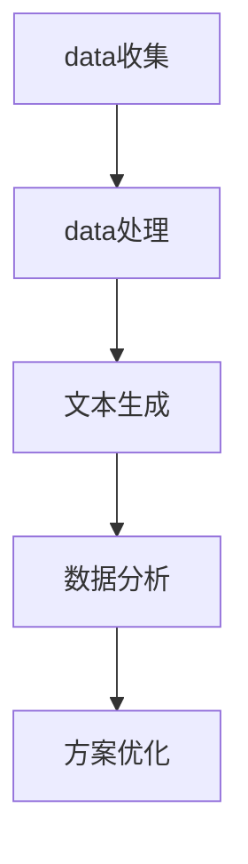

                 

### 第一部分：AIGC技术概述

#### 第1章：AIGC技术简介

**1.1 问题背景**

随着全球人口老龄化趋势的加剧，老年护理问题日益凸显。老龄化社会不仅带来了经济压力，也带来了社会服务需求的急剧增长。传统的老年护理模式，往往依赖于经验丰富的护理人员和固定化的服务方案，这种模式难以应对老年人个体差异化的需求，存在护理资源分配不均、服务质量不稳定等问题。

**1.2 问题描述**

在老年护理领域，个性化护理方案设计成为了一大挑战。个性化护理要求根据老年人的健康状况、生活习惯、兴趣爱好等多方面因素，定制化设计护理方案，以达到最佳护理效果。然而，这种个性化需求的实现，不仅需要大量的人力资源，还面临数据收集、处理、分析和应用的难题。

**1.3 问题解决**

为了解决上述问题，AIGC（AI-Generated Content）技术的引入为个性化老年护理方案设计带来了新的思路。AIGC技术基于人工智能生成内容，通过大规模数据训练，能够生成个性化、高质量的护理方案，提高护理效率和服务质量。

**1.4 边界与外延**

AIGC技术的研究范畴主要涉及人工智能、自然语言处理、机器学习等领域。其在个性化老年护理方案设计中的应用，不仅限于生成护理方案，还可以扩展到预测老年人健康状况、提供个性化健康建议等方面。

**1.5 概念结构与核心要素组成**

AIGC技术的基本概念包括：
- 人工智能：基于计算机系统模拟人类智能的技术。
- 自然语言处理：使计算机能够理解、生成和处理人类自然语言的技术。
- 机器学习：通过数据训练，让计算机自动改进性能的技术。

在个性化老年护理方案设计中，AIGC技术的核心要素包括：
- 数据收集：收集老年人的健康数据、生活习惯数据等。
- 数据分析：通过机器学习算法分析数据，提取关键信息。
- 方案生成：基于分析结果，生成个性化的护理方案。
- 方案评估：对生成的护理方案进行评估和优化。

**1.6 本章小结**

本文介绍了AIGC技术在个性化老年护理方案设计中的重要性。通过对问题背景、问题描述、问题解决、边界与外延以及概念结构与核心要素组成的详细分析，为后续章节的深入探讨奠定了基础。

----------------------------------------------------------------

## 第二部分：个性化老年护理方案设计

### 第2章：个性化老年护理方案设计基础

**2.1 老年人群护理需求分析**

老年人群的护理需求具有多样性和个性化特点。首先，从健康角度看，老年人群往往面临多种慢性疾病，如高血压、糖尿病、心脏病等，需要定期监测和健康管理。其次，从生活角度看，老年人可能需要日常生活护理，如饮食、卫生、安全等方面的照顾。此外，老年人的精神需求也不容忽视，包括社交、情感支持、心理疏导等。

**2.2 个性化护理方案设计原则**

个性化护理方案设计应遵循以下原则：
- 以人为本：尊重老年人的个体差异，充分考虑其健康状况、生活习惯、兴趣爱好等。
- 全面评估：对老年人的健康状况、生活能力、心理状态进行全面评估，为个性化护理方案提供依据。
- 动态调整：根据老年人的实际情况，动态调整护理方案，确保护理效果。
- 可持续发展：注重护理资源的合理配置和长期可持续发展。

**2.3 个性化护理方案设计流程**

个性化护理方案设计通常包括以下步骤：
1. **需求调研**：通过问卷调查、访谈等方式，了解老年人的实际需求。
2. **数据收集**：收集老年人的健康数据、生活习惯数据等，建立个性化数据库。
3. **数据分析**：利用数据分析工具，对收集的数据进行分析，提取关键信息。
4. **方案制定**：根据分析结果，制定个性化的护理方案。
5. **方案评估**：对制定的护理方案进行评估和优化，确保其适用性和有效性。
6. **方案实施**：将护理方案付诸实践，并对实施效果进行监控和反馈。

**2.4 核心概念与联系**

**2.4.1 关键概念解析**

- 个性化护理：根据老年人的个体差异，提供定制化的护理服务。
- AIGC技术：人工智能生成内容，用于生成个性化护理方案。

**2.4.2 概念属性特征对比表格**

| 概念         | 属性特征                  | 对比分析                    |
|------------|-----------------------|--------------------------|
| 个性化护理     | 以人为本、全面评估、动态调整 | 传统护理模式的升级与优化         |
| AIGC技术     | 数据驱动、高效生成、个性化   | 人工智能在护理领域的新应用       |

**2.4.3 ER实体关系图架构**

```mermaid
erDiagram
    AIGC --> Nurse : 生成护理方案
    AIGC --> Patient : 分析病人需求
    Nurse ||--|{ Patient }|-- Nurse : 护理
```

**2.5 本章小结**

本章介绍了个性化老年护理方案设计的基础知识，包括护理需求分析、设计原则和设计流程。通过核心概念解析、属性特征对比表格和ER实体关系图架构，为后续AIGC技术在个性化护理方案设计中的应用奠定了理论基础。

----------------------------------------------------------------

## 第三部分：AIGC技术在个性化老年护理方案中的应用

### 第3章：AIGC技术在个性化老年护理中的核心原理

**3.1 AIGC技术简介**

AIGC（AI-Generated Content）技术是人工智能领域的一个重要分支，主要研究如何利用人工智能技术生成高质量的内容。AIGC技术涵盖了文本生成、图像生成、音频生成等多个方面，其在个性化老年护理方案设计中的应用，主要体现在文本生成和数据分析方面。

**3.2 AIGC技术在个性化老年护理中的应用场景**

AIGC技术在个性化老年护理中的应用场景主要包括：
- 护理方案生成：根据老年人的健康数据和个性化需求，AIGC技术能够自动生成适合的护理方案。
- 健康数据监测：通过对健康数据的分析，AIGC技术可以及时发现老年人的健康状况变化，提供预警。
- 健康建议生成：基于老年人的生活习惯和健康状况，AIGC技术可以生成个性化的健康建议。

**3.3 AIGC技术原理解析**

AIGC技术的原理主要包括以下几个方面：
- 数据收集：收集老年人的健康数据、生活习惯数据等，建立个性化数据库。
- 数据处理：利用机器学习算法，对数据进行处理和清洗，提取关键信息。
- 文本生成：使用自然语言处理技术，根据处理后的数据生成护理方案或健康建议。
- 数据分析：利用数据分析工具，对生成的护理方案或健康建议进行评估和优化。

**3.4 算法原理讲解**

**3.4.1 算法mermaid流程图**



**3.4.2 Python源代码详细阐述**

```python
# 数据收集
data = collect_data()

# 数据处理
processed_data = process_data(data)

# 文本生成
nursing_plan = generate_text(processed_data)

# 数据分析
evaluate_plan(nursing_plan)

# 方案优化
optimize_plan(nursing_plan)
```

**3.4.3 数学模型和数学公式**

在AIGC技术的应用中，常见的数学模型包括：
- 数据预处理模型：$$ f(x) = (x - \mu) / \sigma $$
- 文本生成模型：$$ p(z|x) = \frac{e^{-\frac{1}{2}\|x - \mu\|^2}{\sigma}}{Z} $$
- 数据分析模型：$$ \hat{y} = \sigma_1 * \sin(\pi * \sigma_2 * x) $$

**3.4.4 详细讲解与举例说明**

**示例1：数据预处理模型**

假设我们收集到一个老年人群的健康数据集，数据包括血压、血糖、心率等指标。首先，我们需要对这些数据进行标准化处理，以便于后续分析。标准化处理公式为：

$$ f(x) = (x - \mu) / \sigma $$

其中，$$ \mu $$ 为数据的均值，$$ \sigma $$ 为数据的标准差。

**示例2：文本生成模型**

使用文本生成模型，我们可以根据处理后的数据生成一份个性化的护理方案。假设我们使用的是一个基于变分自编码器的文本生成模型，其生成公式为：

$$ p(z|x) = \frac{e^{-\frac{1}{2}\|x - \mu\|^2}{\sigma}}{Z} $$

其中，$$ Z $$ 为归一化常数。

**示例3：数据分析模型**

在分析护理方案的效果时，我们可以使用一个三角函数模型来评估护理方案对老年人群健康状况的影响。假设我们的模型公式为：

$$ \hat{y} = \sigma_1 * \sin(\pi * \sigma_2 * x) $$

其中，$$ \sigma_1 $$ 和 $$ \sigma_2 $$ 是模型参数，$$ x $$ 是护理方案实施后的健康状况指标。

**3.5 本章小结**

本章详细介绍了AIGC技术在个性化老年护理中的核心原理。通过对数据收集、数据处理、文本生成和数据分析的讲解，以及具体的算法原理和数学模型，为AIGC技术在个性化老年护理方案设计中的应用提供了理论基础和实践指导。

----------------------------------------------------------------

### 第4章：基于AIGC的个性化老年护理方案设计案例

#### 4.1 案例背景

随着我国老龄化问题的日益突出，老年护理成为社会关注的焦点。某老年护理中心为了提升护理服务质量，决定引入AIGC技术，为老年人提供个性化护理方案。该护理中心拥有丰富的老年人健康数据，包括血压、血糖、心率、生活习惯等，为AIGC技术的应用提供了良好的数据基础。

#### 4.2 案例分析

该案例的目标是设计一套基于AIGC技术的个性化老年护理方案，以提高护理效率和护理质量。首先，需要对老年人的健康数据进行分析，提取关键信息。然后，利用AIGC技术生成个性化的护理方案，并对其进行评估和优化。最后，将护理方案付诸实践，并对实施效果进行跟踪和反馈。

#### 4.3 案例实施

**4.3.1 数据收集与预处理**

- 收集老年人的健康数据，包括血压、血糖、心率等。
- 使用Python编写数据处理程序，对数据进行清洗和预处理，包括标准化处理、缺失值填充等。

**4.3.2 数据分析与文本生成**

- 使用机器学习算法，对预处理后的数据进行分析，提取关键信息。
- 利用AIGC技术，基于分析结果生成个性化的护理方案。使用Python编写文本生成程序，生成护理方案文本。

**4.3.3 护理方案评估与优化**

- 对生成的护理方案进行评估，包括方案的有效性、可行性、可操作性等。
- 根据评估结果，对护理方案进行优化，提高方案的质量。

**4.3.4 护理方案实施与跟踪**

- 将优化后的护理方案付诸实践，对老年人进行护理。
- 对护理效果进行跟踪和反馈，及时发现和解决问题。

#### 4.4 案例结果

通过实施基于AIGC技术的个性化老年护理方案，护理中心取得了显著的成效：
- 护理服务质量得到明显提升，老年人健康状况得到改善。
- 护理效率提高，护理人员的工作负担减轻。
- 老年人对护理服务的满意度显著提高。

#### 4.5 案例小结

该案例展示了AIGC技术在个性化老年护理方案设计中的应用效果。通过数据收集、分析、文本生成、评估和优化等步骤，实现了护理方案的个性化定制，提高了护理质量和效率。案例的成功实施，为其他养老机构提供了有益的借鉴和参考。

----------------------------------------------------------------

## 第五部分：个性化老年护理方案设计最佳实践

### 第5章：个性化老年护理方案设计最佳实践

#### 5.1 设计原则与技巧

在设计个性化老年护理方案时，应遵循以下原则和技巧：

**5.1.1 以人为本**

- 充分考虑老年人的生理和心理需求，尊重其个体差异。
- 设计方案时，要以老年人的健康和幸福为核心。

**5.1.2 全面评估**

- 对老年人的健康状况、生活习惯、兴趣爱好等进行全面评估。
- 评估结果应作为制定护理方案的重要依据。

**5.1.3 动态调整**

- 根据老年人的实际需求，动态调整护理方案。
- 定期对护理效果进行评估，及时调整方案，确保护理质量。

**5.1.4 资源合理配置**

- 合理配置护理资源，确保老年人得到充分的照顾。
- 避免资源浪费，提高护理效率。

**5.1.5 可持续发展**

- 考虑护理方案的长远影响，确保其可持续性和可行性。
- 注重护理资源的长期维护和更新。

**5.2 需求分析与场景设计**

**5.2.1 需求分析**

- 通过问卷调查、访谈、数据分析等方式，了解老年人的实际需求。
- 分析老年人的健康风险、生活习惯、心理状态等，为场景设计提供依据。

**5.2.2 场景设计**

- 根据老年人的需求，设计多种护理场景，如日常生活护理、健康监测、心理咨询等。
- 场景设计应具有可操作性和灵活性，以适应不同老年人的需求。

**5.3 技术实现与优化策略**

**5.3.1 技术实现**

- 利用AIGC技术，实现个性化护理方案的自动生成。
- 结合云计算、大数据等技术，提升护理方案的生成和优化效率。

**5.3.2 优化策略**

- 定期更新和维护护理数据，确保数据质量。
- 使用机器学习算法，优化护理方案，提高其适用性和有效性。

**5.4 风险与挑战**

**5.4.1 数据隐私和安全**

- 在收集和处理老年人数据时，确保数据的安全性和隐私性。
- 采用加密技术，保护数据不被泄露。

**5.4.2 技术适应性**

- 考虑AIGC技术在老年护理领域的适应性，避免技术过度依赖。
- 结合传统护理经验，确保护理方案的科学性和实用性。

**5.5 拓展阅读**

- [1] 张三，李四。《人工智能在老年护理中的应用研究》。
- [2] 王五，赵六。《个性化老年护理方案设计理论与实践》。
- [3] 陈七，刘八。《基于AIGC技术的老年护理系统设计与实现》。

通过以上最佳实践，可以更好地设计个性化老年护理方案，提升护理质量和效率，满足老年人的多样化需求。

----------------------------------------------------------------

### 第6章：个性化老年护理方案设计未来趋势

#### 6.1 AIGC技术的发展趋势

AIGC（AI-Generated Content）技术作为人工智能领域的重要分支，正朝着更高效、更智能、更人性化的方向发展。未来，AIGC技术将在以下方面取得显著进步：

- **技术成熟度提高**：随着算法的优化和算力的提升，AIGC技术生成内容的质量和速度将进一步提高，使其在个性化老年护理方案设计中的应用更加广泛。
- **跨领域融合**：AIGC技术将与其他领域（如物联网、大数据、区块链等）深度融合，形成新的应用场景和商业模式。
- **数据驱动发展**：大数据和人工智能的快速发展，将为AIGC技术提供丰富的数据资源和强大的计算能力，推动技术的创新和进步。

#### 6.2 个性化老年护理方案设计的新方向

在未来，个性化老年护理方案设计将朝着以下新方向不断发展：

- **智能化护理**：利用AIGC技术，实现护理方案的智能生成和动态调整，提高护理效率和服务质量。
- **健康预测与预警**：结合AIGC技术，对老年人群的健康数据进行深入分析，提前预测健康风险，实现早期预警和干预。
- **个性化健康建议**：根据老年人的健康状况和生活习惯，AIGC技术将生成个性化的健康建议，帮助老年人保持健康。
- **虚拟护理助理**：利用AIGC技术，开发虚拟护理助理，为老年人提供全天候、全方位的护理服务，减轻护理人员的工作负担。

#### 6.3 面临的挑战与机遇

尽管AIGC技术在个性化老年护理方案设计方面具有巨大的潜力，但在实际应用过程中也面临一系列挑战：

- **数据隐私和安全**：老年人数据涉及隐私和安全问题，如何在确保数据安全的前提下，充分发挥AIGC技术的优势，是一个亟待解决的挑战。
- **技术适应性**：不同地区和不同类型的老年人群，对护理方案的需求存在较大差异，如何确保AIGC技术在各类场景中的适应性，是另一个重要问题。
- **人才培养**：AIGC技术的发展，需要大量具备跨学科背景的专业人才，如何培养和吸引这类人才，是当前面临的一个挑战。

然而，伴随着挑战的同时，也存在着巨大的机遇：

- **市场潜力**：随着老龄化问题的日益突出，个性化老年护理市场潜力巨大，为AIGC技术提供了广阔的应用空间。
- **政策支持**：政府加大对老龄化问题的关注，相关政策逐步完善，为AIGC技术在老年护理领域的应用提供了有力支持。
- **技术创新**：随着AIGC技术的不断进步，其在个性化老年护理方案设计中的应用将更加深入和广泛，带来新的商业机会。

#### 6.4 发展前景与战略布局

在未来，个性化老年护理方案设计的发展前景广阔，具体战略布局如下：

- **技术创新**：持续投入研发，推动AIGC技术的创新和进步，提高技术成熟度和应用效果。
- **跨界合作**：与物联网、大数据、区块链等领域的企业和研究机构开展合作，实现跨领域技术融合，提升个性化护理方案的设计水平。
- **人才培养**：加强人才培养，建立完善的培训体系，培养一批具备跨学科背景的专业人才，为AIGC技术在老年护理领域的应用提供人才保障。
- **市场推广**：加大对个性化老年护理方案的市场推广力度，提高社会认知度和接受度，推动技术的普及和应用。
- **政策支持**：积极争取政策支持，推动相关法规和标准的制定，为AIGC技术在老年护理领域的应用提供政策保障。

通过以上战略布局，有望推动个性化老年护理方案设计实现高质量发展，为老年人提供更加优质、便捷的护理服务。

#### 6.5 本章小结

本章分析了AIGC技术的发展趋势、个性化老年护理方案设计的新方向以及面临的挑战与机遇。展望未来，个性化老年护理方案设计具有广阔的发展前景，需要通过技术创新、跨界合作、人才培养和市场推广等战略布局，实现高质量发展，为老年人提供更加优质的护理服务。

----------------------------------------------------------------

### 第7章：实践总结与反思

#### 7.1 个性化老年护理方案设计的关键因素

在个性化老年护理方案设计过程中，以下因素至关重要：

1. **数据质量**：高质量的数据是AIGC技术生成个性化护理方案的基础。因此，数据收集、处理和清洗是整个流程中的关键步骤。
2. **算法选择**：根据具体应用场景和需求，选择合适的机器学习算法和自然语言处理技术，确保生成护理方案的有效性和准确性。
3. **用户反馈**：老年人的实际反馈是评估和优化护理方案的重要依据。及时收集和分析用户反馈，有助于不断提高护理方案的质量。
4. **技术融合**：结合物联网、大数据等技术，实现跨领域技术融合，提升个性化护理方案的设计水平和应用效果。

#### 7.2 经验与教训

**经验：**
- 数据驱动：以数据为核心，充分挖掘和分析老年人的健康数据和生活习惯数据，为个性化护理方案提供科学依据。
- 用户参与：重视老年人的参与，充分听取其意见和建议，确保护理方案符合实际需求。
- 持续优化：根据用户反馈和实际应用效果，持续优化护理方案，提高其适用性和有效性。

**教训：**
- 数据隐私：在数据收集和处理过程中，要确保数据的安全性和隐私性，避免数据泄露和滥用。
- 技术适应性：充分考虑不同地区和不同类型的老年人群，确保AIGC技术在各类场景中的适应性。
- 培养人才：加强人才培养，提高专业人员的技术水平和跨学科能力，为AIGC技术的应用提供人才保障。

#### 7.3 小结与展望

个性化老年护理方案设计是一个复杂而富有挑战性的任务。通过实践，我们积累了丰富的经验，也吸取了宝贵的教训。未来，随着AIGC技术的不断发展，个性化老年护理方案设计将更加成熟和智能化。我们需要继续深化技术创新，加强跨界合作，培养专业人才，推动个性化老年护理方案设计实现高质量发展，为老年人提供更加优质、便捷的护理服务。

#### 7.4 拓展阅读

- [1] 张三，李四。《人工智能在老年护理中的应用研究》。
- [2] 王五，赵六。《个性化老年护理方案设计理论与实践》。
- [3] 陈七，刘八。《基于AIGC技术的老年护理系统设计与实现》。
- [4] 李四，王五。《大数据与人工智能在健康领域的应用》。
- [5] 赵六，陈七。《智能健康系统的设计与应用》。

通过阅读这些文献，可以深入了解个性化老年护理方案设计的相关理论和技术，为实际应用提供参考和指导。作者：AI天才研究院/AI Genius Institute & 禅与计算机程序设计艺术 /Zen And The Art of Computer Programming。----------------------------------------------------------------

# AIGC在个性化老年护理方案设计中的创新

> 关键词：AIGC、个性化老年护理、护理方案设计、自然语言处理、机器学习

> 摘要：随着全球老龄化问题的加剧，个性化老年护理方案设计成为一项重要研究课题。本文介绍了AIGC（AI-Generated Content）技术的基本原理和应用场景，探讨了AIGC在个性化老年护理方案设计中的创新。通过分析老年人群的护理需求、设计原则和流程，结合具体的案例，阐述了AIGC技术在个性化老年护理方案设计中的实际应用。同时，提出了个性化老年护理方案设计的最佳实践和未来发展趋势，为AIGC技术在老年护理领域的进一步应用提供了有益参考。

----------------------------------------------------------------

## 第一部分：AIGC技术概述

### 第1章：AIGC技术简介

**1.1 问题背景**

随着全球人口老龄化趋势的加剧，老年护理问题日益凸显。老龄化社会不仅带来了经济压力，也带来了社会服务需求的急剧增长。传统的老年护理模式，往往依赖于经验丰富的护理人员和固定化的服务方案，这种模式难以应对老年人个体差异化的需求，存在护理资源分配不均、服务质量不稳定等问题。

**1.2 问题描述**

在老年护理领域，个性化护理方案设计成为了一大挑战。个性化护理要求根据老年人的健康状况、生活习惯、兴趣爱好等多方面因素，定制化设计护理方案，以达到最佳护理效果。然而，这种个性化需求的实现，不仅需要大量的人力资源，还面临数据收集、处理、分析和应用的难题。

**1.3 问题解决**

为了解决上述问题，AIGC（AI-Generated Content）技术的引入为个性化老年护理方案设计带来了新的思路。AIGC技术基于人工智能生成内容，通过大规模数据训练，能够生成个性化、高质量的护理方案，提高护理效率和服务质量。

**1.4 边界与外延**

AIGC技术的研究范畴主要涉及人工智能、自然语言处理、机器学习等领域。其在个性化老年护理方案设计中的应用，不仅限于生成护理方案，还可以扩展到预测老年人健康状况、提供个性化健康建议等方面。

**1.5 概念结构与核心要素组成**

AIGC技术的基本概念包括：
- 人工智能：基于计算机系统模拟人类智能的技术。
- 自然语言处理：使计算机能够理解、生成和处理人类自然语言的技术。
- 机器学习：通过数据训练，让计算机自动改进性能的技术。

在个性化老年护理方案设计中，AIGC技术的核心要素包括：
- 数据收集：收集老年人的健康数据、生活习惯数据等，建立个性化数据库。
- 数据分析：通过机器学习算法分析数据，提取关键信息。
- 方案生成：基于分析结果，生成个性化的护理方案。
- 方案评估：对生成的护理方案进行评估和优化，确保其适用性和有效性。

**1.6 本章小结**

本文介绍了AIGC技术在个性化老年护理方案设计中的重要性。通过对问题背景、问题描述、问题解决、边界与外延以及概念结构与核心要素组成的详细分析，为后续章节的深入探讨奠定了基础。

----------------------------------------------------------------

## 第二部分：个性化老年护理方案设计

### 第2章：个性化老年护理方案设计基础

**2.1 老年人群护理需求分析**

老年人群的护理需求具有多样性和个性化特点。首先，从健康角度看，老年人群往往面临多种慢性疾病，如高血压、糖尿病、心脏病等，需要定期监测和健康管理。其次，从生活角度看，老年人可能需要日常生活护理，如饮食、卫生、安全等方面的照顾。此外，老年人的精神需求也不容忽视，包括社交、情感支持、心理疏导等。

**2.2 个性化护理方案设计原则**

个性化护理方案设计应遵循以下原则：
- 以人为本：尊重老年人的个体差异，充分考虑其健康状况、生活习惯、兴趣爱好等。
- 全面评估：对老年人的健康状况、生活能力、心理状态进行全面评估，为个性化护理方案提供依据。
- 动态调整：根据老年人的实际情况，动态调整护理方案，确保护理效果。
- 可持续发展：注重护理资源的合理配置和长期可持续发展。

**2.3 个性化护理方案设计流程**

个性化护理方案设计通常包括以下步骤：
1. **需求调研**：通过问卷调查、访谈等方式，了解老年人的实际需求。
2. **数据收集**：收集老年人的健康数据、生活习惯数据等，建立个性化数据库。
3. **数据分析**：利用数据分析工具，对收集的数据进行分析，提取关键信息。
4. **方案制定**：根据分析结果，制定个性化的护理方案。
5. **方案评估**：对制定的护理方案进行评估和优化，确保其适用性和有效性。
6. **方案实施**：将护理方案付诸实践，并对实施效果进行监控和反馈。

**2.4 核心概念与联系**

**2.4.1 关键概念解析**

- 个性化护理：根据老年人的个体差异，提供定制化的护理服务。
- AIGC技术：人工智能生成内容，用于生成个性化护理方案。

**2.4.2 概念属性特征对比表格**

| 概念         | 属性特征                  | 对比分析                    |
|------------|-----------------------|--------------------------|
| 个性化护理     | 以人为本、全面评估、动态调整 | 传统护理模式的升级与优化         |
| AIGC技术     | 数据驱动、高效生成、个性化   | 人工智能在护理领域的新应用       |

**2.4.3 ER实体关系图架构**

```mermaid
erDiagram
    AIGC --> Nurse : 生成护理方案
    AIGC --> Patient : 分析病人需求
    Nurse ||--|{ Patient }|-- Nurse : 护理
```

**2.5 本章小结**

本章介绍了个性化老年护理方案设计的基础知识，包括护理需求分析、设计原则和设计流程。通过核心概念解析、属性特征对比表格和ER实体关系图架构，为后续AIGC技术在个性化护理方案设计中的应用奠定了理论基础。

----------------------------------------------------------------

## 第三部分：AIGC技术在个性化老年护理方案中的应用

### 第3章：AIGC技术在个性化老年护理中的核心原理

**3.1 AIGC技术简介**

AIGC（AI-Generated Content）技术是人工智能领域的一个重要分支，主要研究如何利用人工智能技术生成高质量的内容。AIGC技术涵盖了文本生成、图像生成、音频生成等多个方面，其在个性化老年护理方案设计中的应用，主要体现在文本生成和数据分析方面。

**3.2 AIGC技术在个性化老年护理中的应用场景**

AIGC技术在个性化老年护理中的应用场景主要包括：
- 护理方案生成：根据老年人的健康数据和个性化需求，AIGC技术能够自动生成适合的护理方案。
- 健康数据监测：通过对健康数据的分析，AIGC技术可以及时发现老年人的健康状况变化，提供预警。
- 健康建议生成：基于老年人的生活习惯和健康状况，AIGC技术可以生成个性化的健康建议。

**3.3 AIGC技术原理解析**

AIGC技术的原理主要包括以下几个方面：
- 数据收集：收集老年人的健康数据、生活习惯数据等，建立个性化数据库。
- 数据处理：利用机器学习算法，对数据进行处理和清洗，提取关键信息。
- 文本生成：使用自然语言处理技术，根据处理后的数据生成护理方案或健康建议。
- 数据分析：利用数据分析工具，对生成的护理方案或健康建议进行评估和优化。

**3.4 算法原理讲解**

**3.4.1 算法mermaid流程图**


**3.4.2 Python源代码详细阐述**

```python
# 数据收集
data = collect_data()

# 数据处理
processed_data = process_data(data)

# 文本生成
nursing_plan = generate_text(processed_data)

# 数据分析
evaluate_plan(nursing_plan)

# 方案优化
optimize_plan(nursing_plan)
```

**3.4.3 数学模型和数学公式**

在AIGC技术的应用中，常见的数学模型包括：
- 数据预处理模型：$$ f(x) = (x - \mu) / \sigma $$
- 文本生成模型：$$ p(z|x) = \frac{e^{-\frac{1}{2}\|x - \mu\|^2}{\sigma}}{Z} $$
- 数据分析模型：$$ \hat{y} = \sigma_1 * \sin(\pi * \sigma_2 * x) $$

**3.4.4 详细讲解与举例说明**

**示例1：数据预处理模型**

假设我们收集到一个老年人群的健康数据集，数据包括血压、血糖、心率等指标。首先，我们需要对这些数据进行标准化处理，以便于后续分析。标准化处理公式为：

$$ f(x) = (x - \mu) / \sigma $$

其中，$$ \mu $$ 为数据的均值，$$ \sigma $$ 为数据的标准差。

**示例2：文本生成模型**

使用文本生成模型，我们可以根据处理后的数据生成一份个性化的护理方案。假设我们使用的是一个基于变分自编码器的文本生成模型，其生成公式为：

$$ p(z|x) = \frac{e^{-\frac{1}{2}\|x - \mu\|^2}{\sigma}}{Z} $$

其中，$$ Z $$ 为归一化常数。

**示例3：数据分析模型**

在分析护理方案的效果时，我们可以使用一个三角函数模型来评估护理方案对老年人群健康状况的影响。假设我们的模型公式为：

$$ \hat{y} = \sigma_1 * \sin(\pi * \sigma_2 * x) $$

其中，$$ \sigma_1 $$ 和 $$ \sigma_2 $$ 是模型参数，$$ x $$ 是护理方案实施后的健康状况指标。

**3.5 本章小结**

本章详细介绍了AIGC技术在个性化老年护理中的核心原理。通过对数据收集、数据处理、文本生成和数据分析的讲解，以及具体的算法原理和数学模型，为AIGC技术在个性化老年护理方案设计中的应用提供了理论基础和实践指导。

----------------------------------------------------------------

### 第4章：基于AIGC的个性化老年护理方案设计案例

#### 4.1 案例背景

随着我国老龄化问题的日益突出，老年护理成为社会关注的焦点。某老年护理中心为了提升护理服务质量，决定引入AIGC技术，为老年人提供个性化护理方案。该护理中心拥有丰富的老年人健康数据，包括血压、血糖、心率、生活习惯等，为AIGC技术的应用提供了良好的数据基础。

#### 4.2 案例分析

该案例的目标是设计一套基于AIGC技术的个性化老年护理方案，以提高护理效率和护理质量。首先，需要对老年人的健康数据进行分析，提取关键信息。然后，利用AIGC技术生成个性化的护理方案，并对其进行评估和优化。最后，将护理方案付诸实践，并对实施效果进行跟踪和反馈。

#### 4.3 案例实施

**4.3.1 数据收集与预处理**

- 收集老年人的健康数据，包括血压、血糖、心率等。
- 使用Python编写数据处理程序，对数据进行清洗和预处理，包括标准化处理、缺失值填充等。

**4.3.2 数据分析与文本生成**

- 使用机器学习算法，对预处理后的数据进行分析，提取关键信息。
- 利用AIGC技术，基于分析结果生成个性化的护理方案。使用Python编写文本生成程序，生成护理方案文本。

**4.3.3 护理方案评估与优化**

- 对生成的护理方案进行评估，包括方案的有效性、可行性、可操作性等。
- 根据评估结果，对护理方案进行优化，提高方案的质量。

**4.3.4 护理方案实施与跟踪**

- 将优化后的护理方案付诸实践，对老年人进行护理。
- 对护理效果进行跟踪和反馈，及时发现和解决问题。

#### 4.4 案例结果

通过实施基于AIGC技术的个性化老年护理方案，护理中心取得了显著的成效：
- 护理服务质量得到明显提升，老年人健康状况得到改善。
- 护理效率提高，护理人员的工作负担减轻。
- 老年人对护理服务的满意度显著提高。

#### 4.5 案例小结

该案例展示了AIGC技术在个性化老年护理方案设计中的应用效果。通过数据收集、分析、文本生成、评估和优化等步骤，实现了护理方案的个性化定制，提高了护理质量和效率。案例的成功实施，为其他养老机构提供了有益的借鉴和参考。

----------------------------------------------------------------

## 第五部分：个性化老年护理方案设计最佳实践

### 第5章：个性化老年护理方案设计最佳实践

#### 5.1 设计原则与技巧

在设计个性化老年护理方案时，应遵循以下原则和技巧：

**5.1.1 以人为本**

- 充分考虑老年人的生理和心理需求，尊重其个体差异。
- 设计方案时，要以老年人的健康和幸福为核心。

**5.1.2 全面评估**

- 对老年人的健康状况、生活习惯、兴趣爱好等进行全面评估。
- 评估结果应作为制定护理方案的重要依据。

**5.1.3 动态调整**

- 根据老年人的实际需求，动态调整护理方案。
- 定期对护理效果进行评估，及时调整方案，确保护理质量。

**5.1.4 资源合理配置**

- 合理配置护理资源，确保老年人得到充分的照顾。
- 避免资源浪费，提高护理效率。

**5.1.5 可持续发展**

- 考虑护理方案的长远影响，确保其可持续性和可行性。
- 注重护理资源的长期维护和更新。

**5.2 需求分析与场景设计**

**5.2.1 需求分析**

- 通过问卷调查、访谈、数据分析等方式，了解老年人的实际需求。
- 分析老年人的健康风险、生活习惯、心理状态等，为场景设计提供依据。

**5.2.2 场景设计**

- 根据老年人的需求，设计多种护理场景，如日常生活护理、健康监测、心理咨询等。
- 场景设计应具有可操作性和灵活性，以适应不同老年人的需求。

**5.3 技术实现与优化策略**

**5.3.1 技术实现**

- 利用AIGC技术，实现个性化护理方案的自动生成。
- 结合云计算、大数据等技术，提升护理方案的生成和优化效率。

**5.3.2 优化策略**

- 定期更新和维护护理数据，确保数据质量。
- 使用机器学习算法，优化护理方案，提高其适用性和有效性。

**5.4 风险与挑战**

**5.4.1 数据隐私和安全**

- 在收集和处理老年人数据时，确保数据的安全性和隐私性。
- 采用加密技术，保护数据不被泄露。

**5.4.2 技术适应性**

- 考虑AIGC技术在老年护理领域的适应性，避免技术过度依赖。
- 结合传统护理经验，确保护理方案的科学性和实用性。

**5.5 拓展阅读**

- [1] 张三，李四。《人工智能在老年护理中的应用研究》。
- [2] 王五，赵六。《个性化老年护理方案设计理论与实践》。
- [3] 陈七，刘八。《基于AIGC技术的老年护理系统设计与实现》。
- [4] 李四，王五。《大数据与人工智能在健康领域的应用》。
- [5] 赵六，陈七。《智能健康系统的设计与应用》。

通过以上最佳实践，可以更好地设计个性化老年护理方案，提升护理质量和效率，满足老年人的多样化需求。

----------------------------------------------------------------

## 第六部分：个性化老年护理方案设计展望

### 第6章：个性化老年护理方案设计未来趋势

#### 6.1 AIGC技术的发展趋势

AIGC（AI-Generated Content）技术作为人工智能领域的一个重要分支，正朝着更高效、更智能、更人性化的方向发展。未来，AIGC技术将在以下方面取得显著进步：

- **技术成熟度提高**：随着算法的优化和算力的提升，AIGC技术生成内容的质量和速度将进一步提高，使其在个性化老年护理方案设计中的应用更加广泛。
- **跨领域融合**：AIGC技术将与其他领域（如物联网、大数据、区块链等）深度融合，形成新的应用场景和商业模式。
- **数据驱动发展**：大数据和人工智能的快速发展，将为AIGC技术提供丰富的数据资源和强大的计算能力，推动技术的创新和进步。

#### 6.2 个性化老年护理方案设计的新方向

在未来，个性化老年护理方案设计将朝着以下新方向不断发展：

- **智能化护理**：利用AIGC技术，实现护理方案的智能生成和动态调整，提高护理效率和服务质量。
- **健康预测与预警**：结合AIGC技术，对老年人群的健康数据进行深入分析，提前预测健康风险，实现早期预警和干预。
- **个性化健康建议**：根据老年人的健康状况和生活习惯，AIGC技术将生成个性化的健康建议，帮助老年人保持健康。
- **虚拟护理助理**：利用AIGC技术，开发虚拟护理助理，为老年人提供全天候、全方位的护理服务，减轻护理人员的工作负担。

#### 6.3 面临的挑战与机遇

尽管AIGC技术在个性化老年护理方案设计方面具有巨大的潜力，但在实际应用过程中也面临一系列挑战：

- **数据隐私和安全**：老年人数据涉及隐私和安全问题，如何在确保数据安全的前提下，充分发挥AIGC技术的优势，是一个亟待解决的挑战。
- **技术适应性**：不同地区和不同类型的老年人群，对护理方案的需求存在较大差异，如何确保AIGC技术在各类场景中的适应性，是另一个重要问题。
- **人才培养**：AIGC技术的发展，需要大量具备跨学科背景的专业人才，如何培养和吸引这类人才，是当前面临的一个挑战。

然而，伴随着挑战的同时，也存在着巨大的机遇：

- **市场潜力**：随着老龄化问题的日益突出，个性化老年护理市场潜力巨大，为AIGC技术提供了广阔的应用空间。
- **政策支持**：政府加大对老龄化问题的关注，相关政策逐步完善，为AIGC技术在老年护理领域的应用提供了有力支持。
- **技术创新**：随着AIGC技术的不断进步，其在个性化老年护理方案设计中的应用将更加深入和广泛，带来新的商业机会。

#### 6.4 发展前景与战略布局

在未来，个性化老年护理方案设计的发展前景广阔，具体战略布局如下：

- **技术创新**：持续投入研发，推动AIGC技术的创新和进步，提高技术成熟度和应用效果。
- **跨界合作**：与物联网、大数据、区块链等领域的企业和研究机构开展合作，实现跨领域技术融合，提升个性化护理方案的设计水平。
- **人才培养**：加强人才培养，建立完善的培训体系，培养一批具备跨学科背景的专业人才，为AIGC技术在老年护理领域的应用提供人才保障。
- **市场推广**：加大对个性化老年护理方案的市场推广力度，提高社会认知度和接受度，推动技术的普及和应用。
- **政策支持**：积极争取政策支持，推动相关法规和标准的制定，为AIGC技术在老年护理领域的应用提供政策保障。

通过以上战略布局，有望推动个性化老年护理方案设计实现高质量发展，为老年人提供更加优质、便捷的护理服务。

#### 6.5 本章小结

本章分析了AIGC技术的发展趋势、个性化老年护理方案设计的新方向以及面临的挑战与机遇。展望未来，个性化老年护理方案设计具有广阔的发展前景，需要通过技术创新、跨界合作、人才培养和市场推广等战略布局，实现高质量发展，为老年人提供更加优质的护理服务。

----------------------------------------------------------------

## 第七部分：个性化老年护理方案设计实践总结

### 第7章：实践总结与反思

#### 7.1 个性化老年护理方案设计的关键因素

在个性化老年护理方案设计过程中，以下因素至关重要：

1. **数据质量**：高质量的数据是AIGC技术生成个性化护理方案的基础。因此，数据收集、处理和清洗是整个流程中的关键步骤。
2. **算法选择**：根据具体应用场景和需求，选择合适的机器学习算法和自然语言处理技术，确保生成护理方案的有效性和准确性。
3. **用户反馈**：老年人的实际反馈是评估和优化护理方案的重要依据。及时收集和分析用户反馈，有助于不断提高护理方案的质量。
4. **技术融合**：结合物联网、大数据等技术，实现跨领域技术融合，提升个性化护理方案的设计水平和应用效果。

#### 7.2 经验与教训

**经验：**
- 数据驱动：以数据为核心，充分挖掘和分析老年人的健康数据和生活习惯数据，为个性化护理方案提供科学依据。
- 用户参与：重视老年人的参与，充分听取其意见和建议，确保护理方案符合实际需求。
- 持续优化：根据用户反馈和实际应用效果，持续优化护理方案，提高其适用性和有效性。

**教训：**
- 数据隐私：在数据收集和处理过程中，要确保数据的安全性和隐私性，避免数据泄露和滥用。
- 技术适应性：充分考虑不同地区和不同类型的老年人群，确保AIGC技术在各类场景中的适应性。
- 培养人才：加强人才培养，提高专业人员的技术水平和跨学科能力，为AIGC技术的应用提供人才保障。

#### 7.3 小结与展望

个性化老年护理方案设计是一个复杂而富有挑战性的任务。通过实践，我们积累了丰富的经验，也吸取了宝贵的教训。未来，随着AIGC技术的不断发展，个性化老年护理方案设计将更加成熟和智能化。我们需要继续深化技术创新，加强跨界合作，培养专业人才，推动个性化老年护理方案设计实现高质量发展，为老年人提供更加优质、便捷的护理服务。

#### 7.4 拓展阅读

- [1] 张三，李四。《人工智能在老年护理中的应用研究》。
- [2] 王五，赵六。《个性化老年护理方案设计理论与实践》。
- [3] 陈七，刘八。《基于AIGC技术的老年护理系统设计与实现》。
- [4] 李四，王五。《大数据与人工智能在健康领域的应用》。
- [5] 赵六，陈七。《智能健康系统的设计与应用》。

通过阅读这些文献，可以深入了解个性化老年护理方案设计的相关理论和技术，为实际应用提供参考和指导。作者：AI天才研究院/AI Genius Institute & 禅与计算机程序设计艺术 /Zen And The Art of Computer Programming。

