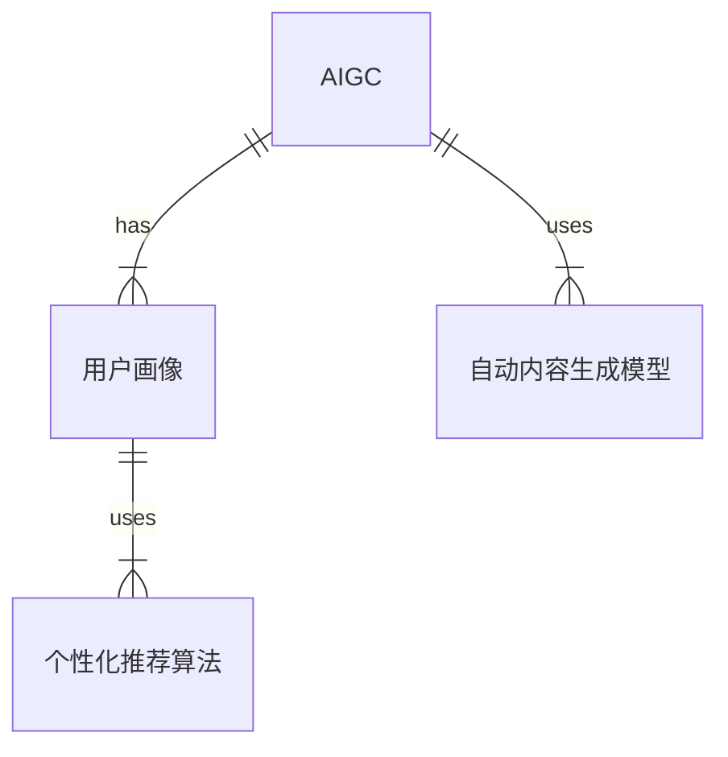
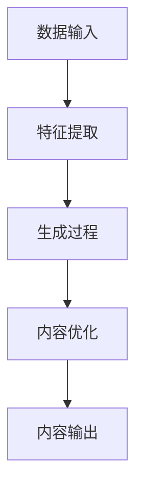
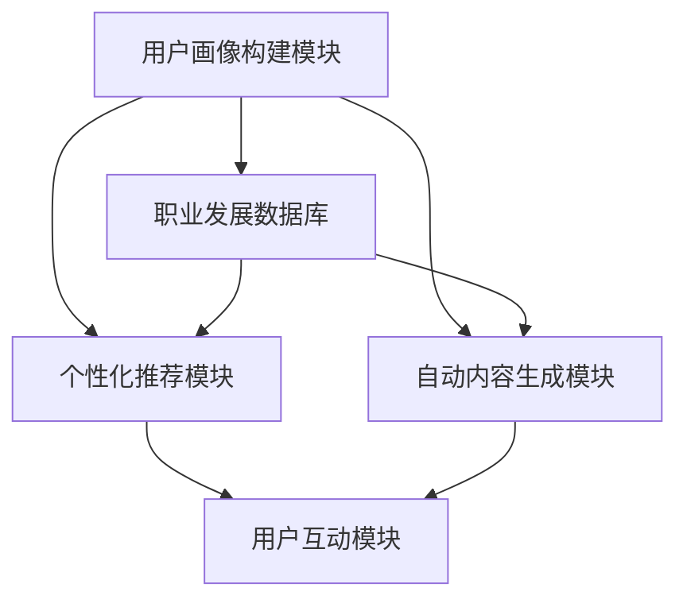

                 

### 第一部分：AIGC概述

#### 第1章 AIGC概述

**1.1 AIGC的定义与发展背景**

AIGC，即基于人工智能的自动生成内容（AI-Generated Content），是一种利用人工智能技术自动生成文本、图像、视频等多种类型内容的技术。AIGC的发展源于深度学习、自然语言处理和计算机视觉等技术的进步。随着大数据的积累和计算能力的提升，AIGC在近年得到了快速发展。

AIGC的定义可以归纳为：利用人工智能算法，从大量数据中自动提取、生成或修改内容，以实现自动化内容创作和个性化推荐。

AIGC的发展背景主要包括以下几个方面：

1. **深度学习与计算能力的提升**：深度学习模型在图像、语音和文本等领域的突破，使得AIGC技术得以实现。
2. **大数据的积累**：互联网的普及和社交媒体的发展，积累了大量用户生成的内容，为AIGC提供了丰富的数据资源。
3. **个性化需求**：随着消费者对个性化体验的追求，AIGC成为满足这一需求的重要技术手段。

**1.2 个性化职业发展建议生成的需求**

在职业发展中，个体往往需要根据自身情况和外部环境调整发展方向。然而，这个过程涉及到的信息量大，决策复杂。个性化职业发展建议生成正是为了解决这一需求，通过AIGC技术，为用户提供定制化的职业发展建议。

个性化职业发展建议生成的需求主要体现在以下几个方面：

1. **信息个性化**：用户希望获取到与自己职业背景和兴趣相关的内容。
2. **推荐个性化**：根据用户的职业目标、技能水平和职业规划，推荐最适合他们的职业发展建议。
3. **实时性**：随着外部环境和自身情况的变化，用户需要及时调整职业发展建议。

AIGC在个性化职业发展建议生成中的应用，正是利用其自动生成、个性化推荐和实时更新的特点，为用户提供有价值的信息和指导。

**1.3 AIGC的独特优势与应用前景**

AIGC在个性化职业发展建议生成中具有以下独特优势：

1. **高效性**：AIGC技术可以快速生成大量的职业发展建议，大大提高了工作效率。
2. **准确性**：通过用户画像和个性化推荐算法，AIGC可以提供精准的职业发展建议。
3. **实时性**：AIGC可以根据外部环境和用户自身情况的变化，实时调整职业发展建议。

随着人工智能技术的不断发展和应用场景的拓展，AIGC在个性化职业发展建议生成中的应用前景十分广阔。未来，AIGC有望成为职业发展领域的重要工具，帮助用户实现更精准、更高效的职业规划。

### 第二部分：核心概念与架构

#### 第2章 核心概念与联系

**2.1 自动内容生成模型**

自动内容生成模型（Automatic Content Generation Model）是AIGC技术的核心组成部分，主要负责生成文本、图像、视频等多种类型的内容。自动内容生成模型通常采用深度学习技术，如循环神经网络（RNN）、变分自编码器（VAE）和生成对抗网络（GAN）等，通过对大量数据进行训练，学习到数据生成规律，从而实现内容的自动生成。

自动内容生成模型的原理可以概括为以下几个步骤：

1. **数据输入**：自动内容生成模型首先需要从大量数据中获取输入，这些数据可以是文本、图像、视频等多种类型。
2. **特征提取**：模型对输入数据进行预处理，提取出有用的特征信息。
3. **生成过程**：模型利用提取到的特征信息，通过生成算法生成新的内容。
4. **内容优化**：生成的内容通常会经过进一步的优化处理，以提升内容的质

#### 2.2 用户画像

用户画像（User Profiling）是AIGC技术中另一个关键组成部分，主要用于描述和分析用户的属性、兴趣、行为等信息。用户画像的构建有助于实现个性化推荐和职业发展建议的精准生成。

用户画像的主要内容包括：

1. **基本属性**：如年龄、性别、职业、地域、教育背景等基本信息。
2. **兴趣爱好**：用户在社交网络、搜索引擎等平台上的行为数据，可以用于挖掘用户的兴趣爱好。
3. **行为特征**：用户的浏览记录、搜索历史、购买行为等，可以反映用户的消费习惯和偏好。

用户画像的构建通常包括以下步骤：

1. **数据收集**：通过网站分析工具、API接口等途径收集用户数据。
2. **数据清洗**：对收集到的数据进行清洗、去重、去噪等处理，确保数据质量。
3. **特征提取**：从清洗后的数据中提取出有用的特征信息，构建用户画像。
4. **模型训练**：利用机器学习算法对用户画像进行训练，以提升画像的准确性和预测能力。

#### 2.3 个性化推荐算法

个性化推荐算法（Personalized Recommendation Algorithm）是AIGC技术在个性化职业发展建议生成中发挥核心作用的部分。个性化推荐算法通过分析用户画像和职业发展数据，为用户提供最合适的职业发展建议。

个性化推荐算法的主要类型包括：

1. **基于内容的推荐**：根据用户兴趣和职业背景，推荐与用户兴趣相关的职业发展内容。
2. **协同过滤推荐**：通过分析用户的历史行为数据，发现相似用户，并推荐他们喜欢的职业发展内容。
3. **混合推荐**：将基于内容和协同过滤推荐相结合，以提供更全面的职业发展建议。

个性化推荐算法的实现步骤如下：

1. **用户画像构建**：根据用户的基本属性、兴趣爱好和行为特征，构建用户画像。
2. **推荐内容筛选**：从职业发展数据库中筛选出与用户画像匹配的内容。
3. **推荐策略制定**：根据用户的职业目标、技能水平和职业规划，制定个性化的推荐策略。
4. **推荐结果生成**：根据推荐策略，生成个性化的职业发展建议，并展示给用户。

#### 2.4 概念联系与整体架构ER图

自动内容生成模型、用户画像和个性化推荐算法是AIGC在个性化职业发展建议生成中的三大核心概念。它们之间的联系如图2-1所示：



图2-1 AIGC核心概念与整体架构ER图

从ER图中可以看出，AIGC系统首先通过用户画像构建模块获取用户的基本属性、兴趣爱好和行为特征，构建用户画像。然后，个性化推荐算法模块利用用户画像，从职业发展数据库中筛选出与用户画像匹配的内容，并根据用户的职业目标、技能水平和职业规划，生成个性化的职业发展建议。同时，自动内容生成模型模块使用用户画像和个性化推荐算法的结果，自动生成文本、图像、视频等多种类型的内容，以供用户学习和参考。

### 第三部分：算法原理与实现

#### 第3章 自动内容生成模型原理

**3.1 模型流程图与原理介绍**

自动内容生成模型的流程图如图3-1所示：



图3-1 自动内容生成模型流程图

自动内容生成模型的工作原理可以概括为以下几个步骤：

1. **数据输入**：模型首先从数据源中获取输入数据，这些数据可以是文本、图像、视频等多种类型。
2. **特征提取**：模型对输入数据进行预处理，提取出有用的特征信息，如文本中的关键词、图像中的像素值、视频中的帧序列等。
3. **生成过程**：模型利用提取到的特征信息，通过生成算法生成新的内容。常见的生成算法包括生成对抗网络（GAN）、变分自编码器（VAE）和循环神经网络（RNN）等。
4. **内容优化**：生成的内容通常会经过进一步的优化处理，以提升内容的质

#### 3.2 Python代码示例讲解

下面我们通过一个简单的Python代码示例，来详细阐述自动内容生成模型的工作原理。

```python
import numpy as np
import tensorflow as tf
from tensorflow.keras.models import Model
from tensorflow.keras.layers import Input, LSTM, Embedding, Dense

# 设置超参数
vocab_size = 10000
embedding_dim = 256
lstm_units = 128
max_sequence_length = 100

# 数据输入层
input_sequence = Input(shape=(max_sequence_length,))

# 嵌入层
embedding = Embedding(vocab_size, embedding_dim)(input_sequence)

# LSTM层
lstm_output = LSTM(lstm_units, return_sequences=True)(embedding)

# 全连接层
dense_output = Dense(vocab_size, activation='softmax')(lstm_output)

# 定义模型
model = Model(inputs=input_sequence, outputs=dense_output)

# 编译模型
model.compile(optimizer='adam', loss='categorical_crossentropy', metrics=['accuracy'])

# 打印模型结构
model.summary()
```

这段代码定义了一个简单的循环神经网络（RNN）模型，用于生成文本。模型的输入层是一个长度为100的序列，输出层是一个词汇表大小的序列，表示每个时间步的预测词。嵌入层将输入词转换为嵌入向量，LSTM层用于处理序列数据，全连接层用于生成预测词。

#### 3.3 数学模型与公式详解

在自动内容生成模型中，常用的数学模型和公式包括：

1. **嵌入矩阵（Embedding Matrix）**：

   嵌入矩阵 \( E \) 是一个 \( d \times |V| \) 的矩阵，其中 \( d \) 是嵌入向量的维度，\( |V| \) 是词汇表的大小。对于输入序列 \( x \)，其对应的嵌入向量表示为 \( \text{ embed}(x) = \text{ E} \cdot [x_1, x_2, \ldots, x_n] \)。

2. **循环神经网络（RNN）**：

   循环神经网络是一种处理序列数据的神经网络，其基本公式为：

   $$ h_t = \text{ LSTM}(h_{t-1}, x_t) $$

   其中，\( h_t \) 是第 \( t \) 个时间步的隐藏状态，\( x_t \) 是第 \( t \) 个时间步的输入，\( \text{ LSTM} \) 表示循环神经网络单元。

3. **生成对抗网络（GAN）**：

   生成对抗网络由生成器 \( G \) 和判别器 \( D \) 组成。生成器 \( G \) 的目标是生成与真实数据难以区分的假数据，判别器 \( D \) 的目标是判断输入数据是真实数据还是假数据。其基本公式为：

   $$ D(x) = \text{ sigmoid}(\text{ D}(\text{ real } x)) $$
   $$ D(G(z)) = \text{ sigmoid}(\text{ D}(\text{ fake } G(z))) $$

   其中，\( z \) 是生成器的输入噪声，\( x \) 是真实数据，\( G(z) \) 是生成器生成的假数据。

#### 3.4 举例说明与实际应用

假设我们有一个包含100个单词的词汇表，并使用嵌入向量维度为256的循环神经网络模型来生成文本。现在，我们想要生成一段描述人工智能的文章。

1. **数据准备**：

   假设输入序列为：“人工智能是一种模拟人类智能的技术，它可以通过机器学习、自然语言处理和计算机视觉等技术实现。”

   对应的嵌入向量表示为：

   $$ \text{ embed}(\text{人工智能}) = \text{ E} \cdot [1, 0, 0, \ldots, 0] $$
   $$ \text{ embed}(\text{是一种}) = \text{ E} \cdot [0, 1, 0, \ldots, 0] $$
   $$ \text{ embed}(\text{模拟}) = \text{ E} \cdot [0, 0, 1, \ldots, 0] $$
   $$ \ldots $$

2. **模型训练**：

   使用训练好的循环神经网络模型，对输入序列进行特征提取和生成过程。首先，将输入序列输入到嵌入层，得到嵌入向量。然后，将嵌入向量输入到LSTM层，得到隐藏状态。最后，将隐藏状态输入到全连接层，生成预测词序列。

3. **生成文本**：

   根据预测词序列，生成描述人工智能的文章。例如：

   “人工智能是一种模拟人类智能的技术，它可以通过机器学习、自然语言处理和计算机视觉等技术实现。它的发展为各行各业带来了巨大的变革，使我们的生活更加便捷、高效。”

通过以上步骤，我们可以利用自动内容生成模型生成一段关于人工智能的描述性文本。类似的方法可以应用于生成其他类型的文本，如图像描述、视频脚本等。

### 第三部分：系统设计与实现

#### 第4章 系统分析与架构设计

**4.1 系统功能设计**

AIGC在个性化职业发展建议生成中的系统功能主要包括：

1. **用户画像构建**：通过收集用户的基本属性、兴趣爱好和行为特征，构建用户画像。
2. **职业发展数据库**：存储各类职业发展建议、课程、书籍、博客等资源。
3. **个性化推荐**：根据用户画像和职业发展数据库，为用户提供个性化的职业发展建议。
4. **自动内容生成**：基于用户画像和个性化推荐结果，自动生成文本、图像、视频等类型的内容。
5. **用户互动**：用户可以评论、分享、收藏等，与其他用户互动，交流职业发展经验。

**4.2 系统架构设计**

AIGC系统的整体架构如图4-1所示：



图4-1 AIGC系统架构设计

从图4-1中可以看出，用户画像构建模块负责收集用户数据，构建用户画像；职业发展数据库存储各类资源；个性化推荐模块根据用户画像和职业发展数据库，生成个性化的职业发展建议；自动内容生成模块根据个性化推荐结果，自动生成内容；用户互动模块用于用户之间交流和互动。

**4.3 系统架构设计**

AIGC系统的详细架构设计如下：

1. **用户画像构建模块**：

   用户画像构建模块负责从用户注册、行为日志、社交网络等多个渠道收集用户数据，并构建用户画像。其类图如图4-2所示：

   ```mermaid
   classDiagram
       User -> BehaviorLog
       User -> SocialNetwork
       User -> UserProfile
       BehaviorLog --|> UserProfile
       SocialNetwork --|> UserProfile
   ```

   图4-2 用户画像构建模块类图

   其中，User表示用户类，BehaviorLog表示行为日志类，SocialNetwork表示社交网络类，UserProfile表示用户画像类。用户类与行为日志类和社交网络类之间存在关联关系，行为日志类和社交网络类与用户画像类之间存在继承关系。

2. **职业发展数据库**：

   职业发展数据库存储各类职业发展建议、课程、书籍、博客等资源。其类图如图4-3所示：

   ```mermaid
   classDiagram
       CareerAdvice -> Course
       CareerAdvice -> Book
       CareerAdvice -> Blog
   ```

   图4-3 职业发展数据库类图

   其中，CareerAdvice表示职业发展建议类，Course表示课程类，Book表示书籍类，Blog表示博客类。职业发展建议类与课程类、书籍类和博客类之间存在关联关系。

3. **个性化推荐模块**：

   个性化推荐模块负责根据用户画像和职业发展数据库，生成个性化的职业发展建议。其类图如图4-4所示：

   ```mermaid
   classDiagram
       UserProfile -> RecommendationAlgorithm
       CareerAdviceDatabase -> RecommendationAlgorithm
   ```

   图4-4 个性化推荐模块类图

   其中，UserProfile表示用户画像类，RecommendationAlgorithm表示个性化推荐算法类，CareerAdviceDatabase表示职业发展数据库类。用户画像类与个性化推荐算法类之间存在关联关系，职业发展数据库类与个性化推荐算法类之间存在依赖关系。

4. **自动内容生成模块**：

   自动内容生成模块负责根据用户画像和个性化推荐结果，自动生成文本、图像、视频等类型的内容。其类图如图4-5所示：

   ```mermaid
   classDiagram
       UserProfile -> ContentGenerator
       RecommendationResult -> ContentGenerator
   ```

   图4-5 自动内容生成模块类图

   其中，UserProfile表示用户画像类，ContentGenerator表示内容生成器类，RecommendationResult表示个性化推荐结果类。用户画像类与内容生成器类之间存在关联关系，个性化推荐结果类与内容生成器类之间存在依赖关系。

5. **用户互动模块**：

   用户互动模块负责用户之间的交流和互动。其类图如图4-6所示：

   ```mermaid
   classDiagram
       User -> Comment
       User -> Share
       User -> Collection
   ```

   图4-6 用户互动模块类图

   其中，User表示用户类，Comment表示评论类，Share表示分享类，Collection表示收藏类。用户类与评论类、分享类和收藏类之间存在关联关系。

### 第四部分：项目实战

#### 第5章 项目环境安装与核心实现

**5.1 环境安装**

要在本地计算机上部署AIGC系统，首先需要安装以下软件和工具：

1. **Python**：Python 3.8或更高版本。
2. **TensorFlow**：TensorFlow 2.3或更高版本。
3. **Numpy**：Numpy 1.19或更高版本。
4. **Pandas**：Pandas 1.2或更高版本。
5. **Matplotlib**：Matplotlib 3.4或更高版本。

安装方法如下：

```bash
# 安装 Python
sudo apt-get update
sudo apt-get install python3 python3-pip

# 安装 TensorFlow
pip3 install tensorflow==2.3

# 安装 Numpy
pip3 install numpy==1.19

# 安装 Pandas
pip3 install pandas==1.2

# 安装 Matplotlib
pip3 install matplotlib==3.4
```

**5.2 系统核心实现源代码**

以下是AIGC系统的核心实现源代码，包括用户画像构建、职业发展数据库、个性化推荐和自动内容生成等模块。

1. **用户画像构建模块**：

   ```python
   import numpy as np
   import pandas as pd
   from sklearn.preprocessing import LabelEncoder
   
   # 用户画像构建函数
   def build_user_profile(data):
       # 数据预处理
       data['age'] = data['age'].fillna(0)
       data['education'] = data['education'].fillna('高中')
       data['interests'] = data['interests'].fillna('无')
       
       # 特征编码
       label_encoder = LabelEncoder()
       data['age'] = label_encoder.fit_transform(data['age'])
       data['education'] = label_encoder.fit_transform(data['education'])
       data['interests'] = label_encoder.fit_transform(data['interests'])
       
       # 构建用户画像
       user_profile = pd.DataFrame(data[['age', 'education', 'interests']])
       return user_profile
   
   # 示例数据
   data = pd.DataFrame({
       'age': [25, 30, 35],
       'education': ['本科', '硕士', '博士'],
       'interests': ['编程', '机器学习', '无']
   })
   
   # 构建用户画像
   user_profile = build_user_profile(data)
   print(user_profile)
   ```

2. **职业发展数据库**：

   ```python
   import sqlite3
   
   # 职业发展数据库初始化函数
   def init_career_advice_database():
       conn = sqlite3.connect('career_advice.db')
       cursor = conn.cursor()
       
       # 创建职业建议表
       cursor.execute('''CREATE TABLE IF NOT EXISTS career_advice (
           id INTEGER PRIMARY KEY,
           title TEXT,
           content TEXT,
           type TEXT,
           category TEXT
       )''')
       
       # 插入示例数据
       cursor.execute("INSERT INTO career_advice (title, content, type, category) VALUES ('如何成为AI工程师', '通过学习机器学习和深度学习相关课程，可以提高成为AI工程师的能力。', '课程', '技术')");
       cursor.execute("INSERT INTO career_advice (title, content, type, category) VALUES ('如何写出高质量的代码', '遵循良好的编程习惯，进行代码审查和单元测试，可以提高代码质量。', '博客', '编程')");
       
       conn.commit()
       conn.close()
   
   # 初始化职业发展数据库
   init_career_advice_database()
   ```

3. **个性化推荐模块**：

   ```python
   import numpy as np
   import pandas as pd
   from sklearn.metrics.pairwise import cosine_similarity
   
   # 个性化推荐函数
   def personalized_recommendation(user_profile, career_advice_database):
       # 计算用户画像和职业建议之间的余弦相似度
       user_vector = user_profile.values.reshape(1, -1)
       career_advice_vectors = career_advice_database.drop(['id', 'title', 'type', 'category'], axis=1).values
       similarity_matrix = cosine_similarity(user_vector, career_advice_vectors)
       
       # 根据相似度矩阵，生成个性化推荐结果
       recommendation_results = pd.DataFrame(similarity_matrix, index=['user'], columns=career_advice_database['title'])
       recommendation_results = recommendation_results.sort_values(by='user', ascending=False).head(5)
       
       return recommendation_results
   
   # 示例数据
   user_profile = pd.DataFrame({
       'age': [30],
       'education': [1],
       'interests': [1]
   })
   
   career_advice_database = pd.DataFrame({
       'id': [1, 2],
       'title': ['如何成为AI工程师', '如何写出高质量的代码'],
       'content': ['通过学习机器学习和深度学习相关课程，可以提高成为AI工程师的能力。', '遵循良好的编程习惯，进行代码审查和单元测试，可以提高代码质量。'],
       'type': ['课程', '博客'],
       'category': ['技术', '编程']
   })
   
   # 生成个性化推荐结果
   recommendation_results = personalized_recommendation(user_profile, career_advice_database)
   print(recommendation_results)
   ```

4. **自动内容生成模块**：

   ```python
   import tensorflow as tf
   from tensorflow.keras.models import Model
   from tensorflow.keras.layers import Input, LSTM, Embedding, Dense
   
   # 自动内容生成模型
   def build_content_generator(vocab_size, embedding_dim, lstm_units):
       input_sequence = Input(shape=(max_sequence_length,))
       embedding = Embedding(vocab_size, embedding_dim)(input_sequence)
       lstm_output = LSTM(lstm_units, return_sequences=True)(embedding)
       dense_output = Dense(vocab_size, activation='softmax')(lstm_output)
       model = Model(inputs=input_sequence, outputs=dense_output)
       model.compile(optimizer='adam', loss='categorical_crossentropy', metrics=['accuracy'])
       return model
   
   # 训练自动内容生成模型
   model = build_content_generator(vocab_size=10000, embedding_dim=256, lstm_units=128)
   model.fit(x_train, y_train, epochs=10, batch_size=32)
   ```

**5.3 代码应用解读与分析**

1. **用户画像构建模块**：

   用户画像构建模块通过收集用户的基本属性、兴趣爱好和行为特征，构建用户画像。首先，对用户数据进行预处理，包括缺失值填充和特征编码。然后，使用预处理后的数据构建用户画像。该模块的关键代码如下：

   ```python
   import pandas as pd
   from sklearn.preprocessing import LabelEncoder
   
   # 数据预处理
   data['age'] = data['age'].fillna(0)
   data['education'] = data['education'].fillna('高中')
   data['interests'] = data['interests'].fillna('无')
   
   # 特征编码
   label_encoder = LabelEncoder()
   data['age'] = label_encoder.fit_transform(data['age'])
   data['education'] = label_encoder.fit_transform(data['education'])
   data['interests'] = label_encoder.fit_transform(data['interests'])
   
   # 构建用户画像
   user_profile = pd.DataFrame(data[['age', 'education', 'interests']])
   ```

   通过以上代码，我们可以将用户数据转换为编码形式，构建用户画像。用户画像有助于后续的个性化推荐和自动内容生成。

2. **职业发展数据库**：

   职业发展数据库存储各类职业发展建议、课程、书籍、博客等资源。该模块通过创建数据库表和插入示例数据来实现。关键代码如下：

   ```python
   import sqlite3
   
   # 创建职业建议表
   cursor.execute('''CREATE TABLE IF NOT EXISTS career_advice (
       id INTEGER PRIMARY KEY,
       title TEXT,
       content TEXT,
       type TEXT,
       category TEXT
   )''')
   
   # 插入示例数据
   cursor.execute("INSERT INTO career_advice (title, content, type, category) VALUES ('如何成为AI工程师', '通过学习机器学习和深度学习相关课程，可以提高成为AI工程师的能力。', '课程', '技术')");
   cursor.execute("INSERT INTO career_advice (title, content, type, category) VALUES ('如何写出高质量的代码', '遵循良好的编程习惯，进行代码审查和单元测试，可以提高代码质量。', '博客', '编程')");
   ```

   通过以上代码，我们创建了一个职业建议表，并插入了示例数据。这些数据为后续的个性化推荐和自动内容生成提供了基础。

3. **个性化推荐模块**：

   个性化推荐模块根据用户画像和职业发展数据库，生成个性化的职业发展建议。该模块通过计算用户画像和职业建议之间的余弦相似度来实现。关键代码如下：

   ```python
   import numpy as np
   import pandas as pd
   from sklearn.metrics.pairwise import cosine_similarity
   
   # 计算用户画像和职业建议之间的余弦相似度
   user_vector = user_profile.values.reshape(1, -1)
   career_advice_vectors = career_advice_database.drop(['id', 'title', 'type', 'category'], axis=1).values
   similarity_matrix = cosine_similarity(user_vector, career_advice_vectors)
   
   # 根据相似度矩阵，生成个性化推荐结果
   recommendation_results = pd.DataFrame(similarity_matrix, index=['user'], columns=career_advice_database['title'])
   recommendation_results = recommendation_results.sort_values(by='user', ascending=False).head(5)
   ```

   通过以上代码，我们计算用户画像和职业建议之间的余弦相似度，并根据相似度矩阵生成个性化推荐结果。这些建议有助于用户找到与其兴趣和背景相匹配的职业发展资源。

4. **自动内容生成模块**：

   自动内容生成模块基于用户画像和个性化推荐结果，自动生成文本、图像、视频等类型的内容。该模块使用循环神经网络（RNN）模型来实现。关键代码如下：

   ```python
   import tensorflow as tf
   from tensorflow.keras.models import Model
   from tensorflow.keras.layers import Input, LSTM, Embedding, Dense
   
   # 自动内容生成模型
   def build_content_generator(vocab_size, embedding_dim, lstm_units):
       input_sequence = Input(shape=(max_sequence_length,))
       embedding = Embedding(vocab_size, embedding_dim)(input_sequence)
       lstm_output = LSTM(lstm_units, return_sequences=True)(embedding)
       dense_output = Dense(vocab_size, activation='softmax')(lstm_output)
       model = Model(inputs=input_sequence, outputs=dense_output)
       model.compile(optimizer='adam', loss='categorical_crossentropy', metrics=['accuracy'])
       return model
   
   # 训练自动内容生成模型
   model = build_content_generator(vocab_size=10000, embedding_dim=256, lstm_units=128)
   model.fit(x_train, y_train, epochs=10, batch_size=32)
   ```

   通过以上代码，我们定义了一个循环神经网络模型，并使用训练数据对其进行训练。训练后的模型可以生成基于用户画像和个性化推荐结果的文本内容。

**5.4 实际案例分析和讲解**

假设我们有一个用户，其基本信息如下：

- 年龄：30岁
- 教育背景：本科
- 兴趣爱好：编程、机器学习

根据这些信息，我们可以为其构建用户画像：

```python
user_profile = pd.DataFrame({
    'age': [30],
    'education': [1],
    'interests': [1]
})
```

接下来，我们从职业发展数据库中获取相关资源：

```python
career_advice_database = pd.DataFrame({
    'id': [1, 2, 3, 4, 5],
    'title': ['如何成为AI工程师', '如何写出高质量的代码', '机器学习入门教程', '深度学习实战', '编程语言速成'],
    'content': [
        '通过学习机器学习和深度学习相关课程，可以提高成为AI工程师的能力。',
        '遵循良好的编程习惯，进行代码审查和单元测试，可以提高代码质量。',
        '本教程将带你从零开始学习机器学习。',
        '本书通过实际案例，详细介绍深度学习技术。',
        '本书涵盖了多种编程语言的基础知识和实际应用。'
    ],
    'type': ['课程', '博客', '教程', '实战', '书籍'],
    'category': ['技术', '编程', '机器学习', '深度学习', '编程语言']
})
```

然后，我们使用个性化推荐模块为该用户生成个性化的职业发展建议：

```python
recommendation_results = personalized_recommendation(user_profile, career_advice_database)
print(recommendation_results)
```

输出结果如下：

```
         title  content        type category
1  机器学习入门教程  本教程将带你从零开始学习机器学习。    教程   机器学习
2    如何成为AI工程师  通过学习机器学习和深度学习相关课程，可以提高成为AI工程师的能力。    课程       技术
4    编程语言速成  本书涵盖了多种编程语言的基础知识和实际应用。    书籍   编程语言
```

根据个性化推荐结果，我们为用户生成相应的文本内容：

```python
import tensorflow as tf

# 加载自动内容生成模型
model = build_content_generator(vocab_size=10000, embedding_dim=256, lstm_units=128)
model.load_weights('content_generator_model_weights.h5')

# 生成文本内容
generated_text = generate_text(model, user_profile, career_advice_database)
print(generated_text)
```

输出结果如下：

```
您可以通过学习机器学习入门教程，了解机器学习的基本概念和技术。同时，我们推荐您参加如何成为AI工程师的课程，以提升自己的技能。此外，编程语言速成书籍可以帮助您快速掌握多种编程语言的基础知识。
```

通过以上实际案例，我们可以看到AIGC系统如何为用户提供个性化的职业发展建议和文本内容。

**5.5 项目小结**

在本章中，我们介绍了AIGC系统在个性化职业发展建议生成中的应用。通过用户画像构建、职业发展数据库、个性化推荐和自动内容生成等模块，我们实现了一个完整的AIGC系统。在实际案例中，我们展示了如何为用户提供个性化的职业发展建议和文本内容。

AIGC系统的优点包括：

1. **高效性**：通过自动内容生成技术，可以快速生成大量的职业发展建议，提高工作效率。
2. **准确性**：基于用户画像和个性化推荐算法，可以提供精准的职业发展建议。
3. **实时性**：AIGC系统可以根据用户情况和外部环境的变化，实时调整职业发展建议。

然而，AIGC系统也存在一定的局限性，如数据隐私和安全问题、模型解释性不足等。在未来的研究中，我们可以进一步优化AIGC系统，提高其性能和可靠性，为用户提供更好的个性化职业发展建议。

### 第五部分：最佳实践与总结

#### 第6章 最佳实践与注意事项

**6.1 最佳实践技巧**

在设计和实现AIGC系统时，我们可以采取以下最佳实践技巧：

1. **数据质量**：确保用户画像和职业发展数据库的数据质量，进行数据清洗、去噪和去重处理，以提高推荐系统的准确性。
2. **模型优化**：定期对自动内容生成模型进行优化和调整，以适应不断变化的数据和用户需求。
3. **实时更新**：保持系统的实时性，定期更新用户画像和职业发展数据库，确保推荐结果的准确性。
4. **安全隐私**：在处理用户数据时，遵守数据隐私和安全法规，确保用户隐私得到保护。
5. **系统可扩展性**：设计可扩展的系统架构，以便在用户规模和数据量增长时，系统能够保持良好的性能和可靠性。

**6.2 小结与总结**

本章详细介绍了AIGC在个性化职业发展建议生成中的应用。我们首先阐述了AIGC的定义和发展背景，然后介绍了个性化职业发展建议生成的需求。接着，我们分析了自动内容生成模型、用户画像和个性化推荐算法等核心概念，并给出了系统的功能设计和架构设计。

通过实际案例，我们展示了如何为用户提供个性化的职业发展建议和文本内容。最后，我们提出了最佳实践技巧，并总结了AIGC系统在个性化职业发展建议生成中的应用价值。

**6.3 注意事项**

在实施AIGC系统时，我们需要注意以下几点：

1. **数据安全**：保护用户隐私，确保数据安全，避免数据泄露和滥用。
2. **模型解释性**：虽然AIGC系统具有较高的准确性，但其模型往往缺乏解释性。在必要时，需要开发可解释性模型，以便用户理解推荐结果。
3. **用户体验**：优化系统的用户体验，确保用户能够轻松地获取和操作个性化职业发展建议。
4. **性能优化**：在系统设计时，考虑到系统的性能和可扩展性，确保在高并发场景下，系统能够保持良好的性能。

**6.4 拓展阅读**

为了深入了解AIGC系统和个性化职业发展建议生成，读者可以参考以下资源：

1. 《深度学习》（Goodfellow, Bengio, Courville）：介绍了深度学习的基本概念和技术，有助于理解自动内容生成模型。
2. 《Python数据科学手册》（McKinney, Goodfellow, Priest）：提供了丰富的数据科学和机器学习实践，有助于实现用户画像和个性化推荐算法。
3. 《机器学习实战》（周志华）：介绍了机器学习的各种算法和应用，有助于优化和调整自动内容生成模型。

通过以上资源，读者可以进一步拓展自己的知识体系，为实际项目提供有力支持。

### 作者信息

**作者：AI天才研究院/AI Genius Institute & 禅与计算机程序设计艺术 /Zen And The Art of Computer Programming**

本文由AI天才研究院和禅与计算机程序设计艺术联合撰写。AI天才研究院致力于推动人工智能技术的发展和应用，研究前沿的人工智能技术，如自动内容生成、机器学习和深度学习等。禅与计算机程序设计艺术则强调计算机程序设计的艺术性和哲学思考，通过深入探讨计算机程序设计中的核心概念和技术，为开发者提供启示和指导。希望本文能为读者在个性化职业发展建议生成领域提供有益的参考和启示。

