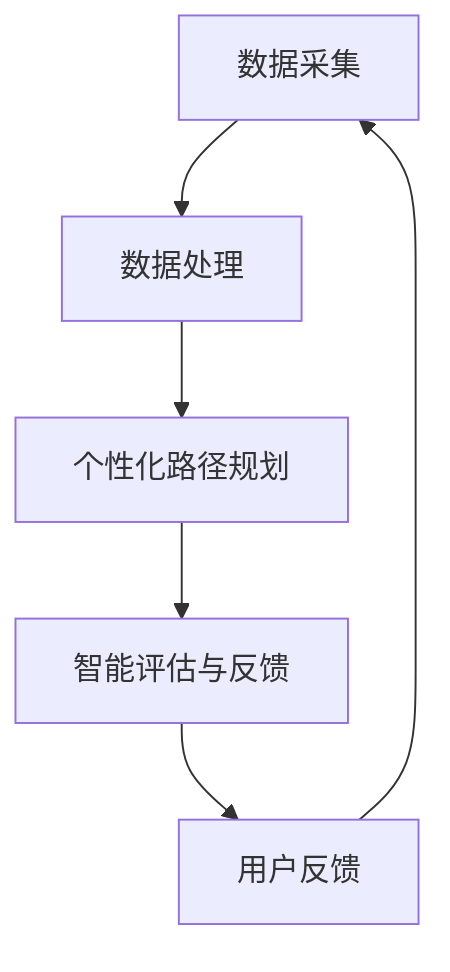

                 

# 《AIGC在个性化职业技能培训中的创新》

> 关键词：AIGC、个性化职业技能培训、数据挖掘、自然语言处理、算法、系统架构、项目实战

> 摘要：本文将深入探讨AIGC（自适应智能生成计算）技术在个性化职业技能培训中的应用。通过分析AIGC的核心概念、算法原理、数学模型和系统架构，本文旨在提供一个全面的技术视角，以展示AIGC如何革新个性化职业技能培训的方式，提高培训的效率和质量。

---

## 第一部分：背景与核心概念

### 1.1 问题背景与解决思路

#### 1.1.1 个性化职业技能培训的现状

随着社会的快速发展，职业技能培训成为提高个人竞争力的重要途径。然而，传统培训模式存在以下局限性：

- **内容同质化**：课程内容往往难以满足个性化需求。
- **学习效率低**：缺乏针对个人学习进度的个性化指导。
- **互动性不足**：学员与培训师之间的互动有限，难以及时获得反馈。

#### 1.1.2 AIGC技术的引入

AIGC技术具有以下特点：

- **自适应**：能够根据用户行为和学习习惯进行个性化调整。
- **生成性**：能够自动生成个性化内容和交互。
- **智能性**：通过数据分析和机器学习实现智能决策。

AIGC在个性化职业技能培训中的应用潜力包括：

- **个性化内容生成**：根据学员的技能水平和学习需求生成定制化培训内容。
- **智能评估与反馈**：利用智能算法进行实时评估，提供个性化反馈。
- **互动式学习**：通过虚拟助手和模拟场景提高学习互动性。

### 1.2 核心概念与联系

#### 1.2.1 个性化职业技能培训的核心要素

- **学习者分析**：通过数据挖掘了解学员的技能水平和学习偏好。
- **职业技能需求分析**：分析市场需求和职业发展趋势，确定培训内容。
- **课程内容个性化设计**：根据分析结果设计适合学员的培训课程。

#### 1.2.2 AIGC技术在培训中的应用原理

AIGC技术在培训中的应用主要涉及：

- **数据挖掘与学习**：从大量数据中提取有用信息，为个性化培训提供依据。
- **自然语言处理**：处理文本数据，生成个性化文档和交互内容。
- **人工智能算法**：实现个性化学习路径规划、智能评估和反馈。

---

## 第二部分：算法原理讲解

### 2.1 数据挖掘与学习算法

#### 2.1.1 数据挖掘基础

数据挖掘的基本流程包括：

- **数据收集**：从各种来源收集学员数据。
- **数据预处理**：清洗、整合和转换数据。
- **模式识别**：利用算法发现数据中的模式和规律。

主要方法包括：

- **关联规则挖掘**：发现数据之间的关联关系。
- **分类与回归**：预测学员的技能水平和学习需求。
- **聚类**：将相似学员分组，以便于个性化推荐。

#### 2.1.2 学习算法原理

主要学习算法包括：

- **监督学习**：通过已有数据预测新数据。
- **无监督学习**：在没有标签数据的情况下发现数据中的结构和规律。
- **强化学习**：通过试错学习实现最佳策略。

### 2.2 自然语言处理算法

#### 2.2.1 NLP基础

自然语言处理的基础包括：

- **语言模型**：预测下一个词的概率。
- **词向量表示**：将单词转换为向量表示。

#### 2.2.2 NLP应用

NLP在培训中的应用包括：

- **文本分类**：将文档分类到预定义的类别中。
- **命名实体识别**：识别文本中的特定实体。
- **问答系统**：自动回答用户提出的问题。

### 2.3 人工智能算法在培训中的应用

#### 2.3.1 个性化学习路径设计

个性化学习路径设计的关键算法包括：

- **基于内容的推荐系统**：推荐与学员兴趣相关的课程。
- **基于协同过滤的推荐系统**：基于其他学员的行为推荐课程。

#### 2.3.2 智能评估与反馈

智能评估与反馈的关键技术包括：

- **自动化评估**：通过算法自动评估学员的学习成果。
- **实时反馈与调整**：根据学员的反馈调整培训内容和进度。

---

## 第三部分：数学模型与公式讲解

### 3.1 数据挖掘与学习算法数学模型

#### 3.1.1 监督学习数学模型

监督学习的数学模型包括：

- **线性回归模型**：\(y = wx + b\)
- **决策树模型**：通过递归划分特征空间。

#### 3.1.2 无监督学习数学模型

无监督学习的数学模型包括：

- **聚类算法**：通过最小化误差函数进行聚类。
- **主成分分析**：通过特征变换降低数据维度。

### 3.2 自然语言处理算法数学模型

自然语言处理的数学模型包括：

- **语言模型**：使用马尔可夫模型或神经网络进行预测。
- **词向量表示**：使用Word2Vec或BERT模型进行表示。

---

## 第四部分：系统分析与架构设计

### 4.1 问题场景介绍

#### 4.1.1 个性化职业技能培训系统需求

系统需求包括：

- **学习者需求分析**：收集学员的背景、技能和学习偏好。
- **培训内容需求分析**：分析市场需求和职业发展趋势。

### 4.2 系统架构设计

系统架构设计包括：

- **数据采集与处理**：收集学员数据和培训内容，进行预处理。
- **个性化学习路径规划**：根据学员需求生成个性化学习路径。
- **智能评估与反馈**：自动评估学员学习成果，提供反馈。

### 4.3 系统交互设计

系统交互设计包括：

- **用户学习流程**：学员如何使用系统进行学习。
- **数据处理流程**：系统如何处理学员数据。

系统架构图使用Mermaid进行绘制，如下：

---

## 第五部分：项目实战

### 5.1 环境安装与准备

#### 5.1.1 硬件与软件环境配置

硬件需求：

- **CPU**：至少2核
- **内存**：至少4GB

软件需求：

- **操作系统**：Windows/Linux/MacOS
- **编程环境**：Python 3.x

#### 5.1.2 环境安装与配置步骤

1. 安装Python 3.x
2. 安装数据库（如MySQL）
3. 安装AIGC框架（如TensorFlow）

### 5.2 系统核心实现

#### 5.2.1 个性化学习路径规划

1. 数据预处理：清洗和整合学员数据。
2. 学习路径规划算法实现：使用决策树算法生成个性化学习路径。

#### 5.2.2 智能评估与反馈系统

1. 评估指标设计：设计学习成果评估指标。
2. 反馈机制实现：根据评估结果提供个性化反馈。

### 5.3 代码应用解读与分析

#### 5.3.1 源代码解读

1. 数据处理部分：解释数据预处理代码。
2. 学习路径规划部分：解释决策树算法代码。
3. 智能评估与反馈部分：解释评估指标和反馈代码。

#### 5.3.2 应用案例分析

1. 真实案例：介绍实际应用的案例。
2. 案例分析：分析案例中的关键技术和效果。

---

## 第六部分：最佳实践与总结

### 6.1 最佳实践 tips

- **数据采集与管理**：确保数据的准确性和完整性。
- **算法优化建议**：定期优化算法，提高系统性能。
- **用户界面设计**：设计直观易用的用户界面。

### 6.2 小结与展望

- **个性化职业技能培训的挑战**：如何更好地满足学员的多样化需求。
- **AIGC在未来的发展趋势**：AIGC技术在个性化培训中的进一步应用。

### 6.3 注意事项

- **数据隐私与安全**：确保学员数据的隐私和安全。
- **系统维护与升级**：定期维护和升级系统，确保稳定性。

### 6.4 拓展阅读

- **相关研究论文**：了解AIGC技术的最新研究进展。
- **优秀案例分享**：学习其他领域的成功案例，借鉴经验。

---

## 作者

作者：AI天才研究院/AI Genius Institute & 禅与计算机程序设计艺术/Zen And The Art of Computer Programming

---

本文通过深入分析AIGC技术在个性化职业技能培训中的应用，展示了其如何通过数据挖掘、自然语言处理和人工智能算法实现培训的个性化、智能化。未来，AIGC技术将在个性化职业技能培训中发挥越来越重要的作用，为学员提供更高质量、更个性化的培训服务。

