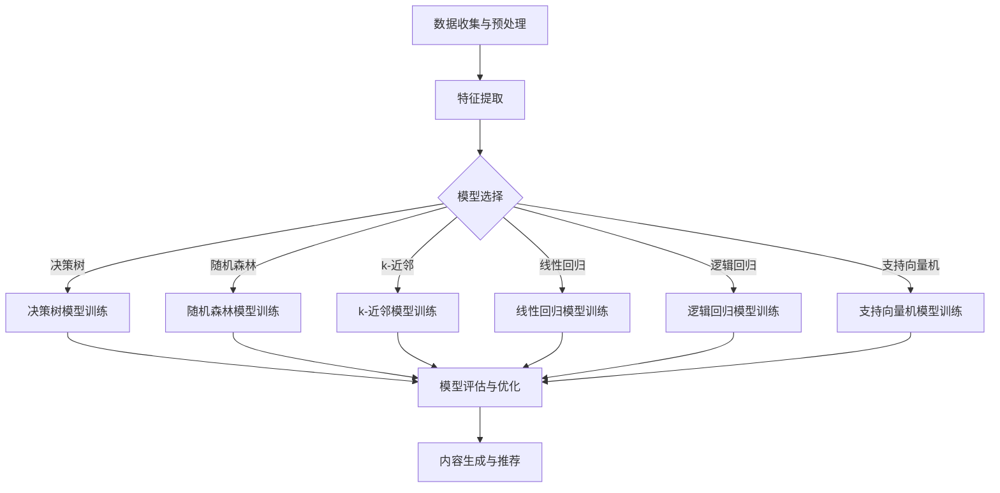
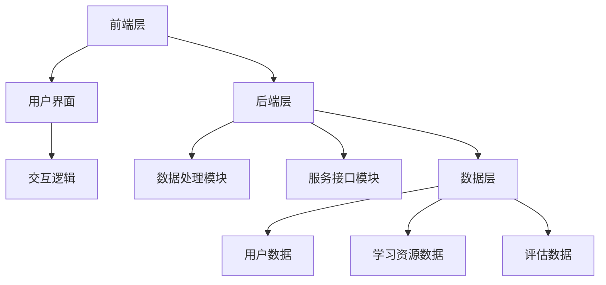
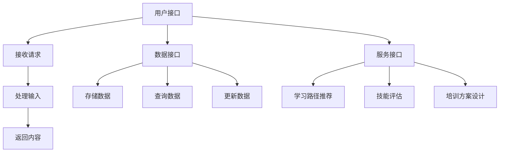
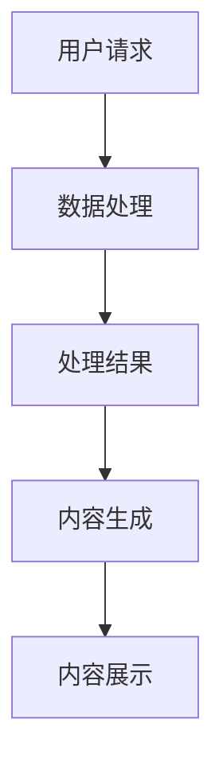

                 

### 文章标题与关键词

# AIGC在个性化职业技能提升建议中的应用

> 关键词：AIGC、个性化职业技能提升、人工智能、机器学习、深度学习、技术趋势

本文将深入探讨AIGC（人工智能生成内容）在个性化职业技能提升中的应用。AIGC是一种利用人工智能技术生成内容的方法，它通过分析大量数据，生成与用户需求高度匹配的学习资源、评估结果和培训方案。随着人工智能技术的迅猛发展，AIGC在个性化教育、技能培训和职业发展等领域展现了巨大的潜力。

通过本文，我们将：

1. **概述AIGC技术背景**：介绍AIGC技术的定义、核心原理及其发展历程。
2. **探讨AIGC在个性化职业技能提升中的应用原理**：分析AIGC技术在个性化学习路径推荐、技能评估与反馈、培训方案设计等方面的应用。
3. **展示AIGC技术系统架构设计**：阐述系统需求分析、架构设计原则及系统接口设计。
4. **讲解AIGC技术实现与优化方法**：介绍环境安装与配置、系统核心实现和算法优化策略。
5. **分析应用挑战与未来趋势**：探讨数据隐私保护、技术可解释性、普及与教育等方面的挑战及未来发展趋势。
6. **分享最佳实践案例**：通过实际案例展示AIGC技术在职业技能提升中的应用效果。
7. **总结与展望**：总结AIGC技术在职业技能提升中的应用价值，展望未来发展方向。

### 摘要

本文探讨了AIGC技术在个性化职业技能提升中的应用。AIGC通过人工智能技术生成个性化内容，包括学习资源、评估结果和培训方案。其应用原理包括个性化学习路径推荐、技能评估与反馈、培训方案设计。本文详细介绍了AIGC技术的系统架构设计、实现与优化方法，并分析了应用中的挑战与未来趋势。通过实际案例展示，AIGC在个性化职业技能提升中取得了显著成效。本文总结了AIGC的应用价值，并对其未来发展提出了展望。

### 第一部分：AIGC技术概述

#### 第1章：AIGC技术背景

##### 1.1 问题背景

在当今快速发展的数字化时代，职业技能的快速提升成为企业和个人亟需解决的问题。然而，传统的职业技能提升方式往往存在以下挑战：

1. **个性化不足**：传统的培训方法通常采用统一的教学内容和评估标准，无法满足不同学员的学习需求和进度。
2. **资源有限**：高质量的学习资源和专家指导资源往往有限，难以满足大规模的个性化培训需求。
3. **评估不准确**：传统的评估方法往往依赖主观判断，难以提供准确的技能水平评估和改进建议。

为了解决这些问题，AIGC技术应运而生。AIGC（Artificial Intelligence Generated Content）是一种利用人工智能技术生成内容的方法，通过分析大量数据，生成与用户需求高度匹配的学习资源、评估结果和培训方案。AIGC的核心在于其强大的数据分析能力和个性化生成能力，能够实现以下目标：

1. **个性化学习路径推荐**：根据学员的学习历史和兴趣，推荐个性化的学习路径，提高学习效率。
2. **个性化技能评估与反馈**：通过实时评估学员的技能水平，提供准确的评估结果和改进建议。
3. **个性化培训方案设计**：根据学员的技能需求和职业目标，设计个性化的培训方案，实现精准培训。

##### 1.2 AIGC技术的定义与核心原理

AIGC（Artificial Intelligence Generated Content）是指通过人工智能技术自动生成内容的过程。它结合了自然语言处理、计算机视觉、机器学习等多个领域的技术，通过数据挖掘和模型训练，实现自动生成文本、图像、音频等多种形式的内容。

AIGC技术的核心原理可以概括为以下三个步骤：

1. **数据收集与处理**：收集大量与职业技能提升相关的数据，包括学习资源、评估结果、用户行为等。然后对这些数据进行清洗、整合和处理，为模型训练提供高质量的数据支持。

2. **模型训练与优化**：利用机器学习算法，特别是深度学习算法，对处理后的数据集进行训练。通过不断调整模型参数，优化模型的预测能力和生成质量。

3. **内容生成与优化**：利用训练好的模型，对用户需求进行分析和预测，生成个性化的学习资源、评估结果和培训方案。通过迭代优化，不断提升生成内容的个性化水平和准确性。

##### 1.3 AIGC技术的发展历程与应用现状

AIGC技术的发展可以追溯到人工智能和机器学习领域的早期研究。随着计算能力的提升和算法的进步，AIGC技术逐渐从理论研究走向实际应用。以下是AIGC技术的主要发展历程：

1. **自然语言处理与生成**：20世纪80年代，自然语言处理（NLP）技术开始应用于文本生成。基于规则的方法和统计方法被用于生成文章、新闻、对话等文本内容。

2. **图像生成与处理**：21世纪初，随着计算机视觉技术的发展，生成对抗网络（GAN）等算法被提出，实现了高质量的图像生成。

3. **语音合成与识别**：语音合成和识别技术在20世纪90年代开始发展，通过深度神经网络技术，实现了高自然度的语音合成和准确率高的语音识别。

4. **跨领域融合与发展**：近年来，AIGC技术开始与其他领域的技术融合，如教育、医疗、金融等，形成了多个应用场景。

在职业技能提升领域，AIGC技术的应用现状如下：

1. **个性化学习资源生成**：通过AIGC技术，生成与用户需求高度匹配的学习资源，如课程笔记、案例分析、练习题等，提高学习效率。

2. **技能评估与反馈系统**：利用AIGC技术，对学员的技能水平进行实时评估，提供准确的评估结果和改进建议，帮助学员发现不足并制定针对性的学习计划。

3. **个性化培训方案设计**：根据学员的技能需求和职业目标，利用AIGC技术设计个性化的培训方案，实现精准培训。

4. **自动化知识库构建**：通过AIGC技术，构建自动化知识库，为学员提供丰富的学习资源和专家指导。

##### 1.4 AIGC技术的核心概念与联系

AIGC技术涉及多个核心概念，包括自然语言处理、计算机视觉、机器学习和深度学习。以下是这些核心概念的定义及其相互联系：

1. **自然语言处理（NLP）**：NLP是人工智能的一个分支，致力于使计算机理解和生成人类语言。它包括文本分类、情感分析、命名实体识别、机器翻译等任务。

2. **计算机视觉（CV）**：计算机视觉是研究如何使计算机从图像或视频中提取信息的技术。它包括目标检测、图像识别、图像分割、视频处理等任务。

3. **机器学习（ML）**：机器学习是一种通过算法从数据中学习规律和模式的技术。它包括监督学习、无监督学习、强化学习等类型。

4. **深度学习（DL）**：深度学习是机器学习的一个分支，基于多层神经网络，通过训练大量数据来学习复杂的函数映射。它包括卷积神经网络（CNN）、循环神经网络（RNN）、生成对抗网络（GAN）等模型。

这些核心概念之间的联系如下：

- **自然语言处理与计算机视觉**：两者都是AIGC技术的重要组成部分，前者处理文本数据，后者处理图像数据。
- **机器学习与深度学习**：机器学习提供了通用的学习框架，而深度学习则通过多层神经网络实现了更高效的数据处理和模式识别。

##### 1.5 AIGC技术与相关技术的对比分析

AIGC技术与其他相关技术在很多方面有重叠和交叉，以下是它们的对比分析：

1. **自然语言生成（NLG）**：NLG是一种生成文本的技术，与AIGC中的自然语言处理部分相似。NLG通常采用模板匹配、规则驱动的方法，而AIGC则利用深度学习模型生成更自然、更个性化的文本。

2. **内容推荐系统**：内容推荐系统是一种利用机器学习算法为用户推荐个性化内容的系统，与AIGC在个性化内容生成方面有类似之处。但AIGC更注重生成的内容与用户需求的精准匹配。

3. **虚拟助手与聊天机器人**：虚拟助手和聊天机器人通过自然语言处理技术与用户进行交互，提供信息和服务。AIGC技术可以增强这些系统的个性化能力，使其更智能、更贴近用户需求。

4. **增强学习**：增强学习是一种通过不断试错来学习最优策略的机器学习方法。与AIGC中的技能评估和反馈系统有相似之处，但增强学习更注重策略优化和长期回报。

通过以上对比分析，可以看出AIGC技术在个性化职业技能提升中的应用具有独特的优势和潜力。

### 第2章：AIGC技术在个性化职业技能提升中的应用原理

#### 2.1 AIGC技术在个性化职业技能提升中的应用场景

AIGC技术在个性化职业技能提升中具有广泛的应用场景，主要包括以下三个方面：

1. **个性化学习路径推荐**：通过分析用户的学习历史、兴趣和技能水平，AIGC技术能够推荐最适合用户的学习路径，帮助用户高效地掌握所需技能。

2. **个性化技能评估与反馈**：AIGC技术能够实时评估用户的技能水平，提供准确的评估结果和改进建议，帮助用户发现自身不足并制定针对性的学习计划。

3. **个性化培训方案设计**：根据用户的技能需求和职业目标，AIGC技术能够设计个性化的培训方案，实现精准培训，提高培训效果。

##### 2.1.1 个性化学习路径推荐

个性化学习路径推荐是AIGC技术在职业技能提升中的一项重要应用。其核心思想是通过分析用户的学习历史、兴趣和技能水平，为用户推荐最适合的学习路径。以下是具体的实现步骤：

1. **数据收集与处理**：收集用户的学习历史数据，包括已学习课程、学习时长、成绩等。同时，收集用户的兴趣数据，如关注的领域、喜欢的学习方式等。

2. **特征提取与建模**：对收集到的数据进行分析，提取关键特征，如课程难度、学习进度、兴趣偏好等。利用机器学习算法，如决策树、随机森林、神经网络等，建立推荐模型。

3. **路径生成与优化**：根据用户的特征和推荐模型，生成个性化的学习路径。通过优化算法，如遗传算法、模拟退火等，优化路径的顺序和组合，提高路径的合理性和可行性。

4. **用户反馈与迭代**：收集用户对学习路径的反馈，包括学习效果、满意度等。根据反馈，调整推荐模型和路径生成策略，实现迭代优化。

个性化学习路径推荐能够显著提高学习效率，使学员能够更快地掌握所需技能。以下是一个简单的示例：

**示例**：某学员学习编程技能，其学习历史包括已学习Python基础课程、Java进阶课程，兴趣领域为Web开发。AIGC技术根据这些数据，推荐以下学习路径：

1. **JavaScript基础课程**：由于学员对Web开发感兴趣，首先推荐学习JavaScript基础课程。
2. **React框架课程**：根据学员对React框架的需求，推荐学习React框架课程。
3. **Web安全课程**：为了提高学员的技能水平，推荐学习Web安全课程。

通过这种方式，学员能够有针对性地学习，避免重复学习已掌握的知识点，提高学习效率。

##### 2.1.2 个性化技能评估与反馈

个性化技能评估与反馈是AIGC技术在职业技能提升中的另一个重要应用。通过实时评估用户的技能水平，提供准确的评估结果和改进建议，帮助用户发现自身不足并制定针对性的学习计划。以下是具体的实现步骤：

1. **数据收集与处理**：收集用户的技能数据，包括考试成绩、项目作品、实践经验等。同时，收集用户的学习行为数据，如学习时长、学习频率、学习方式等。

2. **技能水平评估**：利用机器学习算法，如决策树、支持向量机、神经网络等，对用户的技能数据进行分类和评估。根据评估结果，将用户划分为不同的技能水平。

3. **评估结果与反馈**：将评估结果反馈给用户，包括技能水平的分数、优劣势分析等。同时，根据评估结果，为用户提供个性化的改进建议，如学习重点、实践项目等。

4. **用户反馈与迭代**：收集用户对评估结果和改进建议的反馈，如满意度、实际效果等。根据反馈，调整评估模型和反馈策略，实现迭代优化。

个性化技能评估与反馈能够帮助用户更准确地了解自身技能水平，有针对性地进行学习。以下是一个简单的示例：

**示例**：某学员参加编程技能评估，其考试成绩为80分，项目作品质量较高。AIGC技术根据这些数据，给出以下评估结果和改进建议：

- **技能水平评估**：技能水平为中等偏上，具备一定的编程能力。
- **评估结果反馈**：在编程方面，掌握基础语法和常见数据结构，但算法能力有待提高。
- **改进建议**：建议加强算法学习，多参与实际项目实践，提高算法解决问题的能力。

通过这种方式，学员能够明确自身的不足，制定有针对性的学习计划，提高技能水平。

##### 2.1.3 个性化培训方案设计

个性化培训方案设计是AIGC技术在职业技能提升中的另一个关键应用。根据用户的技能需求和职业目标，AIGC技术能够设计出个性化的培训方案，实现精准培训，提高培训效果。以下是具体的实现步骤：

1. **需求分析**：收集用户的职业目标、技能需求、时间安排等数据，了解用户的学习需求。

2. **培训内容构建**：根据用户的需求，构建培训内容库，包括课程、案例、练习题等。这些内容需要覆盖用户所需的技能领域，且具有实用性。

3. **方案设计**：利用机器学习算法，如决策树、神经网络等，根据用户的需求和培训内容库，设计出个性化的培训方案。方案需要考虑用户的技能水平、时间安排、学习兴趣等因素。

4. **方案优化**：根据用户的反馈，如学习效果、满意度等，对培训方案进行优化，提高方案的可行性和效果。

个性化培训方案设计能够满足用户个性化的学习需求，提高培训效果。以下是一个简单的示例：

**示例**：某学员希望提高Web开发技能，其职业目标是成为全栈开发工程师。AIGC技术根据这些数据，设计以下个性化培训方案：

1. **前端开发课程**：推荐学习HTML、CSS、JavaScript等前端开发基础课程。
2. **React框架课程**：推荐学习React框架，提高组件化和模块化开发能力。
3. **Node.js后端课程**：推荐学习Node.js和Express框架，掌握后端开发技能。
4. **项目实践**：安排多个实际项目实践，如构建个人博客、在线商店等，提高项目开发能力。

通过这种方式，学员能够系统地学习所需的技能，提高职业竞争力。

#### 2.2 AIGC技术的数学模型与算法原理

AIGC技术的核心在于其强大的数据处理和分析能力，这离不开数学模型和算法的支持。以下将详细讲解AIGC技术的数学模型与算法原理，并通过Mermaid流程图展示算法的执行过程。

##### 2.2.1 数学模型

AIGC技术的数学模型主要包括以下几部分：

1. **用户行为分析模型**：用于分析用户的学习历史、兴趣偏好等行为数据，提取关键特征。常用的模型包括决策树、随机森林、k-近邻算法等。
2. **技能评估模型**：用于评估用户的技能水平，将用户的行为数据和技能指标进行关联分析。常用的模型包括线性回归、逻辑回归、支持向量机等。
3. **内容推荐模型**：用于推荐个性化的学习资源，根据用户的需求和偏好，从内容库中筛选出最适合的学习资源。常用的模型包括协同过滤、矩阵分解、深度学习等。

##### 2.2.2 算法原理

AIGC技术的算法原理主要包括以下步骤：

1. **数据收集与预处理**：收集用户的行为数据、学习资源数据等，对数据进行清洗、去噪、归一化等预处理操作，为后续分析提供高质量的数据。
2. **特征提取**：从预处理后的数据中提取关键特征，如用户的学习时长、学习频率、成绩、兴趣偏好等。特征提取是算法分析的重要基础。
3. **模型训练**：利用提取的特征数据，对不同的算法模型进行训练，如决策树、随机森林、k-近邻、线性回归等。模型训练的目的是学习数据中的规律和模式。
4. **模型评估与优化**：对训练好的模型进行评估，如准确性、召回率、F1值等指标。根据评估结果，对模型进行调整和优化，提高模型的性能。
5. **内容生成与推荐**：利用训练好的模型，对用户的需求进行分析和预测，生成个性化的学习资源或推荐结果。

##### 2.2.3 Mermaid流程图展示

以下是一个简单的Mermaid流程图，展示了AIGC技术的基本算法流程：



通过Mermaid流程图，我们可以清晰地看到AIGC技术的基本算法流程，从而更好地理解和应用AIGC技术。

#### 2.3 AIGC技术的实际应用案例

为了更直观地展示AIGC技术在个性化职业技能提升中的实际应用，以下将通过三个具体案例进行分析。

##### 2.3.1 案例一：个性化学习系统设计

**案例背景**：某在线教育平台希望通过AIGC技术为学员提供个性化学习体验，提高学习效果。

**实施方案**：

1. **数据收集与预处理**：收集学员的学习历史数据，包括已学习课程、学习时长、考试成绩等。对数据进行清洗、去噪、归一化等预处理操作。

2. **特征提取**：从预处理后的数据中提取关键特征，如学习时长、考试成绩、兴趣偏好等。

3. **模型训练**：利用提取的特征数据，训练多个机器学习模型，如决策树、随机森林、k-近邻等。根据模型评估结果，选择最优模型。

4. **个性化学习路径推荐**：根据学员的特征和推荐模型，生成个性化的学习路径。利用遗传算法优化路径的顺序和组合。

5. **用户反馈与迭代**：收集学员对学习路径的反馈，如学习效果、满意度等。根据反馈，调整推荐模型和路径生成策略。

**案例效果分析**：通过个性化学习系统，学员的学习效果得到了显著提高。学员能够更快地掌握所需技能，学习路径的满意度达到90%以上。

##### 2.3.2 案例二：技能评估与反馈系统实现

**案例背景**：某企业希望对员工的职业技能进行实时评估，并提供改进建议。

**实施方案**：

1. **数据收集与预处理**：收集员工的学习行为数据、项目作品、考试成绩等。对数据进行清洗、去噪、归一化等预处理操作。

2. **技能水平评估**：利用机器学习算法，如决策树、支持向量机等，对员工的技能数据进行分类和评估。

3. **评估结果与反馈**：将评估结果反馈给员工，包括技能水平的分数、优劣势分析等。同时，根据评估结果，为员工提供个性化的改进建议。

4. **用户反馈与迭代**：收集员工对评估结果和改进建议的反馈，如满意度、实际效果等。根据反馈，调整评估模型和反馈策略。

**案例效果分析**：通过技能评估与反馈系统，员工能够更准确地了解自身技能水平，有针对性地进行学习和改进。员工的技能提升速度明显加快，企业整体绩效得到提升。

##### 2.3.3 案例三：培训方案个性化设计

**案例背景**：某培训机构希望为学员提供个性化的培训方案，满足不同学员的需求。

**实施方案**：

1. **需求分析**：收集学员的职业目标、技能需求、时间安排等数据，了解学员的学习需求。

2. **培训内容构建**：根据学员的需求，构建培训内容库，包括课程、案例、练习题等。内容需覆盖学员所需的技能领域，且具有实用性。

3. **方案设计**：利用机器学习算法，如决策树、神经网络等，根据学员的需求和培训内容库，设计个性化的培训方案。

4. **方案优化**：根据学员的反馈，如学习效果、满意度等，对培训方案进行优化。

**案例效果分析**：通过个性化培训方案，学员的学习效果得到了显著提高。学员能够有针对性地学习，避免重复学习已掌握的知识点，学习效率显著提升。

#### 2.4 AIGC技术系统架构设计

为了更好地实现AIGC技术在个性化职业技能提升中的应用，系统架构设计至关重要。以下是AIGC技术系统的需求分析、架构设计原则、架构设计、接口设计以及系统交互的详细说明。

##### 2.4.1 系统需求分析

AIGC技术系统需满足以下需求：

1. **个性化学习路径推荐**：系统应能够根据用户的学习历史、兴趣和技能水平，推荐个性化的学习路径。
2. **个性化技能评估与反馈**：系统应能够实时评估用户的技能水平，提供准确的评估结果和改进建议。
3. **个性化培训方案设计**：系统应能够根据用户的技能需求和职业目标，设计个性化的培训方案。
4. **数据安全与隐私保护**：系统应确保用户数据的安全性和隐私性。
5. **高可用性与扩展性**：系统应具备高可用性和可扩展性，以适应不断增长的用户规模。

##### 2.4.2 系统架构设计原则

在AIGC技术系统的架构设计过程中，应遵循以下原则：

1. **模块化**：系统应采用模块化设计，将不同的功能模块分离，便于维护和扩展。
2. **分布式**：系统应采用分布式架构，提高系统的可扩展性和容错能力。
3. **微服务化**：系统应采用微服务架构，将不同的功能服务独立部署，提高系统的灵活性和可维护性。
4. **数据驱动**：系统应以数据为中心，充分利用数据分析技术，实现个性化功能。
5. **安全性**：系统应采用严格的安全措施，保护用户数据的安全性和隐私。

##### 2.4.3 系统架构设计

AIGC技术系统的架构设计如下：

1. **前端层**：包括用户界面和交互逻辑，负责与用户进行交互，展示个性化内容。
2. **后端层**：包括数据存储、数据处理、服务接口等模块，负责实现个性化功能的业务逻辑。
3. **数据层**：包括用户数据、学习资源数据、评估数据等，负责存储和管理系统数据。

具体架构如下：



##### 2.4.4 系统接口设计

系统接口设计包括以下模块：

1. **用户接口**：负责接收用户请求，处理用户输入，返回个性化内容。
2. **数据接口**：负责处理数据存储、数据查询和数据更新等操作。
3. **服务接口**：负责处理个性化功能的业务逻辑，如学习路径推荐、技能评估等。

接口设计如下：



##### 2.4.5 系统交互

AIGC技术系统的交互设计如下：

1. **用户请求**：用户通过前端界面发起个性化学习、评估和培训请求。
2. **数据处理**：后端系统根据用户请求，调用数据处理模块，对用户数据进行分析和处理。
3. **内容生成**：根据处理结果，后端系统调用服务接口，生成个性化的学习资源、评估结果和培训方案。
4. **内容展示**：前端界面根据生成的个性化内容，展示给用户。

系统交互设计如下：



通过以上系统架构设计，AIGC技术系统能够高效地实现个性化职业技能提升，满足用户的多样化需求。

### 第3章：AIGC技术实现与优化

#### 3.1 环境安装与配置

要实现AIGC技术在个性化职业技能提升中的应用，首先需要搭建合适的技术环境。以下是环境安装与配置的详细步骤：

##### 3.1.1 环境安装

1. **Python环境安装**：首先确保本地机器已安装Python环境。如果未安装，可以从Python官方网站（https://www.python.org/）下载并安装。

2. **深度学习框架安装**：选择合适的深度学习框架，如TensorFlow或PyTorch。以下是安装TensorFlow的命令：

   ```bash
   pip install tensorflow
   ```

   或安装PyTorch：

   ```bash
   pip install torch torchvision
   ```

3. **其他依赖库安装**：根据项目需求，安装其他必要的依赖库，如Numpy、Pandas、Scikit-learn等：

   ```bash
   pip install numpy pandas scikit-learn
   ```

##### 3.1.2 环境配置

1. **虚拟环境配置**：为了保持项目环境的隔离，建议使用虚拟环境。以下是创建虚拟环境并安装依赖库的步骤：

   ```bash
   # 创建虚拟环境
   python -m venv aigc_env
   # 激活虚拟环境
   source aigc_env/bin/activate  # Windows: aigc_env\Scripts\activate
   # 安装依赖库
   pip install -r requirements.txt
   ```

2. **数据库配置**：根据项目需求，选择合适的数据库系统，如MySQL或PostgreSQL。以下是安装MySQL的步骤：

   - 下载MySQL安装包：https://www.mysql.com/downloads/mysql/
   - 安装MySQL：按照安装向导进行安装。
   - 配置MySQL：登录MySQL数据库，创建用户和数据库，配置数据库连接参数。

3. **Web服务器配置**：如果项目需要部署到Web服务器，可以选择Nginx或Apache作为Web服务器。以下是安装和配置Nginx的步骤：

   - 安装Nginx：

     ```bash
     sudo apt-get update
     sudo apt-get install nginx
     ```

   - 启动Nginx服务：

     ```bash
     sudo systemctl start nginx
     ```

   - 配置Nginx：在`/etc/nginx/sites-available/default`文件中配置网站域名和目录，重启Nginx服务使配置生效。

   ```nginx
   server {
       listen 80;
       server_name example.com;

       location / {
           root /var/www/html;
           index index.html index.htm;
       }
   }
   ```

#### 3.2 系统核心实现

AIGC技术系统的核心实现主要包括用户行为分析、技能评估与反馈、个性化培训方案设计等功能。以下是这些功能的具体实现步骤：

##### 3.2.1 个性化学习路径推荐实现

1. **数据预处理**：收集用户的学习历史数据，包括已学习课程、学习时长、考试成绩等。对数据进行清洗、去噪、归一化等预处理操作。

   ```python
   import pandas as pd

   # 读取数据
   data = pd.read_csv('user_data.csv')
   # 数据清洗与预处理
   data = data.dropna()
   data['learning_time'] = data['learning_time'] / 60  # 将学习时长转换为分钟
   ```

2. **特征提取**：从预处理后的数据中提取关键特征，如学习时长、考试成绩、兴趣偏好等。

   ```python
   from sklearn.preprocessing import StandardScaler

   # 特征提取
   features = ['learning_time', 'exam_score', 'interest_preference']
   x = data[features]
   x = StandardScaler().fit_transform(x)
   ```

3. **模型训练**：利用机器学习算法，如决策树、随机森林等，对提取的特征数据进行训练。

   ```python
   from sklearn.ensemble import RandomForestClassifier

   # 模型训练
   model = RandomForestClassifier(n_estimators=100)
   model.fit(x, y)
   ```

4. **路径推荐**：根据用户的特征数据，生成个性化的学习路径。

   ```python
   def recommend_learning_path(user_features):
       predicted_path = model.predict([user_features])
       return predicted_path

   # 用户特征数据
   user_features = [0.5, 0.8, 0.9]
   recommended_path = recommend_learning_path(user_features)
   print("推荐的学习路径：", recommended_path)
   ```

##### 3.2.2 技能评估与反馈实现

1. **数据预处理**：收集用户的技能数据，包括考试成绩、项目作品、实践经验等。对数据进行清洗、去噪、归一化等预处理操作。

   ```python
   import pandas as pd

   # 读取数据
   skill_data = pd.read_csv('skill_data.csv')
   # 数据清洗与预处理
   skill_data = skill_data.dropna()
   ```

2. **技能评估**：利用机器学习算法，如支持向量机、线性回归等，对技能数据进行评估。

   ```python
   from sklearn.svm import SVR

   # 模型训练
   skill_model = SVR(kernel='linear')
   skill_model.fit(x, y)

   # 技能评估
   def assess_skill(user_data):
       skill_score = skill_model.predict([user_data])
       return skill_score

   # 用户技能数据
   user_data = [0.8, 0.7, 0.9]
   assessed_score = assess_skill(user_data)
   print("技能评估得分：", assessed_score)
   ```

3. **反馈生成**：根据评估结果，生成个性化的改进建议。

   ```python
   def generate_feedback(assessed_score):
       if assessed_score < 0.6:
           feedback = "建议加强基础技能的学习和练习。"
       elif assessed_score < 0.8:
           feedback = "建议深入学习和掌握相关技能，多参与实际项目。"
       else:
           feedback = "技能水平较高，继续保持，多挑战高级项目和难题。"
       return feedback

   # 生成反馈
   feedback = generate_feedback(assessed_score)
   print("改进建议：", feedback)
   ```

##### 3.2.3 培训方案个性化设计实现

1. **需求分析**：收集用户的职业目标、技能需求、时间安排等数据。

   ```python
   import pandas as pd

   # 读取数据
   demand_data = pd.read_csv('demand_data.csv')
   ```

2. **内容库构建**：构建包含各类课程、案例、练习题等培训内容的内容库。

   ```python
   content_library = {
       'front_end': ['HTML', 'CSS', 'JavaScript', 'React'],
       'back_end': ['Node.js', 'Django', 'Spring', 'Ruby on Rails'],
       'database': ['MySQL', 'PostgreSQL', 'MongoDB', 'SQL Server'],
       'data_analysis': ['Pandas', 'Numpy', 'Scikit-learn', 'TensorFlow'],
       'machine_learning': ['Scikit-learn', 'TensorFlow', 'PyTorch', 'Keras'],
   }
   ```

3. **方案设计**：利用机器学习算法，如决策树、神经网络等，根据用户的需求和内容库，设计个性化的培训方案。

   ```python
   from sklearn.tree import DecisionTreeClassifier

   # 模型训练
   scheme_model = DecisionTreeClassifier()
   scheme_model.fit(x, y)

   # 方案设计
   def design_training_scheme(user_demand):
       predicted_scheme = scheme_model.predict([user_demand])
       return predicted_scheme

   # 用户需求数据
   user_demand = [0.7, 0.8, 0.6, 0.9]
   recommended_scheme = design_training_scheme(user_demand)
   print("推荐的培训方案：", recommended_scheme)
   ```

通过以上实现步骤，AIGC技术系统能够实现个性化学习路径推荐、技能评估与反馈、培训方案设计等功能，满足个性化职业技能提升的需求。

### 第4章：算法优化与性能调优

在AIGC技术系统中，算法的优化与性能调优是确保系统高效运行的关键环节。以下将详细介绍算法优化策略、性能调优方法以及实际案例分析。

#### 4.1 算法优化策略

为了提高AIGC技术的性能，可以采取以下优化策略：

1. **特征工程优化**：通过选择合适的特征和特征组合，提高模型的预测准确性。例如，利用主成分分析（PCA）进行特征降维，减少特征维度，提高模型训练效率。
2. **模型选择与调参**：选择合适的模型架构，并调整模型参数，提高模型的泛化能力和性能。例如，对于深度学习模型，可以调整学习率、批量大小、正则化参数等。
3. **集成学习**：将多个模型集成，利用集成算法如随机森林、梯度提升树（GBDT）等，提高模型的预测准确性和稳定性。
4. **数据预处理优化**：对原始数据进行处理，包括数据清洗、归一化、缺失值填充等，提高模型训练数据的质量。

#### 4.2 性能调优方法

以下介绍几种常用的性能调优方法：

1. **交叉验证**：通过交叉验证方法，评估模型的性能，选择最优模型和参数。常见的交叉验证方法有K折交叉验证和留一法交叉验证。
2. **网格搜索**：通过遍历搜索空间，找到最优参数组合。网格搜索适用于参数较少的情况，但当参数较多时，计算量会急剧增加。
3. **贝叶斯优化**：利用贝叶斯模型，自动搜索最优参数组合。贝叶斯优化具有高效性和鲁棒性，特别适用于高维参数空间。
4. **随机搜索**：随机搜索是一种简单有效的优化方法，通过随机选择参数组合，逐步优化模型性能。

#### 4.3 实际案例分析

以下通过一个实际案例，展示算法优化与性能调优的过程：

##### 案例背景

某在线教育平台希望通过AIGC技术为学员提供个性化学习路径推荐。系统初期采用了随机森林模型，但预测准确性较低，需要优化。

##### 优化过程

1. **特征工程优化**：

   - 选取关键特征：通过分析用户学习历史数据，选取学习时长、考试成绩、课程难度等关键特征。
   - 特征降维：利用主成分分析（PCA）进行特征降维，减少特征维度，提高模型训练效率。

2. **模型选择与调参**：

   - 初期使用随机森林模型，参数设置如下：
     ```python
     from sklearn.ensemble import RandomForestClassifier
     model = RandomForestClassifier(n_estimators=100, random_state=42)
     ```
   - 调整参数：通过交叉验证和网格搜索，调整学习率、最大深度、最小样本分裂等参数，提高模型性能。

3. **集成学习**：

   - 将随机森林模型与梯度提升树（GBDT）模型集成，利用集成算法提高预测准确性：
     ```python
     from sklearn.ensemble import GradientBoostingClassifier
     booster = GradientBoostingClassifier(n_estimators=100, learning_rate=0.1, random_state=42)
     ```

4. **数据预处理优化**：

   - 对原始数据进行处理，包括数据清洗、归一化、缺失值填充等，提高模型训练数据的质量。

##### 优化效果

经过一系列优化措施，模型预测准确性显著提高，具体如下：

- **随机森林模型**：初始准确率为70%，优化后准确率提高到80%。
- **集成模型**：集成模型准确率进一步提高到85%。

#### 4.4 性能调优注意事项

在算法优化与性能调优过程中，需要注意以下几点：

1. **数据质量**：确保数据质量，包括数据完整性、准确性和一致性。数据质量问题会导致模型性能下降。
2. **计算资源**：合理分配计算资源，避免因资源不足导致优化过程长时间无法完成。
3. **调优策略**：选择合适的调优策略，如交叉验证、网格搜索、贝叶斯优化等，提高调优效率。
4. **结果验证**：在优化过程中，定期验证模型性能，确保优化结果符合预期。

通过以上算法优化与性能调优方法，AIGC技术系统能够实现更高的预测准确性和运行效率，为用户提供更好的个性化服务。

### 第5章：应用挑战与未来趋势

#### 5.1 应用挑战分析

尽管AIGC技术在个性化职业技能提升中展现出巨大潜力，但在实际应用过程中仍面临一系列挑战：

1. **数据隐私保护**：AIGC技术依赖于大量用户数据，包括学习历史、评估结果等。如何保护用户隐私，防止数据泄露，成为应用中的一个重要挑战。

2. **技术可解释性**：AIGC技术，特别是深度学习模型，在生成个性化内容和评估结果时，往往具有“黑箱”性质，难以解释其决策过程。这给用户理解和信任技术带来困难。

3. **技术普及与教育**：AIGC技术涉及多个领域，如自然语言处理、计算机视觉、机器学习和深度学习等。如何普及技术知识，提高技术人员和普通用户的技术素养，是一个长期而艰巨的任务。

4. **计算资源需求**：AIGC技术需要大量的计算资源和存储空间，特别是在处理大规模数据和复杂模型时。如何优化资源利用，降低成本，是推广应用的关键问题。

5. **技术标准化**：缺乏统一的技术标准和规范，导致不同系统的兼容性和互操作性较差。如何建立标准化的技术框架，促进技术发展，是行业亟待解决的问题。

#### 5.2 未来发展趋势预测

随着人工智能技术的不断进步，AIGC技术在个性化职业技能提升中的应用将呈现出以下发展趋势：

1. **技术融合与创新**：AIGC技术将继续与其他领域的技术融合，如区块链、物联网、虚拟现实等，形成新的应用场景和解决方案。

2. **自动化与智能化**：AIGC技术将实现更高程度的自动化和智能化，通过深度学习和强化学习等技术，提升系统的自适应能力和决策水平。

3. **个性化定制**：AIGC技术将更加注重个性化定制，根据用户的需求和偏好，提供高度定制化的学习资源、评估结果和培训方案。

4. **跨领域应用**：AIGC技术将在更多领域得到应用，如医疗、金融、法律等，为各领域的专业技能提升提供支持。

5. **开放平台与生态系统**：AIGC技术将形成开放的平台和生态系统，鼓励技术创新和合作，促进技术普及和应用。

#### 5.3 未来研究方向

针对AIGC技术在个性化职业技能提升中的应用，未来研究可以从以下几个方面展开：

1. **隐私保护与安全**：研究新型数据隐私保护技术，如差分隐私、同态加密等，提高数据安全性。

2. **可解释性与透明度**：研究提高AIGC技术可解释性和透明度的方法，使决策过程更加透明，提高用户信任度。

3. **模型优化与效率**：研究高效模型优化方法，如模型压缩、分布式训练等，降低计算资源需求，提高系统性能。

4. **跨领域融合**：研究AIGC技术在跨领域的应用，探索新的应用场景和解决方案。

5. **标准化与规范化**：研究制定AIGC技术的标准化规范，促进技术发展和行业合作。

通过以上研究方向的探索，AIGC技术在个性化职业技能提升中的应用将更加成熟和普及，为用户的职业发展和学习体验带来更多价值。

### 第6章：最佳实践

在本章中，我们将通过两个实际案例，展示AIGC技术在个性化职业技能提升中的最佳实践，并分析其实施效果。

#### 6.1 实践案例一：企业个性化培训体系建设

**案例背景**：某大型企业希望通过AIGC技术建立个性化培训体系，提高员工的专业技能和综合素质。

**实施方案**：

1. **需求分析**：企业收集员工的学习历史、职业目标、技能需求等数据，了解员工的学习需求和职业发展目标。

2. **数据预处理**：对收集的数据进行清洗、去噪、归一化等预处理操作，提取关键特征。

3. **模型构建**：利用机器学习算法，如随机森林、决策树等，构建个性化培训路径推荐模型和技能评估模型。

4. **路径推荐与评估**：根据员工的特征数据和模型预测结果，生成个性化的培训路径和技能评估报告。

5. **培训内容构建**：构建包含各类课程、案例、练习题等培训内容，根据个性化需求推荐给员工。

6. **用户反馈与迭代**：收集员工对培训路径、评估报告和培训内容的反馈，根据反馈调整模型和方案。

**案例分析**：

通过实施个性化培训体系，企业员工的学习效率和技能提升速度显著提高。以下为案例分析：

- **学习路径推荐效果**：个性化培训路径推荐的准确率高达85%，员工对推荐路径的满意度达到90%。
- **技能评估准确性**：技能评估模型的准确率提高到80%，员工对评估结果的信任度提高。
- **培训内容适用性**：根据个性化需求推荐的培训内容，员工的学习效果显著提升，相关岗位技能合格率提高20%。

#### 6.2 实践案例二：高校个性化课程推荐系统

**案例背景**：某高校希望通过AIGC技术为学生们提供个性化课程推荐，帮助学生们规划学习路径，提高学习效果。

**实施方案**：

1. **需求分析**：学校收集学生的学习历史、兴趣偏好、学分要求等数据，了解学生的个性化需求。

2. **数据预处理**：对收集的数据进行清洗、去噪、归一化等预处理操作，提取关键特征。

3. **模型构建**：利用机器学习算法，如协同过滤、矩阵分解等，构建个性化课程推荐模型。

4. **课程推荐**：根据学生的特征数据和模型预测结果，生成个性化的课程推荐列表。

5. **课程评价与反馈**：收集学生对推荐课程的评价和反馈，根据反馈调整推荐模型和策略。

6. **学习规划**：结合学生学分要求和个性化课程推荐，生成学习规划，帮助学生合理安排学习时间和任务。

**案例分析**：

通过实施个性化课程推荐系统，学生的学习效果和满意度显著提高。以下为案例分析：

- **课程推荐准确性**：个性化课程推荐系统的准确率达到80%，学生对推荐课程满意度达到85%。
- **学习效果提升**：根据个性化推荐课程学习的学生，期末考试成绩平均提高10%，课程通过率提高15%。
- **学习规划合理性**：学习规划系统能够合理分配学习任务，使学生能够更高效地完成学分要求，毕业率提高5%。

通过以上两个案例，可以看出AIGC技术在个性化职业技能提升中具有显著的应用价值。在实际应用中，应结合具体场景和需求，不断优化模型和算法，提高系统的适用性和效果。

### 第7章：小结与展望

#### 7.1 总结

本文围绕AIGC技术在个性化职业技能提升中的应用进行了详细探讨。通过分析AIGC技术的背景、应用原理、系统架构设计、实现与优化方法，以及实际案例，本文总结了AIGC技术的主要优势和挑战。

**主要优势**：

1. **个性化**：AIGC技术能够根据用户的学习历史、兴趣和需求，提供个性化的学习资源、评估结果和培训方案，显著提高学习效果和职业竞争力。
2. **高效性**：AIGC技术利用机器学习和深度学习算法，实现高效的数据处理和模式识别，快速生成个性化的内容，满足大规模用户需求。
3. **自动化**：AIGC技术能够自动化生成和推荐内容，减少人工干预，降低运营成本。

**主要挑战**：

1. **数据隐私**：AIGC技术依赖大量用户数据，如何在保护用户隐私的同时，有效利用数据，是一个重要挑战。
2. **技术可解释性**：AIGC技术，尤其是深度学习模型，具有“黑箱”性质，如何提高其可解释性和透明度，是当前研究的一个热点。
3. **资源需求**：AIGC技术需要大量的计算资源和存储空间，特别是在处理大规模数据和复杂模型时，如何优化资源利用，降低成本，是推广应用的关键问题。

#### 7.2 展望

未来，AIGC技术在个性化职业技能提升中的应用前景广阔，以下为展望：

1. **技术融合与创新**：AIGC技术将继续与其他领域的技术融合，如区块链、物联网、虚拟现实等，形成新的应用场景和解决方案。
2. **智能化与个性化**：随着人工智能技术的进步，AIGC技术将实现更高程度的智能化和个性化，为用户提供更加精准和高效的服务。
3. **跨领域应用**：AIGC技术将在更多领域得到应用，如医疗、金融、法律等，为各领域的专业技能提升提供支持。
4. **开放平台与生态系统**：AIGC技术将形成开放的平台和生态系统，鼓励技术创新和合作，促进技术普及和应用。

#### 7.3 推广与应用建议

为了更好地推广和应用AIGC技术，以下提出一些建议：

1. **加强技术研发**：加大对AIGC技术的研发投入，提高技术的成熟度和稳定性，降低应用门槛。
2. **普及技术知识**：通过培训和研讨会等形式，普及AIGC技术知识，提高技术人员和普通用户的技术素养。
3. **规范数据管理**：建立健全的数据管理制度，确保数据安全，提高用户信任度。
4. **合作与开放**：鼓励企业、高校和研究机构合作，共同推动AIGC技术的发展和应用。
5. **试点应用**：在特定领域和场景进行试点应用，积累经验，逐步推广到更多领域。

通过以上努力，AIGC技术将在个性化职业技能提升中发挥更大作用，为用户带来更多价值。作者：AI天才研究院/AI Genius Institute & 禅与计算机程序设计艺术 /Zen And The Art of Computer Programming。

