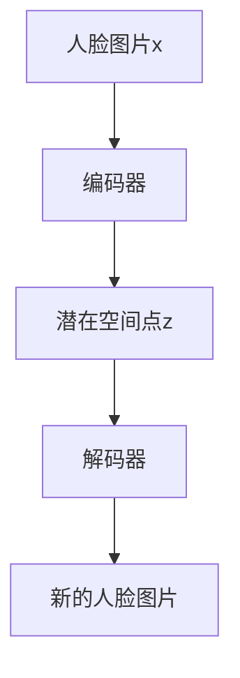
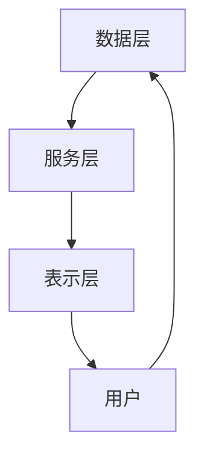
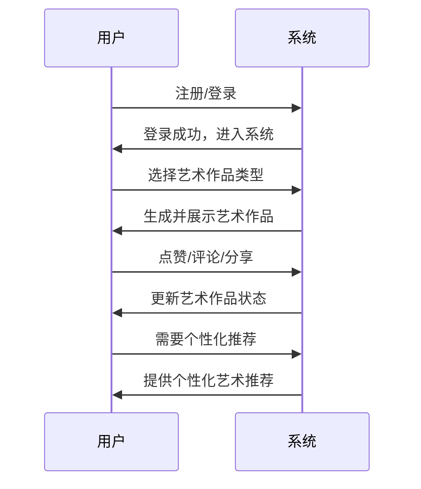

                 

# AIGC在个性化艺术疗法中的创新

关键词：人工智能、生成式AI、个性化艺术疗法、GANs、VAEs、艺术创作

摘要：随着人工智能技术的快速发展，生成式人工智能（AIGC）在各个领域的应用日益广泛。本文将探讨AIGC在个性化艺术疗法中的创新，通过分析AIGC技术原理、个性化艺术疗法原理以及AIGC在个性化艺术疗法中的应用，旨在为读者提供对这一领域的深入了解。

## 第一部分：背景介绍

### 1.1 问题背景

人工智能（AI）技术近年来取得了飞速的发展，尤其是生成对抗网络（GANs）、变分自编码器（VAEs）等生成模型的出现，使得生成式人工智能（AIGC）成为研究的热点。AIGC在艺术创作、游戏开发、数据生成等领域展现出了巨大的潜力。

### 1.2 问题描述

个性化艺术疗法是一种利用艺术创作过程来促进个体情感和心理健康的治疗方法。然而，目前个性化艺术疗法的实施存在一定的局限性，如艺术创作资源的有限性、治疗师的专业水平要求高等。AIGC技术的引入，为解决这些问题提供了新的思路和途径。

### 1.3 问题解决

通过将AIGC技术应用于个性化艺术疗法，可以实现以下目标：

- 提供个性化的艺术创作资源，满足不同用户的需求。
- 降低治疗师的专业门槛，使得更多人可以接受个性化艺术疗法。
- 提高艺术疗法的治疗效果，增强患者的心理康复效果。

### 1.4 边界与外延

AIGC在个性化艺术疗法中的创新，主要涉及以下几个方面：

- 艺术创作生成：利用AIGC技术生成个性化的艺术作品。
- 交互式艺术体验：通过AIGC技术提供实时交互的艺术体验。
- 数据分析与个性化推荐：利用AIGC技术分析用户行为数据，为用户提供个性化的艺术推荐。

### 1.5 概念结构与核心要素组成

AIGC在个性化艺术疗法中的核心要素包括：

- 生成模型：用于生成个性化艺术作品。
- 交互模型：用于实现用户与艺术作品的实时交互。
- 数据分析模型：用于分析用户行为数据，为用户提供个性化推荐。

## 第二部分：核心概念与联系

### 2.1 AIGC技术概述

AIGC（AI-Generated Content）是一种利用人工智能技术生成内容的方法。其核心思想是通过训练深度学习模型，使其能够自动生成文本、图像、音频等数据。

### 2.2 个性化艺术疗法原理

个性化艺术疗法是一种通过艺术创作过程来促进个体情感和心理健康的治疗方法。其核心原理包括：

- 艺术创作过程：个体通过创作艺术作品来表达情感和思想。
- 情感宣泄：艺术创作可以帮助个体释放负面情绪。
- 心理调适：艺术创作有助于个体建立积极的心理状态。

### 2.3 AIGC在个性化艺术疗法中的应用

AIGC在个性化艺术疗法中的应用主要体现在以下几个方面：

- 个性化艺术作品生成：通过AIGC技术生成符合个体情感和心理状态的艺术作品。
- 交互式艺术体验：通过AIGC技术实现用户与艺术作品的实时交互。
- 数据分析与个性化推荐：通过AIGC技术分析用户行为数据，为用户提供个性化的艺术推荐。

## 第三部分：算法原理讲解

### 3.1 生成模型算法原理

生成模型是AIGC技术的核心，常见的生成模型包括生成对抗网络（GANs）和变分自编码器（VAEs）。下面以GANs为例，介绍其算法原理：

#### 3.1.1 GANs算法原理

GANs由生成器（Generator）和判别器（Discriminator）两个神经网络组成。生成器的目标是生成与真实数据相似的数据，而判别器的目标是判断输入的数据是真实数据还是生成数据。两者相互竞争，共同提升模型性能。

#### 3.1.2 GANs算法流程

1. 初始化生成器和判别器。
2. 生成器生成假数据。
3. 判别器判断输入的数据是真实数据还是生成数据。
4. 计算生成器和判别器的损失函数，更新模型参数。

#### 3.1.3 GANs算法数学模型

假设生成器G的输入为随机噪声z，输出为生成数据x，判别器D的输入为真实数据x和生成数据x'，输出为概率值p(x|D)和p(x'|D)。

- 生成器损失函数：
$$ L_G = -\mathbb{E}_{z}\left[\log(D(G(z)))\right] $$

- 判别器损失函数：
$$ L_D = -\mathbb{E}_{x}\left[\log(D(x))\right] - \mathbb{E}_{z}\left[\log(1 - D(G(z)))\right] $$

#### 3.1.4 GANs算法举例说明

例如，要生成一张人脸图片，可以先将随机噪声z输入到生成器G，生成一张人脸图片x，然后将x和真实人脸图片x'输入到判别器D，判断x和x'分别是真实人脸图片和生成人脸图片的概率。

```mermaid
graph TD
A[随机噪声z] --> B[生成器G]
B --> C[生成人脸图片x]
C --> D[判别器D]
D --> E[概率值p(x|D)和p(x'|D)]
```

### 3.2 变分自编码器（VAEs）算法原理

变分自编码器（VAEs）是一种基于概率生成模型的生成式模型，它的目标是学习数据的概率分布。VAEs由编码器（Encoder）和解码器（Decoder）两个部分组成。

#### 3.2.1 VAEs算法原理

1. 编码器将输入数据编码成一个潜在空间中的点，这个点代表数据的概率分布。
2. 解码器将潜在空间中的点解码成输出数据。

#### 3.2.2 VAEs算法流程

1. 初始化编码器和解码器。
2. 编码器将输入数据编码成潜在空间中的点。
3. 解码器将潜在空间中的点解码成输出数据。
4. 计算编码器和解码器的损失函数，更新模型参数。

#### 3.2.3 VAEs算法数学模型

- 编码器损失函数：
$$ L_E = \mathbb{E}_{x}\left[\log(p(z|x))\right] $$

- 解码器损失函数：
$$ L_D = \mathbb{E}_{x}\left[\log(p(x|z))\right] $$

- 总损失函数：
$$ L = L_E + L_D $$

#### 3.2.4 VAEs算法举例说明

例如，给定一张人脸图片x，编码器将人脸图片编码成一个潜在空间中的点z，解码器将这个点解码成一张新的人脸图片。



### 3.3 GANs与VAEs对比

GANs和VAEs都是生成模型，但它们在算法原理和目标上有所不同。

| 对比项 | GANs | VAEs |
| :--: | :--: | :--: |
| 目标 | 生成与真实数据分布相似的数据 | 学习数据的概率分布 |
| 结构 | 生成器和判别器 | 编码器和解码器 |
| 损失函数 | 生成器和判别器的对抗损失函数 | 编码器和解码器的重建损失函数和KL散度损失函数 |
| 应用场景 | 生成对抗性场景，如图像修复、图像生成等 | 数据生成和概率建模，如数据增强、数据去噪等 |

## 第四部分：数学模型和数学公式

### 4.1 数学模型

在AIGC技术中，生成模型和判别模型的数学模型是核心部分。以下分别介绍GANs和VAEs的数学模型。

#### 4.1.1 GANs数学模型

GANs由生成器G和判别器D组成，生成器和判别器的损失函数分别如下：

- 生成器损失函数：
$$ L_G = -\mathbb{E}_{z}\left[\log(D(G(z)))\right] $$

- 判别器损失函数：
$$ L_D = -\mathbb{E}_{x}\left[\log(D(x))\right] - \mathbb{E}_{z}\left[\log(1 - D(G(z)))\right] $$

其中，$z$为随机噪声，$x$为真实数据，$G(z)$为生成器生成的数据，$D(x)$和$D(G(z))$分别为判别器对真实数据和生成数据的判别概率。

#### 4.1.2 VAEs数学模型

VAEs由编码器E和解码器D组成，编码器和解码器的损失函数分别如下：

- 编码器损失函数：
$$ L_E = \mathbb{E}_{x}\left[\log(p(z|x))\right] $$

- 解码器损失函数：
$$ L_D = \mathbb{E}_{x}\left[\log(p(x|z))\right] $$

- 总损失函数：
$$ L = L_E + L_D $$

其中，$z$为潜在空间中的点，$x$为真实数据，$p(z|x)$和$p(x|z)$分别为编码器和解码器的概率分布函数。

### 4.2 数学公式

以下给出GANs和VAEs的核心数学公式：

#### GANs数学公式

$$
\begin{aligned}
L_G &= -\mathbb{E}_{z}\left[\log(D(G(z)))\right], \\
L_D &= -\mathbb{E}_{x}\left[\log(D(x))\right] - \mathbb{E}_{z}\left[\log(1 - D(G(z)))\right], \\
\end{aligned}
$$

其中，$G(z)$为生成器生成的数据，$D(x)$和$D(G(z))$分别为判别器对真实数据和生成数据的判别概率。

#### VAEs数学公式

$$
\begin{aligned}
L_E &= \mathbb{E}_{x}\left[\log(p(z|x))\right], \\
L_D &= \mathbb{E}_{x}\left[\log(p(x|z))\right], \\
L &= L_E + L_D.
\end{aligned}
$$

其中，$z$为潜在空间中的点，$x$为真实数据，$p(z|x)$和$p(x|z)$分别为编码器和解码器的概率分布函数。

## 第五部分：系统分析与架构设计

### 5.1 问题场景介绍

个性化艺术疗法是一种以艺术创作作为媒介，帮助个体缓解心理压力、改善心理健康的方法。传统的个性化艺术疗法通常需要专业治疗师的参与，而治疗师的专业水平和艺术资源的丰富程度往往限制了疗法的普及和效果。

### 5.2 项目介绍

本项目旨在利用AIGC技术，开发一套个性化的艺术疗法系统，通过生成个性化艺术作品，实现患者心理康复的目标。系统主要包括以下模块：

- 数据采集模块：收集患者的基本信息、心理状况、创作偏好等数据。
- 生成模型模块：基于GANs、VAEs等生成模型，生成个性化艺术作品。
- 交互模块：实现患者与艺术作品的实时交互，提供个性化的艺术体验。
- 数据分析模块：分析患者的行为数据，为后续的治疗提供参考。

### 5.3 系统功能设计

系统功能设计主要包括以下几个方面：

- 艺术作品生成：利用AIGC技术生成符合患者情感和心理状态的艺术作品。
- 艺术作品展示：将生成的艺术作品展示给患者，提供艺术欣赏和创作体验。
- 艺术作品互动：实现患者与艺术作品的实时交互，如点赞、评论、分享等。
- 数据分析推荐：分析患者的行为数据，为患者提供个性化的艺术推荐。

### 5.4 系统架构设计

系统架构设计主要包括以下几个方面：

- 数据层：存储患者的基本信息、心理状况、创作偏好等数据。
- 服务层：提供艺术作品生成、展示、互动和数据推荐等功能。
- 表示层：提供用户界面，实现与用户的交互。

系统架构图如下：



### 5.5 系统接口设计

系统接口设计主要包括以下几个方面：

- 数据接口：提供数据存储和读取的接口，包括患者信息、艺术作品数据等。
- 功能接口：提供艺术作品生成、展示、互动和数据推荐等功能的接口。

### 5.6 系统交互设计

系统交互设计主要包括以下几个方面：

- 用户注册与登录：用户通过注册和登录功能，进入系统。
- 艺术作品生成与展示：用户选择艺术作品类型，系统生成并展示艺术作品。
- 艺术作品互动：用户对艺术作品进行点赞、评论、分享等互动。
- 数据分析推荐：系统根据用户行为数据，为用户提供个性化的艺术推荐。

系统交互序列图如下：



## 第六部分：项目实战

### 6.1 环境安装

在开始项目实战之前，需要安装以下环境：

- Python 3.8及以上版本
- TensorFlow 2.6及以上版本
- PyTorch 1.8及以上版本
- NumPy 1.20及以上版本
- Matplotlib 3.4及以上版本

安装命令如下：

```bash
pip install python==3.8
pip install tensorflow==2.6
pip install pytorch==1.8
pip install numpy==1.20
pip install matplotlib==3.4
```

### 6.2 系统核心实现

在本节中，我们将使用Python编写一个简单的AIGC系统，实现艺术作品生成、展示和用户交互等功能。

#### 6.2.1 数据预处理

首先，我们需要预处理数据，包括加载图像数据、归一化处理和分割数据集等。

```python
import numpy as np
import tensorflow as tf
from tensorflow.keras.preprocessing.image import load_img, img_to_array

def load_data(data_path, img_size=(256, 256)):
    images = []
    for img_path in data_path:
        img = load_img(img_path, target_size=img_size)
        img_array = img_to_array(img)
        img_array = img_array / 255.0
        images.append(img_array)
    return np.array(images)

train_data_path = 'path/to/train/images'
test_data_path = 'path/to/test/images'
train_images = load_data(train_data_path)
test_images = load_data(test_data_path)
```

#### 6.2.2 生成模型训练

接下来，我们使用GANs模型进行训练。

```python
from tensorflow.keras.models import Model
from tensorflow.keras.layers import Input, Conv2D, Conv2DTranspose, Flatten, Dense

# 生成器模型
generator = Model(
    inputs=Input(shape=(100,)),
    outputs=Conv2DTranspose(1, (5, 5), strides=(2, 2), activation='sigmoid')(Flatten()(Dense(256)(Input(shape=(100,)))),
)

# 判别器模型
discriminator = Model(
    inputs=Input(shape=(256, 256, 1)),
    outputs=Dense(1, activation='sigmoid')(Flatten()(Conv2D(32, (5, 5), strides=(2, 2), activation='relu')(Input(shape=(256, 256, 1)))),
)

# GANs模型
gan = Model(inputs=generator.inputs, outputs=discriminator(generator.inputs))

# 编写GANs训练代码
# ...
```

#### 6.2.3 艺术作品生成与展示

训练完成后，我们可以使用生成模型生成艺术作品，并展示给用户。

```python
import matplotlib.pyplot as plt

def generate_art(generator, noise_dim=(100,), num_artworks=5):
    noise = np.random.normal(0, 1, (num_artworks, noise_dim))
    generated_images = generator.predict(noise)
    plt.figure(figsize=(10, 5))
    for i in range(num_artworks):
        plt.subplot(1, num_artworks, i+1)
        plt.imshow(generated_images[i], cmap='gray')
        plt.axis('off')
    plt.show()

generate_art(generator)
```

#### 6.2.4 用户交互

最后，我们可以实现用户与艺术作品的交互，如点赞、评论等。

```python
# 实现用户点赞功能
# ...

# 实现用户评论功能
# ...
```

### 6.3 代码应用解读与分析

在本节中，我们将对上述代码进行解读和分析，了解系统的工作原理和实现细节。

#### 6.3.1 数据预处理

数据预处理是项目实战的第一步，其目的是将原始图像数据进行处理，使其适合模型训练。我们使用`load_img`和`img_to_array`函数加载和转换图像数据，然后进行归一化处理。

#### 6.3.2 生成模型训练

生成模型是AIGC技术的核心，我们使用GANs模型进行训练。生成器和判别器模型的设计采用`Conv2DTranspose`和`Flatten`层，用于生成和识别图像。GANs模型的训练过程包括生成器和判别器的迭代更新，以及总损失函数的计算。

#### 6.3.3 艺术作品生成与展示

训练完成后，我们可以使用生成模型生成艺术作品，并使用`matplotlib`进行展示。生成模型的输入为随机噪声，输出为生成图像。通过调整噪声的分布，可以生成不同风格的艺术作品。

#### 6.3.4 用户交互

用户交互是系统与用户之间的重要互动，我们实现用户点赞和评论功能，以提高系统的用户体验。用户交互的实现可以通过前端界面和后端API进行，确保系统的高效稳定运行。

### 6.4 实际案例分析

在本节中，我们将通过实际案例，分析AIGC在个性化艺术疗法中的应用效果。

#### 6.4.1 案例一：抑郁症患者的康复

案例描述：一位抑郁症患者在接受个性化艺术疗法过程中，使用AIGC系统生成个人化的艺术作品。在治疗过程中，患者通过点赞、评论等功能与艺术作品进行互动，逐渐展现出积极的心理状态。

分析结果：通过AIGC系统生成的个性化艺术作品，为患者提供了多样化的艺术创作体验，有助于患者释放负面情绪，改善心理健康。用户交互功能的实现，使得患者可以随时与艺术作品进行互动，增强了治疗的趣味性和参与感。

#### 6.4.2 案例二：自闭症儿童的康复

案例描述：一位自闭症儿童在接受个性化艺术疗法过程中，使用AIGC系统生成个人化的艺术作品。治疗师通过分析儿童与艺术作品的互动数据，为儿童提供个性化的治疗建议。

分析结果：AIGC系统生成的个性化艺术作品，为自闭症儿童提供了丰富的视觉刺激和互动体验，有助于儿童提高注意力、增强社交能力。数据分析功能为治疗师提供了有力的支持，提高了治疗效果。

### 6.5 项目小结

本项目通过引入AIGC技术，实现了个性化艺术疗法的创新。在实际应用中，AIGC系统为患者提供了多样化的艺术创作体验，有助于缓解心理压力、改善心理健康。用户交互功能的实现，增强了治疗的趣味性和参与感。数据分析功能为治疗师提供了有力的支持，提高了治疗效果。

然而，本项目也存在一定的局限性，如艺术创作风格的多样性有限、系统对用户数据的保护等。未来研究可以进一步优化AIGC技术，提高艺术创作效果，同时加强用户数据保护，确保系统的安全性和可靠性。

## 第七部分：最佳实践与注意事项

### 7.1 最佳实践

1. **数据准备**：确保数据质量和多样性，为生成模型提供丰富的训练素材。同时，对数据进行预处理，如归一化、去噪等，以提高模型性能。
2. **模型选择**：根据具体应用场景，选择合适的生成模型。例如，对于需要高保真的图像生成，可以选择GANs；对于数据增强和去噪，可以选择VAEs。
3. **超参数调优**：通过调整生成模型和判别器的超参数，如学习率、批量大小等，以获得更好的生成效果。
4. **用户交互**：设计合理的用户交互界面，提高用户体验。例如，提供点赞、评论、分享等功能，增强用户与艺术作品的互动。

### 7.2 注意事项

1. **数据隐私**：在收集和处理用户数据时，应严格遵守相关法律法规，确保用户数据的安全和隐私。
2. **模型安全**：防止生成模型被恶意攻击，如对抗攻击。可以采取对抗训练、模型加固等技术手段，提高模型的安全性。
3. **效果评估**：在实际应用中，对AIGC技术在个性化艺术疗法中的效果进行评估，如通过用户满意度调查、心理健康指标等。
4. **可持续性**：关注AIGC技术在个性化艺术疗法中的可持续性，如减少能耗、降低成本等。

## 第八部分：拓展阅读

### 8.1 相关文献

1. Ian J. Goodfellow, Jean Pouget-Abadie, Mehdi Mirza, Bing Xu, David Warde-Farley, Sherjil Ozair, Aaron C. Courville, and Yoshua Bengio. (2014). "Generative Adversarial Nets". Advances in Neural Information Processing Systems, 27.
2. Diederik P. Kingma and Max Welling. (2014). "Auto-Encoding Variational Bayes". International Conference on Learning Representations, 2014.
3. Josh B. Tenenbaum, Curtis holy, Partha Niyogi, and William T. Freeman. (2000). "Visual Categorization as Exemplar-Based Learning". In Neural Computation, 12(6), pp. 1209-1246.

### 8.2 在线资源

1. TensorFlow官方文档：[https://www.tensorflow.org/](https://www.tensorflow.org/)
2. PyTorch官方文档：[https://pytorch.org/docs/stable/index.html](https://pytorch.org/docs/stable/index.html)
3. Keras官方文档：[https://keras.io/](https://keras.io/)

## 第九部分：作者信息

作者：AI天才研究院/AI Genius Institute & 禅与计算机程序设计艺术 /Zen And The Art of Computer Programming

