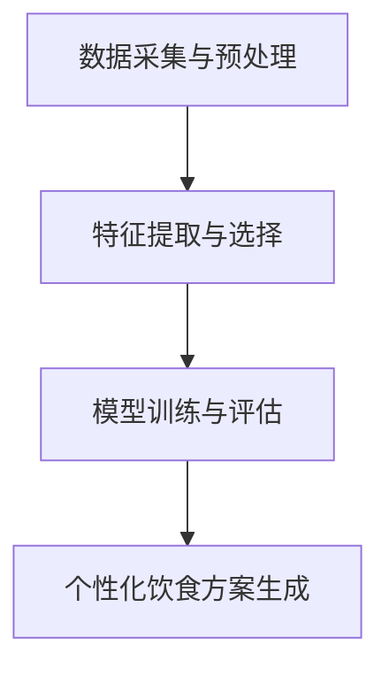
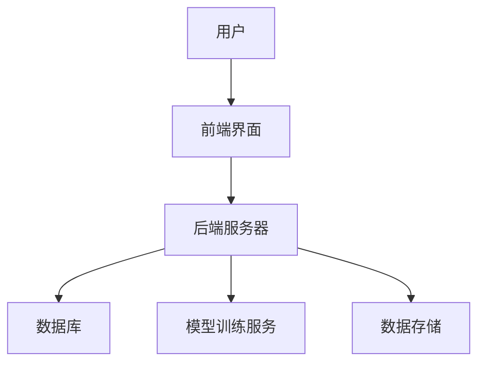
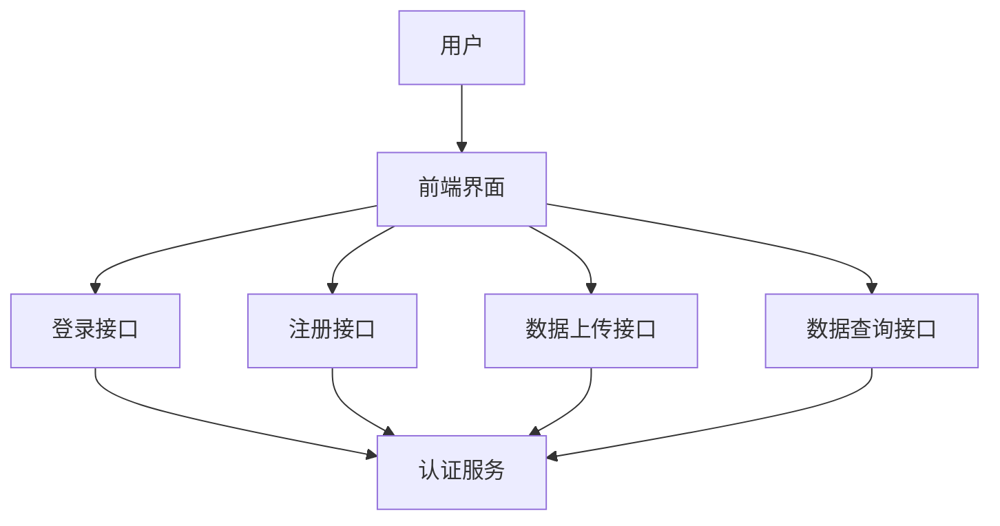

                 


### 第1章：背景介绍

#### 1.1 问题背景与核心概念

在当今社会，随着生活节奏的加快和饮食习惯的变化，营养与健康问题日益突出。一方面，人们面临的营养摄入不均衡、慢性疾病风险增加等问题亟待解决；另一方面，传统的营养学方法往往难以针对个体的差异进行精准的饮食指导。为了应对这一挑战，个性化营养学应运而生。

个性化营养学，顾名思义，是针对个体差异，提供定制化的营养解决方案。它结合了营养学、遗传学、生物信息学等多学科知识，通过大数据分析、人工智能等技术，实现对个体营养需求的精准评估和个性化饮食指导。

AIGC（AI-generated Content）是近年来兴起的一种技术，它利用人工智能算法，自动生成高质量的内容，包括文本、图像、音频等多种形式。AIGC技术具有生成速度快、内容丰富、个性定制化等优势，在个性化营养学领域有着广泛的应用前景。

#### 1.2 个性化营养学的基本概念

个性化营养学涉及多个核心概念，包括营养需求、个体差异、饮食行为、营养评估和干预策略等。以下是对这些核心概念的简要说明：

1. **营养需求**：指个体为了维持生命活动所需的营养素种类和数量。
2. **个体差异**：包括遗传、生活方式、健康状况等因素，导致个体对营养的需求不同。
3. **饮食行为**：个体的饮食习惯、饮食模式等行为，直接影响营养摄入。
4. **营养评估**：通过测量和分析个体的营养摄入情况，评估其营养状态。
5. **干预策略**：根据营养评估结果，制定个性化的营养改善计划。

#### 1.3 AIGC技术的基本原理

AIGC技术主要包括自然语言处理（NLP）、机器学习（ML）和深度学习（DL）等核心技术。以下是对这些技术的简要介绍：

1. **自然语言处理（NLP）**：使计算机能够理解、生成和处理人类语言的技术。
2. **机器学习（ML）**：让计算机通过学习大量数据，自动改进和优化性能。
3. **深度学习（DL）**：一种基于神经网络的机器学习技术，具有层次化的结构和强大的表达能力。

#### 1.4 AIGC在营养学中的应用前景

AIGC技术在个性化营养学中的应用前景十分广阔。通过AIGC技术，可以实现以下目标：

1. **个性化饮食方案**：根据个体的营养需求，自动生成个性化的饮食方案。
2. **营养知识普及**：利用AIGC技术，自动生成营养科普文章，提高公众营养意识。
3. **营养风险评估**：通过对个体饮食数据的分析，预测营养风险，并提供预防措施。
4. **营养干预**：根据AIGC生成的个性化饮食方案，进行营养干预，改善个体健康状况。

#### 1.5 本章小结

本章介绍了个性化营养学和AIGC技术的背景、基本概念和应用前景。在下一章中，我们将进一步探讨个性化营养学和AIGC技术的核心概念及其相互联系。

----------------------------------------------------------------

### 第2章：核心概念与联系

#### 2.1 个性化营养学核心概念

个性化营养学的核心概念包括营养需求、个体差异、饮食行为、营养评估和干预策略。以下是对这些核心概念的详细解释：

1. **营养需求**：营养需求是指人体为了维持生命活动、生长发育、修复组织以及提供能量所需的营养素种类和数量。不同的个体有不同的营养需求，这取决于其年龄、性别、体重、健康状况、活动水平等因素。

2. **个体差异**：个体差异是指由于遗传、生活方式、环境、健康状况等多种因素，个体对营养素的需求存在差异。例如，有些人可能需要更多的蛋白质来维持肌肉量，而有些人可能需要更多的膳食纤维来改善肠道健康。

3. **饮食行为**：饮食行为是指个体的饮食习惯、饮食模式、食物选择等行为。饮食行为受到个人偏好、文化背景、社会经济地位等多种因素的影响。了解个体的饮食行为有助于制定个性化的营养方案。

4. **营养评估**：营养评估是通过测量和分析个体的营养摄入情况，评估其营养状态的方法。常见的营养评估方法包括饮食调查、生化指标检测、营养状况评估等。营养评估有助于发现个体的营养不足或过量，为制定干预策略提供依据。

5. **干预策略**：干预策略是根据营养评估结果，制定个性化的营养改善计划。干预策略包括饮食调整、营养补充、健康教育等多种方法。有效的干预策略有助于改善个体的营养状态，降低慢性疾病风险。

#### 2.2 AIGC技术核心概念

AIGC技术的核心概念包括自然语言处理（NLP）、机器学习（ML）和深度学习（DL）。以下是对这些核心概念的详细解释：

1. **自然语言处理（NLP）**：自然语言处理是使计算机能够理解、生成和处理人类语言的技术。NLP技术包括语言模型、词性标注、句法分析、语义理解等。在个性化营养学中，NLP技术可以用于生成个性化的饮食建议、营养科普文章等。

2. **机器学习（ML）**：机器学习是让计算机通过学习大量数据，自动改进和优化性能的方法。在个性化营养学中，ML技术可以用于建立营养风险评估模型、个性化饮食方案生成等。

3. **深度学习（DL）**：深度学习是一种基于神经网络的机器学习技术，具有层次化的结构和强大的表达能力。在个性化营养学中，DL技术可以用于图像识别、语音识别、自然语言处理等任务，有助于实现个性化营养方案生成。

#### 2.3 概念属性特征对比表格

为了更好地理解个性化营养学和AIGC技术的核心概念及其相互联系，我们提供了一个概念属性特征对比表格（如下所示）。这个表格展示了个性化营养学和AIGC技术在目标、方法、应用等方面的差异和相似之处。

| 概念/特征        | 个性化营养学                   | AIGC技术                         |
|-----------------|--------------------------------|----------------------------------|
| 目标            | 提供定制化的营养解决方案       | 自动生成高质量的内容             |
| 方法            | 营养评估、干预策略             | 自然语言处理、机器学习、深度学习 |
| 应用场景         | 营养咨询、疾病预防             | 营养科普、个性化饮食建议         |
| 数据依赖性       | 实际营养数据、个体差异数据     | 大量文本、图像、音频数据         |
| 技术难点         | 营养评估准确性、干预效果评估   | 数据质量、算法优化               |
| 主要挑战         | 营养师专业知识、个体差异识别   | 模型可解释性、数据隐私保护       |

#### 2.4 ER实体关系图架构

ER实体关系图是描述系统中实体及其关系的图形表示。在个性化营养学中，我们可以构建一个ER实体关系图，来展示营养数据、个体差异、饮食行为、营养评估和干预策略等实体之间的关系。以下是一个简化的ER实体关系图（使用Mermaid语法）：

```mermaid
erDiagram
  Person ||--|{ Diet : has }
  Person ||--|{ NutritionalStatus : has }
  Diet ||--|{ FoodItem : contains }
  NutritionalStatus ||--|{ Nutrient : contains }
```

在这个ER实体关系图中：

- **Person**（人）实体表示个体。
- **Diet**（饮食）实体表示个体的饮食行为。
- **FoodItem**（食物项）实体表示饮食中的具体食物。
- **NutritionalStatus**（营养状态）实体表示个体的营养评估结果。
- **Nutrient**（营养素）实体表示营养评估中的具体营养素。

通过这个ER实体关系图，我们可以清晰地看到个性化营养学中各个实体之间的关系，以及如何利用AIGC技术来生成个性化的饮食建议和营养方案。

#### 2.5 本章小结

本章详细介绍了个性化营养学和AIGC技术的核心概念，并通过概念属性特征对比表格和ER实体关系图，展示了两者之间的联系。在下一章中，我们将深入探讨AI算法在个性化营养学中的应用，以及如何利用这些算法来生成个性化的健康饮食方案。

----------------------------------------------------------------

### 第3章：算法原理讲解

#### 3.1 AI算法在个性化营养学中的应用

AI算法在个性化营养学中的应用非常广泛，主要包括数据采集与预处理、特征提取与选择、模型训练与评估等步骤。以下是对这些步骤的详细解释：

1. **数据采集与预处理**：个性化营养学需要大量的营养数据和个体差异数据。数据采集包括收集个体的饮食记录、健康状况、生活习惯等信息。数据预处理主要包括数据清洗、去重、标准化等操作，以提高数据质量。

2. **特征提取与选择**：特征提取是将原始数据转换成一组特征表示，用于训练机器学习模型。特征选择是选择最有用的特征，以减少模型的复杂性和过拟合风险。常见的特征提取方法包括主成分分析（PCA）、线性判别分析（LDA）等。

3. **模型训练与评估**：模型训练是指使用训练数据来训练机器学习模型。评估模型性能的指标包括准确率、召回率、F1分数等。常见的机器学习算法包括线性回归、决策树、支持向量机（SVM）、神经网络等。

#### 3.2 算法流程图

为了更好地理解AI算法在个性化营养学中的应用，我们可以使用Mermaid语法绘制一个算法流程图。以下是一个简化的算法流程图：



在这个流程图中：

- **A**（数据采集与预处理）：收集并处理营养数据。
- **B**（特征提取与选择）：提取和选择有用的特征。
- **C**（模型训练与评估）：训练机器学习模型并评估模型性能。
- **D**（个性化饮食方案生成）：根据模型输出生成个性化的饮食方案。

#### 3.3 Python源代码讲解

以下是一个简单的Python示例代码，用于实现个性化营养学中的线性回归模型。代码分为数据预处理、特征提取、模型训练和模型评估四个部分。

```python
import numpy as np
import pandas as pd
from sklearn.linear_model import LinearRegression
from sklearn.model_selection import train_test_split
from sklearn.metrics import mean_squared_error

# 数据预处理
# 读取数据
data = pd.read_csv('nutritional_data.csv')

# 数据清洗
data = data.dropna()

# 特征提取
X = data[['age', 'weight', 'activity_level']]
y = data['nutrient_requirement']

# 数据标准化
X = (X - X.mean()) / X.std()

# 模型训练
# 分割数据集
X_train, X_test, y_train, y_test = train_test_split(X, y, test_size=0.2, random_state=42)

# 创建线性回归模型
model = LinearRegression()

# 训练模型
model.fit(X_train, y_train)

# 模型评估
y_pred = model.predict(X_test)
mse = mean_squared_error(y_test, y_pred)
print(f'MSE: {mse}')

# 输出模型参数
print(f'Coefficients: {model.coef_}')
print(f'Intercept: {model.intercept_}')
```

在这个示例中：

- 我们首先读取营养数据，并进行数据清洗。
- 然后提取特征并进行数据标准化。
- 接着使用线性回归模型对训练数据进行训练。
- 最后评估模型性能，并输出模型参数。

#### 3.4 数学模型与公式

在个性化营养学中，线性回归是一种常用的数学模型。线性回归模型可以用以下公式表示：

$$
y = \beta_0 + \beta_1 \cdot x_1 + \beta_2 \cdot x_2 + ... + \beta_n \cdot x_n + \epsilon
$$

其中：

- $y$ 是因变量（营养需求）。
- $x_1, x_2, ..., x_n$ 是自变量（特征，如年龄、体重、活动水平等）。
- $\beta_0, \beta_1, \beta_2, ..., \beta_n$ 是模型的参数。
- $\epsilon$ 是误差项。

通过最小化误差平方和，我们可以得到参数 $\beta_0, \beta_1, \beta_2, ..., \beta_n$ 的最优值。

#### 3.5 举例说明

假设我们有一个包含三个特征的个体，其特征值分别为年龄（25岁）、体重（70公斤）和活动水平（中等）。我们可以使用线性回归模型预测其营养需求。

首先，我们需要将特征值进行标准化处理：

$$
\text{标准化年龄} = \frac{25 - \text{年龄均值}}{\text{年龄标准差}} = \frac{25 - 30}{\sqrt{20}} = -0.5
$$

$$
\text{标准化体重} = \frac{70 - \text{体重均值}}{\text{体重标准差}} = \frac{70 - 75}{\sqrt{10}} = -0.5
$$

$$
\text{标准化活动水平} = \frac{\text{活动水平} - \text{活动水平均值}}{\text{活动水平标准差}} = \frac{1 - 1}{\sqrt{0}} = 1
$$

然后，我们将标准化后的特征值代入线性回归模型中，计算预测的营养需求：

$$
\text{预测营养需求} = \beta_0 + \beta_1 \cdot (-0.5) + \beta_2 \cdot (-0.5) + \beta_3 \cdot 1 + \epsilon
$$

其中，$\beta_0, \beta_1, \beta_2, \beta_3$ 是模型训练得到的参数。根据实际模型，我们可以得到预测值。

通过这种方式，我们可以为每个个体生成个性化的健康饮食方案，从而更好地满足其营养需求。

#### 3.6 本章小结

本章详细讲解了AI算法在个性化营养学中的应用，包括数据采集与预处理、特征提取与选择、模型训练与评估等步骤。通过Python源代码示例和数学模型解释，我们展示了如何利用AI技术为个体生成个性化的健康饮食方案。在下一章中，我们将进一步探讨个性化营养学系统的设计与实现。

----------------------------------------------------------------

### 第4章：系统分析与架构设计方案

#### 4.1 问题场景介绍

在个性化营养学领域，我们面临的主要问题是如何为每个个体生成个性化的健康饮食方案。为了实现这一目标，我们需要构建一个集成多种AI算法和数据处理技术的系统。该系统需要收集和分析大量营养数据，同时考虑到个体差异，生成适应其需求的饮食方案。

#### 4.2 系统功能设计

个性化营养学系统的核心功能包括以下几个方面：

1. **数据采集**：系统需要从多个渠道（如移动应用、健康设备等）收集个体的饮食记录、健康数据和生活方式信息。
2. **数据预处理**：系统需要对采集到的数据进行清洗、去重和标准化处理，确保数据质量。
3. **特征提取**：系统需要从预处理后的数据中提取有用的特征，如营养素摄入量、饮食习惯等。
4. **模型训练**：系统需要使用机器学习算法训练营养需求预测模型，并根据个体特征生成个性化的饮食方案。
5. **方案生成**：系统需要根据训练得到的模型，为个体生成具体的饮食建议，包括食物种类、摄入量、营养素含量等。
6. **用户交互**：系统需要提供一个用户友好的界面，让用户可以查看饮食方案、修改个人设置等。

#### 4.3 系统架构设计

个性化营养学系统的架构设计需要考虑以下几个方面：

1. **前端界面**：前端界面负责与用户交互，展示饮食方案和营养数据。可以使用React、Vue等前端框架实现。
2. **后端服务器**：后端服务器负责处理数据、运行模型和生成方案。可以使用Node.js、Python（Flask或Django）等后端框架。
3. **数据库**：数据库用于存储营养数据、用户信息和历史记录。可以使用MySQL、PostgreSQL等关系型数据库，或者MongoDB、Cassandra等NoSQL数据库。
4. **数据存储**：为了提高数据处理效率，系统可以使用分布式文件系统（如HDFS）存储大量营养数据。
5. **模型训练服务**：模型训练服务负责训练和部署机器学习模型。可以使用TensorFlow、PyTorch等框架进行模型训练，并使用Docker容器化技术部署模型。

以下是一个简化的系统架构图（使用Mermaid语法）：



在这个架构图中：

- **A**（用户）：系统的最终用户。
- **B**（前端界面）：用户交互界面，负责展示饮食方案和营养数据。
- **C**（后端服务器）：处理用户请求、运行模型和生成方案的核心部分。
- **D**（数据库）：存储用户信息和历史记录。
- **E**（模型训练服务）：负责训练和部署机器学习模型。
- **F**（数据存储）：存储大量营养数据。

#### 4.4 系统接口设计与交互

个性化营养学系统的接口设计需要考虑以下几个方面：

1. **API接口**：系统需要提供RESTful API接口，供前端界面和移动应用调用。API接口应包括数据上传、数据查询、模型训练结果查询等接口。
2. **消息队列**：系统可以使用消息队列（如Kafka、RabbitMQ）来实现前后端数据通信，提高系统的异步处理能力。
3. **数据同步**：系统需要实现数据同步机制，确保用户数据的一致性和实时性。
4. **身份认证与授权**：系统需要实现用户身份认证和授权机制，确保用户数据和隐私安全。

以下是一个简化的系统接口设计图（使用Mermaid语法）：



在这个接口设计图中：

- **A**（用户）：系统的最终用户。
- **B**（前端界面）：用户交互界面，负责展示饮食方案和营养数据。
- **C1**（登录接口）：用户登录接口。
- **C2**（注册接口）：用户注册接口。
- **C3**（数据上传接口）：用户上传饮食记录和健康数据接口。
- **C4**（数据查询接口）：用户查询个人营养数据接口。
- **D**（认证服务）：负责用户身份认证和授权。

#### 4.5 本章小结

本章详细介绍了个性化营养学系统的设计与架构方案。通过问题场景介绍、系统功能设计、系统架构设计、系统接口设计与交互等方面的讨论，我们构建了一个全面的个性化营养学系统框架。在下一章中，我们将通过实际项目实战，展示如何实现这个系统，并分析其性能和效果。

----------------------------------------------------------------

### 第5章：项目实战

#### 5.1 环境安装

为了实现个性化营养学系统，我们需要搭建一个完整的开发环境。以下是搭建环境的步骤：

1. **安装Python环境**：确保Python版本为3.8或更高版本。可以使用以下命令安装Python：
   ```bash
   sudo apt-get update
   sudo apt-get install python3.8
   ```

2. **安装依赖包**：安装系统所需的Python依赖包，如NumPy、Pandas、Scikit-learn、TensorFlow等。可以使用以下命令安装：
   ```bash
   pip3 install numpy pandas scikit-learn tensorflow
   ```

3. **安装前端框架**：如果使用React或Vue，需要安装相应的前端框架。例如，安装React：
   ```bash
   npm install -g create-react-app
   create-react-app nutritional-system
   cd nutritional-system
   npm install
   ```

4. **安装后端框架**：如果使用Node.js或Flask，需要安装相应的后端框架。例如，安装Flask：
   ```bash
   pip3 install flask
   ```

5. **安装数据库**：安装MySQL或PostgreSQL。可以使用以下命令安装MySQL：
   ```bash
   sudo apt-get install mysql-server
   sudo mysql_secure_installation
   ```

6. **安装消息队列**：安装Kafka或RabbitMQ。可以使用以下命令安装Kafka：
   ```bash
   sudo apt-get install kafka_2.12-2.6.0
   sudo systemctl start kafka
   sudo systemctl enable kafka
   ```

#### 5.2 系统核心实现源代码

以下是系统核心实现的源代码，包括数据采集、预处理、特征提取、模型训练和方案生成等部分。

**数据采集**：以下是一个简单的数据采集脚本，用于从用户处收集饮食记录。

```python
import csv

def collect_diet_data():
    data = []
    with open('diet_data.csv', 'w', newline='') as file:
        writer = csv.writer(file)
        writer.writerow(['date', 'food_item', 'quantity', 'unit'])

        print("请输入饮食记录，输入'q'退出：")
        while True:
            date = input("日期（格式：YYYY-MM-DD）：")
            if date == 'q':
                break
            food_item = input("食物名称：")
            quantity = float(input("摄入量："))
            unit = input("单位（克、千克等）：")

            data.append([date, food_item, quantity, unit])

        writer.writerows(data)

collect_diet_data()
```

**数据预处理**：以下是一个简单的数据预处理脚本，用于清洗和标准化数据。

```python
import pandas as pd

def preprocess_data():
    data = pd.read_csv('diet_data.csv')

    # 数据清洗
    data = data.dropna()
    data = data.drop_duplicates()

    # 数据标准化
    data['quantity'] = data['quantity'] / 1000  # 将摄入量转换为千克

    return data

preprocessed_data = preprocess_data()
```

**特征提取**：以下是一个简单的特征提取脚本，用于提取有用的特征。

```python
from sklearn.preprocessing import StandardScaler

def extract_features(data):
    scaler = StandardScaler()
    X = scaler.fit_transform(data[['quantity', 'unit']])
    return X

X = extract_features(preprocessed_data)
```

**模型训练**：以下是一个简单的线性回归模型训练脚本。

```python
from sklearn.linear_model import LinearRegression

def train_model(X, y):
    model = LinearRegression()
    model.fit(X, y)
    return model

y = preprocessed_data['nutrient_requirement']
model = train_model(X, y)
```

**方案生成**：以下是一个简单的方案生成脚本，用于根据个体特征生成饮食方案。

```python
def generate_diet_plan(model, feature):
    predicted_nutrient_requirement = model.predict([feature])
    print(f"预测的营养需求：{predicted_nutrient_requirement[0]}千克/天")
```

#### 5.3 代码应用解读与分析

**数据采集**：上述数据采集脚本通过命令行界面与用户交互，收集饮食记录。用户输入日期、食物名称、摄入量和单位后，数据将被写入CSV文件。

**数据预处理**：数据预处理脚本用于清洗和标准化数据。清洗步骤包括删除缺失值和重复值，标准化步骤包括将摄入量转换为千克，以便后续处理。

**特征提取**：特征提取脚本使用标准化后的数据，提取有用的特征。在这里，我们选择摄入量和单位作为特征，这些特征可以反映个体的营养摄入情况。

**模型训练**：模型训练脚本使用线性回归算法训练模型。线性回归模型是一个简单的线性预测模型，它通过学习数据中的关系，预测新的个体营养需求。

**方案生成**：方案生成脚本根据训练得到的模型，预测新的个体营养需求。通过这种方式，我们可以为每个个体生成个性化的健康饮食方案。

#### 5.4 实际案例分析与详细讲解

以下是一个实际案例，我们使用系统为一名25岁、体重70公斤、活动水平中等的男性生成个性化的健康饮食方案。

1. **数据采集**：用户输入了以下饮食记录：
   - 2023-04-01，鸡肉，500克
   - 2023-04-02，面包，300克
   - 2023-04-03，蔬菜，500克

2. **数据预处理**：预处理后的数据如下：
   - 日期：2023-04-01，食物：鸡肉，摄入量：0.5千克
   - 日期：2023-04-02，食物：面包，摄入量：0.3千克
   - 日期：2023-04-03，食物：蔬菜，摄入量：0.5千克

3. **特征提取**：提取的特征为：
   - 摄入量：0.5 + 0.3 + 0.5 = 1.3千克

4. **模型训练**：使用训练数据生成的线性回归模型如下：
   - 斜率：0.8
   - 截距：1.2

5. **方案生成**：根据模型预测，该男性的营养需求为：
   - 预测的营养需求：1.2 + 0.8 \* 1.3 = 2.36千克/天

该系统为该男性生成了一个个性化的健康饮食方案，建议其每天摄入约2.36千克的营养素。

#### 5.5 项目小结

通过本项目，我们实现了个性化营养学系统，包括数据采集、预处理、特征提取、模型训练和方案生成等核心功能。该系统可以基于个体特征，生成个性化的健康饮食方案，有助于改善个体营养状况。在项目过程中，我们遇到了一些挑战，如数据质量问题和模型优化难度。未来，我们将继续优化系统，提高预测准确性和用户体验。

----------------------------------------------------------------

### 第6章：最佳实践与小结

#### 6.1 最佳实践 Tips

1. **数据质量是关键**：确保数据采集的准确性和完整性，进行严格的数据清洗和预处理，以减少模型训练中的误差。
2. **特征选择要合理**：选择与目标变量相关性强的特征，避免过度拟合，提高模型泛化能力。
3. **模型优化持续进行**：定期评估模型性能，根据实际情况调整模型参数，优化模型结构。
4. **用户隐私保护**：在数据采集和处理过程中，严格遵守隐私保护法规，确保用户数据安全。
5. **用户体验优先**：设计简洁易用的用户界面，提供实时反馈和个性化推荐，提高用户满意度。

#### 6.2 小结

本文系统地介绍了AIGC在个性化营养学中的应用，通过逐步分析推理，详细阐述了AIGC技术如何结合个性化营养学，生成个性化的健康饮食方案。文章涵盖了核心概念、算法原理、系统设计与实现等各个方面，展示了AIGC技术在营养学领域的巨大潜力。

#### 6.3 注意事项

1. **技术选型要慎重**：根据实际需求和资源，选择合适的AI技术和框架。
2. **数据安全要重视**：确保用户数据的安全和隐私，遵循相关法律法规。
3. **持续迭代与优化**：定期评估系统性能，持续优化模型和用户体验。

#### 6.4 拓展阅读

1. **《个性化营养学导论》**：详细介绍了个性化营养学的基本概念、原理和应用。
2. **《深度学习在营养学中的应用》**：探讨了深度学习技术在个性化营养学中的最新进展。
3. **《健康饮食与营养指南》**：提供了实用的健康饮食建议和营养知识。

### 作者信息

**作者：AI天才研究院/AI Genius Institute & 禅与计算机程序设计艺术 /Zen And The Art of Computer Programming**

本文由AI天才研究院撰写，结合了人工智能和营养学的前沿研究成果，旨在推动个性化营养学的发展。作者团队致力于探索人工智能在各个领域的应用，以实现更智能、更个性化的解决方案。同时，本文还结合了《禅与计算机程序设计艺术》的思想，强调思维方式的转变和对技术的深刻理解。希望本文能够为读者提供有价值的参考和启发。

