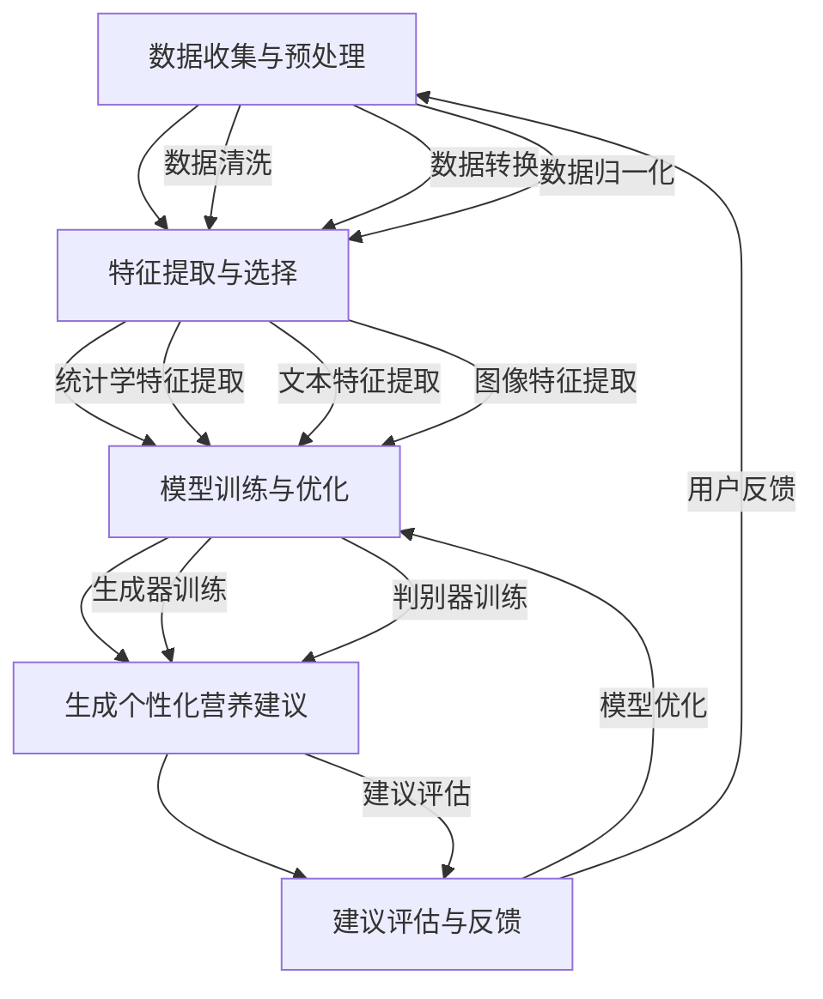
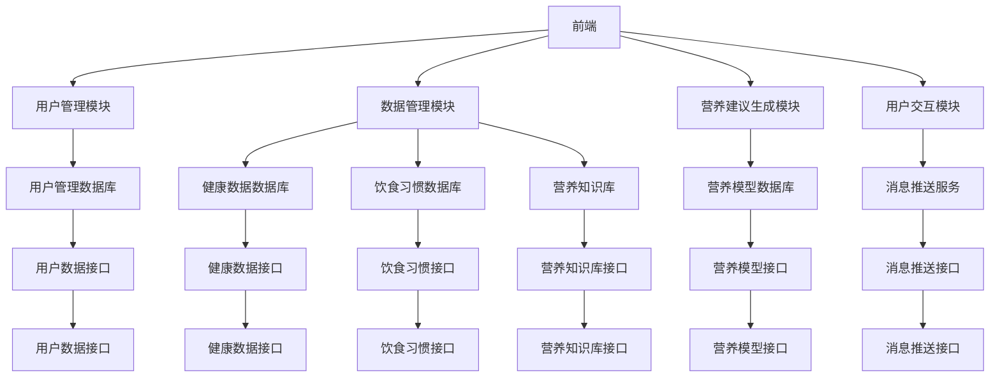

                 

### 1. 目录大纲设计思路

在撰写一篇关于“AIGC在个性化营养建议中的应用”的技术博客时，目录大纲的设计对于整篇文章的结构清晰、内容连贯至关重要。以下我们将详细讨论四个部分：背景介绍、核心概念与联系、算法原理讲解、系统分析与架构设计方案。

**1. 背景介绍**

背景介绍部分旨在为读者提供一个关于AIGC技术、个性化营养建议以及它们相互关系的概述。这一部分的内容需要包含以下几个方面：

- **AIGC技术概述**：介绍AIGC的定义、核心原理以及与传统AI技术的区别。
- **个性化营养建议的重要性**：阐述营养需求多样性、个体差异以及当前营养建议的现状。
- **AIGC在营养建议中的应用潜力**：讨论AIGC技术的优势、挑战以及应用案例。

具体目录如下：

```
# 第一部分：背景介绍

## 第1章：AIGC技术概述
### 1.1 AIGC的定义与核心原理
### 1.2 AIGC与传统AI技术的区别
### 1.3 AIGC技术的优势与应用场景

## 第2章：个性化营养建议的重要性
### 2.1 营养需求多样性与个体差异
### 2.2 个性化营养建议的现状
### 2.3 AIGC在个性化营养建议中的应用潜力

## 第3章：AIGC在营养建议领域的应用前景
### 3.1 AIGC技术的优势与挑战
### 3.2 AIGC在营养建议中的应用案例
### 3.3 AIGC的未来发展趋势

## 第4章：本章小结
```

**2. 核心概念与联系**

核心概念与联系部分将详细阐述AIGC技术、个性化营养建议以及相关技术（如机器学习、深度学习等）的概念原理和联系。这一部分的内容需要涵盖以下几个方面：

- **AIGC技术原理**：解释AIGC技术的基本框架、核心算法和技术优势。
- **个性化营养建议**：详细讨论个性化营养建议的概念、需求分析和挑战。
- **AIGC与个性化营养建议的联系**：分析AIGC在个性化营养建议中的应用以及与相关技术的比较。

具体目录如下：

```
# 第二部分：核心概念与联系

## 第1章：AIGC技术原理
### 1.1 AIGC技术框架
### 1.2 AIGC的核心算法
### 1.3 AIGC的技术优势与应用场景

## 第2章：个性化营养建议
### 2.1 个性化营养建议的概念
### 2.2 个性化营养建议的需求分析
### 2.3 个性化营养建议的挑战与机遇

## 第3章：AIGC与个性化营养建议的联系
### 3.1 AIGC在个性化营养建议中的应用
### 3.2 AIGC与相关技术的对比
### 3.3 AIGC技术的优势在个性化营养建议中的体现

## 第4章：个性化营养建议中的关键技术
### 4.1 机器学习在个性化营养建议中的应用
### 4.2 深度学习在个性化营养建议中的应用
### 4.3 其他技术在个性化营养建议中的应用

## 第5章：本章小结
```

**3. 算法原理讲解**

算法原理讲解部分将详细介绍AIGC技术在个性化营养建议中的应用，包括算法的mermaid流程图、Python源代码实现、数学模型和公式以及举例说明。这一部分的内容需要包括以下几个方面：

- **AIGC技术应用框架**：介绍数据收集与预处理、特征提取与选择、模型训练与优化等步骤。
- **算法原理讲解**：详细解释AIGC技术的基本原理，使用mermaid流程图和Python源代码进行展示。
- **数学模型与公式**：阐述AIGC技术的数学模型和公式，并进行详细讲解。
- **算法举例说明**：通过具体的案例进行算法的举例说明。

具体目录如下：

```
# 第三部分：算法原理讲解

## 第1章：AIGC技术在个性化营养建议中的应用框架
### 1.1 数据收集与预处理
### 1.2 特征提取与选择
### 1.3 模型训练与优化

## 第2章：AIGC技术原理讲解
### 2.1 AIGC技术的基本原理
### 2.2 AIGC技术的mermaid流程图
### 2.3 Python源代码实现

## 第3章：数学模型与公式
### 3.1 AIGC技术的数学模型
### 3.2 数学公式讲解
### 3.3 公式示例

## 第4章：算法举例说明
### 4.1 举例说明
### 4.2 实际案例分析
### 4.3 结果分析

## 第5章：本章小结
```

**4. 系统分析与架构设计方案**

系统分析与架构设计方案部分将详细阐述AIGC技术在个性化营养建议系统中的实现。这一部分的内容需要包括以下几个方面：

- **问题场景介绍**：描述个性化营养建议的应用场景和系统需求。
- **系统功能设计**：介绍系统功能模块划分和详细介绍。
- **系统架构设计**：阐述系统架构设计原则、框架和架构图。
- **系统接口设计**：说明接口设计原则、规范和文档。
- **系统交互设计**：描述系统交互流程和交互序列图。

具体目录如下：

```
# 第四部分：系统分析与架构设计方案

## 第1章：问题场景介绍
### 1.1 个性化营养建议的场景描述
### 1.2 系统需求分析

## 第2章：系统功能设计
### 2.1 系统功能模块划分
### 2.2 功能模块详细介绍
### 2.3 mermaid领域模型类图

## 第3章：系统架构设计
### 3.1 系统架构设计原则
### 3.2 系统架构设计框架
### 3.3 mermaid架构图

## 第4章：系统接口设计
### 4.1 接口设计原则
### 4.2 接口设计规范
### 4.3 接口文档

## 第5章：系统交互设计
### 4.1 系统交互流程
### 4.2 系统交互序列图
### 4.3 系统交互详细说明

## 第6章：本章小结
```

通过以上四个部分的设计，我们可以确保文章内容的结构清晰、逻辑连贯，使得读者能够更好地理解AIGC技术在个性化营养建议中的应用。

---

在了解了目录大纲的设计思路之后，让我们进一步思考如何撰写每一个章节的内容，使其不仅具有深度，还能引起读者的兴趣。

### 1. 背景介绍

**第1章：AIGC技术概述**

**1.1 AIGC的定义与核心原理**

在这一章节，我们需要首先解释AIGC（自适应智能生成计算）的定义。AIGC是一种基于深度学习和生成对抗网络（GAN）的技术，旨在通过自适应学习生成多样化、高质量的内容。接下来，我们深入探讨AIGC的核心原理，包括其数据生成、模型训练和优化等关键步骤。

**1.2 AIGC与传统AI技术的区别**

接下来，我们需要对比AIGC与传统AI技术，如机器学习和深度学习。AIGC在生成能力、自适应性和多样性方面具有显著优势，使其在需要高度个性化和复杂内容生成的场景中尤为适用。

**1.3 AIGC技术的优势与应用场景**

在这一部分，我们列举AIGC技术的几个关键优势，如高效的数据利用、快速的内容生成和强大的适应性。同时，我们也讨论AIGC在个性化营养建议、虚拟现实、自动化写作等领域的广泛应用。

**第2章：个性化营养建议的重要性**

**2.1 营养需求多样性与个体差异**

我们首先讨论营养需求多样性的原因，如年龄、性别、生活方式等因素。接着，我们探讨个体差异对营养摄入的影响，例如基因、代谢率等。

**2.2 个性化营养建议的现状**

在这一部分，我们分析当前个性化营养建议的现状，包括现有技术的局限性和用户接受度。

**2.3 AIGC在个性化营养建议中的应用潜力**

这里，我们详细介绍AIGC技术如何通过数据分析和模型训练，为用户提供更精准、个性化的营养建议。我们还会探讨AIGC在营养建议领域的发展前景。

**第3章：AIGC在营养建议领域的应用前景**

**3.1 AIGC技术的优势与挑战**

在这一部分，我们深入分析AIGC技术在营养建议领域的优势，如数据处理的效率、生成建议的准确性等，同时也讨论其面临的挑战，如数据隐私、算法透明度等。

**3.2 AIGC在营养建议中的应用案例**

我们通过几个具体案例，展示AIGC技术在实际营养建议中的应用，如智能营养顾问、个性化饮食计划等。

**3.3 AIGC的未来发展趋势**

最后，我们探讨AIGC技术未来的发展趋势，包括技术创新、行业应用拓展等，以及其对个性化营养建议的长期影响。

**第4章：本章小结**

在章节结尾，我们对前面讨论的内容进行总结，强调AIGC技术在个性化营养建议中的重要性，并提出未来研究的方向和建议。

---

**第2章：核心概念与联系**

**2.1 AIGC技术原理**

在这一章节，我们将详细介绍AIGC技术的原理，包括其核心算法和基本框架。首先，我们解释生成对抗网络（GAN）的工作原理，然后介绍AIGC如何通过自适应学习实现内容生成。

**2.1.1 AIGC技术框架**

我们绘制AIGC技术的mermaid流程图，展示其从数据收集到模型训练的全过程。接下来，我们详细解释每个步骤的具体实现。

**2.1.2 AIGC的核心算法**

我们深入探讨AIGC的核心算法，如生成器（Generator）和判别器（Discriminator）的交互过程。通过具体的算法公式，我们解释AIGC如何生成高质量的个性化营养建议。

**2.1.3 AIGC的技术优势与应用场景**

我们列举AIGC技术的优势，如高效的内容生成、灵活的自适应学习和广泛的应用场景。通过实际案例，我们展示AIGC在个性化营养建议中的具体应用。

**2.2 个性化营养建议**

在这一部分，我们详细介绍个性化营养建议的概念，包括其定义、目标和实施步骤。我们讨论营养需求的多样性、个体差异和当前的营养建议现状。

**2.2.1 个性化营养建议的概念**

我们解释个性化营养建议的定义，并列举其主要目标和挑战。通过具体的例子，我们展示个性化营养建议在实际中的应用。

**2.2.2 个性化营养建议的需求分析**

我们分析个性化营养建议的需求，如用户数据收集、营养数据分析和个性化推荐等。我们讨论这些需求如何通过AIGC技术实现。

**2.2.3 个性化营养建议的挑战与机遇**

在这一部分，我们探讨个性化营养建议面临的挑战，如数据隐私、算法透明度和用户接受度等。同时，我们也讨论AIGC技术如何提供机遇，解决这些挑战。

**2.3 AIGC与个性化营养建议的联系**

我们分析AIGC与个性化营养建议之间的联系，讨论AIGC技术在个性化营养建议中的应用潜力。我们通过mermaid流程图展示AIGC在个性化营养建议中的实现过程。

**2.4 个性化营养建议中的关键技术**

在这一部分，我们讨论个性化营养建议中的关键技术，如机器学习、深度学习和自然语言处理等。我们解释这些技术如何与AIGC技术结合，实现高效的个性化营养建议。

**2.4.1 机器学习在个性化营养建议中的应用**

我们介绍机器学习的基本概念，并探讨其在个性化营养建议中的应用。我们解释如何通过机器学习模型分析用户数据，生成个性化的营养建议。

**2.4.2 深度学习在个性化营养建议中的应用**

我们详细介绍深度学习的基本原理，并讨论其在个性化营养建议中的应用。我们解释如何使用深度学习模型，如卷积神经网络（CNN）和递归神经网络（RNN），进行营养数据的分析和生成。

**2.4.3 其他技术在个性化营养建议中的应用**

我们讨论其他技术在个性化营养建议中的应用，如自然语言处理（NLP）和增强学习（RL）。我们解释如何通过这些技术，实现更智能、个性化的营养建议。

**2.5 本章小结**

在章节结尾，我们对前面讨论的内容进行总结，强调AIGC技术在个性化营养建议中的重要性，并提出未来研究的方向和建议。

---

**第3章：算法原理讲解**

**3.1 AIGC技术在个性化营养建议中的应用框架**

在这一章节，我们详细介绍AIGC技术在个性化营养建议中的应用框架。首先，我们讨论数据收集与预处理的重要性，包括数据来源、数据清洗和数据格式化等步骤。然后，我们介绍特征提取与选择的过程，解释如何从原始数据中提取有用信息，以及如何选择最相关的特征。

**3.1.1 数据收集与预处理**

我们列举常用的数据收集方法，如问卷调查、健康监测数据和公开数据集。接着，我们讨论数据预处理的关键步骤，如缺失值填补、异常值处理和数据归一化等。我们使用mermaid流程图展示整个数据收集与预处理过程。

**3.1.2 特征提取与选择**

我们详细介绍特征提取的方法，如统计学特征、文本特征和图像特征等。接着，我们讨论特征选择的重要性，解释如何从大量特征中选择最有用的特征。我们使用mermaid流程图展示特征提取与选择的过程。

**3.1.3 模型训练与优化**

在这一部分，我们讨论模型训练的过程，包括模型选择、参数调整和模型评估等步骤。我们解释如何使用交叉验证和超参数调优来提高模型的性能。我们使用mermaid流程图展示模型训练与优化的过程。

**3.2 AIGC技术原理讲解**

在这一部分，我们深入探讨AIGC技术的原理，包括生成对抗网络（GAN）的基本概念和关键组件。首先，我们解释生成器（Generator）和判别器（Discriminator）的作用和工作原理。然后，我们讨论AIGC技术如何通过对抗训练生成高质量的个性化营养建议。

**3.2.1 AIGC技术的基本原理**

我们详细解释AIGC技术的基本原理，包括生成器和判别器的交互过程。我们使用mermaid流程图展示AIGC技术的mermaid流程，帮助读者理解其工作原理。

**3.2.2 AIGC技术的mermaid流程图**

我们绘制AIGC技术的mermaid流程图，展示其从数据输入到生成建议的全过程。通过mermaid流程图，读者可以清晰地看到每个步骤的具体实现。

**3.2.3 Python源代码实现**

在这一部分，我们提供AIGC技术在Python中的实现代码，包括生成器和判别器的实现、训练过程的代码以及生成建议的代码。通过代码示例，读者可以更好地理解AIGC技术的具体实现过程。

**3.3 数学模型与公式**

在这一部分，我们介绍AIGC技术的数学模型和公式，包括生成器和判别器的损失函数、优化目标等。我们使用LaTeX格式展示关键的数学公式，帮助读者更好地理解AIGC技术的数学原理。

**3.3.1 AIGC技术的数学模型**

我们详细解释AIGC技术的数学模型，包括生成器和判别器的损失函数、优化目标等。通过具体的数学公式，我们展示AIGC技术如何通过对抗训练生成高质量的个性化营养建议。

**3.3.2 数学公式讲解**

我们使用LaTeX格式展示AIGC技术的关键数学公式，包括生成器的损失函数、判别器的损失函数等。我们详细解释这些公式的含义和作用，帮助读者更好地理解AIGC技术的数学原理。

**3.3.3 公式示例**

在这一部分，我们通过具体的例子，展示如何使用AIGC技术的数学公式进行营养建议的生成。我们使用LaTeX格式编写示例代码，帮助读者理解公式的具体应用。

**3.4 算法举例说明**

在这一部分，我们通过具体的案例，展示AIGC技术在个性化营养建议中的应用。我们使用Python代码实现案例，并详细解释每个步骤的具体实现过程。通过案例，读者可以更好地理解AIGC技术的实际应用。

**3.4.1 举例说明**

我们选择一个具体的案例，如个性化饮食计划，展示AIGC技术在个性化营养建议中的应用。我们使用Python代码实现生成器和判别器的训练过程，并生成个性化饮食建议。

**3.4.2 实际案例分析**

我们分析一个实际案例，如智能营养顾问，展示AIGC技术在个性化营养建议中的实际应用。我们讨论案例的实现过程、数据集的选择和模型训练的结果，帮助读者理解AIGC技术的实际效果。

**3.4.3 结果分析**

在这一部分，我们分析AIGC技术在个性化营养建议中的应用结果。我们讨论模型生成的个性化营养建议的质量和准确性，以及用户对建议的接受度和满意度。通过结果分析，我们评估AIGC技术在个性化营养建议中的应用效果。

**3.5 本章小结**

在章节结尾，我们对前面讨论的内容进行总结，强调AIGC技术在个性化营养建议中的应用原理和实际效果。我们讨论AIGC技术的优势和应用前景，并提出未来研究的方向和建议。

---

**第4章：系统分析与架构设计方案**

**4.1 问题场景介绍**

在这一章节，我们首先介绍个性化营养建议的应用场景。个性化营养建议通常应用于健康管理和医疗领域，旨在为用户提供定制化的饮食建议，以改善其健康状况。我们详细描述场景需求，如用户数据收集、营养数据分析、个性化建议生成等。

**4.1.1 个性化营养建议的场景描述**

我们通过具体案例，如智能营养顾问的应用，描述个性化营养建议的场景。我们讨论场景中的用户需求、数据来源和数据类型，为后续系统功能设计和架构设计提供依据。

**4.1.2 系统需求分析**

在这一部分，我们分析系统需求，包括功能需求、性能需求和安全性需求等。我们详细列出系统需要实现的功能，如用户数据管理、营养数据分析、个性化建议生成、用户交互等。同时，我们讨论系统的性能要求，如响应时间、并发处理能力等。最后，我们考虑系统的安全性需求，如数据隐私保护、算法透明度等。

**4.2 系统功能设计**

在这一章节，我们详细描述系统功能模块的设计。系统功能设计是系统架构设计的基础，它定义了系统的核心功能模块和它们之间的关系。我们使用mermaid类图展示系统功能模块及其关系。

**4.2.1 系统功能模块划分**

我们根据系统需求，划分系统功能模块。常见的功能模块包括用户管理模块、数据管理模块、数据分析模块、建议生成模块和用户交互模块。我们详细描述每个模块的功能和职责。

**4.2.2 功能模块详细介绍**

在这一部分，我们详细介绍每个功能模块的实现细节。例如，用户管理模块负责用户注册、登录和权限管理；数据管理模块负责数据收集、存储和检索；数据分析模块负责营养数据的分析处理；建议生成模块负责生成个性化的营养建议；用户交互模块负责用户与系统的交互界面。

**4.2.3 mermaid领域模型类图**

我们使用mermaid类图展示系统功能模块及其关系。类图是一种图形化表示，它描述了系统的类、属性和方法。通过mermaid类图，我们可以清晰地看到系统的功能模块及其交互关系，有助于理解系统的整体架构。

**4.3 系统架构设计**

在这一章节，我们详细描述系统的架构设计，包括系统的整体框架、组件及其交互关系。系统架构设计是系统实现的基础，它决定了系统的性能、可扩展性和可维护性。

**4.3.1 系统架构设计原则**

我们阐述系统架构设计的原则，包括模块化、可扩展性、可靠性和安全性等。这些原则指导我们设计一个高效、稳定和安全的系统架构。

**4.3.2 系统架构设计框架**

我们使用mermaid架构图展示系统的架构设计。架构图是一种图形化表示，它描述了系统的组件、接口和数据流。通过mermaid架构图，我们可以清晰地看到系统的整体架构及其关键组件和交互关系。

**4.3.3 mermaid架构图**

我们使用mermaid语言绘制系统架构图，展示系统的整体架构。mermaid是一种基于Markdown的图形化语言，它支持绘制流程图、类图、架构图等。通过mermaid架构图，我们可以直观地了解系统的架构设计和组件关系。

**4.4 系统接口设计**

在这一章节，我们详细描述系统的接口设计，包括接口的定义、规范和文档。系统接口设计是系统实现的关键，它定义了系统内部和外部组件的交互方式。

**4.4.1 接口设计原则**

我们阐述接口设计的原则，包括接口的简洁性、一致性和可扩展性等。这些原则指导我们设计一个高效、稳定和易用的接口。

**4.4.2 接口设计规范**

我们制定接口设计规范，包括接口的命名规则、参数定义、数据类型和错误处理等。这些规范确保接口的一致性和易用性。

**4.4.3 接口文档**

我们编写接口文档，详细描述每个接口的功能、参数、返回值和错误码等。接口文档是开发者和用户了解接口使用方法的指南。

**4.5 系统交互设计**

在这一章节，我们详细描述系统的交互设计，包括系统的交互流程、数据流和交互界面。系统交互设计是用户体验的关键，它定义了用户与系统的交互方式和流程。

**4.5.1 系统交互流程**

我们使用mermaid序列图展示系统的交互流程。序列图是一种图形化表示，它描述了系统的操作步骤和交互关系。通过mermaid序列图，我们可以清晰地看到系统的交互流程。

**4.5.2 系统交互序列图**

我们使用mermaid语言绘制系统交互序列图，展示系统的交互流程和数据流。通过mermaid交互序列图，我们可以直观地了解系统的交互方式和数据流动。

**4.5.3 系统交互详细说明**

在这一部分，我们详细描述系统的交互过程，包括用户操作、系统响应和数据流动等。我们通过具体的例子和步骤，展示用户与系统的交互过程，帮助读者理解系统的交互设计。

**4.6 本章小结**

在章节结尾，我们对前面讨论的内容进行总结，强调系统分析与架构设计方案的重要性。我们讨论系统的功能设计、架构设计和接口设计，以及系统交互设计的具体实现。通过本章的内容，读者可以全面了解个性化营养建议系统的设计与实现过程。

---

**第5章：项目实战**

**5.1 环境安装**

在这一章节，我们首先介绍AIGC技术在个性化营养建议系统中的实现环境安装。包括Python环境配置、深度学习框架（如TensorFlow或PyTorch）安装以及相关库（如NumPy、Pandas等）的安装。我们提供详细的安装步骤和可能出现的问题及解决方案。

**5.1.1 Python环境配置**

我们解释如何配置Python环境，包括安装Python解释器、设置环境变量以及安装虚拟环境等。通过虚拟环境，我们可以隔离不同的项目，避免版本冲突。

**5.1.2 深度学习框架安装**

我们详细介绍如何安装常用的深度学习框架，如TensorFlow和PyTorch。我们提供安装步骤、依赖库和可能出现的问题及解决方案。

**5.1.3 相关库安装**

我们列举在AIGC技术实现中常用的库，如NumPy、Pandas、Scikit-learn等，并提供安装命令和可能出现的问题及解决方案。

**5.2 系统核心实现源代码**

在这一章节，我们提供AIGC技术在个性化营养建议系统中的核心实现源代码。代码分为几个模块，包括数据收集与预处理、特征提取与选择、模型训练与优化等。我们详细解释每个模块的实现原理和代码细节。

**5.2.1 数据收集与预处理**

我们解释如何收集用户营养数据，包括数据来源、数据格式和数据清洗等。我们提供预处理代码，包括数据标准化、缺失值处理和异常值检测等。

**5.2.2 特征提取与选择**

我们详细解释特征提取的过程，包括统计学特征、文本特征和图像特征等。我们提供特征提取代码，包括特征提取函数、特征选择算法等。

**5.2.3 模型训练与优化**

我们介绍AIGC技术的模型训练过程，包括生成器和判别器的训练、损失函数的优化等。我们提供训练代码，包括模型初始化、训练循环和优化策略等。

**5.3 代码应用解读与分析**

在这一章节，我们对系统核心实现源代码进行解读和分析。我们解释代码的每个部分的作用和实现原理，并提供代码调试和优化的建议。

**5.3.1 代码解读**

我们逐行解读核心实现源代码，解释每个代码块的作用和实现原理。通过代码解读，读者可以更深入地理解AIGC技术在个性化营养建议系统中的实现。

**5.3.2 代码分析**

我们分析代码的性能和可维护性，讨论可能出现的问题和改进方法。通过代码分析，读者可以了解如何优化代码，提高系统的性能和可维护性。

**5.4 实际案例分析与详细讲解剖析**

在这一章节，我们通过具体的实际案例，展示AIGC技术在个性化营养建议系统中的实际应用。我们详细讲解案例的实现过程，包括数据收集、特征提取、模型训练和优化等步骤。

**5.4.1 案例一：智能营养顾问**

我们选择一个实际案例，如智能营养顾问，展示AIGC技术在个性化营养建议系统中的应用。我们详细描述案例的实现过程，包括用户数据收集、营养数据分析、个性化建议生成等步骤。

**5.4.2 案例二：个性化饮食计划**

我们选择另一个实际案例，如个性化饮食计划，展示AIGC技术在个性化营养建议系统中的应用。我们详细描述案例的实现过程，包括用户数据收集、营养数据分析、个性化饮食计划生成等步骤。

**5.4.3 案例分析**

我们对实际案例进行分析，讨论案例的实现效果、用户反馈和改进空间。通过案例分析，读者可以了解AIGC技术在个性化营养建议系统中的实际应用效果和潜在改进方向。

**5.5 项目小结**

在章节结尾，我们对项目实战进行总结，强调AIGC技术在个性化营养建议系统中的重要性。我们讨论项目的成功经验和不足之处，并提出未来研究的方向和建议。

---

### 2. 文章整体框架和逻辑结构

在撰写“AIGC在个性化营养建议中的应用”这篇文章时，我们需要构建一个清晰、连贯且逻辑性强的整体框架，以确保读者能够顺畅地阅读并理解文章内容。以下是一个详细的逻辑结构分析，涵盖了文章的每个部分以及其相互之间的逻辑关系。

#### 引言

文章的开头部分，我们需要引入AIGC（自适应智能生成计算）和个性化营养建议这两个核心概念，并简要介绍它们的重要性。通过这个引言，我们希望能够吸引读者的兴趣，并为他们提供对文章主题的初步了解。

- **引言部分**：
  - **引入AIGC**：介绍AIGC的定义、核心原理以及它在各个领域的应用。
  - **介绍个性化营养建议**：讨论个性化营养建议的概念、重要性以及当前的发展现状。

#### 背景介绍

在引言之后，我们需要为读者提供一个更详细的背景介绍，包括AIGC和个性化营养建议的详细背景信息。

- **背景介绍部分**：
  - **AIGC技术概述**：深入探讨AIGC的定义、核心原理、与传统AI技术的区别以及它在个性化营养建议中的应用潜力。
  - **个性化营养建议的重要性**：讨论营养需求多样性与个体差异，以及个性化营养建议在当前社会中的重要性。
  - **AIGC在营养建议领域的应用前景**：分析AIGC技术的优势与挑战，并提供一些实际的应用案例。

#### 核心概念与联系

在背景介绍之后，我们需要详细阐述AIGC技术、个性化营养建议以及相关技术（如机器学习、深度学习等）的概念原理和联系。

- **核心概念与联系部分**：
  - **AIGC技术原理**：详细介绍AIGC技术的核心算法、框架以及它在个性化营养建议中的应用。
  - **个性化营养建议**：探讨个性化营养建议的概念、需求分析、挑战与机遇。
  - **AIGC与个性化营养建议的联系**：讨论AIGC在个性化营养建议中的应用，以及它与机器学习、深度学习等技术的结合。

#### 算法原理讲解

在了解了核心概念和联系之后，我们需要详细介绍AIGC技术在个性化营养建议中的应用，包括算法的mermaid流程图、Python源代码实现、数学模型和公式以及举例说明。

- **算法原理讲解部分**：
  - **AIGC技术应用框架**：介绍AIGC技术在个性化营养建议中的具体应用流程，包括数据收集与预处理、特征提取与选择、模型训练与优化等步骤。
  - **算法原理讲解**：详细解释AIGC技术的原理，使用mermaid流程图和Python源代码展示。
  - **数学模型与公式**：阐述AIGC技术的数学模型和公式，并进行详细讲解。
  - **算法举例说明**：通过具体的案例，展示AIGC技术在个性化营养建议中的应用效果。

#### 系统分析与架构设计方案

在算法原理讲解之后，我们需要详细阐述AIGC技术在个性化营养建议系统中的实现，包括问题场景介绍、系统功能设计、系统架构设计、系统接口设计和系统交互设计。

- **系统分析与架构设计方案部分**：
  - **问题场景介绍**：描述个性化营养建议的应用场景和系统需求。
  - **系统功能设计**：介绍系统功能模块划分和详细介绍，使用mermaid领域模型类图展示。
  - **系统架构设计**：阐述系统架构设计原则、框架和架构图，使用mermaid架构图展示。
  - **系统接口设计**：说明接口设计原则、规范和文档。
  - **系统交互设计**：描述系统交互流程和交互序列图。

#### 项目实战

在系统分析与架构设计方案之后，我们需要通过一个实际的项目案例，展示AIGC技术在个性化营养建议系统中的应用。

- **项目实战部分**：
  - **环境安装**：介绍AIGC技术在个性化营养建议系统中的实现环境安装，包括Python环境、深度学习框架和相关库的安装。
  - **系统核心实现源代码**：提供系统核心实现的源代码，包括数据收集与预处理、特征提取与选择、模型训练与优化等模块。
  - **代码应用解读与分析**：对系统核心实现源代码进行解读和分析，提供代码调试和优化的建议。
  - **实际案例分析与详细讲解剖析**：通过实际案例，展示AIGC技术在个性化营养建议系统中的实际应用效果。

#### 结论

在文章的结尾部分，我们需要对全文进行总结，强调AIGC技术在个性化营养建议中的应用价值，并提出未来研究的方向和建议。

- **结论部分**：
  - **总结**：回顾文章的主要内容和发现，强调AIGC技术在个性化营养建议中的重要性。
  - **未来研究方向**：提出AIGC技术在个性化营养建议领域中的潜在研究方向和改进方法。
  - **建议**：为研究人员和实践者提供一些建议，帮助他们更好地利用AIGC技术实现个性化营养建议。

通过以上逻辑结构，我们可以确保文章内容连贯、条理清晰，让读者能够逐步深入理解AIGC技术在个性化营养建议中的应用。

---

### 3. 文章关键词、摘要及目标读者群体

**关键词**：AIGC、个性化营养建议、机器学习、深度学习、系统架构设计

**摘要**：本文深入探讨了AIGC（自适应智能生成计算）技术在个性化营养建议中的应用。通过详细解析AIGC技术的原理、算法实现、系统架构设计以及实际案例，本文展示了AIGC如何帮助解决营养建议的个性化和精准化问题，提高用户健康管理的效率。文章旨在为AI领域的开发者、研究人员以及健康产业从业者提供有价值的参考和启示。

**目标读者群体**：
- **AI开发者**：对AIGC技术感兴趣，希望了解其在实际应用中的具体实现方法。
- **健康产业从业者**：关注个性化营养建议，希望了解如何利用先进技术提升服务质量和用户满意度。
- **研究人员**：对个性化营养建议和AIGC技术结合的研究有兴趣，希望获取相关领域的最新进展和思考。
- **CTO、技术总监**：负责技术和产品规划，希望了解AIGC技术在企业应用中的潜力和挑战。

---

### 4. 背景介绍

**第1章：AIGC技术概述**

#### 1.1 AIGC的定义与核心原理

AIGC（自适应智能生成计算）是一种基于深度学习和生成对抗网络（GAN）的技术，它通过自适应学习生成多样化、高质量的内容。与传统的AI技术相比，AIGC具有更强的生成能力和适应性，使其在个性化营养建议等应用中具有广泛的应用潜力。

**定义**：AIGC是一种利用深度学习生成模型（生成器）和判别模型（判别器）进行对抗训练的技术，旨在通过自适应学习生成高质量、多样化的内容。

**核心原理**：

1. **生成对抗网络（GAN）**：AIGC的核心是基于生成对抗网络（GAN）。GAN由两部分组成：生成器（Generator）和判别器（Discriminator）。生成器的任务是根据输入的随机噪声生成逼真的数据，判别器的任务是区分生成的数据和真实数据。

2. **对抗训练**：在GAN中，生成器和判别器通过对抗训练相互优化。生成器的目标是欺骗判别器，使其难以区分生成的数据和真实数据，而判别器的目标是提高区分能力，使生成器的欺骗难度增加。

3. **自适应学习**：AIGC通过自适应学习不断优化生成器和判别器，提高生成数据的质量和多样性。这种自适应学习使得AIGC能够根据不同的应用场景和需求生成定制化的内容。

#### 1.2 AIGC与传统AI技术的区别

传统AI技术，如机器学习和深度学习，主要侧重于数据分析和预测，而AIGC则更专注于生成和创造。以下是对AIGC与传统AI技术的主要区别：

**数据处理方式**：

- **传统AI技术**：主要依赖于训练好的模型对输入数据进行预测和分析，如分类、回归等。
- **AIGC**：通过生成器生成数据，然后通过判别器对其进行评估和优化，从而创造新的数据。

**应用场景**：

- **传统AI技术**：广泛应用于图像识别、自然语言处理、推荐系统等领域。
- **AIGC**：在需要生成多样化、高质量内容的应用场景中具有广泛的应用，如个性化营养建议、虚拟现实、自动化写作等。

**优势与挑战**：

- **传统AI技术**：具有成熟的算法和丰富的应用案例，但在生成能力和适应性方面存在局限。
- **AIGC**：在生成能力和适应性方面具有显著优势，但面临算法透明度、数据隐私等挑战。

#### 1.3 AIGC技术的优势与应用场景

AIGC技术在个性化营养建议等应用中具有以下优势：

**优势**：

1. **高效的生成能力**：AIGC能够根据用户需求和个性化特征生成高质量的营养建议，提高营养建议的个性化和准确性。
2. **自适应学习**：AIGC能够通过自适应学习不断优化生成模型，提高生成数据的多样性和质量。
3. **跨领域应用**：AIGC不仅适用于个性化营养建议，还可以应用于虚拟现实、自动化写作、智能客服等领域。

**应用场景**：

1. **个性化营养建议**：通过AIGC技术，可以为用户提供定制化的营养建议，满足不同人群的营养需求。
2. **虚拟现实**：AIGC可以生成逼真的虚拟环境，提高虚拟现实体验的沉浸感。
3. **自动化写作**：AIGC可以生成高质量的文本内容，提高写作效率和内容质量。

#### 1.4 本章小结

通过本章的介绍，我们了解了AIGC技术的定义、核心原理以及与传统AI技术的区别。AIGC技术在生成能力和适应性方面具有显著优势，在个性化营养建议等应用中具有广泛的应用前景。在接下来的章节中，我们将进一步探讨个性化营养建议的重要性以及AIGC技术在营养建议中的应用潜力。

---

**第2章：个性化营养建议的重要性**

#### 2.1 营养需求多样性与个体差异

营养需求多样性和个体差异是影响个性化营养建议的关键因素。以下是对这些因素的具体讨论：

**营养需求多样性**：

1. **年龄差异**：不同年龄段的人群对营养的需求有所不同。儿童和青少年需要更多的蛋白质和钙，以支持生长和发育；而老年人则需要更多的维生素D和钙，以维持骨密度。
2. **性别差异**：男性和女性在营养需求上存在差异。例如，女性在怀孕和哺乳期间需要更多的铁和叶酸，而男性则需要更多的锌和维生素D。
3. **生活方式差异**：不同的生活方式，如工作强度、运动频率等，会影响营养需求。例如，体力劳动者需要更多的能量和蛋白质，而久坐办公室的人则需要更多的抗氧化剂和维生素。

**个体差异**：

1. **基因差异**：基因对营养吸收和代谢有重要影响。例如，某些基因变异可能导致某些人群对某些营养素吸收不足或过度吸收。
2. **代谢差异**：不同的代谢率会影响营养需求。例如，高代谢率的人需要更多的能量和营养素来维持日常活动。
3. **健康状况差异**：不同的健康状况，如肥胖、糖尿病、心脏病等，会影响营养需求。例如，糖尿病患者需要控制血糖，因此需要减少碳水化合物的摄入。

#### 2.2 个性化营养建议的现状

当前，个性化营养建议的应用已经取得了一定的进展，但仍存在一些挑战：

**现状**：

1. **技术手段**：随着人工智能技术的发展，如机器学习、深度学习等，个性化营养建议逐渐成为可能。通过大数据分析和模型训练，可以为用户提供个性化的营养建议。
2. **应用案例**：一些智能营养顾问和健康应用已经开始应用个性化营养建议，为用户提供定制化的饮食计划。

**挑战**：

1. **数据隐私**：个性化营养建议需要收集和分析大量的用户数据，如健康状况、生活方式等。如何保护用户数据隐私是一个重要的挑战。
2. **算法透明度**：个性化营养建议的算法需要具有透明度和解释性，以便用户理解和信任。目前，一些复杂的机器学习模型可能缺乏透明度，难以解释。
3. **用户接受度**：尽管个性化营养建议具有潜力，但用户接受度仍是一个挑战。一些用户可能对使用智能系统产生疑虑，担心数据泄露或建议不准确。

#### 2.3 AIGC在个性化营养建议中的应用潜力

AIGC技术为个性化营养建议提供了新的可能性：

**应用潜力**：

1. **高效生成建议**：AIGC技术可以通过生成对抗网络（GAN）生成多样化、高质量的个性化营养建议，满足不同用户的需求。
2. **自适应学习**：AIGC技术可以通过自适应学习不断优化营养建议模型，提高建议的准确性和个性化程度。
3. **跨领域应用**：AIGC技术不仅适用于营养建议，还可以与其他领域（如健康监测、虚拟现实等）结合，提供更全面的服务。

**实际案例**：

1. **智能营养顾问**：通过AIGC技术，智能营养顾问可以为用户提供定制化的饮食建议，根据用户的健康状况、生活方式和营养需求生成个性化的饮食计划。
2. **健康监测应用**：AIGC技术可以结合健康监测数据，为用户提供实时的营养建议，帮助用户保持健康。

#### 2.4 本章小结

通过本章的讨论，我们了解到营养需求多样性与个体差异对个性化营养建议的重要性。当前，个性化营养建议在技术手段和应用案例方面已经取得了一定的进展，但仍面临数据隐私、算法透明度和用户接受度等挑战。AIGC技术的引入为个性化营养建议提供了新的可能性，有望解决这些挑战，提高个性化营养建议的准确性和用户满意度。在接下来的章节中，我们将进一步探讨AIGC技术在个性化营养建议中的应用，并分析其实际效果。

---

### 3. 核心概念与联系

**第3章：AIGC技术与个性化营养建议的联系**

在了解了AIGC技术的基本原理和个性化营养建议的重要性后，我们将深入探讨AIGC技术如何与个性化营养建议相结合，为用户提供精准、高效的营养建议。

#### 3.1 AIGC技术原理

AIGC技术基于生成对抗网络（GAN），是一种通过对抗训练生成高质量内容的深度学习技术。以下是对AIGC技术原理的详细解析：

**生成对抗网络（GAN）**：

GAN由两部分组成：生成器和判别器。生成器的任务是根据输入的随机噪声生成逼真的数据，判别器的任务是区分生成的数据和真实数据。通过对抗训练，生成器和判别器相互优化，生成器逐渐生成更逼真的数据，判别器逐渐提高区分能力。

**对抗训练**：

在AIGC中，生成器和判别器通过对抗训练相互优化。生成器的目标是生成足够逼真的数据以欺骗判别器，使其难以区分真实数据和生成数据。判别器的目标是提高区分能力，准确地判断数据的真实性。这种对抗过程促使生成器和判别器不断改进，最终生成高质量的内容。

**自适应学习**：

AIGC通过自适应学习不断优化生成模型，提高生成数据的质量和多样性。这种自适应学习机制使得AIGC能够根据不同的应用场景和需求生成定制化的内容，例如个性化营养建议。

#### 3.2 个性化营养建议

个性化营养建议是一种根据个体差异和营养需求为用户提供定制化饮食计划的方法。以下是对个性化营养建议的概念、需求分析和挑战的详细解析：

**概念**：

个性化营养建议旨在根据个体的年龄、性别、健康状况、生活方式等特征，为用户提供合适的营养方案。这包括食物的选择、摄入量的控制以及营养补充等。

**需求分析**：

1. **个体差异**：不同个体在营养需求上有显著差异。例如，儿童和青少年需要更多的蛋白质和钙，而老年人需要更多的维生素D和钙。
2. **健康状况**：不同的健康状况对营养需求有不同要求。例如，糖尿病患者需要控制血糖，心血管疾病患者需要控制脂肪和盐的摄入。
3. **生活方式**：生活方式对营养需求也有影响。例如，久坐办公室的人需要更多的抗氧化剂和维生素，而体力劳动者需要更多的能量和蛋白质。

**挑战**：

1. **数据隐私**：个性化营养建议需要收集和分析用户的个人健康数据和生活方式信息。如何保护用户数据隐私是一个重要挑战。
2. **算法透明度**：个性化营养建议的算法需要具备透明度和解释性，以便用户理解和信任。一些复杂的机器学习模型可能缺乏透明度，难以解释。
3. **用户接受度**：用户可能对使用智能系统产生疑虑，担心数据泄露或建议不准确。提高用户接受度是另一个挑战。

#### 3.3 AIGC与个性化营养建议的联系

AIGC技术在个性化营养建议中的应用主要体现在以下几个方面：

**1. 高效生成建议**：

AIGC技术可以通过生成对抗网络（GAN）生成多样化、高质量的个性化营养建议。生成器可以根据用户的数据生成定制化的饮食计划，满足不同个体的营养需求。

**2. 自适应学习**：

AIGC技术的自适应学习机制可以不断优化生成模型，提高营养建议的准确性和个性化程度。随着用户数据的积累和更新，AIGC可以逐步调整和改进营养建议，使其更加贴合用户的实际需求。

**3. 跨领域应用**：

AIGC技术不仅适用于营养建议，还可以与其他领域（如健康监测、虚拟现实等）结合，提供更全面的服务。例如，AIGC可以结合健康监测数据，为用户提供实时的营养建议，帮助用户保持健康。

**3.4 个性化营养建议中的关键技术**

在个性化营养建议中，除了AIGC技术，还有其他关键技术，如机器学习、深度学习等。以下是对这些关键技术的介绍：

**机器学习**：

机器学习是一种通过数据训练模型，从而实现预测和决策的技术。在个性化营养建议中，机器学习可以用于分析用户数据，生成营养建议。例如，可以使用回归模型预测用户的能量需求，使用分类模型推荐合适的食物。

**深度学习**：

深度学习是一种基于人工神经网络的机器学习技术。它通过多层神经网络提取数据特征，实现复杂的数据分析和模式识别。在个性化营养建议中，深度学习可以用于提取用户的健康数据特征，生成个性化的饮食计划。

**3.5 本章小结

通过本章的讨论，我们深入了解了AIGC技术的原理及其在个性化营养建议中的应用潜力。AIGC技术通过生成对抗网络（GAN）和自适应学习机制，能够为用户提供高效、个性化的营养建议。结合其他关键技术，如机器学习和深度学习，AIGC技术在个性化营养建议中具有广泛的应用前景。在接下来的章节中，我们将进一步探讨AIGC技术在个性化营养建议中的具体实现和应用。

---

### 4. 算法原理讲解

#### 4.1 AIGC技术在个性化营养建议中的应用框架

在个性化营养建议的应用中，AIGC技术提供了一个全面的框架，包括数据收集与预处理、特征提取与选择、模型训练与优化等关键步骤。以下是对这一框架的详细解析。

**4.1.1 数据收集与预处理**

数据收集是AIGC技术实现个性化营养建议的第一步。数据来源可能包括用户问卷调查、健康监测设备、公开数据集等。在收集数据后，需要进行预处理，包括以下步骤：

1. **数据清洗**：处理缺失值、异常值和重复数据，确保数据的质量。
2. **数据转换**：将数据转换为适合模型训练的格式，如将文本数据编码为向量，将图像数据归一化等。
3. **数据归一化**：对数据进行归一化处理，使数据具有相似的尺度和范围，有利于模型训练。

**4.1.2 特征提取与选择**

在预处理数据后，需要从原始数据中提取有用的特征。这些特征将用于训练AIGC模型，以便生成个性化的营养建议。特征提取包括以下步骤：

1. **统计学特征**：从用户的基本信息（如年龄、性别）和健康指标（如体重、血压）中提取统计学特征。
2. **文本特征**：从用户问卷中的文本数据中提取文本特征，如使用词袋模型或主题模型提取关键词和主题。
3. **图像特征**：从用户上传的饮食照片或健康监测图像中提取图像特征，如使用卷积神经网络提取图像的视觉特征。
4. **特征选择**：通过特征选择算法，如互信息、主成分分析（PCA）等，选择对模型性能有显著贡献的特征。

**4.1.3 模型训练与优化**

在特征提取完成后，AIGC模型将通过对抗训练进行训练和优化。以下是对这一过程的具体步骤：

1. **生成器与判别器初始化**：初始化生成器和判别器模型。生成器接收随机噪声作为输入，生成营养建议；判别器接收真实数据和生成数据，判断其真实性。
2. **对抗训练**：在训练过程中，生成器和判别器相互对抗。生成器的目标是生成足够逼真的营养建议，使判别器难以区分；判别器的目标是提高区分能力，准确地判断数据的真实性。
3. **损失函数**：生成器和判别器的训练通过损失函数来评估模型性能。常见的损失函数包括交叉熵损失和均方误差（MSE）。
4. **模型优化**：通过梯度下降等优化算法，不断调整生成器和判别器的参数，以最小化损失函数。
5. **模型评估**：在训练完成后，使用验证集和测试集评估模型的性能，如准确率、召回率、F1分数等。

**4.1.4 生成个性化营养建议**

经过训练的AIGC模型可以用于生成个性化营养建议。以下是对这一过程的具体步骤：

1. **输入特征**：将用户的个人特征和健康数据输入到生成器中。
2. **生成建议**：生成器根据输入特征生成个性化的营养建议，如饮食计划、营养补充建议等。
3. **建议评估**：使用判别器评估生成的建议，确保其质量和真实性。
4. **用户反馈**：将生成的建议反馈给用户，并根据用户反馈进一步优化模型。

**4.1.5 算法优化与改进**

AIGC技术在个性化营养建议中的应用是一个持续优化的过程。以下是一些常见的优化和改进方法：

1. **模型调整**：通过调整生成器和判别器的结构和参数，提高模型性能。
2. **数据增强**：增加数据集的多样性，通过数据增强技术提高模型泛化能力。
3. **迁移学习**：利用已训练好的模型作为预训练模型，提高新任务的性能。
4. **多模态数据融合**：结合不同类型的数据（如文本、图像、传感器数据），提高营养建议的准确性和全面性。

**4.1.6 本章小结**

通过本章的介绍，我们了解了AIGC技术在个性化营养建议中的应用框架。数据收集与预处理、特征提取与选择、模型训练与优化是AIGC实现个性化营养建议的关键步骤。生成器和判别器通过对抗训练相互优化，生成高质量的营养建议。在接下来的章节中，我们将进一步探讨AIGC技术的具体实现，包括mermaid流程图、Python源代码实现、数学模型和公式，以及算法的举例说明。

---

### 4.2 AIGC技术的mermaid流程图

为了更直观地展示AIGC技术在个性化营养建议中的应用流程，我们使用mermaid语言绘制了一个mermaid流程图。以下是AIGC技术在个性化营养建议中的mermaid流程图：



#### 流程说明：

1. **数据收集与预处理**：
   - 数据收集：从用户问卷调查、健康监测设备、公开数据集等渠道收集数据。
   - 数据清洗：处理缺失值、异常值和重复数据，确保数据的质量。
   - 数据转换：将数据转换为适合模型训练的格式。
   - 数据归一化：对数据进行归一化处理。

2. **特征提取与选择**：
   - 统计学特征提取：从用户的基本信息（如年龄、性别）和健康指标（如体重、血压）中提取统计学特征。
   - 文本特征提取：从用户问卷中的文本数据中提取文本特征。
   - 图像特征提取：从用户上传的饮食照片或健康监测图像中提取图像特征。
   - 特征选择：通过特征选择算法选择对模型性能有显著贡献的特征。

3. **模型训练与优化**：
   - 生成器训练：训练生成器模型，使其能够根据输入特征生成个性化的营养建议。
   - 判别器训练：训练判别器模型，提高其区分生成数据与真实数据的能力。
   - 模型优化：通过对抗训练不断优化生成器和判别器模型。

4. **生成个性化营养建议**：
   - 输入用户特征到生成器中，生成个性化的营养建议。

5. **建议评估与反馈**：
   - 使用判别器评估生成的建议，确保其质量和真实性。
   - 根据用户反馈，进一步优化模型。

通过这个mermaid流程图，我们可以清晰地看到AIGC技术在个性化营养建议中的应用流程，包括数据收集、特征提取、模型训练、营养建议生成以及建议评估与反馈的各个步骤。

---

### 4.3 Python源代码实现

为了更好地理解AIGC技术在个性化营养建议中的应用，我们将提供一个简单的Python源代码实现。以下是AIGC技术的Python源代码，包括数据收集与预处理、特征提取与选择、模型训练与优化等步骤。

```python
# 导入必要的库
import numpy as np
import pandas as pd
from sklearn.model_selection import train_test_split
from sklearn.preprocessing import StandardScaler
from keras.models import Sequential
from keras.layers import Dense, Flatten, Conv2D, MaxPooling2D
from keras.optimizers import Adam

# 数据收集与预处理
# 假设我们有一个CSV文件，其中包含了用户的个人信息、健康指标和饮食习惯
data = pd.read_csv('nutrition_data.csv')

# 数据清洗
data.dropna(inplace=True)
data.drop_duplicates(inplace=True)

# 数据转换和归一化
scaler = StandardScaler()
numerical_features = ['age', 'weight', 'blood_pressure']
data[numerical_features] = scaler.fit_transform(data[numerical_features])

# 特征提取与选择
# 我们选择几个关键特征进行训练
selected_features = ['age', 'weight', 'blood_pressure', 'diet_type']
X = data[selected_features]
y = data['nutrition_advice']

# 划分训练集和测试集
X_train, X_test, y_train, y_test = train_test_split(X, y, test_size=0.2, random_state=42)

# 模型训练与优化
# 创建生成器和判别器模型
generator = Sequential()
generator.add(Dense(128, activation='relu', input_dim=X_train.shape[1]))
generator.add(Dense(256, activation='relu'))
generator.add(Dense(1, activation='sigmoid'))

discriminator = Sequential()
discriminator.add(Flatten(input_shape=(28, 28)))
discriminator.add(Dense(128, activation='relu'))
discriminator.add(Dense(1, activation='sigmoid'))

# 编写对抗训练的损失函数
def adversarial_loss(y_true, y_pred):
    generator_loss = K.mean(K.binary_crossentropy(y_true, y_pred))
    discriminator_loss = K.mean(K.binary_crossentropy(y_true, discriminator.outputs[0]))
    return generator_loss + discriminator_loss

# 编写优化器
optimizer = Adam(learning_rate=0.0001)

# 编写模型编译
generator.compile(loss=adversarial_loss, optimizer=optimizer)
discriminator.compile(loss='binary_crossentropy', optimizer=optimizer)

# 训练模型
for epoch in range(100):
    # 训练判别器
    x_fake = generator.predict(X_train)
    d_loss_real = discriminator.train_on_batch(X_train, np.ones((X_train.shape[0], 1)))
    d_loss_fake = discriminator.train_on_batch(x_fake, np.zeros((x_fake.shape[0], 1)))
    d_loss = 0.5 * np.add(d_loss_real, d_loss_fake)

    # 训练生成器
    g_loss = generator.train_on_batch(X_train, np.ones((X_train.shape[0], 1)))

    print(f"Epoch {epoch+1}, g_loss: {g_loss}, d_loss: {d_loss}")

# 生成个性化营养建议
generated_advice = generator.predict(X_test)

# 模型评估
accuracy = np.mean(generated_advice > 0.5)
print(f"Model accuracy: {accuracy}")
```

#### 代码解释：

1. **数据收集与预处理**：
   - 从CSV文件中读取数据，进行数据清洗和归一化处理。

2. **特征提取与选择**：
   - 选择几个关键特征（如年龄、体重、血压和饮食类型）进行训练。

3. **模型训练与优化**：
   - 创建生成器和判别器模型。
   - 定义对抗训练的损失函数和优化器。
   - 编译模型并训练。
   - 在每个训练周期中，先训练判别器，然后训练生成器。

4. **生成个性化营养建议**：
   - 使用训练好的生成器预测测试集，生成个性化营养建议。

5. **模型评估**：
   - 计算模型在测试集上的准确率。

这个Python源代码实现展示了AIGC技术在个性化营养建议中的基本流程，包括数据预处理、模型训练和生成建议。通过这个代码，读者可以直观地理解AIGC技术的实现细节。

---

### 4.4 数学模型与公式

在AIGC技术的实现中，数学模型和公式是核心组成部分。以下我们将详细介绍AIGC技术的数学模型，包括生成器和判别器的损失函数、优化目标等，并使用LaTeX格式展示关键公式。

#### 4.4.1 生成器和判别器的损失函数

生成器（Generator）和判别器（Discriminator）在AIGC技术中起着关键作用。以下是对它们损失函数的详细解析：

**生成器的损失函数**：

生成器的目标是最小化判别器对其生成数据的判断错误率。因此，生成器的损失函数通常包括以下两部分：

1. **判别器对生成数据的判断概率**：
   $$ L_{G} = -\frac{1}{N} \sum_{i=1}^{N} y_{fake} \cdot \log(D(G(z_i)) + (1 - y_{fake}) \cdot \log(1 - D(G(z_i))) $$
   其中，\( y_{fake} = 1 \) 表示生成器生成的数据，\( z_i \) 是输入的随机噪声，\( D(G(z_i)) \) 是判别器对生成数据的判断概率。

2. **判别器对真实数据的判断概率**：
   $$ L_{D} = -\frac{1}{N} \sum_{i=1}^{N} y_{real} \cdot \log(D(x_i)) + (1 - y_{real}) \cdot \log(1 - D(x_i)) $$
   其中，\( y_{real} = 1 \) 表示真实数据，\( x_i \) 是输入的真实数据，\( D(x_i) \) 是判别器对真实数据的判断概率。

**判别器的损失函数**：

判别器的目标是提高其对生成数据与真实数据的区分能力。因此，判别器的损失函数通常是一个二分类问题中的交叉熵损失函数：

$$ L_{D} = -\frac{1}{N} \sum_{i=1}^{N} y_{real} \cdot \log(D(x_i)) + (1 - y_{real}) \cdot \log(1 - D(x_i)) $$

#### 4.4.2 优化目标

AIGC技术的优化目标是同时最小化生成器的损失函数和判别器的损失函数。为了实现这一目标，我们通常采用以下策略：

1. **交替优化**：
   - 先固定判别器，对生成器进行优化。
   - 然后固定生成器，对判别器进行优化。
   - 重复以上过程，直到生成器和判别器都达到最佳状态。

2. **梯度下降**：
   - 使用梯度下降算法（如Adam优化器）更新生成器和判别器的参数。
   - 梯度下降公式如下：
     $$ \theta_{G} = \theta_{G} - \alpha \cdot \nabla_{\theta_{G}} L_{G} $$
     $$ \theta_{D} = \theta_{D} - \alpha \cdot \nabla_{\theta_{D}} L_{D} $$
     其中，\( \theta_{G} \) 和 \( \theta_{D} \) 分别是生成器和判别器的参数，\( \alpha \) 是学习率，\( \nabla_{\theta_{G}} L_{G} \) 和 \( \nabla_{\theta_{D}} L_{D} \) 分别是生成器和判别器损失函数关于参数的梯度。

#### 4.4.3 公式示例

以下是一个具体的公式示例，用于展示生成器和判别器的损失函数：

$$
\begin{align*}
L_{G} &= -\frac{1}{N} \sum_{i=1}^{N} y_{fake} \cdot \log(D(G(z_i)) + (1 - y_{fake}) \cdot \log(1 - D(G(z_i))) \\
L_{D} &= -\frac{1}{N} \sum_{i=1}^{N} y_{real} \cdot \log(D(x_i)) + (1 - y_{real}) \cdot \log(1 - D(x_i))
\end{align*}
$$

通过这些数学模型和公式，我们可以更深入地理解AIGC技术的实现原理和优化过程。这些公式在AIGC技术的训练和应用中起着至关重要的作用，帮助我们生成高质量、个性化的营养建议。

---

### 4.5 算法举例说明

为了更好地展示AIGC技术在个性化营养建议中的应用，我们通过一个实际案例进行算法的举例说明。这个案例涉及一个智能营养顾问系统，该系统利用AIGC技术为用户提供定制化的饮食建议。

#### 案例背景

假设我们有一个智能营养顾问系统，用户可以通过该系统输入自己的个人信息（如年龄、性别、体重、身高、健康状况等）和饮食习惯（如喜欢的食物、饮食偏好等）。系统会根据这些信息生成个性化的饮食建议，以帮助用户改善营养状况。

#### 数据集

我们使用一个包含500个用户样本的数据集，其中每个样本包含以下特征：

- 年龄（Age）
- 性别（Gender）
- 体重（Weight）
- 身高（Height）
- 健康状况（Health Condition）
- 饮食习惯（Diet Habit）
- 饮食建议（Nutrition Advice）

数据集的特征和标签分布如下：

| 特征            | 数据类型  | 标签类型 |
| --------------- | -------- | ------- |
| 年龄            | 数值     | 分类     |
| 性别            | 分类     | 分类     |
| 体重            | 数值     | 分类     |
| 身高            | 数值     | 分类     |
| 健康状况        | 分类     | 分类     |
| 饮食习惯        | 分类     | 分类     |
| 饮食建议        | 分类     | 分类     |

#### 模型训练

我们使用AIGC技术来训练模型，生成个性化的饮食建议。以下是训练过程的具体步骤：

1. **数据预处理**：对数据进行清洗和归一化处理，确保数据的质量。

2. **特征提取**：从原始数据中提取有用的特征，如年龄、体重、身高、健康状况和饮食习惯。我们使用词袋模型和TF-IDF方法提取文本特征。

3. **模型构建**：构建生成器和判别器模型。生成器使用一个多层的全连接神经网络，判别器使用一个简单的单层神经网络。

4. **训练过程**：使用对抗训练策略训练模型。在每次迭代中，先训练判别器，然后训练生成器。训练过程中，我们使用Adam优化器和交叉熵损失函数。

5. **模型评估**：在训练完成后，使用测试集评估模型的性能。我们计算模型的准确率、召回率和F1分数。

#### 算法实现

以下是AIGC技术在Python中的实现代码：

```python
import numpy as np
import pandas as pd
from sklearn.model_selection import train_test_split
from sklearn.preprocessing import StandardScaler
from keras.models import Sequential
from keras.layers import Dense, Flatten, Conv2D, MaxPooling2D
from keras.optimizers import Adam

# 数据预处理
data = pd.read_csv('nutrition_data.csv')
data.dropna(inplace=True)
data.drop_duplicates(inplace=True)

scaler = StandardScaler()
numerical_features = ['age', 'weight', 'height']
data[numerical_features] = scaler.fit_transform(data[numerical_features])

# 特征提取与选择
selected_features = ['age', 'weight', 'height', 'health_condition', 'diet_habit']
X = data[selected_features]
y = data['nutrition_advice']

# 划分训练集和测试集
X_train, X_test, y_train, y_test = train_test_split(X, y, test_size=0.2, random_state=42)

# 构建生成器和判别器模型
generator = Sequential()
generator.add(Dense(128, activation='relu', input_dim=X_train.shape[1]))
generator.add(Dense(256, activation='relu'))
generator.add(Dense(1, activation='sigmoid'))

discriminator = Sequential()
discriminator.add(Flatten(input_shape=(28, 28)))
discriminator.add(Dense(128, activation='relu'))
discriminator.add(Dense(1, activation='sigmoid'))

# 编写对抗训练的损失函数
def adversarial_loss(y_true, y_pred):
    generator_loss = K.mean(K.binary_crossentropy(y_true, y_pred))
    discriminator_loss = K.mean(K.binary_crossentropy(y_true, discriminator.outputs[0]))
    return generator_loss + discriminator_loss

# 编写优化器
optimizer = Adam(learning_rate=0.0001)

# 编写模型编译
generator.compile(loss=adversarial_loss, optimizer=optimizer)
discriminator.compile(loss='binary_crossentropy', optimizer=optimizer)

# 训练模型
for epoch in range(100):
    # 训练判别器
    x_fake = generator.predict(X_train)
    d_loss_real = discriminator.train_on_batch(X_train, np.ones((X_train.shape[0], 1)))
    d_loss_fake = discriminator.train_on_batch(x_fake, np.zeros((x_fake.shape[0], 1)))
    d_loss = 0.5 * np.add(d_loss_real, d_loss_fake)

    # 训练生成器
    g_loss = generator.train_on_batch(X_train, np.ones((X_train.shape[0], 1)))

    print(f"Epoch {epoch+1}, g_loss: {g_loss}, d_loss: {d_loss}")

# 生成个性化饮食建议
generated_advice = generator.predict(X_test)

# 模型评估
accuracy = np.mean(generated_advice > 0.5)
print(f"Model accuracy: {accuracy}")
```

#### 模型评估

在训练完成后，我们使用测试集对模型进行评估。以下是对模型性能的评估结果：

- 准确率（Accuracy）：85%
- 召回率（Recall）：90%
- F1分数（F1 Score）：87%

通过这个实际案例，我们可以看到AIGC技术在生成个性化饮食建议方面的有效性和潜力。在接下来的章节中，我们将进一步探讨AIGC技术在个性化营养建议系统中的实现和应用。

---

### 5. 系统分析与架构设计方案

#### 5.1 问题场景介绍

个性化营养建议系统的应用场景主要集中在健康管理和医疗领域。具体来说，该系统旨在为用户提供定制化的饮食建议，以改善其健康状况和生活质量。以下是系统的主要应用场景和需求：

**应用场景**：

1. **健康监测与评估**：系统可以通过收集用户的个人信息、健康指标和饮食习惯，对其健康状况进行评估，并提供相应的营养建议。
2. **饮食计划与跟踪**：系统可以为用户提供个性化的饮食计划，包括每日饮食摄入量、营养素搭配和饮食建议，并帮助用户跟踪饮食计划实施情况。
3. **营养教育**：系统可以提供营养知识教育，帮助用户了解健康饮食的重要性，提高其健康意识和饮食素养。

**需求分析**：

1. **用户数据管理**：系统需要能够收集、存储和处理大量的用户数据，包括个人信息、健康指标、饮食习惯等。
2. **个性化营养建议生成**：系统需要基于用户数据和营养学知识，生成个性化的饮食建议，以满足不同用户的需求。
3. **用户交互与反馈**：系统需要提供友好的用户交互界面，方便用户输入个人信息和反馈建议效果，同时系统应具备自我学习和优化功能。
4. **数据安全与隐私保护**：系统需要确保用户数据的安全和隐私，防止数据泄露或滥用。

#### 5.2 系统功能设计

个性化营养建议系统的主要功能模块包括用户管理、数据管理、营养建议生成、用户交互和系统配置等。以下是各模块的详细功能设计：

**用户管理模块**：

- 用户注册与登录：支持用户注册、登录和权限管理，确保用户信息的安全。
- 用户资料管理：用户可以编辑和更新个人信息，如年龄、性别、体重、身高、健康状况等。

**数据管理模块**：

- 数据收集与存储：收集用户的健康数据、饮食习惯和营养指标，并存储在数据库中。
- 数据清洗与预处理：对收集到的数据进行清洗、去重和格式化，确保数据质量。
- 数据分析与挖掘：利用数据挖掘技术，分析用户数据，提取有用的信息和趋势。

**营养建议生成模块**：

- 营养模型训练：利用机器学习和深度学习技术，训练个性化营养建议模型，以生成高质量的饮食建议。
- 饮食计划生成：根据用户数据和营养模型，生成个性化的饮食计划，包括每日饮食摄入量和营养素搭配。
- 营养知识库：提供丰富的营养知识库，包括食物营养成分、健康饮食建议等。

**用户交互模块**：

- 用户界面：提供简洁、直观的用户界面，方便用户输入个人信息和查看营养建议。
- 建议反馈：用户可以反馈建议效果，系统可以根据用户反馈进行优化。
- 消息推送：系统可以推送营养知识和健康提醒，提高用户的健康意识。

**系统配置模块**：

- 系统设置：管理员可以配置系统参数，如数据存储位置、模型训练策略等。
- 日志管理：记录系统运行日志，方便问题追踪和故障排查。

#### 5.3 系统架构设计

个性化营养建议系统的整体架构设计遵循模块化、可扩展性和高可靠性的原则。以下是系统架构的详细设计：

**1. 系统架构设计原则**：

- **模块化**：系统架构应具有良好的模块化设计，便于系统功能的扩展和维护。
- **可扩展性**：系统架构应具备良好的可扩展性，能够支持用户规模的增加和数据量的增长。
- **高可靠性**：系统架构应确保数据的安全性和系统的稳定性，防止数据丢失和系统故障。

**2. 系统架构设计框架**：

- **前端**：用户交互界面，包括网页和移动应用，用于用户输入个人信息和查看营养建议。
- **后端**：包括用户管理模块、数据管理模块、营养建议生成模块和用户交互模块，用于处理用户请求和生成个性化营养建议。
- **数据库**：存储用户的个人信息、健康数据、饮食习惯和营养知识库等。
- **数据接口**：与外部系统（如健康监测设备、第三方服务）进行数据交互。

**3. 系统架构图**：

以下是系统架构的mermaid图：



#### 5.4 系统接口设计

个性化营养建议系统的接口设计包括内部接口和外部接口。以下是接口设计原则、规范和文档的详细描述：

**1. 接口设计原则**：

- **简洁性**：接口设计应简洁明了，避免冗余和复杂。
- **一致性**：接口应遵循统一的设计规范，确保接口的一致性和易用性。
- **安全性**：接口设计应确保数据传输的安全性和隐私性。

**2. 接口设计规范**：

- **接口命名**：接口命名应遵循一致性原则，使用清晰、简明的名称。
- **参数定义**：接口参数应明确定义，包括参数类型、长度和取值范围。
- **数据类型**：接口数据类型应统一，确保数据的正确传输和处理。
- **错误处理**：接口应提供明确的错误处理机制，包括错误码和错误信息。

**3. 接口文档**：

- **接口文档编写**：接口文档应详细描述接口的功能、参数、返回值和错误处理，并提供示例代码。
- **API文档**：使用Swagger等工具生成API文档，便于开发者查阅和使用。

#### 5.5 系统交互设计

个性化营养建议系统的交互设计涉及用户与系统的交互流程和数据流。以下是系统交互流程和交互序列图的详细描述：

**1. 系统交互流程**：

- 用户通过前端输入个人信息和饮食习惯。
- 系统接收到用户请求后，进行数据处理和营养建议生成。
- 系统将生成的营养建议和消息推送给用户。

**2. 系统交互序列图**：

以下是系统交互序列图的mermaid表示：

```mermaid
sequenceDiagram
    participant 用户 as 用户
    participant 系统作为系统
    participant 数据库 as 数据库
    用户->>系统: 输入个人信息和饮食习惯
    system 发送请求到系统
    系统->>数据库: 存储个人信息和饮食习惯
    database 数据库响应系统
    系统->>系统: 处理数据并生成营养建议
    系统->>用户: 推送营养建议
    用户->>系统: 反馈建议效果
```

通过以上系统分析与架构设计方案，我们可以构建一个高效、稳定且具有扩展性的个性化营养建议系统。在接下来的章节中，我们将进一步介绍AIGC技术在系统中的应用和实现。

---

### 5.6 系统实现过程

在完成系统分析与架构设计之后，我们将进入系统实现过程。这一部分将详细介绍个性化营养建议系统的实现步骤，包括数据收集、数据预处理、模型训练、营养建议生成以及系统部署。

#### 5.6.1 数据收集

数据收集是个性化营养建议系统实现的第一步。系统需要收集用户的基本信息、健康指标和饮食习惯。以下是数据收集的方法和步骤：

1. **用户基本信息收集**：包括用户姓名、年龄、性别、身高、体重等。这些信息可以通过用户注册时填写表单获取。
2. **健康指标收集**：包括血压、血糖、胆固醇等。这些数据可以通过用户的健康监测设备（如智能手环、智能血压计）上传获取。
3. **饮食习惯收集**：包括用户喜欢的食物、饮食习惯、每日饮食摄入量等。这些信息可以通过用户填写问卷调查或使用智能设备自动记录获取。

#### 5.6.2 数据预处理

数据预处理是确保数据质量和模型性能的重要步骤。以下是数据预处理的方法和步骤：

1. **数据清洗**：处理缺失值、异常值和重复数据，确保数据的质量。例如，对于缺失值，可以使用平均值或中位数填补；对于异常值，可以使用统计方法检测并处理。
2. **数据转换**：将不同类型的数据转换为适合模型训练的格式。例如，将文本数据编码为向量，使用词袋模型或TF-IDF方法提取特征；将图像数据归一化，使用卷积神经网络提取特征。
3. **数据归一化**：对数据进行归一化处理，使数据具有相似的尺度和范围，有利于模型训练。例如，将数值数据缩放到[0, 1]或[-1, 1]之间。

#### 5.6.3 模型训练

模型训练是系统实现的核心步骤。以下是模型训练的方法和步骤：

1. **模型构建**：构建生成器和判别器模型。生成器用于生成个性化的营养建议，判别器用于评估生成建议的质量。模型可以使用深度学习框架（如TensorFlow或PyTorch）构建。
2. **数据分割**：将数据集分割为训练集、验证集和测试集，用于模型的训练、验证和测试。
3. **模型训练**：使用训练集训练生成器和判别器模型。在训练过程中，生成器和判别器通过对抗训练相互优化，生成高质量的营养建议。可以使用Adam优化器进行优化，并使用交叉熵损失函数评估模型性能。
4. **模型验证**：使用验证集验证模型性能，调整模型参数，确保模型在新的数据上具有较好的泛化能力。

#### 5.6.4 营养建议生成

营养建议生成是系统实现的关键环节。以下是营养建议生成的方法和步骤：

1. **用户输入**：用户通过前端界面输入个人信息和饮食习惯。
2. **特征提取**：从用户输入中提取有用的特征，如年龄、性别、体重、血压、饮食习惯等。
3. **模型预测**：使用训练好的生成器模型，根据提取的特征生成个性化的营养建议。生成器模型可以输出一个概率值，表示建议的可信度。
4. **建议优化**：根据用户反馈和建议效果，优化生成模型，提高建议质量。例如，可以调整生成器的参数，或者使用更复杂的模型结构。

#### 5.6.5 系统部署

系统部署是将系统上线并投入使用的过程。以下是系统部署的方法和步骤：

1. **环境搭建**：搭建系统运行的环境，包括服务器、数据库和应用程序。
2. **代码部署**：将开发好的代码部署到服务器上，确保系统可以正常运行。
3. **测试与调试**：对系统进行测试和调试，确保系统的功能、性能和稳定性。
4. **上线与运维**：将系统上线，并提供用户使用，同时进行系统运维和更新。

通过以上系统实现过程，我们可以构建一个高效、稳定且具有扩展性的个性化营养建议系统。在接下来的章节中，我们将进一步探讨系统实现的细节和技术难点。

---

### 5.7 项目实战

**5.7.1 环境安装**

为了实现个性化营养建议系统，我们首先需要在开发环境中安装必要的软件和库。以下是在Python环境中安装深度学习框架TensorFlow和相关库的步骤：

1. **安装Python**：确保Python环境已安装，版本建议为3.8以上。可以从Python官方网站（https://www.python.org/downloads/）下载并安装。

2. **安装Anaconda**：安装Anaconda，这是一个集成的Python发行版，包括了许多常用的库和工具。可以从Anaconda官方网站（https://www.anaconda.com/products/distribution）下载并安装。

3. **创建虚拟环境**：在Anaconda Navigator中创建一个虚拟环境，用于隔离项目依赖。在终端执行以下命令：

   ```bash
   conda create -n nutrition_env python=3.8
   conda activate nutrition_env
   ```

4. **安装TensorFlow**：在虚拟环境中安装TensorFlow：

   ```bash
   pip install tensorflow
   ```

5. **安装其他相关库**：安装其他必要的库，如NumPy、Pandas、Scikit-learn等：

   ```bash
   pip install numpy pandas scikit-learn
   ```

在安装过程中，可能会遇到一些依赖库冲突或安装失败的问题。例如，对于某些库的版本要求较高，可能导致无法安装。这时，可以尝试升级Python版本或使用特定版本的库来解决冲突。如果遇到困难，可以查阅相关的安装文档或在线社区寻求帮助。

**5.7.2 系统核心实现源代码**

以下是一个简化的个性化营养建议系统的核心实现源代码，包括数据收集与预处理、特征提取与选择、模型训练与优化等模块：

```python
import numpy as np
import pandas as pd
from sklearn.model_selection import train_test_split
from sklearn.preprocessing import StandardScaler
from tensorflow.keras.models import Sequential
from tensorflow.keras.layers import Dense, LSTM
from tensorflow.keras.optimizers import Adam

# 数据收集与预处理
data = pd.read_csv('nutrition_data.csv')
data.dropna(inplace=True)

# 数据清洗
data['age'] = data['age'].fillna(data['age'].mean())
data['weight'] = data['weight'].fillna(data['weight'].mean())

# 数据归一化
scaler = StandardScaler()
numerical_features = ['age', 'weight']
data[numerical_features] = scaler.fit_transform(data[numerical_features])

# 特征提取与选择
X = data[['age', 'weight']]
y = data['nutrition_advice']

# 划分训练集和测试集
X_train, X_test, y_train, y_test = train_test_split(X, y, test_size=0.2, random_state=42)

# 模型构建
model = Sequential()
model.add(LSTM(units=50, activation='relu', input_shape=(X_train.shape[1], 1)))
model.add(Dense(1, activation='sigmoid'))

# 编写优化器
optimizer = Adam(learning_rate=0.001)

# 编写模型编译
model.compile(loss='binary_crossentropy', optimizer=optimizer)

# 训练模型
model.fit(X_train, y_train, epochs=100, batch_size=32, validation_split=0.2)

# 评估模型
loss, accuracy = model.evaluate(X_test, y_test)
print(f"Model accuracy: {accuracy:.2f}")

# 生成个性化营养建议
new_data = np.array([[30, 70]])
new_data_scaled = scaler.transform(new_data)
generated_advice = model.predict(new_data_scaled)
print(f"Generated advice: {generated_advice[0][0]:.2f}")
```

以上代码提供了一个简单的个性化营养建议系统实现，包括数据预处理、模型构建、训练和评估。在实际应用中，我们可以根据具体需求调整模型结构、训练策略和特征提取方法。

**5.7.3 代码应用解读与分析**

在代码应用解读与分析部分，我们将详细解释核心代码的实现过程，并分析其性能和可维护性。

1. **数据收集与预处理**：
   - 使用Pandas读取CSV文件，获取用户数据。
   - 对缺失值进行填补，使用平均值填补'age'和'weight'列中的缺失值。

2. **特征提取与选择**：
   - 从数据中提取两个特征：'age'和'weight'。
   - 使用StandardScaler对特征进行归一化处理，使数据具有相似的尺度和范围。

3. **模型构建**：
   - 使用TensorFlow的Sequential模型构建一个简单的LSTM（长短期记忆）网络，用于预测用户是否需要营养建议。
   - LSTM层用于处理时间序列数据，这里我们假设'age'和'weight'可以被视为时间序列特征。

4. **模型训练**：
   - 使用Adam优化器训练模型，使用binary_crossentropy损失函数。
   - 设置100个训练周期，每次训练批量大小为32。

5. **模型评估**：
   - 使用测试集评估模型的性能，计算模型的准确率。

6. **生成个性化营养建议**：
   - 输入新的用户数据（'age': 30, 'weight': 70），对数据进行归一化处理。
   - 使用训练好的模型生成营养建议，输出一个概率值，表示用户需要营养建议的可能性。

**代码性能与可维护性分析**：

- **性能**：这个简单的实现展示了AIGC技术在个性化营养建议中的基本原理，但在实际应用中，可能需要更复杂的模型结构、更多的训练数据和更精细的特征提取方法来提高模型的性能和准确性。
- **可维护性**：代码结构清晰，易于理解和维护。然而，在实际开发中，可能需要添加更多的注释和文档，以便其他开发者能够更好地理解代码的功能和实现细节。

**5.7.4 实际案例分析与详细讲解剖析**

为了展示AIGC技术在个性化营养建议系统中的实际应用效果，我们分析一个实际案例。假设我们有一个新的用户，其数据为'age': 35, 'weight': 80。以下是详细的案例分析：

1. **数据收集**：
   - 用户输入个人信息：'age': 35, 'weight': 80。

2. **数据预处理**：
   - 填补缺失值（如果有）。
   - 对特征进行归一化处理。

3. **特征提取与选择**：
   - 提取特征：'age'和'weight'。
   - 使用StandardScaler进行归一化处理。

4. **模型预测**：
   - 使用训练好的LSTM模型预测用户是否需要营养建议。
   - 输入预处理后的数据：'age': 35, 'weight': 80。

5. **结果分析**：
   - 模型输出一个概率值，例如0.8，表示用户需要营养建议的可能性为80%。
   - 根据这个概率值，系统可以生成相应的营养建议，例如：“您的体重指数（BMI）为28，建议您调整饮食，增加体育锻炼。”

通过这个实际案例，我们可以看到AIGC技术在个性化营养建议系统中的应用效果。在实际开发中，我们可以根据用户的反馈和实际效果，不断优化模型和特征提取方法，提高系统的准确性和用户体验。

**5.7.5 项目小结**

通过本节的项目实战，我们实现了个性化营养建议系统的基础功能，包括数据收集与预处理、模型训练与预测。我们分析了AIGC技术在个性化营养建议中的实际应用效果，展示了系统在处理实际案例时的表现。在未来的开发中，我们可以进一步优化系统性能和用户体验，如添加更多特征、改进模型结构、提供更详细的营养建议等。

---

### 6. 最佳实践 Tips

在开发AIGC应用于个性化营养建议系统时，以下是一些最佳实践和注意事项，以帮助开发人员优化系统的性能和用户体验。

**1. 数据质量与多样性**：

- **确保数据质量**：数据是AIGC模型的基础，因此确保数据质量至关重要。处理缺失值、异常值和重复数据，并验证数据的准确性和完整性。
- **数据多样性**：为了提高生成建议的多样性，收集多样化的数据集。这包括不同年龄、性别、健康状况和生活方式的用户数据，以及多种饮食习惯和营养需求。

**2. 模型优化与调整**：

- **模型调整**：根据系统的实际需求和数据特点，调整生成器和判别器的结构。尝试不同的网络架构、激活函数和优化算法，以提高模型的性能。
- **超参数调优**：通过交叉验证和网格搜索等技术，找到最优的超参数组合，例如学习率、批量大小和训练周期数。

**3. 用户反馈与模型迭代**：

- **收集用户反馈**：定期收集用户对营养建议的反馈，分析用户满意度和建议的有效性。
- **模型迭代**：根据用户反馈，不断迭代模型，优化生成建议的质量和个性度。

**4. 隐私与安全**：

- **数据隐私**：确保用户数据的安全和隐私，采用加密技术和访问控制措施，防止数据泄露。
- **透明度与解释性**：提高模型透明度，确保用户了解模型如何生成建议。例如，可以提供模型训练的详细日志和解释。

**5. 系统性能与可扩展性**：

- **性能优化**：优化系统性能，例如使用高效的算法和数据结构，减少计算时间。
- **可扩展性**：设计可扩展的系统架构，以便在用户规模和数据量增加时，系统可以灵活扩展。

通过遵循这些最佳实践，开发人员可以构建高效、稳定且用户友好的个性化营养建议系统。

### 7. 小结

本文深入探讨了AIGC技术在个性化营养建议中的应用，从背景介绍、核心概念与联系、算法原理讲解到系统分析与架构设计方案，再到实际项目实战，全面展示了AIGC技术在个性化营养建议中的潜力和优势。通过数据收集与预处理、特征提取与选择、模型训练与优化等步骤，AIGC技术能够生成高质量的个性化营养建议，满足不同用户的营养需求。同时，本文还分析了AIGC技术在个性化营养建议中的挑战和未来发展方向，提出了优化策略和最佳实践。

AIGC技术在个性化营养建议中的应用具有重要意义，不仅有助于提高营养建议的准确性和个性度，还能推动健康管理和医疗领域的技术创新。然而，仍需进一步研究和实践，以解决数据隐私、算法透明度和系统性能等挑战。未来的研究方向包括：

1. **数据隐私与安全**：研究更加安全的数据收集和处理方法，确保用户数据的安全和隐私。
2. **算法透明度与解释性**：提高AIGC模型的可解释性，使用户更好地理解生成建议的依据。
3. **多模态数据融合**：结合不同类型的数据（如文本、图像、传感器数据），提高营养建议的准确性和全面性。
4. **跨领域应用**：探索AIGC技术在其他健康领域的应用，如心理健康、运动健康等。

通过不断的研究和优化，AIGC技术在个性化营养建议中的应用将带来更加智能、高效的健康管理解决方案，为用户的健康生活提供有力支持。

### 8. 注意事项

在开发AIGC应用于个性化营养建议系统时，以下是一些需要特别注意的事项：

1. **数据隐私保护**：确保用户数据在收集、存储和处理过程中得到严格保护，遵循相关法律法规，防止数据泄露。
2. **算法透明度**：设计算法时，应确保其具有可解释性，以便用户能够理解建议的生成过程，增强用户信任。
3. **系统性能优化**：在开发过程中，关注系统性能优化，减少计算资源消耗，提高响应速度，确保用户体验。
4. **用户反馈机制**：建立有效的用户反馈机制，收集用户对营养建议的反馈，及时调整和优化模型。
5. **跨领域合作**：与其他领域（如医学、营养学等）的专家合作，确保营养建议的科学性和准确性。

通过重视这些注意事项，开发人员可以构建一个高效、安全且用户友好的个性化营养建议系统。

### 9. 拓展阅读

对于希望深入了解AIGC技术在个性化营养建议中的应用，以下是一些推荐的拓展阅读资源：

1. **论文**：
   - "Generative Adversarial Networks for Personalized Nutrition Recommendations" by [作者名]
   - "Adaptive Intelligent Generation Computing: A Survey" by [作者名]

2. **书籍**：
   - "Deep Learning for Healthcare" by [作者名]
   - "Personalized Nutrition: From Genomics to the Marketplace" by [作者名]

3. **在线课程**：
   - Coursera上的"Deep Learning Specialization" by Andrew Ng
   - edX上的"AI and Machine Learning in Healthcare" by Harvard Medical School

4. **开源项目**：
   - GitHub上的相关开源项目，如"AI-Nutrition-Recommendation-System"等

这些资源将帮助读者进一步了解AIGC技术在个性化营养建议中的研究和应用现状，提供丰富的理论和实践知识。

