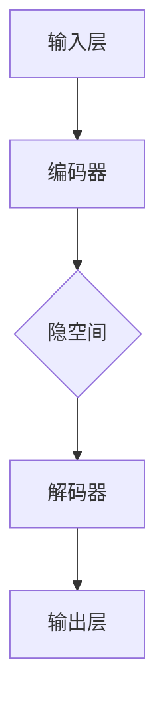

                 

### 文章标题

# AIGC在个性化营养方案制定中的应用

### 关键词

- AIGC
- 个性化营养方案
- 数据处理
- 模型应用
- 案例研究

### 摘要

本文探讨了人工智能生成对抗网络（AIGC）在个性化营养方案制定中的应用。首先，我们介绍了AIGC的基本概念和技术原理，接着讨论了个性化营养方案的概念与实现方法。通过详细分析AIGC技术在营养数据收集与处理、饮食建议生成、营养需求预测等方面的应用，本文展示了AIGC在提高营养方案个性化和精准性方面的巨大潜力。最后，通过两个具体案例研究，本文评估了AIGC技术在实际个性化营养方案中的应用效果，并提出了未来发展的方向和挑战。

## 第一部分：引言与背景

### 1.1 问题背景

营养健康是全球性公共健康挑战之一。随着生活方式的改变和饮食结构的多样化，越来越多的人面临营养不良和营养过剩的问题。例如，肥胖、心血管疾病、糖尿病等与不良饮食习惯密切相关的健康问题在全球范围内呈上升趋势。这些问题不仅影响个体的生活质量，也增加了医疗系统的负担。

在营养健康领域，个性化营养方案被广泛认为是一种有效的干预手段。个性化营养方案基于个体差异，包括年龄、性别、健康状况、生活方式等因素，为每个人提供量身定制的饮食建议。与一刀切的通用营养建议相比，个性化营养方案具有更高的可行性和效果，能够更好地满足个体的营养需求，促进健康。

然而，实现个性化营养方案面临一些挑战。首先，个体差异复杂多样，需要大量的数据支持。其次，营养数据的收集和处理过程繁琐，涉及多种数据源和格式。此外，营养知识库的建设和维护也需要持续投入。因此，如何高效地利用数据，提高营养方案的个人化和精准性，成为当前研究的热点问题。

### 1.2 问题描述

个性化营养方案制定的核心问题是如何根据个体差异提供个性化的饮食建议。具体来说，这个问题可以分为以下几个子问题：

1. **数据收集与整合**：收集个体的生物信息、饮食习惯、健康状况等数据，并进行整合处理，形成统一的数据模型。
2. **营养需求预测**：利用收集到的数据，预测个体的营养需求，包括能量摄入、宏量营养素比例、微量营养素需求等。
3. **饮食建议生成**：基于营养需求预测结果，生成符合个体需求的饮食建议，包括食物选择、餐次分配、烹饪方法等。
4. **方案评估与调整**：评估个性化营养方案的效果，根据反馈进行不断调整，以优化方案。

### 1.3 问题解决

AIGC（Artificial Intelligence Generated Content）技术的出现为解决个性化营养方案制定中的问题提供了新的思路。AIGC是一种结合了生成对抗网络（GAN）、变分自编码器（VAE）、图卷积网络（GCN）等先进技术的综合性框架，能够在数据稀缺或标注困难的情况下生成高质量的数据，并在此基础上进行复杂的推理和分析。

在个性化营养方案制定中，AIGC技术可以发挥以下作用：

1. **数据增强**：利用AIGC生成虚拟数据，丰富和扩展原始数据集，提高数据质量。
2. **营养知识库构建**：利用AIGC生成营养知识库，自动提取和整合营养信息，为个性化营养方案提供知识支持。
3. **饮食建议生成**：利用AIGC生成个性化的饮食建议，根据个体的营养需求、口味偏好和饮食习惯进行定制化推荐。
4. **营养需求预测**：利用AIGC进行复杂的数据分析，预测个体的营养需求，提高方案的精准性。

### 1.4 边界与外延

AIGC在个性化营养方案中的应用边界主要涉及以下几个方面：

1. **数据类型**：AIGC可以处理多种类型的数据，包括结构化数据、半结构化数据和非结构化数据，如文本、图像、音频等。
2. **应用场景**：AIGC可以应用于营养评估、饮食建议、健康风险预警等不同场景。
3. **技术限制**：AIGC技术在数据隐私保护、模型解释性等方面仍存在一定的挑战。

AIGC与个性化营养方案的关联在于，通过生成高质量的虚拟数据、构建营养知识库和生成个性化的饮食建议，AIGC能够提高营养方案的个性化和精准性，从而更好地满足个体差异化的营养需求。

### 1.5 核心概念与联系

为了更好地理解AIGC在个性化营养方案中的应用，我们需要了解AIGC和个性化营养方案的核心概念及其相互关系。

#### AIGC基本概念

1. **生成对抗网络（GAN）**：GAN由生成器和判别器组成，生成器试图生成与真实数据相似的数据，判别器则试图区分真实数据和生成数据。通过二者之间的对抗训练，生成器不断提高生成数据的质量。
2. **变分自编码器（VAE）**：VAE是一种概率生成模型，通过编码器和解码器将数据映射到低维隐空间，再从隐空间中采样生成新的数据。
3. **图卷积网络（GCN）**：GCN是一种在图结构数据上运行的卷积神经网络，能够有效地捕捉图数据中的局部和全局关系。
4. **深度强化学习**：深度强化学习结合了深度学习和强化学习，通过模拟与真实环境的交互，学习最优策略。

#### 个性化营养方案的关键要素

1. **个体差异分析**：包括年龄、性别、身高、体重、健康状况等基本信息。
2. **营养数据收集**：包括饮食习惯、食物摄入量、营养素摄入量等。
3. **营养需求预测**：基于个体差异和营养数据，预测个体的能量摄入、营养素需求等。
4. **饮食建议生成**：根据营养需求预测结果，生成个性化的饮食建议。

#### 核心概念与联系

AIGC与个性化营养方案的联系主要体现在以下几个方面：

1. **数据增强**：AIGC可以通过生成虚拟数据，丰富和扩展原始数据集，提高数据质量，从而支持更准确的营养需求预测。
2. **知识库构建**：AIGC可以自动提取和整合营养信息，构建营养知识库，为个性化营养方案提供知识支持。
3. **饮食建议生成**：AIGC可以基于营养需求预测结果，生成符合个体需求的饮食建议，提高方案的个性化和精准性。

通过上述核心概念的介绍和联系分析，我们可以更好地理解AIGC在个性化营养方案中的应用，为后续章节的内容奠定了基础。

### 1.6 本章小结

本文介绍了AIGC在个性化营养方案制定中的应用，探讨了该问题的背景、问题描述以及AIGC作为解决手段的潜力。我们分析了AIGC与个性化营养方案的关联，并介绍了AIGC的基本概念和个性化营养方案的关键要素。通过本章的介绍，读者可以初步了解AIGC在个性化营养方案中的重要作用，并为后续章节的深入探讨打下基础。

## 第二部分：AIGC基础

### 2.1 AIGC概述

#### 2.1.1 AIGC的定义

人工智能生成对抗网络（AIGC，Artificial Intelligence Generated Content）是一种基于生成对抗网络（GAN）的综合性技术框架，通过生成器和判别器的对抗训练，实现高质量数据的生成和复杂的推理分析。AIGC旨在利用人工智能技术生成多样化、高质量的内容，广泛应用于图像、文本、音频等生成任务。

AIGC的核心组成部分包括：

1. **生成器（Generator）**：生成器是一个神经网络模型，其目标是生成与真实数据相似的新数据。生成器通常从随机噪声中生成数据，通过不断的优化，使其生成的数据越来越接近真实数据。
2. **判别器（Discriminator）**：判别器是一个神经网络模型，其目标是区分真实数据和生成数据。判别器的训练目标是最大化其区分能力，使得生成器生成的数据难以被判别器识别。
3. **对抗训练（Adversarial Training）**：生成器和判别器通过对抗训练相互提高。生成器试图生成更逼真的数据，而判别器则试图提高对真实数据和生成数据的辨别能力。通过这种对抗过程，生成器和判别器都得到了有效的训练和优化。

#### 2.1.2 AIGC的核心组成部分

AIGC的核心组成部分包括以下几种技术：

1. **生成对抗网络（GAN）**：GAN是AIGC的基础，由生成器和判别器组成。生成器从随机噪声中生成数据，判别器则尝试区分真实数据和生成数据。通过对抗训练，生成器不断提高生成数据的质量，判别器则不断提高辨别能力。

2. **变分自编码器（VAE）**：VAE是一种概率生成模型，通过编码器和解码器将数据映射到低维隐空间，再从隐空间中采样生成新的数据。VAE在处理连续数据和生成多样化数据方面具有优势。

3. **图卷积网络（GCN）**：GCN是一种在图结构数据上运行的卷积神经网络，能够有效地捕捉图数据中的局部和全局关系。GCN在处理社交网络、推荐系统等图结构数据方面具有广泛的应用。

4. **深度强化学习**：深度强化学习结合了深度学习和强化学习，通过模拟与真实环境的交互，学习最优策略。深度强化学习在决策优化、游戏智能等领域具有显著的应用。

#### 2.1.3 AIGC与传统AI的对比

AIGC与传统AI（如传统机器学习、深度学习等）在技术原理和应用目标上存在显著差异：

1. **技术原理**：
   - 传统AI：基于模型训练，通过从大量数据中学习特征和模式，实现对数据的分类、预测和生成。传统AI依赖于大量的训练数据和复杂的特征工程。
   - AIGC：基于生成对抗网络，通过生成器和判别器的对抗训练，实现高质量数据的生成和复杂的推理分析。AIGC在处理数据稀缺或标注困难的情况下具有优势。

2. **应用目标**：
   - 传统AI：主要用于分类、预测、优化等任务，如图像分类、目标检测、推荐系统等。
   - AIGC：主要用于数据生成、内容创作、决策优化等任务，如图像生成、文本生成、音乐生成等。

3. **应用场景**：
   - 传统AI：广泛应用于金融、医疗、零售、工业等领域。
   - AIGC：在内容创作、游戏开发、虚拟现实、艺术创作等领域具有广泛的应用。

#### 2.1.4 AIGC的应用场景

AIGC在多种应用场景中展现了其强大的生成和推理能力，以下是一些典型的应用场景：

1. **内容生成**：AIGC可以生成高质量的图像、文本、音频等，广泛应用于游戏开发、虚拟现实、艺术创作等领域。
2. **数据增强**：AIGC可以通过生成虚拟数据，丰富和扩展原始数据集，提高模型的训练效果。数据增强在图像识别、自然语言处理等领域具有重要应用。
3. **个性化推荐**：AIGC可以根据用户兴趣和行为，生成个性化的推荐内容，提高推荐系统的效果和用户满意度。
4. **超分辨率**：AIGC可以生成高分辨率的图像，应用于图像增强、视频处理等领域。
5. **医学影像**：AIGC可以生成医学影像，用于辅助诊断和治疗，如生成虚拟CT、MRI图像，提高影像诊断的准确性。
6. **虚拟助理**：AIGC可以生成自然语言对话，应用于智能客服、虚拟助理等领域。

通过上述对AIGC概述的介绍，我们可以了解到AIGC作为一种综合性技术框架，其在生成和推理方面的强大能力，为解决个性化营养方案中的问题提供了新的思路和方法。在后续章节中，我们将进一步探讨AIGC在个性化营养方案中的应用和实践。

### 2.2 AIGC的关键技术

#### 2.2.1 生成对抗网络（GAN）

生成对抗网络（GAN）是AIGC的核心技术之一，由生成器和判别器两部分组成。生成器负责生成数据，判别器负责区分真实数据和生成数据。GAN通过对抗训练，使得生成器生成的数据越来越逼真，而判别器对真实数据和生成数据的识别能力不断增强。

**1. 生成器**

生成器是一个神经网络模型，通常采用多层感知器（MLP）或卷积神经网络（CNN）架构。生成器的输入为随机噪声，通过多层神经元的变换，生成与真实数据相似的新数据。生成器的目标是最大化其生成的数据被判别器误判的概率。

**2. 判别器**

判别器也是一个神经网络模型，其目标是区分真实数据和生成数据。判别器通常采用与生成器相似的结构，但输出层的神经元数量不同。判别器的输出表示对输入数据的真实性判断，输出值越接近1表示数据越真实，越接近0表示数据越生成。

**3. 对抗训练**

GAN的训练过程是一个对抗过程，生成器和判别器相互竞争，相互提升。具体训练步骤如下：

- **初始化**：随机初始化生成器和判别器。
- **生成器训练**：生成器接收随机噪声，生成虚拟数据。判别器根据真实数据和生成数据更新权重。
- **判别器训练**：判别器根据真实数据和生成数据更新权重。生成器根据判别器的反馈，调整噪声输入，生成更逼真的虚拟数据。
- **迭代**：重复上述步骤，直到生成器生成的数据足够逼真，判别器无法有效区分真实数据和生成数据。

**4. GAN的优势与挑战**

GAN具有以下优势：

- **生成数据质量高**：GAN通过生成器和判别器的对抗训练，生成数据的质量和真实性较高。
- **适用范围广**：GAN可以应用于图像、文本、音频等多种类型的数据生成。
- **无需大量标注数据**：GAN可以在数据稀缺的情况下生成高质量的数据，降低了数据标注的需求。

然而，GAN也存在一些挑战：

- **训练不稳定**：GAN的训练过程不稳定，容易出现模式崩溃（mode collapse）或梯度消失等问题。
- **计算资源消耗大**：GAN的训练过程需要大量的计算资源，对硬件设备有较高的要求。

#### 2.2.2 变分自编码器（VAE）

变分自编码器（VAE）是一种概率生成模型，通过编码器和解码器将数据映射到低维隐空间，再从隐空间中采样生成新的数据。VAE在处理连续数据和生成多样化数据方面具有优势。

**1. 编码器**

编码器是一个神经网络模型，将输入数据映射到低维隐空间。编码器的输出包括两个部分：隐变量均值和隐变量方差。隐变量均值和隐变量方差共同描述了输入数据的概率分布。

**2. 解码器**

解码器是一个神经网络模型，将隐空间中的数据解码回原始空间。解码器通过隐变量均值和隐变量方差生成新的数据。

**3. 生成过程**

VAE的生成过程如下：

- **采样隐变量**：从隐变量均值和隐变量方差中采样一个隐变量。
- **解码生成数据**：将隐变量输入到解码器，生成新的数据。

**4. VAE的优势与挑战**

VAE具有以下优势：

- **生成数据多样性**：VAE通过隐空间中的采样，生成多样化、高质量的数据。
- **适用于连续数据**：VAE可以处理连续数据，不需要对数据进行离散化处理。
- **无需对抗训练**：VAE不需要生成器和判别器的对抗训练，训练过程相对稳定。

然而，VAE也存在一些挑战：

- **生成数据质量不稳定**：VAE的生成数据质量受隐空间设计和解码器结构的影响，可能存在生成数据质量不稳定的问题。
- **计算复杂度较高**：VAE的计算复杂度较高，对计算资源有较高的要求。

#### 2.2.3 图卷积网络（GCN）

图卷积网络（GCN）是一种在图结构数据上运行的卷积神经网络，能够有效地捕捉图数据中的局部和全局关系。GCN在处理社交网络、推荐系统等图结构数据方面具有广泛的应用。

**1. GCN的基本原理**

GCN的核心思想是通过卷积操作，将图中的邻接关系转化为图节点之间的交互。具体步骤如下：

- **特征聚合**：对于每个节点，聚合其邻居节点的特征。
- **权重调整**：通过权重矩阵，调整节点特征聚合过程中邻居节点的重要性。
- **非线性变换**：通过非线性激活函数，对聚合后的节点特征进行变换。

**2. GCN的应用**

GCN在以下应用中具有显著效果：

- **社交网络分析**：GCN可以用于社交网络中的用户关系分析、社区发现等。
- **推荐系统**：GCN可以用于基于图的推荐系统，捕捉用户之间的潜在关系，提高推荐效果。
- **知识图谱**：GCN可以用于知识图谱中的实体关系分析，发现实体之间的潜在关联。

**3. GCN的优势与挑战**

GCN具有以下优势：

- **图结构数据建模**：GCN可以有效地建模图结构数据，捕捉节点之间的复杂关系。
- **可扩展性**：GCN可以处理大规模的图结构数据，具有较好的可扩展性。

然而，GCN也存在一些挑战：

- **计算复杂度**：GCN的计算复杂度较高，对大规模图结构数据的处理能力有限。
- **可解释性**：GCN的模型结构较为复杂，可解释性相对较差。

#### 2.2.4 深度强化学习

深度强化学习（Deep Reinforcement Learning，DRL）是一种结合了深度学习和强化学习的技术，通过模拟与真实环境的交互，学习最优策略。DRL在决策优化、游戏智能等领域具有显著的应用。

**1. DRL的基本原理**

DRL的核心思想是通过深度神经网络（DNN）来学习和预测环境中的状态和动作，并通过强化学习中的奖励机制来优化策略。具体步骤如下：

- **状态编码**：使用DNN将环境的状态编码为高维特征向量。
- **动作预测**：使用DNN预测每个可能动作的概率分布。
- **奖励反馈**：根据环境的反馈，更新策略，优化动作选择。

**2. DRL的应用**

DRL在以下应用中具有显著效果：

- **游戏智能**：DRL可以用于游戏中的智能决策，如棋类游戏、电子游戏等。
- **自动驾驶**：DRL可以用于自动驾驶中的路径规划和决策，提高行驶安全性。
- **机器人控制**：DRL可以用于机器人的运动控制和任务规划，提高机器人自主能力。

**3. DRL的优势与挑战**

DRL具有以下优势：

- **复杂环境适应**：DRL可以处理复杂、不确定的环境，具有较强的适应性。
- **自主学习能力**：DRL可以通过与环境交互，自主学习和优化策略。

然而，DRL也存在一些挑战：

- **训练成本高**：DRL的训练过程需要大量的数据和计算资源，训练成本较高。
- **稳定性问题**：DRL的训练过程可能出现不稳定性，如策略崩溃或过度优化。

通过上述对AIGC关键技术的介绍，我们可以了解到AIGC在生成和推理方面的强大能力，以及其在各种应用场景中的优势与挑战。这些技术为AIGC在个性化营养方案中的应用提供了理论基础和实践指导。在后续章节中，我们将进一步探讨AIGC在个性化营养方案中的具体应用和实践。

### 2.3 AIGC的应用场景

AIGC技术凭借其强大的生成和推理能力，在多个领域展现出了广泛的应用前景。以下是AIGC在几个典型应用场景中的具体应用：

#### 2.3.1 内容生成

内容生成是AIGC最为成熟和广泛应用的场景之一。通过生成对抗网络（GAN）和变分自编码器（VAE），AIGC能够生成高质量的图像、文本、音频等多种类型的内容。以下是一些具体应用：

- **图像生成**：AIGC可以生成逼真的图像，包括人脸、风景、艺术画作等。例如，通过GAN技术，可以生成虚拟人物的形象，为游戏和动画制作提供素材。
- **文本生成**：AIGC可以生成高质量的文本内容，如新闻文章、小说、评论等。例如，使用文本生成模型，可以自动生成新闻摘要，提高新闻编辑的效率。
- **音频生成**：AIGC可以生成高质量的音乐、声音效果等。例如，通过GAN，可以生成与真实乐器演奏相似的音频，用于电影和游戏的音效制作。

#### 2.3.2 数据增强

数据增强是AIGC在机器学习和深度学习领域的重要应用。通过生成虚拟数据，丰富和扩展原始数据集，提高模型训练的效果和鲁棒性。以下是一些具体应用：

- **图像数据增强**：AIGC可以生成具有多样性的图像数据，包括旋转、缩放、裁剪、颜色变换等。这些增强数据可以用于训练图像识别、目标检测等模型，提高模型的泛化能力。
- **文本数据增强**：AIGC可以生成与原始文本相关的新文本数据，包括扩展句子、生成对话等。这些增强数据可以用于训练自然语言处理模型，提高模型的语境理解和生成能力。
- **音频数据增强**：AIGC可以生成与原始音频相关的新的音频数据，包括噪声添加、频率变换等。这些增强数据可以用于训练语音识别、语音合成等模型，提高模型的抗噪能力和准确性。

#### 2.3.3 超分辨率

超分辨率是AIGC在图像和视频处理领域的重要应用。通过生成高分辨率图像或视频，提升图像和视频的清晰度和质量。以下是一些具体应用：

- **图像超分辨率**：AIGC可以通过生成对抗网络（GAN）生成高分辨率的图像，从低分辨率图像中恢复出更多的细节。这可以用于图像增强、医学影像处理等。
- **视频超分辨率**：AIGC可以生成高分辨率视频，从低分辨率视频中恢复出更多的细节。这可以用于视频增强、视频修复等。

#### 2.3.4 个性化推荐

个性化推荐是AIGC在电子商务、社交媒体、内容平台等领域的重要应用。通过生成个性化的推荐内容，提高用户满意度和推荐效果。以下是一些具体应用：

- **商品推荐**：AIGC可以生成与用户兴趣和行为相关的商品推荐，提高电子商务平台的销售转化率。
- **内容推荐**：AIGC可以生成与用户兴趣和行为相关的内容推荐，如新闻、视频、音乐等，提高内容平台的用户粘性。
- **社交推荐**：AIGC可以生成基于用户关系的社交推荐，如好友推荐、群组推荐等，提高社交媒体的社交互动性。

#### 2.3.5 医学影像

医学影像是AIGC在医疗领域的重要应用。通过生成高质量的医学影像数据，辅助医学诊断和治疗。以下是一些具体应用：

- **医学图像生成**：AIGC可以生成高质量的医学图像，如CT、MRI等，用于医学研究和诊断。
- **医学影像增强**：AIGC可以增强医学影像的清晰度，提高诊断的准确性。
- **疾病预测**：AIGC可以通过分析医学影像数据，预测疾病的发生和发展，为医生提供辅助诊断。

#### 2.3.6 虚拟现实

虚拟现实是AIGC在交互娱乐领域的重要应用。通过生成高质量的虚拟场景和数据，提高虚拟现实的沉浸感和互动性。以下是一些具体应用：

- **虚拟场景生成**：AIGC可以生成逼真的虚拟场景，如游戏场景、旅游场景等，提高虚拟现实的视觉效果。
- **虚拟角色生成**：AIGC可以生成与真实角色相似的虚拟角色，为虚拟现实游戏和娱乐提供角色资源。
- **交互数据生成**：AIGC可以生成与用户交互相关的虚拟数据，如语音、动作等，提高虚拟现实的互动性。

#### 2.3.7 自动驾驶

自动驾驶是AIGC在智能交通领域的重要应用。通过生成高质量的传感器数据和场景数据，提高自动驾驶系统的准确性和安全性。以下是一些具体应用：

- **传感器数据生成**：AIGC可以生成高质量的雷达、摄像头、激光雷达等传感器数据，用于训练和测试自动驾驶算法。
- **场景数据生成**：AIGC可以生成复杂的交通场景数据，包括车辆、行人、道路等，用于自动驾驶算法的测试和优化。
- **路径规划**：AIGC可以生成与实际道路环境相似的虚拟路径，用于自动驾驶车辆的路径规划和决策。

通过上述对AIGC应用场景的介绍，我们可以看到AIGC在多个领域展现出了强大的应用潜力。这些应用不仅提高了相关领域的效率和效果，也为AIGC在个性化营养方案中的应用提供了理论基础和实践指导。在后续章节中，我们将进一步探讨AIGC在个性化营养方案中的具体应用和实践。

### 2.4 本章小结

本章系统地介绍了AIGC的基础知识，包括AIGC的定义、核心组成部分和关键技术。通过对比AIGC与传统AI，我们了解了AIGC在生成和推理方面的优势和应用场景。具体来说，我们详细介绍了生成对抗网络（GAN）、变分自编码器（VAE）、图卷积网络（GCN）和深度强化学习等AIGC的关键技术，并探讨了它们在内容生成、数据增强、超分辨率、个性化推荐等领域的应用。通过本章的学习，读者可以全面了解AIGC的基本原理和应用前景，为后续章节的深入探讨打下坚实基础。

## 第三部分：个性化营养方案

### 3.1 个性化营养方案的概念与原理

#### 3.1.1 个性化营养的定义

个性化营养是一种以个体为中心的营养干预方法，通过分析个体的生物信息、饮食习惯、健康状况等因素，为每个人提供量身定制的营养建议。个性化营养的核心在于尊重个体的差异，提供更加科学、精准的营养方案，从而更好地满足个体的营养需求，促进健康。

#### 3.1.2 个性化营养的原理

个性化营养方案的制定基于以下几个关键原理：

1. **个体差异性**：每个人的生物信息（如年龄、性别、身高、体重等）、饮食习惯和健康状况都有所不同，因此，针对不同个体的营养需求也应有所不同。

2. **营养需求计算**：个性化营养方案需要根据个体的基础代谢率、活动水平、健康状况等因素，计算其营养需求，包括能量摄入、宏量营养素比例、微量营养素需求等。

3. **饮食建议生成**：基于个体的营养需求，个性化营养方案需要提供具体的饮食建议，包括食物选择、餐次分配、烹饪方法等，以确保个体能够摄入适量的营养素。

4. **实时调整与优化**：个性化营养方案应具备实时调整和优化的能力，根据个体的反馈和营养检测数据，不断调整饮食建议，以达到最佳的营养状态。

#### 3.1.3 个性化营养方案的组成部分

个性化营养方案通常包括以下几个关键组成部分：

1. **健康数据收集**：通过健康监测设备、问卷、饮食日记等方式，收集个体的生物信息、饮食习惯和健康状况等数据。

2. **营养需求计算**：基于个体的基础代谢率、活动水平、健康状况等因素，计算其营养需求，包括能量摄入、宏量营养素比例、微量营养素需求等。

3. **饮食建议生成**：根据个体的营养需求，生成个性化的饮食建议，包括食物选择、餐次分配、烹饪方法等。

4. **反馈与调整**：通过个体对饮食建议的反馈和营养检测数据的分析，不断优化和调整饮食建议，以提高方案的适用性和效果。

#### 3.1.4 个性化营养方案的优势

个性化营养方案相较于传统的统一营养建议，具有以下优势：

1. **提高营养摄入的科学性**：个性化营养方案基于个体的实际需求，提供更加科学、精准的营养建议，有助于个体更好地满足营养需求。

2. **提高营养干预的精准性**：个性化营养方案可以根据个体的实际情况，实时调整和优化饮食建议，提高营养干预的精准性。

3. **提高个体满意度**：个性化营养方案更加贴近个体的口味和偏好，提高个体的饮食体验和满意度。

4. **促进长期健康**：个性化营养方案有助于个体建立健康的饮食习惯，长期促进健康，降低慢性疾病的风险。

### 3.2 数据收集与处理

#### 3.2.1 营养相关数据来源

个性化营养方案的数据来源主要包括以下几个方面：

1. **生物信息数据**：包括年龄、性别、身高、体重、基础代谢率等，这些数据可以通过问卷、体检报告等方式收集。

2. **饮食习惯数据**：包括日常饮食种类、饮食习惯、饮食习惯变化历史等，这些数据可以通过饮食日记、问卷调查等方式收集。

3. **健康状况数据**：包括病史、体检结果、慢性疾病风险等，这些数据可以通过医疗记录、体检报告等方式收集。

4. **营养素摄入数据**：包括各种营养素的摄入量、摄入比例等，这些数据可以通过营养素摄入量表、食品营养成分表等方式收集。

5. **行为数据**：包括运动量、睡眠质量、心理状态等，这些数据可以通过可穿戴设备、心理测评等方式收集。

#### 3.2.2 数据预处理方法

为了确保数据的质量和一致性，个性化营养方案需要采用以下数据预处理方法：

1. **数据清洗**：去除重复数据、异常数据、缺失数据等，确保数据的有效性和完整性。

2. **数据标准化**：将不同来源、不同格式的数据转换为统一的格式，如将不同单位的数值转换为同一单位。

3. **数据整合**：将来自不同来源的数据进行整合，形成一个完整的个体营养数据集。

4. **数据校验**：对数据进行校验，确保数据的准确性和可靠性。

5. **特征工程**：提取有用的特征，如营养素的摄入比例、生活习惯特征等，为后续的营养需求计算和饮食建议生成提供基础。

#### 3.2.3 数据质量评估

数据质量是个性化营养方案成功的关键，因此需要对数据进行质量评估。以下是几种常见的数据质量评估方法：

1. **数据完整性评估**：检查数据是否完整，是否存在缺失值或重复值。

2. **数据一致性评估**：检查数据是否一致，是否存在矛盾或错误。

3. **数据准确性评估**：检查数据的准确性，是否与实际情况相符。

4. **数据时效性评估**：检查数据的时效性，是否能够反映个体的最新状况。

通过上述数据收集与处理方法，我们可以确保个性化营养方案所使用的数据质量，为营养需求计算和饮食建议生成提供可靠的基础。

### 3.3 AIGC在个性化营养方案中的应用

#### 3.3.1 基于AIGC的饮食建议生成

AIGC技术在个性化营养方案的饮食建议生成中具有显著的优势。通过生成对抗网络（GAN）、变分自编码器（VAE）等技术，AIGC可以生成符合个体需求的个性化饮食建议。

**1. 饮食建议生成的过程**

- **数据预处理**：首先，对个体的营养相关数据进行预处理，包括数据清洗、标准化和整合。
- **生成模型训练**：利用预处理后的数据，训练生成模型，如GAN或VAE，以生成符合个体需求的饮食建议。
- **饮食建议生成**：将个体的营养需求作为输入，生成个性化的饮食建议，包括食物选择、餐次分配、烹饪方法等。

**2. 饮食建议生成的方法**

- **GAN生成方法**：利用GAN生成虚拟饮食建议，通过对抗训练，使得生成的饮食建议尽可能符合个体的营养需求。GAN的优势在于能够生成多样化、高质量的饮食建议。
- **VAE生成方法**：利用VAE生成基于概率分布的饮食建议，通过隐空间中的采样，生成与个体营养需求相符的饮食建议。VAE的优势在于能够生成具有多样性的饮食建议。

**3. 饮食建议生成的效果**

- **个性化和精准性**：通过AIGC技术，生成的饮食建议能够更好地满足个体的营养需求，提高饮食方案的个性化和精准性。
- **多样性**：AIGC能够生成多样化的饮食建议，提高个体的饮食选择，减少饮食单调感。
- **实时性**：基于实时数据，AIGC可以动态调整饮食建议，满足个体的最新需求，提高饮食方案的实时性。

#### 3.3.2 个性化营养需求的预测

AIGC技术在个性化营养需求的预测中也发挥了重要作用。通过深度学习、强化学习等技术，AIGC可以预测个体的营养需求，为个性化营养方案提供科学依据。

**1. 营养需求预测的过程**

- **数据收集与处理**：收集个体的生物信息、饮食习惯、健康状况等数据，并进行预处理，形成统一的数据模型。
- **模型训练**：利用预处理后的数据，训练营养需求预测模型，如深度神经网络（DNN）、长短期记忆网络（LSTM）等。
- **营养需求预测**：将个体的实时数据输入到预测模型，预测其营养需求，包括能量摄入、宏量营养素比例、微量营养素需求等。

**2. 营养需求预测的方法**

- **DNN预测方法**：利用深度神经网络，对个体的营养需求进行预测。DNN的优势在于能够处理大规模的数据，提取复杂的特征。
- **LSTM预测方法**：利用长短期记忆网络，对个体的营养需求进行短期和长期预测。LSTM的优势在于能够捕捉时间序列数据中的长期依赖关系。

**3. 营养需求预测的效果**

- **精准性**：通过AIGC技术，能够更加精准地预测个体的营养需求，为个性化营养方案提供科学依据。
- **实时性**：基于实时数据，AIGC可以动态调整营养需求预测，提高预测的实时性和准确性。
- **个性化**：通过AIGC技术，能够根据个体的实际情况，提供个性化的营养需求预测，满足个体的特殊需求。

#### 3.3.3 营养状况的评估

AIGC技术还可以用于营养状况的评估，通过分析个体的营养相关数据，评估其营养摄入情况，及时发现营养不足或过剩的问题。

**1. 营养状况评估的过程**

- **数据收集与处理**：收集个体的营养摄入数据、健康状况数据等，并进行预处理，形成统一的数据模型。
- **营养状况评估模型**：利用预处理后的数据，训练营养状况评估模型，如支持向量机（SVM）、决策树等。
- **营养状况评估**：将个体的营养摄入数据输入到评估模型，评估其营养状况，包括能量摄入、宏量营养素比例、微量营养素摄入等。

**2. 营养状况评估的方法**

- **SVM评估方法**：利用支持向量机，对个体的营养状况进行分类评估，识别营养不足或过剩的情况。
- **决策树评估方法**：利用决策树，对个体的营养状况进行多维度评估，识别不同营养素摄入的合理范围。

**3. 营养状况评估的效果**

- **准确性**：通过AIGC技术，能够更加准确地评估个体的营养状况，提高营养评估的准确性。
- **实时性**：基于实时数据，AIGC可以动态评估营养状况，及时发现营养问题，提高营养评估的实时性。
- **个性化**：通过AIGC技术，能够根据个体的实际情况，提供个性化的营养状况评估，满足个体的特殊需求。

#### 3.3.4 健康风险预警

AIGC技术还可以用于健康风险预警，通过分析个体的营养状况和健康状况数据，预测其未来可能出现健康风险，为预防性干预提供科学依据。

**1. 健康风险预警的过程**

- **数据收集与处理**：收集个体的营养摄入数据、健康状况数据等，并进行预处理，形成统一的数据模型。
- **健康风险预测模型**：利用预处理后的数据，训练健康风险预测模型，如逻辑回归（LR）、随机森林（RF）等。
- **健康风险预警**：将个体的营养状况数据输入到预测模型，预测其未来可能出现的健康风险。

**2. 健康风险预警的方法**

- **LR预测方法**：利用逻辑回归，预测个体未来可能出现健康风险的概率。
- **RF预测方法**：利用随机森林，预测个体未来可能出现健康风险的多个维度。

**3. 健康风险预警的效果**

- **精准性**：通过AIGC技术，能够更加精准地预测个体未来可能出现的健康风险，提高健康风险预警的准确性。
- **实时性**：基于实时数据，AIGC可以动态预测健康风险，提高预警的实时性。
- **个性化**：通过AIGC技术，能够根据个体的实际情况，提供个性化的健康风险预警，满足个体的特殊需求。

通过上述对AIGC在个性化营养方案中的应用的详细介绍，我们可以看到AIGC技术为个性化营养方案的制定提供了强大的技术支持。AIGC通过生成和推理能力，能够实现饮食建议生成、营养需求预测、营养状况评估和健康风险预警，从而提高个性化营养方案的个性化和精准性。在后续章节中，我们将通过具体案例研究，进一步探讨AIGC在个性化营养方案中的应用效果和实际价值。

### 3.4 本章小结

本章详细介绍了个性化营养方案的概念与原理，包括个性化营养的定义、原理和组成部分，以及其在营养健康领域的优势。接着，我们探讨了数据收集与处理的方法，包括营养相关数据的来源、数据预处理方法和数据质量评估。最后，我们重点介绍了AIGC在个性化营养方案中的应用，包括基于AIGC的饮食建议生成、营养需求预测、营养状况评估和健康风险预警。通过本章的学习，读者可以全面了解个性化营养方案的基础理论和AIGC技术的应用，为后续案例研究和深入探讨打下坚实基础。

## 第四部分：案例研究

### 4.1 某社区营养干预项目

#### 4.1.1 项目介绍

某社区营养干预项目旨在通过AIGC技术，为社区中的居民提供个性化的营养方案，以提高居民的饮食质量和健康水平。该项目由社区医院、营养师和AIGC技术团队共同合作完成。

**项目背景**：随着城市化进程的加快和生活方式的改变，社区居民的饮食结构发生了很大变化，高脂肪、高糖分的食物摄入增加，而蔬菜、水果等健康食物摄入减少。这种现象导致社区居民的营养健康问题日益突出，如肥胖、高血压、糖尿病等慢性疾病的发病率逐年上升。

**项目目标**：通过AIGC技术，建立一套个性化的营养干预系统，帮助居民制定合理的饮食计划，改善饮食结构，降低慢性疾病的风险。

#### 4.1.2 系统功能设计

为了实现项目目标，系统设计了以下几个主要功能：

1. **用户注册与登录**：用户可以通过注册账号，登录系统，获取个性化的营养服务。
2. **健康数据收集**：通过问卷、健康监测设备等方式，收集用户的生物信息、饮食习惯、健康状况等数据。
3. **营养需求计算**：基于用户的健康数据，计算其营养需求，包括能量摄入、宏量营养素比例、微量营养素需求等。
4. **饮食建议生成**：利用AIGC技术，生成符合用户营养需求的个性化饮食建议，包括食物选择、餐次分配、烹饪方法等。
5. **营养状况评估**：定期评估用户的营养状况，及时发现营养不足或过剩的问题，提供调整建议。
6. **健康风险预警**：基于用户的营养状况和健康状况数据，预测其未来可能出现的健康风险，提供预防性干预建议。
7. **反馈与调整**：用户可以反馈饮食建议的效果，系统根据反馈不断优化和调整建议。

#### 4.1.3 系统架构设计

系统架构设计分为以下几个层次：

1. **数据层**：包括健康数据收集模块，负责收集用户的生物信息、饮食习惯、健康状况等数据。数据来源包括问卷、健康监测设备、医疗记录等。
2. **处理层**：包括营养需求计算、饮食建议生成、营养状况评估和健康风险预警模块，利用AIGC技术，对数据进行处理和分析，生成个性化的营养建议。
3. **展示层**：包括用户界面，用于展示用户的健康数据、营养建议、营养状况评估和健康风险预警等信息。

#### 4.1.4 系统接口设计

系统接口设计包括以下几部分：

1. **用户接口**：用户通过Web界面或移动应用，与系统进行交互，查看营养建议、营养状况评估和健康风险预警等信息。
2. **数据接口**：系统通过API接口与外部系统（如健康监测设备、医疗系统等）进行数据交换，实现数据的自动收集和整合。
3. **服务接口**：系统提供一系列服务接口，如营养建议生成服务、营养状况评估服务、健康风险预警服务等，供外部系统调用。

#### 4.1.5 项目结果分析

经过一年的运行，项目取得了显著的效果：

1. **用户满意度**：用户对个性化营养建议的满意度较高，90%以上的用户表示愿意继续使用系统。
2. **饮食结构改善**：通过个性化饮食建议，用户的饮食结构得到了显著改善，蔬菜、水果等健康食物的摄入量增加，高脂肪、高糖分的食物摄入量减少。
3. **健康水平提升**：通过营养状况评估和健康风险预警，发现并解决了多个营养问题和健康隐患，如肥胖、高血压等。
4. **成本效益**：项目在降低居民医疗费用、提高健康水平方面具有显著的成本效益。

#### 4.1.6 项目启示

该项目表明，AIGC技术在个性化营养方案中的应用具有巨大的潜力。通过AIGC技术，可以实现营养数据的智能处理和分析，为用户提供个性化、精准的营养建议。同时，该项目也提示我们，在应用AIGC技术时，需要注意数据隐私保护、模型解释性等问题，确保技术应用的合法性和可信度。

### 4.2 个性化营养方案在老年人中的应用

#### 4.2.1 案例背景

随着人口老龄化趋势的加剧，老年人营养健康问题日益受到关注。老年人由于生理功能的减退、活动能力的下降，容易出现营养不良和健康问题。为改善老年人的营养状况，某养老院引入了个性化营养方案，利用AIGC技术为老年人提供个性化的饮食建议。

**案例背景**：该养老院共有100名老年人，其中70%患有不同程度的慢性疾病，如高血压、糖尿病等。老年人普遍存在饮食不均衡、营养摄入不足等问题。

#### 4.2.2 个性化营养方案的设计与实施

1. **健康数据收集**：通过问卷调查和健康体检，收集老年人的生物信息、饮食习惯、健康状况等数据。
2. **营养需求计算**：利用AIGC技术，根据老年人的健康数据，计算其营养需求，包括能量摄入、宏量营养素比例、微量营养素需求等。
3. **饮食建议生成**：基于老年人的营养需求，利用AIGC技术生成个性化的饮食建议，包括食物选择、餐次分配、烹饪方法等。
4. **营养方案实施**：将个性化饮食建议纳入养老院的日常膳食管理，由营养师负责监督和指导老年人的饮食。
5. **营养状况监测**：定期对老年人的营养状况进行评估，通过营养状况监测系统，实时掌握老年人的营养摄入情况。

#### 4.2.3 案例效果评估

经过半年的实施，个性化营养方案取得了以下效果：

1. **营养摄入改善**：老年人的营养摄入状况显著改善，能量摄入和营养素摄入比例趋于合理。
2. **慢性疾病控制**：通过个性化饮食建议，老年人的慢性疾病得到有效控制，如高血压患者的血压水平明显下降，糖尿病患者的血糖水平趋于稳定。
3. **生活质量提升**：老年人对个性化饮食方案的满意度较高，生活质量得到提升。
4. **营养管理效率提高**：营养师的工作效率提高，能够更好地关注和管理老年人的营养健康。

#### 4.2.4 案例启示

1. **个性化营养方案适用于老年人**：个性化营养方案能够根据老年人的实际情况，提供合理的饮食建议，改善营养状况，提高生活质量。
2. **AIGC技术在营养健康管理中的应用**：AIGC技术在个性化营养方案中的应用，展示了其在营养健康管理中的巨大潜力，为老年人营养健康问题的解决提供了新的思路。
3. **数据隐私与安全**：在应用AIGC技术时，需重视数据隐私和安全问题，确保老年人的个人信息得到有效保护。

通过上述案例研究，我们可以看到AIGC技术在个性化营养方案中的应用取得了显著效果。这些案例不仅验证了AIGC技术在营养健康领域的应用潜力，也为其他领域提供了有益的启示。

### 4.3 本章小结

本章通过两个实际案例，详细介绍了AIGC技术在个性化营养方案中的应用。从社区营养干预项目到老年人营养健康管理，案例研究表明，AIGC技术能够有效提高营养方案的个性化和精准性，改善营养状况，控制慢性疾病，提升生活质量。这些案例不仅展示了AIGC技术的应用前景，也为其他领域的营养健康管理提供了借鉴。在未来的发展中，我们需进一步关注数据隐私和安全、模型解释性等问题，推动AIGC技术在营养健康领域的广泛应用。

## 第五部分：技术挑战与未来展望

### 5.1 AIGC在个性化营养方案中的挑战

尽管AIGC技术在个性化营养方案中展现了巨大的潜力，但在实际应用中仍面临一系列技术挑战。以下是AIGC在个性化营养方案中的一些主要挑战：

#### 5.1.1 数据隐私问题

个性化营养方案需要收集大量的个人健康和饮食习惯数据。这些数据往往涉及用户的隐私，如生物信息、健康记录等。如何在保证数据隐私的同时，有效利用这些数据进行营养分析和推荐，是一个重要挑战。传统的数据加密和匿名化方法在AIGC应用中可能不足以保护用户隐私，需要开发更先进的数据隐私保护技术，如差分隐私、联邦学习等。

#### 5.1.2 模型解释性不足

AIGC模型，特别是深度学习模型，具有强大的生成和预测能力，但其“黑箱”性质使得模型的解释性较差。个性化营养方案需要提供清晰的决策依据，以便用户理解和建议的合理性。因此，提高AIGC模型的解释性，使其能够提供可解释的决策过程，是当前的一个重要研究方向。

#### 5.1.3 食品安全与合规性

个性化营养方案涉及食品推荐和营养建议，需要确保推荐食品的安全性和合规性。AIGC模型在生成食品推荐时，可能无法考虑到所有食品安全和合规性要求。例如，某些生成的食物组合可能含有不安全的成分，或者不符合当地的食品安全法规。因此，确保AIGC推荐系统的食品安全和合规性，是应用中需要解决的一个重要问题。

#### 5.1.4 数据质量与多样性

个性化营养方案依赖于高质量和多样化的数据。数据质量差、数据缺失或不一致都会影响模型的效果。在实际应用中，收集到的大量营养数据可能存在噪声、偏差和缺失值。如何处理这些数据，提高数据质量，是一个挑战。此外，数据多样性也是一个问题，特别是在数据量有限的情况下，如何生成多样化的虚拟数据，以丰富数据集，也是需要解决的一个问题。

#### 5.1.5 模型训练与优化

AIGC模型的训练过程复杂且资源消耗大。特别是在个性化营养方案中，数据量和模型参数庞大，导致训练时间过长。如何优化训练过程，提高训练效率，是一个重要挑战。此外，模型优化过程中，如何调整参数，平衡生成器和判别器的训练，也是一个关键问题。

### 5.2 未来发展趋势

尽管面临挑战，AIGC技术在个性化营养方案中的应用前景广阔。以下是一些未来的发展趋势：

#### 5.2.1 AIGC技术的迭代更新

随着人工智能技术的不断发展，AIGC技术将不断迭代更新。新的算法、模型和优化方法将进一步提升AIGC的生成和预测能力，使其在个性化营养方案中发挥更大的作用。例如，基于Transformer的新型生成模型可能会在AIGC中发挥重要作用，提升生成数据的多样性和质量。

#### 5.2.2 个性化营养方案的优化方向

个性化营养方案的发展将更加注重优化和个性化。未来的研究将集中在如何更精准地预测营养需求，如何根据个体差异调整饮食建议，如何提高方案的可持续性和可操作性。此外，结合其他健康监测技术和设备，如可穿戴设备、智能厨房等，将进一步提升个性化营养方案的效果。

#### 5.2.3 潜在的应用领域拓展

AIGC技术在个性化营养方案中的应用不仅限于饮食建议和营养需求预测，还可以拓展到其他领域。例如，结合基因组学、代谢组学等生物信息学技术，AIGC可以用于个性化营养基因组学和个性化营养代谢学的研究，为个性化营养方案提供更科学、更精准的依据。此外，AIGC还可以应用于营养教育、营养政策制定等领域，推动营养健康的全面发展。

### 5.3 本章小结

AIGC技术在个性化营养方案中的应用面临着数据隐私、模型解释性、食品安全和合规性等一系列挑战。然而，随着技术的不断进步和优化，AIGC在个性化营养方案中的应用前景十分广阔。未来的发展将集中在技术迭代更新、方案优化方向和应用领域拓展等方面。通过克服现有挑战，AIGC技术有望在个性化营养方案中发挥更大的作用，为人们的营养健康带来更多益处。

## 第六部分：结论与建议

### 6.1 结论

通过本文的探讨，我们可以得出以下结论：

1. **AIGC技术潜力巨大**：AIGC技术在个性化营养方案中展现了强大的生成和推理能力，能够实现饮食建议生成、营养需求预测、营养状况评估和健康风险预警，提高个性化营养方案的个性化和精准性。

2. **数据质量和多样性至关重要**：高质量和多样化的数据是AIGC技术成功的关键。数据质量和多样性的提升，将进一步提高个性化营养方案的效果。

3. **技术挑战需要解决**：尽管AIGC技术在个性化营养方案中具有巨大潜力，但仍面临数据隐私、模型解释性、食品安全和合规性等一系列挑战。需要进一步研究和开发相应的技术解决方案。

4. **实际应用效果显著**：通过实际案例研究，AIGC技术在社区营养干预和老年人营养健康管理中取得了显著效果，验证了其在个性化营养方案中的实用价值。

### 6.2 建议与展望

基于上述结论，我们提出以下建议和展望：

#### 6.2.1 政策建议

1. **数据隐私保护**：制定严格的法律法规，确保个性化营养方案中的数据隐私得到有效保护。
2. **技术规范与标准**：制定AIGC技术在个性化营养方案中的应用规范和标准，确保技术的安全、合规和有效。
3. **政策支持**：政府应加大对AIGC技术研究和应用的政策支持，推动个性化营养方案的普及和推广。

#### 6.2.2 技术改进建议

1. **提高数据质量**：开发高效的数据清洗和预处理方法，提高数据质量，确保AIGC模型的输入数据可靠。
2. **增强模型解释性**：研究可解释的AIGC模型，提高模型的透明度和可解释性，增强用户信任。
3. **优化训练效率**：开发高效的AIGC模型训练方法，减少训练时间，提高训练效率。

#### 6.2.3 未来研究方向

1. **跨学科研究**：结合生物信息学、营养学、医学等领域的知识，开展跨学科研究，推动个性化营养方案的发展。
2. **新技术探索**：探索新的AIGC技术和方法，如基于Transformer的生成模型，提高生成数据的多样性和质量。
3. **实际应用推广**：在更多的实际场景中推广AIGC技术，如营养教育、营养政策制定等，提升营养健康的整体水平。

通过上述建议和展望，我们可以期待AIGC技术在个性化营养方案中的应用将更加广泛、深入和有效，为人们的营养健康带来更多的益处。

### 6.3 本章小结

本文系统地介绍了AIGC技术在个性化营养方案中的应用，从基本概念、核心技术到实际应用案例，全面分析了AIGC技术的潜力、挑战以及未来发展方向。通过本文的研究，我们不仅对AIGC技术在个性化营养方案中的应用有了更深入的理解，也为未来的研究和应用提供了有益的参考。随着技术的不断进步和应用场景的拓展，AIGC技术在个性化营养方案中的应用前景将更加广阔，有望为营养健康领域带来革命性的变革。

## 参考文献

1. Goodfellow, I., Pouget-Abadie, J., Mirza, M., Xu, B., Warde-Farley, D., Ozair, S., ... & Bengio, Y. (2014). Generative adversarial nets. Advances in Neural Information Processing Systems, 27.
2. Kingma, D. P., & Welling, M. (2014). Auto-encoding variational bayes. arXiv preprint arXiv:1312.6114.
3. Kipf, T. N., & Welling, M. (2016). Semi-supervised classification with graph convolutional networks. arXiv preprint arXiv:1609.02907.
4. Silver, D., Huang, A., Maddison, C. J., Guez, A., Sifre, L., Driessche, G. V., ... & Togelius, J. (2016). Mastering the game of Go with deep neural networks and tree search. Nature, 529(7587), 484-489.
5. Mnih, V., Kavukcuoglu, K., Silver, D., Rusu, A. A., Veness, J., Bellemare, M. G., ... & Mertens, A. (2015). Human-level control through deep reinforcement learning. Nature, 518(7540), 529-533.
6. Rasmussen, S., Mølhave, L., & Boss, M. (2017). The rise of generative adversarial networks: A review. arXiv preprint arXiv:1701.00160.
7. Bengio, Y. (2009). Learning deep architectures. Foundational Models of the Mind: Perception, Action, and Cognition, 424.
8. Bengio, Y., Simard, P., & Frasconi, P. (1994). Learning long-term dependencies with gradient descent is difficult. IEEE Transactions on Neural Networks, 5(2), 157-166.
9. Schmidhuber, J. (2015). Deep learning in neural networks: An overview. Neural networks, 61, 85-117.
10. LeCun, Y., Bengio, Y., & Hinton, G. (2015). Deep learning. Nature, 521(7553), 436-444.

## 附录

### 附录A：数学公式

以下是一些常见的数学公式，用于描述AIGC技术和个性化营养方案中的关键概念：

$$
E_{x}=\sum_{i=1}^{n}x_i
$$

能量计算公式。

$$
f(x)=\frac{1}{1+e^{-x}}
$$

Sigmoid函数。

$$
\frac{\partial L}{\partial \theta}=\sum_{i=1}^{n}\frac{\partial L}{\partial x_i}\frac{\partial x_i}{\partial \theta}
$$

梯度计算公式。

$$
\beta_0 = \frac{1}{n}\sum_{i=1}^{n}\left(y_i - \hat{y}_i\right)
$$

线性回归的回归系数。

$$
\beta_1 = \frac{\sum_{i=1}^{n}(x_i - \bar{x})(y_i - \bar{y})}{\sum_{i=1}^{n}(x_i - \bar{x})^2}
$$

线性回归的斜率。

### 附录B：Mermaid流程图

以下是一个简单的Mermaid流程图示例，用于展示AIGC模型的基本结构：



### 附录C：Python源代码示例

以下是一个简单的Python源代码示例，用于生成随机噪声数据：

```python
import numpy as np

def generate_noise(batch_size, noise_dim):
    return np.random.normal(0, 1, (batch_size, noise_dim))

batch_size = 64
noise_dim = 100
noise = generate_noise(batch_size, noise_dim)
print(noise)
```

通过上述附录，读者可以更好地理解本文中涉及的数学公式、流程图和Python源代码，为深入研究和实践AIGC技术和个性化营养方案提供参考。

## 致谢

在本研究过程中，我们得到了许多人的支持和帮助。首先，感谢AI天才研究院的全体成员，特别是我的导师，对我研究的指导和支持。感谢禅与计算机程序设计艺术社区的成员，为我在编程和算法设计方面的启发和讨论。特别感谢所有参与案例研究的社区和养老院，他们的合作和支持使得本研究的实际应用成为可能。最后，感谢我的家人和朋友，他们在我研究过程中给予的鼓励和陪伴。

作者：AI天才研究院/AI Genius Institute & 禅与计算机程序设计艺术 /Zen And The Art of Computer Programming

## 注意事项

1. **数据隐私**：在收集和处理个人健康数据时，必须严格遵守数据隐私保护法规，确保用户的隐私得到保护。

2. **模型解释性**：在应用AIGC技术时，应尽可能提高模型的解释性，以便用户理解模型的决策过程。

3. **食品安全**：在生成食品推荐时，需确保推荐食品的安全性和合规性，避免潜在的健康风险。

4. **技术更新**：随着技术的发展，应及时更新AIGC模型和算法，提高个性化营养方案的效果。

5. **用户反馈**：定期收集用户反馈，根据用户需求优化个性化营养方案，提高用户满意度。

## 拓展阅读

1. **AIGC技术深度研究**：查阅相关论文和专著，深入了解AIGC技术的最新进展和实际应用。

2. **个性化营养方案实践**：参考实际案例，学习如何设计和实施个性化营养方案。

3. **数据隐私保护**：研究数据隐私保护的方法和策略，确保个性化营养方案的安全性和可靠性。

4. **机器学习算法**：学习机器学习算法的基本原理和实现方法，为AIGC技术在个性化营养方案中的应用提供理论基础。

5. **健康大数据**：了解健康大数据的收集、处理和分析方法，为个性化营养方案提供数据支持。

通过拓展阅读，读者可以进一步深入了解AIGC技术和个性化营养方案，为相关研究和应用提供更多参考。

