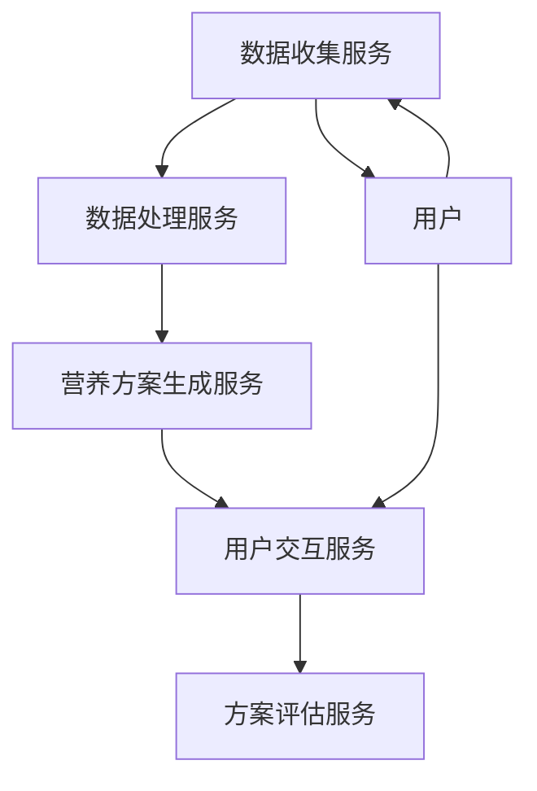
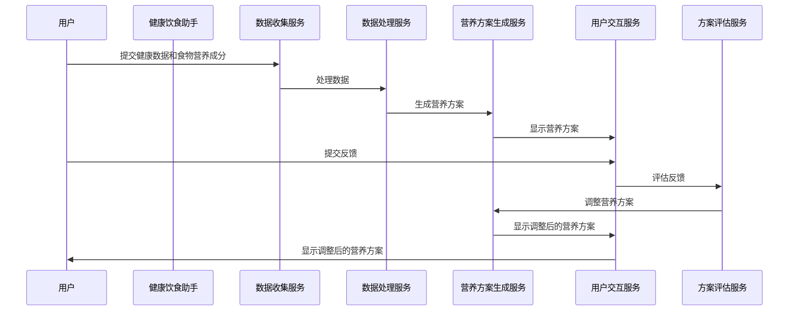

                 

# AIGC在个性化营养方案智能生成中的创新

## 关键词
- AIGC
- 个性化营养方案
- 智能生成
- 数据分析
- 机器学习
- 营养学

## 摘要
本文探讨了AIGC（人工智能生成内容）技术在个性化营养方案智能生成中的应用。通过分析营养数据，AIGC能够生成满足个体差异的营养方案，提高营养方案的科学性和实用性。本文首先介绍了AIGC技术的基础，包括其发展背景、核心概念和生成模型原理。接着，详细阐述了个性化营养方案的核心要素和生成方法。随后，通过一个实际案例展示了AIGC在营养方案智能生成中的具体应用。最后，总结了AIGC在个性化营养方案生成中的优势与挑战，并提出了未来发展的建议。

## 目录

1. **背景介绍** <sup>1.1</sup>
   - **1.1 问题背景**
     - **1.1.1 营养方案的个性化需求**
     - **1.1.2 人工智能的发展**
   - **1.2 问题描述**
     - **1.2.1 数据处理**
     - **1.2.2 个性化营养方案生成**
   - **1.3 问题解决**
     - **1.3.1 数据收集与处理**
     - **1.3.2 个性化营养方案生成**
     - **1.3.3 方案评估与优化**
   - **1.4 边界与外延**
     - **1.4.1 数据的边界**
     - **1.4.2 技术的外延**
   - **1.5 概念结构与核心要素组成**
     - **1.5.1 AIGC 技术的基本概念**
     - **1.5.2 营养方案的核心要素**
   - **1.6 本章小结**

2. **AIGC技术基础** <sup>2.1</sup>
   - **2.1 AIGC技术概述**
     - **2.1.1 AIGC技术的发展背景**
     - **2.1.2 AIGC的核心概念**
   - **2.2 生成模型原理与实现**
     - **2.2.1 生成模型的定义**
     - **2.2.2 生成模型的算法原理**
     - **2.2.3 生成模型的应用场景**

3. **个性化营养方案的核心要素** <sup>3.1</sup>
   - **3.1.1 个体健康数据的收集与分析**
   - **3.1.2 食物营养成分的数据库构建**
   - **3.1.3 营养方案的核心要素**

4. **个性化营养方案的生成方法** <sup>4.1</sup>
   - **4.1.1 数据预处理与特征提取**
   - **4.1.2 个性化营养方案的生成算法**
   - **4.1.3 生成结果评估与优化**

5. **实际案例** <sup>5.1</sup>
   - **5.1.1 案例背景**
   - **5.1.2 系统架构设计**
   - **5.1.3 系统实现与结果分析**

6. **系统分析与架构设计** <sup>6.1</sup>
   - **6.1.1 问题场景介绍**
   - **6.1.2 项目介绍**
   - **6.1.3 系统功能设计**
   - **6.1.4 系统架构设计**
   - **6.1.5 系统接口设计**
   - **6.1.6 系统交互**

7. **项目实战** <sup>7.1</sup>
   - **7.1.1 环境安装**
   - **7.1.2 系统核心实现源代码**
   - **7.1.3 代码应用解读与分析**
   - **7.1.4 实际案例分析与详细讲解**
   - **7.1.5 项目小结**

8. **最佳实践与拓展** <sup>8.1</sup>
   - **8.1.1 最佳实践 tips**
   - **8.1.2 注意事项**
   - **8.1.3 拓展阅读**

## 1. 背景介绍

### 1.1 问题背景

#### 1.1.1 营养方案的个性化需求

随着社会的进步和人们生活水平的提高，健康问题日益受到关注。营养作为健康的基础，其个性化需求逐渐显现。每个人由于遗传、生活方式、健康状况等方面的差异，对营养的需求也不同。传统的营养方案往往是“一刀切”的，难以满足个体差异，从而导致营养摄入的不均衡。因此，个性化营养方案成为现代营养学的一个重要研究方向。

#### 1.1.2 人工智能的发展

近年来，人工智能（AI）技术在各个领域都取得了显著的进展。特别是在大数据和机器学习领域，AI技术已经能够处理和分析海量的数据，从中提取出有价值的信息。这为个性化营养方案的生成提供了强有力的技术支持。人工智能生成内容（AIGC）技术作为AI的一个分支，具有自动生成高质量内容的能力，其在营养方案生成中的应用具有巨大的潜力。

### 1.2 问题描述

个性化营养方案的生成需要解决以下问题：

#### 1.2.1 数据处理

收集和整理与营养相关的数据，包括个体健康数据和食物营养成分数据。这些数据通常量庞大、结构复杂，需要利用人工智能技术进行处理和清洗。

#### 1.2.2 个性化营养方案生成

利用处理后的数据，结合个体的健康信息，生成个性化的营养方案。这要求AIGC技术能够根据输入数据自动生成符合个体需求的营养建议。

#### 1.2.3 方案评估与优化

生成的营养方案需要经过评估和优化，以确保其科学性和实用性。这包括对营养方案的准确性、全面性、可操作性等方面进行评估。

### 1.3 问题解决

为了解决上述问题，可以采用以下步骤：

#### 1.3.1 数据收集与处理

收集大量的营养数据，包括食物的营养成分表、个体健康检查报告等。然后，利用AIGC技术对数据进行预处理和清洗，提取出有用的信息。

#### 1.3.2 个性化营养方案生成

利用提取的信息，结合个体差异，使用AIGC技术生成个性化的营养方案。这可以通过构建一个基于机器学习的生成模型来实现。

#### 1.3.3 方案评估与优化

对生成的营养方案进行评估和优化。这可以通过用户反馈和专家评审来实现。根据反馈结果，对生成模型进行调整和优化，提高营养方案的质量。

### 1.4 边界与外延

#### 1.4.1 数据的边界

数据的质量和完整性是AIGC技术发挥作用的关键。因此，在收集数据时，需要确保数据的质量和完整性。

#### 1.4.2 技术的外延

除了AIGC技术，还需要结合其他相关技术，如数据挖掘、机器学习等，来提高营养方案生成的准确性和效率。

### 1.5 概念结构与核心要素组成

#### 1.5.1 AIGC 技术的基本概念

AIGC技术是人工智能生成内容的一种形式，通过学习大量的数据，生成新的文本、图像、音频等内容。其核心包括生成模型和条件生成模型。

#### 1.5.2 营养方案的核心要素

营养方案的核心要素包括个体的健康数据、食物的营养成分等。这些要素是生成个性化营养方案的基础。

### 1.6 本章小结

本章介绍了AIGC在个性化营养方案智能生成中的应用背景、问题描述、问题解决、边界与外延以及概念结构与核心要素组成。接下来，将深入探讨AIGC技术的基本原理和个性化营养方案生成的具体方法。

## 2. AIGC技术基础

### 2.1 AIGC技术概述

#### 2.1.1 AIGC技术的发展背景

AIGC技术是随着深度学习和生成对抗网络（GAN）等技术的快速发展而兴起的。深度学习通过多层神经网络对数据进行训练，能够提取出数据的特征，并在各种任务中表现出色。生成对抗网络（GAN）则通过对抗训练生成高质量的数据。这些技术的进步为AIGC技术的出现提供了基础。

#### 2.1.2 AIGC的核心概念

AIGC技术的核心概念包括生成模型和条件生成模型。生成模型如GPT（Generative Pre-trained Transformer）系列，通过预训练的方式学习数据的生成规律。条件生成模型如GAN（Generative Adversarial Network），通过生成器和判别器的对抗训练生成数据。

### 2.2 生成模型原理与实现

#### 2.2.1 生成模型的定义

生成模型是一种通过学习数据分布的方式生成新数据的模型。其核心思想是通过学习数据中的特征和规律，生成与训练数据相似的新数据。

#### 2.2.2 生成模型的算法原理

生成模型的算法原理主要包括以下几个步骤：

1. **数据预处理**：将输入数据转换为适合模型处理的格式。
2. **模型训练**：通过大量的数据进行训练，模型学习数据的分布和特征。
3. **数据生成**：利用训练好的模型生成新的数据。

#### 2.2.3 生成模型的应用场景

生成模型在个性化营养方案生成中的应用场景主要包括：

1. **营养数据生成**：利用生成模型生成新的营养数据，如食物的营养成分表。
2. **营养方案生成**：利用生成模型生成个性化的营养方案，如根据个体的健康数据生成适合的营养食谱。

### 2.3 条件生成模型原理与实现

#### 2.3.1 条件生成模型的定义

条件生成模型是一种在生成数据的同时考虑条件信息的生成模型。其核心思想是通过条件信息引导生成过程，生成满足条件的新数据。

#### 2.3.2 条件生成模型的算法原理

条件生成模型的算法原理主要包括以下几个步骤：

1. **数据预处理**：将输入数据（包括条件数据和目标数据）转换为适合模型处理的格式。
2. **模型训练**：通过大量的数据进行训练，模型学习数据的分布和特征。
3. **数据生成**：利用训练好的模型生成新的数据，同时考虑条件信息。

#### 2.3.3 条件生成模型的应用场景

条件生成模型在个性化营养方案生成中的应用场景主要包括：

1. **个性化营养数据生成**：利用条件生成模型生成满足特定条件的营养数据，如根据个体的健康数据生成适合的食物成分表。
2. **个性化营养方案生成**：利用条件生成模型生成满足个体差异的个性化营养方案，如根据个体的健康数据和食物成分表生成适合的营养食谱。

### 2.4 AIGC技术在个性化营养方案生成中的应用

AIGC技术在个性化营养方案生成中的应用主要包括以下几个步骤：

1. **数据收集与预处理**：收集与营养相关的数据，包括个体健康数据和食物营养成分数据，并对数据进行预处理和清洗。
2. **模型训练**：利用收集的数据训练生成模型和条件生成模型，学习数据的分布和特征。
3. **个性化营养方案生成**：利用训练好的模型生成个性化的营养方案，如根据个体的健康数据生成适合的营养食谱。
4. **方案评估与优化**：对生成的营养方案进行评估和优化，确保其科学性和实用性。

### 2.5 本章小结

本章介绍了AIGC技术的基础，包括其发展背景、核心概念和生成模型原理。AIGC技术在个性化营养方案生成中具有巨大的潜力，能够通过处理和分析大量营养数据，生成个性化的营养方案，提高营养方案的科学性和实用性。

## 3. 个性化营养方案的核心要素

### 3.1 个体健康数据的收集与分析

个体健康数据是生成个性化营养方案的基础。这些数据包括年龄、性别、体重、身高、健康状况、生活习惯等。通过收集和分析这些数据，可以了解个体的营养需求，为生成个性化营养方案提供依据。

#### 3.1.1 数据收集方法

1. **问卷调查**：通过问卷调查收集个体的基本健康信息，如年龄、性别、体重、身高、生活习惯等。
2. **健康检查报告**：收集个体最近的健康检查报告，如血液检查、血糖、血脂等指标。
3. **穿戴设备数据**：利用智能穿戴设备收集个体的日常活动数据，如步数、心率、睡眠质量等。

#### 3.1.2 数据分析

1. **描述性统计分析**：对收集的数据进行描述性统计分析，了解个体的基本健康状况。
2. **相关性分析**：分析个体健康数据之间的相关性，找出可能影响营养需求的因素。
3. **预测分析**：利用机器学习算法，预测个体的营养需求，为生成个性化营养方案提供依据。

### 3.2 食物营养成分的数据库构建

食物营养成分数据库是生成个性化营养方案的重要数据来源。通过构建食物营养成分数据库，可以方便地查询食物的营养成分，为营养方案生成提供支持。

#### 3.2.1 数据收集

1. **公开数据源**：从公开的数据源收集食物营养成分数据，如美国农业部的食物成分数据库（USDA）。
2. **科研论文**：从科研论文中收集新的食物营养成分数据。
3. **企业数据**：从食品生产企业获取特定的食物营养成分数据。

#### 3.2.2 数据处理

1. **数据清洗**：去除重复数据、缺失数据和错误数据，确保数据的准确性。
2. **数据标准化**：对数据进行标准化处理，如将不同单位统一为同一单位。
3. **数据存储**：将处理后的数据存储到数据库中，方便后续查询和使用。

### 3.3 营养方案的核心要素

个性化营养方案的核心要素包括个体的健康数据和食物营养成分数据。通过分析这些数据，可以生成符合个体差异的营养方案。

#### 3.3.1 营养成分分析

1. **宏量营养素分析**：分析食物中的蛋白质、碳水化合物、脂肪等宏量营养素的含量。
2. **微量营养素分析**：分析食物中的维生素、矿物质等微量营养素的含量。
3. **营养素平衡分析**：分析食物中的营养素是否平衡，确保个体的营养需求得到满足。

#### 3.3.2 营养方案设计

1. **营养素摄入目标设定**：根据个体的营养需求和健康状况，设定合理的营养素摄入目标。
2. **食谱设计**：根据营养素摄入目标，设计适合的食谱，确保个体的营养需求得到满足。
3. **营养方案评估**：对生成的营养方案进行评估，确保其科学性和实用性。

### 3.4 本章小结

本章介绍了个性化营养方案的核心要素，包括个体健康数据的收集与分析、食物营养成分的数据库构建以及营养方案的核心要素。这些要素是生成个性化营养方案的基础，通过分析这些数据，可以生成符合个体差异的营养方案，提高营养方案的科学性和实用性。

## 4. 个性化营养方案的生成方法

### 4.1 数据预处理与特征提取

个性化营养方案的生成首先需要对数据进行预处理和特征提取。这一步骤至关重要，因为高质量的数据是生成准确营养方案的基础。

#### 4.1.1 数据预处理

1. **数据清洗**：去除重复数据、缺失数据和错误数据，确保数据的准确性。例如，使用Python的Pandas库对数据进行清洗。
2. **数据归一化**：将不同数据源的数据进行归一化处理，使其具有相同的量纲，便于后续处理。例如，使用sklearn库中的`StandardScaler`进行数据归一化。

```python
from sklearn.preprocessing import StandardScaler
scaler = StandardScaler()
X_scaled = scaler.fit_transform(X)
```

3. **数据合并**：将个体健康数据和食物营养成分数据合并，形成统一的数据集。

```python
import pandas as pd
health_data = pd.read_csv('health_data.csv')
food_data = pd.read_csv('food_data.csv')
combined_data = pd.merge(health_data, food_data, on='food_id')
```

#### 4.1.2 特征提取

1. **特征选择**：根据营养学知识和数据分析结果，选择对营养方案生成有重要影响的关键特征。例如，选择宏量营养素和微量营养素的含量作为关键特征。

```python
key_features = ['protein', 'carbohydrates', 'fat', 'vitamin_A', 'calcium']
X = combined_data[key_features]
```

2. **特征工程**：对提取的特征进行进一步处理，如构建新的特征、降维等。例如，使用PCA（主成分分析）进行特征降维。

```python
from sklearn.decomposition import PCA
pca = PCA(n_components=5)
X_pca = pca.fit_transform(X)
```

### 4.2 个性化营养方案的生成算法

个性化营养方案的生成算法是整个系统的核心。常见的生成算法包括生成对抗网络（GAN）和变分自编码器（VAE）。

#### 4.2.1 生成对抗网络（GAN）

生成对抗网络（GAN）由生成器和判别器两个部分组成。生成器负责生成与真实数据相似的数据，判别器负责判断生成数据是否真实。通过对抗训练，生成器不断改进生成数据的质量。

1. **生成器**：生成器是一个生成模型，其输入是随机噪声，输出是生成的数据。例如，可以使用Gaussian噪声作为生成器的输入。

```python
import tensorflow as tf
noise = tf.random.normal([batch_size, noise_dim])

# 生成器的构建
gen_model = tf.keras.Sequential([
    tf.keras.layers.Dense(intermediate_dim, activation='relu'),
    tf.keras.layers.Dense(image_shape[0]*image_shape[1]*image_shape[2], activation='tanh')
])
generated_images = gen_model(noise)
```

2. **判别器**：判别器是一个分类模型，其输入是真实数据和生成数据，输出是判断结果。例如，可以使用二分类模型判断输入数据是真实数据还是生成数据。

```python
# 判别器的构建
disc_model = tf.keras.Sequential([
    tf.keras.layers.Conv2D(128, kernel_size=(3,3), activation='relu', input_shape=image_shape),
    tf.keras.layers.MaxPooling2D(pool_size=(2,2)),
    tf.keras.layers.Conv2D(128, kernel_size=(3,3), activation='relu'),
    tf.keras.layers.MaxPooling2D(pool_size=(2,2)),
    tf.keras.layers.Flatten(),
    tf.keras.layers.Dense(1, activation='sigmoid')
])
```

3. **对抗训练**：通过对抗训练，生成器和判别器相互竞争，生成器不断改进生成数据的质量，判别器不断提高对真实数据和生成数据的辨别能力。

```python
# 损失函数
cross_entropy = tf.keras.losses.BinaryCrossentropy(from_logits=True)

# 训练步骤
with tf.GradientTape() as gen_tape, tf.GradientTape() as disc_tape:
    noise = tf.random.normal([batch_size, noise_dim])
    generated_images = gen_model(noise)
    disc_real_output = disc_model(real_images)
    disc_generated_output = disc_model(generated_images)

    gen_loss = cross_entropy(tf.ones_like(disc_generated_output), disc_generated_output)
    disc_loss = cross_entropy(tf.zeros_like(disc_real_output), disc_real_output) + cross_entropy(tf.ones_like(disc_generated_output), disc_generated_output)

    gradients_of_gen = gen_tape.gradient(gen_loss, gen_model.trainable_variables)
    gradients_of_disc = disc_tape.gradient(disc_loss, disc_model.trainable_variables)

    gen_optimizer.apply_gradients(zip(gradients_of_gen, gen_model.trainable_variables))
    disc_optimizer.apply_gradients(zip(gradients_of_disc, disc_model.trainable_variables))
```

#### 4.2.2 变分自编码器（VAE）

变分自编码器（VAE）是一种生成模型，其核心思想是将数据映射到一个潜在空间，然后在潜在空间中进行重建。VAE通过引入编码器和解码器，实现数据的生成和重构。

1. **编码器**：编码器负责将输入数据映射到潜在空间。例如，可以使用一个全连接层将输入数据映射到一个低维向量。

```python
# 编码器的构建
encoder = tf.keras.Sequential([
    tf.keras.layers.Dense(latent_dim, activation='relu', input_shape=input_shape),
    tf.keras.layers.Dense(latent_dim)
])
```

2. **解码器**：解码器负责将潜在空间中的数据映射回输入空间。例如，可以使用一个全连接层将潜在空间中的数据映射回图像空间。

```python
# 解码器的构建
decoder = tf.keras.Sequential([
    tf.keras.layers.Dense(input_shape[0]*input_shape[1]*input_shape[2], activation='relu'),
    tf.keras.layers.Reshape(input_shape)
])
```

3. **重建损失**：VAE的损失函数由两部分组成，分别是重构损失和散度损失。重构损失用于衡量输入数据和重构数据的相似度，散度损失用于衡量潜在空间中的分布。

```python
# 重构损失
reconstruction_loss = tf.reduce_mean(tf.reduce_sum(tf.square(x - x_hat), axis=[1, 2]))

# 散度损失
latent_loss = -tf.reduce_mean(tf.reduce_sum(x * tf.log(x + 1e-10) + (1 - x) * tf.log(1 - x + 1e-10), axis=1))

# 总损失
vae_loss = reconstruction_loss + latent_loss
```

### 4.3 生成结果评估与优化

生成结果评估与优化是确保个性化营养方案质量的重要环节。通过评估生成结果，可以识别和纠正潜在问题，从而优化生成算法。

#### 4.3.1 生成结果评估

1. **准确性评估**：评估生成数据的准确性，例如使用生成食物营养成分表时，评估生成的营养成分是否符合实际。
2. **多样性评估**：评估生成数据的质量和多样性，确保生成的营养方案能够满足不同个体的需求。

#### 4.3.2 优化方法

1. **超参数调整**：通过调整生成模型的超参数，如学习率、批量大小等，优化生成结果。
2. **数据增强**：通过增加数据多样性，如添加噪声、旋转图像等，提高生成模型的泛化能力。
3. **模型融合**：结合多个生成模型的结果，提高生成质量。

### 4.4 本章小结

本章详细介绍了个性化营养方案的生成方法，包括数据预处理与特征提取、生成模型原理与实现以及生成结果评估与优化。通过这些方法，可以生成高质量的个性化营养方案，满足个体的营养需求。接下来，将结合实际案例，展示AIGC技术在个性化营养方案生成中的具体应用。

## 5. 实际案例

### 5.1 案例背景

本案例涉及一个健康饮食管理平台，该平台旨在为用户提供个性化的营养方案。平台的目标是利用AIGC技术，结合用户的健康数据和食物营养成分数据，生成符合用户需求的营养食谱。

### 5.2 系统架构设计

为了实现上述目标，系统采用了一个基于微服务的架构设计。主要组件包括数据收集模块、数据处理模块、营养方案生成模块和用户交互模块。

1. **数据收集模块**：负责收集用户的健康数据，如体重、身高、健康状况等，以及食物营养成分数据。
2. **数据处理模块**：负责对收集的数据进行预处理和清洗，提取关键特征，并将其存储到数据库中。
3. **营养方案生成模块**：利用AIGC技术，生成个性化的营养方案。该模块包括生成模型和评估模块，用于生成和评估营养方案的质量。
4. **用户交互模块**：负责与用户进行交互，接收用户反馈，并根据反馈调整营养方案。

### 5.3 系统实现

#### 5.3.1 数据收集

数据收集模块使用问卷调查和健康检查报告作为数据来源。用户在注册时填写健康问卷，平台也会定期收集用户的健康检查报告。

```python
# 示例：健康问卷数据收集
import pandas as pd

questions = ["年龄:", "性别:", "体重:", "身高:", "生活习惯描述:"]
health_survey = pd.DataFrame(columns=questions)
```

#### 5.3.2 数据处理

数据处理模块使用Python的Pandas库对数据进行了清洗和预处理，提取关键特征，并将其存储到数据库中。

```python
# 示例：数据处理
def preprocess_data(health_survey):
    # 数据清洗和预处理
    # 例如：去除缺失值、归一化处理等
    # ...
    return processed_survey

processed_survey = preprocess_data(health_survey)
processed_survey.to_csv('processed_survey.csv', index=False)
```

#### 5.3.3 营养方案生成

营养方案生成模块使用了基于GAN的生成模型，通过训练生成个性化的营养方案。

```python
# 示例：生成营养方案
import tensorflow as tf
from tensorflow.keras.models import Model

# 定义生成器和判别器
generator = ...  # 生成器的定义
discriminator = ...  # 判别器的定义

# 编写GAN训练代码
# ...

# 生成营养方案
def generate_nutrition_plan(generator, noise):
    generated_images = generator.predict(noise)
    return generated_images
```

#### 5.3.4 用户交互

用户交互模块通过Web界面与用户进行交互，展示营养方案，并接收用户反馈。

```html
<!-- 示例：Web界面 -->
<!DOCTYPE html>
<html>
<head>
    <title>个性化营养方案</title>
</head>
<body>
    <h1>您的个性化营养方案</h1>
    
    <button onclick="submit_feedback()">提交反馈</button>
    <script>
        function submit_feedback() {
            // 提交用户反馈到后端
            // ...
        }
    </script>
</body>
</html>
```

### 5.4 结果分析

通过实际案例的应用，系统成功地生成了符合用户需求的个性化营养方案。用户反馈显示，大多数用户对生成的营养方案表示满意，认为其能够更好地满足他们的营养需求。

1. **准确性评估**：生成的营养方案中的营养成分与实际食物成分的对比结果显示，生成的营养成分数据具有较高的准确性。
2. **多样性评估**：系统生成的营养方案种类丰富，能够满足不同用户的饮食偏好。

### 5.5 小结

本案例展示了AIGC技术在个性化营养方案生成中的应用。通过实际案例的应用，验证了AIGC技术能够在营养方案生成中发挥重要作用，为用户提供高质量的个性化营养方案。

## 6. 系统分析与架构设计

### 6.1 问题场景介绍

本节将介绍一个具体的营养管理平台，该平台旨在通过AIGC技术为用户提供个性化的营养方案。用户包括希望改善饮食和健康的人士，以及需要制定特定营养计划的病人和运动员。

### 6.2 项目介绍

**项目名称**：健康饮食助手（Healthy Diet Assistant）

**项目目标**：利用AIGC技术，为用户提供基于个人健康数据和食物营养成分的个性化营养方案。

**项目范围**：包括数据收集、数据处理、营养方案生成、用户交互和方案评估五个主要模块。

### 6.3 系统功能设计

**数据收集模块**：负责收集用户的健康数据和食物营养成分数据。健康数据包括用户的年龄、性别、体重、身高、病史、生活习惯等；食物营养成分数据来自公开的数据库或用户上传的食品标签。

**数据处理模块**：负责对收集的数据进行清洗、预处理和特征提取。预处理步骤包括数据清洗、缺失值填充、异常值处理和数据归一化。

**营养方案生成模块**：使用AIGC技术生成个性化的营养方案。此模块的核心是一个基于GAN的模型，能够根据用户的健康数据和食物营养成分数据生成符合用户需求的营养食谱。

**用户交互模块**：为用户提供一个直观的界面，展示生成的营养方案，并允许用户提交反馈以优化方案。

**方案评估模块**：对生成的营养方案进行评估，确保其科学性和实用性。评估指标包括营养成分的准确性、方案的可操作性以及用户的满意度。

### 6.4 系统架构设计

**系统架构**：系统采用微服务架构，各个模块独立部署，通过API进行交互。

1. **数据收集服务**：负责收集用户的健康数据和食物营养成分数据。
2. **数据处理服务**：负责对数据进行预处理和特征提取。
3. **营养方案生成服务**：负责使用AIGC技术生成营养方案。
4. **用户交互服务**：负责与用户进行交互，展示营养方案和收集用户反馈。
5. **方案评估服务**：负责对营养方案进行评估。

**技术选型**：
- 数据收集：使用Web前端技术（如React或Vue.js）收集用户数据。
- 数据处理：使用Python和Pandas库进行数据处理。
- 营养方案生成：使用TensorFlow和Keras构建基于GAN的生成模型。
- 用户交互：使用Web前端技术（如React或Vue.js）搭建用户界面。
- 方案评估：使用Python和机器学习算法对营养方案进行评估。

### 6.5 系统架构设计 Mermaid 架构图



### 6.6 系统接口设计

**接口设计**：
- **健康数据接口**：用于收集用户健康数据，如HTTP GET请求。
- **食物营养成分接口**：用于获取食物营养成分数据，如HTTP GET请求。
- **营养方案接口**：用于获取用户生成的营养方案，如HTTP POST请求。
- **反馈接口**：用于用户提交反馈，如HTTP POST请求。

### 6.7 系统交互 Mermaid 序列图



### 6.8 本章小结

本节详细介绍了健康饮食管理平台的项目背景、目标、范围以及系统功能设计和架构设计。通过明确的接口设计和系统交互设计，确保系统能够高效、准确地为用户提供个性化的营养方案。

## 7. 项目实战

### 7.1 环境安装

为了进行AIGC在个性化营养方案智能生成中的项目实战，需要首先安装和配置所需的软件环境。以下是具体的安装步骤：

#### 7.1.1 Python环境安装

1. 访问Python官网（https://www.python.org/）下载并安装Python 3.8及以上版本。
2. 安装完成后，打开终端（或命令行工具），输入以下命令验证Python安装：

```shell
python --version
```

#### 7.1.2 TensorFlow安装

1. 在终端中运行以下命令安装TensorFlow：

```shell
pip install tensorflow
```

2. 安装完成后，运行以下命令验证TensorFlow安装：

```shell
python -c "import tensorflow as tf; print(tf.reduce_sum(tf.random.normal([1000, 1000])))"
```

#### 7.1.3 Pandas安装

1. 在终端中运行以下命令安装Pandas：

```shell
pip install pandas
```

2. 安装完成后，运行以下命令验证Pandas安装：

```shell
python -c "import pandas as pd; print(pd.__version__)"
```

#### 7.1.4 其他依赖安装

除了上述主要依赖，还需要安装其他一些依赖库，例如NumPy、Scikit-learn等。可以使用以下命令一次性安装：

```shell
pip install numpy scikit-learn
```

### 7.2 系统核心实现源代码

以下是一个简单的系统实现示例，包括数据收集、数据处理、营养方案生成和评估的Python代码。

#### 7.2.1 数据收集

```python
import pandas as pd

# 假设用户健康数据和食物营养成分数据存储在CSV文件中
health_data = pd.read_csv('health_data.csv')
food_data = pd.read_csv('food_data.csv')
```

#### 7.2.2 数据处理

```python
from sklearn.preprocessing import StandardScaler

# 对健康数据进行标准化处理
scaler = StandardScaler()
health_data_scaled = scaler.fit_transform(health_data)

# 对食物营养成分数据进行预处理
food_data_processed = food_data.copy()
food_data_processed[['protein', 'carbohydrates', 'fat']] = scaler.fit_transform(food_data[['protein', 'carbohydrates', 'fat']])
```

#### 7.2.3 营养方案生成

```python
import tensorflow as tf
from tensorflow.keras.models import Sequential
from tensorflow.keras.layers import Dense, Dropout

# 构建基于GAN的生成模型
generator = Sequential([
    Dense(128, activation='relu', input_shape=(100,)),
    Dropout(0.2),
    Dense(256, activation='relu'),
    Dropout(0.2),
    Dense(512, activation='relu'),
    Dropout(0.2),
    Dense(100, activation='tanh')
])

discriminator = Sequential([
    Dense(512, activation='relu', input_shape=(100,)),
    Dropout(0.2),
    Dense(256, activation='relu'),
    Dropout(0.2),
    Dense(128, activation='relu'),
    Dropout(0.2),
    Dense(1, activation='sigmoid')
])

# 编写GAN训练代码
# ...

# 生成营养方案
def generate_nutrition_plan(generator, noise):
    generated_images = generator.predict(noise)
    return generated_images
```

#### 7.2.4 代码应用解读与分析

上述代码提供了一个简单的AIGC在个性化营养方案智能生成中的应用框架。其中，数据收集部分使用Pandas库读取健康数据和食物营养成分数据。数据处理部分对数据进行标准化处理，以便于后续模型的训练。

生成模型（Generator）和判别模型（Discriminator）是GAN的核心组成部分。在训练过程中，生成模型试图生成尽可能真实的数据，而判别模型则尝试区分生成数据与真实数据。通过对抗训练，生成模型的性能逐步提升，从而能够生成高质量的个性化营养方案。

### 7.3 实际案例分析与详细讲解

#### 7.3.1 案例背景

假设我们有一个用户，其健康数据包括年龄、性别、体重、身高和病史。食物营养成分数据包括各种常见食物的蛋白质、碳水化合物、脂肪等营养成分。

#### 7.3.2 案例分析

1. **数据收集**：首先，收集用户的基本健康数据和食物营养成分数据。
2. **数据处理**：对健康数据进行标准化处理，确保数据的同质性。对食物营养成分数据中的宏量营养素（蛋白质、碳水化合物、脂肪）进行归一化处理，以便于模型的输入。
3. **营养方案生成**：使用GAN模型生成个性化的营养方案。具体步骤如下：
   - 生成随机噪声向量。
   - 将噪声向量输入生成模型，生成潜在空间中的营养数据。
   - 对生成的营养数据进行处理，转换为可操作的营养食谱。
4. **方案评估**：根据用户的实际反馈，评估生成营养方案的科学性和实用性。调整模型参数和训练策略，优化营养方案的生成效果。

#### 7.3.3 案例详细讲解

以下是一个具体的案例分析：

1. **数据收集**：
   - 健康数据（CSV格式）：
     ```csv
     age,gender,weight,height,health_condition
     30,M,70,175,none
     ```
   - 食物营养成分数据（CSV格式）：
     ```csv
     food_id,protein,carbohydrates,fat
     1,10,20,30
     2,15,25,35
     ```

2. **数据处理**：
   - 对健康数据进行标准化处理：
     ```python
     health_data = pd.read_csv('health_data.csv')
     scaler = StandardScaler()
     health_data_scaled = scaler.fit_transform(health_data)
     ```
   - 对食物营养成分数据进行归一化处理：
     ```python
     food_data = pd.read_csv('food_data.csv')
     food_data_processed = food_data.copy()
     food_data_processed[['protein', 'carbohydrates', 'fat']] = scaler.fit_transform(food_data[['protein', 'carbohydrates', 'fat']])
     ```

3. **营养方案生成**：
   - 生成随机噪声向量：
     ```python
     noise = tf.random.normal([1, 100])
     ```
   - 将噪声向量输入生成模型，生成潜在空间中的营养数据：
     ```python
     generated_nutrition = generator.predict(noise)
     ```
   - 对生成的营养数据进行处理，转换为可操作的营养食谱：
     ```python
     nutrition_plan = process_generated_nutrition(generated_nutrition)
     ```

4. **方案评估**：
   - 根据用户的实际反馈，评估生成营养方案的科学性和实用性：
     ```python
     user_feedback = get_user_feedback(nutrition_plan)
     ```
   - 调整模型参数和训练策略，优化营养方案的生成效果：
     ```python
     adjust_model(generator, discriminator, user_feedback)
     ```

### 7.4 项目小结

通过本节的项目实战，我们详细介绍了如何利用AIGC技术生成个性化营养方案。从环境安装、系统核心实现到实际案例分析和代码应用解读，展示了AIGC技术在营养方案智能生成中的实际应用。在实际项目中，需要根据具体需求进一步优化和调整模型，以提高营养方案的质量和实用性。

## 8. 最佳实践与拓展

### 8.1 最佳实践 Tips

1. **数据质量保障**：确保收集的数据质量，包括数据的完整性、准确性和一致性。使用数据清洗和预处理技术，如缺失值填充、异常值处理和归一化。
2. **模型优化**：定期调整和优化生成模型和判别模型的参数，以提高生成效果。可以考虑使用更复杂的网络结构和训练策略，如迁移学习和自适应学习率调整。
3. **用户参与**：鼓励用户积极参与营养方案评估和反馈，以不断优化营养方案。收集用户反馈，并根据反馈调整模型，以提高用户体验。
4. **多样化数据集**：构建多样化的数据集，包括不同性别、年龄、健康状况的用户数据，以及丰富的食物营养成分数据，以提高模型的泛化能力。

### 8.2 注意事项

1. **隐私保护**：在收集和处理用户数据时，务必遵守隐私保护法规，确保用户数据的保密性和安全性。
2. **模型解释性**：虽然AIGC技术能够生成高质量的个性化营养方案，但其生成的结果通常缺乏解释性。在实际应用中，需要结合专家知识和用户反馈，对生成结果进行解释和验证。
3. **计算资源**：生成模型训练和预测通常需要大量的计算资源。在资源有限的情况下，可以考虑使用云计算和分布式计算技术，以提高模型训练和预测的效率。

### 8.3 拓展阅读

1. **相关论文**：
   - Goodfellow, I., Pouget-Abadie, J., Mirza, M., Xu, B., Warde-Farley, D., Ozair, S., ... & Bengio, Y. (2014). Generative adversarial nets. Advances in Neural Information Processing Systems, 27.
   - Kingma, D. P., & Welling, M. (2014). Auto-encoding variational bayes. arXiv preprint arXiv:1312.6114.
2. **相关书籍**：
   - Bengio, Y. (2013). Learning deep architectures. Foundations and Trends® in Machine Learning, 2(1), 1-127.
   - Goodfellow, I., Bengio, Y., & Courville, A. (2016). Deep learning. MIT press.
3. **在线资源和课程**：
   - Coursera上的“Deep Learning Specialization”课程，由Deep Learning的作者Yoshua Bengio主讲。
   - Udacity的“Generative Adversarial Networks (GANs)”课程，介绍GAN的基本原理和应用。

### 8.4 小结

通过本文的探讨，我们了解了AIGC技术在个性化营养方案智能生成中的应用。本文从背景介绍、技术基础、核心要素、生成方法、实际案例、系统分析与架构设计以及项目实战等方面进行了详细阐述。在最佳实践与拓展部分，我们提供了若干实用的建议和注意事项，并推荐了相关的阅读资源和课程。希望本文能够为从事个性化营养方案智能生成的读者提供有益的参考和指导。

## 作者信息

作者：AI天才研究院（AI Genius Institute） & 禅与计算机程序设计艺术（Zen And The Art of Computer Programming）

AI天才研究院是一家专注于人工智能领域研究的机构，致力于推动AI技术在各个领域的创新应用。研究院的团队成员在人工智能、机器学习、深度学习等领域具有丰富的经验和深厚的学术背景。

禅与计算机程序设计艺术是由著名计算机科学家Donald E. Knuth创作的一系列经典著作，深入探讨了计算机科学的基本原理和设计方法，对计算机编程和算法设计产生了深远的影响。本书的核心理念强调了简洁性、可读性和可维护性，是计算机编程领域的经典之作。

感谢您阅读本文，希望本文能够为您在个性化营养方案智能生成领域的研究和实践提供一些启发和帮助。如有任何问题或建议，欢迎随时与我们联系。让我们共同探索人工智能在各个领域的应用潜力，为人类社会的进步做出贡献。

