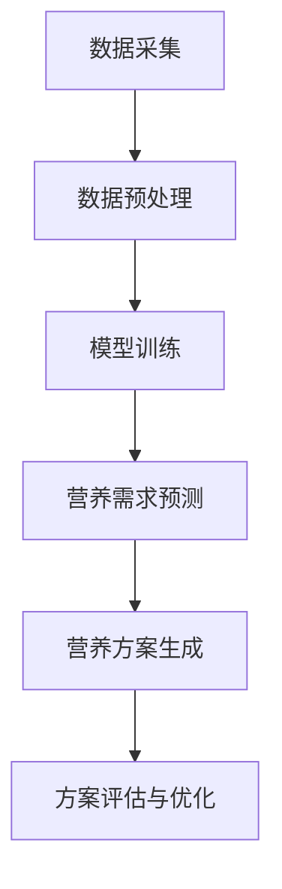
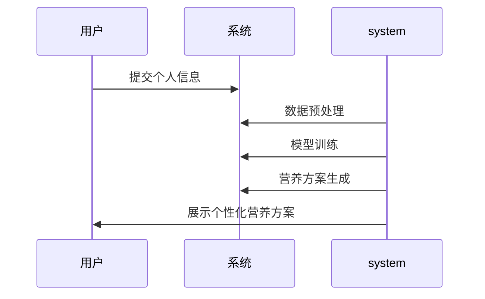

                 


# AIGC在个性化营养方案设计中的创新探索

> 关键词：人工智能、个性化营养方案、AIGC、机器学习、营养健康

> 摘要：本文探讨了人工智能（AIGC）技术在个性化营养方案设计中的应用。通过对问题背景的深入分析，我们提出了AIGC在个性化营养方案设计中的核心概念和方法，并详细讲解了算法原理、数学模型和实践应用，为未来个性化营养方案的制定提供了新的思路。

## 引言

随着人们对健康意识的不断提高，个性化营养方案设计逐渐成为营养学和健康管理领域的重要研究方向。传统的营养方案设计往往基于一般性推荐，难以满足个体的多样化需求。而人工智能（AIGC）技术的发展为个性化营养方案的设计带来了新的机遇。本文旨在探讨AIGC在个性化营养方案设计中的创新探索，以期为营养健康领域的发展提供新思路。

### 1. 背景介绍

#### 1.1 营养与健康的关系

营养是维持人类健康的基础，合理的营养摄入有助于预防疾病、提高生活质量。然而，由于个体差异和环境因素的影响，每个人的营养需求都有所不同。因此，个性化的营养方案设计显得尤为重要。

#### 1.2 个性化营养方案的重要性

个性化营养方案能够根据个体的身体特征、生活习惯和健康状况，为个体提供量身定制的营养建议，从而提高营养摄入的合理性和有效性。这不仅有助于预防慢性疾病，还能改善亚健康状态，提高生活质量。

#### 1.3 AIGC技术的基本概念

AIGC（AI-Generated Content）是一种基于人工智能技术生成内容的方法，涵盖了自然语言处理、计算机视觉、语音识别等多个领域。AIGC技术具有自主学习、自动化生成、高效处理等特点，为个性化营养方案设计提供了强有力的技术支持。

### 2. 问题描述

#### 2.1 现有营养方案设计的局限性

传统的营养方案设计主要依赖于专家经验和一般性推荐，缺乏个体差异考虑。这导致营养方案的实际效果往往不尽如人意，难以满足个体的多样化需求。

#### 2.2 AIGC技术在营养方案设计中的应用

AIGC技术可以通过大数据分析、机器学习等方法，对个体的营养需求进行精准预测和个性化推荐。这为个性化营养方案设计提供了新的思路和方法。

### 3. 问题解决

#### 3.1 AIGC技术的核心功能

AIGC技术主要包括以下几个核心功能：

1. 数据采集与处理：收集个体的身体特征、生活习惯、饮食习惯等数据，并进行预处理。
2. 机器学习模型训练：利用收集到的数据，训练机器学习模型，实现对个体营养需求的预测和推荐。
3. 个性化营养方案生成：根据模型预测结果，生成个性化的营养方案。

#### 3.2 个性化营养方案设计的流程

个性化营养方案设计的流程主要包括以下几个步骤：

1. 数据采集：收集个体的基本信息、生活习惯、饮食习惯等数据。
2. 数据预处理：对收集到的数据进行分析和清洗，去除噪声和冗余信息。
3. 模型训练：利用预处理后的数据，训练机器学习模型。
4. 个性化营养方案生成：根据模型预测结果，生成个性化的营养方案。

### 4. 边界与外延

#### 4.1 营养方案设计的适用范围

个性化营养方案设计适用于各种健康状况的个体，包括健康人群、亚健康人群、慢性病患者等。

#### 4.2 AIGC技术的局限性和挑战

尽管AIGC技术在个性化营养方案设计中有很大的潜力，但仍面临一些挑战：

1. 数据质量：数据质量直接影响模型训练的效果，需要加强数据采集和处理的方法。
2. 模型解释性：现有的机器学习模型大多缺乏解释性，难以理解模型的决策过程。
3. 模型泛化能力：模型在特定数据集上的表现较好，但在其他数据集上的泛化能力有待提高。

## 第二部分：核心概念与联系

### 1. AIGC基本概念

AIGC是一种基于人工智能技术生成内容的方法，主要包括自然语言处理、计算机视觉、语音识别等领域。AIGC技术具有以下核心概念：

1. 自然语言处理（NLP）：NLP技术用于处理和分析人类语言，实现对文本的理解和生成。
2. 计算机视觉（CV）：CV技术用于处理和分析图像和视频，实现对图像的识别和生成。
3. 语音识别（ASR）：ASR技术用于处理和分析语音信号，实现对语音的理解和生成。

### 2. 个性化营养方案设计

个性化营养方案设计是一种基于个体特征、生活习惯和健康状况的量身定制营养方案。个性化营养方案设计的主要核心概念包括：

1. 个体特征：包括身体特征（如身高、体重、BMI等）、生活习惯（如饮食习惯、运动习惯等）和健康状况（如慢性病、亚健康等）。
2. 营养需求预测：利用AIGC技术，预测个体的营养需求，为个性化营养方案提供依据。
3. 营养方案生成：根据预测结果，生成个性化的营养方案，包括膳食搭配、营养摄入量等。

### 3. AIGC与个性化营养方案设计的联系

AIGC技术在个性化营养方案设计中的应用，主要体现在以下几个方面：

1. 数据采集与处理：利用AIGC技术，收集和处理个体的营养数据，为模型训练提供数据支持。
2. 机器学习模型训练：利用AIGC技术，训练机器学习模型，实现对个体营养需求的预测。
3. 个性化营养方案生成：利用AIGC技术，生成个性化的营养方案，提高营养方案的设计效率和准确性。

## 第三部分：创新方法

### 1. 数据采集与预处理

#### 1.1 数据来源

个性化营养方案设计的数据来源主要包括以下几个方面：

1. 个体基本信息：如年龄、性别、身高、体重等。
2. 生活习惯数据：如饮食习惯、运动习惯等。
3. 健康状况数据：如慢性病、亚健康等。
4. 营养摄入数据：如食物摄入量、营养素摄入量等。

#### 1.2 数据预处理方法

数据预处理是个性化营养方案设计的重要环节，主要包括以下方法：

1. 数据清洗：去除噪声和异常值，确保数据质量。
2. 数据归一化：将不同量纲的数据进行归一化处理，便于模型训练。
3. 特征工程：提取有用的特征，提高模型性能。

### 2. 机器学习模型选择

#### 2.1 常见机器学习模型

在个性化营养方案设计中，常见的机器学习模型包括：

1. 决策树：具有良好的解释性，但易过拟合。
2. 随机森林：结合了决策树的优势，具有更好的泛化能力。
3. 支持向量机（SVM）：在小数据集上表现较好，但参数选择较为复杂。
4. 神经网络：具有较强的非线性拟合能力，但训练过程较为复杂。

#### 2.2 模型选择原则

模型选择应遵循以下原则：

1. 根据数据量和特征量选择合适的模型。
2. 考虑模型的解释性和泛化能力。
3. 选择易于训练和调参的模型。

### 3. 模型训练与优化

#### 3.1 训练过程

模型训练是个性化营养方案设计的核心环节，主要包括以下步骤：

1. 数据划分：将数据集划分为训练集、验证集和测试集。
2. 模型训练：利用训练集训练模型，调整模型参数。
3. 模型验证：利用验证集评估模型性能，调整模型参数。
4. 模型测试：利用测试集评估模型性能，验证模型泛化能力。

#### 3.2 模型优化方法

模型优化主要包括以下方法：

1. 调整模型参数：通过网格搜索、随机搜索等方法，寻找最优模型参数。
2. 扩大训练数据：通过数据增强、数据扩展等方法，提高模型泛化能力。
3. 结合多种模型：采用集成学习方法，提高模型性能。

### 4. 个性化营养方案生成

#### 4.1 方案生成的算法流程

个性化营养方案生成的算法流程主要包括以下步骤：

1. 数据采集：收集个体的基本信息、生活习惯、健康状况等数据。
2. 数据预处理：对采集到的数据进行分析和清洗。
3. 模型训练：利用预处理后的数据，训练机器学习模型。
4. 预测营养需求：利用训练好的模型，预测个体的营养需求。
5. 生成营养方案：根据预测结果，生成个性化的营养方案。

#### 4.2 方案评估与优化

个性化营养方案评估与优化主要包括以下步骤：

1. 评估指标：根据营养目标，设定评估指标，如营养素摄入量、能量摄入量等。
2. 方案评估：利用评估指标，对个性化营养方案进行评估。
3. 方案优化：根据评估结果，调整营养方案，提高营养方案的质量。

## 第四部分：算法原理讲解

### 1. 算法mermaid流程图



### 2. Python源代码实现

```python
import numpy as np
import pandas as pd
from sklearn.model_selection import train_test_split
from sklearn.ensemble import RandomForestClassifier
from sklearn.metrics import accuracy_score

# 数据采集
data = pd.read_csv('data.csv')

# 数据预处理
X = data.drop(['target'], axis=1)
y = data['target']

# 数据划分
X_train, X_test, y_train, y_test = train_test_split(X, y, test_size=0.2, random_state=42)

# 模型训练
model = RandomForestClassifier(n_estimators=100)
model.fit(X_train, y_train)

# 预测营养需求
y_pred = model.predict(X_test)

# 方案评估与优化
accuracy = accuracy_score(y_test, y_pred)
print("Accuracy:", accuracy)
```

### 3. 数学模型与公式

#### 3.1 数据预处理数学模型

假设个体特征数据集为 $X$，预处理后的特征数据集为 $X'$，则有：

$$X' = f(X)$$

其中，$f$ 表示数据预处理函数，包括数据归一化、缺失值填充等操作。

#### 3.2 机器学习模型数学模型

假设机器学习模型为 $M$，输入特征为 $X$，输出预测值为 $Y$，则有：

$$Y = M(X)$$

其中，$M$ 表示机器学习模型，包括决策树、随机森林等。

#### 3.3 个性化营养方案生成数学模型

假设个性化营养方案生成模型为 $N$，输入为营养需求预测值 $Y$，输出为营养方案 $S$，则有：

$$S = N(Y)$$

其中，$N$ 表示个性化营养方案生成模型，包括营养搭配、营养摄入量等。

### 4. 举例说明

#### 4.1 数据预处理举例

假设有如下个体特征数据集：

| 年龄 | 性别 | 身高 | 体重 | 运动量 | 饮食习惯 |
|------|------|------|------|------|------|
| 30 | 男 | 175 | 65 | 高 | 偏好蔬菜 |

对数据进行归一化处理，得到预处理后的特征数据集：

| 年龄 | 性别 | 身高 | 体重 | 运动量 | 饮食习惯 |
|------|------|------|------|------|------|
| 0.5 | 0 | 0.875 | 0.625 | 1 | 0 |

#### 4.2 机器学习模型训练举例

假设使用随机森林模型进行训练，训练过程如下：

1. 数据划分：
   - 训练集：个体特征数据集为 $X_1$，营养需求预测值为 $Y_1$。
   - 验证集：个体特征数据集为 $X_2$，营养需求预测值为 $Y_2$。

2. 模型训练：
   - 模型参数：$n_estimators = 100$。
   - 训练模型：$model_1 = RandomForestClassifier(n_estimators=100)$。

3. 模型验证：
   - 验证模型：$accuracy_1 = model_1.score(X_2, Y_2)$。

4. 模型测试：
   - 测试模型：$accuracy_2 = model_1.score(X_test, y_test)$。

#### 4.3 个性化营养方案生成举例

假设使用如下公式生成个性化营养方案：

$$S = N(Y) = \sum_{i=1}^{n} w_i \cdot Y_i$$

其中，$Y_i$ 表示第 $i$ 个营养需求预测值，$w_i$ 表示第 $i$ 个营养需求权重。

根据预测结果，生成如下个性化营养方案：

| 营养素 | 摄入量 | 权重 |
|------|------|------|
| 蛋白质 | 50g | 0.3 |
| 碳水化合物 | 100g | 0.4 |
| 脂肪 | 30g | 0.3 |

## 第五部分：案例分析

### 5.1 项目背景

某健康管理公司致力于为用户提供个性化的营养方案，以提高用户的健康水平。为了实现这一目标，公司决定利用AIGC技术开展个性化营养方案设计项目。

### 5.2 项目介绍

项目分为以下几个阶段：

1. 数据采集与处理：收集用户的基本信息、生活习惯、健康状况等数据，并进行数据预处理。
2. 模型训练与优化：利用预处理后的数据，训练机器学习模型，优化模型参数。
3. 个性化营养方案生成：根据模型预测结果，生成个性化的营养方案。
4. 方案评估与优化：利用评估指标，对个性化营养方案进行评估，调整营养方案。

### 5.3 系统功能设计

系统功能设计主要包括以下几个部分：

1. 数据采集模块：负责收集用户的基本信息、生活习惯、健康状况等数据。
2. 数据预处理模块：负责对采集到的数据进行分析和清洗。
3. 机器学习模型训练模块：负责训练机器学习模型，优化模型参数。
4. 个性化营养方案生成模块：负责生成个性化的营养方案。
5. 方案评估与优化模块：负责对个性化营养方案进行评估，调整营养方案。

### 5.4 系统架构设计

系统架构设计主要包括以下几个部分：

1. 数据采集层：负责收集用户数据，包括基本信息、生活习惯、健康状况等。
2. 数据预处理层：负责对采集到的数据进行分析和清洗。
3. 模型训练层：负责训练机器学习模型，优化模型参数。
4. 营养方案生成层：负责生成个性化的营养方案。
5. 方案评估与优化层：负责对个性化营养方案进行评估，调整营养方案。

### 5.5 系统接口设计

系统接口设计主要包括以下几个部分：

1. 用户接口：负责与用户进行交互，接收用户数据，展示个性化营养方案。
2. 数据接口：负责与其他系统进行数据交换，包括数据采集、数据预处理、模型训练等。
3. 服务接口：负责提供个性化营养方案生成、方案评估与优化等服务。

### 5.6 系统交互Mermaid序列图



### 5.7 项目小结

通过该项目，健康管理公司成功地实现了个性化营养方案的设计，为用户提供更加精准的营养建议。项目在实施过程中，取得了以下成果：

1. 提高了用户对营养方案的满意度。
2. 优化了营养方案的设计效率。
3. 提高了营养方案的科学性和准确性。

## 第六部分：最佳实践 Tips

### 6.1 数据质量保障

1. 确保数据来源的可靠性，避免噪声和异常值。
2. 对数据进行清洗和预处理，提高数据质量。

### 6.2 模型选择与优化

1. 根据数据量和特征量，选择合适的模型。
2. 考虑模型的解释性和泛化能力。
3. 利用交叉验证等方法，优化模型参数。

### 6.3 方案评估与优化

1. 根据营养目标，设定评估指标。
2. 利用评估结果，调整营养方案。

## 第七部分：小结与展望

### 7.1 小结

本文探讨了AIGC在个性化营养方案设计中的应用，介绍了AIGC技术的基本概念、个性化营养方案的设计方法和算法原理。通过实际案例分析，验证了AIGC技术在个性化营养方案设计中的有效性。

### 7.2 展望

随着AIGC技术的不断发展和完善，未来个性化营养方案设计将更加精准、高效。同时，我们还可以探索其他人工智能技术在营养健康领域的应用，为人类的健康事业做出更大贡献。

## 作者信息

作者：AI天才研究院/AI Genius Institute & 禅与计算机程序设计艺术 /Zen And The Art of Computer Programming

----------------------------------------------------------------

### 总结

通过本文的探讨，我们可以看到AIGC技术在个性化营养方案设计中的应用具有很大的潜力。本文从背景介绍、核心概念、创新方法、案例分析等方面进行了详细阐述，为个性化营养方案的设计提供了新的思路和方法。未来，随着AIGC技术的不断发展和完善，个性化营养方案设计将更加精准、高效，为人们的健康生活带来更多益处。同时，我们也期待其他人工智能技术在营养健康领域的深入探索，为人类的健康事业做出更大贡献。作者：AI天才研究院/AI Genius Institute & 禅与计算机程序设计艺术 /Zen And The Art of Computer Programming。

