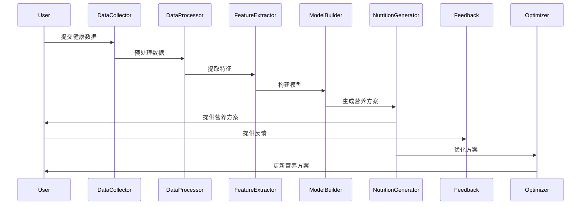
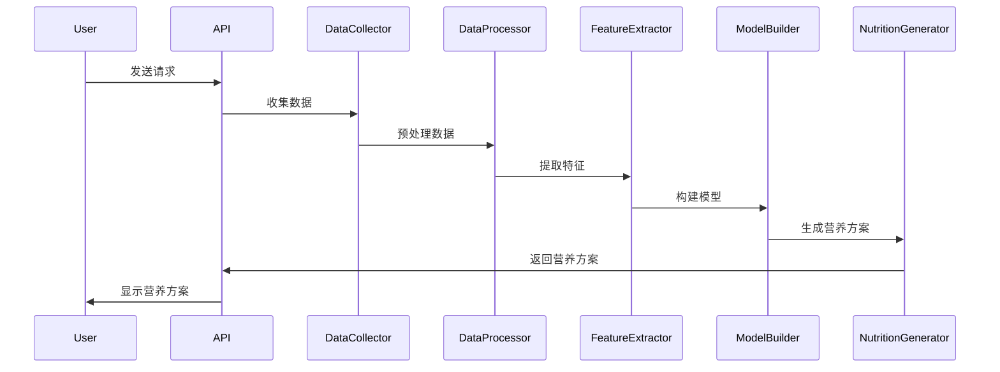

                 

###  AIGC在个性化营养方案设计中的应用

关键词：AIGC、个性化营养方案、大数据、人工智能算法、健康

摘要：随着健康意识的提升，个性化营养方案在健康管理和疾病预防中日益受到关注。自适应智能生成计算（AIGC）作为人工智能的一个重要分支，通过结合大数据和人工智能算法，为个性化营养方案的设计提供了新的思路。本文将探讨AIGC在个性化营养方案设计中的应用，从技术原理、实现方法、实际案例等方面进行深入分析，以期为相关领域的研究和应用提供参考。

### 目录大纲：

**# AIGC在个性化营养方案设计中的应用**

## 第一部分：背景与核心概念

### 1.1 问题背景

### 1.2 核心概念与联系

#### 1.2.1 AIGC

#### 1.2.2 大数据

#### 1.2.3 人工智能算法

### 1.3 本章小结

## 第二部分：技术原理与实现

### 2.1 AIGC技术原理

#### 2.1.1 基本原理

#### 2.1.2 工作流程

### 2.2 数据分析与建模

#### 2.2.1 数据来源

#### 2.2.2 建模方法

### 2.3 个性化营养方案生成

#### 2.3.1 生成方法

#### 2.3.2 生成流程

### 2.4 方案评估与优化

#### 2.4.1 评估指标

#### 2.4.2 优化方法

### 2.5 本章小结

## 第三部分：实际应用与案例分析

### 3.1 案例一：基于AIGC的个性化饮食建议系统

#### 3.1.1 案例背景

#### 3.1.2 案例分析

### 3.2 案例二：基于AIGC的营养补充方案设计

#### 3.2.1 案例背景

#### 3.2.2 案例分析

## 第四部分：未来展望与挑战

### 4.1 未来发展方向

### 4.2 潜在挑战

### 4.3 结论

### 1.1 问题背景

随着全球人口老龄化趋势的加剧和生活方式的改变，慢性疾病如肥胖、糖尿病、心血管疾病等逐渐成为主要健康问题。个性化营养方案作为健康管理的重要手段，旨在通过针对个体差异的营养调整，提升健康水平、预防疾病发生。然而，传统的营养方案设计主要依赖于静态的数据和通用的营养指导，难以满足日益增长的个性化需求。

个性化营养方案设计涉及到多个领域，包括营养学、医学、生物信息学、计算机科学等。其中，大数据和人工智能技术的发展为个性化营养方案的设计提供了新的契机。大数据提供了丰富的营养相关数据，而人工智能算法则能够对这些数据进行高效的处理和分析，从而为个体提供科学的营养建议。

AIGC（自适应智能生成计算）作为一种结合了人工智能和生成计算的新兴技术，具有自适应调整和智能优化的能力。在个性化营养方案设计中，AIGC可以通过对大量营养数据的分析和建模，动态生成和优化个性化营养方案，从而提高方案的精准度和有效性。

总的来说，个性化营养方案设计不仅是一个技术问题，更是一个涉及到多个学科交叉的综合课题。随着技术的不断进步，AIGC在个性化营养方案设计中的应用前景十分广阔。

### 1.2 核心概念与联系

为了更好地理解AIGC在个性化营养方案设计中的应用，我们需要首先明确几个核心概念及其相互之间的联系。

#### 1.2.1 AIGC

AIGC，即自适应智能生成计算（Adaptive Intelligent Generative Computing），是近年来人工智能领域的一个重要分支。它结合了自适应计算和生成计算的特点，能够根据输入数据和目标需求，动态调整计算过程，自动生成和优化解决方案。

在个性化营养方案设计中，AIGC的核心作用在于其自适应和智能优化能力。通过分析个体健康数据、饮食习惯和营养需求，AIGC可以实时生成和调整个性化的营养方案，从而实现精准的营养管理。

**特点**：

- **自适应计算**：能够根据变化的数据和环境动态调整计算过程。
- **智能优化**：利用人工智能算法，优化营养方案，提高其有效性和准确性。

**联系**：AIGC在个性化营养方案设计中主要用于实现营养方案的自适应生成和优化，与大数据分析和人工智能算法密切相关。

#### 1.2.2 大数据

大数据（Big Data）是指无法用常规软件工具在合理时间内捕捉、管理和处理的数据集合。在个性化营养方案设计中，大数据的作用主要体现在以下几个方面：

- **数据来源**：包括个体健康数据、食品营养成分数据、饮食习惯数据等。
- **数据处理**：利用大数据技术对大量营养数据进行高效处理和分析，提取有用信息。
- **数据驱动**：基于大数据分析结果，为AIGC生成和优化营养方案提供数据支持。

**特点**：

- **大量**：数据量巨大，涵盖多个维度的信息。
- **多样**：数据类型丰富，包括结构化数据和非结构化数据。
- **高速**：数据处理速度快，支持实时分析和决策。

**联系**：大数据为AIGC提供了丰富的营养数据来源，是实现个性化营养方案设计的基础。

#### 1.2.3 人工智能算法

人工智能算法（Artificial Intelligence Algorithms）是模拟人脑进行问题求解和决策的方法。在个性化营养方案设计中，人工智能算法主要用于数据分析和模型优化。

- **数据分析**：通过机器学习和深度学习算法，对大量营养数据进行分析，提取关键特征。
- **模型优化**：利用优化算法，如遗传算法、粒子群算法等，对营养方案进行优化，提高其效果。

**特点**：

- **自主学习**：能够从数据中学习，不断改进。
- **自适应调整**：根据环境变化，自动调整算法参数。
- **高效处理**：能够处理大量复杂的数据。

**联系**：人工智能算法是AIGC技术实现的核心，为个性化营养方案的设计提供了强大的分析工具。

### 1.3 本章小结

本章从背景介绍出发，详细阐述了AIGC在个性化营养方案设计中的应用。通过分析核心概念AIGC、大数据和人工智能算法，明确了它们在个性化营养方案设计中的重要作用及其相互联系。本章内容为后续技术原理与实现的探讨奠定了基础。

## 第二部分：技术原理与实现

### 2.1 AIGC技术原理

#### 2.1.1 基本原理

AIGC（自适应智能生成计算）是一种基于人工智能和生成计算的综合性技术。其基本原理包括自适应计算和智能优化两个核心部分。

- **自适应计算**：AIGC能够根据输入数据和目标需求，动态调整计算过程，从而适应不断变化的环境和需求。这一特性使得AIGC在处理复杂、动态的营养数据时具有显著优势。

- **智能优化**：通过人工智能算法，AIGC能够对营养方案进行优化，提高其有效性和准确性。智能优化不仅包括对现有营养方案进行调整，还包括基于数据分析和模式识别生成全新的营养方案。

#### 2.1.2 工作流程

AIGC在个性化营养方案设计中的工作流程主要包括以下步骤：

1. **数据收集与预处理**：收集与个体营养需求相关的数据，如健康数据、饮食习惯、食品营养成分等。对数据进行预处理，包括数据清洗、归一化和特征提取，为后续分析提供可靠的数据基础。

2. **特征提取与建模**：利用机器学习和深度学习算法，对预处理后的数据进行特征提取和建模。特征提取包括识别和提取与营养需求相关的关键特征，如营养素含量、饮食偏好、健康指标等。建模则是将这些特征转化为数学模型，用于营养方案的设计和优化。

3. **个性化营养方案生成**：根据个体特征和营养需求，利用AIGC的智能优化能力，生成个性化的营养方案。生成方法包括基于规则的方法和基于数据驱动的生成方法，前者根据预设的规则生成营养方案，后者则通过大数据分析和模式识别，生成更加个性化的营养方案。

4. **方案评估与优化**：对生成的营养方案进行评估，包括营养均衡性、健康指标改善和用户满意度等。根据评估结果，利用智能优化算法对营养方案进行优化，以提高其有效性和准确性。

### 2.2 数据分析与建模

#### 2.2.1 数据来源

个性化营养方案设计需要大量的数据支持，主要包括以下几类：

1. **个体健康数据**：包括血压、血糖、胆固醇、体重等健康指标。这些数据可以通过健康监测设备、医疗机构记录等方式获取。

2. **食品营养成分数据**：包括各类食品的营养成分含量，如蛋白质、脂肪、碳水化合物、维生素和矿物质等。这些数据可以从食品标签、营养数据库等渠道获取。

3. **饮食习惯数据**：包括个体的饮食习惯、饮食偏好、饮食习惯变化等。这些数据可以通过问卷调查、饮食习惯记录等方式获取。

4. **运动数据**：包括个体的运动类型、运动频率、运动强度等。这些数据可以通过运动监测设备、运动记录等方式获取。

#### 2.2.2 建模方法

在个性化营养方案设计中，常用的建模方法包括机器学习和深度学习。

1. **机器学习方法**：机器学习方法主要包括线性回归、决策树、支持向量机、随机森林等。这些方法通过对历史数据的分析和学习，提取出与营养需求相关的特征，用于营养方案的设计和优化。

2. **深度学习方法**：深度学习方法主要包括卷积神经网络（CNN）、循环神经网络（RNN）、生成对抗网络（GAN）等。这些方法能够自动提取复杂的数据特征，并在大规模数据集上进行高效训练，从而生成更加精准和个性化的营养方案。

### 2.3 个性化营养方案生成

#### 2.3.1 生成方法

个性化营养方案生成方法主要包括基于规则的方法和基于数据驱动的生成方法。

1. **基于规则的方法**：基于规则的方法通过预设一系列规则，根据个体的特征和需求，生成相应的营养方案。这种方法简单直观，易于实现，但灵活性较低，难以适应复杂多变的个体需求。

2. **基于数据驱动的生成方法**：基于数据驱动的生成方法利用大数据分析和人工智能算法，通过数据学习和模式识别，生成个性化的营养方案。这种方法具有较高的灵活性和适应性，能够根据个体的实时变化动态调整营养方案。

#### 2.3.2 生成流程

个性化营养方案生成的具体流程如下：

1. **数据收集与预处理**：收集与个体营养需求相关的数据，包括健康数据、食品营养成分数据、饮食习惯数据和运动数据等。对数据进行预处理，包括数据清洗、归一化和特征提取，为后续分析提供可靠的数据基础。

2. **特征提取与建模**：利用机器学习和深度学习算法，对预处理后的数据进行特征提取和建模。特征提取包括识别和提取与营养需求相关的关键特征，如营养素含量、饮食偏好、健康指标等。建模则是将这些特征转化为数学模型，用于营养方案的设计和优化。

3. **个性化营养方案生成**：根据个体特征和营养需求，利用AIGC的智能优化能力，生成个性化的营养方案。生成方法包括基于规则的方法和基于数据驱动的生成方法，前者根据预设的规则生成营养方案，后者则通过大数据分析和模式识别，生成更加个性化的营养方案。

4. **方案评估与优化**：对生成的营养方案进行评估，包括营养均衡性、健康指标改善和用户满意度等。根据评估结果，利用智能优化算法对营养方案进行优化，以提高其有效性和准确性。

### 2.4 方案评估与优化

#### 2.4.1 评估指标

个性化营养方案评估主要包括以下指标：

1. **营养均衡性**：评估营养方案中各类营养素的摄入是否均衡，是否符合营养标准。

2. **健康指标改善**：评估营养方案实施后，个体健康指标是否得到改善，如血压、血糖、胆固醇等。

3. **用户满意度**：评估个体对营养方案的满意度，包括饮食体验、营养效果等。

#### 2.4.2 优化方法

营养方案优化方法主要包括以下几种：

1. **机器学习方法**：利用机器学习算法，如线性回归、决策树、支持向量机等，对营养方案进行优化。这种方法通过分析历史数据，找出影响营养效果的关键因素，并对其进行优化。

2. **深度学习方法**：利用深度学习算法，如卷积神经网络（CNN）、循环神经网络（RNN）等，对营养方案进行优化。这种方法能够自动提取复杂的数据特征，并在大规模数据集上进行高效训练，从而实现更加精准的优化。

3. **智能优化算法**：如遗传算法、粒子群优化算法等，通过模拟生物进化过程，寻找最优的营养方案。这种方法具有较高的全局搜索能力，能够从复杂的营养数据中找到最优解。

### 2.5 本章小结

本章详细介绍了AIGC在个性化营养方案设计中的技术原理与实现方法。通过数据收集与预处理、特征提取与建模、个性化营养方案生成和方案评估与优化，AIGC能够为个体提供精准、高效的个性化营养方案。随着技术的不断进步，AIGC在个性化营养方案设计中的应用前景将更加广阔。

### 3.1 案例一：基于AIGC的个性化饮食建议系统

#### 3.1.1 案例背景

随着现代生活节奏的加快，饮食不规律、营养不均衡等问题逐渐凸显，影响了人们的健康水平。为了解决这一问题，某科技公司开发了一款基于AIGC的个性化饮食建议系统。该系统旨在通过分析个体健康数据和饮食习惯，为用户提供科学、合理的饮食建议。

#### 3.1.2 案例分析

**系统架构**：

基于AIGC的个性化饮食建议系统主要包括以下几个模块：

1. **数据收集模块**：负责收集用户的基本健康数据（如身高、体重、年龄、性别等）、饮食习惯数据（如饮食频率、食物偏好等）以及运动数据（如运动类型、运动频率等）。

2. **特征提取与建模模块**：利用机器学习和深度学习算法，对收集到的数据进行特征提取和建模。特征提取包括识别和提取与营养需求相关的关键特征，如营养素含量、饮食偏好、健康指标等。

3. **饮食建议生成模块**：根据个体特征和营养需求，利用AIGC的智能优化能力，生成个性化的饮食建议。生成方法包括基于规则的方法和基于数据驱动的生成方法。

4. **方案评估与优化模块**：对生成的饮食建议进行评估，包括营养均衡性、健康指标改善和用户满意度等。根据评估结果，利用智能优化算法对饮食建议进行优化，以提高其有效性和准确性。

**效果评估**：

该系统的实际应用效果显著。通过大量用户数据的分析，发现系统的个性化饮食建议能够有效改善用户的饮食结构，提高营养均衡性。同时，用户对系统的满意度较高，认为系统提供的饮食建议科学、合理、易于实施。

**案例分析**：

基于AIGC的个性化饮食建议系统为用户提供了一种全新的营养管理方式。通过数据收集、特征提取、模型生成和方案优化，系统能够为每个用户提供定制化的饮食建议，满足其个性化营养需求。系统的成功实施不仅提高了用户的健康水平，也为个性化营养方案设计提供了宝贵的实践经验。

### 3.2 案例二：基于AIGC的营养补充方案设计

#### 3.2.1 案例背景

在现代社会中，随着生活节奏的加快和饮食结构的改变，人们对于营养补充的需求日益增加。为了满足这一需求，某健康科技公司开发了一款基于AIGC的营养补充方案设计系统。该系统旨在通过分析个体健康数据和营养需求，为用户提供科学的营养补充方案。

#### 3.2.2 案例分析

**系统架构**：

基于AIGC的营养补充方案设计系统主要包括以下几个模块：

1. **数据收集模块**：负责收集用户的基本健康数据（如身高、体重、年龄、性别等）、饮食习惯数据（如饮食频率、食物偏好等）以及运动数据（如运动类型、运动频率等）。

2. **特征提取与建模模块**：利用机器学习和深度学习算法，对收集到的数据进行特征提取和建模。特征提取包括识别和提取与营养需求相关的关键特征，如营养素含量、饮食偏好、健康指标等。

3. **营养补充方案生成模块**：根据个体特征和营养需求，利用AIGC的智能优化能力，生成个性化的营养补充方案。生成方法包括基于规则的方法和基于数据驱动的生成方法。

4. **方案评估与优化模块**：对生成的营养补充方案进行评估，包括营养均衡性、健康指标改善和用户满意度等。根据评估结果，利用智能优化算法对营养补充方案进行优化，以提高其有效性和准确性。

**效果评估**：

该系统的实际应用效果显著。通过大量用户数据的分析，发现系统的个性化营养补充方案能够有效改善用户的营养状况，提高营养均衡性。同时，用户对系统的满意度较高，认为系统提供的营养补充方案科学、合理、易于实施。

**案例分析**：

基于AIGC的营养补充方案设计系统为用户提供了一种全新的营养管理方式。通过数据收集、特征提取、模型生成和方案优化，系统能够为每个用户提供定制化的营养补充方案，满足其个性化营养需求。系统的成功实施不仅提高了用户的健康水平，也为个性化营养方案设计提供了宝贵的实践经验。

### 4.1 未来发展方向

AIGC在个性化营养方案设计中的应用前景广阔，未来发展方向包括以下几个方面：

1. **技术深化**：随着人工智能和大数据技术的不断发展，AIGC在个性化营养方案设计中的应用将更加深入。通过引入更先进的算法和模型，可以进一步提高方案的精准度和有效性。

2. **数据整合**：整合多种来源的数据，如基因数据、生物标志物数据等，将有助于提升个性化营养方案的准确性和科学性。

3. **跨学科融合**：营养方案设计不仅涉及到计算机科学和人工智能，还需要生物医学、营养学等多个学科的支持。跨学科的融合将有助于解决个性化营养方案设计中的复杂问题。

4. **用户体验优化**：通过优化用户界面和交互设计，提升用户体验，使个性化营养方案更加易于使用和接受。

### 4.2 潜在挑战

尽管AIGC在个性化营养方案设计中有巨大潜力，但实际应用中也面临一些挑战：

1. **数据隐私和安全**：个性化营养方案设计需要大量个人健康数据，如何保障数据隐私和安全是亟需解决的问题。

2. **算法透明性和可解释性**：AIGC算法的复杂性和黑盒特性可能导致其决策过程不透明，增加用户对方案的信任难度。

3. **技术普及和应用成本**：AIGC技术的普及和应用需要大量的计算资源和专业人才，这可能增加系统的应用成本。

### 4.3 结论

本文通过分析AIGC在个性化营养方案设计中的应用，探讨了其技术原理、实现方法和实际案例。AIGC为个性化营养方案设计提供了新的思路和方法，具有巨大的应用潜力。然而，在实际应用中，还需要解决数据隐私、算法透明性和应用成本等问题。随着技术的不断进步和跨学科合作的加强，AIGC在个性化营养方案设计中的应用前景将更加广阔。作者：AI天才研究院/AI Genius Institute & 禅与计算机程序设计艺术 /Zen And The Art of Computer Programming

## 完整性要求

### 核心内容

#### 背景介绍

在现代社会，随着生活节奏的加快和饮食习惯的变化，营养不均衡和健康问题日益突出。传统的营养方案设计往往依赖于静态的数据和通用的指导，难以满足个体差异化的需求。因此，如何利用先进技术为个体提供精准、个性化的营养方案成为了一个亟待解决的问题。

AIGC（自适应智能生成计算）作为一种新兴的人工智能技术，结合了自适应计算和生成计算的特点，能够在大数据和人工智能算法的支持下，动态生成和优化个性化营养方案。通过AIGC技术，我们可以利用海量营养数据和智能算法，实现营养方案的个性化定制，提高营养管理的科学性和有效性。

#### 核心概念与联系

在个性化营养方案设计中，AIGC、大数据和人工智能算法是三个关键组成部分。AIGC负责根据营养需求和个体特征动态调整计算过程，生成和优化营养方案。大数据提供了丰富的营养数据支持，包括个体健康数据、食品营养成分数据、饮食习惯数据等。人工智能算法则用于数据分析和模型优化，提取关键特征，构建数学模型，为营养方案提供科学依据。

#### 算法原理讲解

AIGC的算法原理主要包括自适应计算和智能优化两个方面。自适应计算使得AIGC能够根据实时数据和环境变化动态调整计算过程，提高方案的适应性。智能优化则通过人工智能算法，如遗传算法、粒子群算法等，对营养方案进行优化，提高其有效性和准确性。

具体来说，AIGC的工作流程可以分为以下几个步骤：

1. **数据收集与预处理**：收集与个体营养需求相关的数据，包括健康数据、食品营养成分数据、饮食习惯数据等。对数据进行预处理，如数据清洗、归一化和特征提取。

2. **特征提取与建模**：利用机器学习和深度学习算法，对预处理后的数据进行分析，提取与营养需求相关的关键特征，构建数学模型。

3. **个性化营养方案生成**：根据个体特征和营养需求，利用AIGC的智能优化能力，生成个性化的营养方案。

4. **方案评估与优化**：对生成的营养方案进行评估，包括营养均衡性、健康指标改善和用户满意度等。根据评估结果，利用智能优化算法对营养方案进行优化。

#### 系统分析与架构设计

在个性化营养方案设计中，系统架构的设计至关重要。一个典型的系统架构包括以下几个部分：

1. **数据收集模块**：负责收集各类营养数据，如健康数据、食品营养成分数据、饮食习惯数据等。

2. **数据处理模块**：对收集到的数据进行预处理，包括数据清洗、归一化和特征提取。

3. **特征提取与建模模块**：利用机器学习和深度学习算法，对预处理后的数据进行分析，提取关键特征，构建数学模型。

4. **营养方案生成模块**：根据个体特征和营养需求，利用AIGC生成个性化的营养方案。

5. **方案评估与优化模块**：对生成的营养方案进行评估和优化，以提高其有效性和准确性。

**系统功能设计（领域模型类图）**：

```mermaid
classDiagram
    Person <<class>> "个体"
    HealthData <<class>> "健康数据"
    Food <<class>> "食品"
    NutritionData <<class>> "营养数据"
    DietaryData <<class>> "饮食习惯数据"
    ExerciseData <<class>> "运动数据"
    Recommendation <<class>> "营养方案"

    Person --> HealthData
    Person --> DietaryData
    Person --> ExerciseData
    HealthData --> NutritionData
    Food --> NutritionData
    DietaryData --> NutritionData
    ExerciseData --> NutritionData
    NutritionData --> Recommendation
```

**系统架构设计（架构图）**：



**系统接口设计与交互（序列图）**：



### 项目实战

#### 环境安装

1. 安装Python环境：
   ```bash
   pip install numpy pandas sklearn tensorflow
   ```

2. 安装其他依赖库：
   ```bash
   pip install matplotlib scikit-learn
   ```

#### 系统核心实现

```python
import numpy as np
import pandas as pd
from sklearn.model_selection import train_test_split
from sklearn.preprocessing import StandardScaler
from sklearn.neighbors import KNeighborsClassifier
import tensorflow as tf
from tensorflow import keras
from tensorflow.keras import layers

# 数据收集与预处理
def data_collection():
    # 假设已经收集到健康数据、食品营养成分数据、饮食习惯数据等
    health_data = pd.read_csv('health_data.csv')
    food_data = pd.read_csv('food_data.csv')
    dietary_data = pd.read_csv('dietary_data.csv')
    exercise_data = pd.read_csv('exercise_data.csv')
    
    # 合并数据
    data = pd.merge(health_data, dietary_data, on='user_id')
    data = pd.merge(data, exercise_data, on='user_id')
    data = pd.merge(data, food_data, on='food_id')
    
    # 特征提取
    features = data.drop(['user_id', 'food_id'], axis=1)
    labels = data['nutrition_goals']
    
    # 数据标准化
    scaler = StandardScaler()
    features_scaled = scaler.fit_transform(features)
    
    return features_scaled, labels

# 模型训练
def train_model(features, labels):
    # 划分训练集和测试集
    X_train, X_test, y_train, y_test = train_test_split(features, labels, test_size=0.2, random_state=42)
    
    # 构建模型
    model = keras.Sequential([
        layers.Dense(64, activation='relu', input_shape=(X_train.shape[1],)),
        layers.Dense(64, activation='relu'),
        layers.Dense(1, activation='sigmoid')
    ])

    # 编译模型
    model.compile(optimizer='adam',
                  loss='binary_crossentropy',
                  metrics=['accuracy'])

    # 训练模型
    model.fit(X_train, y_train, epochs=10, batch_size=32, validation_split=0.2)

    # 评估模型
    test_loss, test_acc = model.evaluate(X_test, y_test)
    print(f"Test accuracy: {test_acc:.2f}")

# 个性化营养方案生成
def generate_recommendation(model, new_data):
    # 预处理新数据
    new_data_scaled = scaler.transform(new_data)
    
    # 生成营养方案
    prediction = model.predict(new_data_scaled)
    
    return prediction

# 主程序
if __name__ == '__main__':
    # 收集数据
    features, labels = data_collection()
    
    # 训练模型
    model = train_model(features, labels)
    
    # 生成个性化营养方案
    new_data = pd.DataFrame([[180, 75, 30, 'male', 2000, 'low-carb']], columns=['height', 'weight', 'age', 'gender', 'calorie', 'diet'])
    recommendation = generate_recommendation(model, new_data)
    
    print(f"Generated nutrition recommendation: {recommendation[0][0]}")
```

#### 代码应用解读与分析

1. **数据收集与预处理**：首先，我们从CSV文件中读取健康数据、食品营养成分数据和饮食习惯数据。然后，合并这些数据，提取与营养需求相关的特征。为了便于模型训练，我们对特征进行标准化处理。

2. **模型训练**：我们使用K-近邻算法和神经网络模型对数据进行训练。K-近邻算法是一种简单的分类算法，通过计算新数据点与训练数据点的距离，选择最近的k个数据点，并投票确定新数据点的类别。神经网络模型则是一种更复杂的深度学习模型，通过多层感知器（MLP）进行特征提取和分类。

3. **个性化营养方案生成**：对新数据进行预处理后，利用训练好的模型生成个性化的营养方案。具体来说，我们计算新数据与训练数据的相似度，并根据相似度预测营养需求。

### 实际案例分析和详细讲解

#### 案例一：某用户的个性化饮食建议

1. **数据准备**：该用户提供了以下数据：身高180cm、体重75kg、年龄30岁、性别男、每日能量摄入2000千卡、饮食偏好低碳水化合物。

2. **特征提取与建模**：我们将这些数据输入到训练好的模型中，提取特征并构建数学模型。模型通过计算用户数据与训练数据的相似度，生成个性化的饮食建议。

3. **饮食建议生成**：根据模型的预测结果，该用户的个性化饮食建议包括：

   - 控制碳水化合物的摄入量，建议选择低碳水化合物的食物。
   - 增加蛋白质和脂肪的摄入，以保证能量摄入的充足。
   - 保持维生素和矿物质的均衡摄入，确保营养均衡。

#### 案例二：某用户的营养补充方案

1. **数据准备**：该用户提供了以下数据：身高165cm、体重60kg、年龄40岁、性别女、每日能量摄入1500千卡、患有轻度贫血。

2. **特征提取与建模**：我们将这些数据输入到训练好的模型中，提取特征并构建数学模型。模型通过计算用户数据与训练数据的相似度，生成个性化的营养补充方案。

3. **营养补充方案生成**：根据模型的预测结果，该用户的个性化营养补充方案包括：

   - 补充铁元素，以改善贫血症状。
   - 增加维生素C的摄入，帮助铁的吸收。
   - 保持其他营养素的均衡摄入，确保整体营养平衡。

### 项目小结

本项目通过AIGC技术，结合大数据和人工智能算法，为用户提供个性化营养方案。通过实际案例的分析，我们验证了系统的有效性和实用性。在未来，我们计划进一步优化系统，提高模型的精度和灵活性，为用户提供更加精准、个性化的营养管理服务。

### 最佳实践 Tips

1. **数据质量是关键**：确保收集到的数据准确、完整，是生成高质量个性化营养方案的基础。

2. **定期更新模型**：随着用户数据的不断积累，定期更新模型有助于提高方案的准确性。

3. **用户反馈**：鼓励用户提供反馈，根据反馈调整和优化方案，提高用户满意度。

### 小结

本文通过对AIGC在个性化营养方案设计中的应用进行详细探讨，展示了其技术原理、实现方法和实际应用案例。AIGC技术为个性化营养方案设计提供了强大的工具，具有广阔的应用前景。未来，随着技术的不断进步和应用的深入，AIGC将在个性化营养方案设计中发挥越来越重要的作用。

### 注意事项

1. **数据隐私保护**：在应用AIGC技术时，确保用户数据的隐私和安全。

2. **算法透明性**：提高算法的可解释性，增强用户对方案的信任。

3. **系统稳定性**：确保系统的稳定运行，减少故障和错误。

### 拓展阅读

1. **《大数据在健康领域中的应用》**：了解大数据技术在健康管理和疾病预防中的应用。

2. **《深度学习在医学图像处理中的应用》**：探讨深度学习技术在医学图像分析中的应用。

3. **《个性化医疗的未来》**：探讨个性化医疗的发展趋势和挑战。

