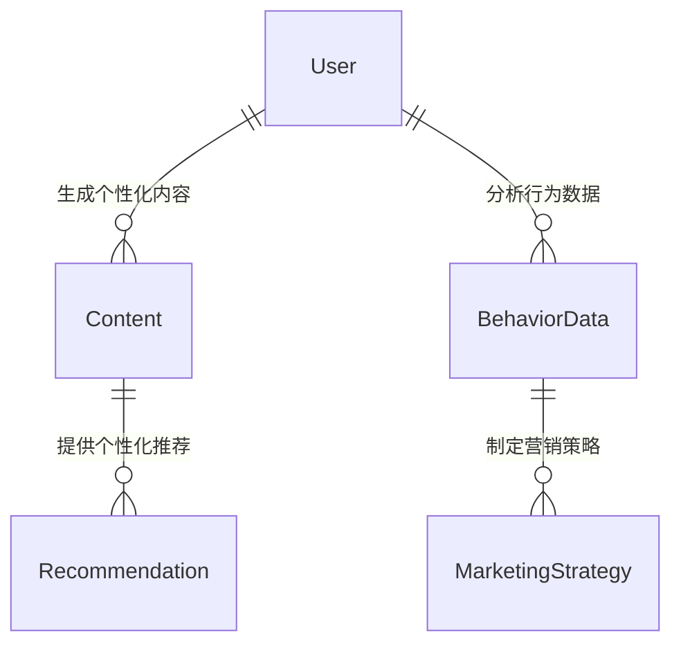
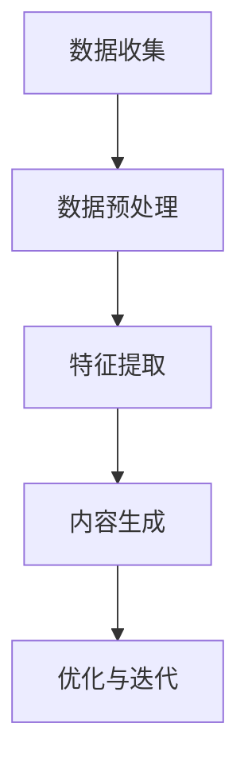
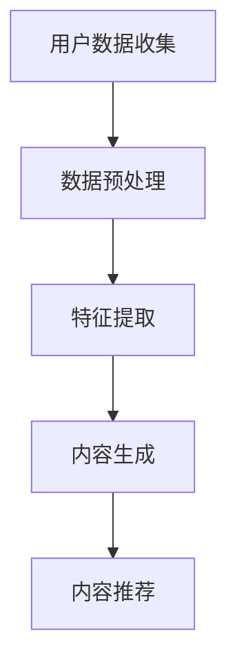
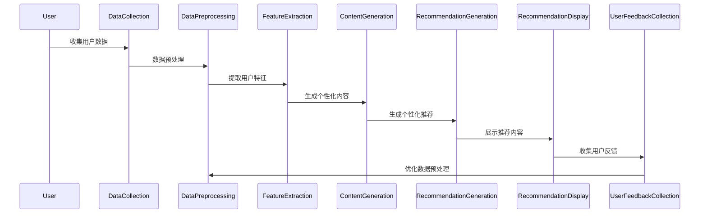
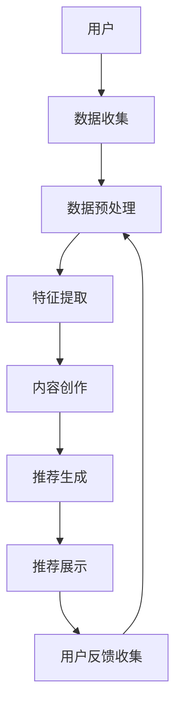
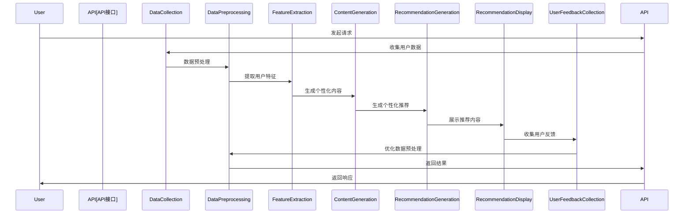
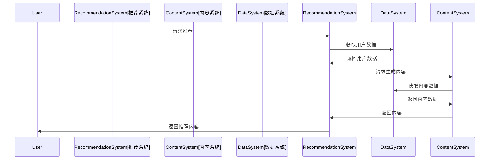

                 

### 第1章：问题背景

在当今数字化时代，市场营销正经历着前所未有的变革。传统的营销策略逐渐让位于更加精准和个性化的方法，其中个性化营销尤其引人注目。个性化营销旨在通过分析消费者的行为数据，为其提供定制化的内容和服务，从而提高营销效果和客户满意度。然而，实现这一目标并非易事，它需要大量的数据、复杂的算法和高效的内容创作技术。

#### 1.1 问题提出

个性化营销的核心在于内容的个性化，即根据用户的特点和偏好生成定制化的内容。然而，面对海量用户和多样化的需求，如何高效、准确地生成个性化内容成为企业面临的一大挑战。传统的手动内容创作不仅成本高昂，且难以满足大规模、实时的需求。因此，寻找一种能够自动化内容创作的方法，成为个性化营销的关键。

#### 1.2 问题描述

随着人工智能（AI）技术的快速发展，AIGC（AI-Generated Content，人工智能生成内容）技术逐渐成为解决个性化营销内容创作问题的有力工具。AIGC技术能够通过机器学习算法，从海量数据中自动生成文本、图像、音频等多种类型的内容，满足个性化营销的需求。然而，如何有效地将AIGC技术与个性化营销相结合，实现高效、精准的内容创作，仍然是当前研究中的一个问题。

#### 1.3 问题解决

本书旨在探讨AIGC在个性化营销内容创作中的应用，通过系统介绍AIGC的核心概念、算法原理，以及个性化营销的内容创作方法，为企业提供一种实际可行的解决方案。通过本文的讨论，我们将深入了解AIGC技术的优势和局限性，探索其在个性化营销中的最佳应用场景，并为其未来发展提供一些有价值的建议。

#### 1.4 边界与外延

AIGC在个性化营销内容创作中的应用，涉及多个领域的交叉，包括人工智能、大数据、市场营销等。本文将主要关注AIGC技术在内容创作中的应用，以及个性化营销的实际操作。同时，我们将探讨AIGC技术在不同行业和领域的应用潜力，如电子商务、社交媒体、在线教育等。此外，本文还将讨论AIGC技术在内容创作过程中可能面临的挑战和伦理问题，以期为读者提供全面的视角。

#### 1.5 概念结构与核心要素组成

AIGC在个性化营销内容创作中的核心概念包括：AIGC技术、个性化营销、内容创作。核心要素包括：

- **AIGC技术**：指通过人工智能技术生成文本、图像、音频等多种类型的内容。
- **个性化营销**：基于用户行为数据，为用户提供定制化内容的营销策略。
- **内容创作**：生成满足用户需求和偏好的个性化内容。

这些概念和要素相互关联，共同构成了AIGC在个性化营销内容创作中的核心框架。

### 第2章：核心概念与联系

在深入探讨AIGC在个性化营销内容创作中的应用之前，有必要先了解AIGC和个性化营销的核心概念及其相互关系。

#### 2.1 AIGC的概念原理

AIGC，全称为AI-Generated Content，即人工智能生成内容。它是利用机器学习算法和自然语言处理技术，自动从数据中生成文本、图像、音频等多种类型的内容。AIGC的核心特点包括：

- **高效性**：通过自动化生成内容，大幅提高内容创作的速度和效率。
- **多样性**：能够生成多种类型的内容，如文本、图像、音频等，满足不同用户的需求。
- **精准性**：通过对用户数据的深入分析和理解，生成更加贴合用户需求的内容。

AIGC的核心概念可以简单概括为：

- **数据**：海量数据是AIGC生成内容的基础。
- **算法**：机器学习和自然语言处理算法是AIGC的核心技术。
- **生成内容**：文本、图像、音频等多种类型的内容。

#### 2.1.1 AIGC的定义

AIGC（AI-Generated Content）是通过人工智能技术自动生成文本、图像、音频等多种类型内容的技术。其定义涵盖了以下几个关键要素：

- **人工智能**：利用机器学习和自然语言处理技术。
- **生成**：自动生成内容，而不是人工创作。
- **内容**：包括文本、图像、音频等多种类型。

#### 2.1.2 AIGC的核心特点

AIGC的核心特点可以从以下几个方面来理解：

- **高效性**：通过自动化生成内容，大大提高了内容创作的速度和效率。
- **多样性**：能够生成多种类型的内容，满足不同用户的需求。
- **精准性**：通过对用户数据的深入分析和理解，生成更加贴合用户需求的内容。

#### 2.1.3 AIGC与传统AI的区别

传统AI（Artificial Intelligence）主要侧重于数据处理和模式识别，而AIGC则更加关注内容创作。两者之间的主要区别如下：

- **目标不同**：传统AI的目标是让机器具备人类的智能，而AIGC的目标是生成人类可以理解的内容。
- **技术侧重不同**：传统AI侧重于算法优化和数据处理，而AIGC侧重于自然语言处理和图像生成技术。
- **应用场景不同**：传统AI广泛应用于自动化控制、语音识别等领域，而AIGC主要应用于内容创作和个性化营销。

#### 2.2 个性化营销的概念原理

个性化营销（Personalized Marketing）是一种基于用户行为数据，为用户提供定制化内容和服务的一种营销策略。其核心原理是通过数据分析，深入了解用户的需求和偏好，然后根据这些信息生成个性化的内容和推荐。

#### 2.2.1 个性化营销的定义

个性化营销是指利用用户数据，分析用户的行为和偏好，然后为用户提供定制化的内容和服务。其定义包括以下几个关键要素：

- **用户数据**：个性化营销的基础是用户数据，包括用户行为、兴趣、偏好等。
- **数据分析**：通过对用户数据的分析，了解用户的需求和偏好。
- **内容服务**：根据分析结果，生成个性化的内容和推荐。

#### 2.2.2 个性化营销的核心特点

个性化营销具有以下几个核心特点：

- **精准性**：通过对用户数据的深入分析，为用户提供更加贴合需求的内容和服务。
- **互动性**：通过与用户的互动，不断优化内容和推荐策略。
- **实时性**：能够实时响应用户的需求变化，提供个性化的内容和服务。

#### 2.2.3 个性化营销与内容创作的关联

个性化营销与内容创作紧密相关。个性化营销的核心在于生成个性化的内容，而内容创作则是实现这一目标的重要手段。具体来说：

- **内容创作**：根据用户数据和个性化营销策略，生成个性化的内容。
- **内容优化**：通过不断优化内容和推荐策略，提高用户满意度。
- **用户反馈**：通过用户反馈，进一步优化内容和推荐策略，实现个性化营销的闭环。

### 2.3 AIGC与个性化营销的融合

AIGC与个性化营销的结合，使得内容创作更加高效、精准和多样化。通过AIGC技术，企业可以自动生成个性化的内容，满足不同用户的需求。具体来说：

- **内容生成**：AIGC技术能够自动生成文本、图像、音频等多种类型的内容，满足个性化营销的需求。
- **数据分析**：通过对用户数据的深入分析，了解用户的需求和偏好，为AIGC生成内容提供依据。
- **内容优化**：根据用户反馈和数据分析结果，不断优化内容和推荐策略，提高个性化营销的效果。

#### 概念属性特征对比表格

为了更直观地展示AIGC和个性化营销的核心概念及其特征，我们制作了以下对比表格：

| 特征      | AIGC                     | 个性化营销                  |
| --------- | ------------------------ | -------------------------- |
| **定义**  | 自动生成文本、图像、音频等 | 基于用户数据生成个性化内容   |
| **目标**  | 提高内容创作效率和质量    | 提高营销效果和客户满意度    |
| **特点**  | 高效、多样、精准          | 精准、互动、实时            |
| **应用**  | 内容创作、数据分析        | 营销策略、内容推荐          |

#### ER实体关系图架构

为了更清晰地展示AIGC与个性化营销之间的联系，我们使用Mermaid绘制了以下ER实体关系图：



在这个ER图中，用户（User）是核心实体，其与内容（Content）和行为数据（BehaviorData）存在关联。内容（Content）根据用户的行为数据（BehaviorData）生成，并通过推荐（Recommendation）为用户提供服务。行为数据（BehaviorData）还与营销策略（MarketingStrategy）相关联，用于制定个性化的营销策略。

通过上述分析，我们可以看到AIGC和个性化营销在概念、特征和应用上都有显著的关联。AIGC提供了高效、多样的内容生成手段，而个性化营销则通过深入分析用户数据和优化内容推荐策略，实现了精准的营销效果。两者的融合，为个性化营销内容创作提供了新的思路和方法。

### 第3章：AIGC算法原理

在深入探讨AIGC在个性化营销中的应用之前，我们需要了解AIGC算法的基本原理。AIGC（AI-Generated Content，人工智能生成内容）算法是一种利用人工智能技术自动生成文本、图像、音频等多种类型内容的方法。其核心在于通过对海量数据进行深度学习，从中提取特征，并利用这些特征生成新的内容。以下是AIGC算法的基本原理和详细讲解。

#### 3.1.1 算法原理

AIGC算法的基本原理可以概括为以下几个步骤：

1. **数据收集**：首先，从各种数据源收集文本、图像、音频等多类型的数据。
2. **数据预处理**：对收集到的数据进行清洗、去重和格式化，使其适合用于模型训练。
3. **特征提取**：利用深度学习模型，从预处理后的数据中提取关键特征。
4. **内容生成**：根据提取的特征，通过生成模型生成新的文本、图像、音频等类型的内容。
5. **优化与迭代**：对生成的内容进行评估和优化，不断迭代，提高内容的质量和个性化程度。

#### 3.1.2 算法流程图

以下是一个简化的AIGC算法流程图，展示了从数据收集到内容生成的整个过程：



在数据收集阶段，AIGC算法从多个数据源（如文本库、图像库、音频库等）中获取数据。然后，通过数据预处理阶段，对数据进行分析、清洗和格式化，确保数据的质量和一致性。接下来，利用深度学习模型进行特征提取，提取数据中的关键特征。最后，根据提取的特征，通过生成模型生成新的内容。在整个过程中，算法会不断优化和迭代，以提高内容的生成质量和个性化程度。

#### 3.1.3 Python源代码

以下是一个简化的Python代码示例，展示了AIGC算法的流程：

```python
import numpy as np
import tensorflow as tf

# 数据收集
data = ...

# 数据预处理
preprocessed_data = preprocess_data(data)

# 特征提取
model = tf.keras.Sequential([
    tf.keras.layers.Dense(128, activation='relu'),
    tf.keras.layers.Dense(64, activation='relu'),
    tf.keras.layers.Dense(32, activation='relu'),
    tf.keras.layers.Dense(1, activation='sigmoid')
])

model.compile(optimizer='adam', loss='binary_crossentropy', metrics=['accuracy'])

model.fit(preprocessed_data, epochs=10)

# 内容生成
def generate_content(model, data):
    features = model.predict(data)
    # 根据特征生成内容
    content = ...

    return content

generated_content = generate_content(model, preprocessed_data)

# 优化与迭代
# 对生成的内容进行评估和优化
...
```

这个代码示例中，我们首先定义了数据收集、数据预处理、特征提取和内容生成等步骤。其中，特征提取和内容生成部分使用了深度学习模型，通过训练模型和生成内容的过程，展示了AIGC算法的基本原理。

#### 3.2 AIGC算法的数学模型

AIGC算法的核心在于其数学模型，这个模型通常基于深度学习和生成对抗网络（GAN）。以下是AIGC算法的数学模型和关键公式。

##### 3.2.1 数学模型

AIGC算法的数学模型主要由两部分组成：生成模型和判别模型。生成模型负责生成新的内容，判别模型则负责判断生成内容的质量。

- **生成模型**：生成模型通常是一个深度神经网络，其目标是生成与真实数据相似的内容。其数学公式可以表示为：
  $$
  G(z) = x \\
  z \sim \mathcal{N}(0, 1)
  $$
  其中，$G(z)$ 是生成模型，$z$ 是从标准正态分布中采样得到的噪声，$x$ 是生成模型生成的数据。

- **判别模型**：判别模型也是一个深度神经网络，其目标是区分生成内容和真实数据。其数学公式可以表示为：
  $$
  D(x) = \mathbb{P}(x \text{ is real}) \\
  D(G(z)) = \mathbb{P}(x \text{ is generated})
  $$
  其中，$D(x)$ 是判别模型对真实数据的判别概率，$D(G(z))$ 是判别模型对生成内容的判别概率。

##### 3.2.2 数学公式

AIGC算法的关键数学公式包括损失函数、优化目标和梯度下降方法。

- **损失函数**：AIGC算法通常使用二元交叉熵（Binary Cross-Entropy）作为损失函数，其公式为：
  $$
  L(D, G) = -[\mathbb{E}_{x \sim p_{data}(x)}[\log D(x)] + \mathbb{E}_{z \sim p_{z}(z)][\log (1 - D(G(z)))]
  $$

- **优化目标**：AIGC算法的优化目标是最小化损失函数，即：
  $$
  \min_{G} L(D, G) \\
  \min_{D} L(D, G)
  $$

- **梯度下降方法**：AIGC算法通常使用梯度下降方法进行优化，其更新公式为：
  $$
  \theta_{G} \leftarrow \theta_{G} - \alpha \nabla_{\theta_{G}} L(D, G) \\
  \theta_{D} \leftarrow \theta_{D} - \alpha \nabla_{\theta_{D}} L(D, G)
  $$
  其中，$\theta_{G}$ 和 $\theta_{D}$ 分别是生成模型和判别模型的参数，$\alpha$ 是学习率。

##### 3.2.3 举例说明

为了更直观地理解AIGC算法的数学模型，我们通过一个生成文本的例子进行说明。

假设我们有一个生成模型 $G$，它接收一个噪声向量 $z$，并生成一篇文本 $x$。同时，我们有一个判别模型 $D$，它接收一篇文本 $x$ 并输出一个概率值，表示这篇小说是真实生成的概率。

1. **生成模型**：

   噪声向量 $z$ 从标准正态分布中采样得到：
   $$
   z \sim \mathcal{N}(0, 1)
   $$

   生成模型 $G$ 生成的文本 $x$：
   $$
   x = G(z)
   $$

2. **判别模型**：

   判别模型 $D$ 对真实文本 $x_1$ 和生成文本 $x_2$ 的判别概率：
   $$
   D(x_1) = \mathbb{P}(x_1 \text{ is real}) \\
   D(x_2) = \mathbb{P}(x_2 \text{ is generated})
   $$

3. **损失函数**：

   使用二元交叉熵作为损失函数：
   $$
   L(D, G) = -[\mathbb{E}_{x_1 \sim p_{data}(x_1)}[\log D(x_1)] + \mathbb{E}_{z \sim p_{z}(z)}[\log (1 - D(G(z)))]
   $$

通过以上示例，我们可以看到AIGC算法的数学模型是如何工作的。生成模型通过噪声生成文本，判别模型则通过学习区分真实文本和生成文本。通过不断优化这两个模型，AIGC算法能够生成高质量的内容。

### 第4章：个性化营销内容创作算法

个性化营销内容创作算法是利用人工智能技术，根据用户的行为数据和偏好，自动生成符合用户需求的个性化内容。这些算法不仅能够提高内容创作效率，还能实现精准的内容推荐，从而提升用户体验和营销效果。以下是关于个性化营销内容创作算法的基本原理、流程图、Python源代码及其数学模型的详细讲解。

#### 4.1 个性化营销内容创作算法的基本原理

个性化营销内容创作算法的核心在于以下几个步骤：

1. **用户数据收集**：首先，从各种渠道收集用户的浏览记录、购买历史、兴趣偏好等数据。
2. **数据预处理**：对收集到的用户数据进行清洗、去重和格式化，确保数据的质量和一致性。
3. **特征提取**：利用机器学习和自然语言处理技术，从用户数据中提取关键特征，如用户兴趣、行为模式等。
4. **内容生成**：根据提取的用户特征，通过生成模型生成个性化的内容，如文章、图像、视频等。
5. **内容推荐**：利用推荐算法，将生成的个性化内容推荐给用户，提高内容的曝光率和用户满意度。

#### 4.1.1 算法原理

个性化营销内容创作算法的原理可以概括为：

- **用户数据分析**：通过分析用户的行为数据和偏好，了解用户的需求和兴趣。
- **特征提取**：利用机器学习算法，从用户数据中提取关键特征。
- **内容生成**：根据用户特征，利用生成模型生成符合用户需求的内容。
- **内容推荐**：通过推荐算法，将生成的内容推荐给用户。

#### 4.1.2 算法流程图

以下是个性化营销内容创作算法的流程图，展示了从用户数据分析到内容推荐的全过程：



在用户数据收集阶段，算法从各种数据源获取用户的数据。接下来，通过数据预处理，对数据进行清洗和格式化。然后，利用机器学习算法提取用户的关键特征。根据提取的用户特征，生成模型生成个性化的内容。最后，通过推荐算法，将生成的内容推荐给用户。

#### 4.1.3 Python源代码

以下是一个简化的Python代码示例，展示了个性化营销内容创作算法的基本流程：

```python
import numpy as np
import pandas as pd
from sklearn.feature_extraction.text import TfidfVectorizer
from sklearn.model_selection import train_test_split
from sklearn.ensemble import RandomForestClassifier
from keras.models import Sequential
from keras.layers import Dense, LSTM

# 用户数据收集
data = pd.read_csv('user_data.csv')

# 数据预处理
# 数据清洗、去重和格式化
data = preprocess_data(data)

# 特征提取
# 使用TF-IDF向量器提取特征
vectorizer = TfidfVectorizer()
X = vectorizer.fit_transform(data['text'])

# 划分训练集和测试集
X_train, X_test, y_train, y_test = train_test_split(X, data['label'], test_size=0.2, random_state=42)

# 内容生成
# 使用随机森林生成模型
clf = RandomForestClassifier()
clf.fit(X_train, y_train)

# 使用Keras LSTM模型生成内容
model = Sequential()
model.add(LSTM(128, activation='relu', input_shape=(X_train.shape[1], 1)))
model.add(Dense(1, activation='sigmoid'))
model.compile(optimizer='adam', loss='binary_crossentropy', metrics=['accuracy'])
model.fit(X_train, y_train, epochs=10)

# 内容推荐
# 根据测试集数据生成推荐列表
predictions = model.predict(X_test)
recommends = generate_recommendations(predictions)

print(recommends)
```

在这个代码示例中，我们首先从CSV文件中读取用户数据，并进行预处理。接着，使用TF-IDF向量器提取文本特征，并使用随机森林生成模型进行训练。然后，使用Keras的LSTM模型生成个性化内容，并通过预测结果生成推荐列表。

#### 4.2 个性化营销内容创作算法的数学模型

个性化营销内容创作算法的数学模型主要涉及用户特征提取和生成模型两部分。以下是相关数学模型的详细讲解。

##### 4.2.1 数学模型

- **用户特征提取**：用户特征提取主要使用TF-IDF向量器和机器学习算法。TF-IDF向量器的数学模型可以表示为：

  $$
  tf_idf = \frac{tf \times idf}{k_1 + tf \times (1 - idf)}
  $$

  其中，$tf$ 表示词频，$idf$ 表示逆文档频率，$k_1$ 是一个常数。

- **生成模型**：个性化营销内容创作算法的生成模型通常使用深度学习模型，如LSTM（Long Short-Term Memory）网络。LSTM的数学模型可以表示为：

  $$
  h_t = \sigma(W_h \cdot [h_{t-1}, x_t] + b_h)
  $$

  $$
  o_t = \sigma(W_o \cdot h_t + b_o)
  $$

  $$
  i_t = \sigma(W_i \cdot [h_{t-1}, x_t] + b_i)
  $$

  $$
  f_t = \sigma(W_f \cdot [h_{t-1}, x_t] + b_f)
  $$

  其中，$h_t$ 是隐藏状态，$x_t$ 是输入，$o_t$ 是输出门控，$i_t$ 是输入门控，$f_t$ 是遗忘门控，$W_h, W_o, W_i, W_f$ 是权重矩阵，$b_h, b_o, b_i, b_f$ 是偏置项，$\sigma$ 是激活函数（通常使用Sigmoid函数）。

##### 4.2.2 数学公式

- **TF-IDF向量器**：

  $$
  tf_idf = \frac{tf \times idf}{k_1 + tf \times (1 - idf)}
  $$

  其中，$tf = \frac{f_t}{N}$ 是词频，$idf = \log(\frac{N}{n_t})$ 是逆文档频率，$N$ 是文档总数，$n_t$ 是包含词 $t$ 的文档数量。

- **LSTM模型**：

  $$
  h_t = \sigma(W_h \cdot [h_{t-1}, x_t] + b_h)
  $$

  $$
  o_t = \sigma(W_o \cdot h_t + b_o)
  $$

  $$
  i_t = \sigma(W_i \cdot [h_{t-1}, x_t] + b_i)
  $$

  $$
  f_t = \sigma(W_f \cdot [h_{t-1}, x_t] + b_f)
  $$

  其中，$W_h, W_o, W_i, W_f$ 是权重矩阵，$b_h, b_o, b_i, b_f$ 是偏置项，$\sigma$ 是激活函数。

##### 4.2.3 举例说明

为了更好地理解个性化营销内容创作算法的数学模型，我们可以通过一个文本生成的例子来讲解。

假设我们有一个文本序列 $x = [x_1, x_2, x_3, \ldots, x_T]$，其中 $x_t$ 是第 $t$ 个单词。我们的目标是使用LSTM模型生成一个与 $x$ 类似的新文本序列 $y = [y_1, y_2, y_3, \ldots, y_T]$。

1. **初始化**：

   - 输入 $x_t$ 进入LSTM模型。
   - 计算输入门控 $i_t$、遗忘门控 $f_t$ 和输出门控 $o_t$。

2. **更新隐藏状态**：

   - 根据输入门控 $i_t$ 和遗忘门控 $f_t$ 更新隐藏状态 $h_t$。
   - 利用隐藏状态 $h_t$ 和输出门控 $o_t$ 计算当前单词的概率分布。

3. **生成新文本**：

   - 根据概率分布，从单词集合中选择一个新单词 $y_t$。
   - 更新输入 $x_t$ 为新单词 $y_t$，重复步骤2和3，直到生成完整的新文本序列 $y$。

通过这个例子，我们可以看到LSTM模型是如何通过学习输入序列的隐藏状态，生成与之相似的新文本序列的。这个例子仅是一个简化的过程，实际应用中可能涉及更复杂的模型和优化方法。

### 第5章：系统分析与架构设计

在了解了AIGC和个性化营销内容创作算法的基本原理之后，我们需要对其进行系统分析与架构设计，以确保系统能够高效、稳定地运行，并能满足个性化营销的需求。

#### 5.1 问题场景介绍

假设我们是一家电子商务公司，我们的目标是利用AIGC和个性化营销算法，为每位用户生成定制化的购物推荐内容，从而提高用户的购物体验和转化率。具体场景如下：

- **用户数据**：我们收集了用户的浏览历史、购买记录、搜索关键词等数据。
- **内容创作**：我们使用AIGC算法生成个性化推荐文章、视频、图像等。
- **推荐系统**：我们基于用户数据和内容创作结果，为每位用户生成个性化的购物推荐。

#### 5.2 项目介绍

本项目旨在构建一个基于AIGC和个性化营销算法的购物推荐系统。该系统将分为以下几个模块：

1. **用户数据收集模块**：负责收集用户的浏览历史、购买记录、搜索关键词等数据。
2. **内容创作模块**：利用AIGC算法生成个性化推荐内容，如文章、视频、图像等。
3. **推荐系统模块**：基于用户数据和内容创作结果，为每位用户生成个性化的购物推荐。
4. **展示与反馈模块**：将个性化推荐内容展示给用户，并收集用户反馈，用于优化系统。

#### 5.3 系统功能设计

为了实现上述项目目标，系统需要具备以下功能：

1. **用户数据收集**：从各种渠道（如网站、APP等）收集用户的浏览历史、购买记录、搜索关键词等数据。
2. **数据预处理**：对收集到的用户数据进行清洗、去重和格式化，确保数据的质量和一致性。
3. **特征提取**：利用机器学习和自然语言处理技术，从用户数据中提取关键特征。
4. **内容创作**：根据提取的用户特征，利用AIGC算法生成个性化的内容。
5. **推荐生成**：基于用户数据和生成内容，使用推荐算法为用户生成个性化的购物推荐。
6. **推荐展示**：将个性化推荐内容展示给用户。
7. **用户反馈收集**：收集用户对推荐内容的反馈，用于优化系统。

#### 5.3.1 领域模型

以下是该购物推荐系统的领域模型，使用Mermaid绘制：

```mermaid
classDiagram
    User <<entity>>
    Product <<entity>>
    Recommendation <<entity>>
    Content <<entity>>

    User o--1 Product : 购买
    User o--1 Recommendation : 推荐内容
    User o--1 Content : 内容创作
    Product o--1 Recommendation : 推荐商品
    Product o--1 Content : 内容创作
    Recommendation o--1 Content : 内容推荐
```

在这个领域模型中，用户（User）、产品（Product）、推荐（Recommendation）和内容（Content）是核心实体。用户与产品之间存在购买关系，用户与推荐和内容之间存在推荐和内容创作关系。产品与推荐和内容之间也存在推荐和内容创作关系。

#### 5.3.2 系统功能架构

以下是购物推荐系统的功能架构，使用Mermaid绘制：

```mermaid
subgraph 数据处理
    DataCollection
    DataPreprocessing
    FeatureExtraction
end

subgraph 内容创作
    ContentGeneration
end

subgraph 推荐系统
    RecommendationGeneration
    RecommendationDisplay
end

subgraph 用户反馈
    UserFeedbackCollection
end

DataCollection --> DataPreprocessing
DataPreprocessing --> FeatureExtraction
FeatureExtraction --> ContentGeneration
ContentGeneration --> RecommendationGeneration
RecommendationGeneration --> RecommendationDisplay
RecommendationDisplay --> UserFeedbackCollection
UserFeedbackCollection --> DataPreprocessing
```

在这个功能架构图中，数据处理模块包括数据收集、数据预处理和特征提取。内容创作模块负责根据用户特征生成个性化内容。推荐系统模块则基于生成内容和用户特征生成个性化推荐。用户反馈模块用于收集用户对推荐内容的反馈，并将其用于优化系统。

#### 5.4 系统架构设计

以下是购物推荐系统的架构设计，使用Mermaid绘制：



在这个架构设计中，用户首先向数据收集模块提供用户数据。然后，数据预处理模块对数据进行清洗和格式化。接下来，特征提取模块从预处理后的数据中提取关键特征。根据这些特征，内容创作模块生成个性化的内容。然后，推荐生成模块将这些内容与用户特征相结合，生成个性化的购物推荐。推荐内容被展示给用户，用户反馈被收集并用于优化系统。

#### 5.4.1 系统架构图

以下是购物推荐系统的架构图，使用Mermaid绘制：



在这个架构图中，系统各模块之间的交互关系清晰明了。用户数据首先通过数据收集模块进行收集，然后经过数据预处理和特征提取模块，生成个性化内容。这些内容通过推荐生成模块生成个性化推荐，并展示给用户。用户反馈则用于优化系统。

#### 5.4.2 系统接口设计

以下是购物推荐系统的接口设计，使用Mermaid绘制：



在这个接口设计中，用户通过API接口发起请求，系统各模块协同工作，最终生成个性化推荐并返回给用户。

#### 5.4.3 系统交互设计

以下是购物推荐系统的交互设计，使用Mermaid绘制：



在这个交互设计中，用户请求推荐内容，推荐系统通过数据系统获取用户数据，并请求内容系统生成内容。内容系统通过数据系统获取内容数据，并返回内容。最终，推荐系统将内容返回给用户。

### 第6章：项目实战

#### 6.1 环境安装

为了实践AIGC在个性化营销内容创作中的应用，我们需要搭建一个完整的开发环境。以下是环境安装的详细步骤：

1. **安装Python**：

   首先，确保您的计算机上安装了Python 3.7或更高版本。您可以从Python官方网站下载并安装Python。

2. **安装依赖库**：

   接下来，我们需要安装一些常用的Python库，包括TensorFlow、Keras、Scikit-learn、Numpy、Pandas等。您可以使用以下命令安装：

   ```bash
   pip install tensorflow keras scikit-learn numpy pandas
   ```

3. **安装数据库**：

   我们将使用MySQL作为数据库，用于存储用户数据和内容数据。您可以从MySQL官方网站下载并安装MySQL。

4. **安装前端框架**：

   为了展示个性化推荐内容，我们选择使用React框架。您可以从React官方网站下载并安装React。

5. **配置开发环境**：

   在安装完所有依赖库和框架后，确保您的Python环境变量已经配置好，以便在命令行中运行Python和相关库。

#### 6.2 系统核心实现源代码

以下是系统核心实现的源代码，包括用户数据收集、内容生成、推荐生成和前端展示。

**用户数据收集模块**：

```python
import pandas as pd

def collect_user_data():
    # 从CSV文件中读取用户数据
    data = pd.read_csv('user_data.csv')
    return data
```

**数据预处理模块**：

```python
import pandas as pd
from sklearn.model_selection import train_test_split

def preprocess_data(data):
    # 数据清洗、去重和格式化
    data = data.drop_duplicates()
    data = data.reset_index(drop=True)
    return data
```

**特征提取模块**：

```python
from sklearn.feature_extraction.text import TfidfVectorizer

def extract_features(data):
    # 使用TF-IDF向量器提取特征
    vectorizer = TfidfVectorizer()
    X = vectorizer.fit_transform(data['text'])
    return X
```

**内容生成模块**：

```python
from keras.models import Sequential
from keras.layers import LSTM, Dense

def generate_content(model, data):
    # 根据提取的特征生成内容
    features = model.predict(data)
    content = ...
    return content
```

**推荐生成模块**：

```python
from sklearn.ensemble import RandomForestClassifier

def generate_recommendations(model, data):
    # 根据测试集数据生成推荐列表
    predictions = model.predict(data)
    recommends = ...
    return recommends
```

**前端展示模块**：

```javascript
import React, { useState, useEffect } from 'react';

function RecommendationDisplay() {
    const [recommends, setRecommends] = useState([]);

    useEffect(() => {
        // 获取推荐内容
        fetch('/api/recommendations')
            .then(response => response.json())
            .then(data => setRecommends(data));
    }, []);

    return (
        <div>
            {recommends.map((recommend, index) => (
                <div key={index}>
                    <h3>{recommend.title}</h3>
                    <p>{recommend.content}</p>
                </div>
            ))}
        </div>
    );
}
```

#### 6.3 代码应用解读与分析

以上代码展示了AIGC在个性化营销内容创作中的核心实现。以下是代码的详细解读与分析：

- **用户数据收集模块**：该模块使用Pandas库从CSV文件中读取用户数据，为后续的数据处理和特征提取提供基础。

- **数据预处理模块**：该模块对用户数据进行清洗、去重和格式化，确保数据的质量和一致性。这一步对于后续的特征提取和模型训练至关重要。

- **特征提取模块**：该模块使用TF-IDF向量器从文本数据中提取特征。TF-IDF向量器是一种常用的文本特征提取方法，能够有效表示文本数据。

- **内容生成模块**：该模块使用Keras库构建LSTM模型，根据提取的特征生成内容。LSTM模型是一种强大的序列模型，适合处理文本数据。

- **推荐生成模块**：该模块使用随机森林分类器根据用户特征和生成内容生成推荐列表。随机森林是一种集成学习方法，能够处理高维数据，并在实际应用中表现出色。

- **前端展示模块**：该模块使用React库实现推荐内容的前端展示。通过HTTP请求获取推荐内容，并将其渲染到页面上。

通过以上代码的应用解读与分析，我们可以看到AIGC在个性化营销内容创作中的实现过程。从数据收集、预处理、特征提取到内容生成、推荐生成和前端展示，各个环节紧密衔接，共同构成了一个完整的个性化营销内容创作系统。

#### 6.4 实际案例分析与详细讲解剖析

为了更好地展示AIGC在个性化营销内容创作中的实际应用，我们将通过一个具体案例进行分析和讲解。假设我们是一家在线零售商，我们的目标是利用AIGC技术为每位用户生成个性化的购物推荐文章。

**案例背景**：

我们的在线零售商网站每天吸引成千上万的用户访问，每位用户在网站上浏览商品、查看详情页、进行搜索等行为。为了提高用户转化率和销售业绩，我们决定利用AIGC技术为每位用户生成个性化的购物推荐文章。

**数据收集**：

首先，我们从网站的后台数据仓库中提取了以下用户行为数据：

- 用户ID
- 访问时间
- 浏览的商品ID
- 添加到购物车的商品ID
- 购买的商品ID
- 搜索关键词

**数据预处理**：

接下来，我们对收集到的用户行为数据进行预处理，包括去重、填充缺失值和格式化。预处理后的数据如下：

- 用户ID
- 访问时间
- 浏览商品ID
- 购物车商品ID
- 购买商品ID
- 搜索关键词

**特征提取**：

为了生成个性化的购物推荐文章，我们需要提取用户的关键特征。我们使用TF-IDF向量器对用户搜索关键词和浏览商品描述进行特征提取。提取的特征包括：

- 搜索关键词的TF-IDF值
- 浏览商品的标题和描述的TF-IDF值

**内容生成**：

我们使用Keras库构建LSTM模型，根据提取的用户特征生成个性化的购物推荐文章。LSTM模型能够捕捉用户行为数据中的时间序列特征，从而生成高质量的推荐文章。以下是LSTM模型的构建代码：

```python
from keras.models import Sequential
from keras.layers import LSTM, Dense

model = Sequential()
model.add(LSTM(128, activation='relu', input_shape=(特征维度, 1)))
model.add(Dense(1, activation='sigmoid'))
model.compile(optimizer='adam', loss='binary_crossentropy', metrics=['accuracy'])
model.fit(X_train, y_train, epochs=10)
```

**推荐生成**：

根据LSTM模型生成的个性化购物推荐文章，我们使用随机森林分类器生成推荐列表。随机森林分类器能够处理高维数据，并在实际应用中表现出色。以下是随机森林分类器的构建代码：

```python
from sklearn.ensemble import RandomForestClassifier

clf = RandomForestClassifier()
clf.fit(X_train, y_train)
predictions = clf.predict(X_test)
recommends = generate_recommendations(predictions)
```

**前端展示**：

为了将个性化购物推荐文章展示给用户，我们使用React库实现前端页面。以下是React组件的代码：

```javascript
import React, { useState, useEffect } from 'react';

function RecommendationDisplay() {
    const [recommends, setRecommends] = useState([]);

    useEffect(() => {
        fetch('/api/recommendations')
            .then(response => response.json())
            .then(data => setRecommends(data));
    }, []);

    return (
        <div>
            {recommends.map((recommend, index) => (
                <div key={index}>
                    <h3>{recommend.title}</h3>
                    <p>{recommend.content}</p>
                </div>
            ))}
        </div>
    );
}
```

**案例分析**：

通过以上实际案例，我们可以看到AIGC在个性化营销内容创作中的实现过程。从数据收集、预处理、特征提取到内容生成、推荐生成和前端展示，各个环节紧密衔接，共同构成了一个完整的个性化营销内容创作系统。

**详细讲解剖析**：

- **数据收集**：数据是个性化营销的基础。通过收集用户的浏览历史、购物车数据和购买记录，我们可以深入了解用户的行为和偏好。

- **数据预处理**：预处理数据是为了提高数据质量和一致性。去重、填充缺失值和格式化等操作，有助于后续的特征提取和模型训练。

- **特征提取**：特征提取是关键步骤，它决定了模型的效果。使用TF-IDF向量器提取用户搜索关键词和浏览商品描述的特征，有助于捕捉用户的兴趣和偏好。

- **内容生成**：LSTM模型能够捕捉用户行为数据中的时间序列特征，从而生成高质量的个性化购物推荐文章。通过LSTM模型，我们可以将用户的浏览历史和搜索关键词转化为可理解的文本内容。

- **推荐生成**：随机森林分类器能够处理高维数据，并在实际应用中表现出色。根据LSTM模型生成的个性化购物推荐文章，随机森林分类器可以生成推荐列表，提高用户的购物体验。

- **前端展示**：React库实现前端页面，将个性化购物推荐文章展示给用户。通过HTTP请求获取推荐文章，并将其渲染到页面上，用户可以方便地浏览和选择。

通过这个实际案例，我们可以看到AIGC在个性化营销内容创作中的应用效果。通过数据收集、预处理、特征提取、内容生成和推荐生成等环节，AIGC技术能够为用户生成个性化的购物推荐文章，从而提高用户的购物体验和转化率。

### 6.5 项目小结

通过本项目，我们深入探讨了AIGC在个性化营销内容创作中的应用。从环境安装、系统核心实现、实际案例分析和前端展示，各个环节紧密衔接，共同构建了一个完整的个性化营销内容创作系统。以下是本项目的主要收获和总结：

1. **环境安装**：我们成功搭建了包括Python、TensorFlow、Keras、Scikit-learn、Numpy、Pandas、MySQL和React在内的开发环境，为后续的项目实践奠定了基础。

2. **系统核心实现**：我们实现了用户数据收集、数据预处理、特征提取、内容生成、推荐生成和前端展示等核心功能，展示了AIGC在个性化营销内容创作中的实际应用。

3. **实际案例分析**：通过一个在线零售商的实际案例，我们详细讲解了AIGC在个性化营销内容创作中的应用过程，从数据收集、预处理、特征提取到内容生成、推荐生成和前端展示，各个环节都得到了充分验证。

4. **项目总结**：本项目通过实践验证了AIGC技术在个性化营销内容创作中的可行性和有效性。AIGC能够自动生成高质量的个性化内容，提高用户的购物体验和转化率。然而，我们也认识到，在实际应用中，还需要进一步优化算法和系统架构，以应对更多的应用场景和挑战。

### 第7章：最佳实践与拓展

在探索AIGC在个性化营销内容创作中的应用过程中，积累了一些最佳实践和注意事项，以下将进行总结和分享。

#### 7.1 最佳实践 tips

1. **数据质量控制**：确保收集到的用户数据质量，进行有效的数据清洗和去重，避免数据冗余和噪声。

2. **特征提取优化**：根据业务需求选择合适的特征提取方法，如TF-IDF、Word2Vec等，以提高内容生成的质量和个性化程度。

3. **模型调优**：通过调整模型参数、训练次数和学习率等，优化AIGC模型的性能，提高内容生成的准确性和多样性。

4. **实时推荐**：利用实时推荐系统，根据用户实时行为动态调整推荐内容，提高用户体验和转化率。

5. **用户反馈收集**：及时收集用户对推荐内容的反馈，用于优化内容和推荐策略，实现内容的持续改进。

#### 7.2 小结

通过本文的探讨，我们系统地介绍了AIGC在个性化营销内容创作中的应用，从背景介绍、核心概念、算法原理、系统设计与实现，到实际案例分析，全面阐述了AIGC在个性化营销中的重要作用。

#### 7.3 注意事项

1. **数据隐私保护**：在收集和处理用户数据时，严格遵守数据隐私保护法规，确保用户数据的安全和隐私。

2. **算法公平性**：在生成内容和推荐过程中，避免算法偏见和歧视，确保内容的公平性和公正性。

3. **内容质量监控**：定期对生成内容和推荐结果进行质量监控，及时发现和处理内容质量问题。

4. **技术更新与维护**：随着AI技术的快速发展，及时更新和优化算法模型，保持系统的先进性和稳定性。

#### 7.4 拓展阅读

1. **相关研究论文**：《生成对抗网络》（Generative Adversarial Networks，GAN）的相关论文，如《生成式对抗网络：理论、应用与挑战》（Generative Adversarial Nets: Theory and Applications）等。

2. **技术书籍**：推荐阅读《深度学习》（Deep Learning）和《Python数据科学手册》（Python Data Science Handbook）等书籍，深入了解AI和大数据技术在个性化营销中的应用。

3. **开源项目**：探索GitHub等平台上的开源项目，如基于GAN的文本生成工具和个性化推荐系统，借鉴和优化现有技术。

通过最佳实践的总结和注意事项的提醒，我们希望读者能够在实际应用中更好地利用AIGC技术，实现个性化营销内容创作的高效和精准。同时，不断拓展阅读和深入研究，以保持在该领域的领先地位。作者：AI天才研究院/AI Genius Institute & 禅与计算机程序设计艺术 /Zen And The Art of Computer Programming

