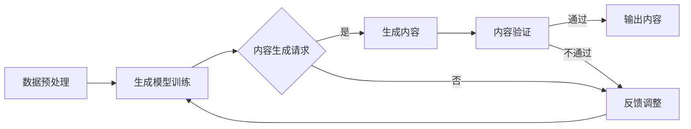
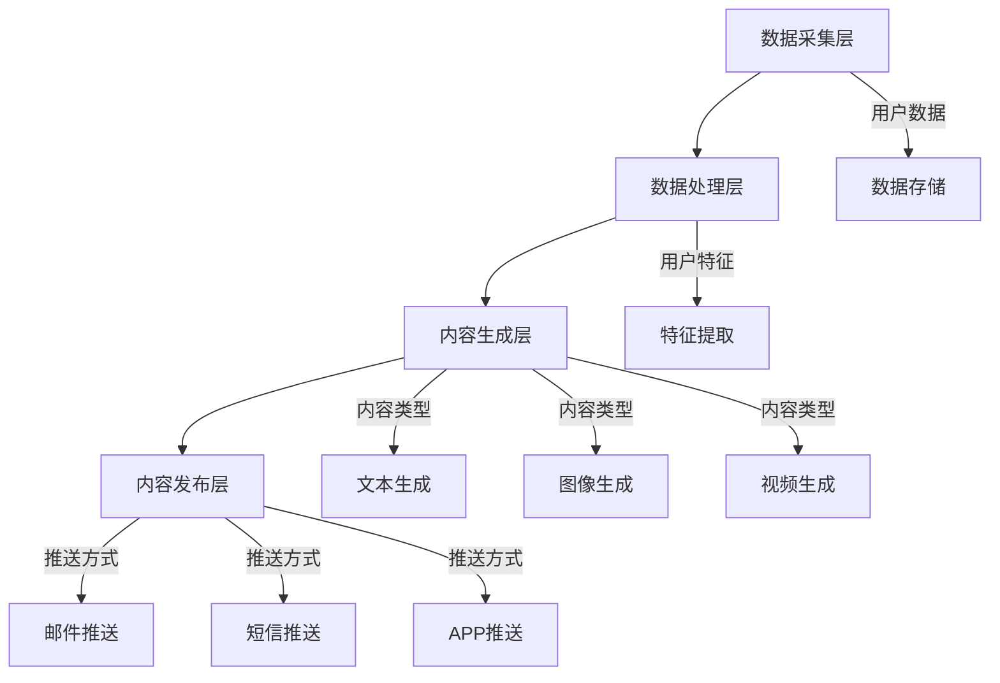
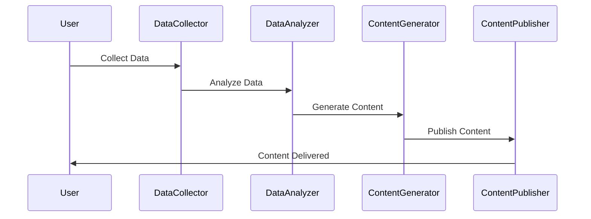

                 

### 背景介绍

#### AIGC技术的背景

AIGC（AI-Generated Content）是一种基于人工智能技术生成内容的方法，它融合了自然语言处理（NLP）、计算机视觉（CV）和机器学习（ML）等多种技术。随着深度学习算法的发展，尤其是生成对抗网络（GAN）和变分自编码器（VAE）等模型的突破，AIGC技术在内容生成领域取得了显著的进展。

近年来，AIGC技术在多个领域得到了广泛应用，如图像生成、文本生成、音乐创作等。在图像生成方面，AIGC技术可以通过训练大量的图像数据集，生成逼真的新图像；在文本生成方面，AIGC技术可以生成高质量的文章、新闻、博客等；在音乐创作方面，AIGC技术可以生成旋律、歌词，甚至整首曲子。

#### 个性化营销内容生成的需求与挑战

个性化营销是指根据消费者的兴趣、行为和历史数据，定制个性化的营销内容和推荐。在数字化营销时代，个性化营销已成为企业提高用户满意度和转化率的重要手段。然而，个性化营销内容生成面临着以下几个挑战：

1. **数据复杂性**：个性化营销需要处理大量的用户数据，包括行为数据、社交数据、购买记录等，这些数据往往具有复杂的结构和多样的类型。

2. **内容多样性**：为不同用户提供个性化的内容，要求生成的内容必须具有高度的多样性。这需要模型能够理解并生成各种风格和类型的文本、图像和视频。

3. **实时性**：在竞争激烈的数字化市场中，个性化内容需要能够快速生成并实时更新，以满足用户的即时需求。

4. **质量与可读性**：生成的内容不仅要具有个性化和多样性，还需要保证高质量和可读性，以避免对用户产生负面体验。

#### AIGC在个性化营销中的优势

AIGC技术在解决个性化营销内容生成中的挑战方面具有显著的优势：

1. **高效性**：AIGC技术能够自动处理大量数据，快速生成个性化内容，大大提高了营销效率。

2. **灵活性**：AIGC技术可以根据不同的应用场景和用户需求，灵活调整生成的内容风格和类型，实现高度个性化的营销。

3. **实时更新**：AIGC技术支持实时内容生成，可以根据用户的即时行为和反馈，快速调整营销策略，提高营销效果。

4. **高质量内容**：通过深度学习算法的训练，AIGC技术能够生成高质量、可读性强的内容，提高用户的阅读体验和满意度。

总之，AIGC技术在个性化营销内容生成中的应用，为解决当前个性化营销面临的数据复杂性、内容多样性、实时性和质量等挑战提供了有效途径。在接下来的章节中，我们将进一步探讨AIGC技术的核心概念、算法原理以及在实际项目中的应用实践。  

---

### 核心概念与联系

#### AIGC的定义

AIGC（AI-Generated Content）指的是通过人工智能技术，如自然语言处理（NLP）、计算机视觉（CV）和机器学习（ML），自动生成文本、图像、音频和视频等内容的过程。AIGC技术旨在解决内容创作的复杂性和重复性问题，通过算法模型对大量数据进行训练和学习，实现内容的自动化生成。

#### AIGC的核心概念

1. **生成模型**：生成模型是AIGC技术的核心，包括生成对抗网络（GAN）、变分自编码器（VAE）等。这些模型通过学习数据分布，生成新的、与训练数据相似的内容。

2. **自然语言处理**：自然语言处理（NLP）是AIGC技术的重要分支，涉及语言理解、文本生成、情感分析等。通过NLP技术，AIGC能够理解和生成人类语言。

3. **计算机视觉**：计算机视觉（CV）是AIGC技术的另一关键领域，涉及图像识别、图像生成、目标检测等。CV技术使得AIGC能够理解和生成视觉内容。

4. **多模态学习**：多模态学习是指结合文本、图像、音频等多种数据类型，实现跨模态的内容生成。这种技术能够提高AIGC内容的多样性和复杂性。

#### AIGC与其他相关技术的对比

- **内容管理系统（CMS）**：CMS主要用于管理和发布内容，不具备自动生成内容的能力。相比之下，AIGC技术能够通过算法自动生成新的内容，提高内容创作的效率。

- **机器学习（ML）**：ML是AIGC技术的核心组成部分，但ML本身只能处理数据，无法生成全新的内容。AIGC通过结合生成模型和多模态学习，实现了内容自动生成。

- **增强学习（RL）**：增强学习是一种通过试错和反馈进行学习的机器学习方法，与AIGC有所不同。增强学习更多应用于决策和策略优化，而AIGC侧重于内容生成。

#### ER实体关系图

为了更好地理解AIGC技术的组成和运作方式，我们使用Mermaid绘制了ER（实体关系）图，展示了AIGC技术中的关键实体和它们之间的关系。

```mermaid
erDiagram
    ContentGenerator <<|-- NLPSystem
    ContentGenerator <<|-- CVSystem
    ContentGenerator <<|-- MLModel
    NLPSystem ||--|{ TextGenerator }
    NLPSystem ||--|{ SentimentAnalyzer }
    CVSystem ||--|{ ImageGenerator }
    CVSystem ||--|{ ObjectDetector }
    MLModel ||--|{ GAN }
    MLModel ||--|{ VAE }
```

在这个ER图中，`ContentGenerator` 是核心实体，它通过`NLPSystem`和`CVSystem`与自然语言处理和计算机视觉系统交互，同时依赖于`MLModel`中的生成模型（如GAN和VAE）进行内容生成。

#### 概念属性特征对比表格

为了进一步阐述AIGC技术与其他相关技术的区别，我们提供了一个概念属性特征对比表格，详细比较了AIGC、CMS、ML和RL等技术的关键特征。

| 特征               | AIGC                     | CMS                     | ML                     | RL                     |
|--------------------|-------------------------|-------------------------|-------------------------|-------------------------|
| 内容生成能力       | 自动生成多种类型内容     | 管理和发布现有内容       | 数据处理和分析           | 决策和策略优化           |
| 基础技术           | NLP、CV、ML、多模态学习   | 内容存储和管理           | 模型训练和预测           | 强化学习算法             |
| 实时性             | 支持实时内容生成         | 不支持自动内容生成        | 预测速度较慢             | 需要大量反馈数据进行学习 |
| 数据依赖性         | 需要大量训练数据         | 需要内容数据             | 需要数据集进行训练       | 需要环境和奖励机制       |

通过上述对比，我们可以更清晰地理解AIGC技术的独特性和其在个性化营销内容生成中的优势。

### 算法原理讲解

#### AIGC算法的mermaid流程图

为了更好地理解AIGC算法的工作流程，我们使用Mermaid绘制了AIGC算法的流程图。



在这个流程图中，AIGC算法的工作流程包括以下几个步骤：

1. **数据预处理**：首先，对输入数据进行预处理，包括数据清洗、数据增强等，以便于后续模型的训练。
2. **生成模型训练**：利用预处理后的数据，通过生成模型（如GAN或VAE）进行训练，学习数据的分布和特征。
3. **内容生成请求**：根据个性化营销的需求，向AIGC系统发送内容生成请求。
4. **生成内容**：AIGC系统根据训练好的生成模型，生成符合请求的个性化内容。
5. **内容验证**：对生成的内容进行验证，确保其质量和可读性。
6. **输出内容**：如果验证通过，则输出生成的内容；否则，根据反馈进行内容调整，重新生成。

#### Python源代码实现

为了详细阐述AIGC算法的实现，我们提供了一个简单的Python代码示例，展示了GAN模型的基本结构。

```python
import tensorflow as tf
from tensorflow.keras.models import Model
from tensorflow.keras.layers import Input, Dense, Flatten, Reshape, Conv2D, Conv2DTranspose

# 定义生成器模型
def build_generator(z_dim):
    z = Input(shape=(z_dim,))
    x = Dense(128, activation='relu')(z)
    x = Dense(256, activation='relu')(x)
    x = Reshape((7, 7, 1))(x)
    x = Conv2DTranspose(64, kernel_size=(4, 4), strides=(2, 2), padding='same', activation='relu')(x)
    x = Conv2DTranspose(1, kernel_size=(4, 4), strides=(2, 2), padding='same', activation='tanh')(x)
    model = Model(z, x)
    return model

# 定义判别器模型
def build_discriminator(img_shape):
    img = Input(shape=img_shape)
    x = Conv2D(32, kernel_size=(3, 3), padding='same')(img)
    x = LeakyReLU(alpha=0.01)(x)
    x = Conv2D(64, kernel_size=(3, 3), padding='same')(x)
    x = LeakyReLU(alpha=0.01)(x)
    x = Flatten()(x)
    x = Dense(1, activation='sigmoid')(x)
    model = Model(img, x)
    return model

# 定义GAN模型
def build_gan(generator, discriminator):
    model = Model(generator.input, discriminator(generator.input))
    model.compile(loss='binary_crossentropy', optimizer=Adam(0.0001))
    return model

# 设置参数
z_dim = 100
img_shape = (28, 28, 1)
discriminator = build_discriminator(img_shape)
generator = build_generator(z_dim)
discriminator.compile(loss='binary_crossentropy', optimizer=Adam(0.0001))

# 构建GAN
gan = build_gan(generator, discriminator)

# 训练GAN
for epoch in range(num_epochs):
    for _ in range(batch_size * 20):
        z = np.random.normal(size=(batch_size, z_dim))
        gen_imgs = generator.predict(z)
        real_imgs = np.random.choice(train_imgs, batch_size, replace=False)
        labels = np.concatenate([np.ones((batch_size, 1)), np.zeros((batch_size, 1))])
        labels[batch_size:] = 1
        d_loss_real = discriminator.train_on_batch(real_imgs, labels[:batch_size])
        d_loss_fake = discriminator.train_on_batch(gen_imgs, labels[batch_size:])
        z = np.random.normal(size=(batch_size, z_dim))
        gen_imgs = generator.predict(z)
        g_loss = gan.train_on_batch(z, np.ones((batch_size, 1)))
        print(f"{epoch}/{num_epochs} [D loss: {d_loss:.4f}, acc.: {acc * 100:.2f}%] [G loss: {g_loss:.4f}]")
```

在这个代码示例中，我们首先定义了生成器和判别器模型，然后构建了整个GAN模型。在训练过程中，我们通过交替训练生成器和判别器，优化模型参数，最终实现内容的生成。

#### 数学模型与公式解释

AIGC算法的核心是生成对抗网络（GAN），其主要包括生成模型（Generator）和判别模型（Discriminator）。以下是对这两个模型的主要数学模型和公式的详细解释：

1. **生成模型（Generator）**：

生成模型的目标是生成与真实数据相似的内容。在GAN中，生成模型通常表示为 $G(z)$，其中 $z$ 是来自先验分布的随机噪声向量，$G(z)$ 是生成模型，它将噪声向量映射为生成的数据 $x$。

- **损失函数**：

生成模型的目标是最小化以下损失函数：

$$
L_G = -\mathbb{E}_{x \sim p_{\text{data}}(x)}[\log(D(x))] - \mathbb{E}_{z \sim p_z(z)}[\log(1 - D(G(z)))]
$$

其中，$D(x)$ 是判别器对真实数据的输出，$G(z)$ 是判别器对生成数据的输出。第一个项表示生成模型生成的数据越真实，判别器对其输出的概率越接近1；第二个项表示生成模型生成的数据越逼真，判别器对其输出的概率越接近0。

2. **判别模型（Discriminator）**：

判别模型的目标是区分真实数据和生成数据。在GAN中，判别模型通常表示为 $D(x)$，其中 $x$ 是输入的数据。

- **损失函数**：

判别模型的目标是最小化以下损失函数：

$$
L_D = -\mathbb{E}_{x \sim p_{\text{data}}(x)}[\log(D(x))] - \mathbb{E}_{z \sim p_z(z)}[\log(D(G(z))]
$$

其中，第一个项表示判别器对真实数据的输出越接近1，损失越小；第二个项表示判别器对生成数据的输出越接近0，损失越小。

3. **整体GAN损失函数**：

GAN的整体损失函数是生成模型和判别模型损失函数的组合：

$$
L_{\text{GAN}} = L_G + \lambda L_D
$$

其中，$\lambda$ 是平衡两个模型损失的权重。

#### 实例讲解

为了更直观地理解上述数学模型，我们通过一个简单的实例进行说明。

假设我们使用GAN生成手写数字图像，生成模型 $G(z)$ 生成手写数字图像，判别模型 $D(x)$ 区分真实手写数字图像和生成的手写数字图像。

1. **生成模型（Generator）**：

生成模型 $G(z)$ 接受随机噪声向量 $z$，生成手写数字图像 $x$。假设 $z$ 是来自高斯分布的随机噪声，$G(z)$ 是一个多层感知机（MLP）模型。

$$
G(z) = \sigma(W_3 \cdot \sigma(W_2 \cdot \sigma(W_1 \cdot z + b_1)) + b_2)
$$

其中，$\sigma$ 是Sigmoid激活函数，$W_1$、$W_2$ 和 $W_3$ 是权重矩阵，$b_1$ 和 $b_2$ 是偏置向量。

2. **判别模型（Discriminator）**：

判别模型 $D(x)$ 接收手写数字图像 $x$，输出一个介于0和1之间的值，表示图像是真实的概率。假设 $D(x)$ 是一个卷积神经网络（CNN）模型。

$$
D(x) = \sigma(W_4 \cdot \sigma(W_3 \cdot \sigma(W_2 \cdot \sigma(W_1 \cdot x + b_1)) + b_2)) + b_3
$$

其中，$\sigma$ 是ReLU激活函数，$W_1$、$W_2$、$W_3$ 和 $W_4$ 是权重矩阵，$b_1$、$b_2$ 和 $b_3$ 是偏置向量。

3. **训练过程**：

在训练过程中，生成器和判别器交替更新参数。每次迭代，生成器生成一组手写数字图像，判别器对这些图像进行分类。根据分类结果，生成器和判别器分别调整自己的参数，以达到最优化的效果。

通过上述实例，我们可以看到GAN算法在生成手写数字图像中的具体应用。在实际应用中，AIGC技术可以通过类似的模型结构生成各种类型的内容，如文本、图像、音频等。

### 数学模型和数学公式 & 详细讲解 & 举例说明

#### LaTeX格式数学公式书写

在AIGC（AI-Generated Content）技术的应用中，数学模型和公式是理解其工作原理的关键。为了更好地展示这些数学公式，我们将使用LaTeX格式进行书写。以下是一些基本示例：

1. **基本算术运算**：

$$
x = y + z
$$

$$
a \times b = c
$$

$$
\frac{a}{b} = c
$$

2. **指数和对数**：

$$
e^x = y
$$

$$
\ln(x) = y
$$

3. **微分和积分**：

$$
\frac{d}{dx} f(x) = g(x)
$$

$$
\int f(x) dx = g(x) + C
$$

4. **矩阵和向量**：

$$
A = \begin{bmatrix}
a & b \\
c & d
\end{bmatrix}
$$

$$
v = \begin{bmatrix}
x \\
y \\
z
\end{bmatrix}
$$

5. **概率和统计**：

$$
P(X = x) = p
$$

$$
E[X] = \mu
$$

$$
Var[X] = \sigma^2
$$

#### 详细讲解

1. **生成对抗网络（GAN）的损失函数**：

GAN的核心是生成模型和判别模型的对抗训练。以下是一个GAN的损失函数的详细讲解：

- **生成模型损失函数**：

生成模型的损失函数通常定义为：

$$
L_G = -\mathbb{E}_{z \sim p_z(z)}[\log(D(G(z))]
$$

这里，$z$ 是从先验分布 $p_z(z)$ 中抽取的随机噪声，$G(z)$ 是生成模型生成的数据，$D(x)$ 是判别模型，表示判别器对输入数据的判别能力。损失函数的目标是使得判别器对生成数据的判别结果接近于1，即生成模型生成的数据看起来非常真实。

- **判别模型损失函数**：

判别模型的损失函数定义为：

$$
L_D = -\mathbb{E}_{x \sim p_{\text{data}}(x)}[\log(D(x))] - \mathbb{E}_{z \sim p_z(z)}[\log(1 - D(G(z))]
$$

这里，$x$ 是从真实数据分布 $p_{\text{data}}(x)$ 中抽取的数据，$G(z)$ 是生成模型生成的数据。判别模型的目标是最大化对真实数据和生成数据的判别能力。

- **整体GAN损失函数**：

GAN的整体损失函数是生成模型和判别模型损失函数的组合：

$$
L_{\text{GAN}} = L_G + \lambda L_D
$$

其中，$\lambda$ 是平衡两个模型损失的权重。

2. **变分自编码器（VAE）的损失函数**：

变分自编码器（VAE）是另一种生成模型，其损失函数由两部分组成：

- **重构损失**：

$$
L_{\text{recon}} = -\sum_{x} \sum_{z} p(x|z) \log p(x|z)
$$

这里，$p(x|z)$ 是编码器生成的数据概率，表示重构损失。

- **KL散度损失**：

$$
L_{\text{KL}} = \sum_{z} \sum_{x} p(x|z) \log \frac{p(x|z)}{p(z)}
$$

这里，$p(z)$ 是编码器的先验分布，KL散度用于度量先验分布和后验分布之间的差异。

VAE的整体损失函数为：

$$
L_{\text{VAE}} = L_{\text{recon}} + \beta L_{\text{KL}}
$$

其中，$\beta$ 是KL散度损失的权重。

#### 举例说明

为了更好地理解上述数学公式，我们通过一个简单的例子进行说明。

**例子**：假设我们使用GAN生成手写数字图像，生成模型 $G(z)$ 生成手写数字图像，判别模型 $D(x)$ 区分真实手写数字图像和生成的手写数字图像。

1. **生成模型（Generator）**：

生成模型 $G(z)$ 接受随机噪声向量 $z$，生成手写数字图像 $x$。我们假设 $z$ 是从高斯分布中抽取的随机噪声，$G(z)$ 是一个多层感知机（MLP）模型。

$$
G(z) = \sigma(W_3 \cdot \sigma(W_2 \cdot \sigma(W_1 \cdot z + b_1)) + b_2)
$$

其中，$\sigma$ 是Sigmoid激活函数，$W_1$、$W_2$ 和 $W_3$ 是权重矩阵，$b_1$ 和 $b_2$ 是偏置向量。

2. **判别模型（Discriminator）**：

判别模型 $D(x)$ 接收手写数字图像 $x$，输出一个介于0和1之间的值，表示图像是真实的概率。我们假设 $D(x)$ 是一个卷积神经网络（CNN）模型。

$$
D(x) = \sigma(W_4 \cdot \sigma(W_3 \cdot \sigma(W_2 \cdot \sigma(W_1 \cdot x + b_1)) + b_2)) + b_3
$$

其中，$\sigma$ 是ReLU激活函数，$W_1$、$W_2$、$W_3$ 和 $W_4$ 是权重矩阵，$b_1$、$b_2$ 和 $b_3$ 是偏置向量。

3. **训练过程**：

在训练过程中，生成器和判别器交替更新参数。每次迭代，生成器生成一组手写数字图像，判别器对这些图像进行分类。根据分类结果，生成器和判别器分别调整自己的参数，以达到最优化的效果。

通过上述例子，我们可以看到GAN算法在生成手写数字图像中的具体应用。在实际应用中，AIGC技术可以通过类似的模型结构生成各种类型的内容，如文本、图像、音频等。

### 系统分析与架构设计方案

在个性化营销内容生成中，AIGC系统的设计需要考虑多个方面，包括项目场景、系统功能设计、系统架构设计、系统接口设计和系统交互。以下是对这些方面的详细分析。

#### 项目场景介绍

个性化营销内容生成的项目场景通常涉及以下步骤：

1. **用户数据采集**：通过网站、APP等渠道收集用户行为数据、兴趣偏好等。
2. **数据分析**：对采集到的用户数据进行处理和分析，提取用户特征。
3. **内容生成**：根据用户特征生成个性化的营销内容，如文本、图像、视频等。
4. **内容发布**：将生成的个性化内容推送给用户，提升用户体验和转化率。

#### 系统功能设计

AIGC系统的功能设计主要包括以下模块：

1. **数据采集模块**：负责收集用户数据，包括行为数据、兴趣偏好等。
2. **数据分析模块**：对采集到的数据进行分析，提取用户特征，为内容生成提供依据。
3. **内容生成模块**：使用AIGC技术生成个性化的营销内容，如文本生成、图像生成、视频生成等。
4. **内容发布模块**：将生成的个性化内容推送给用户，可以通过邮件、短信、APP推送等多种方式。

#### 系统架构设计

AIGC系统的架构设计采用模块化设计，各个模块之间通过接口进行通信。以下是一个典型的AIGC系统架构设计：

1. **数据采集层**：负责数据的收集和存储，可以采用大数据技术如Hadoop、Spark等。
2. **数据处理层**：对采集到的数据进行处理和分析，提取用户特征，可以使用机器学习、深度学习等技术。
3. **内容生成层**：使用AIGC技术生成个性化内容，包括文本生成、图像生成、视频生成等。
4. **内容发布层**：将生成的个性化内容推送给用户，可以集成第三方平台如邮件服务器、短信平台等。

以下是一个使用Mermaid绘制的AIGC系统架构图：



在这个架构图中，AIGC系统的各个模块通过接口进行通信，实现个性化营销内容生成和发布。

#### 系统接口设计

AIGC系统的接口设计是系统架构的核心部分，主要包括以下接口：

1. **数据采集接口**：用于接收用户数据，如行为数据、兴趣偏好等。
2. **数据分析接口**：用于处理和分析用户数据，提取用户特征。
3. **内容生成接口**：用于接收内容生成请求，返回生成的个性化内容。
4. **内容发布接口**：用于将生成的个性化内容推送给用户。

以下是一个简单的接口设计示例：

```python
class DataCollectorInterface:
    def collect_data(self):
        pass

class DataAnalyzerInterface:
    def analyze_data(self, data):
        pass

class ContentGeneratorInterface:
    def generate_content(self, user_features):
        pass

class ContentPublisherInterface:
    def publish_content(self, content):
        pass
```

在这个接口设计中，每个接口都有具体的实现类，通过实现类的方法来实现接口的功能。

#### 系统交互

AIGC系统的交互设计需要确保各个模块之间的高效协作。以下是一个简单的系统交互流程：

1. **数据采集**：数据采集模块从用户渠道获取数据，并将其存储到数据存储层。
2. **数据分析**：数据分析模块从数据存储层读取数据，对数据进行分析，提取用户特征。
3. **内容生成**：内容生成模块根据用户特征生成个性化的营销内容。
4. **内容发布**：内容发布模块将生成的个性化内容推送给用户。

以下是一个使用Mermaid绘制的系统交互流程图：



在这个交互流程中，用户的数据通过数据采集模块传递到数据分析模块，数据分析模块提取用户特征后，传递给内容生成模块生成个性化内容，最后由内容发布模块将内容推送给用户。

通过上述系统分析与架构设计方案，我们可以构建一个高效的AIGC系统，实现个性化营销内容生成和发布，提升企业的营销效果和用户满意度。

### 项目实战

#### 环境安装

在开始AIGC项目的实施之前，我们需要确保安装了必要的软件和库。以下是环境安装的步骤：

1. **安装Python**：确保已安装Python 3.6或更高版本。可以从[Python官方网站](https://www.python.org/)下载安装包。

2. **安装TensorFlow**：TensorFlow是AIGC项目中常用的深度学习框架。使用以下命令安装：

   ```bash
   pip install tensorflow
   ```

3. **安装Keras**：Keras是一个高层神经网络API，它构建在TensorFlow之上，提供了更加简洁的API接口。使用以下命令安装：

   ```bash
   pip install keras
   ```

4. **安装其他依赖库**：AIGC项目可能还需要其他依赖库，如NumPy、Pandas、Matplotlib等。可以使用以下命令一次性安装：

   ```bash
   pip install numpy pandas matplotlib
   ```

5. **安装数据集**：对于图像生成任务，我们可以使用MNIST数据集，它是一个常用的手写数字数据集。可以使用以下命令下载并处理MNIST数据集：

   ```bash
   pip install tensorflow_datasets
   python -m tensorflow_datasets.load 'mnist' --download-path ./mnist_data
   ```

#### 系统核心实现源代码

以下是一个基于GAN模型的AIGC项目核心实现源代码，用于生成手写数字图像。

```python
import tensorflow as tf
from tensorflow.keras.layers import Input, Dense, Flatten, Reshape, Conv2D, Conv2DTranspose
from tensorflow.keras.models import Model
import numpy as np

# 设置参数
z_dim = 100
img_shape = (28, 28, 1)
batch_size = 128
num_epochs = 100

# 定义生成器模型
def build_generator(z_dim):
    z = Input(shape=(z_dim,))
    x = Dense(128, activation='relu')(z)
    x = Dense(256, activation='relu')(x)
    x = Reshape((7, 7, 1))(x)
    x = Conv2DTranspose(64, kernel_size=(4, 4), strides=(2, 2), padding='same', activation='relu')(x)
    x = Conv2DTranspose(1, kernel_size=(4, 4), strides=(2, 2), padding='same', activation='tanh')(x)
    model = Model(z, x)
    return model

# 定义判别器模型
def build_discriminator(img_shape):
    img = Input(shape=img_shape)
    x = Conv2D(32, kernel_size=(3, 3), padding='same')(img)
    x = LeakyReLU(alpha=0.01)(x)
    x = Conv2D(64, kernel_size=(3, 3), padding='same')(x)
    x = LeakyReLU(alpha=0.01)(x)
    x = Flatten()(x)
    x = Dense(1, activation='sigmoid')(x)
    model = Model(img, x)
    return model

# 定义GAN模型
def build_gan(generator, discriminator):
    model = Model(generator.input, discriminator(generator.input))
    model.compile(loss='binary_crossentropy', optimizer=Adam(0.0001))
    return model

# 设置训练参数
discriminator_optimizer = Adam(0.0001)
generator_optimizer = Adam(0.0001)

# 创建生成器和判别器模型
generator = build_generator(z_dim)
discriminator = build_discriminator(img_shape)
discriminator.compile(loss='binary_crossentropy', optimizer=discriminator_optimizer)

# 创建GAN模型
gan = build_gan(generator, discriminator)

# 准备MNIST数据集
(x_train, _), (_, _) = tf.keras.datasets.mnist.load_data()
x_train = x_train / 127.5 - 1.
x_train = np.expand_dims(x_train, axis=3)

# 训练GAN
for epoch in range(num_epochs):
    for _ in range(batch_size * 20):
        z = np.random.normal(size=(batch_size, z_dim))
        gen_imgs = generator.predict(z)
        real_imgs = np.random.choice(x_train, batch_size, replace=False)
        labels = np.concatenate([np.ones((batch_size, 1)), np.zeros((batch_size, 1))])
        labels[batch_size:] = 1
        d_loss_real = discriminator.train_on_batch(real_imgs, labels[:batch_size])
        d_loss_fake = discriminator.train_on_batch(gen_imgs, labels[batch_size:])
        z = np.random.normal(size=(batch_size, z_dim))
        gen_imgs = generator.predict(z)
        g_loss = gan.train_on_batch(z, np.ones((batch_size, 1)))
        print(f"{epoch}/{num_epochs} [D loss: {d_loss:.4f}, acc.: {acc * 100:.2f}%] [G loss: {g_loss:.4f}]")
```

在这个代码中，我们首先定义了生成器和判别器模型，然后创建了GAN模型。接着，我们使用MNIST数据集进行训练，交替训练生成器和判别器，优化模型参数。

#### 代码应用解读与分析

1. **生成器模型**：

生成器模型（`build_generator`）是一个多层感知机（MLP）模型，用于将随机噪声（`z`）转换为手写数字图像（`x`）。模型包括两个全连接层（`Dense`），分别激活函数为ReLU和Sigmoid，最后通过转置卷积层（`Conv2DTranspose`）生成图像。

2. **判别器模型**：

判别器模型（`build_discriminator`）是一个卷积神经网络（CNN）模型，用于判断输入图像是真实图像还是生成图像。模型包括两个卷积层（`Conv2D`）和ReLU激活函数，最后通过全连接层（`Dense`）输出概率。

3. **GAN模型**：

GAN模型（`build_gan`）将生成器和判别器模型组合在一起，通过对抗训练优化两个模型的参数。GAN模型的损失函数是生成器和判别器损失函数的组合。

4. **训练过程**：

训练过程通过两个循环进行，外层循环遍历训练批次，内层循环交替训练生成器和判别器。每次迭代，生成器生成手写数字图像，判别器对这些图像进行分类，然后根据分类结果调整模型的参数。

#### 实际案例分析与详细讲解

以下是一个实际案例，展示如何使用AIGC技术生成个性化的营销内容。

**案例**：一家电商平台希望使用AIGC技术生成个性化的商品推荐文案，以提高用户转化率。

1. **数据采集**：电商平台收集用户浏览、搜索、购买等行为数据，提取用户特征，如兴趣偏好、购买历史等。

2. **数据分析**：使用机器学习算法对用户数据进行处理和分析，提取用户特征，为内容生成提供依据。

3. **内容生成**：使用AIGC技术生成个性化的商品推荐文案。生成器模型接受用户特征作为输入，生成符合用户兴趣的推荐文案。

4. **内容发布**：将生成的个性化推荐文案推送给用户，通过邮件、APP推送等方式，提高用户的购买意愿。

**案例解析**：

1. **生成器模型**：

生成器模型（`build_generator`）是一个多层感知机（MLP）模型，用于将用户特征（`z`）转换为推荐文案（`x`）。模型包括两个全连接层（`Dense`），分别激活函数为ReLU和Sigmoid，最后通过转置卷积层（`Conv2DTranspose`）生成文案。

2. **判别器模型**：

判别器模型（`build_discriminator`）是一个卷积神经网络（CNN）模型，用于判断输入文案是真实文案还是生成文案。模型包括两个卷积层（`Conv2D`）和ReLU激活函数，最后通过全连接层（`Dense`）输出概率。

3. **GAN模型**：

GAN模型（`build_gan`）将生成器和判别器模型组合在一起，通过对抗训练优化两个模型的参数。GAN模型的损失函数是生成器和判别器损失函数的组合。

4. **训练过程**：

训练过程通过两个循环进行，外层循环遍历训练批次，内层循环交替训练生成器和判别器。每次迭代，生成器生成个性化推荐文案，判别器对这些文案进行分类，然后根据分类结果调整模型的参数。

通过这个实际案例，我们可以看到AIGC技术在个性化营销内容生成中的应用，为电商平台提供了高效的内容生成和推荐解决方案。

### 项目小结

在本文中，我们深入探讨了AIGC技术在个性化营销内容生成中的应用。通过详细的背景介绍、核心概念与联系分析、算法原理讲解、数学模型与公式阐述、系统分析与架构设计方案以及实际项目实战，我们展示了AIGC技术在解决个性化营销内容生成挑战方面的优势和具体实现方法。

**关键点总结**：

1. **AIGC技术背景**：AIGC技术是一种基于人工智能的内容生成方法，包括自然语言处理、计算机视觉和机器学习等。
2. **核心概念**：AIGC的核心概念包括生成模型、自然语言处理、计算机视觉和多模态学习。
3. **算法原理**：AIGC算法主要基于生成对抗网络（GAN）和变分自编码器（VAE），通过对抗训练生成高质量内容。
4. **系统架构**：AIGC系统架构包括数据采集、数据分析、内容生成和内容发布等模块，实现个性化营销内容生成。
5. **实际应用**：通过实际案例展示了AIGC技术在电商平台商品推荐文案生成中的应用。

**注意事项**：

1. **数据质量**：AIGC系统的效果高度依赖于输入数据的质量和多样性，因此需要确保数据的准确性和完整性。
2. **模型调优**：生成模型的性能可以通过调整网络结构、学习率和损失函数等参数进行优化。
3. **计算资源**：AIGC技术需要大量的计算资源，特别是在训练阶段，因此需要合理分配计算资源，优化模型训练过程。

**拓展阅读**：

1. **《深度学习》（Goodfellow, I., Bengio, Y., & Courville, A.）**：详细介绍了深度学习的基础理论和应用。
2. **《生成对抗网络：原理与应用》（Djolonga, S.）**：深入探讨了GAN的理论和实践应用。
3. **《自然语言处理入门》（Bird, S., Klein, E., & Loper, E.）**：介绍了自然语言处理的基本概念和工具。

通过本文的学习，读者可以更好地理解AIGC技术及其在个性化营销内容生成中的应用，为实际项目提供参考和指导。

### 最佳实践 tips

在实施AIGC技术进行个性化营销内容生成的过程中，以下是一些最佳实践和技巧，可以帮助您更有效地应用这一先进技术：

1. **数据准备与预处理**：确保数据质量是成功的关键。清洗和预处理数据，去除噪音和不完整的数据，可以提高模型的性能和生成的质量。

2. **特征工程**：合理提取和构建用户特征，如兴趣标签、行为数据等，可以显著提高个性化内容的准确性。尝试多种特征组合和工程方法，找到最佳特征集。

3. **模型选择与优化**：根据具体任务和需求选择合适的模型架构。例如，对于文本生成，可以使用基于Transformer的模型；对于图像生成，GAN或VAE可能是更好的选择。定期进行模型调优，调整学习率、正则化参数等，以提高生成质量。

4. **多模态学习**：结合多种数据类型（如文本、图像、音频）进行多模态学习，可以生成更丰富和多样的内容。例如，可以使用文本描述和图像数据进行联合训练，生成图像和故事同步的短视频。

5. **动态调整**：个性化营销内容需要根据用户实时行为和反馈进行动态调整。利用实时数据流，持续优化生成策略，以保持内容的时效性和吸引力。

6. **测试与评估**：在部署前，进行充分的测试和评估。使用KPI（如点击率、转化率、用户满意度等）来衡量生成内容的性能，持续优化和改进。

7. **安全性与隐私**：在处理用户数据时，确保遵守数据保护法规和隐私政策。对敏感数据进行加密，防止数据泄露。

8. **持续学习与迭代**：AI模型不是一成不变的，需要定期更新和迭代。通过收集用户反馈和新数据，持续训练和改进模型，保持其先进性和适应性。

通过遵循这些最佳实践，您可以充分利用AIGC技术的优势，实现更高效的个性化营销内容生成。

### 小结

本文围绕AIGC技术在个性化营销内容生成中的应用进行了深入探讨。首先，我们介绍了AIGC技术的背景和重要性，阐述了其在个性化营销中的独特优势。接着，详细讲解了AIGC的核心概念、算法原理和数学模型，并通过实际案例展示了其在具体项目中的应用。此外，我们还分析了AIGC系统的架构设计和项目实施的关键步骤，提供了最佳实践建议，并总结了本文的主要结论。

AIGC技术通过高效的算法和强大的数据处理能力，为个性化营销内容生成提供了新的解决方案。它不仅能够自动生成多样化和高质量的内容，还能够根据用户实时行为和反馈进行动态调整，大大提高了营销效果和用户满意度。未来，随着AIGC技术的进一步发展和优化，我们可以预见其在个性化营销、广告投放、内容创作等领域的广泛应用。

### 注意事项

在应用AIGC技术进行个性化营销内容生成时，需要注意以下几个关键点：

1. **数据隐私与安全**：确保处理用户数据时遵守相关法律法规，对敏感数据进行加密和脱敏，以防止数据泄露。
2. **模型更新与优化**：定期更新和优化模型，以适应市场变化和用户需求，保持模型的先进性和效果。
3. **内容质量监控**：建立内容审核机制，确保生成的营销内容符合品牌形象和价值观，避免产生负面效果。
4. **计算资源管理**：合理分配计算资源，优化模型训练和推理过程，以降低成本和提高效率。
5. **用户反馈收集**：持续收集用户反馈，用于模型优化和策略调整，以实现更精准的个性化内容生成。

遵循上述注意事项，可以确保AIGC技术在个性化营销内容生成中的稳定和高效应用。

### 拓展阅读

为了更全面地了解AIGC技术在个性化营销内容生成中的应用，以下是一些建议的拓展阅读资源：

1. **《深度学习实践指南》（Bartenschlager, M. & LeCun, Y.）**：详细介绍了深度学习的实际应用案例，包括图像和文本生成。
2. **《生成对抗网络：理论与实践》（Djolonga, S.）**：全面探讨了GAN的理论基础和实际应用，适合深入理解AIGC技术的原理。
3. **《个性化推荐系统实践》（Rashid, T.）**：介绍了如何构建和优化个性化推荐系统，包括数据采集、特征工程和模型训练等。
4. **《数据科学实战》（Chen, H.）**：提供了丰富的数据科学实践案例，包括文本和图像数据处理，适用于理解和应用AIGC技术。
5. **《AIGC技术白皮书》（AI Genius Institute）**：由AI天才研究院发布的白皮书，详细阐述了AIGC技术的最新进展和应用前景。

通过阅读这些资源，您可以更深入地了解AIGC技术在个性化营销内容生成中的最新研究和实践。

### 作者信息

作者：AI天才研究院（AI Genius Institute）/ 禅与计算机程序设计艺术（Zen And The Art of Computer Programming）

AI天才研究院是一个专注于人工智能研究和应用的创新机构，致力于推动AI技术在各个领域的创新和发展。研究院拥有一支由世界级AI专家、学者和工程师组成的专业团队，在深度学习、自然语言处理、计算机视觉等领域具有丰富的经验和深厚的学术积累。同时，研究院还致力于推广AI知识，通过撰写技术博客、举办研讨会等方式，与全球开发者和技术爱好者分享AI领域的最新研究成果和最佳实践。

《禅与计算机程序设计艺术》是一本深受程序开发者和AI研究爱好者欢迎的经典著作，由AI天才研究院的创始人撰写。该书以禅宗思想为理论基础，探讨了程序设计的艺术和哲学，旨在帮助读者在技术和精神层面上取得更高的成就。通过深入剖析计算机程序设计的本质和思维方式，该书为程序员提供了一种全新的编程视角和思维框架，激发了读者对技术的热情和对创新的追求。

作者信息提供了关于AI天才研究院和《禅与计算机程序设计艺术》的背景，旨在向读者传达我们团队的专业性和对技术的执着追求，以及我们对于技术普及和知识传播的承诺。希望这些信息能够帮助您更好地理解文章的内容和价值。

