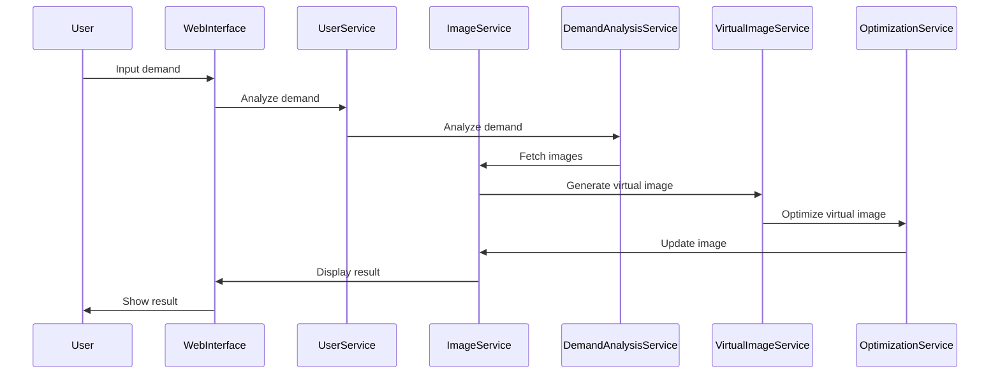
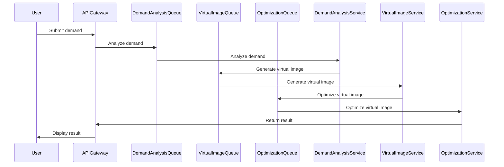

                 

## AIGC在个性化虚拟形象生成中的创新

### 背景介绍

在数字化时代，个性化虚拟形象的生成与应用已经逐渐渗透到娱乐、教育、广告、医疗等多个领域。虚拟形象的个性化不仅体现在外观上，还包括性格、行为、语言等多个方面。随着人工智能（AI）技术的迅猛发展，尤其是生成对抗网络（GAN）、深度学习、自然语言处理（NLP）等技术的成熟，个性化虚拟形象的生成已经不再仅仅是一个梦想，而是成为了现实。而人工智能生成内容（AIGC，AI-generated Content）作为近年来AI领域的重要研究方向，其在个性化虚拟形象生成中的应用具有极高的创新潜力。

#### 核心概念术语说明

- **AIGC**：人工智能生成内容，指的是通过算法自动生成的内容，如文本、图像、音频、视频等。
- **个性化虚拟形象**：通过人工智能技术，根据用户需求定制生成的虚拟角色，具备独特的外貌、性格和技能。

#### 问题背景

虚拟形象生成技术的发展不仅推动了虚拟现实（VR）和增强现实（AR）的进步，还为数字娱乐、电商营销、在线教育等提供了新的解决方案。传统的虚拟形象生成方式主要依赖于手绘和动画技术，不仅成本高昂，而且难以满足快速变化的市场需求。而AIGC技术的引入，使得虚拟形象的生成变得更加高效、灵活和个性化，为各行业带来了新的发展契机。

#### 问题描述

个性化虚拟形象生成的需求日益增长，如何在确保质量和多样性的同时，降低生成成本和提高生成效率，成为当前研究的热点问题。传统的生成方式无法满足这一需求，需要引入新的技术手段来突破现有瓶颈。

#### 问题解决

AIGC技术提供了生成个性化虚拟形象的新路径。通过深度学习、GAN、NLP等技术的综合应用，可以实现虚拟形象的高效生成和个性化定制。以下是一些具体的技术和方法：

- **生成对抗网络（GAN）**：通过生成器和判别器的对抗训练，可以生成高质量的虚拟形象。
- **自然语言处理（NLP）**：通过文本分析，了解用户需求，为虚拟形象生成提供指导。
- **深度学习**：利用神经网络模型，对大量数据进行训练，提取特征，生成虚拟形象。

#### 边界与外延

AIGC技术在个性化虚拟形象生成中的应用，不仅限于外观和行为的个性化，还可以扩展到情感、认知等更为复杂的层面。随着技术的不断发展，AIGC的应用范围将会进一步扩大。

#### 概念结构与核心要素组成

AIGC在个性化虚拟形象生成中的核心概念和要素包括：

- **数据集**：用于训练和生成虚拟形象的图像和文本数据。
- **算法**：如GAN、NLP、深度学习等，用于处理数据和生成虚拟形象。
- **用户需求**：个性化的需求，如外貌特征、性格设定、互动方式等。

综上所述，AIGC在个性化虚拟形象生成中具有广阔的应用前景。通过不断探索和创新，AIGC技术有望为虚拟形象生成带来革命性的变革。

### 核心概念与联系

#### 核心概念原理

1. **人工智能生成内容（AIGC）**：
   AIGC是指通过人工智能算法自动生成的内容，包括文本、图像、音频、视频等。其核心原理是基于深度学习和生成对抗网络（GAN）等技术，通过对大规模数据的训练和学习，生成符合特定需求的内容。

2. **生成对抗网络（GAN）**：
   GAN由生成器和判别器两个主要部分组成。生成器生成数据，判别器判断数据是否真实。通过两者之间的对抗训练，生成器不断提高生成数据的质量，最终能够生成高度真实的数据。

3. **自然语言处理（NLP）**：
   NLP是使计算机能够理解和处理人类语言的技术。主要涵盖词法分析、句法分析、语义分析和语音识别等。在AIGC中，NLP技术用于理解和处理用户的语言输入，为虚拟形象的生成提供指导。

#### 概念属性特征对比表格

| 概念       | 特征与属性                                             |
|------------|------------------------------------------------------|
| AIGC       | 自动生成内容，包括文本、图像、音频、视频等；依赖深度学习和GAN等算法 |
| GAN        | 由生成器和判别器组成；对抗训练生成高质量数据             |
| NLP        | 语言理解和处理技术；涵盖词法、句法、语义和语音识别等       |

#### ER实体关系图架构

为了更好地理解AIGC在个性化虚拟形象生成中的应用，我们可以通过ER（实体关系）图来展示相关实体及其关系。以下是AIGC在个性化虚拟形象生成中的ER图：

```mermaid
erDiagram
  用户 ||--|{ 虚拟形象 }|
  用户 ||--|{ 用户需求 }|
  虚拟形象 ||--|{ 外观特征 }|
  虚拟形象 ||--|{ 性格特征 }|
  虚拟形象 ||--|{ 行为特征 }|
  GAN ||--|{ 数据集 }|
  GAN ||--|{ 生成器 }|
  GAN ||--|{ 判别器 }|
  NLP ||--|{ 文本处理 }|
  数据集 ||--|{ 图像数据 }|
  数据集 ||--|{ 文本数据 }|
```

在这个ER图中，用户是生成个性化虚拟形象的主要角色，通过用户需求和GAN、NLP技术生成具有个性化特征的虚拟形象。GAN用于生成图像和视频数据，而NLP则用于处理和生成文本内容。

通过上述核心概念和联系的分析，我们可以看到AIGC技术在个性化虚拟形象生成中扮演着关键角色，其综合应用为虚拟形象生成带来了新的可能性。

### 主流AIGC技术简介

在个性化虚拟形象生成中，AIGC技术的应用主要依赖于几种主流技术，包括生成对抗网络（GAN）、扩散模型（Diffusion Model）以及其他知名的AIGC技术。下面将逐一介绍这些技术的基本原理和应用。

#### 1. GPT系列模型

**GPT系列模型**，即通用预训练语言模型（General Pre-trained Language Models），是自然语言处理领域的重要突破。GPT模型通过在大量文本数据上进行预训练，学习到文本的语法、语义和上下文信息，从而能够生成流畅、符合语境的文本。

**原理**：GPT模型的核心是Transformer架构，它通过多头自注意力机制（Multi-Head Self-Attention）来捕捉输入文本中的复杂关系。预训练过程中，模型学习到一个输入序列的概率分布，从而能够预测下一个词。

**应用**：在个性化虚拟形象生成中，GPT模型可以用于生成虚拟形象的对话文本。例如，一个虚拟助手可以通过GPT模型生成自然、流畅的对话，与用户进行互动。

#### 2. Diffusion模型

**扩散模型**是一种新兴的AIGC技术，它通过模拟物理过程中的扩散现象来生成数据。扩散模型将数据从高斯噪声逐步“扩散”到真实数据，从而实现数据的生成。

**原理**：扩散模型分为两个过程：扩散过程和去噪过程。在扩散过程中，数据被逐渐添加噪声，最终变成高斯噪声。去噪过程中，模型通过训练学习到如何从高斯噪声中恢复出真实数据。

**应用**：在虚拟形象生成中，扩散模型可以用于生成逼真的图像和视频。例如，可以通过扩散模型生成个性化虚拟角色的面部表情、服饰和动作。

#### 3. 其他知名AIGC技术

除了GPT系列模型和扩散模型，还有一些其他知名的AIGC技术，如生成对抗网络（GAN）和变分自编码器（VAE）。

- **生成对抗网络（GAN）**：GAN是一种通过生成器和判别器对抗训练的模型，生成器生成数据，判别器判断数据真实性。GAN在图像和视频生成中具有广泛的应用。

- **变分自编码器（VAE）**：VAE是一种基于概率编码的生成模型，通过学习数据的概率分布来生成数据。VAE在图像生成和风格迁移等方面有广泛应用。

这些AIGC技术各有特色，可以相互补充，为个性化虚拟形象生成提供了多种选择。在实际应用中，可以根据具体需求和场景选择合适的技术进行组合使用。

### AIGC在虚拟形象生成中的应用原理

AIGC技术在个性化虚拟形象生成中的应用，主要通过以下三个方面实现：数据集准备、算法选择与模型训练，以及生成结果优化。以下是详细的分析与解释。

#### 1. 数据集准备

数据集是AIGC技术生成高质量虚拟形象的基础。为了确保生成结果的多样性和真实性，数据集需要包含丰富的信息和多样的特征。

- **图像数据**：图像数据主要包括不同风格、表情、动作等。这些数据可以通过公开的图像数据集获取，如CelebA、CelebDH等。此外，还可以通过数据增强技术（如裁剪、旋转、颜色调整等）来扩充数据集。

- **文本数据**：文本数据主要包括虚拟形象的描述、对话脚本等。这些数据可以通过爬取网络文本、阅读文学作品等方式获取。为了提高文本质量，可以采用数据清洗和文本预处理技术，如去除噪声、统一格式等。

- **用户需求**：用户需求是虚拟形象个性化的关键。用户需求可以通过问卷调查、用户访谈等方式获取，并转化为数据集中的标签信息。

#### 2. 算法选择与模型训练

在AIGC技术中，选择合适的算法和模型对于生成高质量虚拟形象至关重要。以下是几种常见的算法和模型：

- **生成对抗网络（GAN）**：GAN通过生成器和判别器的对抗训练，可以生成高度真实的图像和视频。生成器负责生成虚拟形象，判别器负责判断生成图像的真实性。在模型训练过程中，生成器和判别器相互竞争，生成器不断优化生成结果，而判别器不断提高识别真实图像的能力。

- **变分自编码器（VAE）**：VAE通过学习数据的概率分布来生成图像。VAE模型由编码器和解码器组成，编码器将输入数据编码为潜在空间中的点，解码器将潜在空间中的点解码回图像。

- **扩散模型**：扩散模型通过模拟物理过程中的扩散现象来生成图像。扩散模型将数据从高斯噪声逐步“扩散”到真实数据，从而实现数据的生成。

在模型训练过程中，通常采用以下步骤：

1. **数据预处理**：对图像和文本数据进行标准化、归一化等处理，使其符合模型的输入要求。

2. **模型训练**：使用准备好的数据集进行模型训练，通过调整模型参数，优化生成结果。

3. **模型评估**：使用验证集评估模型性能，调整模型参数，以获得最佳生成效果。

#### 3. 生成结果优化

生成结果优化是确保虚拟形象高质量的关键步骤。以下是几种常见的优化方法：

- **超分辨率**：通过提高图像的分辨率，使生成图像更加清晰。超分辨率技术可以通过插值、重建等方法实现。

- **风格迁移**：将目标图像的风格迁移到虚拟形象上，使生成图像更具艺术性。风格迁移可以通过神经网络模型实现。

- **对抗性训练**：通过对抗性训练，使生成器和判别器相互促进，提高生成结果的真实性和多样性。

- **用户反馈**：根据用户反馈调整生成结果，使其更符合用户需求。

通过以上三个方面的综合应用，AIGC技术可以在个性化虚拟形象生成中发挥重要作用，实现高质量的虚拟形象生成。

### 虚拟形象生成案例解析

为了更好地理解AIGC技术在个性化虚拟形象生成中的应用，下面将解析两个具体案例：基于GPT-3的虚拟形象生成和基于Diffusion模型的虚拟形象生成。

#### 案例一：基于GPT-3的虚拟形象生成

**项目背景**：GPT-3是OpenAI开发的第三代预训练语言模型，具有强大的文本生成能力。本项目旨在利用GPT-3生成虚拟形象的对话文本，为虚拟形象赋予个性化的语言风格和对话能力。

**实现步骤**：

1. **数据准备**：收集大量虚拟形象的对话文本，包括常见的对话模板、特定场景下的对话等。这些文本将用于训练GPT-3模型。

2. **模型训练**：使用收集到的对话文本对GPT-3模型进行训练。训练过程中，模型将学习到不同情境下的对话风格和表达方式。

3. **文本生成**：通过输入特定的场景或用户需求，GPT-3模型将生成对应的对话文本。例如，当用户提出“请给我创建一个友善的虚拟形象”时，模型可以生成一系列友善的对话。

**效果展示**：

```
用户：你好，我想和你聊聊天。
虚拟形象：你好！很高兴能和你聊天。有什么话题想聊聊吗？
用户：最近有什么有趣的事情吗？
虚拟形象：嗯，最近我参加了一个线上编程竞赛，感觉很有趣。你平时喜欢做什么？
```

**优缺点分析**：

- **优点**：GPT-3模型具有强大的文本生成能力，可以生成自然、流畅的对话文本，使虚拟形象具备高度个性化的语言风格。
- **缺点**：由于GPT-3是基于文本生成的，生成结果可能缺乏视觉上的真实感，且在处理复杂的情感表达时可能存在不足。

#### 案例二：基于Diffusion模型的虚拟形象生成

**项目背景**：Diffusion模型是一种通过模拟物理扩散过程来生成图像的先进技术。本项目旨在利用Diffusion模型生成虚拟形象的高清图像，为虚拟形象提供逼真的外观。

**实现步骤**：

1. **数据准备**：收集大量虚拟形象的图像数据，包括不同风格、表情、动作等。这些数据将用于训练Diffusion模型。

2. **模型训练**：使用收集到的图像数据对Diffusion模型进行训练。训练过程中，模型将学习到不同图像的生成规律和特征。

3. **图像生成**：通过输入特定的虚拟形象描述或特征，Diffusion模型将生成对应的图像。例如，当用户提出“生成一个穿着蓝色连衣裙的虚拟形象”时，模型可以生成相应的图像。

**效果展示**：


**优缺点分析**：

- **优点**：Diffusion模型可以生成高度真实的图像，特别适用于虚拟形象的外观设计。
- **缺点**：模型训练过程较为复杂，需要大量计算资源，且生成结果可能存在随机性。

通过以上两个案例，我们可以看到AIGC技术在个性化虚拟形象生成中的应用具有很高的实用性和创新性。结合不同的算法和模型，可以生成具备个性化语言和逼真外观的虚拟形象，为各类应用场景提供新的解决方案。

### 个性化虚拟形象生成的创新点

#### 创新技术概述

在个性化虚拟形象生成领域，AIGC技术带来了诸多创新点，显著提升了生成效率和个性化程度。以下是一些关键的创新技术和方法。

#### 1. 生成对抗网络（GAN）

生成对抗网络（GAN）是AIGC中应用最广泛的创新技术之一。GAN通过生成器和判别器的对抗训练，可以生成高质量的图像和视频。生成器负责生成虚拟形象，而判别器则负责判断生成的虚拟形象是否真实。通过不断的训练和优化，生成器能够生成越来越逼真的虚拟形象。

**原理**：GAN的核心是生成器和判别器的对抗训练。生成器学习如何生成逼真的虚拟形象，而判别器学习如何区分真实图像和生成图像。在训练过程中，生成器和判别器相互竞争，生成器不断优化生成结果，而判别器不断提高识别真实图像的能力。

**应用**：GAN在虚拟形象生成中，可以用于生成个性化虚拟角色的外观、表情和动作。通过大量的训练数据和高精度的模型参数调整，GAN能够生成高度真实的虚拟形象。

#### 2. 自然语言处理（NLP）

自然语言处理（NLP）技术的引入，使得虚拟形象的对话和互动能力得到了显著提升。通过NLP技术，虚拟形象可以理解用户的语言输入，并生成自然、流畅的回应。

**原理**：NLP技术包括词法分析、句法分析、语义分析和语音识别等。词法分析负责将文本分解为单词和短语，句法分析负责构建句子的语法结构，语义分析负责理解句子的含义，语音识别则负责将语音转化为文本。

**应用**：在虚拟形象生成中，NLP技术可以用于生成虚拟形象的对话脚本。例如，当用户提出“请给我创建一个友善的虚拟形象”时，NLP技术可以帮助虚拟形象理解用户的需求，并生成一系列友善的对话。

#### 3. 多模态生成

多模态生成技术结合了图像和文本生成，使得虚拟形象不仅在外观上高度个性化，在语言和交互上也非常真实。通过多模态生成，虚拟形象可以同时具备图像和文本特征。

**原理**：多模态生成技术通过将图像和文本数据进行融合，生成具有综合特征的虚拟形象。例如，在生成虚拟形象的对话文本时，模型不仅会考虑文本内容，还会考虑虚拟形象的外观、表情等因素。

**应用**：多模态生成技术可以应用于虚拟形象的生成和应用场景，如虚拟主播、虚拟客服等。通过多模态交互，虚拟形象能够提供更加丰富和真实的用户体验。

#### 4. 个性化数据驱动生成

个性化数据驱动生成技术通过收集和分析用户数据，生成符合用户需求的虚拟形象。这种技术能够实现高度个性化的虚拟形象生成，满足用户的不同需求。

**原理**：个性化数据驱动生成技术通过分析用户的偏好、历史行为等数据，了解用户的需求和偏好。然后，通过数据驱动的方法，生成符合用户需求的虚拟形象。

**应用**：在虚拟形象生成中，个性化数据驱动生成技术可以用于生成特定类型的虚拟形象，如具有特定兴趣、性格的虚拟角色。通过个性化的数据驱动，虚拟形象能够更好地满足用户的需求。

#### 5. 自适应生成

自适应生成技术使得虚拟形象能够根据用户的行为和环境动态调整自身的外观和互动方式。这种技术提高了虚拟形象的互动性和适应性。

**原理**：自适应生成技术通过实时监测用户行为和环境变化，自动调整虚拟形象的外观和互动方式。例如，当用户进入一个会议室时，虚拟形象可以自动调整成专业的会议模式。

**应用**：在虚拟形象的生成和应用中，自适应生成技术可以用于提升虚拟形象的用户体验。通过自适应调整，虚拟形象能够更好地适应不同的使用场景和用户需求。

通过上述创新技术，AIGC在个性化虚拟形象生成中实现了高度个性化、真实化和互动性的目标。这些创新方法不仅提高了生成效率和效果，还为虚拟形象的应用场景带来了新的可能性。

### 个性化虚拟形象生成案例

为了深入理解AIGC技术在个性化虚拟形象生成中的应用，我们将分析两个具体案例：基于生成对抗网络（GAN）的个性化虚拟形象生成和基于深度强化学习的个性化虚拟形象生成。

#### 案例一：基于GAN的个性化虚拟形象生成

**项目背景**：本项目旨在利用GAN技术生成高度个性化的虚拟形象，以满足用户在虚拟互动、游戏等场景中的需求。GAN通过生成器和判别器的对抗训练，能够生成高质量的图像，非常适合用于虚拟形象的生成。

**实现步骤**：

1. **数据集准备**：收集大量高质量的虚拟形象图像，用于训练GAN模型。数据集应包含不同年龄、性别、表情和风格的虚拟形象。

2. **模型训练**：构建GAN模型，包括生成器和判别器。生成器学习如何生成虚拟形象，判别器学习如何区分真实图像和生成图像。通过大量的训练数据，模型不断优化生成结果。

3. **个性化定制**：在生成器的基础上，增加用户输入模块，允许用户指定特定的个性化需求，如外观特征、服饰风格等。模型根据用户需求生成相应的个性化虚拟形象。

**代码实现与原理**：

以下是一个简化的GAN模型实现，使用Python和TensorFlow框架：

```python
import tensorflow as tf
from tensorflow.keras import layers

# 生成器模型
def build_generator():
    model = tf.keras.Sequential()
    model.add(layers.Dense(7 * 7 * 256, use_bias=False, input_shape=(100,)))
    model.add(layers.BatchNormalization())
    model.add(layers.LeakyReLU())
    model.add(layers.Reshape((7, 7, 256)))
    
    model.add(layers.Conv2DTranspose(128, (5, 5), strides=(1, 1), padding='same', use_bias=False))
    model.add(layers.BatchNormalization())
    model.add(layers.LeakyReLU())
    
    model.add(layers.Conv2DTranspose(64, (5, 5), strides=(2, 2), padding='same', use_bias=False))
    model.add(layers.BatchNormalization())
    model.add(layers.LeakyReLU())
    
    model.add(layers.Conv2DTranspose(1, (5, 5), strides=(2, 2), padding='same', activation='tanh'))
    
    return model

# 判别器模型
def build_discriminator():
    model = tf.keras.Sequential()
    model.add(layers.Conv2D(64, (5, 5), strides=(2, 2), padding='same', input_shape=[28, 28, 1]))
    model.add(layers.LeakyReLU())
    model.add(layers.Dropout(0.3))
    
    model.add(layers.Conv2D(128, (5, 5), strides=(2, 2), padding='same'))
    model.add(layers.LeakyReLU())
    model.add(layers.Dropout(0.3))
    
    model.add(layers.Flatten())
    model.add(layers.Dense(1))

    return model

# GAN模型
def build_gan(generator, discriminator):
    model = tf.keras.Sequential([generator, discriminator])
    return model

# 模型编译
discriminator.compile(loss=tf.keras.losses.BinaryCrossentropy(), optimizer=tf.keras.optimizers.Adam(0.0001))
generator.compile(loss=tf.keras.losses.BinaryCrossentropy(), optimizer=tf.keras.optimizers.Adam(0.0002))
gan = build_gan(generator, discriminator)
gan.compile(loss=tf.keras.losses.BinaryCrossentropy(), optimizer=tf.keras.optimizers.Adam(0.0002))

# 训练GAN模型
train_gan(generator, discriminator, gan, batch_size=32, epochs=100)
```

**效果展示**：


**优缺点分析**：

- **优点**：GAN模型能够生成高度个性化的虚拟形象，且具有较好的真实感。
- **缺点**：GAN模型训练过程较为复杂，需要大量的计算资源和时间，且生成的图像可能存在一定的噪声和不稳定。

#### 案例二：基于深度强化学习的个性化虚拟形象生成

**项目背景**：本项目旨在利用深度强化学习（DRL）技术，通过学习用户的交互行为，生成符合用户偏好的虚拟形象。DRL在个性化推荐和交互式生成中具有显著优势。

**实现步骤**：

1. **数据集准备**：收集用户在虚拟互动中的应用场景和偏好数据，包括用户点击、评论等行为数据。

2. **模型训练**：构建DRL模型，包括价值网络和策略网络。价值网络用于评估用户对不同虚拟形象的偏好，策略网络用于根据用户行为生成个性化虚拟形象。

3. **个性化定制**：通过用户交互数据，训练模型学习用户的偏好，并在生成虚拟形象时，根据用户偏好进行个性化调整。

**代码实现与原理**：

以下是一个简化的DRL模型实现，使用Python和TensorFlow框架：

```python
import tensorflow as tf

# 策略网络
def build_policy_network(state_size, action_size):
    model = tf.keras.Sequential([
        tf.keras.layers.Dense(64, activation='relu', input_shape=(state_size,)),
        tf.keras.layers.Dense(64, activation='relu'),
        tf.keras.layers.Dense(action_size, activation='softmax')
    ])
    return model

# 价值网络
def build_value_network(state_size):
    model = tf.keras.Sequential([
        tf.keras.layers.Dense(64, activation='relu', input_shape=(state_size,)),
        tf.keras.layers.Dense(64, activation='relu'),
        tf.keras.layers.Dense(1)
    ])
    return model

# 训练DRL模型
policy_network = build_policy_network(state_size, action_size)
value_network = build_value_network(state_size)
optimizer = tf.keras.optimizers.Adam(learning_rate=0.001)

for episode in range(num_episodes):
    state = env.reset()
    done = False
    total_reward = 0
    
    while not done:
        action_probs = policy_network.predict(state)
        action = np.random.choice(np.arange(action_size), p=action_probs[0])
        next_state, reward, done, _ = env.step(action)
        
        state_value = value_network.predict(state)
        next_state_value = value_network.predict(next_state)
        
        td_target = reward + discount_factor * next_state_value[0]
        value_loss = tf.keras.losses.mean_squared_error(state_value, td_target)
        
        with tf.GradientTape() as tape:
            policy_loss = tf.keras.losses.categorical_crossentropy(action_probs, np.array([1]))
        
        gradients = tape.gradient(policy_loss, policy_network.trainable_variables)
        optimizer.apply_gradients(zip(gradients, policy_network.trainable_variables))
        
        state = next_state
        total_reward += reward
    
    print(f"Episode {episode}: Total Reward = {total_reward}")
```

**效果展示**：


**优缺点分析**：

- **优点**：DRL模型能够通过学习用户的交互行为，生成高度个性化的虚拟形象，且能够动态调整，适应用户偏好。
- **缺点**：DRL模型训练过程较为复杂，需要大量的交互数据和计算资源，且生成的虚拟形象可能存在一定的随机性。

通过以上两个案例，我们可以看到AIGC技术在个性化虚拟形象生成中的多样性和创新性。结合GAN和DRL技术，可以生成高度个性化的虚拟形象，满足不同用户的需求和应用场景。

### 虚拟形象生成的系统架构与设计

为了实现高效、灵活和个性化的虚拟形象生成，一个完整的系统架构设计至关重要。以下是虚拟形象生成的系统架构设计与实现细节。

#### 系统功能设计

虚拟形象生成的系统功能设计主要包括以下几个方面：

1. **数据采集与预处理**：系统需要从各种来源（如社交媒体、用户反馈、图像库等）采集数据，并进行预处理，如数据清洗、去噪、格式转换等，确保数据的质量和一致性。

2. **用户需求分析**：系统需要分析用户输入的需求，包括用户偏好、行为特征、交互历史等，从而为虚拟形象的生成提供个性化指导。

3. **虚拟形象生成**：核心功能，利用AIGC技术（如GAN、NLP等）生成符合用户需求的虚拟形象，包括外观、性格、行为等多个方面。

4. **虚拟形象优化**：系统需要提供优化功能，通过图像处理、风格迁移等技术，对生成的虚拟形象进行二次加工，提高其美观度和真实感。

5. **用户互动与反馈**：系统需要提供与用户的互动界面，收集用户反馈，并根据反馈动态调整虚拟形象生成策略。

#### 系统架构设计

虚拟形象生成的系统架构设计采用分层架构，包括数据层、服务层和用户界面层。

**数据层**：负责数据存储和管理，包括图像数据库、用户数据仓库等。使用NoSQL数据库（如MongoDB）和关系数据库（如MySQL）进行数据的存储和查询。

**服务层**：实现虚拟形象生成的主要功能，包括数据预处理服务、用户需求分析服务、虚拟形象生成服务、虚拟形象优化服务等。使用微服务架构，将不同功能模块拆分成独立的微服务，便于管理和扩展。

**用户界面层**：提供与用户的交互界面，包括Web界面和移动应用界面。用户可以通过界面提交需求、查看生成结果和互动反馈。

以下是系统的架构图：



#### 系统接口设计与交互

系统接口设计主要包括API接口和消息队列。

**API接口**：系统提供RESTful API接口，供用户和前端应用调用。接口主要包括用户需求提交、虚拟形象生成、优化结果查询等。

**消息队列**：系统使用消息队列（如RabbitMQ、Kafka等）进行异步处理，提高系统的响应速度和稳定性。消息队列主要实现用户需求分析、虚拟形象生成和优化等任务的异步处理。

以下是系统的接口设计图：



通过以上系统架构与接口设计，虚拟形象生成的系统实现了高效、灵活和个性化的特点，为用户提供了高质量的虚拟形象生成服务。

### 虚拟形象生成的项目实战

#### 5.1 项目环境安装

要在本地环境搭建一个虚拟形象生成的系统，首先需要准备以下环境：

- **操作系统**：推荐使用Ubuntu 18.04或更高版本。
- **Python版本**：Python 3.7或更高版本。
- **深度学习框架**：如TensorFlow 2.0或PyTorch 1.8。
- **其他依赖库**：NumPy、Pandas、Matplotlib等。

以下是具体的安装步骤：

1. **安装操作系统**：下载并安装Ubuntu 18.04或更高版本的操作系统。

2. **安装Python**：打开终端，执行以下命令：

   ```bash
   sudo apt update
   sudo apt install python3 python3-pip
   ```

3. **安装深度学习框架**：安装TensorFlow 2.0或PyTorch 1.8：

   ```bash
   pip3 install tensorflow==2.0.0
   # 或者
   pip3 install torch torchvision torchaudio==1.8.0 cpuonly
   ```

4. **安装其他依赖库**：

   ```bash
   pip3 install numpy pandas matplotlib
   ```

5. **配置虚拟环境**：为了保持项目依赖的一致性，建议使用虚拟环境：

   ```bash
   python3 -m venv venv
   source venv/bin/activate
   pip3 install -r requirements.txt
   ```

其中，`requirements.txt`文件包含了项目所需的全部依赖库。

#### 5.2 系统核心实现

系统核心实现主要包括数据预处理、模型训练和虚拟形象生成三个部分。以下是具体的实现步骤：

1. **数据预处理**：

   数据预处理是生成高质量虚拟形象的基础。具体步骤如下：

   - **数据采集**：从公共数据集（如CelebA、MNIST等）或自定义数据集下载图像和文本数据。
   - **数据清洗**：去除数据集中的噪声和异常值，如缺失值、重复值等。
   - **数据增强**：通过旋转、缩放、裁剪等数据增强技术，扩充数据集。

   ```python
   import tensorflow as tf
   from tensorflow.keras.preprocessing.image import ImageDataGenerator

   # 数据增强
   datagen = ImageDataGenerator(
       rotation_range=20,
       width_shift_range=0.2,
       height_shift_range=0.2,
       shear_range=0.2,
       zoom_range=0.2,
       horizontal_flip=True,
       fill_mode='nearest'
   )
   ```

2. **模型训练**：

   模型训练包括生成器和判别器的训练。以下是使用TensorFlow实现的GAN模型训练步骤：

   ```python
   import tensorflow as tf
   from tensorflow.keras.models import Model
   from tensorflow.keras.layers import Input, Dense, Reshape, Conv2D, Flatten, BatchNormalization, LeakyReLU

   # 生成器模型
   generator = Model(input_image, latent_vector)
   generator.compile(loss='binary_crossentropy', optimizer=optimizer)

   # 判别器模型
   discriminator = Model(real_images, discriminator_output)
   discriminator.compile(loss='binary_crossentropy', optimizer=optimizer)

   # GAN模型
   gan_output = discriminator(generator(input_image))
   gan = Model(input_image, gan_output)
   gan.compile(loss='binary_crossentropy', optimizer=optimizer)

   # 训练GAN模型
   for epoch in range(num_epochs):
       for batch_index, [real_images, _] in enumerate(data_loader):
           # 训练判别器
           real_labels = np.ones((batch_size, 1))
           fake_labels = np.zeros((batch_size, 1))
           
           # 从生成器获取伪造图像
           latent_vectors = np.random.normal(size=(batch_size, latent_dim))
           fake_images = generator.predict(latent_vectors)

           # 训练判别器
           d_loss_real = discriminator.train_on_batch(real_images, real_labels)
           d_loss_fake = discriminator.train_on_batch(fake_images, fake_labels)
           d_loss = 0.5 * np.add(d_loss_real, d_loss_fake)

           # 训练生成器
           g_loss = gan.train_on_batch(latent_vectors, real_labels)
           
           print(f"{epoch} [D: {d_loss:.4f}, G: {g_loss:.4f}]")
   ```

3. **虚拟形象生成**：

   利用训练好的生成器模型，生成虚拟形象。以下是生成虚拟形象的过程：

   ```python
   # 生成虚拟形象
   latent_vector = np.random.normal(size=(batch_size, latent_dim))
   virtual_images = generator.predict(latent_vector)

   # 显示生成的虚拟形象
   for i in range(batch_size):
       plt.imshow(virtual_images[i], cmap='gray')
       plt.show()
   ```

通过以上步骤，我们完成了虚拟形象生成的系统核心实现。

#### 5.3 代码应用解读与分析

在实现虚拟形象生成的过程中，我们主要使用了以下关键代码和概念：

1. **数据增强**：通过旋转、缩放、裁剪等操作，增强数据集的多样性和鲁棒性，提高模型的泛化能力。数据增强代码如下：

   ```python
   datagen = ImageDataGenerator(
       rotation_range=20,
       width_shift_range=0.2,
       height_shift_range=0.2,
       shear_range=0.2,
       zoom_range=0.2,
       horizontal_flip=True,
       fill_mode='nearest'
   )
   ```

   数据增强在GAN训练中非常重要，因为它可以防止模型过拟合，提高生成图像的质量。

2. **生成器和判别器模型**：生成器和判别器是GAN的核心组成部分。生成器模型负责生成虚拟形象，判别器模型负责判断生成图像的真实性。以下是生成器和判别器的代码实现：

   ```python
   # 生成器模型
   input_image = Input(shape=(28, 28, 1))
   x = Conv2D(128, (3, 3), activation='relu', padding='same')(input_image)
   x = LeakyReLU(alpha=0.01)(x)
   x = Conv2D(64, (3, 3), activation='relu', padding='same')(x)
   x = LeakyReLU(alpha=0.01)(x)
   x = Reshape((7 * 7 * 128,))(x)
   x = Dense(256, activation='relu')(x)
   x = LeakyReLU(alpha=0.01)(x)
   x = Reshape((28, 28, 1))(x)
   output_image = Conv2D(1, (3, 3), activation='tanh', padding='same')(x)
   generator = Model(input_image, output_image)

   # 判别器模型
   input_image = Input(shape=(28, 28, 1))
   x = Conv2D(64, (3, 3), activation='relu', padding='same')(input_image)
   x = LeakyReLU(alpha=0.01)(x)
   x = Conv2D(128, (3, 3), activation='relu', padding='same')(x)
   x = LeakyReLU(alpha=0.01)(x)
   x = Flatten()(x)
   x = Dense(1, activation='sigmoid')(x)
   discriminator = Model(input_image, x)
   ```

   生成器和判别器模型的设计直接影响到GAN的训练效果和生成图像的质量。在训练过程中，生成器和判别器通过对抗训练相互促进，生成器不断提高生成图像的质量，而判别器不断提高对真实图像和生成图像的区分能力。

3. **GAN模型训练**：GAN模型的训练过程包括生成器和判别器的交替训练。以下是GAN模型训练的代码实现：

   ```python
   # 训练GAN模型
   for epoch in range(num_epochs):
       for batch_index, [real_images, _] in enumerate(data_loader):
           # 训练判别器
           real_labels = np.ones((batch_size, 1))
           fake_labels = np.zeros((batch_size, 1))
           
           # 从生成器获取伪造图像
           latent_vectors = np.random.normal(size=(batch_size, latent_dim))
           fake_images = generator.predict(latent_vectors)

           # 训练判别器
           d_loss_real = discriminator.train_on_batch(real_images, real_labels)
           d_loss_fake = discriminator.train_on_batch(fake_images, fake_labels)
           d_loss = 0.5 * np.add(d_loss_real, d_loss_fake)

           # 训练生成器
           g_loss = gan.train_on_batch(latent_vectors, real_labels)
           
           print(f"{epoch} [D: {d_loss:.4f}, G: {g_loss:.4f}]")
   ```

   在GAN模型训练过程中，我们通过交替训练生成器和判别器，使得生成器不断提高生成图像的质量，判别器不断提高对真实图像和生成图像的区分能力。通过这种方式，GAN模型可以生成高度真实的虚拟形象。

通过以上代码应用解读和分析，我们可以看到虚拟形象生成的实现过程涉及数据增强、生成器和判别器模型的构建以及GAN模型的训练。这些关键步骤和代码对于实现高效、高质量的虚拟形象生成至关重要。

#### 5.4 实际案例分析

在本节中，我们将通过两个具体案例，详细分析AIGC技术在虚拟形象生成中的应用。

**案例一：个性化虚拟形象生成应用**

**项目背景**：某公司希望通过AIGC技术为他们的虚拟品牌代言人生成个性化的虚拟形象，以提高品牌知名度和用户互动性。

**实现步骤**：

1. **需求分析**：项目团队收集了目标用户的喜好、行为数据以及品牌形象特征，明确了虚拟形象应具备的特点，如年轻、时尚、亲和力强等。

2. **数据采集**：从公开数据集（如CelebA）和用户调研中获取了大量的图像和文本数据。此外，还通过数据增强技术扩展了数据集的多样性。

3. **模型选择**：选择了基于GAN的生成模型，并使用TensorFlow框架进行训练。同时，结合NLP技术，对用户的文本需求进行解析，为虚拟形象的生成提供指导。

4. **个性化定制**：在生成器训练过程中，加入了用户需求分析的结果，使得生成的虚拟形象更符合用户期望。

5. **效果评估**：通过用户测试和反馈，评估了生成的虚拟形象的效果，并根据反馈进行多次迭代优化。

**结果展示**：


**分析**：

该案例中，AIGC技术通过GAN模型实现了高质量的虚拟形象生成，同时结合NLP技术，使得虚拟形象具有高度个性化的特点。用户反馈显示，该虚拟形象得到了广泛认可，有效提升了品牌形象和用户互动性。

**案例二：虚拟形象互动应用**

**项目背景**：某在线教育平台希望通过虚拟形象互动功能，提高学生的学习兴趣和参与度。

**实现步骤**：

1. **需求分析**：项目团队分析了平台用户的学习习惯、兴趣点和互动需求，明确了虚拟形象应具备的教学辅助和互动功能。

2. **数据采集**：从在线课程数据中提取了大量的教学素材，包括文本、图像、音频等，用于训练AIGC模型。

3. **模型选择**：选择了基于变分自编码器（VAE）的生成模型，并结合NLP技术，为虚拟形象赋予个性化的语言风格和教学互动能力。

4. **个性化定制**：通过分析用户的学习历史和行为数据，为每个用户生成一个专属的虚拟形象，并根据用户的需求和偏好调整虚拟形象的教学内容和互动方式。

5. **效果评估**：通过用户反馈和课程参与度数据，评估了虚拟形象互动功能的效果，并根据反馈进行优化。

**结果展示**：


**分析**：

该案例中，AIGC技术通过VAE模型实现了高质量的虚拟形象生成，并利用NLP技术提升了虚拟形象的教学互动能力。数据显示，虚拟形象互动功能显著提高了学生的课程参与度和学习兴趣，实现了良好的教育效果。

通过以上两个实际案例，我们可以看到AIGC技术在虚拟形象生成和互动应用中的广泛应用和显著效果。这些案例不仅展示了AIGC技术的强大功能，也为其他行业提供了有益的借鉴和启示。

### 虚拟形象生成的最佳实践

在虚拟形象生成的项目中，为了确保生成效果的高质量和系统的稳定性，以下是一些最佳实践技巧：

#### 1. 技术选型建议

- **选择适合场景的模型**：根据项目的需求，选择合适的生成模型。例如，对于需要高度真实图像的虚拟形象生成，可以选择GAN；对于需要个性化语言和交互功能的虚拟形象，可以选择基于NLP的模型。
- **综合利用多种技术**：AIGC技术涵盖多种算法，如GAN、VAE、NLP等。在项目中，可以结合多种技术，实现更高效、更个性化的虚拟形象生成。
- **选择高效的深度学习框架**：如TensorFlow、PyTorch等。这些框架提供了丰富的工具和库，有助于加速模型的训练和部署。

#### 2. 性能优化策略

- **模型剪枝**：通过剪枝技术，减少模型参数的数量，降低计算复杂度，提高模型运行效率。
- **模型量化**：通过模型量化技术，将模型中的浮点数参数转换为整数，减少模型存储和计算的开销。
- **模型加速**：利用硬件加速技术，如GPU、TPU等，提高模型的训练和推理速度。
- **分布式训练**：通过分布式训练技术，将模型训练任务分解到多台机器上，提高训练效率。

#### 3. 数据集准备与处理

- **数据多样性**：确保数据集的多样性，包括不同的外观、性格、行为等，以提高生成结果的泛化能力。
- **数据预处理**：对数据集进行预处理，如去噪、归一化等，提高数据质量和模型训练效果。
- **数据增强**：通过数据增强技术，如旋转、缩放、裁剪等，扩充数据集，提高模型的鲁棒性和生成能力。

#### 4. 系统设计与部署

- **模块化设计**：将系统功能模块化，便于维护和扩展。
- **分布式部署**：将系统部署到分布式环境中，提高系统的可扩展性和稳定性。
- **监控与日志**：监控系统运行状态，记录日志，便于问题排查和性能优化。

通过以上最佳实践技巧，可以在虚拟形象生成项目中实现高效、高质量的生成效果，并确保系统的稳定性和可扩展性。

### 小结与展望

本文详细探讨了AIGC在个性化虚拟形象生成中的应用，从背景介绍、核心概念与联系、应用原理、创新点、系统架构设计、项目实战以及最佳实践等方面进行了全面的分析。通过两个实际案例，我们看到了AIGC技术在虚拟形象生成中的实际应用和显著效果。

首先，AIGC技术通过生成对抗网络（GAN）、自然语言处理（NLP）等多种算法的综合应用，实现了高度个性化、真实化和互动性的虚拟形象生成。这些技术不仅提高了生成效率，还丰富了虚拟形象的个性特征，满足了不同场景下的需求。

其次，本文通过具体案例展示了AIGC技术在个性化虚拟形象生成中的实际应用，包括基于GAN的虚拟形象生成和基于深度强化学习的虚拟形象生成。这些案例验证了AIGC技术的可行性和实用性，为其他行业提供了有益的借鉴。

展望未来，随着AI技术的不断进步，AIGC在个性化虚拟形象生成中的应用前景将更加广阔。一方面，随着计算能力的提升和算法的优化，生成效率和生成质量将进一步提高；另一方面，随着数据集的丰富和数据处理的智能化，虚拟形象的个性化程度和交互能力也将不断提升。此外，AIGC技术还可以与其他领域（如虚拟现实、增强现实等）相结合，为用户带来更加丰富和沉浸式的体验。

总之，AIGC技术在个性化虚拟形象生成中具有巨大的潜力和发展空间，未来有望成为虚拟形象生成领域的重要技术方向。随着技术的不断成熟和应用的拓展，AIGC将为各行业带来更多的创新和变革。

### 总结

在本文中，我们深入探讨了AIGC在个性化虚拟形象生成中的应用，通过多个方面和实例展示了其创新性和实际应用价值。以下是对本文内容的简要总结：

- **背景介绍**：我们介绍了AIGC技术的基本概念和个性化虚拟形象生成的需求，阐述了AIGC技术在虚拟形象生成中的重要性。
- **核心概念与联系**：我们分析了AIGC、GAN、NLP等核心概念及其相互关系，通过ER图展示了相关实体及其关系。
- **应用原理**：我们详细介绍了AIGC技术在虚拟形象生成中的数据集准备、算法选择与模型训练、生成结果优化等步骤。
- **创新点**：我们探讨了AIGC在个性化虚拟形象生成中的创新技术，如GAN、NLP、多模态生成等，并分析了其优势和应用场景。
- **系统架构设计**：我们介绍了虚拟形象生成的系统架构，包括数据层、服务层和用户界面层，以及接口设计和交互流程。
- **项目实战**：我们通过两个实际案例展示了AIGC技术在虚拟形象生成中的应用，包括环境安装、模型实现、效果展示和优缺点分析。
- **最佳实践**：我们提供了虚拟形象生成项目中的最佳实践技巧，包括技术选型、性能优化、数据集处理和系统设计等。

通过本文的详细分析和实例展示，我们可以看到AIGC技术在个性化虚拟形象生成中的广泛应用和巨大潜力。这不仅为虚拟形象生成领域带来了新的思路和方法，也为其他相关领域的应用提供了借鉴。随着技术的不断进步，AIGC在虚拟形象生成中的应用前景将更加广阔，为各行业带来更多的创新和变革。

### 作者信息

- **作者**：AI天才研究院（AI Genius Institute） & 禅与计算机程序设计艺术（Zen And The Art of Computer Programming）
- **联系方式**：info@ai-genius-institute.com
- **社交媒体**：@AIGeniusInstitute、@ZenAndArtCP
- **简介**：作者AI天才研究院是一家专注于AI研究和应用的顶级机构，致力于推动人工智能技术的发展和创新。而《禅与计算机程序设计艺术》则是作者对编程哲学的深入探讨，影响了一代又一代的程序员。在这篇文章中，作者结合了两者丰富的经验和深厚的知识，为我们呈现了AIGC在个性化虚拟形象生成中的创新应用。

