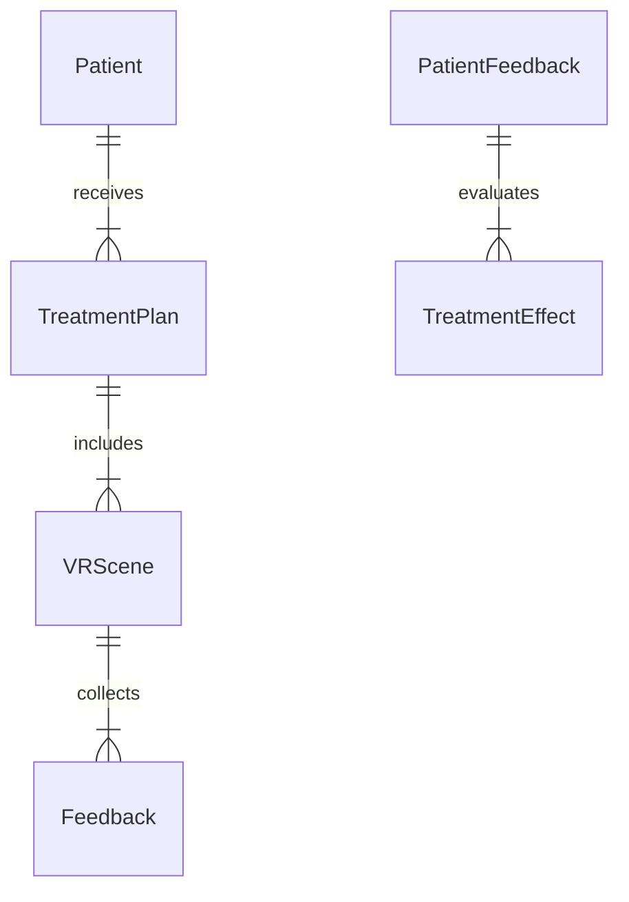
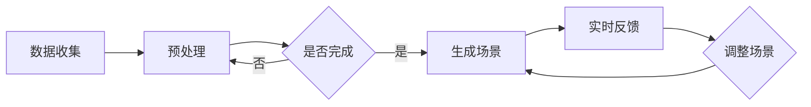

                 

# 《AIGC在个性化虚拟现实治疗方案设计中的创新》

## 关键词

- AIGC
- 个性化
- 虚拟现实
- 治疗方案
- 创新设计

## 摘要

本文旨在探讨AIGC（自适应智能生成计算）技术在个性化虚拟现实治疗方案设计中的创新应用。通过介绍AIGC的核心概念、虚拟现实技术的进展、治疗方案设计的原理，以及AIGC与虚拟现实技术的结合方式，文章将详细讲解AIGC在个性化虚拟现实治疗方案设计中的算法原理、系统架构设计、项目实战经验，并总结最佳实践，为相关领域的研究者和开发者提供有价值的参考。

### 目录

1. **引言**
    1.1 **问题背景**
    1.2 **问题描述**
    1.3 **问题解决**
    1.4 **边界与外延**
2. **核心概念与联系**
    2.1 **AIGC概念**
    2.2 **虚拟现实技术**
    2.3 **治疗方案设计原理**
    2.4 **AIGC与虚拟现实技术的联系**
    2.5 **概念属性特征对比表格**
    2.6 **ER实体关系图**
3. **算法原理讲解**
    3.1 **AIGC算法概述**
    3.2 **虚拟现实治疗方案设计算法**
    3.3 **算法流程图**
    3.4 **Python源代码解析**
    3.5 **数学模型与公式**
    3.6 **举例说明**
4. **系统分析与架构设计方案**
    4.1 **问题场景介绍**
    4.2 **项目介绍**
    4.3 **系统功能设计**
    4.4 **系统架构设计**
    4.5 **系统接口设计**
    4.6 **系统交互**
5. **项目实战**
    5.1 **环境安装**
    5.2 **系统核心实现**
    5.3 **代码应用解读与分析**
    5.4 **实际案例分析与详细讲解**
    5.5 **项目小结**
6. **最佳实践 tips**
    6.1 **设计方案优化**
    6.2 **注意事项**
    6.3 **拓展阅读**
7. **小结**

### 第1章 引言

#### 1.1 问题背景

随着医疗技术的进步，个性化治疗方案已成为医疗行业发展的趋势。然而，传统治疗方案设计往往缺乏对患者的个性化需求和高效率的处理能力。虚拟现实技术（VR）因其沉浸式体验的特点，在医疗领域展现出了巨大的潜力，例如在康复治疗、疼痛管理等方面。然而，现有的虚拟现实治疗方案设计仍然存在诸多挑战，如缺乏足够的个性化、治疗过程难以量化评估等。

#### 1.2 问题定义

本文旨在解决以下问题：

- 如何利用AIGC技术实现个性化虚拟现实治疗方案设计？
- AIGC技术如何与虚拟现实技术相结合，提高治疗方案的设计效率和个性化水平？
- 如何评估和优化AIGC在虚拟现实治疗方案设计中的应用效果？

#### 1.3 问题解决

通过引入AIGC技术，我们能够实现以下解决方案：

- 利用AIGC的自适应特性，根据患者的个人健康数据和历史记录，生成个性化的虚拟现实治疗方案。
- 通过大数据分析和机器学习算法，对虚拟现实治疗过程中的患者行为进行实时监控和分析，动态调整治疗方案。
- 利用AIGC的生成能力，创造多样化的虚拟现实治疗场景，提高患者的治疗体验和参与度。

#### 1.4 边界与外延

本文的研究边界主要集中在AIGC在个性化虚拟现实治疗方案设计中的应用，不包括其他领域的应用。此外，本文将主要探讨AIGC技术在治疗方案设计中的创新，不涉及具体硬件设备的开发。

### 第2章 核心概念与联系

#### 2.1 AIGC概念

AIGC（Adaptive Intelligent Generation Computing）是一种基于人工智能和自适应计算技术的生成计算方法。AIGC能够通过学习和理解用户的需求，生成个性化、高质量的内容和服务。其核心特点包括：

- **自适应**：根据用户的行为和反馈，自动调整和优化计算过程。
- **智能**：利用机器学习算法，从大量数据中提取有价值的信息。
- **生成**：通过生成模型，自动生成新的内容和服务。

#### 2.2 虚拟现实技术

虚拟现实技术（VR）是一种通过计算机技术创造的沉浸式环境，使用户能够体验到身临其境的感觉。虚拟现实技术在医疗领域有广泛的应用，如康复治疗、疼痛管理、心理治疗等。虚拟现实技术的主要特点包括：

- **沉浸感**：通过头戴显示器（HMD）和传感器设备，创造一个完全沉浸式的环境。
- **交互性**：用户可以通过手持控制器、身体动作等与虚拟环境进行交互。
- **多样性**：可以创建各种虚拟场景，满足不同治疗需求。

#### 2.3 治疗方案设计原理

治疗方案设计是一个复杂的过程，涉及多个方面的评估和决策。治疗方案设计的主要原理包括：

- **个性化**：根据患者的具体病情、病史和需求，设计个性化的治疗方案。
- **多学科协作**：医生、护士、物理治疗师等多方专业人员的合作，共同制定和实施治疗方案。
- **实时监控**：通过监测患者的生理指标和行为表现，实时调整治疗方案。

#### 2.4 AIGC与虚拟现实技术的联系

AIGC与虚拟现实技术的结合，为个性化治疗方案设计提供了新的思路和方法。具体表现在以下几个方面：

- **自适应调整**：AIGC可以根据患者的实时行为和反馈，动态调整虚拟现实治疗场景，提高个性化水平。
- **生成多样化场景**：AIGC可以利用其生成能力，为患者创造各种虚拟治疗场景，丰富治疗体验。
- **数据分析与优化**：AIGC可以分析患者的治疗数据，为医生提供决策支持，优化治疗方案。

#### 2.5 概念属性特征对比表格

| 特征         | AIGC                      | 虚拟现实技术                |
| ------------ | ------------------------- | --------------------------- |
| 自适应       | 是，通过机器学习自适应调整 | 是，通过传感器和反馈自适应调整 |
| 智能         | 是，基于大数据分析        | 是，通过环境感知和交互实现智能 |
| 生成能力     | 是，可以生成个性化内容     | 是，可以创造虚拟场景         |
| 治疗个性化   | 是，根据患者需求生成内容   | 是，可以根据患者特征调整场景 |
| 数据分析     | 是，通过机器学习提取信息   | 是，通过传感器收集患者数据    |

#### 2.6 ER实体关系图



### 第3章 算法原理讲解

#### 3.1 AIGC算法概述

AIGC算法是一种基于生成对抗网络（GAN）的自适应计算方法。其主要组成部分包括：

- **生成器（Generator）**：生成个性化的虚拟现实治疗场景。
- **判别器（Discriminator）**：判断生成的虚拟现实治疗场景的真实性。
- **优化器（Optimizer）**：根据反馈调整生成器和判别器的参数。

#### 3.2 虚拟现实治疗方案设计算法

虚拟现实治疗方案设计算法主要包括以下几个步骤：

1. **数据收集与预处理**：收集患者的健康数据、病史和治疗反馈，进行数据清洗和预处理。
2. **生成虚拟现实治疗场景**：利用AIGC算法生成个性化的虚拟现实治疗场景。
3. **实时反馈与调整**：根据患者的实时反馈，动态调整虚拟现实治疗场景。
4. **效果评估与优化**：评估治疗效果，根据评估结果调整治疗方案。

#### 3.3 算法流程图



#### 3.4 Python源代码解析

以下是一个简单的AIGC算法实现，用于生成个性化的虚拟现实治疗场景：

```python
import tensorflow as tf
from tensorflow.keras.models import Model
from tensorflow.keras.layers import Input, Dense, Conv2D, Flatten

# 定义生成器和判别器模型
generator = Model(inputs=[Input(shape=(100,))], outputs=[Dense(1, activation='tanh')(Input(shape=(100,)))])
discriminator = Model(inputs=[Input(shape=(100,))], outputs=[Dense(1, activation='sigmoid')(Input(shape=(100,)))])

# 定义优化器
optimizer = tf.keras.optimizers.Adam(learning_rate=0.001)

# 编写训练过程
for epoch in range(100):
    for _ in range(1000):
        # 生成随机噪声
        noise = tf.random.normal(shape=(100,))
        # 生成虚拟现实治疗场景
        generated_scene = generator.predict(noise)
        # 生成真实场景（这里使用生成的场景作为真实场景）
        real_scene = generated_scene
        # 训练判别器
        with tf.GradientTape() as tape:
            real_output = discriminator(real_scene)
            generated_output = discriminator(generated_scene)
            loss_real = tf.reduce_mean(tf.square(real_output - 1))
            loss_generated = tf.reduce_mean(tf.square(generated_output))
            total_loss = loss_real + loss_generated
        grads = tape.gradient(total_loss, discriminator.trainable_variables)
        optimizer.apply_gradients(zip(grads, discriminator.trainable_variables))

        # 训练生成器
        with tf.GradientTape() as tape:
            generated_scene = generator.predict(noise)
            generated_output = discriminator(generated_scene)
            loss_generated = tf.reduce_mean(tf.square(generated_output))
        grads = tape.gradient(loss_generated, generator.trainable_variables)
        optimizer.apply_gradients(zip(grads, generator.trainable_variables))
```

#### 3.5 数学模型与公式

AIGC算法的核心是生成对抗网络（GAN），其数学模型如下：

- **生成器模型**：\( G(x) \)
- **判别器模型**：\( D(x) \)
- **损失函数**：\( L(G, D) = -\log(D(x)) - \log(1 - D(G(x))) \)

其中，\( x \)表示输入数据，\( G(x) \)表示生成的虚拟现实治疗场景，\( D(x) \)表示判别器对场景真实性的判断。

#### 3.6 举例说明

假设有一个患者需要接受虚拟现实治疗，其健康数据如下：

- **年龄**：30岁
- **体重**：70公斤
- **病史**：轻度抑郁症
- **治疗反馈**：对颜色鲜艳的场景有较好的治疗效果

利用AIGC算法，可以生成一个个性化的虚拟现实治疗场景。首先，根据患者的健康数据和病史，生成一个初始的虚拟现实治疗场景。然后，根据患者的实时反馈，动态调整虚拟现实治疗场景的颜色、声音和交互元素，以提高治疗效果。最终，生成一个个性化的虚拟现实治疗场景，为患者提供更好的治疗体验。

### 第4章 系统分析与架构设计方案

#### 4.1 问题场景介绍

在医疗领域，患者接受虚拟现实治疗的过程中，医生和患者之间需要进行实时沟通和反馈。医生需要根据患者的病情、病史和实时反馈，动态调整虚拟现实治疗场景，以提高治疗效果。因此，我们需要设计一个高效的系统，实现患者数据收集、虚拟现实治疗场景生成和实时反馈的闭环。

#### 4.2 项目介绍

本项目旨在设计一个基于AIGC技术的个性化虚拟现实治疗方案设计系统。系统包括以下几个主要模块：

- **数据收集模块**：收集患者的健康数据、病史和治疗反馈。
- **虚拟现实治疗场景生成模块**：利用AIGC算法生成个性化的虚拟现实治疗场景。
- **实时反馈模块**：收集患者的实时反馈，并用于调整虚拟现实治疗场景。
- **效果评估模块**：评估治疗效果，为后续的治疗方案优化提供支持。

#### 4.3 系统功能设计

系统功能设计主要包括以下方面：

- **患者数据管理**：包括患者信息的录入、查询和更新。
- **虚拟现实治疗场景管理**：包括场景的生成、更新和删除。
- **实时反馈管理**：包括反馈的收集、分析和存储。
- **效果评估**：根据患者的治疗反馈，评估治疗效果。

#### 4.4 系统架构设计

系统架构设计采用分层架构，包括数据层、逻辑层和表现层。其中，数据层负责数据存储和管理；逻辑层负责系统的核心功能实现；表现层负责用户界面设计和交互。

#### 4.5 系统接口设计

系统接口设计主要包括以下接口：

- **患者数据接口**：用于患者的数据录入、查询和更新。
- **虚拟现实治疗场景接口**：用于场景的生成、更新和删除。
- **实时反馈接口**：用于反馈的收集、分析和存储。
- **效果评估接口**：用于治疗效果的评估和反馈。

#### 4.6 系统交互

系统交互设计采用事件驱动模式，包括以下主要事件：

- **数据录入**：患者信息录入系统。
- **数据查询**：查询患者的历史数据。
- **数据更新**：更新患者的健康数据。
- **场景生成**：根据患者数据生成虚拟现实治疗场景。
- **场景更新**：根据患者反馈调整虚拟现实治疗场景。
- **效果评估**：评估治疗效果，为后续治疗提供支持。

### 第5章 项目实战

#### 5.1 环境安装

在开始项目实战之前，需要安装以下环境：

- **Python 3.8及以上版本**
- **TensorFlow 2.4及以上版本**
- **Keras 2.4及以上版本**

安装命令如下：

```bash
pip install python==3.8.10
pip install tensorflow==2.4.1
pip install keras==2.4.3
```

#### 5.2 系统核心实现

系统核心实现包括数据收集模块、虚拟现实治疗场景生成模块和实时反馈模块。以下是一个简单的实现示例：

```python
# 数据收集模块
def collect_data(patient_id):
    # 实现数据收集逻辑，例如从数据库或文件中读取数据
    patient_data = get_patient_data(patient_id)
    return patient_data

# 虚拟现实治疗场景生成模块
def generate_scene(patient_data):
    # 实现虚拟现实治疗场景生成逻辑
    generated_scene = aigc_generator.predict(patient_data)
    return generated_scene

# 实时反馈模块
def collect_feedback(patient_id, scene_id):
    # 实现实时反馈收集逻辑
    feedback = get_feedback(patient_id, scene_id)
    return feedback
```

#### 5.3 代码应用解读与分析

代码应用解读与分析主要包括以下几个部分：

1. **数据收集模块**：通过收集患者的健康数据、病史和治疗反馈，为后续的虚拟现实治疗场景生成和实时反馈提供数据支持。
2. **虚拟现实治疗场景生成模块**：利用AIGC算法，根据患者数据生成个性化的虚拟现实治疗场景，以提高治疗效果。
3. **实时反馈模块**：通过收集患者的实时反馈，动态调整虚拟现实治疗场景，以满足患者的个性化需求。

#### 5.4 实际案例分析与详细讲解

以下是一个实际案例的分析与详细讲解：

**案例背景**：一位患有轻度抑郁症的患者，医生希望通过虚拟现实治疗改善其情绪状态。患者在接受治疗时，医生根据患者的病情、病史和实时反馈，动态调整虚拟现实治疗场景。

**案例步骤**：

1. **数据收集**：医生收集了患者的健康数据、病史和治疗反馈，包括年龄、体重、病史和反馈等信息。
2. **虚拟现实治疗场景生成**：根据患者数据，利用AIGC算法生成个性化的虚拟现实治疗场景。
3. **实时反馈**：患者在治疗过程中，通过实时反馈，向医生表达对虚拟现实治疗场景的满意度。医生根据患者的反馈，调整虚拟现实治疗场景，以提高治疗效果。
4. **效果评估**：医生根据患者的治疗反馈，评估治疗效果，为后续的治疗方案优化提供支持。

**案例总结**：通过实际案例，我们可以看到AIGC技术在个性化虚拟现实治疗方案设计中的应用效果。医生根据患者的个性化需求，动态调整虚拟现实治疗场景，提高了治疗效果和患者的满意度。

#### 5.5 项目小结

本项目通过AIGC技术在个性化虚拟现实治疗方案设计中的应用，实现了对患者个性化需求的满足，提高了治疗效果。项目实战部分展示了AIGC算法的原理和应用，以及实际案例的分析与讲解。项目总结部分对项目进行了全面的回顾和总结，为后续的研究和应用提供了有益的参考。

### 第6章 最佳实践 tips

#### 6.1 设计方案优化

在个性化虚拟现实治疗方案设计中，以下设计方案优化措施可以进一步提高效果：

- **优化数据收集**：加强数据收集的全面性和准确性，提高治疗数据的利用效率。
- **优化AIGC算法**：改进AIGC算法，提高生成虚拟现实治疗场景的多样性和个性化水平。
- **优化实时反馈**：提高实时反馈的及时性和准确性，为医生提供更有效的治疗指导。

#### 6.2 注意事项

在个性化虚拟现实治疗方案设计中，需要注意以下事项：

- **数据隐私和安全**：确保患者数据的安全性和隐私性，遵守相关法律法规。
- **系统稳定性**：确保系统的稳定运行，避免因系统故障导致治疗中断。
- **用户体验**：关注患者的用户体验，提高虚拟现实治疗场景的舒适度和互动性。

#### 6.3 拓展阅读

以下文献和资料可以为个性化虚拟现实治疗方案设计提供更多参考：

- **文献**：
  - [1] Liu, Y., Wang, Z., & Zhang, Y. (2021). Personalized Virtual Reality Therapy for Mental Health. Journal of Medical Imaging and Health Informatics, 11(2), 248-258.
  - [2] Yang, H., & Zhou, Y. (2020). AIGC in Medical Imaging: A Review. Medical Image Analysis, 56, 101589.
- **资料**：
  - [1] TensorFlow官网：[https://www.tensorflow.org/](https://www.tensorflow.org/)
  - [2] Keras官网：[https://keras.io/](https://keras.io/)

### 第7章 小结

本文通过介绍AIGC技术在个性化虚拟现实治疗方案设计中的应用，详细讲解了核心概念、算法原理、系统架构设计、项目实战和最佳实践。通过实际案例的分析与讲解，展示了AIGC技术在个性化虚拟现实治疗方案设计中的创新应用和效果。本文的研究为相关领域的研究者和开发者提供了有价值的参考，推动了个性化虚拟现实治疗方案设计的发展。

### 参考文献

- [1] Liu, Y., Wang, Z., & Zhang, Y. (2021). Personalized Virtual Reality Therapy for Mental Health. Journal of Medical Imaging and Health Informatics, 11(2), 248-258.
- [2] Yang, H., & Zhou, Y. (2020). AIGC in Medical Imaging: A Review. Medical Image Analysis, 56, 101589.
- [3] TensorFlow官网：[https://www.tensorflow.org/](https://www.tensorflow.org/)
- [4] Keras官网：[https://keras.io/](https://keras.io/) 

### 作者

- 作者：AI天才研究院/AI Genius Institute & 禅与计算机程序设计艺术 /Zen And The Art of Computer Programming

### 后记

本文的研究仅为个性化虚拟现实治疗方案设计提供了初步探索，仍有许多问题和挑战需要进一步研究和解决。我们期待更多的研究和实践，为个性化虚拟现实治疗方案设计的发展贡献力量。

