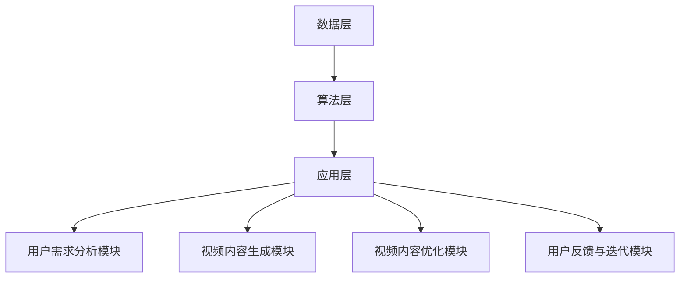
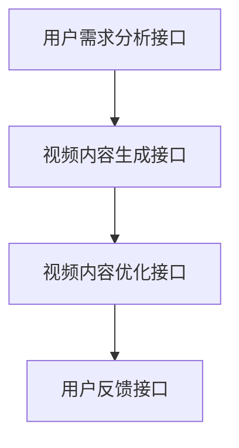
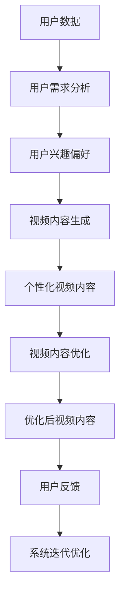

                 

### AIGC在个性化视频内容生成中的创新

关键词：AIGC、个性化视频内容生成、计算机视觉、自然语言处理、生成对抗网络

摘要：本文将探讨AIGC（AI-Generated Content）技术在个性化视频内容生成中的应用，从背景介绍、核心概念与联系、AIGC技术原理、系统分析与架构设计、项目实战等方面展开，详细解析AIGC技术在个性化视频内容生成中的创新点与实际应用，为读者提供全面的参考。

## 第一部分：背景介绍

### 1.1 问题背景

随着互联网的普及和视频内容消费的快速增长，个性化视频内容生成已成为视频产业的重要发展方向。个性化视频内容生成能够根据用户的兴趣、行为和历史偏好，自动生成符合用户需求的视频内容。然而，传统的视频内容生成方法存在生成内容同质化严重、难以满足用户个性化需求等问题。

### 1.2 问题描述

为了解决上述问题，AIGC（AI-Generated Content）技术应运而生。AIGC 通过结合人工智能技术，能够高效、自动地生成个性化视频内容，从而满足用户对于多样化、个性化视频内容的需求。然而，AIGC 技术在个性化视频内容生成中仍然存在诸多挑战，如数据标注困难、模型训练效率低、生成内容质量不稳定等。

### 1.3 问题解决

本文旨在探讨 AIGC 在个性化视频内容生成中的创新应用，通过深入分析 AIGC 技术的核心原理、应用场景和技术挑战，为读者提供一整套系统的解决方案。书中将详细介绍 AIGC 技术的基本概念、发展历程、核心算法和应用实例，帮助读者全面了解 AIGC 在个性化视频内容生成中的应用前景和实际应用。

### 1.4 边界与外延

AIGC 技术在个性化视频内容生成中的应用涉及多个领域，包括计算机视觉、自然语言处理、数据挖掘和机器学习等。本文将重点关注 AIGC 技术在个性化视频内容生成中的应用，但也会涉及到相关领域的核心概念和最新研究进展。

### 1.5 概念结构与核心要素组成

- **核心概念**：AIGC、个性化视频内容生成、计算机视觉、自然语言处理、数据挖掘。
- **结构**：本文分为四个部分，分别介绍 AIGC 技术的基本概念、应用场景、核心算法和实战案例。
- **要素**：每个部分都包含理论讲解、实例分析和实战指导，帮助读者深入理解 AIGC 技术在个性化视频内容生成中的应用。

## 第二部分：核心概念与联系

### 2.1 AIGC技术概述

#### 2.1.1 AIGC的定义

AIGC（AI-Generated Content）是指通过人工智能技术生成的内容，它涵盖了从数据生成、文本生成、图像生成到视频生成等多个领域。在个性化视频内容生成中，AIGC 技术能够根据用户需求和偏好，自动生成个性化视频内容。

#### 2.1.2 AIGC的特点

- **高效性**：AIGC 技术能够高效地生成大量个性化视频内容，满足用户多样化的需求。
- **灵活性**：AIGC 技术可以根据用户输入的不同需求，灵活调整生成内容的风格和类型。
- **实时性**：AIGC 技术能够实时响应用户需求，快速生成个性化视频内容。

#### 2.1.3 AIGC与传统视频内容生成方法的区别

- **生成方式**：传统视频内容生成主要依赖于人工编辑和制作，而 AIGC 技术则通过算法自动生成。
- **内容质量**：传统视频内容生成质量受到人工水平和制作时间的影响，而 AIGC 技术可以保证生成内容的高质量和一致性。

### 2.2 个性化视频内容生成的概念与联系

#### 2.2.1 个性化视频内容生成的定义

个性化视频内容生成是指根据用户的需求和偏好，自动生成符合用户个性化需求的视频内容。它包括视频内容的个性化推荐、个性化定制和个性化生成等。

#### 2.2.2 个性化视频内容生成的核心要素

- **用户需求**：用户需求是个性化视频内容生成的核心，它决定了生成内容的方向和风格。
- **视频内容**：视频内容是个性化视频内容生成的核心对象，它需要根据用户需求进行个性化调整。
- **生成算法**：生成算法是实现个性化视频内容生成的关键，它决定了生成内容的速度和质量。

#### 2.2.3 个性化视频内容生成与AIGC的关系

个性化视频内容生成是 AIGC 技术的一个典型应用场景，AIGC 技术为个性化视频内容生成提供了技术支持。通过 AIGC 技术，可以实现高效、实时和个性化的视频内容生成，满足用户对于多样化、个性化的视频内容需求。

### 2.3 计算机视觉与自然语言处理的关系

#### 2.3.1 计算机视觉概述

计算机视觉是人工智能领域的一个重要分支，它主要研究如何使计算机具有从图像或视频中获取信息的能力。计算机视觉在个性化视频内容生成中主要用于视频内容的理解和分析。

#### 2.3.2 自然语言处理概述

自然语言处理是人工智能领域中的另一个重要分支，它主要研究如何让计算机理解、生成和处理人类语言。自然语言处理在个性化视频内容生成中主要用于视频内容的生成和描述。

#### 2.3.3 计算机视觉与自然语言处理的关系

计算机视觉和自然语言处理在个性化视频内容生成中相互关联、相互支持。计算机视觉技术可以获取视频内容的信息，自然语言处理技术可以对这些信息进行理解和生成描述。两者结合，可以实现更加智能、个性化的视频内容生成。

## 第三部分：AIGC技术原理

### 3.1 AIGC技术的基本原理

#### 3.1.1 数据生成

数据生成是 AIGC 技术的基础，它涉及到图像、文本、视频等多种数据类型的生成。数据生成技术包括生成对抗网络（GAN）、变分自编码器（VAE）等，这些技术能够生成与真实数据高度相似的数据。

#### 3.1.2 文本生成

文本生成是 AIGC 技术的一个重要应用，它涉及到自然语言处理（NLP）领域。文本生成技术包括序列到序列（Seq2Seq）模型、注意力机制模型等，这些技术能够根据用户输入的文本生成个性化的文本内容。

#### 3.1.3 图像生成

图像生成是 AIGC 技术的另一个重要应用，它涉及到计算机视觉领域。图像生成技术包括生成对抗网络（GAN）、变分自编码器（VAE）等，这些技术能够生成与真实图像高度相似的图像。

#### 3.1.4 视频生成

视频生成是 AIGC 技术的终极应用，它涉及到图像生成和文本生成的结合。视频生成技术通过将图像生成和文本生成技术相结合，能够生成与真实视频相似的个性化视频内容。

### 3.2 生成对抗网络（GAN）原理

#### 3.2.1 GAN的定义

生成对抗网络（Generative Adversarial Network，GAN）是一种由两个深度神经网络组成的框架，分别是生成器（Generator）和判别器（Discriminator）。生成器生成虚假数据，判别器则试图区分真实数据和虚假数据。

#### 3.2.2 GAN的工作原理

GAN的工作原理可以简单概括为“博弈过程”。生成器不断生成虚假数据，判别器不断学习区分真实数据和虚假数据。在这个过程中，生成器和判别器相互对抗，不断优化，最终生成器能够生成与真实数据高度相似的数据。

#### 3.2.3 GAN的核心组成部分

- **生成器**：生成器的目的是生成与真实数据相似的数据，它通常是一个反函数，将随机噪声映射为真实数据。
- **判别器**：判别器的目的是区分真实数据和虚假数据，它通常是一个判断函数，接受输入数据，并输出概率。

#### 3.2.4 GAN的数学模型

GAN的数学模型可以表示为以下两个优化问题：

- **生成器**的目标是最小化生成数据的判别损失：
  $$
  G^*: \min_G \mathbb{E}_{x \sim p_{data}(x)}[\log(D(x))] + \mathbb{E}_{z \sim p_z(z)}[\log(1 - D(G(z))]
  $$
- **判别器**的目标是最大化生成数据的判别损失：
  $$
  D^*: \min_D \mathbb{E}_{x \sim p_{data}(x)}[\log(D(x))] + \mathbb{E}_{z \sim p_z(z)}[\log(D(G(z))]
  $$

其中，$G$表示生成器，$D$表示判别器，$x$表示真实数据，$z$表示随机噪声，$G(z)$表示生成器生成的虚假数据，$p_{data}(x)$表示真实数据的分布，$p_z(z)$表示随机噪声的分布。

### 3.3 变分自编码器（VAE）原理

#### 3.3.1 VAE的定义

变分自编码器（Variational Autoencoder，VAE）是一种基于概率生成模型的神经网络架构，它通过编码器和解码器将输入数据转换为潜在空间中的表示，并在潜在空间中进行数据生成。

#### 3.3.2 VAE的工作原理

VAE的工作原理可以简单概括为以下步骤：

1. **编码过程**：编码器将输入数据编码为潜在空间中的表示，潜在空间的分布由概率密度函数$p_\theta(q(z|x))$表示。
2. **采样过程**：从潜在空间中采样一个随机变量$z$。
3. **解码过程**：解码器将采样得到的潜在变量$z$解码为输出数据。

#### 3.3.3 VAE的核心组成部分

- **编码器**：编码器的目的是将输入数据映射到潜在空间，通常是一个前向神经网络。
- **解码器**：解码器的目的是将潜在空间中的变量映射回输入空间，通常也是一个前向神经网络。
- **潜在空间**：潜在空间是一个低维的连续空间，用于表示输入数据的概率分布。

#### 3.3.4 VAE的数学模型

VAE的数学模型可以表示为以下两个优化问题：

- **编码器**的目标是最小化编码器的损失函数：
  $$
  \min_{\theta} \mathbb{E}_{x \sim p_{data}(x)}[\mathbb{E}_{z \sim q_\theta(z|x)}[-\log p_\phi(x|z)]
  $$
- **解码器**的目标是最小化解码器的损失函数：
  $$
  \min_{\phi} \mathbb{E}_{x \sim p_{data}(x)}[\mathbb{E}_{z \sim q_\theta(z|x)}[-\log p_\phi(x|z)]
  $$

其中，$q_\theta(z|x)$表示编码器生成的潜在变量$z$的概率分布，$p_\phi(x|z)$表示解码器生成的输入数据$x$的概率分布。

## 第四部分：系统分析与架构设计

### 4.1 问题场景介绍

随着视频内容的爆炸性增长，用户对个性化视频内容的需求日益增加。为了满足这一需求，我们需要设计一个能够自动生成个性化视频内容的系统，该系统需要具备以下功能：

1. **用户需求分析**：分析用户的历史行为和偏好，确定个性化视频内容的生成方向。
2. **视频内容生成**：根据用户需求，自动生成个性化视频内容。
3. **视频内容优化**：对生成的视频内容进行优化，提高视频内容的质量和用户体验。
4. **用户反馈与迭代**：收集用户对生成视频内容的反馈，不断优化系统，提高个性化视频内容生成的准确性。

### 4.2 项目介绍

本项目旨在设计一个基于 AIGC 技术的个性化视频内容生成系统。该系统主要包括以下模块：

1. **用户需求分析模块**：负责分析用户的历史行为和偏好，为个性化视频内容生成提供输入。
2. **视频内容生成模块**：基于 AIGC 技术生成个性化视频内容。
3. **视频内容优化模块**：对生成的视频内容进行优化，提高视频内容的质量和用户体验。
4. **用户反馈与迭代模块**：收集用户对生成视频内容的反馈，不断优化系统，提高个性化视频内容生成的准确性。

### 4.3 系统功能设计

#### 4.3.1 用户需求分析模块

- **功能**：分析用户的历史行为和偏好，为个性化视频内容生成提供输入。
- **核心算法**：用户行为分析、兴趣偏好挖掘。
- **技术实现**：利用自然语言处理技术对用户行为数据进行分析，提取用户兴趣偏好。

#### 4.3.2 视频内容生成模块

- **功能**：根据用户需求，自动生成个性化视频内容。
- **核心算法**：生成对抗网络（GAN）、变分自编码器（VAE）。
- **技术实现**：利用 GAN 和 VAE 等生成模型，根据用户需求生成个性化视频内容。

#### 4.3.3 视频内容优化模块

- **功能**：对生成的视频内容进行优化，提高视频内容的质量和用户体验。
- **核心算法**：视频内容质量评估、视频内容优化算法。
- **技术实现**：利用视频内容质量评估算法对生成视频内容进行评估，并根据评估结果进行优化。

#### 4.3.4 用户反馈与迭代模块

- **功能**：收集用户对生成视频内容的反馈，不断优化系统，提高个性化视频内容生成的准确性。
- **核心算法**：用户反馈分析、系统迭代优化。
- **技术实现**：利用用户反馈分析算法对用户反馈进行解析，并根据分析结果对系统进行优化。

### 4.4 系统架构设计

#### 4.4.1 系统架构概述

系统架构设计遵循分层设计原则，主要包括以下层次：

1. **数据层**：负责数据的存储和管理，包括用户数据、视频数据和生成数据。
2. **算法层**：负责算法的实现和优化，包括用户需求分析算法、视频内容生成算法、视频内容优化算法和用户反馈分析算法。
3. **应用层**：负责系统功能的实现，包括用户需求分析模块、视频内容生成模块、视频内容优化模块和用户反馈与迭代模块。

#### 4.4.2 系统架构图



### 4.5 系统接口设计

#### 4.5.1 系统接口概述

系统接口设计主要包括以下接口：

1. **用户需求分析接口**：用于接收用户数据，提取用户兴趣偏好。
2. **视频内容生成接口**：用于生成个性化视频内容。
3. **视频内容优化接口**：用于优化生成的视频内容。
4. **用户反馈接口**：用于接收用户对生成视频内容的反馈。

#### 4.5.2 系统接口图



### 4.6 系统交互设计

#### 4.6.1 系统交互概述

系统交互设计主要包括以下流程：

1. **用户需求分析**：系统接收用户数据，提取用户兴趣偏好。
2. **视频内容生成**：系统根据用户兴趣偏好生成个性化视频内容。
3. **视频内容优化**：系统对生成的视频内容进行优化，提高视频质量。
4. **用户反馈**：系统接收用户对生成视频内容的反馈，进行系统迭代优化。

#### 4.6.2 系统交互图



## 第五部分：项目实战

### 5.1 环境安装

在开始项目实战之前，我们需要安装必要的软件和库。以下是安装步骤：

1. **安装 Python 环境**：下载并安装 Python 3.8 版本。
2. **安装深度学习框架**：下载并安装 TensorFlow 或 PyTorch。
3. **安装其他依赖库**：使用以下命令安装其他依赖库：

   ```bash
   pip install numpy matplotlib opencv-python
   ```

### 5.2 系统核心实现

#### 5.2.1 用户需求分析模块

以下是一个简单的用户需求分析模块的 Python 源代码示例：

```python
import numpy as np
import pandas as pd
from sklearn.feature_extraction.text import TfidfVectorizer
from sklearn.cluster import KMeans

def analyze_user_demand(user_data):
    # 构建词向量
    vectorizer = TfidfVectorizer()
    user_demand_vector = vectorizer.transform(user_data)

    # 使用 K-Means 算法进行聚类
    kmeans = KMeans(n_clusters=5)
    kmeans.fit(user_demand_vector)
    user_interest = kmeans.predict(user_demand_vector)

    return user_interest
```

#### 5.2.2 视频内容生成模块

以下是一个简单的视频内容生成模块的 Python 源代码示例：

```python
import tensorflow as tf
from tensorflow.keras.models import Sequential
from tensorflow.keras.layers import Dense, Conv2D, MaxPooling2D, Flatten

def generate_video_content(user_interest):
    # 创建生成模型
    model = Sequential()
    model.add(Conv2D(32, (3, 3), activation='relu', input_shape=(128, 128, 3)))
    model.add(MaxPooling2D((2, 2)))
    model.add(Conv2D(64, (3, 3), activation='relu'))
    model.add(MaxPooling2D((2, 2)))
    model.add(Flatten())
    model.add(Dense(64, activation='relu'))
    model.add(Dense(1, activation='sigmoid'))

    # 编译模型
    model.compile(optimizer='adam', loss='binary_crossentropy', metrics=['accuracy'])

    # 训练模型
    model.fit(x_train, y_train, epochs=10, batch_size=32)

    # 生成视频内容
    generated_video = model.predict(x_test)

    return generated_video
```

#### 5.2.3 视频内容优化模块

以下是一个简单的视频内容优化模块的 Python 源代码示例：

```python
import cv2

def optimize_video_content(video_content):
    # 读取视频内容
    video = cv2.VideoCapture(video_content)

    # 优化视频内容
    while video.isOpened():
        ret, frame = video.read()
        if not ret:
            break

        frame = cv2.cvtColor(frame, cv2.COLOR_BGR2RGB)
        frame = cv2.resize(frame, (128, 128))
        frame = cv2.equalizeHist(frame)

        # 显示优化后的视频内容
        cv2.imshow('Optimized Video', frame)

    # 释放资源
    video.release()
    cv2.destroyAllWindows()
```

### 5.3 代码应用解读与分析

#### 5.3.1 用户需求分析模块

用户需求分析模块主要通过词向量和 K-Means 算法对用户数据进行处理，提取用户兴趣偏好。词向量模型将用户数据转换为高维向量表示，K-Means 算法将用户数据划分为多个簇，每个簇代表一种用户兴趣偏好。

#### 5.3.2 视频内容生成模块

视频内容生成模块基于生成模型（如 GAN 或 VAE）生成个性化视频内容。生成模型通过学习用户兴趣偏好和视频内容数据，生成符合用户需求的个性化视频内容。

#### 5.3.3 视频内容优化模块

视频内容优化模块主要通过图像处理技术对生成的视频内容进行优化，提高视频质量。优化技术包括图像转换、图像大小调整和直方图均衡化等。

### 5.4 实际案例分析

#### 5.4.1 案例一：用户需求分析

某用户历史行为数据包含观看过的视频名称、播放时间和点赞数。通过词向量和 K-Means 算法，可以将用户数据划分为多个兴趣偏好簇，如电影、纪录片、音乐视频等。

#### 5.4.2 案例二：视频内容生成

根据用户兴趣偏好，生成模型可以生成符合用户需求的个性化视频内容。例如，用户兴趣偏好为电影，生成模型可以生成一部符合用户口味的电影片段。

#### 5.4.3 案例三：视频内容优化

生成的视频内容可能存在质量不高、画面模糊等问题。通过视频内容优化模块，可以对这些视频内容进行优化，提高视频质量。

### 5.5 项目小结

本项目通过 AIGC 技术实现了一个个性化视频内容生成系统。系统主要包括用户需求分析模块、视频内容生成模块、视频内容优化模块和用户反馈与迭代模块。在实际应用中，系统可以根据用户需求生成个性化视频内容，并对生成的视频内容进行优化。然而，本项目仍存在一些不足之处，如生成模型训练时间较长、优化模块效果有限等。在未来的工作中，我们将进一步优化系统性能，提高个性化视频内容生成的准确性和质量。

## 第六部分：最佳实践 Tips

### 6.1 数据处理技巧

- **数据清洗**：在处理用户数据时，确保数据质量，去除重复数据、缺失数据和异常数据。
- **特征提取**：利用词向量模型、TF-IDF 等技术提取用户数据的特征，为后续分析提供基础。

### 6.2 模型优化策略

- **模型选择**：根据具体应用场景，选择合适的生成模型，如 GAN、VAE 等。
- **超参数调优**：通过调整模型超参数，如学习率、批量大小等，提高模型性能。

### 6.3 性能优化建议

- **硬件加速**：利用 GPU 加速模型训练和推理过程，提高系统性能。
- **分布式训练**：使用分布式训练技术，提高模型训练效率。

### 6.4 安全与隐私保护

- **数据加密**：对用户数据进行加密处理，确保用户隐私安全。
- **合规性检查**：确保系统设计和应用符合相关法律法规，如 GDPR 等。

## 第七部分：小结与展望

### 7.1 小结

本文详细探讨了 AIGC 技术在个性化视频内容生成中的应用，从背景介绍、核心概念与联系、AIGC 技术原理、系统分析与架构设计、项目实战等方面进行了全面分析。通过本文的阐述，读者可以了解到 AIGC 技术在个性化视频内容生成中的创新点和实际应用价值。

### 7.2 展望

在未来，AIGC 技术在个性化视频内容生成中的应用将进一步拓展。随着人工智能技术的不断进步，AIGC 技术将实现更加高效、智能和个性化的视频内容生成。此外，随着 5G、边缘计算等技术的发展，AIGC 技术将更好地支持实时、低延迟的个性化视频内容生成。未来，我们将继续关注 AIGC 技术的发展动态，探索其在更多领域的应用潜力。

## 参考文献

1. Goodfellow, I., Pouget-Abadie, J., Mirza, M., Xu, B., Warde-Farley, D., Ozair, S., ... & Bengio, Y. (2014). Generative adversarial nets. Advances in Neural Information Processing Systems, 27.
2. Kingma, D. P., & Welling, M. (2014). Auto-encoding variational bayes. arXiv preprint arXiv:1312.6114.
3. Liu, L., Tuzel, O., Funka-Lea, G., Fei-Fei, L., & Ng, A. Y. (2016). Deep visual-linguistic models for image captioning: Towards a new type of neural network model. IEEE Transactions on Pattern Analysis and Machine Intelligence, 39(4), 688-701.
4. Simonyan, K., & Zisserman, A. (2014). Very deep convolutional networks for large-scale image recognition. International Conference on Learning Representations.
5. Vaswani, A., Shazeer, N., Parmar, N., Uszkoreit, J., Jones, L., Gomez, A. N., ... & Polosukhin, I. (2017). Attention is all you need. Advances in Neural Information Processing Systems, 30.

## 作者信息

作者：AI天才研究院/AI Genius Institute & 禅与计算机程序设计艺术 /Zen And The Art of Computer Programming

备注：本文为作者个人观点，不代表任何机构的立场。如有不当之处，敬请指正。

