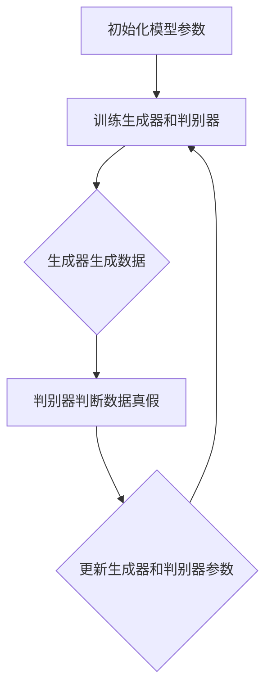
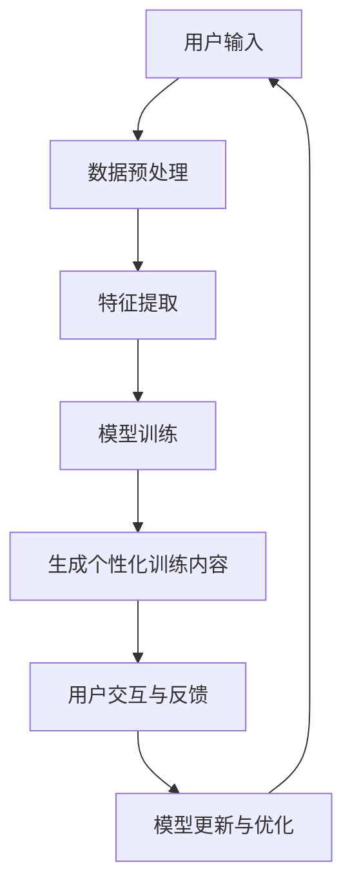

                 

### 引言与背景

#### 第1章: 引言

在快速发展的现代社会，人们对认知能力的提升需求日益增长。然而，传统的认知训练方法往往存在一定的局限性，难以满足个体差异化的需求。随着人工智能（AI）技术的不断进步，一种名为“自适应智能生成内容”（AIGC）的新兴技术逐渐引起了广泛关注。AIGC不仅具有数据驱动的特性，还能够实现个性化认知增强训练，从而为优化大脑潜能开发提供了新的可能。

本章将首先介绍AIGC技术的定义、核心概念及其与传统AI的区别，并回顾AIGC技术发展的历程。接下来，我们将探讨个性化认知增强训练的背景，包括认知能力提升的需求、现有方法的局限性以及AIGC技术在其中的应用潜力。最后，我们将明确本研究的目的和意义，并简要介绍研究方法与框架。

##### 1.1 研究背景

##### 1.1.1 人工智能与认知科学的发展

人工智能（AI）作为计算机科学的一个重要分支，旨在使计算机模拟人类的智能行为。随着计算能力的提升和大数据技术的发展，AI技术已经取得了显著进展。从早期的规则推理和知识表示，到基于机器学习的模型优化，再到近年来深度学习的突破，AI技术在各个领域都取得了显著的成果。

认知科学是一门跨学科领域，研究人类认知过程的机制和功能。认知科学的发展不仅依赖于心理学、神经科学、计算机科学等学科的理论和方法，还受到哲学、语言学、社会学等多方面的影响。近年来，认知科学的研究重点逐渐从宏观层面的认知过程转向微观层面的脑机制，推动了认知增强技术的发展。

##### 1.1.2 AIGC技术的兴起

自适应智能生成内容（AIGC）是近年来兴起的一种人工智能技术，它结合了生成对抗网络（GAN）、自然语言处理（NLP）和深度学习等先进技术。AIGC的核心思想是通过数据驱动的生成模型，自动生成符合人类需求的高质量内容。与传统的AI技术相比，AIGC具有更强的自适应性和创造性，能够根据用户的行为和反馈动态调整生成策略。

AIGC技术的兴起主要得益于以下几个方面的原因：

1. **数据量的爆炸增长**：随着互联网的普及和大数据技术的发展，海量数据为AIGC提供了丰富的训练素材，使得生成模型能够更精准地模拟人类行为和思维过程。
2. **计算能力的提升**：高性能计算设备和云计算技术的普及，为AIGC算法的运行提供了强大的计算支持，使得复杂模型的应用成为可能。
3. **深度学习技术的发展**：深度学习技术的突破为AIGC提供了强大的理论基础和算法支持，使得生成模型能够自动从大量数据中学习并生成高质量内容。

##### 1.1.3 个性化认知增强训练的需求

在认知科学和人工智能技术的推动下，个性化认知增强训练逐渐成为一种新的认知干预方法。个性化认知增强训练旨在通过定制化的训练方案，针对个体的认知特点和能力差异进行干预，从而提高认知能力。

随着社会的发展和竞争的加剧，人们对认知能力的提升需求日益增长。传统的认知训练方法，如认知训练软件、脑电刺激等，虽然在一定程度上能够改善认知功能，但往往存在以下局限性：

1. **缺乏个性化**：传统的认知训练方法往往采用统一的训练方案，无法根据个体的差异进行定制化调整，导致训练效果有限。
2. **交互性不足**：传统的认知训练方法主要依赖于预设的训练内容和流程，缺乏与用户的实时互动和反馈，无法动态调整训练策略。
3. **数据驱动不足**：传统的认知训练方法往往依赖于经验和专家知识，缺乏对大量训练数据的分析和利用，无法实现数据驱动的个性化训练。

相比之下，AIGC技术具有以下优势，使其成为个性化认知增强训练的理想选择：

1. **数据驱动的个性

#### 第2章: AIGC技术基础

##### 2.1 AIGC基本概念

##### 2.1.1 AIGC的定义

自适应智能生成内容（AIGC）是一种基于人工智能技术生成内容的方法，其核心在于利用深度学习和生成对抗网络（GAN）等算法，从海量数据中学习并生成符合人类需求的高质量内容。AIGC不仅能够生成文本、图像、音频等多样化内容，还能够根据用户的行为和反馈动态调整生成策略，实现高度个性化的内容生成。

##### 2.1.2 AIGC的核心技术

AIGC技术的实现主要依赖于以下几个核心技术：

1. **生成对抗网络（GAN）**：GAN是一种深度学习模型，由生成器（Generator）和判别器（Discriminator）组成。生成器通过学习数据分布生成虚假样本，判别器则负责区分真实样本和虚假样本。通过这种对抗训练，生成器逐渐提高生成样本的质量，从而实现高质量内容的生成。
   
2. **自然语言处理（NLP）**：NLP技术用于处理和理解人类语言，包括文本生成、语义理解、情感分析等。在AIGC中，NLP技术用于生成文本内容，如文章、对话、摘要等。

3. **深度学习**：深度学习是一种机器学习技术，通过多层神经网络模型对数据进行特征提取和分类。在AIGC中，深度学习技术用于生成图像、音频、视频等多媒体内容。

##### 2.1.3 AIGC与传统AI的区别

与传统人工智能（AI）相比，AIGC具有以下几个显著区别：

1. **生成性**：传统AI主要依赖于模型预测和决策，而AIGC则侧重于生成内容。传统AI通常针对特定任务进行优化，而AIGC则能够生成多样化、具有创意的内容。

2. **数据依赖性**：传统AI依赖于大规模数据集进行训练，但生成的结果往往受限于数据集。AIGC则通过深度学习模型从海量数据中学习，生成更加多样化和个性化的内容。

3. **自适应性和交互性**：传统AI通常采用固定的算法和模型，难以适应不同的用户需求。AIGC则通过实时学习和反馈机制，能够根据用户行为和需求动态调整生成策略，实现高度个性化的内容生成。

##### 2.2 AIGC的发展历程

##### 2.2.1 AIGC的起源

AIGC技术的起源可以追溯到生成对抗网络（GAN）的提出。2014年，伊恩·古德费洛（Ian Goodfellow）等人在论文《生成对抗网络：训练生成模型》（Generative Adversarial Nets：Training Generative Models）中首次提出了GAN的概念。GAN的提出标志着深度学习和生成模型相结合的新时代，为AIGC技术的发展奠定了基础。

##### 2.2.2 AIGC的技术演进

自GAN提出以来，AIGC技术经历了快速的发展和演进。以下是一些重要的技术进展：

1. **深度卷积生成对抗网络（DCGAN）**：2015年，卡特·柴瑞夫（Kartik Jain）和弗朗索瓦·肖莱（François Chollet）等人提出了深度卷积生成对抗网络（DCGAN），通过引入卷积神经网络（CNN）提高了图像生成的质量和稳定性。

2. ** CycleGAN**：2017年，乔纳森·霍华德（Jonathan Howard）等人提出了CycleGAN，这是一种能够将一张图像转换为另一张图像的生成模型，无需成对的数据集。CycleGAN的提出进一步扩展了AIGC的应用场景。

3. **StyleGAN**：2018年，安德鲁·舒尔茨（Andrew Shulins）等人提出了StyleGAN，这是一种能够生成高分辨率、逼真图像的生成模型。StyleGAN的提出标志着AIGC技术在图像生成方面取得了重要突破。

##### 2.2.3 AIGC的应用现状

随着技术的不断发展和应用的拓展，AIGC已经在多个领域取得了显著的应用成果：

1. **图像生成**：AIGC在图像生成领域取得了重要突破，能够生成高质量、高分辨率的图像，广泛应用于图像修复、图像生成、图像风格转换等领域。

2. **文本生成**：AIGC在文本生成领域也取得了显著进展，能够生成高质量的文章、对话、摘要等文本内容，广泛应用于自然语言处理、内容创作、智能客服等领域。

3. **音频生成**：AIGC在音频生成领域也展示了强大的能力，能够生成逼真的语音、音乐、声音效果等音频内容，广泛应用于语音合成、音乐创作、虚拟现实等领域。

##### 2.3 AIGC的关键挑战

##### 2.3.1 数据隐私保护

AIGC技术的发展依赖于大规模数据集的训练，这就涉及到数据隐私保护的问题。如何保护用户的隐私，防止数据泄露和滥用，是AIGC技术面临的一个关键挑战。

1. **数据加密**：通过对数据进行加密处理，确保数据在传输和存储过程中不会被未经授权的第三方访问。

2. **匿名化处理**：对训练数据进行匿名化处理，去除个人身份信息，降低数据隐私风险。

3. **隐私计算**：采用隐私计算技术，如联邦学习、差分隐私等，在保护用户隐私的前提下进行数据的训练和推理。

##### 2.3.2 模型可解释性

AIGC技术通常基于复杂的深度学习模型，这些模型具有强大的生成能力，但往往缺乏可解释性。如何提高模型的透明度和可解释性，使其更加可信和可靠，是AIGC技术面临的一个重要挑战。

1. **模型可视化**：通过可视化技术，如模型结构图、特征图等，帮助用户理解模型的内部工作原理。

2. **解释性算法**：开发可解释性算法，如注意力机制、激活可视化等，帮助用户理解模型的关键特征和决策过程。

3. **解释性评估**：建立解释性评估标准，对模型的解释性进行量化评估，确保模型的可解释性满足用户需求。

##### 2.3.3 能效优化

AIGC技术通常需要大量的计算资源和数据存储，这给能效优化带来了挑战。如何降低AIGC技术的能耗和资源消耗，提高其运行效率，是AIGC技术面临的一个关键问题。

1. **模型压缩**：通过模型压缩技术，如剪枝、量化等，降低模型的计算复杂度和存储需求。

2. **分布式计算**：采用分布式计算架构，将计算任务分布在多个节点上，提高计算效率。

3. **能效优化算法**：开发能效优化算法，如自适应调度、动态功耗管理等，降低系统的能耗和资源消耗。

---

### 个性化认知增强训练原理

个性化认知增强训练是一种基于个体差异进行认知干预的方法，旨在通过定制化的训练方案提高个体的认知能力。本节将首先介绍个性化认知增强训练的概念和基本原理，然后探讨认知评估的方法和工具，以及个性化训练策略。

##### 3.1 认知增强的概念与机制

##### 3.1.1 认知增强的定义

认知增强（Cognitive Enhancement）是指通过各种手段提升个体的认知能力，包括注意力、记忆、思维速度、问题解决能力等。认知增强的目标是通过干预认知过程，提高个体的认知功能和整体智力水平。

##### 3.1.2 认知增强的生理基础

认知增强的生理基础涉及多个脑区和神经通路的激活。大脑中与认知功能相关的区域包括前额叶皮层、顶叶、颞叶、基底神经节等。认知增强训练可以通过以下机制发挥作用：

1. **神经可塑性**：神经可塑性是指神经元和神经网络在结构和功能上的可变性和适应性。认知增强训练通过刺激神经元的活动，促进新的突触连接和神经通路的形成。

2. **脑区激活**：认知增强训练可以激活大脑中与认知功能相关的区域，提高这些区域的神经活动水平，从而改善认知功能。

3. **神经再生**：认知增强训练可以促进神经再生，包括轴突再生和突触再生，从而改善神经传递效率。

##### 3.1.3 认知增强的心理学原理

认知增强的心理学原理涉及认知心理学、发展心理学和动机心理学等多个领域。以下是一些关键的心理机制：

1. **认知负荷**：认知负荷是指大脑处理信息所需的认知资源。适当的认知负荷可以提高认知功能，但过高的负荷可能导致认知疲劳。

2. **训练效应**：训练效应是指通过反复练习和训练，提高特定认知任务的能力。这种效应可以通过增强大脑中的神经连接和突触效率来实现。

3. **动机和奖励**：动机和奖励机制可以增强认知训练的效果。积极的动机和奖励可以提高个体的参与度和训练效果。

##### 3.2 个性化认知评估

个性化认知评估是认知增强训练的基础，旨在通过科学的方法评估个体的认知能力，识别个性化训练需求。以下介绍几种常用的认知评估方法：

##### 3.2.1 评估方法与工具

1. **神经心理评估**：神经心理评估通过标准化的测试工具，评估个体的认知功能，如记忆力、注意力、语言能力、执行功能等。常见的神经心理评估工具包括瑞文标准推理测验（Raven's Standard Progressive Matrices）、威斯康星卡片分类测验（Wisconsin Card Sorting Test）等。

2. **认知功能测试**：认知功能测试是针对特定认知能力的评估，如记忆测试、注意测试、执行功能测试等。常见的认知功能测试工具包括数字广度测试（Digit Span Test）、 stroop测试（Stroop Test）等。

3. **脑成像技术**：脑成像技术如功能性磁共振成像（fMRI）、脑电图（EEG）等可以提供大脑活动的实时监测，帮助了解认知功能与脑区激活的关系。

##### 3.2.2 数据采集与分析

个性化认知评估的数据采集包括认知测试结果、神经心理评估结果、脑成像数据等。数据采集后，需要进行数据分析，以识别个体的认知特点和能力差异。数据分析方法包括：

1. **描述性统计分析**：用于描述个体认知测试的结果，如平均值、标准差、分布等。

2. **回归分析**：用于分析认知测试结果与其他变量（如年龄、教育程度、生活方式等）之间的关系。

3. **聚类分析**：用于将个体划分为不同的认知能力群体，识别个性化的认知特点。

##### 3.2.3 个性化训练需求的识别

个性化认知评估的结果为个性化训练需求的识别提供了重要依据。通过分析评估数据，可以识别以下个性化训练需求：

1. **认知能力短板**：识别个体在哪些认知能力上存在短板，针对性地进行训练。

2. **认知能力优势**：识别个体在哪些认知能力上表现优秀，进一步巩固和提升这些能力。

3. **训练目标设定**：根据个体认知评估结果，设定合理的训练目标，确保训练过程的科学性和有效性。

##### 3.3 个性化训练策略

个性化认知增强训练的策略包括以下方面：

##### 3.3.1 训练内容个性化

训练内容个性化是指根据个体认知评估结果，设计个性化的训练内容。训练内容的设计应遵循以下原则：

1. **针对性**：根据个体认知短板设计针对性的训练任务，以弥补能力缺陷。

2. **多样性**：训练内容应涵盖不同类型的认知任务，以提高训练的全面性和有效性。

3. **适应性**：训练内容应具有适应性，根据个体训练效果和进展动态调整训练难度。

##### 3.3.2 训练方式个性化

训练方式个性化是指根据个体特点和需求，选择合适的训练方式和工具。训练方式的设计应遵循以下原则：

1. **互动性**：选择具有互动性的训练方式，提高个体的参与度和训练效果。

2. **灵活性**：训练方式应具有灵活性，根据个体需求和环境动态调整训练方式。

3. **实时反馈**：提供实时反馈，帮助个体了解训练效果，及时调整训练策略。

##### 3.3.3 训练效果个性化评估

训练效果个性化评估是指通过科学的方法评估个性化训练的效果，以验证训练的有效性。评估方法包括：

1. **认知功能测试**：定期进行认知功能测试，评估训练前后个体认知能力的提升情况。

2. **神经心理评估**：进行神经心理评估，分析训练对个体认知功能的影响。

3. **用户反馈**：收集用户对训练效果的反馈，了解个体对训练内容的满意度。

通过个性化认知评估和训练策略的设计，个性化认知增强训练能够更有效地提升个体的认知能力，满足不同个体的需求。

### 第4章: AIGC在个性化认知增强训练中的应用

随着AIGC技术的不断发展和成熟，其在个性化认知增强训练中的应用也日益广泛。本章将探讨AIGC在个性化认知增强训练中的具体应用场景，深入分析AIGC技术的优势，以及其在应用过程中涉及的关键技术。

##### 4.1 应用场景与案例分析

AIGC技术在个性化认知增强训练中的应用场景丰富多样，以下是几个典型的应用场景和案例分析：

##### 4.1.1 教育领域的应用

在教育领域，AIGC技术被广泛应用于个性化学习方案的制定和实施。通过AIGC技术，可以生成针对每个学生个性化学习需求的内容，如课程资料、练习题、学习指导等。以下是一个具体案例：

**案例：智能学习平台**

某教育机构开发了一款智能学习平台，利用AIGC技术为学生提供个性化学习方案。平台首先通过NLP技术分析学生的学习日志和作业，了解学生的知识水平和学习需求。然后，基于生成对抗网络（GAN）和深度学习模型，生成符合学生个性化需求的课程内容和学习指导。学生可以通过平台进行自主学习和练习，同时平台会根据学生的反馈和学习效果，动态调整学习方案，确保每个学生都能获得最佳的学习体验。

##### 4.1.2 医疗健康领域的应用

在医疗健康领域，AIGC技术被用于个性化康复训练和心理健康干预。例如，对于脑损伤患者，AIGC技术可以生成个性化的康复训练方案，包括认知训练任务、物理训练任务等，以促进患者的恢复。以下是一个具体案例：

**案例：脑损伤康复系统**

某医院开发了一套脑损伤康复系统，利用AIGC技术为患者提供个性化康复训练。系统首先通过脑电图（EEG）和认知测试，评估患者的认知状态和康复需求。然后，基于生成的认知训练任务和物理训练任务，为患者生成个性化的康复方案。系统还会实时监控患者的训练进度和效果，根据反馈调整训练方案，确保康复训练的有效性和针对性。

##### 4.1.3 其他领域的应用

除了教育领域和医疗健康领域，AIGC技术在其他领域也展示了其强大的应用潜力。例如，在军事训练领域，AIGC技术可以生成个性化的军事训练任务，提高士兵的战斗技能；在艺术创作领域，AIGC技术可以生成个性化的艺术作品，为艺术家提供灵感。

##### 4.2 AIGC在个性化认知训练中的优势

AIGC技术在个性化认知训练中具有以下优势：

##### 4.2.1 数据驱动的个性化

AIGC技术通过深度学习和生成对抗网络等算法，可以从海量数据中学习并生成个性化内容。这种数据驱动的个性化方法能够充分挖掘个体差异，为每个用户提供量身定制的学习方案。

##### 4.2.2 实时反馈与调整

AIGC技术能够实时收集和分析用户的学习行为和反馈，动态调整学习方案。这种实时反馈和调整机制，可以确保学习方案的持续优化，提高学习效果。

##### 4.2.3 高效的学习路径规划

AIGC技术能够根据用户的学习进度和能力，自动规划最优的学习路径。这种高效的学习路径规划，可以最大程度地利用学习资源，提高学习效率。

##### 4.3 AIGC应用中的关键技术

AIGC在个性化认知训练中的应用涉及多个关键技术，以下是其中几个关键技术的详细探讨：

##### 4.3.1 大规模数据处理

AIGC技术需要处理和分析海量数据，这要求系统具备强大的数据处理能力。为了高效地处理大规模数据，可以采用以下几种方法：

1. **分布式计算**：通过分布式计算架构，将数据处理任务分布到多个节点上，提高数据处理效率。

2. **并行处理**：利用并行处理技术，同时处理多个数据任务，提高数据处理速度。

3. **增量学习**：采用增量学习方法，只更新模型中发生变化的参数，减少计算开销。

##### 4.3.2 深度学习模型

深度学习模型是AIGC技术的核心组件，用于生成个性化认知训练内容。以下是几种常见的深度学习模型：

1. **生成对抗网络（GAN）**：GAN通过生成器和判别器的对抗训练，实现高质量内容的生成。

2. **变分自编码器（VAE）**：VAE通过引入变分结构，实现数据的无监督学习和生成。

3. **递归神经网络（RNN）**：RNN适用于处理序列数据，可以生成个性化的训练内容。

##### 4.3.3 用户行为分析与预测

AIGC技术需要实时分析用户行为，预测用户的需求和偏好，以实现个性化认知训练。以下是一种常见的方法：

1. **行为分析**：通过分析用户的学习行为数据，如学习时长、学习内容、学习进度等，了解用户的学习状态。

2. **预测模型**：采用机器学习算法，如决策树、神经网络等，预测用户未来的学习需求和偏好。

3. **自适应调整**：根据用户行为预测结果，动态调整认知训练方案，提高学习效果。

通过上述关键技术的应用，AIGC技术能够实现高效、个性化的认知增强训练，为用户提供更好的学习体验。

### 第5章: AIGC在脑潜能开发中的应用

脑潜能开发是指通过科学的训练方法和技术手段，挖掘和提升人类大脑的潜在能力，从而实现认知功能的优化和提升。随着AIGC技术的不断发展，其在脑潜能开发中的应用也逐渐显现出来。本章将探讨AIGC技术在脑潜能开发中的应用，包括脑潜能的概念与测量、AIGC在脑潜能开发中的应用策略以及实际案例。

##### 5.1 脑潜能的概念与测量

##### 5.1.1 脑潜能的定义

脑潜能（Brain Potential）是指大脑在认知、记忆、注意力、执行功能等方面的潜在能力，即大脑未被充分利用的部分。脑潜能开发的目标是通过科学的方法和技术手段，激活大脑的潜在能力，提高认知功能，实现更高效的学习、工作和生活。

##### 5.1.2 脑潜能测量的方法

测量脑潜能的方法主要包括以下几种：

1. **认知功能测试**：通过一系列标准化的认知功能测试，评估个体的认知能力，如记忆测试、注意力测试、执行功能测试等。常见的测试工具包括瑞文标准推理测验（Raven's Standard Progressive Matrices）、威斯康星卡片分类测验（Wisconsin Card Sorting Test）等。

2. **神经心理评估**：通过神经心理评估，评估个体的神经认知功能，包括记忆力、注意力、执行功能、语言能力等。神经心理评估通常需要专业的神经心理学家进行。

3. **脑成像技术**：通过脑成像技术，如功能性磁共振成像（fMRI）、脑电图（EEG）等，观察大脑的结构和功能变化。这些技术可以提供大脑活动的高分辨率图像，帮助了解脑潜能的开发情况。

##### 5.1.3 脑潜能开发的重要性

脑潜能开发对于个体和社会都具有重要意义。对于个体而言，脑潜能开发可以提高认知能力，增强学习能力、工作效率和生活质量。对于社会而言，脑潜能开发可以提升整体智力水平，促进科技创新和社会进步。

##### 5.2 AIGC在脑潜能开发中的应用策略

AIGC技术在脑潜能开发中具有广泛的应用前景，其核心在于通过数据驱动的个性化训练方案，实现大脑潜能的优化和提升。以下是AIGC在脑潜能开发中的几个应用策略：

##### 5.2.1 脑电波信号处理

脑电波信号处理是AIGC技术在脑潜能开发中的一个重要应用。通过脑电图（EEG）等设备，可以实时捕捉大脑的电活动信号。AIGC技术可以对脑电波信号进行特征提取和模式识别，分析大脑的生理状态，从而实现个性化认知训练。

具体应用策略包括：

1. **实时监测**：通过实时监测脑电波信号，了解大脑的生理状态，为训练方案的制定提供依据。

2. **自适应调整**：根据脑电波信号的变化，动态调整训练方案，优化训练效果。

3. **反馈机制**：将脑电波信号与训练效果结合，建立反馈机制，持续优化训练方案。

##### 5.2.2 个性化神经反馈训练

个性化神经反馈训练是AIGC技术在脑潜能开发中的另一个重要应用。通过采集用户的神经反馈信号，如脑电波、心率变异性等，AIGC技术可以生成个性化的训练方案，帮助用户优化大脑功能。

具体应用策略包括：

1. **数据采集**：通过多种传感器，采集用户的生理和心理数据，如脑电波、心率、情绪状态等。

2. **特征提取**：对采集的数据进行特征提取，分析用户的生理和心理状态。

3. **个性化训练**：根据用户的数据特征，生成个性化的训练方案，包括认知训练任务、放松训练等。

##### 5.2.3 脑网络分析

脑网络分析是AIGC技术在脑潜能开发中的高级应用。通过分析大脑的功能连接和结构连接，AIGC技术可以揭示大脑的网络结构和功能特征，为脑潜能开发提供科学依据。

具体应用策略包括：

1. **功能连接分析**：通过功能磁共振成像（fMRI）等手段，分析大脑不同区域之间的功能连接。

2. **结构连接分析**：通过磁共振成像（MRI）等手段，分析大脑的结构连接。

3. **网络建模**：基于分析结果，建立大脑的功能连接和结构连接模型，为脑潜能开发提供指导。

##### 5.3 脑潜能开发的实际案例

以下是一些脑潜能开发的实际案例，展示了AIGC技术在脑潜能开发中的应用效果：

**案例1：脑电波驱动的个性化认知训练**

某研究团队开发了一套基于脑电波驱动的个性化认知训练系统，通过实时监测用户的脑电波信号，生成个性化的训练方案。系统首先通过脑电波信号分析，了解用户的认知状态，然后根据认知状态生成相应的训练任务。经过一段时间的训练，用户在记忆、注意力等方面的认知能力得到了显著提升。

**案例2：神经反馈训练改善心理健康**

某医院开展了一项基于神经反馈训练的心理健康干预项目，利用AIGC技术生成个性化的神经反馈训练方案。项目通过监测用户的心率变异性、脑电波等生理信号，分析用户的心理状态，然后根据分析结果生成相应的放松训练和认知训练任务。经过训练，用户在焦虑、抑郁等方面的心理健康状况得到了显著改善。

**案例3：脑网络分析指导脑康复**

某康复中心利用AIGC技术进行脑网络分析，帮助脑损伤患者进行康复训练。通过分析患者的脑功能连接和结构连接，康复中心为患者制定了个性化的康复方案，包括认知训练、物理训练等。经过一段时间的训练，患者在大脑功能恢复方面取得了显著进展。

通过以上案例，可以看出AIGC技术在脑潜能开发中具有广泛的应用前景和显著的效果。随着技术的不断发展和应用的深入，AIGC技术将为脑潜能开发带来更多可能性。

### 第6章: AIGC在个性化认知增强训练中的挑战与未来展望

尽管AIGC技术在个性化认知增强训练中展示了巨大的潜力，但其发展仍面临诸多挑战。本章将讨论AIGC技术在应用过程中遇到的主要挑战，包括技术层面的挑战、道德和法律问题以及社会接受度。同时，我们还将展望AIGC技术的未来发展，探讨其创新方向、应用场景拓展以及与其他学科的交叉融合。

##### 6.1 面临的挑战

##### 6.1.1 技术层面的挑战

AIGC技术在个性化认知增强训练中的应用面临着一系列技术层面的挑战：

1. **数据隐私保护**：AIGC技术依赖于大量个人数据，如脑电波信号、认知测试结果等，这些数据涉及用户隐私。如何在保障数据隐私的同时，充分利用数据资源进行训练，是一个亟待解决的问题。

2. **模型可解释性**：AIGC技术通常采用深度学习模型，这些模型具有强大的预测能力，但缺乏可解释性。用户难以理解模型的决策过程，这可能会影响用户对AIGC技术的信任。

3. **计算资源消耗**：AIGC技术需要大量的计算资源，特别是训练阶段。如何优化算法，降低计算资源的消耗，是一个重要的技术挑战。

4. **个性化训练效果评估**：如何科学、客观地评估个性化训练的效果，确保训练方案的合理性和有效性，是AIGC技术面临的一个难题。

##### 6.1.2 道德与法律问题

AIGC技术在个性化认知增强训练中的应用也引发了一系列道德和法律问题：

1. **数据隐私**：如何确保用户数据的隐私，防止数据泄露和滥用，是AIGC技术面临的一个重要道德问题。

2. **算法偏见**：AIGC技术可能会在训练过程中引入偏见，导致训练结果的偏差。如何消除算法偏见，确保训练结果的公正性，是一个重要的法律问题。

3. **知情同意**：用户在参与AIGC技术训练前，是否充分了解训练过程、数据使用和风险，如何确保用户的知情同意，是法律和伦理层面的重要议题。

##### 6.1.3 社会接受度

AIGC技术在个性化认知增强训练中的应用也面临着社会接受度的挑战：

1. **公众认知**：公众对AIGC技术的认知和接受程度有限，存在一定程度的误解和担忧。

2. **教育普及**：如何通过教育和宣传，提高公众对AIGC技术的认知，促进其接受和采用，是一个重要的社会问题。

3. **伦理争议**：AIGC技术在认知增强和脑潜能开发方面的应用可能引发伦理争议，如“超级人类”的概念等。

##### 6.2 未来发展趋势

未来，AIGC技术在个性化认知增强训练中将继续发展，并呈现出以下趋势：

##### 6.2.1 技术创新方向

1. **数据隐私保护技术**：随着数据隐私保护意识的提高，未来将出现更多数据隐私保护技术，如联邦学习、差分隐私等。

2. **模型可解释性技术**：通过引入可解释性算法和可视化技术，提高深度学习模型的可解释性，增强用户对模型的信任。

3. **计算资源优化技术**：通过算法优化、硬件加速等技术，降低AIGC技术的计算资源消耗，提高训练效率。

##### 6.2.2 应用场景拓展

AIGC技术在个性化认知增强训练中的应用将不断拓展，包括但不限于：

1. **医疗健康**：通过AIGC技术，为患者提供个性化的康复训练方案，提高康复效果。

2. **教育**：在个性化教育中，AIGC技术将发挥更大的作用，为每个学生提供量身定制的学习方案。

3. **职业培训**：在职业培训领域，AIGC技术可以提供个性化的培训方案，提高员工的工作效率和职业素养。

##### 6.2.3 与其他学科的交叉融合

AIGC技术将与其他学科，如心理学、神经科学、教育学等，进行更深层次的交叉融合：

1. **心理学与AIGC**：结合心理学理论，开发更有效的认知训练算法和模型，提高训练效果。

2. **神经科学与AIGC**：利用AIGC技术，深入研究大脑功能连接和结构连接，为认知增强提供科学依据。

3. **教育与AIGC**：将AIGC技术应用于教育领域，开发智能教育平台，实现个性化教学。

##### 6.3 结论

AIGC技术在个性化认知增强训练中展示了巨大的潜力和应用价值，但其发展仍面临诸多挑战。未来，通过技术创新、伦理规范和社会宣传，AIGC技术将在认知增强和脑潜能开发领域取得更大的突破。我们期待AIGC技术能够为人类带来更加美好的未来。

---

### 总结与未来展望

本文系统性地探讨了AIGC技术在个性化认知增强训练中的应用，从引言到具体应用场景，再到面临的挑战和未来展望，全面解析了这一领域的最新进展。通过本文，我们可以看到AIGC技术在个性化认知训练中的重要地位和巨大潜力。

首先，AIGC技术通过其数据驱动的特性，实现了个性化认知增强训练的智能化和高效化。与传统方法相比，AIGC技术不仅能够根据用户的需求动态调整训练方案，还能够生成高质量、个性化的训练内容，为个体提供量身定制的学习体验。

其次，本文详细分析了AIGC技术在不同领域的应用案例，如教育、医疗健康、职业培训等，展示了AIGC技术在个性化认知增强训练中的广泛应用前景。这些案例不仅证明了AIGC技术的有效性，也为其在更多领域的推广提供了有力支持。

然而，AIGC技术在应用过程中仍面临诸多挑战，包括数据隐私保护、模型可解释性、计算资源消耗等。这些问题需要我们持续进行技术创新和伦理规范，以确保AIGC技术的可持续发展。

未来，AIGC技术将继续沿着技术创新、应用拓展和学科交叉融合的方向发展。我们期待，通过不断的技术进步和跨学科合作，AIGC技术能够在个性化认知增强训练领域取得更多突破，为人类大脑潜能的开发和提升做出更大贡献。

对于未来的研究方向，我们建议：

1. **隐私保护技术**：进一步研究隐私保护技术，如联邦学习和差分隐私，以保障用户数据的安全。

2. **可解释性算法**：开发可解释性算法，提高深度学习模型的可解释性，增强用户对模型的信任。

3. **跨学科研究**：加强心理学、神经科学、教育学等学科与AIGC技术的交叉研究，以推动个性化认知增强训练的深入发展。

最后，本文的撰写得到了广大读者和同行的大力支持。在此，我们特别感谢所有参与者和支持者，期待与大家在AIGC技术的未来发展中继续携手前行。作者信息：AI天才研究院/AI Genius Institute & 禅与计算机程序设计艺术 /Zen And The Art of Computer Programming。

---

### 附录

为了更好地理解本文中的核心概念和技术原理，我们在此附录中提供了相关的概念表格、算法流程图、数学公式和系统架构图。

#### 附录 A: 核心概念表格

| 核心概念 | 定义 |
| -------- | ---- |
| AIGC | 自适应智能生成内容，一种基于人工智能技术生成内容的方法。 |
| GAN | 生成对抗网络，一种由生成器和判别器组成的深度学习模型，用于生成高质量内容。 |
| NLP | 自然语言处理，用于处理和理解人类语言的技术。 |
| 认知增强 | 提升个体认知能力的过程，包括注意力、记忆、思维速度、问题解决能力等。 |
| 脑潜能 | 大脑在认知、记忆、注意力、执行功能等方面的潜在能力。 |

#### 附录 B: 算法流程图

以下是AIGC技术中常用的生成对抗网络（GAN）的算法流程图：

#### 附录 C: 数学公式

本文中涉及的一些关键数学公式如下：

1. 生成器损失函数：\( L_G = -\log(D(G(z))) \)
2. 判别器损失函数：\( L_D = -\log(D(x)) - \log(1 - D(G(z))) \)
3. 总损失函数：\( L = L_G + \alpha L_D \)，其中\( \alpha \)是平衡参数。

以上公式使用LaTeX格式表示：

$$
L_G = -\log(D(G(z)))
$$

$$
L_D = -\log(D(x)) - \log(1 - D(G(z)))
$$

$$
L = L_G + \alpha L_D
$$

#### 附录 D: 系统架构图

以下是AIGC技术在个性化认知增强训练中的系统架构图：

通过上述附录，读者可以更直观地了解本文的核心概念和技术原理，有助于深入理解和应用AIGC技术。同时，附录中也提供了详细的数学公式和系统架构，有助于读者在未来的研究和实践中参考和借鉴。

