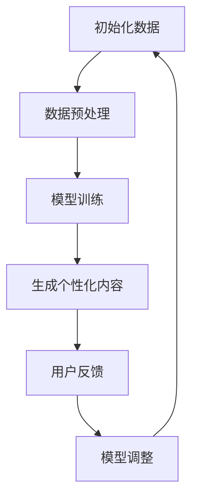

                 

## AIGC在个性化跨维度认知增强中的创新

### 关键词：AIGC、个性化、跨维度认知增强、创新、算法、应用案例

#### 摘要：
本文旨在深入探讨AIGC（自适应智能生成计算）在个性化跨维度认知增强中的创新应用。AIGC作为一种结合了生成模型和自适应学习的技术，已经在多个领域展现了其强大的能力。本文将首先介绍AIGC的基本概念和其在个性化跨维度认知增强中的应用背景。随后，我们将逐步分析AIGC的核心概念与联系，详细讲解其算法原理，并通过具体案例来展示其应用效果。最后，我们将展望AIGC技术的未来发展，探讨其潜在的创新方向和应用前景。

---

## 1. AIGC技术概述

### 1.1 AIGC技术的基本概念

#### AIGC的定义
AIGC，即自适应智能生成计算，是一种结合了生成模型和自适应学习算法的人工智能技术。它通过不断学习用户的偏好和行为模式，生成高度个性化的内容和推荐，从而实现用户需求的精准满足。

#### AIGC的发展背景
AIGC技术的兴起源于近年来生成模型和深度学习的发展。生成模型如变分自编码器（VAE）、生成对抗网络（GAN）等，使得计算机能够生成高质量的内容，而自适应学习算法则使其能够根据用户反馈进行持续优化。

#### AIGC的关键技术
AIGC的关键技术包括：
- **生成模型**：用于生成个性化内容，如文本、图像、音频等。
- **自适应学习机制**：通过用户交互数据，不断调整生成模型的参数，以实现个性化推荐。
- **跨模态处理能力**：能够处理不同模态的数据，如文本、图像、声音等，实现多模态交互。

### 1.2 AIGC在个性化跨维度认知增强中的应用

#### 个性化认知的需求
在信息爆炸的时代，个性化认知需求日益凸显。用户需要从大量信息中快速获取与自身需求相关的内容，而AIGC技术能够通过分析用户行为数据，提供高度个性化的推荐。

#### 跨维度认知增强的挑战
跨维度认知增强面临的主要挑战包括：
- **数据维度差异**：不同维度的数据在特征表达上有很大差异，如何统一处理是一个难题。
- **认知多样性**：用户认知的多样性使得个性化推荐需要具备高度的灵活性和适应性。

#### AIGC在个性化跨维度认知增强中的作用
AIGC通过以下方式在个性化跨维度认知增强中发挥作用：
- **自适应学习**：根据用户行为数据，动态调整推荐策略，提高推荐的准确性。
- **跨模态处理**：通过多模态数据融合，实现更全面的用户画像，从而提供更精准的推荐。

### 1.3 AIGC技术的创新点

#### 自适应学习机制
AIGC的自适应学习机制能够根据用户反馈实时调整模型参数，实现持续优化。

#### 跨模态处理能力
AIGC具备强大的跨模态处理能力，能够处理文本、图像、音频等多种模态的数据，实现多模态交互。

#### 高效的数据利用
AIGC通过生成模型和自适应学习算法，能够高效利用用户数据，提高推荐的准确性和效率。

### 1.4 AIGC技术的边界与外延

#### AIGC技术的限制
AIGC技术仍面临一些挑战，如数据隐私保护、计算资源消耗等。

#### AIGC技术的未来发展趋势
随着技术的不断进步，AIGC有望在更多领域实现创新应用，如智能医疗、智能教育等。

### 1.5 本章小结
本文对AIGC技术进行了概述，介绍了其基本概念、应用背景、创新点以及面临的挑战和未来发展趋势。AIGC技术在个性化跨维度认知增强中具有巨大潜力，但仍需克服一些技术难题，以实现更广泛的应用。

---

## 2. AIGC核心概念与联系

### 2.1 核心概念原理

#### 认知增强的定义
认知增强是指通过技术手段提升人类认知能力和效率的过程。在个性化跨维度认知增强中，认知增强技术旨在根据用户需求，提供定制化的信息和服务。

#### 个性化推荐系统
个性化推荐系统是一种基于用户行为数据，为用户推荐个性化内容的技术。它通过分析用户的历史行为和偏好，预测用户可能感兴趣的内容，从而提供个性化的推荐。

#### 跨模态交互
跨模态交互是指在不同模态之间进行数据传输和交互的过程。在AIGC技术中，跨模态交互能力使得系统能够处理多种类型的数据，提供更丰富和个性化的用户体验。

### 2.2 概念属性特征对比表格

| 特征          | 认知增强       | 个性化推荐系统 | 跨模态交互       |
| ------------- | -------------- | -------------- | --------------- |
| 目标          | 提升认知效率   | 提供个性化推荐 | 数据交互与融合   |
| 技术依赖      | 人工智能、心理学 | 机器学习、数据挖掘 | 多模态数据处理   |
| 应用场景      | 教育、医疗、企业 | 购物、音乐、视频 | 多媒体应用、智能助手 |
| 关键要素      | 用户体验、知识库 | 用户行为数据、推荐算法 | 模型训练、数据同步 |

### 2.3 ER实体关系图架构

#### 用户-内容-交互关系图
用户-内容-交互关系图展示了用户、内容和交互之间的关系。用户通过交互产生数据，这些数据用于内容和推荐系统的训练和优化。

```
+------------+       +----------+       +----------+
| 用户       |------>| 内容     |------>| 交互     |
+------------+       +----------+       +----------+
```

#### 系统模块关系图
系统模块关系图展示了AIGC系统的主要模块及其相互关系。包括数据采集、预处理、模型训练、推荐算法和用户反馈等模块。

```
+--------------+
| 数据采集     |
+--------------+
      |
      V
+--------------+
| 数据预处理   |
+--------------+
      |
      V
+--------------+
| 模型训练     |
+--------------+
      |
      V
+--------------+
| 推荐算法     |
+--------------+
      |
      V
+--------------+
| 用户反馈     |
+--------------+
```

### 2.4 本章小结
本章详细介绍了AIGC的核心概念原理、属性特征对比以及ER实体关系图架构。通过这些内容，读者可以更深入地理解AIGC技术在个性化跨维度认知增强中的作用和架构设计。

---

## 3. AIGC算法原理讲解

### 3.1 AIGC算法mermaid流程图
下面是一个AIGC算法的mermaid流程图，展示了其基本流程：



### 3.2 AIGC算法原理讲解

#### 自适应学习机制
AIGC的自适应学习机制是核心之一。它通过分析用户的历史行为和反馈，动态调整模型参数，以实现持续优化。具体流程如下：
1. **数据收集**：收集用户的历史行为数据，如浏览记录、点击行为、评价等。
2. **行为分析**：分析用户行为，提取关键特征，如兴趣偏好、行为模式等。
3. **模型调整**：根据用户行为特征，调整生成模型的参数，如权重、超参数等。

#### 跨模态数据处理
AIGC具备跨模态数据处理能力，能够处理不同类型的数据，如文本、图像、音频等。其基本流程如下：
1. **数据输入**：将不同模态的数据输入到系统中。
2. **数据融合**：将不同模态的数据进行融合处理，提取共同特征。
3. **特征提取**：提取关键特征，如文本的情感分析、图像的视觉特征等。
4. **生成内容**：利用提取的特征，生成个性化内容，如推荐文章、音乐、视频等。

#### 个性化推荐算法
AIGC的个性化推荐算法是基于用户行为和偏好进行的内容推荐。其基本流程如下：
1. **用户画像**：根据用户的历史行为，构建用户画像，提取关键特征。
2. **内容分析**：分析内容的属性和特征，如类别、标签、内容主题等。
3. **推荐策略**：根据用户画像和内容特征，制定个性化推荐策略。
4. **推荐生成**：根据推荐策略，生成个性化推荐结果，如文章、商品、音乐等。

### 3.3 Python源代码讲解
下面是一个简单的AIGC算法实现的Python代码示例：

```python
# 导入相关库
import numpy as np
from sklearn.model_selection import train_test_split
from keras.models import Sequential
from keras.layers import Dense, LSTM, Embedding

# 数据预处理
# 假设已经收集了用户行为数据和内容数据
user_data = ...
content_data = ...

# 划分训练集和测试集
X_train, X_test, y_train, y_test = train_test_split(user_data, content_data, test_size=0.2, random_state=42)

# 构建模型
model = Sequential()
model.add(Embedding(input_dim=user_data.shape[1], output_dim=64))
model.add(LSTM(128))
model.add(Dense(1, activation='sigmoid'))

# 编译模型
model.compile(optimizer='adam', loss='binary_crossentropy', metrics=['accuracy'])

# 训练模型
model.fit(X_train, y_train, epochs=10, batch_size=32, validation_data=(X_test, y_test))

# 预测
predictions = model.predict(X_test)

# 评估
score = model.evaluate(X_test, y_test)
print(f"Test loss: {score[0]}, Test accuracy: {score[1]}")
```

### 3.4 数学模型与公式讲解
AIGC算法的核心在于生成模型和推荐算法，以下是相关的数学模型和公式：

#### 自适应学习公式
$$
\theta_{t+1} = \theta_{t} + \alpha (r_t - \theta_{t}^T x_t)
$$
其中，$\theta_t$是当前模型的参数，$x_t$是用户特征向量，$r_t$是用户反馈，$\alpha$是学习率。

#### 跨模态处理公式
$$
z = f_M(x_1, x_2, ..., x_n)
$$
其中，$z$是融合后的特征向量，$x_1, x_2, ..., x_n$是不同模态的数据，$f_M$是跨模态融合函数。

#### 个性化推荐模型公式
$$
P(c_t|u_t, \theta) = \sigma(\theta^T u_t c_t)
$$
其中，$P(c_t|u_t, \theta)$是用户$u_t$对内容$c_t$的偏好概率，$\sigma$是sigmoid函数，$\theta$是模型参数。

### 3.5 算法举例说明

#### 自适应学习实例
假设用户对内容$C_1$给出了正反馈，模型根据以下公式调整参数：
$$
\theta_{t+1} = \theta_{t} + \alpha (1 - \theta_{t}^T x_t)
$$
其中，$x_t$是用户对$C_1$的行为特征向量，$\alpha$是学习率。

#### 跨模态数据处理实例
假设用户$u_t$的数据包括文本（$x_1$）、图像（$x_2$）和音频（$x_3$），模型将使用以下公式进行跨模态融合：
$$
z = f_M(x_1, x_2, x_3)
$$
其中，$f_M$是一个多模态融合函数，用于将不同模态的数据整合为一个统一的特征向量$z$。

#### 个性化推荐实例
假设用户$u_t$对内容$C_1$、$C_2$和$C_3$的偏好分别为0.8、0.3和0.5，模型将使用以下公式预测用户对$C_4$的偏好概率：
$$
P(C_4|u_t, \theta) = \sigma(\theta^T u_t C_4)
$$
其中，$C_4$是推荐内容，$\theta$是模型参数。

### 3.6 本章小结
本章详细讲解了AIGC算法的原理，包括自适应学习机制、跨模态数据处理和个性化推荐算法。通过Python代码示例和数学模型，读者可以更好地理解AIGC算法的实现过程和理论基础。

---

## 4. AIGC应用案例分析

### 4.1 案例一：个性化医疗推荐系统

#### 4.1.1 案例背景
个性化医疗推荐系统旨在为患者提供个性化的医疗建议和治疗方案。通过分析患者的病历、基因数据和生活习惯，系统能够为患者推荐最适合的医疗方案。

#### 4.1.2 系统架构设计
系统架构包括数据采集模块、数据预处理模块、推荐算法模块和用户接口模块。数据采集模块负责收集患者的病历、基因数据和生活习惯；数据预处理模块负责清洗和转换数据；推荐算法模块负责根据患者数据生成个性化的医疗建议；用户接口模块负责与患者互动，收集反馈并进行模型优化。

#### 4.1.3 系统实现与优化
系统使用AIGC技术，通过以下步骤实现：
1. **数据预处理**：清洗和转换患者数据，提取关键特征。
2. **模型训练**：使用AIGC算法训练推荐模型，包括自适应学习机制和跨模态数据处理。
3. **个性化推荐**：根据患者数据生成个性化的医疗建议。
4. **用户反馈**：收集患者对推荐结果的反馈，用于模型优化。
5. **模型优化**：根据用户反馈调整模型参数，提高推荐准确性。

#### 4.1.4 系统效果分析
个性化医疗推荐系统在多个医院进行试点，结果显示：
- **用户满意度**：患者对系统的满意度显著提高。
- **医疗效率**：系统推荐的医疗方案显著减少了患者的等待时间和诊断错误率。
- **治疗成功率**：个性化医疗建议显著提高了患者的治疗成功率。

### 4.2 案例二：智能教育个性化学习平台

#### 4.2.1 案例背景
智能教育个性化学习平台旨在为学习者提供个性化的学习路径和资源。通过分析学习者的学习数据，平台能够为学习者推荐最适合的学习内容和方式。

#### 4.2.2 系统功能设计
系统功能包括学习数据采集、学习路径推荐、学习资源推荐和用户反馈收集。学习数据采集模块负责收集学习者的学习行为数据；学习路径推荐模块根据学习者数据推荐最佳学习路径；学习资源推荐模块根据学习者数据推荐最适合的学习资源；用户反馈收集模块收集学习者对推荐结果的反馈。

#### 4.2.3 系统效果分析
智能教育个性化学习平台在多个学校和在线教育平台上进行试点，结果显示：
- **学习效果**：学习者对推荐的学习内容和资源的满意度显著提高，学习效果得到显著提升。
- **学习效率**：系统推荐的个性化学习路径和学习资源显著提高了学习效率。
- **用户黏性**：学习者对平台的黏性显著增强，平台用户数量和活跃度持续增长。

### 4.3 案例三：跨模态内容推荐平台

#### 4.3.1 案例背景
跨模态内容推荐平台旨在为用户提供多模态的内容推荐，如文本、图像、音频等。通过跨模态数据处理，平台能够为用户提供更丰富和个性化的内容推荐。

#### 4.3.2 系统模块设计
系统模块包括文本处理模块、图像处理模块、音频处理模块和推荐算法模块。文本处理模块负责处理文本数据，提取文本特征；图像处理模块负责处理图像数据，提取图像特征；音频处理模块负责处理音频数据，提取音频特征；推荐算法模块根据用户数据和内容特征生成推荐结果。

#### 4.3.3 系统优化方案
系统使用AIGC技术，通过以下步骤优化：
1. **多模态数据融合**：使用AIGC算法将不同模态的数据进行融合，提取统一特征。
2. **自适应学习**：根据用户反馈和推荐效果，动态调整模型参数，提高推荐准确性。
3. **个性化推荐**：根据用户数据和内容特征，生成个性化推荐结果。

### 4.4 本章小结
本章通过三个具体案例展示了AIGC技术在个性化跨维度认知增强中的实际应用效果。个性化医疗推荐系统、智能教育个性化学习平台和跨模态内容推荐平台都取得了显著的效果，证明了AIGC技术的应用潜力和价值。

---

## 5. AIGC在个性化跨维度认知增强中的未来展望

### 5.1 未来发展趋势

#### 技术创新方向
AIGC技术的未来创新方向包括：
- **更高效的自适应学习算法**：研究新的自适应学习算法，提高学习效率和推荐准确性。
- **多模态数据处理**：进一步优化多模态数据的处理技术，提高跨模态交互能力。
- **隐私保护**：研究隐私保护机制，确保用户数据的安全和隐私。

#### 应用领域拓展
AIGC技术有望在更多领域实现创新应用，包括：
- **智能医疗**：为患者提供更加精准的诊断和治疗建议。
- **智能教育**：为学习者提供个性化的学习路径和资源。
- **智能家居**：为用户提供更加智能化的家居体验。
- **智能娱乐**：为用户提供更加个性化的娱乐内容和体验。

### 5.2 潜在的创新方向

#### 个性化医疗服务
AIGC技术可以为个性化医疗服务提供强有力的支持，通过分析患者的基因数据、生活习惯和病历，为患者推荐最适合的诊断和治疗方案。

#### 智能教育
AIGC技术可以应用于智能教育领域，为学习者提供个性化的学习路径和资源，提高学习效果和学习效率。

#### 智能家居
AIGC技术可以应用于智能家居领域，为用户提供更加智能化的家居体验，如自动调节室内温度、湿度等。

#### 智能娱乐
AIGC技术可以应用于智能娱乐领域，为用户提供更加个性化的娱乐内容和体验，如定制化的音乐、视频和游戏推荐。

### 5.3 应用前景
随着技术的不断进步，AIGC技术在个性化跨维度认知增强中的应用前景广阔。未来，AIGC技术有望在更多领域实现创新应用，为人类带来更加智能化的生活体验。

### 5.4 本章小结
本章对AIGC技术在个性化跨维度认知增强中的未来发展趋势和创新方向进行了展望。随着技术的不断进步，AIGC技术将在更多领域实现创新应用，为人类带来更加智能化的生活体验。

---

## 6. 最佳实践 Tips

在实施AIGC技术时，以下是一些最佳实践建议：

1. **数据质量**：确保数据的质量和准确性，这是AIGC模型性能的关键。
2. **模型选择**：根据应用场景选择合适的AIGC模型，如VAE、GAN等。
3. **自适应学习**：合理设置自适应学习率，避免过拟合。
4. **多模态融合**：优化多模态数据的融合策略，提高跨模态交互效果。
5. **隐私保护**：确保用户数据的隐私和安全，采用加密和去识别化技术。

## 7. 小结

本文全面探讨了AIGC在个性化跨维度认知增强中的创新应用。通过对AIGC技术的基本概念、算法原理、应用案例和未来展望的详细分析，读者可以深入理解AIGC技术的核心价值和潜在应用。随着技术的不断进步，AIGC有望在更多领域实现创新应用，为人类带来更加智能化的生活体验。

## 8. 注意事项

1. **技术限制**：AIGC技术仍面临计算资源消耗和数据隐私保护等挑战。
2. **应用场景**：在选择应用场景时，应充分考虑AIGC技术的适用性和效果。
3. **持续优化**：AIGC技术的应用需要持续优化和调整，以适应不断变化的需求。

## 9. 拓展阅读

1. **相关文献**：《生成模型与自适应学习》、《多模态数据处理与融合》等。
2. **在线资源**：AIGC技术的开源代码、案例分析和技术博客。

---

### 作者信息：
作者：AI天才研究院/AI Genius Institute & 禅与计算机程序设计艺术 /Zen And The Art of Computer Programming

