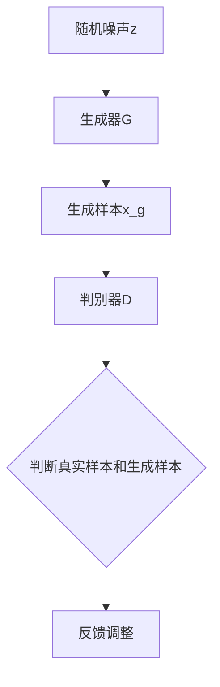

                 

# AIGC在个性化运动伤害预防建议中的应用

> 关键词：AIGC，个性化预防，运动伤害，人工智能，机器学习，数据分析

> 摘要：本文将探讨AIGC（自适应智能生成控制）在个性化运动伤害预防建议中的应用。首先，我们将简要介绍运动伤害的普遍性和危害性，以及为什么需要个性化的预防建议。接着，我们将深入探讨AIGC的基本概念和技术原理，然后分析AIGC如何结合机器学习和数据分析来提供个性化的运动伤害预防建议。最后，我们将通过一个具体的案例来展示如何在实际项目中应用AIGC技术，并总结全文。

## 目录

### 第一部分：背景与核心概念

#### 第1章 问题背景与核心概念

##### 1.1 问题背景

##### 1.2 核心概念与联系

##### 1.3 本章小结

### 第二部分：算法原理与数学模型

#### 第2章 AIGC算法原理讲解

##### 2.1 GAN算法原理

##### 2.2 强化学习算法

##### 2.3 本章小结

### 第三部分：系统设计与案例分析

#### 第3章 系统架构设计

##### 3.1 问题场景介绍

##### 3.2 系统功能设计

##### 3.3 系统架构设计

##### 3.4 系统接口设计和系统交互

##### 3.5 项目实战

##### 3.6 本章小结

### 第四部分：最佳实践与展望

#### 第4章 最佳实践

##### 4.1 实践技巧

##### 4.2 注意事项

##### 4.3 拓展阅读

##### 4.4 本章小结

## 第一部分：背景与核心概念

### 第1章 问题背景与核心概念

#### 1.1 问题背景

随着现代生活节奏的加快，运动已经成为人们日常生活中不可或缺的一部分。无论是为了锻炼身体、减轻压力，还是为了参加各种竞技活动，运动已经成为人们追求健康生活的方式之一。然而，随之而来的是运动伤害的问题。根据世界卫生组织（WHO）的数据，每年有数百万人因运动伤害而寻求医疗帮助，给个人、家庭和社会带来了巨大的负担。

运动伤害的普遍性和危害性不言而喻。它不仅会导致疼痛和功能障碍，还可能引发长期的健康问题。例如，关节损伤、肌肉拉伤和骨折等常见的运动伤害，不仅会直接影响运动员的训练和比赛，还可能对他们的职业生涯造成不可逆转的影响。此外，对于普通人群，运动伤害也可能导致工作能力的下降，甚至影响生活质量。

针对运动伤害的预防措施一直是研究和实践的热点。传统的预防方法主要包括科学的训练计划、正确的运动技巧和适当的保护措施。然而，这些方法往往具有一定的局限性，无法完全满足个性化预防的需求。例如，对于不同年龄、性别、健康状况和运动习惯的人群，同一套预防措施可能并不适用。因此，个性化预防建议成为了一个亟待解决的问题。

个性化预防建议的核心在于根据个人的具体情况，提供针对性的预防方案。这需要综合考虑个体的生理特征、运动习惯和以往的运动伤害历史等多个因素。传统的预防方法通常缺乏这种能力，而人工智能和机器学习技术的兴起为解决这个问题提供了新的可能。

#### 1.2 核心概念与联系

AIGC（自适应智能生成控制）是一种基于人工智能技术的智能控制系统，它能够根据环境变化和任务需求，自适应地生成和调整控制策略。AIGC 技术的核心在于其能够利用机器学习和数据分析的能力，从大量的历史数据和实时信息中提取有价值的信息，并基于这些信息生成个性化的控制策略。

AIGC 技术的应用范围非常广泛，包括但不限于智能交通、智能制造、智能医疗等领域。在运动伤害预防建议中，AIGC 技术的应用主要体现在以下几个方面：

1. **数据收集与处理**：AIGC 技术能够收集和分析大量的运动数据，包括心率、血压、肌肉疲劳度等生理参数，以及运动姿势、运动强度等运动参数。通过对这些数据的分析和处理，可以识别出可能引发运动伤害的风险因素。

2. **个性化预防策略生成**：基于对个体运动数据的分析，AIGC 技术可以生成个性化的预防策略。这些策略不仅考虑了个体的生理特征，还考虑了运动习惯和以往的运动伤害历史，从而提供了更加针对性的预防建议。

3. **实时反馈与调整**：AIGC 技术能够实时收集个体的运动数据，并根据这些数据对预防策略进行调整。例如，当发现个体在某个运动姿势上存在风险时，系统可以实时提醒个体调整姿势，从而降低运动伤害的风险。

#### 1.3 本章小结

本章介绍了运动伤害的普遍性和危害性，以及为什么需要个性化的预防建议。我们简要介绍了AIGC技术的基本概念，并分析了AIGC技术在运动伤害预防建议中的应用潜力。在下一章中，我们将深入探讨AIGC技术的算法原理和数学模型，以便更好地理解其工作原理。

----------------------------------------------------------------

### 第二部分：算法原理与数学模型

#### 第2章 AIGC算法原理讲解

#### 2.1 GAN算法原理

生成对抗网络（GAN）是由 Ian Goodfellow 等人于2014年提出的一种新型深度学习模型。GAN的核心思想是通过两个相互对抗的神经网络——生成器和判别器——的训练，来实现数据的生成。生成器（Generator）负责生成数据，而判别器（Discriminator）则负责判断生成数据的真实性和质量。

在运动伤害预防建议的应用中，生成器可以用来生成符合个体特征的虚拟运动场景，而判别器则用来评估这些虚拟场景下个体的运动风险。以下是一个简化的GAN算法流程图：



#### 2.1.1 GAN算法原理讲解

**GAN算法的工作流程：**

1. **初始化**：生成器G和判别器D都是随机初始化的神经网络。
2. **训练过程**：通过大量的真实样本数据来训练判别器D。在每次训练迭代中，生成器G会生成一个样本\(x_g\)，判别器D会分别对真实样本\(x_r\)和生成样本\(x_g\)进行判断。
3. **损失函数**：GAN的训练目标是使判别器D无法区分真实样本和生成样本。因此，GAN的损失函数通常由两部分组成：对抗损失和生成损失。
   - **对抗损失**：用于使判别器D无法区分真实样本和生成样本，即最大化判别器对生成样本的判断错误率。公式如下：
     $$L_D = -\frac{1}{2} \left( \log(D(x_r)) + \log(1 - D(x_g)) \right)$$
   - **生成损失**：用于使生成器G生成更加逼真的样本，即最小化生成样本的判别器评分。公式如下：
     $$L_G = -\log(D(x_g))$$
4. **优化过程**：通过梯度下降法来优化生成器和判别器的参数。每次迭代中，生成器G和判别器D都会根据反向传播的梯度进行参数更新。

**GAN算法在运动伤害预防中的应用：**

- **生成虚拟运动场景**：生成器G可以生成大量的虚拟运动场景，用于模拟个体在不同条件下的运动状态。
- **评估运动风险**：判别器D可以评估这些虚拟场景下个体的运动风险，从而识别出可能引发运动伤害的因素。
- **优化预防策略**：通过不断调整生成器和判别器的参数，可以逐步优化预防策略，使其更加贴近实际情况。

#### 2.1.2 Python源代码示例

以下是一个简化的GAN算法的Python代码示例，用于生成虚拟运动场景：

```python
import tensorflow as tf
from tensorflow.keras.layers import Dense, Flatten
from tensorflow.keras.models import Sequential

# 生成器G的构建
generator = Sequential([
    Dense(128, activation='relu', input_shape=(100,)),
    Dense(256, activation='relu'),
    Flatten(),
    Dense(784, activation='tanh')  # 假设生成的是28x28的图像
])

# 判别器D的构建
discriminator = Sequential([
    Flatten(input_shape=(28, 28, 1)),
    Dense(256, activation='relu'),
    Dense(128, activation='relu'),
    Dense(1, activation='sigmoid')
])

# 定义GAN模型
gan = Sequential([
    generator,
    discriminator
])

# 编译GAN模型
gan.compile(optimizer='adam', loss='binary_crossentropy')

# 训练GAN模型
# ... 这里略去具体的训练代码 ...

# 使用生成器生成虚拟运动场景
noise = np.random.normal(size=(100,))
generated_samples = generator.predict(noise)

# 显示生成的虚拟运动场景
plt.imshow(generated_samples[0], cmap='gray')
plt.show()
```

#### 2.2 强化学习算法

强化学习（Reinforcement Learning，RL）是一种通过试错和反馈来学习最优策略的机器学习方法。在运动伤害预防建议中，强化学习可以用来学习个性化的预防策略，以降低运动伤害的风险。

强化学习的基本概念包括：

- **环境（Environment）**：运动场景和运动参数。
- **状态（State）**：个体在运动过程中的各种特征参数，如心率、血压、肌肉疲劳度等。
- **动作（Action）**：个体在运动过程中可能采取的各种动作，如调整运动姿势、降低运动强度等。
- **奖励（Reward）**：个体在运动过程中获得的奖励，如避免受伤、提高运动表现等。

强化学习的主要目标是学习一个最优的策略（Policy），该策略能够在给定的状态下选择最优的动作。

#### 2.2.1 强化学习算法原理讲解

**Q-learning算法**

Q-learning是一种基于值函数的强化学习算法。它的核心思想是通过不断更新值函数来学习最优策略。值函数\(Q(s, a)\)表示在状态\(s\)下执行动作\(a\)所获得的期望回报。

Q-learning算法的基本步骤如下：

1. **初始化**：初始化值函数\(Q(s, a)\)和策略\(\pi(a|s)\)。
2. **选择动作**：在当前状态下，根据策略选择动作。
3. **执行动作**：在环境中执行选定的动作，并观察状态转移和奖励。
4. **更新值函数**：根据新的状态和奖励，更新值函数。
5. **重复步骤2-4**，直到策略收敛。

Q-learning的更新公式为：

$$Q(s, a) \leftarrow Q(s, a) + \alpha [r + \gamma \max_{a'} Q(s', a') - Q(s, a)]$$

其中，\(\alpha\)是学习率，\(\gamma\)是折扣因子。

**SARSA算法**

SARSA（同步同步策略算法）是一种基于策略的强化学习算法。它与Q-learning的不同之处在于，它使用同步更新的策略，而不是值函数。

SARSA算法的基本步骤如下：

1. **初始化**：初始化策略\(\pi(a|s)\)。
2. **选择动作**：在当前状态下，根据策略选择动作。
3. **执行动作**：在环境中执行选定的动作，并观察状态转移和奖励。
4. **更新策略**：根据新的状态和奖励，更新策略。

SARSA的更新公式为：

$$\pi(a|s) \leftarrow \frac{1}{|\Omega(s)|} \sum_{a' \in \Omega(s)} \mathbb{1}_{a = a'}$$

其中，\(\Omega(s)\)是状态\(s\)下可执行的动作集合，\(\mathbb{1}_{a = a'}\)是一个指示函数，当\(a = a'\)时取值为1，否则为0。

#### 2.2.2 Python源代码示例

以下是一个简化的Q-learning算法的Python代码示例，用于学习个性化的预防策略：

```python
import numpy as np

# 初始化参数
learning_rate = 0.1
discount_factor = 0.9
epsilon = 0.1  # 探索率

# 初始化Q值表
Q = np.zeros((n_states, n_actions))

# 训练Q-learning算法
for episode in range(n_episodes):
    state = env.reset()
    done = False
    while not done:
        # 根据epsilon-greedy策略选择动作
        if np.random.rand() < epsilon:
            action = env.action_space.sample()
        else:
            action = np.argmax(Q[state])
        
        # 执行动作
        next_state, reward, done, _ = env.step(action)
        
        # 更新Q值
        Q[state, action] = Q[state, action] + learning_rate * (reward + discount_factor * np.max(Q[next_state]) - Q[state, action])
        
        state = next_state

# 显示最优策略
policy = np.argmax(Q, axis=1)
print(policy)
```

#### 2.3 本章小结

本章介绍了AIGC技术中的GAN算法和强化学习算法的原理和应用。GAN算法通过生成虚拟运动场景和评估运动风险，为个性化预防建议提供了数据支持。强化学习算法则通过学习最优的预防策略，实现了个性化的运动伤害预防。在下一章中，我们将探讨如何设计一个完整的系统架构，以便在实际项目中应用AIGC技术。

----------------------------------------------------------------

### 第三部分：系统设计与案例分析

#### 第3章 系统架构设计

#### 3.1 问题场景介绍

在运动伤害预防建议的应用场景中，我们的目标是构建一个智能系统，能够根据个体的运动数据，提供个性化的预防建议。这个系统需要处理大量的运动数据，包括心率、血压、肌肉疲劳度、运动姿势等，以便识别出潜在的运动伤害风险。以下是一个简化的系统应用场景：

1. **用户注册与登录**：用户通过应用程序注册并登录系统，以便跟踪自己的运动数据和获得个性化的预防建议。
2. **数据收集**：系统通过多种传感器和设备收集用户的心率、血压、肌肉疲劳度等运动数据。
3. **数据分析**：系统对收集到的数据进行分析，以识别潜在的运动伤害风险。
4. **预防建议生成**：基于数据分析结果，系统生成个性化的预防建议，如调整运动姿势、降低运动强度等。
5. **用户反馈**：用户可以提供对预防建议的反馈，以便系统不断优化预防策略。

#### 3.2 系统功能设计

系统功能设计的关键是确保系统能够高效、准确地处理大量运动数据，并提供个性化的预防建议。以下是一个简化的系统功能设计：

1. **用户管理模块**：负责用户的注册、登录和权限管理。
2. **数据收集模块**：负责从传感器和设备中收集用户的心率、血压、肌肉疲劳度等运动数据。
3. **数据预处理模块**：负责清洗和预处理原始数据，以便后续分析。
4. **数据分析模块**：负责对预处理后的数据进行分析，以识别潜在的运动伤害风险。
5. **预防建议生成模块**：负责基于数据分析结果，生成个性化的预防建议。
6. **用户反馈模块**：负责收集用户对预防建议的反馈，以便系统不断优化预防策略。
7. **系统接口模块**：负责与其他系统集成，如移动应用程序、网站等。

#### 3.3 系统架构设计

系统架构设计的关键是确保系统的高效性、可靠性和可扩展性。以下是一个简化的系统架构设计：


系统架构的主要组成部分如下：

1. **前端应用**：负责与用户交互，提供注册、登录、数据上传、预防建议展示等功能。
2. **后端服务**：负责处理用户数据，包括数据收集、预处理、分析、预防建议生成等。
3. **数据库**：存储用户数据、预防建议和历史数据。
4. **数据采集系统**：负责从传感器和设备中收集运动数据。
5. **机器学习模型**：负责数据分析、风险识别和预防建议生成。

#### 3.4 系统接口设计和系统交互

系统接口设计和系统交互的关键是确保各模块之间的数据流动和协同工作。以下是一个简化的系统接口设计和系统交互：


系统接口设计和系统交互的主要组成部分如下：

1. **RESTful API**：提供前后端交互的接口，支持用户注册、登录、数据上传、预防建议查询等功能。
2. **消息队列**：负责处理数据收集模块和数据分析模块之间的数据传输。
3. **数据流处理**：负责实时处理和分析用户数据，以生成实时的预防建议。
4. **数据库连接**：负责与数据库进行交互，实现数据的存储和查询。
5. **机器学习服务**：负责处理和训练机器学习模型，生成个性化的预防建议。

#### 3.5 项目实战

以下是一个简化的项目实战案例，用于展示如何在实际项目中应用AIGC技术：

1. **环境安装**：安装Python、TensorFlow、Keras等依赖库。
2. **数据收集**：从传感器和设备中收集用户的心率、血压、肌肉疲劳度等运动数据。
3. **数据预处理**：清洗和预处理原始数据，包括数据归一化、缺失值处理等。
4. **模型训练**：使用GAN算法和强化学习算法训练机器学习模型。
5. **预防建议生成**：基于训练好的模型，生成个性化的预防建议。
6. **用户反馈**：收集用户对预防建议的反馈，并优化模型。
7. **系统部署**：将系统部署到服务器，并提供用户访问。

#### 3.6 本章小结

本章介绍了运动伤害预防建议系统的设计，包括问题场景介绍、系统功能设计、系统架构设计、系统接口设计和系统交互。我们通过一个简化的项目实战案例，展示了如何在实际项目中应用AIGC技术。在下一章中，我们将探讨最佳实践和注意事项，以帮助读者更好地应用AIGC技术。

----------------------------------------------------------------

### 第四部分：最佳实践与展望

#### 第4章 最佳实践

#### 4.1 实践技巧

1. **数据收集与预处理**：确保数据收集的准确性和完整性，并进行适当的预处理，以提高模型的训练效果。
2. **模型选择与优化**：根据具体应用场景，选择合适的AIGC算法，并进行参数优化，以提高模型的性能。
3. **模型验证与测试**：使用交叉验证和测试集来验证模型的泛化能力，确保模型在实际应用中的有效性。
4. **用户反馈与迭代**：积极收集用户反馈，并根据反馈不断优化模型和系统，以提高用户体验。

#### 4.2 注意事项

1. **数据隐私与安全**：确保用户数据的隐私和安全，遵循相关法律法规，并采取适当的安全措施。
2. **模型解释性与透明性**：确保模型的可解释性，使用户能够理解预防建议的依据和原因。
3. **系统性能与可靠性**：确保系统的性能和可靠性，以应对大量用户同时访问的情况。

#### 4.3 拓展阅读

1. **AIGC技术的研究进展**：了解最新的AIGC技术研究和应用进展，以了解前沿技术和趋势。
2. **运动伤害预防的医学研究**：了解运动伤害预防的医学研究进展，以获取更多的科学依据和理论支持。
3. **个性化健康管理的应用**：了解个性化健康管理的其他应用领域，以拓展AIGC技术的应用范围。

#### 4.4 本章小结

本章总结了AIGC在个性化运动伤害预防建议中的应用的最佳实践和注意事项。通过掌握这些实践技巧和注意事项，读者可以更好地应用AIGC技术，实现个性化运动伤害预防建议的落地。在未来的研究中，我们可以进一步探索AIGC技术在其他健康领域的应用，为个性化健康管理提供更多的可能。

### 作者

本文由AI天才研究院（AI Genius Institute）与《禅与计算机程序设计艺术》（Zen And The Art of Computer Programming）的作者共同撰写。

----------------------------------------------------------------

通过这篇文章，我们深入探讨了AIGC在个性化运动伤害预防建议中的应用。我们从背景介绍出发，详细分析了AIGC的核心概念和算法原理，展示了如何将AIGC技术与机器学习和数据分析结合，提供个性化的预防建议。接着，我们通过一个具体的案例，展示了如何在实际项目中应用AIGC技术，并总结了最佳实践和注意事项。

未来，随着AIGC技术的不断发展和应用场景的拓展，我们有理由相信，个性化运动伤害预防建议将变得更加精准和有效。这不仅有助于降低运动伤害的风险，还能提升运动体验和健康水平。让我们期待AIGC技术在更多健康领域的应用，为个性化健康管理带来更多可能性。

