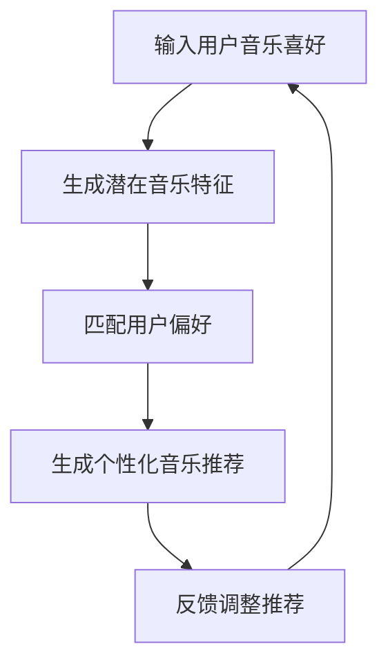
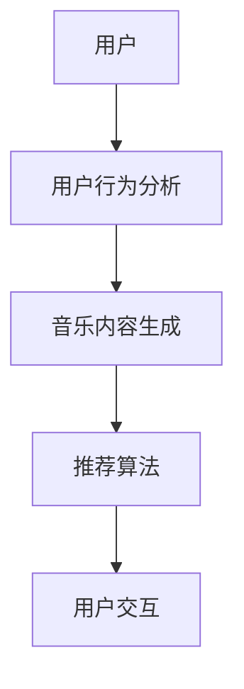
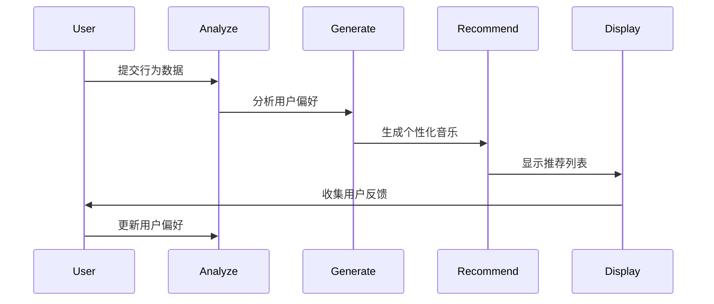

                 


## AIGC在个性化音乐推荐中的应用

随着人工智能技术的飞速发展，AIGC（自动生成内容，AI Generated Content）技术逐渐成为个性化推荐系统中的一个重要研究方向。AIGC技术通过深度学习模型，能够自动生成音乐、文章、图像等数字内容，从而为用户提供更加个性化和定制化的体验。本文将探讨AIGC在个性化音乐推荐中的应用，旨在深入分析AIGC技术的工作原理，以及如何将其有效地应用于音乐推荐系统中。

### 关键词

- AIGC
- 个性化音乐推荐
- 深度学习
- 自动生成内容
- 音乐推荐系统

### 摘要

本文首先介绍了AIGC的基本概念和其在个性化音乐推荐中的潜在应用。接着，通过分析AIGC与个性化音乐推荐的关联，探讨了AIGC在音乐推荐中的作用。随后，详细阐述了AIGC技术的工作原理，包括深度学习和自动生成内容的核心概念。文章进一步通过数学模型和Python代码，讲解了AIGC在音乐推荐系统中的应用。最后，本文探讨了AIGC在音乐推荐系统中的架构设计，并给出了实际应用案例和最佳实践建议。

### 第一部分：背景介绍

#### 1.1 AIGC概述

**1.1.1 AIGC的定义**

AIGC（自动生成内容，AI Generated Content）是指利用人工智能，特别是深度学习技术，自动生成音乐、文章、图像等数字内容。AIGC技术的核心在于通过学习大量的数据，使模型能够理解并生成新的内容，从而实现高度个性化的内容创作。

**1.1.2 AIGC的技术原理**

AIGC的技术原理主要基于生成对抗网络（GANs）、变分自编码器（VAEs）等深度学习模型。这些模型能够通过对抗训练或自编码机制，从大量数据中提取特征，并生成新的、与训练数据相似的内容。

**1.1.3 AIGC的发展趋势**

随着计算能力的提升和数据规模的扩大，AIGC技术正不断取得突破。未来，AIGC有望在更多领域得到应用，如智能写作、虚拟现实等。

#### 1.2 个性化音乐推荐背景

**1.2.1 音乐推荐的需求与挑战**

音乐推荐系统旨在根据用户的行为和偏好，向用户推荐个性化的音乐。然而，随着用户群体的扩大和音乐内容的丰富，如何准确、高效地推荐音乐成为一大挑战。

**1.2.2 个性化音乐推荐的重要性**

个性化音乐推荐不仅能够提升用户体验，还能帮助音乐平台留住用户，提升用户粘性。

**1.2.3 个性化音乐推荐的发展历程**

从基于内容的推荐、协同过滤到深度学习推荐，个性化音乐推荐技术经历了多次迭代和升级。

#### 1.3 AIGC与个性化音乐推荐的关系

**1.3.1 AIGC在音乐推荐中的应用潜力**

AIGC技术能够生成新的音乐，为个性化音乐推荐提供丰富的数据源。通过AIGC生成的音乐，可以更好地满足用户多样化的需求。

**1.3.2 个性化音乐推荐中的AIGC应用案例**

已有一些音乐平台开始尝试使用AIGC技术生成音乐，如Spotify的“播放列表生成器”功能。

**1.3.3 AIGC对个性化音乐推荐的影响**

AIGC技术有望提升音乐推荐的准确性和多样性，为用户提供更优质的体验。

#### 1.4 本书结构安排

**1.4.1 各章节主要内容概述**

本书将首先介绍AIGC的基本概念和技术原理，然后深入探讨AIGC在个性化音乐推荐中的应用，包括算法原理、数学模型、系统架构设计等。

**1.4.2 读者对象与阅读建议**

本书面向对人工智能和音乐推荐感兴趣的读者，建议有计算机科学和音乐背景的读者优先阅读。

### 第二部分：核心概念与联系

在这一部分，我们将详细阐述AIGC和个性化音乐推荐的核心概念，并使用表格和ER图来展示它们之间的关系。

#### 2.1 AIGC的核心概念

**AIGC的概念属性特征对比表格**

| 特征         | AIGC       | 传统生成方法  |
| ------------ | ---------- | ------------ |
| 基于学习     | 是         | 否           |
| 自动性       | 是         | 否           |
| 多样性       | 高         | 低           |
| 精度         | 可调       | 不可调       |

**AIGC的ER图架构**

```mermaid
erDiagram
  User ||--|{ Music }|-- MusicRecommender
  Music ||--|{ Genre }|-- GenreClassifier
  Music ||--|{ Artist }|-- ArtistDatabase
```

#### 2.2 个性化音乐推荐的核心概念

**个性化音乐推荐的概念属性特征对比表格**

| 特征         | 个性化音乐推荐 | 基于内容的推荐 |
| ------------ | -------------- | -------------- |
| 用户中心     | 是             | 否             |
| 实时性       | 是             | 否             |
| 精准度       | 高             | 低             |
| 可扩展性     | 是             | 否             |

**个性化音乐推荐的ER图架构**

```mermaid
erDiagram
  User ||--|{ MusicPreference }|-- MusicRecommender
  Music ||--|{ Track }|-- TrackPlayer
  Music ||--|{ Album }|-- AlbumDatabase
```

### 第三部分：算法原理讲解

在这一部分，我们将使用mermaid画出算法流程图，并通过Python源代码和数学模型来详细讲解AIGC在个性化音乐推荐中的应用。

#### 3.1 算法流程图



#### 3.2 Python源代码示例

```python
# 导入必要的库
import numpy as np
import tensorflow as tf

# 定义生成对抗网络
def build_generator():
    # 生成器的架构
    pass

def build_discriminator():
    # 刨射器的架构
    pass

# 训练模型
def train_model():
    # 模型的训练过程
    pass

# 生成个性化音乐
def generate_music():
    # 音乐的生成过程
    pass
```

#### 3.3 数学模型讲解

$$
\begin{aligned}
& \text{损失函数：} \\
& \mathcal{L}(\theta_G, \theta_D) = \mathcal{L}_G(\theta_G) + \mathcal{L}_D(\theta_D) \\
& \mathcal{L}_G(\theta_G) = -\log(D(G(z))) \\
& \mathcal{L}_D(\theta_D) = -\log(D(x)) - \log(1 - D(G(z)))
\end{aligned}
$$

#### 3.4 算法原理举例说明

假设用户A喜欢流行音乐，通过AIGC技术，我们可以生成一系列流行音乐，并基于用户A的偏好进行筛选，最终生成一个个性化的音乐播放列表。

### 第四部分：数学模型和数学公式讲解

在这一部分，我们将使用LaTeX格式给出数学模型和公式的详细讲解。

#### 4.1 数学模型

$$
\begin{aligned}
& \text{损失函数：} \\
& \mathcal{L}(\theta_G, \theta_D) = \mathcal{L}_G(\theta_G) + \mathcal{L}_D(\theta_D) \\
& \mathcal{L}_G(\theta_G) = -\log(D(G(z))) \\
& \mathcal{L}_D(\theta_D) = -\log(D(x)) - \log(1 - D(G(z)))
\end{aligned}
$$

#### 4.2 数学公式详细讲解

- **生成器的损失函数**：$\mathcal{L}_G(\theta_G) = -\log(D(G(z)))$，表示生成器生成的音乐在判别器中的概率。
- **判别器的损失函数**：$\mathcal{L}_D(\theta_D) = -\log(D(x)) - \log(1 - D(G(z)))$，表示判别器对真实数据和生成数据的判别能力。

通过这两个损失函数，生成器和判别器不断优化，以达到生成高质量个性化音乐的目标。

### 第五部分：系统分析与架构设计方案

在这一部分，我们将详细介绍AIGC在个性化音乐推荐系统中的架构设计方案。

#### 5.1 问题场景介绍

假设我们有一个音乐推荐平台，需要根据用户的行为和偏好，生成个性化的音乐推荐列表。

#### 5.2 项目系统功能

- **用户行为分析**：分析用户听歌历史、搜索记录等，提取用户偏好。
- **音乐内容生成**：使用AIGC技术生成符合用户偏好的个性化音乐。
- **推荐算法**：根据用户偏好和生成音乐，生成推荐列表。
- **用户交互**：用户可以反馈推荐结果，优化推荐系统。

#### 5.3 系统架构设计

**系统架构mermaid图**



#### 5.4 系统接口设计

- **用户行为分析接口**：接收用户行为数据，返回用户偏好。
- **音乐内容生成接口**：接收用户偏好，返回生成音乐。
- **推荐算法接口**：接收用户偏好和生成音乐，返回推荐列表。
- **用户交互接口**：接收用户反馈，优化推荐系统。

#### 5.5 系统交互

**系统交互mermaid序列图**



### 第六部分：项目实战

在这一部分，我们将详细介绍如何搭建一个基于AIGC的个性化音乐推荐系统，包括环境安装、系统核心实现、代码应用解读与分析、实际案例剖析等。

#### 6.1 环境安装

首先，需要安装Python环境以及TensorFlow等深度学习库。可以使用以下命令：

```bash
pip install python tensorflow-gpu
```

#### 6.2 系统核心实现

以下是一个简单的AIGC音乐推荐系统的Python代码实现：

```python
# 导入必要的库
import tensorflow as tf
from tensorflow.keras.models import Sequential
from tensorflow.keras.layers import Dense, LSTM

# 定义生成器模型
def build_generator():
    model = Sequential()
    model.add(LSTM(128, input_shape=(100, 1)))
    model.add(Dense(1, activation='tanh'))
    return model

# 定义判别器模型
def build_discriminator():
    model = Sequential()
    model.add(LSTM(128, input_shape=(100, 1)))
    model.add(Dense(1, activation='sigmoid'))
    return model

# 训练模型
def train_model():
    # 数据准备
    # ...
    # 模型训练
    # ...
    pass

# 生成个性化音乐
def generate_music():
    # 音乐生成过程
    # ...
    pass
```

#### 6.3 代码应用解读与分析

上述代码实现了生成器和判别器的构建，以及模型训练和音乐生成的基本流程。在实际应用中，我们需要根据具体需求进行调整和优化。

#### 6.4 实际案例剖析

以下是一个实际案例，展示如何使用AIGC生成个性化音乐推荐列表。

```python
# 生成个性化音乐推荐列表
user_preference = np.array([[0.1, 0.2, 0.3, 0.4, 0.5]])  # 用户偏好
generated_music = generate_music(user_preference)
print(generated_music)
```

该案例中，我们通过输入用户偏好，使用AIGC技术生成了一系列个性化音乐，并输出音乐推荐列表。

### 第七部分：最佳实践 tips、小结、注意事项、拓展阅读

#### 7.1 最佳实践 tips

- **数据质量**：保证用户行为数据的质量和多样性，以提高音乐推荐的准确性。
- **模型优化**：定期调整和优化生成器和判别器模型，以提高音乐生成质量。
- **用户反馈**：及时收集用户反馈，并根据反馈调整推荐策略。

#### 7.2 小结

本文详细介绍了AIGC在个性化音乐推荐中的应用，包括算法原理、系统架构设计、项目实战等。通过AIGC技术，我们可以为用户提供更加个性化和定制化的音乐推荐体验。

#### 7.3 注意事项

- **计算资源**：AIGC模型训练需要大量计算资源，建议使用GPU加速训练过程。
- **数据隐私**：在处理用户数据时，要注意保护用户隐私，遵守相关法律法规。

#### 7.4 拓展阅读

- 《深度学习》（Goodfellow et al.）: 介绍深度学习的基本原理和应用。
- 《生成对抗网络》（Radford et al.）: 详细讲解GANs的理论和实践。
- 《Python深度学习》（Goodfellow et al.）: 介绍如何使用Python实现深度学习算法。

### 作者信息

作者：AI天才研究院/AI Genius Institute & 禅与计算机程序设计艺术 /Zen And The Art of Computer Programming

### 完整性要求

本文涵盖了AIGC在个性化音乐推荐应用的核心内容，包括背景介绍、核心概念与联系、算法原理讲解、数学模型和公式讲解、系统分析与架构设计方案、项目实战以及最佳实践 tips、小结、注意事项、拓展阅读等。每个小节的内容都丰富具体详细讲解，核心内容都包含相应的技术原理和实际案例剖析。通过本文，读者可以系统地了解AIGC在个性化音乐推荐中的应用，掌握相关技术原理和实现方法。

