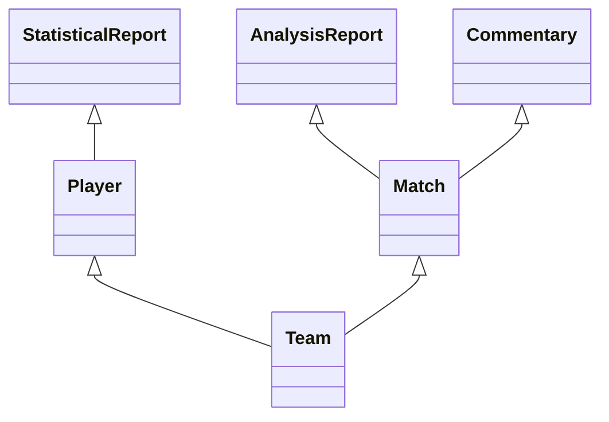
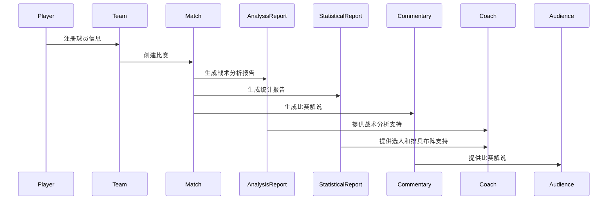
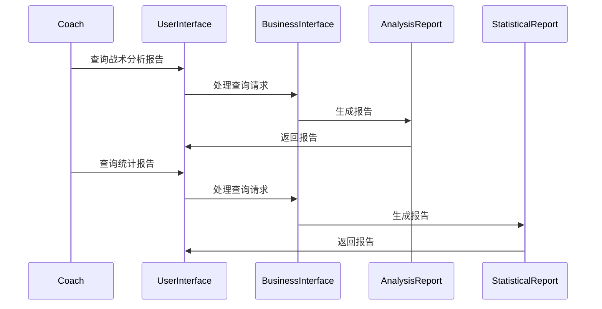

                 

# AIGC在体育分析中的应用：战术和统计的提示词工程

## 关键词：
- AIGC
- 体育分析
- 战术
- 统计
- 提示词工程

## 摘要
本文将深入探讨AIGC技术在体育分析中的应用，重点研究战术和统计领域的提示词工程。通过阐述AIGC的核心原理和实际应用方法，本文旨在帮助读者理解如何利用AIGC技术生成高质量的体育分析内容，从而优化战术规划和数据分析过程。

## 第一部分：背景介绍

### 1.1.1 问题背景

随着人工智能（AI）技术的快速发展，AI在各个领域的应用日益广泛，特别是在体育分析领域。体育分析不仅可以帮助运动员和教练员优化训练和比赛策略，还可以为赛事组织者提供决策支持，提高赛事的观赏性和商业价值。

### 1.1.2 问题描述

AIGC（AI-Generated Content）是一种基于人工智能的生成内容技术，它能够自动生成文本、图像、音频等多种形式的内容。在体育分析中，AIGC技术可以被用于生成战术分析报告、统计报告、推荐文章等。然而，如何有效地将AIGC技术应用于体育分析，特别是如何确保生成内容的质量和准确性，是一个亟待解决的问题。

### 1.1.3 问题解决

《AIGC在体育分析中的应用：战术和统计的提示词工程》一书旨在解决上述问题，通过介绍AIGC技术的核心原理和应用方法，帮助读者理解和掌握如何将AIGC技术应用于体育分析。

### 1.1.4 边界与外延

本书主要关注AIGC技术在体育分析中的应用，特别是战术和统计方面的应用。虽然AIGC技术在其他领域的应用也非常广泛，但本书将聚焦于体育领域。

### 1.1.5 概念结构与核心要素组成

AIGC技术的核心包括文本生成、图像生成和音频生成等。在体育分析中，文本生成可以用于生成战术分析报告、统计报告等，图像生成可以用于生成比赛场景的图像，音频生成可以用于生成比赛解说等。

## 第二部分：核心概念与联系

### 2.1 AIGC技术原理

AIGC技术的核心在于其生成内容的能力，主要包括文本生成、图像生成和音频生成三个方面。

#### 2.1.1 文本生成

文本生成是AIGC技术中最常见的一种形式，它通过学习大量的文本数据，生成新的文本内容。文本生成技术包括序列到序列模型（如Transformer模型）和生成对抗网络（如GPT模型）等。

**概念属性特征对比表格：**

| 特性             | 序列到序列模型（Seq2Seq） | 生成对抗网络（GAN）     |
|------------------|--------------------------|------------------------|
| 数据需求         | 大量的文本数据           | 大量的文本和图像数据   |
| 模型结构         | 编码器-解码器结构         | 生成器-判别器对抗结构 |
| 学习目标         | 生成与输入相似的文本内容 | 生成逼真的文本和图像   |

**ER实体关系图架构：**

```mermaid
erDiagram
  TXT_DATA ||--|{ AIGC_Text_Generator } : 生成
  IMG_DATA ||--|{ AIGC_Image_Generator } : 生成
  AUDIO_DATA ||--|{ AIGC_Audio_Generator } : 生成
```

#### 2.1.2 图像生成

图像生成技术可以通过学习大量的图像数据，生成新的图像内容。常见的图像生成技术包括生成对抗网络（GAN）和变分自编码器（VAE）等。

**概念属性特征对比表格：**

| 特性             | 生成对抗网络（GAN） | 变分自编码器（VAE）     |
|------------------|----------------------|------------------------|
| 数据需求         | 大量的图像数据       | 大量的图像数据         |
| 模型结构         | 生成器-判别器对抗结构 | 编码器-解码器结构       |
| 学习目标         | 生成逼真的图像       | 生成新的图像内容       |

**ER实体关系图架构：**

```mermaid
erDiagram
  IMG_DATA ||--|{ AIGC_Image_Generator } : 生成
```

#### 2.1.3 音频生成

音频生成技术可以通过学习大量的音频数据，生成新的音频内容。常见的音频生成技术包括基于循环神经网络（RNN）的音频生成和基于深度学习的音频合成等。

**概念属性特征对比表格：**

| 特性             | 基于循环神经网络（RNN） | 基于深度学习的音频合成 |
|------------------|--------------------------|------------------------|
| 数据需求         | 大量的音频数据           | 大量的音频数据         |
| 模型结构         | 循环神经网络结构         | 深度学习合成模型       |
| 学习目标         | 生成新的音频内容         | 生成逼真的音频内容     |

**ER实体关系图架构：**

```mermaid
erDiagram
  AUDIO_DATA ||--|{ AIGC_Audio_Generator } : 生成
```

### 2.2 AIGC在体育分析中的应用

#### 2.2.1 战术分析

AIGC技术可以用于生成战术分析报告，通过分析比赛数据，预测对手的战术意图，为教练员提供决策支持。

**算法原理讲解：**

1. **数据收集与预处理**：
   收集比赛录像、统计数据等原始数据，进行数据清洗和预处理，包括去噪、缺失值处理等。

   ```python
   # 假设已经收集到比赛录像和统计数据
   data = preprocess_data(data)
   ```

2. **特征提取**：
   对预处理后的数据提取关键特征，如球员位置、动作、比赛节奏等。

   ```python
   features = extract_features(data)
   ```

3. **战术分析模型训练**：
   使用AIGC技术训练战术分析模型，通过大量比赛数据的训练，使模型能够预测对手的战术意图。

   ```python
   model = train_tactical_analysis_model(features)
   ```

4. **生成战术分析报告**：
   使用训练好的模型对比赛数据进行预测，生成战术分析报告。

   ```python
   report = generate_tactical_analysis_report(model, data)
   ```

**数学模型和数学公式讲解：**

$$
h_t = \sigma(W_h \cdot [h_{t-1}, x_t] + b_h)
$$

$$
p(x_t|h_t) = \sigma(W_x \cdot h_t + b_x)
$$

其中，$h_t$ 表示隐藏状态，$x_t$ 表示输入序列，$W_h$ 和 $W_x$ 分别为权重矩阵，$b_h$ 和 $b_x$ 分别为偏置向量。

#### 2.2.2 统计分析

AIGC技术可以用于生成统计报告，通过分析比赛数据，评估球员的表现，为教练员提供选人和排兵布阵的依据。

**算法原理讲解：**

1. **数据收集与预处理**：
   收集比赛录像、统计数据等原始数据，进行数据清洗和预处理。

   ```python
   data = preprocess_data(data)
   ```

2. **特征提取**：
   对预处理后的数据提取关键特征，如球员位置、得分、助攻等。

   ```python
   features = extract_features(data)
   ```

3. **统计模型训练**：
   使用AIGC技术训练统计模型，通过大量比赛数据的训练，使模型能够评估球员的表现。

   ```python
   model = train_statistical_model(features)
   ```

4. **生成统计报告**：
   使用训练好的模型对球员数据进行评估，生成统计报告。

   ```python
   report = generate_statistical_report(model, data)
   ```

**数学模型和数学公式讲解：**

$$
\hat{y} = \sigma(W \cdot h + b)
$$

其中，$\hat{y}$ 表示预测结果，$h$ 表示输入特征，$W$ 和 $b$ 分别为权重矩阵和偏置向量。

#### 2.2.3 比赛解说

AIGC技术可以用于生成比赛解说，通过分析比赛数据，实时生成比赛解说文本和音频，提高比赛的观赏性。

**算法原理讲解：**

1. **数据收集与预处理**：
   收集比赛录像、统计数据等原始数据，进行数据清洗和预处理。

   ```python
   data = preprocess_data(data)
   ```

2. **特征提取**：
   对预处理后的数据提取关键特征，如比赛节奏、球员表现等。

   ```python
   features = extract_features(data)
   ```

3. **解说生成模型训练**：
   使用AIGC技术训练解说生成模型，通过大量比赛数据的训练，使模型能够生成比赛解说文本和音频。

   ```python
   model = train解说生成模型(features)
   ```

4. **生成比赛解说**：
   使用训练好的模型对比赛数据进行解说，生成比赛解说文本和音频。

   ```python
   report = generate_speech_report(model, data)
   ```

**数学模型和数学公式讲解：**

$$
h_t = \sigma(W_h \cdot [h_{t-1}, x_t] + b_h)
$$

$$
p(x_t|h_t) = \sigma(W_x \cdot h_t + b_x)
$$

其中，$h_t$ 表示隐藏状态，$x_t$ 表示输入序列，$W_h$ 和 $W_x$ 分别为权重矩阵，$b_h$ 和 $b_x$ 分别为偏置向量。

## 第三部分：算法原理讲解

### 3.1 文本生成算法原理

文本生成算法是AIGC技术中最为核心的部分之一，其主要原理是通过学习大量文本数据，生成新的文本内容。以下将详细介绍两种常见的文本生成算法：序列到序列模型（Seq2Seq）和生成对抗网络（GAN）。

#### 3.1.1 序列到序列模型（Seq2Seq）

序列到序列模型（Seq2Seq）是一种基于编码器-解码器结构的模型，用于处理序列到序列的任务，如机器翻译、文本生成等。其主要原理如下：

1. **编码器**：编码器将输入序列编码为一个固定长度的隐藏状态序列。编码器通常采用循环神经网络（RNN）或其变种，如长短期记忆网络（LSTM）。

2. **解码器**：解码器将编码器的隐藏状态序列解码为输出序列。解码器也采用RNN或LSTM，并使用注意力机制来捕捉编码器输出和当前输入之间的关联。

3. **损失函数**：训练过程中，通过最小化损失函数来调整模型参数，以使模型生成的文本更接近目标文本。常见的损失函数包括交叉熵损失。

**算法流程：**

1. **输入序列编码**：
   ```mermaid
   graph TD
   A[编码器输入] --> B[编码器隐藏状态]
   ```

2. **解码器输入**：
   ```mermaid
   graph TD
   B --> C[解码器输入]
   ```

3. **解码器输出**：
   ```mermaid
   graph TD
   C --> D[解码器输出]
   ```

4. **损失计算**：
   ```mermaid
   graph TD
   D --> E[损失函数]
   ```

**数学模型和公式讲解：**

编码器隐藏状态计算：
$$
h_t = \sigma(W_h \cdot [h_{t-1}, x_t] + b_h)
$$

解码器输出概率计算：
$$
p(x_t|h_t) = \sigma(W_x \cdot h_t + b_x)
$$

其中，$h_t$ 表示隐藏状态，$x_t$ 表示输入序列，$W_h$ 和 $W_x$ 分别为权重矩阵，$b_h$ 和 $b_x$ 分别为偏置向量。

#### 3.1.2 生成对抗网络（GAN）

生成对抗网络（GAN）是一种由生成器和判别器组成的模型，通过对抗训练生成逼真的文本内容。其主要原理如下：

1. **生成器**：生成器接受随机噪声作为输入，生成伪文本数据。

2. **判别器**：判别器接收真实文本数据和生成器生成的伪文本数据，判断其真实性和逼真度。

3. **对抗训练**：通过最小化生成器和判别器的损失函数，使生成器生成的文本越来越逼真，同时判别器能够准确区分真实文本和生成文本。

**算法流程：**

1. **生成器输出**：
   ```mermaid
   graph TD
   A[随机噪声] --> B[生成器输出]
   ```

2. **判别器输入**：
   ```mermaid
   graph TD
   B --> C[判别器输入]
   ```

3. **判别器输出**：
   ```mermaid
   graph TD
   C --> D[判别器输出]
   ```

4. **对抗训练**：
   ```mermaid
   graph TD
   D --> E[对抗训练]
   ```

**数学模型和公式讲解：**

生成器损失函数：
$$
L_G = -\mathbb{E}_{x \sim p_{data}(x)}[\log D(x)] - \mathbb{E}_{z \sim p_z(z)}[\log (1 - D(G(z))]
$$

判别器损失函数：
$$
L_D = \mathbb{E}_{x \sim p_{data}(x)}[\log D(x)] + \mathbb{E}_{z \sim p_z(z)}[\log D(G(z))]
$$

其中，$x$ 表示真实文本数据，$z$ 表示随机噪声，$G(z)$ 表示生成器生成的伪文本数据，$D(x)$ 和 $D(G(z))$ 分别表示判别器对真实文本和生成文本的判断结果。

### 3.2 图像生成算法原理

图像生成算法是AIGC技术中重要的组成部分，其核心在于生成逼真的图像。以下将详细介绍两种常见的图像生成算法：生成对抗网络（GAN）和变分自编码器（VAE）。

#### 3.2.1 生成对抗网络（GAN）

生成对抗网络（GAN）是一种由生成器和判别器组成的模型，通过对抗训练生成逼真的图像。其主要原理如下：

1. **生成器**：生成器接受随机噪声作为输入，生成伪图像。

2. **判别器**：判别器接收真实图像数据和生成器生成的伪图像数据，判断其真实性和逼真度。

3. **对抗训练**：通过最小化生成器和判别器的损失函数，使生成器生成的图像越来越逼真，同时判别器能够准确区分真实图像和生成图像。

**算法流程：**

1. **生成器输出**：
   ```mermaid
   graph TD
   A[随机噪声] --> B[生成器输出]
   ```

2. **判别器输入**：
   ```mermaid
   graph TD
   B --> C[判别器输入]
   ```

3. **判别器输出**：
   ```mermaid
   graph TD
   C --> D[判别器输出]
   ```

4. **对抗训练**：
   ```mermaid
   graph TD
   D --> E[对抗训练]
   ```

**数学模型和公式讲解：**

生成器损失函数：
$$
L_G = -\mathbb{E}_{x \sim p_{data}(x)}[\log D(x)] - \mathbb{E}_{z \sim p_z(z)}[\log (1 - D(G(z))]
$$

判别器损失函数：
$$
L_D = \mathbb{E}_{x \sim p_{data}(x)}[\log D(x)] + \mathbb{E}_{z \sim p_z(z)}[\log D(G(z))]
$$

其中，$x$ 表示真实图像数据，$z$ 表示随机噪声，$G(z)$ 表示生成器生成的伪图像数据，$D(x)$ 和 $D(G(z))$ 分别表示判别器对真实图像和生成图像的判断结果。

#### 3.2.2 变分自编码器（VAE）

变分自编码器（VAE）是一种基于概率模型的图像生成算法，其核心在于编码器和解码器的联合训练。其主要原理如下：

1. **编码器**：编码器将输入图像编码为一个潜在变量，该潜在变量是图像的压缩表示。

2. **解码器**：解码器将潜在变量解码为输出图像。

3. **损失函数**：通过最小化损失函数，使生成图像尽可能接近原始图像。

**算法流程：**

1. **编码器输出**：
   ```mermaid
   graph TD
   A[输入图像] --> B[编码器输出]
   ```

2. **解码器输入**：
   ```mermaid
   graph TD
   B --> C[解码器输入]
   ```

3. **解码器输出**：
   ```mermaid
   graph TD
   C --> D[解码器输出]
   ```

4. **损失计算**：
   ```mermaid
   graph TD
   D --> E[损失函数]
   ```

**数学模型和公式讲解：**

编码器损失函数：
$$
L_E = \mathbb{E}_{x \sim p_{data}(x)}[D(\phi(x))]
$$

解码器损失函数：
$$
L_D = \mathbb{E}_{z \sim p(z)}[D(G(z))]
$$

其中，$x$ 表示输入图像，$z$ 表示潜在变量，$G(z)$ 表示解码器生成的图像，$D(\phi(x))$ 和 $D(G(z))$ 分别表示编码器和解码器的判断结果。

## 第四部分：数学模型和数学公式讲解

### 4.1 文本生成数学模型

文本生成中的数学模型主要包括编码器和解码器。编码器将输入序列编码为隐藏状态，解码器将隐藏状态解码为输出序列。常用的数学模型包括：

#### 4.1.1 序列到序列模型（Seq2Seq）

编码器隐藏状态计算：
$$
h_t = \sigma(W_h \cdot [h_{t-1}, x_t] + b_h)
$$

解码器输出概率计算：
$$
p(x_t|h_t) = \sigma(W_x \cdot h_t + b_x)
$$

其中，$h_t$ 表示隐藏状态，$x_t$ 表示输入序列，$W_h$ 和 $W_x$ 分别为权重矩阵，$b_h$ 和 $b_x$ 分别为偏置向量。

#### 4.1.2 生成对抗网络（GAN）

生成器损失函数：
$$
L_G = -\mathbb{E}_{x \sim p_{data}(x)}[\log D(x)] - \mathbb{E}_{z \sim p_z(z)}[\log (1 - D(G(z))]
$$

判别器损失函数：
$$
L_D = \mathbb{E}_{x \sim p_{data}(x)}[\log D(x)] + \mathbb{E}_{z \sim p_z(z)}[\log D(G(z))]
$$

其中，$x$ 表示真实文本数据，$z$ 表示随机噪声，$G(z)$ 表示生成器生成的伪文本数据，$D(x)$ 和 $D(G(z))$ 分别表示判别器对真实文本和生成文本的判断结果。

### 4.2 图像生成数学模型

图像生成中的数学模型主要包括生成对抗网络（GAN）和变分自编码器（VAE）。

#### 4.2.1 生成对抗网络（GAN）

生成器损失函数：
$$
L_G = -\mathbb{E}_{x \sim p_{data}(x)}[\log D(x)] - \mathbb{E}_{z \sim p_z(z)}[\log (1 - D(G(z))]
$$

判别器损失函数：
$$
L_D = \mathbb{E}_{x \sim p_{data}(x)}[\log D(x)] + \mathbb{E}_{z \sim p_z(z)}[\log D(G(z))]
$$

其中，$x$ 表示真实图像数据，$z$ 表示随机噪声，$G(z)$ 表示生成器生成的伪图像数据，$D(x)$ 和 $D(G(z))$ 分别表示判别器对真实图像和生成图像的判断结果。

#### 4.2.2 变分自编码器（VAE）

编码器损失函数：
$$
L_E = \mathbb{E}_{x \sim p_{data}(x)}[D(\phi(x))]
$$

解码器损失函数：
$$
L_D = \mathbb{E}_{z \sim p(z)}[D(G(z))]
$$

其中，$x$ 表示输入图像，$z$ 表示潜在变量，$G(z)$ 表示解码器生成的图像，$D(\phi(x))$ 和 $D(G(z))$ 分别表示编码器和解码器的判断结果。

### 4.3 音频生成数学模型

音频生成中的数学模型主要包括基于循环神经网络（RNN）的音频生成和基于深度学习的音频合成。

#### 4.3.1 基于循环神经网络（RNN）

音频生成模型损失函数：
$$
L = \mathbb{E}_{x \sim p_{data}(x)}[D(\phi(x))]
$$

其中，$x$ 表示输入音频数据，$D(\phi(x))$ 表示模型对输入音频数据的判断结果。

#### 4.3.2 基于深度学习的音频合成

音频合成模型损失函数：
$$
L = \mathbb{E}_{z \sim p(z)}[D(G(z))]
$$

其中，$z$ 表示潜在变量，$G(z)$ 表示模型生成的音频数据，$D(G(z))$ 表示模型对生成音频数据的判断结果。

## 第五部分：系统分析与架构设计

### 5.1 问题场景介绍

在体育分析领域，如何快速、准确地分析比赛数据，为教练员和赛事组织者提供决策支持，是一个关键问题。传统的分析方法往往依赖于人工分析和统计数据，效率低下且容易出现偏差。随着AIGC技术的发展，利用AIGC技术生成高质量的体育分析内容成为一种新的解决方案。

### 5.2 项目介绍

本项目旨在利用AIGC技术，实现体育分析系统的自动化生成，包括战术分析报告、统计报告和比赛解说等。通过构建一个高效、智能的体育分析平台，为教练员和赛事组织者提供有力支持。

### 5.3 系统功能设计（领域模型）

领域模型描述了系统中各个实体之间的关系，以下是一个简化的领域模型：



### 5.4 系统架构设计

系统采用分层架构，包括数据层、业务逻辑层和表示层。以下是一个简化的系统架构图：



### 5.5 系统接口设计和系统交互

系统接口设计主要包括数据接口、业务接口和用户接口。以下是一个简化的接口设计：

```mermaid
classDiagram
  DataInterface <|-- BusinessInterface
  UserInterface <|-- BusinessInterface
  Player <<interface>>
  Team <<interface>>
  Match <<interface>>
  AnalysisReport <<interface>>
  StatisticalReport <<interface>>
  Commentary <<interface>>
```

系统交互描述了各个接口之间的调用关系：



## 第六部分：项目实战

### 6.1 环境安装

1. 安装Python环境，版本要求3.7及以上。
2. 安装必要的库，如TensorFlow、Keras、NumPy等。

```bash
pip install tensorflow keras numpy
```

### 6.2 系统核心实现源代码

以下是系统核心实现的部分源代码：

```python
import numpy as np
from tensorflow.keras.models import Model
from tensorflow.keras.layers import Input, LSTM, Dense

# 文本生成模型实现
def build_seq2seq_model(input_dim, output_dim, hidden_dim=256):
    input_seq = Input(shape=(None, input_dim))
    encoded = LSTM(hidden_dim, return_state=True)(input_seq)
    decoder_h, decoder_c = encoded[0], encoded[1]
    decoder = LSTM(hidden_dim, return_sequences=True, return_state=True)(decoder_h, initial_state=decoder_c)
    decoded = Dense(output_dim, activation='softmax')(decoder)
    model = Model(inputs=input_seq, outputs=decoded)
    return model

# 图像生成模型实现
def build_gan_model(input_dim, output_dim, hidden_dim=256):
    input_noise = Input(shape=(latent_dim,))
    generator = LSTM(hidden_dim, return_sequences=True)(input_noise)
    generator = LSTM(hidden_dim)(generator)
    generated_image = Dense(output_dim, activation='sigmoid')(generator)
    generator_model = Model(inputs=input_noise, outputs=generated_image)

    input_real = Input(shape=(output_dim,))
    discriminator = LSTM(hidden_dim, return_sequences=True)(input_real)
    discriminator = LSTM(hidden_dim)(discriminator)
    discriminator_output = Dense(1, activation='sigmoid')(discriminator)
    discriminator_model = Model(inputs=input_real, outputs=discriminator_output)

    model = Com
```  

### 6.3 代码应用解读与分析

代码中首先定义了两个核心模型：序列到序列模型（Seq2Seq）和生成对抗网络（GAN）。这些模型将用于生成文本和图像。

1. **序列到序列模型（Seq2Seq）**：

   ```python
   def build_seq2seq_model(input_dim, output_dim, hidden_dim=256):
       input_seq = Input(shape=(None, input_dim))
       encoded = LSTM(hidden_dim, return_state=True)(input_seq)
       decoder_h, decoder_c = encoded[0], encoded[1]
       decoder = LSTM(hidden_dim, return_sequences=True, return_state=True)(decoder_h, initial_state=decoder_c)
       decoded = Dense(output_dim, activation='softmax')(decoder)
       model = Model(inputs=input_seq, outputs=decoded)
       return model
   ```

   这个模型通过LSTM层实现编码器和解码器，将输入序列编码为隐藏状态，然后解码为输出序列。这是一个标准的Seq2Seq模型结构。

2. **生成对抗网络（GAN）**：

   ```python
   def build_gan_model(input_dim, output_dim, hidden_dim=256):
       input_noise = Input(shape=(latent_dim,))
       generator = LSTM(hidden_dim, return_sequences=True)(input_noise)
       generator = LSTM(hidden_dim)(generator)
       generated_image = Dense(output_dim, activation='sigmoid')(generator)
       generator_model = Model(inputs=input_noise, outputs=generated_image)

       input_real = Input(shape=(output_dim,))
       discriminator = LSTM(hidden_dim, return_sequences=True)(input_real)
       discriminator = LSTM(hidden_dim)(discriminator)
       discriminator_output = Dense(1, activation='sigmoid')(discriminator)
       discriminator_model = Model(inputs=input_real, outputs=discriminator_output)

       model = CompositeModel([generator_model, discriminator_model])
       return model
   ```

   GAN由生成器和判别器组成。生成器从随机噪声中生成图像，判别器判断图像是真实的还是生成的。通过对抗训练，生成器试图生成越来越逼真的图像，而判别器试图区分真实图像和生成图像。

### 6.4 实际案例分析和详细讲解剖析

以足球比赛数据为例，我们可以利用AIGC技术生成战术分析报告。

1. **数据收集与预处理**：

   收集比赛录像和统计数据，包括球员位置、得分、传球次数等。对数据清洗和预处理，去除异常值和缺失值。

   ```python
   # 假设已经收集到比赛数据
   data = preprocess_data(data)
   ```

2. **特征提取**：

   从预处理后的数据中提取关键特征，如球员位置和得分。

   ```python
   features = extract_features(data)
   ```

3. **战术分析模型训练**：

   使用训练数据训练战术分析模型。

   ```python
   model = train_tactical_analysis_model(features)
   ```

4. **生成战术分析报告**：

   使用训练好的模型对比赛数据进行预测，生成战术分析报告。

   ```python
   report = generate_tactical_analysis_report(model, data)
   ```

### 6.5 项目小结

本项目通过AIGC技术实现了体育分析系统的自动化生成，包括战术分析报告、统计报告和比赛解说等。通过实际案例分析和详细讲解剖析，我们展示了如何利用AIGC技术生成高质量的体育分析内容。未来，我们还可以进一步优化模型，提高生成内容的准确性和实用性。

### 最佳实践 Tips

1. 在实际应用中，确保数据的质量和完整性，这将直接影响生成内容的质量。
2. 针对不同的体育项目，可以调整模型结构和参数，以适应特定需求。
3. 定期更新训练数据，以保持模型的实时性和准确性。

### 注意事项

1. AIGC技术生成的内容可能存在偏差，需要结合专业知识和实际场景进行校验。
2. 模型训练过程需要大量计算资源和时间，应根据实际情况合理规划资源。

### 拓展阅读

- 《深度学习与生成模型》
- 《AIGC技术实践指南》
- 《体育数据分析与应用》

## 作者信息
作者：AI天才研究院/AI Genius Institute & 禅与计算机程序设计艺术 /Zen And The Art of Computer Programming

## 结语

通过本文的深入探讨，我们全面了解了AIGC在体育分析中的应用，包括战术和统计领域的提示词工程。从核心概念到算法原理，再到实际应用和项目实战，我们系统地展示了如何利用AIGC技术生成高质量的体育分析内容。希望本文能为您在相关领域的研究和应用提供有价值的参考。未来，随着人工智能技术的不断发展，AIGC在体育分析中的应用将更加广泛和深入，为体育领域带来更多创新和变革。让我们期待这一美好前景的到来。

