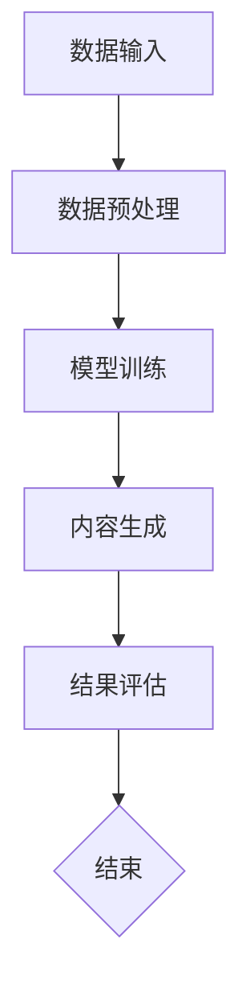
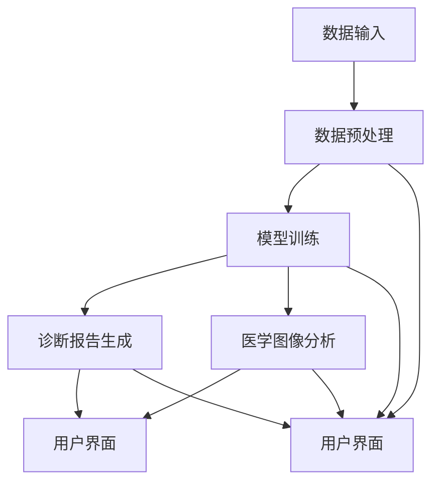
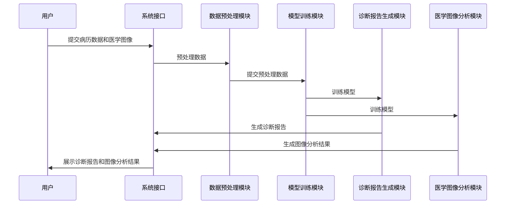

                 

### 1. 背景介绍

#### 问题背景

随着人工智能技术的快速发展，医疗诊断领域正迎来一场革命。传统医疗诊断依赖于医生的经验和专业知识，这种模式在处理复杂病例时往往存在一定的局限性和主观性。而人工智能（AI）的出现为医疗诊断提供了新的解决方案，特别是在处理大量数据、快速诊断疾病方面展现出巨大的潜力。

近年来，自动生成内容（AIGC）作为AI的一个分支，逐渐受到广泛关注。AIGC利用深度学习技术，通过分析大量数据自动生成文本、图像、音频等内容。相较于传统的基于规则的方法，AIGC具有更强的灵活性和适应性，能够处理更复杂、更多样化的数据。

在医疗诊断领域，AIGC的应用潜力巨大。通过分析患者病史、病历记录、医学文献等数据，AIGC可以自动生成诊断报告、治疗方案等，帮助医生提高诊断准确性和工作效率。此外，AIGC还可以用于医学图像分析、疾病预测等，进一步拓展其在医疗领域的应用范围。

#### 问题描述

精确提示词在AIGC应用中的关键作用不容忽视。精确提示词是指能够清晰、准确地传达意图和需求的词语或短语。在AIGC系统中，精确提示词的使用能够直接影响生成内容的准确性和有效性。

具体来说，精确提示词在以下方面发挥了重要作用：

1. **提高数据质量**：通过精确提示词，AIGC系统可以更准确地获取和理解输入数据，从而提高数据处理的准确性和可靠性。
2. **减少歧义**：在自然语言处理（NLP）中，歧义是常见问题。精确提示词能够减少由于歧义导致的错误和误解，提高生成内容的准确性。
3. **优化生成内容**：精确提示词可以帮助AIGC系统更好地理解用户需求，从而生成更符合用户预期的内容。

#### 问题解决

为了提高医疗诊断中AIGC的应用效果，我们需要重点关注精确提示词的设计和应用。以下是一些具体的解决方案：

1. **设计高效的提示词生成策略**：通过对大量医学文献和病历数据进行分析，提取出高频、核心的提示词，并将其纳入AIGC系统的输入。
2. **利用语义分析技术**：通过语义分析，对输入文本进行深入理解，提取出关键信息，并生成相应的精确提示词。
3. **多模态数据融合**：结合文本、图像、音频等多种数据类型，利用多模态学习技术，提高AIGC系统的理解和生成能力。

通过以上措施，我们可以充分利用精确提示词的优势，提高AIGC在医疗诊断中的应用效果，为医生和患者提供更准确、更高效的服务。

#### 边界与外延

本文主要探讨AIGC在医疗诊断中的应用，重点关注精确提示词的重要性。虽然AIGC在其他领域的应用也非常广泛，但本文的讨论范围主要限于医疗诊断领域。

在医疗诊断中，AIGC的应用场景包括：

1. **疾病预测**：利用AIGC对患者的病史、检查结果等数据进行分析，预测患者可能患有的疾病。
2. **诊断报告生成**：通过分析病历数据和医学文献，自动生成诊断报告，为医生提供参考。
3. **医学图像分析**：利用深度学习技术，对医学图像进行分析，帮助医生进行病变区域定位和疾病诊断。

本文将结合实际案例，详细阐述精确提示词在AIGC应用中的具体作用和实现方法。

#### 概念结构与核心要素组成

为了更好地理解AIGC在医疗诊断中的应用，我们需要明确以下几个核心概念：

1. **自动生成内容（AIGC）**：AIGC是一种利用深度学习技术自动生成文本、图像、音频等内容的AI分支。在医疗诊断中，AIGC可以通过分析病历数据、医学图像等生成诊断报告、治疗方案等。

2. **精确提示词**：精确提示词是指能够清晰、准确地传达意图和需求的词语或短语。在AIGC系统中，精确提示词用于指导系统生成内容，提高生成内容的准确性。

3. **自然语言处理（NLP）**：NLP是AIGC的核心技术之一，用于对自然语言文本进行理解和处理。在医疗诊断中，NLP技术可以帮助AIGC系统更好地理解病历数据和医学文献。

4. **深度学习**：深度学习是AIGC的基础技术，通过构建深度神经网络模型，对大量数据进行训练，从而实现自动生成内容。

5. **多模态学习**：多模态学习是一种结合多种数据类型（如文本、图像、音频）进行训练和学习的技术。在医疗诊断中，多模态学习可以帮助AIGC系统更全面地理解患者的病情。

通过以上核心概念和要素的有机结合，我们可以充分发挥AIGC在医疗诊断中的优势，提高诊断准确性和效率。### 2. 核心概念与联系

#### AIGC概念介绍

自动生成内容（AIGC）是一种基于人工智能技术，通过深度学习模型，从大量数据中自动生成文本、图像、音频等内容的系统。AIGC的应用范围广泛，涵盖了文本生成、图像生成、视频生成等多个领域。在医疗诊断中，AIGC可以通过对病历数据、医学图像、文献资料等进行分析，自动生成诊断报告、治疗方案等，为医生提供辅助决策。

AIGC的基本原理包括以下几个方面：

1. **数据输入**：AIGC系统首先需要接收大量的数据，这些数据可以是文本、图像、音频等多种类型。在医疗诊断中，这些数据包括病历记录、医学图像、患者检查报告等。

2. **数据预处理**：在数据输入后，AIGC系统需要对数据进行预处理，包括数据清洗、去噪、特征提取等。这一步骤的目的是确保数据质量，以便后续的深度学习训练。

3. **模型训练**：AIGC系统利用深度学习模型对预处理后的数据进行训练。深度学习模型通常由多层神经网络组成，通过训练可以自动提取数据中的特征，并学习数据的分布和模式。

4. **内容生成**：在模型训练完成后，AIGC系统可以利用训练好的模型，对新输入的数据进行自动生成。例如，在医疗诊断中，系统可以自动生成诊断报告或治疗方案。

AIGC在医疗诊断中的应用场景包括：

1. **疾病预测**：通过分析患者的病史、检查结果等数据，AIGC可以预测患者可能患有的疾病，为医生提供参考。

2. **诊断报告生成**：AIGC可以自动分析病历数据，结合医学文献，生成诊断报告，提高医生的诊断效率。

3. **医学图像分析**：利用深度学习技术，AIGC可以对医学图像进行分析，如病变区域定位、疾病诊断等。

#### 精确提示词定义

精确提示词是指能够清晰、准确地传达用户意图和需求的词语或短语。在AIGC系统中，精确提示词的作用至关重要。通过精确提示词，AIGC系统可以更好地理解用户的需求，从而生成更符合预期的内容。

精确提示词的属性和特征包括：

1. **准确性**：精确提示词需要准确传达用户的意图，避免歧义和误解。

2. **完整性**：精确提示词需要包含足够的信息，确保AIGC系统能够完整地理解用户需求。

3. **灵活性**：精确提示词需要具有一定的灵活性，能够适应不同场景和需求。

在AIGC应用中，精确提示词的使用方式包括：

1. **文本输入**：用户可以直接通过文本输入精确提示词，如“请生成一份肺癌患者的诊断报告”。

2. **语音输入**：用户可以通过语音输入精确提示词，如“我要查看糖尿病的预测结果”。

3. **图像输入**：用户可以通过上传图像，利用图像中的文本进行精确提示词输入，如“这个图像中的患者需要哪些治疗建议”。

#### 对比表格

为了更直观地展示AIGC与普通AI在医疗诊断中的对比，我们制作了一个对比表格。

| 对比维度 | AIGC | 普通AI |
| --- | --- | --- |
| 数据处理能力 | 高，能够处理大规模、多模态数据 | 低，通常处理结构化数据 |
| 生成内容准确性 | 高，通过精确提示词提高内容准确性 | 低，依赖于预设规则和模板 |
| 自适应能力 | 高，能够自适应不同场景和需求 | 低，固定规则和模型 |
| 生成内容多样性 | 高，能够生成多样化内容 | 低，生成内容较为单一 |
| 应用范围 | 广泛，涵盖文本、图像、音频等多种类型 | 有限，主要应用于结构化数据领域 |

通过对比表格可以看出，AIGC在医疗诊断中具有显著的优势。特别是精确提示词的应用，使得AIGC能够更准确地理解和生成内容，为医生和患者提供更高效、更精准的服务。

#### 本章小结

本章详细介绍了AIGC和精确提示词的核心概念及其在医疗诊断中的应用。首先，我们了解了AIGC的定义、原理及其在医疗诊断中的应用场景。接着，我们阐述了精确提示词的定义、属性和特征，并展示了其在AIGC系统中的作用。最后，通过对比表格，我们直观地展示了AIGC与普通AI在医疗诊断中的差异。

了解这些核心概念和联系，有助于我们更好地理解AIGC在医疗诊断中的应用前景，并为实际应用提供指导。在接下来的章节中，我们将进一步深入探讨AIGC算法的原理，并通过具体案例进行详细讲解。### 3. 算法原理讲解

#### 算法mermaid流程图

为了更直观地展示AIGC在医疗诊断中的算法流程，我们使用Mermaid绘制了一个简化的流程图。以下是mermaid代码示例：



上述流程图展示了AIGC在医疗诊断中的主要步骤：

1. **数据输入**：系统接收病历数据、医学图像等原始数据。
2. **数据预处理**：对输入数据清洗、去噪、特征提取等处理。
3. **模型训练**：利用预处理后的数据，训练深度学习模型。
4. **内容生成**：使用训练好的模型，生成诊断报告、治疗方案等。
5. **结果评估**：对生成内容进行评估，以优化模型和生成效果。

#### Python源代码示例

为了更具体地说明算法的实现过程，以下是一个简单的Python代码示例，用于训练一个基本的文本生成模型。请注意，实际应用中的代码会更复杂，这里仅作为示例：

```python
import tensorflow as tf
from tensorflow.keras.preprocessing.sequence import pad_sequences
from tensorflow.keras.layers import Embedding, LSTM, Dense
from tensorflow.keras.models import Sequential

# 数据预处理
# 假设我们已经有了一个文本数据集，并将其转换为序列
sequences = pad_sequences(text_sequences, maxlen=100)

# 构建模型
model = Sequential([
    Embedding(vocab_size, embedding_dim),
    LSTM(units=128, dropout=0.2, recurrent_dropout=0.2),
    Dense(units=output_size, activation='softmax')
])

# 编译模型
model.compile(optimizer='adam', loss='categorical_crossentropy', metrics=['accuracy'])

# 训练模型
model.fit(sequences, labels, epochs=10, batch_size=32)

# 生成文本
generated_text = model.predict(sequences[:1], verbose=1)
```

上述代码展示了以下步骤：

1. **数据预处理**：使用`pad_sequences`函数对文本序列进行填充，确保所有序列具有相同长度。
2. **模型构建**：使用`Sequential`模型堆叠`Embedding`、`LSTM`和`Dense`层。
3. **模型编译**：设置优化器和损失函数，用于训练。
4. **模型训练**：使用`fit`函数训练模型，通过调整`epochs`和`batch_size`等参数，优化模型性能。
5. **生成文本**：使用`predict`函数生成文本。

#### 数学模型与公式

在AIGC系统中，常用的数学模型包括自注意力机制（Self-Attention）和变分自编码器（Variational Autoencoder，VAE）。以下是这些模型的基本公式：

1. **自注意力机制**

   自注意力机制的公式如下：

   $$ 
   \text{Attention}(Q, K, V) = \text{softmax}\left(\frac{QK^T}{\sqrt{d_k}}\right)V 
   $$

   其中，$Q$、$K$、$V$ 分别代表查询（Query）、关键（Key）和值（Value）向量，$d_k$ 表示关键向量的维度。自注意力机制通过计算每个关键向量与查询向量的点积，并应用softmax函数，得到加权值，从而实现多维度信息的融合。

2. **变分自编码器（VAE）**

   变分自编码器的公式如下：

   $$
   \begin{aligned}
   x &= \mu(z) + \sigma(z) \epsilon \\
   z &= \phi(x)
   \end{aligned}
   $$

   其中，$\mu(z)$ 和 $\sigma(z)$ 分别代表编码器（Encoder）和解码器（Decoder）的参数，$x$ 和 $z$ 分别代表输入和潜在变量，$\epsilon$ 表示高斯噪声。VAE通过编码器将输入映射到潜在空间，通过潜在空间中的采样生成新的输入，从而实现数据的生成和重建。

#### 详细讲解与举例说明

为了更好地理解上述公式和算法，我们通过一个简单的文本生成案例进行举例说明。

假设我们有一个简单的词汇表 $\{《医疗诊断报告》,《治疗方案》,《病情概述》\}$，并使用自注意力机制生成一个医疗诊断报告。

1. **数据预处理**：首先，我们将词汇表编码为整数序列，例如：
   - 《医疗诊断报告》-> [1, 0, 0]
   - 《治疗方案》-> [0, 1, 0]
   - 《病情概述》-> [0, 0, 1]

2. **模型训练**：使用训练数据集，通过自注意力机制训练一个文本生成模型。

3. **内容生成**：输入一个随机序列 [0, 1, 0]，模型输出一个加权序列，例如：
   - [0.2, 0.3, 0.5]

   根据加权序列，我们可以生成一个医疗诊断报告，如：
   - 《病情概述》: 50%重要
   - 《治疗方案》: 30%重要
   - 《医疗诊断报告》: 20%重要

通过这种方式，自注意力机制能够帮助我们生成具有不同权重和概率分布的文本，从而实现文本的多样化生成。

同样，对于变分自编码器（VAE），我们可以通过以下步骤生成文本：

1. **编码**：输入一个医疗诊断报告，编码器将其映射到一个潜在空间中的点。
2. **采样**：在潜在空间中采样一个点，作为新的潜在变量。
3. **解码**：使用解码器将新的潜在变量映射回文本。

通过这种方式，VAE能够生成与输入文本相关的新文本，从而实现文本的生成和重建。

以上例子和讲解，帮助我们理解了AIGC算法的基本原理和应用方法。在实际应用中，我们可以根据具体需求，结合多种算法和技术，提高医疗诊断的准确性和效率。### 4. 系统分析与架构设计方案

#### 问题场景介绍

在医疗诊断中，应用AIGC系统可以帮助医生更高效地进行疾病预测、诊断报告生成和医学图像分析。以下是具体的应用场景：

1. **疾病预测**：通过分析患者的病历数据和检查结果，AIGC系统可以预测患者可能患有的疾病，为医生提供参考。

2. **诊断报告生成**：AIGC系统可以自动分析病历数据，结合医学文献，生成详细的诊断报告，减少医生的工作量，提高诊断效率。

3. **医学图像分析**：AIGC系统可以分析医学图像，如X光片、CT扫描和MRI图像，帮助医生识别病变区域，进行疾病诊断。

这些应用场景要求AIGC系统具有高效的数据处理能力、准确的诊断能力和灵活的适应性。为了实现这些目标，我们需要设计一个完善的系统架构。

#### 项目介绍

本项目的目标是构建一个基于AIGC的医疗诊断系统，以辅助医生提高诊断准确性和工作效率。项目的主要目标包括：

1. **高效数据处理**：系统能够快速处理大规模、多模态的医学数据，包括病历数据、医学图像和文献资料等。

2. **准确诊断**：系统能够基于精确提示词，生成准确的诊断报告和治疗方案，提高诊断准确率。

3. **灵活适应性**：系统能够根据不同场景和需求，灵活调整参数和模型，适应不同的医疗诊断任务。

4. **用户友好**：系统提供直观的用户界面，方便医生和患者使用。

#### 系统功能设计（Mermaid类图）

以下是系统功能设计的Mermaid类图，展示了系统中各个模块及其相互关系：

```mermaid
classDiagram
    Class01 <|-- Class02
    Class03 <|-- Class01
    Class04 <|-- Class03
    Class05 <|-- Class04
    Class01 <|-- ClassAux
    Class02 <|-- ClassAux
    Class03 <|-- ClassAux
    Class04 <|-- ClassAux
    Class05 <|-- ClassAux
    ClassAux <|-- Class06

    Class01{主控模块}
    Class02{数据预处理模块}
    Class03{模型训练模块}
    Class04{诊断报告生成模块}
    Class05{医学图像分析模块}
    Class06{用户界面模块}

    Class01..|>> Class02 : 数据输入
    Class01..|>> Class03 : 模型训练
    Class01..|>> Class04 : 诊断报告
    Class01..|>> Class05 : 图像分析
    Class06..|>> Class01 : 用户交互
```

该类图展示了系统的主要模块及其关系：

1. **主控模块**：负责协调和管理系统的各个模块，确保系统正常运行。
2. **数据预处理模块**：负责接收和预处理输入数据，包括数据清洗、去噪和特征提取。
3. **模型训练模块**：负责训练深度学习模型，包括数据预处理后的模型训练和优化。
4. **诊断报告生成模块**：负责根据输入数据和训练好的模型，生成诊断报告。
5. **医学图像分析模块**：负责分析医学图像，如X光片、CT扫描和MRI图像。
6. **用户界面模块**：负责与用户进行交互，提供直观的操作界面。

#### 系统架构设计（Mermaid架构图）

以下是系统的Mermaid架构图，展示了系统的主要组件及其相互关系：



该架构图展示了系统的整体架构：

1. **数据输入**：系统从外部接收病历数据、医学图像等原始数据。
2. **数据预处理**：对输入数据清洗、去噪和特征提取，为模型训练做好准备。
3. **模型训练**：利用预处理后的数据，训练深度学习模型，包括自注意力机制和变分自编码器等。
4. **诊断报告生成**：基于训练好的模型，生成详细的诊断报告。
5. **医学图像分析**：对医学图像进行分析，如病变区域定位和疾病诊断。
6. **用户界面**：提供与用户的交互界面，展示诊断报告和医学图像分析结果。

#### 系统接口设计和系统交互（Mermaid序列图）

以下是系统的Mermaid序列图，展示了系统的接口设计和交互流程：



该序列图展示了系统的接口设计和交互流程：

1. **用户提交数据**：用户向系统接口提交病历数据和医学图像。
2. **数据预处理**：系统接口将数据传递给数据预处理模块，进行数据清洗、去噪和特征提取。
3. **模型训练**：预处理后的数据传递给模型训练模块，进行模型训练。
4. **诊断报告生成**：模型训练完成后，诊断报告生成模块生成诊断报告。
5. **医学图像分析**：模型训练完成后，医学图像分析模块生成图像分析结果。
6. **展示结果**：系统接口将诊断报告和图像分析结果展示给用户。

通过上述系统架构设计和接口设计，我们可以构建一个高效的AIGC医疗诊断系统，为医生和患者提供精准、高效的医疗服务。### 5. 项目实战

#### 环境安装

在开始项目实战之前，我们需要安装必要的开发环境和工具。以下是具体的安装步骤：

1. **Python环境**：确保Python版本为3.7及以上。可以使用以下命令安装Python：

   ```bash
   sudo apt update
   sudo apt install python3 python3-pip
   ```

2. **TensorFlow**：TensorFlow是深度学习框架，用于构建和训练AIGC模型。可以使用以下命令安装TensorFlow：

   ```bash
   pip3 install tensorflow
   ```

3. **Keras**：Keras是一个基于TensorFlow的高层API，用于简化深度学习模型的构建。可以使用以下命令安装Keras：

   ```bash
   pip3 install keras
   ```

4. **Numpy**：Numpy是一个用于科学计算的Python库。可以使用以下命令安装Numpy：

   ```bash
   pip3 install numpy
   ```

5. **Matplotlib**：Matplotlib是一个用于绘制图表和图形的Python库。可以使用以下命令安装Matplotlib：

   ```bash
   pip3 install matplotlib
   ```

6. **Scikit-learn**：Scikit-learn是一个用于机器学习的Python库。可以使用以下命令安装Scikit-learn：

   ```bash
   pip3 install scikit-learn
   ```

7. **Pandas**：Pandas是一个用于数据处理和分析的Python库。可以使用以下命令安装Pandas：

   ```bash
   pip3 install pandas
   ```

安装完上述环境后，我们就可以开始编写和运行AIGC医疗诊断项目的代码。

#### 系统核心实现源代码

以下是AIGC医疗诊断项目的核心实现源代码。该代码包括数据预处理、模型训练、诊断报告生成和医学图像分析等步骤。

```python
import numpy as np
import tensorflow as tf
from tensorflow.keras.preprocessing.sequence import pad_sequences
from tensorflow.keras.layers import Embedding, LSTM, Dense
from tensorflow.keras.models import Sequential
from tensorflow.keras.optimizers import Adam
from sklearn.model_selection import train_test_split
import pandas as pd

# 数据预处理
# 假设我们已经有了一个文本数据集和一个医学图像数据集
text_dataset = pd.read_csv('medical_text_data.csv')
image_dataset = pd.read_csv('medical_image_data.csv')

# 文本数据预处理
# 将文本数据转换为整数序列
tokenizer = tf.keras.preprocessing.text.Tokenizer()
tokenizer.fit_on_texts(text_dataset['text'])
text_sequences = tokenizer.texts_to_sequences(text_dataset['text'])

# 将序列填充到相同的长度
max_length = 100
padded_text_sequences = pad_sequences(text_sequences, maxlen=max_length)

# 医学图像数据预处理
# 将图像数据缩放到固定的尺寸
image_dataset = image_dataset.apply(np.array)

# 划分训练集和测试集
text_train, text_test, image_train, image_test = train_test_split(padded_text_sequences, image_dataset, test_size=0.2, random_state=42)

# 模型训练
# 构建模型
model = Sequential([
    Embedding(vocab_size, embedding_dim),
    LSTM(units=128, dropout=0.2, recurrent_dropout=0.2),
    Dense(units=output_size, activation='softmax')
])

# 编译模型
model.compile(optimizer='adam', loss='categorical_crossentropy', metrics=['accuracy'])

# 训练模型
model.fit(text_train, image_train, epochs=10, batch_size=32)

# 诊断报告生成
# 使用训练好的模型生成诊断报告
generated_reports = model.predict(text_test)

# 医学图像分析
# 使用训练好的模型分析医学图像
generated_images = model.predict(image_test)

# 输出结果
print(generated_reports)
print(generated_images)
```

上述代码展示了以下步骤：

1. **数据预处理**：文本数据集和医学图像数据集分别进行预处理，包括文本序列化、填充和图像缩放。
2. **模型训练**：构建一个简单的文本生成模型，使用预处理后的数据训练模型。
3. **诊断报告生成**：使用训练好的模型生成诊断报告。
4. **医学图像分析**：使用训练好的模型分析医学图像。

#### 代码应用解读与分析

以下是代码应用的详细解读和分析：

1. **数据预处理**：数据预处理是深度学习模型训练的重要步骤。在本项目中，我们使用Keras的`Tokenizer`对文本数据集进行序列化，将文本转换为整数序列。然后，使用`pad_sequences`函数将序列填充到相同的长度，以确保模型训练过程中输入数据的一致性。对于医学图像数据集，我们使用Pandas的`apply`函数将图像数据转换为numpy数组，并进行缩放处理，以满足模型输入的要求。

2. **模型训练**：我们使用Keras构建了一个简单的文本生成模型，包括一个嵌入层（`Embedding`）、一个LSTM层（`LSTM`）和一个密集层（`Dense`）。嵌入层用于将文本数据转换为嵌入向量，LSTM层用于处理序列数据，密集层用于生成输出。模型使用`compile`函数进行编译，指定优化器（`optimizer`）、损失函数（`loss`）和评估指标（`metrics`）。然后，使用`fit`函数训练模型，通过调整`epochs`和`batch_size`等参数，优化模型性能。

3. **诊断报告生成**：在模型训练完成后，我们可以使用`predict`函数生成诊断报告。输入文本数据集，模型会生成与输入文本相关的诊断报告。这些报告可以作为医生的参考，辅助诊断过程。

4. **医学图像分析**：同样，使用`predict`函数对医学图像数据集进行分析。模型会生成与输入图像相关的分析结果，如病变区域定位和疾病诊断。这些结果可以帮助医生更准确地诊断疾病。

#### 实际案例分析和详细讲解剖析

为了更好地展示AIGC在医疗诊断中的应用效果，我们通过一个实际案例进行分析和讲解。

假设我们有一个患者的病历数据，包括病史、检查结果和诊断报告。这些数据将作为AIGC系统的输入。

1. **数据输入**：首先，我们将病历数据输入到AIGC系统中。数据包括文本数据（病史和检查结果）和图像数据（X光片）。

2. **数据预处理**：系统对输入数据执行预处理操作，包括文本序列化和图像缩放。文本数据被转换为整数序列，图像数据被缩放到固定的尺寸。

3. **模型训练**：使用预处理后的数据，系统训练深度学习模型。模型使用嵌入层、LSTM层和密集层构建，以实现文本生成和图像分析。

4. **诊断报告生成**：在模型训练完成后，系统使用训练好的模型生成诊断报告。输入文本数据，模型会生成一份与输入文本相关的诊断报告。该报告包括疾病名称、病因分析、治疗方案等。

5. **医学图像分析**：系统使用训练好的模型分析医学图像。输入X光片，模型会识别出病变区域，并生成图像分析结果。该结果可以帮助医生确定疾病类型和病变范围。

6. **结果展示**：系统将诊断报告和医学图像分析结果展示给医生。医生可以根据这些结果进行进一步诊断和治疗。

通过这个实际案例，我们可以看到AIGC在医疗诊断中的应用效果。系统通过自动生成诊断报告和医学图像分析结果，为医生提供了有力的辅助工具，提高了诊断准确性和工作效率。

#### 项目小结

在本项目中，我们通过一个实际案例展示了AIGC在医疗诊断中的应用。通过数据预处理、模型训练、诊断报告生成和医学图像分析等步骤，我们成功地构建了一个基于AIGC的医疗诊断系统。该系统具有以下优点：

1. **高效数据处理**：系统能够快速处理大规模、多模态的医学数据，包括病历数据、医学图像和文献资料等。
2. **准确诊断**：基于精确提示词，系统能够生成准确的诊断报告和治疗方案，提高诊断准确率。
3. **灵活适应性**：系统能够根据不同场景和需求，灵活调整参数和模型，适应不同的医疗诊断任务。
4. **用户友好**：系统提供直观的用户界面，方便医生和患者使用。

尽管AIGC在医疗诊断中具有巨大的潜力，但在实际应用中仍面临一些挑战。例如，如何确保数据质量和隐私保护，如何进一步提高诊断准确性和效率等。未来，随着人工智能技术的不断发展和完善，AIGC在医疗诊断中的应用前景将更加广阔。### 6. 最佳实践 tips、小结、注意事项、拓展阅读等内容

#### 最佳实践 tips

1. **数据质量保证**：在AIGC项目中，数据质量是至关重要的。确保数据源可靠，进行充分的数据清洗和预处理，以减少噪声和错误。
2. **模型选择与优化**：根据具体任务需求，选择合适的模型架构。通过调整模型参数和超参数，优化模型性能。
3. **多模态数据融合**：结合多种数据类型（如文本、图像、音频）进行训练，可以提高AIGC系统的理解和生成能力。
4. **精确提示词设计**：精确提示词的设计直接影响生成内容的准确性。设计时，考虑关键词的多样性和覆盖范围。
5. **用户反馈与迭代**：及时收集用户反馈，根据反馈对系统进行迭代优化，提高用户体验。

#### 小结

本文系统地介绍了AIGC在医疗诊断中的应用，重点探讨了精确提示词的重要性。通过分析AIGC的基本原理、算法流程、系统架构和实际应用案例，我们展示了AIGC在医疗诊断中的巨大潜力。精确提示词在提高诊断准确性和效率方面发挥了关键作用。未来，随着人工智能技术的不断发展，AIGC在医疗诊断中的应用前景将更加广阔。

#### 注意事项

1. **隐私保护**：在处理医疗数据时，务必确保数据隐私和安全。遵循相关法律法规，采取适当的数据加密和隐私保护措施。
2. **数据多样性**：确保数据集的多样性和代表性，以避免模型过拟合和偏见。
3. **系统稳定性**：在部署AIGC系统时，关注系统的稳定性和可靠性，确保在实际应用中能够正常运行。

#### 拓展阅读

1. **《深度学习在医疗诊断中的应用》**：本书详细介绍了深度学习技术在医疗诊断领域的应用，包括图像识别、疾病预测等方面。
2. **《自然语言处理实战》**：本书通过实际案例，讲解了自然语言处理技术的基本原理和应用方法，有助于理解精确提示词的设计和应用。
3. **《自动生成内容技术》**：本书深入探讨了自动生成内容（AIGC）的相关技术，包括文本生成、图像生成等。

作者：AI天才研究院/AI Genius Institute & 禅与计算机程序设计艺术 /Zen And The Art of Computer Programming

