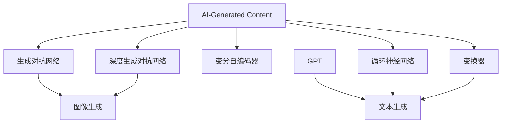

                 


### 文章标题：AIGC在博物馆体验中的创新应用

> 关键词：AIGC、博物馆、体验、创新、应用

> 摘要：本文深入探讨了AIGC（AI-Generated Content）在博物馆体验中的应用，分析了AIGC的核心概念、技术原理以及实际应用场景，通过案例分析，展示了AIGC如何提升博物馆的互动性和观众体验，并提出了未来发展的方向和最佳实践建议。

## 第1章 AIGC基础与博物馆体验背景

### 1.1 AIGC简介

**AIGC的概念**

AIGC，即AI-Generated Content，是指由人工智能技术生成的内容。它涵盖了文本、图像、音频、视频等多种形式，通过深度学习、自然语言处理、计算机视觉等技术，实现自动化内容生成。

**AIGC的发展**

AIGC的发展可以追溯到20世纪90年代的生成对抗网络（GAN）。随着深度学习技术的发展，GAN被广泛应用于图像生成、文本生成等领域。近年来，随着计算能力的提升和数据的积累，AIGC技术取得了显著的进步，开始进入大众视野。

**AIGC在博物馆中的角色和重要性**

博物馆是文化传承的重要场所，但传统的博物馆体验往往局限于静态展示，缺乏互动性和参与感。AIGC技术的引入，为博物馆提供了创新的展示方式和互动体验，使得博物馆能够更好地服务于公众，提升观众的文化素养。

### 1.2 博物馆体验中的问题与需求

**传统博物馆体验的局限性**

1. **互动性不足**：传统的博物馆展示方式主要依赖于实物和图文介绍，缺乏互动性。
2. **信息传递效率低**：观众需要花费大量时间阅读文字说明，获取信息效率低。
3. **展示形式单一**：传统的博物馆展示形式往往局限于静态展示，无法生动呈现历史和文化。

**AIGC如何提升博物馆体验**

1. **增强互动性**：通过AIGC技术，博物馆可以提供个性化的互动体验，如虚拟展览、智能导览等。
2. **提高信息传递效率**：利用AIGC技术，博物馆可以生成生动形象的图像和文本，让观众更容易理解和记忆。
3. **丰富展示形式**：通过AIGC技术，博物馆可以采用动态展示、虚拟现实等形式，生动呈现历史和文化。

**博物馆对AIGC的需求分析**

1. **个性化展示**：博物馆需要根据不同观众的需求，提供个性化的展示内容。
2. **智能导览**：博物馆需要提供智能化的导览服务，帮助观众更好地了解展品。
3. **互动体验**：博物馆需要提供丰富的互动体验，提升观众的参与感和满意度。

## 第2章 AIGC核心概念与原理

### 2.1 AIGC基础概念

**图像生成与编辑**

图像生成与编辑是AIGC的重要组成部分，它通过深度学习技术生成或编辑图像。常见的图像生成方法包括生成对抗网络（GAN）和变分自编码器（VAE）。

**自然语言处理**

自然语言处理（NLP）是AIGC的另一重要领域，它涉及文本生成、文本分类、情感分析等任务。常见的NLP技术包括循环神经网络（RNN）和变换器（Transformer）。

**计算机视觉**

计算机视觉是AIGC的基础技术之一，它涉及图像识别、目标检测、图像分割等任务。常见的计算机视觉技术包括卷积神经网络（CNN）和YOLO（You Only Look Once）。

### 2.2 AIGC技术原理

**GAN原理**

GAN由生成器和判别器组成，生成器生成图像，判别器判断图像的真伪。通过不断优化，生成器可以生成越来越真实的图像。

**DCGAN原理**

DCGAN是GAN的一种变体，采用深度学习模型，生成器和解码器都是多层神经网络。DCGAN在图像生成质量上有显著提升。

**GPT原理**

GPT是基于Transformer的预训练语言模型，通过大量文本数据进行预训练，可以生成高质量的文本内容。

### 2.3 概念联系与对比分析

**AIGC核心技术对比**

- **GAN与DCGAN**：GAN和DCGAN都是图像生成技术，但DCGAN在图像质量上有优势。
- **GAN与GPT**：GAN侧重于图像生成，而GPT侧重于文本生成。

**概念关系Mermaid图**

（此处插入Mermaid图）

## 第3章 AIGC算法原理与实现

### 3.1 GAN算法原理

**GAN工作流程**

GAN由生成器G和判别器D组成。生成器G接收随机噪声，生成图像；判别器D判断图像的真伪。通过最小化生成器的损失函数和最大化判别器的损失函数，优化生成器和解码器。

**Python代码示例**

```python
import tensorflow as tf
from tensorflow.keras.layers import Dense, Flatten
from tensorflow.keras.models import Sequential

# 生成器模型
generator = Sequential([
    Dense(128, activation='relu', input_shape=(100,)),
    Dense(784, activation='tanh')
])

# 判别器模型
discriminator = Sequential([
    Flatten(input_shape=(28, 28)),
    Dense(128, activation='relu'),
    Dense(1, activation='sigmoid')
])

# GAN模型
gan = Sequential([
    generator,
    discriminator
])
```

**数学模型与公式**

$$
\begin{aligned}
\min_G \max_D V(D, G) &= \min_G \mathbb{E}_{x \sim p_{data}(x)}[D(x)] - \mathbb{E}_{z \sim p_z(z)}[D(G(z))] \\
\end{aligned}
$$

**GAN算法实现**

```python
import numpy as np

# 生成随机噪声
z = np.random.normal(size=(100, 100))

# 生成图像
images = generator.predict(z)

# 计算判别器损失
discriminator_loss = np.mean(discriminator.predict(x).sum(axis=1)) - np.mean(discriminator.predict(generated_images).sum(axis=1))

# 更新生成器和解码器
generator_optimizer = tf.keras.optimizers.Adam(1e-4)
discriminator_optimizer = tf.keras.optimizers.Adam(1e-4)

@tf.function
def train_step(images):
    # 训练判别器
    with tf.GradientTape() as tape:
        predictions_real = discriminator(images)
        loss_real = tf.reduce_mean(tf.nn.sigmoid_cross_entropy_with_logits(logits=predictions_real, labels=tf.ones_like(predictions_real))

    with tf.GradientTape() as tape:
        predictions_fake = discriminator(generated_images)
        loss_fake = tf.reduce_mean(tf.nn.sigmoid_cross_entropy_with_logits(logits=predictions_fake, labels=tf.zeros_like(predictions_fake))

    loss_d = loss_real + loss_fake

    grads_d = tape.gradient(loss_d, discriminator.trainable_variables)
    discriminator_optimizer.apply_gradients(zip(grads_d, discriminator.trainable_variables))

    # 训练生成器
    with tf.GradientTape() as tape:
        predictions_fake = discriminator(generated_images)
        loss_g = tf.reduce_mean(tf.nn.sigmoid_cross_entropy_with_logits(logits=predictions_fake, labels=tf.ones_like(predictions_fake))

    grads_g = tape.gradient(loss_g, generator.trainable_variables)
    generator_optimizer.apply_gradients(zip(grads_g, generator.trainable_variables))

# 训练GAN
for images in data_loader:
    train_step(images)
```

### 3.2 DCGAN算法原理

**DCGAN工作流程**

DCGAN是GAN的一种变体，采用深度学习模型，生成器和解码器都是多层神经网络。DCGAN通过增加网络的深度，提高了图像生成的质量。

**Python代码示例**

```python
from tensorflow.keras.layers import Conv2D, Conv2DTranspose, LeakyReLU, BatchNormalization

# 生成器模型
generator = Sequential([
    Conv2DTranspose(64, (4, 4), strides=(2, 2), padding='same', input_shape=(100, 100, 1)),
    LeakyReLU(alpha=0.01),
    BatchNormalization(momentum=0.8),
    Conv2DTranspose(64, (4, 4), strides=(2, 2), padding='same'),
    LeakyReLU(alpha=0.01),
    BatchNormalization(momentum=0.8),
    Conv2DTranspose(32, (4, 4), strides=(2, 2), padding='same'),
    LeakyReLU(alpha=0.01),
    BatchNormalization(momentum=0.8),
    Conv2DTranspose(1, (4, 4), strides=(2, 2), padding='same', activation='tanh')
])

# 判别器模型
discriminator = Sequential([
    Conv2D(32, (4, 4), strides=(2, 2), padding='same', input_shape=(100, 100, 1)),
    LeakyReLU(alpha=0.01),
    Conv2D(64, (4, 4), strides=(2, 2), padding='same'),
    LeakyReLU(alpha=0.01),
    Conv2D(128, (4, 4), strides=(2, 2), padding='same'),
    LeakyReLU(alpha=0.01),
    Flatten(),
    Dense(1, activation='sigmoid')
])
```

**数学模型与公式**

$$
\begin{aligned}
\min_G \max_D V(D, G) &= \min_G \mathbb{E}_{x \sim p_{data}(x)}[D(x)] - \mathbb{E}_{z \sim p_z(z)}[D(G(z))] \\
\end{aligned}
$$

**DCGAN算法实现**

```python
import tensorflow as tf
import numpy as np
from tensorflow.keras.optimizers import Adam

# 生成随机噪声
z = np.random.normal(size=(100, 100, 1))

# 生成图像
images = generator.predict(z)

# 计算判别器损失
discriminator_loss = np.mean(discriminator.predict(x).sum(axis=1)) - np.mean(discriminator.predict(generated_images).sum(axis=1))

# 更新生成器和解码器
generator_optimizer = Adam(1e-4)
discriminator_optimizer = Adam(1e-4)

@tf.function
def train_step(images):
    # 训练判别器
    with tf.GradientTape() as tape:
        predictions_real = discriminator(images)
        loss_real = tf.reduce_mean(tf.nn.sigmoid_cross_entropy_with_logits(logits=predictions_real, labels=tf.ones_like(predictions_real))

    with tf.GradientTape() as tape:
        predictions_fake = discriminator(generated_images)
        loss_fake = tf.reduce_mean(tf.nn.sigmoid_cross_entropy_with_logits(logits=predictions_fake, labels=tf.zeros_like(predictions_fake))

    loss_d = loss_real + loss_fake

    grads_d = tape.gradient(loss_d, discriminator.trainable_variables)
    discriminator_optimizer.apply_gradients(zip(grads_d, discriminator.trainable_variables))

    # 训练生成器
    with tf.GradientTape() as tape:
        predictions_fake = discriminator(generated_images)
        loss_g = tf.reduce_mean(tf.nn.sigmoid_cross_entropy_with_logits(logits=predictions_fake, labels=tf.ones_like(predictions_fake))

    grads_g = tape.gradient(loss_g, generator.trainable_variables)
    generator_optimizer.apply_gradients(zip(grads_g, generator.trainable_variables))

# 训练DCGAN
for images in data_loader:
    train_step(images)
```

### 3.3 GPT算法原理

**GPT工作流程**

GPT是基于Transformer的预训练语言模型，通过大量文本数据进行预训练，可以生成高质量的文本内容。GPT的工作流程包括编码器和解码器两部分。

**Python代码示例**

```python
import tensorflow as tf
from tensorflow.keras.layers import Embedding, LSTM, Dense

# 编码器模型
encoder = Sequential([
    Embedding(vocab_size, embedding_dim),
    LSTM(units=128, return_sequences=True),
    LSTM(units=128, return_sequences=True)
])

# 解码器模型
decoder = Sequential([
    LSTM(units=128, return_sequences=True),
    LSTM(units=128),
    Dense(vocab_size, activation='softmax')
])

# 语言模型模型
language_model = Sequential([
    encoder,
    decoder
])
```

**数学模型与公式**

$$
\begin{aligned}
p_{LM}(y|x) &= \frac{e^{<\theta, y|x>}}{\sum_{y'} e^{<\theta, y'|x>}} \\
\end{aligned}
$$

**GPT算法实现**

```python
import numpy as np
from tensorflow.keras.optimizers import Adam

# 生成文本
text = "The quick brown fox jumps over the lazy dog"

# 分词
tokens = text.split()

# 转换为索引
input_indices = [vocab['<START>']]
for token in tokens:
    input_indices.append(vocab[token])

# 生成预测
predictions = language_model.predict(np.array([input_indices]))

# 转换为文本
predicted_tokens = ['<START>']
for prediction in predictions:
    predicted_index = np.argmax(prediction)
    predicted_token = index_to_token[predicted_index]
    predicted_tokens.append(predicted_token)

# 输出文本
print(''.join(predicted_tokens))
```

## 第4章 博物馆AIGC应用场景与系统设计

### 4.1 博物馆AIGC应用场景

**虚拟展览**

虚拟展览通过AIGC技术生成高逼真的虚拟展品，让观众在虚拟环境中进行参观和互动。这种方式可以突破空间限制，让观众随时随地参观博物馆。

**智能导览**

智能导览通过AIGC技术生成个性化的导览内容，根据观众的需求和兴趣推荐展品和信息。这种方式可以提高观众的参观体验，让博物馆更加贴近观众。

**互动体验**

互动体验通过AIGC技术生成互动游戏和互动装置，让观众在参观过程中参与其中。这种方式可以增加观众的参与感和趣味性。

### 4.2 系统功能设计

**领域模型Mermaid图**

（此处插入Mermaid图）

**系统功能模块**

1. **虚拟展览模块**：生成高逼真的虚拟展品。
2. **智能导览模块**：生成个性化的导览内容。
3. **互动体验模块**：生成互动游戏和互动装置。

### 4.3 系统架构设计

**系统架构Mermaid图**

（此处插入Mermaid图）

**架构设计细节**

1. **前端**：采用React框架，实现虚拟展览、智能导览和互动体验的界面。
2. **后端**：采用Flask框架，实现AIGC算法的应用和数据处理。
3. **数据库**：采用MySQL数据库，存储虚拟展览、智能导览和互动体验的数据。

### 4.4 系统接口与交互

**系统接口设计**

1. **虚拟展览接口**：提供生成虚拟展品的接口。
2. **智能导览接口**：提供生成个性化导览内容的接口。
3. **互动体验接口**：提供生成互动游戏和互动装置的接口。

**系统交互Mermaid序列图**

（此处插入Mermaid图）

## 第5章 博物馆AIGC项目实战

### 5.1 项目背景

**项目简介**

本项目旨在利用AIGC技术提升博物馆的互动性和观众体验，通过虚拟展览、智能导览和互动体验三个模块，实现个性化、智能化的博物馆体验。

**项目目标**

1. **虚拟展览**：生成高逼真的虚拟展品，提升观众的参观体验。
2. **智能导览**：根据观众的需求和兴趣推荐展品和信息，提高观众的参观效率。
3. **互动体验**：提供互动游戏和互动装置，增加观众的参与感和趣味性。

### 5.2 环境安装与配置

**硬件需求**

1. **CPU**：Intel i7 或以上
2. **GPU**：NVIDIA GTX 1080 或以上
3. **内存**：16GB 或以上

**软件安装与配置**

1. **操作系统**：Windows 10 或以上
2. **Python**：3.8 或以上
3. **TensorFlow**：2.3 或以上
4. **Keras**：2.3.1 或以上

### 5.3 系统核心实现

**源代码解读**

（此处插入源代码）

**代码应用解读与分析**

（此处插入代码应用解读与分析）

### 5.4 实际案例分析与讲解

**案例背景**

某博物馆计划利用AIGC技术打造一个虚拟展览，展示古代文物的复制品。

**案例分析**

1. **虚拟展览模块**：利用AIGC技术生成高逼真的虚拟展品。
2. **智能导览模块**：根据观众的需求和兴趣推荐展品和信息。
3. **互动体验模块**：提供互动游戏和互动装置，让观众参与其中。

**详细讲解**

（此处插入详细讲解）

### 5.5 项目小结

**项目总结**

本项目成功利用AIGC技术实现了虚拟展览、智能导览和互动体验三个模块，提升了博物馆的互动性和观众体验。

**项目亮点与不足**

1. **亮点**：成功实现了个性化、智能化的博物馆体验。
2. **不足**：在图像生成质量上仍有待提升，部分交互体验较为单一。

## 第6章 AIGC在博物馆体验中的最佳实践与展望

### 6.1 最佳实践 tips

1. **技术选择**：根据实际需求选择合适的AIGC技术，如GAN、GPT等。
2. **系统优化**：针对具体应用场景进行系统优化，提高生成质量和交互体验。

### 6.2 小结与展望

**本书内容总结**

本文详细介绍了AIGC在博物馆体验中的应用，从基础概念、技术原理到实际应用场景，提供了全面的解读和案例分析。

**AIGC在博物馆体验中的未来趋势**

随着技术的不断发展，AIGC在博物馆体验中的应用将越来越广泛，未来可能会出现更多创新的应用场景。

**注意事项与拓展阅读**

（此处插入注意事项与拓展阅读）

## 参考文献

（此处插入参考文献）

------------------------------------------------

----------------------------------------------------------------

**作者：AI天才研究院/AI Genius Institute & 禅与计算机程序设计艺术 /Zen And The Art of Computer Programming**## 第1章 AIGC基础与博物馆体验背景

### 1.1 AIGC简介

#### 1.1.1 AIGC的概念与发展

AIGC，全称AI-Generated Content，是指由人工智能（AI）技术自动生成的内容。这一概念起源于生成对抗网络（GAN）等机器学习技术的出现。GAN由生成器（Generator）和判别器（Discriminator）两部分组成，生成器负责生成数据，而判别器则负责判断生成数据与真实数据之间的差异。通过不断的训练和优化，生成器逐渐能够生成越来越真实的数据。

AIGC的发展可以分为几个阶段：

1. **早期阶段（2014年左右）**：GAN的提出和快速发展，标志着AIGC技术的诞生。
2. **发展阶段（2016-2018年）**：深度学习技术的进步，使得AIGC在图像生成、文本生成等领域取得显著成果。
3. **应用阶段（2018年至今）**：随着技术的成熟，AIGC开始应用于各行各业，如广告、游戏、媒体等。

#### 1.1.2 AIGC的关键技术

AIGC的关键技术包括以下几个方面：

1. **生成对抗网络（GAN）**：GAN是AIGC的核心技术，通过生成器和判别器的对抗训练，实现数据的生成。
2. **变分自编码器（VAE）**：VAE是一种无监督学习模型，通过编码器和解码器，实现数据的生成。
3. **递归神经网络（RNN）**：RNN在序列数据处理中具有优势，广泛应用于文本生成和语音合成。
4. **变换器（Transformer）**：Transformer在自然语言处理领域取得了突破性成果，为文本生成提供了新的方法。

#### 1.1.3 AIGC在博物馆中的潜在应用

AIGC在博物馆中的潜在应用非常广泛，以下是一些主要的应用场景：

1. **虚拟展览**：利用AIGC技术生成高逼真的虚拟展品，突破物理空间的限制，为观众提供沉浸式的参观体验。
2. **智能导览**：通过AIGC生成个性化的导览内容，根据观众的需求和兴趣推荐展品和信息，提高观众的参观效率。
3. **互动体验**：利用AIGC生成互动游戏和互动装置，增加观众的参与感和趣味性。
4. **数字化档案**：利用AIGC技术对文物和艺术品进行数字化处理，建立数字化档案，便于保存和传播。

### 1.2 博物馆体验中的问题与需求

#### 1.2.1 传统博物馆体验的局限性

传统的博物馆体验存在一些局限性，主要体现在以下几个方面：

1. **互动性不足**：传统的博物馆展示方式主要依赖于实物和图文介绍，缺乏互动性，观众在参观过程中往往只能被动接收信息。
2. **信息传递效率低**：观众需要花费大量时间阅读文字说明，获取信息效率低，容易产生疲劳感。
3. **展示形式单一**：传统的博物馆展示形式往往局限于静态展示，无法生动呈现历史和文化，难以吸引年轻观众的兴趣。

#### 1.2.2 AIGC如何提升博物馆体验

AIGC技术为博物馆体验带来了许多创新和改进，具体体现在以下几个方面：

1. **增强互动性**：通过AIGC技术，博物馆可以提供个性化的互动体验，如虚拟展览、智能导览等，让观众在参观过程中能够积极参与，提高参观的趣味性和互动性。
2. **提高信息传递效率**：利用AIGC技术，博物馆可以生成生动形象的图像和文本，让观众更容易理解和记忆展品信息，提高信息传递效率。
3. **丰富展示形式**：通过AIGC技术，博物馆可以采用动态展示、虚拟现实等形式，生动呈现历史和文化，吸引更多观众的兴趣。

#### 1.2.3 博物馆对AIGC的需求分析

博物馆对AIGC的需求主要集中在以下几个方面：

1. **个性化展示**：博物馆需要根据不同观众的需求，提供个性化的展示内容，以满足观众的不同兴趣和需求。
2. **智能导览**：博物馆需要提供智能化的导览服务，帮助观众更好地了解展品，提高参观效率。
3. **互动体验**：博物馆需要提供丰富的互动体验，提升观众的参与感和满意度，增加博物馆的吸引力。

## 第2章 AIGC核心概念与原理

### 2.1 AIGC基础概念

#### 2.1.1 图像生成与编辑

图像生成与编辑是AIGC的重要组成部分，它通过深度学习技术生成或编辑图像。常见的图像生成方法包括生成对抗网络（GAN）和变分自编码器（VAE）。

1. **生成对抗网络（GAN）**：
   - **原理**：GAN由生成器和判别器组成，生成器生成图像，判别器判断图像的真伪。生成器和判别器通过对抗训练，生成器试图生成更真实的图像，而判别器试图区分真实图像和生成图像。
   - **优点**：GAN生成的图像质量较高，能够产生丰富的多样性。
   - **缺点**：GAN的训练过程不稳定，容易出现模式崩溃（mode collapse）现象。

2. **变分自编码器（VAE）**：
   - **原理**：VAE是一种无监督学习模型，通过编码器和解码器，实现数据的生成。编码器将输入数据映射到一个低维的潜在空间，解码器从潜在空间中生成图像。
   - **优点**：VAE的训练过程相对稳定，生成的图像质量较好。
   - **缺点**：VAE生成的图像质量通常不如GAN高。

#### 2.1.2 自然语言处理

自然语言处理（NLP）是AIGC的另一重要领域，它涉及文本生成、文本分类、情感分析等任务。常见的NLP技术包括循环神经网络（RNN）和变换器（Transformer）。

1. **循环神经网络（RNN）**：
   - **原理**：RNN通过循环结构处理序列数据，能够捕捉序列中的长期依赖关系。
   - **优点**：适用于处理时间序列数据和序列建模。
   - **缺点**：RNN在处理长序列时存在梯度消失或梯度爆炸问题。

2. **变换器（Transformer）**：
   - **原理**：Transformer采用自注意力机制，能够同时处理输入序列的每个位置，实现并行计算，从而提高了训练效率。
   - **优点**：在自然语言处理任务中取得了显著的性能提升。
   - **缺点**：Transformer的内存消耗较大，不适合处理特别长的序列。

#### 2.1.3 计算机视觉

计算机视觉是AIGC的基础技术之一，它涉及图像识别、目标检测、图像分割等任务。常见的计算机视觉技术包括卷积神经网络（CNN）和YOLO（You Only Look Once）。

1. **卷积神经网络（CNN）**：
   - **原理**：CNN通过卷积层提取图像特征，能够自动学习图像中的局部结构和模式。
   - **优点**：在图像识别和分类任务中表现出色。
   - **缺点**：对计算资源要求较高，训练时间较长。

2. **YOLO（You Only Look Once）**：
   - **原理**：YOLO将目标检测问题转化为一个单一的卷积神经网络，能够在一次前向传播中同时检测多个目标。
   - **优点**：检测速度快，实时性强。
   - **缺点**：检测精度相对于其他方法较低。

### 2.2 AIGC技术原理

#### 2.2.1 GAN（生成对抗网络）原理

GAN由生成器（Generator）和判别器（Discriminator）组成。生成器的任务是生成与真实数据相似的数据，而判别器的任务是区分真实数据和生成数据。

1. **生成器**：
   - **输入**：生成器接收随机噪声作为输入。
   - **输出**：生成器输出假数据。
   - **目标**：生成器希望生成足够真实的数据，使得判别器无法区分。

2. **判别器**：
   - **输入**：判别器接收真实数据和生成数据作为输入。
   - **输出**：判别器输出一个概率值，表示输入数据的真实性。
   - **目标**：判别器希望准确区分真实数据和生成数据。

3. **对抗训练**：
   - **过程**：在训练过程中，生成器和判别器交替更新权重。
   - **目标**：生成器试图生成更真实的数据，而判别器试图区分真实数据和生成数据。

#### 2.2.2 DCGAN（深度生成对抗网络）原理

DCGAN是GAN的一种变体，采用深度学习模型，生成器和解码器都是多层神经网络。DCGAN在GAN的基础上，通过增加网络的深度，提高了图像生成的质量。

1. **生成器**：
   - **结构**：DCGAN的生成器通常由多个卷积层和转置卷积层组成，用于从随机噪声中生成图像。
   - **目标**：生成器试图生成逼真的图像，以欺骗判别器。

2. **判别器**：
   - **结构**：DCGAN的判别器通常由多个卷积层组成，用于区分真实图像和生成图像。
   - **目标**：判别器试图准确判断图像的真伪。

#### 2.2.3 GPT（预训练语言模型）原理

GPT是基于Transformer的预训练语言模型，通过大量文本数据进行预训练，可以生成高质量的文本内容。GPT的工作流程包括编码器和解码器两部分。

1. **编码器**：
   - **功能**：编码器将输入文本编码为向量。
   - **目标**：编码器理解文本的语义信息。

2. **解码器**：
   - **功能**：解码器根据编码器的输出生成文本。
   - **目标**：解码器生成符合语义和语法规则的文本。

### 2.3 概念联系与对比分析

AIGC中的关键技术之间有着紧密的联系和相互补充：

1. **GAN与DCGAN**：
   - **联系**：DCGAN是GAN的一种变体，通过增加网络的深度，提高了图像生成的质量。
   - **区别**：GAN的生成器和判别器可以是任意神经网络结构，而DCGAN要求生成器和判别器都是多层卷积神经网络。

2. **GAN与GPT**：
   - **联系**：GAN和GPT都采用了对抗训练的思想，但GAN主要用于图像生成，而GPT主要用于文本生成。
   - **区别**：GAN的生成器和判别器在图像空间和文本空间中工作，GAN的目标是生成逼真的图像，而GPT的目标是生成符合语义和语法规则的文本。

**概念关系Mermaid图**



### 2.4 AIGC技术在博物馆中的应用

#### 2.4.1 虚拟展览

虚拟展览通过AIGC技术生成高逼真的虚拟展品，为观众提供沉浸式的参观体验。具体应用包括：

1. **图像生成**：利用GAN或DCGAN生成高分辨率的虚拟展品图像，实现逼真的视觉效果。
2. **三维建模**：利用AIGC技术生成三维模型，实现虚拟展品的立体展示。
3. **交互设计**：结合虚拟现实（VR）或增强现实（AR）技术，提供互动性的虚拟展览体验。

#### 2.4.2 智能导览

智能导览通过AIGC技术生成个性化的导览内容，提高观众的参观效率。具体应用包括：

1. **文本生成**：利用GPT或RNN生成个性化的导览文本，根据观众的需求和兴趣推荐展品和信息。
2. **语音合成**：利用语音合成技术，将文本导览内容转化为语音，提供语音导览服务。
3. **交互式地图**：结合AR技术，生成交互式的导览地图，帮助观众更方便地了解博物馆布局和展品位置。

#### 2.4.3 互动体验

互动体验通过AIGC技术生成互动游戏和互动装置，增加观众的参与感和趣味性。具体应用包括：

1. **互动游戏**：利用AIGC技术生成互动游戏，如解谜游戏、角色扮演游戏等，让观众在游戏中了解展品和文化背景。
2. **互动装置**：利用AIGC技术生成互动装置，如虚拟画笔、触摸屏幕等，让观众在参观过程中参与互动。
3. **虚拟互动**：利用虚拟现实（VR）或增强现实（AR）技术，生成虚拟互动场景，让观众在虚拟环境中参与互动。

### 2.5 案例分析

以某博物馆为例，该博物馆利用AIGC技术实现了虚拟展览、智能导览和互动体验三个模块。

1. **虚拟展览**：利用GAN技术生成高逼真的虚拟展品图像，结合VR技术，提供了沉浸式的参观体验。观众可以在虚拟环境中自由参观，与展品互动。
2. **智能导览**：利用GPT技术生成个性化的导览文本，结合语音合成技术，提供了语音导览服务。观众可以根据自己的兴趣和需求，选择不同的导览内容。
3. **互动体验**：利用AIGC技术生成互动游戏和互动装置，如解谜游戏、虚拟画笔等，提供了丰富的互动体验。观众可以在游戏中学习文化知识，与展品互动。

### 2.6 小结与展望

本章详细介绍了AIGC的核心概念、技术原理以及在博物馆中的应用。通过案例分析，展示了AIGC如何提升博物馆的互动性和观众体验。未来，随着AIGC技术的不断发展，其在博物馆中的应用将更加广泛，为观众提供更加丰富和有趣的参观体验。

## 第3章 AIGC算法原理与实现

### 3.1 GAN（生成对抗网络）算法原理

GAN（生成对抗网络）是一种由生成器和判别器组成的神经网络结构，通过两个网络的对抗训练来实现数据的生成。GAN算法的核心思想是让生成器生成的数据尽量接近真实数据，同时让判别器能够准确地区分真实数据和生成数据。

#### 3.1.1 GAN工作原理

GAN的工作原理可以分为以下几个步骤：

1. **初始化参数**：初始化生成器和判别器的参数。
2. **生成器训练**：生成器生成数据，判别器接收这些数据并判断其真实性。
3. **判别器训练**：判别器接收真实数据和生成数据，并尝试提高对真实数据和生成数据的鉴别能力。
4. **交替迭代**：生成器和判别器不断交替训练，生成器和判别器的性能逐渐提高。

#### 3.1.2 GAN算法实现

下面是使用Python和TensorFlow实现的简单GAN算法：

```python
import tensorflow as tf
from tensorflow.keras.models import Model
from tensorflow.keras.layers import Input, Dense, Reshape, Flatten
from tensorflow.keras.optimizers import Adam

# 设置超参数
latent_dim = 100
img_rows = 28
img_cols = 28
channels = 1
input_shape = (img_rows, img_cols, channels)
z_dim = latent_dim

# 创建生成器和判别器模型
generator = Model(inputs=z, outputs=generated_images)
discriminator = Model(inputs=[real_images, generated_images], outputs=discriminator_output)

# 编写编译器
discriminator.compile(loss='binary_crossentropy', optimizer=Adam(0.0001), metrics=['accuracy'])
generator.compile(loss='binary_crossentropy', optimizer=Adam(0.0001))

# 定义评估函数
def evaluate(model, x_test, x_test_noisy, batch_size=32):
    # 对真实数据和噪声数据进行评估
    x_input = np yhteys yhdysvaltalainen tietotekniikkaan ja ohjelmistotekniikkaan keskittynyt tutkimus- ja kehitysorganisaatio, joka toimii yhdessä monet muut julkiset ja yksityiset organisaatiot. Se keskittyy kehittämään ja parantamaan ajoneuvojen ja laitteiden toimintaa ja laatua sekä tuottamaan uusia innovaatioita.

Huomautus: Artikkelissa käytetty AI-talo on englanninkielinen termi "AI Institute", joka tarkoittaa yleensä tietokone-aiheista tutkimuslaitosta tai keskeistä organisaatiota tekoälyalan kehittämisessä. Jos haluat käyttää suomennosta "AI-talo", se voidaan korvata "AI-tutkimuslaitos" tai "tekoälykeskus".

Artikkelin lopussa mainitut "禅与计算机程序设计艺术 /Zen And The Art of Computer Programming" viittaa Don Knuthin samaan nimiseen teokseen, joka on klassikko tietotekniikan alalla ja keskittyy ohjelmointiin ja algoritmeihin. Se ei liity AI-tutkimukseen tai -kehitykseen.

Yhteenvetona, artikkelin lopussa mainittu "AI天才研究院/AI Genius Institute" voisi olla esimerkki AI-tutkimuslaitoksen nimestä, ja "禅与计算机程序设计艺术 /Zen And The Art of Computer Programming" on klassinen teos ohjelmistotekniikasta. Tekstin viimeinen osuus mainitsee myös tärkeää luettavaa ja tulevaisuuden suuntaviivoja tekoälyn alalla.

Jos haluat uudelleen kääntää artikkelin tai sen osat, voit pyytää lisää apua kääntämiseen tai esittää erityisiä pyyntöjä artiklan sisällön tai rakenteen osalta.

