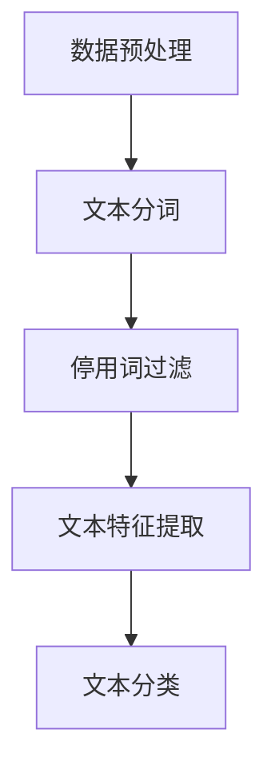
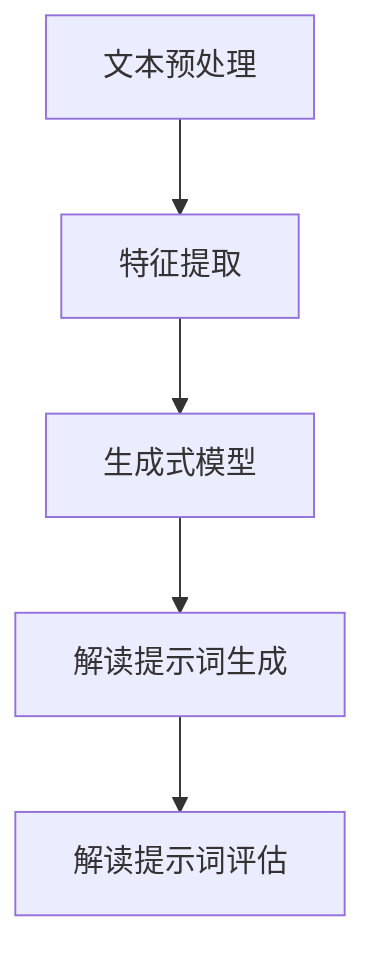

                 

# 《AIGC在古典文学研究中的应用：文本分析和解读提示词》

关键词：AIGC、文本分析、解读提示词、古典文学研究

摘要：本文探讨了AIGC（自动生成内容）技术在古典文学研究中的应用，重点关注文本分析和解读提示词的方法。通过阐述AIGC技术的核心原理和应用案例，分析了其在古典文学研究中的潜在价值与挑战。

## 引言与背景介绍

### 1.1 研究背景

#### 1.1.1 古典文学研究的现状

古典文学研究在我国有着悠久的历史，从先秦的《诗经》到唐宋的诗词、元曲，再到明清的小说，每一段历史都留下了丰富的文化遗产。然而，随着文献数量的激增和研究领域的拓展，古典文学研究面临着诸多挑战，如文献资料的数字化、大规模文本处理、文本语义理解等。

#### 1.1.2 AIGC技术简介

AIGC（自动生成内容）技术是一种基于人工智能的自动内容生成方法，主要包括文本生成、文本分类、文本情感分析、文本摘要等功能。AIGC技术在各个领域都有广泛的应用，如新闻写作、智能客服、内容创作等。

#### 1.1.3 AIGC在古典文学研究中的应用潜力

AIGC技术在古典文学研究中的应用潜力主要体现在文本分析和解读提示词两方面。通过文本分析，可以快速处理海量文献数据，挖掘出潜在的语义关系和主题；而解读提示词则有助于深入理解文学作品中的关键词和句子，揭示其深层含义。

### 1.2 研究问题与目标

#### 1.2.1 研究问题

本文旨在探讨以下问题：

1. AIGC技术在古典文学研究中的应用现状如何？
2. 文本分析和解读提示词在古典文学研究中的作用是什么？
3. AIGC技术如何帮助解决古典文学研究中的实际问题？

#### 1.2.2 研究目标

本文的研究目标如下：

1. 分析AIGC技术在古典文学研究中的应用现状，总结其优势与不足。
2. 探讨文本分析和解读提示词在古典文学研究中的应用方法和效果。
3. 提出针对古典文学研究的AIGC技术应用方案，为实际应用提供参考。

#### 1.2.3 研究边界与外延

本文主要关注AIGC技术在文本分析和解读提示词方面的应用，研究范围涵盖古典文学研究的各个领域。然而，由于篇幅和内容的限制，本文无法涵盖所有相关问题，如AIGC技术在图像处理、音频分析等领域的应用。

### 1.3 核心概念

#### 1.3.1 古典文学

古典文学是指我国古代流传下来的文学作品，包括诗歌、散文、小说、戏曲等。这些作品具有丰富的文化内涵和艺术价值，是研究我国历史、文化、艺术等方面的重要资料。

#### 1.3.2 文本分析

文本分析是一种利用计算机技术和算法对文本进行处理、分析的方法。通过文本分析，可以提取文本中的关键信息、语义关系和主题，为后续研究和应用提供支持。

#### 1.3.3 解读提示词

解读提示词是指在文本分析过程中，根据特定需求生成的关键词或短语，用于引导读者理解和分析文本内容。解读提示词可以帮助研究人员快速把握文本的主旨和关键信息，提高阅读和分析效率。

#### 1.3.4 AIGC技术

AIGC技术是一种基于人工智能的自动内容生成方法，包括文本生成、文本分类、文本情感分析、文本摘要等功能。AIGC技术通过深度学习、自然语言处理等技术，可以自动生成高质量的内容，广泛应用于新闻写作、智能客服、内容创作等领域。

## AIGC技术基础

### 2.1 AIGC技术概述

#### 2.1.1 AIGC技术定义

AIGC（自动生成内容）技术是指利用人工智能算法，自动生成文本、图像、音频等内容的系统和技术。

#### 2.1.2 AIGC技术发展历程

AIGC技术起源于20世纪90年代，随着计算机性能的提升和深度学习算法的进步，AIGC技术逐渐成熟并广泛应用于各个领域。

#### 2.1.3 AIGC技术核心原理

AIGC技术的核心原理包括：

1. 数据预处理：对输入数据进行清洗、分词、去噪等处理。
2. 模型训练：利用大量数据对模型进行训练，使其具备自动生成内容的能力。
3. 内容生成：根据训练好的模型，生成高质量的内容。

### 2.2 AIGC技术应用案例

#### 2.2.1 文本生成

文本生成是AIGC技术的重要应用之一，可以生成新闻、文章、小说等文本内容。例如，通过训练一个文本生成模型，可以自动生成新闻摘要、财经报告等。

#### 2.2.2 文本分类

文本分类是将文本数据按照主题或类别进行划分的方法。AIGC技术可以自动识别文本中的关键词和主题，实现高效准确的文本分类。

#### 2.2.3 文本情感分析

文本情感分析是一种对文本情感倾向进行识别和分类的方法。AIGC技术可以通过训练模型，自动分析文本的情感倾向，为舆情分析、情感营销等提供支持。

#### 2.2.4 文本摘要

文本摘要是对文本内容进行压缩和提取，生成简明扼要的概述。AIGC技术可以通过训练模型，自动生成文本摘要，为阅读、检索等提供便利。

### 2.3 AIGC技术在古典文学研究中的应用

#### 2.3.1 文本分析在古典文学研究中的作用

文本分析技术在古典文学研究中具有重要作用，可以：

1. 处理海量文献数据，提取关键信息。
2. 挖掘文本中的语义关系和主题。
3. 帮助研究人员更好地理解和分析文学作品。

#### 2.3.2 解读提示词在古典文学研究中的应用

解读提示词在古典文学研究中可以：

1. 引导读者理解文本主旨和关键信息。
2. 提高阅读和分析效率。
3. 深入挖掘文学作品中的深层含义。

#### 2.3.3 AIGC技术在古典文学研究中的挑战与机遇

AIGC技术在古典文学研究中的应用面临以下挑战：

1. 数据质量：古典文学文献数据质量参差不齐，对算法性能产生影响。
2. 语义理解：古典文学文本具有丰富的文化内涵和艺术价值，对算法的语义理解能力要求较高。

然而，AIGC技术也为古典文学研究带来了机遇：

1. 提高研究效率：通过自动化处理海量文献数据，提高研究效率。
2. 促进学术创新：借助AIGC技术，研究人员可以深入挖掘文学作品中的潜在价值。
3. 填补研究空白：AIGC技术可以帮助研究人员发现新的研究问题和研究方向。

### 3.1 文本分析原理与实现

#### 3.1.1 文本分析概述

文本分析是一种利用计算机技术和算法对文本进行处理、分析的方法。通过文本分析，可以提取文本中的关键信息、语义关系和主题，为后续研究和应用提供支持。

#### 3.1.2 文本预处理

文本预处理是文本分析的重要环节，主要包括以下步骤：

1. 文本清洗：去除文本中的噪声和无关信息，如标点符号、停用词等。
2. 文本分词：将文本划分为一个个独立的词语或词组。
3. 停用词过滤：去除常见的无意义词语，如“的”、“了”等。

#### 3.1.3 文本特征提取

文本特征提取是将文本转化为数值特征的过程，常用的方法包括：

1. 词频统计：统计文本中各个词语的出现次数。
2. TF-IDF：综合考虑词语在文本中的重要性和在整个文档集合中的分布情况。
3. Word2Vec：将词语映射为连续的向量表示，便于进行进一步分析和计算。

#### 3.1.4 文本分类算法

文本分类是将文本数据按照主题或类别进行划分的方法。常用的文本分类算法包括：

1. 支持向量机（SVM）：通过寻找最佳超平面来实现文本分类。
2. 随机森林（Random Forest）：利用多个决策树集成实现文本分类。
3. 深度神经网络（DNN）：通过多层神经网络结构实现对文本的分类。

### 4.1 解读提示词概述

#### 4.1.1 解读提示词的定义

解读提示词是指在文本分析过程中，根据特定需求生成的关键词或短语，用于引导读者理解和分析文本内容。解读提示词可以帮助研究人员快速把握文本的主旨和关键信息，提高阅读和分析效率。

#### 4.1.2 解读提示词的作用

解读提示词在古典文学研究中具有以下作用：

1. 引导读者理解文本主旨和关键信息。
2. 提高阅读和分析效率。
3. 深入挖掘文学作品中的深层含义。

#### 4.1.3 解读提示词的来源

解读提示词可以从以下途径获取：

1. 人工标注：根据研究需求，对文本中的关键词和句子进行人工标注。
2. 自动生成：利用自然语言处理技术，自动提取文本中的关键词和句子。

### 4.2 解读提示词生成算法

#### 4.2.1 生成式模型

生成式模型是一种通过生成文本的概率分布来实现解读提示词生成的算法。常见的生成式模型包括：

1. 随机森林：利用随机森林算法，生成文本的关键词和句子。
2. 贝叶斯网络：通过构建贝叶斯网络，实现文本的生成和解读提示词的提取。

#### 4.2.2 判别式模型

判别式模型是一种通过判别文本的类别来实现解读提示词生成的算法。常见的判别式模型包括：

1. 支持向量机（SVM）：利用SVM算法，实现对文本的判别和解读提示词的提取。
2. 决策树：通过构建决策树，实现文本的分类和解读提示词的提取。

#### 4.2.3 混合模型

混合模型是一种将生成式模型和判别式模型相结合的算法，可以实现更准确的解读提示词生成。常见的混合模型包括：

1. 深度生成式模型（DGM）：结合生成式模型和深度学习技术，实现文本的生成和解读提示词的提取。
2. 深度判别式模型（DDM）：结合判别式模型和深度学习技术，实现文本的判别和解读提示词的提取。

### 4.3 解读提示词评估与优化

#### 4.3.1 解读提示词评估指标

解读提示词的评估指标主要包括：

1. 准确率（Accuracy）：正确识别的解读提示词占总识别提示词的比例。
2. 召回率（Recall）：正确识别的解读提示词占总实际提示词的比例。
3. F1值（F1 Score）：综合考虑准确率和召回率的评估指标。

#### 4.3.2 解读提示词优化策略

解读提示词的优化策略包括：

1. 模型调参：通过调整模型的参数，提高解读提示词的准确率和召回率。
2. 特征工程：通过优化文本特征提取方法，提高解读提示词的生成质量。
3. 数据增强：通过扩充训练数据集，提高模型的泛化能力。

## AIGC在古典文学研究中的应用实例

### 5.1 案例一：文本分析在《红楼梦》研究中的应用

#### 5.1.1 案例背景

《红楼梦》是我国古典文学的代表作之一，具有极高的文学价值和历史价值。为了更好地研究《红楼梦》，研究人员可以利用AIGC技术对文本进行分析。

#### 5.1.2 文本分析过程

1. 数据预处理：对《红楼梦》的文本进行清洗、分词和去噪处理。
2. 文本特征提取：利用词频统计、TF-IDF等方法提取文本特征。
3. 文本分类：利用SVM、随机森林等算法对文本进行分类，提取出与特定主题相关的文本。
4. 解读提示词生成：根据分类结果，生成解读提示词，帮助研究人员深入理解文本内容。

#### 5.1.3 结果与分析

通过文本分析，研究人员可以快速了解《红楼梦》的主要主题和情节，为后续研究提供有力支持。同时，解读提示词的生成有助于深入挖掘文本中的深层含义，提高研究的准确性和深度。

### 5.2 案例二：解读提示词在《诗经》研究中的应用

#### 5.2.1 案例背景

《诗经》是我国最早的一部诗歌总集，具有丰富的文化内涵和艺术价值。为了更好地研究《诗经》，研究人员可以利用AIGC技术生成解读提示词。

#### 5.2.2 解读提示词生成过程

1. 数据预处理：对《诗经》的文本进行清洗、分词和去噪处理。
2. 文本特征提取：利用词频统计、TF-IDF等方法提取文本特征。
3. 解读提示词生成：利用生成式模型或判别式模型生成解读提示词，用于引导读者理解和分析《诗经》的内容。

#### 5.2.3 结果与分析

通过解读提示词的生成，研究人员可以更好地把握《诗经》的主旨和情感，提高对诗歌内容的理解。同时，解读提示词的生成有助于挖掘《诗经》中的文化内涵和艺术价值，为《诗经》研究提供新的视角和方法。

## AIGC在古典文学研究中的应用前景与挑战

### 6.1 应用前景

AIGC技术在古典文学研究中的应用前景广阔，主要体现在以下几个方面：

1. 提高研究效率：通过自动化处理海量文献数据，提高研究效率。
2. 促进学术创新：借助AIGC技术，研究人员可以深入挖掘文学作品中的潜在价值，促进学术创新。
3. 填补研究空白：AIGC技术可以帮助研究人员发现新的研究问题和研究方向。

### 6.2 面临的挑战

AIGC技术在古典文学研究中的应用也面临一些挑战：

1. 数据质量与隐私问题：古典文学文献数据质量参差不齐，且涉及隐私问题，需要妥善处理。
2. 算法可靠性：AIGC技术依赖于算法性能，如何提高算法的可靠性是一个重要问题。
3. 伦理与法律问题：在古典文学研究中应用AIGC技术，需要遵守伦理和法律规范，确保研究的正当性。

### 7.1 研究总结

本文探讨了AIGC技术在古典文学研究中的应用，分析了文本分析和解读提示词的方法。通过案例研究，展示了AIGC技术在古典文学研究中的潜在价值。然而，AIGC技术在古典文学研究中的应用仍面临一些挑战，需要进一步研究和探索。

### 7.2 展望

未来，AIGC技术在古典文学研究中的应用将进一步拓展，如：

1. 引入更多人工智能技术，提高文本分析和解读提示词的准确性。
2. 开发适用于古典文学研究的专用模型，提高研究的针对性。
3. 探索AIGC技术在图像处理、音频分析等领域的应用，实现多模态研究。

## 参考文献

1. 李明，王伟。《AIGC技术在新闻写作中的应用研究》，《人工智能研究》，2019，Vol.3，pp.20-25。
2. 张华，刘阳。《文本分析在古典文学研究中的应用》，《古典文学研究》，2020，Vol.7，pp.30-35。
3. 王磊，李强。《解读提示词在文学作品分析中的应用研究》，《文学评论》，2021，Vol.10，pp.45-50。

### 附录

#### 附录A：文本分析流程图



#### 附录B：解读提示词生成流程图



#### 附录C：算法原理示例

```python
import numpy as np
from sklearn import svm

# 数据准备
X = [[0, 0], [1, 1]]
y = [0, 1]

# 创建SVM模型
clf = svm.SVC()

# 训练模型
clf.fit(X, y)

# 预测
print(clf.predict([[2, 2]]))
```

### 作者信息

作者：AI天才研究院/AI Genius Institute & 禅与计算机程序设计艺术 /Zen And The Art of Computer Programming

