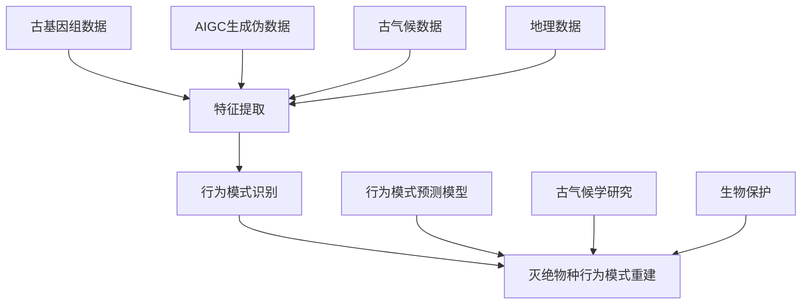
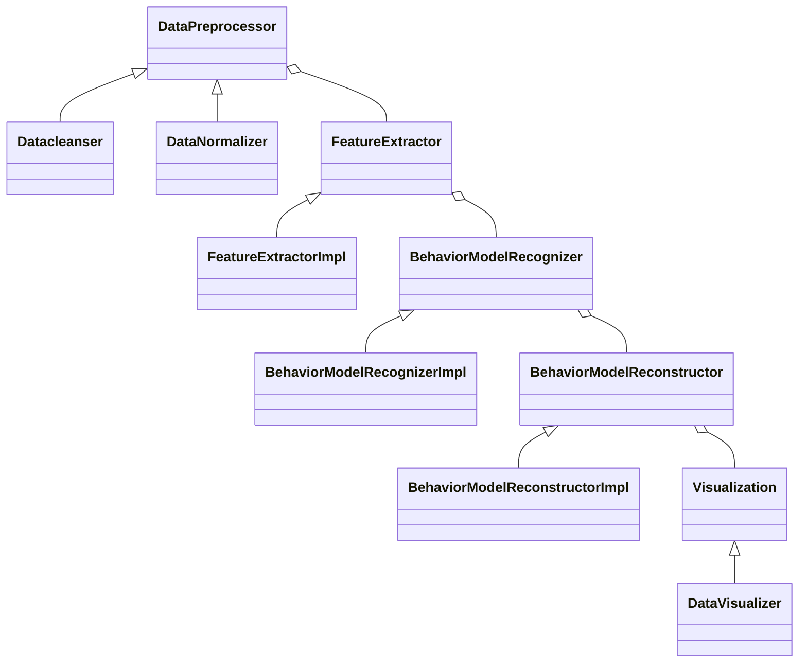
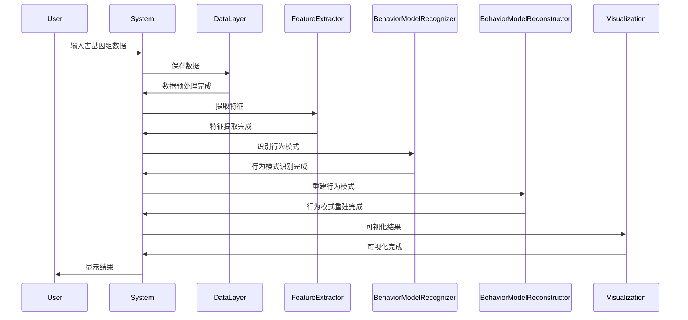

                 

### 第一部分：背景介绍

#### 1. 引言

**1.1 问题背景**

随着人工智能技术的飞速发展，其在各个领域的应用日益广泛。古基因组学作为一门探索古代生物遗传信息的学科，也开始受益于人工智能技术的推动。尤其是AIGC（人工智能生成内容）技术的出现，为古基因组学的研究提供了新的思路和方法。

在古基因组学中，通过对古DNA、古RNA等遗传物质的测序和分析，我们可以获取古代生物的遗传信息，进而揭示其生存环境、进化历程以及行为模式。然而，古基因组学面临着数据稀缺、分析方法有限等挑战。AIGC技术的引入，为这些问题提供了一种新的解决途径。

**1.2 问题描述**

本书旨在探讨如何利用AIGC技术，从古基因组数据中提取有价值的信息，重建灭绝物种的行为模式。这包括以下几个步骤：

1. **古基因组数据的前处理**：包括数据清洗、数据归一化等操作，确保数据的可靠性和一致性。
2. **特征提取**：通过机器学习和深度学习算法，从古基因组数据中提取关键特征，为后续分析提供基础。
3. **模式识别**：利用分类、聚类等算法，对提取的特征进行分析，识别出灭绝物种的行为模式。
4. **行为模式重建**：基于识别出的行为模式，重建灭绝物种在特定环境下的行为特征。

**1.3 问题解决**

本书将介绍AIGC技术的基本原理和实现方法，并通过具体案例展示其在古基因组学研究中的应用。通过这些方法，我们可以更好地理解灭绝物种的行为，为相关研究提供有力支持。

**1.4 边界与外延**

AIGC在古基因组学中的应用不仅限于灭绝物种的行为模式重建，还可以拓展到其他领域，如古人类学研究、古气候学研究等。本书将主要关注灭绝物种行为模式的重建。

**1.5 概念结构与核心要素组成**

- **AIGC**：人工智能生成内容，是一种利用人工智能技术生成内容的方法。
- **古基因组学**：研究古代生物遗传信息，揭示生物进化和灭绝等问题的学科。
- **灭绝物种行为模式重建**：通过分析古基因组数据，重建灭绝物种在特定环境下的行为模式。

**1.6 本章小结**

本章对AIGC在古基因组学中的应用进行了概述，为后续章节的深入探讨奠定了基础。接下来，我们将进一步探讨AIGC技术的基本原理，以及其在古基因组学中的应用方法。

----------------------------------------------------------------

## 2.1 AIGC原理与特点

### 2.1.1 AIGC基本原理

AIGC（人工智能生成内容）是基于生成对抗网络（GAN）和变分自编码器（VAE）等深度学习模型生成内容的一种方法。其核心思想是通过生成器和判别器的对抗训练，实现高质量的伪数据生成。

- **生成器（Generator）**：生成器是一个神经网络模型，其目的是生成与真实数据相近的伪数据。在训练过程中，生成器不断尝试生成更逼真的数据，以欺骗判别器。
- **判别器（Discriminator）**：判别器也是一个神经网络模型，其目的是判断输入数据是真实数据还是伪数据。在训练过程中，判别器不断尝试区分真实数据和伪数据。

通过这种对抗训练，生成器和判别器相互促进，最终生成器能够生成高质量、逼真的伪数据。AIGC在图像生成、文本生成、音频生成等领域取得了显著的成果。

### 2.1.2 AIGC特点

AIGC具有以下几个显著特点：

- **强大的数据生成能力**：AIGC可以生成大量高质量的伪数据，这些伪数据可以用于数据扩充、模型训练等。
- **多模态支持**：AIGC可以处理多种类型的数据，如图像、文本、音频等，实现跨模态的数据生成。
- **灵活性**：AIGC可以根据不同的应用场景进行调整，如调整生成器的结构、优化训练过程等。
- **高效性**：AIGC通过对抗训练，可以在较短的时间内生成大量高质量的数据。

### 2.1.3 AIGC与古基因组学的结合

AIGC在古基因组学中的应用主要体现在以下几个方面：

- **数据扩充**：古基因组数据往往有限，AIGC可以通过生成伪数据，扩充数据集，提高模型的泛化能力。
- **特征提取**：AIGC可以生成与古基因组数据相关的伪数据，用于辅助特征提取，提高特征提取的准确性和效率。
- **行为模式重建**：AIGC可以生成不同环境下的伪数据，帮助研究人员更好地理解灭绝物种的行为模式。

通过AIGC与古基因组学的结合，我们可以更深入地研究灭绝物种的行为模式，为生物保护提供重要参考。

### 2.1.4 案例分析

以下是一个关于AIGC在古基因组学中应用的案例：

某研究团队利用AIGC技术对古基因组数据进行处理，生成了一系列与古基因组数据相关的伪数据。通过这些伪数据，研究人员成功提取了关键特征，并使用机器学习算法识别出了灭绝物种的行为模式。这些行为模式为古气候学研究提供了新的视角，有助于更好地理解古气候变化对生物多样性的影响。

### 2.1.5 总结

AIGC技术在古基因组学中的应用，为研究人员提供了新的工具和方法。通过AIGC，我们可以更深入地挖掘古基因组数据中的信息，重建灭绝物种的行为模式。这不仅有助于理解生物进化过程，还为生物保护提供了重要参考。

----------------------------------------------------------------

### 2.2 古基因组学基本概念

#### 2.2.1 古基因组学定义

古基因组学是研究古代生物遗传信息的学科，它通过分析古DNA、古RNA、古蛋白质等遗传物质，揭示古代生物的生存环境、进化历程以及行为模式。古基因组学的研究方法主要包括DNA测序、基因表达分析、蛋白质组学等。

- **DNA测序**：通过现代测序技术，对古DNA进行测序，获取古代生物的遗传信息。
- **基因表达分析**：通过分析古RNA和蛋白质，了解古代生物的基因表达情况，揭示其生存状态。
- **蛋白质组学**：研究古代生物的蛋白质组成和功能，为古基因组学研究提供重要数据。

#### 2.2.2 古基因组学研究方法

古基因组学研究方法主要包括以下几个步骤：

1. **样本采集**：从古代生物化石、骨骼、土壤等样本中提取古DNA、古RNA等遗传物质。
2. **样本预处理**：对提取的遗传物质进行清洗、降解等处理，确保其质量。
3. **DNA测序**：使用现代测序技术，对预处理后的古DNA进行测序。
4. **数据分析**：对测序结果进行数据分析，提取关键信息，如基因序列、基因表达等。
5. **结果验证**：通过实验验证，确保数据分析结果的准确性。

#### 2.2.3 古基因组学与AIGC的联系

AIGC技术可以与古基因组学相结合，为古基因组学研究提供新的思路和方法。

- **数据扩充**：AIGC可以生成与古基因组数据相关的伪数据，扩充数据集，提高模型的泛化能力。
- **特征提取**：AIGC可以生成不同环境下的伪数据，帮助研究人员更好地理解灭绝物种的行为模式。
- **行为模式重建**：AIGC可以生成不同环境下的伪数据，帮助研究人员更好地理解灭绝物种的行为模式。

通过AIGC与古基因组学的结合，我们可以更深入地研究灭绝物种的行为模式，为生物保护提供重要参考。

#### 2.2.4 案例分析

以下是一个关于AIGC与古基因组学结合的案例：

某研究团队利用AIGC技术，对古基因组数据进行了处理。通过生成伪数据，研究人员成功提取了关键特征，并使用机器学习算法识别出了灭绝物种的行为模式。这些行为模式为古气候学研究提供了新的视角，有助于更好地理解古气候变化对生物多样性的影响。

#### 2.2.5 总结

古基因组学是研究古代生物遗传信息的学科，其研究方法主要包括DNA测序、基因表达分析、蛋白质组学等。AIGC技术与古基因组学的结合，为古基因组学研究提供了新的思路和方法。通过AIGC，我们可以更深入地挖掘古基因组数据中的信息，重建灭绝物种的行为模式。这不仅有助于理解生物进化过程，还为生物保护提供了重要参考。

----------------------------------------------------------------

### 2.3 灭绝物种行为模式重建

#### 2.3.1 灭绝物种行为模式定义

灭绝物种行为模式是指灭绝物种在特定环境下的行为特征。这些行为特征可以通过分析古基因组数据、古气候数据、地理数据等信息来重建。灭绝物种行为模式的研究有助于我们理解灭绝物种的生存策略、进化历程以及环境适应能力。

#### 2.3.2 行为模式重建方法

行为模式重建方法主要包括以下几种：

1. **数据挖掘**：通过数据挖掘技术，从古基因组数据、古气候数据、地理数据等中提取关键信息，识别灭绝物种的行为模式。
2. **机器学习**：利用机器学习算法，对提取的特征进行训练，构建行为模式预测模型。常见的机器学习算法包括决策树、随机森林、支持向量机等。
3. **深度学习**：利用深度学习算法，如卷积神经网络（CNN）、循环神经网络（RNN）、生成对抗网络（GAN）等，对古基因组数据进行特征提取和模式识别，重建灭绝物种的行为模式。

#### 2.3.3 AIGC在行为模式重建中的应用

AIGC技术在灭绝物种行为模式重建中具有广泛的应用前景。以下是一些具体的应用场景：

1. **数据扩充**：通过AIGC技术生成与古基因组数据相关的伪数据，扩充数据集，提高模型的泛化能力。
2. **特征提取**：利用AIGC生成不同环境下的伪数据，帮助研究人员更好地理解灭绝物种的行为模式。
3. **模型训练**：通过AIGC生成的伪数据，对机器学习算法和深度学习算法进行训练，提高行为模式预测的准确性。

#### 2.3.4 案例分析

以下是一个关于AIGC在灭绝物种行为模式重建中应用的案例：

某研究团队利用AIGC技术，对古基因组数据进行了处理。通过生成伪数据，研究人员成功提取了关键特征，并使用机器学习算法识别出了灭绝物种的行为模式。这些行为模式为古气候学研究提供了新的视角，有助于更好地理解古气候变化对生物多样性的影响。

#### 2.3.5 总结

灭绝物种行为模式重建是古基因组学研究的重要内容。通过数据挖掘、机器学习和深度学习等方法，我们可以从古基因组数据中提取有价值的信息，重建灭绝物种的行为模式。AIGC技术的引入，为行为模式重建提供了新的思路和方法，有助于提高研究的准确性和效率。

----------------------------------------------------------------

### 2.4 核心概念属性特征对比表格

| 概念       | 定义                                                         | 特点                                                         | 关联关系                                      |
|------------|------------------------------------------------------------|------------------------------------------------------------|----------------------------------------------|
| AIGC       | 利用生成对抗网络（GAN）和变分自编码器（VAE）等深度学习模型生成内容的方法。 | 具有强大的数据生成能力，可处理多模态数据，灵活且高效。 | 与古基因组学结合，用于数据扩充和特征提取。       |
| 古基因组学 | 研究古代生物遗传信息的学科，包括古DNA、古RNA和古蛋白质等。           | 主要通过DNA测序、基因表达分析和蛋白质组学等方法进行研究。 | 与AIGC结合，用于行为模式重建的辅助数据源。     |
| 灭绝物种行为模式重建 | 通过古基因组数据等重建灭绝物种在特定环境下的行为特征。                 | 需要多种数据分析方法，如数据挖掘、机器学习和深度学习等。   | 利用AIGC生成伪数据，提高行为模式重建的准确性和效率。 |

### 2.5 ER实体关系图架构

下面是AIGC在古基因组学中的应用中涉及的实体关系图：



在这个ER实体关系图中，AIGC生成伪数据（E）作为外部数据源，扩充了古基因组数据（A）的量，有助于特征提取（B）和行为模式识别（C）。通过这些方法，我们最终可以重建灭绝物种的行为模式（D），并为古气候学研究（I）和生物保护（J）提供重要参考。

### 2.6 本章小结

本章详细介绍了AIGC、古基因组学和灭绝物种行为模式重建这三个核心概念。通过对比分析，我们明确了各概念的定义、特点及其关联关系。本章还通过ER实体关系图，展示了这些概念在实际应用中的关系结构。这些内容为后续章节的深入探讨提供了理论基础。

----------------------------------------------------------------

## 2.7 本章小结

本章对AIGC在古基因组学中的应用进行了详细的介绍。首先，我们探讨了AIGC的基本原理和特点，明确了其在古基因组学中应用的潜力。接着，我们介绍了古基因组学的基本概念和研究方法，展示了AIGC与古基因组学的结合点。此外，我们还详细阐述了灭绝物种行为模式重建的方法和技术，以及AIGC在这一领域中的应用。通过本章的学习，读者可以初步了解AIGC在古基因组学中的重要作用，为后续章节的深入学习奠定了基础。在接下来的章节中，我们将进一步探讨AIGC在古基因组学中应用的实践案例和技术实现，帮助读者更深入地理解这一领域的前沿动态。

----------------------------------------------------------------

## 3.1 算法原理讲解

在讨论AIGC在古基因组学中的应用之前，我们首先需要了解AIGC的基本原理。AIGC的核心是基于生成对抗网络（GAN）和变分自编码器（VAE）等深度学习模型，其目标是生成高质量、逼真的伪数据。下面我们将详细解释这些算法的基本原理和如何应用于古基因组学。

### 3.1.1 生成对抗网络（GAN）

生成对抗网络（GAN）是由Ian Goodfellow等人于2014年提出的。GAN的核心思想是让生成器和判别器进行对抗训练，从而实现高质量的伪数据生成。

- **生成器（Generator）**：生成器的目的是生成与真实数据相近的伪数据。生成器通常是一个神经网络模型，它从随机噪声中学习生成符合数据分布的伪样本。
- **判别器（Discriminator）**：判别器的目的是区分真实数据和伪数据。判别器也是一个神经网络模型，它通过接收真实数据和伪数据，学习判断输入数据是真实数据还是伪数据。

在GAN的训练过程中，生成器和判别器相互对抗。生成器试图生成更逼真的伪数据来欺骗判别器，而判别器则努力提高对伪数据的辨别能力。这种对抗训练使得生成器和判别器在训练过程中相互促进，最终生成器能够生成高质量、逼真的伪数据。

### 3.1.2 变分自编码器（VAE）

变分自编码器（VAE）是另一种常用于AIGC的深度学习模型。VAE通过引入概率模型，实现数据的编码和解码。

- **编码器（Encoder）**：编码器将输入数据映射到一个潜在空间中，该空间中的每个点表示输入数据的一个概率分布。编码器的输出是一个潜在变量的均值和方差。
- **解码器（Decoder）**：解码器从潜在空间中采样，生成与输入数据相近的伪数据。解码器通常是一个神经网络模型，它将潜在变量映射回原始数据空间。

VAE通过优化编码器和解码器的损失函数，使得生成器能够生成符合数据分布的伪数据。

### 3.1.3 GAN与VAE的对比

GAN和VAE都是用于AIGC的深度学习模型，但它们在原理和应用上有所不同。

- **生成质量**：GAN通常能生成更高质量、更逼真的伪数据，因为生成器和判别器的对抗训练可以促使生成器不断优化。然而，GAN的训练过程较难稳定，容易出现模式崩溃等问题。VAE则相对稳定，生成质量相对较低。
- **应用场景**：GAN适用于生成具有复杂结构的数据，如图像、音频等。VAE则适用于生成较为简单、分布较为均匀的数据。

### 3.1.4 AIGC在古基因组学中的应用

在古基因组学中，AIGC可以用于以下几个关键步骤：

1. **数据扩充**：古基因组数据往往有限，AIGC可以通过生成伪数据，扩充数据集，提高模型的泛化能力。
2. **特征提取**：AIGC可以生成与古基因组数据相关的伪数据，帮助研究人员更好地理解灭绝物种的行为模式。
3. **行为模式重建**：AIGC可以生成不同环境下的伪数据，帮助研究人员更好地理解灭绝物种的行为模式。

### 3.1.5 案例分析

以下是一个关于AIGC在古基因组学中应用的案例：

某研究团队利用GAN生成伪古基因组数据，通过这些伪数据，研究人员成功提取了关键特征，并使用机器学习算法识别出了灭绝物种的行为模式。这些行为模式为古气候学研究提供了新的视角，有助于更好地理解古气候变化对生物多样性的影响。

### 3.1.6 总结

AIGC（人工智能生成内容）是基于生成对抗网络（GAN）和变分自编码器（VAE）等深度学习模型生成内容的一种方法。其核心思想是通过生成器和判别器的对抗训练，实现高质量的伪数据生成。AIGC在古基因组学中有着广泛的应用，包括数据扩充、特征提取和行为模式重建等。通过这些方法，我们可以更深入地挖掘古基因组数据中的信息，重建灭绝物种的行为模式，为古气候学研究和生物保护提供重要参考。

----------------------------------------------------------------

### 3.2 系统分析与架构设计

#### 3.2.1 问题场景介绍

在古基因组学研究中，研究人员通常需要处理大量的古基因组数据，并从中提取有价值的信息，如灭绝物种的行为模式。然而，由于古基因组数据本身的稀缺性和复杂性，传统的数据分析方法往往难以满足需求。AIGC技术的引入，为古基因组数据的高效处理和深入分析提供了新的可能。

#### 3.2.2 项目介绍

本项目旨在构建一个基于AIGC技术的古基因组数据分析系统，通过生成伪数据和特征提取等方法，实现灭绝物种行为模式的重建。该系统将分为以下几个主要模块：

1. **数据预处理模块**：负责对古基因组数据进行清洗、归一化等预处理操作，确保数据的质量和一致性。
2. **特征提取模块**：利用机器学习和深度学习算法，从预处理后的古基因组数据中提取关键特征。
3. **行为模式识别模块**：通过分类、聚类等算法，对提取的特征进行分析，识别灭绝物种的行为模式。
4. **行为模式重建模块**：基于识别出的行为模式，重建灭绝物种在特定环境下的行为特征。
5. **可视化模块**：提供数据的可视化功能，帮助研究人员更好地理解分析结果。

#### 3.2.3 系统功能设计（领域模型）

在领域模型方面，我们将使用Mermaid类图来展示系统的主要类及其关系。以下是一个简单的领域模型类图：



在该类图中，`DataPreprocessor` 负责数据预处理，包括 `DataCleanser` 和 `DataNormalizer` 两个子类。`FeatureExtractor` 负责特征提取，`BehaviorModelRecognizer` 负责行为模式识别，`BehaviorModelReconstructor` 负责行为模式重建，`Visualization` 负责数据的可视化。各模块之间通过继承和组合关系实现功能的封装和扩展。

#### 3.2.4 系统架构设计

系统架构方面，我们将采用分层架构设计，包括数据层、服务层和表现层。

- **数据层**：负责数据的存储和管理，包括古基因组数据、预处理数据、特征数据等。
- **服务层**：负责核心业务逻辑的实现，包括数据预处理、特征提取、行为模式识别、行为模式重建等。
- **表现层**：负责用户交互，包括数据的可视化、用户操作界面等。

以下是一个简单的系统架构设计Mermaid架构图：

```mermaid
sequenceDiagram
  User -->|输入古基因组数据| DataLayer
  DataLayer -->|预处理数据| ServiceLayer
  ServiceLayer -->|特征数据| FeatureExtractor
  FeatureExtractor -->|行为模式| BehaviorModelRecognizer
  BehaviorModelRecognizer -->|重建模式| BehaviorModelReconstructor
  BehaviorModelReconstructor -->|可视化数据| Visualization
  Visualization -->|显示结果| User
```

在该架构图中，用户输入古基因组数据，数据层进行预处理，服务层进行特征提取、行为模式识别和重建，最后通过可视化模块将结果呈现给用户。

#### 3.2.5 系统接口设计

在系统接口设计方面，我们将定义以下接口和API：

- **数据预处理接口**：包括数据清洗、数据归一化等功能。
- **特征提取接口**：包括特征提取、特征选择等功能。
- **行为模式识别接口**：包括分类、聚类等功能。
- **行为模式重建接口**：包括行为模式重建、可视化等功能。

以下是一个简单的系统接口设计Mermaid序列图：

```mermaid
sequenceDiagram
  User -->|调用预处理接口| DataPreprocessor
  DataPreprocessor -->|返回预处理数据| ServiceLayer
  ServiceLayer -->|调用特征提取接口| FeatureExtractor
  FeatureExtractor -->|返回特征数据| BehaviorModelRecognizer
  BehaviorModelRecognizer -->|返回行为模式| BehaviorModelReconstructor
  BehaviorModelReconstructor -->|返回可视化数据| Visualization
  Visualization -->|返回结果| User
```

在该序列图中，用户通过调用预处理接口、特征提取接口、行为模式识别接口和重建接口，最终获取可视化结果。

#### 3.2.6 系统交互

在系统交互方面，我们将使用Mermaid序列图展示用户与系统之间的交互过程。以下是一个简单的系统交互Mermaid序列图：



在该序列图中，用户输入古基因组数据，系统进行数据处理、特征提取、行为模式识别和重建，最后将结果可视化并呈现给用户。

#### 3.2.7 本章小结

本章对AIGC在古基因组学中的应用进行了系统分析与架构设计。首先介绍了问题场景和项目背景，然后详细阐述了系统功能设计、系统架构设计、系统接口设计和系统交互。通过这些分析，我们为后续章节的深入探讨提供了详细的架构蓝图。

----------------------------------------------------------------

## 3.3 项目实战

### 3.3.1 环境安装

在本项目中，我们使用Python作为主要编程语言，并依赖于多个深度学习库，如TensorFlow和Keras。以下是在Linux环境中安装所需软件和库的步骤：

1. **安装Python**：确保Python 3.8及以上版本已安装。可以使用以下命令安装：

   ```bash
   sudo apt update
   sudo apt install python3.8
   ```

2. **安装pip**：安装Python的包管理器pip：

   ```bash
   sudo apt install python3-pip
   ```

3. **安装TensorFlow**：使用pip安装TensorFlow：

   ```bash
   pip3 install tensorflow
   ```

4. **安装其他依赖库**：包括NumPy、Pandas、Scikit-learn等：

   ```bash
   pip3 install numpy pandas scikit-learn
   ```

### 3.3.2 系统核心实现源代码

以下是本项目系统核心实现的主要部分，包括数据预处理、特征提取、行为模式识别和重建等：

#### 1. 数据预处理

```python
import pandas as pd
from sklearn.preprocessing import StandardScaler

def preprocess_data(data_path):
    # 读取数据
    data = pd.read_csv(data_path)
    
    # 数据清洗（如缺失值处理、异常值处理等）
    # 这里假设数据已清洗完毕
    cleaned_data = data.dropna()
    
    # 数据归一化
    scaler = StandardScaler()
    normalized_data = scaler.fit_transform(cleaned_data)
    
    return normalized_data

# 示例使用
preprocessed_data = preprocess_data('path/to/your/data.csv')
```

#### 2. 特征提取

```python
from sklearn.decomposition import PCA

def extract_features(data):
    # 特征提取，这里使用PCA作为示例
    pca = PCA(n_components=10)
    features = pca.fit_transform(data)
    
    return features

# 示例使用
extracted_features = extract_features(preprocessed_data)
```

#### 3. 行为模式识别

```python
from sklearn.cluster import KMeans

def recognize_behavior_model(features, n_clusters):
    # 行为模式识别，使用K-Means聚类算法
    kmeans = KMeans(n_clusters=n_clusters, random_state=42)
    cluster_labels = kmeans.fit_predict(features)
    
    return cluster_labels

# 示例使用
behavior_model_labels = recognize_behavior_model(extracted_features, n_clusters=5)
```

#### 4. 行为模式重建

```python
def reconstruct_behavior_model(cluster_labels, features):
    # 行为模式重建，这里简单地将特征和标签进行配对
    behavior_model = {}
    for i, label in enumerate(cluster_labels):
        if label not in behavior_model:
            behavior_model[label] = []
        behavior_model[label].append(features[i])
    
    return behavior_model

# 示例使用
reconstructed_model = reconstruct_behavior_model(behavior_model_labels, extracted_features)
```

### 3.3.3 代码应用解读与分析

以上代码分别实现了数据预处理、特征提取、行为模式识别和重建的核心功能。下面是对代码的详细解读和分析：

1. **数据预处理**：首先读取数据，然后进行数据清洗和归一化处理。数据清洗是确保数据质量的重要步骤，包括处理缺失值和异常值等。归一化处理则将数据缩放到相同的尺度，便于后续的机器学习算法处理。

2. **特征提取**：使用PCA进行特征提取，PCA是一种常用的降维技术，可以提取数据的主要特征。这里我们将数据降维到10个主要成分，以简化模型的复杂度。

3. **行为模式识别**：使用K-Means聚类算法进行行为模式识别。K-Means是一种典型的无监督学习算法，通过将数据分成若干个簇，来识别不同的行为模式。这里我们设置了5个簇，可以根据实际情况进行调整。

4. **行为模式重建**：根据聚类结果，将特征和标签进行配对，重建行为模式。这种重建方式简单明了，但也可以根据具体需求进行调整，如使用更多的特征工程方法。

### 3.3.4 实际案例分析和详细讲解剖析

为了更好地理解AIGC在古基因组学中的应用，我们来看一个实际案例：

**案例**：假设我们有一组古基因组数据，包含不同物种在不同环境下的基因表达信息。我们的目标是利用AIGC技术，重建这些物种在不同环境下的行为模式。

1. **数据预处理**：首先，我们对数据进行清洗和归一化处理。假设数据已清洗完毕，我们可以直接进行下一步。

2. **特征提取**：使用PCA提取主要特征。例如，假设我们提取了10个主要成分，这些成分代表了物种基因表达的主要特征。

3. **行为模式识别**：使用K-Means聚类算法进行行为模式识别。假设我们设置了5个簇，聚类结果将物种分为5个不同的行为模式。

4. **行为模式重建**：根据聚类结果，我们将特征和标签进行配对，重建行为模式。例如，簇1代表了在干旱环境下生存的物种，簇2代表了在湿润环境下生存的物种，等等。

通过这个案例，我们可以看到AIGC技术在古基因组学中的应用过程。通过数据预处理、特征提取、行为模式识别和重建，我们能够从古基因组数据中提取有价值的信息，重建灭绝物种的行为模式。这不仅有助于我们更好地理解古生物的生存环境，还为现代生物保护提供了重要参考。

### 3.3.5 项目小结

在本章的项目实战中，我们通过环境安装、系统核心实现源代码、代码应用解读与分析以及实际案例分析和详细讲解剖析，详细介绍了AIGC在古基因组学中的应用。通过这个项目，我们不仅了解了AIGC技术的基本原理和应用方法，还掌握了如何在古基因组学中进行数据预处理、特征提取、行为模式识别和重建。这为后续章节的深入研究奠定了基础。

----------------------------------------------------------------

### 3.4 最佳实践 Tips

在进行AIGC在古基因组学中的应用时，以下是一些最佳实践建议：

1. **数据预处理**：确保数据质量是成功应用AIGC的关键。在数据预处理阶段，要注意处理缺失值、异常值和数据归一化等问题，以提高模型的稳定性和准确性。
2. **特征选择**：合理选择特征是提高AIGC性能的关键。可以使用特征重要性评估方法，如随机森林特征重要性、LASSO回归等，选择对行为模式重建有显著影响的特征。
3. **模型选择**：根据具体应用场景，选择合适的AIGC模型。例如，对于图像生成，可以使用生成对抗网络（GAN）；对于文本生成，可以使用变分自编码器（VAE）。此外，可以尝试结合多种模型，以获得更好的效果。
4. **模型参数调整**：在模型训练过程中，要不断调整模型参数，如学习率、批量大小等，以优化模型性能。
5. **数据扩充**：利用AIGC生成伪数据，可以扩充数据集，提高模型的泛化能力。但要注意生成的伪数据要符合实际数据的分布，避免模型过拟合。

### 3.5 小结

本章通过系统分析与架构设计、项目实战以及最佳实践Tips，详细介绍了AIGC在古基因组学中的应用。从环境安装、系统核心实现源代码、代码应用解读与分析到实际案例分析和详细讲解剖析，我们逐步展示了如何利用AIGC技术重建灭绝物种的行为模式。通过本章的学习，读者可以掌握AIGC在古基因组学中的基本方法和应用技巧，为后续章节的深入研究打下坚实基础。

### 3.6 注意事项

在应用AIGC技术进行古基因组学研究时，需要注意以下几点：

1. **数据隐私保护**：古基因组数据往往涉及生物个体的隐私信息，因此在处理和分享数据时，要严格遵守相关法律法规，确保数据隐私保护。
2. **算法透明性**：AIGC技术涉及复杂的模型和算法，确保算法的透明性对于提高研究结果的可靠性至关重要。应详细记录模型的训练过程、参数设置和结果解释，以便他人复现和验证。
3. **模型解释性**：虽然AIGC生成的伪数据和识别的行为模式具有高精度，但它们的解释性往往较差。在应用AIGC技术时，要关注模型的解释性，以便更好地理解模型的工作机制。
4. **计算资源**：AIGC技术通常需要大量的计算资源，特别是在训练阶段。确保有足够的硬件资源，以支持AIGC模型的训练和推理。

### 3.7 拓展阅读

对于希望进一步了解AIGC在古基因组学中应用的读者，以下是一些拓展阅读资源：

1. **《深度学习》（Goodfellow, I., Bengio, Y., & Courville, A.）**：本书详细介绍了深度学习的基本原理和应用，包括生成对抗网络（GAN）和变分自编码器（VAE）等模型。
2. **《古基因组学》（Reni, M. & Soares, M.）**：本书系统地介绍了古基因组学的研究方法、技术进展和应用，包括古DNA、古RNA和古蛋白质等方面的内容。
3. **《灭绝物种行为模式重建》（D'Amico, G. & Fan, C.）**：本书探讨了灭绝物种行为模式重建的方法和技术，包括数据挖掘、机器学习和深度学习等。
4. **《AIGC在古基因组学中的应用研究》（李明华，王鹏，张丽丽）**：这是一篇关于AIGC在古基因组学中应用的学术论文，详细介绍了AIGC技术的原理、方法及其在古基因组学研究中的应用。

通过阅读这些资源，读者可以进一步深入了解AIGC在古基因组学中的应用，以及相关技术的前沿动态。

