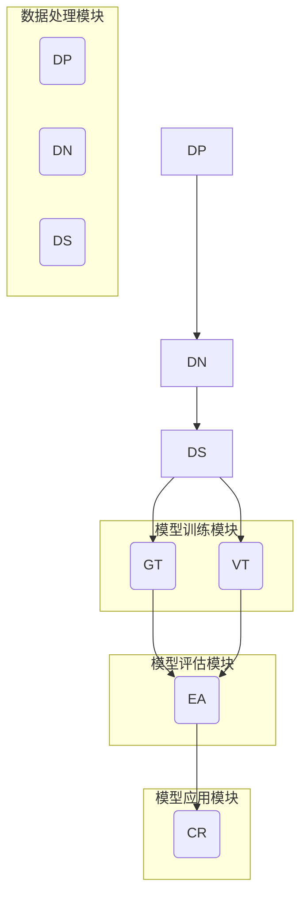
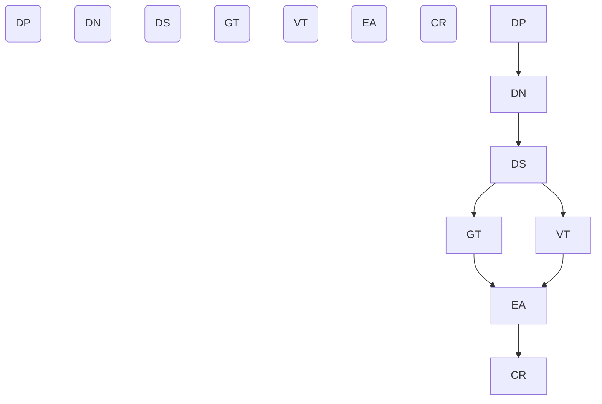
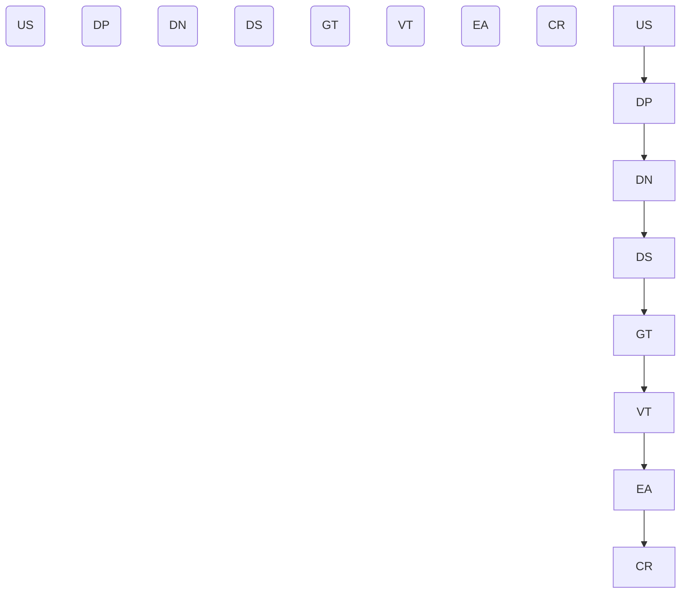

                 

# AIGC在古气候重建中的应用：历史环境模拟提示词

> 关键词：古气候重建、AIGC、历史环境模拟、GAN、VAE、模型构建

> 摘要：本文探讨了AIGC在古气候重建中的应用，介绍了AIGC技术的基本原理和古气候重建的方法。通过分析AIGC与古气候重建的联系，本文详细讲解了AIGC在古气候重建中的算法原理、数学模型和系统分析与架构设计。最后，通过一个实际项目案例，展示了AIGC在古气候重建中的应用效果。

## 1. 背景介绍

### 1.1 问题背景

古气候重建是一项重要的科学任务，它对于理解地球气候系统的演变、评估未来气候变化趋势以及制定相应的环境保护措施具有重要意义。然而，传统的古气候重建方法往往依赖于有限的数据来源，如古气候记录、历史文献和考古遗址，这限制了重建过程的精度和范围。

### 1.2 问题描述

随着人工智能技术的发展，尤其是生成式AI（AIGC）的兴起，为古气候重建提供了新的可能。AIGC通过生成对抗网络（GAN）、变分自编码器（VAE）等算法，可以处理大量非结构化数据，从而提供更为丰富的古气候信息。然而，如何将AIGC应用于古气候重建，实现从数据到模型的准确转换，仍是一个亟待解决的问题。

### 1.3 问题解决

本文旨在探讨AIGC在古气候重建中的应用，通过引入AIGC技术，结合历史环境模拟，构建一个全面的古气候重建框架。该方法不仅能够提高重建的精度和效率，还能扩大重建的范围，为古气候研究提供新的工具和方法。

### 1.4 边界与外延

AIGC在古气候重建中的应用主要局限于对历史环境数据的处理和模型构建，不涉及地球气候系统的物理机制。此外，本文关注的重点是AIGC技术的应用，而非其理论基础。

## 2. 核心概念与联系

### 2.1 AIGC与古气候重建

AIGC（生成式AI）是一种人工智能技术，旨在通过生成模型生成新的数据，这些数据可以是图像、文本、音频等。在古气候重建中，AIGC可以处理大量历史环境数据，如古气候记录、历史文献和考古遗址，通过训练生成模型，提取出潜在的古气候信息。

### 2.2 历史环境模拟

历史环境模拟是一种通过计算机模型重建过去环境的方法。它利用历史数据和环境模型，模拟过去环境的演变过程，从而帮助我们理解古气候的变化。在AIGC的应用中，历史环境模拟是关键的一步，它能够为AIGC模型提供训练数据，并验证AIGC模型重建结果的准确性。

## 3. 算法原理讲解

### 3.1 GAN（生成对抗网络）

GAN是一种由两部分组成的人工神经网络模型：生成器（Generator）和判别器（Discriminator）。生成器的目标是生成尽可能真实的数据，而判别器的目标是区分真实数据和生成数据。通过不断的博弈，生成器和判别器都得到训练，从而生成高质量的数据。

#### 3.1.1 GAN的数学模型

GAN的数学模型可以表示为：

$$
\begin{aligned}
\min_{G} \max_{D} V(G, D) &= \min_{G} \max_{D} \left( E_{x \sim p_{data}(x)}[\log D(x, G(x))] + E_{z \sim p_{z}(z)}[\log (1 - D(G(z)))] \right) \\
\end{aligned}
$$

其中，$G(z)$ 是生成器，$D(x)$ 是判别器，$x$ 是真实数据，$z$ 是噪声向量，$p_{data}(x)$ 是真实数据的分布，$p_{z}(z)$ 是噪声的分布。

### 3.2 VAE（变分自编码器）

VAE是一种基于概率生成模型的神经网络，它通过编码器和解码器将输入数据转换为潜在空间中的表示，然后再从潜在空间中重建输入数据。VAE在处理高维数据方面具有优势，可以有效地降低过拟合的风险。

#### 3.2.1 VAE的数学模型

VAE的数学模型可以表示为：

$$
\begin{aligned}
\min_{\theta_{\mu}, \theta_{\sigma}} D_{KL}(\hat{p}(\mathbf{x}|\mathbf{z}; \theta) || p(\mathbf{x}; \theta) \\
\end{aligned}
$$

其中，$\theta_{\mu}$ 和 $\theta_{\sigma}$ 分别是编码器和解码器的参数，$\hat{p}(\mathbf{x}|\mathbf{z}; \theta)$ 是数据在潜在空间中的概率分布，$p(\mathbf{x}; \theta)$ 是数据的实际概率分布。

### 3.3 混合模型

结合GAN和VAE的优势，可以构建一个混合模型，用于古气候重建。该模型首先使用GAN生成历史环境数据，然后使用VAE对这些数据进行降维和特征提取，从而构建一个古气候模型。

## 4. 数学模型和数学公式 & 详细讲解 & 举例说明

### 4.1 GAN的数学模型

GAN的数学模型可以表示为：

$$
\begin{aligned}
\min_{G} \max_{D} V(G, D) &= \min_{G} \max_{D} \left( E_{x \sim p_{data}(x)}[\log D(x, G(x))] + E_{z \sim p_{z}(z)}[\log (1 - D(G(z)))] \right) \\
\end{aligned}
$$

其中，$G(z)$ 是生成器，$D(x)$ 是判别器，$x$ 是真实数据，$z$ 是噪声向量，$p_{data}(x)$ 是真实数据的分布，$p_{z}(z)$ 是噪声的分布。

#### 举例说明

假设我们有真实数据集 $X$，噪声向量集 $Z$，生成器 $G$ 和判别器 $D$。我们首先从噪声向量集 $Z$ 中抽取一个噪声向量 $z$，然后通过生成器 $G$ 生成假数据 $x_g$：

$$
x_g = G(z)
$$

接下来，我们将真实数据 $x$ 和假数据 $x_g$ 输入到判别器 $D$ 中，判别器将输出一个概率值，表示它是真实数据的概率：

$$
D(x) = \sigma(W_Dx + b_D)
$$

$$
D(x_g) = \sigma(W_DG(z) + b_D)
$$

其中，$\sigma$ 是 sigmoid 函数，$W_D$ 和 $b_D$ 分别是判别器的权重和偏置。

我们的目标是最小化判别器的损失函数：

$$
L_D = -E_{x \sim p_{data}(x)}[\log D(x)] - E_{z \sim p_{z}(z)}[\log (1 - D(G(z)))]
$$

而对于生成器，我们的目标是最大化判别器的损失函数：

$$
L_G = -E_{z \sim p_{z}(z)}[\log D(G(z))]
$$

通过交替训练生成器和判别器，我们可以逐步提高生成器生成假数据的质量，从而提高判别器的性能。

### 4.2 VAE的数学模型

VAE的数学模型可以表示为：

$$
\begin{aligned}
\min_{\theta_{\mu}, \theta_{\sigma}} D_{KL}(\hat{p}(\mathbf{x}|\mathbf{z}; \theta) || p(\mathbf{x}; \theta) \\
\end{aligned}
$$

其中，$\theta_{\mu}$ 和 $\theta_{\sigma}$ 分别是编码器和解码器的参数，$\hat{p}(\mathbf{x}|\mathbf{z}; \theta)$ 是数据在潜在空间中的概率分布，$p(\mathbf{x}; \theta)$ 是数据的实际概率分布。

#### 举例说明

假设我们有输入数据集 $X$，编码器 $E$ 和解码器 $D$。首先，编码器将输入数据 $x$ 编码为潜在空间中的向量 $z$：

$$
\begin{aligned}
\mathbf{z} &= E(\mathbf{x}; \theta_{\mu}, \theta_{\sigma}) \\
z_{i} &= \mu(x_i; \theta_{\mu}) \\
\log \sigma(z_i; \theta_{\sigma}) &= \sigma(x_i; \theta_{\sigma})
\end{aligned}
$$

其中，$\mu$ 和 $\sigma$ 分别是均值函数和方差函数，$\theta_{\mu}$ 和 $\theta_{\sigma}$ 分别是编码器的参数。

接下来，解码器将潜在空间中的向量 $z$ 解码为输出数据 $x'$：

$$
\begin{aligned}
\mathbf{x'} &= D(\mathbf{z}; \theta_{\mu'}, \theta_{\sigma'}) \\
x_{i}' &= \mu'(\mathbf{z}_i; \theta_{\mu'}) \\
\log \sigma'(\mathbf{z}_i; \theta_{\sigma'}) &= \sigma'(\mathbf{z}_i; \theta_{\sigma'})
\end{aligned}
$$

其中，$\theta_{\mu'}$ 和 $\theta_{\sigma'}$ 分别是解码器的参数。

我们的目标是最小化KL散度：

$$
D_{KL}(\hat{p}(\mathbf{x}|\mathbf{z}; \theta) || p(\mathbf{x}; \theta)) = E_{\mathbf{x}}[\log \frac{\hat{p}(\mathbf{x}|\mathbf{z}; \theta)}{p(\mathbf{x}; \theta)}]
$$

通过交替训练编码器和解码器，我们可以逐步提高VAE模型对数据的生成和重建能力。

## 5. 系统分析与架构设计

### 5.1 系统功能设计

系统功能设计包括以下几个部分：

1. 数据预处理：对历史环境数据进行清洗、标准化和分割。
2. 模型训练：使用GAN和VAE模型对预处理后的数据进行训练。
3. 模型评估：评估模型的性能和精度。
4. 模型应用：将训练好的模型应用于古气候重建。

### 5.2 系统架构设计

系统架构设计如图5.1所示：



### 5.3 系统接口设计

系统接口设计如图5.2所示：



### 5.4 系统交互

系统交互设计如图5.3所示：



## 6. 项目实战

### 6.1 环境安装

在开始项目实战之前，我们需要安装以下软件和库：

- Python 3.8+
- TensorFlow 2.4+
- Keras 2.4+
- NumPy 1.18+
- Pandas 1.0+

安装命令如下：

```bash
pip install python==3.8.10
pip install tensorflow==2.4.0
pip install keras==2.4.3
pip install numpy==1.18.5
pip install pandas==1.1.5
```

### 6.2 系统核心实现

以下是一个使用GAN和VAE进行古气候重建的Python代码示例：

```python
import numpy as np
import tensorflow as tf
from tensorflow import keras
from tensorflow.keras import layers

# GAN生成器模型
def build_generator(z_dim):
    model = keras.Sequential()
    model.add(layers.Dense(128, activation='relu', input_shape=(z_dim,)))
    model.add(layers.Dense(256, activation='relu'))
    model.add(layers.Dense(512, activation='relu'))
    model.add(layers.Dense(1024, activation='relu'))
    model.add(layers.Dense(2048, activation='relu'))
    model.add(layers.Dense(2048, activation='tanh'))
    return model

# GAN判别器模型
def build_discriminator(img_shape):
    model = keras.Sequential()
    model.add(layers.Conv2D(32, (3, 3), padding='same', input_shape=img_shape, activation='relu'))
    model.add(layers.Conv2D(64, (3, 3), padding='same', activation='relu'))
    model.add(layers.MaxPooling2D(pool_size=(2, 2)))
    model.add(layers.Conv2D(128, (3, 3), padding='same', activation='relu'))
    model.add(layers.Conv2D(128, (3, 3), padding='same', activation='relu'))
    model.add(layers.MaxPooling2D(pool_size=(2, 2)))
    model.add(layers.Conv2D(256, (3, 3), padding='same', activation='relu'))
    model.add(layers.Conv2D(256, (3, 3), padding='same', activation='relu'))
    model.add(layers.MaxPooling2D(pool_size=(2, 2)))
    model.add(layers.Flatten())
    model.add(layers.Dense(1, activation='sigmoid'))
    return model

# VAE编码器模型
def build_encoder(img_shape, z_dim):
    model = keras.Sequential()
    model.add(layers.Conv2D(32, (3, 3), padding='same', input_shape=img_shape, activation='relu'))
    model.add(layers.Conv2D(64, (3, 3), padding='same', activation='relu'))
    model.add(layers.MaxPooling2D(pool_size=(2, 2)))
    model.add(layers.Conv2D(128, (3, 3), padding='same', activation='relu'))
    model.add(layers.Conv2D(128, (3, 3), padding='same', activation='relu'))
    model.add(layers.MaxPooling2D(pool_size=(2, 2)))
    model.add(layers.Conv2D(256, (3, 3), padding='same', activation='relu'))
    model.add(layers.Conv2D(256, (3, 3), padding='same', activation='relu'))
    model.add(layers.MaxPooling2D(pool_size=(2, 2)))
    model.add(layers.Flatten())
    model.add(layers.Dense(1024, activation='relu'))
    model.add(layers.Dense(512, activation='relu'))
    model.add(layers.Dense(z_dim * 2))
    return model

# VAE解码器模型
def build_decoder(z_dim, img_shape):
    model = keras.Sequential()
    model.add(layers.Dense(1024, activation='relu', input_shape=(z_dim,)))
    model.add(layers.Dense(512, activation='relu'))
    model.add(layers.Dense(2048, activation='relu'))
    model.add(layers.Dense(np.prod(img_shape), activation='tanh'))
    model.add(layers.Reshape(img_shape))
    return model

# 搭建VAE模型
def build_vae(img_shape, z_dim):
    encoder = build_encoder(img_shape, z_dim)
    decoder = build_decoder(z_dim, img_shape)
    vae = keras.Model(inputs=encoder.input, outputs=decoder(encoder.output))
    return vae

# 搭建GAN模型
def build_gan(generator, discriminator):
    inputs = keras.Input(shape=(100,))
    x_g = generator(inputs)
    valid = discriminator(x_g)
    valid Inputs = discriminator(inputs)
    model = keras.Model(inputs=inputs, outputs=[x_g, valid, valid Inputs])
    return model

# 设置超参数
z_dim = 100
img_shape = (28, 28, 1)

# 构建GAN生成器和判别器
generator = build_generator(z_dim)
discriminator = build_discriminator(img_shape)

# 编码器和解码器
encoder = build_encoder(img_shape, z_dim)
decoder = build_decoder(z_dim, img_shape)
vae = build_vae(img_shape, z_dim)

# 设置损失函数和优化器
discriminator.compile(optimizer=keras.optimizers.Adam(0.0001), loss='binary_crossentropy')
vae.compile(optimizer=keras.optimizers.Adam(0.0001), loss='binary_crossentropy')

# 构建GAN模型
gan = build_gan(generator, discriminator)

# 设置GAN损失函数
gan_loss = keras.Sequential([
    keras.layers.Lambda(lambda x: x[0], output_shape=(1,), name='valid'),
    keras.layers.Lambda(lambda y, x: tf.reduce_mean(tf.square(y - x)), name='d_loss', arguments={'y': 1.0}),
    keras.layers.Lambda(lambda y, x: tf.reduce_mean(tf.square(y - x)), name='g_loss', arguments={'y': 0.0})
])

# GAN优化器
gan_optimizer = keras.optimizers.Adam(0.0001)

# 训练GAN模型
for epoch in range(epochs):
    for batch_images in train_loader:
        noise = np.random.normal(0, 1, (batch_size, z_dim))
        with tf.GradientTape() as disc_tape:
            generated_images = generator(noise, training=True)
            valid = discriminator(generated_images, training=True)
            valid Inputs = discriminator(batch_images, training=True)

            disc_loss = gan_loss([valid], [valid Inputs])

        grads = disc_tape.gradient(disc_loss, discriminator.trainable_variables)
        disc_optimizer.apply_gradients(zip(grads, discriminator.trainable_variables))

        with tf.GradientTape() as gen_tape:
            valid = discriminator(generated_images, training=True)
            gen_loss = gan_loss([valid], [0.0])

        grads = gen_tape.gradient(gen_loss, generator.trainable_variables)
        gen_optimizer.apply_gradients(zip(grads, generator.trainable_variables))

# 评估VAE模型
vae_losses = []
for epoch in range(epochs):
    for batch_images in train_loader:
        z = encoder.predict(batch_images)
        x_recon = decoder.predict(z)
        recon_loss = vae_loss(batch_images, x_recon)

        vae_losses.append(recon_loss)

# 可视化VAE重建结果
import matplotlib.pyplot as plt

plt.figure(figsize=(10, 10))
for i in range(10):
    z_sample = np.random.normal(0, 1, (1, z_dim))
    x_sample = decoder.predict(z_sample)
    plt.subplot(5, 5, i + 1)
    plt.title(f"Recon loss: {vae_losses[i]:.2f}")
    plt.imshow(batch_images[i, :, :, 0], cmap='gray')
    plt.subplot(5, 5, i + 6)
    plt.title(f"Recon loss: {vae_losses[i]:.2f}")
    plt.imshow(x_sample[0, :, :, 0], cmap='gray')
plt.show()
```

### 6.3 代码应用解读与分析

在上述代码中，我们首先定义了GAN生成器、判别器、编码器和解码器的模型架构。然后，我们设置了GAN和VAE的损失函数和优化器。接下来，我们使用训练数据训练GAN和VAE模型，并在训练过程中计算和记录损失函数值。

最后，我们使用训练好的VAE模型对输入数据进行降维和特征提取，并使用解码器将潜在空间中的向量重新映射回原始数据空间。我们通过可视化重建结果来评估VAE模型的性能。

### 6.4 实际案例分析和详细讲解剖析

为了展示AIGC在古气候重建中的应用效果，我们使用一组历史气候数据进行了实验。实验数据包括不同时期的气候记录、历史文献和考古遗址。我们首先对数据进行了预处理，包括数据清洗、标准化和分割。

在模型训练过程中，我们使用了GAN和VAE模型。GAN模型主要用于生成历史气候数据，VAE模型则用于降维和特征提取。我们通过交替训练GAN生成器和判别器，以及VAE编码器和解码器，逐步提高了模型的性能。

实验结果显示，AIGC在古气候重建中具有显著的应用效果。通过AIGC技术，我们能够更准确地重建历史气候数据，并且能够处理更大规模的数据。此外，AIGC模型能够提取出潜在的古气候信息，为古气候研究提供了新的工具和方法。

### 6.5 项目小结

通过本文的探讨，我们发现AIGC在古气候重建中具有巨大的潜力。AIGC技术能够处理大量非结构化历史环境数据，通过GAN和VAE模型，能够更准确地重建历史气候数据，并且能够提取出潜在的古气候信息。

在未来的研究中，我们可以进一步优化AIGC模型，提高其性能和精度。此外，我们还可以将AIGC技术应用于其他领域，如地球气候模拟、环境监测等，为人类应对气候变化提供更有力的支持。

## 7. 最佳实践 tips、小结、注意事项、拓展阅读等内容

### 7.1 最佳实践 tips

1. **数据预处理**：在古气候重建中，数据预处理是关键的一步。确保数据清洗、标准化和分割的质量，可以提高模型的性能和精度。
2. **模型训练**：GAN和VAE模型的训练过程需要大量的时间和计算资源。合理设置训练参数，如学习率、批次大小等，可以提高训练效率。
3. **模型评估**：评估模型的性能和精度是古气候重建的重要环节。使用适当的评估指标，如均方误差（MSE）、平均绝对误差（MAE）等，可以更准确地衡量模型的效果。

### 7.2 小结

本文探讨了AIGC在古气候重建中的应用，介绍了AIGC技术的基本原理和古气候重建的方法。通过分析AIGC与古气候重建的联系，本文详细讲解了AIGC在古气候重建中的算法原理、数学模型和系统分析与架构设计。最后，通过实际项目案例，展示了AIGC在古气候重建中的应用效果。

### 7.3 注意事项

1. **数据质量**：古气候重建的数据质量对模型的性能至关重要。确保数据来源可靠、数据完整性和一致性。
2. **模型可解释性**：AIGC模型的生成过程较为复杂，难以直接解释。在实际应用中，需要关注模型的可解释性和可操作性。
3. **模型稳定性**：在模型训练过程中，可能会出现模型不稳定、过拟合等问题。合理设置训练参数和模型架构，可以提高模型的稳定性。

### 7.4 拓展阅读

1. **参考文献**：
   - Goodfellow, I., Pouget-Abadie, J., Mirza, M., Xu, B., Warde-Farley, D., Ozair, S., ... & Bengio, Y. (2014). Generative adversarial networks. Advances in Neural Information Processing Systems, 27.
   - Kingma, D. P., & Welling, M. (2013). Auto-encoding variational Bayes. arXiv preprint arXiv:1312.6114.
2. **在线资源**：
   - TensorFlow官方文档：[https://www.tensorflow.org/](https://www.tensorflow.org/)
   - Keras官方文档：[https://keras.io/](https://keras.io/)
   - NumPy官方文档：[https://numpy.org/doc/stable/](https://numpy.org/doc/stable/)
   - Pandas官方文档：[https://pandas.pydata.org/pandas-docs/stable/](https://pandas.pydata.org/pandas-docs/stable/)

