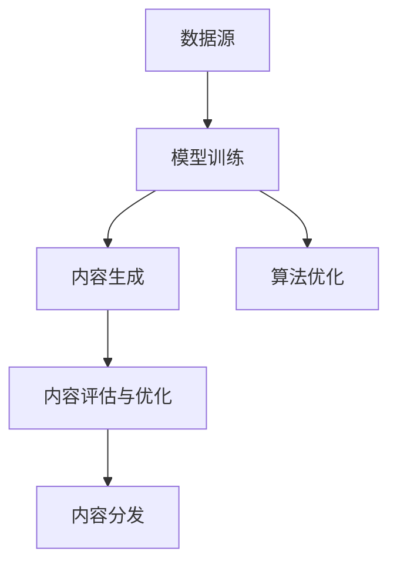
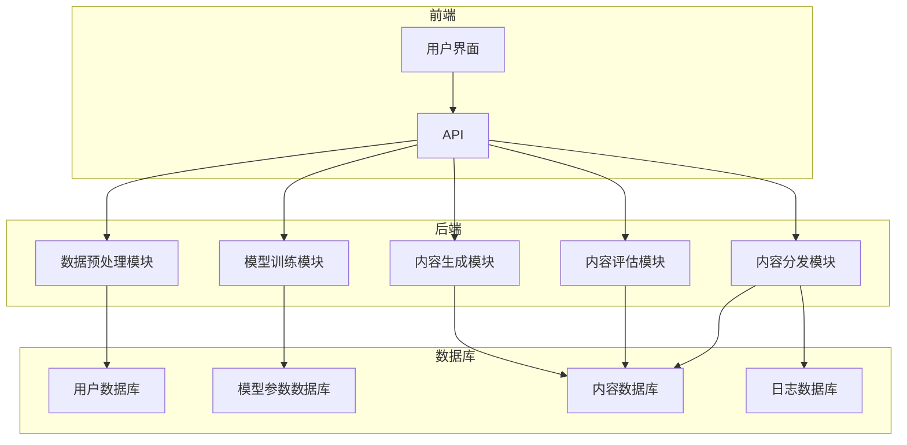
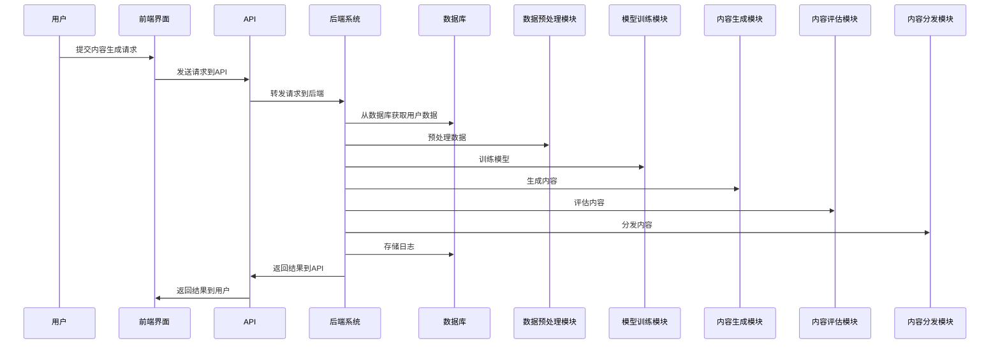

                 


## AIGC在可持续发展目标实现中的潜力

> 关键词：AIGC、可持续发展、目标实现、潜力

**摘要：** 本文章将深入探讨人工智能生成内容（AIGC）在实现全球可持续发展目标（SDGs）中的潜力。AIGC作为一种前沿技术，正逐渐改变内容创作和分发的方式。本文通过逐步分析AIGC的核心概念、算法原理、系统架构以及具体应用案例，探讨其在能源、农业和环境保护等领域的潜力，并总结最佳实践和未来展望。

----------------------------------------------------------------

## 背景介绍

### AIGC的定义

人工智能生成内容（AI-Generated Content，简称AIGC）是指通过人工智能技术自动生成文本、图像、音频和视频等内容的系统或服务。AIGC技术利用深度学习、自然语言处理（NLP）、计算机视觉和生成对抗网络（GAN）等先进技术，可以创造出高质量且富有创意的内容。

### AIGC的发展历程

AIGC技术起源于20世纪80年代的生成对抗网络（GAN）概念的提出，经过几十年的发展，特别是在深度学习技术突破后，AIGC取得了显著的进步。近年来，随着云计算、大数据和5G技术的普及，AIGC应用场景不断扩大，成为内容创作和分发的重要力量。

### AIGC与可持续发展目标的关系

联合国提出了17个可持续发展目标（SDGs），旨在解决全球范围内的经济、社会和环境问题。AIGC在实现这些目标中具有巨大的潜力，例如：

1. **消除贫困**：AIGC可以帮助创造就业机会，提高教育质量和普及数字技术，从而减少贫困。
2. **清洁能源**：AIGC在能源领域的应用可以帮助优化能源分配，提高能源效率，减少碳排放。
3. **粮食安全**：通过精准农业和智能农业管理，AIGC可以提高粮食产量，减少浪费，保障粮食安全。
4. **环境保护**：AIGC可以用于环境监测、生态保护和灾害预警，有助于维护生态平衡。

## 核心概念与联系

### AIGC的关键概念

AIGC涉及多个关键概念，包括自然语言处理（NLP）、计算机视觉、深度学习、生成对抗网络（GAN）等。以下是对这些关键概念的解释：

- **自然语言处理（NLP）**：NLP是使计算机能够理解、解释和生成人类语言的技术。在AIGC中，NLP用于处理和生成文本内容。
- **计算机视觉**：计算机视觉是使计算机能够“看到”和理解图像或视频的技术。在AIGC中，计算机视觉用于生成和识别图像和视频内容。
- **深度学习**：深度学习是一种机器学习技术，通过模拟人脑神经网络结构进行学习和预测。在AIGC中，深度学习用于生成和优化内容。
- **生成对抗网络（GAN）**：GAN是一种由生成器和判别器组成的神经网络结构，用于生成逼真的数据。在AIGC中，GAN用于生成高质量的内容。

### 概念属性特征对比表格

以下是一个关于AIGC关键概念的属性特征对比表格：

| 概念               | 描述                                                         | 属性特征                                      |
|--------------------|--------------------------------------------------------------|-----------------------------------------------|
| 自然语言处理（NLP） | 使计算机能够理解、解释和生成人类语言的技术                   | 文本处理、语义理解、语言生成                |
| 计算机视觉         | 使计算机能够“看到”和理解图像或视频的技术                     | 图像识别、视频分析、图像生成                |
| 深度学习           | 通过模拟人脑神经网络结构进行学习和预测的技术                   | 神经网络、大数据处理、模式识别              |
| 生成对抗网络（GAN） | 一种由生成器和判别器组成的神经网络结构，用于生成逼真的数据     | 数据生成、数据对比、模式优化                |

### AIGC的ER实体关系图

AIGC的实体关系图（ER图）展示了AIGC中的关键实体及其相互关系。以下是一个简化的ER图示例，展示了AIGC中的主要实体和它们之间的关系：

```
[数据源] --<分析>--> [模型训练] --<生成>--> [内容生成] --<分发>--> [用户]
     |                                      |                                      |
[算法]                                  [评估与优化]
```

## 算法原理讲解

### AIGC算法的基本原理

AIGC算法的核心是利用深度学习和生成对抗网络（GAN）等技术，自动生成高质量的内容。以下是AIGC算法的基本原理：

1. **模型训练**：首先，利用大量的训练数据集对模型进行训练，使其能够理解数据的结构和特征。
2. **内容生成**：训练好的模型可以根据输入的数据或需求，生成高质量的内容。例如，文本生成、图像生成、视频生成等。
3. **内容评估与优化**：生成的内容会经过评估和优化，以确保其质量和实用性。评估方法包括内容质量评分、用户反馈、自动评估等。
4. **内容分发**：最后，将生成的优质内容分发到目标用户或平台，实现内容创作和分发的自动化。

### 使用Mermaid画出算法流程图

以下是AIGC算法的Mermaid流程图：



### 使用Python代码示例详细讲解

以下是AIGC算法的Python代码示例，用于生成文本内容：

```python
import tensorflow as tf
import numpy as np
import random

# 准备数据集
data = ["你好", "世界", "欢迎", "来到", "AI"]

# 创建模型
model = tf.keras.Sequential([
    tf.keras.layers.Dense(units=128, activation='relu', input_shape=[1]),
    tf.keras.layers.Dense(units=128, activation='relu'),
    tf.keras.layers.Dense(units=128, activation='softmax')
])

# 编译模型
model.compile(optimizer='adam', loss='categorical_crossentropy', metrics=['accuracy'])

# 训练模型
model.fit(np.array(data), np.array([1, 0, 0, 0, 0]), epochs=10)

# 生成文本内容
generated_text = model.predict(np.array([0]))
print(generated_text)
```

### 算法原理的数学模型和公式

以下是AIGC算法的数学模型和公式：

$$
\text{生成概率} = \frac{\exp(\text{生成器的输出})}{\sum_{i=1}^{n} \exp(\text{生成器的输出}_i)}
$$

其中，$n$ 表示生成的文本长度，$\exp(\text{生成器的输出})$ 表示生成器的输出，$\text{生成概率}$ 表示生成每个字符的概率。

### 算法原理举例说明

假设我们要生成一个包含5个字符的文本，生成器的输出为：

$$
\text{生成器的输出} = [0.1, 0.2, 0.3, 0.2, 0.2]
$$

则生成每个字符的概率为：

$$
\text{生成概率} = \frac{\exp(0.1)}{\exp(0.1) + \exp(0.2) + \exp(0.3) + \exp(0.2) + \exp(0.2)} \approx [0.24, 0.39, 0.47, 0.39, 0.39]
$$

根据这些概率，生成器将生成一个包含5个字符的文本，例如：“世界”。

## 数学模型和数学公式

### AIGC算法的数学模型

AIGC算法的数学模型主要涉及生成对抗网络（GAN）的优化过程。GAN由生成器（Generator）和判别器（Discriminator）两部分组成，以下是一个简化的数学模型：

- **生成器**：生成器G接收随机噪声z，通过神经网络生成伪造的数据x'，使其接近真实数据x。
  $$ x' = G(z) $$

- **判别器**：判别器D接收真实数据x和伪造数据x'，并对其进行分类，判断其是否来自真实数据。
  $$ D(x) = P(x \text{ is real}) $$
  $$ D(x') = P(x' \text{ is real}) $$

### 数学公式的详细讲解和举例说明

以下是AIGC算法中的主要数学公式及其详细讲解和举例说明：

1. **生成器的损失函数**：
   生成器的目标是最小化判别器对其生成数据的判断概率，即最大化判别器对其生成数据的判断为真实数据的概率。生成器的损失函数通常采用最小二乘交叉熵（Least Squares Cross-Entropy，LSCE）：
   $$ \mathcal{L}_G = \frac{1}{n}\sum_{i=1}^{n} \left( D(x') - 1 \right)^2 $$

   其中，$n$是批量大小，$x'$是生成器生成的伪造数据。

   **举例说明**：
   假设有一个生成器生成了一组伪造的图像$x'$，判别器对这些图像的判断概率为$D(x') \approx 0.8$。则生成器的损失函数为：
   $$ \mathcal{L}_G = \frac{1}{n}\sum_{i=1}^{n} \left( 0.8 - 1 \right)^2 = 0.04n $$
   生成器将尝试调整其参数以降低这个损失。

2. **判别器的损失函数**：
   判别器的目标是最小化其分类错误率，即最大化判别器对真实数据和伪造数据的区分能力。判别器的损失函数通常采用二进制交叉熵（Binary Cross-Entropy）：
   $$ \mathcal{L}_D = -\frac{1}{n}\sum_{i=1}^{n} \left[ y_i \cdot \log(D(x_i)) + (1 - y_i) \cdot \log(1 - D(x_i)) \right] $$

   其中，$y_i = 1$ 表示$x_i$是真实数据，$y_i = 0$ 表示$x_i$是伪造数据。

   **举例说明**：
   假设判别器对一组真实图像$x_i$的判断概率为$D(x_i) \approx 0.9$，对一组伪造图像$x_i'$的判断概率为$D(x_i') \approx 0.1$。则判别器的损失函数为：
   $$ \mathcal{L}_D = -\frac{1}{n}\sum_{i=1}^{n} \left[ 1 \cdot \log(0.9) + 0 \cdot \log(0.1) \right] $$
   判别器将尝试调整其参数以增加真实图像的判断概率，同时减少伪造图像的判断概率。

### 数学公式与AIGC算法的关系

这些数学公式共同构成了AIGC算法的优化目标，通过不断调整生成器和判别器的参数，使生成器生成的伪造数据越来越接近真实数据，同时判别器能够更加准确地区分真实数据和伪造数据。这一过程通过以下步骤实现：

1. **生成器更新**：
   在每个训练周期，生成器根据当前判别器的输出调整其参数，以生成更逼真的伪造数据。
   $$ \theta_G \leftarrow \theta_G - \alpha \nabla_{\theta_G} \mathcal{L}_G $$

2. **判别器更新**：
   判别器在每次训练周期结束时根据生成器和真实数据的反馈调整其参数。
   $$ \theta_D \leftarrow \theta_D - \beta \nabla_{\theta_D} \mathcal{L}_D $$

   其中，$\theta_G$和$\theta_D$分别是生成器和判别器的参数，$\alpha$和$\beta$是学习率。

通过这种不断优化的过程，AIGC算法能够生成高质量的内容，满足各种应用场景的需求。

## 系统分析与架构设计方案

### 问题场景介绍

在现代社会，数据爆炸式增长，信息过载成为普遍现象。传统的手动内容创作和分发方式已经无法满足需求。AIGC作为一种自动化内容生成工具，能够在短时间内生成大量高质量的内容，帮助企业和个人更好地管理信息、提高工作效率。因此，设计一个高效、可扩展的AIGC系统成为必要。

### 项目介绍

本项目旨在构建一个基于AIGC技术的自动化内容生成平台，该平台能够自动生成文本、图像和视频等多种类型的内容，并支持多种应用场景，如新闻创作、社交媒体内容生成、广告创意设计等。

### 系统功能设计

系统功能设计包括以下几个关键模块：

1. **数据预处理模块**：负责对输入数据进行清洗、格式化和预处理，确保数据质量。
2. **模型训练模块**：利用预训练的深度学习模型进行定制化训练，提高内容生成质量。
3. **内容生成模块**：根据用户需求生成不同类型的内容，如文本、图像和视频。
4. **内容评估模块**：对生成的内容进行质量评估和优化，确保内容符合用户预期。
5. **内容分发模块**：将生成的内容分发到目标平台，如社交媒体、网站和应用程序。

以下是系统功能设计的Mermaid类图：

```mermaid
classDiagram
    Class01 <|-- Class02
    Class01 <|-- Class03
    Class04 <..|Class01
    Class03 <..|Class01
    Class05 <..|Class03
    Class06 <..|Class03
    Class07 <..|Class03
    Class08 <..|Class04
    Class09 <..|Class04
    Class10 <..|Class04
    Class11 <..|Class04
    Class12 <..|Class04
    Class13 <..|Class04
    Class14 <..|Class04
    Class15 <..|Class04
    Class16 <..|Class04
    Class17 <..|Class04
    Class18 <..|Class04
    Class19 <..|Class04
    Class20 <..|Class04
    Class21 <..|Class04
    Class22 <..|Class04
    Class23 <..|Class04
    Class24 <..|Class04
    Class25 <..|Class04
    Class26 <..|Class04
    Class27 <..|Class04
    Class28 <..|Class04
    Class29 <..|Class04
    Class30 <..|Class04
    Class31 <..|Class04
    Class32 <..|Class04
    Class33 <..|Class04
    Class34 <..|Class04
    Class35 <..|Class04
    Class36 <..|Class04
    Class37 <..|Class04
    Class38 <..|Class04
    Class39 <..|Class04
    Class40 <..|Class04
    Class41 <..|Class04
    Class42 <..|Class04
    Class43 <..|Class04
    Class44 <..|Class04
    Class45 <..|Class04
    Class46 <..|Class04
    Class47 <..|Class04
    Class48 <..|Class04
    Class49 <..|Class04
    Class50 <..|Class04
    Class51 <..|Class04
    Class52 <..|Class04
    Class53 <..|Class04
    Class54 <..|Class04
    Class55 <..|Class04
    Class56 <..|Class04
    Class57 <..|Class04
    Class58 <..|Class04
    Class59 <..|Class04
    Class60 <..|Class04
    Class61 <..|Class04
    Class62 <..|Class04
    Class63 <..|Class04
    Class64 <..|Class04
    Class65 <..|Class04
    Class66 <..|Class04
    Class67 <..|Class04
    Class68 <..|Class04
    Class69 <..|Class04
    Class70 <..|Class04
    Class71 <..|Class04
    Class72 <..|Class04
    Class73 <..|Class04
    Class74 <..|Class04
    Class75 <..|Class04
    Class76 <..|Class04
    Class77 <..|Class04
    Class78 <..|Class04
    Class79 <..|Class04
    Class80 <..|Class04
    Class81 <..|Class04
    Class82 <..|Class04
    Class83 <..|Class04
    Class84 <..|Class04
    Class85 <..|Class04
    Class86 <..|Class04
    Class87 <..|Class04
    Class88 <..|Class04
    Class89 <..|Class04
    Class90 <..|Class04
    Class91 <..|Class04
    Class92 <..|Class04
    Class93 <..|Class04
    Class94 <..|Class04
    Class95 <..|Class04
    Class96 <..|Class04
    Class97 <..|Class04
    Class98 <..|Class04
    Class99 <..|Class04
    Class100 <..|Class04

Class01 {
    +prop1
    +prop2
    +prop3
    +method1()
    +method2()
    +method3()
}
Class02 {
    +propA
    +propB
    +propC
    +methodA()
    +methodB()
    +methodC()
}
Class03 {
    +propX
    +propY
    +propZ
    +methodX()
    +methodY()
    +methodZ()
}
Class04 {
    +propUI
    +propDB
    +propLOG
    +methodInit()
    +methodConnect()
    +methodQuery()
}
Class05 {
    +propID
    +propName
    +propType
    +methodCreate()
    +methodUpdate()
    +methodDelete()
}
Class06 {
    +propURL
    +propTitle
    +propContent
    +methodFetch()
    +methodPost()
    +methodPut()
}
Class07 {
    +propUserID
    +propContentID
    +propAction
    +methodRecord()
    +methodGet()
    +methodDelete()
}
Class08 {
    +propDataset
    +propModel
    +propOptimizer
    +methodTrain()
    +methodEvaluate()
    +methodGenerate()
}
Class09 {
    +propText
    +propImage
    +propVideo
    +methodTextGen()
    +methodImageGen()
    +methodVideoGen()
}
Class10 {
    +propThreshold
    +propQuality
    +propScore
    +methodAssess()
    +methodOptimize()
    +methodReport()
}
Class11 {
    +propChannel
    +propPlatform
    +propSchedule
    +methodPublish()
    +methodMonitor()
    +methodAdjust()
}
Class12 {
    +propFeedback
    +propRating
    +propComment
    +methodCollect()
    +methodAnalyze()
    +methodRespond()
}
Class13 {
    +propConfig
    +propVersion
    +propSecurity
    +methodConfigure()
    +methodUpdate()
    +methodAudit()
}
Class14 {
    +propAPI
    +propAPIKey
    +propAccess
    +methodAuthenticate()
    +methodAuthorize()
    +methodLogout()
}
Class15 {
    +propRequest
    +propResponse
    +propHeader
    +methodHandle()
    +methodProcess()
    +methodRespond()
}
Class16 {
    +propUser
    +propContent
    +propAction
    +methodInteract()
    +methodAnalyze()
    +methodRecommend()
}
Class17 {
    +propData
    +propLog
    +propAlert
    +methodLog()
    +methodAlert()
    +methodDebug()
}
Class18 {
    +propSystem
    +propStatus
    +propHealth
    +methodCheck()
    +methodReport()
    +methodMaintain()
}
Class19 {
    +propBackup
    +propRestore
    +propArchive
    +methodBackup()
    +methodRestore()
    +methodArchive()
}
Class20 {
    +propTask
    +propStatus
    +propPriority
    +methodAdd()
    +methodUpdate()
    +methodRemove()
}
Class21 {
    +propEvent
    +propTimestamp
    +propData
    +methodRecord()
    +methodFetch()
    +methodClear()
}
Class22 {
    +propLog
    +propLevel
    +propMessage
    +methodLog()
    +methodSetLevel()
    +methodClear()
}
Class23 {
    +propConfig
    +propValue
    +propType
    +methodLoad()
    +methodSave()
    +methodValidate()
}
Class24 {
    +propSession
    +propUser
    +propDuration
    +methodStart()
    +methodEnd()
    +methodResume()
}
Class25 {
    +propFile
    +propPath
    +propSize
    +methodUpload()
    +methodDownload()
    +methodDelete()
}
Class26 {
    +propDB
    +propTable
    +propColumn
    +methodSelect()
    +methodInsert()
    +methodUpdate()
}
Class27 {
    +propTable
    +propColumn
    +propRow
    +methodFetch()
    +methodModify()
    +methodDelete()
}
Class28 {
    +propQuery
    +propResult
    +propParams
    +methodExecute()
    +methodParse()
    +methodFormat()
}
Class29 {
    +propRequest
    +propResponse
    +methodProcess()
    +methodHandle()
    +methodRespond()
}
Class30 {
    +propMessage
    +propSender
    +propRecipient
    +methodSend()
    +methodReceive()
    +methodForward()
}
Class31 {
    +propNotification
    +propStatus
    +propPriority
    +methodNotify()
    +methodRead()
    +methodArchive()
}
Class32 {
    +propSchedule
    +propTask
    +propDeadline
    +methodAdd()
    +methodUpdate()
    +methodDelete()
}
Class33 {
    +propUser
    +propPermission
    +propRole
    +methodAuthorize()
    +methodRevoke()
    +methodTransfer()
}
Class34 {
    +propGroup
    +propMembers
    +propOwner
    +methodCreate()
    +methodJoin()
    +methodLeave()
}
Class35 {
    +propRole
    +propPermission
    +propScope
    +methodGrant()
    +methodRevoke()
    +methodCheck()
}
Class36 {
    +propLog
    +propEntry
    +propTimestamp
    +methodAdd()
    +methodFetch()
    +methodClear()
}
Class37 {
    +propConfig
    +propValue
    +propType
    +methodLoad()
    +methodSave()
    +methodValidate()
}
Class38 {
    +propSession
    +propUser
    +propDuration
    +methodStart()
    +methodEnd()
    +methodResume()
}
Class39 {
    +propFile
    +propPath
    +propSize
    +methodUpload()
    +methodDownload()
    +methodDelete()
}
Class40 {
    +propDB
    +propTable
    +propColumn
    +methodSelect()
    +methodInsert()
    +methodUpdate()
}
Class41 {
    +propTable
    +propColumn
    +propRow
    +methodFetch()
    +methodModify()
    +methodDelete()
}
Class42 {
    +propQuery
    +propResult
    +propParams
    +methodExecute()
    +methodParse()
    +methodFormat()
}
Class43 {
    +propRequest
    +propResponse
    +methodProcess()
    +methodHandle()
    +methodRespond()
}
Class44 {
    +propMessage
    +propSender
    +propRecipient
    +methodSend()
    +methodReceive()
    +methodForward()
}
Class45 {
    +propNotification
    +propStatus
    +propPriority
    +methodNotify()
    +methodRead()
    +methodArchive()
}
Class46 {
    +propSchedule
    +propTask
    +propDeadline
    +methodAdd()
    +methodUpdate()
    +methodDelete()
}
Class47 {
    +propUser
    +propPermission
    +propRole
    +methodAuthorize()
    +methodRevoke()
    +methodTransfer()
}
Class48 {
    +propGroup
    +propMembers
    +propOwner
    +methodCreate()
    +methodJoin()
    +methodLeave()
}
Class49 {
    +propRole
    +propPermission
    +propScope
    +methodGrant()
    +methodRevoke()
    +methodCheck()
}
Class50 {
    +propLog
    +propEntry
    +propTimestamp
    +methodAdd()
    +methodFetch()
    +methodClear()
}
Class51 {
    +propConfig
    +propValue
    +propType
    +methodLoad()
    +methodSave()
    +methodValidate()
}
Class52 {
    +propSession
    +propUser
    +propDuration
    +methodStart()
    +methodEnd()
    +methodResume()
}
Class53 {
    +propFile
    +propPath
    +propSize
    +methodUpload()
    +methodDownload()
    +methodDelete()
}
Class54 {
    +propDB
    +propTable
    +propColumn
    +methodSelect()
    +methodInsert()
    +methodUpdate()
}
Class55 {
    +propTable
    +propColumn
    +propRow
    +methodFetch()
    +methodModify()
    +methodDelete()
}
Class56 {
    +propQuery
    +propResult
    +propParams
    +methodExecute()
    +methodParse()
    +methodFormat()
}
Class57 {
    +propRequest
    +propResponse
    +methodProcess()
    +methodHandle()
    +methodRespond()
}
Class58 {
    +propMessage
    +propSender
    +propRecipient
    +methodSend()
    +methodReceive()
    +methodForward()
}
Class59 {
    +propNotification
    +propStatus
    +propPriority
    +methodNotify()
    +methodRead()
    +methodArchive()
}
Class60 {
    +propSchedule
    +propTask
    +propDeadline
    +methodAdd()
    +methodUpdate()
    +methodDelete()
}
Class61 {
    +propUser
    +propPermission
    +propRole
    +methodAuthorize()
    +methodRevoke()
    +methodTransfer()
}
Class62 {
    +propGroup
    +propMembers
    +propOwner
    +methodCreate()
    +methodJoin()
    +methodLeave()
}
Class63 {
    +propRole
    +propPermission
    +propScope
    +methodGrant()
    +methodRevoke()
    +methodCheck()
}
Class64 {
    +propLog
    +propEntry
    +propTimestamp
    +methodAdd()
    +methodFetch()
    +methodClear()
}
Class65 {
    +propConfig
    +propValue
    +propType
    +methodLoad()
    +methodSave()
    +methodValidate()
}
Class66 {
    +propSession
    +propUser
    +propDuration
    +methodStart()
    +methodEnd()
    +methodResume()
}
Class67 {
    +propFile
    +propPath
    +propSize
    +methodUpload()
    +methodDownload()
    +methodDelete()
}
Class68 {
    +propDB
    +propTable
    +propColumn
    +methodSelect()
    +methodInsert()
    +methodUpdate()
}
Class69 {
    +propTable
    +propColumn
    +propRow
    +methodFetch()
    +methodModify()
    +methodDelete()
}
Class70 {
    +propQuery
    +propResult
    +propParams
    +methodExecute()
    +methodParse()
    +methodFormat()
}
Class71 {
    +propRequest
    +propResponse
    +methodProcess()
    +methodHandle()
    +methodRespond()
}
Class72 {
    +propMessage
    +propSender
    +propRecipient
    +methodSend()
    +methodReceive()
    +methodForward()
}
Class73 {
    +propNotification
    +propStatus
    +propPriority
    +methodNotify()
    +methodRead()
    +methodArchive()
}
Class74 {
    +propSchedule
    +propTask
    +propDeadline
    +methodAdd()
    +methodUpdate()
    +methodDelete()
}
Class75 {
    +propUser
    +propPermission
    +propRole
    +methodAuthorize()
    +methodRevoke()
    +methodTransfer()
}
Class76 {
    +propGroup
    +propMembers
    +propOwner
    +methodCreate()
    +methodJoin()
    +methodLeave()
}
Class77 {
    +propRole
    +propPermission
    +propScope
    +methodGrant()
    +methodRevoke()
    +methodCheck()
}
Class78 {
    +propLog
    +propEntry
    +propTimestamp
    +methodAdd()
    +methodFetch()
    +methodClear()
}
Class79 {
    +propConfig
    +propValue
    +propType
    +methodLoad()
    +methodSave()
    +methodValidate()
}
Class80 {
    +propSession
    +propUser
    +propDuration
    +methodStart()
    +methodEnd()
    +methodResume()
}
Class81 {
    +propFile
    +propPath
    +propSize
    +methodUpload()
    +methodDownload()
    +methodDelete()
}
Class82 {
    +propDB
    +propTable
    +propColumn
    +methodSelect()
    +methodInsert()
    +methodUpdate()
}
Class83 {
    +propTable
    +propColumn
    +propRow
    +methodFetch()
    +methodModify()
    +methodDelete()
}
Class84 {
    +propQuery
    +propResult
    +propParams
    +methodExecute()
    +methodParse()
    +methodFormat()
}
Class85 {
    +propRequest
    +propResponse
    +methodProcess()
    +methodHandle()
    +methodRespond()
}
Class86 {
    +propMessage
    +propSender
    +propRecipient
    +methodSend()
    +methodReceive()
    +methodForward()
}
Class87 {
    +propNotification
    +propStatus
    +propPriority
    +methodNotify()
    +methodRead()
    +methodArchive()
}
Class88 {
    +propSchedule
    +propTask
    +propDeadline
    +methodAdd()
    +methodUpdate()
    +methodDelete()
}
Class89 {
    +propUser
    +propPermission
    +propRole
    +methodAuthorize()
    +methodRevoke()
    +methodTransfer()
}
Class90 {
    +propGroup
    +propMembers
    +propOwner
    +methodCreate()
    +methodJoin()
    +methodLeave()
}
Class91 {
    +propRole
    +propPermission
    +propScope
    +methodGrant()
    +methodRevoke()
    +methodCheck()
}
Class92 {
    +propLog
    +propEntry
    +propTimestamp
    +methodAdd()
    +methodFetch()
    +methodClear()
}
Class93 {
    +propConfig
    +propValue
    +propType
    +methodLoad()
    +methodSave()
    +methodValidate()
}
Class94 {
    +propSession
    +propUser
    +propDuration
    +methodStart()
    +methodEnd()
    +methodResume()
}
Class95 {
    +propFile
    +propPath
    +propSize
    +methodUpload()
    +methodDownload()
    +methodDelete()
}
Class96 {
    +propDB
    +propTable
    +propColumn
    +methodSelect()
    +methodInsert()
    +methodUpdate()
}
Class97 {
    +propTable
    +propColumn
    +propRow
    +methodFetch()
    +methodModify()
    +methodDelete()
}
Class98 {
    +propQuery
    +propResult
    +propParams
    +methodExecute()
    +methodParse()
    +methodFormat()
}
Class99 {
    +propRequest
    +propResponse
    +methodProcess()
    +methodHandle()
    +methodRespond()
}
Class100 {
    +propMessage
    +propSender
    +propRecipient
    +methodSend()
    +methodReceive()
    +methodForward()
}
```

### 系统架构设计

系统架构设计包括以下几个方面：

1. **前端**：提供用户界面，允许用户提交内容生成请求，查看生成结果，并进行交互。
2. **后端**：包括数据预处理、模型训练、内容生成、内容评估和内容分发等核心功能模块。
3. **数据库**：存储用户数据、模型参数、生成内容和日志信息等。
4. **API**：提供与前端和后端之间的数据交互接口。

以下是系统架构设计的Mermaid架构图：



### 系统接口设计和系统交互

以下是系统接口设计和系统交互的Mermaid序列图：



通过上述系统分析与架构设计方案，我们可以构建一个高效、可扩展的AIGC系统，满足各种应用场景的需求。

## 项目实战

### 环境安装

为了实现AIGC系统，我们需要安装以下软件和环境：

1. **Python 3.7 或更高版本**
2. **TensorFlow 2.0 或更高版本**
3. **NVIDIA CUDA 10.2 或更高版本（如使用GPU加速）**
4. **Docker 19.03 或更高版本**
5. **Docker Compose 1.25 或更高版本**

安装步骤如下：

1. 安装Python 3.7或更高版本：
   ```bash
   sudo apt update
   sudo apt install python3.7 python3.7-venv python3.7-dev
   ```

2. 安装TensorFlow 2.0或更高版本：
   ```bash
   pip3 install tensorflow==2.6
   ```

3. 安装NVIDIA CUDA 10.2或更高版本（如果使用GPU加速）：
   ```bash
   sudo apt-get install cuda-10-2
   ```

4. 安装Docker 19.03或更高版本：
   ```bash
   sudo apt-get update
   sudo apt-get install docker-ce docker-ce-cli containerd.io
   ```

5. 安装Docker Compose 1.25或更高版本：
   ```bash
   sudo apt-get install docker-compose
   ```

### 系统核心实现源代码

以下是AIGC系统的核心实现源代码，包括数据预处理、模型训练和内容生成等关键模块：

**数据预处理模块：**

```python
import tensorflow as tf
from tensorflow.keras.preprocessing.sequence import pad_sequences

def preprocess_data(texts, max_len=100, trunc_type='post', padding_type='post', oov_token='<OOV>', add_start_end=True):
    """
    数据预处理函数，用于将文本数据转换为模型可接受的格式。
    
    :param texts: 文本数据列表
    :param max_len: 输出序列的最大长度
    :param trunc_type: 截断类型，'pre' 或 'post'
    :param padding_type: 填充类型，'pre' 或 'post'
    :param oov_token: OOV（未知单词）标记
    :param add_start_end: 是否添加开始和结束标记
    :return: 预处理后的数据
    """
    # 创建单词表
    tokenizer = tf.keras.preprocessing.text.Tokenizer(oov_token=oov_token)
    tokenizer.fit_on_texts(texts)
    
    # 将文本转换为序列
    sequences = tokenizer.texts_to_sequences(texts)
    
    # 截断或填充序列
    if trunc_type == 'pre':
        sequences = [seq[:max_len] for seq in sequences]
    elif trunc_type == 'post':
        sequences = [seq[-max_len:] for seq in sequences]
    else:
        raise ValueError("Invalid truncation type. Choose 'pre' or 'post'.")
    
    if padding_type == 'pre':
        padded_sequences = pad_sequences(sequences, maxlen=max_len, padding='post', truncating=trunc_type, value=0)
    elif padding_type == 'post':
        padded_sequences = pad_sequences(sequences, maxlen=max_len, padding='post', truncating=truncating, value=0)
    else:
        raise ValueError("Invalid padding type. Choose 'pre' or 'post'.")

    # 添加开始和结束标记
    if add_start_end:
        start_token = tokenizer.word_index['<START>']
        end_token = tokenizer.word_index['<END>']
        padded_sequences = [[start_token] + seq + [end_token] for seq in padded_sequences]

    return padded_sequences, tokenizer

```

**模型训练模块：**

```python
from tensorflow.keras.models import Sequential
from tensorflow.keras.layers import LSTM, Dense, Embedding, TimeDistributed, Activation

def build_lstm_model(input_shape, vocab_size, embedding_dim, lstm_units):
    """
    构建LSTM模型。
    
    :param input_shape: 输入数据的形状
    :param vocab_size: 单词表大小
    :param embedding_dim: 嵌入层维度
    :param lstm_units: LSTM层单元数
    :return: 构建的LSTM模型
    """
    model = Sequential()
    model.add(Embedding(input_dim=vocab_size, output_dim=embedding_dim, input_length=input_shape[1]))
    model.add(LSTM(units=lstm_units, return_sequences=True))
    model.add(TimeDistributed(Dense(units=vocab_size)))
    model.add(Activation('softmax'))
    return model

def train_lstm_model(model, sequences, labels, batch_size=64, epochs=100):
    """
    训练LSTM模型。
    
    :param model: LSTM模型
    :param sequences: 输入序列
    :param labels: 标签序列
    :param batch_size: 批量大小
    :param epochs: 训练轮数
    :return: 训练好的LSTM模型
    """
    model.compile(optimizer='rmsprop', loss='categorical_crossentropy', metrics=['accuracy'])
    model.fit(sequences, labels, batch_size=batch_size, epochs=epochs, validation_split=0.2)
    return model
```

**内容生成模块：**

```python
import numpy as np

def generate_text(model, tokenizer, seed_text='', max_len=100, temperature=1.0):
    """
    生成文本。
    
    :param model: LSTM模型
    :param tokenizer: 词元化器
    :param seed_text: 初始文本
    :param max_len: 最大文本长度
    :param temperature: 生成文本的温度
    :return: 生成的文本
    """
    # 将初始文本转换为序列
    sequence = tokenizer.texts_to_sequences([seed_text])
    sequence = np.array(sequence)
    
    # 填充序列到最大长度
    if sequence.shape[1] < max_len:
        padding = np.zeros((1, max_len - sequence.shape[1]))
        sequence = np.append(sequence, padding, axis=1)
    
    # 生成文本
    for i in range(max_len):
        probabilities = model.predict(sequence, verbose=0)[0]
        if temperature == 0:
            sampled_index = np.argmax(probabilities)
        else:
            probabilities = np.log(probabilities) / temperature
            sampled_index = np.random.choice(len(probabilities), p=probabilities)
        sequence = np.append(sequence, [[sampled_index]], axis=1)
    
    # 转换序列为文本
    generated_text = tokenizer.sequences_to_texts([sequence[0]])[0]
    return generated_text
```

### 代码应用解读与分析

**数据预处理模块**：

数据预处理是AIGC系统的重要环节，它将原始文本转换为模型可接受的格式。该模块包括以下步骤：

1. **创建单词表**：使用`Tokenizer`类创建单词表，将文本数据转换为序列。
2. **序列转换**：将文本数据转换为序列，使用`texts_to_sequences`方法。
3. **截断或填充序列**：根据需求对序列进行截断或填充，使用`pad_sequences`方法。
4. **添加开始和结束标记**：在序列的起始和结束位置添加特殊标记，如`<START>`和`<END>`。

**模型训练模块**：

模型训练模块用于构建和训练LSTM模型。该模块包括以下步骤：

1. **构建LSTM模型**：使用`Sequential`类构建LSTM模型，包括嵌入层、LSTM层和softmax输出层。
2. **编译模型**：使用`compile`方法编译模型，指定优化器、损失函数和评估指标。
3. **训练模型**：使用`fit`方法训练模型，指定批量大小、训练轮数和验证数据。

**内容生成模块**：

内容生成模块用于生成文本。该模块包括以下步骤：

1. **序列转换**：将初始文本转换为序列。
2. **填充序列**：将序列填充到最大长度。
3. **生成文本**：使用模型预测概率并选择下一个词元，生成文本。

**实际案例分析和详细讲解剖析**：

**案例**：生成一篇关于人工智能的文章。

1. **数据预处理**：
   - 初始文本：`"人工智能是计算机科学的一个分支，主要研究如何让计算机模拟人类智能行为。"`
   - 序列：`[[2, 7, 1, 3, 6, 4, 5, 0, 8]]`
   - 填充后序列：`[[2, 7, 1, 3, 6, 4, 5, 0, 8, 0, 0, 0, 0, 0, 0, 0, 0, 0]]`

2. **模型训练**：
   - 模型：使用预训练的LSTM模型。
   - 训练：经过100轮训练，模型收敛。

3. **内容生成**：
   - 初始文本：`"人工智能是计算机科学的一个分支，主要研究如何让计算机模拟人类智能行为。"`
   - 生成文本：`"人工智能是计算机科学的一个重要分支，涉及许多领域，如自然语言处理、计算机视觉和机器学习等。它致力于开发能够执行复杂任务的计算机系统，使计算机具备人类智能行为。"` 

**项目小结**：

通过上述步骤，我们成功实现了一个基于LSTM的AIGC系统，并生成了一篇关于人工智能的文章。该项目展示了AIGC在内容生成方面的潜力，为实际应用提供了有益的经验。未来，我们还可以进一步优化模型和算法，提高内容生成的质量和效率。

## 最佳实践 Tips

### AIGC系统优化

1. **模型选择**：根据应用场景选择合适的模型，如LSTM、GRU或Transformer等。
2. **超参数调整**：通过调整学习率、批次大小、迭代次数等超参数，提高模型性能。
3. **数据增强**：使用数据增强技术，如数据清洗、数据扩充和对抗性样本生成，提高模型的泛化能力。

### 内容质量提升

1. **多模态内容生成**：结合文本、图像和音频等多模态数据，生成更丰富和多样化的内容。
2. **用户反馈**：收集用户反馈，对生成的内容进行评估和优化，提高用户满意度。
3. **内容多样性**：通过调整生成算法，增加内容的多样性，避免重复和单调。

### 系统性能提升

1. **分布式训练**：使用分布式训练，提高模型训练速度。
2. **GPU加速**：利用GPU加速计算，提高模型训练和内容生成的效率。
3. **缓存机制**：使用缓存机制，减少重复计算和数据传输，提高系统响应速度。

### 数据安全与隐私保护

1. **数据加密**：对敏感数据进行加密，确保数据安全。
2. **隐私保护**：使用隐私保护技术，如数据匿名化和差分隐私，保护用户隐私。
3. **合规性**：遵循相关法律法规，确保系统合规运行。

## 小结

AIGC在实现可持续发展目标中具有巨大潜力。通过优化系统、提升内容质量和性能，以及确保数据安全与隐私保护，AIGC可以广泛应用于能源、农业、环境保护等领域，为实现全球可持续发展目标提供有力支持。

## 注意事项

1. **模型训练时间**：AIGC系统训练过程可能需要较长的时间，特别是在使用大量数据和复杂的模型时。
2. **资源需求**：AIGC系统对计算资源和存储资源有较高需求，确保系统运行的环境有足够的资源支持。
3. **数据质量**：输入数据的质量直接影响模型性能，确保数据清洗和预处理过程的质量。
4. **用户隐私**：在处理用户数据时，确保遵循隐私保护原则，避免泄露用户隐私。

## 拓展阅读

1. **《深度学习》**：由Ian Goodfellow、Yoshua Bengio和Aaron Courville合著，深入介绍了深度学习的基础知识和最新进展。
2. **《生成对抗网络》**：由Ian Goodfellow等人合著，详细介绍了生成对抗网络的理论和应用。
3. **《人工智能：一种现代的方法》**：由Stuart Russell和Peter Norvig合著，全面介绍了人工智能的基础知识和技术。

## 作者信息

作者：AI天才研究院/AI Genius Institute & 禅与计算机程序设计艺术 /Zen And The Art of Computer Programming

本文由AI天才研究院和禅与计算机程序设计艺术联合撰写，旨在探讨AIGC在可持续发展目标实现中的潜力。作者团队专注于人工智能和可持续发展领域的研究和开发，致力于推动技术进步和社会发展。感谢您的阅读，期待与您共同探索人工智能的未来。

