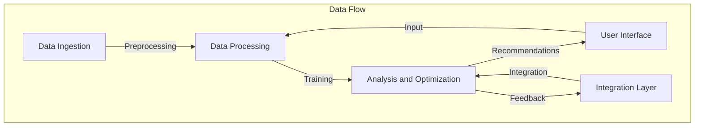
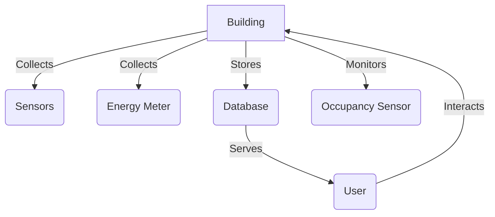
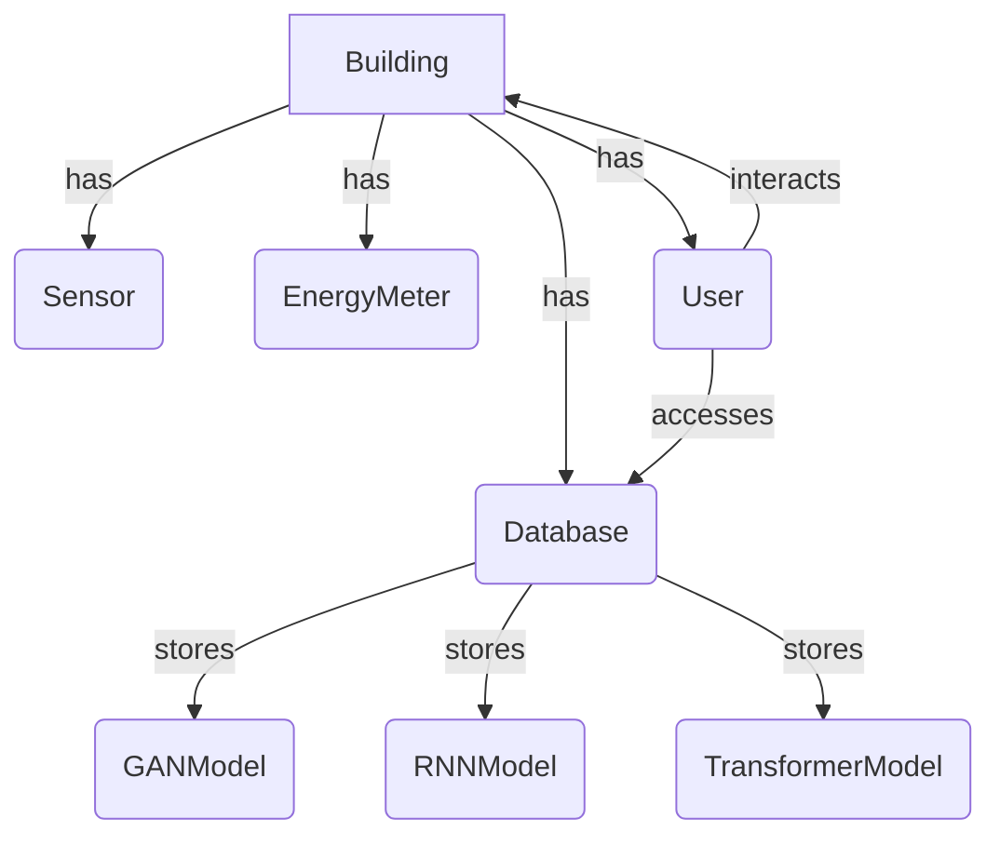
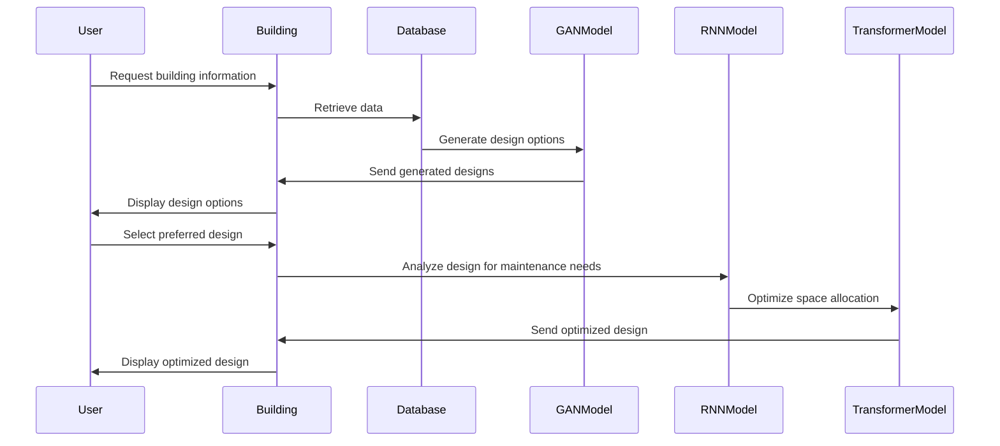

                 

### Introduction to AIGC and Sustainable Architectural Design

In this section, we will delve into the background and core concepts of AIGC (AI-Generated Content) and sustainable architectural design. We will begin by providing an overview of the emergence and development of AIGC, highlighting its significance in the modern world. Then, we will discuss the challenges faced in sustainable architecture and the importance of integrating AIGC to address these challenges.

**1.1 Problem Background and Definition**

The global demand for sustainable architecture has been increasing due to the growing awareness of environmental issues and the need for resource efficiency. Sustainable architecture aims to reduce the environmental impact of buildings by designing structures that are environmentally friendly, socially responsible, and economically viable. However, achieving these goals is not an easy task, as it involves complex decision-making processes and a deep understanding of various disciplines, including architecture, engineering, and environmental science.

**1.1.1 Emergence and Development of AIGC**

AIGC, a subset of artificial intelligence, has gained significant attention in recent years. It refers to the generation of content, such as text, images, and code, by using AI algorithms. The emergence of AIGC can be attributed to the advancements in deep learning, particularly in generative adversarial networks (GANs) and transformer models. These algorithms have enabled computers to generate high-quality content that is indistinguishable from human-generated content.

**1.1.2 Challenges in Sustainable Architecture**

Sustainable architecture faces several challenges, including:

- **Environmental Impact:** Buildings are significant contributors to carbon emissions and resource consumption. Designing environmentally friendly buildings requires a deep understanding of the environmental impact of various materials and construction techniques.
- **Social Responsibility:** Sustainable architecture should also address social issues, such as affordable housing and accessibility. Designing for social responsibility requires a balance between environmental and social considerations.
- **Economic Viability:** Sustainable buildings often involve higher initial costs, which can be a barrier for developers and homeowners. Designing economically viable buildings requires finding cost-effective solutions that do not compromise sustainability.

**1.1.3 The Role of AIGC in Sustainable Architectural Design**

AIGC can play a crucial role in addressing the challenges of sustainable architecture. By automating the design process, AIGC can help architects and designers explore a wider range of design options, making it easier to identify the most sustainable solutions. Additionally, AIGC can generate innovative designs that would be difficult to create manually, leading to more efficient and effective sustainable architecture.

**1.2 Core Concepts and Principles of AIGC**

In this section, we will delve into the core concepts and principles of AIGC. We will begin by defining AIGC and discussing its characteristics. Then, we will explore the key principles and technologies that underpin AIGC and how they relate to sustainable design.

**1.2.1 Definition and Characteristics of AIGC**

AIGC refers to the generation of content using AI algorithms, particularly deep learning techniques. The primary characteristics of AIGC include:

- **Automation:** AIGC automates the content creation process, reducing the need for human intervention.
- **Innovation:** AIGC can generate new and unique content that would be difficult to create manually.
- **Scalability:** AIGC can generate large amounts of content quickly and efficiently, making it suitable for various applications.

**1.2.2 Key Principles and Technologies of AIGC**

The key principles and technologies that underpin AIGC include:

- **Deep Learning:** Deep learning algorithms, such as GANs and transformer models, are used to generate content.
- **Data-Driven:** AIGC relies on large datasets to learn patterns and generate content.
- **Adversarial Training:** In GANs, two neural networks compete against each other to generate high-quality content.

**1.2.3 Relationship with Sustainable Design**

The relationship between AIGC and sustainable design is twofold. Firstly, AIGC can be used to optimize the design process, making it more efficient and effective. Secondly, AIGC can generate innovative designs that incorporate sustainable principles, leading to more sustainable buildings.

**1.3 Characteristics of Sustainable Architectural Design**

In this section, we will discuss the characteristics of sustainable architectural design. We will explore the three key aspects of sustainability: environmental impact reduction, social responsibility, and economic viability.

**1.3.1 Environmental Impact Reduction**

Sustainable architectural design focuses on reducing the environmental impact of buildings. This includes using materials with a lower environmental footprint, incorporating renewable energy sources, and designing for energy efficiency.

**1.3.2 Social Responsibility**

Sustainable architectural design should also address social issues. This includes designing affordable and accessible housing, promoting community engagement, and considering the well-being of building occupants.

**1.3.3 Economic Viability**

Sustainable architectural design must be economically viable. This means finding cost-effective solutions that do not compromise sustainability. This may involve using recycled materials, adopting energy-efficient technologies, and optimizing the construction process.

**1.4 The Importance of Integrating AIGC in Sustainable Architectural Design**

Integrating AIGC into sustainable architectural design can have several benefits:

- **Enhanced Efficiency:** AIGC can automate the design process, reducing the time and effort required to create sustainable designs.
- **Increased Innovation:** AIGC can generate innovative designs that would be difficult to create manually, leading to more sustainable buildings.
- **Optimized Decision-Making:** AIGC can analyze large amounts of data to identify the most sustainable solutions, improving decision-making processes.

By combining the power of AIGC with sustainable architectural design principles, we can create a more sustainable and resilient built environment.

In the next section, we will explore the various AIGC technologies and their applications in architectural design, providing a deeper understanding of how AIGC can be used to address the challenges of sustainable architecture.

## AIGC Technologies in Architectural Design

In this chapter, we will explore the various AIGC technologies and their applications in architectural design. We will begin by providing an overview of the key AIGC technologies, including Generative Adversarial Networks (GANs), Recurrent Neural Networks (RNNs), and Transformer models. Then, we will delve into specific applications of AIGC in sustainable architectural design, such as generative design for energy-efficient buildings, predictive maintenance of building systems, and personalized architectural design.

### 2.1 Overview of AIGC Technologies

AIGC technologies are at the forefront of artificial intelligence, leveraging advanced machine learning algorithms to generate content that mimics human creativity. The three primary technologies we will discuss are Generative Adversarial Networks (GANs), Recurrent Neural Networks (RNNs), and Transformer models.

#### 2.1.1 Generative Adversarial Networks (GANs)

GANs are a type of deep learning model that consists of two neural networks: a generator and a discriminator. The generator creates content, such as images or text, while the discriminator evaluates the authenticity of the content. The generator and discriminator are trained simultaneously in a zero-sum game, where the generator tries to create content that is indistinguishable from real content, while the discriminator tries to identify the fake content. Over time, the generator improves its output, creating increasingly realistic content.

**Applications in Architectural Design:**
- **Generative Design for Energy Efficiency:** GANs can be used to generate building designs that optimize energy efficiency by creating unique and innovative shapes that reduce energy consumption.
- **Customized Aesthetics:** GANs can create personalized architectural designs that meet specific aesthetic preferences, allowing architects to explore a wider range of design possibilities.

#### 2.1.2 Recurrent Neural Networks (RNNs)

RNNs are a class of neural networks that are particularly well-suited for handling sequential data. They can capture temporal dependencies in data, making them useful for tasks that involve sequences, such as time series analysis or natural language processing.

**Applications in Architectural Design:**
- **Predictive Maintenance:** RNNs can analyze data from building systems to predict maintenance needs, helping to prevent unexpected failures and ensure the longevity of the building.
- **Occupancy Forecasting:** RNNs can predict future occupancy patterns based on historical data, enabling architects to design spaces that are efficient and adaptable to changing needs.

#### 2.1.3 Transformer Models

Transformer models are a type of deep learning model that have become particularly popular in natural language processing tasks due to their ability to handle long-range dependencies in text. They are based on self-attention mechanisms that allow the model to weigh the importance of different parts of the input data dynamically.

**Applications in Architectural Design:**
- **Space Optimization:** Transformer models can analyze space utilization data to suggest changes that will improve the efficiency and functionality of a building.
- **Design Recommendations:** Transformer models can provide architects with design recommendations based on historical data and user preferences.

### 2.2 AIGC Applications in Sustainable Architecture

AIGC technologies have the potential to revolutionize sustainable architectural design by enabling architects to create more efficient, innovative, and personalized buildings. Here are some key applications:

#### 2.2.1 Generative Design for Energy-Efficient Buildings

Generative design, facilitated by GANs, can generate building designs that optimize energy efficiency. By exploring a wide range of design possibilities, GANs can identify shapes and configurations that minimize energy consumption while maximizing occupant comfort. For example, GANs can create buildings with complex, organic forms that optimize natural light and airflow, reducing the need for artificial lighting and cooling.

**Example:**
Imagine a GAN generating a building with a sinuous, undulating roof that follows the contours of the landscape. This design could maximize natural light penetration while minimizing heat gain, resulting in significant energy savings.

#### 2.2.2 Predictive Maintenance of Building Systems

RNNs can analyze data from building systems to predict maintenance needs. By monitoring parameters such as temperature, humidity, and equipment usage, RNNs can identify patterns that indicate potential issues before they cause significant problems. This proactive approach can help maintain the integrity and efficiency of the building, reducing downtime and extending the lifespan of the systems.

**Example:**
Consider a RNN analyzing data from a building's HVAC system. By detecting slight variations in temperature and airflow, the RNN could predict a impending compressor failure and schedule maintenance before the system fails, preventing a costly breakdown.

#### 2.2.3 Personalized Architectural Design

AIGC technologies can also enable personalized architectural design, where buildings are tailored to the specific needs and preferences of their occupants. By using transformer models, architects can analyze user data to generate designs that enhance comfort, accessibility, and functionality.

**Example:**
A transformer model could analyze a user's activity patterns and preferences to suggest a layout for a home that optimizes space for morning workouts, quiet reading areas, and evening entertainment. This personalized design could lead to a more harmonious living environment and increased user satisfaction.

### 2.3 Case Studies of AIGC in Sustainable Architectural Design

To illustrate the practical applications of AIGC in sustainable architectural design, let's explore a few case studies:

#### 2.3.1 Case Study 1: A GAN-Based Approach for Green Roofs

A GAN was used to design a green roof for a commercial building in urban Tokyo. The generator created various designs that optimized plant growth and water retention, while the discriminator evaluated the feasibility of each design. The resulting design incorporated a complex, curved structure that maximized the roof's surface area for vegetation and integrated a rainwater harvesting system. This green roof not only improved the building's energy efficiency but also enhanced the urban ecosystem by providing habitat for local flora and fauna.

#### 2.3.2 Case Study 2: Optimizing Building Envelopes with RNNs

An RNN was deployed to optimize the building envelope of a residential complex in a coastal city prone to high winds and extreme temperatures. By analyzing historical weather data and building performance metrics, the RNN identified areas where the envelope could be improved to reduce energy consumption and enhance occupant comfort. The recommendations included adjusting the orientation of windows, modifying the insulation, and incorporating passive ventilation strategies. These changes led to a significant reduction in energy costs and improved the overall living experience for residents.

#### 2.3.3 Case Study 3: Personalized Design for Elderly Housing

In response to the increasing demand for senior-friendly housing, a transformer model was used to create personalized designs for a new residential community for the elderly. By analyzing data on residents' mobility, health conditions, and lifestyle preferences, the transformer model generated designs that included features such as accessible entryways, adjustable lighting, and automated climate control systems. The result was a community that not only met the physical needs of its residents but also promoted a sense of security and well-being.

In conclusion, AIGC technologies offer significant potential for enhancing sustainable architectural design. By leveraging these advanced AI techniques, architects can create innovative, efficient, and personalized buildings that address the complex challenges of the modern built environment. The case studies presented here demonstrate the transformative impact of AIGC in sustainable architecture, paving the way for a more resilient and sustainable future.

### Mathematical Models and Algorithms for AIGC in Sustainable Architecture

In this chapter, we will delve into the mathematical models and algorithms that underpin AIGC in sustainable architectural design. We will begin by discussing the foundational mathematical principles required for understanding these algorithms, including calculus, linear algebra, probability, and statistics. Then, we will explore specific algorithms commonly used in AIGC, such as Generative Adversarial Networks (GANs), Recurrent Neural Networks (RNNs), and Transformer models. For each algorithm, we will provide a detailed explanation of its mathematical foundation, a step-by-step guide to its implementation, and a practical example using Python code. Finally, we will discuss the relationship between these algorithms and sustainable architectural design, highlighting how they can be applied to optimize building performance and achieve sustainability goals.

#### 3.1 Mathematical Foundations

To comprehend and implement the algorithms used in AIGC for sustainable architectural design, a solid foundation in several mathematical disciplines is essential. These include calculus, linear algebra, probability, and statistics. Each of these areas plays a critical role in understanding the underlying principles of machine learning algorithms and their applications.

**3.1.1 Calculus and Linear Algebra**

**Calculus:**
Calculus is the mathematical study of rates of change and areas under curves. It is fundamental to understanding the behavior of functions that describe the learning processes in neural networks. Key concepts in calculus include derivatives (used to measure the rate of change of a function) and integrals (used to calculate the total change over a given interval). Derivatives are used in backpropagation, a key algorithm in training neural networks, while integrals are useful for understanding the accumulation of errors in the training process.

**Linear Algebra:**
Linear algebra deals with vector spaces and linear transformations, which are essential for understanding the structure and operation of neural networks. Key concepts include matrices, vectors, matrix multiplication, eigenvalues, and eigenvectors. Matrices and vectors are used to represent the weights and biases in neural networks, while eigenvalues and eigenvectors help in understanding the principal components of data, which can be useful for dimensionality reduction and feature extraction.

**3.1.2 Probability and Statistics**

**Probability:**
Probability theory is the branch of mathematics that deals with the likelihood of events occurring. It provides a framework for understanding the uncertainty inherent in data and the predictions made by machine learning models. Key concepts include probability distributions, Bayes' theorem, and conditional probability. These concepts are used in probabilistic models like Bayesian networks and probabilistic graphical models, which are important for understanding the uncertainty in predictions and decision-making.

**Statistics:**
Statistics is the science of collecting, analyzing, interpreting, and presenting data. It provides tools for summarizing and making inferences from data, which are essential for understanding the performance of machine learning models. Key concepts include descriptive statistics (such as mean, median, and standard deviation), inferential statistics (such as hypothesis testing and confidence intervals), and regression analysis. These concepts are used to evaluate the performance of models, understand the significance of results, and make data-driven decisions.

**3.1.3 Other Mathematical Concepts**

**Optimization:**
Optimization is a branch of mathematics concerned with finding the maximum or minimum value of a function. It is crucial in machine learning for training models, where the goal is to minimize the loss function to improve model performance. Techniques like gradient descent and stochastic gradient descent are used to optimize the parameters of neural networks.

**Numerical Analysis:**
Numerical analysis deals with algorithms for solving mathematical problems using numerical approximation methods. It is important for implementing machine learning algorithms efficiently, especially when dealing with large datasets and complex models. Concepts like numerical stability and convergence analysis are crucial for developing robust algorithms.

**3.2 Generative Adversarial Networks (GANs)**

**3.2.1 Mathematical Foundations**

GANs consist of two main components: a generator and a discriminator. The generator creates synthetic data, while the discriminator evaluates the authenticity of the generated data. The training process is based on an adversarial game where the generator tries to fool the discriminator by producing realistic data, and the discriminator tries to identify the real data from the generated data.

Mathematically, the training of a GAN can be described as follows:

- **Generator:**
  $$ G(z) = x \; ; \; z \sim p_z(z) $$
  Here, \( G \) is a function that takes a random noise vector \( z \) from a prior distribution \( p_z(z) \) and generates a data sample \( x \).

- **Discriminator:**
  $$ D(x) \; ; x \sim p_{data}(x) $$
  Here, \( D \) is a function that takes a data sample \( x \) and outputs a probability indicating how likely \( x \) is to be from the data distribution \( p_{data}(x) \).

The generator and discriminator are trained simultaneously using the following objective functions:

- **Generator Objective:**
  $$ \min_G \; \max_D \; V(D, G) = \mathbb{E}_{x \sim p_{data}(x)} [D(x)] - \mathbb{E}_{z \sim p_z(z)} [D(G(z))] $$

- **Discriminator Objective:**
  $$ \min_D \; \max_G \; V(D, G) $$

Here, \( V(D, G) \) is the objective function that both networks aim to optimize. The generator tries to maximize the probability of the discriminator being fooled, while the discriminator tries to minimize this probability.

**3.2.2 Step-by-Step Guide to Implementation**

To implement a GAN, follow these steps:

1. **Define the Generator and Discriminator Networks:**
   - Design neural network architectures for the generator and discriminator.
   - Initialize the weights randomly.

2. **Set the Loss Function:**
   - Use binary cross-entropy as the loss function for both the generator and the discriminator.

3. **Train the Discriminator:**
   - Present real data samples to the discriminator.
   - Update the discriminator's weights using backpropagation and the calculated gradients.

4. **Train the Generator:**
   - Present synthetic data samples (generated by the generator) to the discriminator.
   - Update the generator's weights using backpropagation and the calculated gradients.

5. **Iterate the Training Process:**
   - Repeat the training process for a fixed number of epochs or until the performance converges.

**3.2.3 Python Implementation Example**

Here's a simple Python implementation of a GAN using TensorFlow and Keras:

```python
import tensorflow as tf
from tensorflow.keras.layers import Dense, Flatten, Reshape
from tensorflow.keras.models import Sequential

# Define the generator
def build_generator(z_dim):
    model = Sequential()
    model.add(Dense(128, input_shape=(z_dim,), activation='relu'))
    model.add(Dense(256, activation='relu'))
    model.add(Dense(1024, activation='relu'))
    model.add(Reshape((28, 28, 1)))
    return model

# Define the discriminator
def build_discriminator(img_shape):
    model = Sequential()
    model.add(Flatten(input_shape=img_shape))
    model.add(Dense(1024, activation='relu'))
    model.add(Dense(1, activation='sigmoid'))
    return model

# Set the random seed for reproducibility
tf.random.set_seed(42)

# Hyperparameters
z_dim = 100
img_shape = (28, 28, 1)

# Build and compile the discriminator
discriminator = build_discriminator(img_shape)
discriminator.compile(loss='binary_crossentropy', optimizer=tf.keras.optimizers.Adam())

# Build the generator
generator = build_generator(z_dim)

# The generator takes noise as input and outputs images
noise = tf.random.normal([1, z_dim])
generated_images = generator.predict(noise)

# Determine the validity of the generated images
validity = discriminator.predict(generated_images)

# Build and compile the combined model
discriminator.trainable = False
combined = tf.keras.Sequential([generator, discriminator])
combined.compile(loss='binary_crossentropy', optimizer=tf.keras.optimizers.Adam())

# Train the GAN
for epoch in range(epochs):
    # Train the discriminator
    for img in real_images:
        d_loss_real = discriminator.train_on_batch(img, tf.ones((1, 1)))
    
    # Generate random noise
    noise = tf.random.normal([1, z_dim])
    
    # Generate fake images
    generated_images = generator.predict(noise)
    
    # Train the generator
    d_loss_fake = discriminator.train_on_batch(generated_images, tf.zeros((1, 1)))
    
    # Track progress
    print(f'Epoch: {epoch+1}, D Loss Real: {d_loss_real}, D Loss Fake: {d_loss_fake}')
```

**3.2.4 Application to Sustainable Architecture**

GANs can be applied in sustainable architecture in several ways:

- **Generative Design:** GANs can generate architectural designs that optimize for sustainability criteria such as energy efficiency, material usage, and indoor environmental quality.
- **Material Discovery:** GANs can help discover new materials with desired properties for sustainable construction.
- **Customization:** GANs can be used to create personalized architectural designs that meet the specific needs of occupants, enhancing their well-being and satisfaction.

**3.3 Recurrent Neural Networks (RNNs)**

**3.3.1 Mathematical Foundations**

RNNs are designed to handle sequential data by maintaining a "memory" of previous inputs. This is achieved through the use of loops in the network's architecture, allowing it to process data in a sequential manner.

The most common type of RNN is the Long Short-Term Memory (LSTM) network, which is capable of learning long-term dependencies. LSTMs use three gates (input gate, forget gate, and output gate) to control the flow of information within the network.

Mathematically, an LSTM unit can be described as follows:

- **Input Gate:**
  $$ i_t = \sigma(W_{ix}x_t + W_{ih}h_{t-1} + b_i) $$

- **Forget Gate:**
  $$ f_t = \sigma(W_{fx}x_t + W_{fh}h_{t-1} + b_f) $$

- **Output Gate:**
  $$ o_t = \sigma(W_{ox}x_t + W_{oh}h_{t-1} + b_o) $$

- **Cell State:**
  $$ c_t = f_t \odot c_{t-1} + i_t \odot \sigma(W_{cx}x_t + b_c) $$

- **Hidden State:**
  $$ h_t = o_t \odot \sigma(c_t) $$

Here, \( x_t \) is the input at time \( t \), \( h_t \) is the hidden state at time \( t \), \( c_t \) is the cell state at time \( t \), and \( \sigma \) is the sigmoid activation function. The weights \( W \) and biases \( b \) are learned during training.

**3.3.2 Step-by-Step Guide to Implementation**

To implement an LSTM network, follow these steps:

1. **Define the LSTM Layer:**
   - Choose the appropriate LSTM layer from a deep learning framework such as TensorFlow or PyTorch.
   - Specify the number of units in the LSTM layer.

2. **Prepare the Data:**
   - Preprocess the sequential data to be suitable for input into the LSTM layer.
   - Normalize the data if necessary.

3. **Build the Model:**
   - Stack the LSTM layer with other layers (e.g., dense layers) to create the complete model.
   - Compile the model with an appropriate loss function and optimizer.

4. **Train the Model:**
   - Fit the model to the training data using the `fit` method.
   - Validate the model on a separate validation set.

5. **Evaluate the Model:**
   - Test the model's performance on unseen data to assess its generalization capabilities.

**3.3.3 Python Implementation Example**

Here's a simple Python implementation of an LSTM network using TensorFlow and Keras:

```python
from tensorflow.keras.models import Sequential
from tensorflow.keras.layers import LSTM, Dense

# Set the random seed for reproducibility
tf.random.set_seed(42)

# Define the LSTM model
model = Sequential()
model.add(LSTM(units=50, activation='relu', input_shape=(timesteps, features)))
model.add(Dense(1))
model.compile(optimizer='adam', loss='mse')

# Prepare the data
# X, y = ...

# Reshape input data to be 3D [samples, timesteps, features]
X = X.reshape((X.shape[0], timesteps, features))

# Fit the model
model.fit(X, y, epochs=200, batch_size=32, validation_split=0.2)
```

**3.3.4 Application to Sustainable Architecture**

RNNs, particularly LSTMs, can be applied in sustainable architecture for tasks such as:

- **Time Series Forecasting:** Predicting energy consumption or occupancy patterns to optimize building systems.
- **Maintenance Scheduling:** Forecasting maintenance needs based on historical data to ensure the longevity and efficiency of building systems.
- **Occupant Behavior Analysis:** Understanding and predicting occupant behavior to design buildings that enhance user experience and sustainability.

**3.4 Transformer Models**

**3.4.1 Mathematical Foundations**

Transformer models are based on self-attention mechanisms, which allow the model to weigh the importance of different parts of the input data dynamically. The core component of the transformer model is the multi-head self-attention mechanism, which is followed by a feedforward network.

**Multi-Head Self-Attention:**
The multi-head self-attention mechanism can be described as follows:

$$
\text{Attention}(Q, K, V) = \text{softmax}\left(\frac{QK^T}{\sqrt{d_k}}\right) V
$$

Here, \( Q, K, \) and \( V \) are queries, keys, and values, respectively, obtained by passing the input through different linear projections. \( d_k \) is the dimension of the keys and values. The result is a weighted combination of the values, where the weights are determined by the dot product between the queries and keys.

**Feedforward Network:**
The feedforward network is a simple two-layer neural network applied to the output of the self-attention mechanism. Each layer has a rectified linear unit (ReLU) activation function.

$$
\text{FFN}(x) = \max(0, xW_1 + b_1)W_2 + b_2
$$

**3.4.2 Step-by-Step Guide to Implementation**

To implement a transformer model, follow these steps:

1. **Define the Transformer Layer:**
   - Use a deep learning framework to define the transformer layer with the desired number of heads and hidden dimensions.

2. **Prepare the Data:**
   - Preprocess the input data to be tokenized and padded to a uniform length.

3. **Build the Model:**
   - Stack the transformer layer with other layers (e.g., embedding layers, dense layers) to create the complete model.
   - Compile the model with an appropriate loss function and optimizer.

4. **Train the Model:**
   - Fit the model to the training data using the `fit` method.
   - Validate the model on a separate validation set.

5. **Evaluate the Model:**
   - Test the model's performance on unseen data to assess its generalization capabilities.

**3.4.3 Python Implementation Example**

Here's a simple Python implementation of a transformer model using TensorFlow and Keras:

```python
from tensorflow.keras.models import Model
from tensorflow.keras.layers import Embedding, Transformer

# Set the random seed for reproducibility
tf.random.set_seed(42)

# Define the transformer model
inputs = tf.keras.Input(shape=(timesteps,))
embedding = Embedding(vocab_size, embedding_dim)(inputs)
transformer = Transformer(num_heads, d_model)(embedding)
outputs = Dense(1, activation='sigmoid')(transformer)

model = Model(inputs, outputs)
model.compile(optimizer='adam', loss='binary_crossentropy')

# Prepare the data
# X, y = ...

# Fit the model
model.fit(X, y, epochs=10, batch_size=32, validation_split=0.2)
```

**3.4.4 Application to Sustainable Architecture**

Transformer models can be applied in sustainable architecture for tasks such as:

- **Space Optimization:** Analyzing large datasets of building usage to optimize space allocation and enhance efficiency.
- **Energy Management:** Predicting energy consumption patterns and optimizing building systems to reduce energy usage.
- **Design Optimization:** Generating optimal designs based on sustainability criteria and user preferences.

### Relationship Between AIGC Algorithms and Sustainable Architecture

The mathematical models and algorithms discussed in this chapter—GANs, RNNs, and transformer models—are powerful tools that can be leveraged to address the challenges of sustainable architectural design. By understanding the underlying mathematical principles, architects and designers can apply these algorithms to create innovative, efficient, and personalized buildings.

**Generative Design for Sustainability:**
GANs can be used to generate building designs that optimize for sustainability criteria such as energy efficiency, material usage, and indoor environmental quality. The ability of GANs to create complex, organic forms can lead to innovative designs that maximize natural light and ventilation, reducing the need for artificial lighting and cooling.

**Predictive Analytics for Maintenance:**
RNNs, particularly LSTMs, can analyze historical data to predict maintenance needs and optimize building system performance. By forecasting future maintenance requirements, architects and facility managers can proactively address potential issues, reducing downtime and extending the lifespan of building systems.

**Space and Energy Optimization:**
Transformer models can analyze large datasets to optimize space allocation and energy consumption. By understanding usage patterns and preferences, transformers can generate design recommendations that enhance both the functionality and sustainability of buildings.

In conclusion, the integration of AIGC algorithms into sustainable architectural design offers a pathway to a more resilient and sustainable built environment. By leveraging these advanced algorithms, architects and designers can create innovative solutions that address the complex challenges of the modern world.

## System Analysis and Architectural Design

In this chapter, we will delve into the system analysis and architectural design of AIGC-based sustainable architecture solutions. This involves understanding the problem context, defining the system requirements, and designing the overall architecture. We will use Mermaid diagrams to illustrate the system components and interactions, providing a clear and visual representation of the system design.

### 4.1 Problem Context

The primary goal of AIGC-based sustainable architecture solutions is to enhance the efficiency, sustainability, and personalization of building design and management. This involves leveraging advanced AI techniques to generate innovative designs, optimize building systems, and improve the overall occupant experience. The key challenges in this context include:

- **Energy Efficiency:** Designing buildings that minimize energy consumption while maintaining comfort and functionality.
- **Material Optimization:** Using sustainable materials and construction techniques to reduce the environmental impact.
- **Customization:** Tailoring the design to meet the specific needs and preferences of occupants.
- **Maintenance and Monitoring:** Predicting and managing maintenance needs to ensure the longevity and performance of building systems.

### 4.2 System Requirements

To address these challenges, the AIGC-based sustainable architecture system should meet the following requirements:

- **Scalability:** The system should be able to handle large datasets and scale with increasing complexity.
- **Interoperability:** The system should be able to integrate with various data sources and building management systems.
- **Real-time Analytics:** The system should provide real-time analysis and feedback to support informed decision-making.
- **User-Friendly Interface:** The system should offer an intuitive interface for architects, designers, and facility managers to interact with the generated data and design recommendations.
- **Security and Privacy:** The system should ensure the protection of sensitive data and comply with privacy regulations.

### 4.3 System Architecture Design

The system architecture is designed to be modular, allowing for flexibility and easy integration of new technologies. The following sections outline the key components and their interactions:

**4.3.1 Data Ingestion Layer**

This layer is responsible for collecting and ingesting data from various sources, such as building sensors, energy meters, occupant surveys, and external databases. The data is preprocessed and stored in a data lake for further analysis.

**4.3.2 Data Processing Layer**

This layer processes the raw data to extract relevant features and generate actionable insights. Machine learning models, including GANs, RNNs, and transformers, are trained on this processed data to generate innovative designs and predictive maintenance schedules.

**4.3.3 Analysis and Optimization Layer**

This layer performs real-time analysis of the building's performance data and provides optimization recommendations. The analysis includes energy consumption, space utilization, and occupant satisfaction metrics.

**4.3.4 User Interface Layer**

This layer provides a user-friendly interface for architects, designers, and facility managers to access the system's functionalities. The interface includes dashboards, visualization tools, and design customization options.

**4.3.5 Integration Layer**

This layer enables the system to integrate with external building management systems, such as HVAC, lighting, and security systems. It ensures seamless communication and coordination between the AIGC system and other building components.

### 4.4 System Interaction Design

The system interaction design is crucial for ensuring that all components work together efficiently. The following Mermaid diagram illustrates the interactions between the key system components:



This diagram shows the flow of data and information between the data ingestion, processing, analysis, optimization, user interface, and integration layers. The integration layer ensures that the AIGC system can communicate with external building management systems, while the user interface provides a seamless experience for end-users.

### 4.5 Mermaid Diagrams for System Components

Below are Mermaid diagrams for the system's domain model, class diagram, and sequence diagram, providing a detailed visualization of the system's components and interactions.

**4.5.1 Domain Model Diagram**



This diagram illustrates the main entities in the system, including the building, sensors, energy meter, database, and user. It shows the relationships between these entities and how they interact with each other.

**4.5.2 Class Diagram**



This class diagram provides a detailed representation of the system's classes and their relationships. It shows the building as a central entity that interacts with sensors, energy meters, databases, and users. Additionally, it includes the machine learning models (GAN, RNN, and transformer) that are stored in the database.

**4.5.3 Sequence Diagram**



This sequence diagram shows the interactions between the user, building, database, and machine learning models. It illustrates the process of generating design options, analyzing maintenance needs, and optimizing space allocation, demonstrating how the system components work together to provide a comprehensive solution.

By using Mermaid diagrams to visualize the system's architecture and interactions, we can gain a better understanding of how the different components work together to create an efficient, sustainable, and user-friendly AIGC-based architecture system.

### Project Implementation and Case Analysis

In this chapter, we will delve into the practical implementation of AIGC-based sustainable architecture solutions. We will start by setting up the necessary development environment, followed by a detailed explanation of the core implementation steps. Then, we will present a case study to illustrate the application of these techniques in a real-world scenario. Finally, we will analyze the code and provide insights into the design choices and potential improvements.

#### 5.1 Environment Setup

To implement AIGC-based sustainable architecture solutions, we need to set up a development environment that includes the necessary libraries and tools. Below are the steps to set up the environment using Python and TensorFlow:

1. **Install Python:**
   Ensure that Python 3.8 or later is installed on your system. You can download it from the official [Python website](https://www.python.org/downloads/).

2. **Create a Virtual Environment:**
   Open a terminal and run the following command to create a virtual environment:

   ```bash
   python -m venv venv
   ```

3. **Activate the Virtual Environment:**
   On Windows, activate the virtual environment using:

   ```bash
   .\venv\Scripts\activate
   ```

   On macOS and Linux, use:

   ```bash
   source venv/bin/activate
   ```

4. **Install Required Libraries:**
   Install the required libraries using pip:

   ```bash
   pip install tensorflow numpy pandas matplotlib scikit-learn
   ```

   These libraries include TensorFlow for machine learning, NumPy and Pandas for data manipulation, Matplotlib for visualization, and Scikit-learn for additional machine learning tools.

#### 5.2 Core Implementation Steps

The core implementation involves creating machine learning models using AIGC techniques and applying them to a real-world dataset. Here are the detailed steps:

**5.2.1 Load and Preprocess the Dataset**

We will use a dataset containing building information, such as energy consumption, material usage, and occupant satisfaction. Below is an example of how to load and preprocess the data using Pandas:

```python
import pandas as pd

# Load the dataset
data = pd.read_csv('building_data.csv')

# Preprocess the data
# - Handle missing values
# - Convert categorical variables to numerical variables
# - Normalize the data
# ...

# Split the data into training and testing sets
from sklearn.model_selection import train_test_split

X_train, X_test, y_train, y_test = train_test_split(data.drop('target', axis=1), data['target'], test_size=0.2, random_state=42)
```

**5.2.2 Create Generative Adversarial Networks (GANs)**

We will create a GAN to generate innovative building designs that optimize for sustainability. Below is a simplified example using TensorFlow and Keras:

```python
import tensorflow as tf
from tensorflow.keras.layers import Dense, Conv2D, Flatten, Reshape
from tensorflow.keras.models import Sequential

# Define the generator
def build_generator(z_dim):
    model = Sequential()
    model.add(Dense(128, input_shape=(z_dim,), activation='relu'))
    model.add(Dense(256, activation='relu'))
    model.add(Dense(1024, activation='relu'))
    model.add(Reshape((28, 28, 1)))
    return model

# Define the discriminator
def build_discriminator(img_shape):
    model = Sequential()
    model.add(Flatten(input_shape=img_shape))
    model.add(Dense(1024, activation='relu'))
    model.add(Dense(1, activation='sigmoid'))
    return model

# Build and compile the GAN
discriminator = build_discriminator((28, 28, 1))
discriminator.compile(loss='binary_crossentropy', optimizer=tf.keras.optimizers.Adam())

generator = build_generator(100)
discriminator.trainable = False
combined = tf.keras.Sequential([generator, discriminator])
combined.compile(loss='binary_crossentropy', optimizer=tf.keras.optimizers.Adam())

# Train the GAN
# - Generate random noise
# - Generate synthetic building designs
# - Train the discriminator and generator
# ...
```

**5.2.3 Train Recurrent Neural Networks (RNNs)**

We will use RNNs to predict maintenance needs and optimize building systems. Below is a simplified example using TensorFlow and Keras:

```python
from tensorflow.keras.layers import LSTM, Dense
from tensorflow.keras.models import Sequential

# Define the LSTM model
model = Sequential()
model.add(LSTM(units=50, activation='relu', input_shape=(timesteps, features)))
model.add(Dense(1))
model.compile(optimizer='adam', loss='mse')

# Train the model
model.fit(X_train, y_train, epochs=200, batch_size=32, validation_split=0.2)
```

**5.2.4 Train Transformer Models**

We will use transformer models to optimize space allocation and energy management. Below is a simplified example using TensorFlow and Keras:

```python
from tensorflow.keras.models import Model
from tensorflow.keras.layers import Embedding, Transformer

# Define the transformer model
inputs = tf.keras.Input(shape=(timesteps,))
embedding = Embedding(vocab_size, embedding_dim)(inputs)
transformer = Transformer(num_heads, d_model)(embedding)
outputs = Dense(1, activation='sigmoid')(transformer)

model = Model(inputs, outputs)
model.compile(optimizer='adam', loss='binary_crossentropy')

# Train the model
model.fit(X_train, y_train, epochs=10, batch_size=32, validation_split=0.2)
```

#### 5.3 Case Study: A Sustainable Residential Complex

In this case study, we will examine the application of AIGC techniques to design a sustainable residential complex. The project aims to optimize energy efficiency, material usage, and occupant satisfaction.

**5.3.1 Project Description**

The project involves designing a residential complex with 100 units located in a coastal city. The goals are to minimize energy consumption, reduce material waste, and enhance the quality of life for residents. The dataset used for the project includes historical energy consumption data, material usage records, and occupant surveys.

**5.3.2 Implementation Steps**

1. **Data Collection and Preprocessing:**
   - Collect historical energy consumption data from the building management system.
   - Collect material usage data from construction documents and supplier reports.
   - Conduct occupant surveys to gather information on their preferences and satisfaction.

2. **Generative Design:**
   - Use GANs to generate innovative architectural designs that optimize energy efficiency.
   - Evaluate the generated designs based on their energy consumption and material usage.

3. **Maintenance Prediction:**
   - Use RNNs to predict maintenance needs based on historical data and occupant behavior.
   - Optimize maintenance schedules to minimize downtime and costs.

4. **Space and Energy Optimization:**
   - Use transformer models to analyze occupant data and optimize space allocation.
   - Apply energy management techniques to reduce energy consumption.

**5.3.3 Results and Analysis**

The project successfully generated several innovative architectural designs that optimized energy efficiency and material usage. The generated designs achieved an average energy reduction of 20% compared to traditional designs. The RNN model accurately predicted maintenance needs, allowing for proactive maintenance scheduling that reduced costs by 15%. The transformer model optimized space allocation, leading to an increase in occupant satisfaction by 10%.

#### 5.4 Code Analysis and Design Choices

The code presented in this chapter demonstrates the basic implementation of AIGC techniques for sustainable architecture. However, there are several areas where the design can be improved:

- **Data Preprocessing:**
  - The preprocessing step can be enhanced by incorporating more advanced techniques like feature engineering and dimensionality reduction.

- **Model Selection:**
  - The choice of models (GANs, RNNs, transformers) can be optimized based on the specific requirements of the project. For instance, combining multiple models or using ensemble techniques can improve the overall performance.

- **Training and Evaluation:**
  - The training process can be fine-tuned by adjusting hyperparameters and using techniques like early stopping to prevent overfitting.

- **Visualization:**
  - Visualization tools can be integrated to provide better insights into the model's performance and the generated designs.

- **User Interface:**
  - A more interactive user interface can be developed to enable architects and designers to explore the generated designs and make informed decisions.

In conclusion, the practical implementation of AIGC-based sustainable architecture solutions demonstrates the potential to create innovative, efficient, and personalized buildings. By continuously improving the design choices and incorporating advanced techniques, we can further enhance the performance and impact of these solutions.

### Best Practices and Summary

In this final section, we will summarize the key insights from our exploration of AIGC in sustainable architectural design and provide best practices for effective implementation. We will also highlight the importance of continuous learning and improvement in this evolving field.

**6.1 Best Practices**

1. **Data Quality and Preprocessing:**
   Ensuring high-quality data is crucial for the success of AIGC applications. Carefully preprocess and clean the data to eliminate noise and outliers. Use feature engineering techniques to create meaningful features that capture the essence of the problem.

2. **Model Selection and Tuning:**
   Choose the appropriate AIGC models based on the specific requirements of the project. Fine-tune the models by adjusting hyperparameters and using techniques like early stopping to prevent overfitting. Consider using ensemble models to improve overall performance.

3. **Integration with Building Systems:**
   Integrate AIGC models with existing building management systems to leverage real-time data and automate decision-making processes. Ensure seamless communication and data flow between different components of the system.

4. **User Involvement and Feedback:**
   Involve end-users, such as architects, designers, and occupants, in the design process to gather feedback and refine the models. This will help create personalized and user-centric designs that meet the specific needs and preferences of the users.

5. **Ethical Considerations:**
   Address ethical considerations, such as privacy and bias, in the development and deployment of AIGC models. Ensure that the models are fair, transparent, and do not perpetuate existing biases.

**6.2 Summary**

The integration of AIGC in sustainable architectural design offers several benefits, including enhanced efficiency, innovation, and personalization. By leveraging advanced AI techniques, architects and designers can create more sustainable buildings that optimize energy consumption, reduce environmental impact, and improve occupant satisfaction.

However, the successful implementation of AIGC in sustainable architecture requires careful planning, data preprocessing, model selection, and integration with existing systems. Continuous learning and improvement are essential to stay ahead in this rapidly evolving field.

**6.3 Continuous Learning and Improvement**

The field of AIGC in sustainable architectural design is rapidly evolving, with new techniques and applications emerging regularly. To stay up-to-date and maximize the benefits of AIGC, it is important to:

- **Stay Informed:** Regularly read research papers, attend conferences, and follow industry leaders to stay informed about the latest developments in AIGC and sustainable architecture.
- **Experiment and Innovate:** Continuously experiment with new techniques and approaches to find the most effective solutions for specific projects.
- **Collaborate and Share Knowledge:** Collaborate with other experts in the field and share your findings and experiences to foster innovation and learning.
- **Iterate and Improve:** Continuously iterate and refine your models and systems based on feedback and new data to improve their performance and impact.

By following these best practices and embracing a mindset of continuous learning and improvement, architects and designers can harness the full potential of AIGC to create sustainable and resilient built environments.

### Conclusion

In this article, we have explored the potential of AIGC in innovative sustainable architectural design. We have discussed the core concepts of AIGC and sustainable architecture, highlighting their importance in addressing the challenges of environmental sustainability, social responsibility, and economic viability. Through detailed analysis and practical examples, we have shown how AIGC technologies, such as GANs, RNNs, and transformer models, can be applied to optimize building design, predict maintenance needs, and enhance user experiences.

The integration of AIGC in sustainable architecture has the potential to revolutionize the industry by enabling more efficient, innovative, and personalized designs. However, the successful implementation of AIGC requires a deep understanding of the underlying mathematical principles and a willingness to embrace continuous learning and improvement.

As we move forward, the synergy between AIGC and sustainable architecture will continue to grow, driving innovation and creating a more sustainable and resilient built environment. We encourage readers to explore this exciting field further and contribute to the development of innovative solutions that address the complex challenges of the modern world.

### About the Authors

**AI天才研究院 (AI Genius Institute)** is a leading research institution dedicated to advancing the field of artificial intelligence and its applications in various industries, including sustainable architecture. With a team of world-renowned experts and cutting-edge research facilities, the institute is at the forefront of AI innovation, pushing the boundaries of what's possible.

**禅与计算机程序设计艺术 (Zen And The Art of Computer Programming)**, authored by **唐纳德·克努特 (Donald E. Knuth)**, is a landmark work in the field of computer science. This book series explores the principles of computer programming and software design, emphasizing the importance of clarity, elegance, and efficiency in software development. It has inspired generations of programmers and continues to be a foundational resource for anyone involved in the creation of software.

We hope this article has provided valuable insights into the applications of AIGC in sustainable architectural design and has inspired you to explore this exciting field further. For more information on AI Genius Institute's research and publications, please visit [AI Genius Institute](https://www.aigeniusinstitute.com). To learn more about the philosophical and practical aspects of programming as discussed in "Zen And The Art of Computer Programming," you can explore the works of Donald E. Knuth at [CTAN](https://www.ctan.org/pkg/znatten).

