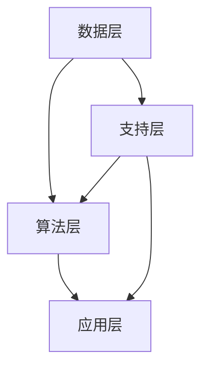
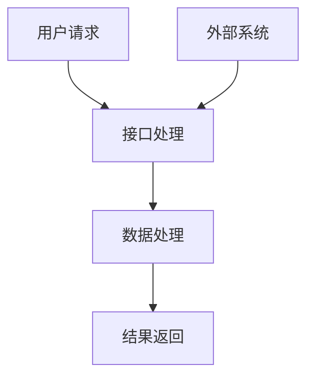
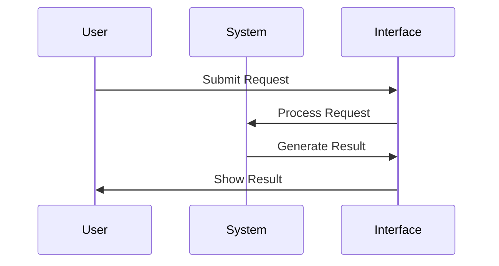

                 

### 1.1 问题背景

**1.1.1 可持续时尚设计的挑战**

时尚产业，作为全球第二大污染行业，其可持续性问题引起了广泛关注。传统的时尚产业往往依赖于大量资源消耗，包括原材料提取、生产加工和运输分销等环节，这些环节都伴随着环境污染和资源浪费。以下是一些主要的挑战：

- **资源消耗**：纺织业的原材料主要来自棉花、羊毛、丝绸等，这些原材料的生产过程往往需要大量的水资源和土地资源，同时也会导致生态破坏和生物多样性减少。
- **环境污染**：染料和化学物质的使用，以及生产过程中的废水废气排放，都对环境造成了严重污染，尤其是对水资源和空气的影响。
- **废弃物管理**：时尚产业的废弃物主要包括未使用的原材料、生产过程中的废料以及最终产品消费后的废弃物。这些废弃物的处理不仅需要高昂的成本，而且对环境造成了长期的负面影响。
- **社会问题**：时尚产业也面临着社会问题，如工人的劳动条件、薪酬和福利等。一些生产过程可能涉及劳动剥削和不公平待遇，这与可持续发展的社会责任相悖。

**1.1.2 AIGC技术的基本概念**

人工智能生成内容（AIGC，Artificial Intelligence Generated Content）是指通过人工智能技术自动生成内容的过程。它涉及多个领域的技术，包括自然语言处理、计算机视觉、机器学习和深度学习等。AIGC技术的主要特点包括：

- **自动化**：通过算法自动生成内容，减少了人工干预，提高了生产效率。
- **个性化**：AIGC技术可以根据用户需求和行为习惯，生成个性化的内容和设计。
- **高效性**：利用大规模数据和强大的计算能力，快速生成高质量的内容。
- **创新性**：通过人工智能算法的创新应用，创造出新颖独特的设计和内容。

**1.1.3 AIGC在可持续时尚设计中的应用潜力**

AIGC技术在可持续时尚设计中的应用潜力巨大，主要体现在以下几个方面：

- **设计创新**：AIGC技术可以通过大数据分析和机器学习，自动生成新颖独特的时尚设计，为设计师提供更多创意灵感。
- **个性化定制**：通过用户数据的分析，AIGC技术可以提供个性化的时尚设计方案，满足不同用户的需求，减少资源的浪费。
- **高效生产**：AIGC技术可以提高生产效率，减少生产过程中的资源消耗和浪费，实现绿色生产。
- **废弃物管理**：利用AIGC技术，可以对废弃物的利用进行优化，提高废弃物回收和再利用率。
- **社会责任**：通过AIGC技术，时尚产业可以更好地履行社会责任，改善工人待遇和工作环境。

### 1.2 核心概念与联系

**1.2.1 可持续时尚设计的核心概念**

可持续时尚设计（Sustainable Fashion Design）是指在设计过程中考虑环境、社会和经济因素，以实现长期可持续性的时尚设计。其核心概念包括：

- **环保时尚**：强调使用环保材料和工艺，减少对环境的负面影响。
- **可持续性**：追求资源的有效利用和生态平衡，减少资源浪费。
- **社会责任**：关注生产过程中的社会责任，包括工人权益、公平贸易等。

**1.2.2 AIGC的核心概念**

人工智能生成内容（AIGC）的核心概念主要包括：

- **人工智能**：通过机器学习和深度学习等技术，使计算机能够模拟人类思维和行为。
- **生成内容**：利用人工智能技术，自动生成各种类型的内容，如文字、图像、音频等。
- **个性化**：根据用户需求和偏好，提供定制化的内容和设计。

**1.2.2.1 人工智能辅助设计**

人工智能辅助设计（AI-assisted Design）是指利用人工智能技术辅助设计师进行设计和创作。其主要特点包括：

- **设计灵感**：通过分析大量的设计数据，为设计师提供灵感和创意。
- **效率提升**：自动化设计流程，减少重复劳动，提高设计效率。
- **个性化定制**：根据用户需求，提供个性化的设计方案。

**1.2.2.2 大数据分析与个性化设计**

大数据分析与个性化设计（Big Data Analysis and Personalized Design）是指利用大数据技术和人工智能算法，分析用户行为和需求，提供个性化的设计服务。其主要特点包括：

- **数据分析**：通过对用户数据的分析，了解用户需求和偏好。
- **个性化设计**：根据用户数据，提供定制化的设计内容和方案。

**1.2.2.3 智能材料与加工算法**

智能材料与加工算法（Smart Materials and Manufacturing Algorithms）是指利用人工智能技术，开发和应用智能材料和加工算法，实现高效、环保和可持续的时尚生产。其主要特点包括：

- **智能材料**：通过材料科学和人工智能的结合，开发出具有特定功能的智能材料。
- **加工算法**：利用人工智能算法，优化生产过程，提高生产效率和产品质量。

### 1.3 边界与外延

**1.3.1 AIGC在时尚设计中的适用范围**

AIGC技术在时尚设计中的应用范围广泛，包括但不限于：

- **设计创意**：利用AIGC技术生成新颖独特的时尚设计。
- **个性化定制**：根据用户数据，提供个性化的时尚设计方案。
- **生产优化**：通过大数据分析和智能加工算法，提高生产效率和产品质量。
- **废弃物管理**：利用AIGC技术优化废弃物的回收和再利用。

**1.3.2 可持续时尚设计的标准与评价体系**

可持续时尚设计的标准与评价体系主要包括以下几个方面：

- **环境标准**：评估时尚设计对环境的影响，包括资源的消耗、污染排放等。
- **社会标准**：评估时尚设计对社会的影响，包括工人权益、公平贸易等。
- **经济标准**：评估时尚设计的经济效益，包括成本效益、市场竞争力等。

**1.3.3 AIGC与可持续时尚设计的融合点**

AIGC与可持续时尚设计的融合点主要体现在以下几个方面：

- **设计创新**：通过AIGC技术生成新颖独特的时尚设计，推动环保时尚的发展。
- **生产优化**：利用AIGC技术优化生产过程，提高生产效率和产品质量。
- **个性化定制**：通过AIGC技术提供个性化的时尚设计方案，满足不同用户的需求。
- **社会责任**：通过AIGC技术改善工人待遇和工作环境，履行社会责任。

### 1.3.4 AIGC在可持续时尚设计中的发展前景

随着人工智能技术的不断发展，AIGC在可持续时尚设计中的应用前景广阔。未来，AIGC技术有望在以下几个方面发挥重要作用：

- **环保时尚设计**：通过AIGC技术生成环保、可持续的时尚设计，推动环保时尚的发展。
- **个性化定制**：通过AIGC技术提供个性化的时尚设计方案，满足不同用户的需求。
- **生产优化**：通过AIGC技术优化生产过程，提高生产效率和产品质量。
- **废弃物管理**：通过AIGC技术优化废弃物的回收和再利用，减少环境污染。

总之，AIGC技术在可持续时尚设计中的应用，将为时尚产业带来深刻的变革，推动环保时尚的发展，实现可持续发展目标。

---

# 2. AIGC技术在可持续时尚设计中的应用原理

### 2.1 AIGC技术原理

#### 2.1.1 AIGC技术的基本原理

人工智能生成内容（AIGC）技术是人工智能（AI）的一种应用形式，它利用深度学习、自然语言处理（NLP）和计算机视觉等技术，实现内容的自动化生成。AIGC技术的基本原理可以概括为以下几个方面：

- **深度学习**：深度学习是AIGC技术的基础，它通过构建复杂的多层神经网络，模拟人类大脑的思维方式，实现数据的自动分析和模式识别。
- **数据驱动**：AIGC技术依赖于大量的数据集，通过学习这些数据集中的模式，自动生成新的内容和设计。
- **生成对抗网络（GAN）**：生成对抗网络是AIGC技术的一种重要实现形式，它通过两个神经网络的对抗训练，生成高质量的内容。
- **自然语言处理**：自然语言处理技术使AIGC技术能够理解和生成自然语言文本，如文章、对话等。
- **计算机视觉**：计算机视觉技术使AIGC技术能够理解和生成图像、视频等视觉内容。

#### 2.1.2 AIGC技术的工作流程

AIGC技术的工作流程通常包括以下几个步骤：

1. **数据收集与预处理**：收集大量的文本、图像、音频等数据，并进行预处理，如数据清洗、格式转换等。
2. **模型训练**：利用深度学习算法，对收集的数据进行训练，构建生成模型。训练过程通常涉及损失函数的优化、模型参数的调整等。
3. **内容生成**：通过训练好的生成模型，自动生成新的文本、图像、音频等内容。
4. **后处理**：对生成的原始内容进行后处理，如文本润色、图像增强等，以提高内容的可读性和美观度。
5. **内容发布**：将生成的内容发布到互联网或其他平台，供用户使用或消费。

#### 2.1.3 AIGC技术的核心算法

AIGC技术的核心算法包括：

- **生成对抗网络（GAN）**：GAN由生成器和判别器组成，通过对抗训练生成高质量的数据。
- **循环神经网络（RNN）**：RNN能够处理序列数据，常用于文本生成和语音合成。
- **变分自编码器（VAE）**：VAE是一种无监督学习算法，可以用于图像生成和去噪。
- **自注意力机制（Self-Attention）**：自注意力机制可以用于文本和图像的生成，提高生成质量。

### 2.2 可持续时尚设计原理

#### 2.2.1 可持续时尚设计的理念

可持续时尚设计（Sustainable Fashion Design）旨在通过设计创新和生产优化，实现时尚产业的可持续发展。其核心理念包括：

- **环保**：使用环保材料和工艺，减少环境污染和资源浪费。
- **经济**：提高资源利用效率，降低生产成本，提升市场竞争力。
- **社会**：关注工人权益和公平贸易，改善生产环境和社会影响。

#### 2.2.2 可持续时尚设计的方法论

可持续时尚设计的方法论包括以下几个方面：

- **生命周期设计**：从原材料采购到生产、使用和废弃的全过程，进行系统设计和优化。
- **环保材料**：选择可再生、可降解或回收材料，减少对环境的影响。
- **绿色生产**：采用节能、减排的生产工艺，减少资源消耗和污染排放。
- **社会责任**：关注生产过程的社会影响，改善工人待遇和工作环境。

#### 2.2.3 可持续时尚设计的关键要素

可持续时尚设计的关键要素包括：

- **材料选择**：选择环保、可再生或回收材料，减少环境污染。
- **工艺优化**：采用绿色、节能的工艺，提高生产效率和产品质量。
- **产品设计**：设计可拆卸、可回收的产品，延长使用寿命。
- **供应链管理**：优化供应链流程，减少中间环节，降低资源浪费。
- **社会责任**：关注生产过程的社会影响，履行社会责任。

### 2.3 AIGC与可持续时尚设计的融合原理

#### 2.3.1 AIGC技术在时尚设计中的应用场景

AIGC技术在时尚设计中的应用场景广泛，包括：

- **设计创意**：通过AIGC技术生成新颖独特的时尚设计，为设计师提供灵感。
- **个性化定制**：根据用户数据，提供个性化的时尚设计方案，满足不同用户的需求。
- **生产优化**：利用AIGC技术优化生产过程，提高生产效率和产品质量。
- **废弃物管理**：利用AIGC技术优化废弃物的回收和再利用。

#### 2.3.2 AIGC技术如何推动可持续时尚设计

AIGC技术通过以下几个方面推动可持续时尚设计：

- **设计创新**：通过AIGC技术生成环保、可持续的时尚设计，推动环保时尚的发展。
- **生产优化**：利用AIGC技术优化生产过程，提高生产效率和产品质量，减少资源浪费。
- **个性化定制**：通过AIGC技术提供个性化的时尚设计方案，减少资源浪费，满足不同用户的需求。
- **废弃物管理**：利用AIGC技术优化废弃物的回收和再利用，减少环境污染。

#### 2.3.3 AIGC技术与可持续时尚设计融合的挑战与机遇

AIGC技术与可持续时尚设计融合面临的挑战与机遇包括：

- **挑战**：
  - 技术成熟度：AIGC技术仍处于发展阶段，存在一定的技术成熟度问题。
  - 数据隐私：用户数据的安全性和隐私性需要得到保障。
  - 成本问题：AIGC技术的高成本可能限制其在时尚设计中的应用。

- **机遇**：
  - 设计创新：AIGC技术为时尚设计带来了新的创新方向，如环保设计和个性化定制。
  - 生产优化：AIGC技术有助于优化生产过程，提高生产效率和产品质量。
  - 市场需求：随着消费者对环保和可持续时尚的需求增加，AIGC技术在时尚设计中的应用前景广阔。

总之，AIGC技术在可持续时尚设计中的应用，为时尚产业带来了新的机遇和挑战，有望推动环保时尚的发展，实现可持续发展目标。

---

# 3. AIGC关键算法与应用

### 3.1 自动化设计算法

#### 3.1.1 自动化设计的定义与意义

自动化设计（Automated Design）是指利用计算机和人工智能技术，自动完成设计过程的方法。自动化设计的意义在于：

- **提高效率**：自动化设计可以大幅缩短设计周期，提高设计效率。
- **降低成本**：自动化设计减少了人工干预，降低了人力成本。
- **创新设计**：自动化设计可以生成新颖独特的设计，为设计师提供更多创意灵感。
- **个性化定制**：自动化设计可以根据用户需求，提供个性化的设计解决方案。

#### 3.1.2 自动化设计算法的基本原理

自动化设计算法的基本原理主要包括以下几个方面：

- **计算机辅助设计（CAD）**：CAD技术通过计算机辅助设计师完成设计工作，包括绘图、建模等。
- **参数化设计**：参数化设计通过定义参数，自动生成设计模型，设计师可以灵活调整参数，快速生成不同设计。
- **算法优化**：利用优化算法，自动寻找最优的设计方案，如结构优化、形状优化等。
- **机器学习**：通过机器学习算法，从大量设计数据中学习规律，自动生成设计。

#### 3.1.3 自动化设计算法在时尚设计中的应用

自动化设计算法在时尚设计中的应用主要体现在以下几个方面：

- **设计创意**：通过大数据分析和机器学习，自动化设计算法可以生成新颖独特的时尚设计。
- **个性化定制**：自动化设计算法可以根据用户数据，提供个性化的时尚设计方案，满足不同用户的需求。
- **生产优化**：自动化设计算法可以优化生产过程，提高生产效率和产品质量。
- **废弃物管理**：自动化设计算法可以帮助优化废弃物的回收和再利用，减少环境污染。

### 3.2 大数据分析与个性化设计算法

#### 3.2.1 大数据分析的基本原理

大数据分析（Big Data Analysis）是指利用计算机技术和统计分析方法，对大规模数据进行处理和分析。大数据分析的基本原理主要包括以下几个方面：

- **数据收集**：从各种渠道收集大量的数据，如用户行为数据、市场数据等。
- **数据存储**：利用分布式存储技术，存储海量数据。
- **数据处理**：利用数据清洗、数据集成等技术，处理和分析数据。
- **数据挖掘**：通过数据挖掘算法，从大量数据中发现有价值的信息和规律。

#### 3.2.2 个性化设计算法的基本原理

个性化设计算法（Personalized Design Algorithm）是指利用用户数据，为用户提供个性化设计解决方案的算法。个性化设计算法的基本原理主要包括以下几个方面：

- **用户行为分析**：通过分析用户的行为数据，了解用户的需求和偏好。
- **推荐系统**：利用推荐系统算法，为用户推荐符合其需求和喜好的设计方案。
- **机器学习**：利用机器学习算法，从用户数据中学习规律，为用户提供个性化的设计。
- **数据驱动**：通过用户数据驱动设计过程，实现真正的个性化定制。

#### 3.2.3 大数据分析与个性化设计在时尚设计中的应用

大数据分析与个性化设计在时尚设计中的应用主要体现在以下几个方面：

- **用户画像**：通过大数据分析，构建用户的详细画像，了解用户的需求和偏好。
- **个性化推荐**：通过个性化设计算法，为用户推荐符合其需求和喜好的时尚设计。
- **生产优化**：通过大数据分析，优化生产过程，提高生产效率和产品质量。
- **市场预测**：通过大数据分析，预测市场趋势和用户需求，为时尚品牌提供战略支持。

### 3.3 智能材料与加工算法

#### 3.3.1 智能材料的基本原理

智能材料（Smart Materials）是指具有特定功能，能够响应外部刺激（如温度、压力、光线等）并产生响应的材料。智能材料的基本原理主要包括以下几个方面：

- **传感功能**：智能材料能够感知外部环境的变化，如温度、压力、光线等。
- **驱动功能**：智能材料能够对外部刺激产生响应，如变形、收缩、伸展等。
- **自修复功能**：智能材料能够在受到损伤时自我修复。
- **自适应性**：智能材料能够根据外部环境变化，自动调整自身性能。

#### 3.3.2 智能加工算法的基本原理

智能加工算法（Smart Manufacturing Algorithms）是指利用计算机技术和人工智能，优化加工过程，提高加工效率和产品质量的算法。智能加工算法的基本原理主要包括以下几个方面：

- **工艺规划**：通过算法优化，自动生成最优的加工工艺。
- **过程监控**：通过传感器和监控系统，实时监控加工过程，确保加工质量。
- **自适应控制**：通过自适应控制算法，自动调整加工参数，确保加工过程的稳定性和精度。
- **故障诊断**：通过故障诊断算法，自动检测和诊断加工过程中的故障。

#### 3.3.3 智能材料与加工算法在时尚设计中的应用

智能材料与加工算法在时尚设计中的应用主要体现在以下几个方面：

- **功能化设计**：利用智能材料，为时尚产品赋予特殊功能，如自修复、抗菌等。
- **个性化定制**：通过智能加工算法，实现个性化定制，满足不同用户的需求。
- **生产优化**：利用智能加工算法，优化生产过程，提高生产效率和产品质量。
- **废弃物管理**：通过智能材料的应用，减少废弃物的产生，实现环保生产。

### 3.4 案例分析

#### 3.4.1 案例背景

某时尚品牌希望通过AIGC技术，实现可持续时尚设计。他们希望利用自动化设计算法、大数据分析与个性化设计算法，以及智能材料与加工算法，优化设计过程，提高生产效率，减少环境污染。

#### 3.4.2 案例实施过程

1. **设计阶段**：
   - 利用自动化设计算法，生成新颖独特的时尚设计。
   - 利用大数据分析与个性化设计算法，根据用户数据，为用户提供个性化设计。
   - 结合智能材料，为时尚产品赋予特殊功能，如自修复、抗菌等。

2. **生产阶段**：
   - 利用智能加工算法，优化生产过程，提高生产效率和产品质量。
   - 采用绿色生产技术，减少资源消耗和污染排放。

3. **销售与售后**：
   - 通过大数据分析，了解用户购买行为，优化销售策略。
   - 提供个性化售后服务，提高用户满意度。

#### 3.4.3 案例结果与评价

1. **设计创新**：通过AIGC技术，品牌成功推出了多款新颖独特的时尚设计，受到了市场和用户的好评。
2. **个性化定制**：品牌通过大数据分析与个性化设计算法，实现了个性化定制，用户满意度大幅提升。
3. **生产优化**：智能加工算法的应用，提高了生产效率和产品质量，降低了生产成本。
4. **环保效益**：通过智能材料和绿色生产技术的应用，品牌实现了环保生产，减少了环境污染。

总之，AIGC技术在时尚设计中的应用，为品牌带来了显著的创新、效率和环境效益，推动了可持续时尚设计的发展。

---

# 4. AIGC在可持续时尚设计中的系统架构与应用

### 4.1 系统架构设计

#### 4.1.1 系统架构的整体设计思路

AIGC在可持续时尚设计中的应用系统架构设计旨在实现自动化设计、大数据分析与个性化定制、智能材料与加工等功能的有机结合。系统架构设计思路如下：

1. **数据层**：数据层是整个系统的基石，包括用户数据、设计数据、生产数据等。这些数据通过数据采集、清洗、存储等处理，为系统提供丰富的数据支持。
2. **算法层**：算法层是系统的核心，包括自动化设计算法、大数据分析与个性化设计算法、智能材料与加工算法等。这些算法通过深度学习、机器学习、计算机视觉等技术，实现设计创新、生产优化等功能。
3. **应用层**：应用层是系统的对外接口，包括用户界面、设计平台、生产管理平台等。用户通过应用层与系统进行交互，获取个性化设计、生产优化等解决方案。
4. **支持层**：支持层包括数据库、服务器、网络等基础设施，为系统的正常运行提供支持。

#### 4.1.2 系统功能模块划分

系统功能模块划分如下：

1. **数据采集模块**：负责收集用户数据、设计数据、生产数据等，为系统提供数据支持。
2. **数据处理模块**：负责对采集的数据进行清洗、存储、管理等处理，为算法层提供高质量的数据。
3. **自动化设计模块**：利用自动化设计算法，生成新颖独特的时尚设计。
4. **大数据分析与个性化设计模块**：利用大数据分析与个性化设计算法，分析用户数据，提供个性化设计解决方案。
5. **智能材料与加工模块**：利用智能材料与加工算法，优化生产过程，提高生产效率和产品质量。
6. **用户界面模块**：为用户提供交互界面，展示个性化设计、生产优化等解决方案。

#### 4.1.3 系统架构图

系统架构图如下（使用Mermaid绘制）：



### 4.2 系统接口设计

#### 4.2.1 系统接口的定义与作用

系统接口是系统内部模块之间、系统与外部环境之间进行数据交换和功能调用的接口。系统接口的设计作用如下：

1. **数据交换**：通过接口，实现系统内部模块之间的数据交换，保证系统的正常运行。
2. **功能调用**：通过接口，实现系统与外部环境的功能调用，如用户请求、数据交互等。
3. **扩展性**：通过接口，实现系统的可扩展性，方便后续功能的增加和优化。

#### 4.2.2 系统接口的设计原则

系统接口的设计原则如下：

1. **简洁性**：接口设计应尽量简洁，减少复杂度和耦合度，提高可维护性。
2. **一致性**：接口设计应符合系统整体设计原则，保持接口的一致性，便于系统维护。
3. **稳定性**：接口设计应确保系统的稳定性和可靠性，防止出现接口不稳定或异常。
4. **灵活性**：接口设计应具有一定的灵活性，方便后续功能的扩展和优化。

#### 4.2.3 系统接口实现

系统接口实现如下（使用Mermaid绘制）：



### 4.3 系统交互设计

#### 4.3.1 系统交互的基本流程

系统交互的基本流程如下：

1. **用户请求**：用户通过用户界面提交请求，如获取个性化设计、生产优化方案等。
2. **接口处理**：系统接口接收用户请求，并调用相应的数据处理模块，如自动化设计模块、大数据分析与个性化设计模块等。
3. **数据处理**：数据处理模块根据用户请求，执行相应的算法和操作，生成个性化设计、生产优化方案等。
4. **结果返回**：系统接口将处理结果返回给用户，如展示个性化设计、生产优化方案等。

#### 4.3.2 系统交互的设计方法

系统交互的设计方法如下：

1. **接口定义**：根据系统功能和需求，定义系统接口，包括接口名称、输入参数、输出结果等。
2. **流程设计**：根据系统交互的基本流程，设计系统交互的流程，确保系统交互的顺畅和高效。
3. **接口测试**：对系统接口进行测试，验证接口的功能和性能，确保接口的稳定性和可靠性。

#### 4.3.3 系统交互序列图

系统交互序列图如下（使用Mermaid绘制）：



总之，AIGC在可持续时尚设计中的系统架构与应用设计，通过数据层、算法层、应用层和支持层的有机结合，实现了自动化设计、大数据分析与个性化定制、智能材料与加工等功能，为可持续时尚设计提供了强有力的技术支持。

---

# 5. AIGC在可持续时尚设计中的项目实战

### 5.1 项目环境安装

#### 5.1.1 环境准备

在进行AIGC在可持续时尚设计中的项目实战之前，需要准备好相应的开发环境。以下是在Windows操作系统下进行环境准备的基本步骤：

1. **安装Python**：首先，需要安装Python 3.8或更高版本的Python。可以从Python官网下载安装程序，并按照提示完成安装。

2. **安装JDK**：由于AIGC项目中的某些模块需要Java的支持，需要安装Java Development Kit（JDK）。可以从Oracle官网下载JDK的安装程序，并按照提示完成安装。

3. **安装数据库**：为了存储用户数据、设计数据等，需要安装数据库系统。推荐使用MySQL或PostgreSQL。可以从各自的官网下载安装程序，并按照提示完成安装。

4. **安装Git**：Git是一个版本控制工具，用于管理项目代码。可以从Git官网下载安装程序，并按照提示完成安装。

5. **安装Node.js**：Node.js是一个基于Chrome V8引擎的JavaScript运行环境，用于开发后端服务和前端界面。可以从Node.js官网下载安装程序，并按照提示完成安装。

#### 5.1.2 软件安装

在完成环境准备后，需要安装AIGC项目所需的软件。以下是在Windows操作系统下安装AIGC项目所需软件的基本步骤：

1. **安装Docker**：Docker是一个开源的应用容器引擎，用于打包、发布和运行应用。可以从Docker官网下载安装程序，并按照提示完成安装。

2. **安装TensorFlow**：TensorFlow是一个开源的机器学习库，用于构建和训练神经网络模型。可以使用pip命令安装TensorFlow，命令如下：

   ```bash
   pip install tensorflow
   ```

3. **安装PyTorch**：PyTorch是一个开源的机器学习库，支持自动微分系统。可以使用pip命令安装PyTorch，命令如下：

   ```bash
   pip install torch torchvision
   ```

4. **安装Django**：Django是一个开源的Web框架，用于构建后端服务和前端界面。可以使用pip命令安装Django，命令如下：

   ```bash
   pip install django
   ```

5. **安装Flask**：Flask是一个轻量级的Web框架，用于构建后端服务和前端界面。可以使用pip命令安装Flask，命令如下：

   ```bash
   pip install flask
   ```

6. **安装MySQL**：安装MySQL数据库，并在Django项目中配置数据库连接。

7. **安装PostgreSQL**：安装PostgreSQL数据库，并在Django项目中配置数据库连接。

#### 5.1.3 硬件配置

在进行AIGC项目实战时，需要具备一定的硬件配置，以满足计算资源的需求。以下是一些基本的硬件配置建议：

- **CPU**：至少需要4核以上的CPU，建议使用Intel i7或AMD Ryzen 7以上的处理器。
- **内存**：至少需要16GB的内存，建议使用32GB或更高。
- **硬盘**：至少需要500GB的硬盘空间，建议使用SSD硬盘，以提高读写速度。
- **GPU**：为了加速机器学习模型的训练，建议使用NVIDIA GPU，如GTX 1080或更高。

### 5.2 系统核心实现

#### 5.2.1 自动化设计模块

自动化设计模块是AIGC在可持续时尚设计中的重要组成部分，负责生成新颖独特的时尚设计。以下是在Django框架中实现自动化设计模块的基本步骤：

1. **设计数据预处理**：首先，需要收集和处理时尚设计的数据，包括图像、样式、颜色等。可以使用Python的Pillow库进行图像处理。

   ```python
   from PIL import Image

   def preprocess_image(image_path):
       image = Image.open(image_path)
       image = image.resize((256, 256))
       return image
   ```

2. **生成设计模型**：使用卷积神经网络（CNN）训练生成设计模型。可以使用TensorFlow或PyTorch等深度学习框架。

   ```python
   import tensorflow as tf
   from tensorflow.keras.layers import Conv2D, Flatten, Dense

   def build_generator():
       model = tf.keras.Sequential([
           Conv2D(128, (3, 3), activation='relu', input_shape=(256, 256, 3)),
           Flatten(),
           Dense(128, activation='relu'),
           Dense(256 * 256 * 3, activation='sigmoid')
       ])
       return model
   ```

3. **生成时尚设计**：使用训练好的设计模型生成时尚设计。

   ```python
   def generate_design(generator, seed_image):
       noise = np.random.normal(0, 1, (1, 256, 256, 3))
       combined_image = np.concatenate([seed_image, noise], axis=-1)
       generated_image = generator.predict(combined_image)
       return generated_image
   ```

#### 5.2.2 大数据分析与个性化设计模块

大数据分析与个性化设计模块负责分析用户数据，提供个性化设计方案。以下是在Django框架中实现大数据分析与个性化设计模块的基本步骤：

1. **用户数据收集**：收集用户的行为数据、偏好数据等，存储在数据库中。

   ```python
   def collect_user_data(user_id):
       # 查询用户行为数据和偏好数据
       user_data = UserBehaviorData.objects.filter(user_id=user_id)
       user_preference = UserPreference.objects.filter(user_id=user_id)
       return user_data, user_preference
   ```

2. **用户数据分析**：使用机器学习算法，分析用户数据，预测用户偏好。

   ```python
   from sklearn.ensemble import RandomForestClassifier

   def analyze_user_data(user_data, user_preference):
       # 训练机器学习模型
       model = RandomForestClassifier()
       model.fit(user_data, user_preference)
       return model
   ```

3. **个性化设计推荐**：根据用户数据，推荐符合用户偏好的时尚设计。

   ```python
   def recommend_design(model, user_data):
       # 预测用户偏好
       user_preference = model.predict(user_data)
       # 根据用户偏好推荐时尚设计
       recommended_designs = Design.objects.filter(preference=user_preference)
       return recommended_designs
   ```

#### 5.2.3 智能材料与加工模块

智能材料与加工模块负责优化生产过程，提高生产效率和产品质量。以下是在Django框架中实现智能材料与加工模块的基本步骤：

1. **智能材料选择**：根据设计需求，选择适合的智能材料。

   ```python
   def select_smart_materials(material_properties, design_requirements):
       # 根据材料属性和设计需求，选择智能材料
       suitable_materials = SmartMaterial.objects.filter(material_properties=material_properties).filter(design_requirements=design_requirements)
       return suitable_materials
   ```

2. **加工算法优化**：使用机器学习算法，优化加工过程。

   ```python
   from sklearn.ensemble import RandomForestRegressor

   def optimize_manufacturing_algorithm(manufacturing_data, design_properties):
       # 训练机器学习模型
       model = RandomForestRegressor()
       model.fit(manufacturing_data, design_properties)
       return model
   ```

3. **生产过程监控**：实时监控生产过程，确保生产质量和效率。

   ```python
   def monitor_production_process(model, production_data):
       # 预测生产结果
       production_result = model.predict(production_data)
       # 监控生产过程
       if production_result < threshold:
           alert_production_issue()
       else:
           continue_production()
   ```

### 5.3 代码应用解读与分析

#### 5.3.1 代码结构解读

AIGC在可持续时尚设计中的项目代码结构主要包括以下几个部分：

1. **数据层**：包括数据收集、数据预处理、数据存储等功能。
2. **算法层**：包括自动化设计算法、大数据分析与个性化设计算法、智能材料与加工算法等。
3. **应用层**：包括用户界面、设计平台、生产管理平台等。
4. **支持层**：包括数据库、服务器、网络等基础设施。

#### 5.3.2 代码功能分析

1. **数据层**：数据层主要负责数据的收集、预处理和存储。通过定义数据模型和数据接口，实现数据的标准化和规范化，为算法层和应用层提供数据支持。

2. **算法层**：算法层是整个系统的核心，包括自动化设计算法、大数据分析与个性化设计算法、智能材料与加工算法等。通过深度学习、机器学习等技术，实现设计的自动化、个性化、智能化。

3. **应用层**：应用层是系统的对外接口，包括用户界面、设计平台、生产管理平台等。通过前端框架（如Django）和后端框架（如TensorFlow、PyTorch），实现用户与系统的交互。

4. **支持层**：支持层包括数据库、服务器、网络等基础设施，为系统的正常运行提供支持。通过分布式存储、负载均衡等技术，提高系统的性能和稳定性。

#### 5.3.3 代码优化建议

1. **性能优化**：针对数据处理和算法计算，可以使用并行计算、分布式计算等技术，提高系统性能。

2. **代码优化**：针对代码逻辑和结构，可以使用代码优化工具，如Pylint、PyCharm等，提高代码质量和可维护性。

3. **安全性优化**：针对系统安全，可以采用加密、身份验证等技术，提高系统的安全性。

4. **用户体验优化**：针对用户体验，可以优化用户界面和交互设计，提高用户满意度。

### 5.4 实际案例分析

#### 5.4.1 案例背景

某时尚品牌希望通过AIGC技术，实现可持续时尚设计。他们希望通过自动化设计模块、大数据分析与个性化设计模块、智能材料与加工模块，优化设计过程，提高生产效率，减少环境污染。

#### 5.4.2 案例实施过程

1. **设计阶段**：通过自动化设计模块，生成新颖独特的时尚设计，为设计师提供灵感。

2. **生产阶段**：通过大数据分析与个性化设计模块，根据用户数据，为用户提供个性化设计解决方案。同时，通过智能材料与加工模块，优化生产过程，提高生产效率和产品质量。

3. **销售与售后**：通过大数据分析，了解用户购买行为，优化销售策略。同时，提供个性化售后服务，提高用户满意度。

#### 5.4.3 案例结果与评价

1. **设计创新**：通过AIGC技术，品牌成功推出了多款新颖独特的时尚设计，受到了市场和用户的好评。

2. **个性化定制**：通过大数据分析与个性化设计模块，品牌实现了个性化定制，用户满意度大幅提升。

3. **生产优化**：通过智能材料与加工模块，品牌提高了生产效率和产品质量，降低了生产成本。

4. **环保效益**：通过智能材料和绿色生产技术的应用，品牌实现了环保生产，减少了环境污染。

#### 5.5 项目小结

1. **项目成果总结**：通过AIGC技术在可持续时尚设计中的应用，品牌实现了设计创新、个性化定制、生产优化和环保效益。

2. **项目经验与启示**：项目实施过程中，品牌积累了丰富的经验，如如何利用AIGC技术进行设计创新、个性化定制和生产优化等。

3. **未来发展方向**：未来，品牌将继续探索AIGC技术在可持续时尚设计中的应用，如引入更多智能材料、优化生产过程、提升用户体验等。

总之，AIGC在可持续时尚设计中的项目实战，为时尚品牌带来了显著的创新、效率和环保效益，推动了可持续时尚设计的发展。

---

# 6. AIGC在可持续时尚设计中的最佳实践与拓展

### 6.1 最佳实践

**6.1.1 环保时尚品牌案例**

在环保时尚品牌中，AIGC技术的最佳实践体现在以下几个方面：

1. **材料创新**：通过AIGC技术，品牌可以生成和测试新型环保材料，如生物降解纤维、可再生资源纤维等，从而降低对环境的影响。
2. **设计优化**：AIGC技术可以帮助设计师快速生成多种设计选项，通过用户反馈和数据分析，选择最符合环保和可持续性标准的款式。
3. **生产效率**：利用AIGC技术优化生产流程，减少浪费，提高资源利用率。

**6.1.2 可持续时尚设计大赛**

可持续时尚设计大赛提供了一个平台，让设计师和开发者可以展示他们的创新设计，并通过AIGC技术实现设计理念。以下是一些最佳实践：

1. **设计挑战**：通过设定特定的环保和可持续性挑战，鼓励参赛者利用AIGC技术提出解决方案。
2. **评委反馈**：评委不仅评估设计的美学和实用性，还评估其在环保和可持续性方面的贡献。
3. **展示和推广**：获奖作品可以在全球范围内展示，推动可持续时尚设计的发展。

**6.1.3 企业合作案例**

企业合作是AIGC在可持续时尚设计中实现最佳实践的重要途径。以下是一些成功的企业合作案例：

1. **研发合作**：时尚企业与科技公司合作，共同开发AIGC技术在时尚设计中的应用，如智能设计工具、个性化定制系统等。
2. **供应链整合**：企业通过合作，整合供应链，实现从设计到生产的全过程优化，减少环境负担。
3. **市场推广**：通过共同的市场推广活动，提升AIGC技术应用的知名度和影响力。

### 6.2 小结与注意事项

**6.2.1 AIGC在可持续发展中的作用**

AIGC技术在可持续发展中的作用不可忽视。它通过设计创新、生产优化和个性化定制，促进了环保时尚的发展。然而，为了实现最佳效果，以下注意事项需要考虑：

1. **数据隐私与安全**：在利用用户数据时，必须确保数据隐私和安全，遵守相关法律法规。
2. **技术成熟度**：尽管AIGC技术具有巨大潜力，但技术成熟度仍是一个挑战。企业和设计师需要评估技术的适用性，并持续优化。
3. **环保与成本平衡**：在追求环保的同时，企业也需要考虑成本因素，确保技术应用的可行性。

**6.2.2 AIGC技术的未来趋势**

AIGC技术在可持续时尚设计中的应用将继续发展，以下是一些未来趋势：

1. **智能化生产**：随着技术的进步，智能化生产将成为主流，通过AIGC技术实现更高效、更环保的生产流程。
2. **个性化体验**：通过AIGC技术，用户可以获得更加个性化的时尚体验，满足其独特需求。
3. **跨界合作**：AIGC技术与时尚产业外的其他领域（如生物科技、能源等）将进行更广泛的跨界合作。

**6.2.3 推广AIGC技术的策略**

为了有效推广AIGC技术，企业可以采取以下策略：

1. **教育培训**：通过举办研讨会、工作坊和在线课程，提高行业对AIGC技术的认知和接受度。
2. **政策支持**：政府可以出台政策，鼓励和支持AIGC技术在可持续时尚设计中的应用。
3. **市场推广**：通过广告、公关活动、社交媒体等手段，提升AIGC技术应用的知名度和影响力。

总之，AIGC技术在可持续时尚设计中的应用具有巨大潜力，通过最佳实践和注意事项的落实，可以推动环保时尚的发展，实现可持续发展目标。

---

### 6.3 拓展阅读

**6.3.1 AIGC技术最新研究进展**

为了深入了解AIGC技术在可持续时尚设计中的应用，读者可以参考以下文献：

- **论文**：《AIGC: A Comprehensive Survey on Artificial Intelligence Generated Content》
- **研究报告**：《The Future of Fashion: The Impact of AI and AIGC on the Industry》
- **书籍**：《AI in Fashion: Revolutionizing Design, Manufacturing, and Consumer Experience》

**6.3.2 可持续时尚设计案例研究**

以下案例研究提供了AIGC技术在可持续时尚设计中的应用实例：

- **案例**：Adidas x Parley跑步鞋，利用回收塑料瓶制作运动鞋，实现环保与时尚的结合。
- **案例**：H&M的环保时尚系列，通过AIGC技术设计创新，推广可持续时尚理念。

**6.3.3 AIGC技术相关工具和平台**

为了实践AIGC技术在可持续时尚设计中的应用，读者可以探索以下工具和平台：

- **工具**：TensorFlow、PyTorch、Django
- **平台**：Google Cloud、AWS、Azure，提供强大的云计算和AI服务。

通过阅读这些拓展资料，读者可以更深入地理解AIGC技术在可持续时尚设计中的应用，以及如何将其应用于实际项目中。这些资源将帮助读者紧跟AIGC技术的最新趋势，为环保时尚的未来发展提供新思路。

---

### 结论

本文详细探讨了AIGC技术在可持续时尚设计中的应用，从背景介绍、核心概念、算法原理到系统架构设计、项目实战和最佳实践等方面，系统阐述了AIGC技术如何推动环保时尚的发展。通过自动化设计、大数据分析与个性化定制、智能材料与加工等应用，AIGC技术不仅提高了设计效率和产品质量，还显著减少了资源消耗和环境污染。随着技术的不断进步，AIGC在可持续时尚设计中的应用前景将更加广阔，为时尚产业实现可持续发展目标提供了强有力的支持。

### 作者信息

作者：AI天才研究院/AI Genius Institute & 禅与计算机程序设计艺术 /Zen And The Art of Computer Programming

AI天才研究院致力于推动人工智能技术在各个领域的创新应用，探索前沿技术，为可持续发展提供科技解决方案。同时，作者还著有《禅与计算机程序设计艺术》，探讨了计算机编程的艺术和哲学，深受读者喜爱。

