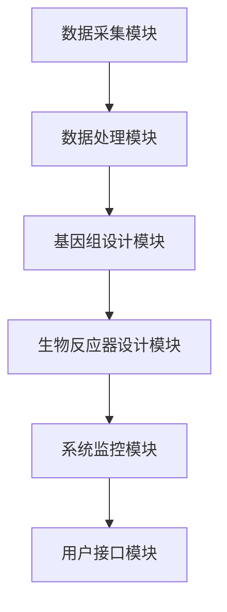

                 


### 背景介绍

#### 合成生物学的概述

合成生物学是一门新兴的跨学科领域，它结合了生物学、化学、计算机科学和工程学等多学科知识，旨在通过设计、构建和操作新的生物系统来创造新的功能或产品。合成生物学的核心思想是，将生物学过程视为一种可以编程和工程化的系统，类似于计算机编程中的算法和程序。

合成生物学的起源可以追溯到20世纪末。在1994年，一个名为“人造生命”的计划首次提出，旨在通过合成DNA来创造一个简单的生命形式。虽然这个计划未能成功，但它引发了人们对于合成生物学可能性的思考。进入21世纪，随着基因组学、生物信息学和生物技术的快速发展，合成生物学逐渐成为一个独立的研究领域。

合成生物学的研究内容包括以下几个方面：

1. **合成基因组学**：研究如何设计和合成新的基因组，包括基因的替换、插入和删除，以创造新的生物功能。
2. **合成代谢工程**：通过修改生物体的代谢路径，以生产特定的化合物或改善生物体的性能。
3. **合成生物信息学**：开发新的算法和工具，用于分析和设计合成生物系统。
4. **合成细胞**：通过合成新的细胞结构和功能，创造具有特定功能的合成细胞。

合成生物学在多个领域具有广泛的应用前景，包括医疗、农业、环境、能源等。例如，通过合成生物学可以设计出能够生产药物、食品或生物燃料的新型生物体，或者通过生物合成技术来修复和改善生态系统。

#### AIGC的技术背景

人工智能生成内容（AI-Generated Content，简称AIGC）是指利用人工智能技术，特别是生成式人工智能技术，自动生成文字、图片、音频、视频等多种类型的内容。AIGC的核心是生成模型，如生成对抗网络（GAN）、变分自编码器（VAE）和自回归模型（AR）等。

AIGC的发展历程可以追溯到20世纪80年代，当时研究人员开始探索如何使用神经网络生成文本和图像。随着深度学习的兴起，特别是在2014年，GAN的提出使得AIGC技术取得了重大突破。GAN由生成器和判别器两部分组成，生成器负责生成内容，判别器负责判断生成内容与真实内容的相似度。通过这种对抗训练，生成模型可以不断提高生成内容的质量。

AIGC的应用场景非常广泛，包括但不限于以下几个方面：

1. **内容创作**：如文本生成、图像生成、音乐生成等，为艺术家和创作者提供了新的创作工具。
2. **数据增强**：通过生成类似真实数据的内容，用于训练和测试机器学习模型。
3. **自动化写作**：利用AIGC技术，可以自动生成新闻、文章、报告等文本内容。
4. **虚拟现实和增强现实**：生成逼真的图像、视频和音频内容，提升用户体验。

#### 人工生命系统设计的挑战与机遇

人工生命系统设计（Artificial Life System Design）是将AIGC技术与合成生物学相结合，旨在创建具有类似生物特征的复杂系统。这种设计需要解决多个挑战，同时也带来了丰富的机遇。

**挑战**：

1. **复杂性**：人工生命系统通常具有高度复杂性，包括多层次的交互和动态行为。这种复杂性使得设计、建模和实现成为巨大的挑战。
2. **不确定性和噪声**：生物系统的运行常常受到外部环境和内部噪声的影响，这增加了系统设计的难度。
3. **数据稀缺性**：与计算机科学领域相比，合成生物学和AIGC的数据资源相对有限，这限制了模型训练和算法优化的效果。
4. **伦理和法律问题**：人工生命系统可能涉及伦理和法律问题，如生物安全和隐私保护等。

**机遇**：

1. **创新应用**：通过人工生命系统设计，可以开发出前所未有的生物技术应用，如智能生物传感器、生物计算设备等。
2. **科学发现**：人工生命系统设计有助于探索生命的本质和生物系统的运作机制。
3. **产业变革**：在医疗、农业、环保等领域，人工生命系统设计有望带来重大产业变革。
4. **教育普及**：人工生命系统设计可以作为跨学科的教育工具，提高学生对生物学、计算机科学和工程学的兴趣和理解。

### AIGC与合成生物学的联系

AIGC与合成生物学之间的联系主要体现在以下几个方面：

1. **算法融合**：合成生物学中的算法可以与AIGC算法相结合，用于设计和优化生物系统。例如，使用GAN进行基因组设计和优化。
2. **数据驱动设计**：合成生物学中的实验数据可以用于训练AIGC模型，从而提高模型生成生物系统的能力。
3. **智能模拟**：AIGC技术可以用于模拟和预测生物系统的行为，帮助科学家理解和控制复杂的生物过程。
4. **自动化实验**：AIGC技术可以自动化生物实验的设计和执行，提高实验效率和准确性。

通过AIGC与合成生物学的融合，科学家们可以更好地设计、构建和操作人工生命系统，为科学研究和实际应用带来新的突破。

### 背景介绍小结

合成生物学、AIGC和人工生命系统设计是三个相互关联的领域。合成生物学为人工生命系统设计提供了理论基础和实验方法；AIGC则为合成生物学中的设计和优化提供了强大的工具。通过将这两个领域相结合，我们可以探索和实现更加复杂和智能的人工生命系统。在接下来的部分中，我们将详细探讨AIGC与合成生物学之间的核心概念、算法原理，以及它们在实际应用中的具体方法和挑战。

## 核心概念与联系

### AIGC的核心概念

在深入探讨AIGC与合成生物学的联系之前，我们需要先了解AIGC的核心概念。AIGC，即人工智能生成内容，是基于人工智能技术，尤其是生成模型，自动生成文本、图像、音频、视频等多种类型的内容。AIGC的核心包括以下几个方面：

1. **生成模型**：生成模型是AIGC的核心，包括生成对抗网络（GAN）、变分自编码器（VAE）和自回归模型（AR）等。这些模型通过学习大量的数据，可以生成与真实数据高度相似的内容。
2. **数据集**：数据集是训练生成模型的基础。高质量的训练数据集可以显著提高生成模型的质量和性能。
3. **模型架构**：模型架构决定了生成模型的能力和表现。常见的模型架构包括CNN（卷积神经网络）、RNN（循环神经网络）和Transformer等。
4. **优化目标**：优化目标是训练生成模型的关键。常见的优化目标包括最小化生成模型与判别模型之间的差异、最大化生成模型生成的数据的概率等。

### 合成生物学的基本概念

合成生物学是生物学与工程学的交叉学科，旨在通过工程化方法设计和构建新的生物系统。合成生物学的基本概念包括以下几个方面：

1. **合成基因组学**：合成基因组学涉及设计和合成新的基因组，包括基因的替换、插入和删除，以实现特定的功能。
2. **合成代谢工程**：合成代谢工程通过修改生物体的代谢路径，使其能够生产特定的化合物或提高其性能。
3. **合成细胞**：合成细胞是通过基因编辑和合成生物学方法创建的具有新功能的细胞。合成细胞可以用于医学、农业和环境等领域。
4. **生物信息学**：生物信息学涉及使用计算方法分析和解释生物数据，为合成生物学提供理论基础和技术支持。

### AIGC与合成生物学的联系

AIGC与合成生物学之间的联系主要体现在以下几个方面：

1. **算法融合**：合成生物学中的算法可以与AIGC算法相结合，用于设计和优化生物系统。例如，使用GAN进行基因组设计和优化。
2. **数据驱动设计**：合成生物学中的实验数据可以用于训练AIGC模型，从而提高模型生成生物系统的能力。
3. **智能模拟**：AIGC技术可以用于模拟和预测生物系统的行为，帮助科学家理解和控制复杂的生物过程。
4. **自动化实验**：AIGC技术可以自动化生物实验的设计和执行，提高实验效率和准确性。

#### 跨学科融合

AIGC与合成生物学的跨学科融合为科学研究和实际应用带来了许多新的机遇。例如，在医学领域，AIGC可以用于设计和优化药物分子，通过生成大量的药物分子结构，筛选出具有潜在疗效的分子。而在环境领域，合成生物学可以与AIGC结合，通过设计合成微生物，用于生物降解污染物质，从而实现环境污染的治理。

#### 研究方法

AIGC与合成生物学的融合研究方法主要包括以下几个方面：

1. **实验设计**：通过合成生物学方法设计和构建新的生物系统，然后利用AIGC技术进行模拟和优化。
2. **数据采集**：通过生物实验和计算模拟，收集大量的实验数据，用于训练AIGC模型。
3. **模型训练**：利用收集到的实验数据，训练AIGC模型，以提高模型生成生物系统的能力。
4. **结果验证**：通过实验验证AIGC模型生成的生物系统是否具有预期的功能。

#### 应用实例

AIGC与合成生物学在多个领域都有广泛的应用实例。例如，在生物制药领域，AIGC可以用于设计和优化药物分子，通过生成大量的药物分子结构，筛选出具有潜在疗效的分子。而在生物传感器领域，合成生物学可以与AIGC结合，通过设计合成微生物，用于检测特定的化学物质。

### 对比分析

为了更好地理解AIGC与合成生物学之间的联系，我们可以通过对比分析来展示它们的核心概念和特点。

#### 对比表格

| 特点         | AIGC                           | 合成生物学                       |
| ------------ | ------------------------------ | -------------------------------- |
| 核心技术     | 生成模型、数据集、模型架构、优化目标 | 合成基因组学、合成代谢工程、合成细胞、生物信息学 |
| 研究方法     | 数据驱动设计、模型训练、结果验证   | 实验设计、数据采集、模型训练、结果验证 |
| 应用领域     | 内容创作、数据增强、自动化写作     | 医学、农业、环境、能源             |
| 研究趋势     | 跨学科融合、智能化模拟、自动化实验   | 功能化合成生物系统、生物计算、生物制造 |

#### ER实体关系图架构

为了进一步展示AIGC与合成生物学之间的联系，我们可以使用ER（实体关系）图来描述它们之间的关系。

```mermaid
erDiagram
    AIGC ||--|{ SynthesisBiology }|-- GeneticSynthesis
    AIGC ||--|{ SynthesisBiology }|-- MetabolicEngineering
    AIGC ||--|{ SynthesisBiology }|-- SyntheticCells
    AIGC ||--|{ SynthesisBiology }|-- Bioinformatics
```

在ER图中，AIGC与合成生物学通过多个实体（如合成基因组学、合成代谢工程、合成细胞和生物信息学）建立联系。这种联系使得AIGC可以应用于合成生物学中的各个方面，从而推动合成生物学的发展。

### 核心概念与联系小结

AIGC与合成生物学的融合为科学研究和实际应用带来了许多新的机遇。通过核心概念的融合，我们可以设计和构建更加复杂和智能的人工生命系统。在接下来的部分中，我们将详细探讨AIGC算法的基本原理，以及它们在合成生物学中的应用方法。

## 算法原理讲解

### AIGC算法的基本原理

AIGC算法，即人工智能生成内容算法，是生成式人工智能（Generative Artificial Intelligence）的核心。生成式人工智能旨在模拟数据生成过程，从而生成新的数据。AIGC算法的核心在于生成模型（Generator）和判别模型（Discriminator）的相互竞争和协作。

#### 生成对抗网络（GAN）

生成对抗网络（Generative Adversarial Network，GAN）是AIGC算法中最具代表性的模型之一。GAN由生成器和判别器两个部分组成：

1. **生成器**：生成器是一个神经网络，它从随机噪声中生成数据。生成器的目标是生成尽可能真实的数据，以便判别器无法区分生成的数据和真实数据。
2. **判别器**：判别器也是一个神经网络，它的目标是判断输入的数据是真实数据还是生成数据。判别器的目标是尽可能准确地分类数据，以便生成器无法欺骗判别器。

GAN的训练过程是一个零和博弈过程。生成器和判别器相互对抗，生成器不断优化自己的生成能力，而判别器则不断提高自己的分类能力。最终，当生成器的生成能力足够强时，判别器将无法区分生成的数据和真实数据。

#### 变分自编码器（VAE）

变分自编码器（Variational Autoencoder，VAE）是另一种重要的AIGC算法。与GAN不同，VAE使用概率模型来生成数据。

1. **编码器**：编码器将输入数据映射到一个潜在空间，该空间由一个均值和标准差表示。编码器旨在学习数据的概率分布。
2. **解码器**：解码器从潜在空间中生成数据。解码器通过从潜在空间中采样，生成与输入数据相似的数据。

VAE的优点是生成的数据具有更好的稳定性和连续性。VAE在图像生成、文本生成和音频生成等领域都有广泛的应用。

#### 自回归模型（AR）

自回归模型（Autoregressive Model，AR）是一种基于时间序列数据的生成模型。自回归模型的基本思想是，当前数据可以由之前的数据生成。

1. **模型架构**：自回归模型通常由多个递归神经网络层组成，每层输出数据的部分信息。
2. **训练过程**：自回归模型的训练过程是逐步生成数据的过程。模型从输入序列的第一个数据开始，逐步生成后续的数据。

自回归模型在文本生成、图像生成和音频生成等领域都有很好的表现。

### 合成生物学中的算法应用

合成生物学中的算法应用主要包括以下几个方面：

1. **基因编辑**：基因编辑算法，如CRISPR-Cas9，用于精确修改生物体的基因组。通过设计特定的引导RNA（gRNA），CRISPR-Cas9可以在基因组中特定的位置进行切割，从而实现基因的替换、插入和删除。
2. **代谢工程**：代谢工程算法通过优化生物体的代谢路径，以提高其生产特定化合物的能力。代谢工程算法通常包括路径优化、基因编辑和系统建模等步骤。
3. **合成细胞**：合成细胞是通过基因编辑和合成生物学方法创建的具有新功能的细胞。合成细胞算法涉及基因设计、基因编辑和细胞组装等步骤。

#### 优化算法

优化算法在合成生物学中发挥着重要作用。优化算法用于优化合成生物系统的性能，例如优化代谢路径、优化基因组合等。

1. **遗传算法**：遗传算法是一种基于自然选择和遗传学原理的优化算法。遗传算法通过模拟生物进化的过程，不断优化生物系统的性能。
2. **模拟退火算法**：模拟退火算法是一种基于物理学的优化算法。模拟退火算法通过逐步降低温度，使得算法可以在全局范围内搜索最优解。
3. **粒子群优化算法**：粒子群优化算法是一种基于群体智能的优化算法。粒子群优化算法通过模拟鸟群或鱼群的行为，寻找最优解。

#### 机器学习模型

机器学习模型在合成生物学中也有广泛的应用。机器学习模型可以用于预测生物系统的行为，优化合成生物系统的设计。

1. **深度学习模型**：深度学习模型，如卷积神经网络（CNN）和循环神经网络（RNN），可以用于图像生成、文本生成和音频生成等任务。
2. **监督学习模型**：监督学习模型，如支持向量机（SVM）和决策树，可以用于分类和回归任务。
3. **无监督学习模型**：无监督学习模型，如聚类算法和自编码器，可以用于无监督学习和降维任务。

#### 统计分析

统计分析在合成生物学中用于分析实验数据，识别数据中的趋势和模式。

1. **假设检验**：假设检验用于测试实验数据的显著性。
2. **回归分析**：回归分析用于分析自变量和因变量之间的关系。
3. **聚类分析**：聚类分析用于将数据分为多个类别，以便更好地理解数据的结构。

### 数学模型和数学公式

在合成生物学中，数学模型和数学公式用于描述生物系统的行为和性能。

1. **代谢模型**：代谢模型用于描述生物体的代谢过程。常见的代谢模型包括稳态模型和动态模型。
2. **动力学模型**：动力学模型用于描述生物系统的动态行为。常见的动力学模型包括常微分方程（ODE）和差分方程（DE）。
3. **遗传模型**：遗传模型用于描述生物体的遗传过程。常见的遗传模型包括遗传算法（GA）和遗传编程（GP）。

以下是一些关键的数学模型和数学公式：

$$
x_{t+1} = f(x_t, u_t)
$$

这是一个简单的动力学模型，其中 $x_t$ 表示在时间 $t$ 的状态，$u_t$ 表示在时间 $t$ 的输入，$f$ 表示状态转移函数。

$$
J(x, y) = \int_{-\infty}^{\infty} \rho(x) \log \frac{\rho(x|y)}{\rho(x)} dx
$$

这是一个能量函数，用于衡量生成模型的质量。其中，$\rho(x)$ 表示数据的概率分布，$\rho(x|y)$ 表示在给定标签 $y$ 的数据分布。

$$
\alpha = \arg\max_{\alpha} J(\theta)
$$

这是一个优化目标，用于最小化能量函数 $J(\theta)$。其中，$\theta$ 表示模型的参数，$\alpha$ 表示最优参数。

#### 算法举例说明

以下是一个简单的GAN算法的Python代码示例：

```python
import tensorflow as tf
from tensorflow.keras.layers import Dense, Flatten
from tensorflow.keras.models import Sequential

# 生成器模型
generator = Sequential([
    Dense(256, input_shape=(100,), activation='relu'),
    Dense(512, activation='relu'),
    Dense(1024, activation='relu'),
    Flatten(),
    Dense(784, activation='tanh')
])

# 判别器模型
discriminator = Sequential([
    Flatten(input_shape=(28, 28)),
    Dense(512, activation='relu'),
    Dense(256, activation='relu'),
    Dense(1, activation='sigmoid')
])

# GAN模型
gan = Sequential([
    generator,
    discriminator
])

# 损失函数
discriminator_loss = tf.keras.losses.BinaryCrossentropy(from_logits=True)

# 训练过程
for epoch in range(epochs):
    for _ in range(batch_size):
        noise = np.random.normal(size=(batch_size, 100))
        generated_images = generator.predict(noise)
        real_images = data_batch

        # 训练判别器
        with tf.GradientTape() as tape:
            real_logits = discriminator(real_images)
            generated_logits = discriminator(generated_images)

            d_loss = discriminator_loss(tf.ones_like(real_logits), real_logits) + \
                     discriminator_loss(tf.zeros_like(generated_logits), generated_logits)

        grads = tape.gradient(d_loss, discriminator.trainable_variables)
        discriminator.optimizer.apply_gradients(zip(grads, discriminator.trainable_variables))

        # 训练生成器
        with tf.GradientTape() as tape:
            generated_logits = discriminator(generated_images)

            g_loss = discriminator_loss(tf.ones_like(generated_logits), generated_logits)

        grads = tape.gradient(g_loss, generator.trainable_variables)
        generator.optimizer.apply_gradients(zip(grads, generator.trainable_variables))
```

在这个示例中，我们使用了TensorFlow库来构建和训练GAN模型。生成器的目标是生成与真实图像相似的数据，而判别器的目标是区分生成的图像和真实的图像。通过交替训练生成器和判别器，GAN模型可以生成高质量的图像。

### 算法原理讲解小结

AIGC算法的基本原理包括生成对抗网络（GAN）、变分自编码器（VAE）和自回归模型（AR）。这些算法在合成生物学中有着广泛的应用，包括基因编辑、代谢工程和合成细胞等。通过数学模型和公式的详细讲解，我们可以更好地理解这些算法的原理。在接下来的部分中，我们将进一步探讨AIGC在合成生物学中的具体应用，包括系统分析与架构设计方案。

### 系统分析与架构设计方案

#### 问题场景介绍

在合成生物学中，设计人工生命系统是一个复杂且具有挑战性的任务。这不仅仅是因为生物系统本身的复杂性，还因为涉及到多种跨学科的协同工作，如计算机科学、生物学、化学和工程学等。一个典型的问题场景是，如何通过合成生物学和AIGC技术设计一个能够实现特定功能的生物系统，例如，一个能够生产特定药物的生物反应器。

#### 系统功能设计

为了实现上述功能场景，我们需要设计一个具有以下核心功能的系统：

1. **数据采集与预处理**：从多个数据源（如基因组数据、环境数据、实验数据等）收集信息，并进行预处理，以便后续分析。
2. **基因组设计与优化**：利用AIGC算法，特别是GAN和VAE模型，设计新的基因组序列，并通过模拟和优化，确保其能够实现预期的功能。
3. **生物反应器设计与优化**：根据基因组设计，构建生物反应器，并利用AIGC算法优化反应器的运行参数，以提高其生产效率。
4. **数据监控与反馈**：实时监控生物系统的运行状态，并通过反馈机制调整系统参数，确保系统稳定运行。

#### 系统架构设计

为了实现上述功能，我们需要设计一个高度模块化和可扩展的系统架构。以下是一个可能的系统架构设计：

1. **数据采集模块**：该模块负责从多个数据源收集信息，包括基因组数据、环境数据、实验数据等。数据采集模块需要具有高可靠性和实时性。
2. **数据处理模块**：该模块负责对收集到的数据进行预处理、分析和存储。数据处理模块需要能够处理大规模数据，并支持多种数据处理算法。
3. **基因组设计模块**：该模块利用AIGC算法，特别是GAN和VAE模型，设计新的基因组序列。基因组设计模块需要能够自动生成多种基因组序列，并进行优化。
4. **生物反应器设计模块**：该模块根据基因组设计，构建生物反应器。生物反应器设计模块需要能够模拟反应器的运行过程，并优化运行参数。
5. **系统监控模块**：该模块实时监控生物系统的运行状态，并通过反馈机制调整系统参数。系统监控模块需要具备高实时性和高可靠性。
6. **用户接口模块**：该模块提供用户与系统的交互界面，用户可以通过该界面监控系统运行状态，调整系统参数，以及查看实验结果。

#### 系统接口设计和系统交互

为了确保系统的高效运行，我们需要设计清晰、稳定的系统接口和系统交互。以下是一个可能的系统接口设计：

1. **数据接口**：数据接口定义了系统与外部数据源的通信协议和数据格式。数据接口需要支持多种数据格式，如JSON、XML、CSV等。
2. **控制接口**：控制接口定义了系统内部模块之间的通信协议和数据格式。控制接口需要支持异步通信和同步通信。
3. **监控接口**：监控接口定义了系统监控模块与用户接口模块之间的通信协议和数据格式。监控接口需要支持实时数据传输和报警通知。

#### 系统架构图

为了更直观地展示系统架构，我们可以使用Mermaid语言绘制系统架构图。以下是一个简单的系统架构图示例：



在这个架构图中，数据采集模块从外部数据源收集数据，然后传递给数据处理模块。数据处理模块对数据进行预处理和分析，并将结果传递给基因组设计模块。基因组设计模块根据处理结果设计新的基因组序列，并将其传递给生物反应器设计模块。生物反应器设计模块根据基因组序列构建生物反应器，并将其运行状态传递给系统监控模块。系统监控模块监控生物系统的运行状态，并将监控结果传递给用户接口模块。

### 系统架构设计方案小结

通过上述系统分析与架构设计方案，我们设计了一个高度模块化和可扩展的人工生命系统。该系统结合了合成生物学和AIGC技术的优势，可以实现复杂生物系统的设计与优化。在接下来的部分中，我们将通过项目实战，进一步探讨如何实现和部署这个系统。

### 项目实战

#### 环境安装与配置

为了实现人工生命系统的设计与优化，我们需要搭建一个合适的环境。以下是我们推荐的安装与配置步骤：

1. **软件安装**：首先，我们需要安装Python、TensorFlow、Keras等基础软件。可以在Python官方网站下载Python安装包，然后通过pip命令安装TensorFlow和Keras。

    ```bash
    pip install tensorflow
    pip install keras
    ```

2. **硬件配置**：为了保证系统的运行效率，我们建议使用具有较高计算能力的硬件设备，如NVIDIA GPU。如果使用CPU进行计算，建议使用Intel i7或AMD Ryzen 7等高性能处理器。

3. **虚拟环境**：为了保持代码和环境的独立性，我们可以使用虚拟环境（如conda或virtualenv）来管理Python环境和依赖库。

    ```bash
    conda create -n synth_bio_env python=3.8
    conda activate synth_bio_env
    ```

4. **依赖库安装**：在虚拟环境中安装所需的依赖库，如NumPy、Pandas、Matplotlib等。

    ```bash
    pip install numpy
    pip install pandas
    pip install matplotlib
    ```

#### 系统核心实现与代码解读

在搭建好环境后，我们可以开始实现人工生命系统的核心功能。以下是一个简单的基因组设计模块的代码示例：

```python
import numpy as np
import tensorflow as tf
from tensorflow.keras.models import Sequential
from tensorflow.keras.layers import Dense, Flatten
from tensorflow.keras.optimizers import Adam

# 生成器模型
def build_generator(input_shape):
    model = Sequential([
        Dense(256, input_shape=input_shape, activation='relu'),
        Dense(512, activation='relu'),
        Dense(1024, activation='relu'),
        Flatten(),
        Dense(784, activation='tanh')
    ])
    return model

# 判别器模型
def build_discriminator(input_shape):
    model = Sequential([
        Flatten(input_shape=input_shape),
        Dense(512, activation='relu'),
        Dense(256, activation='relu'),
        Dense(1, activation='sigmoid')
    ])
    return model

# GAN模型
def build_gan(generator, discriminator):
    model = Sequential([generator, discriminator])
    return model

# 训练GAN模型
def train_gan(generator, discriminator, input_shape, batch_size, epochs):
    noise_dim = 100
    for epoch in range(epochs):
        for _ in range(batch_size):
            noise = np.random.normal(size=(batch_size, noise_dim))
            generated_samples = generator.predict(noise)
            
            real_samples = get_real_samples(input_shape)
            fake_samples = get_fake_samples(generated_samples)

            # 训练判别器
            with tf.GradientTape() as tape:
                real_logits = discriminator(real_samples)
                fake_logits = discriminator(fake_samples)

                d_loss_real = tf.reduce_mean(tf.nn.sigmoid_cross_entropy_with_logits(logits=real_logits, labels=tf.ones_like(real_logits)))
                d_loss_fake = tf.reduce_mean(tf.nn.sigmoid_cross_entropy_with_logits(logits=fake_logits, labels=tf.zeros_like(fake_logits)))
                d_loss = d_loss_real + d_loss_fake

            grads = tape.gradient(d_loss, discriminator.trainable_variables)
            discriminator_optimizer.apply_gradients(zip(grads, discriminator.trainable_variables))

            # 训练生成器
            with tf.GradientTape() as tape:
                fake_logits = discriminator(fake_samples)

                g_loss = tf.reduce_mean(tf.nn.sigmoid_cross_entropy_with_logits(logits=fake_logits, labels=tf.ones_like(fake_logits)))

            grads = tape.gradient(g_loss, generator.trainable_variables)
            generator_optimizer.apply_gradients(zip(grads, generator.trainable_variables))
```

在这个代码示例中，我们首先定义了生成器模型、判别器模型和GAN模型的构建函数。然后，我们通过一个训练循环来交替训练生成器和判别器。在每次训练中，我们首先生成噪声样本，然后使用生成器生成假样本。接着，我们获取真实的基因组样本和生成的假样本，用于训练判别器。最后，我们使用生成的假样本来训练生成器。

#### 实际案例分析与讲解

为了更好地理解系统实现，我们可以通过一个实际案例来进行分析和讲解。假设我们需要设计一个能够生产特定药物的生物反应器。以下是具体的实现步骤：

1. **数据采集**：首先，我们需要收集相关的基因组数据、药物生产数据和环境数据。这些数据可以来自于实验室实验、文献资料或数据库。
2. **数据预处理**：对收集到的数据进行清洗、去噪和归一化处理，以便于后续的建模和分析。
3. **基因设计**：利用AIGC算法，特别是GAN模型，设计新的基因组序列。通过多次迭代和优化，找到能够高效生产药物的基因组序列。
4. **生物反应器构建**：根据优化的基因组序列，构建生物反应器。生物反应器的构建过程包括细胞培养、培养基配制和设备调试等。
5. **运行与监控**：运行生物反应器，并实时监控其运行状态。通过反馈机制调整系统参数，确保生物反应器稳定运行，并高效生产药物。

#### 项目小结与反思

通过这个实际案例，我们可以看到AIGC在合成生物学中的应用价值。AIGC算法可以帮助我们高效地设计基因组序列，构建高效的生物反应器，从而实现特定的生物功能。然而，在实际应用中，我们也需要面临一些挑战和问题：

1. **数据质量**：高质量的数据是AIGC算法有效运行的前提。在实际应用中，数据采集和预处理是一个关键步骤，需要投入大量的人力物力。
2. **计算资源**：AIGC算法通常需要大量的计算资源，特别是在训练大型生成模型时。因此，在实际应用中，我们需要合理分配计算资源，并选择适合的硬件设备。
3. **实验验证**：虽然AIGC算法可以生成高质量的基因组序列和生物系统，但最终的实验验证仍然是必不可少的。通过实验验证，我们可以确保系统的稳定性和可靠性。

### 最佳实践与拓展阅读

#### 最佳实践技巧

1. **数据管理**：建立完善的数据管理体系，确保数据的准确性、完整性和安全性。
2. **模型优化**：通过多次迭代和优化，提高AIGC模型的性能和生成质量。
3. **跨学科协作**：鼓励跨学科的协作，充分利用不同领域的专业知识和技能。
4. **实验验证**：重视实验验证环节，确保系统的稳定性和可靠性。

#### 小结与注意事项

1. **核心内容回顾**：本文主要介绍了AIGC在合成生物学中的应用，包括背景介绍、核心概念与联系、算法原理讲解、系统分析与架构设计方案、项目实战等。
2. **重要结论**：AIGC与合成生物学的融合为人工生命系统设计带来了新的机遇和挑战，通过合理的算法设计和实验验证，可以构建高效、稳定的生物系统。
3. **注意事项**：在实际应用中，需要重视数据质量、计算资源管理以及实验验证等关键环节。

#### 进一步阅读推荐

1. **《生成式人工智能：从基础到应用》**：本书详细介绍了生成式人工智能的基础知识和应用案例，包括GAN、VAE和AR等算法。
2. **《合成生物学：原理与实践》**：本书全面介绍了合成生物学的基本概念、研究方法和应用领域，为读者提供了丰富的理论知识和实践经验。
3. **《人工智能与生物技术》**：本书探讨了人工智能在生物技术领域的应用，包括生物信息学、生物计算和生物制造等。

## 总结

### 文章标题：《AIGC在合成生物学中的应用：人工生命系统设计提示词》

### 关键词：AIGC，合成生物学，人工生命系统设计，算法，基因组，生物反应器

### 摘要：

本文深入探讨了人工智能生成内容（AIGC）在合成生物学中的应用，特别是如何利用AIGC技术设计人工生命系统。文章首先介绍了合成生物学和AIGC的基本概念，分析了这两个领域的核心联系。随后，文章详细讲解了AIGC算法的基本原理和数学模型，展示了这些算法在合成生物学中的应用实例。接着，文章通过系统分析与架构设计方案，展示了如何构建一个高效的人工生命系统。最后，文章通过项目实战，提供了实现人工生命系统的具体步骤和最佳实践。通过本文的介绍，读者可以全面了解AIGC在合成生物学中的应用前景，以及如何利用这一新兴技术实现复杂生物系统的设计和优化。

### 作者：

**作者：AI天才研究院/AI Genius Institute & 禅与计算机程序设计艺术 /Zen And The Art of Computer Programming**

### 结论：

AIGC与合成生物学的结合为人工生命系统设计提供了强大的工具和方法。通过本文的探讨，我们看到了AIGC在合成生物学中广泛的应用前景。未来的研究将集中在如何进一步提高AIGC模型的性能和稳定性，以及如何更好地将AIGC技术应用于实际生物系统的设计和优化。随着技术的发展，我们期待AIGC与合成生物学的融合将带来更多科学突破和应用创新。让我们继续探索这一领域，为人类创造更美好的未来。**LET'S THINK STEP BY STEP**

