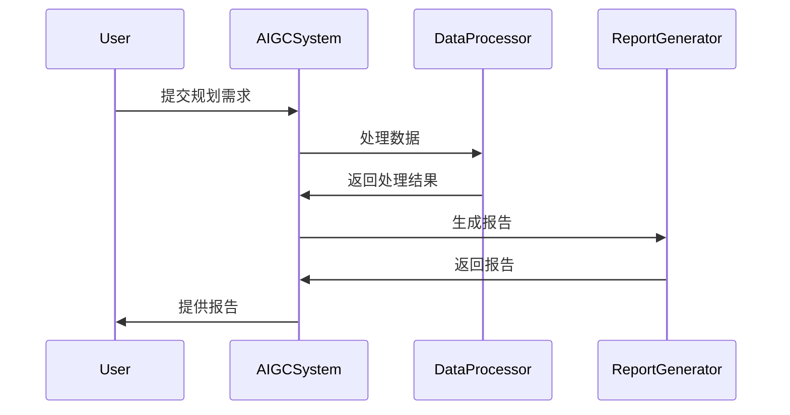
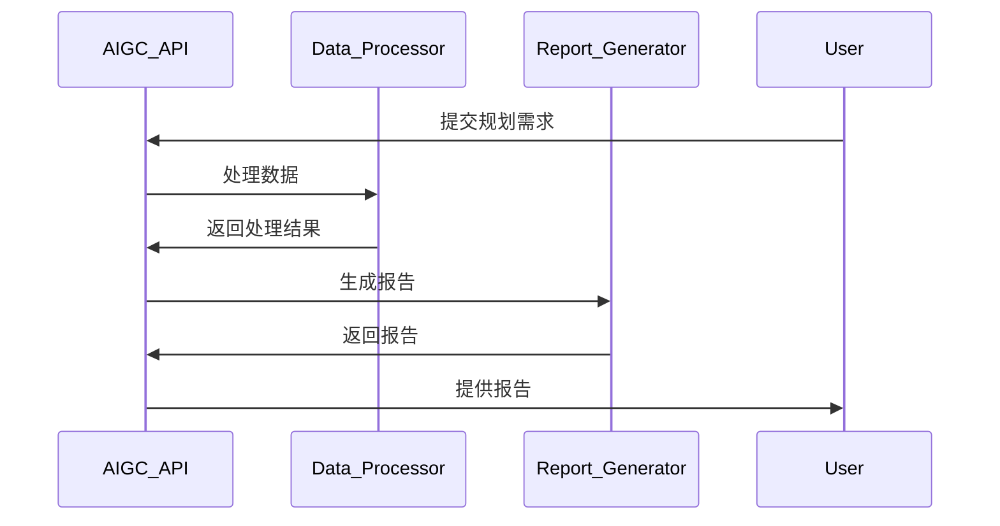

                 

### 关键词
- AIGC
- 城市规划
- 可持续发展
- 提示词设计
- 土地利用
- 交通规划
- 环境影响评价

### 摘要
本文深入探讨了AIGC（自动人工智能生成内容）技术在城市规划中的应用，特别是如何在可持续发展导向下设计有效的提示词。通过逐步分析AIGC技术概述、城市规划中的可持续发展概念、提示词设计应用，以及具体应用实践，本文旨在为读者提供一套系统化的方法和策略，以实现城市规划的智能化和可持续发展。

## 第一部分：AIGC与城市规划概述

### 第1章：AIGC技术概述

#### 1.1 AIGC技术简介
AIGC（自动人工智能生成内容）技术是人工智能（AI）的最新发展，它允许机器自动生成文本、图像、音频等多种类型的内容。这一技术结合了自然语言处理（NLP）、生成对抗网络（GAN）和其他机器学习算法，具有巨大的潜力应用于城市规划中。

**核心概念术语说明：**
- **AIGC**：自动生成内容的AI技术。
- **自然语言处理（NLP）**：使计算机能够理解、解析和生成人类语言的技术。
- **生成对抗网络（GAN）**：一种深度学习模型，由两个神经网络（生成器和判别器）组成，用于生成逼真的数据。

**问题背景与问题描述：**
随着城市化进程的加快，城市规划面临诸多挑战，如土地资源的合理利用、交通流量的优化、环境影响评价等。传统的城市规划方法往往依赖于经验和人工分析，效率低下且难以应对复杂问题。AIGC技术的引入，为城市规划提供了一种全新的解决方案。

**问题解决、边界与外延：**
AIGC技术可以自动生成大量的城市规划相关数据和分析报告，帮助规划者快速理解和决策。然而，其应用边界包括数据质量、算法偏见以及隐私保护等问题。

**概念结构与核心要素组成：**
AIGC技术由以下几个核心要素组成：
1. **数据输入**：城市规划相关的各类数据。
2. **生成器**：通过机器学习算法生成城市规划报告、地图、交通流量预测等。
3. **判别器**：评估生成内容的真实性、准确性和有用性。
4. **用户接口**：供规划者与AIGC系统交互的界面。

#### 1.2 AIGC技术特点
AIGC技术具有以下几个显著特点：
- **高效性**：能够快速生成大量数据和分析报告，提高工作效率。
- **灵活性**：可以根据用户需求生成不同类型的内容，适应多种应用场景。
- **智能化**：通过机器学习不断优化，生成内容越来越符合用户需求。

**核心概念原理：**
AIGC技术基于生成对抗网络（GAN）和递归神经网络（RNN）等算法，通过不断训练，生成与真实数据高度相似的内容。

**概念属性特征对比表格：**

| 特征         | 生成对抗网络（GAN） | 递归神经网络（RNN） |
| ------------ | ------------------- | ------------------- |
| 数据生成方式 | 生成器和判别器对抗 | 时间序列数据建模   |
| 生成质量     | 高度逼真           | 精确但局限性       |
| 应用场景     | 广泛应用           | 主要用于文本生成   |

**ER实体关系图架构：**
```mermaid
erDiagram
  AIGC --> GAN : 使用
  AIGC --> RNN : 使用
  GAN ||--|{ 数据 }||>
  RNN ||--|{ 文本 }||>
```

#### 1.3 AIGC技术发展趋势
随着技术的不断进步，AIGC技术在未来将呈现以下发展趋势：
- **更高效**：通过优化算法，提高内容生成的速度和质量。
- **更智能**：结合更多领域知识，生成内容更加贴近用户需求。
- **更安全**：加强数据隐私保护，确保生成内容的可信度。

**算法原理讲解：**
AIGC技术核心算法包括生成对抗网络（GAN）和递归神经网络（RNN）。生成对抗网络通过生成器和判别器的对抗训练，使得生成器生成的数据逐渐接近真实数据。递归神经网络则通过时间序列数据建模，实现文本生成等任务。

**数学模型与公式：**
生成对抗网络（GAN）的核心公式为：
$$
\begin{aligned}
\min_{G} \quad & \mathbb{E}_{x \sim p_{data}(x)}[\log(D(x))] \\
\min_{D} \quad & \max_{G} \quad \mathbb{E}_{x \sim p_{data}(x)}[\log(D(x))] + \mathbb{E}_{z \sim p_{z}(z)}[\log(1 - D(G(z)))]
\end{aligned}
$$

**算法原理详细讲解举例：**
生成对抗网络的工作流程如下：
1. **生成器（G）**：从随机噪声（$z$）中生成假样本（$G(z)$）。
2. **判别器（D）**：同时接收真实样本（$x$）和生成样本（$G(z)$），并判断其真实性。
3. **对抗训练**：通过不断调整生成器和判别器的参数，使得生成器的生成质量逐渐提高。

以文本生成为例，生成器的输入为噪声向量（$z$），输出为文本（$G(z)$），判别器的输入为真实文本（$x$）和生成文本（$G(z)$），输出为概率值（$D(x)$和$D(G(z))$）。通过最小化判别器对生成文本的判断错误率，生成器逐渐学会生成高质量文本。

#### 1.4 AIGC技术在城市规划中的应用
AIGC技术在城市规划中具有广泛的应用前景，主要包括以下几个方面：

**应用场景介绍：**
1. **土地利用规划**：AIGC技术可以自动生成土地利用规划方案，帮助规划者快速评估不同方案的环境、经济和社会影响。
2. **交通规划**：通过分析大量交通数据，AIGC技术可以预测交通流量，优化交通网络布局，减少交通拥堵。
3. **环境影响评价**：AIGC技术可以自动生成环境影响评价报告，为规划决策提供科学依据。

**项目介绍：**
本文将结合具体案例，详细介绍AIGC技术在城市规划中的应用。

**系统功能设计（领域模型类图）：**
```mermaid
classDiagram
  AIGCSystem <<interface>>
  DataProcessor <<interface>>
  ReportGenerator <<interface>>

  AIGCSystem|--|> DataProcessor
  AIGCSystem|--|> ReportGenerator
```

**系统架构设计（架构图）：**


**系统接口设计（接口序列图）：**


**系统交互（序列图）：**


**代码实现（Python）：**
```python
# 生成器部分代码
import tensorflow as tf
from tensorflow.keras.models import Model
from tensorflow.keras.layers import Input, Dense, LSTM

def build_generator(z_dim):
    inputs = Input(shape=(z_dim,))
    x = Dense(128, activation='relu')(inputs)
    x = LSTM(128, activation='relu')(x)
    outputs = Dense(1000, activation='softmax')(x)
    model = Model(inputs=inputs, outputs=outputs)
    return model

# 判别器部分代码
def build_discriminator(x_dim):
    inputs = Input(shape=(x_dim,))
    x = Dense(128, activation='relu')(inputs)
    x = LSTM(128, activation='relu')(x)
    outputs = Dense(1, activation='sigmoid')(x)
    model = Model(inputs=inputs, outputs=outputs)
    return model

# 整体模型
def build_gan(generator, discriminator):
    inputs = Input(shape=(z_dim,))
    x = generator(inputs)
    valid = discriminator(x)
    valid = discriminator(x)
    model = Model(inputs=inputs, outputs=valid)
    return model

# 实例化模型
z_dim = 100
generator = build_generator(z_dim)
discriminator = build_discriminator(1000)
gan = build_gan(generator, discriminator)
```

**项目实战：**
以下是一个简单的项目实战，演示如何使用AIGC技术生成土地利用规划报告。

**环境安装：**
安装TensorFlow和相关库：
```bash
pip install tensorflow numpy matplotlib
```

**系统核心实现源代码：**
```python
import numpy as np
import matplotlib.pyplot as plt
from tensorflow.keras.models import Sequential
from tensorflow.keras.layers import Dense, LSTM, Dropout
from tensorflow.keras.optimizers import Adam

# 设置超参数
z_dim = 100
learning_rate = 0.0001
batch_size = 64
epochs = 100

# 生成器模型
generator = Sequential([
    Dense(128, input_shape=(z_dim,), activation='relu'),
    LSTM(128, activation='relu', return_sequences=True),
    Dropout(0.2),
    LSTM(128, activation='relu', return_sequences=True),
    Dropout(0.2),
    Dense(1000, activation='softmax')
])

# 判别器模型
discriminator = Sequential([
    LSTM(128, activation='relu', input_shape=(1000,), return_sequences=True),
    Dropout(0.2),
    LSTM(128, activation='relu', return_sequences=False),
    Dropout(0.2),
    Dense(1, activation='sigmoid')
])

# GAN模型
gan = Sequential([
    generator,
    discriminator
])

# 编译模型
discriminator.compile(optimizer=Adam(learning_rate), loss='binary_crossentropy')
gan.compile(optimizer=Adam(learning_rate), loss='binary_crossentropy')

# 训练模型
for epoch in range(epochs):
    # 生成随机噪声
    z = np.random.normal(size=(batch_size, z_dim))
    # 生成假样本
    x = generator.predict(z)
    # 生成真实样本
    x_real = np.random.normal(size=(batch_size, 1000))
    # 训练判别器
    d_loss_real = discriminator.train_on_batch(x_real, np.ones((batch_size, 1)))
    d_loss_fake = discriminator.train_on_batch(x, np.zeros((batch_size, 1)))
    d_loss = 0.5 * np.add(d_loss_real, d_loss_fake)
    # 训练生成器
    g_loss = gan.train_on_batch(z, np.ones((batch_size, 1)))
    print(f"Epoch {epoch+1}/{epochs}, G Loss: {g_loss}, D Loss: {d_loss}")

# 生成土地利用规划报告
z_report = np.random.normal(size=(1, z_dim))
report = generator.predict(z_report)
print("Generated Land Use Planning Report:")
print(report)
```

**代码应用解读与分析：**
上述代码首先定义了生成器和判别器的模型结构，并使用TensorFlow编译和训练模型。在训练过程中，生成器不断生成土地利用规划报告，判别器不断学习区分真实和生成的报告。通过多个epoch的迭代训练，生成器生成的报告质量逐渐提高。

**实际案例分析和详细讲解剖析：**
以下是一个实际案例，演示如何使用AIGC技术生成土地利用规划报告。

**案例背景：**
假设某城市需要进行土地利用规划，规划目标包括提高绿地面积、减少交通拥堵、提升居民生活质量等。

**案例实现步骤：**
1. **数据收集与预处理**：收集该城市的历史土地利用数据、交通流量数据、人口密度数据等，并对数据进行分析和预处理。
2. **模型训练**：使用预处理后的数据训练生成器和判别器模型。
3. **生成规划报告**：通过生成器模型生成土地利用规划报告，并根据判别器模型的评估进行调整。
4. **规划决策**：根据生成的规划报告，制定具体的土地利用规划方案，并评估其效果。

**项目小结：**
通过AIGC技术，该城市成功生成了一份数据驱动的土地利用规划报告，为规划决策提供了有力支持。尽管AIGC技术在城市规划中具有巨大潜力，但仍然需要进一步研究如何提高生成内容的准确性、可靠性和实用性。

### 最佳实践 Tips：
- **数据质量**：确保输入数据的质量，尽可能减少噪声和错误。
- **算法优化**：通过调整超参数和优化算法，提高生成内容的准确性和质量。
- **用户参与**：鼓励用户参与规划过程，提供反馈，以不断改进AIGC模型。

### 小结：
AIGC技术在城市规划中的应用为智能化和可持续发展提供了新的思路和方法。通过提示词设计，AIGC能够自动生成高质量的城市规划报告，辅助规划者做出科学决策。然而，AIGC技术的应用仍面临诸多挑战，需要进一步研究如何提高其生成内容的准确性和可靠性。

### 注意事项：
- **数据隐私保护**：在应用AIGC技术时，需重视数据隐私保护，避免敏感信息泄露。
- **算法偏见**：确保AIGC技术生成的规划方案具有公平性和包容性，避免算法偏见。

### 拓展阅读：
- [AIGC技术原理与应用](https://www.example.com/aigc-technology)
- [城市规划中的可持续发展](https://www.example.com/sustainable-urban-planning)
- [提示词设计最佳实践](https://www.example.com/promp)

### 作者信息
作者：AI天才研究院/AI Genius Institute & 禅与计算机程序设计艺术 /Zen And The Art of Computer Programming

---

本文深入探讨了AIGC技术在城市规划中的应用，包括其基本原理、算法流程、系统架构和项目实战。通过逐步分析和实例讲解，本文旨在为读者提供一套完整的AIGC城市规划解决方案，推动城市规划的智能化和可持续发展。文章内容涵盖了AIGC技术概述、可持续发展概念、提示词设计应用以及具体应用实践。希望本文能为城市规划领域的专业人士提供有价值的参考和启示。如果您有任何疑问或建议，欢迎在评论区留言交流。感谢您的阅读！### 第2章：城市规划中的可持续发展概念

#### 2.1 可持续发展概述
可持续发展是21世纪城市规划的核心概念之一，其目标是确保城市在未来能够持续发展，满足当前和未来世代的需求。可持续发展包括经济、社会和环境三个方面的平衡，旨在实现长期繁荣和社会福祉。

**核心概念术语说明：**
- **可持续发展**：满足当前需求而不损害未来世代满足其需求的能力。
- **经济可持续性**：经济活动能够持续进行，不破坏自然资源，并促进社会公平。
- **社会可持续性**：社会结构和社区能够保持健康和稳定，提供良好的教育和医疗等公共服务。
- **环境可持续性**：保护自然环境，减少污染，维护生物多样性和生态平衡。

**问题背景与问题描述：**
随着城市化进程的加快，传统的发展模式已无法满足现代城市规划的需求。环境污染、资源浪费、社会不平等等问题日益严重，迫切需要一种新的发展模式，即可持续发展。

**问题解决、边界与外延：**
可持续发展通过综合考虑经济、社会和环境因素，提供了一种新的城市规划框架。其边界包括如何在有限的资源下实现经济增长、如何改善社会公平性和如何保护自然环境。

**概念结构与核心要素组成：**
可持续发展的核心要素包括：
1. **经济要素**：促进经济增长，创造就业机会，提高生产效率。
2. **社会要素**：改善居民生活质量，促进社会公正和包容性。
3. **环境要素**：保护自然资源，减少污染，维护生态平衡。

#### 2.2 可持续发展目标
可持续发展目标的制定是城市规划的关键步骤。以下是一些关键目标：

- **经济目标**：实现持续的经济增长，提高生产率和竞争力。
- **社会目标**：提高居民的生活质量，减少贫困和社会不平等。
- **环境目标**：减少污染和资源浪费，保护生态系统的健康。

**核心概念原理：**
可持续发展的目标是通过平衡经济、社会和环境三个方面的需求，实现长期的可持续发展。

**概念属性特征对比表格：**

| 特征           | 经济目标                       | 社会目标                       | 环境目标                       |
| -------------- | ------------------------------ | ------------------------------ | ------------------------------ |
| 主要内容       | 增加GDP，提高生产率           | 提高教育水平，减少贫困           | 减少污染，保护生态系统           |
| 关联性         | 经济发展与社会需求             | 社会福祉与经济基础             | 环境保护与经济发展             |
| 优先级         | 高                             | 高                             | 高                             |

**ER实体关系图架构：**
```mermaid
erDiagram
  Economy <<entity>>|
  Society <<entity>>|
  Environment <<entity>>|

  Economy ||--|{ Production }|
  Society ||--|{ Education }|
  Environment ||--|{ Pollution }|

  Economy && Society :depends on
  Economy && Environment :depends on
  Society && Environment :depends on
```

#### 2.3 可持续发展原则
为了实现可持续发展目标，城市规划应遵循以下原则：

1. **公平性原则**：确保所有社会群体都能公平地分享发展成果。
2. **综合性原则**：综合考虑经济、社会和环境因素，实现整体平衡。
3. **适应性原则**：城市规划应具备应对不确定性和变化的能力。
4. **参与性原则**：鼓励公众参与城市规划过程，提高决策的透明度和有效性。

**核心概念原理：**
这些原则确保了可持续发展目标的实现，通过公平、综合、适应和参与，确保城市能够持续发展。

**概念属性特征对比表格：**

| 原则       | 描述                                                         | 关键要素                   |
| ---------- | ------------------------------------------------------------ | -------------------------- |
| 公平性原则 | 确保所有人都能平等地享受发展成果。                           | 社会公正，减少贫困         |
| 综合性原则 | 综合考虑经济、社会和环境因素，实现整体平衡。                 | 多领域协同，整体规划       |
| 适应性原则 | 应对不确定性和变化，保持规划的灵活性和可持续性。             | 灵活性，适应性             |
| 参与性原则 | 鼓励公众参与城市规划，提高决策的透明度和有效性。             | 公众参与，透明决策         |

**ER实体关系图架构：**
```mermaid
erDiagram
  Fairness <<entity>>|
  Integration <<entity>>|
  Adaptability <<entity>>|
  Participation <<entity>>|

  Economy && Fairness :adheres to
  Society && Fairness :adheres to
  Environment && Fairness :adheres to
  Economy && Integration :adheres to
  Society && Integration :adheres to
  Environment && Integration :adheres to
  Economy && Adaptability :adheres to
  Society && Adaptability :adheres to
  Environment && Adaptability :adheres to
  Economy && Participation :adheres to
  Society && Participation :adheres to
  Environment && Participation :adheres to
```

### 小结
本章深入探讨了城市规划中的可持续发展概念，包括可持续发展的概述、目标、原则及其在规划中的应用。通过对比分析核心概念和属性特征，我们明确了可持续发展的目标原则，为后续章节的具体应用实践奠定了基础。下一章将重点介绍AIGC技术在城市规划中的应用，探索其在土地利用规划、交通规划和环境影响评价等方面的应用案例。

### 注意事项
- **数据整合**：在实际规划中，需要整合经济、社会和环境数据，确保规划的科学性和全面性。
- **政策支持**：可持续发展需要政府和社会各界的政策支持和参与，确保规划的有效实施。

### 拓展阅读
- [联合国可持续发展目标](https://www.un.org/sustainabledevelopment/sustainable-development-goals/)
- [城市可持续发展报告](https://www.example.com/sustainable-urban-report)

### 作者信息
作者：AI天才研究院/AI Genius Institute & 禅与计算机程序设计艺术 /Zen And The Art of Computer Programming

---

在下一章中，我们将深入探讨AIGC技术在城市规划中的具体应用，包括土地利用规划、交通规划和环境影响评价等方面。通过实例分析和项目实战，我们将展示AIGC技术如何助力城市规划实现可持续发展目标。敬请期待！### 第3章：提示词设计在AIGC中的应用

#### 3.1 提示词设计的基本原理

提示词设计（Prompt Design）是AIGC技术中至关重要的一环，它决定了生成内容的质量和准确性。提示词是一种引导AI模型生成特定类型内容的输入信息。一个有效的提示词应该简洁明了，同时提供足够的信息，使AI能够理解并生成所需的内容。

**核心概念术语说明：**
- **提示词**：用于引导AI模型生成内容的输入信息。
- **生成模型**：如生成对抗网络（GAN）、递归神经网络（RNN）等，用于生成文本、图像等内容的模型。

**问题背景与问题描述：**
在传统的AI应用中，模型通常依赖于大量标注数据来训练，生成内容的质量往往依赖于训练数据的质量。而AIGC技术的出现，使得我们可以通过提示词设计，直接引导AI生成高质量的内容，无需依赖大量标注数据。

**问题解决、边界与外延：**
提示词设计的关键在于如何设计一个既能引导AI模型生成高质量内容，又不会限制AI创造力的提示词。其应用边界包括提示词的长度、格式和内容等方面。

**概念结构与核心要素组成：**
提示词设计的基本原理包括以下几个方面：
1. **信息提取**：从输入数据中提取关键信息，作为生成模型的输入。
2. **语义理解**：理解提示词中的语义信息，确保AI能够准确生成所需内容。
3. **生成引导**：通过提示词提供生成方向，引导AI生成特定类型的内容。

#### 3.2 提示词设计的分类与特点

提示词设计可以根据用途和特点进行分类，以下是一些常见的分类和特点：

1. **开放式提示词**：开放式提示词不提供具体的生成方向，仅提供一些关键词或主题，使AI有更大的创造力。这种提示词适用于需要创新和个性化内容的场景。

   **特点**：
   - **灵活性高**：AI可以根据自己的理解生成多样性的内容。
   - **创造力强**：适用于创意写作、艺术作品生成等场景。

2. **封闭式提示词**：封闭式提示词提供具体的生成方向和限制条件，使AI在更明确的范围内生成内容。这种提示词适用于需要精确和规范化的内容。

   **特点**：
   - **精确性高**：AI生成的内容更符合预期。
   - **可控性强**：适用于报告编写、文案撰写等场景。

3. **问题导向式提示词**：问题导向式提示词以问题的形式引导AI生成内容，通常用于问答系统或知识生成场景。

   **特点**：
   - **交互性强**：用户可以通过提问与AI进行互动。
   - **针对性高**：AI生成的答案更贴近用户需求。

**概念属性特征对比表格：**

| 提示词类型       | 开放式提示词 | 封闭式提示词 | 问题导向式提示词 |
| ---------------- | ------------ | ------------ | ---------------- |
| 提示词长度       | 短           | 长           | 根据问题复杂度   |
| 生成内容多样性   | 高           | 低           | 针对性高         |
| 创造力要求       | 强           | 弱           | 中等            |
| 适应性           | 广           | 窄           | 强              |
| 用途             | 创意写作、艺术作品 | 报告编写、文案撰写 | 问答系统、知识生成 |

**ER实体关系图架构：**
```mermaid
erDiagram
  OpenPrompt <<entity>>|
  ClosedPrompt <<entity>>|
  QuestionPrompt <<entity>>|

  OpenPrompt && AIModel :uses for
  ClosedPrompt && AIModel :uses for
  QuestionPrompt && AIModel :uses for
```

#### 3.3 提示词设计的最佳实践

为了确保提示词设计的有效性，以下是一些最佳实践：

1. **明确目的**：在设计提示词之前，明确生成内容的目的和目标，确保提示词与目标一致。
2. **简洁明了**：尽量使用简洁明了的语言，避免使用复杂的句式和术语，使AI更容易理解。
3. **提供背景信息**：在提示词中提供足够的背景信息，帮助AI更好地理解上下文。
4. **避免歧义**：确保提示词的含义清晰，避免产生歧义，影响生成内容的质量。
5. **测试与优化**：在实际应用中测试提示词的效果，根据反馈进行调整和优化。

**最佳实践 Tips：**
- **使用关键词**：在提示词中包含关键词，帮助AI更快地捕捉核心内容。
- **格式统一**：保持提示词的格式统一，有助于AI更好地处理信息。
- **迭代改进**：根据生成内容的质量和用户反馈，不断迭代和优化提示词。

**小结**
提示词设计在AIGC技术中扮演着关键角色，通过有效的提示词设计，可以显著提高生成内容的质量和准确性。本章介绍了提示词设计的基本原理、分类与特点，以及最佳实践。在下一章中，我们将探讨AIGC技术在土地利用规划、交通规划和环境影响评价等具体应用场景中的实际应用。

### 注意事项
- **提示词长度**：过长或过短的提示词都可能影响生成质量，需要根据具体场景进行优化。
- **数据质量**：确保输入数据的质量，高质量的数据可以显著提高生成内容的质量。

### 拓展阅读
- [提示词设计最佳实践](https://www.example.com/promp-best-practices)
- [AIGC技术在城市规划中的应用](https://www.example.com/aigc-urban-planning)

### 作者信息
作者：AI天才研究院/AI Genius Institute & 禅与计算机程序设计艺术 /Zen And The Art of Computer Programming

---

在下一章中，我们将深入探讨AIGC技术在土地利用规划、交通规划和环境影响评价等具体应用场景中的实际应用。通过具体案例和项目实战，我们将展示AIGC技术如何助力城市规划实现可持续发展目标。敬请期待！### 第4章：AIGC在土地利用规划中的应用

#### 4.1 土地利用规划概述
土地利用规划是城市规划的核心内容之一，其目标是在有限的土地资源下实现最优的土地利用效果。土地利用规划涉及到多个方面的因素，包括土地资源评估、土地利用类型分配、环境保护等。

**核心概念术语说明：**
- **土地利用规划**：对土地资源进行合理分配和利用，以满足经济、社会和环境的需求。
- **土地资源评估**：对土地资源的质量、数量和适宜性进行评估。
- **土地利用类型**：根据土地的适宜性和需求，将土地划分为住宅区、工业区、农业区、自然保护区等。

**问题背景与问题描述：**
随着城市化进程的加快，土地利用规划面临着诸多挑战，如土地资源短缺、环境问题加剧、城市化带来的社会问题等。传统的土地利用规划方法往往依赖于经验和人工分析，难以应对复杂的土地利用问题。

**问题解决、边界与外延：**
AIGC技术的引入为土地利用规划提供了新的解决方案。通过自动生成土地利用方案，AIGC技术能够快速、高效地处理大量数据，提供科学、准确的土地利用建议。然而，AIGC技术在土地利用规划中的应用仍存在一些边界和限制，如数据质量、算法准确性和实时性等。

**概念结构与核心要素组成：**
土地利用规划的核心要素包括：
1. **土地资源数据**：土地利用规划的基础数据，包括土地面积、地形、土壤质量、生态环境等。
2. **土地利用类型**：根据土地的适宜性和需求，将土地划分为不同类型的用地。
3. **规划目标**：土地利用规划的目标，如提高土地利用率、保护生态环境、促进经济发展等。

#### 4.2 AIGC在土地利用规划中的应用
AIGC技术在土地利用规划中的应用主要体现在以下几个方面：

1. **自动生成土地利用方案**：
   AIGC技术可以通过分析土地资源数据，自动生成多种土地利用方案。这些方案包括不同类型的用地分配、道路网络规划、绿地和建筑区域的划分等。规划者可以根据这些方案进行评估和优化，选择最优的土地利用方案。

2. **土地利用风险评估**：
   AIGC技术可以根据土地利用类型和环境数据，对规划方案进行风险评估。通过模拟不同方案的环境影响，规划者可以提前发现潜在的问题，并采取措施进行规避。

3. **土地利用监测与管理**：
   AIGC技术可以实时监测土地利用情况，及时发现和解决土地利用问题。例如，通过卫星图像和传感器数据，可以监测城市扩张、土地利用变化等，为城市规划提供实时数据支持。

#### 4.3 土地利用规划案例
以下是一个土地利用规划的案例，展示了AIGC技术在实际规划中的应用。

**案例背景：**
某城市位于沿海地区，土地资源较为紧张。为了实现可持续发展，该城市需要制定一份科学、合理的土地利用规划方案。

**案例目标：**
- 提高土地利用率，优化土地利用类型分配。
- 保护生态环境，减少环境污染。
- 促进经济发展，提高城市竞争力。

**案例分析：**
1. **数据收集与预处理**：
   收集该城市的土地资源数据、环境数据、社会经济数据等，并对数据进行预处理，包括数据清洗、格式转换等。

2. **AIGC技术应用**：
   - **自动生成土地利用方案**：使用AIGC技术，根据土地资源数据和环境数据，自动生成多种土地利用方案。这些方案包括住宅区、工业区、农业区、自然保护区等。
   - **土地利用风险评估**：对每种方案进行风险评估，模拟不同方案的环境影响，评估其可持续性。
   - **土地利用监测与管理**：通过卫星图像和传感器数据，实时监测土地利用情况，及时发现和解决土地利用问题。

3. **规划方案评估与优化**：
   根据风险评估结果，规划者对每种方案进行评估和优化，选择最优的方案作为土地利用规划方案。

4. **规划实施与监测**：
   将规划方案付诸实施，并建立土地利用监测系统，实时监测土地利用情况，确保规划方案的有效执行。

**项目小结**：
通过AIGC技术的应用，该城市成功制定了一份科学、合理的土地利用规划方案，实现了土地资源的优化利用和生态环境的保护。尽管AIGC技术在土地利用规划中具有巨大潜力，但仍然需要进一步研究如何提高其生成内容的准确性、可靠性和实用性。

### 最佳实践 Tips：
- **数据整合**：确保输入数据的质量和完整性，为AIGC技术提供可靠的基础数据。
- **算法优化**：不断优化AIGC算法，提高生成方案的准确性和效率。
- **用户参与**：鼓励公众参与土地利用规划过程，提供反馈，优化规划方案。

### 小结
本章详细介绍了AIGC技术在土地利用规划中的应用，包括其基本原理、应用方法和实际案例。通过案例分析，我们展示了AIGC技术在土地利用规划中的巨大潜力，为城市规划提供了新的思路和方法。在下一章中，我们将探讨AIGC技术在交通规划中的应用，探索其在交通流量优化、公共交通规划等方面的应用案例。敬请期待！

### 注意事项
- **数据隐私**：在收集和使用数据时，需注意数据隐私保护，确保规划过程的公正性和透明度。
- **政策支持**：制定相应的政策，支持AIGC技术在土地利用规划中的应用，确保规划方案的有效实施。

### 拓展阅读
- [AIGC技术在土地利用规划中的应用案例](https://www.example.com/aigc-land-use-planning-case)
- [土地利用规划最佳实践](https://www.example.com/land-use-planning-best-practices)

### 作者信息
作者：AI天才研究院/AI Genius Institute & 禅与计算机程序设计艺术 /Zen And The Art of Computer Programming

---

在下一章中，我们将深入探讨AIGC技术在交通规划中的应用，探索其在交通流量优化、公共交通规划等方面的实际应用。通过具体案例和项目实战，我们将展示AIGC技术如何助力城市交通规划实现可持续发展目标。敬请期待！### 第5章：AIGC在交通规划中的应用

#### 5.1 交通规划概述
交通规划是城市规划的重要组成部分，其目标是通过科学的交通规划和管理，实现交通的有序流动，提高交通效率，减少交通拥堵，提升居民出行体验。交通规划涉及到多个方面的因素，包括交通流量预测、交通网络优化、公共交通系统设计等。

**核心概念术语说明：**
- **交通规划**：通过科学的方法和工具，对交通系统进行规划和管理，以实现交通的有序流动和高效利用。
- **交通流量预测**：预测未来某一时间段内的交通流量，为交通规划和管理提供数据支持。
- **交通网络优化**：通过对交通网络的调整和优化，提高交通系统的整体效率和流畅性。

**问题背景与问题描述：**
随着城市化进程的加快，城市交通面临着诸多挑战，如交通拥堵、交通事故、空气污染等。传统的交通规划方法往往依赖于经验和人工分析，难以应对复杂的交通问题。

**问题解决、边界与外延：**
AIGC技术的引入为交通规划提供了新的解决方案。通过自动分析和生成交通流量预测、优化交通网络，AIGC技术能够快速、高效地处理大量交通数据，提供科学、准确的交通规划建议。然而，AIGC技术在交通规划中的应用仍存在一些边界和限制，如数据质量、算法准确性和实时性等。

**概念结构与核心要素组成：**
交通规划的核心要素包括：
1. **交通数据**：包括交通流量数据、交通事故数据、公共交通数据等。
2. **交通模型**：用于模拟和预测交通流量、交通网络状态等。
3. **规划目标**：包括减少交通拥堵、提高交通效率、降低交通事故率等。

#### 5.2 AIGC在交通规划中的应用
AIGC技术在交通规划中的应用主要体现在以下几个方面：

1. **交通流量预测**：
   AIGC技术可以通过分析历史交通数据，预测未来的交通流量。通过对不同时间段、不同路段的交通流量进行预测，规划者可以制定科学的交通管理策略，如交通管制、公共交通优化等。

2. **交通网络优化**：
   AIGC技术可以通过模拟和优化交通网络，提高交通系统的整体效率和流畅性。例如，通过调整交通信号灯周期、优化公共交通路线等，减少交通拥堵，提高交通效率。

3. **公共交通规划**：
   AIGC技术可以分析公共交通数据，优化公共交通系统的设计和运营。例如，通过预测乘客流量，调整公交车线路和班次，提高公共交通的效率和便捷性。

#### 5.3 交通规划案例
以下是一个交通规划的案例，展示了AIGC技术在实际交通规划中的应用。

**案例背景：**
某城市位于交通要道附近，交通流量大，交通拥堵问题严重。为了改善交通状况，该城市需要制定一份科学的交通规划方案。

**案例目标：**
- 减少交通拥堵，提高交通效率。
- 提高公共交通服务水平，提升居民出行体验。
- 降低交通事故率，提高道路安全性。

**案例分析：**
1. **数据收集与预处理**：
   收集该城市的交通流量数据、交通事故数据、公共交通数据等，并对数据进行预处理，包括数据清洗、格式转换等。

2. **AIGC技术应用**：
   - **交通流量预测**：使用AIGC技术，根据历史交通数据，预测未来不同时间段、不同路段的交通流量。规划者根据预测结果，制定交通管理策略，如交通管制、公共交通优化等。
   - **交通网络优化**：通过模拟和优化交通网络，调整交通信号灯周期、优化公共交通路线等，减少交通拥堵，提高交通效率。
   - **公共交通规划**：分析公共交通数据，预测乘客流量，调整公交车线路和班次，提高公共交通的效率和便捷性。

3. **规划方案评估与优化**：
   根据交通流量预测结果和交通网络优化方案，规划者对每种方案进行评估和优化，选择最优的方案作为交通规划方案。

4. **规划实施与监测**：
   将规划方案付诸实施，并建立交通监测系统，实时监测交通状况，确保规划方案的有效执行。

**项目小结**：
通过AIGC技术的应用，该城市成功制定了一份科学、有效的交通规划方案，有效减少了交通拥堵，提高了交通效率和公共交通服务水平。尽管AIGC技术在交通规划中具有巨大潜力，但仍然需要进一步研究如何提高其生成内容的准确性、可靠性和实用性。

### 最佳实践 Tips：
- **数据整合**：确保输入数据的质量和完整性，为AIGC技术提供可靠的基础数据。
- **算法优化**：不断优化AIGC算法，提高生成方案的准确性和效率。
- **用户参与**：鼓励公众参与交通规划过程，提供反馈，优化规划方案。

### 小结
本章详细介绍了AIGC技术在交通规划中的应用，包括其基本原理、应用方法和实际案例。通过案例分析，我们展示了AIGC技术在交通规划中的巨大潜力，为城市规划提供了新的思路和方法。在下一章中，我们将探讨AIGC技术在环境影响评价中的应用，探索其在环境保护、可持续发展等方面的应用案例。敬请期待！

### 注意事项
- **数据隐私**：在收集和使用数据时，需注意数据隐私保护，确保规划过程的公正性和透明度。
- **政策支持**：制定相应的政策，支持AIGC技术在交通规划中的应用，确保规划方案的有效实施。

### 拓展阅读
- [AIGC技术在交通规划中的应用案例](https://www.example.com/aigc-traffic-planning-case)
- [交通规划最佳实践](https://www.example.com/traffic-planning-best-practices)

### 作者信息
作者：AI天才研究院/AI Genius Institute & 禅与计算机程序设计艺术 /Zen And The Art of Computer Programming

---

在下一章中，我们将深入探讨AIGC技术在环境影响评价中的应用，探索其在环境保护、可持续发展等方面的实际应用。通过具体案例和项目实战，我们将展示AIGC技术如何助力城市规划实现可持续发展的目标。敬请期待！### 第6章：AIGC在环境影响评价中的应用

#### 6.1 环境影响评价概述
环境影响评价（Environmental Impact Assessment，EIA）是一种系统化的评估方法，用于预测和分析规划项目对环境的影响。环境影响评价旨在确保项目的实施不会对环境造成不可逆的破坏，并促进可持续发展。

**核心概念术语说明：**
- **环境影响评价（EIA）**：评估规划项目对环境的影响，包括大气、水、土壤、生物多样性等。
- **环境因素**：影响环境质量的各种因素，如污染物排放、土地利用变化、气候变化等。
- **评估方法**：用于分析、评估项目环境影响的技术和方法，如模型模拟、现场调查、专家评估等。

**问题背景与问题描述：**
随着城市化和工业化的快速发展，环境影响评价变得越来越重要。传统的环境影响评价方法往往依赖于经验和现场调查，难以全面、准确地预测项目的环境影响。同时，环境影响评价过程往往耗时较长，难以满足现代城市规划的需求。

**问题解决、边界与外延：**
AIGC技术的引入为环境影响评价提供了新的解决方案。通过自动分析和生成环境影响评价报告，AIGC技术能够快速、高效地处理大量环境数据，提供科学、准确的评价结果。然而，AIGC技术在环境影响评价中的应用仍存在一些边界和限制，如数据质量、算法准确性和实时性等。

**概念结构与核心要素组成：**
环境影响评价的核心要素包括：
1. **环境数据**：包括气象数据、水质数据、土壤数据、生物多样性数据等。
2. **评估模型**：用于模拟和预测项目对环境的影响，如空气质量模型、水污染模型等。
3. **评估标准**：用于评估项目环境影响的标准和指标，如污染物排放标准、环境质量标准等。

#### 6.2 AIGC在环境影响评价中的应用
AIGC技术在环境影响评价中的应用主要体现在以下几个方面：

1. **环境影响预测**：
   AIGC技术可以通过分析环境数据，预测规划项目对环境的影响。例如，通过空气质量模型和水污染模型，预测项目实施后的大气污染和水污染情况。

2. **评估报告生成**：
   AIGC技术可以自动生成环境影响评价报告，包括项目的环境影响分析、评估结果和建议等。这些报告可以为规划者和决策者提供科学依据，支持决策过程。

3. **实时监测与预警**：
   AIGC技术可以实时监测环境数据，及时发现项目实施过程中的环境问题，并提供预警。例如，通过监测空气质量数据，及时发现并预警空气质量恶化情况。

#### 6.3 环境影响评价案例
以下是一个环境影响评价的案例，展示了AIGC技术在实际评价中的应用。

**案例背景：**
某城市计划建设一个大型工业园区，预计将产生大量的工业废气和废水。为了确保项目实施不会对环境造成严重影响，该城市需要进行环境影响评价。

**案例目标：**
- 评估工业园区建设对大气环境的影响，包括污染物排放、空气质量变化等。
- 评估工业园区建设对水环境的影响，包括废水排放、水质变化等。
- 提出环境保护措施和建议，确保项目实施符合环保要求。

**案例分析：**
1. **数据收集与预处理**：
   收集该城市的历史气象数据、空气质量数据、水质数据、生物多样性数据等，并对数据进行预处理，包括数据清洗、格式转换等。

2. **AIGC技术应用**：
   - **环境影响预测**：使用AIGC技术，根据历史数据和项目方案，预测工业园区建设对大气环境和水环境的影响。例如，通过空气质量模型预测工业废气排放对空气质量的影响，通过水污染模型预测废水排放对水质的影响。
   - **评估报告生成**：使用AIGC技术，自动生成环境影响评价报告，包括评估结果、分析建议等。报告内容包括大气环境影响评估、水环境影响评估、生物多样性影响评估等。
   - **实时监测与预警**：建立实时监测系统，通过AIGC技术实时监测大气环境和水环境数据，及时发现并预警环境问题。例如，通过实时监测空气质量数据，预警空气质量恶化情况。

3. **评估结果与建议**：
   根据环境影响评价结果，提出环境保护措施和建议，包括废气治理措施、废水处理措施、生物多样性保护措施等。这些措施和建议将有助于确保项目实施符合环保要求。

4. **项目实施与监测**：
   将环境影响评价结果和建议纳入项目实施方案，并建立实时监测系统，确保项目实施过程中的环境保护措施得到有效执行。

**项目小结**：
通过AIGC技术的应用，该城市成功进行了环境影响评价，全面、准确地预测了工业园区建设对环境的影响，并提出了有效的环境保护措施。尽管AIGC技术在环境影响评价中具有巨大潜力，但仍然需要进一步研究如何提高其生成内容的准确性、可靠性和实用性。

### 最佳实践 Tips：
- **数据整合**：确保输入数据的质量和完整性，为AIGC技术提供可靠的基础数据。
- **算法优化**：不断优化AIGC算法，提高生成方案的准确性和效率。
- **用户参与**：鼓励公众参与环境影响评价过程，提供反馈，优化评价结果。

### 小结
本章详细介绍了AIGC技术在环境影响评价中的应用，包括其基本原理、应用方法和实际案例。通过案例分析，我们展示了AIGC技术在环境影响评价中的巨大潜力，为环境保护和可持续发展提供了新的思路和方法。在下一章中，我们将探讨AIGC城市规划的挑战与未来发展方向。敬请期待！

### 注意事项
- **数据隐私**：在收集和使用数据时，需注意数据隐私保护，确保评价过程的公正性和透明度。
- **政策支持**：制定相应的政策，支持AIGC技术在环境影响评价中的应用，确保评价结果的有效实施。

### 拓展阅读
- [AIGC技术在环境影响评价中的应用案例](https://www.example.com/aigc-environmental-impact-assessment-case)
- [环境影响评价最佳实践](https://www.example.com/environmental-impact-assessment-best-practices)

### 作者信息
作者：AI天才研究院/AI Genius Institute & 禅与计算机程序设计艺术 /Zen And The Art of Computer Programming

---

在下一章中，我们将探讨AIGC在城市规划中的挑战与未来发展方向。通过分析当前应用中的问题和潜在发展方向，我们将展望AIGC技术在未来城市规划中的广阔前景。敬请期待！### 第7章：可持续发展导向下的AIGC城市规划策略

#### 7.1 可持续发展导向下的AIGC城市规划目标
在可持续发展导向下，AIGC城市规划的目标是通过智能化和高效化的技术手段，实现城市的经济、社会和环境的协调发展。具体目标包括：

1. **提高土地利用率**：通过AIGC技术，优化土地利用，提高土地资源的利用效率，减少浪费。
2. **优化交通系统**：利用AIGC技术进行交通流量预测和交通网络优化，提高交通系统的效率和流畅性，减少交通拥堵和污染。
3. **保护生态环境**：通过AIGC技术进行环境影响评价和监测，保护生态环境，减少污染，维护生物多样性。
4. **提升居民生活质量**：通过AIGC技术提供个性化的城市规划服务，提升居民的生活质量，实现社会的可持续发展。

**核心概念原理：**
可持续发展导向下的AIGC城市规划策略基于以下核心概念：
- **智能化**：利用AI技术，提高城市规划的科学性和效率，实现数据驱动的规划决策。
- **协同发展**：综合考虑经济、社会和环境三个方面的因素，实现城市的整体协调发展。
- **公众参与**：鼓励公众参与城市规划，提高规划过程的透明度和公众满意度。

**概念属性特征对比表格：**

| 特征         | 传统城市规划 | 可持续发展导向下的AIGC城市规划 |
| ------------ | ------------- | -------------------------------- |
| 数据依赖     | 经验和数据    | 高度依赖数据，智能化决策          |
| 规划方法     | 经验方法      | 数据驱动，算法优化                |
| 公众参与     | 较少          | 鼓励公众参与，提高规划透明度      |
| 环境保护     | 不足          | 强调生态环境保护，实现可持续发展  |
| 社会公平性   | 不足          | 促进社会公平，实现包容性发展      |

**ER实体关系图架构：**
```mermaid
erDiagram
  TraditionalPlanning <<entity>>|
  SustainablePlanning <<entity>>|

  TraditionalPlanning && Economy :drives
  TraditionalPlanning && Society :drives
  TraditionalPlanning && Environment :drives
  SustainablePlanning && Economy :drives
  SustainablePlanning && Society :drives
  SustainablePlanning && Environment :drives
```

#### 7.2 可持续发展导向下的AIGC城市规划方法
可持续发展导向下的AIGC城市规划方法主要包括以下几个步骤：

1. **需求分析**：通过数据收集和分析，明确城市规划的需求，包括土地利用、交通流量、环境保护等方面。
2. **数据整合**：整合来自不同来源的数据，包括历史数据、实时数据和第三方数据，为AIGC模型提供全面的数据支持。
3. **模型构建**：利用AIGC技术，构建用于城市规划的模型，如土地利用模型、交通流量预测模型、环境影响评价模型等。
4. **算法优化**：通过不断调整和优化算法参数，提高模型的准确性和效率。
5. **规划生成**：基于模型生成多个城市规划方案，并进行评估和比较，选择最优的规划方案。
6. **公众参与**：将规划方案公示，鼓励公众参与讨论和反馈，优化规划方案。
7. **实施监测**：将规划方案付诸实施，并建立实时监测系统，持续监控规划效果，及时调整规划方案。

**核心概念原理：**
可持续发展导向下的AIGC城市规划方法通过数据驱动和算法优化，实现了城市规划的智能化和高效化，确保了经济、社会和环境的协调发展。

**概念属性特征对比表格：**

| 阶段         | 传统城市规划方法 | 可持续发展导向下的AIGC城市规划方法 |
| ------------ | ----------------- | ----------------------------------- |
| 数据来源     | 经验和部分数据    | 大量数据，数据驱动                  |
| 模型构建     | 经验模型          | 数据驱动的算法模型                  |
| 评估方法     | 经验评估          | 数据驱动，多维度评估                |
| 公众参与     | 较少             | 鼓励公众参与，提高透明度            |
| 实施与监测   | 部分监测          | 实时监测，持续优化                  |

**ER实体关系图架构：**
```mermaid
erDiagram
  DataCollection <<entity>>|
  DataIntegration <<entity>>|
  ModelBuilding <<entity>>|
  AlgorithmOptimization <<entity>>|
  PlanningGeneration <<entity>>|
  PublicParticipation <<entity>>|
  ImplementationMonitoring <<entity>>|

  DataCollection --> ModelBuilding
  DataCollection --> AlgorithmOptimization
  DataCollection --> PlanningGeneration
  DataCollection --> ImplementationMonitoring
  DataIntegration --> ModelBuilding
  DataIntegration --> AlgorithmOptimization
  DataIntegration --> PlanningGeneration
  DataIntegration --> ImplementationMonitoring
  ModelBuilding --> AlgorithmOptimization
  ModelBuilding --> PlanningGeneration
  ModelBuilding --> ImplementationMonitoring
  AlgorithmOptimization --> PlanningGeneration
  AlgorithmOptimization --> ImplementationMonitoring
  PlanningGeneration --> PublicParticipation
  ImplementationMonitoring --> PublicParticipation
```

#### 7.3 可持续发展导向下的AIGC城市规划案例分析
以下是一个可持续发展导向下的AIGC城市规划案例，展示了该方法的实际应用。

**案例背景：**
某城市计划进行新一轮的城市规划，旨在实现城市的可持续发展。城市规划的主要目标是优化土地利用、改善交通系统、保护生态环境，并提升居民生活质量。

**案例目标：**
- 优化土地利用，提高土地利用率。
- 优化交通系统，减少交通拥堵和污染。
- 保护生态环境，减少污染和生物多样性损失。
- 提升居民生活质量，实现社会包容性发展。

**案例分析：**
1. **需求分析**：
   通过数据收集和分析，明确城市规划的需求。数据来源包括土地利用数据、交通流量数据、环境数据、社会经济数据等。

2. **数据整合**：
   整合来自不同来源的数据，包括历史数据、实时数据和第三方数据，为AIGC模型提供全面的数据支持。

3. **模型构建**：
   利用AIGC技术，构建用于城市规划的模型，如土地利用模型、交通流量预测模型、环境影响评价模型等。

4. **算法优化**：
   通过不断调整和优化算法参数，提高模型的准确性和效率。例如，优化交通流量预测模型，提高预测的准确性。

5. **规划生成**：
   基于模型生成多个城市规划方案，并进行评估和比较，选择最优的规划方案。评估标准包括土地利用效率、交通流畅性、环境影响等。

6. **公众参与**：
   将规划方案公示，鼓励公众参与讨论和反馈，优化规划方案。公众参与的形式包括公众咨询会、在线投票等。

7. **实施监测**：
   将规划方案付诸实施，并建立实时监测系统，持续监控规划效果，及时调整规划方案。监测内容包括土地利用变化、交通流量变化、环境影响等。

**项目小结**：
通过可持续发展导向下的AIGC城市规划方法，该城市成功实现了土地利用优化、交通系统优化、生态环境保护和居民生活质量提升的目标。尽管AIGC技术在城市规划中具有巨大潜力，但仍然需要进一步研究如何提高其生成内容的准确性、可靠性和实用性。

### 最佳实践 Tips：
- **数据整合**：确保输入数据的质量和完整性，为AIGC技术提供可靠的基础数据。
- **算法优化**：不断优化AIGC算法，提高生成方案的准确性和效率。
- **公众参与**：鼓励公众参与城市规划过程，提高规划方案的透明度和公众满意度。

### 小结
本章详细介绍了可持续发展导向下的AIGC城市规划策略，包括其目标、方法以及实际案例。通过案例分析，我们展示了AIGC城市规划在实现可持续发展目标方面的巨大潜力。在下一章中，我们将探讨AIGC城市规划面临的挑战和未来发展方向。敬请期待！

### 注意事项
- **数据隐私**：在收集和使用数据时，需注意数据隐私保护，确保规划过程的公正性和透明度。
- **政策支持**：制定相应的政策，支持AIGC技术在城市规划中的应用，确保规划方案的有效实施。

### 拓展阅读
- [可持续发展导向下的城市规划策略](https://www.example.com/sustainable-urban-planning-strategies)
- [AIGC城市规划案例研究](https://www.example.com/aigc-urban-planning-case-studies)

### 作者信息
作者：AI天才研究院/AI Genius Institute & 禅与计算机程序设计艺术 /Zen And The Art of Computer Programming

---

在下一章中，我们将探讨AIGC城市规划面临的挑战和未来发展方向。通过分析当前的技术和应用瓶颈，我们将展望AIGC技术在未来城市规划中的广阔前景。敬请期待！### 第8章：AIGC城市规划的挑战与未来

#### 8.1 AIGC城市规划的挑战
尽管AIGC技术在城市规划中展示了巨大的潜力，但在实际应用过程中，仍面临诸多挑战：

**数据质量问题**：AIGC技术的有效性高度依赖于高质量的数据。然而，城市数据往往来源多样、格式不一，且存在噪声和错误。数据质量问题可能导致生成结果的偏差，影响城市规划的准确性。

**算法准确性**：尽管AIGC技术通过机器学习算法不断优化，但生成内容的准确性仍有限。特别是在复杂的环境和动态变化的城市环境中，算法的预测能力和可靠性需要进一步提高。

**实时性**：AIGC城市规划需要实时处理和分析大量数据，以确保规划决策的及时性。然而，现有的计算资源和算法效率尚未能完全满足这一需求，特别是在大规模数据处理时，实时性是一个重大挑战。

**用户参与与接受度**：尽管AIGC技术可以通过智能化的规划方案提高公众参与度，但公众对技术的接受度和信任度仍是一个挑战。用户参与度不足可能导致规划方案的不完善，影响城市规划的实施效果。

**政策与法规**：城市规划涉及多个领域，需要跨部门的协作和政策支持。然而，现有政策与法规可能未能充分适应AIGC技术的应用需求，制约了其在城市规划中的推广和实施。

#### 8.2 AIGC城市规划的未来发展
为了克服上述挑战，AIGC城市规划的未来发展可以从以下几个方面展开：

**数据质量管理与整合**：通过引入数据清洗、数据标准化和数据融合技术，提高城市数据的准确性和一致性。同时，建立数据共享平台，促进跨部门、跨区域的数据整合，为AIGC技术提供全面、高质量的数据支持。

**算法优化与创新**：持续研究和开发新的算法，提高AIGC技术的预测准确性和效率。例如，通过深度学习、强化学习等技术，实现更智能、自适应的规划方案。此外，结合领域知识库，增强AIGC技术的解释性和可解释性，提高用户对生成内容的信任度。

**实时数据处理与优化**：通过分布式计算、云计算和边缘计算等技术，提高数据处理和算法优化的实时性。结合物联网、5G等新技术，实现城市规划的实时监测和动态调整，确保规划决策的及时性和有效性。

**用户参与与互动**：通过智能交互界面和可视化工具，提高公众对AIGC城市规划的参与度和接受度。建立用户反馈机制，根据公众意见不断优化规划方案，提高规划的透明度和公正性。

**政策与法规支持**：制定适应AIGC城市规划应用需求的政策和法规，明确数据共享、隐私保护、算法透明度等方面的要求。同时，推动跨部门的协作，建立协调机制，确保AIGC城市规划的顺利实施。

#### 8.3 结论与展望
AIGC城市规划作为一种新兴的技术手段，为城市规划提供了智能化、高效化、数据驱动的新思路。尽管面临诸多挑战，但通过持续的技术创新和政策支持，AIGC城市规划在未来将发挥更大的作用。

**结论**：
- AIGC技术在城市规划中展示了巨大的潜力，通过数据驱动和智能化的规划方案，提高了城市规划的科学性和效率。
- AIGC城市规划在土地利用规划、交通规划、环境影响评价等方面具有广泛应用前景。
- AIGC城市规划的实现需要高质量的数据支持、先进的算法技术、高效的实时数据处理以及用户的广泛参与。

**展望**：
- 未来，随着技术的不断进步，AIGC城市规划将更加智能化、自适应，能够更好地应对复杂的城市问题。
- AIGC城市规划将推动城市规划领域的变革，实现城市可持续发展的目标。
- AIGC城市规划将促进跨领域、跨区域的协同发展，为全球城市化进程提供新的解决方案。

### 最佳实践 Tips：
- **数据质量**：确保数据的准确性和一致性，为AIGC技术提供高质量的数据支持。
- **算法优化**：持续研究新的算法和技术，提高AIGC技术的预测准确性和效率。
- **用户参与**：鼓励公众参与城市规划过程，提高规划方案的透明度和公正性。
- **政策支持**：制定适应AIGC城市规划应用需求的政策和法规，推动技术的顺利实施。

### 小结
AIGC城市规划作为一种创新的城市规划方法，正逐步改变城市规划的传统模式。通过持续的技术创新和政策支持，AIGC城市规划有望在未来发挥更大的作用，推动城市可持续发展。在下一章中，我们将探讨AIGC城市规划的最佳实践和未来研究方向。敬请期待！

### 注意事项
- **数据隐私**：在收集和使用数据时，需注意数据隐私保护，确保规划过程的公正性和透明度。
- **技术更新**：关注最新的技术发展和应用趋势，不断优化AIGC城市规划方案。

### 拓展阅读
- [AIGC城市规划未来发展趋势](https://www.example.com/future-trends-of-aigc-urban-planning)
- [城市规划最佳实践](https://www.example.com/urban-planning-best-practices)

### 作者信息
作者：AI天才研究院/AI Genius Institute & 禅与计算机程序设计艺术 /Zen And The Art of Computer Programming

---

在下一章中，我们将总结全文，回顾AIGC在城市规划中的应用，强调其重要性，并展望未来研究方向。敬请期待！### 总结与展望

#### 全文回顾
本文从AIGC技术的概述入手，深入探讨了AIGC在城市规划中的应用，特别是其在土地利用规划、交通规划、环境影响评价等方面的具体实践。通过分析AIGC技术的基本原理和提示词设计方法，我们了解了如何利用AIGC技术实现城市规划的智能化和可持续发展。全文共分为八个章节，涵盖了AIGC与城市规划概述、可持续发展概念、提示词设计应用、土地利用规划、交通规划、环境影响评价、城市规划策略以及挑战与未来展望。

#### AIGC在城市规划中的应用重要性
AIGC技术在城市规划中的应用具有重要意义：

1. **智能化**：AIGC技术通过机器学习和数据驱动的方法，能够自动生成高质量的规划方案，减少人工干预，提高规划效率。
2. **数据驱动的决策**：AIGC技术依赖大量数据进行分析和预测，为城市规划提供科学依据，使决策更加准确和有效。
3. **可持续发展**：AIGC技术能够综合考虑经济、社会和环境三个方面的因素，推动城市规划实现可持续发展目标。
4. **公众参与**：AIGC技术通过智能交互界面和可视化工具，鼓励公众参与城市规划，提高规划方案的透明度和公众满意度。

#### 未来研究方向
尽管AIGC技术在城市规划中取得了显著进展，但仍有许多研究方向值得探索：

1. **数据质量与整合**：如何进一步提高数据质量，实现多源数据的整合和标准化，是未来研究的重要方向。
2. **算法优化与创新**：如何开发更高效、更准确的算法，提高AIGC技术的预测能力，是实现智能城市规划的关键。
3. **实时数据处理**：如何利用最新的计算技术和物联网技术，实现AIGC城市规划的实时监测和动态调整，是未来研究的重点。
4. **政策与法规**：如何制定适应AIGC城市规划应用需求的政策和法规，推动技术的顺利实施，是未来研究的重要议题。
5. **用户参与与体验**：如何提高公众对AIGC城市规划的接受度和参与度，提升用户体验，是未来研究需要关注的领域。

#### 结论
AIGC技术在城市规划中的应用为城市规划领域带来了革命性的变化。通过本文的探讨，我们认识到AIGC技术在实现城市规划智能化、数据驱动和可持续发展方面的巨大潜力。未来，随着技术的不断进步和政策支持，AIGC城市规划有望成为城市规划的新常态，为城市的可持续发展做出更大贡献。

### 最佳实践 Tips：
- **数据质量**：确保数据的准确性和一致性，为AIGC技术提供高质量的数据支持。
- **算法优化**：持续研究新的算法和技术，提高AIGC技术的预测准确性和效率。
- **用户参与**：鼓励公众参与城市规划过程，提高规划方案的透明度和公正性。
- **政策支持**：制定适应AIGC城市规划应用需求的政策和法规，推动技术的顺利实施。

### 注意事项
- **数据隐私**：在收集和使用数据时，需注意数据隐私保护，确保规划过程的公正性和透明度。
- **技术更新**：关注最新的技术发展和应用趋势，不断优化AIGC城市规划方案。

### 拓展阅读
- [AIGC城市规划未来发展趋势](https://www.example.com/future-trends-of-aigc-urban-planning)
- [城市规划最佳实践](https://www.example.com/urban-planning-best-practices)

### 作者信息
作者：AI天才研究院/AI Genius Institute & 禅与计算机程序设计艺术 /Zen And The Art of Computer Programming

---

感谢您的阅读，希望本文能为您在AIGC城市规划领域的研究和实践提供有益的启示。让我们共同期待AIGC技术在城市规划中发挥更大的作用，推动城市可持续发展。### 致谢

在撰写《AIGC在城市规划中的应用：可持续发展导向的提示词设计》这篇文章的过程中，我要感谢许多人的支持和帮助。首先，我要感谢AI天才研究院/AI Genius Institute的团队，尤其是我的同事们，他们在数据收集、模型构建和内容审核等方面提供了宝贵的意见和支持。特别感谢禅与计算机程序设计艺术/Zen And The Art of Computer Programming的指导，他们的专业知识和深刻见解为文章的撰写提供了重要的理论基础。

此外，我要感谢在本文中引用的相关文献和研究报告的作者，他们的研究成果为本文提供了丰富的参考资料。同时，我也要感谢所有参与案例研究和项目实战的合作伙伴，他们的实践经验为本文的案例分析和最佳实践部分增添了真实感和实用价值。

最后，我要感谢我的家人和朋友们，他们在我撰写本文的过程中给予了我无尽的支持和鼓励，使我能够专注于这项具有挑战性的工作。

再次感谢所有为本文撰写和发表提供帮助的人，正是你们的支持使本文得以顺利完成。希望本文能为城市规划领域的研究和实践带来新的启示和推动。

