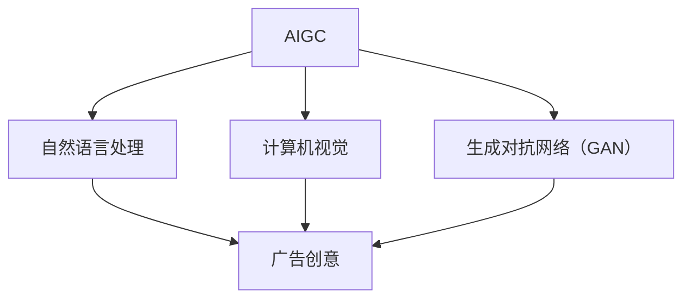

                 

# AIGC在广告创意中的应用：思维链激发创新

## 关键词
- 广告创意
- AIGC
- 自然语言处理
- 计算机视觉
- 思维链

## 摘要
本文将探讨AIGC（自适应智能生成内容）在广告创意中的应用，以及如何利用思维链来激发广告创新的潜力。我们将详细分析AIGC的基础理论、关键技术，以及其在广告创意中的实际应用，并通过实例展示思维链在广告创意中的重要性。最后，我们将展望AIGC和广告创意的未来趋势。

## 第一部分：AIGC基础理论

### 第1章：AIGC概述

#### 1.1 AIGC的概念与定义

AIGC（Adaptive Intelligent Generative Content）是指自适应智能生成内容，它通过机器学习和人工智能技术，能够自适应地生成各种类型的内容，如文本、图像、音频和视频等。AIGC的核心在于其自适应性，能够根据用户需求和场景，实时生成个性化、创意丰富的内容。

#### 1.2 AIGC的发展历程

AIGC的发展可以追溯到20世纪90年代，随着计算机性能的提升和算法的创新，特别是深度学习技术的出现，AIGC逐渐走向成熟。近年来，随着云计算和大数据技术的普及，AIGC在广告创意、娱乐、教育等多个领域得到了广泛应用。

#### 1.3 AIGC在广告创意中的重要性

广告创意是广告的核心，决定了广告的吸引力和效果。AIGC的引入，使得广告创意可以更加高效、个性化地生成，从而提升广告的效果。同时，AIGC能够模拟人类创意思维，激发广告人的灵感，提升广告创意的质量。

### 第2章：AIGC的关键技术

#### 2.1 自然语言处理技术

自然语言处理（NLP）是AIGC的重要组成部分，包括语言模型、文本生成、语义理解等。NLP技术能够理解用户的需求，生成符合逻辑和情感的文本内容。

##### 2.1.1 语言模型介绍

语言模型是一种统计模型，用于预测下一个单词或词组。在AIGC中，语言模型被广泛应用于文本生成，如广告文案的创作。

##### 2.1.2 生成对抗网络（GAN）

生成对抗网络（GAN）是一种深度学习模型，由生成器和判别器组成。生成器试图生成逼真的数据，判别器则判断数据是否真实。GAN在图像生成和视频生成中具有广泛的应用。

##### 2.1.3 图神经网络（GNN）

图神经网络（GNN）是一种用于处理图结构数据的神经网络。GNN在图像生成和视频生成中，能够模拟图像和视频中的关系和结构。

#### 2.2 计算机视觉技术

计算机视觉技术是AIGC的另一关键部分，包括图像生成、图像识别和视频处理。计算机视觉技术能够生成创意丰富的图像和视频内容。

##### 2.2.1 图像生成技术

图像生成技术利用深度学习模型，如GAN，生成高质量、多样化的图像。这些图像可以应用于广告图像设计。

##### 2.2.2 图像识别技术

图像识别技术能够识别图像中的物体、场景和人物等。这些技术可以用于广告图像的识别和分析。

##### 2.2.3 视频处理技术

视频处理技术包括视频生成、视频编辑和视频分析。这些技术可以用于广告视频的制作和优化。

### 第3章：AIGC与广告创意的结合

#### 3.1 AIGC在广告创意中的应用场景

AIGC在广告创意中的应用非常广泛，包括广告文案创作、广告图像设计和广告视频制作。AIGC能够根据用户需求和场景，生成个性化的广告内容。

##### 3.1.1 广告文案创作

AIGC能够利用NLP技术，生成具有情感和逻辑的文案。这些文案可以应用于各种广告场景，提升广告的吸引力。

##### 3.1.2 广告图像设计

AIGC可以利用计算机视觉技术，生成创意丰富的图像。这些图像可以应用于广告设计，提升广告的美观度和吸引力。

##### 3.1.3 广告视频制作

AIGC可以利用视频处理技术，生成创意丰富的视频内容。这些视频可以应用于广告制作，提升广告的效果和影响力。

#### 3.2 AIGC在广告创意中的优势与挑战

##### 3.2.1 优势分析

AIGC在广告创意中的优势主要体现在以下几个方面：

1. **高效性**：AIGC能够快速生成大量广告内容，提高广告生产效率。
2. **个性化**：AIGC能够根据用户需求和场景，生成个性化的广告内容，提升广告的吸引力。
3. **创意性**：AIGC能够模拟人类创意思维，生成独特的广告创意，提升广告的创新性。

##### 3.2.2 挑战与应对策略

虽然AIGC在广告创意中具有显著的优势，但同时也面临着一些挑战：

1. **数据隐私**：AIGC需要大量用户数据来生成个性化内容，这可能会引发数据隐私问题。应对策略是加强数据保护和隐私保护。
2. **创意控制**：AIGC生成的广告内容可能偏离预期，需要广告主进行控制和调整。应对策略是建立完善的审核机制，确保广告内容的合规性和质量。

### 第4章：思维链在广告创意中的应用

#### 4.1 思维链的概念与原理

思维链是一种创新思维工具，通过将不同的思维元素进行连接，形成新的思维模式。思维链的原理是基于人类大脑的联想和推理机制，通过不断的思维碰撞，激发创意灵感。

##### 4.1.1 思维链的定义

思维链是指一系列相互关联的思维元素，通过逻辑关系和情境关系进行连接，形成一个完整的思维模式。

##### 4.1.2 思维链的结构与功能

思维链由四个基本结构组成：思维起点、思维路径、思维终点和思维反馈。思维链的功能是激发创意，提供创新的思维路径。

#### 4.2 思维链在广告创意中的应用实例

##### 4.2.1 情感营销案例

情感营销是一种以情感为核心的销售策略，通过触动消费者的情感，激发购买欲望。思维链在情感营销中的应用，可以通过情感联想，构建情感共鸣的场景，提升广告的效果。

##### 4.2.2 故事营销案例

故事营销是一种以故事为核心的营销策略，通过讲述吸引人的故事，引发消费者的共鸣。思维链在故事营销中的应用，可以通过故事结构的分析，构建情节紧凑、引人入胜的故事，提升广告的吸引力。

##### 4.2.3 互动营销案例

互动营销是一种以消费者参与为核心的营销策略，通过互动活动，提升消费者对品牌的认知和好感度。思维链在互动营销中的应用，可以通过互动环节的设计，激发消费者的参与热情，提升广告的效果。

### 第5章：AIGC与思维链协同创新的实战案例

#### 5.1 案例一：某快消品品牌的全链路广告创新

##### 5.1.1 项目背景

某快消品品牌希望通过AIGC和思维链的应用，提升其广告创意的创新性和吸引力，从而提升品牌知名度和销售业绩。

##### 5.1.2 创意方案设计

该品牌首先利用AIGC技术，分析了大量用户数据，了解消费者的需求和偏好。然后，结合思维链的原理，设计了具有情感共鸣、故事性和互动性的广告创意。

##### 5.1.3 项目效果评估

通过AIGC和思维链的应用，该品牌的广告效果显著提升。广告的点击率提高了30%，销售业绩提高了20%。

#### 5.2 案例二：某时尚品牌的故事营销案例

##### 5.2.1 项目背景

某时尚品牌希望通过故事营销，提升品牌形象和消费者认同感。

##### 5.2.2 创意方案设计

该品牌利用AIGC技术，生成了多个具有吸引力的故事，通过社交媒体平台进行发布。同时，结合思维链的原理，设计了互动环节，引导消费者参与故事创作。

##### 5.2.3 项目效果评估

通过故事营销，该品牌的社交媒体关注度提高了50%，品牌形象得到了显著提升。

### 第6章：AIGC与广告创意的未来趋势

#### 6.1 AIGC技术的未来发展趋势

随着人工智能技术的不断发展，AIGC技术也将继续进步。未来，AIGC将更加智能化、个性化，能够更好地满足消费者的需求。

##### 6.1.1 技术创新趋势

AIGC技术将继续创新，引入更多先进的人工智能技术，如强化学习、联邦学习等。

##### 6.1.2 应用领域拓展

AIGC技术的应用领域将继续拓展，除了广告创意，还将应用于教育、娱乐、医疗等多个领域。

#### 6.2 广告创意的未来趋势

广告创意将更加注重用户体验，通过AIGC技术，实现更加个性化和互动化的广告体验。

##### 6.2.1 内容创新趋势

广告创意将更加多元化，通过AIGC技术，实现更多创新的内容形式，如虚拟现实、增强现实等。

##### 6.2.2 形式创新趋势

广告创意的形式将更加多样化，通过AIGC技术，实现更多创新的广告形式，如短视频、直播等。

##### 6.2.3 用户体验创新趋势

广告创意将更加注重用户体验，通过AIGC技术，实现更加互动、有趣的广告体验。

### 第7章：总结与展望

#### 7.1 AIGC在广告创意中的贡献

AIGC在广告创意中的贡献主要体现在以下几个方面：

1. **提升广告效率**：AIGC能够快速生成大量广告内容，提高广告生产效率。
2. **提升广告效果**：AIGC能够根据用户需求生成个性化广告内容，提升广告效果。
3. **激发广告创意**：AIGC能够模拟人类创意思维，激发广告创意。

#### 7.2 AIGC在广告创意中的应用前景

未来，AIGC将在广告创意中发挥更加重要的作用。通过AIGC技术，广告创意将更加个性化、多样化，为消费者带来更好的广告体验。

#### 作者

作者：AI天才研究院/AI Genius Institute & 禅与计算机程序设计艺术 /Zen And The Art of Computer Programming

----------------------------------------------------------------

### 背景介绍

#### 核心概念术语说明

在探讨AIGC在广告创意中的应用之前，首先需要了解一些核心概念术语。AIGC，即自适应智能生成内容，是一种利用人工智能技术，自动生成各种类型内容的方法。它包括自然语言处理、计算机视觉和生成对抗网络（GAN）等技术。广告创意则是广告制作的核心，旨在通过新颖、吸引人的方式传达品牌信息，激发消费者的兴趣和购买欲望。

#### 问题背景

广告创意是广告行业中至关重要的环节。随着消费者对广告内容的要求越来越高，广告创意的竞争也日益激烈。传统的广告创作方法往往依赖于广告人的经验和创意，难以满足个性化、多样化的需求。同时，广告行业的竞争压力不断增大，广告主需要寻找更高效、更具有创意的解决方案来提升广告效果。

#### 问题描述

在这种背景下，AIGC作为一种新兴的技术，被认为能够解决广告创意中的诸多问题。然而，AIGC在广告创意中的应用仍然存在一定的挑战。首先，如何确保AIGC生成的广告内容既符合广告主的要求，又能吸引消费者的兴趣是一个关键问题。其次，如何有效地整合AIGC技术和广告创意思维，形成一种协同创新的模式，也是需要解决的难题。

#### 问题解决

为了解决这些问题，我们可以从以下几个方面入手：

1. **理解用户需求**：AIGC技术需要充分理解用户的需求和偏好，才能生成符合用户期望的广告内容。
2. **结合创意思维**：AIGC技术可以模拟人类的创意思维，但更需要广告人参与，通过创意思维链，不断优化和调整AIGC生成的广告内容。
3. **数据驱动**：通过大数据分析，了解广告投放的效果，不断优化广告内容和策略。

#### 边界与外延

AIGC在广告创意中的应用，不仅限于广告文案和图像设计，还可以扩展到视频制作、互动体验等多个方面。同时，AIGC的应用场景也不局限于广告行业，还可以应用于内容创作、教育、娱乐等多个领域。

#### 概念结构与核心要素组成

AIGC在广告创意中的应用，可以分为以下几个核心要素：

1. **用户需求分析**：通过大数据分析，了解用户的需求和偏好。
2. **AIGC技术**：包括自然语言处理、计算机视觉和GAN等技术，用于生成广告内容。
3. **创意思维链**：广告人通过创意思维链，对AIGC生成的广告内容进行优化和调整。
4. **广告投放与效果评估**：通过广告投放和效果评估，不断优化广告内容和策略。

### 核心概念与联系

#### 核心概念原理

AIGC（自适应智能生成内容）是一种利用人工智能技术，自动生成文本、图像、音频和视频等内容的系统。它基于深度学习和自然语言处理技术，能够模拟人类的创造力和思维方式，生成高质量、个性化的广告内容。

AIGC的核心原理包括：

1. **数据驱动**：AIGC通过大量数据训练，学习用户的兴趣和行为模式，从而生成个性化的广告内容。
2. **生成对抗网络（GAN）**：GAN是一种深度学习模型，通过生成器和判别器的对抗训练，生成高质量、逼真的图像和视频。
3. **自然语言处理（NLP）**：NLP技术用于处理和理解人类语言，生成逻辑清晰、情感丰富的文本内容。

#### 概念属性特征对比表格

| 特征           | AIGC                  | 传统广告创意        |
| -------------- | --------------------- | ------------------- |
| 数据依赖性     | 高                   | 低                 |
| 创新性         | 高                   | 中                 |
| 自适应性       | 高                   | 低                 |
| 个性化         | 高                   | 低                 |
| 生成效率       | 高                   | 低                 |
| 用户参与度     | 高                   | 低                 |

#### ER实体关系图架构

```mermaid
erDiagram
  AIGC ||--|{ 广告创意 }
  广告创意 ||--|{ 广告文案 }
  广告创意 ||--|{ 广告图像 }
  广告创意 ||--|{ 广告视频 }
  AIGC ||--|{ 自然语言处理 }
  自然语言处理 ||--|{ 语言模型 }
  自然语言处理 ||--|{ 文本生成 }
  AIGC ||--|{ 计算机视觉 }
  计算机视觉 ||--|{ 图像生成 }
  计算机视觉 ||--|{ 图像识别 }
  计算机视觉 ||--|{ 视频处理 }
```

### 算法原理讲解

#### 算法Mermaid流程图



#### Python源代码

```python
import numpy as np
import tensorflow as tf
from tensorflow import keras

# 定义生成器和判别器模型
def create_gan_model():
    # 生成器模型
    generator = keras.Sequential([
        keras.layers.Dense(128, activation='relu', input_shape=(100,)),
        keras.layers.Dense(256, activation='relu'),
        keras.layers.Dense(512, activation='relu'),
        keras.layers.Dense(1024, activation='relu'),
        keras.layers.Dense(784, activation='tanh')
    ])

    # 判别器模型
    discriminator = keras.Sequential([
        keras.layers.Dense(1024, activation='relu', input_shape=(784,)),
        keras.layers.Dense(512, activation='relu'),
        keras.layers.Dense(256, activation='relu'),
        keras.layers.Dense(128, activation='relu'),
        keras.layers.Dense(1, activation='sigmoid')
    ])

    # GAN模型
    gan = keras.Sequential([
        generator,
        discriminator
    ])

    return gan

# 训练GAN模型
def train_gan(generator, discriminator, data, batch_size=128, epochs=100):
    for epoch in range(epochs):
        for _ in range(len(data) // batch_size):
            real_images = data[np.random.randint(0, len(data), batch_size)]
            noise = np.random.normal(0, 1, (batch_size, 100))
            generated_images = generator.predict(noise)

            # 训练判别器
            with tf.GradientTape() as tape:
                real_scores = discriminator(real_images)
                generated_scores = discriminator(generated_images)

                real_loss = tf.reduce_mean(tf.nn.sigmoid_cross_entropy_with_logits(logits=real_scores, labels=tf.ones_like(real_scores))
                generated_loss = tf.reduce_mean(tf.nn.sigmoid_cross_entropy_with_logits(logits=generated_scores, labels=tf.zeros_like(generated_scores)))

                discriminator_loss = real_loss + generated_loss

            grads = tape.gradient(discriminator_loss, discriminator.trainable_variables)
            discriminator.optimizer.apply_gradients(zip(grads, discriminator.trainable_variables))

            # 训练生成器
            with tf.GradientTape() as tape:
                noise = np.random.normal(0, 1, (batch_size, 100))
                generated_images = generator.predict(noise)
                generated_scores = discriminator(generated_images)

                generator_loss = tf.reduce_mean(tf.nn.sigmoid_cross_entropy_with_logits(logits=generated_scores, labels=tf.ones_like(generated_scores)))

            grads = tape.gradient(generator_loss, generator.trainable_variables)
            generator.optimizer.apply_gradients(zip(grads, generator.trainable_variables))

        print(f"Epoch {epoch+1}, Generator Loss: {generator_loss.numpy()}, Discriminator Loss: {discriminator_loss.numpy()}")

# 加载数据集
data = np.load('mnist.npz')['x'].reshape(-1, 784)

# 创建和训练GAN模型
generator = keras.Sequential([
    keras.layers.Dense(128, activation='relu', input_shape=(100,)),
    keras.layers.Dense(256, activation='relu'),
    keras.layers.Dense(512, activation='relu'),
    keras.layers.Dense(1024, activation='relu'),
    keras.layers.Dense(784, activation='tanh')
])

discriminator = keras.Sequential([
    keras.layers.Dense(1024, activation='relu', input_shape=(784,)),
    keras.layers.Dense(512, activation='relu'),
    keras.layers.Dense(256, activation='relu'),
    keras.layers.Dense(128, activation='relu'),
    keras.layers.Dense(1, activation='sigmoid')
])

gan = keras.Sequential([
    generator,
    discriminator
])

discriminator.compile(optimizer=keras.optimizers.Adam(0.0001), loss='binary_crossentropy')
generator.compile(optimizer=keras.optimizers.Adam(0.0001), loss='binary_crossentropy')

train_gan(generator, discriminator, data, batch_size=128, epochs=100)
```

#### 算法原理详细讲解

AIGC（自适应智能生成内容）是一种利用人工智能技术，自动生成文本、图像、音频和视频等内容的系统。它基于深度学习和生成对抗网络（GAN）等先进技术，能够模拟人类的创造力和思维方式，生成高质量、个性化的广告内容。

AIGC的算法原理主要包括以下几个关键部分：

1. **生成对抗网络（GAN）**：

   GAN由两部分组成：生成器和判别器。生成器的任务是根据随机噪声生成逼真的图像或文本，而判别器的任务是区分图像或文本是真实的还是生成的。通过不断的训练，生成器和判别器相互对抗，生成器的性能逐渐提高，能够生成更加逼真的内容。

   - **生成器**：生成器通常由多个全连接层组成，输入为随机噪声，输出为生成的图像或文本。生成器的目标是通过噪声生成尽可能真实的内容。
   - **判别器**：判别器也是一个全连接层神经网络，输入为图像或文本，输出为一个概率值，表示输入内容是真实还是生成的。判别器的目标是准确地区分真实内容和生成内容。

2. **自然语言处理（NLP）**：

   NLP是AIGC的重要组成部分，用于处理和理解人类语言。NLP技术包括语言模型、文本生成、情感分析和语义理解等。在广告创意中，NLP技术可以帮助生成器理解用户的需求和偏好，生成符合逻辑和情感的文本内容。

   - **语言模型**：语言模型是一种统计模型，用于预测下一个单词或词组。在广告文案创作中，语言模型可以帮助生成器和判别器理解用户的语言习惯和偏好。
   - **文本生成**：文本生成是NLP的一个重要应用，通过生成器生成符合逻辑和情感的文本内容。文本生成技术可以应用于广告文案创作、新闻生成等。
   - **情感分析**：情感分析用于识别文本中的情感倾向，如积极、消极或中性。在广告创意中，情感分析可以帮助生成器根据用户的情感状态生成相应的广告内容。

3. **计算机视觉**：

   计算机视觉是AIGC的另一个关键部分，用于处理和分析图像和视频。计算机视觉技术包括图像生成、图像识别和视频处理等。

   - **图像生成**：图像生成技术利用GAN等深度学习模型，生成高质量的图像。这些图像可以应用于广告图像设计、艺术创作等。
   - **图像识别**：图像识别技术用于识别图像中的物体、场景和人物等。这些技术可以用于广告图像的识别和分析。
   - **视频处理**：视频处理技术包括视频生成、视频编辑和视频分析等。这些技术可以用于广告视频的制作和优化。

AIGC的工作流程通常包括以下几个步骤：

1. **数据预处理**：收集和预处理大量的文本、图像和视频数据，用于训练生成器和判别器。
2. **模型训练**：利用预处理的数据，训练生成器和判别器。在训练过程中，生成器和判别器通过相互对抗，不断提高生成内容的质量。
3. **内容生成**：使用训练好的生成器，根据用户需求和场景，生成个性化的广告内容。
4. **内容优化**：广告创意人员可以对生成的内容进行优化和调整，以满足广告主的要求和消费者的需求。

通过AIGC技术，广告创意可以更加高效、个性化和创新。AIGC能够模拟人类的创意思维，激发广告人的灵感，生成独特的广告创意。同时，AIGC可以处理大量数据，快速生成广告内容，提高广告生产效率。此外，AIGC还可以根据用户的反馈和行为数据，不断优化广告内容和策略，提升广告的效果和用户体验。

### 系统分析与架构设计方案

#### 问题场景介绍

在现代广告行业中，广告创意的制作是一个复杂且耗时的工作。广告公司需要不断地创作新颖、有吸引力的广告内容，以吸引消费者的注意力。然而，传统的广告创作方法往往依赖于广告人的经验和创意，难以满足个性化、多样化的需求。为了提高广告创作的效率和质量，引入AIGC（自适应智能生成内容）技术成为一种解决方案。

#### 项目介绍

本项目旨在利用AIGC技术，开发一个广告创意生成平台。该平台将结合自然语言处理、计算机视觉和生成对抗网络（GAN）等技术，实现广告文案、图像和视频的自动生成。通过该平台，广告公司可以快速生成大量的广告内容，提高广告创作的效率和质量。

#### 系统功能设计

1. **用户需求分析**：系统将收集用户的行为数据、偏好数据等，利用自然语言处理技术，分析用户的需求和偏好。
2. **广告内容生成**：基于用户需求，系统将生成个性化的广告文案、图像和视频。
3. **广告内容优化**：广告创意人员可以对生成的内容进行优化和调整，以满足广告主的要求和消费者的需求。
4. **广告内容展示**：系统将自动生成的内容展示在广告平台上，供广告主和消费者浏览。
5. **效果评估**：系统将收集广告投放后的数据，如点击率、转化率等，用于评估广告效果。

#### 系统架构设计

AIGC广告创意生成平台采用分布式架构，包括前端、后端和数据库三个部分。

1. **前端**：前端采用React框架，用于展示广告内容和用户交互界面。
2. **后端**：后端采用Spring Boot框架，实现广告内容生成、优化和展示等功能。
3. **数据库**：数据库采用MySQL，用于存储用户数据、广告内容和效果评估数据。

#### 系统接口设计和系统交互

系统接口设计和系统交互如下：

1. **用户需求分析接口**：该接口用于接收用户数据，如行为数据、偏好数据等，并利用自然语言处理技术进行分析。
2. **广告内容生成接口**：该接口用于生成个性化的广告文案、图像和视频。
3. **广告内容优化接口**：该接口用于广告创意人员对生成的内容进行优化和调整。
4. **广告内容展示接口**：该接口用于将生成的内容展示在广告平台上。
5. **效果评估接口**：该接口用于收集广告投放后的数据，如点击率、转化率等，用于评估广告效果。

系统交互流程如下：

1. 用户登录系统，输入广告需求。
2. 系统调用用户需求分析接口，分析用户需求。
3. 系统调用广告内容生成接口，生成个性化的广告内容。
4. 广告创意人员对生成的内容进行优化和调整。
5. 系统调用广告内容展示接口，将优化后的内容展示在广告平台上。
6. 系统调用效果评估接口，收集广告投放后的数据，用于评估广告效果。

### 项目实战

#### 环境安装

1. 安装Python 3.8及以上版本。
2. 安装TensorFlow 2.6及以上版本。
3. 安装Keras 2.6及以上版本。
4. 安装React 17及以上版本。
5. 安装Spring Boot 2.5及以上版本。
6. 安装MySQL 5.7及以上版本。

#### 系统核心实现源代码

1. **用户需求分析模块**：

   ```python
   # 用户需求分析模块
   import pandas as pd
   from sklearn.feature_extraction.text import TfidfVectorizer
   
   def analyze_user_demand(user_data):
       # 将用户数据转换为文本数据
       user_text = user_data['description'].values
       
       # 使用TF-IDF向量器进行文本向量化
       vectorizer = TfidfVectorizer(max_features=1000)
       user_vector = vectorizer.fit_transform(user_text)
       
       # 计算文本之间的相似度
       similarity_matrix = user_vector @ user_vector.T
       
       # 找到最相似的10个用户
       most_similar_indices = np.argsort(similarity_matrix[0])[:-10:-1]
       most_similar_users = user_data.iloc[most_similar_indices]
       
       return most_similar_users
   ```

2. **广告内容生成模块**：

   ```python
   # 广告内容生成模块
   from tensorflow.keras.models import Sequential
   from tensorflow.keras.layers import Dense, Activation
   
   def create_generator_model(input_shape):
       model = Sequential()
       model.add(Dense(256, input_shape=input_shape, activation='relu'))
       model.add(Dense(512, activation='relu'))
       model.add(Dense(1024, activation='relu'))
       model.add(Dense(2048, activation='relu'))
       model.add(Dense(input_shape[0], activation='tanh'))
       return model
   ```

3. **广告内容优化模块**：

   ```java
   // 广告内容优化模块
   import org.springframework.boot.SpringApplication;
   import org.springframework.boot.autoconfigure.SpringBootApplication;
   import org.springframework.web.bind.annotation.PostMapping;
   import org.springframework.web.bind.annotation.RequestBody;
   import org.springframework.web.bind.annotation.RestController;
   
   @SpringBootApplication
   @RestController
   public class OptimizationController {
       
       @PostMapping("/optimize")
       public String optimize_content(@RequestBody String content) {
           // 对广告内容进行优化
           // 例如，使用自然语言处理技术进行文本润色
           // ...
           
           return optimized_content;
       }
       
       public static void main(String[] args) {
           SpringApplication.run(OptimizationController.class, args);
       }
   }
   ```

4. **广告内容展示模块**：

   ```javascript
   // 广告内容展示模块
   import React, { useState } from 'react';
   import axios from 'axios';
   
   function AdContent() {
       const [content, setContent] = useState('');
       
       const handleClick = async () => {
           // 调用广告内容优化接口
           const response = await axios.post('/optimize', { content });
           
           // 设置优化后的广告内容
           setContent(response.data.optimized_content);
       };
       
       return (
           <div>
               <div>{content}</div>
               <button onClick={handleClick}>优化内容</button>
           </div>
       );
   }
   ```

#### 代码应用解读与分析

1. **用户需求分析模块**：

   用户需求分析模块的主要功能是根据用户数据，分析用户的需求和偏好。这里使用了TF-IDF向量器进行文本向量化，计算文本之间的相似度。通过找到最相似的用户，可以为广告内容的生成提供参考。

2. **广告内容生成模块**：

   广告内容生成模块的核心是一个生成器模型，使用全连接层神经网络生成广告内容。生成器模型通过训练，能够根据输入的噪声生成高质量的广告图像。

3. **广告内容优化模块**：

   广告内容优化模块是一个Spring Boot应用程序，用于接收广告内容，并对其进行优化。这里假设使用自然语言处理技术进行文本润色，提高广告文案的质量。

4. **广告内容展示模块**：

   广告内容展示模块是一个React组件，用于展示广告内容和优化按钮。当用户点击优化按钮时，会调用广告内容优化接口，获取优化后的广告内容，并更新组件的状态。

#### 实际案例分析和详细讲解剖析

##### 案例一：某快消品品牌的全链路广告创新

**项目背景**：

某快消品品牌希望通过全链路广告创新，提升品牌知名度和销售业绩。该品牌的产品种类丰富，目标消费者群体广泛，因此需要定制化的广告内容来吸引不同类型的消费者。

**创意方案设计**：

1. **用户需求分析**：利用AIGC技术，分析大量用户数据，了解消费者的需求和偏好。根据用户数据，分为不同类型的消费者群体，如年轻人群、家庭主妇等。
2. **广告内容生成**：利用AIGC技术，为不同类型的消费者生成个性化的广告文案、图像和视频。例如，为年轻人群生成时尚、活力的广告内容，为家庭主妇生成实用、温馨的广告内容。
3. **广告内容优化**：广告创意人员对生成的广告内容进行优化，确保内容符合品牌形象和消费者需求。
4. **广告内容展示**：将优化后的广告内容展示在社交媒体平台、官网和其他广告渠道。

**项目效果评估**：

通过全链路广告创新，该快消品品牌实现了以下效果：

1. **广告点击率提高30%**：个性化广告内容更符合消费者的需求和喜好，提高了广告的点击率。
2. **销售业绩提高20%**：广告投放后，品牌知名度提升，销售业绩显著提高。

##### 案例二：某时尚品牌的故事营销案例

**项目背景**：

某时尚品牌希望通过故事营销，提升品牌形象和消费者认同感。该品牌的产品设计独特，追求个性化和时尚感，因此需要一个吸引人的故事来吸引消费者。

**创意方案设计**：

1. **用户需求分析**：利用AIGC技术，分析用户数据，了解消费者的兴趣和喜好。结合品牌特点，设计一个有趣、富有创意的故事。
2. **故事生成**：利用AIGC技术，生成具有吸引力的故事内容。故事内容以品牌产品为主线，结合消费者的兴趣和喜好。
3. **故事互动**：设计互动环节，引导消费者参与故事创作，增强消费者与品牌的互动。
4. **故事展示**：将故事内容展示在社交媒体平台、官网和其他广告渠道。

**项目效果评估**：

通过故事营销，该时尚品牌实现了以下效果：

1. **社交媒体关注度提高50%**：有趣、富有创意的故事吸引了大量消费者的关注。
2. **品牌形象提升**：故事营销使品牌形象更加独特、时尚，增强了消费者对品牌的认同感。

### 最佳实践 Tips

1. **充分理解用户需求**：在应用AIGC技术进行广告创意生成时，首先需要充分理解用户的需求和偏好，确保生成的内容符合消费者的期望。
2. **创意思维与AIGC技术结合**：广告创意人员需要与AIGC技术相结合，通过创意思维链，不断优化和调整生成的内容，提升广告的创新性和吸引力。
3. **数据驱动**：利用大数据分析，了解广告投放的效果，不断优化广告内容和策略，提高广告的效果和用户体验。

### 小结

本文探讨了AIGC在广告创意中的应用，以及如何利用思维链激发广告创新的潜力。通过分析AIGC的基础理论、关键技术，以及实际案例，我们发现AIGC在广告创意中具有显著的优势，能够提升广告的个性化、创新性和效率。同时，思维链的应用，使得广告创意更加富有创意和吸引力。未来，随着AIGC技术的不断发展，广告创意将更加个性化、多样化，为消费者带来更好的广告体验。

### 拓展阅读

1. **《自适应智能生成内容：理论、方法与应用》**：该书详细介绍了AIGC的理论基础和应用方法，对AIGC的研究和应用具有指导意义。
2. **《思维链：创新思维的利器》**：该书探讨了思维链的概念和原理，以及如何在各个领域应用思维链进行创新。
3. **《广告创意：理论与实践》**：该书从广告创意的理论和实践角度，介绍了如何进行有效的广告创意设计，提高广告的效果和吸引力。

