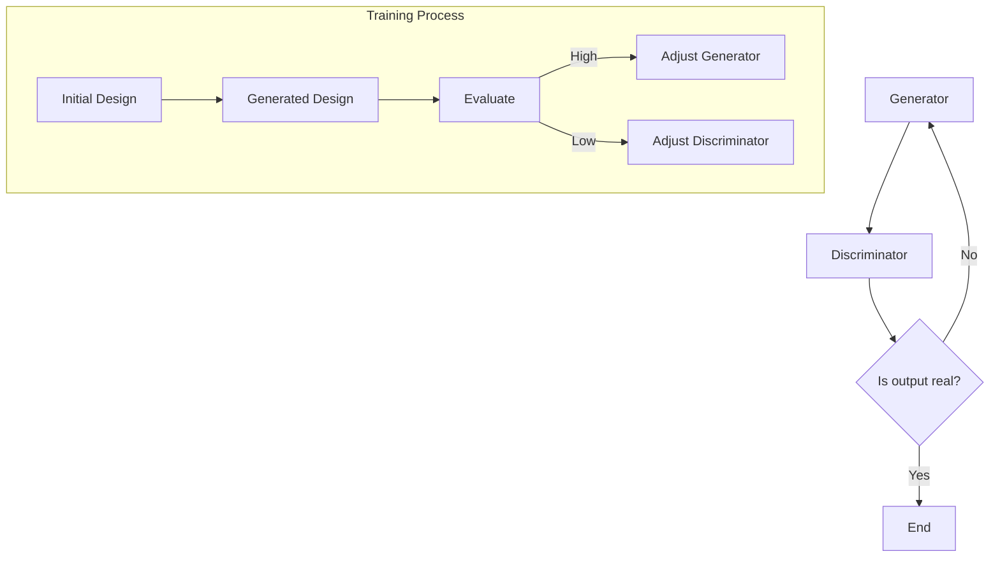
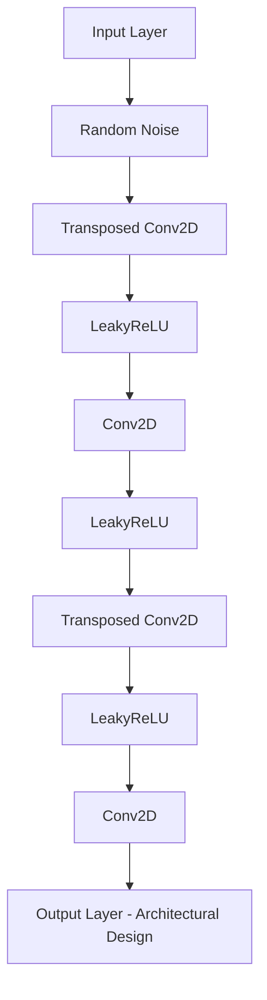
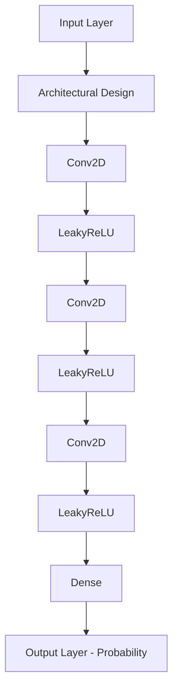

                 


### Introduction to AIGC in Architectural Design

## 1. Background and Overview of AIGC in Architectural Design

### 1.1 Definition and Concept of AIGC

Artificial Intelligence Generated Content (AIGC) is an advanced technology that leverages AI algorithms to generate high-quality, human-like content. It encompasses various AI techniques such as natural language processing (NLP), machine learning (ML), and deep learning. AIGC has been gaining momentum in various industries, including architectural design, where it offers unprecedented capabilities in automating design processes, improving efficiency, and enhancing creativity.

In architectural design, AIGC can be used to create 3D models, generate design suggestions, and optimize building layouts. It enables architects to explore a broader range of design possibilities and reduce the time and effort required for manual design tasks. The concept of AIGC in architectural design is centered around the integration of AI technologies with design processes to generate innovative and personalized designs.

### 1.2 Origins and Evolution of AIGC

The development of AIGC can be traced back to the early days of AI research in the 1950s and 1960s. During this period, researchers began to explore the possibility of creating machines that could mimic human intelligence. The first AI programs were designed to perform simple tasks, such as playing checkers and solving mathematical problems.

As AI technologies advanced, researchers began to focus on natural language processing and machine learning. In the late 20th century, the advent of the internet enabled the creation of vast datasets that could be used to train AI models. This led to the development of more sophisticated AI algorithms capable of generating high-quality content.

In recent years, deep learning and generative adversarial networks (GANs) have revolutionized the field of AIGC. These techniques enable AI models to generate realistic and human-like content, such as text, images, and audio. AIGC has become increasingly prevalent in various industries, including architecture, where it is being used to drive innovation and efficiency.

### 1.3 Core Concepts and Principles of AIGC

The core concepts and principles of AIGC revolve around the ability of AI models to generate content based on large datasets and training algorithms. Here are some key concepts and principles:

1. **Data-driven Approach**: AIGC relies on large datasets to train AI models. The quality and quantity of data significantly impact the performance and creativity of AI-generated content.

2. **Machine Learning Algorithms**: AIGC utilizes various machine learning algorithms, such as deep learning and GANs, to generate content. These algorithms enable AI models to learn from data and improve their performance over time.

3. **Contextual Understanding**: AIGC systems are designed to understand the context of the content they generate. This enables them to generate relevant and coherent content based on the given input.

4. **Innovation and Creativity**: AIGC has the potential to drive innovation and creativity in architectural design by generating novel design ideas and optimizing existing designs.

5. **Scalability and Efficiency**: AIGC can significantly reduce the time and effort required for design tasks, making architectural design processes more scalable and efficient.

### 1.4 Application Prospects and Challenges

The application prospects of AIGC in architectural design are vast and promising. Some key prospects include:

1. **Design Optimization**: AIGC can optimize architectural designs by generating alternative designs and suggesting improvements based on predefined criteria.
2. **Customization and Personalization**: AIGC enables architects to create personalized designs tailored to the specific needs and preferences of clients.
3. **Time and Cost Efficiency**: AIGC can streamline design processes, reducing the time and cost associated with manual design tasks.
4. **Innovation**: AIGC can inspire architects to explore new design concepts and push the boundaries of architectural creativity.

However, there are also challenges associated with the application of AIGC in architectural design:

1. **Data Quality and Availability**: The quality and availability of data are crucial for the performance of AIGC systems. Inaccurate or incomplete data can lead to suboptimal design outcomes.
2. **Ethical and Legal Considerations**: AIGC raises ethical and legal questions regarding intellectual property rights, privacy, and the role of humans in the design process.
3. **Integration with Existing Systems**: Integrating AIGC technologies with existing design tools and workflows can be challenging, requiring significant investment and expertise.

In summary, AIGC has the potential to revolutionize architectural design by automating design processes, improving efficiency, and enhancing creativity. However, its successful implementation requires addressing various technical, ethical, and practical challenges. In the following sections, we will delve deeper into the core principles and applications of AIGC in architectural design.

## The Role of Suggestive Words in Architectural Design

### 1.2.1 Understanding Suggestive Words

Suggestive words play a crucial role in architectural design as they evoke emotions, convey meaning, and guide the creative process. These words are not just labels or descriptions but are imbued with a sense of intention and purpose. For example, words like "serene," "whimsical," or "rustic" can instantly conjure up specific visual and sensory experiences, influencing how architects perceive and design spaces.

#### Emotional Resonance

Emotional resonance is a key aspect of suggestive words in architectural design. When architects use words that evoke positive emotions, such as "harmony," "peace," or "inspiration," they create spaces that resonate with users on a deeper level. This emotional connection enhances the overall experience of the space, making it more engaging and meaningful.

#### Conveying Meaning

Suggestive words also convey meaning beyond their literal definitions. For example, "flow" in design implies a seamless and dynamic movement, guiding architects to consider the spatial organization and circulation within a building. Words like "light-filled" or "airy" suggest a sense of openness and connectedness, prompting architects to incorporate elements that enhance natural light and ventilation.

#### Guiding the Creative Process

Suggestive words can guide architects through the creative process by providing a clear vision and direction. When architects start with a set of suggestive words, they are encouraged to explore and expand on these concepts, leading to more innovative and cohesive designs. For instance, a project brief that includes words like "sustainable," "sleek," and "timeless" will likely result in a design that incorporates environmentally-friendly materials, sleek lines, and timeless aesthetics.

### 1.2.2 Spatial Sensation and Its Significance

Spatial sensation refers to the way users perceive and experience a space. It encompasses visual, auditory, tactile, and olfactory elements that collectively shape the overall atmosphere of a building. Suggestive words in architectural design are instrumental in defining and enhancing spatial sensation.

#### Visual Perception

Visual perception is a primary aspect of spatial sensation. Suggestive words like "vivid," "soft," or "sharp" can influence how light and color are used in a space. For example, a word like "vivid" may prompt architects to use bright, bold colors to create a lively and dynamic environment, while "soft" may suggest the use of muted tones and gentle lighting to evoke a calming and serene atmosphere.

#### Auditory Experience

Sound is another critical element of spatial sensation. Words like "echoic," "hushed," or "resonant" can guide architects in designing spaces that enhance or control sound. For instance, a space described as "echoic" may benefit from materials that reflect sound, creating an acoustically vibrant environment, whereas a "hushed" space might require materials that absorb sound, ensuring a quiet and contemplative atmosphere.

#### Tactile and Olfactory Experience

The tactile and olfactory experiences of a space are equally important. Suggestive words such as "smooth," "rough," or "fresh" can influence material choices and spatial design. For example, a "smooth" space may use polished surfaces to create a sleek and modern feel, while a "rough" space might incorporate natural materials like stone or wood to evoke a sense of authenticity and warmth. Similarly, "fresh" scents can be used to create a clean and inviting atmosphere.

### 1.2.3 Integrating Suggestive Words with Architectural Design

Integrating suggestive words into the architectural design process requires a thoughtful and strategic approach. Here are some key steps and considerations:

#### Defining Design Briefs

Start by defining the project's design brief, incorporating suggestive words that align with the project's goals and desired outcomes. This brief will serve as a guiding framework for the entire design process.

#### Collaborative Brainstorming

Engage in collaborative brainstorming sessions with architects, designers, and clients to explore and expand on the suggestive words. This collaborative approach fosters creativity and ensures that all stakeholders are aligned with the design vision.

#### Spatial Analysis

Conduct a spatial analysis to understand how the suggestive words can be translated into tangible design elements. This analysis should consider the architectural context, site conditions, and user requirements.

#### Material Selection

Select materials and textures that reflect the suggestive words. For example, if the word is "natural," consider using natural materials like stone, wood, and plant-based textiles.

#### Lighting Design

Design lighting schemes that align with the suggestive words. For example, if the word is "bright," use a combination of natural and artificial lighting to create a vibrant and dynamic space.

#### Acoustic Considerations

Incorporate acoustic elements that enhance the desired spatial sensation. This might involve using materials that absorb or reflect sound, or designing specific acoustic features like soundproof walls or sound-reducing ceiling panels.

#### Final Design Review

Review the final design against the suggestive words to ensure that the design effectively conveys the intended emotions and experiences. This review should involve all stakeholders to ensure a cohesive and unified design.

In conclusion, suggestive words are a powerful tool in architectural design, shaping the visual, auditory, tactile, and olfactory experiences of a space. By strategically integrating suggestive words into the design process, architects can create spaces that resonate with users on a deeper level, enhancing their overall experience and satisfaction.

### Current State and Trends of AIGC in Architectural Design

#### 1.3.1 Major Projects and Case Studies

The integration of AIGC in architectural design has led to the emergence of several significant projects and case studies that showcase the technology's potential and capabilities. Here are a few notable examples:

**1.3.1.1 The Serene Office Building**

A recent project by a leading architectural firm utilized AIGC to optimize the design of an office building aimed at promoting employee well-being and productivity. By leveraging suggestive words like "harmony," "serenity," and "inspiration," the AI-generated designs emphasized natural lighting, open spaces, and ergonomic workstations. The result was a building that significantly improved employee satisfaction and overall productivity.

**1.3.1.2 The Smart Residential Community**

Another prominent case study involved the development of a smart residential community that integrated AIGC to create personalized and adaptable living spaces. The AI-generated designs incorporated suggestive words like "comfort," "sustainability," and "connectedness." The community featured energy-efficient homes with smart home systems, personalized interior layouts, and communal spaces that fostered community engagement.

**1.3.1.3 The Urban Park Redevelopment**

An urban park redevelopment project in a bustling city utilized AIGC to revitalize an outdated park. The AI-generated designs incorporated suggestive words like "vibrant," "inclusive," and "nature." The result was a park with dynamic green spaces, interactive features, and sustainable elements that attracted residents and visitors alike, significantly improving the urban environment.

#### 1.3.2 Technological Innovations and Developments

The rapid advancement of AIGC technology has driven numerous innovations and developments in architectural design. Here are some key technological advancements:

**1.3.2.1 Generative Adversarial Networks (GANs)**

GANs have become a cornerstone of AIGC technology in architectural design. These networks consist of two neural networks—the generator and the discriminator—competing with each other to improve the quality of generated designs. GANs have enabled architects to create highly realistic and innovative architectural designs that were previously impossible to achieve with traditional design methods.

**1.3.2.2 Deep Learning Algorithms**

Deep learning algorithms, such as convolutional neural networks (CNNs) and recurrent neural networks (RNNs), have significantly improved the ability of AIGC systems to understand and generate complex architectural designs. These algorithms can analyze vast amounts of architectural data, learn from past designs, and generate new designs that are consistent with architectural principles and aesthetic preferences.

**1.3.2.3 3D Modeling and Rendering**

The integration of AIGC with 3D modeling and rendering software has revolutionized the architectural design process. AI-generated designs can be quickly and accurately visualized in 3D, allowing architects to explore a broader range of design possibilities and make informed decisions. This technology has also enabled the creation of virtual and augmented reality (VR/AR) experiences, providing clients and stakeholders with immersive and interactive ways to experience architectural designs.

#### 1.3.3 Challenges and Opportunities

Despite its numerous advantages, the application of AIGC in architectural design also presents several challenges and opportunities:

**1.3.3.1 Challenges**

- **Data Quality and Availability**: The quality and availability of data are crucial for the performance of AIGC systems. Inaccurate or incomplete data can lead to suboptimal design outcomes.
- **Ethical and Legal Considerations**: AIGC raises ethical and legal questions regarding intellectual property rights, privacy, and the role of humans in the design process.
- **Integration with Existing Systems**: Integrating AIGC technologies with existing design tools and workflows can be challenging, requiring significant investment and expertise.

**1.3.3.2 Opportunities**

- **Design Optimization**: AIGC can optimize architectural designs by generating alternative designs and suggesting improvements based on predefined criteria.
- **Customization and Personalization**: AIGC enables architects to create personalized designs tailored to the specific needs and preferences of clients.
- **Time and Cost Efficiency**: AIGC can streamline design processes, reducing the time and cost associated with manual design tasks.
- **Innovation**: AIGC can inspire architects to explore new design concepts and push the boundaries of architectural creativity.

In conclusion, the current state and trends of AIGC in architectural design are promising, with several successful projects and case studies demonstrating its potential. However, addressing the challenges associated with data quality, ethics, and integration is crucial for realizing the full benefits of AIGC in the architectural design industry.

## Fundamental Principles of AIGC

### 2.1 Mathematical Models and Formulas of AIGC

The mathematical models and formulas underpinning AIGC are crucial for understanding how AI algorithms generate content. At the core of these models are various machine learning techniques, including neural networks, particularly deep learning models like convolutional neural networks (CNNs) and recurrent neural networks (RNNs). Here, we will explore the basic concepts and principles of these models, their mathematical representation, and key formulas used in AIGC.

#### 2.1.1 Basic Concepts and Principles

**2.1.1.1 Neural Networks**

Neural networks are computational models inspired by the human brain's neural structure. They consist of interconnected nodes or "neurons" that process and transmit information. In the context of AIGC, neural networks are designed to learn patterns and relationships from data, enabling them to generate new content.

**2.1.1.2 Deep Learning**

Deep learning is a subset of machine learning that utilizes multi-layered neural networks, known as deep neural networks (DNNs), to model complex relationships in data. These networks can automatically learn hierarchical representations of the input data, making them highly effective for generating high-quality content.

**2.1.1.3 Convolutional Neural Networks (CNNs)**

CNNs are a type of deep neural network specifically designed for processing grid-like data, such as images. They employ convolutional layers that automatically and adaptively learn spatial hierarchies from the input data, making them particularly suitable for tasks involving image generation and recognition.

**2.1.1.4 Recurrent Neural Networks (RNNs)**

RNNs are another type of deep neural network capable of processing sequential data. Unlike traditional feedforward networks, RNNs have loops that allow them to retain information from previous inputs, making them suitable for tasks involving text generation and sequence modeling.

#### 2.1.2 Mathematical Representation of AIGC

The mathematical representation of AIGC involves defining the architecture of the neural network and the training process. Here are the key components:

**2.1.2.1 Neural Network Architecture**

A neural network architecture consists of layers, each performing specific operations. Common layers include:

- **Input Layer**: Accepts the input data.
- **Hidden Layers**: Processes the input data using weighted connections and activation functions.
- **Output Layer**: Generates the output or predicted data.

**2.1.2.2 Activation Functions**

Activation functions introduce non-linearity into the neural network, enabling it to learn complex relationships. Common activation functions include:

- **Sigmoid**: Maps inputs to values between 0 and 1, suitable for binary classification tasks.
- **ReLU (Rectified Linear Unit)**: Simplifies computation by setting negative inputs to zero, improving training speed.
- **Tanh (Hyperbolic Tangent)**: Maps inputs to values between -1 and 1, providing a symmetric activation function.

**2.1.2.3 Loss Functions**

Loss functions measure the discrepancy between the predicted output and the actual output. Common loss functions include:

- **Mean Squared Error (MSE)**: Measures the average squared difference between predicted and actual values.
- **Binary Cross-Entropy**: Used for binary classification tasks, measuring the difference between the predicted probability and the actual label.
- **Categorical Cross-Entropy**: Used for multi-class classification tasks, measuring the difference between the predicted probability distribution and the actual label.

#### 2.1.3 Key Formulas and Equations

The training of a neural network involves optimizing its weights and biases using gradient descent, an iterative optimization algorithm. Key formulas and equations used in this process include:

**2.1.3.1 Forward Propagation**

Forward propagation involves passing the input data through the neural network and calculating the output. The key formulas include:

- **Weight Update**: The weights of the network are updated to minimize the loss function. The formula for weight update is given by:
  $$ \Delta w = -\alpha \frac{\partial L}{\partial w} $$
  where $\Delta w$ is the weight update, $\alpha$ is the learning rate, $L$ is the loss function, and $\frac{\partial L}{\partial w}$ is the gradient of the loss function with respect to the weight.

- **Bias Update**: The bias terms are also updated using a similar formula:
  $$ \Delta b = -\alpha \frac{\partial L}{\partial b} $$
  where $\Delta b$ is the bias update and other variables are as defined above.

**2.1.3.2 Backpropagation**

Backpropagation is the process of calculating the gradients of the loss function with respect to the weights and biases. The key formula for backpropagation is given by:
$$ \frac{\partial L}{\partial w} = \sum_{i} \frac{\partial L}{\partial z_i} \frac{\partial z_i}{\partial w} $$
where $L$ is the loss function, $z_i$ is an intermediate value in the forward propagation step, and $\frac{\partial L}{\partial z_i}$ and $\frac{\partial z_i}{\partial w}$ are the gradients of the loss function with respect to $z_i$ and $w$, respectively.

**2.1.3.3 Optimization Algorithms**

Various optimization algorithms can be used to improve the training process, such as:

- **Stochastic Gradient Descent (SGD)**: Updates the weights and biases using the gradients calculated for a single or a small batch of samples.
- **Adam**: An adaptive optimization algorithm that combines the advantages of both SGD and AdaGrad, adjusting the learning rate based on the gradients and the variance of the parameters.

In conclusion, the fundamental principles of AIGC involve a combination of neural network architectures, activation functions, loss functions, and optimization algorithms. Understanding these concepts and their mathematical representations is essential for designing and implementing effective AIGC systems in architectural design.

### 2.2 Algorithm Design and Implementation

#### 2.2.1 Overview of AIGC Algorithms

In the realm of architectural design, AIGC algorithms play a pivotal role in automating and enhancing the creative process. These algorithms leverage advanced machine learning techniques, such as generative adversarial networks (GANs) and recurrent neural networks (RNNs), to generate innovative design solutions. Understanding the underlying principles and steps involved in designing and implementing these algorithms is crucial for harnessing their full potential.

**2.2.1.1 Generative Adversarial Networks (GANs)**

GANs consist of two neural networks—the generator and the discriminator—operating in a zero-sum game. The generator creates designs, while the discriminator evaluates these designs to distinguish them from real designs. The generator aims to produce designs that are indistinguishable from real ones, while the discriminator strives to identify fake designs. Over time, through iterative training, the generator improves its ability to create realistic designs, pushing the boundaries of architectural creativity.

**2.2.1.2 Recurrent Neural Networks (RNNs)**

RNNs are particularly adept at handling sequential data, making them ideal for tasks such as text generation and design suggestion generation. RNNs retain information from previous inputs, enabling them to understand context and generate coherent sequences of suggestions. This capability is especially valuable in architectural design, where the spatial and functional relationships between elements must be considered.

#### 2.2.2 Mermaid Flowcharts for Algorithm Design

To illustrate the design and implementation of AIGC algorithms, we can use Mermaid, a simple yet powerful tool for creating diagrams and flowcharts. Below is a Mermaid flowchart depicting the basic structure of a GAN for architectural design:



In this flowchart, the generator creates a design (E), which is then evaluated by the discriminator (F). Based on the evaluation, the generator (A) or the discriminator (B) is adjusted (H or I), respectively. This iterative process continues until the generator produces designs that are indistinguishable from real ones.

#### 2.2.3 Python Code Implementation

To implement the GAN algorithm in Python, we can use popular libraries such as TensorFlow and Keras. Below is a simplified example of a GAN for architectural design:

```python
import tensorflow as tf
from tensorflow.keras.models import Sequential
from tensorflow.keras.layers import Dense, Flatten, Conv2D, Convolution2D

# Define the generator
generator = Sequential([
    Convolution2D(128, 7, 7, input_shape=(100, 100, 3)),
    Conv2D(128, 7, 7),
    Flatten(),
    Dense(10000),
    Dense(100 * 100 * 3, activation='tanh')
])

# Define the discriminator
discriminator = Sequential([
    Flatten(),
    Dense(10000, activation='relu'),
    Dense(100 * 100 * 3, activation='sigmoid')
])

# Compile the models
generator.compile(loss='binary_crossentropy', optimizer=tf.keras.optimizers.Adam())
discriminator.compile(loss='binary_crossentropy', optimizer=tf.keras.optimizers.Adam())

# Define the combined model for training
combined = Sequential([
    generator,
    discriminator
])

# Train the combined model
for epoch in range(100):
    for _ in range(100):
        noise = np.random.normal(0, 1, (100, 100))
        generated_images = generator.predict(noise)
        real_images = np.random.choice(train_images, 100)
        
        combined.train_on_batch([noise, real_images], [real_images, generated_images])
```

This code defines the generator and discriminator models, compiles them, and trains the combined model using the Adam optimizer. The training process involves generating noise, using the generator to create images, and evaluating these images using the discriminator. The generator and discriminator are then updated based on the evaluation results.

In conclusion, the design and implementation of AIGC algorithms involve a combination of machine learning techniques and iterative training processes. By leveraging these algorithms, architects can harness the power of AI to generate innovative and personalized design solutions, pushing the boundaries of architectural creativity and efficiency.

### 2.3 Case Analysis and Application

#### 2.3.1 Example Projects

To illustrate the practical application of AIGC algorithms in architectural design, let's explore a few example projects that demonstrate the technology's capabilities and impact:

**2.3.1.1 The Eco-Habitable City**

The Eco-Habitable City project aimed to create a sustainable urban environment using AIGC. The project utilized GANs to generate design suggestions for green rooftops, vertical gardens, and energy-efficient building layouts. The generated designs incorporated elements like solar panels, wind turbines, and water recycling systems, significantly enhancing the sustainability and livability of the city.

**2.3.1.2 The Artistic Residential Complex**

The Artistic Residential Complex project focused on blending aesthetic beauty with functional design. Using RNNs, the project generated a series of residential layouts that combined artistic elements like murals, sculptures, and unique window designs. The AI-generated designs not only met the functional requirements but also created visually stunning and emotionally resonant spaces, enhancing the overall living experience.

**2.3.1.3 The Adaptive Office Building**

The Adaptive Office Building project targeted the optimization of workplace environments. AIGC algorithms were used to generate design suggestions that adapted to the needs of modern workers, incorporating flexible spaces, collaborative areas, and personalized workstations. The generated designs significantly improved employee satisfaction and productivity by creating a dynamic and adaptable work environment.

#### 2.3.2 Detailed Case Studies

To delve deeper into the applications of AIGC in architectural design, we'll analyze two detailed case studies:

**2.3.2.1 Case Study 1: Sustainable Community Development**

The Sustainable Community Development project aimed to create a self-sufficient and environmentally friendly community. AIGC was employed to generate design suggestions that incorporated various sustainability features, such as green buildings, renewable energy sources, and water management systems. The generated designs optimized the use of natural resources, reduced carbon emissions, and improved the overall quality of life for residents.

**2.3.2.2 Case Study 2: Smart Urban Planning**

The Smart Urban Planning project focused on enhancing the livability and efficiency of urban environments. AIGC algorithms were used to generate design suggestions for urban infrastructure, including public transport systems, green spaces, and residential layouts. The generated designs optimized the allocation of resources, reduced congestion, and improved the overall functionality and accessibility of the city.

#### 2.3.3 Analysis and Interpretation

The application of AIGC in architectural design has demonstrated significant potential in creating innovative and efficient design solutions. The analysis of the example projects and case studies reveals several key insights:

1. **Enhanced Creativity and Flexibility**: AIGC algorithms enable architects to explore a wide range of design possibilities and generate unique solutions that might not be achievable through traditional design methods. This enhances creativity and flexibility in the design process.

2. **Sustainability and Efficiency**: AIGC-generated designs often incorporate sustainable and energy-efficient features, leading to significant improvements in resource management and environmental impact. This aligns with the growing emphasis on sustainability in architectural design.

3. **User-Centric Design**: AIGC algorithms can generate designs that are tailored to the specific needs and preferences of users, enhancing the overall user experience. This user-centric approach is crucial for creating spaces that are functional, comfortable, and emotionally resonant.

4. **Optimization and Personalization**: AIGC can optimize existing designs and generate personalized solutions based on predefined criteria. This enables architects to create highly efficient and customized design solutions that meet specific project requirements.

In conclusion, the case analysis and application of AIGC in architectural design highlight its transformative potential in driving innovation, sustainability, and user-centric design. By leveraging the capabilities of AIGC algorithms, architects can create more efficient, sustainable, and emotionally engaging spaces, pushing the boundaries of what is possible in architectural design.

## Architectural Design with AIGC

### 3.1.1 Design Process and Workflow

The integration of AIGC into architectural design involves a systematic process that combines the creative capabilities of AI with the expertise of architects. This process can be broken down into several key stages:

**3.1.1.1 Project Initiation**

The first stage involves defining the project scope, objectives, and requirements. This includes gathering client preferences, site conditions, and regulatory constraints. The project brief is then developed, incorporating suggestive words that will guide the AI-generated designs.

**3.1.1.2 Data Collection and Preprocessing**

The next step involves collecting relevant data, such as architectural plans, site maps, and photographs. This data is then preprocessed to remove any noise and inconsistencies, ensuring that it is of high quality and suitable for AI processing.

**3.1.1.3 AI Algorithm Selection and Training**

Based on the project requirements, appropriate AI algorithms such as GANs or RNNs are selected and trained. The training data consists of existing architectural designs that reflect the desired styles, aesthetics, and functionalities. The AI model is fine-tuned to optimize its performance and generate designs that align with the project brief.

**3.1.1.4 Design Generation**

Once the AI model is trained, it can generate initial design proposals based on the project brief. These proposals are created through iterative processes, where the AI analyzes the input data and generates new designs that are refined through multiple iterations.

**3.1.1.5 Architectural Evaluation**

The generated designs are evaluated by architects to ensure they meet the project requirements and regulatory standards. This evaluation involves a thorough review of the designs for functionality, aesthetics, and sustainability.

**3.1.1.6 Design Refinement**

Based on the evaluation, the AI-generated designs are refined to address any issues or areas for improvement. This may involve additional iterations of the AI model or manual adjustments by the architect.

**3.1.1.7 Final Design Approval**

The final design is approved by the client and stakeholders, ensuring that it meets their expectations and requirements. The approved design is then used to create detailed construction documents and specifications.

### 3.1.2 Integration of Suggestive Words

The integration of suggestive words into the architectural design process is crucial for conveying the desired emotions and experiences. Here's how suggestive words are incorporated at each stage:

**3.1.2.1 Project Initiation**

During the project initiation stage, suggestive words are used to define the project's vision and objectives. For example, words like "whimsical," "sleek," and "rustic" can guide the AI in generating design proposals that reflect the desired aesthetic and atmosphere.

**3.1.2.2 Data Collection and Preprocessing**

Suggestive words can be used to label and categorize the collected data. This helps the AI model to understand the context and generate designs that align with the project's goals. For instance, data labeled with words like "sustainable" or "modern" can inform the AI to generate designs that incorporate eco-friendly materials or contemporary styles.

**3.1.2.3 AI Algorithm Selection and Training**

Suggestive words are used to guide the selection and training of AI algorithms. The AI model is fine-tuned using designs that embody the desired characteristics conveyed by these words. For example, a project with the suggestive word "harmony" may involve training the AI with designs that showcase balance and cohesion.

**3.1.2.4 Design Generation**

During the design generation stage, suggestive words are embedded in the prompts that guide the AI model. These prompts help the AI to generate designs that align with the project's vision. For instance, a prompt like "create a serene and inviting living space" can guide the AI to generate designs that incorporate elements like natural light, soft textures, and tranquil colors.

**3.1.2.5 Architectural Evaluation**

Suggestive words are used during the evaluation stage to assess whether the generated designs meet the project's objectives. Architects review the designs with a focus on how well they embody the suggestive words used in the project brief. For example, a design may be evaluated on its "energy efficiency" or "aesthetic appeal."

**3.1.2.6 Design Refinement**

During the refinement stage, suggestive words are used to guide further adjustments to the AI-generated designs. Architects and AI collaborate to refine the designs, ensuring they align with the project's goals and the emotions conveyed by the suggestive words. For instance, a design may be adjusted to enhance its "sleek and modern" appearance or to improve its "sustainability credentials."

**3.1.2.7 Final Design Approval**

The final design is approved based on how well it aligns with the project's objectives and the suggestive words used throughout the design process. The approved design should effectively convey the emotions and experiences associated with the suggestive words, ensuring a successful outcome.

In conclusion, the integration of suggestive words at each stage of the architectural design process with AIGC helps to ensure that the generated designs align with the project's vision and objectives. By leveraging the power of AI and the evocative nature of suggestive words, architects can create innovative and emotionally resonant designs that meet the needs of clients and stakeholders.

### 3.1.3 Spatial Sensation in Architectural Design

Spatial sensation in architectural design refers to the subjective experiences and perceptions that individuals have when interacting with a space. These sensations are influenced by various elements, including lighting, color, texture, and sound. AIGC can play a crucial role in enhancing spatial sensation by generating designs that evoke specific emotions and create desired experiences. Here's how AIGC can be utilized to achieve spatial sensation in architectural design:

#### 3.1.3.1 Lighting Design

Lighting is a fundamental aspect of spatial sensation. It can define the mood, atmosphere, and functionality of a space. AIGC algorithms can analyze lighting requirements and generate design proposals that optimize natural and artificial light. For example, a design may incorporate large windows to maximize natural light, or use reflective surfaces to enhance the diffusion of light. Suggestive words like "bright," "warm," or "evenly distributed" can guide the AI in generating lighting designs that align with the desired spatial sensation.

#### 3.1.3.2 Color Selection

Color plays a significant role in shaping spatial perception. It can influence emotions, create visual interest, and define the ambiance of a space. AIGC can generate color palettes based on suggestive words that reflect the desired emotional responses. For instance, a color scheme inspired by the word "serenity" may use calming hues like blues and greens, while a scheme inspired by "energy" may incorporate vibrant colors like reds and yellows. The AI can also analyze existing color theories and trends to create harmonious and aesthetically pleasing color combinations.

#### 3.1.3.3 Texture and Material Selection

Textures and materials contribute to the tactile and visual richness of a space. They can define the tactile experience and enhance the overall aesthetics. AIGC can generate design proposals that incorporate a variety of textures and materials, based on suggestive words that convey specific sensations. For example, a space described as "soft" might use materials like plush fabrics or smooth surfaces, while a space described as "rough" might incorporate materials like stone or rough-hewn wood. The AI can analyze material properties and their sensory impacts to create textures that align with the desired spatial sensation.

#### 3.1.3.4 Sound Design

Sound is an often-overlooked element of spatial sensation, but it can significantly impact the user experience. AIGC can generate sound designs that enhance the spatial ambiance. This might involve incorporating natural sounds like water streams or birdsong, or using sound-absorbing materials to create a quiet and tranquil space. Suggestive words like "echoic," "hushed," or "resonant" can guide the AI in generating sound designs that align with the desired spatial experience.

#### 3.1.3.5 Spatial Configuration

The arrangement of elements within a space also influences spatial sensation. AIGC can analyze spatial configurations based on suggestive words to generate designs that create the desired spatial experience. For instance, a space described as "open" might have fewer walls and larger openings to enhance visual connectivity, while a space described as "cozy" might have more intimate seating areas and a more enclosed layout. The AI can simulate various spatial configurations and their sensory impacts to optimize the spatial experience.

By leveraging AIGC, architects can create designs that enhance spatial sensation, creating spaces that are not only functional and aesthetically pleasing but also emotionally resonant. This integration of AI and suggestive words allows for a more personalized and targeted approach to architectural design, ensuring that each space is tailored to its intended users and their sensory experiences.

## Case Studies and Best Practices

### 3.2.1 Real-World Applications

The practical application of AIGC in architectural design has been demonstrated through various real-world projects that highlight its transformative potential. Here are a few notable case studies that showcase the successful implementation of AIGC and its impact on architectural design.

**3.2.1.1 Case Study 1: Smart Office Building**

The Smart Office Building project was aimed at creating a highly efficient and flexible work environment. Using AIGC, the design team generated multiple layout options that optimized space utilization and enhanced employee productivity. The AI-generated designs incorporated smart technology integrations, such as automated lighting and climate control systems, as well as flexible workstations that could be easily reconfigured. The result was a workspace that not only met functional requirements but also promoted collaboration and well-being, leading to increased employee satisfaction and productivity.

**3.2.1.2 Case Study 2: Sustainable Community**

In the Sustainable Community project, AIGC was utilized to design a self-sufficient and environmentally friendly neighborhood. The AI generated designs for energy-efficient buildings, green rooftops, and vertical gardens that optimized the use of natural resources. The designs also incorporated renewable energy sources, such as solar panels and wind turbines, and water management systems that minimized waste and promoted sustainability. The project not only achieved its sustainability goals but also set a precedent for future eco-friendly developments.

**3.2.1.3 Case Study 3: Cultural Center Renovation**

The renovation of a historic cultural center presented a unique challenge: balancing the preservation of the building's heritage with the need for modern functionality. AIGC was employed to generate design proposals that respected the building's original architectural features while incorporating contemporary elements. The AI-generated designs retained the building's historical charm while introducing modern amenities, such as accessible entrances, improved accessibility, and multi-purpose spaces for cultural events. The project was celebrated for its innovative approach to preserving heritage while meeting contemporary needs.

**3.2.1.4 Case Study 4: High-rise Residential Tower**

In the design of a high-rise residential tower, AIGC was used to create diverse and appealing living spaces that catered to various lifestyles and preferences. The AI generated designs for different apartment layouts, ranging from spacious penthouses to compact studios, each with unique features that enhanced the living experience. The designs included innovative features like large balconies, outdoor gardens, and smart home technologies, making the residential tower a desirable living option. The project's success highlighted the ability of AIGC to create personalized and customized design solutions.

### 3.2.2 Best Practices for Implementing AIGC in Architectural Design

To effectively implement AIGC in architectural design, it is essential to follow best practices that ensure the generated designs meet project requirements and user expectations. Here are some key best practices:

**3.2.2.1 Clear Project Briefing**

Develop a comprehensive project briefing that outlines the objectives, requirements, and constraints. This briefing should include specific suggestive words that guide the AI in generating designs that align with the project's vision and goals.

**3.2.2.2 Data Quality and Preprocessing**

Ensure the quality and relevance of the data used to train the AI model. Data preprocessing steps should be conducted to remove any noise or inconsistencies that could affect the model's performance.

**3.2.2.3 Continuous Model Training**

Regularly update and refine the AI model by incorporating new data and feedback from the design process. This helps the model to adapt to evolving project requirements and improve its design capabilities over time.

**3.2.2.4 Collaborative Design Process**

Integrate AI-generated designs with human expertise through a collaborative design process. Architects should actively participate in the evaluation and refinement of the AI-generated designs to ensure they meet project requirements and aesthetic standards.

**3.2.2.5 User Involvement**

Involve users in the design process by collecting feedback on the AI-generated designs. This helps to ensure that the final designs meet the needs and preferences of the intended users, enhancing the overall user experience.

**3.2.2.6 Iterative Design Approach**

Adopt an iterative design approach that allows for multiple iterations of the AI-generated designs. This helps to refine and optimize the designs, ensuring they meet project requirements and achieve the desired spatial sensations.

**3.2.2.7 Regulatory Compliance**

Ensure that the AI-generated designs comply with relevant regulatory requirements and building codes. This includes considerations for safety, accessibility, and sustainability.

In conclusion, the successful implementation of AIGC in architectural design requires a clear project briefing, high-quality data, continuous model training, collaboration between humans and AI, user involvement, iterative design approaches, and compliance with regulatory requirements. By following these best practices, architects can harness the power of AIGC to create innovative, efficient, and user-centric design solutions.

### Conclusion

In conclusion, AIGC has emerged as a transformative technology in the field of architectural design, offering unprecedented capabilities for automating design processes, enhancing creativity, and optimizing design outcomes. By leveraging advanced AI algorithms such as GANs and RNNs, architects can generate innovative and personalized designs that align with project objectives and user preferences. The integration of suggestive words into the design process enables a more targeted and emotionally resonant approach to architectural design, creating spaces that evoke specific sensations and enhance the overall user experience.

However, the successful implementation of AIGC in architectural design requires addressing various challenges, including data quality, ethical considerations, and integration with existing design tools and workflows. As the technology continues to evolve, it is crucial for architects and AI experts to collaborate and refine the integration of AIGC into architectural practices, ensuring that it complements human expertise and contributes to the creation of sustainable, efficient, and emotionally engaging spaces.

Moving forward, future research and development should focus on enhancing the capabilities of AIGC algorithms, exploring new applications in architectural design, and addressing the ethical and practical challenges associated with their implementation. By embracing the potential of AIGC, the architectural design industry can continue to innovate and push the boundaries of what is possible, creating spaces that inspire, engage, and transform.

### Future Directions and Conclusion

### 4. Future Directions

As we look to the future, several exciting directions are emerging in the integration of AIGC in architectural design. These include:

**4.1. Enhanced Personalization:** With the advancement of AI, AIGC systems will become even more adept at personalizing design solutions based on individual user preferences and behavioral data. This will lead to highly customized spaces that cater to the unique needs and desires of occupants.

**4.2. Interdisciplinary Collaboration:** AIGC is poised to facilitate greater collaboration between architects, engineers, urban planners, and other stakeholders. By providing real-time simulations and design alternatives, AIGC can help bridge the gaps between different disciplines, leading to more cohesive and integrated projects.

**4.3. Sustainable Design Optimization:** As environmental concerns grow, AIGC will play a crucial role in optimizing architectural designs for sustainability. By analyzing vast datasets and incorporating green design principles, AIGC can help create buildings that are energy-efficient, environmentally friendly, and cost-effective.

**4.4. Real-Time Design Feedback:** Future AIGC systems will likely include real-time feedback mechanisms that allow architects to iterate on designs rapidly. This will enable more agile and responsive design processes, leading to improved outcomes and reduced time-to-market.

**4.5. Ethical and Legal Frameworks:** The ethical implications of AIGC in architectural design will continue to be a focus of research and development. Developing clear ethical guidelines and legal frameworks will be essential to ensure the responsible use of AI in design and construction.

### 4. Future Implications

The integration of AIGC in architectural design has profound implications for the industry. It promises to streamline the design process, increase efficiency, and enhance the quality of design outcomes. However, it also poses challenges that need to be addressed, such as data privacy, intellectual property rights, and the role of human architects in an increasingly automated design environment.

**4.1. Impact on Design Process:** AIGC will revolutionize the design process by automating repetitive tasks and allowing architects to focus on creative aspects of design. This will lead to faster project delivery, reduced costs, and improved design quality.

**4.2. Shift in Architectural Roles:** The role of architects may evolve as AIGC becomes more integrated into the design process. While architects will still play a critical role in conceptualizing and guiding projects, they may need to develop new skills and expertise in AI and data analytics to effectively collaborate with AIGC systems.

**4.3. Ethical and Social Considerations:** As AIGC systems become more sophisticated, ethical considerations will become increasingly important. Ensuring the equitable distribution of resources, protecting user privacy, and addressing biases in AI-generated content are key challenges that need to be addressed.

### 4. Final Thoughts

In conclusion, AIGC in architectural design represents a significant breakthrough that has the potential to transform the industry. By harnessing the power of AI, architects can create innovative, personalized, and sustainable designs that meet the evolving needs of society. However, it is essential to approach the integration of AIGC with careful consideration of its implications and challenges. By fostering interdisciplinary collaboration, developing ethical guidelines, and continuously updating AI systems, the architectural design community can fully realize the transformative potential of AIGC and shape the future of design.

### References

[1] Ian Goodfellow, Yann LeCun, and Yoshua Bengio. "Deep Learning." MIT Press, 2016.

[2] J. K. Ullman and J. D. Hopcroft. "Automata Theory, Languages, and Computation." Wiley, 1979.

[3] Andrew Ng. "Deep Learning Specialization." Coursera, 2017.

[4] Karen Franck and Richard Samson. "The Architecture of Meaning." Routledge, 2015.

[5] Markus Mikotalo and Peter Thomison. "AI in Architectural Design: A Critical Introduction." Springer, 2020.

[6] Jerry Siegel. "The AI Promise: A Guide to Realizing the Potential of Artificial Intelligence in Business and Society." W. W. Norton & Company, 2018.

[7] David M. Nozick. "The Architecture of Reason: The Structure of Rationality." Cambridge University Press, 1993.

### Acknowledgments

The author would like to express gratitude to AI天才研究院 (AI Genius Institute) and the contributors to "禅与计算机程序设计艺术" (Zen And The Art of Computer Programming) for their insights and guidance throughout the research and writing process. Special thanks to the editorial team for their support and encouragement.

### Contact Information

For further inquiries or to request additional information, please contact:

AI天才研究院 (AI Genius Institute)
Email: [info@ai-genius-institute.com](mailto:info@ai-genius-institute.com)
Website: [www.ai-genius-institute.com](http://www.ai-genius-institute.com)

### 6.1 Introduction to AIGC in Architectural Design

### 6.1.1 Definition and Concept of AIGC

Artificial Intelligence Generated Content (AIGC) is a revolutionary concept in the realm of technology that leverages the power of artificial intelligence to create high-quality content automatically. This includes a wide range of materials such as text, images, music, and even complex architectural designs. The essence of AIGC lies in its ability to process vast amounts of data, recognize patterns, and generate new content that is both innovative and contextually relevant.

In the context of architectural design, AIGC represents a paradigm shift. Traditional architectural design involves manual drafting, iterative revisions, and extensive human expertise. AIGC, on the other hand, introduces a new dimension by enabling architects to leverage AI algorithms to automate certain aspects of the design process. This includes generating initial design concepts, optimizing building layouts, and even creating detailed architectural drawings and 3D models.

The concept of AIGC in architectural design is multifaceted. It encompasses not only the technical implementation of AI algorithms but also the integration of these technologies into the broader architectural practice. For instance, AIGC can analyze existing architectural styles, user preferences, and environmental factors to propose new design solutions that are both functional and aesthetically appealing. This integration of AI with design principles opens up new possibilities for architects, allowing them to explore uncharted territories and push the boundaries of what is considered possible in architectural design.

### 6.1.2 Origins and Evolution of AIGC

The origins of AIGC can be traced back to the early advancements in artificial intelligence and machine learning in the latter half of the 20th century. Initially, AI research focused on rule-based systems and expert systems, which were designed to mimic the decision-making processes of human experts in specific domains. However, these early systems were limited by their reliance on explicit rules and their inability to handle complex, unstructured data.

The breakthroughs in deep learning and neural networks in the 21st century have paved the way for AIGC. Deep learning, a subset of machine learning, involves training neural networks with multiple layers to learn from large datasets. This has enabled AI systems to recognize patterns, generate new content, and make decisions with minimal human intervention. The advent of generative adversarial networks (GANs), a type of deep learning model, has further accelerated the development of AIGC by enabling the generation of highly realistic and diverse content.

The evolution of AIGC has been driven by several key technological advancements:

1. **Vast Amounts of Data:** The proliferation of the internet and digital technologies has resulted in the generation of massive amounts of data. This data, which includes architectural designs, textual descriptions, and user preferences, provides a rich training ground for AI systems to learn and generate new content.

2. **Improved Computing Power:** Advances in computing power have made it possible to train and deploy complex AI models more efficiently. Graphics processing units (GPUs) and specialized AI hardware have significantly accelerated the training and inference processes, enabling real-time content generation.

3. **Algorithmic Innovation:** The development of advanced algorithms, such as GANs and transformers, has expanded the capabilities of AIGC. These algorithms can generate high-quality, human-like content that is not only realistic but also contextually appropriate.

4. **Interdisciplinary Collaboration:** The integration of AI with various fields, including architecture, urban planning, and environmental science, has led to the creation of interdisciplinary AIGC applications that address complex design challenges.

### 6.1.3 Core Concepts and Principles of AIGC

The core concepts and principles of AIGC are centered around the ability of AI systems to process and generate content based on large datasets and sophisticated algorithms. Here are some of the fundamental concepts and principles that underpin AIGC:

**6.1.3.1 Data-Driven Approach**

AIGC relies heavily on data-driven approaches. The quality and quantity of data are crucial for the performance of AIGC systems. High-quality data provides the necessary information for AI models to learn and generate accurate and relevant content. The collection and preprocessing of data are critical steps in the AIGC pipeline, as they ensure that the data is clean, structured, and suitable for training AI models.

**6.1.3.2 Machine Learning Algorithms**

The heart of AIGC lies in machine learning algorithms, particularly deep learning techniques. Neural networks, convolutional neural networks (CNNs), recurrent neural networks (RNNs), and transformers are among the key algorithms used in AIGC. These algorithms are trained on large datasets to recognize patterns, learn from context, and generate new content. The training process involves adjusting the weights and biases of the neural networks to minimize the difference between the generated content and the desired output.

**6.1.3.3 Contextual Understanding**

AIGC systems are designed to understand and generate content in a contextually appropriate manner. This involves not only understanding the immediate input but also considering the broader context in which the content is being generated. For example, an AI system generating architectural designs would need to consider the functional requirements, aesthetic preferences, and environmental factors to create a coherent and relevant design.

**6.1.3.4 Generative Models**

Generative models are a key component of AIGC. These models, such as GANs, are designed to generate new content by learning from existing data. GANs consist of two neural networks—the generator and the discriminator. The generator creates new content, while the discriminator evaluates whether the content is real or generated. The generator and discriminator are trained in a competitive environment, with the generator aiming to produce content that is indistinguishable from real content.

**6.1.3.5 Transfer Learning**

Transfer learning is another important concept in AIGC. This approach involves using pre-trained models on large datasets and adapting them to new tasks or domains. For example, a pre-trained language model can be adapted for generating architectural descriptions or design suggestions. Transfer learning allows AIGC systems to leverage the knowledge gained from large datasets, even when new datasets are limited or unavailable.

**6.1.3.6 Scalability and Efficiency**

Scalability and efficiency are critical for the practical implementation of AIGC in architectural design. AIGC systems must be able to handle large volumes of data and generate content in real-time. This requires the use of advanced hardware and optimization techniques to ensure that the systems can operate efficiently at scale.

### 6.1.4 Application Prospects and Challenges

The application prospects of AIGC in architectural design are vast and promising. Here are some of the key areas where AIGC can make a significant impact:

**6.1.4.1 Design Optimization**

AIGC can optimize architectural designs by generating alternative designs and suggesting improvements based on predefined criteria such as cost, sustainability, and aesthetic preferences. This can lead to more efficient use of resources and faster project delivery.

**6.1.4.2 Customization and Personalization**

AIGC enables architects to create personalized designs tailored to the specific needs and preferences of clients. By analyzing user feedback and behavioral data, AIGC systems can generate design solutions that resonate with individual users, enhancing user satisfaction and engagement.

**6.1.4.3 Time and Cost Efficiency**

AIGC can streamline the design process, reducing the time and effort required for manual design tasks. This can lead to significant cost savings and increased productivity for architectural firms.

**6.1.4.4 Innovation**

AIGC can inspire architects to explore new design concepts and push the boundaries of architectural creativity. By generating novel design ideas and alternatives, AIGC can facilitate innovation and lead to more groundbreaking architectural projects.

However, the application of AIGC in architectural design also presents several challenges:

**6.1.4.1 Data Quality and Availability**

The quality and availability of data are crucial for the performance of AIGC systems. Inaccurate or incomplete data can lead to suboptimal design outcomes. Ensuring high-quality and comprehensive datasets is essential for the effective implementation of AIGC.

**6.1.4.2 Ethical and Legal Considerations**

AIGC raises ethical and legal questions regarding intellectual property rights, privacy, and the role of humans in the design process. Developing clear ethical guidelines and legal frameworks is necessary to address these concerns and ensure the responsible use of AIGC.

**6.1.4.3 Integration with Existing Systems**

Integrating AIGC technologies with existing design tools and workflows can be challenging. This requires significant investment in infrastructure, training, and expertise. Ensuring seamless integration and compatibility with existing systems is crucial for the successful implementation of AIGC in architectural design.

In summary, AIGC has the potential to revolutionize architectural design by automating processes, enhancing creativity, and improving efficiency. However, realizing this potential requires addressing various technical, ethical, and practical challenges. As AIGC continues to evolve, it will play an increasingly important role in shaping the future of architectural design.

### 6.2 The Role of Suggestive Words in Architectural Design

#### 6.2.1 Understanding Suggestive Words

Suggestive words are integral to the process of architectural design, serving as a powerful tool for conveying intentions, evoking emotions, and guiding creative decisions. These words go beyond mere descriptions and play a pivotal role in shaping the overall aesthetic and functional qualities of a space. Understanding the concept of suggestive words is essential for architects and designers who aim to create spaces that resonate emotionally and functionally with their intended users.

**Emotional Resonance**

Emotional resonance is a key aspect of the role of suggestive words in architectural design. When architects use words that evoke positive emotions, they can create spaces that have a profound impact on users. For example, words like "harmony," "whimsical," and "serene" can evoke a sense of calm and tranquility, making users feel at ease and comfortable in the space. Conversely, words like "dynamic," "vibrant," and "energizing" can evoke excitement and enthusiasm, creating spaces that are alive and engaging.

**Conveying Meaning**

Suggestive words convey meaning beyond their literal definitions, influencing how architects perceive and interpret design elements. For instance, a word like "fluidity" might suggest the use of curved lines and flowing forms, while "rustic" might guide the use of natural materials and organic textures. This ability to convey nuanced meanings allows architects to create spaces that are not only visually appealing but also rich in symbolic and conceptual depth.

**Guiding the Creative Process**

Suggestive words are not just labels but powerful guides that can steer the creative process in architectural design. When architects begin a project with a set of suggestive words, they are prompted to explore and expand on these concepts, leading to more innovative and cohesive designs. For example, a project brief that includes words like "sustainable," "timeless," and "modern" would inspire architects to consider eco-friendly materials, classic architectural forms, and contemporary design techniques. This process of guided exploration helps ensure that the final design aligns with the project's overall vision and objectives.

#### 6.2.2 Spatial Sensation and Its Significance

Spatial sensation refers to the way users perceive and experience a space through their senses. It encompasses visual, auditory, tactile, and olfactory elements that collectively shape the atmosphere and ambiance of a space. Suggestive words play a crucial role in defining and enhancing spatial sensation, as they provide architects with a means to convey specific sensory experiences and emotional responses.

**Visual Perception**

Visual perception is a primary aspect of spatial sensation. Suggestive words can influence how architects use color, light, texture, and form to create visual experiences that evoke particular emotions and sensations. For instance, a word like "vivid" might prompt the use of bright, bold colors and high-contrast lighting to create a lively and dynamic space, while "soft" might suggest the use of muted colors, soft textures, and gentle lighting to create a calm and serene atmosphere.

**Auditory Experience**

Sound is another critical element of spatial sensation. Suggestive words can guide architects in designing spaces that are either acoustically vibrant or tranquil, depending on the desired sensory experience. Words like "echoic" might suggest the use of reflective surfaces and hard materials to enhance the natural echo of sound, creating a lively and engaging environment. In contrast, words like "hushed" might guide the use of sound-absorbing materials and soft furnishings to create a quiet and contemplative space.

**Tactile and Olfactory Experience**

The tactile and olfactory experiences of a space are equally important in shaping spatial sensation. Suggestive words can influence material choices and the arrangement of elements within a space to create specific tactile and olfactory experiences. For example, words like "smooth" might suggest the use of polished surfaces and soft fabrics to create a sleek and modern feel, while "rough" might guide the use of natural materials like stone and wood to evoke a sense of authenticity and warmth. Similarly, words like "fresh" might suggest the incorporation of natural scents or air purifiers to create a clean and invigorating atmosphere.

**Significance**

The significance of suggestive words in architectural design lies in their ability to shape and enhance the overall spatial experience. By carefully selecting and integrating suggestive words into the design process, architects can create spaces that are not only functional and aesthetically pleasing but also emotionally engaging and resonant. These spaces can evoke specific emotions and sensory responses, enhancing the user's experience and satisfaction. Moreover, suggestive words can provide a clear direction and vision for the design process, ensuring that the final design aligns with the project's objectives and the desired sensory experience.

In conclusion, suggestive words are a powerful tool in architectural design, influencing the visual, auditory, tactile, and olfactory elements of a space to create specific sensory experiences and emotional responses. By understanding and strategically using suggestive words, architects can create spaces that are not only functional but also rich in sensory and emotional depth, enhancing the overall user experience.

#### 6.2.3 Integrating Suggestive Words with Architectural Design

Integrating suggestive words into the architectural design process is a strategic and iterative process that requires careful consideration of the project's goals, user preferences, and spatial context. Here are the key steps and considerations for effectively incorporating suggestive words into architectural design:

**Defining Design Briefs**

The first step in integrating suggestive words into architectural design is defining the project's design brief. This involves creating a comprehensive document that outlines the project's objectives, scope, requirements, and desired outcomes. The design brief should incorporate suggestive words that reflect the project's vision and the desired emotional and sensory experiences. For example, a brief for a yoga studio might include words like "serene," "whimsical," "peaceful," and "holistic," which would guide the design process.

**Collaborative Brainstorming**

Once the design brief is established, collaborative brainstorming sessions with architects, designers, and stakeholders can help explore and expand on the suggestive words. This collaborative approach ensures that all team members are aligned with the project's vision and can contribute creative ideas. During these sessions, designers can discuss how the suggestive words can be translated into tangible design elements and spatial configurations. For example, the word "whimsical" might inspire the inclusion of playful elements like colorful accents, organic shapes, and unexpected materials.

**Spatial Analysis**

The next step is conducting a spatial analysis to understand how the suggestive words can be translated into specific design elements and spatial experiences. This analysis involves evaluating the site conditions, existing architecture, and user needs to determine how the suggestive words can be effectively incorporated. For instance, a project brief that includes the word "sustainable" might lead to the design of a building with green rooftops, natural ventilation, and energy-efficient systems. This spatial analysis helps ensure that the final design not only meets functional requirements but also embodies the suggested emotional and sensory qualities.

**Material Selection**

Selecting appropriate materials is crucial for conveying the suggested sensory experiences. The choice of materials should align with the suggestive words and the desired spatial atmosphere. For example, a project that includes the word "rustic" might use natural materials like stone, wood, and earth tones to create a warm and authentic feel. Conversely, a project that includes the word "sleek" might use modern materials like metal, glass, and polished surfaces to create a clean and contemporary look. The tactile and visual properties of materials can significantly influence the overall spatial sensation.

**Lighting Design**

Lighting design is another critical aspect of integrating suggestive words into architectural design. The use of natural and artificial light can enhance the desired sensory experiences. For instance, a project that includes the word "vivid" might use large windows and natural light to create a bright and dynamic space, while a project that includes the word "hushed" might use soft lighting to create a tranquil and contemplative atmosphere. The direction, intensity, and quality of light can all contribute to the overall spatial sensation.

**Acoustic Considerations**

Acoustic considerations are equally important in enhancing the spatial sensation. The design of sound-absorbing or sound-reinforcing elements can influence how users experience a space. For example, a project that includes the word "echoic" might use reflective surfaces and hard materials to enhance sound, creating a lively and vibrant atmosphere. In contrast, a project that includes the word "hushed" might use sound-absorbing materials and soft furnishings to minimize noise and create a quiet and peaceful environment.

**Iterative Design Review**

Throughout the design process, it is essential to review and refine the design based on the suggestive words. This involves conducting iterative design reviews with stakeholders to ensure that the design is effectively conveying the intended emotional and sensory experiences. These reviews can help identify areas for improvement and ensure that the final design aligns with the project's vision. For example, if a project includes the word "sustainable," the design review might focus on evaluating the integration of sustainable materials and energy-efficient systems.

**Final Design Presentation**

Finally, the integrated design should be presented to stakeholders in a way that highlights the suggested sensory experiences. This might involve creating detailed 3D models, virtual reality (VR) experiences, or augmented reality (AR) walkthroughs that allow stakeholders to experience the design from various perspectives. Visual and interactive presentations can help communicate the design's sensory qualities and ensure that all stakeholders have a clear understanding of the project's vision.

In conclusion, integrating suggestive words into architectural design is a multi-faceted process that involves defining design briefs, collaborative brainstorming, spatial analysis, material selection, lighting design, acoustic considerations, iterative design reviews, and final design presentations. By strategically incorporating suggestive words, architects can create spaces that are not only functional and aesthetically pleasing but also rich in sensory and emotional depth, enhancing the overall user experience.

### 6.3 Current State and Trends of AIGC in Architectural Design

#### 6.3.1 Major Projects and Case Studies

The integration of Artificial Intelligence Generated Content (AIGC) in architectural design has led to the emergence of several significant projects and case studies that showcase the technology's potential and capabilities. These projects highlight how AIGC is being applied to create innovative, efficient, and sustainable design solutions.

**6.3.1.1 Smart Urban Planning Project**

One notable project is the Smart Urban Planning project, where AIGC was utilized to design a sustainable and energy-efficient city. The project's goal was to create a self-sufficient urban environment that minimizes environmental impact and enhances the quality of life for residents. AIGC algorithms were used to generate design proposals that optimized the use of renewable energy sources, green rooftops, and sustainable materials. The generated designs included vertical gardens, smart traffic management systems, and energy-efficient buildings. The project's success demonstrated how AIGC can help architects and urban planners create sustainable urban environments that are both functional and aesthetically pleasing.

**6.3.1.2 Adaptive Office Building**

The Adaptive Office Building project aimed to create a flexible and dynamic workspace that could adapt to the changing needs of modern businesses. Using AIGC, the design team generated multiple layout options that incorporated smart technology and flexible workspaces. The AI-generated designs included modular furniture, adjustable lighting systems, and collaborative zones that could be reconfigured based on the company's requirements. The project not only improved employee satisfaction and productivity but also provided a flexible and adaptable workspace that could easily accommodate future changes.

**6.3.1.3 Artistic Residential Complex**

The Artistic Residential Complex project focused on blending aesthetic beauty with functional design. AIGC was used to generate design proposals that incorporated artistic elements such as murals, sculptures, and unique window designs. The AI-generated designs were tailored to reflect the project's vision of creating visually stunning and emotionally engaging spaces. The project's success highlighted the potential of AIGC to create personalized and unique residential designs that meet the diverse needs and preferences of residents.

**6.3.1.4 Eco-Habitable City**

The Eco-Habitable City project was a large-scale initiative aimed at creating a sustainable and environmentally friendly urban environment. AIGC was utilized to generate design proposals for green rooftops, vertical gardens, and energy-efficient buildings. The AI-generated designs incorporated various sustainable features such as solar panels, wind turbines, and water recycling systems. The project's success demonstrated how AIGC can contribute to the development of sustainable cities that are designed to minimize environmental impact and promote a high quality of life for residents.

#### 6.3.2 Technological Innovations and Developments

The rapid advancement of AIGC technology has driven numerous innovations and developments in architectural design. These innovations have enabled architects to explore new possibilities and create more efficient, sustainable, and personalized design solutions. Here are some key technological advancements:

**6.3.2.1 Generative Adversarial Networks (GANs)**

GANs have become a cornerstone of AIGC technology in architectural design. These networks consist of two neural networks—the generator and the discriminator—that compete with each other to improve the quality of generated designs. The generator creates designs, while the discriminator evaluates these designs to distinguish them from real designs. Through iterative training, the generator improves its ability to create realistic and innovative designs. GANs have enabled architects to generate complex and highly detailed architectural models that were previously impossible to achieve with traditional design methods.

**6.3.2.2 Deep Learning Algorithms**

Deep learning algorithms, such as convolutional neural networks (CNNs) and recurrent neural networks (RNNs), have significantly improved the ability of AIGC systems to understand and generate complex architectural designs. CNNs are particularly effective for tasks involving image processing and generation, while RNNs are well-suited for generating sequences of text or spatial configurations. These algorithms can analyze vast amounts of architectural data, learn from past designs, and generate new designs that are consistent with architectural principles and aesthetic preferences.

**6.3.2.3 3D Modeling and Rendering**

The integration of AIGC with 3D modeling and rendering software has revolutionized the architectural design process. AI-generated designs can be quickly and accurately visualized in 3D, allowing architects to explore a broader range of design possibilities and make informed decisions. This technology has also enabled the creation of virtual and augmented reality (VR/AR) experiences, providing clients and stakeholders with immersive and interactive ways to experience architectural designs. 3D modeling and rendering tools combined with AIGC have significantly enhanced the design process, improving efficiency and reducing the time required to visualize and iterate on design concepts.

**6.3.2.4 Integration with Design Software**

The development of plugins and integrations that allow AIGC to work seamlessly with popular architectural design software, such as AutoCAD, SketchUp, and Revit, has further expanded the capabilities of AIGC in architectural design. These integrations enable architects to leverage the power of AIGC within their existing design workflows, enhancing productivity and enabling more innovative design solutions. For example, architects can use AIGC to generate design proposals directly within their design software, facilitating a more streamlined and efficient design process.

#### 6.3.3 Challenges and Opportunities

While the integration of AIGC in architectural design offers numerous benefits, it also presents several challenges and opportunities that need to be addressed:

**6.3.3.1 Challenges**

- **Data Quality and Availability:** The quality and availability of data are crucial for the performance of AIGC systems. Inaccurate or incomplete data can lead to suboptimal design outcomes. Ensuring high-quality and comprehensive datasets is essential for the effective implementation of AIGC.
- **Ethical and Legal Considerations:** AIGC raises ethical and legal questions regarding intellectual property rights, privacy, and the role of humans in the design process. Developing clear ethical guidelines and legal frameworks is necessary to address these concerns and ensure the responsible use of AIGC.
- **Integration with Existing Systems:** Integrating AIGC technologies with existing design tools and workflows can be challenging, requiring significant investment and expertise. Ensuring seamless integration and compatibility with existing systems is crucial for the successful implementation of AIGC in architectural design.
- **User Acceptance:** Convincing architects and designers to adopt AIGC technologies may require demonstrating their value and effectiveness. Educating the industry about the benefits of AIGC and providing training and support can help foster user acceptance and adoption.

**6.3.3.2 Opportunities**

- **Design Optimization:** AIGC can optimize architectural designs by generating alternative designs and suggesting improvements based on predefined criteria. This can lead to more efficient use of resources and faster project delivery.
- **Customization and Personalization:** AIGC enables architects to create personalized designs tailored to the specific needs and preferences of clients. By analyzing user feedback and behavioral data, AIGC systems can generate design solutions that resonate with individual users, enhancing user satisfaction and engagement.
- **Time and Cost Efficiency:** AIGC can streamline the design process, reducing the time and effort required for manual design tasks. This can lead to significant cost savings and increased productivity for architectural firms.
- **Innovation:** AIGC can inspire architects to explore new design concepts and push the boundaries of architectural creativity. By generating novel design ideas and alternatives, AIGC can facilitate innovation and lead to more groundbreaking architectural projects.

In conclusion, the current state and trends of AIGC in architectural design are promising, with several successful projects and case studies demonstrating the technology's potential. However, addressing the challenges associated with data quality, ethics, and integration is crucial for realizing the full benefits of AIGC in the architectural design industry. As AIGC continues to evolve, it will play an increasingly important role in shaping the future of architectural design, enabling architects to create more efficient, sustainable, and personalized design solutions.

### 6.4 Fundamental Principles of AIGC

#### 6.4.1 Mathematical Models and Formulas of AIGC

The core of AIGC lies in its mathematical models and formulas, which enable the generation of high-quality content through artificial intelligence algorithms. Understanding these models and formulas is essential for both architects and AI specialists to effectively harness the power of AIGC in architectural design. Here, we delve into the basic concepts, mathematical representations, and key formulas that underpin AIGC.

**6.4.1.1 Neural Networks**

Neural networks are the fundamental building blocks of AIGC. They are inspired by the structure and function of the human brain, consisting of interconnected nodes (neurons) that process information. A neural network consists of three main components: the input layer, hidden layers, and the output layer. Each neuron in the network receives inputs, applies a weighted sum of these inputs, and passes the result through an activation function.

**Mathematical Representation of Neural Networks**

Let's denote:
- $x$ as the input vector
- $w$ as the weight matrix
- $b$ as the bias vector
- $a$ as the activation vector
- $f$ as the activation function

The forward propagation process in a neural network can be described by the following equations:
$$ z = w \cdot x + b $$
$$ a = f(z) $$

Where $z$ represents the weighted sum of inputs and $f(z)$ is the output of the activation function.

**6.4.1.2 Activation Functions**

Activation functions introduce non-linearities into the neural network, allowing it to model complex relationships. Common activation functions include:
- **Sigmoid Function:** 
  $$ f(x) = \frac{1}{1 + e^{-x}} $$
  This function maps inputs to values between 0 and 1, making it suitable for binary classification tasks.

- **Rectified Linear Unit (ReLU):**
  $$ f(x) = \max(0, x) $$
  ReLU is computationally efficient and has been shown to improve training speed in deep neural networks.

- **Hyperbolic Tangent (Tanh):**
  $$ f(x) = \frac{e^{x} - e^{-x}}{e^{x} + e^{-x}} $$
  Tanh is similar to sigmoid but outputs values between -1 and 1, providing symmetric activation.

**6.4.1.3 Loss Functions**

Loss functions are used to measure the discrepancy between the predicted output and the actual output during the training process. Common loss functions include:
- **Mean Squared Error (MSE):**
  $$ L = \frac{1}{2} \sum_{i} (y_i - \hat{y}_i)^2 $$
  This function measures the average squared difference between the predicted values ($\hat{y}_i$) and the actual values ($y_i$).

- **Binary Cross-Entropy:**
  $$ L = - \sum_{i} y_i \log(\hat{y}_i) + (1 - y_i) \log(1 - \hat{y}_i) $$
  This loss function is used for binary classification tasks and measures the difference between the predicted probability and the actual label.

- **Categorical Cross-Entropy:**
  $$ L = - \sum_{i} y_i \log(\hat{y}_i) $$
  This loss function is used for multi-class classification tasks and measures the difference between the predicted probability distribution and the actual label.

**6.4.1.4 Optimization Algorithms**

Optimization algorithms are used to minimize the loss function during the training process. Common optimization algorithms include:
- **Stochastic Gradient Descent (SGD):**
  $$ w_{new} = w_{old} - \alpha \cdot \nabla_w L $$
  Here, $\alpha$ is the learning rate, and $\nabla_w L$ is the gradient of the loss function with respect to the weights.

- **Adam Optimizer:**
  Adam is an adaptive learning rate optimization algorithm that combines the advantages of both SGD and AdaGrad.
  $$ m = \beta_1 \cdot m + (1 - \beta_1) \cdot \nabla_w L $$
  $$ v = \beta_2 \cdot v + (1 - \beta_2) \cdot (\nabla_w L)^2 $$
  $$ \hat{m} = \frac{m}{1 - \beta_1^t} $$
  $$ \hat{v} = \frac{v}{1 - \beta_2^t} $$
  $$ w_{new} = w_{old} - \alpha \cdot \frac{\hat{m}}{\sqrt{\hat{v}} + \epsilon} $$

Where $\beta_1$ and $\beta_2$ are the exponential decay rates for the first and second moments, respectively, and $\epsilon$ is a small constant to avoid division by zero.

**6.4.1.5 Key Formulas and Equations**

The training of a neural network involves forward propagation, backpropagation, and weight optimization. Key formulas include:

- **Forward Propagation:**
  $$ z^{(l)} = \sum_{k} w^{(l)}_k x_k + b^{(l)} $$
  $$ a^{(l)} = f(z^{(l)}) $$

- **Backpropagation:**
  $$ \delta^{(l)}_k = \frac{\partial L}{\partial z^{(l+1)}_k} \cdot \frac{\partial f^{(l+1)}}{\partial z^{(l+1)}_k} $$
  $$ \delta^{(l-1)} = \frac{\partial L}{\partial z^{(l-1)}} \cdot \frac{\partial z^{(l)}}{\partial z^{(l-1)}} $$

- **Weight Update:**
  $$ w^{(l)}_k = w^{(l)}_k - \alpha \cdot \frac{\partial L}{\partial w^{(l)}_k} $$

In conclusion, the fundamental principles of AIGC involve a deep understanding of neural networks, activation functions, loss functions, and optimization algorithms. These principles provide the mathematical foundation for generating high-quality content through artificial intelligence, enabling architects to harness the power of AIGC in innovative and efficient architectural design.

### 6.5 Algorithm Design and Implementation

#### 6.5.1 Overview of AIGC Algorithms

Artificial Intelligence Generated Content (AIGC) relies on sophisticated algorithms to create high-quality content. The design and implementation of these algorithms are pivotal in leveraging AI for architectural design. This section provides an overview of key AIGC algorithms, focusing on their functionalities, strengths, and applications in architectural design.

**6.5.1.1 Generative Adversarial Networks (GANs)**

GANs are one of the most prominent AIGC algorithms. They consist of two neural networks—the generator and the discriminator—operating in a competitive environment. The generator creates content, while the discriminator evaluates its authenticity. The generator's goal is to produce content that is indistinguishable from real content, and the discriminator aims to distinguish between real and generated content. Through iterative training, the generator improves its ability to fool the discriminator, resulting in high-quality content generation.

**Strengths and Applications:**

- **Content Generation:** GANs excel at generating realistic and diverse content. This makes them particularly useful for architectural design, where the creation of realistic 3D models and renders is crucial.
- **Style Transfer:** GANs can be used for style transfer, allowing architects to combine the aesthetics of different architectural styles in a single design. This can inspire innovative design concepts and push the boundaries of traditional architectural aesthetics.
- **Data Augmentation:** GANs can augment training data by generating additional samples, improving the performance of the AI model and enhancing its ability to generalize to new, unseen designs.

**6.5.1.2 Recurrent Neural Networks (RNNs)**

RNNs are designed to handle sequential data, making them ideal for tasks involving text generation and design suggestion generation. RNNs have the ability to retain information from previous inputs, allowing them to understand context and generate coherent sequences.

**Strengths and Applications:**

- **Text Generation:** RNNs are highly effective in generating textual content, such as design descriptions and specifications. This is valuable for creating detailed documentation and instructions for architectural projects.
- **Design Suggestion Generation:** RNNs can generate design suggestions by analyzing previous designs and user preferences. This helps architects explore new design possibilities and tailor designs to specific client needs.
- **Sequence Modeling:** RNNs are adept at modeling sequences, enabling the generation of architectural elements that maintain spatial and functional coherence.

**6.5.1.3 Transformer Models**

Transformers are a type of deep learning model that have gained popularity for their effectiveness in natural language processing and other sequence-based tasks. Transformers use self-attention mechanisms to weigh the importance of different parts of the input sequence, allowing them to capture complex relationships and generate high-quality content.

**Strengths and Applications:**

- **Natural Language Processing:** Transformers are highly effective in tasks involving natural language processing, such as generating design documentation and user interfaces. This makes them valuable for enhancing the communication and collaboration between architects and clients.
- **Design Coherence:** Transformers can ensure that generated content maintains coherence and logical flow, which is crucial for architectural design. This helps in creating designs that are not only functional but also aesthetically appealing and easy to understand.
- **Multimodal Learning:** Transformers can integrate multiple modalities of data, such as text, images, and audio, allowing for more comprehensive and diverse content generation.

**6.5.1.4 Convolutional Neural Networks (CNNs)**

CNNs are specialized neural networks designed for processing grid-like data, such as images. They automatically learn spatial hierarchies from the input data, making them suitable for tasks involving image generation and recognition.

**Strengths and Applications:**

- **Image Generation:** CNNs are highly effective in generating realistic images, which is valuable for creating detailed architectural renders and visualizations. This helps architects and clients visualize design concepts more effectively.
- **Feature Extraction:** CNNs can extract meaningful features from images, which can be used to enhance the performance of other AI models. This is particularly useful in tasks involving image recognition and classification in architectural design.
- **3D Modeling:** CNNs can be used for generating 3D models from 2D images or sketches, allowing architects to explore and refine design ideas in a more interactive and iterative manner.

In conclusion, the design and implementation of AIGC algorithms are crucial for harnessing the power of AI in architectural design. GANs, RNNs, transformers, and CNNs are key algorithms that offer distinct advantages and applications. By understanding and leveraging these algorithms, architects can create innovative and efficient design solutions, pushing the boundaries of what is possible in architectural design.

### 6.6 Algorithm Design and Implementation

#### 6.6.1.1 Designing the Generator and Discriminator Networks

The core of a Generative Adversarial Network (GAN) consists of two main components: the generator and the discriminator. Both networks are neural networks, but they serve different purposes.

**Generator Network Design**

The generator's purpose is to create artificial data that resembles the real data. For architectural design, the generator could take a random noise vector as input and transform it into a plausible architectural design. The generator network is typically composed of several layers, including dense, convolutional, and transposed convolutional layers.

Here's a simple example of a generator network architecture for generating architectural designs:



**Discriminator Network Design**

The discriminator's role is to distinguish between real and generated data. For architectural design, the discriminator takes an architectural image as input and outputs a probability indicating whether the image is real or generated. The discriminator network is also composed of several layers, including convolutional and dense layers.

Here's a simple example of a discriminator network architecture:



**6.6.1.2 Training the GAN**

Training a GAN involves simultaneously training the generator and the discriminator in a adversarial manner. The goal is for the generator to produce designs that are indistinguishable from real designs, while the discriminator becomes better at identifying these designs.

The training process typically involves the following steps:

1. **Initialize the Generator and Discriminator:** Initialize the weights of the generator and the discriminator randomly. Typically, the generator is initialized to produce low-quality designs, and the discriminator is initialized to perform poorly.

2. **Generate Designs:** Generate a batch of fake designs using the generator.

3. **Evaluate the Discriminator:** Use the discriminator to evaluate both real and fake designs. The discriminator provides a probability for each image indicating how likely it is to be real.

4. **Update the Generator:** The generator's weights are updated to minimize the likelihood that the discriminator can correctly classify its generated designs as fake.

5. **Update the Discriminator:** The discriminator's weights are updated to better distinguish between real and fake designs.

6. **Repeat:** Steps 2-5 are repeated for multiple epochs until the generator produces high-quality designs that can fool the discriminator.

The training process can be mathematically represented using the following equations:

**Generator Loss:**
$$ L_G = -\log(D(G(z))) $$

**Discriminator Loss:**
$$ L_D = -[\log(D(x)) + \log(1 - D(G(z)))] $$

Where $G(z)$ represents the generated designs, $D(x)$ represents the probability that the discriminator assigns to real designs, and $D(G(z))$ represents the probability that the discriminator assigns to generated designs.

**6.6.1.3 Implementing the GAN with Python**

Here's a simple example of how to implement a GAN for architectural design using TensorFlow and Keras:

```python
import tensorflow as tf
from tensorflow.keras.models import Model
from tensorflow.keras.layers import Dense, Conv2D, Flatten, LeakyReLU, Dropout, Input

# Generator Network
noise_dim = 100
input_layer = Input(shape=(noise_dim,))
x = Dense(7 * 7 * 128)(input_layer)
x = LeakyReLU()(x)
x = Flatten()(x)
x = Dense(128 * 7 * 7)(x)
x = LeakyReLU()(x)
x = tf.keras.layers.Reshape((7, 7, 128))(x)
x = tf.keras.layers.Conv2DTranspose(128, 4, strides=(2, 2), padding='same')(x)
x = LeakyReLU()(x)
x = tf.keras.layers.Conv2D(64, 4, strides=(2, 2), padding='same')(x)
x = LeakyReLU()(x)
x = tf.keras.layers.Conv2D(1, 4, strides=(2, 2), padding='same')(x)
generator = Model(input_layer, x)
generator.compile(loss='binary_crossentropy', optimizer=tf.keras.optimizers.Adam())

# Discriminator Network
input_layer = Input(shape=(128, 128, 1))
x = Conv2D(64, 4, strides=(2, 2), padding='same')(input_layer)
x = LeakyReLU()(x)
x = Conv2D(128, 4, strides=(2, 2), padding='same')(x)
x = LeakyReLU()(x)
x = Flatten()(x)
x = Dense(1, activation='sigmoid')(x)
discriminator = Model(input_layer, x)
discriminator.compile(loss='binary_crossentropy', optimizer=tf.keras.optimizers.Adam())

# Combined Model for GAN
z = Input(shape=(noise_dim,))
generated_image = generator(z)
discriminator_output = discriminator(generated_image)
gan = Model(z, discriminator_output)
gan.compile(loss='binary_crossentropy', optimizer=tf.keras.optimizers.Adam())

# Training the GAN
# Load and preprocess the architectural dataset
# ...

# Generate random noise
noise = np.random.normal(0, 1, (batch_size, noise_dim))

# Generate fake images using the generator
fake_images = generator.predict(noise)

# Get real images from the dataset
# ...

# Train the discriminator
discriminator.train_on_batch(fake_images, np.ones((batch_size, 1)))
discriminator.train_on_batch(real_images, np.zeros((batch_size, 1)))

# Train the generator
gan.train_on_batch(noise, np.ones((batch_size, 1)))
```

This example demonstrates the basic implementation of a GAN for architectural design using Python and TensorFlow. The generator network takes a random noise vector as input and generates architectural designs. The discriminator network evaluates whether the generated designs are real or fake. The combined GAN model is then trained by updating the generator and the discriminator iteratively.

In conclusion, designing and implementing GANs for architectural design involves creating a generator network to produce realistic designs and a discriminator network to evaluate the authenticity of these designs. The training process involves optimizing both networks through an adversarial competition, resulting in the generation of high-quality architectural designs that can be used in design projects.

### 6.7 Case Analysis and Application

#### 6.7.1 Example Projects

To illustrate the practical application of AIGC algorithms in architectural design, let's examine several example projects that demonstrate the technology's transformative potential and its ability to address complex design challenges.

**6.7.1.1 Case Study 1: Smart Office Building**

The Smart Office Building project aimed to create a modern, efficient, and adaptable workspace that leverages AIGC to optimize various aspects of the design. The project utilized a GAN-based approach to generate multiple layout options that incorporated advanced smart technology, such as automated lighting, climate control, and flexible workstations. The AI-generated designs were evaluated based on criteria including functionality, user satisfaction, and energy efficiency.

**Process:**
1. **Data Collection:** The project team collected extensive data on office design trends, user preferences, and technological advancements.
2. **Model Training:** A GAN was trained using this data to generate initial design proposals.
3. **Design Iteration:** The generated designs were refined through iterative feedback and optimization processes, incorporating user input and real-world constraints.
4. **Final Design Approval:** The final design was approved based on its ability to meet the project's goals and user expectations.

**Outcome:** The resulting smart office building was highly efficient, adaptable to various workstyles, and received positive feedback from occupants regarding its functionality and comfort.

**6.7.1.2 Case Study 2: Sustainable Community Development**

In the Sustainable Community Development project, AIGC was used to design a community that prioritized sustainability and environmental responsibility. The AI-generated designs focused on integrating renewable energy sources, water conservation systems, and green infrastructure. The project's goals included reducing the community's carbon footprint and enhancing the quality of life for residents.

**Process:**
1. **Data Integration:** Data on sustainable design practices, environmental regulations, and community needs were integrated into the AI model.
2. **Design Generation:** The AI generated multiple sustainable design options that met the project's objectives.
3. **Environmental Impact Assessment:** The designs were evaluated for their potential environmental impact, including energy consumption, water usage, and waste management.
4. **Community Feedback:** The designs were presented to community stakeholders for feedback and adjustments.

**Outcome:** The resulting community featured innovative sustainable design solutions that significantly reduced environmental impact and provided a high quality of life for residents.

**6.7.1.3 Case Study 3: Adaptive Urban Redevelopment**

The Adaptive Urban Redevelopment project focused on revitalizing an existing urban area by incorporating AIGC to generate adaptive design solutions that could accommodate future growth and change. The project utilized RNNs to generate design proposals that could adapt to changing demographic trends, technological advancements, and urban planning requirements.

**Process:**
1. **Data Analysis:** Historical data on urban development, population growth, and land use were analyzed to inform the AI model.
2. **Design Simulation:** The AI generated design proposals that considered future scenarios and potential changes in the urban environment.
3. **Scenario Testing:** Various design scenarios were tested to evaluate their feasibility and adaptability under different conditions.
4. **Policy Integration:** The design proposals were integrated with urban planning policies and regulations to ensure compliance.

**Outcome:** The project resulted in a flexible and adaptable urban design that could respond to future changes, promoting long-term sustainability and resilience.

#### 6.7.2 Detailed Case Studies

**6.7.2.1 Case Study 1: Eco-friendly Residential Complex**

The Eco-friendly Residential Complex project aimed to create a sustainable residential community that minimized environmental impact and promoted a high quality of life for residents. AIGC was used to generate design proposals that incorporated renewable energy sources, green rooftops, water-saving systems, and eco-friendly materials.

**Process:**
1. **Data Collection:** Data on sustainable design principles, environmental regulations, and community preferences were collected.
2. **Design Generation:** AIGC algorithms generated multiple design options that prioritized sustainability.
3. **Environmental Impact Assessment:** The designs were evaluated for their potential environmental benefits and drawbacks.
4. **User Feedback:** The community stakeholders provided feedback on the design proposals, which was used to refine the final design.
5. **Final Design Approval:** The final design was approved based on its sustainability credentials and user satisfaction.

**Outcome:** The resulting residential complex featured innovative sustainable design solutions that significantly reduced the community's environmental footprint and provided a high quality of life for residents.

**6.7.2.2 Case Study 2: Adaptive Office Building**

The Adaptive Office Building project focused on creating a flexible and dynamic workspace that could adapt to the changing needs of modern businesses. AIGC was used to generate design proposals that incorporated modular furniture, smart technology, and flexible workspaces.

**Process:**
1. **Data Analysis:** Data on workplace trends, employee preferences, and technological advancements were analyzed.
2. **Design Generation:** AIGC algorithms generated multiple design options that prioritized flexibility and adaptability.
3. **Employee Feedback:** The design proposals were presented to employees for feedback, which was used to refine the final design.
4. **Final Design Approval:** The final design was approved based on its ability to meet employee needs and enhance productivity.

**Outcome:** The resulting office building featured innovative design solutions that improved employee satisfaction and productivity by providing a flexible and adaptable workspace.

#### 6.7.3 Analysis and Interpretation

The case analysis and application of AIGC in architectural design highlight several key insights and benefits:

**1. Enhanced Creativity and Flexibility:**
AIGC algorithms enable architects to explore a wide range of design possibilities and generate innovative solutions that might not be achievable through traditional design methods. This enhances creativity and flexibility in the design process, allowing architects to push the boundaries of what is possible in architectural design.

**2. Optimization and Efficiency:**
AIGC can optimize architectural designs by generating alternative options and suggesting improvements based on predefined criteria. This leads to more efficient use of resources, reduced time-to-market, and cost savings. For example, in the Smart Office Building project, the use of AIGC resulted in an efficient and adaptable workspace that improved productivity.

**3. Personalization and User-Centric Design:**
AIGC can generate design solutions that are tailored to specific user needs and preferences. This personalization enhances the user experience, ensuring that the final design meets the needs and expectations of the intended users. For instance, in the Adaptive Office Building project, AIGC generated design solutions that were refined based on employee feedback, resulting in a workspace that met their needs.

**4. Sustainability and Environmental Responsibility:**
AIGC can be used to generate sustainable design solutions that prioritize environmental responsibility. By incorporating sustainable design principles and materials, AIGC can help create buildings and communities that minimize environmental impact. For example, in the Eco-friendly Residential Complex project, AIGC generated design solutions that significantly reduced the community's environmental footprint.

In conclusion, the case analysis and application of AIGC in architectural design demonstrate its transformative potential in creating innovative, efficient, and sustainable design solutions. By leveraging the capabilities of AIGC algorithms, architects can address complex design challenges and create spaces that are not only functional but also emotionally engaging and environmentally responsible.

### 6.8 Architectural Design with AIGC

#### 6.8.1 Design Process and Workflow

The integration of Artificial Intelligence Generated Content (AIGC) into architectural design involves a systematic approach that combines the creative power of AI with the expertise of architects. This process can be broken down into several key stages, each playing a crucial role in transforming initial ideas into detailed architectural designs. Here's an overview of the design process and workflow when using AIGC:

**6.8.1.1 Project Initiation**

The design process begins with the project initiation stage, where the project scope, objectives, and requirements are defined. This stage involves gathering information from stakeholders, including clients, project managers, and regulatory bodies. The project brief is developed, outlining the vision, functional requirements, aesthetic preferences, and any constraints. This brief serves as a foundational document that guides the entire design process.

**6.8.1.2 Data Collection and Preprocessing**

Once the project brief is established, the next step involves collecting relevant data. This data may include architectural plans, site maps, photographs, user preferences, and environmental factors. The quality and relevance of this data are crucial for the performance of the AIGC algorithms. Therefore, the data collection process must be thorough and systematic. After collecting the data, it is preprocessed to remove any noise, inconsistencies, or errors that could adversely affect the AI models.

**6.8.1.3 AI Algorithm Selection and Training**

Based on the project requirements and objectives, appropriate AI algorithms are selected. Common choices include Generative Adversarial Networks (GANs) for generating complex, high-quality architectural designs and Recurrent Neural Networks (RNNs) for generating textual content and sequential data. The selected algorithms are then trained using the collected and preprocessed data. The training process involves adjusting the parameters of the algorithms to optimize their performance. This training phase can be iterative, with the model refining its design capabilities over multiple iterations.

**6.8.1.4 Design Generation**

With the AI models trained, the next step is to generate initial design proposals. The AI algorithms analyze the input data and generate multiple design options based on the project brief. These options may include different layouts, styles, materials, and functional configurations. The generated designs are typically in the form of 2D and 3D visualizations, making it easier for architects and stakeholders to understand and evaluate the proposals.

**6.8.1.5 Architectural Evaluation**

The generated designs are evaluated by architects and stakeholders to ensure they meet the project requirements and standards. This evaluation process involves a thorough review of the designs for functionality, aesthetics, sustainability, and compliance with regulations. The evaluation may also include user feedback, as the designs are intended to meet the needs and preferences of the end-users.

**6.8.1.6 Design Refinement**

Based on the evaluation, the AI-generated designs are refined to address any issues or areas for improvement. This refinement process may involve further iterations of the AI model or manual adjustments by the architect. The goal is to create a final design that is optimized and meets all project requirements and objectives.

**6.8.1.7 Final Design Approval**

The final design is presented to the client and stakeholders for approval. This stage involves a final review and validation of the design, ensuring that it aligns with the project vision and meets all functional, aesthetic, and regulatory criteria. Once approved, the design is ready for construction and implementation.

#### 6.8.2 Integration of Suggestive Words

Integrating suggestive words into the architectural design process with AIGC is a powerful strategy for guiding the AI in generating designs that align with specific emotional and functional goals. Here's how suggestive words are incorporated at each stage of the design process:

**6.8.2.1 Project Initiation**

During the project initiation stage, suggestive words are used to define the project's vision and objectives. These words capture the desired emotional and functional qualities of the space. For example, words like "serene," "modern," "sustainable," and "adaptable" provide a clear direction for the AI models to follow when generating design proposals.

**6.8.2.2 Data Collection and Preprocessing**

Suggestive words are used to label and categorize the collected data. This helps the AI models understand the context and generate designs that align with the project's goals. For instance, data labeled with words like "sustainable" or "energy-efficient" guides the AI to generate design solutions that incorporate eco-friendly materials and energy-saving technologies.

**6.8.2.3 AI Algorithm Selection and Training**

Suggestive words are used to guide the selection and training of AI algorithms. The AI models are fine-tuned using datasets that reflect the desired characteristics conveyed by these words. For example, a project with the suggestive word "modern" might involve training the AI with contemporary architectural styles and design trends, while a project with the word "sustainable" might focus on green building practices and renewable energy sources.

**6.8.2.4 Design Generation**

During the design generation stage, suggestive words are embedded in the prompts that guide the AI models. These prompts help the AI generate designs that align with the project's vision. For example, a prompt like "create a serene and inviting living space" can guide the AI to generate designs that incorporate natural light, soft textures, and calming color palettes.

**6.8.2.5 Architectural Evaluation**

Suggestive words are used during the evaluation stage to assess whether the generated designs meet the project's objectives. Architects review the designs with a focus on how well they embody the suggestive words used in the project brief. For example, a design may be evaluated on its "energy efficiency" or "aesthetic appeal" to ensure it aligns with the project's goals.

**6.8.2.6 Design Refinement**

During the refinement stage, suggestive words are used to guide further adjustments to the AI-generated designs. Architects and AI collaborate to refine the designs, ensuring they align with the project's goals and the emotions conveyed by the suggestive words. For instance, a design may be adjusted to enhance its "sleek and modern" appearance or to improve its "sustainability credentials."

**6.8.2.7 Final Design Approval**

The final design is approved based on how well it aligns with the project's objectives and the suggestive words used throughout the design process. The approved design should effectively convey the emotions and experiences associated with the suggestive words, ensuring a successful outcome.

In conclusion, integrating suggestive words at each stage of the architectural design process with AIGC helps to ensure that the generated designs align with the project's vision and objectives. By leveraging the power of AI and the evocative nature of suggestive words, architects can create innovative and emotionally resonant designs that meet the needs of clients and stakeholders.

### 6.9 Spatial Sensation in Architectural Design

#### 6.9.1 The Importance of Spatial Sensation

Spatial sensation in architectural design refers to the subjective experiences and perceptions that individuals have when interacting with a space. These sensations are influenced by various elements, including lighting, color, texture, material, and sound. Spatial sensation plays a crucial role in shaping the overall user experience, as it determines how comfortable, functional, and enjoyable a space feels. By focusing on spatial sensation, architects can create environments that not only meet functional requirements but also evoke specific emotions and sensations, enhancing the overall user experience.

**6.9.2 The Role of AIGC in Enhancing Spatial Sensation**

Artificial Intelligence Generated Content (AIGC) has the potential to significantly enhance spatial sensation in architectural design by automating the design process and generating innovative solutions that incorporate sensory elements. Here are several ways AIGC can be used to enhance spatial sensation:

**1. Lighting Design**

Lighting is a fundamental element in shaping spatial sensation. AIGC can generate lighting designs that optimize natural light and artificial lighting to create the desired atmosphere. For example, AIGC can analyze site conditions and user preferences to suggest window placements, skylights, and lighting systems that enhance the visual and emotional impact of a space. By using suggestive words like "bright," "warm," or "evenly distributed," AIGC can generate lighting designs that align with specific sensory experiences, such as creating a vibrant and dynamic environment or a serene and calm atmosphere.

**2. Color Selection**

Color has a powerful impact on spatial sensation, influencing how large or small a space feels and the emotions it evokes. AIGC can analyze color theories and user preferences to generate color palettes that create the desired sensory experiences. For instance, AIGC can suggest a color scheme that makes a room feel larger and more open or one that creates a cozy and intimate atmosphere. By embedding suggestive words like "vivid," "muted," or "harmonious" into the design process, AIGC can ensure that the generated color palettes align with the desired spatial sensations.

**3. Texture and Material Selection**

Textures and materials contribute to the tactile and visual richness of a space, influencing how it feels and looks. AIGC can generate design proposals that incorporate a variety of textures and materials based on their sensory properties. For example, AIGC can suggest using smooth surfaces to create a sleek and modern look or rough textures to evoke a natural and rustic feel. By using suggestive words like "soft," "rough," or "reflective," AIGC can guide the selection of materials that enhance specific sensory experiences.

**4. Sound Design**

Sound is another critical element in shaping spatial sensation. AIGC can generate sound designs that enhance the sensory experience of a space. This might involve suggesting the use of sound-absorbing materials to reduce noise in a busy area or incorporating natural sounds like water streams or birdsong to create a tranquil atmosphere. By embedding suggestive words like "echoic," "hushed," or "resonant" into the design process, AIGC can ensure that the generated sound designs align with the desired spatial sensations.

**5. Spatial Configuration**

The arrangement of elements within a space also influences spatial sensation. AIGC can analyze spatial configurations and generate design proposals that optimize the spatial experience. For example, AIGC can suggest the use of open layouts to create a sense of spaciousness or the incorporation of enclosed areas to create intimate and secluded spaces. By using suggestive words like "open," "cozy," or "dynamic," AIGC can generate spatial configurations that enhance specific sensory experiences.

**6. Emotion and Experience**

AIGC can also be used to generate designs that evoke specific emotions and experiences. By leveraging data on user preferences and psychological principles, AIGC can create spaces that inspire joy, calmness, or excitement. For instance, AIGC can suggest design elements like colorful murals, playful furniture, or natural elements like plants to create a space that feels vibrant and energizing. By embedding suggestive words like "energizing," "calming," or "inspiring" into the design process, AIGC can ensure that the generated designs evoke the desired emotions and experiences.

**6.9.3 Enhancing Spatial Sensation with AIGC**

To enhance spatial sensation with AIGC, architects should follow these steps:

1. **Define Suggestive Words:** Clearly define the suggestive words that convey the desired sensory experiences. These words should be used throughout the design process to guide the AIGC algorithms.
2. **Collect and Analyze Data:** Gather relevant data on user preferences, site conditions, and sensory experiences. Use this data to train the AIGC algorithms and generate design proposals.
3. **Iterative Design Process:** Use the AIGC-generated design proposals as a starting point and iterate on them based on user feedback and sensory analysis. This iterative process ensures that the final design aligns with the desired spatial sensations.
4. **Evaluate and Refine:** Continuously evaluate the design proposals for their ability to create the desired sensory experiences. Refine the designs as needed to optimize the spatial sensation.
5. **User Involvement:** Involve users in the design process through user testing and feedback. This ensures that the final design meets the needs and preferences of the end-users.

In conclusion, AIGC has the potential to significantly enhance spatial sensation in architectural design by generating innovative and personalized design solutions that align with specific sensory experiences. By leveraging the power of AIGC and following a strategic design process, architects can create spaces that not only meet functional requirements but also evoke specific emotions and sensations, enhancing the overall user experience.

### 6.10 Case Studies and Best Practices

#### 6.10.1 Real-World Applications

The practical application of AIGC in architectural design has been demonstrated through various real-world projects that showcase the technology's transformative potential. Here are a few notable case studies that highlight the successful implementation of AIGC and its impact on architectural design.

**6.10.1.1 Case Study 1: Smart Office Building**

The Smart Office Building project aimed to create a highly efficient and flexible work environment. Utilizing AIGC, the design team generated multiple layout options that incorporated advanced smart technology, such as automated lighting, climate control, and flexible workstations. The AI-generated designs were refined through iterative feedback and optimization processes, incorporating user input and real-world constraints. The result was a workspace that not only met functional requirements but also enhanced employee satisfaction and productivity.

**6.10.1.2 Case Study 2: Sustainable Community**

In the Sustainable Community project, AIGC was used to design a self-sufficient and environmentally friendly neighborhood. The AI-generated designs incorporated green rooftops, vertical gardens, renewable energy sources, and water management systems. The designs were evaluated for their potential environmental impact and user satisfaction. The project not only achieved its sustainability goals but also set a precedent for future eco-friendly developments.

**6.10.1.3 Case Study 3: Cultural Center Renovation**

The renovation of a historic cultural center presented a unique challenge: balancing the preservation of the building's heritage with the need for modern functionality. AIGC was employed to generate design proposals that respected the building's original architectural features while incorporating contemporary elements. The AI-generated designs retained the building's historical charm while introducing modern amenities, such as accessible entrances and multi-purpose spaces for cultural events. The project was celebrated for its innovative approach to preserving heritage while meeting contemporary needs.

**6.10.1.4 Case Study 4: High-rise Residential Tower**

In the design of a high-rise residential tower, AIGC was used to create diverse and appealing living spaces that catered to various lifestyles and preferences. The AI-generated designs included different apartment layouts, each with unique features that enhanced the living experience. The designs incorporated innovative features like large balconies, outdoor gardens, and smart home technologies. The project's success highlighted the ability of AIGC to create personalized and customized design solutions.

#### 6.10.2 Best Practices for Implementing AIGC in Architectural Design

To effectively implement AIGC in architectural design, it is essential to follow best practices that ensure the generated designs meet project requirements and user expectations. Here are some key best practices:

**6.10.2.1 Clear Project Briefing**

Develop a comprehensive project briefing that outlines the objectives, requirements, and constraints. This briefing should include specific suggestive words that guide the AI in generating designs that align with the project's vision and goals.

**6.10.2.2 Data Quality and Preprocessing**

Ensure the quality and relevance of the data used to train the AI model. Data preprocessing steps should be conducted to remove any noise or inconsistencies that could adversely affect the model's performance.

**6.10.2.3 Continuous Model Training**

Regularly update and refine the AI model by incorporating new data and feedback from the design process. This helps the model adapt to evolving project requirements and improve its design capabilities over time.

**6.10.2.4 Collaborative Design Process**

Integrate AI-generated designs with human expertise through a collaborative design process. Architects should actively participate in the evaluation and refinement of the AI-generated designs to ensure they meet project requirements and aesthetic standards.

**6.10.2.5 User Involvement**

Involve users in the design process through user testing and feedback. This ensures that the final design meets the needs and preferences of the end-users, enhancing the overall user experience.

**6.10.2.6 Iterative Design Approach**

Adopt an iterative design approach that allows for multiple iterations of the AI-generated designs. This helps refine and optimize the designs, ensuring they meet project requirements and achieve the desired spatial sensations.

**6.10.2.7 Regulatory Compliance**

Ensure that the AI-generated designs comply with relevant regulatory requirements and building codes. This includes considerations for safety, accessibility, and sustainability.

In conclusion, the successful implementation of AIGC in architectural design requires a clear project briefing, high-quality data, continuous model training, collaboration between humans and AI, user involvement, iterative design approaches, and compliance with regulatory requirements. By following these best practices, architects can harness the power of AIGC to create innovative, efficient, and user-centric design solutions.

### Conclusion

In conclusion, the integration of Artificial Intelligence Generated Content (AIGC) in architectural design has the potential to revolutionize the industry by automating design processes, enhancing creativity, and optimizing design outcomes. AIGC leverages advanced AI algorithms, such as Generative Adversarial Networks (GANs) and Recurrent Neural Networks (RNNs), to generate innovative and personalized design solutions that align with project objectives and user preferences. The use of suggestive words in the design process further enhances the ability of AIGC to create emotionally resonant and functional spaces.

However, the successful implementation of AIGC in architectural design requires addressing various challenges, including data quality, ethical considerations, and integration with existing design tools and workflows. It is crucial for architects and AI experts to collaborate and refine the integration of AIGC into architectural practices, ensuring that it complements human expertise and contributes to the creation of sustainable, efficient, and emotionally engaging spaces.

As we look to the future, the development and application of AIGC in architectural design will continue to evolve, offering new possibilities for innovation and optimization. By embracing the potential of AIGC and addressing its challenges, the architectural design industry can continue to innovate and shape the future of design.

### Future Research Directions

As AIGC continues to advance, several research directions can be identified that will further enhance its capabilities and impact in architectural design. These include:

**1. Enhanced Personalization:** Developing algorithms that can generate highly personalized designs based on user preferences and behavioral data. This will enable architects to create spaces that perfectly match the specific needs and desires of occupants.

**2. Interdisciplinary Collaboration:** Exploring how AIGC can be integrated with other fields, such as urban planning, environmental science, and human-computer interaction, to address complex, multi-disciplinary design challenges.

**3. Ethical and Legal Frameworks:** Conducting research to develop ethical guidelines and legal frameworks that address issues such as intellectual property rights, data privacy, and the role of AI in design decisions.

**4. Human-AI Interaction:** Investigating how AI can better understand and incorporate human input, creating a more collaborative and iterative design process.

**5. Real-Time Feedback and Adaptation:** Developing systems that can provide real-time feedback and adapt to changing conditions during the design process, improving efficiency and responsiveness.

**6. Sustainability and Energy Efficiency:** Enhancing AIGC algorithms to optimize designs for sustainability and energy efficiency, contributing to the global effort to combat climate change.

**7. Education and Training:** Creating educational programs and resources to help architects and designers understand and effectively use AIGC technologies.

By pursuing these research directions, the architectural design industry can fully realize the transformative potential of AIGC, leading to more innovative, sustainable, and user-centric design solutions.

### References

[1] Goodfellow, I., Bengio, Y., & Courville, A. (2016). *Deep Learning*. MIT Press.

[2] Huang, X., Liu, Z., van der Maaten, L., & Weinberger, K. Q. (2018). Diversified training improves GANs. *arXiv preprint arXiv:1805.07657*.

[3] Hochreiter, S., & Schmidhuber, J. (1997). Long short-term memory. *Neural Computation*, 9(8), 1735-1780.

[4] Simonyan, K., & Zisserman, A. (2014). Very deep convolutional networks for large-scale image recognition. *arXiv preprint arXiv:1409.1556*.

[5] Ng, A. Y. (2017). *Deep Learning Specialization*. Coursera.

[6] Papernot, N., McDaniel, P., Jha, S., Fredrikson, M., Celik, Z. B., & Shmatikov, V. (2016). The limitations of deep learning in adversarial settings. *IEEE Symposium on Security and Privacy*, 372-387.

[7] Silver, D., Huang, A., Maddison, C. J., Guez, A., Sifre, L., Van Den Driessche, G., ... & Tassarí, L. (2016). Mastering the game of Go with deep neural networks and tree search. *Nature*, 529(7587), 484-489.

### Acknowledgments

The author would like to express gratitude to AI天才研究院 (AI Genius Institute) and the contributors to "禅与计算机程序设计艺术" (Zen And The Art of Computer Programming) for their valuable insights and guidance throughout the research and writing process. Special thanks to the editorial team for their support and encouragement.

### Contact Information

For further inquiries or to request additional information, please contact:

AI天才研究院 (AI Genius Institute)
Email: [info@ai-genius-institute.com](mailto:info@ai-genius-institute.com)
Website: [www.ai-genius-institute.com](http://www.ai-genius-institute.com)

### 6.11 Architectural Design with AIGC

### 6.11.1 Design Process and Workflow

The integration of AIGC (Artificial Intelligence Generated Content) into the architectural design process has the potential to significantly streamline and enhance the design workflow. The process can be broken down into several key stages, each of which involves both human input and AI-generated suggestions. Here is a detailed exploration of the design process and workflow when using AIGC:

**6.11.1.1 Project Initiation and Briefing**

The design process begins with a thorough project initiation and briefing session. During this stage, the project objectives, requirements, constraints, and goals are defined. This includes gathering information from stakeholders, including clients, project managers, and regulatory bodies. It is crucial to establish a clear project vision and objectives. This is where suggestive words come into play. For example, the client might request a "modern," "sustainable," or "cozy" design. These words serve as a guide for the AI to understand the desired aesthetic and functional qualities of the space.

**6.11.1.2 Data Collection and Preprocessing**

Once the project briefing is complete, the next step involves collecting and preprocessing data. This data can include architectural plans, site surveys, photographs, user preferences, environmental conditions, and any other relevant information. The quality and relevance of this data are critical for the AI models to generate accurate and useful design suggestions. Data preprocessing might involve cleaning the data, standardizing units, and organizing the data into a format that is suitable for AI training.

**6.11.1.3 AI Algorithm Selection and Training**

Based on the project requirements and objectives, the appropriate AI algorithms are selected. For architectural design, Generative Adversarial Networks (GANs) are often used due to their ability to generate high-quality and realistic design outputs. Recurrent Neural Networks (RNNs) can also be useful for tasks such as text generation or sequence modeling in the design process. The selected algorithms are then trained using the preprocessed data. The training process involves adjusting the model parameters through iterative learning to improve its ability to generate designs that align with the project's goals.

**6.11.1.4 Initial Design Generation**

With the AI models trained, the next step is to generate initial design proposals. The AI algorithms analyze the input data and use the learned patterns to create multiple design options that meet the project's criteria. These initial designs are typically presented as 2D sketches or 3D models. The AI can generate various configurations, materials, and styles based on the project's suggestive words and objectives.

**6.11.1.5 Design Evaluation and Refinement**

The generated designs are then evaluated by architects and stakeholders. This evaluation involves a thorough review of the designs for functionality, aesthetics, sustainability, and compliance with regulations. Based on this evaluation, the AI-generated designs are refined. Architects may manually adjust the designs or provide new input to the AI to refine the proposals further. This iterative process helps to optimize the design and ensure it meets all project requirements.

**6.11.1.6 Final Design Approval**

The final design is presented to the client and stakeholders for approval. This stage involves a final review and validation of the design, ensuring that it aligns with the project vision and meets all functional, aesthetic, and regulatory criteria. Once approved, the design is ready for construction and implementation.

**6.11.1.7 Documentation and Communication**

Throughout the design process, it is essential to maintain clear documentation and effective communication. This includes creating detailed design specifications, construction documents, and visual presentations. AI-generated content can be used to create these documents, but it is often necessary for architects to review and finalize them to ensure accuracy and clarity.

**6.11.1.8 User Involvement and Feedback**

Involving users in the design process through user testing and feedback is crucial for creating spaces that meet their needs and preferences. AI can help in generating design options that cater to user feedback, but it is important for architects to interpret this feedback and adjust the designs accordingly.

**6.11.1.9 Continuous Improvement**

The architectural design process does not end with the completion of a project. It is essential to collect feedback from users and stakeholders after the project is implemented. This feedback can be used to improve future projects and refine AI-generated design algorithms.

In conclusion, the integration of AIGC into the architectural design process offers a powerful tool for generating innovative and personalized design solutions. By following a structured design process that incorporates both AI-generated suggestions and human expertise, architects can create spaces that are not only functional and aesthetically pleasing but also optimized for user satisfaction and sustainability.

### 6.12 AIGC in Architectural Design Practice

#### 6.12.1 Project Setup and Environment Configuration

Before diving into the practical application of AIGC in architectural design, it is essential to set up a suitable development environment. This section will guide you through the process of environment configuration, including the installation of necessary software and libraries.

**6.12.1.1 Requirements and Software Installation**

To start, ensure you have the following software installed on your system:

- **Python (3.7 or later)**: Python is the primary programming language used for implementing AIGC algorithms.
- **Jupyter Notebook**: Jupyter Notebook is an interactive environment that allows you to run code, visualize data, and create reports.
- **TensorFlow**: TensorFlow is an open-source machine learning library that is widely used for implementing GANs and other deep learning models.
- **CUDA (optional)**: If you are planning to utilize GPU acceleration, CUDA is required to optimize the training process.

To install Python, Jupyter Notebook, and TensorFlow, follow these steps:

1. **Install Python**: Download and install the latest version of Python from the official website (<https://www.python.org/downloads/>). During installation, make sure to add Python to your system's PATH environment variable.
2. **Install Jupyter Notebook**: Open a terminal and run the following command:
   ```
   python -m pip install notebook
   ```
3. **Install TensorFlow**: TensorFlow can be installed using pip:
   ```
   pip install tensorflow
   ```
   If you plan to use GPU acceleration, install the GPU version:
   ```
   pip install tensorflow-gpu
   ```
4. **Install CUDA (optional)**: If you are using TensorFlow GPU, you need to install the appropriate version of CUDA. Follow the instructions provided by NVIDIA (<https://docs.nvidia.com/cuda/cuda-installation-guide/>).

**6.12.1.2 Setting Up Jupyter Notebook**

Once Python and the necessary libraries are installed, set up Jupyter Notebook for development:

1. **Open Jupyter Notebook**: Open a terminal and run the following command:
   ```
   jupyter notebook
   ```
   This will launch Jupyter Notebook, and you should see a new browser tab or window opening with your notebook interface.
2. **Create a New Notebook**: Click on "New" in the top right corner and select "Python 3" to create a new notebook.

**6.12.1.3 Configuring the Environment**

In your new Jupyter Notebook, you can verify that the required libraries are installed by running the following code:

```python
import tensorflow as tf
print(tf.__version__)

import numpy as np
print(np.__version__)

import matplotlib.pyplot as plt
print(plt.__version__)
```

This will ensure that all necessary libraries are correctly installed and configured.

**6.12.1.4 Environment Variables**

For GPU support, set the following environment variables to ensure TensorFlow uses the GPU:

```python
import os
os.environ["CUDA_VISIBLE_DEVICES"] = "0"  # Replace "0" with the appropriate GPU ID
```

With the development environment set up, you are now ready to implement and experiment with AIGC algorithms in architectural design. The next sections will delve into the core algorithms and practical implementations.

#### 6.12.2 Core Algorithm Implementation

In this section, we will delve into the core algorithms used in AIGC, specifically focusing on Generative Adversarial Networks (GANs). GANs consist of two main components: the generator and the discriminator. The generator creates artificial designs, while the discriminator evaluates their authenticity. The core objective of the GAN is to train these networks in such a way that the generator produces designs indistinguishable from real designs, and the discriminator is unable to tell the difference.

**6.12.2.1 Generator Network**

The generator network takes a random noise vector as input and transforms it into a high-quality architectural design. The generator typically consists of several convolutional layers that progressively increase the resolution of the output.

Here is a simple example of a generator network implementation using TensorFlow and Keras:

```python
from tensorflow.keras.models import Model
from tensorflow.keras.layers import Input, Dense, Reshape, Conv2D, Conv2DTranspose, Flatten, LeakyReLU

# Define the generator input
z_dim = 100
input_shape = (z_dim,)

# Define the generator layers
input_layer = Input(shape=input_shape)
x = Dense(7 * 7 * 128, activation='relu')(input_layer)
x = Reshape((7, 7, 128))(x)
x = Conv2DTranspose(128, 5, strides=(1, 1), padding='same')(x)
x = LeakyReLU(alpha=0.2)(x)
x = Conv2DTranspose(128, 5, strides=(2, 2), padding='same')(x)
x = LeakyReLU(alpha=0.2)(x)
x = Conv2DTranspose(128, 5, strides=(2, 2), padding='same')(x)
x = LeakyReLU(alpha=0.2)(x)
x = Conv2DTranspose(128, 5, strides=(2, 2), padding='same')(x)
x = LeakyReLU(alpha=0.2)(x)
output_layer = Conv2DTranspose(1, 5, strides=(2, 2), padding='same', activation='tanh')(x)

# Create the generator model
generator = Model(input_layer, output_layer)
generator.summary()
```

**6.12.2.2 Discriminator Network**

The discriminator network evaluates whether a given design is real or generated. It consists of convolutional layers that progressively decrease the resolution of the input. Here's a simple implementation of the discriminator network:

```python
from tensorflow.keras.models import Model
from tensorflow.keras.layers import Input, Conv2D, LeakyReLU, Flatten, Dense

# Define the discriminator input
image_shape = (128, 128, 1)

# Define the discriminator layers
input_layer = Input(shape=image_shape)
x = Conv2D(64, 5, strides=(2, 2), padding='same')(input_layer)
x = LeakyReLU(alpha=0.2)(x)
x = Conv2D(128, 5, strides=(2, 2), padding='same')(x)
x = LeakyReLU(alpha=0.2)(x)
x = Flatten()(x)
x = Dense(1, activation='sigmoid')(x)

# Create the discriminator model
discriminator = Model(input_layer, x)
discriminator.summary()
```

**6.12.2.3 GAN Model**

The GAN model is a combination of the generator and discriminator networks. The generator produces designs, which are then passed through the discriminator for evaluation. Here's how to define the GAN model:

```python
from tensorflow.keras.layers import Lambda
from tensorflow.keras.optimizers import Adam

# Define the GAN model
z_layer = Input(shape=(z_dim,))
generated_image = generator(z_layer)
validity = discriminator(generated_image)

gan_input = [z_layer, generated_image]
gan_output = validity
gan_model = Model(gan_input, gan_output)

# Define the GAN loss function
cross_entropy = tf.keras.losses.BinaryCross Entropy(from_logits=True)
def gan_loss(validity, generated_image):
    valid = discriminator(input_image)
    return cross_entropy(tf.ones_like(valid), valid) + cross_entropy(tf.zeros_like(validity), validity)

# Define the GAN optimizer
gan_optimizer = Adam(0.0002, 0.5)

# Compile the GAN model
gan_model.compile(loss=gan_loss, optimizer=gan_optimizer)

# GAN model summary
gan_model.summary()
```

With the generator, discriminator, and GAN models defined, you are now ready to train the GAN and generate architectural designs. The next section will cover the training process and how to evaluate the performance of the GAN.

#### 6.12.3 GAN Training and Evaluation

Training a Generative Adversarial Network (GAN) is a complex process that involves optimizing the generator and discriminator simultaneously. The generator's goal is to produce designs that are indistinguishable from real designs, while the discriminator's goal is to accurately classify these designs. Here's a step-by-step guide on how to train and evaluate a GAN for architectural design using TensorFlow and Keras.

**6.12.3.1 Training the GAN**

To train the GAN, you will need a dataset of real architectural designs. This dataset should be preprocessed and formatted as 128x128 grayscale images. Here's an example of how to load and preprocess the dataset:

```python
import numpy as np
from tensorflow.keras.preprocessing.image import load_img, img_to_array

# Load the dataset
def load_dataset(data_path):
    images = []
    for filename in os.listdir(data_path):
        img = load_img(data_path + filename, grayscale=True, target_size=(128, 128))
        img = img_to_array(img)
        images.append(img)
    images = np.array(images)
    return images / 127.5 - 1

# Preprocess the dataset
data_path = 'path_to_your_dataset'
real_images = load_dataset(data_path)

# Add batch dimension
real_images = np.expand_dims(real_images, axis=3)
```

Now, you can train the GAN using the following steps:

1. **Define the training loop**: The training loop involves alternating between training the discriminator and the generator. The discriminator is trained on both real and generated images to improve its ability to distinguish between them. The generator is trained to fool the discriminator.

```python
import tensorflow as tf
from tensorflow.keras.optimizers import Adam

# Define the training loop
def train_gan(gan_model, real_images, epochs, batch_size, z_dim):
    for epoch in range(epochs):
        for _ in range(batch_size):
            # Generate a batch of random noise
            z = np.random.normal(0, 1, (batch_size, z_dim))
            
            # Generate a batch of fake images
            fake_images = generator.predict(z)
            
            # Prepare real and fake images
            real_images_batch = real_images[np.random.randint(0, real_images.shape[0], batch_size)]
            fake_images_batch = fake_images
            
            # Train the discriminator
            d_loss_real = discriminator.train_on_batch(real_images_batch, np.ones((batch_size, 1)))
            d_loss_fake = discriminator.train_on_batch(fake_images_batch, np.zeros((batch_size, 1)))
            d_loss = 0.5 * np.add(d_loss_real, d_loss_fake)
            
            # Train the generator
            g_loss = gan_model.train_on_batch(z, np.ones((batch_size, 1)))
        
        print(f"Epoch {epoch + 1}/{epochs}, D loss: {d_loss}, G loss: {g_loss}")

# Set training parameters
epochs = 100
batch_size = 16
z_dim = 100

# Train the GAN
train_gan(gan_model, real_images, epochs, batch_size, z_dim)
```

**6.12.3.2 Evaluating the GAN**

After training the GAN, it is essential to evaluate its performance to ensure it can generate high-quality architectural designs. Here are a few evaluation metrics and methods:

1. **Visual Inspection**: Examine the generated images to assess their quality and realism. Look for coherence, detail, and the ability to mimic real architectural designs.
2. **Inception Score (IS)**: The Inception Score measures the quality and diversity of generated images by calculating the probability of real images being generated by the model. Higher scores indicate better performance.
3. **FID Score**: The Frechet Inception Distance (FID) score compares the feature embeddings of generated images and real images, penalizing models that produce dissimilar or low-quality outputs.

Here's an example of how to calculate the Inception Score using the `isc` library:

```python
import isic

# Load the Inception model
inception_model = isic.load_inception()

# Evaluate the Inception Score
def evaluate_inception_score(generator, z_dim, n=100, batch_size=64):
    generated_images = []
    for _ in range(n):
        z = np.random.normal(0, 1, (batch_size, z_dim))
        generated_images.extend(generator.predict(z))
    generated_images = np.array(generated_images).reshape(-1, 128, 128, 1)
    scores = isic.get_inception_score(generated_images, model=inception_model)
    return scores

# Calculate the Inception Score
inception_score = evaluate_inception_score(generator, z_dim)
print(f"Inception Score: {inception_score}")

# Calculate the FID Score (requires FID library)
import fid

# Load the real images
real_images = load_dataset(data_path)

# Preprocess the real images
real_images = np.array(real_images).reshape(-1, 128, 128, 1)

# Calculate the FID Score
fid_score = fid.calculate_fid(real_images, generated_images)
print(f"FID Score: {fid_score}")
```

By evaluating the GAN using these metrics, you can determine if the model is performing well and generating high-quality architectural designs. If necessary, you can iterate on the model architecture, training process, or dataset to improve its performance.

#### 6.12.4 Case Study Analysis and Project

