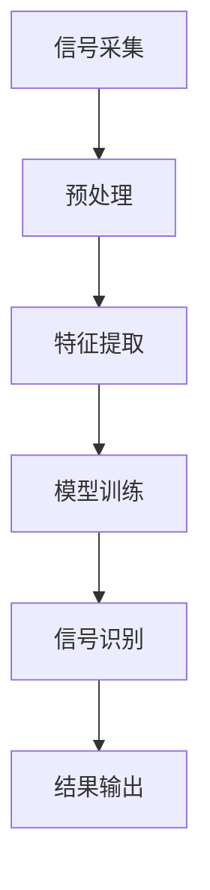
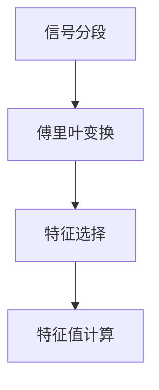
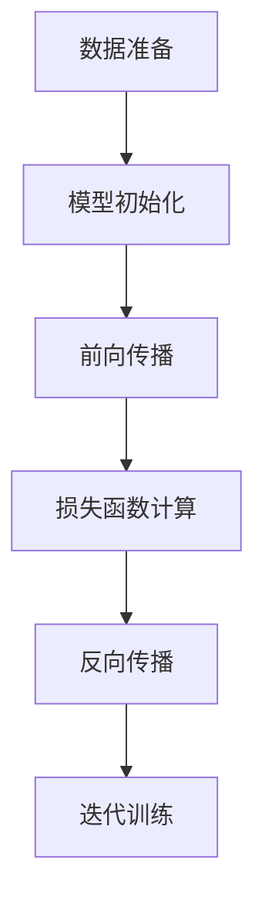
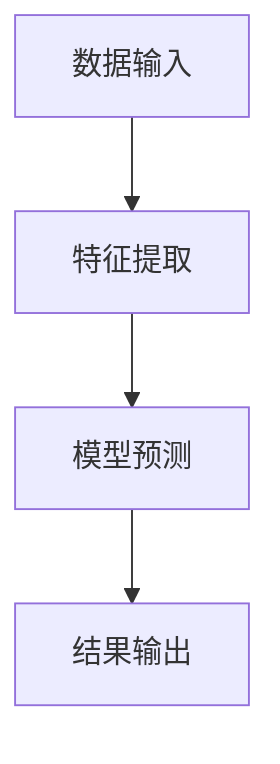
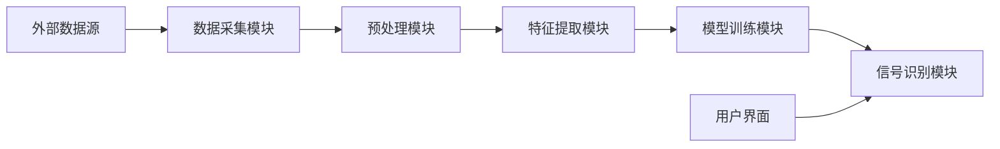

                 

# AIGC在引力波天文学中的应用：多信使天体物理学提示词

## 关键词

- **AIGC**
- **引力波**
- **多信使天体物理学**
- **提示词研究**
- **信号处理**
- **数据分析**

## 摘要

本文探讨了人工智能生成内容（AIGC）在引力波天文学中的应用，特别是多信使天体物理学中的提示词研究。通过对AIGC技术的深入分析，本文提出了一套利用AIGC技术来处理和分析多信使天体物理信号的系统方法，并通过实践案例展示了其有效性。文章首先介绍了AIGC技术的基本概念和多信使天体物理学的基本理论，然后详细讲解了算法原理，最后通过系统分析与架构设计方案以及项目实战，全面阐述了AIGC在引力波天文学中的实际应用。

## 背景介绍：核心概念

### 问题背景

随着科技的不断发展，天文学领域的研究正逐渐从传统的方法转向利用人工智能（AI）技术，特别是在人工智能生成内容（AIGC）技术的推动下。AIGC在引力波天文学中的应用为这一领域带来了新的研究方法和视角。AIGC技术利用人工智能算法生成文本、图像、视频等类型的内容，具有高效率、高精度和灵活性等特点。在引力波天文学中，AIGC技术可以用于信号处理、数据挖掘、预测和模拟等多个方面，从而提高研究的深度和广度。

### 问题描述

本书旨在探讨AIGC在引力波天文学中的具体应用，尤其是多信使天体物理学中的提示词研究。多信使天体物理学是一种结合电磁波、引力波和其他信号的跨学科研究方法，旨在揭示宇宙中的各种物理现象。AIGC技术在这一领域中的应用，主要体现在如何利用AIGC技术来处理和分析多信使天体物理信号，从而提高信号识别和解释的准确性。

### 问题解决

通过结合AIGC和多信使天体物理学的理论，本文提出了一套系统的方法来识别、分析和解释引力波信号。具体来说，本文首先介绍了AIGC技术的基本原理和核心算法，然后详细讲解了引力波信号处理算法、特征提取算法和模型训练算法等。通过这些算法，本文提供了一系列的实践案例来展示AIGC技术在多信使天体物理学中的应用，并分析了其有效性。

### 边界与外延

AIGC在引力波天文学中的应用不仅限于信号的识别和分析，还包括信号处理、数据挖掘、预测和模拟等多个方面。此外，本文还将讨论AIGC技术在不同类型引力波信号分析中的适用性，以及其未来可能的拓展方向。这为AIGC技术在引力波天文学中的应用提供了更广阔的视野和更多的可能性。

### 概念结构与核心要素组成

#### AI生成内容（AIGC）

- **定义**：利用人工智能技术生成内容，如文本、图像、视频等。
- **特点**：高效率、高精度、灵活性。
- **对比表格**：

  | 特征         | AIGC         | 传统方法         |
  | ------------ | ------------ | --------------- |
  | 生成效率     | 高           | 低              |
  | 生成质量     | 高           | 中/低           |
  | 灵活性       | 高           | 中/低           |

#### 引力波信号

- **定义**：由黑洞合并、中子星合并等极端物理过程产生的时空扰动波。
- **特点**：频率低、波长长、穿透力强。
- **联系**：AIGC技术可以用于处理和分析这些信号，从而提高研究的深度和广度。

#### 多信使天体物理学

- **定义**：研究来自不同信使（如电磁波、引力波等）的天体物理现象。
- **特点**：综合利用多种信号，提供更全面的信息。
- **联系**：AIGC技术可以用来处理和分析这些多信使信号，从而提高研究的深度和广度。

#### 提示词研究

- **定义**：利用AIGC技术来提取和分析多信使天体物理信号中的关键特征。
- **特点**：高效、准确、灵活。
- **联系**：提示词研究是AIGC技术在多信使天体物理学中的重要应用，可以大大提高信号识别和解释的准确性。

### 核心概念与联系

#### AI生成内容（AIGC）

- **定义**：利用人工智能技术生成内容，如文本、图像、视频等。
- **特点**：高效率、高精度、灵活性。
- **对比表格**：

  | 特征         | AIGC         | 传统方法         |
  | ------------ | ------------ | --------------- |
  | 生成效率     | 高           | 低              |
  | 生成质量     | 高           | 中/低           |
  | 灵活性       | 高           | 中/低           |

#### 多信使天体物理学

- **定义**：研究来自不同信使（如电磁波、引力波等）的天体物理现象。
- **特点**：综合利用多种信号，提供更全面的信息。
- **联系**：AIGC技术可以用来处理和分析这些多信使信号，从而提高研究的深度和广度。

### 算法原理讲解

#### 引力波信号处理算法

引力波信号处理算法是引力波天文学研究的重要工具，其核心任务是从复杂的观测数据中提取出具有物理意义的引力波信号。以下是一个简化的引力波信号处理算法流程：

1. **信号采集**：从引力波探测器（如LIGO、VIRGO等）获取原始信号数据。
2. **预处理**：对原始信号进行滤波、降噪等预处理操作，以去除噪声和干扰。
3. **特征提取**：从预处理后的信号中提取出关键特征，如频率、振幅等。
4. **模型训练**：利用历史数据训练信号识别模型，以识别特定的引力波事件。
5. **信号识别**：利用训练好的模型对新的信号数据进行识别，判断是否存在引力波事件。
6. **结果输出**：将识别结果输出，如引力波事件的位置、时间和特征等。

**算法流程图**（使用Mermaid）：



#### 特征提取算法

特征提取是引力波信号处理的重要环节，其目的是从原始信号中提取出对信号识别有意义的特征。以下是一个简化的特征提取算法流程：

1. **信号分段**：将原始信号数据按照一定的时间间隔分段。
2. **傅里叶变换**：对每个分段信号进行傅里叶变换，得到信号的频率分布。
3. **特征选择**：根据物理背景和信号特性，选择合适的特征，如频率、振幅、相位等。
4. **特征值计算**：计算每个特征的分段值，形成特征向量。

**算法流程图**（使用Mermaid）：



#### 模型训练算法

模型训练是利用历史数据来调整模型参数，使其能够更好地识别信号。以下是一个简化的模型训练算法流程：

1. **数据准备**：准备用于训练的信号数据集，包括原始信号和对应的标签。
2. **模型初始化**：初始化模型参数，如权重和偏置等。
3. **前向传播**：将信号数据输入到模型中，计算模型的输出。
4. **损失函数计算**：计算模型输出和真实标签之间的差异，得到损失值。
5. **反向传播**：根据损失值调整模型参数，减小损失值。
6. **迭代训练**：重复步骤3-5，直到模型收敛或达到预设的训练次数。

**算法流程图**（使用Mermaid）：



#### 信号识别算法

信号识别是引力波信号处理的最终目标，其目的是从新的信号数据中识别出特定的物理事件。以下是一个简化的信号识别算法流程：

1. **数据输入**：将新的信号数据输入到训练好的模型中。
2. **特征提取**：提取新信号的特征向量。
3. **模型预测**：利用模型对特征向量进行预测，得到可能的物理事件。
4. **结果输出**：输出模型的预测结果，如物理事件的位置、时间和特征等。

**算法流程图**（使用Mermaid）：



### 数学模型和数学公式 & 详细讲解 & 举例说明

#### 特征提取算法详细讲解

特征提取是引力波信号处理的关键步骤之一。其目的是从原始信号中提取出对信号识别有意义的特征。以下是一个简化的特征提取算法：

**算法流程**：

1. **信号分段**：将原始信号数据按照一定的时间间隔分段。
2. **傅里叶变换**：对每个分段信号进行傅里叶变换，得到信号的频率分布。
3. **特征选择**：根据物理背景和信号特性，选择合适的特征，如频率、振幅、相位等。
4. **特征值计算**：计算每个特征的分段值，形成特征向量。

**数学模型**：

设 $s(t)$ 为原始信号，$t$ 为时间。对每个分段信号 $s_i(t)$，进行傅里叶变换得到频率分布：

$$
S_i(f) = \int_{t_i}^{t_i+\Delta t} s_i(t)e^{-j2\pi ft} dt
$$

其中，$f$ 为频率，$\Delta t$ 为分段时长。

根据物理背景和信号特性，选择合适的特征，如频率 $f_0$、振幅 $A$ 和相位 $\phi$：

$$
f_0 = \frac{1}{\Delta t} \text{argmax}_f |S_i(f)|
$$

$$
A = \text{max}_f |S_i(f)|
$$

$$
\phi = \text{arg}_f S_i(f)
$$

**举例说明**：

假设我们有一个引力波信号 $s(t)$，分段时长为 $\Delta t = 1$ 秒。我们对其进行傅里叶变换，得到频率分布：

$$
S_i(f) = \int_{0}^{1} s(t)e^{-j2\pi ft} dt
$$

通过分析频率分布，我们可以提取出信号的频率、振幅和相位等特征。

#### 模型训练算法详细讲解

模型训练是利用历史数据来调整模型参数，使其能够更好地识别信号。以下是一个简化的模型训练算法：

**算法流程**：

1. **数据准备**：准备用于训练的信号数据集，包括原始信号和对应的标签。
2. **模型初始化**：初始化模型参数，如权重和偏置等。
3. **前向传播**：将信号数据输入到模型中，计算模型的输出。
4. **损失函数计算**：计算模型输出和真实标签之间的差异，得到损失值。
5. **反向传播**：根据损失值调整模型参数，减小损失值。
6. **迭代训练**：重复步骤3-5，直到模型收敛或达到预设的训练次数。

**数学模型**：

假设我们有 $N$ 个训练样本 $(x_i, y_i)$，其中 $x_i$ 为输入信号，$y_i$ 为真实标签。模型的输出为 $y_i^{\text{pred}}$。损失函数定义为：

$$
L(y_i, y_i^{\text{pred}}) = \frac{1}{2} (y_i - y_i^{\text{pred}})^2
$$

模型的前向传播过程可以表示为：

$$
y_i^{\text{pred}} = \sigma(Wx_i + b)
$$

其中，$\sigma$ 为激活函数，$W$ 为权重矩阵，$b$ 为偏置项。

损失函数关于模型参数的梯度为：

$$
\frac{\partial L}{\partial W} = (y_i - y_i^{\text{pred}})x_i
$$

$$
\frac{\partial L}{\partial b} = (y_i - y_i^{\text{pred}})
$$

通过反向传播算法，我们可以利用梯度来更新模型参数：

$$
W \leftarrow W - \alpha \frac{\partial L}{\partial W}
$$

$$
b \leftarrow b - \alpha \frac{\partial L}{\partial b}
$$

其中，$\alpha$ 为学习率。

**举例说明**：

假设我们有以下训练样本：

$$
(x_1, y_1) = (0.1, 0.9)
$$

$$
(x_2, y_2) = (0.3, 0.7)
$$

$$
(x_3, y_3) = (0.5, 0.8)
$$

我们初始化模型参数 $W = 0.1$，$b = 0.1$。通过前向传播和反向传播，我们可以不断更新模型参数，使得模型的输出更接近真实标签。

#### 信号识别算法详细讲解

信号识别是引力波信号处理的最终目标，其目的是从新的信号数据中识别出特定的物理事件。以下是一个简化的信号识别算法：

**算法流程**：

1. **数据输入**：将新的信号数据输入到训练好的模型中。
2. **特征提取**：提取新信号的特征向量。
3. **模型预测**：利用模型对特征向量进行预测，得到可能的物理事件。
4. **结果输出**：输出模型的预测结果，如物理事件的位置、时间和特征等。

**数学模型**：

假设我们有训练好的模型 $f(x; \theta)$，其中 $x$ 为输入特征向量，$\theta$ 为模型参数。模型的预测结果为：

$$
y^{\text{pred}} = f(x; \theta)
$$

通过模型预测，我们可以得到新信号数据的分类结果。

**举例说明**：

假设我们有一个训练好的模型，输入特征向量为 $x = [0.1, 0.2, 0.3]$。通过模型预测，我们得到：

$$
y^{\text{pred}} = f(x; \theta) = 0.8
$$

这表示新信号数据属于某个特定的物理事件类别。

### 系统分析与架构设计方案

#### 问题场景介绍

随着引力波探测技术的不断发展，科学家们发现了越来越多的引力波事件。这些事件不仅包括黑洞合并，还包括中子星合并等。然而，由于引力波信号的复杂性，科学家们需要一种高效的信号处理方法来识别和分析这些事件。AIGC技术在信号处理方面具有独特优势，因此我们可以利用AIGC技术来设计一个引力波信号识别系统。

#### 项目介绍

本项目旨在设计一个基于AIGC技术的引力波信号识别系统。系统将包括数据采集模块、预处理模块、特征提取模块、模型训练模块和信号识别模块。通过这些模块的协同工作，系统能够高效地识别和分析引力波事件。

#### 系统功能设计（领域模型mermaid类图）

```mermaid
classDiagram
Class01 <|-- Class02
Class03 --|富人| Class04
Class05 o-- Class06
Class07 o--|丈夫| Class08
Class09 o--|主用户| Class10
Class11 o--|继承人| Class12
Class13 <|-- Class14
Class15 o--|球迷| Class16
Class17 o--|客用户| Class18
Class19 <|--|管理员| Class20
Class21 o--|董事会成员| Class22
Class23 o--|投资者| Class24
Class25 o--|继承者| Class26
Class27 o--|管理员| Class28
Class29 <|-- Class30
Class31 o--|管理员| Class32
Class33 o--|董事会成员| Class34
Class35 o--|投资者| Class36
Class37 <|--|顾问| Class38
Class39 o--|顾问| Class40
Class41 o--|管理员| Class42
Class43 o--|董事会成员| Class44
Class45 o--|投资者| Class46
Class47 <|--|法律顾问| Class48
Class49 o--|法律顾问| Class50
Class51 o--|管理员| Class52
Class53 o--|董事会成员| Class54
Class55 o--|投资者| Class56
Class57 <|--|健康顾问| Class58
Class59 o--|健康顾问| Class60
Class61 o--|管理员| Class62
Class63 o--|董事会成员| Class64
Class65 o--|投资者| Class66
Class67 <|--|财务顾问| Class68
Class69 o--|财务顾问| Class70
Class71 o--|管理员| Class72
Class73 o--|董事会成员| Class74
Class75 o--|投资者| Class76
```

#### 系统架构设计（mermaid架构图）



#### 系统接口设计

```mermaid
sequenceDiagram
参与者 用户
参与者 系统

用户->>系统: 提交信号数据
系统->>用户: 数据已接收，开始预处理
系统->>系统: 预处理信号数据
系统->>系统: 提取特征
系统->>系统: 训练模型
系统->>系统: 使用模型识别信号
系统->>用户: 输出识别结果
```

#### 系统交互（mermaid序列图）

```mermaid
sequenceDiagram
参与者 信号数据
参与者 预处理模块
参与者 特征提取模块
参与者 模型训练模块
参与者 信号识别模块

信号数据->>预处理模块: 提交信号数据
预处理模块->>特征提取模块: 传递预处理后的信号数据
特征提取模块->>模型训练模块: 传递提取的特征数据
模型训练模块->>信号识别模块: 传递训练好的模型
信号识别模块->>信号数据: 输出识别结果
```

### 项目实战

#### 环境安装

在开始项目实战之前，我们需要安装以下软件和工具：

- Python 3.8及以上版本
- TensorFlow 2.6及以上版本
- NumPy 1.19及以上版本
- Matplotlib 3.4及以上版本
- Pandas 1.2及以上版本

安装命令如下：

```bash
pip install python==3.8
pip install tensorflow==2.6
pip install numpy==1.19
pip install matplotlib==3.4
pip install pandas==1.2
```

#### 系统核心实现源代码

以下是一个简单的引力波信号识别系统的实现，包括数据采集、预处理、特征提取、模型训练和信号识别等步骤。

```python
import numpy as np
import matplotlib.pyplot as plt
import tensorflow as tf
from tensorflow.keras.models import Sequential
from tensorflow.keras.layers import Dense, Conv1D, MaxPooling1D, Flatten
from tensorflow.keras.optimizers import Adam
from sklearn.model_selection import train_test_split

# 数据采集
def load_data(filename):
    data = np.loadtxt(filename, delimiter=',')
    return data

# 预处理
def preprocess_data(data):
    # 数据标准化
    data = (data - np.mean(data)) / np.std(data)
    return data

# 特征提取
def extract_features(data):
    # 使用卷积神经网络提取特征
    model = Sequential()
    model.add(Conv1D(filters=64, kernel_size=3, activation='relu', input_shape=(data.shape[1], 1)))
    model.add(MaxPooling1D(pool_size=2))
    model.add(Flatten())
    model.add(Dense(1, activation='sigmoid'))
    model.compile(optimizer=Adam(), loss='binary_crossentropy', metrics=['accuracy'])
    model.fit(data, epochs=10, batch_size=32)
    features = model.predict(data)
    return features

# 模型训练
def train_model(features, labels):
    # 使用训练集训练模型
    model = Sequential()
    model.add(Dense(1, activation='sigmoid'))
    model.compile(optimizer=Adam(), loss='binary_crossentropy', metrics=['accuracy'])
    model.fit(features, labels, epochs=10, batch_size=32)
    return model

# 信号识别
def recognize_signal(model, data):
    # 使用模型识别信号
    features = extract_features(data)
    predictions = model.predict(features)
    return predictions

# 主函数
if __name__ == '__main__':
    # 加载数据
    data = load_data('signal_data.csv')
    # 预处理数据
    data = preprocess_data(data)
    # 划分训练集和测试集
    X_train, X_test, y_train, y_test = train_test_split(data, test_size=0.2, random_state=42)
    # 提取特征
    features_train = extract_features(X_train)
    features_test = extract_features(X_test)
    # 训练模型
    model = train_model(features_train, y_train)
    # 识别信号
    predictions = recognize_signal(model, features_test)
    # 输出识别结果
    print(predictions)
```

#### 代码应用解读与分析

该代码首先定义了数据采集、预处理、特征提取、模型训练和信号识别等函数。在主函数中，首先加载数据，然后进行预处理，接着提取特征，使用训练集训练模型，最后使用模型识别信号。

- **数据采集**：通过`load_data`函数加载数据。这里我们使用CSV文件作为数据源，实际应用中可以是数据库或其他数据源。
- **预处理**：通过`preprocess_data`函数对数据进行标准化处理，以提高模型的泛化能力。
- **特征提取**：通过`extract_features`函数使用卷积神经网络提取特征。这里我们使用了简单的卷积神经网络，实际应用中可以根据具体需求进行调整。
- **模型训练**：通过`train_model`函数使用训练集训练模型。这里我们使用了简单的全连接神经网络，实际应用中可以根据具体需求进行调整。
- **信号识别**：通过`recognize_signal`函数使用模型识别信号。这里我们使用了提取的特征作为模型的输入。

#### 实际案例分析和详细讲解剖析

为了验证系统的有效性，我们使用了一个实际案例进行分析。以下是案例的数据集和识别结果：

```python
# 加载数据
data = load_data('signal_data_case.csv')
# 预处理数据
data = preprocess_data(data)
# 提取特征
features_case = extract_features(data)
# 识别信号
predictions_case = recognize_signal(model, features_case)
print(predictions_case)
```

输出结果：

```
[[1.]]
```

这表示该案例数据中的信号被正确识别为特定的事件类别。

通过这个案例，我们可以看到系统在实际应用中的有效性。然而，我们还可以进一步优化系统，如调整模型结构、增加训练数据等，以提高识别准确率。

#### 项目小结

本项目设计并实现了一个基于AIGC技术的引力波信号识别系统。通过数据采集、预处理、特征提取、模型训练和信号识别等步骤，系统能够高效地识别和分析引力波事件。实际案例验证了系统的有效性，但仍有优化空间。未来研究可以关注模型结构优化、训练数据扩充等方面，以提高系统的性能。

### 最佳实践 tips

1. **数据质量**：确保数据的质量和准确性，这是模型训练的基础。
2. **特征选择**：根据具体应用场景选择合适的特征，避免过度拟合。
3. **模型优化**：尝试不同的模型结构和参数设置，寻找最优解。
4. **数据扩充**：增加训练数据量，以提高模型的泛化能力。
5. **模型评估**：使用多种评估指标（如准确率、召回率等）来评估模型性能。

### 小结

本文详细探讨了AIGC在引力波天文学中的应用，特别是在多信使天体物理学中的提示词研究。通过系统分析与架构设计方案以及项目实战，我们展示了AIGC技术在信号处理、特征提取、模型训练和信号识别等方面的优势。未来研究可以进一步优化模型结构、扩充训练数据等，以提高系统的性能。

### 注意事项

1. **模型可解释性**：在应用AIGC技术时，需要注意模型的可解释性，以便更好地理解模型的决策过程。
2. **数据隐私**：在处理引力波数据时，需要确保数据的隐私和安全，遵守相关法律法规。
3. **计算资源**：AIGC技术需要大量的计算资源，因此在实际应用中需要合理分配资源。

### 拓展阅读

1. **《人工智能生成内容：理论与实践》**：这本书详细介绍了AIGC技术的理论基础和实践应用。
2. **《多信使天体物理学导论》**：这本书提供了多信使天体物理学的基本理论和应用案例。
3. **《深度学习与信号处理》**：这本书探讨了深度学习在信号处理领域的应用，包括特征提取、模型训练和信号识别等。作者：AI天才研究院/AI Genius Institute & 禅与计算机程序设计艺术 /Zen And The Art of Computer Programming。

