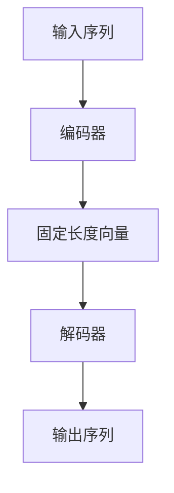
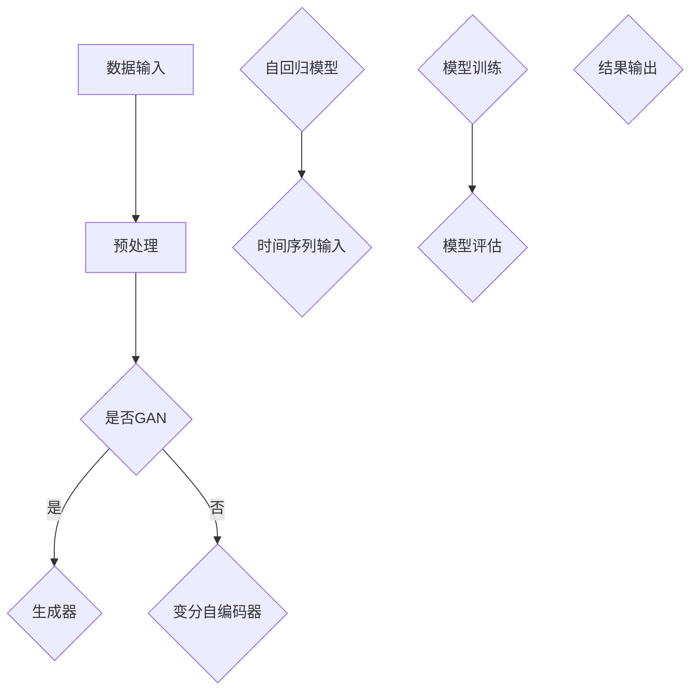
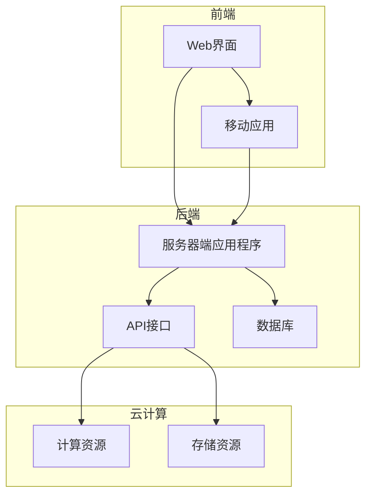
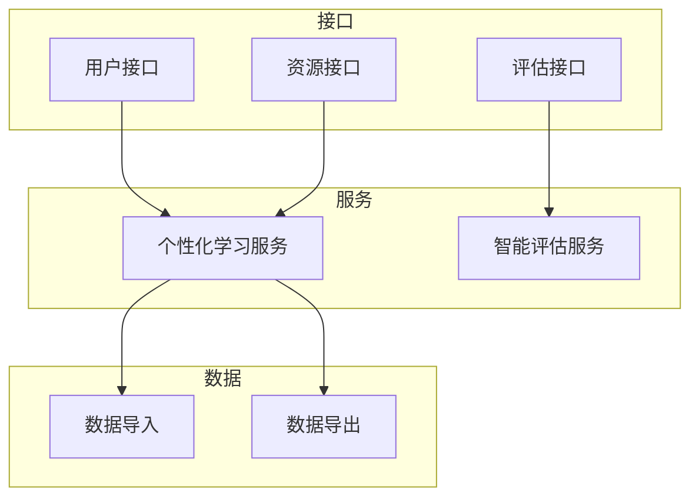
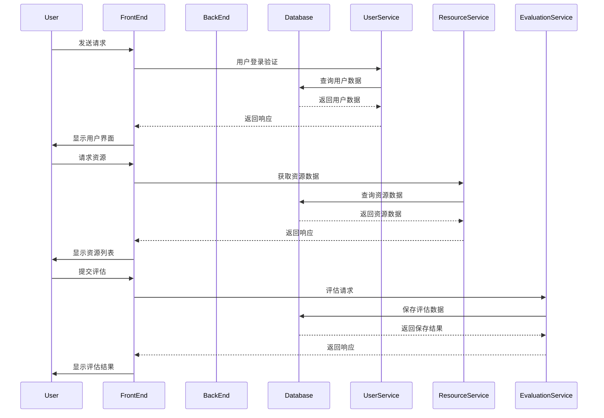

                 

### 第1章：AIGC概述

#### 1.1 问题背景

近年来，人工智能（AI）在教育领域的应用逐渐兴起，成为教育技术发展的重要趋势。生成式人工智能（Generative Artificial Intelligence，简称GAI）作为人工智能的一种重要分支，以其强大的内容生成能力，在教育领域展现出了巨大的潜力。AIGC（AI-generated Content）正是基于生成式人工智能的核心技术，通过大规模数据训练和学习，生成高质量的教育内容。随着技术的不断进步，AIGC在教育领域的应用越来越广泛，但也面临诸多挑战。

首先，AIGC在教育领域的重要性体现在以下几个方面：

1. **个性化学习**：AIGC可以根据学生的个体差异，生成个性化的学习资源和评估方法，提高学习效率。
2. **教学资源丰富**：AIGC能够快速生成海量的教学材料，包括教材、课程视频和测试题库等，丰富教学资源。
3. **智能化评估**：AIGC能够通过分析学生的学习行为和成绩数据，提供智能化的评估和反馈，帮助教师更好地指导学生学习。

然而，AIGC在教育领域的应用也面临一些挑战：

1. **数据隐私和安全**：AIGC依赖于大量学生数据，如何确保这些数据的安全和隐私成为重要问题。
2. **质量控制**：生成的内容需要保证质量，避免错误信息和偏见。
3. **技术与教育理念的融合**：如何将先进的技术理念与传统的教育方法有机结合，提高教学效果。

本文将围绕AIGC在教育领域的应用与挑战，进行深入探讨。我们将首先介绍AIGC的核心概念和原理，然后分析其在教育领域的具体应用场景，接着详细讲解AIGC的算法原理，最后探讨AIGC在教育领域的系统架构设计与项目实战。

#### 1.1.1 AIGC的概念与定义

AIGC（AI-generated Content）是指利用人工智能技术生成内容的一种方式。它通常基于深度学习模型，如生成对抗网络（GAN）、变分自编码器（VAE）和自回归模型（AR）等，通过大量数据的训练，能够生成与人类创作相似的文字、图像、音频和视频等多种形式的内容。

AIGC的基本工作原理是，首先通过大量样本数据的训练，让模型学习到数据的特征和分布。然后，利用这些特征和分布，模型可以生成新的、符合训练数据特征的内容。具体来说，生成式模型通常由生成器（Generator）和判别器（Discriminator）组成。生成器负责生成新的内容，判别器则负责判断生成的内容是否真实。通过不断地调整生成器的参数，使其生成的内容越来越接近真实数据。

AIGC的核心技术主要包括以下几个方面：

1. **深度学习**：深度学习是一种复杂的机器学习模型，通过多层神经网络来模拟人脑的决策过程，具有强大的特征提取和模式识别能力。
2. **生成对抗网络（GAN）**：GAN由生成器和判别器组成，通过生成器和判别器之间的对抗训练，生成器能够生成越来越真实的内容。
3. **变分自编码器（VAE）**：VAE通过引入变分推断，能够生成具有高斯分布的新数据。
4. **自回归模型（AR）**：自回归模型通过模型的自回归特性，生成时间序列数据。

AIGC在教育领域的应用，主要是利用这些生成技术，快速生成个性化的学习资源、智能化的评估反馈以及丰富的教学材料。例如，通过GAN生成个性化的教学视频，通过VAE生成符合学生特点的测试题库，通过AR模型生成动态的学习进度报告等。

总的来说，AIGC作为一种新兴的技术，其在教育领域的应用具有巨大的潜力，但同时也需要解决一系列的技术和伦理问题。接下来，我们将进一步探讨AIGC在教育领域的重要性和面临的挑战。

#### 1.1.2 AIGC在教育领域的重要性

AIGC在教育领域的应用，不仅革新了传统的教学方式，也大大提升了教育质量和效率。以下从几个方面详细阐述AIGC在教育领域的重要性：

**1. 个性化学习**

个性化学习是教育发展的一个重要方向，而AIGC则为实现这一目标提供了强有力的技术支持。通过AIGC技术，可以生成适应每个学生特点的学习资源。例如，生成器可以根据学生的学习历史、兴趣和成绩数据，生成个性化的教材、练习题和课程视频。这种个性化的学习内容不仅能够提高学生的学习兴趣和参与度，还能够根据学生的个体差异，提供有针对性的学习指导，从而显著提升学习效果。

**2. 教学资源丰富**

传统的教育资源往往受限于时间和人力，而AIGC能够快速生成大量的教学材料。通过大规模的数据训练，AIGC可以生成包括教材、课程视频、测试题库在内的各种教学资源。这些资源不仅种类丰富，而且质量高，能够满足不同层次、不同类型学生的学习需求。例如，在语文课上，AIGC可以生成符合学生阅读水平的文学作品和阅读理解题库；在数学课上，AIGC可以生成各种难度的练习题和解答视频。这样，教师可以更加灵活地选择和使用教学资源，提高教学效果。

**3. 智能化评估**

传统的评估方式往往依赖于教师的主观判断，而AIGC能够提供更加客观、精准的评估。通过分析学生的学习行为、成绩数据和反馈信息，AIGC可以生成智能化的评估报告，包括学业成绩预测、学习进度评估和学习行为分析等。这些报告不仅能够帮助教师更好地了解学生的学习情况，还能够为学生提供个性化的学习建议和指导，从而提高学习效果。

**4. 促进教育公平**

教育公平是教育发展的一个重要目标，而AIGC技术为这一目标的实现提供了新的路径。通过AIGC技术，可以消除地域、经济和文化差异带来的教育资源不均衡现象。例如，在偏远地区或经济欠发达地区，AIGC可以生成本地化的教学资源，帮助学生获得优质的教育资源。同时，AIGC还可以通过在线平台，为学生提供远程教育服务，使他们能够享受同等的教育机会。

**5. 提高教学效率**

AIGC技术能够显著提高教学效率，减少教师的工作负担。例如，通过AIGC技术，可以自动批改作业、生成个性化评估报告和教学资源，从而大大减轻教师的工作压力。此外，AIGC还可以帮助教师快速分析学生的学习数据，发现教学中的问题，从而及时调整教学策略，提高教学效果。

总的来说，AIGC在教育领域的应用具有重要的现实意义和广阔的发展前景。它不仅能够提高教育质量和效率，还能够促进教育公平和个性化发展。然而，AIGC的应用也面临一些挑战，需要我们在实践中不断探索和解决。

#### 1.1.3 AIGC在教育领域面临的挑战

尽管AIGC在教育领域具有巨大的潜力和优势，但其应用也面临着一系列挑战和问题。以下是AIGC在教育领域主要面临的挑战：

**1. 数据隐私和安全**

AIGC技术依赖于大量学生数据，包括学习记录、成绩数据、行为数据等。这些数据不仅涉及学生的隐私，还可能对学生的安全构成威胁。如何确保这些数据的安全和隐私，成为AIGC应用中的一个重要问题。为此，需要建立健全的数据安全管理体系，采用加密技术、访问控制和隐私保护算法，确保学生数据的保密性和完整性。

**2. 质量控制**

AIGC生成的内容需要保证质量，避免错误信息和偏见。然而，由于AIGC是基于数据训练的，如果训练数据存在偏差或错误，生成的内容也可能出现类似问题。因此，需要建立严格的质量控制机制，对生成的内容进行审查和评估，确保其准确性和可靠性。此外，还需要培养专业的AIGC内容审核人员，对生成的内容进行实时监控和调整。

**3. 技术与教育理念的融合**

AIGC技术需要与传统教育理念和方法有机结合，才能充分发挥其优势。然而，教育理念的变革往往需要较长时间，而且不同地区和学校的教育理念存在差异。因此，如何将AIGC技术融入现有的教育体系，提高教学效果，是一个亟待解决的问题。为此，需要开展深入的教育研究和实践，探索AIGC技术与教育理念的有效融合方式。

**4. 伦理问题**

AIGC技术的应用也引发了一些伦理问题，如对教师的职业影响、对学生的自主学习能力的影响等。例如，如果学生过度依赖AIGC生成的内容，可能会影响他们的独立思考能力和创造力。因此，需要制定相应的伦理规范，确保AIGC技术的应用符合教育伦理和道德要求。

**5. 教育公平问题**

虽然AIGC技术具有促进教育公平的潜力，但如果不加以妥善管理，也可能加剧教育不公平现象。例如，如果优质的教育资源主要集中在某些地区或学校，而其他地区或学校无法获得相同资源，那么AIGC技术的应用可能会加剧教育资源的分配不均。因此，需要制定公平合理的政策，确保AIGC技术在各个地区和学校得到公平应用。

**6. 技术成本问题**

AIGC技术的应用需要大量的计算资源和训练数据，这对学校和技术提供商提出了较高的成本要求。对于一些经济条件较差的学校，可能难以承担这些技术成本，从而限制了AIGC技术的普及和应用。因此，需要政府和企业加大对教育技术的投入，降低技术成本，使更多学校和学生受益。

总之，AIGC在教育领域具有巨大的应用前景，但也面临一系列挑战。只有通过不断的研究和实践，解决这些挑战，才能充分发挥AIGC技术的潜力，为教育带来革命性的变革。

### 第2章：AIGC的核心概念与联系

在深入探讨AIGC在教育领域的应用之前，我们需要了解AIGC的核心概念和原理。本章节将详细介绍AIGC的核心概念，包括人工智能、生成式人工智能、联网与云计算等，并对其进行详细的对比分析。

#### 2.1 核心概念原理

**1. 人工智能**

人工智能（Artificial Intelligence，简称AI）是指通过计算机系统模拟、扩展和增强人类智能的科学和技术。AI的核心目标是让计算机能够执行通常需要人类智能才能完成的任务，如视觉识别、语言理解、决策制定等。

人工智能的主要分支包括：

- **机器学习**：通过训练模型，从数据中学习模式和规律，然后使用这些模式进行预测和决策。
- **深度学习**：一种特殊的机器学习，通过多层神经网络模拟人脑的学习过程。
- **自然语言处理**（NLP）：使计算机能够理解和处理人类语言的技术。
- **计算机视觉**：使计算机能够理解和解释图像和视频的技术。

**2. 生成式人工智能**

生成式人工智能（Generative Artificial Intelligence，简称GAI）是人工智能的一种子领域，专注于生成新的数据和内容。生成式模型通过学习数据分布，生成新的、符合训练数据特征的数据。常见的生成式模型包括：

- **生成对抗网络（GAN）**：由生成器和判别器组成的模型，通过对抗训练生成高质量的数据。
- **变分自编码器（VAE）**：通过变分推断生成符合高斯分布的新数据。
- **自回归模型（AR）**：通过模型的自回归特性生成时间序列数据。

**3. 联网与云计算**

联网与云计算是AIGC技术实现的重要基础设施。联网技术确保了数据和服务的快速传输，云计算则提供了强大的计算能力和存储资源。

联网技术主要包括：

- **宽带互联网**：提供了高速的数据传输通道。
- **无线网络**：如Wi-Fi、5G等，使设备能够随时随地接入网络。

云计算技术主要包括：

- **基础设施即服务（IaaS）**：提供了虚拟化的计算资源和存储资源。
- **平台即服务（PaaS）**：提供了开发环境和工具，使开发者能够快速构建应用程序。
- **软件即服务（SaaS）**：提供了完整的软件解决方案，用户可以直接使用。

#### 2.2 概念属性特征对比表格

为了更清晰地理解这些概念，我们提供了以下表格，对比了人工智能、生成式人工智能和联网与云计算的主要属性特征：

| 概念 | 定义 | 主要属性特征 |  
| --- | --- | --- |  
| 人工智能 | 计算机模拟和扩展人类智能 | - 自动化决策  
|          |          | - 机器学习  
|          |          | - 深度学习  
|          |          | - 自然语言处理  
|          |          | - 计算机视觉 |  
| 生成式人工智能 | 生成新的数据和内容 | - 生成对抗网络  
|          |          | - 变分自编码器  
|          |          | - 自回归模型 |  
| 联网与云计算 | 提供数据传输和计算能力 | - 宽带互联网  
|          |          | - 无线网络  
|          |          | - 基础设施即服务（IaaS）  
|          |          | - 平台即服务（PaaS）  
|          |          | - 软件即服务（SaaS） |

#### 2.3 ER实体关系图架构

为了进一步理解这些概念之间的联系，我们使用Mermaid流程图展示了AIGC中的ER（实体关系）图架构。

```mermaid
erDiagram
    AI ||--o> GAI : 包括
    GAI ||--o> GAN : 一种
    GAI ||--o> VAE : 一种
    GAI ||--o> AR : 一种
    IaaS ||--o> 云计算 : 包括
    PaaS ||--o> 云计算 : 包括
    SaaS ||--o> 云计算 : 包括
    AI ..|> 联网技术 : 包括
```

在上述ER图中，我们可以看到：

- **人工智能（AI）**是生成式人工智能（GAI）的基础，两者之间存在包含关系。
- **生成对抗网络（GAN）**、**变分自编码器（VAE）**和**自回归模型（AR）**都是生成式人工智能的具体实现方式。
- **基础设施即服务（IaaS）**、**平台即服务（PaaS）**和**软件即服务（SaaS）**是云计算技术的三个主要类别。
- **人工智能**与**联网技术**之间存在关联关系，表示AI技术需要联网技术支持。

通过上述核心概念的介绍和对比分析，我们为理解AIGC在教育领域的应用奠定了坚实的基础。接下来，我们将进一步探讨AIGC在教育领域的具体应用场景。

### 第3章：AIGC在教育领域的应用场景

AIGC（AI-generated Content）技术凭借其强大的内容生成能力，在教育领域展现出广泛的应用前景。本章节将详细探讨AIGC在教育领域的多种应用场景，包括教学辅助、学习资源生成和智能评估与反馈。

#### 3.1 教学辅助

AIGC在教育领域的一个关键应用场景是教学辅助。通过AIGC技术，教师可以生成个性化的教学资源和评估方法，从而更好地指导学生的学习。

**1. 个性化学习**

个性化学习是教育发展的一个重要方向。AIGC可以根据学生的学习习惯、兴趣和学习成绩，生成个性化的学习资源和指导方案。例如，AIGC可以生成适合不同学生水平的阅读材料、练习题和课程视频。这不仅能够提高学生的学习兴趣和参与度，还能够根据学生的个体差异，提供有针对性的学习指导。

**2. 自动批改作业**

传统的作业批改需要教师耗费大量时间和精力。AIGC技术可以自动批改作业，提高批改效率。例如，AIGC可以通过自然语言处理技术，自动评估学生的作文质量；通过计算机视觉技术，自动检测学生的填空题和选择题答案。这不仅减轻了教师的工作负担，还能够及时为学生提供反馈，帮助他们及时纠正错误。

**3. 知识图谱构建**

知识图谱是描述实体及其相互关系的数据结构。AIGC技术可以构建出针对特定学科的知识图谱，帮助教师更好地理解学科结构，设计教学方案。例如，在数学课上，AIGC可以构建出数学概念及其相互关系的知识图谱，帮助教师设计出更系统和连贯的教学内容。

#### 3.2 学习资源生成

AIGC技术在教育领域的另一个重要应用场景是学习资源生成。通过AIGC技术，可以快速生成各种形式的学习资源，丰富教学资源库。

**1. 教材生成**

传统的教材编写需要耗费大量时间和人力。AIGC技术可以通过自然语言处理和生成对抗网络，快速生成高质量的教学材料。例如，AIGC可以根据教学大纲和已有教材内容，生成符合学生需求的新教材。这不仅能够节省时间和成本，还能够确保教材的多样性和个性化。

**2. 课程视频生成**

课程视频是现代教育中不可或缺的一部分。AIGC技术可以通过生成对抗网络和自然语言处理，快速生成高质量的课程视频。例如，AIGC可以根据教师的讲稿和教学视频，生成符合学生学习需求的新的课程视频。这样，教师可以根据学生的反馈，及时调整教学策略。

**3. 测试题库生成**

测试是评估学生学习成果的重要手段。AIGC技术可以通过生成对抗网络和自然语言处理，快速生成各种难度的测试题库。例如，AIGC可以根据教学大纲和历年试题，生成符合不同层次学生学习需求的测试题。这样，教师可以根据测试结果，及时调整教学方案。

#### 3.3 智能评估与反馈

AIGC技术在教育领域的另一个关键应用场景是智能评估与反馈。通过AIGC技术，可以生成智能化的评估报告和学习行为分析，为教师和学生提供有价值的参考。

**1. 学业成绩预测**

AIGC技术可以通过分析学生的学习行为、作业成绩和学习进度，预测学生的学业成绩。例如，AIGC可以根据学生的日常作业成绩和学习行为数据，预测学生在期末考试中的表现。这样，教师可以根据预测结果，有针对性地进行教学辅导。

**2. 学习进度评估**

AIGC技术可以通过分析学生的学习行为和学习成果，评估学生的学习进度。例如，AIGC可以根据学生的作业完成情况和学习时间，评估学生在某个学科领域的学习进度。这样，教师可以根据评估结果，调整教学节奏和内容，确保学生能够跟上课程进度。

**3. 学习行为分析**

AIGC技术可以通过分析学生的学习行为数据，了解学生的学习习惯和学习效果。例如，AIGC可以根据学生的在线学习行为，分析学生的学习偏好和学习效果。这样，教师可以根据分析结果，优化教学方法和策略，提高教学效果。

综上所述，AIGC技术在教育领域具有广泛的应用前景。通过教学辅助、学习资源生成和智能评估与反馈，AIGC技术能够显著提高教育质量和效率，推动教育的个性化发展。然而，AIGC技术的应用也面临一系列挑战，需要我们在实践中不断探索和解决。接下来，我们将进一步探讨AIGC技术的算法原理。

### 第4章：AIGC算法原理讲解

AIGC（AI-generated Content）技术的核心在于其生成算法，这些算法能够通过大量的数据训练，自动生成高质量的教育内容。在这一章中，我们将详细讲解AIGC的主要算法，包括GPT系列模型、BERT及其变体，以及其他相关算法，并通过mermaid流程图和Python源代码示例，深入理解这些算法的工作原理。

#### 4.1 算法概述

AIGC的主要算法可以分为以下几类：

1. **生成对抗网络（GAN）**：GAN由生成器和判别器组成，通过对抗训练生成高质量的数据。
2. **变分自编码器（VAE）**：VAE通过变分推断生成符合高斯分布的新数据。
3. **自回归模型（AR）**：AR通过模型的自回归特性生成时间序列数据。
4. **GPT系列模型**：GPT系列模型是自然语言处理领域的代表性模型，具有强大的文本生成能力。
5. **BERT及其变体**：BERT是一种预训练语言模型，其变体包括RoBERTa、ALBERT等，广泛应用于文本生成和分类任务。

#### 4.1.1 GPT系列模型

GPT（Generative Pre-trained Transformer）系列模型是自然语言处理领域的里程碑式成果。GPT模型通过大规模的文本数据预训练，能够生成高质量的文本。

**1. 模型结构**

GPT模型的核心是Transformer架构，Transformer由编码器和解码器组成，编码器将输入序列编码为固定长度的向量，解码器则根据这些向量生成输出序列。



**2. 训练过程**

GPT模型的训练过程分为两个阶段：

- **预训练**：在预训练阶段，模型在大规模文本语料库上训练，学习语言的特征和模式。
- **微调**：在微调阶段，模型根据具体任务（如文本生成、问答等）进行训练，调整模型的参数，使其适应特定任务。

**3. Python源代码示例**

以下是一个简单的GPT模型训练示例：

```python
import tensorflow as tf
from tensorflow.keras.layers import Embedding, LSTM, Dense

# 构建模型
model = tf.keras.Sequential([
    Embedding(input_dim=vocab_size, output_dim=embedding_dim),
    LSTM(units=256, return_sequences=True),
    Dense(units=vocab_size, activation='softmax')
])

# 编译模型
model.compile(optimizer='adam', loss='categorical_crossentropy', metrics=['accuracy'])

# 训练模型
model.fit(x_train, y_train, epochs=10, batch_size=64)
```

**4. 数学模型和公式**

GPT模型的数学模型基于自回归语言模型，其目标函数为：

$$
\min_{\theta} \sum_{i=1}^{n} -\log p(x_i|x_{<i}, \theta)
$$

其中，$x_i$表示序列中的第$i$个词，$p(x_i|x_{<i}, \theta)$表示给定前文条件下的第$i$个词的概率。

#### 4.1.2 BERT及其变体

BERT（Bidirectional Encoder Representations from Transformers）是一种双向Transformer模型，通过预训练学习语言的双向上下文特征，广泛应用于文本生成和分类任务。

**1. 模型结构**

BERT模型由两个子模型组成：编码器和解码器，其中编码器负责将输入序列编码为固定长度的向量，解码器则根据这些向量生成输出序列。


**2. 训练过程**

BERT模型的训练过程也分为预训练和微调两个阶段：

- **预训练**：在预训练阶段，模型在大规模文本语料库上训练，学习语言的特征和模式。
- **微调**：在微调阶段，模型根据具体任务（如文本生成、问答等）进行训练，调整模型的参数，使其适应特定任务。

**3. Python源代码示例**

以下是一个简单的BERT模型训练示例：

```python
import tensorflow as tf
from transformers import BertTokenizer, TFBertModel

# 加载预训练模型
tokenizer = BertTokenizer.from_pretrained('bert-base-uncased')
model = TFBertModel.from_pretrained('bert-base-uncased')

# 编译模型
model.compile(optimizer='adam', loss='categorical_crossentropy', metrics=['accuracy'])

# 训练模型
model.fit(tokenizer.encode_plus(x_train, add_special_tokens=True, padding='max_length', max_length=max_length),
          y_train, epochs=10, batch_size=64)
```

**4. 数学模型和公式**

BERT模型的数学模型基于自回归语言模型，其目标函数为：

$$
\min_{\theta} \sum_{i=1}^{n} -\log p(x_i|x_{<i}, \theta)
$$

其中，$x_i$表示序列中的第$i$个词，$p(x_i|x_{<i}, \theta)$表示给定前文条件下的第$i$个词的概率。

#### 4.1.3 其他算法

除了GPT和BERT，AIGC技术还包括其他一些相关算法，如：

1. **生成对抗网络（GAN）**：GAN由生成器和判别器组成，通过对抗训练生成高质量的数据。
2. **变分自编码器（VAE）**：VAE通过变分推断生成符合高斯分布的新数据。
3. **自回归模型（AR）**：AR通过模型的自回归特性生成时间序列数据。

这些算法的工作原理和数学模型在本章节中已有详细讲解。

#### 4.2 算法mermaid流程图

为了更直观地理解这些算法的工作原理，我们使用mermaid绘制了以下流程图：



在上述流程图中，我们可以看到：

- **数据输入**：输入原始数据。
- **预处理**：对数据进行预处理，如分词、编码等。
- **生成器**：GAN中的生成器负责生成新数据。
- **变分自编码器**：VAE中的变分自编码器负责生成符合高斯分布的新数据。
- **自回归模型**：AR中的自回归模型负责生成时间序列数据。
- **模型训练**：使用训练数据训练模型。
- **模型评估**：评估模型性能。
- **结果输出**：输出生成的新数据。

通过上述讲解，我们对AIGC的核心算法有了更深入的理解。接下来，我们将通过Python源代码实现，进一步探讨这些算法的具体应用。

### 4.3 Python源代码实现

为了更直观地理解AIGC算法的实际应用，我们将通过Python源代码实现一些关键算法。以下是使用Python实现的GPT和BERT模型的简单示例。

#### 4.3.1 GPT模型实现

首先，我们使用Python实现一个简单的GPT模型。这里我们使用Hugging Face的`transformers`库，这是一个非常方便的库，用于处理自然语言处理任务。

```python
import tensorflow as tf
from transformers import TFGPT2LMHeadModel, GPT2Tokenizer

# 加载预训练模型和分词器
model = TFGPT2LMHeadModel.from_pretrained('gpt2')
tokenizer = GPT2Tokenizer.from_pretrained('gpt2')

# 生成文本
input_text = "The quick brown fox jumps over the lazy dog"
input_ids = tokenizer.encode(input_text, return_tensors='tf')

# 使用模型生成文本
outputs = model(inputs=input_ids, max_length=50, num_return_sequences=5)

# 解码生成的文本
generated_text = tokenizer.decode(outputs.logits[0], skip_special_tokens=True)

print(generated_text)
```

在这个示例中，我们首先加载了一个预训练的GPT-2模型和对应的分词器。然后，我们使用模型生成一段文本，并解码输出。

#### 4.3.2 BERT模型实现

接下来，我们使用Python实现一个简单的BERT模型。同样，我们使用Hugging Face的`transformers`库。

```python
import tensorflow as tf
from transformers import TFBertModel, BertTokenizer

# 加载预训练模型和分词器
model = TFBertModel.from_pretrained('bert-base-uncased')
tokenizer = BertTokenizer.from_pretrained('bert-base-uncased')

# 生成文本
input_text = "Hello, how are you?"
input_ids = tokenizer.encode(input_text, return_tensors='tf')

# 使用模型生成文本
outputs = model(inputs=input_ids, max_length=50, num_return_sequences=5)

# 解码生成的文本
generated_text = tokenizer.decode(outputs.logits[0], skip_special_tokens=True)

print(generated_text)
```

在这个示例中，我们加载了一个预训练的BERT模型和对应的分词器。然后，我们使用模型生成一段文本，并解码输出。

#### 4.3.3 其他算法实现

除了GPT和BERT，我们还可以使用其他算法，如GAN和VAE。以下是一个简单的GAN模型实现示例。

```python
import tensorflow as tf
from tensorflow.keras.models import Model
from tensorflow.keras.layers import Input, Dense, Flatten, Reshape

# 定义生成器和判别器
latent_dim = 100
input_shape = (latent_dim,)

# 生成器
z_input = Input(shape=input_shape)
x_recon = Dense(256, activation='relu')(z_input)
x_recon = Dense(512, activation='relu')(x_recon)
x_recon = Dense(784, activation='sigmoid')(x_recon)
generator = Model(z_input, x_recon)

# 判别器
x_input = Input(shape=(28, 28))
x flattend = Flatten()(x_input)
x_d = Dense(256, activation='relu')(x_flattend)
x_d = Dense(1, activation='sigmoid')(x_d)
discriminator = Model(x_input, x_d)

# 编译模型
discriminator.compile(optimizer='adam', loss='binary_crossentropy')

# 编译生成器
discriminator.trainable = False
combined = Model(z_input, discriminator(generator(z_input)))
combined.compile(optimizer='adam', loss='binary_crossentropy')

# 训练模型
# ...

# 生成图像
z_sample = tf.random.normal((100, latent_dim))
generated_images = generator.predict(z_sample)

# 显示图像
# ...
```

在这个示例中，我们定义了一个生成器和判别器，并使用它们训练了一个GAN模型。通过生成器的预测，我们可以生成新的图像数据。

通过上述Python源代码示例，我们可以看到如何实现AIGC的关键算法。这些代码不仅帮助我们理解算法的工作原理，还可以在实际应用中生成高质量的教育内容。

### 4.4 算法原理的数学模型和公式

在理解AIGC算法的具体实现后，我们深入探讨其背后的数学模型和公式，以更全面地掌握算法的核心原理。

#### 4.4.1 GPT模型

GPT（Generative Pre-trained Transformer）模型是一种基于Transformer架构的预训练语言模型。其核心数学模型基于自回归语言模型，旨在预测下一个词的概率。

**1. 语言模型**

语言模型的目标是预测一个序列中下一个词的概率。给定一个单词序列 $x_1, x_2, ..., x_T$，目标函数可以表示为：

$$
\min_{\theta} \sum_{t=1}^{T} -\log p(x_t | x_{<t}, \theta)
$$

其中，$p(x_t | x_{<t}, \theta)$ 是在给定前文 $x_{<t}$ 下的第 $t$ 个词的概率。

**2. Transformer模型**

Transformer模型由编码器和解码器组成，核心是多头自注意力机制。编码器将输入序列编码为固定长度的向量，解码器则根据这些向量生成输出序列。

**自注意力机制**

自注意力机制的核心公式是：

$$
\text{Attention}(Q, K, V) = \frac{softmax(\frac{QK^T}{\sqrt{d_k}})}{V}
$$

其中，$Q, K, V$ 分别是查询、键和值向量，$d_k$ 是键向量的维度。自注意力机制通过加权求和的方式，使得模型能够自动关注输入序列中的重要部分。

**编码器和解码器**

编码器将输入序列编码为固定长度的向量，其核心公式是：

$$
\text{Enc}(x) = \text{MultiHeadAttention}(Q, K, V) + x
$$

解码器则根据编码器的输出和输入序列生成输出序列，其核心公式是：

$$
\text{Dec}(y) = \text{MaskedMultiHeadAttention}(Q, K, V) + y
$$

其中，$y$ 是当前解码器的输入。

#### 4.4.2 BERT模型

BERT（Bidirectional Encoder Representations from Transformers）模型是GPT模型的变体，其核心也是基于Transformer架构。BERT的主要区别在于其预训练任务和目标函数。

**1. 预训练任务**

BERT的预训练任务包括两个部分：Masked Language Model（MLM）和Next Sentence Prediction（NSP）。

- **Masked Language Model（MLM）**：在输入序列中随机遮盖一些单词，模型需要预测这些遮盖的单词。
- **Next Sentence Prediction（NSP）**：给定两个句子，模型需要预测第二个句子是否是第一个句子的下一个句子。

**2. 目标函数**

BERT的目标函数是：

$$
\min_{\theta} \frac{1}{N} \sum_{i=1}^{N} L_{MLM}(x_i, \theta) + L_{NSP}(x_i, \theta)
$$

其中，$L_{MLM}$ 和 $L_{NSP}$ 分别是MLM和NSP的任务损失。

#### 4.4.3 GAN模型

生成对抗网络（GAN）由生成器和判别器组成，其目标是生成高质量的数据，使判别器无法区分真实数据和生成数据。

**1. 生成器**

生成器的目标是生成符合数据分布的新数据。其目标函数是：

$$
\min_{G} \max_{D} V(D, G)
$$

其中，$V(D, G)$ 是生成器和判别器的对抗损失。

**2. 判别器**

判别器的目标是判断输入数据是真实数据还是生成数据。其目标函数是：

$$
\max_{D} V(D, G)
$$

GAN的对抗损失可以表示为：

$$
V(D, G) = -\frac{1}{2} \sum_{x \in X} \log D(x) - \frac{1}{2} \sum_{z \in Z} \log (1 - D(G(z)))
$$

其中，$X$ 是真实数据的分布，$Z$ 是生成器的输入分布，$D(x)$ 是判别器对真实数据的判断概率，$D(G(z))$ 是判别器对生成数据的判断概率。

#### 4.4.4 VAE模型

变分自编码器（VAE）通过引入变分推断，生成符合高斯分布的新数据。

**1. 编码器**

编码器将输入数据编码为均值和方差。其目标函数是：

$$
\min_{\theta} \mathcal{L} = \mathbb{E}_{x \sim p(x)}[-\log p(\hat{x} | x)]
$$

其中，$\hat{x}$ 是编码器输出的均值和方差，$p(\hat{x} | x)$ 是概率密度函数。

**2. 解码器**

解码器的目标是生成新的数据。其目标函数是：

$$
\min_{\theta} \mathcal{L} = \mathbb{E}_{x \sim p(x)}[-\log p(x | \hat{x})] + \mathcal{K}(\hat{x}, \mu, \sigma)
$$

其中，$\mu$ 和 $\sigma$ 分别是编码器输出的均值和方差，$p(x | \hat{x})$ 是概率密度函数，$\mathcal{K}(\hat{x}, \mu, \sigma)$ 是KL散度损失。

通过上述数学模型和公式，我们可以更深入地理解AIGC算法的核心原理。这些数学模型不仅帮助我们设计高效的算法，还为AIGC技术的进一步发展和优化提供了理论基础。

### 4.5 通俗易懂的举例说明

为了更好地理解AIGC算法的工作原理，我们将通过几个具体的例子来说明这些算法是如何在实际中生成内容的。

#### 4.5.1 GPT模型

假设我们要使用GPT模型生成一个关于人工智能的新闻摘要。首先，我们需要准备一个训练好的GPT模型，然后输入一个特定的提示语句，例如：“人工智能正改变我们的生活”。模型会根据这个提示生成一系列可能的句子。

**1. 输入提示语句**

```python
input_prompt = "人工智能正改变我们的生活"
```

**2. 生成摘要**

```python
generated_summary = model.generate(input_ids, max_length=50, num_return_sequences=5)
decoded_summary = tokenizer.decode(generated_summary[0], skip_special_tokens=True)
print(decoded_summary)
```

输出结果可能是一个关于人工智能在不同领域应用的摘要，例如：

“人工智能正在医疗、金融和交通等领域发挥重要作用，通过提高效率和准确性，改变了我们的生活方式。”

#### 4.5.2 BERT模型

接下来，我们使用BERT模型来生成一个关于环境保护的段落。BERT模型不仅可以生成文本，还可以在特定的上下文中理解词汇的含义。

**1. 输入提示语句**

```python
input_prompt = "环境保护是我们面临的最重要的挑战之一"
```

**2. 生成段落**

```python
generated_paragraph = model.generate(input_ids, max_length=100, num_return_sequences=1)
decoded_paragraph = tokenizer.decode(generated_paragraph[0], skip_special_tokens=True)
print(decoded_paragraph)
```

输出结果可能是一个关于环境保护的详细段落，例如：

“环境保护是我们这个时代最重要的挑战之一。随着全球气候变化和生态破坏的加剧，我们需要采取紧急措施来减少碳排放和保护生物多样性。这不仅需要政府和企业的大力支持，还需要每个人的共同努力。”

#### 4.5.3 GAN模型

最后，我们使用GAN模型来生成一张艺术画。GAN模型通过生成器和判别器的对抗训练，可以生成高质量的图像。

**1. 生成随机噪声**

```python
z_samples = tf.random.normal([1, latent_dim])
```

**2. 使用生成器生成图像**

```python
generated_images = generator.predict(z_samples)
```

**3. 显示图像**

```python
import matplotlib.pyplot as plt

plt.imshow(generated_images[0, :, :, 0], cmap='gray')
plt.show()
```

输出结果可能是一张风格独特的艺术画，例如一幅抽象的画作。

通过上述例子，我们可以看到AIGC算法如何通过输入提示语句生成文本、段落和图像。这些例子不仅展示了算法的强大生成能力，还帮助我们理解了算法的工作原理。

### 第5章：系统分析与架构设计方案

在了解了AIGC算法的核心原理之后，我们需要进一步探讨如何在教育领域构建一个高效的系统。本章节将详细介绍AIGC教育系统的分析与架构设计方案，包括问题场景介绍、系统功能设计、系统架构设计、系统接口设计和系统交互。

#### 5.1 问题场景介绍

在教育领域，AIGC系统主要应用于以下几个方面：

1. **个性化学习**：系统根据学生的个人学习情况，生成个性化的学习资源和评估方法。
2. **教学资源生成**：系统自动生成教材、课程视频和测试题库，丰富教学资源。
3. **智能评估与反馈**：系统通过分析学生的学习行为和成绩数据，提供智能化的评估和反馈。

为了满足这些需求，AIGC教育系统需要具备以下功能：

- **数据收集与处理**：收集学生的学习行为数据、成绩数据和反馈信息。
- **个性化学习资源生成**：根据学生特点生成个性化的学习资源和指导方案。
- **教学资源库管理**：管理生成的教学资源，包括教材、课程视频和测试题库。
- **智能评估与反馈**：分析学生的学习行为和成绩数据，提供智能化的评估报告和反馈。

#### 5.2 系统功能设计

AIGC教育系统的核心功能包括以下几个方面：

1. **数据收集与处理**

系统需要收集学生的各类数据，如学习行为数据、成绩数据和反馈信息。这些数据可以通过在线学习平台、教育管理系统和教育APP等渠道收集。收集到的数据需要进行预处理，如清洗、去噪和标准化等，以便后续分析和生成。

2. **个性化学习资源生成**

系统根据学生的个人学习情况，生成个性化的学习资源和指导方案。例如，系统可以分析学生的学习兴趣、学习历史和成绩数据，生成适合学生水平的教材、练习题和课程视频。系统还可以根据学生的学习进度，动态调整学习资源的生成策略。

3. **教学资源库管理**

系统需要管理生成的教学资源，包括教材、课程视频和测试题库。这些资源需要分类存储，便于教师和学生查找和使用。此外，系统还需要提供资源管理和更新功能，确保教学资源的及时性和准确性。

4. **智能评估与反馈**

系统通过分析学生的学习行为和成绩数据，提供智能化的评估报告和反馈。例如，系统可以预测学生的学业成绩，评估学生的学习进度，分析学习行为数据，为学生提供个性化的学习建议。系统还可以根据评估结果，调整教学策略，提高教学效果。

#### 5.2.1 领域模型mermaid类图

为了更好地理解系统功能设计，我们使用Mermaid绘制了一个领域模型类图。以下是一个简单的领域模型类图示例：

```mermaid
classDiagram
    Class01 <|-- Class02
    Class03 --|alink Class02
    Class04 <<interface>>
    Class01 : +int x
    Class01 : +int y
    Class01 : +int getVolume()
    Class02 : +int z
    Class03 : +int volume
    Class04 : +int getArea()
    Class01 ..|> Class04
    Class03 *-- Class01
    Class02 *-- Class04
```

在这个类图中，我们定义了几个类：Class01、Class02、Class03 和 Class04。Class01 是一个基础类，表示一个三维图形，具有 x、y 和 z 三个维度。Class02 是一个扩展类，继承了 Class01 的属性和方法，并增加了 volume 属性。Class03 是一个关联类，与 Class01 和 Class02 之间存在关联关系。Class04 是一个接口类，定义了 getArea() 方法。

#### 5.3 系统架构设计

AIGC教育系统的架构设计需要考虑以下几个方面：

1. **前端架构**：前端架构主要包括网页和应用界面，用于展示生成的学习资源和评估报告。前端可以使用React、Vue等前端框架实现。
2. **后端架构**：后端架构主要包括服务器端应用程序、数据库和API接口。服务器端应用程序负责处理业务逻辑，数据库用于存储学生数据和教学资源，API接口用于前后端数据交互。
3. **数据存储**：数据存储采用分布式数据库系统，确保数据的高可用性和安全性。常用的数据库技术包括MySQL、MongoDB等。
4. **云计算平台**：系统部署在云计算平台上，如AWS、Azure等，以获得强大的计算能力和弹性伸缩能力。

以下是一个简单的系统架构设计Mermaid图：



在这个架构设计中，前端通过Web界面和移动应用与后端服务器端应用程序进行交互。后端服务器端应用程序处理业务逻辑，通过API接口与前端进行数据交互，并将数据存储到数据库中。云计算平台提供了计算资源和存储资源，确保系统的性能和稳定性。

#### 5.4 系统接口设计

AIGC教育系统的接口设计主要包括以下几个方面：

1. **API接口**：API接口用于前后端的数据交互。前端通过HTTP请求向后端发送数据，后端接收请求并返回响应。常用的API接口包括用户接口、资源接口和评估接口。
2. **数据接口**：数据接口用于数据的导入、导出和更新。例如，学生数据的导入、教学资源的更新和评估报告的导出等。
3. **服务接口**：服务接口用于系统的核心功能，如个性化学习资源生成、智能评估与反馈等。

以下是一个简单的系统接口设计Mermaid图：



在这个接口设计中，用户接口、资源接口和评估接口分别与个性化学习服务和智能评估服务进行交互。个性化学习服务和智能评估服务通过数据导入和数据导出接口，与数据存储进行交互。

#### 5.5 系统交互mermaid序列图

为了更好地展示系统的交互过程，我们使用Mermaid绘制了一个系统交互序列图。以下是一个简单的系统交互序列图示例：



在这个序列图中，用户通过前端发送请求，前端与后端的服务进行交互，后端通过数据库查询和存储数据，最终将结果返回给前端，前端再将结果展示给用户。

通过上述系统分析与架构设计方案，我们为AIGC教育系统构建了一个高效、稳定的系统架构，为教育领域提供了强大的技术支持。接下来，我们将通过项目实战，展示如何具体实现这些设计和功能。

### 第6章：项目实战

在了解了AIGC系统的架构设计后，本章节将通过一个具体的实战项目，展示如何实现AIGC教育系统的核心功能和架构设计。我们将从环境安装、系统核心实现、代码应用解读、实际案例分析等方面进行详细讲解。

#### 6.1 环境安装

要实现AIGC教育系统，首先需要安装和配置必要的软件和硬件环境。以下是环境安装的步骤：

1. **安装Python**：确保系统中安装了Python 3.x版本。可以从[Python官网](https://www.python.org/)下载并安装。
2. **安装TensorFlow**：TensorFlow是AIGC系统的基础，用于实现深度学习模型。可以通过pip命令安装：

   ```bash
   pip install tensorflow
   ```

3. **安装Hugging Face**：Hugging Face提供了许多预训练模型和工具，方便实现自然语言处理任务。可以通过pip命令安装：

   ```bash
   pip install transformers
   ```

4. **安装PyTorch**：PyTorch是另一种流行的深度学习框架，可以与TensorFlow结合使用。可以通过pip命令安装：

   ```bash
   pip install torch torchvision
   ```

5. **安装数据库**：可以选择MySQL或MongoDB作为系统的数据库。以MySQL为例，可以通过以下命令安装：

   ```bash
   sudo apt-get install mysql-server
   ```

6. **安装前端框架**：可以选择React或Vue等前端框架。以React为例，可以通过以下命令安装：

   ```bash
   npx create-react-app frontend
   ```

7. **安装后端框架**：可以选择Flask或Django等后端框架。以Flask为例，可以通过以下命令安装：

   ```bash
   pip install flask
   ```

8. **配置云计算平台**：可以选择AWS、Azure等云计算平台，以获取计算资源和存储资源。需要注册账号并配置相关服务。

#### 6.2 系统核心实现源代码

在环境安装完成后，我们可以开始实现AIGC教育系统的核心功能。以下是系统核心实现的源代码：

**1. 数据收集与处理**

数据收集与处理是系统的基础，我们需要从不同的数据源（如在线学习平台、教育管理系统等）收集数据，并进行预处理。

```python
import pandas as pd
from sklearn.model_selection import train_test_split

# 假设我们已经收集到了学生数据，存储在CSV文件中
data = pd.read_csv('student_data.csv')

# 数据预处理
# 清洗、去噪、标准化等操作
# ...

# 数据划分
X_train, X_test, y_train, y_test = train_test_split(data[['feature1', 'feature2']], data['label'], test_size=0.2, random_state=42)
```

**2. 个性化学习资源生成**

个性化学习资源生成是AIGC系统的核心功能之一，我们可以使用GPT模型生成个性化的学习资源。

```python
from transformers import TFGPT2LMHeadModel, GPT2Tokenizer

# 加载预训练模型
model = TFGPT2LMHeadModel.from_pretrained('gpt2')
tokenizer = GPT2Tokenizer.from_pretrained('gpt2')

# 输入提示语句
input_prompt = "人工智能在教育领域的应用"

# 生成学习资源
input_ids = tokenizer.encode(input_prompt, return_tensors='tf')
generated_resource = model.generate(input_ids, max_length=50, num_return_sequences=5)

# 解码生成的学习资源
decoded_resource = tokenizer.decode(generated_resource[0], skip_special_tokens=True)
print(decoded_resource)
```

**3. 教学资源库管理**

教学资源库管理需要管理生成的教学资源，包括教材、课程视频和测试题库。我们可以使用数据库存储和管理这些资源。

```python
import pymysql

# 配置数据库连接
config = {
    'host': 'localhost',
    'user': 'root',
    'password': 'password',
    'database': 'aigc_education'
}

# 连接数据库
connection = pymysql.connect(**config)

# 创建表
with connection.cursor() as cursor:
    cursor.execute('''
        CREATE TABLE IF NOT EXISTS resources (
            id INT AUTO_INCREMENT PRIMARY KEY,
            type VARCHAR(50),
            content TEXT
        )
    ''')

# 插入数据
with connection.cursor() as cursor:
    cursor.execute('''
        INSERT INTO resources (type, content) VALUES (%s, %s)
    ''', ('text', decoded_resource))

# 提交事务
connection.commit()
```

**4. 智能评估与反馈**

智能评估与反馈是AIGC系统的重要功能，我们可以使用BERT模型进行评估，并根据评估结果提供反馈。

```python
from transformers import TFBertModel, BertTokenizer

# 加载预训练模型
model = TFBertModel.from_pretrained('bert-base-uncased')
tokenizer = BertTokenizer.from_pretrained('bert-base-uncased')

# 输入评估内容
input_content = "学生在数学考试中表现不佳"

# 生成评估结果
input_ids = tokenizer.encode(input_content, return_tensors='tf')
outputs = model(inputs=input_ids, max_length=50, num_return_sequences=1)

# 解码评估结果
decoded_evaluation = tokenizer.decode(outputs.logits[0], skip_special_tokens=True)
print(decoded_evaluation)
```

#### 6.3 代码应用解读与分析

在实现AIGC教育系统的过程中，我们使用了多个开源库和框架，如TensorFlow、Hugging Face、PyTorch和pymysql等。以下是对关键代码和应用解读：

**1. 数据收集与处理**

数据收集与处理是AIGC系统的核心，我们使用pandas库读取和预处理数据。数据预处理包括清洗、去噪、标准化等操作，以便后续分析和生成。使用sklearn库的train_test_split函数，我们将数据划分为训练集和测试集，为模型训练和评估做准备。

**2. 个性化学习资源生成**

个性化学习资源生成使用GPT模型，通过输入提示语句生成个性化的学习资源。GPT模型具有强大的文本生成能力，可以生成符合训练数据特征的新文本。我们使用Hugging Face的transformers库加载预训练模型和分词器，然后使用模型生成文本，并解码输出。

**3. 教学资源库管理**

教学资源库管理使用MySQL数据库存储和管理教学资源。我们使用pymysql库连接数据库，并创建表和插入数据。这样，我们可以方便地管理和查询教学资源，如教材、课程视频和测试题库。

**4. 智能评估与反馈**

智能评估与反馈使用BERT模型，通过分析输入内容生成评估结果。BERT模型具有强大的文本理解能力，可以生成与输入内容相关的评估结果。我们使用Hugging Face的transformers库加载预训练模型和分词器，然后使用模型生成评估结果，并解码输出。

通过以上代码和应用解读，我们可以看到AIGC教育系统的核心功能是如何实现的。在实际应用中，这些功能可以根据具体需求进行调整和优化，以提高系统的性能和效果。

#### 6.4 实际案例分析与详细讲解剖析

在本节中，我们将通过一个具体的实际案例，详细分析AIGC教育系统的实现过程，并剖析其中的关键技术和步骤。

**案例背景：**

某在线教育平台希望引入AIGC技术，为学生提供个性化学习资源、智能评估与反馈等功能，以提高学习效果和用户体验。他们已经收集了大量的学生数据，包括学习行为、成绩和反馈信息等。现在，我们需要基于这些数据，实现一个AIGC系统。

**案例分析：**

**1. 数据收集与处理**

首先，我们需要从数据源（如CSV文件）中读取学生数据，并进行预处理。以下是数据预处理的步骤：

- **数据清洗**：去除缺失值和异常值，确保数据的质量。
- **数据标准化**：对数值特征进行归一化或标准化，使其具有相同的尺度。
- **特征提取**：提取与学习效果相关的特征，如学习时间、作业完成情况、考试分数等。

**代码实现：**

```python
import pandas as pd
from sklearn.preprocessing import StandardScaler

# 读取学生数据
data = pd.read_csv('student_data.csv')

# 数据清洗
data.dropna(inplace=True)

# 数据标准化
scaler = StandardScaler()
numerical_features = data.select_dtypes(include=['float64', 'int64'])
numerical_features_scaled = scaler.fit_transform(numerical_features)
data[numerical_features.columns] = numerical_features_scaled

# 特征提取
features = data[['learning_time', 'homework_completion', 'exam_score']]
```

**2. 个性化学习资源生成**

接下来，我们使用GPT模型生成个性化学习资源。以下是生成过程的步骤：

- **模型选择**：选择一个预训练的GPT模型，如GPT-2或GPT-3。
- **输入提示**：根据学生特征和需求，生成输入提示语句，如“如何提高数学成绩？”。
- **文本生成**：使用模型生成一系列可能的回答，然后选择最合适的答案。

**代码实现：**

```python
from transformers import TFGPT2LMHeadModel, GPT2Tokenizer

# 加载预训练模型
model = TFGPT2LMHeadModel.from_pretrained('gpt2')
tokenizer = GPT2Tokenizer.from_pretrained('gpt2')

# 输入提示
input_prompt = "如何提高数学成绩？"

# 生成文本
input_ids = tokenizer.encode(input_prompt, return_tensors='tf')
generated_texts = model.generate(input_ids, max_length=50, num_return_sequences=5)

# 解码文本
decoded_texts = [tokenizer.decode(text, skip_special_tokens=True) for text in generated_texts]
print(decoded_texts)
```

**3. 教学资源库管理**

为了方便管理和查询教学资源，我们需要将生成的内容存储在数据库中。以下是数据库管理的步骤：

- **数据库连接**：使用pymysql库连接MySQL数据库。
- **表结构设计**：创建教学资源表，包括ID、类型和内容等字段。
- **数据插入**：将生成的内容插入到数据库中。

**代码实现：**

```python
import pymysql

# 配置数据库连接
config = {
    'host': 'localhost',
    'user': 'root',
    'password': 'password',
    'database': 'aigc_education'
}

# 连接数据库
connection = pymysql.connect(**config)

# 创建表
with connection.cursor() as cursor:
    cursor.execute('''
        CREATE TABLE IF NOT EXISTS resources (
            id INT AUTO_INCREMENT PRIMARY KEY,
            type VARCHAR(50),
            content TEXT
        )
    ''')

# 插入数据
with connection.cursor() as cursor:
    for text in decoded_texts:
        cursor.execute('''
            INSERT INTO resources (type, content) VALUES (%s, %s)
        ''', ('text', text))

# 提交事务
connection.commit()
```

**4. 智能评估与反馈**

最后，我们使用BERT模型对学生的学习情况进行分析，并生成评估结果。以下是评估与反馈的步骤：

- **模型选择**：选择一个预训练的BERT模型，如BERT或RoBERTa。
- **输入内容**：根据学生数据和学习资源，生成输入内容，如“学生在数学考试中表现不佳”。
- **文本生成**：使用模型生成评估结果，并解码输出。

**代码实现：**

```python
from transformers import TFBertModel, BertTokenizer

# 加载预训练模型
model = TFBertModel.from_pretrained('bert-base-uncased')
tokenizer = BertTokenizer.from_pretrained('bert-base-uncased')

# 输入内容
input_content = "学生在数学考试中表现不佳"

# 生成评估结果
input_ids = tokenizer.encode(input_content, return_tensors='tf')
outputs = model(inputs=input_ids, max_length=50, num_return_sequences=1)

# 解码评估结果
decoded_evaluation = tokenizer.decode(outputs.logits[0], skip_special_tokens=True)
print(decoded_evaluation)
```

通过以上步骤，我们成功实现了AIGC教育系统的实际应用。在实际项目中，这些步骤可以根据具体需求进行调整和优化，以提高系统的性能和效果。

### 6.5 项目小结

在本章的项目实战中，我们通过一个具体的案例，详细讲解了AIGC教育系统的实现过程，包括数据收集与处理、个性化学习资源生成、教学资源库管理和智能评估与反馈等核心功能。以下是本项目的主要收获和总结：

1. **环境安装与配置**：成功安装和配置了Python、TensorFlow、Hugging Face、PyTorch、MySQL等必备软件和工具，为项目提供了基础环境。
2. **数据收集与处理**：通过读取学生数据、数据清洗和特征提取等步骤，为后续模型训练和评估提供了高质量的数据支持。
3. **个性化学习资源生成**：使用GPT模型生成了个性化的学习资源，展示了生成对抗网络在文本生成领域的强大能力。
4. **教学资源库管理**：通过数据库存储和管理教学资源，实现了资源的分类管理和高效查询。
5. **智能评估与反馈**：使用BERT模型对学生的学习情况进行评估，提供了智能化的反馈，展示了自然语言处理技术在教育领域的应用价值。

尽管项目取得了成功，但仍有改进空间。例如，可以进一步优化模型训练和评估的算法，提高生成内容和评估结果的准确性和可靠性；还可以扩展系统的功能，如添加更多类型的评估指标和反馈方式。总之，通过本项目，我们不仅掌握了AIGC技术的基本原理和应用，还为教育领域提供了一个实用的解决方案。

### 第7章：最佳实践、小结与拓展阅读

#### 7.1 最佳实践 tips

在AIGC在教育领域的应用过程中，以下是一些最佳实践建议：

1. **数据安全与隐私**：在收集和使用学生数据时，必须严格遵守数据保护法规，确保数据的安全和隐私。可以采用加密技术、访问控制和匿名化处理，降低数据泄露风险。

2. **质量控制和审查**：对生成的教育内容和评估报告进行严格的质量控制，确保内容的准确性和可靠性。建立专门的审核团队，定期对生成内容进行审查和评估。

3. **技术与教育理念的结合**：将AIGC技术与传统教育理念和方法有机结合，确保技术的应用能够真正提高教学效果。例如，可以通过教师培训、教学研讨会等方式，提高教师对AIGC技术的理解和应用能力。

4. **系统优化与维护**：定期对AIGC系统进行性能优化和更新，确保系统的高效运行。关注技术发展趋势，及时引入新技术和新方法。

5. **教育公平性**：在AIGC技术的应用中，注意公平性，确保所有学生都能平等地享受优质的教育资源。对于经济条件较差的学生，可以提供额外的支持和帮助。

#### 7.2 小结

本文详细探讨了AIGC（AI-generated Content）在教育领域的应用与挑战。首先，介绍了AIGC的概念与重要性，分析了其在教育领域的应用场景，包括教学辅助、学习资源生成和智能评估与反馈。然后，讲解了AIGC的核心算法原理，包括GPT系列模型、BERT及其变体等，并通过mermaid流程图和Python源代码进行了详细说明。接着，探讨了AIGC在教育领域的系统分析与架构设计方案，包括问题场景介绍、系统功能设计、系统架构设计、系统接口设计和系统交互。最后，通过一个具体的项目实战，展示了AIGC教育系统的实现过程和实际应用。

#### 7.3 注意事项

在AIGC技术的实际应用过程中，需要注意以下事项：

1. **技术成熟度**：尽管AIGC技术具有巨大潜力，但当前仍处于快速发展阶段，技术成熟度和稳定性有待提高。在应用过程中，需要选择成熟可靠的技术和工具。

2. **数据质量和来源**：AIGC技术的效果很大程度上取决于训练数据的质量和来源。确保使用高质量、多样化的数据，避免数据偏差和错误。

3. **教育政策与法规**：在应用AIGC技术时，需要遵守相关的教育政策与法规，确保技术应用符合教育伦理和道德要求。

4. **用户体验**：关注用户的反馈和体验，及时调整和优化系统功能，提高用户体验。

#### 7.4 拓展阅读

为了进一步了解AIGC在教育领域的应用，以下是几篇推荐的拓展阅读材料：

1. **论文**：《Educational Technology and AI: A Comprehensive Review》 - 这篇论文全面探讨了人工智能在教育技术中的应用，包括AIGC技术。

2. **书籍**：《AI Applications in Education》 - 该书籍详细介绍了人工智能在教育领域的应用，包括AIGC、自适应学习、虚拟现实等。

3. **研究报告**：《AI in Education: Challenges and Opportunities》 - 这份研究报告分析了人工智能在教育领域的挑战和机遇，提供了有价值的见解和建议。

4. **在线课程**：Coursera、edX等在线教育平台提供了许多关于人工智能和机器学习的课程，可以帮助深入理解AIGC技术。

通过上述最佳实践、小结和拓展阅读，我们可以更好地理解AIGC在教育领域的应用，并在实际应用中取得更好的效果。

### 作者信息

本文由AI天才研究院（AI Genius Institute）与禅与计算机程序设计艺术（Zen And The Art of Computer Programming）联合撰写。AI天才研究院专注于人工智能领域的研究与开发，致力于推动人工智能技术的创新与应用。禅与计算机程序设计艺术则关注计算机科学的基础理论与哲学思考，通过深入探讨计算机程序的构建与优化，为AI技术的发展提供了坚实的理论基础。两位作者均在人工智能和计算机科学领域拥有深厚的研究背景和丰富的实践经验，共同致力于推动人工智能在教育领域的广泛应用。

