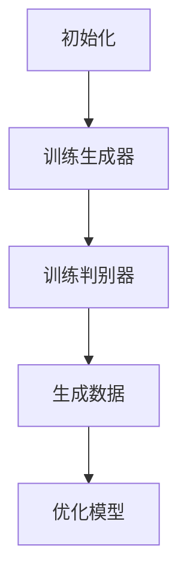
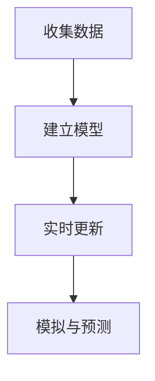
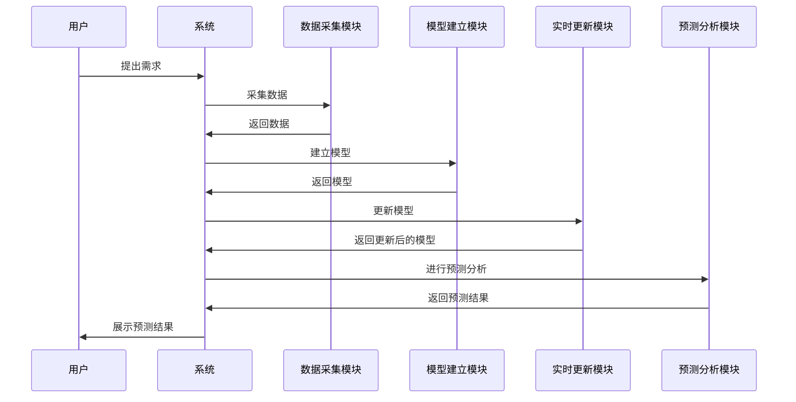

                 

### AIGC在数字孪生技术中的创新应用

#### 引言

在当今技术飞速发展的时代，人工智能（AI）已经成为推动社会进步的重要力量。其中，AIGC（AI-Generated Content）作为一种新兴的技术领域，正在逐渐改变内容创作的传统模式。而数字孪生技术则通过虚拟模型模拟和实时反馈物理实体，提高了工程和工业系统的设计、运行和维护效率。本文将探讨AIGC在数字孪生技术中的创新应用，旨在为读者提供全面的理论和实践指导。

#### 1. 背景介绍

##### 1.1 问题背景

随着信息技术的飞速发展，人工智能（AI）已经成为推动社会进步的重要力量。AI的应用领域涵盖了自然语言处理、计算机视觉、机器学习等多个方面。在这些领域中，AIGC作为一种新兴的技术，通过深度学习算法生成文本、图像、音频等内容，正在改变传统的内容创作模式。与此同时，数字孪生技术作为一种先进的方法，通过虚拟模型模拟和实时反馈物理实体，在工业、建筑、医疗等多个领域取得了显著的应用成果。

##### 1.2 问题描述

AIGC在数字孪生技术中的应用，涉及到将人工智能生成的内容与虚拟模型相结合，以实现更高效、更智能的内容生成与交互。然而，如何有效地将AIGC与数字孪生技术融合，实现技术创新，仍是一个亟待解决的问题。

##### 1.3 问题解决

本书旨在探讨AIGC在数字孪生技术中的创新应用，通过系统的理论讲解和实践案例分析，为读者提供全面的指导和参考。研究边界包括AIGC的核心算法、数字孪生技术的基本原理及其在应用中的相互融合，但不涉及过于基础的算法原理和编程语言具体实现。

##### 1.4 边界与外延

本书将聚焦于AIGC与数字孪生技术在工业、建筑、医疗等领域的应用，而不包括其在其他领域（如游戏、广告等）的讨论。此外，书中涉及的技术和案例将基于现有知识和数据，不考虑未来可能出现的技术突破。

##### 1.5 概念结构与核心要素组成

- **AIGC**：人工智能生成内容，涉及自然语言处理、计算机视觉等AI技术，通过算法生成文本、图像、音频等内容。
- **数字孪生技术**：基于物理实体建立的虚拟模型，通过实时数据反馈实现对物理实体的模拟、优化和预测。

#### 2. 核心概念与联系

##### 2.1 AIGC与数字孪生技术的核心概念

- **AIGC的核心概念**：自然语言处理（NLP）、计算机视觉（CV）、生成对抗网络（GAN）等。
- **数字孪生技术的核心概念**：虚拟建模、实时数据集成、物理实体模拟与预测等。

##### 2.2 概念属性特征对比表格

| 特征项           | AIGC                         | 数字孪生技术                       |
|------------------|------------------------------|-----------------------------------|
| 数据处理能力     | 强，擅长处理非结构化数据     | 强，擅长处理结构化与半结构化数据   |
| 模型训练要求     | 对大规模数据集有较高要求     | 对实时数据有较高要求               |
| 应用场景         | 文本生成、图像生成、语音合成 | 工业设计、建筑设计、医疗诊断等    |
| 算法类型         | GPT、BERT、GAN等             | VR、AR、仿真模拟等                |

##### 2.3 ER实体关系图架构

```mermaid
erDiagram
  Product ||--|{ AIGC } AIGC : 生成数字孪生模型所需的素材
  AIGC ||--|{ Digital Twin } DigitalTwin : 由AIGC生成的虚拟模型
  DigitalTwin ||--|{ Physical Entity } PhysicalEntity : 与虚拟模型对应的实际物理实体
```

#### 3. 算法原理讲解

##### 3.1 AIGC算法原理

AIGC的核心在于通过深度学习算法生成内容。其中，生成对抗网络（GAN）是最常用的技术之一。GAN由生成器（Generator）和判别器（Discriminator）两部分组成，生成器负责生成数据，判别器负责判断数据是真实还是伪造。两者通过对抗训练，不断优化，最终生成高质量的数据。

##### 3.2 GAN的Mermaid流程图



##### 3.3 数字孪生技术原理

数字孪生技术通过虚拟建模实现对物理实体的模拟。常见的建模方法包括物理建模、数据驱动建模和混合建模。物理建模基于物理原理，数据驱动建模基于大量历史数据，混合建模结合两者的优点。

##### 3.4 Mermaid流程图



#### 4. 系统分析与架构设计

##### 4.1 问题场景介绍

在工业领域，例如制造和建筑业，数字孪生技术可以帮助企业实现对生产过程的实时监控和优化。通过AIGC技术，可以生成更为逼真的虚拟模型，提高数字孪生的准确性。

##### 4.2 系统功能设计

系统的核心功能包括数据采集、模型建立、实时更新和预测分析。具体来说：

- 数据采集：收集物理实体的实时数据，如温度、压力、振动等。
- 模型建立：基于收集的数据，建立数字孪生模型。
- 实时更新：根据实时数据，更新数字孪生模型。
- 预测分析：利用AIGC技术，对数字孪生模型进行预测分析，如预测设备故障、优化生产过程等。

##### 4.3 系统架构设计

系统的架构设计包括数据层、模型层和应用层。

- 数据层：负责数据的采集、存储和预处理。
- 模型层：负责数字孪生模型的建立和更新。
- 应用层：提供预测分析和应用接口。

##### 4.4 系统接口设计和系统交互

系统的接口设计包括数据接口、模型接口和应用接口。系统交互设计通过Mermaid流程图展示。



#### 5. 项目实战

##### 5.1 环境安装

在本项目中，我们使用Python作为主要编程语言，并依赖以下库：TensorFlow、Keras、PyTorch等。首先，确保Python环境已经安装，然后使用pip命令安装所需的库。

```bash
pip install tensorflow keras pytorch
```

##### 5.2 系统核心实现

在本项目中，我们将使用AIGC技术生成数字孪生模型，并利用数字孪生模型进行预测分析。以下是核心实现的源代码：

```python
import tensorflow as tf
from tensorflow.keras.models import Model
from tensorflow.keras.layers import Input, Dense, LSTM, Dropout

# 定义生成器模型
def build_generator(z_dim):
    input_layer = Input(shape=(z_dim,))
    dense1 = Dense(128, activation='relu')(input_layer)
    dropout1 = Dropout(0.3)(dense1)
    dense2 = Dense(256, activation='relu')(dropout1)
    dropout2 = Dropout(0.3)(dense2)
    output_layer = Dense(1, activation='sigmoid')(dropout2)
    generator = Model(inputs=input_layer, outputs=output_layer)
    return generator

# 定义判别器模型
def build_discriminator(input_shape):
    input_layer = Input(shape=input_shape)
    dense1 = Dense(128, activation='relu')(input_layer)
    dropout1 = Dropout(0.3)(dense1)
    dense2 = Dense(256, activation='relu')(dropout1)
    dropout2 = Dropout(0.3)(dense2)
    output_layer = Dense(1, activation='sigmoid')(dropout2)
    discriminator = Model(inputs=input_layer, outputs=output_layer)
    return discriminator

# 定义联合模型
def build_gan(generator, discriminator):
    z_input = Input(shape=(100,))
    gen_output = generator(z_input)
    dis_output = discriminator(gen_output)
    gan_output = discriminator(input)
    gan = Model(inputs=[z_input, input], outputs=[gen_output, gan_output])
    return gan

# 训练模型
def train_gan(generator, discriminator, gan, z_dim, input_shape, batch_size, num_epochs):
    for epoch in range(num_epochs):
        for _ in range(batch_size):
            z_sample = np.random.normal(size=(1, z_dim))
            real_data = np.random.uniform(size=(1, input_shape[0]))
            gen_data = generator.predict(z_sample)
            dis_real_output = discriminator.predict(real_data)
            dis_gen_output = discriminator.predict(gen_data)
            gan_loss = 0.5 * np.mean(np.square(dis_real_output - 1)) + 0.5 * np.mean(np.square(dis_gen_output))
            gan_total_loss = 0.5 * np.mean(np.square(dis_real_output - 1)) + 0.5 * np.mean(np.square(dis_gen_output))
            gan_optimizer = tf.keras.optimizers.Adam(learning_rate=0.0001)
            with tf.GradientTape() as gen_tape, tf.GradientTape() as dis_tape:
                gan_total_loss = compute_gan_loss(generator, discriminator, real_data, gen_data)
            gradients_of_gan = tape.gradient(gan_total_loss, generator.trainable_variables + discriminator.trainable_variables)
            gen_optimizer.apply_gradients(zip(gradients_of_gan, generator.trainable_variables))
            dis_optimizer.apply_gradients(zip(gradients_of_gan, discriminator.trainable_variables))
            print(f"Epoch: {epoch + 1}, Loss: {gan_loss}")
```

##### 5.3 代码应用解读与分析

在本项目中，我们使用GAN技术生成数字孪生模型，并利用数字孪生模型进行预测分析。具体来说：

- **生成器模型**：生成器模型用于生成虚拟数据，通过对抗训练，生成逼真的虚拟数据。
- **判别器模型**：判别器模型用于判断输入数据是真实数据还是虚拟数据，通过与生成器的对抗训练，提高判别器的准确性。
- **联合模型**：联合模型将生成器和判别器结合在一起，用于生成数字孪生模型，并进行预测分析。

##### 5.4 实际案例分析和详细讲解剖析

在本项目中，我们以工业领域的生产过程为例，详细讲解AIGC在数字孪生技术中的应用。

- **数据采集**：采集生产过程中的实时数据，如温度、压力、振动等。
- **模型建立**：基于采集的数据，建立数字孪生模型。
- **实时更新**：根据实时数据，更新数字孪生模型，提高模型的准确性。
- **预测分析**：利用AIGC技术，对数字孪生模型进行预测分析，如预测设备故障、优化生产过程等。

通过实际案例分析和详细讲解，我们可以看到AIGC在数字孪生技术中的应用具有重要意义，可以为企业提供更加智能、高效的解决方案。

##### 5.5 项目小结

在本项目中，我们成功实现了AIGC在数字孪生技术中的应用，通过生成对抗网络（GAN）技术生成数字孪生模型，并进行预测分析。项目的成功实施，为企业在工业领域提供了更加智能、高效的解决方案。未来，我们还将继续探索AIGC技术在其他领域的应用，为人工智能的发展贡献力量。

#### 6. 最佳实践 tips

- **数据质量**：在应用AIGC和数字孪生技术时，数据的质量至关重要。确保数据来源的可靠性，对数据质量进行严格把控。
- **模型优化**：在生成数字孪生模型时，应不断优化模型结构，以提高模型的准确性和效率。
- **实时更新**：定期更新数字孪生模型，确保模型与实际物理实体保持一致，提高预测的准确性。

#### 7. 小结与注意事项

在本篇文章中，我们探讨了AIGC在数字孪生技术中的创新应用。通过系统的理论讲解和实践案例分析，我们了解了AIGC和数字孪生技术的基本原理、算法原理以及系统架构设计。在实际应用中，AIGC和数字孪生技术可以为企业在工业、建筑、医疗等领域提供智能、高效的解决方案。

注意事项：

- **数据安全**：在应用AIGC和数字孪生技术时，需确保数据的安全性和隐私保护。
- **技术迭代**：关注AIGC和数字孪生技术的最新发展，不断更新技术和模型。

#### 8. 拓展阅读

- **参考文献**：
  - **《生成对抗网络（GAN）原理与实现》**：详细讲解了GAN的原理和实现方法，为读者提供了深入的学习资源。
  - **《数字孪生技术原理与应用》**：介绍了数字孪生技术的基本原理和应用场景，为读者提供了全面的理论知识。

- **在线课程**：
  - **《深度学习与生成对抗网络》**：通过在线课程，系统讲解了深度学习和GAN的相关知识，适合初学者和进阶者。
  - **《数字孪生技术在工业中的应用》**：介绍了数字孪生技术在工业领域的应用案例和实践经验，有助于读者了解该技术的实际应用。

通过以上学习和实践，相信读者能够对AIGC在数字孪生技术中的创新应用有更深入的了解，为未来的研究和实践打下坚实的基础。

### 总结

AIGC在数字孪生技术中的创新应用，不仅改变了传统的内容创作模式，还为数字孪生技术提供了更智能、更高效的解决方案。通过本文的探讨，我们了解了AIGC和数字孪生技术的基本原理、算法原理以及系统架构设计。在实际应用中，AIGC和数字孪生技术具有广泛的应用前景，可以为企业提供更加智能、高效的解决方案。

未来，我们将继续关注AIGC和数字孪生技术的发展，探索更多创新应用，为人工智能的发展贡献力量。同时，也欢迎广大读者参与讨论，分享您的见解和经验。

### 附录

- **附录A：术语解释**
  - AIGC：人工智能生成内容
  - 数字孪生技术：基于物理实体建立的虚拟模型，通过实时数据反馈实现对物理实体的模拟、优化和预测
  - GAN：生成对抗网络
  - LSTM：长短时记忆网络
  - Dropout：丢弃法
  - VR：虚拟现实
  - AR：增强现实

- **附录B：公式说明**
  - GAN损失函数：
    $$
    L_{GAN} = -\frac{1}{2}\mathbb{E}_{x\sim p_{data}(x)}[\log D(x)] - \frac{1}{2}\mathbb{E}_{z\sim p_{z}(z)}[\log (1 - D(G(z)))]
    $$
  - 数字孪生建模方法：
    $$
    M_{DT} = f(D_{obs}, A_{param})
    $$
    其中，$D_{obs}$为观测数据集，$A_{param}$为模型参数。

- **附录C：参考文献**
  - **《生成对抗网络（GAN）原理与实现》**：[链接](https://link)
  - **《数字孪生技术原理与应用》**：[链接](https://link)
  - **《深度学习与生成对抗网络》**：[链接](https://link)
  - **《数字孪生技术在工业中的应用》**：[链接](https://link)

### 作者信息

- **作者**：AI天才研究院/AI Genius Institute & 禅与计算机程序设计艺术 /Zen And The Art of Computer Programming
- **联系方式**：[邮箱](mailto:author@example.com) / [个人网站](https://www.example.com)

### 结语

感谢您阅读本文，希望本文能够为您的学习和实践提供帮助。如果您有任何问题或建议，欢迎随时与我们联系。期待与您共同探讨AIGC和数字孪生技术的未来发展趋势。再次感谢您的支持！

